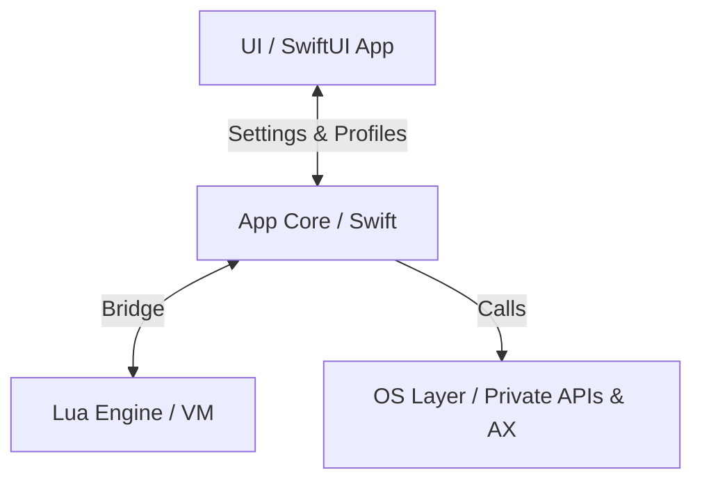

<!-- GENERATED from AGENTS.md by scripts/build-agent-brief.sh
     DO NOT EDIT. Regenerate after editing AGENTS.md.
     source-sha256: fc5a530da32f4036ac421eb16f5266d62fe7538e1ccce34e5b3deae75a0b3f1c -->

# KiwiDesk — Agent & Contributor Guidelines

Binding rules for human devs and AI agents on this repo. Read before modifying any code.

This file canonical source. Claude Code loads caveman-compressed brief from it (`.claude/AGENTS.brief.md`, built by `scripts/build-agent-brief.sh`) to save per-session context; regenerate brief whenever you edit this file. Other agents (Cursor, Codex) and humans read this file direct.

---

## 1. Project Overview

KiwiDesk = tiling window manager for macOS (Swift, SwiftUI, Lua). Manages windows in **flat, one-dimensional array per space** — never hierarchical trees. Layout algorithms = pure functions over that array.

Module layout (SwiftPM targets):

| Target | Path | Responsibility |
|---|---|---|
| `KiwiDeskCore` | `Sources/KiwiDeskCore` | State, events, OS bridge |
| `KiwiDesk` | `Sources/KiwiDesk` | Executable, menu bar, GUI |
| `KiwiDeskCoreTests` | `Tests/KiwiDeskCoreTests` | Unit tests |

Swift core stay strictly separated from SwiftUI GUI and (later) Lua VM.

Subsystem map (`Sources/KiwiDeskCore/*`) — directory-level, not file list; grep within subsystem for specifics:

| Dir | Responsibility |
|---|---|
| `State` | Flat `[WindowID]`-per-space window state |
| `Tiling` | Placing windows from state into layouts |
| `Layouts` | Pure layout algorithms over flat array |
| `Commands` | Command dispatch (the `set_*` verbs) |
| `Config` | Decoding Lua/profile config into settings |
| `Profiles` | Profile JSON load/save & defaults |
| `Appearance` | Color palettes (bundled + user, one-shot apply) |
| `Lua` | Lua VM bridge, watchdog, registry refs |
| `AX` | Accessibility bridge & `AXObserver` callbacks |
| `OS` | Private SkyLight/CGS symbols via `dlsym`, AX fallback |
| `Keys` | Carbon hotkey registration |
| `Events` | Event listening / mouse drag taps |
| `Tabs` | Native-tab reconciliation (`windowRekeyed` coalescing) |
| `Animation` | Per-monitor `DisplayLink` animation |
| `IPC` | CLI / external command IPC |
| `Bar` | In-app App Bar & Space Bar overlays |
| `Borders` | Focus & sticky overlays (rings, sticky marks) |
| `Power` | Power / display-state handling |
| `Permissions` | AX / permission prompts |
| `Localization` | `L()` string routing & locale catalogs |
| `App` | Core bootstrap & wiring |
| `Models` | Shared value types |
| `Service` | Long-running service glue |
| `Resources` | Bundled assets (locales, vendored app font, palettes) (assets, not code) |

GUI lives in `Sources/KiwiDesk`: section bodies in `Settings/Sections/`, widgets in `Settings/Components/<area>/` (Layouts, Keybindings, Bars, SpaceOverrides, Icons, Appearance, Lua, Common), shell/model files plus root-composed widgets at `Settings/` root. `Common/` admits only primitives shared across multiple component areas; root-owned widgets stay at `Settings/` root.

This table = *where*. For *how* — end-to-end pipelines (event→placement, command dispatch, config resolve, animation) traced at directory altitude — see **`docs/architecture.md`**.

## 2. Code Rules

1. **File size:** target **100–250 lines** per Swift file. Hard ceiling **350 lines** (only cohesive, performance-critical logic). Split before growing past ceiling.
2. **Line length:** max **79 characters** per line. Enforced by pre-commit hook and CI (`scripts/lint.sh`).
3. **Single Responsibility:** one class/struct = one job (event listening, layout math, IPC — never mixed).
4. **DRY vs. readability:** extract shared helpers (`AXHelper`, `GeometryUtils`) instead of duplicating, but prefer small readable duplication over deep protocol hierarchy or heavy generics. Keep code flat.
5. **Formatting:** `swift format` with repo's `.swift-format` config owns all style (whitespace, commas, braces). SwiftLint (SPM build plugin, `.swiftlint.yml`) owns semantic rules (force casts, complexity, file length), warns direct in Xcode during builds. Never enable SwiftLint style rule that fights swift-format. Run `scripts/lint.sh` before committing.
6. **Concurrency:** AppKit/AX interaction is `@MainActor`. Pure state and layout code stay actor-free and unit-testable.
7. **GUI north-star — simplicity, intuitiveness, Apple-native feeling, in that order.** Settings app should feel like it belongs in macOS System Settings, not bespoke control panel. Native pattern exists → use it; unsure → ask `ui-designer` consult framed by these three priorities before inventing layout.
   Companion principle — **approachable by default, powerful on demand.** New user gets good tiling setup with almost no config; that simplicity must never *cap* what's achievable — beneath every easy surface is deeper layer (Lua config, profiles, advanced layouts, per-space overrides) there when wanted, never required to begin. Depth = capability user grows into, not cost paid upfront; simplicity-first is entry point, not ceiling (the #326 panel is the shape: glance surface with one "Edit in Settings…" bridge down to full editor). See `docs/design-decisions.md`; shared Settings control conventions (help affordance, control choice, row tiers) elaborated in `docs/ui-patterns.md`.
   Corollary — **the GUI curates, Lua is open.** GUI = opinionated gate deciding what most people *should* touch (safe defaults for rest); Lua = unrestricted power layer. Lua setter clamps or rejects only genuinely-broken / unrenderable values (invisible alpha, >1 factor, malformed color) — never to enforce taste or ratio the GUI keeps tidy. Risky-but-valid knob → hide from GUI, expose Lua-only, don't add guard that second-guesses power user (e.g. bars' `dim_factor` / `active_dim_factor`: Lua-only, clamped to legible range yet free to invert dim ladder).
   Settled conventions falling out of this (extend, don't relitigate): **group by topic, never by widget type** — toggle and control it gates = one decision, so toggle sits direct *above* control it gates, never in separate "toggles" block (colors, which gate nothing, may group by type for grid scannability); **grey, don't hide** control with no effect in current mode (#171), keeping disabled control visible and dimmed; **the live preview leads** its editor; **defer per-control "why" to contextual help** (planned `?` affordance, #94) rather than bloating labels or captions with glosses that would later duplicate it. Caption's job = label what's shown, not teach.

## 3. Workflow: Refine → Plan → Act → Verify

1. **Refine:** read relevant code and specs before proposing changes; clarify ambiguities first.
2. **Plan:** for features and major fixes, write short written plan (files to change, API surface, tests) before implementing.
3. **Act:** implement step by step; keep commits focused.
4. **Verify:** `swift build && swift test && scripts/lint.sh` for fast inner loop. **Release build** (`swift build -c release`) enables optimizer and stricter concurrency diagnostics (e.g. non-Sendable captures in `@Sendable` closures) that debug build silently misses. CI runs it as **parallel job** on every PR (#532), so no longer mandatory local step: run before committing when change touches concurrency, `@Sendable` boundaries, or `Sendable` conformances, otherwise let PR catch it. CI *reports* it, does not *block* on it — required status checks need branch protection, which this plan does not offer for private repo (#487 tracks move that would unlock it). So **read the `Release Build` job before merging**, run it locally for anything landing without PR.
5. **Document:** any user-visible behavior change updates matching docs in same change set — `docs/lua-reference.md` (Lua config & behavior, in *expects → does → example* form), `docs/user-guide.md` (Settings app & GUI flows), `docs/cli.md` (commands, events, IPC), `docs/recipes/` (integration recipes), `docs/design-decisions.md` (durable product/UX decision a contributor would otherwise re-litigate or undo — Principle, Rationale, Trade-off, or Map, per that file's charter; never event log or restatement of current behavior), `docs/ui-patterns.md` (when shared Settings control convention added or changed) — and `plan/` when design itself shifts. Code and docs must never describe different behavior.
   Marketing/docs **site (`site/`)** renders `docs/` through symlink, so doc *content* edits flow to it automatically — never hand-copy doc into `site/`. But site not fully covered by that symlink: **new doc page** needs sidebar entry in `site/astro.config.mjs`, and **site-only surfaces** (landing page, cross-page callouts) updated in same change set when feature warrants surfacing there — e.g. new layout mode (#128) adds its user-guide/reference prose *and* whatever nav or callout makes it findable. Run `npm run build` in `site/` when you touch either.
   When review or manual pass classifies behavior as **accepted-by-architecture**, adds row to *Accepted limitations* page (`docs/accepted-limitations.md`) in same change set — user-facing twin of §5 guardrail rule (OS-blocked-by-SIP items = separate class, kept in `docs/design-decisions.md`, no in-app escape hatch).
6. **Review:** once substantial change finished, verified, committed, spin up **both** `code-reviewer` and `architect-reviewer` on diff since last review point — branch's merge base with `main`, or last reviewed commit / PR if one exists. Address or consciously dismiss findings before opening PR. (See §4 subagent delegation.)

   Sequencing: first round runs both agents **in parallel** — diff finished, perspectives independent, serializing only costs time. When resulting fix batch itself substantial (new abstractions, behavioral gates — not just comment or guard tweaks), run focused re-review of **only fix range**, this time **sequentially**: `code-reviewer` first (are fixes correct?), then `architect-reviewer` (do seams fixes introduced hold up?). Alternate rounds until one returns no major findings. Brief each re-review with what fixes claim to do, so it verifies claims instead of re-reviewing feature.

   Agent reuse (decision 2026-07-13): round 1 always uses **fresh** agents — independence is point, and reviewer carrying opinions from earlier feature anchors on them. Re-reviews of fix batch in **same session** go back to **round-1 agent** (message it) instead of spawning new one: it already holds diff and its own findings, so verifies "were my findings fixed" direct instead of re-deriving whole context. Across sessions moot — subagent context dies with session, so new session always means fresh agents.

   Reuse by **cache warmth**, not just session boundary (decision 2026-07-17): reusing round-1 agent only wins while its context still cache-warm — then cheapest and keeps own findings. After long gap (many edits, slow rebuild) cache cooled, so resuming reloads whole now-stale transcript uncached — large context just to answer small question. In that case **fresh** agent with tight "here's what each fix claims to do" brief usually cheaper and nearly as good, trading agent's memory of findings for small cold start. So: reuse while warm; go fresh once cooled (or across sessions). If reuse target stopped or died, fresh is only option — brief it fully. And re-review loop itself gated on substance: substantial fix batch earns round, lone comment or guard tweak that closes finding does not — self-verify it and stop.

### Branching & Pull Requests

Branch from `main` with name matching Conventional Commit type: `feat/`, `fix/`, `refactor/`, `docs/`, `test/`, `chore/`, `ci/`, `perf/`, etc., followed by short kebab-case description (e.g., `feat/scrolling-snap-mode`). One focused change per branch; separate refactors from features.

When opening issue or pull request, use GitHub [issue templates](.github/ISSUE_TEMPLATE/) and [PR template](.github/pull_request_template.md). Reference related issues in commit messages or PR descriptions using `fixes #123` syntax.

### Commit messages (Angular / Conventional Commits)

Format: `type(scope): subject` — imperative, lower-case subject, no trailing period. Body (optional) explains why, wrapped at 72 columns.

- Types: `feat`, `fix`, `perf`, `refactor`, `docs`, `test`, `build`, `ci`, `chore`.
- Scope = touched area, e.g. `animation`, `tiling`, `layout`, `commands`, `lua`, `ax`, `profiles`, `docs`. Omit when change is repo-wide.
- Examples:
  - `feat(layout): add stack.set_overflow_style`
  - `fix(tiling): defer z-order restore until animations settle`
  - `perf(animation): apply position-only frames per app`

## 4. Tooling

- Shared automation lives in visible `/scripts/` directory (never hidden in dot-folders): lint, git hooks, localization scripts.
- Install hooks once per clone: `./scripts/install-hooks.sh`.
- Fetch third-party subagents per clone with one explicit target: `./scripts/install-subagents.sh --claude` installs Claude Code agents and workspace skills; `./scripts/install-subagents.sh
  --codex` installs project-scoped Codex agents.
- (Optional, per-developer) install `caveman` skill to compress agent output — not build dependency; needs Node `>= 18` (installer checks): `npx -y github:JuliusBrussee/caveman --non-interactive`. `--non-interactive` avoids hang when piped; append flags to scope it, e.g. `--only claude`, `--minimal`, `--uninstall`.
- Regenerate compressed agent brief after editing this file: `./scripts/build-agent-brief.sh` (needs caveman + `claude` CLI or `ANTHROPIC_API_KEY`). Compression = full-document LLM pass, commonly takes **several minutes** — run in background, not under short (e.g. 2-minute) timeout that would kill it mid-pass; slow is not hung. `scripts/lint.sh` runs `scripts/check-agent-brief.sh`, which only warns (never blocks) if brief stale — so editing this file needs no caveman install; brief just drifts until someone rebuilds it.

### Subagent delegation (AI agents)

When subagents available, spin off proactively — no need to wait for user to ask — but only where payoff clear. Subagent starts with zero conversation context, so delegate work that does not depend on it:

- **Broad fan-out searches** across many files or naming conventions where only conclusion matters (`Explore`).
- **Independent review passes** on finished, substantial change (`code-reviewer`, `architect-reviewer`).
- **Parallel, isolated implementation work** (e.g. separate worktree) that would otherwise serialize.

Stay inline for anything small, sequential, or dependent on conversation context: cold agent re-deriving what session already knows costs more than it saves.
- CI (`.github/workflows/ci.yml`) builds, lints, tests on every push and on PRs targeting `main`. Red build blocks merging.

## 5. Guardrails (Known Pitfalls)

Keep list updated whenever recurring mistake found.

- **Pre-release, single user: no backward-compat shims.** Nothing publicly released, so nothing external depends on current command names, Lua/CLI verbs, event names, or file formats. Rename and restructure freely; do **not** add compatibility aliases, deprecation layers, or migration scripts — re-saving or re-editing config is migration (#42 renamed space commands outright instead of keeping `*_virtual_space` aliases; profile JSON likewise needs none). Revisit at first public release — until then, back-compat is wasted complexity.
- **One vocabulary across Lua and profile JSON.** Profile JSON key = Lua command name with `set_` verb stripped, snake_case, grouped by namespace: `set_gap_override` → `gap.override`, `bsp.set_ratio_h` → `layout.bsp.ratio_h`, `stack.set_master_ratio` → `layout.stack.master_ratio`. Multi-part element names nest further when element is configurable unit: `drag.set_ghost_fill_color` → `drag.ghost.fill_color`. Groups singular (`gap`, `layout`, `drag`); never invent synonyms or plurals. When adding setting, pick Lua name first and derive JSON key from it via `CodingKeys` (Swift property names may differ internally). `SettingsCodingTests` pins this shape.
- **Never disable SIP or ask users to.** Private SkyLight/CGS symbols resolved at runtime via `dlsym` (`SkyLight.swift`), never linked with `@_silgen_name` — linked symbol that disappears in macOS update would crash app at launch, while failed lookup returns nil and caller falls back to public Accessibility API (`AXUIElement`). Every private fast path must have such fallback.
- **Lua watchdog cannot interrupt blocking C calls.** Runaway-script guard = instruction-count hook; code that blocks inside C (`system()`, pipe reads) executes zero VM instructions and freezes main thread forever. Never add API that blocks in C on main thread — external commands always go through `ExecLauncher`. Lua registry refs (`luaL_ref`) are VM-specific and their slots reused: never deliver ref into different interpreter than one that minted it (capture owning `LuaInterpreter` weakly, as `KiwiCore+ExecAPI` does).
- **AX calls slow and can block.** Never call AX APIs inside tight loops or layout math; snapshot state first.
- **Electron/WebKit apps answer AX queries lazily** (100–300 ms). `AXEnhancedUserInterface` set to `true` on managed apps to keep their AX tree warm; do not remove without replacement.
- **Windows live in flat `[WindowID]` per space.** Do not introduce tree/container structures into state or layout code.
- **Display SIZE enters layout through one hook (#531).** Layout slots, track capacity and resize spans read bounds from `TilingEngine.visibleBounds` (default: screen's `axVisibleFrame`), never `GeometryUtils.axVisibleFrame` direct — `VisibleBoundsRoutingTests` scans `Tiling`, `Layouts`, `Commands` and fails on unlisted direct call. Pins **size, not topology**: which screen a space lands on still comes from `NSScreen` through static `screen(…)` resolvers, so fixture can shrink its display but not fabricate second one. Outside hook, by reason not category: `screen(containing:)` and `looksStashed` are `static`; stash parking *enumerates* `NSScreen.screens` to pick corner, which one rect would collapse; bar strips and float nudge / re-anchor draw on physical screen. So fixture driving `calculatedFrames`, `trackCapacity` or resize fully pinned, one driving whole `retile` not. **Every geometry fixture pins its own rect** (`core.tiler.visibleBounds = { _ in rect }`) rather than inheriting host's real `NSScreen`, and pins any default it reasons from (`#expect(minWindowSize == 300)`): inherited display makes test assert whatever machine happens to be, and narrow CI runner then builds *different* arrangement from same code (#523 — below `2 * min_window_size` BSP correctly falls back to `OverlapStack` pile, so three reachability assertions failed on runner and passed on dev Mac). Reproduce CI-only geometry failure by **raising `min_window_size` until same threshold trips**, not by chasing screen size; pile's signature = equal `minX` with midYs exactly `OverlapStack.offset` (40 pt, vertical-only) apart.
- **macOS native tabs = one `NSWindow` per tab, coalesced temporally.** Finder/Terminal/Ghostty native tabs = separate `NSWindow`s sharing one on-screen frame, each with own `CGWindowID`, and **only active tab ever visible to AX** — background tabs never appear in `kAXWindowsAttribute`, and fresh id minted per switch (#308 probe). So tab switch surfaces to reconcile as one window vanishing while another appears at same frame; `TabReconciler` coalesces that pair into `.windowRekeyed` (id swapped in place — no tree, one slot per group) instead of destroy + create. Gate needs `AXTabGroup` on **either** side (Ghostty exposes one only at 2+ tabs, so 1↔2 boundary window has none). Coalescing suppressed on native-Space-switch `reconcileAll` (`coalesceTabs: false`) — same-app windows across spaces tile to identical frames and would false-merge. When editing tracking/reconcile, keep these facts in view; never assume window's `CGWindowID` stable or that every tab is AX window.
- **Cross-layout logic must account for each layout's navigation model.** Anything spanning all layouts — focus/swap navigation, overflow handling, geometric neighbor search — must consider whether layout is *geometric* (neighbor search over calculated slots) or *array-order* (steps flat array), and whether it can produce *overflow pile* (`OverlapStack` cascade). Two models need different handling (e.g. #172: exclude pile-mates from geometric candidate set vs skip their array indices; shared detector = `Navigation.pileMates`). Authoritative map = "Layout navigation & overflow models" table in `docs/design-decisions.md` — **new layout must add its row** there.
- **Space identifiers are strings** and case-sensitive; numeric strings and integers equivalent (`"1"` == `1`).
- **Hotkeys use Carbon API** (`RegisterEventHotKey`), not CGEventTap — avoids Input Monitoring permission. Event taps only for mouse drag tracking.
- **One `DisplayLink` per monitor** (mixed refresh rates). Never drive animations from single global timer.
- **`AXObserver` callbacks arrive on thread's run loop** that registered them; keep observer registration on main thread.
- **SwiftUI cursor changes use `NSCursor.set()`, never push/pop.** View removed under pointer (link that deletes itself, row rebuilt by rename) never delivers balancing `onHover(false)`, and hover interleaved with drag gesture pops wrong entry — cursor stack cannot balance. Bit spaces drag handle and link-hover modifier.
- **Keep SwiftUI `body` shallow container.** Long modifier chain with conditional `background`/`overlay` closures or `+`-concatenated string literals inside one `body` expression can exceed type-checker's budget — and failure machine-dependent: compiles locally but dies on slower CI runner ("unable to type-check this expression in reasonable time"), so local verify gate does not catch it. Extract chained subviews into private computed properties / funcs and hoist concatenated strings into constants. Bit `KeyRecorderField`.
- **Split test suites early.** 79-char limit and 350-line ceiling repeatedly bit large test files. Break suites into focused files before they grow; per-file private helpers = convention and small duplication across suites is fine. Three ratified exceptions, all *stateless primitives* with no setup/teardown coupling and no assertions of own: `ReflectionParity.swift` (structural-parity reflection helpers backing field-list guards), `ScriptFixture.swift` (spawn a `scripts/*` tool and drain its pipes, plus repo-shaped temp tree the `__file__`-rooted scripts need), and `SourceScan.swift` (delimiter walker and file enumerator the source-scanning parity guards share — over-matching divergent copy makes guard pass for wrong reason, exact failure those guards exist to prevent). Bar = **drift risk** — divergent copy weakens guard, or silently changes what suite observes — not copy count, which is merely evidence that prompted look (script harness extracted at fifth hand-copy, in #252). Duplication that only costs lines stays duplicated (§2.4). Further exception needs same case made.
- **Async test that awaits real spawned work needs generous hang-guard, not tight deadline (#344).** Test that spawns real subprocess (`ExecTests`) or schedules unstructured `Task` (`DragCoordinatorTests`) and then awaits its **main-actor callback** cannot use sub-second or few-second poll deadline: swift-testing runs suites concurrently, so under full-suite load shared main actor is starved for seconds and tight deadline tripped spuriously (callback landed, just late) while suite passed in isolation. Fixed by giving each such wait one shared generous hang-guard (`execHangGuard` / `dragSettleHangGuard`, 30s): poll exits instant condition holds, so passing run never slowed — deadline only bounds genuine hang. Prove *behavior* by gap (short watchdog against much longer sleep), never by tight wait. New async tests here follow suit.
- **Unit tests never need running app; device QA launches it direct.** `swift test` fully self-contained (per-test `KiwiCore` over temp config dir, throwaway sockets; service tests only parse `launchctl` strings) — app's run state irrelevant to it. Running app matters only for device QA, and there launch DIRECT in terminal (`.build/release/KiwiDesk` — Ctrl-C to stop, `NSLog` output visible, incl. #292 preflight-denial and settle lines), not via `service start`; stop service first if loaded, or single-instance guard keeps OLD binary running. Every release rebuild changes binary hash, which drops TCC Accessibility grant (re-grant in System Settings) and restart flattens session state (spaces, float flags) — plan QA around it; durable fix = #89's signed .app bundle. Run full suite as `swift test --skip ExecTests` then `swift test --filter ExecTests`: combined it stalls for minutes at tail (spawned exec children hold runner's pipe, and #344 hang-guards crawl under full-suite starvation — #489 tracks root fix); suite *ordering* not a lever, swift-testing schedules suites concurrently.
- **Discardable test results must express side-effect intent.** When command or setup helper primarily mutates state but also returns optional convenience data, mark declaration `@discardableResult` if valid callers commonly ignore that data. Keep pure queries non-discardable — ignored result there is probably a bug. Test whose subject is command success or failure still asserts returned response; never remove tests or assertions merely to silence unused-result warning.
- **Profiles own tiling, plus sparse behavior overrides.** Profile serializes tiling state — belongs *inside* `TilingSettings` so it rides config split for free (see `gap.override`). Beyond tiling, profile may carry **sparse override of global _behavior_ setting** — one that shapes how workspace behaves *while profile active*: keybindings (`Profile.modes`), app→space rules (`Profile.appRules`), float rules (`Profile.floatRules`), ignore rules (`Profile.ignoreRules`). Global bases come from active config owner (`gui.json` or `init.lua`); profile layer resolves over either owner. Window-rule families resolve independently, with effective ignore remaining hard management gate. May **never** override setting that *routes or selects* profile itself (`profile_bindings`, native-Space→profile map) or that lives outside config ownership (GUI language pref, persists in `UserDefaults`) — profile that could rewrite what selects it is self-reference hazard. Every override = base overlaid with sparse diff (absent = inherit; explicit tombstone expresses removal), never second home for setting. Add each one deliberately, guarded by round-trip + resolve parity test. App→space uses value-map override; float and ignore share generic list-rule primitive because two real clients now remove drift (see `.claude/rules/parity-tests.md`). `ProfileManager` mutators `internal` by design — mutate through `KiwiCore` facade, never re-publicize them. `read(name:)` = public load-for-edit primitive (path-traversal guarded, touches no state); `save()` **adopts** (sets `currentName`, clears dirty), so edit-without-activating path must be separate, non-adopting write — never overload `save()`. GUI-vs-Lua ownership predicate centralized in `KiwiCore.isGuiManaged` (`KiwiCore+GuiConfig.swift`); refine that one predicate, never add second. Pre-release (single user): profile JSON needs no migration scripts — re-saving is migration.
- **Explicit settings applies must `retile(force: true)`.** Engine's "already there" tolerance (±2 pt per edge) exists to absorb AX-echo lag and app-side clamping; un-forced retile after config edit lets it swallow small changes entirely (1 pt gap edit visibly did nothing). Config-apply entry points (`applyProfileScopedState`, `set_gap_*`, `set_min_window_size`, `set_mode`, and whole `layoutCommand` dispatch — every retile triggered by explicit `set_*` from Lua/CLI) force; event-driven retiles stay un-forced so echo lag can't wobble windows. Profile applies classify themselves: `apply(profile:)` / `apply(composed:)` take **required** `forceRetile`, so every new caller must choose — explicit paths (`load_profile`, in-effect edit re-apply, post-reload re-apply, preset apply) force; monitor-change and native-space-binding applies stay un-forced.
- **Resolve before layout, and merge per-field first.** Settings that layer (global → layout → space) merge field-by-field, with cross-field clamps applied *last* on already-merged values (`AppBarStyle.resolved…` pattern). Resolution runs before layout math so layout functions stay pure over flat array.
- **Guard hand-mirrored field lists with forget-proof parity test.** Some patterns repeat struct's field list across sites — global ↔ optional-override mirror (`AppBarStyle` ↔ `LayoutAppBar`), dual apply switch (`AppBarCommandSetting`), manual sparse `Codable`. Small readable duplication fine (§2.4), but past **two** mirrors of same field list drift risk (add field, forget one site → silent data loss) outweighs clarity. Before adding third, weigh whether duplication still pays off; if it ships, **must** carry parity test — and prefer one that discovers fields by reflection / shared `CodingKeys` over hand-enumerated list, so guard itself cannot silently rot (hand-listed parity test = one more place to forget). Reflection net catches missing *property*, not forgotten `resolved()` / `encode` line — back it with round-trip + resolve-every-field test for those. Reach for generic/keypath merge only when it removes drift, not just `resolved()` lines — sparse `Codable` stays per-field either way, so generics rarely buy down real risk and fight §2.4.
- **`Resources/Locales/*.json` is generated/translation-owned (issue #9).** Every GUI string routes through `L("key", "English")` (`LocalizationManager.swift` in `KiwiDeskCore/Localization/`); English = source of truth, inlined at call site, with per-key fallback when locale omits key. Value interpolated into sentence (name, count) MUST go through `L(key, english, args...)` overload with POSITIONAL `%1$@`/`%1$d` specifiers, never `+`-concatenated fragments — translation can't reorder pieces stitched together in Swift, and many languages need to. `en.json` regenerated wholesale by `scripts/extract-keys` (scans both `Sources/KiwiDesk` and `Sources/KiwiDeskCore`, ignores `//`/`///` comments so doc-comment example call site can't leak phantom key) from real call sites — never hand-edit it, and AI agents must not hand-edit any `Resources/Locales/*.json` file: use `scripts/extract-keys <locale>` / `scripts/merge-keys <locale>` to translate, `scripts/rename-key <old> <new>` to rename key without losing translations, `scripts/drop-key <key>` to delete key's shipped translations when its English **meaning** changed — run in same change set, so every locale falls back to new English and key reappears on its to-translate list; cosmetic English edits (typo, punctuation) keep translations — and `scripts/extract-keys --prune` to drop orphaned ones (see `docs/translating.md`). Because same English text can in principle be authored at two different call sites for one key, `extract-keys` fails loudly on any such drift (mismatched English for same key) rather than silently picking one; `extract-keys --check` (run unconditionally by `scripts/lint.sh` — part of verify gate, CI, and `scripts/pre-commit` whenever Swift or locale file staged) additionally hard-fails if `en.json` stale or if any shipped `<locale>.json` doesn't decode as flat `{string: string}` map (broken file would otherwise make `LocaleCatalog` soft-fail to `[:]` and silently revert that locale to English); orphan key (in locale file, absent from code) only warns — clean up with `extract-keys --prune`. All backed by Swift tests — each localization script has sibling suite (`LocalizationDriftGuardTests`, `LocalizationOrphanTests`, `RenameKeyTests`, `DropKeyTests`, and future scripts follow suit) — so regression in tooling itself covered by `swift test`, not just by running script. GUI language pick persists in `UserDefaults` (`LocalizationPreference`), never `gui.json` — documented as side-effect-free and must never create sidecar or flip `KiwiCore.isGuiManaged`.