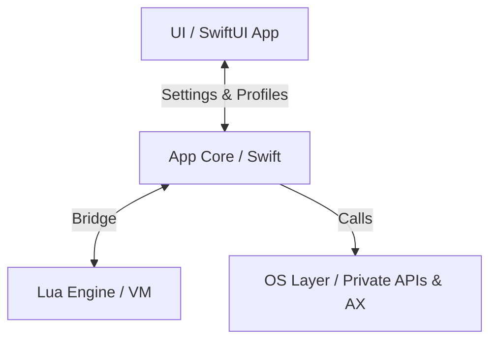

# KiwiDesk — Agent & Contributor Guidelines

Binding rules for human developers and AI agents working on this
repository. Read this file before modifying any code.

---

## 1. Project Overview

KiwiDesk is a tiling window manager for macOS (Swift, SwiftUI, Lua).
It manages windows in a **flat, one-dimensional array per space** —
never in hierarchical trees. Layout algorithms are pure functions
over that array.

Module layout (SwiftPM targets):

| Target | Path | Responsibility |
|---|---|---|
| `KiwiDeskCore` | `Sources/KiwiDeskCore` | State, events, OS bridge |
| `KiwiDesk` | `Sources/KiwiDesk` | Executable, menu bar, GUI |
| `KiwiDeskCoreTests` | `Tests/KiwiDeskCoreTests` | Unit tests |

The Swift core must stay strictly separated from the SwiftUI GUI
and (later) the Lua VM.

## 2. Code Rules

1. **File size:** target **100–250 lines** per Swift file. Hard
   ceiling: **350 lines** (only for cohesive, performance-critical
   logic). Split files before they grow past the ceiling.
2. **Line length:** max **79 characters** per line. Enforced by the
   pre-commit hook and CI (`scripts/lint.sh`).
3. **Single Responsibility:** one class/struct = one job (event
   listening, layout math, IPC — never mixed).
4. **DRY vs. readability:** extract shared helpers (`AXHelper`,
   `GeometryUtils`) instead of duplicating, but prefer a small,
   readable duplication over a deep protocol hierarchy or heavy
   generics. Keep code flat.
5. **Formatting:** `swift format` with the repo's `.swift-format`
   config owns all style (whitespace, commas, braces). SwiftLint
   (SPM build plugin, `.swiftlint.yml`) owns semantic rules
   (force casts, complexity, file length) and warns directly in
   Xcode during builds. Never enable a SwiftLint style rule that
   fights swift-format. Run `scripts/lint.sh` before committing.
6. **Concurrency:** AppKit/AX interaction is `@MainActor`. Pure
   state and layout code must stay actor-free and unit-testable.

## 3. Workflow: Refine → Plan → Act → Verify

1. **Refine:** read the relevant code and specs before proposing
   changes; clarify ambiguities first.
2. **Plan:** for features and major fixes, write a short written
   plan (files to change, API surface, tests) before implementing.
3. **Act:** implement step by step; keep commits focused.
4. **Verify:** `swift build && swift test && scripts/lint.sh` must
   pass before any commit.

## 4. Tooling

- Shared automation lives in the visible `/scripts/` directory
  (never hidden in dot-folders): lint, git hooks, localization
  scripts.
- Install hooks once per clone: `./scripts/install-hooks.sh`.
- CI (`.github/workflows/ci.yml`) builds, lints, and tests on every
  push and on PRs targeting `main`. A red build blocks merging.

## 5. Guardrails (Known Pitfalls)

Keep this list updated whenever a recurring mistake is found.

- **Never disable SIP or ask users to.** Private SkyLight/CGS
  symbols are resolved at runtime via `dlsym` (`SkyLight.swift`),
  never linked with `@_silgen_name` — a linked symbol that
  disappears in a macOS update would crash the app at launch,
  while a failed lookup returns nil and the caller falls back to
  the public Accessibility API (`AXUIElement`). Every private
  fast path must have such a fallback.
- **AX calls are slow and can block.** Never call AX APIs inside
  tight loops or layout math; snapshot state first.
- **Electron/WebKit apps answer AX queries lazily** (100–300 ms).
  `AXEnhancedUserInterface` is set to `true` on managed apps to keep
  their AX tree warm; do not remove this without a replacement.
- **Windows live in a flat `[WindowID]` per space.** Do not
  introduce tree/container structures into state or layout code.
- **Space identifiers are strings** and case-sensitive; numeric
  strings and integers are equivalent (`"1"` == `1`).
- **Hotkeys use the Carbon API** (`RegisterEventHotKey`), not
  CGEventTap — this avoids Input Monitoring permission. Event taps
  are only for mouse drag tracking.
- **One `DisplayLink` per monitor** (mixed refresh rates). Never
  drive animations from a single global timer.
- **`AXObserver` callbacks arrive on the thread's run loop** that
  registered them; keep observer registration on the main thread.
