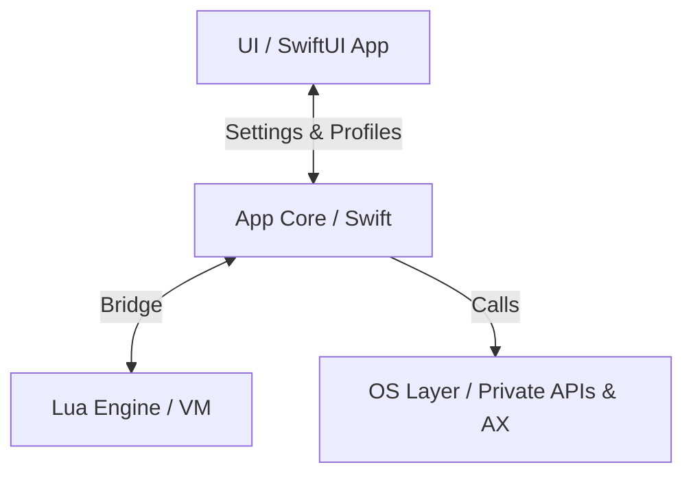

# KiwiDesk — Agent & Contributor Guidelines

Binding rules for human developers and AI agents working on this
repository. Read this file before modifying any code. Every agent
(Claude Code, Cursor, Codex) and human reads it directly.

## How this file is organized

This file is the **hub**: the project shape, the rules that apply
everywhere, and an index of the subsystem guardrails (§5).

The guardrails themselves — the long "here is why this bit us"
arguments — live one level down, in
[`.claude/rules/*.md`](.claude/rules/), **one file per subsystem**.
Each rule file is the canonical text for its subsystem; §5 carries
the rule in one line and links to it. When they would disagree,
the **rule file wins** and the §5 row is the thing to fix.

One deliberate exception to "state it once": the handful of
guardrails at the top of §5 are repeated verbatim in their rule
file. They are the ones that destroy something before a rule file
would ever load — a tree in the state model, a shipped `.app` that
`fatalError`s — so they earn a tripwire in the file every agent
already has. Aim to state everything else exactly once, and see
[rule-authoring.md](.claude/rules/rule-authoring.md) for which
kinds of sentence may be repeated safely and which may not.

§5 also carries **one** prose rule rather than a one-line row:
how to write a rule at all (#614). It is there because it is the
only rule whose subject is this delivery mechanism, and because a
reader who never edits a rule file — Cursor, Codex, a human
skimming the hub — would otherwise meet it nowhere. Its argument
still lives one level down, in
[rule-authoring.md](.claude/rules/rule-authoring.md). Do not read
it as licence for a second long paragraph in §5.

They live in `.claude/` because Claude Code auto-loads a rule file
whose `paths:` glob matches a file you are editing — so the right
guardrails arrive when they are relevant and cost nothing when
they are not. That placement is *only* about the loader. The files
are ordinary Markdown: humans and other agents reach them through
the §5 links, and §5 lists every one of them.

Two shelves, don't confuse them:

- **`docs/`** — the product: Lua reference, user guide, CLI,
  design decisions, accepted limitations. Ships to users through
  the site.
- **`.claude/rules/`** — the workshop: engineering guardrails for
  whoever changes the code.

---

## 1. Project Overview

KiwiDesk is a tiling window manager for macOS (Swift, SwiftUI,
Lua). It manages windows in a **flat, one-dimensional array per
space** — never in hierarchical trees. Layout algorithms are pure
functions over that array.

Module layout (SwiftPM targets):

| Target | Path | Responsibility |
|---|---|---|
| `KiwiDeskCore` | `Sources/KiwiDeskCore` | State, events, OS bridge |
| `KiwiDesk` | `Sources/KiwiDesk` | Executable, menu bar, GUI |
| `KiwiDeskCoreTests` | `Tests/KiwiDeskCoreTests` | Unit tests |
| `KiwiDeskGuiTests` | `Tests/KiwiDeskGuiTests` | GUI tests, plus the source-scanning parity guards (`SourceScan`) — which scan **both** trees, so a `KiwiDeskCore` invariant may be guarded from here |

The Swift core must stay strictly separated from the SwiftUI GUI
and (later) the Lua VM.

Subsystem map (`Sources/KiwiDeskCore/*`) — directory-level, not a
file list; grep within a subsystem for specifics:

| Dir | Responsibility |
|---|---|
| `State` | Flat `[WindowID]`-per-space window state |
| `Tiling` | Placing windows from state into layouts |
| `Layouts` | Pure layout algorithms over the flat array |
| `Commands` | Command dispatch (the `set_*` verbs), plus the z-order raise machinery every command path shares (`ZOrderDrain` and its policy) |
| `Config` | Decoding the Lua/profile config into settings |
| `Profiles` | Profile JSON load/save & defaults |
| `Appearance` | Color palettes (bundled + user, one-shot apply) |
| `Lua` | Lua VM bridge, watchdog, registry refs |
| `AX` | Accessibility bridge & `AXObserver` callbacks |
| `OS` | Private SkyLight/CGS symbols via `dlsym`, AX fallback |
| `Keys` | Carbon hotkey registration |
| `Events` | Event listening / mouse drag taps |
| `Tabs` | Native-tab reconciliation (`windowRekeyed` coalescing) |
| `Animation` | Per-monitor `DisplayLink` animation |
| `IPC` | CLI / external command IPC |
| `Bar` | In-app App Bar & Space Bar overlays |
| `Borders` | Focus & sticky overlays (rings, sticky marks) |
| `Power` | Power / display-state handling |
| `Permissions` | AX / permission prompts |
| `Localization` | `L()` string routing & locale catalogs |
| `App` | Core bootstrap & wiring |
| `Models` | Shared value types |
| `Service` | Long-running service glue |
| `Resources` | Bundled assets (locales, vendored app font, palettes) (assets, not code) |

The GUI lives in `Sources/KiwiDesk` — layout conventions in
[`.claude/rules/gui.md`](.claude/rules/gui.md).

This table is the *where*. For the *how* — end-to-end pipelines
(event→placement, command dispatch, config resolve, animation)
traced at directory altitude — see **`docs/architecture.md`**.

## 2. Code Rules

1. **File size:** target **100–250 lines** per Swift file. Hard
   ceiling **350** (only for cohesive, performance-critical
   logic). Split before you cross it.
2. **Line length:** max **79 characters**. Enforced by the
   pre-commit hook and CI (`scripts/lint.sh`).
3. **Single Responsibility:** one class/struct = one job (event
   listening, layout math, IPC — never mixed).
4. **DRY vs. readability:** extract shared helpers (`AXHelper`,
   `GeometryUtils`) instead of duplicating, but prefer a small,
   readable duplication over a deep protocol hierarchy or heavy
   generics. Keep code flat.
5. **Formatting:** `swift format` with the repo's `.swift-format`
   config owns all style, and `scripts/lint.sh` additionally
   enforces the §2.1 line-length and file-size limits. Linting is
   its own step, **not** a build-tool plugin — `Package.swift`
   carries why the SwiftLint prebuild plugin was removed, so
   `.swiftlint.yml` no longer runs during a build. Run
   `scripts/lint.sh` before committing — its **exit code**
   decides, not its warnings.
6. **Concurrency:** AppKit/AX interaction is `@MainActor`. Pure
   state and layout code stays actor-free and unit-testable.
7. **GUI north-star — simplicity, intuitiveness, Apple-native
   feeling, in that order**, and **approachable by default,
   powerful on demand**: "Apple-native" binds *behavior*
   (standard controls working the standard way), not the
   Settings GUI's visual idiom — the window's IA and look are
   KiwiDesk's own — and a new user should get a
   good setup with almost no configuration without that
   simplicity capping what Lua can reach. The full principle,
   its corollaries and the settled conventions that fall out of
   it are in [`.claude/rules/gui.md`](.claude/rules/gui.md);
   `docs/ui-patterns.md` holds the shared control conventions
   and `docs/design-decisions.md` the rulings behind them.

## 3. Workflow: Refine → Plan → Act → Verify

1. **Refine:** read the relevant code and specs before proposing
   changes; clarify ambiguities first.
2. **Plan:** for features and major fixes, write a short written
   plan (files to change, API surface, tests) before
   implementing.
3. **Act:** implement step by step; keep commits focused.
4. **Verify:** run the **`verify-gate` skill**
   ([`.claude/skills/verify-gate`](.claude/skills/verify-gate/SKILL.md))
   — `swift build`, the test run, `scripts/lint.sh`,
   and the release build when the change touches concurrency or
   `Sendable`. That skill owns the procedure — which gate a change
   earns, what to run, in what order, and when CI's `Release
   Build` job substitutes for a local one.
5. **Document:** any user-visible behavior change updates the
   matching doc in the same change set — code and docs must
   never describe different behavior. Which doc owns what, and
   the `docs/design-decisions.md` charter, are in
   [`.claude/rules/docs.md`](.claude/rules/docs.md); the site's
   half of it in [`.claude/rules/site.md`](.claude/rules/site.md).
6. **Review:** once a substantial change is finished, verified
   and committed, run the **`review-change` skill**
   ([`.claude/skills/review-change`](.claude/skills/review-change/SKILL.md))
   — `code-reviewer` and `architect-reviewer` on the diff since
   the last review point, plus the specialist lanes the diff
   opens. Address or consciously dismiss every finding before
   opening a PR. That skill owns the sequencing (parallel first
   round, which lanes a diff earns, sequential re-review of a
   substantial fix batch) and the agent-reuse rules.

### Branching & Pull Requests

Branch from `main` with a name matching the Conventional Commit
type: `feat/`, `fix/`, `refactor/`, `docs/`, `test/`, `chore/`,
`ci/`, `perf/`, then a short kebab-case description (e.g.
`feat/scrolling-snap-mode`). One focused change per branch;
separate refactors from features.

Use the GitHub [issue templates](.github/ISSUE_TEMPLATE/) and
[PR template](.github/pull_request_template.md). Reference issues
with `fixes #123`.

**An agent drafting an issue renders the template, rather than
writing whatever shape it likes.** GitHub applies a `.yml` form
only when a human opens the *New issue* page (observed
2026-08-02, `gh` 2.x), so `gh issue create --body-file` — the way
an agent files one — starts from a blank body and silently keeps
none of it. The reason the template must be reproduced anyway is
not tidiness. Those fields are
the questions a maintainer needs answered *before* triaging, and
an agent that skips them is skipping the questions, not just the
formatting — the templates ask for the macOS version and the
other AX tools running because that is what half of KiwiDesk's
bug reports turn on.

Pick the template by what the issue *is*: `bug_report` when
something shipped behaves wrongly (including a guard that cannot
fail — the repro is the mutation that ought to red it),
`feature_request` for new or retuned behavior, `docs_report` for
prose, `collector` / `roadmap` for grouping. (`config.yml` is not
a template — it is the chooser, and it turns blank issues off, so
one of the five above is the only way in.) Every one of them is
written for a **user**, so an internal engineering issue will have
fields that fit awkwardly — answer them honestly from the dev
machine rather than dropping them or inventing a new shape
inline.

Beyond the body: give every issue GitHub's **Type** (Bug /
Feature / Task) and the repo's **Priority** and **Effort**
issue fields at filing, not in a later sweep — an unranked
issue is invisible to the roadmap's ordering. **Rule the
milestone at filing too**, including ruling it EMPTY: a
milestone says which release must not ship without the issue,
so leaving it unanswered is not the same as answering "the
release does not wait for this". The
**`file-issue` skill**
([.claude/skills/file-issue](.claude/skills/file-issue/SKILL.md))
owns the whole filing procedure — the template reproduction,
setting the Type and both fields, the milestone question, and
the Priority/Effort ladders. Type says what the retired `bug` / `enhancement` /
`documentation` / `feat` labels used to say; never apply those
labels to an issue again.

### Commit messages (Angular / Conventional Commits)

`type(scope): subject` — imperative, lower-case, no trailing
period. Optional body explains the why, wrapped at 72 columns.

- Types: `feat`, `fix`, `perf`, `refactor`, `docs`, `test`,
  `build`, `ci`, `chore`.
- Scope is the touched area (`animation`, `tiling`, `layout`,
  `commands`, `lua`, `ax`, `profiles`, `docs`); omit when the
  change is repo-wide.
- Examples: `feat(layout): add stack.set_overflow_style`,
  `fix(tiling): defer z-order restore until animations settle`.

## 4. Tooling

Shared automation lives in the visible `/scripts/` directory,
never hidden in dot-folders: lint, git hooks, localization
scripts.

- `./scripts/install-hooks.sh` once per clone. The `pre-commit`
  hook lints staged Swift, runs the locale checks, and **refuses
  a commit while HEAD is `main`** (override with
  `KIWIDESK_ALLOW_MAIN_COMMIT=1`, never `--no-verify`).
- `./scripts/build-app.sh` packages, signs and optionally
  notarizes the `.app` (#89) — see
  [packaging-and-release.md](.claude/rules/packaging-and-release.md).
- `./scripts/release.sh <version>` cuts a release, and runs
  **twice**: first it stamps the version, runs the gate and opens
  a `chore/stamp-<version>` PR (protected `main` takes no direct
  push); then, on a synced `main` after that PR merges, the same
  command cuts and pushes the tag. The pushed tag fires
  `.github/workflows/release.yml`, which re-verifies the tag,
  builds every distributable artifact and drafts the release with
  all of them attached — same rule file.
- `./scripts/sync-agents.sh` regenerates the Codex mirror
  (`.codex/agents/*.toml`) from the committed Claude Code agents in
  `.claude/agents/`, which are the source of truth and need no
  install step. `--check` fails when the mirror is stale — see
  [subagents.md](.claude/rules/subagents.md).
- Optional, per-developer: the `caveman` skill compresses agent
  output — not a build dependency, needs Node `>= 18`:
  `npx -y github:JuliusBrussee/caveman --non-interactive`.
  `--non-interactive` avoids a hang when piped; scope it with
  `--only claude`, `--minimal`, or `--uninstall`.
- CI (`.github/workflows/ci.yml`) builds, lints and tests on
  pushes to `main` and on PRs targeting it. Its two macOS jobs are
  gated on a `changes` job, so a change confined to
  `.github/ci-ignore.txt`'s list leaves them skipped. A red build
  blocks merging. Adding an entry to that list needs
  [packaging-and-release.md](.claude/rules/packaging-and-release.md)
  — the test suite is not the only thing that reads a path.

### Subagent delegation (AI agents)

Spin subagents off proactively where the payoff is clear — no
need to wait to be asked. A subagent starts with zero
conversation context, so delegate work that does not depend on
it: broad fan-out searches where only the conclusion matters
(`Explore`), independent review passes on a finished change
(`code-reviewer`, `architect-reviewer`), proving a new guard
actually reds (`guard-prover`), and parallel isolated
implementation work that would otherwise serialize.

Stay inline for anything small, sequential, or dependent on
conversation context: a cold agent re-deriving what the session
already knows costs more than it saves.

The delegation call is made here, while editing something else,
which is why it lives in this file. The roster itself — who
exists, what each one is for, and how an agent file must be
written — is in [subagents.md](.claude/rules/subagents.md), which
loads when you edit one.

## 5. Guardrails (Known Pitfalls)

These apply everywhere, whatever you touch:

- **Rename code freely; a stored VALUE needs a crossing.**
  Nothing external depends on the current command names, Lua/CLI
  verbs or event names — rename and restructure those outright
  (#42 renamed the space commands), and add no compatibility
  aliases or deprecation layers for them.
  **File formats are no longer in that set.** The old rule read
  "pre-release, single user… re-editing the config *is* the
  migration", and that premise expired the day v0.9.7 went to
  people who are not the author. A rename that changes a stored
  value or key therefore owes a one-shot migration in
  `ConfigMigration` — it rewrites the file, so it ENDS — and
  never a lenient decoder, which cannot: nothing ever signals
  that the last config carrying the retired spelling is gone.
  Decoders stay strict, and the crossing reaches EVERY reader of
  that file shape — `ConfigMigrationRoutingTests` is the census,
  not a sentence. The stake is the FILE, never the renamed
  setting: config files decode as a unit, so one unreadable value
  costs everything beside it (`ConfigMigrationTests`; the
  evidence is in [profiles.md](.claude/rules/profiles.md)).
- **Windows live in a flat `[WindowID]` array per space.** Never
  introduce tree or container structures into state or layout.
- **Never disable SIP, or ask a user to.** Every private fast
  path has a public-API fallback.
- **Never `Bundle.module` in code that runs from the `.app`** —
  go through `ResourceBundle.locate`. It resolves on the machine
  that built it and `fatalError`s everywhere else.
- **Space identifiers are strings** and case-sensitive; numeric
  strings and integers are equivalent (`"1"` == `1`).

Everything else is indexed below. **Read the rule file before
editing its subsystem** — the row is the rule, the file is the
argument, and Claude Code loads the file automatically when you
touch a matching path.

| Touching | Read | The rule, in one line |
|---|---|---|
| Anywhere in `Sources/KiwiDeskCore` | [core-boundaries.md](.claude/rules/core-boundaries.md) | Core returns structure and the GUI renders the sentence (#96); CLI/IPC errors stay English; never `Bundle.module`; a declared `onLog` seam defaults to `CoreLog.write` and is wired in `KiwiCore+Bootstrap`; a capture diagnostic logs via `os.Logger` with `privacy: .public`, never `NSLog`, which macOS redacts |
| `State`, `Tiling`, `Layouts`, `Commands`, `App`, `Tabs` | [state-and-layout.md](.claude/rules/state-and-layout.md) | Flat array, pure layouts; display bounds only via `TilingEngine.visibleBounds` (#531) and spans via `layoutBounds(on:)` (#537) — the guards' `allowed` maps are the one copy of who is exempt; a native tab switch is a re-key, not destroy+create (#308); an explicit `set_*` apply forces the retile; only a pass whose windows are all spring-sized may promise `BatchSizing.allSpringSized` (#593); the create fold's spawn grant consults `isTransientOverlay` first, read from state (#671); a mutation that changes which windows overlap arms the matching z-order restore after its own retile, and narrowly (#674) — and a removal whose close-return raise stood down arms no track restore either, the one `closeReturnRaiseStandsDown` predicate governing the raise and the arm alike (#936); an arm refuses its own re-arm semantically, never via the warp-scoped in-flight counter (#689); ordered raises go through the sequence, which verifies each landing because the AX call returns before the app performs it (#684) — the teardown restack included, on a budget of its own and without the one window no raise can beat (#688); a native-fullscreen window keeps its slot but leaves the tiled member derivations, and the fullscreen-space verdict is `isUser`, never the nil space number (#670); a context site that materializes scrolled-out scrolling frames — or monocle's parked frames (#881) — threads `screenNeighbors`, detected fresh each retile over the `allScreenBounds` seam — never cached, never re-enumerated beside it, and a corner consumer takes its preference from the one `optimalHideCorner(neighbors:)` copy (#878); an app-enforced size bound is learned from the engine's own asks (#677) — a twice-refused target stops re-issuing, a frame-producing context build threads `sizeBounds`, a size change outside our asks invalidates the ledger, and only the layout loop records asks; an interactive resize write goes through the shared capped writers in `KiwiCore+ResizeLimits`, a weight clamp divides the span the layout divides via the one `StackLayout.weightedSpan` copy (#933), and a track session weight store also rides the retile-time feasibility heal, which a new store joins — while a track fold consumer takes the one `TrackLayout.foldedPartition` assembly, never a hand copy (#944); and the ignored-panel distrust mutates only through its one state machine in `KiwiCore+IgnoredPanel.swift` (#951, `IgnoredPanelGraceTests`); and a window that lands on a display other than the one its space lays out on takes the space THAT display shows, through the one `screenHome` predicate its two routes share — the create fold deciding from the `arrivalDisplay` its producer mirrors in above it (#1010, `ArrivalScreenHomeTests`, `ScreenHomePredicateTests`) |
| `Config`, `Profiles`, `Commands` | [profiles.md](.claude/rules/profiles.md) | A renamed stored value owes a one-shot migration that reaches every reader of that file shape — a `SetupBundle` carries `[Profile]` inline and is the second one (`ConfigMigrationRoutingTests`); a profile owns tiling plus *sparse behavior overrides*, never anything that routes or selects the profile itself; `isGuiManaged` is the one ownership predicate; the starter setup is DERIVED from the connected screens and its tuning is profile-wide, named by the main screen (`StarterSetupSeedTests`) — never a per-display seam; a call site takes `workflows`, `all(sizes:)` or `standard(for:)` by rule rather than by preference, and an unlisted mode in a sparse preset follows the screen it lands on (`SparseModeFallbackTests`); a new file in the config directory joins `ConfigArtifact` AND answers "does this travel in a backup?" in the same change set, neither alone; a change breaking the decoded shape of anything a bundle carries bumps `SetupBundle.currentFormat`, breaking Profile or GuiConfig schema bumps `Profile.currentFormat` / `GuiConfig.currentFormat`, and a breaking palette schema change bumps `PaletteDocument.currentFormat` AND the bundle's, ruling the markerless exported-palette sidecar deliberately — none of which anything can guard; `SetupBundleTests` holds the bundle's shape both ways by reflection and `SetupBundleArtifactTests` the register, but neither sees a store that never joined (#606); a binding, profile-selection or Desktop-memory path reads the active Desktop from `NativeSpaces.activeDesktopNumber()` — the MAIN screen's — never the global `activeSpaceNumber()`, whose one sanctioned caller is the snapshot's own fallback (`DesktopAuthorityRoutingTests`' `allowed` map), and a switch handler answers every question from ONE `desktopSnapshot()` and decides nothing from a nil Desktop number (#888) |
| Any setting name, `CodingKeys`, user-facing noun | [config-vocabulary.md](.claude/rules/config-vocabulary.md) | Pick the Lua name first and derive the JSON key from it; groups are singular; reuse the noun glossary instead of coining a synonym |
| `AX`, the boot scan's `Events` files | [accessibility.md](.claude/rules/accessibility.md) | AX calls are slow and can block — snapshot before layout math; Electron/WebKit answer lazily, so `AXEnhancedUserInterface` stays; boot keeps its ~1 s messaging bound, and the windowless-app warmup skip is safe only through the warm-on-reconcile promise its guard pins (#662/#672); boot may not hold the main actor, so a new pass over every app takes the chunked path, a pass that budgets drains its own ledger, and an abort inside `reconcile` returns before the sweep (#801/#803), while one slow app is deferred and completed after boot, never abandoned; never assume an installed observer delivers — a fresh launch can refuse the notification adds, so reconciles repair the registration and the census-gated adoption-heal sweep is the guaranteed backstop (#675); a hidden app contributes no live windows and the read is `appIsHidden`, never the AX list that keeps reporting them (`HiddenAppWindowTests`), and its removal reports a HIDE rather than a close — the window was never closed, so the raise stands down too (#913, `HiddenAppRaiseTests`); and the OWN process's observer registers in the event-tracking mode as well as the default one — its own window's live resize runs a tracking loop in THIS process, which is exactly when the drag pipeline needed the notification (#953) — never widened to `.commonModes`, never widened to another app (`OwnWindowGestureDeliveryTests`), with the add and the remove iterating one stored list because getting the choice right guards nothing if a registration site names its own mode (`ObserverRunLoopModeSeamTests`) |
| `OS`, `SkyLight*.swift`, `AX/AXHelper.swift` | [os-private-apis.md](.claude/rules/os-private-apis.md) | Resolve private symbols with `dlsym`, never `@_silgen_name` — the rule file names the one exempt symbol and why it does not generalise; every private path needs a public fallback; SkyLight's `SLSBridged*Operation` classes resolve by name at runtime through `WMBridge` alone, nil ⇒ capability absent, and a write is verified by a re-query or owned state because performed is not applied (#884/#889, `WMBridgeSeamTests`, `WMBridgeTests`) |
| `Lua` | [lua.md](.claude/rules/lua.md) | The watchdog cannot interrupt blocking C calls; registry refs never cross interpreters |
| `Keys`, `Events`, `Animation` | [input-and-animation.md](.claude/rules/input-and-animation.md) | Carbon hotkeys (no Input Monitoring permission), one `DisplayLink` per monitor; the spring integrator must stay inside its stability bound — an animation that never settles kills the settle signal for the whole session (#599), so `tick` force-settles one that outlives its age bound (#611); a shrink snaps on frame 1 unless the pass promised `BatchSizing.allSpringSized` (#593) — opt-in, never inferred, and the guard's `allowed` map is the one copy of who may; KiwiDesk's own windows are discriminated per WINDOW and never by a bare `isOwnProcess` (#678 item 18) — a window carrying `OwnWindowTiling.identifier` tiles, everything else the app opens is chrome by default, and `OwnWindowTiling`'s doc is the one census of which is which; and the local press monitor that closes the global monitor's own-window blindness (#953) gates on that same mark and records the press ONLY, never firing the `onLeftMouseDown` fan-out whose consumers are built on that blindness (`OwnPressMonitorSeamTests`) |
| `Bar`, `App/KiwiCore+BarTitles.swift` | [bars.md](.claude/rules/bars.md) | A bar item's title is shown on two channels — drawn AND announced (#937) — so a title consumer's stand-down asks whether the title reaches either, never `showsText` alone; a collapsed group is the one divergence (app name on both channels), and the cost bound is the refresh pipeline's own debounce, never a consumer pre-filter (`BarTitleRefreshTests`, `AppBarAccessibilityTests`) |
| `Borders` | [borders.md](.claude/rules/borders.md) | `FollowSource` owns which frame the ring AND mark render — never re-implement it beside a call site, and a new decision input enters through its signature (the #677 size pin rides the tick this way); mid-animation the commanded tick leads and every state-reading channel (echo, WS re-read, `sync` geometry) stands down; the settle passes are two keys, early visibility and late geometry; an own key window that is not the focus anchor stands the focused ring down, read from the one `EventLoop.ownKeyWindow` seam the #929 raise stand-down shares — one reading, two ruled facets: the ring takes the broad `number`, the raise the narrow `isDialog` (#933/#935) |
| `Sources/KiwiDesk` (the GUI) | [gui.md](.claude/rules/gui.md) | North-star and settled conventions; grey don't hide — and an `NSMenu` greying a row for its own reason turns auto-enabling off — per menu, every nested submenu included — after which every row states `isEnabled`, submenu parents too (#802, `LayoutMenuEnablementScanTests`); `NSCursor.set()` never push/pop; no window controller changes the activation policy (`ActivationPolicySeamTests`' `allowed` map is the one copy of who may); the Settings window is the one own window that tiles and `OwnWindowTilingSeamTests`' map is the one copy of who may stamp its mark (#678 item 18); keep `body` shallow or the CI type-checker dies; a window that must not be covered by a bar takes `BarPanel.aboveLevel` rather than spelling `.floating` again; a new GUI directory that draws chrome joins the ONE scan-root list, `ChromeScanRoots`, in the same change — one that renders a schematic joins `LayoutSchematicPlacementScanTests`' narrower roots as well, and each guard carries a root-coverage check; a Settings-row change updates its `SettingKey` census entry in the same change set (#678); a colour renders in exactly one area (`SettingsColorSurfaceTests`' allow-list is the one copy of who may); one census key may draw many rows, and which keys draw none is data rather than a skipped branch (`ShortcutsCensusRenderTests`); a capability used in one list unlocks that list and nothing else; a row with no visible label authors its census label key as an `.accessibilityLabel` and a sentence with controls in it is one localized frame whose own literals carry its spacing (`AppRulesCensusRenderTests`, `SentenceFrameTests`, `AppRuleSentenceLayoutTests`); a count-driven preview is guarded by its arithmetic rather than by a scan for the input (`LayoutSchematicCountTests`); a preview claiming engine behavior calls the engine instead of re-implementing it beside the drawing (#702, `LayoutSchematicPlacementTests`, `LayoutSchematicScrollingTests`, `LayoutSchematicPlacementScanTests`), and a frame that sorts the array into zones guards the membership rather than only the sizes (#707, `LayoutSchematicZoneTests`); a schematic draws one frame and a fact about motion goes in the caption — which then switches with the control that changes it and never points at a mark the frame does not draw (`LayoutSchematicCaptionTests` holds both) — while a fact a thumbnail cannot render is drawn at `.panel` and left undrawn at `.tile` (#753, `LayoutSchematicScaleTests`); a value belonging inside a sentence is interpolated into it even when the pieces are sibling VIEWS (`CrossReferenceRowSlotTests`); an AppKit control re-earns the focus, keyboard, VoiceOver and `isEnabled` its SwiftUI twin gave free (`LinkedCaptionHitTests`); Home is the only navigator — card offers go through the one predicate (`HomeCardOrderTests`), navigation into a mode-withheld area switches the mode, and a new shell surfacing branch joins `HomeSurfacingTests` in the same change; a profile card's picture rides the desktop plate in the user's palette with the fold floored against it (`HomeCardChromeTests`); the detail view is two columns where `SettingsDetailPanelOffer` says so — the panel watches the draft, migrated previews never return to their cards, and the floating save pill exists only while the draft does (`DetailPanelTests`, `HomeSurfacingTests`); a picture whose object is NOT the draft takes a read-only sheet instead, which answers Return AND Escape and is hosted above the subtree that opens it (#859, `SheetPresentationSeamTests` is the register of who may host one, `PresetPreviewSheetTests` the structural no-draft half); a presentation built from ONE row is handed that row by `item:`, sheet or popover alike (#843); a diff row narrates through `SettingsValueReadout`, whose totality net covers every model-path census key (`SettingsValueReadoutTests`); the mode flip's reveal washes only on the explicit segment flip and mode-gated presence draws the reduced-strength accent frame from the site's own offer predicate at `.simple` (#760, `ModeGatedChromeTests`, `ModeGatedFrameSeparationTests`, `SettingsModeRevealTests`); every colour comes from `SettingsTheme` and every declared token is either wired at a named render site or deferred with a reason (`SettingsThemeTokenTests`, `SettingsThemeWiringTests`); a fixed hue, RGB literal or fixed white/black outside `SettingsRawColorTests`' reasoned maps is banned (hierarchical greys on the fixed-dark chrome families via `SettingsFixedGroundTests`), a new drawn ink/surface pairing joins `SettingsThemeContrastTests`' list in the same change, and a dark plane meeting a dark ground takes the `planeRing` seam — by the token, never a `colorScheme` branch — the accent marks control fills, never text naming a value, so a control style that colours its label from the tint owes a counted neutralisation — menus pair `neutralMenuLabel()` per call site, a `.bordered` action button takes the `settingsActionButton()` seal, an accent-filled button takes the `kiwiProminentButton()` seal because `.borderedProminent` picks white (`SettingsButtonStyleConventionTests` counts both), and a raw `.bordered` is legal only via `SettingsBorderedSealTests`' `borderedExempt`, whose entries name the source token that IS each exemption's reason; and `Color.accentColor` is retired because it ignores `.tint`; what a narrowing window sheds is ruled in ORDER — the preview's column, then the row axis, then the header chrome, and controls never — with the thresholds and the bands owned by `SettingsWidthClass` alone, its shared ones derived from each other rather than re-tested (`SettingsResponsiveOrderTests`), a capability may lose its layout but never its reachability (`SettingsPreviewForm` is total; a movable card is clamped by arithmetic), the row axis has one application site that swaps `AnyLayout` rather than subtrees (`SettingsRowShapeTests`' `allowed` map is the one copy of who may), and a component that changes KIND stays one view; naming a control for VoiceOver REPLACES what it announced — so a NAMED control is VALUED in the same change (#812, `AnnouncedValueTests`' census is the one copy of who is labelled; `AppRulesCensusRenderTests` pins the two facet menus) — and a control labelled by a sibling `Text` has no name at all, a row's context menu routes through the one `rowActions` seam — right-click, VoiceOver actions and the focus-gated keyboard chord from ONE builder, never a bare channel beside it (`KeyboardActionParityTests`) — and every shape change states a focus destination that is always drawn AND able to hold focus, verified with macOS keyboard navigation on; a picture speaks as ONE description read from the drawing's own predicates (`KeyboardBoardSpokenTests`); and a title component carries `.isHeader`; and a window the user must ANSWER activates at the moment it appears, one a framework opened included — the seam that names that moment, never a nearby callback, and the guard pins the WIRING beside the override body or the override goes dead unnoticed (#1011, `UpdatePromptFocusTests`) |
| `Localization`, `Resources/Locales`, `scripts/*key*` | [localization.md](.claude/rules/localization.md) | Never hand-edit a catalog — the scripts own them; only catalogs live in the catalog directory (worksheets go to `locale-worksheets/`, and a stray one is rejected, never skipped); a re-mint never silently discards drafted work (`LocaleWorksheetCarryTests`, `LocaleWorksheetDiscardTests`, `LocaleWorksheetRefusalTests`) and the two scripts' decoders answer alike (`LocaleWorksheetDecodeParityTests`); positional specifiers only, and a frame whose argument the GUI may render EMPTY registers that key in `WITHHELD_ARGUMENTS` so the specifier stays last (`LocalizationWithheldArgumentTests`); content guards with no exemption file; a frame interpolating a count puts the number last so no locale has to agree with it, English included; Core names, the GUI narrates (#96); a destination label is a card title, a back-chip heading and a search row at once — keep it a short noun, shortened with the whole meaning intact; a `▸` breadcrumb names each segment as that locale itself renders it; English prose naming a pane, a button or a role interpolates that label's key rather than quoting it as text (#818, `InterpolatedLabelTests`), and spends each specifier once — review's, not that suite's; and one concept takes one word per catalog, settled by [localization-naming.md](docs/localization-naming.md) ▸ Family C's ladder — no content-guard predicate can hold it, the exact-collision sub-class is `DestinationNameCollisionTests`', and where rule 1 takes the word a site needed the escape is ranked too, its first step being to check the DESTINATION label is faithful rather than to coin a second noun |
| `Tests/**` | [tests.md](.claude/rules/tests.md) | Pin the display in every geometry fixture (#531) and any default a fixture reasons from (#660); split suites early; generous hang-guards, never tight deadlines (#344); reach the machine only through injected seams (hotkeys #565, menu-bar slots — `MachineTouchTests`, `StatusItemSeamGuardTests`); a change owes a test that reds when it is reverted, and a test whose assertions are new or changed owes a `guard-prover` run whatever shape that test is — spawned `isolation: "worktree"`, or run alone; a test touching process-global state proves itself alone AND in a full run — runtime is never why a test is removed; a test asserting localized output pins the locale as the first line of each test BODY, never `init` (#740) — an assertion on an argument's ORDER reads a localized frame too |
| Any hand-mirrored field list | [parity-tests.md](.claude/rules/parity-tests.md) | Past two mirrors, ship a forget-proof parity test — reflection over a hand-listed one |
| `scripts/build-app.sh`, `scripts/release.sh`, `Package.swift`, workflows | [packaging-and-release.md](.claude/rules/packaging-and-release.md) | Every distributable artifact needs its own notarization ticket, and the build machine is the one place that failure is invisible; a release ATTACHES every artifact it builds, the list read off the build step's own arguments and each one routed through the superseded-asset cleanup too, on one reading of the `-unnotarized` rename (#968, `ReleaseArtifactWorkflowTests`); signing is inside-out over the WHOLE nest — Sparkle's four nested pieces before the framework before the app, a missing one a hard error rather than a skip, and the framework copy and the executable's rpath before any signing (`SparklePackagingTests`) — while `SUFeedURL`/`SUPublicEDKey` are permanent from the first build that ships them and must not out-run the appcast that answers them (#874); the feed is generated by `scripts/appcast-sync` from PUBLISHED releases and never at draft time, an item needing a sole distributable `.zip` — counted after filtering to `.zip`, so an artifact of another type beside it is the ordinary shape and never a second archive — and its `.edsig` sidecar rather than any version cutoff (`AppcastParserTests`), the signature made where the bytes are with `--ed-key-file -` and never the refused `-s`; a published requirement naming an ARCHITECTURE is a claim about the artifact and moves in the same change set as anything that changes what the artifact runs on; cut a release with `scripts/release.sh` — it stamps the version before creating the tag, so the two cannot disagree (#32), and it never pushes `main`: the stamp lands through a `chore/stamp-<version>` PR and a second run cuts the tag (`ReleasePushSeamTests`); the release body carries a curated `## Highlights` block whose form `scripts/changelog-sync` parses and refuses, so curate the draft and only then publish (#873); gate CI's macOS jobs on the `changes` job rather than on a trigger filter, and add a `.github/ci-ignore.txt` entry only when no test, no build step and no lint step reads the path (`CiPathFilterTests`) |
| `.claude/rules/**`, `.claude/agents/**`, `AGENTS.md` | [rule-authoring.md](.claude/rules/rule-authoring.md) | Write an obligation, not a state claim — a claim that stays names its guard inline, and a number-pin derives the number rather than restating it (#614); `RuleCitationTests` resolves the citations in all three |
| `.claude/agents/**`, `scripts/sync-agents.sh` | [subagents.md](.claude/rules/subagents.md) | An agent routes to the owning rule file and never restates a fact from it; a judging agent gets no `Write`/`Edit` and says so in prose, which is what survives into the Codex mirror; write the `description` as *when to use this*, naming concrete triggers; regenerate the mirror with `scripts/sync-agents.sh` in the same change |
| `docs/**` | [docs.md](.claude/rules/docs.md) | Which doc owns what, and the design-decisions charter (argue the rule, never log the event) |
| `site/**` | [site.md](.claude/rules/site.md) | `{/* */}` not `<!-- -->` — template comments ship to visitors (#557); `site/.nvmrc` is the one Node pin and never a second file; configure Cloudflare Pages in the repo, not the dashboard; `src/pages/404.astro` and `disable404Route` move together (#635); `src/data/changelog.json` and `public/appcast.xml` are generated — by `scripts/changelog-sync` and `scripts/appcast-sync`, in one workflow into one PR so the notes and the update feed cannot describe different releases — and never hand-edited; the published release body is an input contract `changelog-sync`'s parser refuses rather than half-renders, every refusal and every must-not-refuse pinned by `ChangelogParserTests` (#873), while `appcast-sync` refuses an item on clauses of its own (`AppcastParserTests`) and `scripts/check-site-tokens.py` holds that the built feed is still served at the URL every build bakes in (#874); a promoted download link is read off the release's own asset list rather than composed from a version (#904, `ChangelogDownloadTests`), a download link renders only where that field is present — the promoting pages link the newest recorded image and no built page names one the data does not record, two different tests because the changelog offers each release its own (`check-site-tokens.py` ▸ `check_promoted_download`, on the site gate because `CiPathFilterTests` refuses the other placement) — while an affordance is omitted outright rather than DIMMED, and prose naming a download is gated with it or written to stand alone: both of those are review's, since a dimmed control carries no URL for a guard to see and nothing reads prose; a path joins `sitemap.xml.ts`'s `paths` only once its `/de/` and `/ja/` routes exist; and every site catalog carries every key `en.json` has (`extract-keys --site --check`), which the app corpus deliberately does not require because only the site has no per-call-site English fallback (#869) |

When a recurring mistake is found, add it to the **rule file**
that owns the subsystem and refresh that row here — never write
the rationale into both.

**Write a rule as an obligation, not as a state claim (#614).**
An obligation can only be *violated*, which a review catches; an
absolute claim about the current tree is true only the day it is
written, and the commit that falsifies it is somewhere else, so
nothing notices. A claim that stays must name its enforcing guard
inline or be re-homed to one — the dispositions, ranked, and the
two rules about the guards themselves are in
[rule-authoring.md](.claude/rules/rule-authoring.md), which loads
when you edit a rule file.
