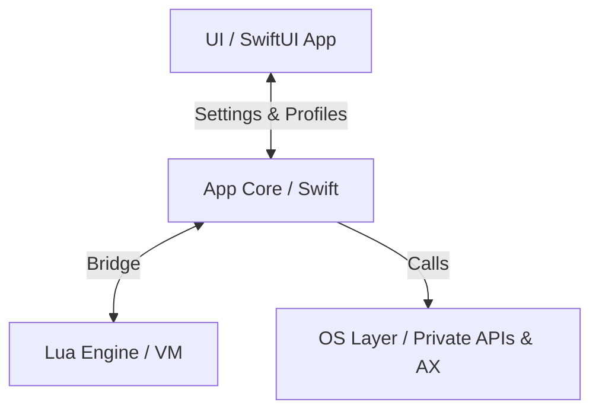

# KiwiDesk — Agent & Contributor Guidelines

Binding rules for human developers and AI agents working on this
repository. Read this file before modifying any code.

This file is the canonical source. Claude Code loads a
caveman-compressed brief generated from it
(`.claude/AGENTS.brief.md`, built by
`scripts/build-agent-brief.sh`) to save per-session context;
regenerate that brief whenever you edit this file. Other agents
(Cursor, Codex) and humans read this file directly.

---

## 1. Project Overview

KiwiDesk is a tiling window manager for macOS (Swift, SwiftUI, Lua).
It manages windows in a **flat, one-dimensional array per space** —
never in hierarchical trees. Layout algorithms are pure functions
over that array.

Module layout (SwiftPM targets):

| Target | Path | Responsibility |
|---|---|---|
| `KiwiDeskCore` | `Sources/KiwiDeskCore` | State, events, OS bridge |
| `KiwiDesk` | `Sources/KiwiDesk` | Executable, menu bar, GUI |
| `KiwiDeskCoreTests` | `Tests/KiwiDeskCoreTests` | Unit tests |

The Swift core must stay strictly separated from the SwiftUI GUI
and (later) the Lua VM.

Subsystem map (`Sources/KiwiDeskCore/*`) — directory-level, not a
file list; grep within a subsystem for specifics:

| Dir | Responsibility |
|---|---|
| `State` | Flat `[WindowID]`-per-space window state |
| `Tiling` | Placing windows from state into layouts |
| `Layouts` | Pure layout algorithms over the flat array |
| `Commands` | Command dispatch (the `set_*` verbs) |
| `Config` | Decoding the Lua/profile config into settings |
| `Profiles` | Profile JSON load/save & defaults |
| `Appearance` | Color palettes (bundled + user, one-shot apply) |
| `Lua` | Lua VM bridge, watchdog, registry refs |
| `AX` | Accessibility bridge & `AXObserver` callbacks |
| `OS` | Private SkyLight/CGS symbols via `dlsym`, AX fallback |
| `Keys` | Carbon hotkey registration |
| `Events` | Event listening / mouse drag taps |
| `Tabs` | Native-tab reconciliation (`windowRekeyed` coalescing) |
| `Animation` | Per-monitor `DisplayLink` animation |
| `IPC` | CLI / external command IPC |
| `Bar` | In-app App Bar & Space Bar overlays |
| `Borders` | Focus & sticky overlays (rings, sticky marks) |
| `Power` | Power / display-state handling |
| `Permissions` | AX / permission prompts |
| `Localization` | `L()` string routing & locale catalogs |
| `App` | Core bootstrap & wiring |
| `Models` | Shared value types |
| `Service` | Long-running service glue |
| `Resources` | Bundled assets (locales, vendored app font, palettes) (assets, not code) |

GUI lives in `Sources/KiwiDesk`: section bodies in
`Settings/Sections/`, their widgets in
`Settings/Components/<area>/` (Layouts, Keybindings, Bars,
SpaceOverrides, Icons, Appearance, Lua, Common), and shell/model
files plus root-composed widgets at `Settings/` root. `Common/`
admits only primitives shared across multiple component areas;
root-owned widgets stay at `Settings/` root.

This table is the *where*. For the *how* — end-to-end pipelines
(event→placement, command dispatch, config resolve, animation) traced
at directory altitude — see **`docs/architecture.md`**.

## 2. Code Rules

1. **File size:** target **100–250 lines** per Swift file. Hard
   ceiling: **350 lines** (only for cohesive, performance-critical
   logic). Split files before they grow past the ceiling.
2. **Line length:** max **79 characters** per line. Enforced by the
   pre-commit hook and CI (`scripts/lint.sh`).
3. **Single Responsibility:** one class/struct = one job (event
   listening, layout math, IPC — never mixed).
4. **DRY vs. readability:** extract shared helpers (`AXHelper`,
   `GeometryUtils`) instead of duplicating, but prefer a small,
   readable duplication over a deep protocol hierarchy or heavy
   generics. Keep code flat.
5. **Formatting:** `swift format` with the repo's `.swift-format`
   config owns all style (whitespace, commas, braces). SwiftLint
   (SPM build plugin, `.swiftlint.yml`) owns semantic rules
   (force casts, complexity, file length) and warns directly in
   Xcode during builds. Never enable a SwiftLint style rule that
   fights swift-format. Run `scripts/lint.sh` before committing.
6. **Concurrency:** AppKit/AX interaction is `@MainActor`. Pure
   state and layout code must stay actor-free and unit-testable.
7. **GUI north-star — simplicity, intuitiveness, Apple-native
   feeling, in that order.** The Settings app should feel like it
   belongs in macOS System Settings, not like a bespoke control
   panel. When a native pattern exists, use it; when unsure, ask a
   `ui-designer` consult framed by these three priorities before
   inventing a layout.
   Companion principle — **approachable by default, powerful on
   demand.** A new user gets a good tiling setup with almost no
   configuration; that simplicity must never *cap* what's
   achievable — beneath every easy surface is a deeper layer (Lua
   config, profiles, advanced layouts, per-space overrides) there
   when wanted and never required to begin. Depth is a capability
   the user grows into, not a cost paid upfront; simplicity-first is
   the entry point, not the ceiling (the #326 panel is the shape: a
   glance surface with one "Edit in Settings…" bridge down to the
   full editor). See `docs/design-decisions.md`; the shared
   Settings control conventions (help affordance, control
   choice, row tiers) are elaborated in `docs/ui-patterns.md`.
   Corollary — **the GUI curates, Lua is open.** The GUI is the
   opinionated gate that decides what most people *should* touch
   (safe defaults for the rest); Lua is the unrestricted power
   layer. A Lua setter clamps or rejects only genuinely-broken /
   unrenderable values (an invisible alpha, a >1 factor, a
   malformed color) — never to enforce taste or a ratio the GUI
   keeps tidy. Risky-but-valid knob → hide from the GUI, expose it
   Lua-only, don't add a guard that second-guesses the power user
   (e.g. the bars' `dim_factor` / `active_dim_factor`: Lua-only,
   clamped to a legible range yet free to invert the dim ladder).
   Settled conventions that fall out of this
   (extend, don't relitigate): **group by topic, never by widget
   type** — a toggle and the control it gates are one decision, so
   the toggle sits directly *above* the control it gates, never in
   a separate "toggles" block (colors, which gate nothing, may
   group by type for grid scannability); **grey, don't hide** a
   control with no effect in the current mode (#171), keeping the
   disabled control visible and dimmed; **the live preview leads**
   its editor; **defer per-control "why" to contextual help**
   (the planned `?` affordance, #94) rather than bloating labels or
   captions with glosses that would later duplicate it. A caption's
   job is to label what's shown, not to teach.

## 3. Workflow: Refine → Plan → Act → Verify

1. **Refine:** read the relevant code and specs before proposing
   changes; clarify ambiguities first.
2. **Plan:** for features and major fixes, write a short written
   plan (files to change, API surface, tests) before implementing.
3. **Act:** implement step by step; keep commits focused.
4. **Verify:** `swift build && swift test && scripts/lint.sh` for
   the fast inner loop. A **release build** (with
   `swift build -c release`) must also pass before any commit
   or PR — it enables
   the optimizer and stricter concurrency diagnostics (e.g.
   non-Sendable captures in `@Sendable` closures) that the debug
   build silently misses.
5. **Document:** any user-visible behavior change updates the
   matching docs in the same change set —
   `docs/lua-reference.md` (Lua config & behavior, in
   *expects → does → example* form), `docs/user-guide.md`
   (the Settings app & GUI flows), `docs/cli.md` (commands,
   events, IPC), `docs/recipes/` (integration recipes),
   `docs/design-decisions.md` (a durable product/UX decision a
   contributor would otherwise re-litigate or undo — a
   Principle, Rationale, Trade-off, or Map, per that file's
   charter; never an event log or a restatement of current
   behavior), `docs/ui-patterns.md` (when a
   shared Settings control convention is added or changed) —
   and `plan/` when the design itself shifts. Code and docs
   must never describe different behavior.
   The marketing/docs **site (`site/`)** renders `docs/` through
   a symlink, so doc *content* edits flow to it automatically —
   never hand-copy a doc into `site/`. But the site is not fully
   covered by that symlink: a **new doc page** needs a sidebar
   entry in `site/astro.config.mjs`, and **site-only surfaces**
   (the landing page, cross-page callouts) are updated in the
   same change set when a feature warrants surfacing there —
   e.g. a new layout mode (#128) adds its user-guide/reference
   prose *and* whatever nav or callout makes it findable. Run
   `npm run build` in `site/` when you touch either.
   When a review or manual pass classifies a behavior as
   **accepted-by-architecture**, it adds a row to the *Accepted
   limitations* page (`docs/accepted-limitations.md`) in the same
   change set — the user-facing twin of the §5 guardrail rule
   (OS-blocked-by-SIP items are a separate class, kept in
   `docs/design-decisions.md`, with no in-app escape hatch).
6. **Review:** once a substantial change is finished, verified,
   and committed, spin up **both** `code-reviewer` and
   `architect-reviewer` on the diff since the last review point —
   the branch's merge base with `main`, or the last reviewed
   commit / PR if there is one. Address or consciously dismiss
   their findings before opening a PR. (See §4 subagent
   delegation.)

   Sequencing: the first round runs both agents **in
   parallel** — the diff is finished, the perspectives are
   independent, and serializing only costs time. When the
   resulting fix batch is itself substantial (new
   abstractions, behavioral gates — not just comment or guard
   tweaks), run a focused re-review of **only the fix range**,
   this time **sequentially**: `code-reviewer` first (are the
   fixes correct?), then `architect-reviewer` (do the seams
   the fixes introduced hold up?). Alternate rounds until one
   returns no major findings. Brief each re-review with what
   the fixes claim to do, so it verifies claims instead of
   re-reviewing the feature.

   Agent reuse (decision 2026-07-13): round 1 always uses
   **fresh** agents — independence is the point, and a
   reviewer carrying opinions from an earlier feature anchors
   on them. Re-reviews of a fix batch in the **same session**
   go back to the **round-1 agent** (message it) instead of
   spawning a new one: it already holds the diff and its own
   findings, so it verifies "were my findings fixed" directly
   instead of re-deriving the whole context. Across sessions
   this is moot — subagent context dies with the session, so
   a new session always means fresh agents.

   Reuse by **cache warmth**, not just the session boundary
   (decision 2026-07-17): reusing the round-1 agent only wins
   while its context is still cache-warm — then it's cheapest
   and keeps its own findings. After a long gap (many edits,
   a slow rebuild) the cache has cooled, so resuming reloads
   its whole now-stale transcript uncached — a large context
   just to answer a small question. In that case a **fresh**
   agent with a tight "here's what each fix claims to do"
   brief is usually cheaper and nearly as good, trading the
   agent's memory of its findings for a small cold start. So:
   reuse while warm; go fresh once it's cooled (or across
   sessions). If the reuse target was stopped or died, fresh
   is the only option — brief it fully. And the re-review loop
   itself is gated on substance: a substantial fix batch earns
   a round, a lone comment or guard tweak that closes a finding
   does not — self-verify it and stop.

### Branching & Pull Requests

Branch from `main` with a name that matches the Conventional
Commit type: `feat/`, `fix/`, `refactor/`, `docs/`, `test/`,
`chore/`, `ci/`, `perf/`, etc., followed by a short kebab-case
description (e.g., `feat/scrolling-snap-mode`). One focused
change per branch; separate refactors from features.

When opening an issue or pull request, use the GitHub
[issue templates](.github/ISSUE_TEMPLATE/) and
[PR template](.github/pull_request_template.md). Reference
related issues in commit messages or PR descriptions using
`fixes #123` syntax.

### Commit messages (Angular / Conventional Commits)

Format: `type(scope): subject` — imperative, lower-case subject,
no trailing period. Body (optional) explains the why, wrapped at
72 columns.

- Types: `feat`, `fix`, `perf`, `refactor`, `docs`, `test`,
  `build`, `ci`, `chore`.
- Scope is the touched area, e.g. `animation`, `tiling`, `layout`,
  `commands`, `lua`, `ax`, `profiles`, `docs`. Omit when the
  change is repo-wide.
- Examples:
  - `feat(layout): add stack.set_overflow_style`
  - `fix(tiling): defer z-order restore until animations settle`
  - `perf(animation): apply position-only frames per app`

## 4. Tooling

- Shared automation lives in the visible `/scripts/` directory
  (never hidden in dot-folders): lint, git hooks, localization
  scripts.
- Install hooks once per clone: `./scripts/install-hooks.sh`.
- Fetch third-party subagents per clone with one explicit target:
  `./scripts/install-subagents.sh --claude` installs Claude Code
  agents and workspace skills; `./scripts/install-subagents.sh
  --codex` installs project-scoped Codex agents.
- (Optional, per-developer) install the `caveman` skill to
  compress agent output — not a build dependency; needs Node
  `>= 18` (the installer checks):
  `npx -y github:JuliusBrussee/caveman --non-interactive`.
  `--non-interactive` avoids a hang when piped; append flags to
  scope it, e.g. `--only claude`, `--minimal`, `--uninstall`.
- Regenerate the compressed agent brief after editing this file:
  `./scripts/build-agent-brief.sh` (needs caveman + a `claude`
  CLI or `ANTHROPIC_API_KEY`). The compression is a full-document
  LLM pass and commonly takes **several minutes** — run it in the
  background, not under a short (e.g. 2-minute) timeout that would
  kill it mid-pass; slow is not hung. `scripts/lint.sh` runs
  `scripts/check-agent-brief.sh`, which only warns (never blocks)
  if the brief is stale — so editing this file needs no caveman
  install; the brief just drifts until someone rebuilds it.

### Subagent delegation (AI agents)

When subagents are available, spin them off proactively — no
need to wait for the user to ask — but only where the payoff is
clear. A subagent starts with zero conversation context, so
delegate work that does not depend on it:

- **Broad fan-out searches** across many files or naming
  conventions where only the conclusion matters (`Explore`).
- **Independent review passes** on a finished, substantial
  change (`code-reviewer`, `architect-reviewer`).
- **Parallel, isolated implementation work** (e.g. in a separate
  worktree) that would otherwise serialize.

Stay inline for anything small, sequential, or dependent on
conversation context: a cold agent re-deriving what the session
already knows costs more than it saves.
- CI (`.github/workflows/ci.yml`) builds, lints, and tests on every
  push and on PRs targeting `main`. A red build blocks merging.

## 5. Guardrails (Known Pitfalls)

Keep this list updated whenever a recurring mistake is found.

- **Pre-release, single user: no backward-compat shims.** Nothing
  is publicly released, so nothing external depends on the current
  command names, Lua/CLI verbs, event names, or file formats.
  Rename and restructure freely; do **not** add compatibility
  aliases, deprecation layers, or migration scripts — re-saving or
  re-editing the config is the migration (#42 renamed the space
  commands outright instead of keeping `*_virtual_space` aliases;
  profile JSON likewise needs none). Revisit at the first public
  release — until then, back-compat is wasted complexity.
- **One vocabulary across Lua and profile JSON.** A profile
  JSON key is the Lua command name with the `set_` verb
  stripped, snake_case, grouped by namespace:
  `set_gap_override` → `gap.override`, `bsp.set_ratio` →
  `layout.bsp.ratio`, `stack.set_master_ratio` →
  `layout.stack.master_ratio`. Multi-part element names nest
  further when the element is a configurable unit:
  `drag.set_ghost_fill_color` → `drag.ghost.fill_color`.
  Groups are singular (`gap`,
  `layout`, `drag`); never invent synonyms or plurals. When
  adding a setting, pick the Lua name first and derive the
  JSON key from it via `CodingKeys` (Swift property names may
  differ internally). `SettingsCodingTests` pins this shape.
- **Never disable SIP or ask users to.** Private SkyLight/CGS
  symbols are resolved at runtime via `dlsym` (`SkyLight.swift`),
  never linked with `@_silgen_name` — a linked symbol that
  disappears in a macOS update would crash the app at launch,
  while a failed lookup returns nil and the caller falls back to
  the public Accessibility API (`AXUIElement`). Every private
  fast path must have such a fallback.
- **The Lua watchdog cannot interrupt blocking C calls.** The
  runaway-script guard is an instruction-count hook; code that
  blocks inside C (`system()`, pipe reads) executes zero VM
  instructions and freezes the main thread forever. Never add
  an API that blocks in C on the main thread — external
  commands always go through `ExecLauncher`. Lua registry refs
  (`luaL_ref`) are VM-specific and their slots are reused:
  never deliver a ref into a different interpreter than the
  one that minted it (capture the owning `LuaInterpreter`
  weakly, as `KiwiCore+ExecAPI` does).
- **AX calls are slow and can block.** Never call AX APIs inside
  tight loops or layout math; snapshot state first.
- **Electron/WebKit apps answer AX queries lazily** (100–300 ms).
  `AXEnhancedUserInterface` is set to `true` on managed apps to keep
  their AX tree warm; do not remove this without a replacement.
- **Windows live in a flat `[WindowID]` per space.** Do not
  introduce tree/container structures into state or layout code.
- **macOS native tabs are one `NSWindow` per tab, coalesced
  temporally.** Finder/Terminal/Ghostty native tabs are separate
  `NSWindow`s sharing one on-screen frame, each with its own
  `CGWindowID`, and **only the active tab is ever visible to AX** —
  background tabs never appear in `kAXWindowsAttribute`, and a fresh
  id is minted per switch (#308 probe). So a tab switch surfaces to
  reconcile as one window vanishing while another appears at the same
  frame; `TabReconciler` coalesces that pair into a `.windowRekeyed`
  (id swapped in place — no tree, one slot per group) instead of a
  destroy + create. The gate needs an `AXTabGroup` on **either** side
  (Ghostty exposes one only at 2+ tabs, so the 1↔2 boundary window
  has none). Coalescing is suppressed on the native-Space-switch
  `reconcileAll` (`coalesceTabs: false`) — same-app windows across
  spaces tile to identical frames and would false-merge. When editing
  tracking/reconcile, keep these facts in view; never assume a
  window's `CGWindowID` is stable or that every tab is an AX window.
- **Cross-layout logic must account for each layout's navigation
  model.** Anything spanning all layouts — focus/swap navigation,
  overflow handling, geometric neighbor search — must consider
  whether a layout is *geometric* (a neighbor search over
  calculated slots) or *array-order* (steps the flat array), and
  whether it can produce an *overflow pile* (an `OverlapStack`
  cascade). The two models need different handling (e.g. #172:
  exclude pile-mates from the geometric candidate set vs skip
  their array indices; the shared detector is
  `Navigation.pileMates`). The authoritative map is the "Layout
  navigation & overflow models" table in `docs/design-decisions.md`
  — a **new layout must add its row** there.
- **Space identifiers are strings** and case-sensitive; numeric
  strings and integers are equivalent (`"1"` == `1`).
- **Hotkeys use the Carbon API** (`RegisterEventHotKey`), not
  CGEventTap — this avoids Input Monitoring permission. Event taps
  are only for mouse drag tracking.
- **One `DisplayLink` per monitor** (mixed refresh rates). Never
  drive animations from a single global timer.
- **`AXObserver` callbacks arrive on the thread's run loop** that
  registered them; keep observer registration on the main thread.
- **SwiftUI cursor changes use `NSCursor.set()`, never
  push/pop.** A view removed under the pointer (a link that
  deletes itself, a row rebuilt by rename) never delivers the
  balancing `onHover(false)`, and hover interleaved with a drag
  gesture pops the wrong entry — a cursor stack cannot balance.
  Bit the spaces drag handle and the link-hover modifier.
- **Keep SwiftUI `body` a shallow container.** A long modifier
  chain with conditional `background`/`overlay` closures or
  `+`-concatenated string literals inside one `body` expression
  can exceed the type-checker's budget — and the failure is
  machine-dependent: it compiles locally but dies on the slower
  CI runner ("unable to type-check this expression in
  reasonable time"), so the local verify gate does not catch
  it. Extract chained subviews into private computed
  properties / funcs and hoist concatenated strings into
  constants. Bit `KeyRecorderField`.
- **Split test suites early.** The 79-char limit and 350-line
  ceiling repeatedly bit large test files. Break suites into
  focused files before they grow; per-file private helpers are the
  convention and small duplication across suites is fine. Three
  ratified exceptions, all *stateless primitives* with no
  setup/teardown coupling and no assertions of their own:
  `ReflectionParity.swift` (structural-parity reflection helpers
  backing the field-list guards), `ScriptFixture.swift`
  (spawn a `scripts/*` tool and drain its pipes, plus the
  repo-shaped temp tree the `__file__`-rooted scripts need), and
  `SourceScan.swift` (the delimiter walker and file enumerator
  the source-scanning parity guards share — an over-matching
  divergent copy makes a guard pass for the wrong reason, which
  is the exact failure those guards exist to prevent).
  The bar is the **drift risk** — a divergent copy weakens a
  guard, or silently changes what a suite observes — not the
  copy count, which is merely the evidence that prompted the
  look (the script harness was extracted at the fifth hand-copy,
  in #252). Duplication that only costs lines stays duplicated
  (§2.4). A further exception needs the same case made.
- **An async test that awaits real spawned work needs a generous
  hang-guard, not a tight deadline (#344).** A test that spawns a
  real subprocess (`ExecTests`) or schedules an unstructured `Task`
  (`DragCoordinatorTests`) and then awaits its **main-actor
  callback** cannot use a sub-second or few-second poll deadline:
  swift-testing runs suites concurrently, so under full-suite load
  the shared main actor is starved for seconds and the tight
  deadline tripped spuriously (the callback landed, just late)
  while the suite passed in isolation. Fixed by giving each such
  wait one shared generous hang-guard (`execHangGuard` /
  `dragSettleHangGuard`, 30s): the poll exits the instant the
  condition holds, so a passing run is never slowed — the deadline
  only bounds a genuine hang. Prove the *behavior* by the gap (a
  short watchdog against a much longer sleep), never by a tight
  wait. New async tests here follow suit.
- **Unit tests never need the running app; device QA launches it
  direct.** `swift test` is fully self-contained (per-test
  `KiwiCore` over a temp config dir, throwaway sockets; the
  service tests only parse `launchctl` strings) — the app's
  run state is irrelevant to it. The running app matters only
  for device QA, and there launch it DIRECT in a terminal
  (`.build/release/KiwiDesk` — Ctrl-C to stop, `NSLog` output
  visible, incl. the #292 preflight-denial and settle lines),
  not via `service start`; stop the service first if loaded, or
  the single-instance guard keeps the OLD binary running.
  Every release rebuild changes the binary hash, which drops the
  TCC Accessibility grant (re-grant in System Settings) and a
  restart flattens session state (spaces, float flags) — plan
  QA around it; the durable fix is #89's signed .app bundle.
  Run the full suite as `swift test --skip ExecTests` then
  `swift test --filter ExecTests`: combined it stalls for
  minutes at the tail (spawned exec children hold the runner's
  pipe, and the #344 hang-guards crawl under full-suite
  starvation — #489 tracks the root fix); suite *ordering* is
  not a lever, swift-testing schedules suites concurrently.
- **Discardable test results must express side-effect intent.**
  When a command or setup helper primarily mutates state but also
  returns optional convenience data, mark the declaration
  `@discardableResult` if valid callers commonly ignore that data.
  Keep pure queries non-discardable — an ignored result there is
  probably a bug. A test whose subject is command success or
  failure still asserts the returned response; never remove tests
  or assertions merely to silence an unused-result warning.
- **Profiles own tiling, plus sparse behavior overrides.** A
  profile serializes tiling state — that belongs *inside*
  `TilingSettings` so it rides the config split for free (see
  `gap.override`). Beyond tiling, a profile may carry a **sparse
  override of a global _behavior_ setting** — one that shapes how
  the workspace behaves *while the profile is active*: keybindings
  (`Profile.modes`), app→space rules (`Profile.appRules`), float
  rules (`Profile.floatRules`), and ignore rules
  (`Profile.ignoreRules`). Global bases come from the active config
  owner (`gui.json` or `init.lua`); the profile layer resolves over
  either owner. Window-rule families resolve independently, with
  effective ignore remaining the hard management gate. It may
  **never** override a setting that *routes
  or selects* the profile itself (`profile_bindings`, the
  native-Space→profile map) or that lives outside config ownership
  (the GUI language pref, which persists in `UserDefaults`) — a
  profile that could rewrite what selects it is a self-reference
  hazard. Every override is the base overlaid with a sparse diff
  (absent = inherit; an explicit tombstone expresses removal),
  never a second home for the setting. Add each one deliberately,
  guarded by a round-trip + resolve parity test. App→space uses a
  value-map override; float and ignore share the generic list-rule
  primitive because two real clients now remove drift (see
  `.claude/rules/parity-tests.md`).
  `ProfileManager` mutators are `internal` by
  design — mutate through a `KiwiCore` facade, never re-publicize
  them. `read(name:)` is the public load-for-edit primitive
  (path-traversal guarded, touches no state); `save()` **adopts**
  (sets `currentName`, clears dirty), so an edit-without-activating
  path must be a separate, non-adopting write — never overload
  `save()`. The GUI-vs-Lua ownership predicate is centralized in
  `KiwiCore.isGuiManaged` (`KiwiCore+GuiConfig.swift`); refine that
  one predicate, never add a second. Pre-release (single user):
  profile JSON needs no migration scripts — re-saving is the
  migration.
- **Explicit settings applies must `retile(force: true)`.** The
  engine's "already there" tolerance (±2 pt per edge) exists to
  absorb AX-echo lag and app-side clamping; an un-forced retile
  after a config edit lets it swallow small changes entirely (a
  1 pt gap edit visibly did nothing). Config-apply entry points
  (`applyProfileScopedState`, `set_gap_*`,
  `set_min_window_size`, `set_mode`, and the whole
  `layoutCommand` dispatch — every retile triggered by an
  explicit `set_*` from Lua/CLI) force; event-driven retiles
  stay un-forced so echo lag can't wobble windows. Profile
  applies classify themselves: `apply(profile:)` /
  `apply(composed:)` take a **required** `forceRetile`, so
  every new caller must choose — explicit paths
  (`load_profile`, an in-effect edit re-apply, the
  post-reload re-apply, preset apply) force; monitor-change
  and native-space-binding applies stay un-forced.
- **Resolve before layout, and merge per-field first.** Settings
  that layer (global → layout → space) merge field-by-field, with
  cross-field clamps applied *last* on the already-merged values
  (the `AppBarStyle.resolved…` pattern). Resolution runs before
  layout math so the layout functions stay pure over the flat
  array.
- **Guard hand-mirrored field lists with a forget-proof parity
  test.** Some patterns repeat a struct's field list across
  sites — a global ↔ optional-override mirror
  (`AppBarStyle` ↔ `LayoutAppBar`), a dual apply switch
  (`AppBarCommandSetting`), a manual sparse `Codable`. Small
  readable duplication is fine (§2.4), but past **two** mirrors
  of the same field list the drift risk (add a field, forget one
  site → silent data loss) outweighs the clarity. Before adding
  the third, weigh whether the duplication still pays off; if it
  ships, it **must** carry a parity test — and prefer one that
  discovers fields by reflection / shared `CodingKeys` over a
  hand-enumerated list, so the guard itself cannot silently rot
  (a hand-listed parity test is one more place to forget). A
  reflection net catches a missing *property*, not a forgotten
  `resolved()` / `encode` line — back it with a round-trip +
  resolve-every-field test for those. Reach
  for a generic/keypath merge only when it removes the drift, not
  just the `resolved()` lines — sparse `Codable` stays per-field
  either way, so generics rarely buy down the real risk and fight
  §2.4.
- **`Resources/Locales/*.json` is generated/translation-owned
  (issue #9).** Every GUI string routes through
  `L("key", "English")` (`LocalizationManager.swift` in
  `KiwiDeskCore/Localization/`); English is the source of truth,
  inlined at the call site, with per-key fallback when a locale
  omits a key. A value interpolated into a sentence (a name, a
  count) MUST go through the `L(key, english, args...)`
  overload with POSITIONAL `%1$@`/`%1$d` specifiers, never
  `+`-concatenated fragments — a translation can't reorder
  pieces stitched together in Swift, and many languages need to.
  `en.json` is regenerated wholesale by `scripts/extract-keys`
  (which scans both `Sources/KiwiDesk` and
  `Sources/KiwiDeskCore`, and ignores `//`/`///` comments so a
  doc-comment
  example call site can't leak a phantom key) from real call
  sites — never hand-edit it, and AI agents must not hand-edit
  any `Resources/Locales/*.json` file: use
  `scripts/extract-keys <locale>` /
  `scripts/merge-keys <locale>` to translate,
  `scripts/rename-key <old> <new>` to rename a key without
  losing translations, `scripts/drop-key <key>` to delete a
  key's shipped translations when its English **meaning**
  changed — run in the same change set, so every locale falls
  back to the new English and the key reappears on its
  to-translate list; cosmetic English edits (typo,
  punctuation) keep translations — and
  `scripts/extract-keys --prune` to
  drop orphaned ones (see `docs/translating.md`). Because the
  same English text can in principle be authored at two
  different call sites for one key, `extract-keys` fails loudly
  on any such drift (mismatched English for the same key) rather
  than silently picking one; `extract-keys --check` (run
  unconditionally by `scripts/lint.sh` — part of the verify
  gate, CI, and `scripts/pre-commit` whenever a Swift or locale
  file is staged) additionally hard-fails if `en.json` is stale
  or if any shipped `<locale>.json` doesn't decode as a flat
  `{string: string}` map (a broken file would otherwise make
  `LocaleCatalog` soft-fail to `[:]` and silently revert that
  locale to English); an orphan key (in a locale file, absent
  from code) only warns — clean it up with
  `extract-keys --prune`. All of this is backed by Swift tests
  — each localization script has a sibling suite
  (`LocalizationDriftGuardTests`, `LocalizationOrphanTests`,
  `RenameKeyTests`, `DropKeyTests`, and future scripts follow
  suit) — so a regression in the tooling itself is
  covered by `swift test`, not just by running the script. The
  GUI language pick persists in `UserDefaults`
  (`LocalizationPreference`), never `gui.json` — it is
  documented as side-effect-free and must never create a
  sidecar or flip `KiwiCore.isGuiManaged`.
