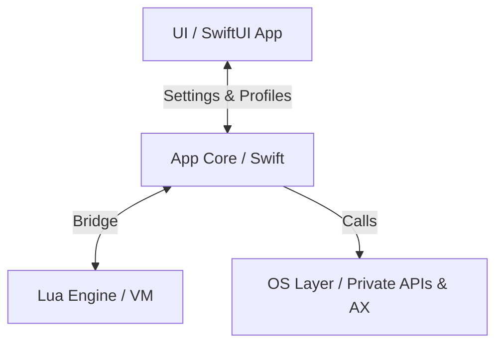

# KiwiDesk — Agent & Contributor Guidelines

Binding rules for human developers and AI agents working on this
repository. Read this file before modifying any code. Every agent
(Claude Code, Cursor, Codex) and human reads it directly.

## How this file is organized

This file is the **hub**: the project shape, the rules that apply
everywhere, and an index of the subsystem guardrails (§5).

The guardrails themselves — the long "here is why this bit us"
arguments — live one level down, in
[`.claude/rules/*.md`](.claude/rules/), **one file per subsystem**.
Each rule file is the canonical text for its subsystem; §5 carries
the rule in one line and links to it. When they would disagree,
the **rule file wins** and the §5 row is the thing to fix.

One deliberate exception to "state it once": the handful of
guardrails at the top of §5 are repeated verbatim in their rule
file. They are the ones that destroy something before a rule file
would ever load — a tree in the state model, a shipped `.app` that
`fatalError`s — so they earn a tripwire in the file every agent
already has. Aim to state everything else exactly once, and see
[rule-authoring.md](.claude/rules/rule-authoring.md) for which
kinds of sentence may be repeated safely and which may not.

§5 also carries **one** prose rule rather than a one-line row:
how to write a rule at all (#614). It is there because it is the
only rule whose subject is this delivery mechanism, and because a
reader who never edits a rule file — Cursor, Codex, a human
skimming the hub — would otherwise meet it nowhere. Its argument
still lives one level down, in
[rule-authoring.md](.claude/rules/rule-authoring.md). Do not read
it as licence for a second long paragraph in §5.

They live in `.claude/` because Claude Code auto-loads a rule file
whose `paths:` glob matches a file you are editing — so the right
guardrails arrive when they are relevant and cost nothing when
they are not. That placement is *only* about the loader. The files
are ordinary Markdown: humans and other agents reach them through
the §5 links, and §5 lists every one of them.

Two shelves, don't confuse them:

- **`docs/`** — the product: Lua reference, user guide, CLI,
  design decisions, accepted limitations. Ships to users through
  the site.
- **`.claude/rules/`** — the workshop: engineering guardrails for
  whoever changes the code.

---

## 1. Project Overview

KiwiDesk is a tiling window manager for macOS (Swift, SwiftUI,
Lua). It manages windows in a **flat, one-dimensional array per
space** — never in hierarchical trees. Layout algorithms are pure
functions over that array.

Module layout (SwiftPM targets):

| Target | Path | Responsibility |
|---|---|---|
| `KiwiDeskCore` | `Sources/KiwiDeskCore` | State, events, OS bridge |
| `KiwiDesk` | `Sources/KiwiDesk` | Executable, menu bar, GUI |
| `KiwiDeskCoreTests` | `Tests/KiwiDeskCoreTests` | Unit tests |
| `KiwiDeskGuiTests` | `Tests/KiwiDeskGuiTests` | GUI tests, plus the source-scanning parity guards (`SourceScan`) — which scan **both** trees, so a `KiwiDeskCore` invariant may be guarded from here |

The Swift core must stay strictly separated from the SwiftUI GUI
and (later) the Lua VM.

Subsystem map (`Sources/KiwiDeskCore/*`) — directory-level, not a
file list; grep within a subsystem for specifics:

| Dir | Responsibility |
|---|---|
| `State` | Flat `[WindowID]`-per-space window state |
| `Tiling` | Placing windows from state into layouts |
| `Layouts` | Pure layout algorithms over the flat array |
| `Commands` | Command dispatch (the `set_*` verbs) |
| `Config` | Decoding the Lua/profile config into settings |
| `Profiles` | Profile JSON load/save & defaults |
| `Appearance` | Color palettes (bundled + user, one-shot apply) |
| `Lua` | Lua VM bridge, watchdog, registry refs |
| `AX` | Accessibility bridge & `AXObserver` callbacks |
| `OS` | Private SkyLight/CGS symbols via `dlsym`, AX fallback |
| `Keys` | Carbon hotkey registration |
| `Events` | Event listening / mouse drag taps |
| `Tabs` | Native-tab reconciliation (`windowRekeyed` coalescing) |
| `Animation` | Per-monitor `DisplayLink` animation |
| `IPC` | CLI / external command IPC |
| `Bar` | In-app App Bar & Space Bar overlays |
| `Borders` | Focus & sticky overlays (rings, sticky marks) |
| `Power` | Power / display-state handling |
| `Permissions` | AX / permission prompts |
| `Localization` | `L()` string routing & locale catalogs |
| `App` | Core bootstrap & wiring |
| `Models` | Shared value types |
| `Service` | Long-running service glue |
| `Resources` | Bundled assets (locales, vendored app font, palettes) (assets, not code) |

The GUI lives in `Sources/KiwiDesk` — layout conventions in
[`.claude/rules/gui.md`](.claude/rules/gui.md).

This table is the *where*. For the *how* — end-to-end pipelines
(event→placement, command dispatch, config resolve, animation)
traced at directory altitude — see **`docs/architecture.md`**.

## 2. Code Rules

1. **File size:** target **100–250 lines** per Swift file. Hard
   ceiling **350** (only for cohesive, performance-critical
   logic). Split before you cross it.
2. **Line length:** max **79 characters**. Enforced by the
   pre-commit hook and CI (`scripts/lint.sh`).
3. **Single Responsibility:** one class/struct = one job (event
   listening, layout math, IPC — never mixed).
4. **DRY vs. readability:** extract shared helpers (`AXHelper`,
   `GeometryUtils`) instead of duplicating, but prefer a small,
   readable duplication over a deep protocol hierarchy or heavy
   generics. Keep code flat.
5. **Formatting:** `swift format` with the repo's `.swift-format`
   config owns all style, and `scripts/lint.sh` additionally
   enforces the §2.1 line-length and file-size limits. Linting is
   its own step, **not** a build-tool plugin — `Package.swift`
   carries why the SwiftLint prebuild plugin was removed, so
   `.swiftlint.yml` no longer runs during a build. Run
   `scripts/lint.sh` before committing — its **exit code**
   decides, not its warnings.
6. **Concurrency:** AppKit/AX interaction is `@MainActor`. Pure
   state and layout code stays actor-free and unit-testable.
7. **GUI north-star — simplicity, intuitiveness, Apple-native
   feeling, in that order**, and **approachable by default,
   powerful on demand**: the Settings app should feel like it
   belongs in macOS System Settings, and a new user should get a
   good setup with almost no configuration without that
   simplicity capping what Lua can reach. The full principle,
   its corollaries and the settled conventions that fall out of
   it are in [`.claude/rules/gui.md`](.claude/rules/gui.md);
   `docs/ui-patterns.md` holds the shared control conventions
   and `docs/design-decisions.md` the rulings behind them.

## 3. Workflow: Refine → Plan → Act → Verify

1. **Refine:** read the relevant code and specs before proposing
   changes; clarify ambiguities first.
2. **Plan:** for features and major fixes, write a short written
   plan (files to change, API surface, tests) before
   implementing.
3. **Act:** implement step by step; keep commits focused.
4. **Verify:** run the **`verify-gate` skill**
   ([`.claude/skills/verify-gate`](.claude/skills/verify-gate/SKILL.md))
   — `swift build`, the test run, `scripts/lint.sh`,
   and the release build when the change touches concurrency or
   `Sendable`. That skill owns the procedure — which gate a change
   earns, what to run, in what order, and when CI's `Release
   Build` job substitutes for a local one.
5. **Document:** any user-visible behavior change updates the
   matching doc in the same change set — code and docs must
   never describe different behavior. Which doc owns what, and
   the `docs/design-decisions.md` charter, are in
   [`.claude/rules/docs.md`](.claude/rules/docs.md); the site's
   half of it in [`.claude/rules/site.md`](.claude/rules/site.md).
6. **Review:** once a substantial change is finished, verified
   and committed, run the **`review-change` skill**
   ([`.claude/skills/review-change`](.claude/skills/review-change/SKILL.md))
   — `code-reviewer` and `architect-reviewer` on the diff since
   the last review point, plus the specialist lanes the diff
   opens. Address or consciously dismiss every finding before
   opening a PR. That skill owns the sequencing (parallel first
   round, which lanes a diff earns, sequential re-review of a
   substantial fix batch) and the agent-reuse rules.

### Branching & Pull Requests

Branch from `main` with a name matching the Conventional Commit
type: `feat/`, `fix/`, `refactor/`, `docs/`, `test/`, `chore/`,
`ci/`, `perf/`, then a short kebab-case description (e.g.
`feat/scrolling-snap-mode`). One focused change per branch;
separate refactors from features.

Use the GitHub [issue templates](.github/ISSUE_TEMPLATE/) and
[PR template](.github/pull_request_template.md). Reference issues
with `fixes #123`.

**An agent drafting an issue renders the template, rather than
writing whatever shape it likes.** GitHub applies a `.yml` form
only when a human opens the *New issue* page (observed
2026-08-02, `gh` 2.x), so `gh issue create --body-file` — the way
an agent files one — starts from a blank body and silently keeps
none of it. Read the
template, then reproduce it: each `label:` as a `###` heading in
declared order, its `labels:` on the command line, its `title:`
prefix on the title. The reason is not tidiness. Those fields are
the questions a maintainer needs answered *before* triaging, and
an agent that skips them is skipping the questions, not just the
formatting — the templates ask for the macOS version and the
other AX tools running because that is what half of KiwiDesk's
bug reports turn on.

Pick the template by what the issue *is*: `bug_report` when
something shipped behaves wrongly (including a guard that cannot
fail — the repro is the mutation that ought to red it),
`feature_request` for new or retuned behavior, `docs_report` for
prose, `collector` / `roadmap` for grouping. (`config.yml` is not
a template — it is the chooser, and it turns blank issues off, so
one of the five above is the only way in.) Every one of them is
written for a **user**, so an internal engineering issue will have
fields that fit awkwardly — answer them honestly from the dev
machine rather than dropping them or inventing a new shape
inline.

### Commit messages (Angular / Conventional Commits)

`type(scope): subject` — imperative, lower-case, no trailing
period. Optional body explains the why, wrapped at 72 columns.

- Types: `feat`, `fix`, `perf`, `refactor`, `docs`, `test`,
  `build`, `ci`, `chore`.
- Scope is the touched area (`animation`, `tiling`, `layout`,
  `commands`, `lua`, `ax`, `profiles`, `docs`); omit when the
  change is repo-wide.
- Examples: `feat(layout): add stack.set_overflow_style`,
  `fix(tiling): defer z-order restore until animations settle`.

## 4. Tooling

Shared automation lives in the visible `/scripts/` directory,
never hidden in dot-folders: lint, git hooks, localization
scripts.

- `./scripts/install-hooks.sh` once per clone. The `pre-commit`
  hook lints staged Swift, runs the locale checks, and **refuses
  a commit while HEAD is `main`** (override with
  `KIWIDESK_ALLOW_MAIN_COMMIT=1`, never `--no-verify`).
- `./scripts/build-app.sh` packages, signs and optionally
  notarizes the `.app` (#89) — see
  [packaging-and-release.md](.claude/rules/packaging-and-release.md).
- `./scripts/release.sh <version>` cuts a release: stamps the
  version, runs the gate, commits, tags and pushes. The pushed
  tag fires `.github/workflows/release.yml`, which re-verifies
  the tag, builds the artifact and drafts the release — same
  rule file.
- `./scripts/sync-agents.sh` regenerates the Codex mirror
  (`.codex/agents/*.toml`) from the committed Claude Code agents in
  `.claude/agents/`, which are the source of truth and need no
  install step. `--check` fails when the mirror is stale — see
  [subagents.md](.claude/rules/subagents.md).
- Optional, per-developer: the `caveman` skill compresses agent
  output — not a build dependency, needs Node `>= 18`:
  `npx -y github:JuliusBrussee/caveman --non-interactive`.
  `--non-interactive` avoids a hang when piped; scope it with
  `--only claude`, `--minimal`, or `--uninstall`.
- CI (`.github/workflows/ci.yml`) builds, lints and tests on
  pushes to `main` and on PRs targeting it. Its two macOS jobs are
  gated on a `changes` job, so a change confined to
  `.github/ci-ignore.txt`'s list leaves them skipped. A red build
  blocks merging. Adding an entry to that list needs
  [packaging-and-release.md](.claude/rules/packaging-and-release.md)
  — the test suite is not the only thing that reads a path.

### Subagent delegation (AI agents)

Spin subagents off proactively where the payoff is clear — no
need to wait to be asked. A subagent starts with zero
conversation context, so delegate work that does not depend on
it: broad fan-out searches where only the conclusion matters
(`Explore`), independent review passes on a finished change
(`code-reviewer`, `architect-reviewer`), proving a new guard
actually reds (`guard-prover`), and parallel isolated
implementation work that would otherwise serialize.

Stay inline for anything small, sequential, or dependent on
conversation context: a cold agent re-deriving what the session
already knows costs more than it saves.

The delegation call is made here, while editing something else,
which is why it lives in this file. The roster itself — who
exists, what each one is for, and how an agent file must be
written — is in [subagents.md](.claude/rules/subagents.md), which
loads when you edit one.

## 5. Guardrails (Known Pitfalls)

These apply everywhere, whatever you touch:

- **Pre-release, single user: no backward-compat shims.** Nothing
  external depends on the current command names, Lua/CLI verbs,
  event names or file formats. Rename and restructure freely; add
  no compatibility aliases, deprecation layers or migration
  scripts — re-saving or re-editing the config *is* the migration
  (#42 renamed the space commands outright). Revisit at the first
  public release.
- **Windows live in a flat `[WindowID]` array per space.** Never
  introduce tree or container structures into state or layout.
- **Never disable SIP, or ask a user to.** Every private fast
  path has a public-API fallback.
- **Never `Bundle.module` in code that runs from the `.app`** —
  go through `ResourceBundle.locate`. It resolves on the machine
  that built it and `fatalError`s everywhere else.
- **Space identifiers are strings** and case-sensitive; numeric
  strings and integers are equivalent (`"1"` == `1`).

Everything else is indexed below. **Read the rule file before
editing its subsystem** — the row is the rule, the file is the
argument, and Claude Code loads the file automatically when you
touch a matching path.

| Touching | Read | The rule, in one line |
|---|---|---|
| Anywhere in `Sources/KiwiDeskCore` | [core-boundaries.md](.claude/rules/core-boundaries.md) | Core returns structure and the GUI renders the sentence (#96); CLI/IPC errors stay English; never `Bundle.module`; a declared `onLog` seam defaults to `CoreLog.write` and is wired in `KiwiCore+Bootstrap` |
| `State`, `Tiling`, `Layouts`, `Commands`, `App`, `Tabs` | [state-and-layout.md](.claude/rules/state-and-layout.md) | Flat array, pure layouts; display bounds only via `TilingEngine.visibleBounds` (#531) and spans via `layoutBounds(on:)` (#537) — the guards' `allowed` maps are the one copy of who is exempt; a native tab switch is a re-key, not destroy+create (#308); an explicit `set_*` apply forces the retile; only a pass whose windows are all spring-sized may promise `BatchSizing.allSpringSized` (#593); every write of a space's `focused` slot goes through `mayHoldSpaceFocus`, which bars a transient overlay (#671) |
| `Config`, `Profiles`, `Commands` | [profiles.md](.claude/rules/profiles.md) | A profile owns tiling plus *sparse behavior overrides*, never anything that routes or selects the profile itself; `isGuiManaged` is the one ownership predicate |
| Any setting name, `CodingKeys`, user-facing noun | [config-vocabulary.md](.claude/rules/config-vocabulary.md) | Pick the Lua name first and derive the JSON key from it; groups are singular; reuse the noun glossary instead of coining a synonym |
| `AX` | [accessibility.md](.claude/rules/accessibility.md) | AX calls are slow and can block — snapshot before layout math; Electron/WebKit answer lazily, so `AXEnhancedUserInterface` stays; boot keeps its ~1 s messaging bound, and the windowless-app warmup skip is safe only through the warm-on-reconcile promise its guard pins (#662/#672) |
| `OS`, `SkyLight*.swift`, `AX/AXHelper.swift` | [os-private-apis.md](.claude/rules/os-private-apis.md) | Resolve private symbols with `dlsym`, never `@_silgen_name` — the rule file names the one exempt symbol and why it does not generalise; every private path needs a public fallback |
| `Lua` | [lua.md](.claude/rules/lua.md) | The watchdog cannot interrupt blocking C calls; registry refs never cross interpreters |
| `Keys`, `Events`, `Animation` | [input-and-animation.md](.claude/rules/input-and-animation.md) | Carbon hotkeys (no Input Monitoring permission), one `DisplayLink` per monitor; the spring integrator must stay inside its stability bound — an animation that never settles kills the settle signal for the whole session (#599), so `tick` force-settles one that outlives its age bound (#611); a shrink snaps on frame 1 unless the pass promised `BatchSizing.allSpringSized` (#593) — opt-in, never inferred, and the guard's `allowed` map is the one copy of who may |
| `Borders` | [borders.md](.claude/rules/borders.md) | `FollowSource` owns which frame the ring AND mark render — never re-implement it beside a call site; mid-animation the commanded tick leads and every state-reading channel (echo, WS re-read, `sync` geometry) stands down; the settle passes are two keys, early visibility and late geometry |
| `Sources/KiwiDesk` (the GUI) | [gui.md](.claude/rules/gui.md) | North-star and settled conventions; grey don't hide; `NSCursor.set()` never push/pop; no window controller changes the activation policy (`ActivationPolicySeamTests`' `allowed` map is the one copy of who may); keep `body` shallow or the CI type-checker dies; a Settings-row change updates its `SettingKey` census entry in the same change set (#678) |
| `Localization`, `Resources/Locales`, `scripts/*key*` | [localization.md](.claude/rules/localization.md) | Never hand-edit a catalog — the scripts own them; positional specifiers only; content guards with no exemption file; Core names, the GUI narrates (#96) |
| `Tests/**` | [tests.md](.claude/rules/tests.md) | Pin the display in every geometry fixture (#531) and any default a fixture reasons from (#660); split suites early; generous hang-guards, never tight deadlines (#344); reach the machine only through injected seams (hotkeys #565, menu-bar slots — `MachineTouchTests`, `StatusItemSeamGuardTests`); a change owes a test that reds when it is reverted, and a new guard owes a `guard-prover` run — runtime is never why a test is removed |
| Any hand-mirrored field list | [parity-tests.md](.claude/rules/parity-tests.md) | Past two mirrors, ship a forget-proof parity test — reflection over a hand-listed one |
| `scripts/build-app.sh`, `scripts/release.sh`, `Package.swift`, workflows | [packaging-and-release.md](.claude/rules/packaging-and-release.md) | Every distributable artifact needs its own notarization ticket, and the build machine is the one place that failure is invisible; cut a release with `scripts/release.sh` — it stamps the version before creating the tag, so the two cannot disagree (#32); gate CI's macOS jobs on the `changes` job rather than on a trigger filter, and add a `.github/ci-ignore.txt` entry only when no test, no build step and no lint step reads the path (`CiPathFilterTests`) |
| `.claude/rules/**`, `.claude/agents/**`, `AGENTS.md` | [rule-authoring.md](.claude/rules/rule-authoring.md) | Write an obligation, not a state claim — a claim that stays names its guard inline, and a number-pin derives the number rather than restating it (#614); `RuleCitationTests` resolves the citations in all three |
| `.claude/agents/**`, `scripts/sync-agents.sh` | [subagents.md](.claude/rules/subagents.md) | An agent routes to the owning rule file and never restates a fact from it; a judging agent gets no `Write`/`Edit` and says so in prose, which is what survives into the Codex mirror; write the `description` as *when to use this*, naming concrete triggers; regenerate the mirror with `scripts/sync-agents.sh` in the same change |
| `docs/**` | [docs.md](.claude/rules/docs.md) | Which doc owns what, and the design-decisions charter (argue the rule, never log the event) |
| `site/**` | [site.md](.claude/rules/site.md) | `{/* */}` not `<!-- -->` — template comments ship to visitors (#557); `site/.nvmrc` is the one Node pin and never a second file; configure Cloudflare Pages in the repo, not the dashboard; `src/pages/404.astro` and `disable404Route` move together (#635) |

When a recurring mistake is found, add it to the **rule file**
that owns the subsystem and refresh that row here — never write
the rationale into both.

**Write a rule as an obligation, not as a state claim (#614).**
An obligation can only be *violated*, which a review catches; an
absolute claim about the current tree is true only the day it is
written, and the commit that falsifies it is somewhere else, so
nothing notices. A claim that stays must name its enforcing guard
inline or be re-homed to one — the dispositions, ranked, and the
two rules about the guards themselves are in
[rule-authoring.md](.claude/rules/rule-authoring.md), which loads
when you edit a rule file.
