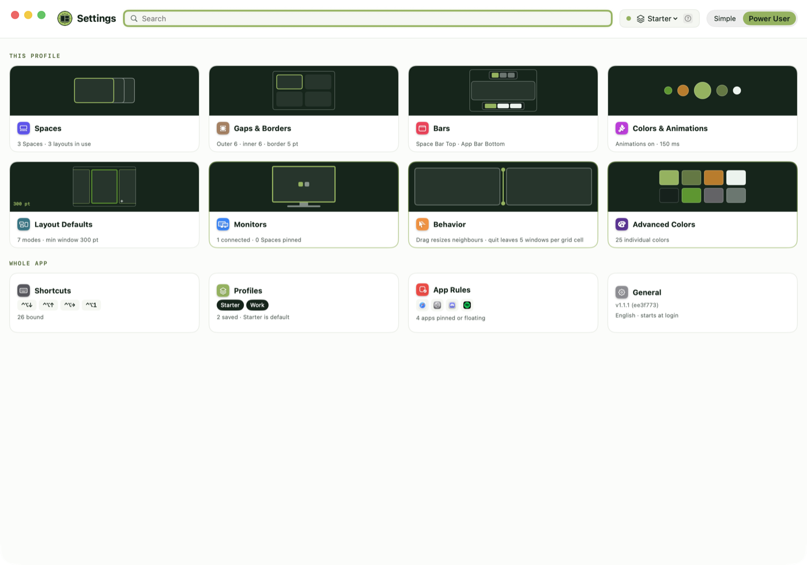
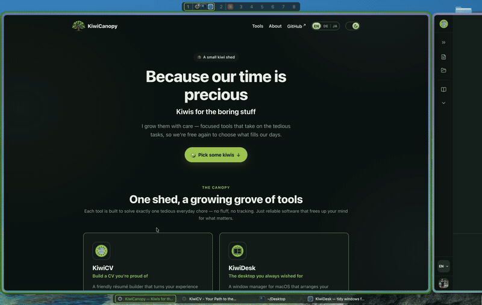

<div align="center">

<picture>
  <source media="(prefers-color-scheme: dark)"
    srcset="assets/dark_logo_wordmark.png">
  
</picture>

### A tiling window manager for macOS

Flat arrays instead of i3 trees · configured in Lua · seven
layouts · never disables SIP.

**Start simple. Grow without limits.** KiwiDesk tiles your windows
the moment you install it — no config required. When you want more,
go deeper: custom Lua, profiles, advanced layouts, per-space rules.
Powerful when you reach for it, never in your way.

<br>


[](https://github.com/KiwiCanopy/KiwiDesk/actions/workflows/ci.yml)
[](LICENSE)
[](https://github.com/KiwiCanopy/homebrew-tap)
[](https://github.com/KiwiCanopy/KiwiDesk/releases/latest)
[](https://kiwidesk.kiwicanopy.com/)

<br>

[](https://kiwidesk.kiwicanopy.com/docs/)
[](https://kiwidesk.kiwicanopy.com/docs/user-guide/)
[](https://kiwidesk.kiwicanopy.com/docs/recipes/)
[](https://github.com/sponsors/KiwiCanopy)
[](https://ko-fi.com/kiwicanopy)

</div>

<div align="center">

<picture>
  <source media="(prefers-color-scheme: dark)"
    srcset="assets/screenshot-settings-dark.png">
  
</picture>

<br><br>



</div>

<!-- Add a short demo video here once one is recorded. -->

KiwiDesk is written in Swift and configured in Lua. It pairs robust
window tracking with smooth, spring-based animations, runs as an
ordinary app with no kernel extension, and **never requires
disabling System Integrity Protection**.

## Why KiwiDesk?

**Flat arrays instead of i3 trees.** Classic tiling window managers
organize windows in split-container trees — powerful, but hard to
predict and hard to script. KiwiDesk keeps every space as a flat,
one-dimensional list of windows. Layouts are pure functions over
that list:

| Layout | Behavior |
|---|---|
| `bsp` | Binary space partitioning (each new window halves a pane) |
| `stack` | Master zone + stack column (`master_count`) |
| `scrolling` | Niri/PaperWM-style scrolling columns or rows |
| `monocle` | Focused window maximized, rest behind it |
| `grid` | Dynamic (auto-balanced) or rigid rows × columns |
| `track` | Resizable columns (or rows) with per-track control |
| `floating` | macOS default behavior, untouched |

Switching layouts instantly rearranges the same window list with a
different formula — no tree surgery, no lost state.

**Every layout is fully reconfigurable.** Each one carries its own
optional parameters — `bsp`'s split ratios and strategy, `stack`'s
master count, ratio and side, `scrolling`'s column width and
direction, `grid`'s dimensions and fill, `track`'s per-track sizes
— so the shape a layout opens in is yours to set, once, as the
default. Tune them in the Settings app or in Lua, globally or per
space; most tiling window managers give you a layout's formula and
nothing to bend it with.

## Key Features

- **Spaces**: Instant per-space window hiding on top of macOS's own
  Desktops.
- **GUI, CLI & Lua**: SwiftUI Settings app for simple tweaks; CLI &
  sandboxed Lua 5.5 VM for advanced workflows.
- **Modal Layers & Hotkeys**: Vim-style hotkey layers (`define_layer`)
  and smart app switching (`pull_or_spawn`) via Carbon — zero Input
  Monitoring needed.
- **Cascading Profiles**: Display- or Desktop-bound profiles with
  inherited defaults and sparse overrides.
- **Sticky Windows**: Pin a window so it follows you across Desktops,
  or just across one screen — with a real tile, not a floating pile.
- **Visual Overlays & IPC**: Customizable focus rings, App/Space Bar
  overlays, and UNIX socket JSON event streams (`kiwidesk subscribe`).
- **Smooth & Lightweight**: 60/120 Hz DisplayLink spring animations,
  zero SIP modifications, and localized out of the box.
- **Accessible**: Settings is fully keyboard-driven and narrates
  itself under VoiceOver — every control announces its name *and* its
  value. See the
  [user guide](https://kiwidesk.kiwicanopy.com/docs/user-guide/#using-settings-from-the-keyboard).

## Solving macOS Papercuts

- **No green-button exile**: `monocle` maximizes a window on the
  *current* space instead of throwing it onto a far-right Desktop.
- **No `⌘Tab` black holes**: `pull_or_spawn` opens the app, pulls its
  windows front-and-center, then cycles them on repeated presses.
- **Zero layout amnesia**: windows moved between spaces tile
  themselves into the target layout — no manual micro-resizing.
- **Predictable spatial memory**: spaces stay in fixed slots rather
  than macOS reshuffling your Desktops.

## Installation

Requirements: macOS 14 or later, on Apple silicon.

```sh
brew install --cask kiwicanopy/tap/kiwidesk
```

Or **[download the `.dmg`](https://kiwidesk.kiwicanopy.com/)** — the
same signed, notarized app; the cask additionally puts the `kiwidesk`
CLI on your `PATH`. Either way KiwiDesk keeps itself up to date.

On first launch a wizard walks you through the Accessibility
permission, then tiles your windows straight away. Everything past
that — Settings, the CLI, Lua — is in the
**[Quick Start](https://kiwidesk.kiwicanopy.com/docs/user-guide/)**.

### Building from source

For contributors, or to run an unreleased commit. Requirements:
macOS 14+, Xcode 16+ / Swift 6.

```sh
git clone https://github.com/KiwiCanopy/KiwiDesk.git
cd KiwiDesk
swift build -c release
.build/release/KiwiDesk           # run the app
```

## Documentation

Full docs live at
**[kiwidesk.kiwicanopy.com](https://kiwidesk.kiwicanopy.com/docs/)**
(searchable, light/dark):

- [User guide](https://kiwidesk.kiwicanopy.com/docs/user-guide/) —
  the Settings app, profiles, and the visual editor
- [Lua reference](https://kiwidesk.kiwicanopy.com/docs/lua-reference/) —
  the full init.lua API
- [CLI & IPC reference](https://kiwidesk.kiwicanopy.com/docs/cli/) —
  every command, event stream, socket protocol
- [Recipes](https://kiwidesk.kiwicanopy.com/docs/recipes/) —
  SketchyBar, JankyBorders, and more
- [Design decisions](https://kiwidesk.kiwicanopy.com/docs/design-decisions/) —
  the why behind settled behavior

## Contributing

KiwiDesk is built to be contributor-friendly (including for AI
coding agents — small files, strict lint, exhaustive tests).
See [CONTRIBUTING.md](CONTRIBUTING.md) and [AGENTS.md](AGENTS.md).

```sh
./scripts/install-hooks.sh   # once after cloning
swift test                   # the full suite
```

## Security

KiwiDesk needs only the Accessibility permission. It never asks
you to disable SIP and never requests Input Monitoring. To report
a vulnerability, see [SECURITY.md](SECURITY.md).

## License

[MIT](LICENSE). Bundles Lua 5.5 ([MIT](Vendor/CLua/LICENSE)).

---

KiwiDesk is free. If you like it, leave a ⭐ — it is the one
thing that helps other people find it.

<div align="center">
<br>
<sub>A <a href="https://kiwicanopy.com"><strong>KiwiCanopy</strong></a> project — Because our time
is precious 🥝</sub>
</div>
