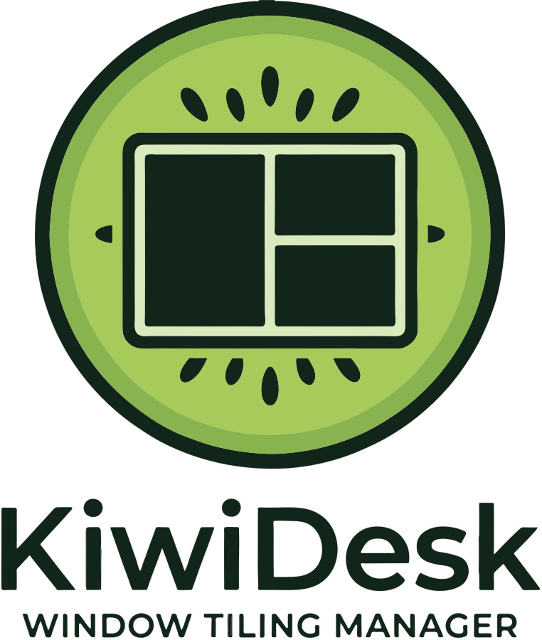

<div align="center">

<picture>
  <source media="(prefers-color-scheme: dark)"
    srcset="assets/dark_logo_wordmark.png">
  
</picture>

### A tiling window manager for macOS

Flat arrays instead of i3 trees · configured in Lua · seven
layouts · never disables SIP.

**Start simple. Grow without limits.** KiwiDesk tiles your windows
the moment you install it — no config required. When you want more,
go deeper: custom Lua, profiles, advanced layouts, per-space rules.
Powerful when you reach for it, never in your way.

<br>


[](https://github.com/KiwiCanopy/KiwiDesk/actions/workflows/ci.yml)
[](LICENSE)
[](https://github.com/KiwiCanopy/homebrew-tap)


<br>

[](https://kiwidesk.kiwicanopy.com/docs/)
[](https://kiwidesk.kiwicanopy.com/docs/user-guide/)
[](https://kiwidesk.kiwicanopy.com/docs/recipes/)
[](https://ko-fi.com/kiwicanopy)

</div>

<!-- Add a screenshot or demo GIF here once one is captured. -->
<!-- Add a short demo video here once one is recorded. -->

> **Status: public beta, on Homebrew.** The core (layouts, Lua
> config, CLI, profiles, per-Desktop profiles, per-space window
> hiding) and the SwiftUI Settings app are functional.
> Install it with the Homebrew cask below, which keeps itself
> current via `brew upgrade`; a signed, notarized `.dmg` follows
> once the app can update itself, so that a direct download is
> never a dead end — see
> [No distribution channel without an update path](https://kiwidesk.kiwicanopy.com/docs/design-decisions/#no-distribution-channel-without-an-update-path).
> KiwiDesk is
> distributed directly and **not** through the Mac App Store —
> see [Distribution](https://kiwidesk.kiwicanopy.com/docs/design-decisions/#distribution-direct-download-not-the-mac-app-store)
> for why.

KiwiDesk is a modular, high-performance tiling window manager for
macOS, written in Swift and configured in Lua. It combines robust
window tracking with smooth, spring-based animations, runs as an
ordinary app with no kernel extension, and **never requires
disabling System Integrity Protection**.

## Why KiwiDesk?

**Flat arrays instead of i3 trees.** Classic tiling window managers
organize windows in split-container trees — powerful, but hard to
predict and hard to script. KiwiDesk keeps every space as a flat,
one-dimensional list of windows. Layouts are pure functions over
that list:

| Layout | Behavior |
|---|---|
| `bsp` | Binary space partitioning (square-ish splits) |
| `stack` | Master zone + stack column (`master_count`) |
| `scrolling` | Niri/PaperWM-style scrolling columns or rows |
| `monocle` | Focused window maximized, rest behind it |
| `grid` | Dynamic (auto-balanced) or rigid rows × columns |
| `track` | Resizable columns (or rows) with per-track control |
| `floating` | macOS default behavior, untouched |

Switching layouts instantly rearranges the same window list with a
different formula — no tree surgery, no lost state.

## Key Features

- **Spaces**: Instant per-space window hiding on top of macOS's own
  Desktops.
- **GUI, CLI & Lua**: SwiftUI Settings app for simple tweaks; CLI &
  sandboxed Lua 5.5 VM for advanced workflows.
- **Modal Layers & Hotkeys**: Vim-style hotkey layers (`define_layer`) and
  smart app switching (`pull_or_spawn`) via Carbon — zero Input Monitoring needed.
- **Cascading Profiles**: Display- or Desktop-bound profiles with inherited
  defaults and sparse overrides.
- **Sticky Windows**: Pin a window so it stays with you across spaces, or
  just across one screen. It carries an on-window mark and a Space Bar
  badge, and where a layout tiles some windows and piles the rest, a
  sticky one keeps a real tile.
- **Visual Overlays & IPC**: Customizable focus rings, App/Space Bar
  overlays, and UNIX socket JSON event streams (`kiwidesk subscribe`).
- **Smooth & Lightweight**: 60/120 Hz DisplayLink spring animations, zero
  SIP modifications, and localized out of the box.

## Solving macOS Papercuts

- **No Green-Button Desktop Isolation**: The `monocle` layout maximizes
  windows on the *current space* without kicking you to a far-right Desktop.
- **No `⌘Tab` Black Holes**: `pull_or_spawn` opens the app, pulls its windows front-and-center, or cycles through all open windows of that app on repeated presses.
- **Zero Layout Amnesia**: Moving windows between spaces automatically tiles
  them into the target layout grid instead of forcing manual micro-resizing.
- **Predictable Spatial Memory**: KiwiDesk's spaces stay in fixed,
  predictable slots rather than macOS automatically shuffling your
  Desktops around.

## Installation

Requirements: macOS 14 or later.

```sh
brew install --cask kiwicanopy/tap/kiwidesk
```

The cask installs the app and puts the `kiwidesk` CLI on your
`PATH`. It ships from this project's own tap
([`KiwiCanopy/homebrew-tap`](https://github.com/KiwiCanopy/homebrew-tap));
the fully-qualified token above taps it for you, so there is no
separate `brew tap` step. The shorter `brew install --cask
kiwidesk` would need acceptance into homebrew-cask itself, which
is a post-beta step.

Later builds arrive the same way:

```sh
brew upgrade --cask kiwidesk
```

> Releases are signed with a stable Developer ID and notarized. If
> windows stop being managed after an upgrade, re-approve KiwiDesk
> in **System Settings › Privacy & Security › Accessibility**.

On first launch, an onboarding wizard walks you through granting
the Accessibility permission KiwiDesk needs to manage windows.

To start KiwiDesk automatically at login:

```sh
kiwidesk service start
```

### Building from source

For contributors, or to run an unreleased commit. Requirements:
macOS 14+, Xcode 16+ / Swift 6.

```sh
git clone https://github.com/KiwiCanopy/KiwiDesk.git
cd KiwiDesk
swift build -c release
.build/release/KiwiDesk           # run the app
```

## Quick Start

The CLI is the same binary — `kiwidesk` from the cask, or
`.build/release/KiwiDesk` from a source build:

```sh
kiwidesk set_mode monocle        # current space → monocle
kiwidesk focus left              # move focus
kiwidesk set_gap_global 12       # breathing room
kiwidesk help                    # list every command
```

Everyday settings live in the **Settings** app. Prefer Lua?
The config file `~/.config/KiwiDesk/init.lua` is created
all-commented on first launch — see the
[Lua reference](https://kiwidesk.kiwicanopy.com/docs/lua-reference/)
for the full API.

## Documentation

Full docs live at
**[kiwidesk.kiwicanopy.com](https://kiwidesk.kiwicanopy.com/docs/)**
(searchable, light/dark):

- [User guide](https://kiwidesk.kiwicanopy.com/docs/user-guide/) —
  the Settings app, profiles, and the visual editor
- [Lua reference](https://kiwidesk.kiwicanopy.com/docs/lua-reference/) —
  the full init.lua API
- [CLI & IPC reference](https://kiwidesk.kiwicanopy.com/docs/cli/) —
  every command, event stream, socket protocol
- [Recipes](https://kiwidesk.kiwicanopy.com/docs/recipes/) —
  SketchyBar, JankyBorders, and more
- [Design decisions](https://kiwidesk.kiwicanopy.com/docs/design-decisions/) —
  the why behind settled behavior

## Contributing

KiwiDesk is built to be contributor-friendly (including for AI
coding agents — small files, strict lint, exhaustive tests).
See [CONTRIBUTING.md](CONTRIBUTING.md) and [AGENTS.md](AGENTS.md).

```sh
./scripts/install-hooks.sh   # once after cloning
swift test                   # the full suite
```

## Security

KiwiDesk needs only the Accessibility permission. It never asks
you to disable SIP and never requests Input Monitoring. To report
a vulnerability, see [SECURITY.md](SECURITY.md).

## License

[MIT](LICENSE). Bundles Lua 5.5 ([MIT](Vendor/CLua/LICENSE)).

<div align="center">
<br>
<sub>A <a href="https://kiwicanopy.com"><strong>KiwiCanopy</strong></a> project — Because our time
is precious 🥝</sub>
</div>
