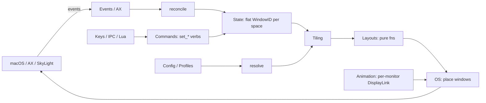
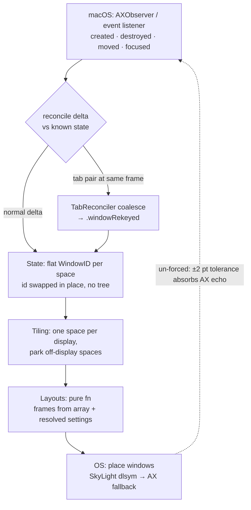
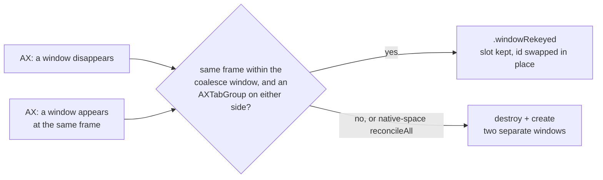
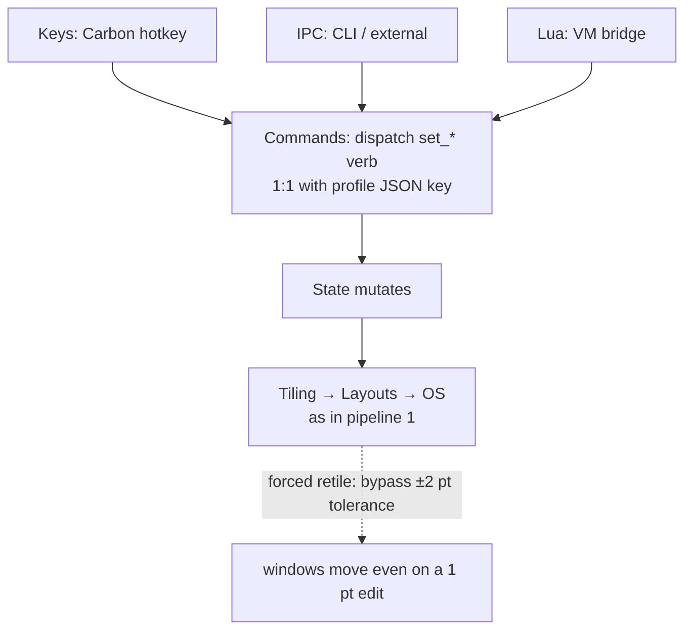
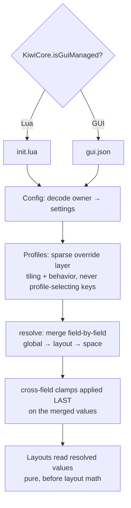
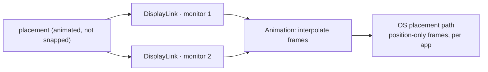

# Architecture — how work flows through KiwiDesk

Contributor-facing companion to **AGENTS.md §1** (the subsystem map).
That table says *where* each subsystem lives; this page traces *how* a
few end-to-end pipelines move through them, so a newcomer (human or AI)
can orient by following a real flow instead of a file index.

Deliberately at **directory altitude** — it names subsystems
(`State`, `Tiling`, …), not files, so it stays true across the file
splits the 350-line ceiling constantly forces. When a step has a
subtle rule, it links into the relevant **AGENTS.md §5** guardrail or a
`design-decisions.md` table rather than restating it.

Ground rule that shapes every pipeline: **windows live in a flat
`[WindowID]` array per space** — never a tree. Layout algorithms are
**pure functions over that array**. Keep both facts in view while
reading below.

---

## 1. Event → placement (the reconcile loop)

The core loop: the OS tells us windows changed, we update state, we
re-tile.

1. **`Events` / `AX`** — an `AXObserver` callback (window created,
   destroyed, moved, focused) or an event listener fires. AX callbacks
   arrive on the run loop of the thread that registered them; observer
   registration stays on the main thread (§5).
2. **reconcile** — the raw OS delta is reconciled against known state.
   The subtle case: macOS **native tabs** surface as one window
   vanishing while another appears at the same frame;
   `TabReconciler` coalesces that pair into a single `.windowRekeyed`
   (id swapped in place — no tree, one slot per group). See the native-
   tabs guardrail (§5) and the tab-reconcile notes in
   `design-decisions.md`. A window's `CGWindowID` is **not** stable.
3. **`State`** — the reconciled result mutates the flat
   `[WindowID]`-per-space array. Nothing tree-shaped enters here.
4. **`Tiling`** — lays out **one space per connected display** (each
   display's `activeSpace(on:)`) onto that display's own bounds, and
   parks every space visible on no display in a screen corner
   (`stashInactive`, keyed off `visibleSpaces`). The focused display's
   space is the global `activeSpace`; other displays' shown spaces are
   tracked alongside it, so switching focus to one monitor never hides
   another's. Single-monitor collapses to exactly one active space.
5. **`Layouts`** — a **pure function** computes frames from the array +
   resolved settings (no AX, no I/O — AX is slow and must never be
   called inside layout math; §5). Which model a layout uses
   (geometric neighbor-search vs array-order) is catalogued in the
   "Layout navigation & overflow models" table in
   `design-decisions.md` — a new layout adds its row there.
6. **`OS`** — computed frames are applied to real windows. The fast
   path resolves private SkyLight/CGS symbols at runtime via `dlsym`;
   every private call **falls back** to the public Accessibility API
   when the lookup returns nil (never link private symbols; never
   disable SIP — §5).

Event-driven retiles run **un-forced**, so the engine's ±2 pt "already
there" tolerance can absorb AX-echo lag without wobbling windows.
(Contrast with pipeline 2.)

**Tab reconciliation** (the subtle case in step 2). A native-tab
switch is temporal — one window disappears as another appears at the
same frame — so it must be coalesced, not read as destroy + create:

## 2. Command dispatch (`set_*` verbs)

User intent — a hotkey, a CLI call, or a Lua statement — becomes a
command that mutates state and re-tiles.

1. **`Keys`** (Carbon `RegisterEventHotKey`, chosen to avoid the Input
   Monitoring permission — §5), **`IPC`** (CLI / external), or **`Lua`**
   (VM bridge) originates the intent.
2. **`Commands`** — dispatches the `set_*` verb. The verb vocabulary is
   shared one-to-one with profile JSON keys (`set_gap_override` →
   `gap.override`); pick the Lua name first, derive the JSON key (§5).
3. **`State`** mutates, then **Tiling → Layouts → OS** run exactly as in
   pipeline 1.

Key difference from pipeline 1: every retile triggered by an explicit
`set_*` **forces** (`retile(force: true)`), bypassing the ±2 pt
tolerance so a 1 pt gap edit actually moves windows (§5). Explicit =
forced; event-driven = un-forced.

Lua safety seam: the watchdog is an instruction-count hook — it
**cannot** interrupt a blocking C call. Anything that blocks in C
(external commands) goes through `ExecLauncher`, never inline on the
main thread (§5).

## 3. Config resolve (global → layout → space, + profiles)

How settings become the values a layout function reads.

1. **`Config`** decodes the active owner — `init.lua` (Lua) or
   `gui.json` (GUI) — into settings. Ownership is decided by the single
   `KiwiCore.isGuiManaged` predicate (§5); never add a second.
2. **`Profiles`** layer a **sparse override** on top: a profile
   serializes tiling state and may carry sparse overrides of *behavior*
   settings (keybindings, app/float/ignore rules) — but never a setting
   that *routes or selects the profile itself* (§5).
3. **resolve** — settings that layer (global → layout → space) merge
   **field-by-field**, with cross-field clamps applied **last** on the
   already-merged values (the `AppBarStyle.resolved…` pattern).
   Resolution runs **before** layout math so layout functions stay pure
   over the flat array (§5).

Hand-mirrored field lists here are guarded by parity tests — see
`.claude/rules/parity-tests.md`.

## 4. Animation (per-monitor)

When placement is animated rather than snapped, frames are driven by
**one `DisplayLink` per monitor** (never a single global timer —
displays can mix refresh rates; §5). The `Animation` subsystem
interpolates and hands each frame to the same `OS` placement path as
pipeline 1's final step. Position-only frames are applied per app for
efficiency.

---

## Where to go next

- **AGENTS.md §1** — the subsystem/target map (the *where*).
- **AGENTS.md §5** — the guardrails each step above links to (the
  *why it's subtle*).
- **`design-decisions.md`** — the layout navigation/overflow table
  and tab-reconcile model (the *decided tradeoffs*); the
  [Accepted limitations](accepted-limitations.md) page collects the
  bugs-by-design.
