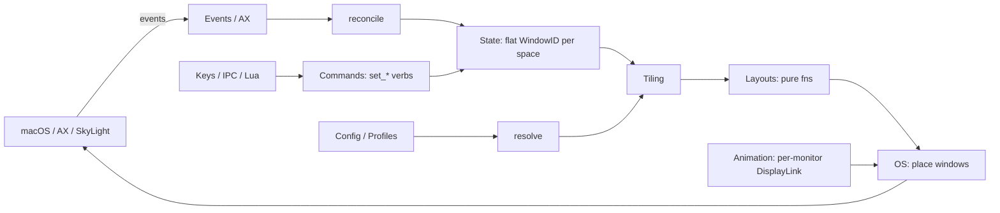
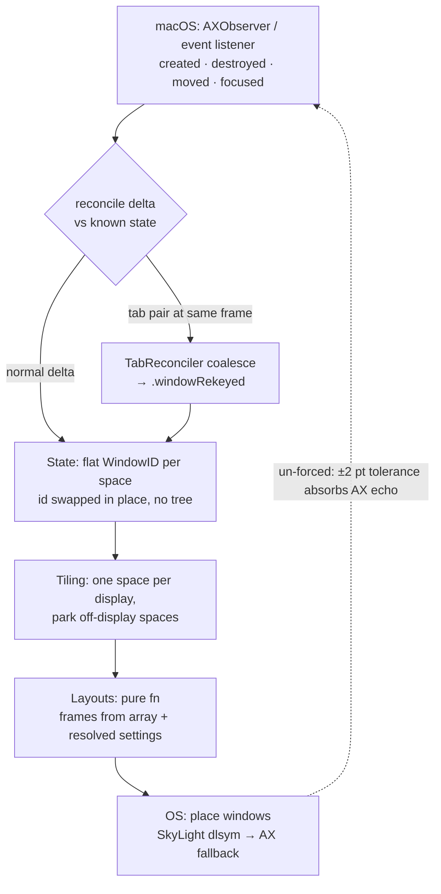
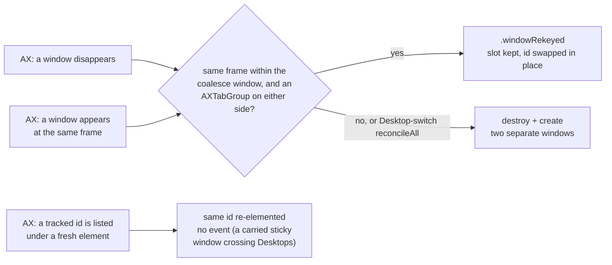
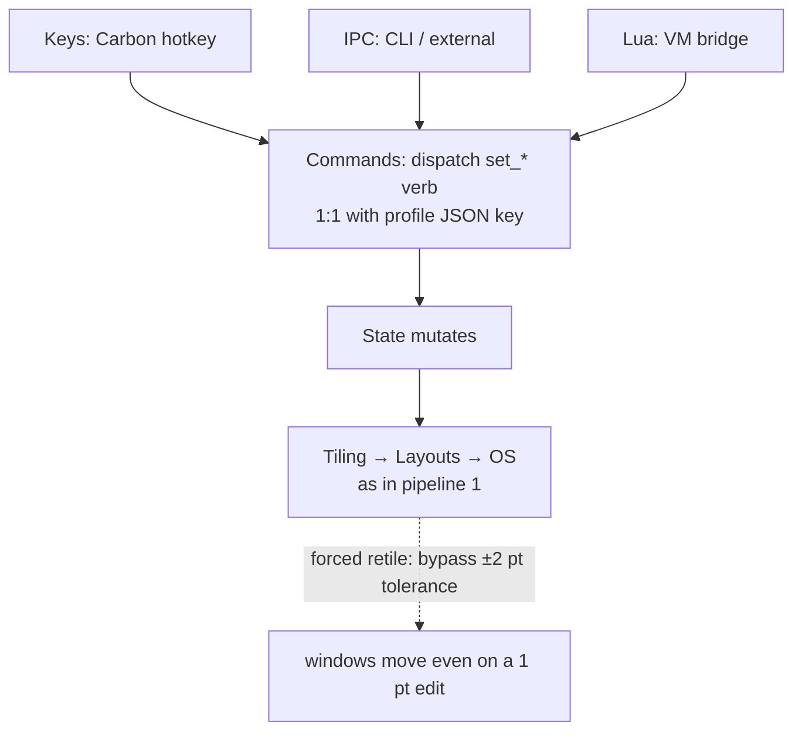
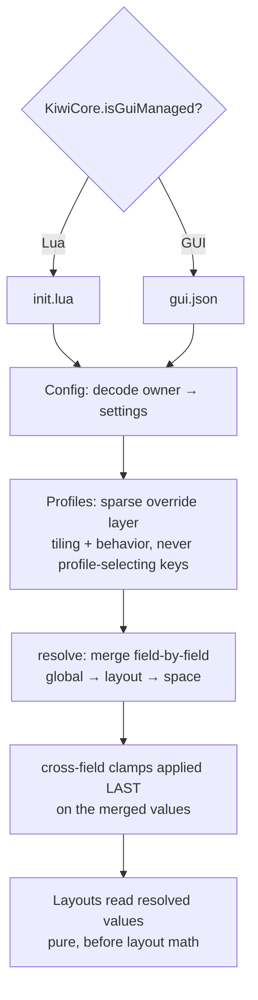
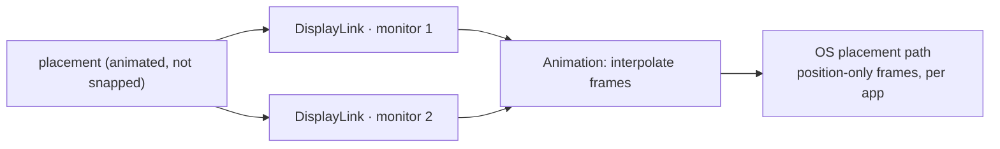
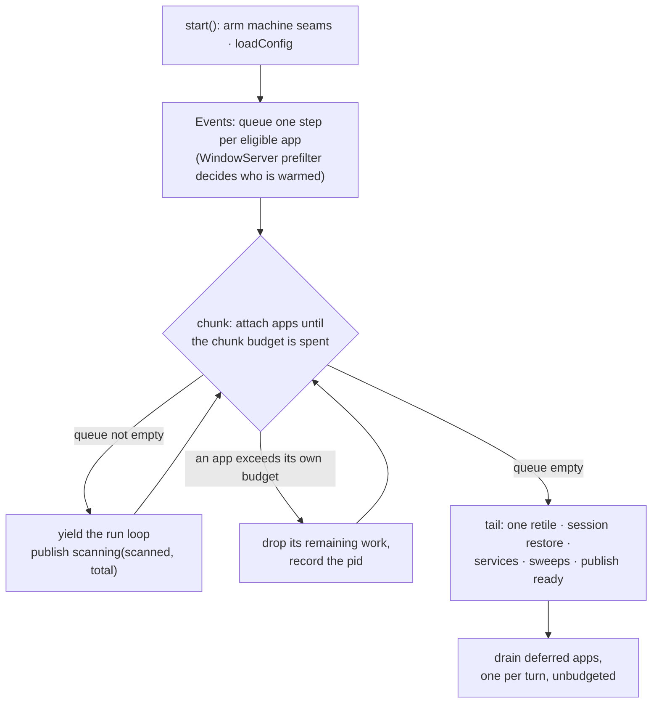

# Architecture — how work flows through KiwiDesk

Companion to **AGENTS.md §1**, the subsystem map: that table is
the *where*, the pipelines below are the *how*. They name
subsystems (`State`, `Tiling`, …), never files, so a file split
under the 350-line ceiling leaves them true; a step's rule is
cited (**AGENTS.md §5**, `design-decisions.md`), not restated.

Every pipeline runs over one state model: **windows live in a
flat `[WindowID]` array per space**, never a tree, and layout
algorithms are **pure functions over that array** (§5).

---

## 1. Event → placement (the reconcile loop)

1. **`Events` / `AX`** — an `AXObserver` callback (window created,
   destroyed, moved, focused) or an event listener fires. AX
   callbacks arrive on the run loop of the thread that registered
   them, and observer registration stays on the main thread (§5).
   A move/resize notification carries no geometry: the frame is
   read back on a per-app background queue, newest-wins coalesced,
   and delivered to the main actor afterwards
   (`FrameReadCoalescer`, #618).
2. **reconcile** — the raw OS delta is reconciled against known
   state. macOS **native tabs** surface as one window vanishing
   while another appears at the same frame; `TabReconciler`
   coalesces that pair into a single `.windowRekeyed` — id swapped
   in place, one slot per group — never a destroy + create (§5,
   and the tab-reconcile notes in `design-decisions.md`). A
   window's `CGWindowID` is **not** stable.
3. **`State`** — the reconciled result mutates the flat
   `[WindowID]`-per-space array.
4. **`Tiling`** — lays out **one space per connected display**
   (each display's `activeSpace(on:)`) onto that display's own
   bounds, and parks every space visible on no display in a screen
   corner (`stashInactive`, keyed off `visibleSpaces`). The focused
   display's space is the global `activeSpace`; the other
   displays' shown spaces are tracked alongside it, so focusing
   one monitor never hides another's. A single monitor has exactly
   one active space.
5. **`Layouts`** — a **pure function** computes frames from the
   array and the resolved settings: no AX, no I/O (§5). Each
   layout's model (geometric neighbor-search vs array-order) is a
   row of the "Layout navigation & overflow models" table in
   `design-decisions.md`; a new layout adds its row there.
6. **`OS`** — the frames are applied to real windows. The fast
   path resolves private SkyLight/CGS symbols at runtime via
   `dlsym`, and every private call **falls back** to the public
   Accessibility API when the lookup returns nil — never link
   private symbols, never disable SIP (§5). SkyLight's ObjC
   window-management operation classes resolve the same way
   through one wrapper, `WMBridge`: a class that does not resolve
   reads as the capability absent.

Event-driven retiles run **un-forced**: the engine's ±2 pt
"already there" tolerance absorbs AX-echo lag (contrast pipeline
2). A size an app refuses twice — or once, when its own compliance
echo shows it performed the ask and then revoked it (#1049) — is
learned as that window's **effective bound** (#677): the refused
target is no longer re-issued, and Scrolling/Monocle place the
residue (re-pack / center) from the learned answer. A second ask,
sent the moment the first entry confirms, corroborates the bound
(#1439). BSP and Stack move their stored split ratio at retile to
draw a corroborated floor; where the floors cannot share the span,
the frame the retile issues lands inward of the slot (#934), and
the slots readers classify against stay the layout's own.

**Tab reconciliation** (step 2):

At a Desktop switch, `App` carries every reach-enabled sticky
window onto the arriving Desktop through `WMBridge` (#1145); the
reconcile that follows sees those ids vanish and return under
fresh AX elements, and re-registers them in place.

Every other window of the left Desktop *is* destroyed and
re-created by that reconcile, and the destroy fold walks
`Space.focused` off it as a close would. A fast app's destroys can
land before the switch notification, so the focus handler in `App`
remembers each space's last honored focus at the report, under the
native Space the WindowServer hosts the window on. The switch
handler's return owes that focus as a bounded debt: the
`.windowCreated` fold pays it at the window's own arrival, holds
the vacancy against earlier re-tracks, and stands the 600 ms
settle's refocus down until it is paid. Each departed window
carries its slot, so the row re-forms in the order it left
(#1207). A Desktop move that named a Space is paid the same way:
the pending name replaces the departing window's remembered Space,
and the arrival files it where the user said (#1150).

The destroy handler asks the WindowServer which Desktop hosts the
departed window — the per-Desktop census in `OS`, two private list
reads per user Desktop, up and parked, nil where the symbol is
absent — and reports `vanished` or `closed` on that answer. A
`vanished` window is filed in the away ledger beside the state
(`StateCoordinator.awayWindows`, #1146). The ledger is reach and
bookkeeping, never a bar row — the Space Bar draws the Desktop in
front of the user (#1228). Open-or-Focus reaches a ledger window
over the bridge, and a census at the Desktop settle — and every
five seconds while the ledger is non-empty — prunes a window
closed while away with a corrective `closed`.

## 2. Command dispatch (`set_*` verbs)

1. **`Keys`** (Carbon `RegisterEventHotKey` — no Input Monitoring
   permission; §5), **`IPC`** (CLI / external) or **`Lua`** (VM
   bridge) originates the intent.
2. **`Commands`** — dispatches the `set_*` verb. The verb
   vocabulary is one-to-one with the profile JSON keys
   (`set_gap_override` → `gap.override`): pick the Lua name first
   and derive the JSON key (§5).
3. **`State`** mutates, then **Tiling → Layouts → OS** run as in
   pipeline 1.

Every retile an explicit `set_*` triggers is an **apply**
(`retile(pass: .apply)`): it bypasses the ±2 pt tolerance, so a
1 pt gap edit moves windows (§5), and probes past the learned app
size bounds once. A Space or Desktop switch is a **reissue** —
past the tolerance, no probe — and everything event-driven is the
default `.event` pass (`RetilePass`).

A commanded focus in a Monocle Space goes through the flip door
(`App/KiwiCore+MonocleFlip`), which plays the card flip from
`Animation/` and lands the ordinary `focusWindow` once the blur
covers the surface. A later command that reads the focused window
lands that focus ahead of its own dispatch (#1391).

The Lua watchdog is an instruction-count hook and **cannot**
interrupt a blocking C call, so anything that blocks in C
(external commands) goes through `ExecLauncher`, never inline on
the main thread (§5).

## 3. Config resolve (global → layout → space, + profiles)

1. **`Config`** decodes the active owner — `init.lua` (Lua) or
   `gui.json` (GUI) — into settings. The single
   `KiwiCore.isGuiManaged` predicate decides ownership (§5); never
   add a second.
2. **`Profiles`** layer on top: a profile serializes tiling state
   and may carry **sparse overrides** of *behavior* settings
   (keybindings, app/float/ignore rules), never a setting that
   *routes or selects the profile itself* (§5).
3. **resolve** — settings that layer (global → layout → space)
   merge **field-by-field**, and cross-field clamps apply **last**,
   on the merged values (the `AppBarStyle.resolved…` pattern).
   Resolution runs **before** layout math (§5).

Hand-mirrored field lists here are guarded by parity tests — see
`.claude/rules/parity-tests.md`.

## 4. Animation (per-monitor)

Animated placement is driven by **one `DisplayLink` per monitor**,
never a single global timer (§5). `Animation` interpolates and
hands each frame to the `OS` placement path of pipeline 1's final
step; position-only frames are applied per app.

## 5. Boot (launch → the first arrangement)

Boot is the one **chunked** pipeline: an unchunked scan holds the
main actor — the run loop the menu-bar item and the ⌃⌥K panel are
served from — for as long as the AX calls take (~10 s on a session
with 109 running apps). The argument, and the rejected shapes, are
`design-decisions.md` ▸ Boot.

1. **`App`** — `start()` arms the machine seams (frontmost app,
   click provenance, pointer warp) and loads the config. Nothing
   attaches before this, or the prefilter in step 2 tests nothing.
2. **`Events`** — the queue admits only apps a pass can act on
   (`EventLoop.bootPassAdmits`): faceless helpers and ignore-listed
   apps never enter it. Among the admitted, one
   `CGWindowListCopyWindowInfo` snapshot decides which apps get the
   AX window query and warmup at attach; the rest keep their
   observer and are warmed by a later reconcile (§5, the #662
   promise).
3. **chunks** — each chunk attaches apps until its budget is
   spent, then hands the run loop back, so the menu answers at any
   point after launch. Every chunk publishes
   `scanning(scanned, total)`, which the menu-bar mark, the quick
   menu's count row and the tour's grant screen read.
4. **the per-app budget** — one app's AX work is indivisible, so a
   chunk overruns by whatever that app costs. Past its own budget
   an app's remaining boot work is dropped and completed after the
   tail (see [Accepted limitations](accepted-limitations.md)).
5. **the tail** — one `retile` lands the first arrangement, the
   previous session's layout is restored, and the long-running
   services and the repair sweeps start. The readiness phase
   becomes `ready`, the signal the dimmed menu-bar mark withholds.

The startup sweep one second later takes the same chunked,
budgeted path and re-tracks what cold AX trees under-reported.

---

## Where to go next

- **AGENTS.md §1** — the subsystem/target map.
- **AGENTS.md §5** — the guardrails each step above links to.
- **`design-decisions.md`** — the layout navigation/overflow table
  and the tab-reconcile model; the
  [Accepted limitations](accepted-limitations.md) page collects
  the bugs-by-design.
