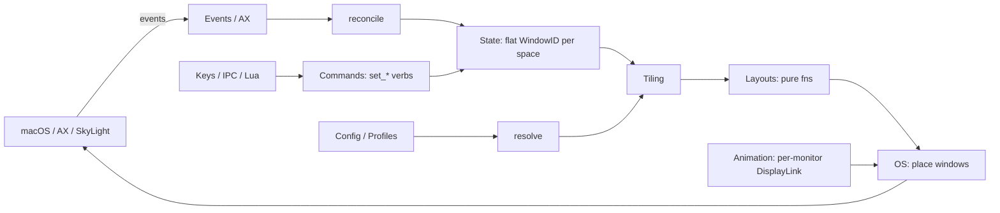
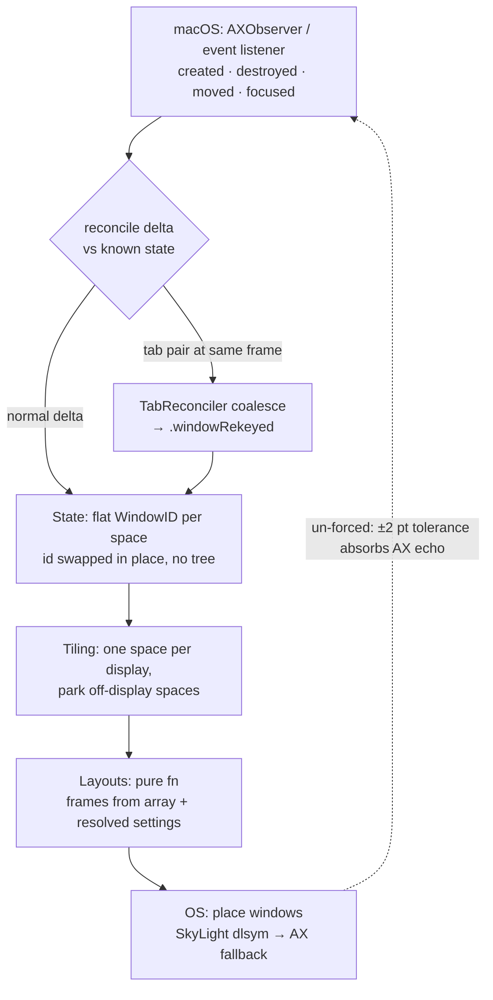
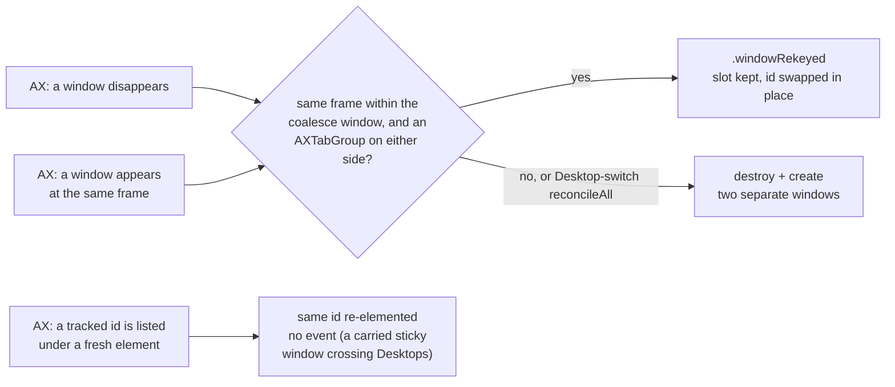
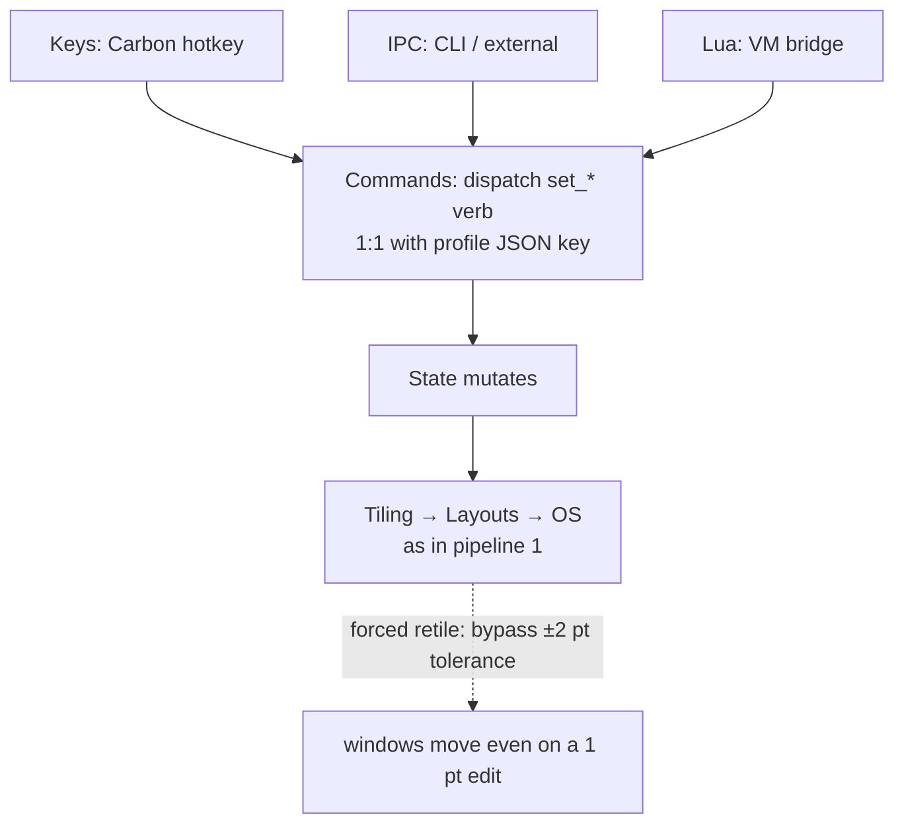
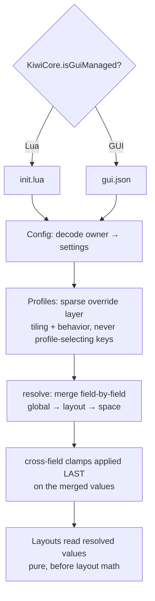
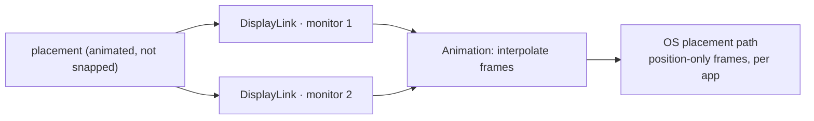
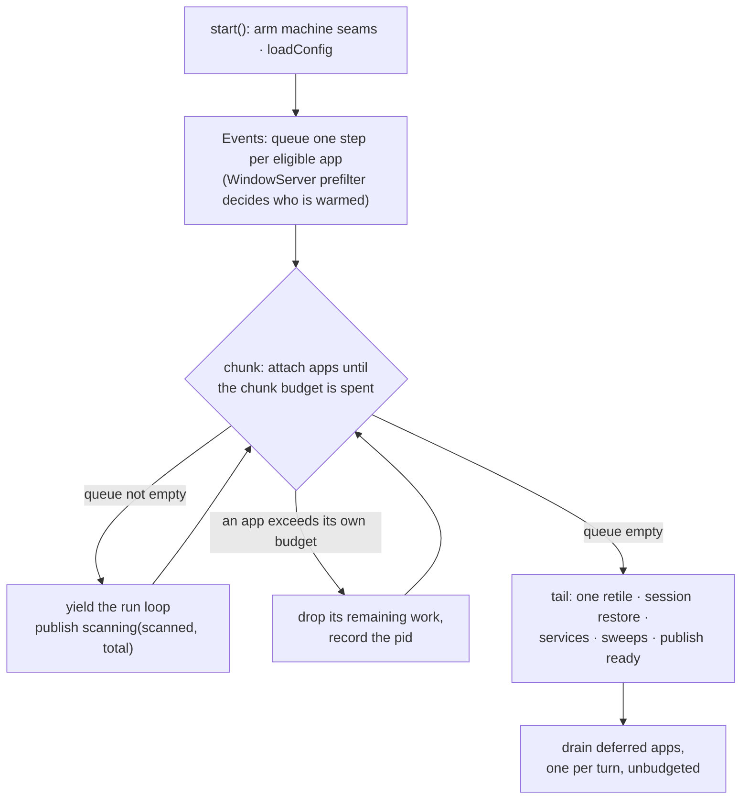

# Architecture — how work flows through KiwiDesk

Contributor-facing companion to **AGENTS.md §1** (the subsystem map).
That table says *where* each subsystem lives; this page traces *how* a
few end-to-end pipelines move through them, so a newcomer (human or AI)
can orient by following a real flow instead of a file index.

Deliberately at **directory altitude** — it names subsystems
(`State`, `Tiling`, …), not files, so it stays true across the file
splits the 350-line ceiling constantly forces. When a step has a
subtle rule, it links into the relevant **AGENTS.md §5** guardrail or a
`design-decisions.md` table rather than restating it.

Ground rule that shapes every pipeline: **windows live in a flat
`[WindowID]` array per space** — never a tree. Layout algorithms are
**pure functions over that array**. Keep both facts in view while
reading below.

---

## 1. Event → placement (the reconcile loop)

The core loop: the OS tells us windows changed, we update state, we
re-tile.

1. **`Events` / `AX`** — an `AXObserver` callback (window created,
   destroyed, moved, focused) or an event listener fires. AX callbacks
   arrive on the run loop of the thread that registered them; observer
   registration stays on the main thread (§5). A move/resize
   notification carries no geometry, so its frame is read back on a
   per-app background queue with newest-wins coalescing and delivered
   to the main actor afterwards (`FrameReadCoalescer`, #618) — the
   read is blocking IPC into an app that is busiest exactly when it
   storms, and reading inline froze the focus ring.
2. **reconcile** — the raw OS delta is reconciled against known state.
   The subtle case: macOS **native tabs** surface as one window
   vanishing while another appears at the same frame;
   `TabReconciler` coalesces that pair into a single `.windowRekeyed`
   (id swapped in place — no tree, one slot per group). See the native-
   tabs guardrail (§5) and the tab-reconcile notes in
   `design-decisions.md`. A window's `CGWindowID` is **not** stable.
3. **`State`** — the reconciled result mutates the flat
   `[WindowID]`-per-space array. Nothing tree-shaped enters here.
4. **`Tiling`** — lays out **one space per connected display** (each
   display's `activeSpace(on:)`) onto that display's own bounds, and
   parks every space visible on no display in a screen corner
   (`stashInactive`, keyed off `visibleSpaces`). The focused display's
   space is the global `activeSpace`; other displays' shown spaces are
   tracked alongside it, so switching focus to one monitor never hides
   another's. Single-monitor collapses to exactly one active space.
5. **`Layouts`** — a **pure function** computes frames from the array +
   resolved settings (no AX, no I/O — AX is slow and must never be
   called inside layout math; §5). Which model a layout uses
   (geometric neighbor-search vs array-order) is catalogued in the
   "Layout navigation & overflow models" table in
   `design-decisions.md` — a new layout adds its row there.
6. **`OS`** — computed frames are applied to real windows. The fast
   path resolves private SkyLight/CGS symbols at runtime via `dlsym`;
   every private call **falls back** to the public Accessibility API
   when the lookup returns nil (never link private symbols; never
   disable SIP — §5). The same runtime-resolution discipline
   covers SkyLight's ObjC window-management operation classes
   through one wrapper, `WMBridge`: a class that does not
   resolve reads as the capability absent.

Event-driven retiles run **un-forced**, so the engine's ±2 pt "already
there" tolerance can absorb AX-echo lag without wobbling windows.
(Contrast with pipeline 2.) A size an app refuses twice — or once,
when its own compliance echo proves it performed the ask and then
revoked it (#1049) — is learned as that window's **effective bound**
(#677): the refused target stops being re-issued, and
Scrolling/Monocle consume the learned answer to place the residue
(re-pack / center).

**Tab reconciliation** (the subtle case in step 2). A native-tab
switch is temporal — one window disappears as another appears at the
same frame — so it must be coalesced, not read as destroy + create:

A Desktop switch is also where `App` carries every reach-enabled
sticky window onto the arriving Desktop through `WMBridge`
(#1145), so the reconcile that follows sees those ids vanish and
return under fresh AX elements — re-registered in place, never
destroyed and re-created.

Every other window of the left Desktop *is* destroyed and
re-created by that reconcile, and the destroy fold walks
`Space.focused` off it exactly as a close would — and a fast
app's destroys can land before the switch notification does. So
the focus handler in `App` remembers each space's last honored
focus at the report, under the native Space the WindowServer
hosts the window on; the switch handler's return owes it as a
bounded debt that the `.windowCreated` fold pays at that window's
own arrival, holding the vacancy against earlier re-tracks and
standing the 600 ms settle's refocus down until it is paid; and
each departed window carries its slot so the row re-forms in the
order it left (#1207).

## 2. Command dispatch (`set_*` verbs)

User intent — a hotkey, a CLI call, or a Lua statement — becomes a
command that mutates state and re-tiles.

1. **`Keys`** (Carbon `RegisterEventHotKey`, chosen to avoid the Input
   Monitoring permission — §5), **`IPC`** (CLI / external), or **`Lua`**
   (VM bridge) originates the intent.
2. **`Commands`** — dispatches the `set_*` verb. The verb vocabulary is
   shared one-to-one with profile JSON keys (`set_gap_override` →
   `gap.override`); pick the Lua name first, derive the JSON key (§5).
3. **`State`** mutates, then **Tiling → Layouts → OS** run exactly as in
   pipeline 1.

Key difference from pipeline 1: every retile triggered by an explicit
`set_*` **forces** (`retile(force: true)`), bypassing the ±2 pt
tolerance so a 1 pt gap edit actually moves windows (§5). Explicit =
forced; event-driven = un-forced.

Lua safety seam: the watchdog is an instruction-count hook — it
**cannot** interrupt a blocking C call. Anything that blocks in C
(external commands) goes through `ExecLauncher`, never inline on the
main thread (§5).

## 3. Config resolve (global → layout → space, + profiles)

How settings become the values a layout function reads.

1. **`Config`** decodes the active owner — `init.lua` (Lua) or
   `gui.json` (GUI) — into settings. Ownership is decided by the single
   `KiwiCore.isGuiManaged` predicate (§5); never add a second.
2. **`Profiles`** layer a **sparse override** on top: a profile
   serializes tiling state and may carry sparse overrides of *behavior*
   settings (keybindings, app/float/ignore rules) — but never a setting
   that *routes or selects the profile itself* (§5).
3. **resolve** — settings that layer (global → layout → space) merge
   **field-by-field**, with cross-field clamps applied **last** on the
   already-merged values (the `AppBarStyle.resolved…` pattern).
   Resolution runs **before** layout math so layout functions stay pure
   over the flat array (§5).

Hand-mirrored field lists here are guarded by parity tests — see
`.claude/rules/parity-tests.md`.

## 4. Animation (per-monitor)

When placement is animated rather than snapped, frames are driven by
**one `DisplayLink` per monitor** (never a single global timer —
displays can mix refresh rates; §5). The `Animation` subsystem
interpolates and hands each frame to the same `OS` placement path as
pipeline 1's final step. Position-only frames are applied per app for
efficiency.

## 5. Boot (launch → the first arrangement)

Everything above assumes KiwiDesk already knows the desk. Learning it
is its own pipeline, and the only one that is **chunked**: the scan
would otherwise hold the main actor — the run loop the menu-bar item
and the ⌃⌥K panel are served from — for as long as the AX calls take
(~10 s on a session with 109 running apps).

1. **`App`** — `start()` arms the machine seams (frontmost app, click
   provenance, pointer warp) and loads the config. Nothing is
   attached before this: an attach that ran earlier would make the
   prefilter below test nothing.
2. **`Events`** — the queue admits only apps a pass can act on
   (`EventLoop.bootPassAdmits`): faceless helpers and ignore-listed
   apps never enter it, which is also what keeps the published
   `scanning(scanned, total)` an honest workload. Among the admitted,
   one `CGWindowListCopyWindowInfo` snapshot decides which apps get
   the expensive AX window query and warmup at attach; the rest keep
   their observer and are warmed by a later reconcile (§5, the #662
   promise).
3. **chunks** — each chunk attaches apps until its budget is spent and
   then hands the run loop back, so the menu answers at any point
   after launch. Every chunk publishes how far the scan has got, which
   is what the menu-bar mark, the quick menu's count row and the
   tour's grant screen read.
4. **the per-app budget** — one app's AX work is indivisible, so a
   chunk overruns by whatever that app costs. Past its own budget an
   app's remaining boot work is dropped and completed after the tail
   (see [Accepted limitations](accepted-limitations.md)).
5. **the tail** — the whole desk is known, so one `retile` lands the
   first arrangement, the previous session's layout is restored, and
   the long-running services and the repair sweeps start. The
   readiness phase becomes `ready`, which is the signal the dimmed
   menu-bar mark was withholding.

The startup sweep one second later takes the same chunked, budgeted
path — it re-tracks what cold AX trees under-reported, and unchunked
it re-broke the menu right after the scan freed it. Why the wait is
narrated rather than hidden, and what was rejected, is
`design-decisions.md` ▸ Boot.

---

## Where to go next

- **AGENTS.md §1** — the subsystem/target map (the *where*).
- **AGENTS.md §5** — the guardrails each step above links to (the
  *why it's subtle*).
- **`design-decisions.md`** — the layout navigation/overflow table
  and tab-reconcile model (the *decided tradeoffs*); the
  [Accepted limitations](accepted-limitations.md) page collects the
  bugs-by-design.
