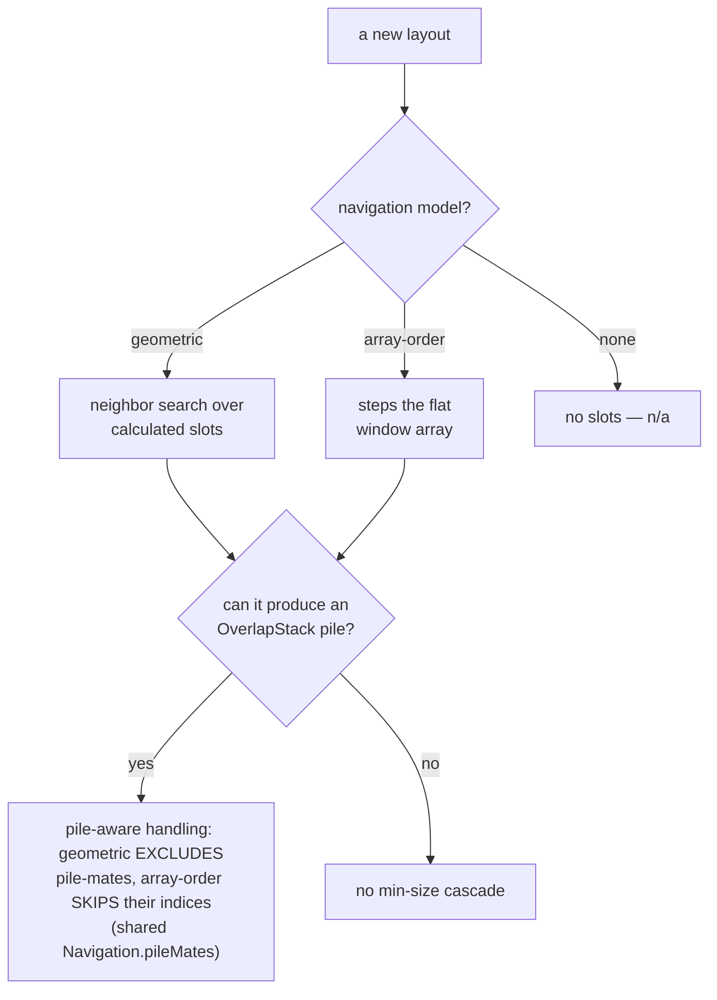

# Design decisions

The settled product and design decisions behind KiwiDesk,
with the reasoning — so users understand why things behave
the way they do, and contributors don't relitigate (or
accidentally undo) a settled choice. Two parts: **Architecture
& product model** (decisions rooted in the engine and config
model) and **Settings GUI & UX** (decisions about the Settings
app and menu bar; many from the #68/PR #88 redesign). Deeper
rationale lives in the linked issues. The cross-cutting
Settings control conventions live in
[Settings UI patterns](ui-patterns.md); binding code rules and
guardrails live in `AGENTS.md`, not here.

## How to read this file (charter)

An entry earns its place by one test: **a contributor working in that
area would otherwise re-litigate it or undo it by mistake.** If the
code already says *what* and there's no non-obvious *why*, it belongs
in git history, not here — so this file stays a design doc, not an
event log.

Each entry is tagged with its **kind** on the line under its heading:

- **[Principle]** — a durable rule that constrains future work. Obey
  it.
- **[Rationale]** — why a choice that looks wrong or arbitrary is
  actually right. Read it before "fixing" the thing.
- **[Trade-off]** — a deliberately-accepted limitation (chief
  among them the reader-facing
  [Accepted limitations](accepted-limitations.md) page and the
  [Blocked by macOS (SIP)](#blocked-by-macos-sip) table).
- **[Map]** — a cross-cutting table a new feature must keep updated
  (the [layout navigation &amp; overflow models](#layout-navigation--overflow-models)
  table).

The file is grouped **by topic**, not by kind, so everything decided
about one area sits together. Adding an entry: give it a kind tag; if
it can't take one, that's the signal it doesn't belong here.

## Architecture & product model

### Product principle: approachable by default, powerful on demand

**[Principle]**

KiwiDesk should give a new user a good tiling setup with almost no
configuration — strong defaults and a handful of obvious controls.
That simplicity must never cap what's achievable: beneath every easy
surface is a deeper layer (Lua config, profiles, advanced layouts,
per-space overrides) that's there when wanted and never required to
begin. Depth is a capability you grow into, not a cost you pay
upfront.

This sits alongside the GUI north-star (`AGENTS.md` §2 — simplicity,
intuitiveness, Apple-native feeling), not inside it: the north-star
governs how a surface *feels* and how to break ties; this principle
governs the *shape of capability* — a shallow floor with a high
ceiling. It's why "simplicity-first" doesn't mean "underpowered," and
it's a deeply Apple-native ethos (products that read simple but
reward digging in). The read-only shortcuts panel (#326) is the shape
in miniature: a dead-simple glance surface, with one "Edit in
Settings…" bridge down to the full editor — simple entry, deeper
layer one click away, never forced.

### Accepted limitations

**[Trade-off]**

Some behaviors are *bugs by design* — accepted consequences of a
settled architectural trade, not defects to fix. The full table —
for each: it's known, here's why, here's the architectural root,
here's the real fix where one is planned — lives on its own
reader-facing page: **[Accepted limitations](accepted-limitations.md)**.
Its rows link back into the reasoning on this page.

Convention: when a review or manual pass classifies a behavior as
accepted-by-architecture, it adds a row **there** in the same change
set — the user-facing twin of the `AGENTS.md` §5 guardrail rule.
A row needs an architectural root and, where one exists, the
planned escape hatch; it is not a wontfix dumping ground.

### Blocked by macOS (SIP)

**[Trade-off]**

A separate class: capabilities macOS forbids without disabling
**System Integrity Protection**. KiwiDesk drives macOS Desktops
through private SkyLight/CGS symbols resolved at runtime, and
some operations that *write* the Desktop arrangement are gated by
SIP. KiwiDesk **never disables SIP or asks a user to** — a
disabled-SIP requirement is a non-starter for a window manager
(`AGENTS.md` §5), so these stay unimplemented rather than
shipping a fragile fast path with no safe fallback. Unlike the
[Accepted limitations](accepted-limitations.md) trades, the root
is the OS, not our architecture, and there is no in-app escape
hatch — only Apple exposing a supported API.

**An item leaves this class when a SIP-clean path to it exists**,
and the entry below on the window-management bridge rules what
counts as one. What remains here is tracked, not abandoned:

- **Restore windows across all Desktops on quit**
  ([#70](https://github.com/KiwiCanopy/KiwiDesk/issues/70)).
- **Place a window above the top screen border** — the
  WindowServer silently rejects any frame above the visible
  area's top edge. (Partial left/right/bottom overflow is
  allowed; fully offscreen frames clamp back to a title-bar
  sliver on every edge.) So a
  vertical scrolling row scrolled past the top cannot tuck above
  the screen with its lower strip peeking, the way a true
  scroll would; `ScrollingLayout` pins those rows at the border
  instead — their *upper* strip peeks — so retile targets stay
  achievable and the already-there tolerance keeps working.
  Horizontal scrolling is unaffected
  ([#139](https://github.com/KiwiCanopy/KiwiDesk/issues/139);
  the pin shipped with
  [#66](https://github.com/KiwiCanopy/KiwiDesk/issues/66)).
  On the other edges — when no screen lies beyond them —
  KiwiDesk pins far-offscreen slots at its own fixed sliver,
  safely above the OS minimum, for the same achievable-target
  reason
  ([#142](https://github.com/KiwiCanopy/KiwiDesk/issues/142));
  an edge with a screen beyond it is a hard stop instead — a
  product decision, not an OS limit: see *Scrolling at a screen
  seam* under Layout and resize behavior
  ([#878](https://github.com/KiwiCanopy/KiwiDesk/issues/878)).
  Stashed inactive-space windows park at the same
  floor-derived sliver
  ([#148](https://github.com/KiwiCanopy/KiwiDesk/issues/148)).
- **Pin a foreign floating window above the tiled plane by its
  window-server level** — `SLSSetWindowLevel` only affects windows
  owned by the *connection* that issues it, so KiwiDesk can level
  its own overlays but not another app's floats. yabai reaches
  foreign windows by injecting into `Dock.app` via a scripting
  addition (SIP disabled); the own-connection fast path was built
  and removed once confirmed useless for foreign floats (reference
  commit `347231e`). `#418` ships the AX re-raise instead — kept
  above on focus, with the transient-activation limitation on the
  [Accepted limitations](accepted-limitations.md) page
  ([#424](https://github.com/KiwiCanopy/KiwiDesk/issues/424)).

All of these are collected in
[#140](https://github.com/KiwiCanopy/KiwiDesk/issues/140), which
is the list to keep in step with this one.

### The window-management bridge is not a SIP escape hatch

**[Rationale]**

Moving a window to another Desktop and switching the visible
Desktop sat in *Blocked by macOS (SIP)* above for KiwiDesk's whole
pre-1.0 life. They are shipped now, and the rule that let them
ship is worth stating, because the next private surface will ask
for the same exemption.

The C symbol that moved a window between Desktops was SIP-gated
from macOS 15 on; reaching it needs an injected scripting
addition, which needs SIP off, which KiwiDesk will not ask for.
What changed is not that rule but the OS: macOS now registers a
window-management **bridge** — ObjC operation classes SkyLight
dispatches through AppKit's own delegate — that performs both
operations on stock settings with SIP on and without
Accessibility trust.

So the test an item must pass to leave that class is **a
SIP-clean path**, not a *public* one. Private-but-designed is
admissible where injection is not, and the difference is not
taste: an injected addition rewrites another process on a system
whose integrity guarantees the user disabled, while the bridge is
a versioned, `NSCoding`-encoded dispatch surface Apple built for
cross-process use, reached through the same runtime resolution
every other private path here uses.

Where a Desktop lives on another screen, the verbs act on THAT
screen — `focus_desktop 3` switches the screen holding Desktop 3,
whichever it is.

**A follow carries keyboard focus; a plain switch does not, and
the asymmetry is the point.** macOS attaches focus to a window
and never to a screen, so switching a screen's Desktop is the
whole of what `focus_desktop` can do — there is no window it was
asked to take you to. `move_to_desktop_and_follow` names one, and
its own word is *follow*, so it owes you the window rather than
the view of it; `move_to_space_and_follow` had already settled
that for KiwiDesk's own Spaces, and two verbs spelled alike
answering differently is the worse outcome.

Onto a hidden Desktop that focus cannot be handed over at the
moment of the move — the window is not addressable until the
reveal lists it — so the follow records the debt and pays it the
moment the revealed Desktop lists the window again, bounded so a
follow macOS declined cannot fire minutes later. The departure itself is the eager fold the
transition fix introduced, and it stands KiwiDesk's own
close-return raise down through the one stand-down predicate —
handing focus to a sibling of the space being LEFT is the exact
opposite of what the verb was asked for
([#1007](https://github.com/KiwiCanopy/KiwiDesk/issues/1007)).

The **pointer** is not a second decision. It follows focus only
where *mouse follows focus* is on, through the same predicate
every other focus change uses — the setting is the answer, and a
follow does not earn an exception to it.

What that admission costs, accepted deliberately: **there is no
fallback to write.** The public API for these operations does not
exist, so where the bridge is absent the verbs refuse and say so
— never a synthesized substitute (keystroke-faking Mission
Control shortcuts, which depend on shortcuts the user may have
changed or turned off). A capability that only the private
surface can deliver is allowed to be absent; it is not allowed to
be faked. `.claude/rules/os-private-apis.md` carries that as an
obligation on the code.

### Distribution: direct download, not the Mac App Store

**[Principle]**

KiwiDesk ships as a signed, notarized direct download plus a
Homebrew cask. **The Mac App Store is not a later step, it is
out of scope** — so a roadmap, badge or landing page should
never promise it again.

It sits next to the SIP entry because a reader who accepts that
one asks about the App Store next, and both are doors that stay
shut. The shared root is only the private symbols, though — the
second reason below is economics, unrelated to SIP.

Two reasons, of different kinds — one technical, one economic:

- **Private API.** The SkyLight/CGS symbols the section above
  discusses put Desktop management squarely against review
  guideline 2.5.1, which permits public API only — and no
  public replacement exists: detecting *that* a Desktop
  switch happened is public, knowing *which* Desktop is not.
  Resolving them through `dlsym` is a robustness measure
  (`AGENTS.md` §5: a vanished symbol must return nil, not
  crash at launch), never a way around the guideline — review
  scans the binary's string table, so a compliant build has
  to compile the resolver out, not disable it.
- **The economics.** A store edition is buildable — the
  2026-08-18 feasibility pass
  ([#882](https://github.com/KiwiCanopy/KiwiDesk/issues/882),
  the full inventory) found most of the app survives the
  sandbox: KiwiDesk's own spaces and the default focus ring
  are public-API already, crash-restart ports to
  `SMAppService`, and Lua-as-local-config is permissible.
  What it costs is a **permanent second product**: a split
  build with its own entitlements, packaging and edition
  guards, doubled CI, and App Review latency on every release
  — paid forever, for reach the project does not need and
  that store search does not deliver a niche utility against
  Magnet-class incumbents with a decade of ratings. And the
  losses that do remain (Desktop integration, `KiwiDesk.exec`,
  the `kiwidesk` CLI on `PATH`) land exactly on the users the
  product is built for.

Note what is *not* the reason: driving other apps' windows
through Accessibility is fine sandboxed — Magnet and Moom do
exactly that on the App Store. Anyone re-opening this argues
the economics, priced with [#882](https://github.com/KiwiCanopy/KiwiDesk/issues/882)'s
inventory; the trigger it names is 1.0 shipped *plus* a
concrete demand signal. Every comparable tool (yabai,
Amethyst, AeroSpace, Rectangle) is distributed directly.

The practical consequence: **notarization is on the critical
path, not a nicety.** A Homebrew user who meets Gatekeeper runs
`xattr -d` and moves on; someone who downloads a `.dmg` from
the site sees "KiwiDesk is damaged and can't be opened" and
deletes it. `scripts/build-app.sh --notarize` exists for that
([#89](https://github.com/KiwiCanopy/KiwiDesk/issues/89)), and
Sparkle — the replacement for the App Store's update channel —
depends on notarization as well, since it refuses to install an
update that lacks it. *When* a channel may open is a separate
question, answered by
[No distribution channel without an update path](#no-distribution-channel-without-an-update-path).

### No distribution channel without an update path

**[Principle]**

Never open a channel a normal user can install from unless that
build can update itself. This is about *publication*, not about
a button: the site's download link and a public GitHub Release
asset are the same channel from the user's side, and a stranded
user arrives through either. Building an artifact is always
fine; putting it somewhere people find it is what this governs.

The reason it is a rule and not a preference is the asymmetry of
the mistake. Sparkle has to be *inside* the build a user
installs — shipping it one version later reaches only the people
who install that later version, and everyone already running the
earlier one stays stranded on manual re-download forever. There
is no recovering the first group, which is why the gate is on
publishing rather than on remembering to fix it afterwards.

**Homebrew is the deliberate exception, and it is conditional.**
`brew upgrade` is a real update path, so a Sparkle-less build
may ship as a cask. The cask's public GitHub Release ZIP is its
backing artifact, not a standalone channel KiwiDesk promotes:
while Sparkle had not landed, that ZIP was not to be linked from
the product site nor advertised as a direct download. Someone who deliberately
installs from the repository instead of Homebrew has chosen a
manual update path.

The Release must be published before Homebrew can fetch its ZIP,
so publication and the tap update cannot be atomic. The accepted
failure model is a short, visible stale-cask window: the release
is not operationally complete until the `Update Homebrew Cask`
workflow is green. That workflow queues every publication,
verifies the published bytes, and permits a retry only when the
same version still has the same digest. On failure, retry the
workflow or publish a newer version; never replace an existing
version's bytes.

This exception holds only while the release workflow actually
bumps the tap — if the cask goes stale the exception lapses and
the cask users are the stranded ones. It is an obligation on the cask
([#105](https://github.com/KiwiCanopy/KiwiDesk/issues/105)), not
a property that exists for free.

Until Sparkle landed, the two together meant: a Homebrew cask
backed by one public Release ZIP yes; a promoted standalone ZIP
or `.dmg` download no. It has landed — the gate below records
when, and what that spends.

Trade-off: the first release reaches fewer people. Accepted, and
it buys something back — Sparkle's update path is first
exercised against a real previous release instead of being
debugged on the release everyone downloads.

**Corollary: the updater ships before the release that matters,
and *ships* means published.** The trade-off above buys something
only if a Sparkle-carrying release exists for the next one to
update *from*. Merge the updater, go straight to the release
people arrive at, and the first genuine update is that release to
its own first patch — debugged on the largest cohort the project
has had, which is the outcome a smaller first audience was being
accepted to avoid. So the updater lands in an ordinary release of
its own, and the release that opens the channel is one a person
can arrive at by updating.

A merged updater nobody has installed from a published release
has exercised none of that. A test appcast rehearses the feed
parse, the version compare and the install-on-quit; it cannot
rehearse signed, notarized, stapled bytes fetched over the
network from the production URL, or the cask and the in-app
updater not fighting over one install. Which release this binds
is whichever one opens the channel, and the obligation holds
wherever that lands.

**Corollary: the gate is Sparkle-in-the-build, never a version
number.** The rule above says "until Sparkle lands" and names no
version deliberately: what it asks is whether the build a person
installs can update itself, and a version number answers that in
neither direction. So the question is never "have we reached
1.0". A release shipped without an updater keeps the channel shut
however large its number, and a release carrying one satisfies
**this** condition whatever number it lands at.

It satisfies this one, not the gate. The gate is two conditions
and both are properties of builds rather than of a version:
Sparkle is in the build a person installs, **and** — by the
corollary above — that build is one they can have arrived at by
updating. The first Sparkle-carrying release meets the first and
cannot meet the second, which is why a promoted download opens on
the one after it and not on a number.

**Both conditions have been met, and what the gate guards is
spent.** A Sparkle-carrying release was published, and a real
update from the one before it installed on a physical machine.
That is a past-tense fact and cannot come untrue, so nothing
above is still a question — read the paragraphs before this one
as the argument for the gate, never as a description of a shut
channel.
[#904](https://github.com/KiwiCanopy/KiwiDesk/issues/904) is
where the confirmation is recorded; it does not belong here.

**What that licenses is the channel, not a free pass on the
artifact.** The release page and the site link are one channel,
so a promoted artifact reaches people the moment a release
carrying it is *published* — before any site copy changes. Open
the channel in that order deliberately: the release page first,
on a release cut to be verified on a clean machine, and the site
only afterwards. The reverse strands the one group this whole
entry exists to protect, and a stranded downloader cannot be
recovered.

What the artifact itself then owes is
`.claude/rules/packaging-and-release.md` ▸ *Every distributable
artifact needs its OWN ticket*, which owns both the obligation
and how to verify it.

### Background update checks are on, and there is no switch

**[Rationale]**

KiwiDesk checks for updates in the background, `Info.plist` says
so with `SUEnableAutomaticChecks`, and no Settings row, Lua verb
or census key lets a user turn it off.

The alternative is not "no prompt". Left unset, Sparkle asks the
question itself — a modal, a few seconds after first launch,
from an app with no Dock tile to explain where the dialog came
from and quite possibly on top of the first-run tour. That is
the worst version of offering the choice: it arrives before the
user knows what KiwiDesk is, and it is the first thing the app
ever says to them.

Answering it in the plist is what *approachable by default* means
here. An updater nobody remembers to run is not an update path,
and this project's whole distribution argument
([above](#no-distribution-channel-without-an-update-path)) rests
on installed copies actually moving forward.

**What is given up, stated rather than glossed:** a Mac app that
checks automatically normally offers the toggle, and
`.claude/rules/gui.md`'s north star is Apple-native behavior.
This is a deliberate exception to it, taken because the toggle's
only *shipped* form was a modal at the worst moment. The check
sends nothing about the machine — Sparkle's system profiling
stays off, so it is a plain versioned GET — which is what makes
the missing switch a preference question rather than a privacy
one. If it were sending a profile, this ruling would go the
other way.

**What would reopen it:** a Settings row is the answer whenever
someone builds one, and this entry is not an argument against
it. It is the answer to "why is there none *yet*", so a future
row supersedes this without contradicting it. What must not
happen is unsetting the key and letting Sparkle ask again.

### Linking the notes is not opening a channel

**[Rationale]**

The rule above governs **acquisition** — where a person who does
not yet have KiwiDesk, or whose copy has gone stale, goes to get
one. That is why it is phrased about publication and promotion
rather than about links: what strands a user is arriving at an
installable artifact by a route that cannot update itself.

A link labelled for the release **notes** serves the opposite
reader: someone who already has the app, opening it from inside
their own copy, to find out what changed in the version they are
running. It recruits nobody into an unmanaged update path. So the
rule does not reach it, and the **label is what decides which of
the two a link is** — not the destination's file listing, which
GitHub composes for every project alike.

Both halves matter, because two different mistakes follow from
dropping either:

- Read the rule as reaching any link at all, and the app can
  never tell a user what changed — not until Sparkle ships, which
  is indefinite. The alternative someone reaches for next is an
  in-app notes reader, which is a new surface duplicating
  rendering GitHub already does better, built to satisfy a rule
  that was never about reading.
- Read "the label decides" as licence, and the row drifts toward
  the download it must not become. So the obligation is on the
  words: a surface pointing at the releases page stays named for
  the notes. Never retitle it to *Download*, *Get*, *Latest* or
  *New Version*, and never point it at a release asset rather
  than the page. Those four words are the line, and crossing it
  is what turns an informational pointer into the promoted
  standalone download the rule above forbids.

Trade-off: a reader who follows the link does meet the ZIP, one
scroll below the notes. Accepted — they are already installed, so
the asset is at worst redundant to them, and the alternative
costs every user the ability to see what changed in order to hide
an artifact from the people least likely to need it.

When Sparkle lands it will show the current version's notes on
update. That does not retire this link: Sparkle answers "what is
in the update in front of me", and this answers "what changed
across every version, whenever I ask" — including for a user who
skipped four of them.

### Release notes are written for the person installing

**[Principle]**

**A release note names what the reader will notice; the mechanism
belongs in the PR that carried it.** The first draft of 0.9.7's
highlights said "the ring's work no longer starves the main
actor", "the layouts place the residue" and "31 interpolations
across 472 values". Every clause was true and none was legible to
anyone who had not read the diff. The same three, rewritten:
"the focus outline keeps up", "KiwiDesk arranges the others
around it", and "a batch of sentences that couldn't be phrased
naturally in other languages have been rebuilt so they can be".

The test is neither word count nor tone. It is: **would a reader
who has never seen this codebase recognise the thing described as
something that happened to them?** An internal noun — the engine,
the tiler, a retile, the main actor, a residue, an interpolation
— fails by construction, the reader having no referent for it. A
symptom passes. The rule is easy to lose because the person
writing the notes has just spent a week inside the mechanism, and
the mechanism is what feels notable to them.

Two consequences fall out, both structural rather than stylistic:

- **Highlights carry no issue or PR numbers.** The generated
  "What's Changed" list sits directly beneath them and is the
  complete record, every entry linked. Numbering the highlights
  as well makes the reader's eye redo work the section below
  already did, and turns news into a bug list.
- **Highlights are highlights.** Twenty bullets is a changelog
  with headings. Site fixes, a font bump and release plumbing
  collapse into one closing line; the generated list still
  carries each of them for whoever wants that.

This binds whichever surface carries the notes, not the surface
it happens to be today. That surface is currently the GitHub
release body — the entry above rules it *is* this project's
changelog — and when the curated changelog page lands (#873) for
Sparkle to render (#874), the page inherits this rather than
restating it.

No guard is proposed, and that is a ruling rather than an
omission: nothing mechanical separates "the focus outline keeps
up" from "the ring no longer starves the main actor". Both are
well-formed prose about the same commit. A banned-word list would
fail open on the phrasing it did not anticipate and fail closed
on the same nouns used legitimately elsewhere. This is a
review-time rule, and this entry is where the reviewer is sent.

**A highlight describes what shipped, not what comes next.**
0.9.7's draft opened "The last beta before 1.0" and it was struck
before publishing. That line broke no rule above — it names
nothing internal and a reader understands it perfectly — which is
why it is worth its own clause: the defect is that it is a
**forecast**. A description of what shipped can only be wrong on
the day it is written, and review catches that. A forecast is
falsified later, by events somewhere else entirely, and nothing
notices — the same failure `.claude/rules/rule-authoring.md`
names when it asks for an obligation instead of a state claim.
A release body is also the surface least able to absorb it,
being immutable in practice once people have read it and
mirrored by every tap and feed that carries it.

So no roadmap position, no "next up", no promise about the
following release. Whether 0.9.7 turned out to be the last beta
was not knowable on the day it shipped, and the notes did not
need to answer it.

### The API describes itself, and its enums are read not typed

**[Principle]**

The signature of every Lua/CLI command — its group, its
arguments, the legal values of an enum argument, and a one-line
summary — lives in `APIReference` as data, beside the names that
were already there. It does **not** live only in
`docs/lua-reference.md`.

The pull toward prose is real, and it is what shipped first: the
names were a Swift table that "can never drift from the real
API", while the *signatures* were 4,800 lines of hand-written
Markdown that could, and did. `list_commands` therefore answered
"what can I call" with 262 bare names on one line — no groups, no
arguments, no summaries — and `list_commands focus` answered the
same 6.9 KB, because the argument was read and dropped (#1033).
The doc could not fix that: a running binary cannot consult a
Markdown file, and a user in a terminal should not have to.

Two rules fall out, and both are guarded.

**An enum argument's legal values are READ off the decoder.**
`APIArgument.choice` takes a *metatype*, and `APIChoice` has
exactly one initializer, which reads `allCases`. There is
deliberately no way to hand it a list. This is not tidiness: the
error message the bar setters print already disagreed with their
own decoder — the code said `ring|edge_mark|gap` while the enum
had renamed that case `outline` — and a listing hand-typed the
same way would have inherited the same class of lie, with more
readers. The compiler enforces the derivation today;
`APIChoiceDerivationTests` scans the declaration, because adding
a second, list-taking initializer is a two-line change that
compiles and reads harmlessly.

**A record carries neither its own name nor its group.** Both are
the key it is filed under, so the names stay one list rather than
two, and `APIRecordCensusTests` holds the key sets against
`commands` / `namespaces` / `luaOnly` in both directions —
`parity-tests.md`'s forget-proof shape, and the reason the
remaining records can be filled in bulk by someone who did not
design any of this.

**`help` is answered by the CLI itself, not over the socket.**
The listing describes the API a binary was *built* with; no app
state enters it, and `APIReference` is compiled into the same
binary the CLI is. Round-tripping it would buy nothing and would
make `kiwidesk help focus` fail exactly when a user reaches for
it — while the app is not running, which is when you are most
likely to be reading about a command rather than issuing one.
`--version` is answered locally for the same reason. The cost is
named rather than hidden: an older app running under a newer
`kiwidesk` on `$PATH` is described by the newer one, which is a
half-finished install rather than a mode of operation. To keep
"local" from becoming "second", both answers come from one
function — `APIReference.helpResponse`, which the dispatcher's
`help` case also returns — and `CLIHelpSeamTests` refuses the CLI
tree any reading of the name tables.

What this deliberately does **not** do is generate
`docs/lua-reference.md`. That doc carries argument ranges,
defaults, worked examples and the macOS caveats behind them; a
one-line summary is not a substitute, and pretending otherwise
would trade a drift problem for a much worse documentation one.
Generating its *signature tables* from this data is a genuine
follow-up, and it is the reason the data is shaped this way.

### The landing page argues from the papercut, not from the mess

**[Principle]**

The Simple-mode landing copy argues for KiwiDesk from **specific
macOS frustrations a stranger recognises instantly**, never from
"your windows are messy". Tidiness is a cleanup pitch, and nobody
goes looking for a window manager because their screen looks
untidy — they go looking because something cost them time today.

Four constraints fall out, and they are the durable part:

- **The papercut has to be one KiwiDesk actually solves.** This
  is the trap, and the first draft fell straight into it: the
  green button is a real grievance and KiwiDesk does *not* fix
  it — `docs/user-guide.md` ▸ native fullscreen says it stands
  down around such a window entirely, and macOS still gives it a
  Mission Control slot of its own. Arranging windows by hand IS
  solved, by default, for everyone, which is why the section
  argues that instead. Check the relief before writing the
  grievance.

- **The picture argues too.** The before/after art carried the
  retired claim as scattered rectangles, and re-lettering the
  cards while that stayed would have shipped the ruling half
  applied — a reader believes the picture first. Both frames now
  draw the same windows; what differs is only how well they fit.
  `site/src/styles/landing-modes.css` owns how many and where.
- **The honest before is not chaos.** It is *doing it by hand
  and not realising there was another way*. Copy that tells
  readers their desk is a mess describes someone else.
- **A papercut is translated, not pasted.** `README.md` ▸
  *Solving macOS Papercuts* writes them for people who already
  know "monocle", "spaces" and `pull_or_spawn`. Simple mode gets
  the symptom and the relief, never the mechanism — and never a
  claim the app does not make. Two the first draft got wrong:
  KiwiDesk does not change what ⌘Tab does, and nothing seeds a
  keystroke that makes a window big — so anything reached through
  a binding is written as an offer, never as behavior.

Not every papercut survives the translation. macOS reshuffling
your Desktops was dropped rather than reworded: the honest
version needs a qualification the section cannot carry, since
what KiwiDesk offers is *its own* spaces in fixed slots and no
doc claims it stops macOS reordering anything.

Trade-off: the section speaks to people who have hit these
specific things rather than listing everything. Accepted — a
stranger who recognises one papercut instantly is worth more than
four they have to qualify for, and a page that lists grievances in
a row reads as a complaint.

### Two install paths, one recommended per mode — never a chooser

**[Principle]**

The site offers both a direct `.dmg` and the Homebrew cask, and
it **never asks the reader to pick between them**. Each mode
leads with one and keeps the other quietly available: Simple mode
leads with the download, Nerd mode keeps Homebrew first where it
already was, and the guide leads with the download while keeping
a full, uncollapsed brew block for returning cask users.

The reason a chooser is wrong here is that the page already asked
this question once. The Simple/Nerd toggle *is* the "which of
these two people are you" control, and a side-by-side install
card asks it a second time in a place where the reader has no
basis to answer: a stranger does not know what Homebrew is, and
someone who uses it does not need the comparison.

What removes the residual anxiety — *does it matter which one I
pick?* — is one sentence rather than a badge or a "recommended"
ribbon: **it is the same signed build either way, and it keeps
itself up to date from there.** That is true, and it is the whole
mechanism.

One real difference survives, and it is stated once, on
Homebrew's side in Nerd mode only: the cask links the `kiwidesk`
CLI onto `$PATH` for you. State it as what Homebrew *adds*, never
as the disk image lacking the CLI — that is false, since the CLI
is the app's own executable and ships inside every copy. It is not
surfaced in Simple mode or in the guide, because a reader with no
use for the fact would meet it as a decision — the precise
failure this entry exists to avoid. `docs/cli.md` owns what a
`.dmg` user does about it, and that answer has to exist before
the difference may be named: a caveat with no resolution is a
dead end rather than a difference.

### A restore replaces; it never merges

**[Principle]**

Restoring a backup replaces the settings, the profiles and the
palette library outright. It does not reconcile them with what is
already on the machine, and it must not grow the ability to.

Merging sounds kinder and is worse. It needs a collision policy
per profile name and per palette name, then a rule for a setting
that differs, then a way to show the user what it decided — and
at the end of all that the result depends on **what happened to
be on the destination Mac**, which is precisely the variable the
user was trying to eliminate by carrying a backup over. "The
setup I exported" is a thing a person can picture; "the setup I
exported, reconciled with whatever was here" is not.

Replacement also makes the promise checkable. After a restore the
destination holds exactly what the source held, so a user can
confirm it by looking, and a test can assert it without modelling
a merge. What is replaced goes to the Trash, so the cost of being
wrong is one drag rather than a reconstruction.

The same reasoning puts the restore at the end of the Advanced
drawer's severity ladder rather than beside its export. Reset All
Settings is *named* for what it spares — `init.lua` and the
colour palettes visibly survive it — so an action that replaces
the palettes too is strictly the wider one. Ordering it before
Reset All would put the harsher action above the milder and break
the only thing that ladder communicates. The price is that the
two halves of one feature sit apart, which is accepted: a user
who has just exported is not in danger, and a user reaching for
the bottom of that drawer should meet the most severe thing last.

Trade-off: someone who wants one profile from an old machine has
to restore everything and delete the rest. Accepted for now —
per-profile export is a smaller, separate feature, and
`ProfileManager` already has the primitives whenever it is
wanted.

### Feature names: which stay English, which translate

**[Principle]**

"App Bar" and "Space Bar" are the same in every language; the
layout mode names are not. Which family a name joins is decided by
one checkable question — *does this thing's own label key ship
untranslated in all eleven catalogs?* — and the two families are
enforced by deliberately opposite-shaped guards: one requires the
English name to be **present**, the other requires it to be
**absent**.

That policy has its own page, because it is a rule a translator
must follow *and* a decision a maintainer must not undo, and
because the failure it prevents is invisible to anyone reading a
language they do not speak:

**[Feature name policy](localization-naming.md)** — the families,
what each requires, why script is irrelevant to one and decisive
to the other, and what to do when adding a name.

### One concept, one word — and why that one is not guarded

**[Trade-off]**

A feature name is decided once for all eleven languages. An
**ordinary** word is not: *layout*, *gap*, *profile*, *shortcut*
have no label key of their own, so nothing in a catalog declares
which of a language's two candidates KiwiDesk means. Six catalogs
were shipping two or three words apiece for one concept, and the
split fell between adjacent surfaces — a tab bar and the help
text under it, a destination label and the menu item that opens
it — where a user meets both in one glance.

The decision has two halves, and the second is the one a
maintainer would otherwise undo.

**The word is chosen by a ranked ladder, not by a table.** A
candidate that already names another KiwiDesk concept in that
catalog loses whatever its count — a label reusing another
feature's noun does not read as inconsistent, it reads as true
about the wrong thing, which is how a Simplified-Chinese profile
search returned a result labelled *configuration file*.
Otherwise the catalog's own occurrence count decides, and a near
tie goes to the destination label, that being the name the user
learns. Writing the *procedure* rather than its output is
deliberate: an eleven-column table of winning words would be a
copy of the corpus, and a copy of the corpus rots against it on
any commit, while the count rule makes each catalog its own
register.

**No *content guard* can enforce it, and one narrow guard can.**
The obvious predicate — a banned-rival register per locale — dies
on a fact that only shows up once the sweep is done: every losing
word is still *correct somewhere else in the same file*. Spanish
«espacio», Italian «spazio» and Portuguese «espaço» each name a
Space in about a hundred keys; Korean 연결 means *connected*;
Chinese 配置文件 is right in the one key the ruling exists to
protect. A ban would fire on hundreds of good values, and
`scripts/localization_guards.py` has no exemption file by policy,
so it would be reverted or given a baseline within a week.

The mistake worth not repeating is generalising from that to
*no guard at all*, which this ruling did on its first draft. The
sub-class where the collision is **byte-identity** needs no
vocabulary: compare two strings the same catalog ships, the way
the breadcrumb guard already does. `DestinationNameCollisionTests`
does exactly that for destination titles, and it fires on the
`zh-Hans` Profile defect this work was chartered to fix. It lives
in `Tests/` rather than in the guards script because a Swift
suite may carry a reasoned exemption map — the standing idiom
here — so the one legitimate pair is excused in writing rather
than switching the guard off. Partial cover of the worst
sub-class is not a consolation prize; it is the sub-class.

What was done instead is worth more than the guard would have
been: the two *adjacent* classes were made unwritable rather than
scanned for. A `▸` breadcrumb is held against what each segment's
own key renders, and English prose that names a pane or a role
now interpolates that label's key instead of quoting it (#818),
which puts the anchor under `placeholder_drift` — an exact
contract that already runs — in every locale forever. The
residue, one language's two ordinary words for one idea, stays
with review, and the ladder is what makes that review cheap: a
reviewer who does not speak the language can still check a grep.

**Rule 1 takes a word away and has to say what replaces it.**
Left unanswered, the obvious move is a second ordinary noun,
which is the defect the family exists to stop — so the escape is
ranked as well, and its first step is the one that keeps
surprising people: **check the destination label is faithful
before working around it.** English qualifies a generic
destination noun ("Layout **Defaults**"), and a catalog that
rendered it bare has not discovered a shortage — it has
mistranslated the destination, and taken the ordinary word out of
circulation as a side effect. Restoring the qualifier gives the
word back.

Where the shortage is genuine, **the ordinary site qualifies and
the destination never moves**, which is rule 3 read in the other
direction: the destination label is the one string that is a card
title, a back chip and a search row at once, so it is the last
thing that should absorb a collision it did not cause. And the
qualifier is a noun rather than a verb, for the reason the
ladder's own step 3 gives and this entry does not re-argue. That
difference is measured in points on a button, which is why the
width half of it is an obligation in
`.claude/rules/localization.md` rather than advice here.

The ladder, the escape and the counted legitimate uses are in
[Feature name policy](localization-naming.md) ▸ Family C.

### Vocabulary: macOS has Desktops, KiwiDesk has Spaces

**[Principle]**

One word named three things. macOS's Mission Control desktops,
KiwiDesk's own workspaces, and any generic screen area were all
"space" — and the first two turn up in the same sentences, so
every explanation of a feature touching both had to disambiguate
before it could say anything. The README reached for "Virtual
Spaces … on top of native macOS Spaces" to do it.

The ruling: **macOS's are Desktops, KiwiDesk's are Spaces.** The
qualifier "virtual" goes with the ambiguity it existed to hold
off. The generic screen-area sense and the kernel/user-space
sense are reworded away entirely — neither may use the word at
all. Every remaining bare "space" therefore means KiwiDesk's; a
sentence that names macOS's says Desktop, and one that names
both says both words. "It is clear from context" is not a
defence: a sentence readable either way is the defect this rule
exists to remove.

**KiwiDesk's side of the wire never moved.** No Lua verb, no
JSON key, no Swift type, no event name naming KiwiDesk's spaces
— `focus_space`, `SpaceID`, `space_modes` and `space_bar.*` all
stay; the Space Bar keeps its name, being KiwiDesk's own bar
showing KiwiDesk's own spaces.

**macOS's side of the wire moved once, after 1.0.** The ruling
above originally froze it too — `bind_profile_to_native_space`
kept its name "since *native* already disambiguates it" — as a
cost call made pre-release, when no migration and no broken
`init.lua` was the whole argument. It was lifted on 2026-08-25,
before the native Desktop verbs (#884) landed beside it: a wire
reading `…native_space` in three places and `…desktop` in the
new verbs would have carried the one-word-two-senses defect
this ruling exists to remove, and the cheapest day to unify it
was the day before it hardened under a userbase. So the verb is
`bind_profile_to_desktop`, the event `desktop_change`, the
`get_state` field `desktop`, and the Settings copy keys
`desktops.*` — with no alias (`AGENTS.md` §5: a renamed verb
gets no compatibility layer; the 1.1.0 notes say what changed).
What did NOT move, deliberately: Core's `NativeSpace` /
`NativeSpaces` types, which model WindowServer spaces —
fullscreen and system spaces included — of which a Desktop is
only the user-type kind.

**Why the macOS sense is the one that moves — and what does NOT
decide it.** It is tempting to say "Desktop is Apple's word", and
that claim does not survive contact with Apple's own UI. **Apple
uses both, for different things:** the FEATURE is Spaces — the
System Settings checkbox reads "Displays have separate Spaces"
and the Keyboard ▸ Shortcuts rows read "Move left a space" — while
each INSTANCE is a Desktop, labelled "Desktop 1" / "Desktop 2" in
Mission Control and settled in the "Desktop & Dock" pane. So
deferring to Apple resolves to no single answer, and anyone
re-opening this on the grounds that Apple says Spaces is half
right; they should read the next paragraph rather than this one.

What the instance label does buy is that "Desktop n" is the word
on screen at the moment a user is *looking* at the things, which
is what a binding row names. KiwiDesk's own copy had already
reached for it: `desktops.intro` (then `native_spaces.intro`) read "Each Desktop is a
native macOS Space from Mission Control." until #768 — one
sentence stating as an identity the very thing this ruling
splits.

**Cost is what actually decides it.** The conflict is
irreducible: two systems, one word, and one of them has to move.
119 English strings named KiwiDesk's spaces against 6 naming
macOS's, each carried by ten non-English catalogs, so renaming
ours would have billed ~1,190 translated values; renaming
macOS's side billed the 3 of those 6 whose meaning actually
changed, at 30 (measured for the ruling, 2026-08-07; #765 carries
the count for the alternative and is closed). A forty-to-one cost
ratio decides a question that terminology alone leaves open.

This is also why the Apple-verbatim carve-out is not an
inconsistency but the same rule applied: where copy NAMES one of
Apple's controls it uses Apple's word for that control, "Spaces"
included. `.claude/rules/config-vocabulary.md` carries the
obligation.

**It is reversible, and this pass makes the reversal cheaper.**
If the ambiguity still bites later, renaming KiwiDesk's side
stays available: a tree where every sentence already states
which sense it means turns that rename from a page of judgment
calls into a mechanical one.

**Residual risk, stated rather than hidden.** The tiling-WM
community says "space" for the macOS concept — yabai's whole API
does — so a bug report reading "my space broke" stays ambiguous,
and a reader arriving from another tool carries the other
meaning in. This rule manages that; it does not eliminate it.
Eliminating it is precisely what renaming KiwiDesk's side would
buy, at the bill above.

**Names already eliminated**, so that none is proposed again.
The counts are as measured when the ruling was taken
(2026-08-07):

| Candidate | Killed by |
|---|---|
| `zone` | Stack's master/stack zones (~88 sites) **and** `drag.drop_zone.*` (~172 sites, user-typed Lua) — two prerequisite renames to free one word |
| `desk` | Substring of "KiwiDesk" (44 hits) and "desktop" (11) — a presence guard on it passes vacuously, and it collides with the word being separated from |
| `board` | Substring of "onboarding" (18 key hits) |
| `pane` | Substring of "panel" |
| `tile` | "tiling" / "tiled" (15 hits) |
| `shelf` | `PaletteShelf` in source |
| `area` | `SettingsArea` is the #678 redesign's central noun (271 hits in `Sources/`) |
| `workspace` | Every competing tool's word for the same thing |
| `room` | Also means available area — "no room in the room"; substring-satisfiable in any presence guard |
| `deck` | Nothing. Zero hits across all 971 English strings — the pick had the answer been "rename ours" |

(#768; the declined alternative — renaming KiwiDesk's side — is
#765.)

### Vocabulary: a screen is a screen, and *display* is Apple's word

**[Principle]**

The same shape as the ruling above, one noun over, and it went
unruled for longer because no single word was obviously wrong.
English shipped three for one thing — *screen*, *display*,
*monitor* — interleaved across adjacent surfaces rather than
separated by area. Profiles is the whole defect in one pane: its
caption says a profile is "remembered per **display**
arrangement", the preset outline below it labels a screen "Main
**screen**", and the Home card that opens the placement picture
is called "**Monitors**" — three words for one thing, in one
glance.

**The ruling: a physical screen is a *screen*. *Display* is
reserved for quoting Apple's own controls. *Monitor* is
retired.**

**Why *display* is the one that cannot stay**, and this is what
makes the ruling more than a coin toss between three synonyms:
*display* is already spoken for twice. It is Apple's noun — the
Displays pane, the "Displays have separate Spaces" checkbox that
copy must quote verbatim — and it is KiwiDesk's own verb in
"Display language". A word doing three jobs cannot be the one
that names a screen, by ladder rule 1, before any count is taken.
That leaves *screen* against *monitor*, and there the count is
decisive rather than close: measured for this ruling
(2026-08-17, against `en.json` at `fcd52b6d`, word-bounded over
values and plurals included, so *screenshot* and *monitoring* are
not in it), values said *screen* 44 times against *monitor*'s 25.
#865 carries the measurement it was taken from.

**Reserving Apple's word is the same move the Desktop ruling
made, and for the same reason.** Where copy sends a user to a
control someone else named, it must use that control's name or
the sentence fails at its one job. Keeping *display* free for
that is what lets the rest of the corpus have a word of its own —
exactly as reserving *Desktop* for Mission Control is what lets
every bare "Space" mean KiwiDesk's.

**The destination label loses, which is worth stating because it
feels backwards.** Family C's rule 3 hands a near-tie to the
destination label, on the grounds that it is the name the user
learns first. This is not a near tie, so rule 2 settles it and
"Monitors" is a losing word in the most-read position — the same
shape as `ko`'s gap destination, which shipped a transliteration
while the rest of that catalog already carried the ordinary word,
and was swept to it rather than the other way round. A pane whose
every sentence says *screen* while its card says *Monitors* is
the split, not a mitigation of it.

**The ruling and the sweep are two decisions, and only the first
was taken here.** Deciding the winner costs a paragraph and makes
every string authored afterwards correct; sweeping the existing
ones reaches the settings census, a component directory, the site
corpus and `docs/`, and it touches the wire wherever a Lua verb,
an event name or a profile key spells one of the two words —
which is its own ruling, and a set this entry derives rather than
lists (`grep -E 'display|monitor' docs/lua-reference.md
docs/cli.md` answers it, and answers it again after the next verb
lands). Taking the ruling without the sweep leaves
the corpus knowingly inconsistent rather than accidentally so,
which is the cheaper of the two states and the only one that
converges. The sweep is #865, off 1.0; the English-side
obligation is `.claude/rules/config-vocabulary.md` ▸ noun
glossary.

**What this does NOT decide: any catalog's own word.** Ruling the
English winner tells `zh-Hans` nothing about 屏幕 versus 显示器 —
each catalog runs Family C's ladder over its own file, and its
answer can legitimately be the cognate of a word English retired.
Reading an English ruling as a translation instruction is how a
sweep breaks correct copy.

### Layout navigation & overflow models

**[Map]**

Two facts about each layout are invisible without reading its
implementation, yet several cross-layout behaviors turn on them:
**how it navigates** (a geometric neighbor search over calculated
slots, or an array-order step along the flat window list) and
**whether it can produce an overflow pile** (an `OverlapStack`
cascade it falls back to when windows stop fitting at
`min_window_size`). This bit the swap-skip-cascade fix (#172),
which needs a geometric path *and* a separate array-index path —
and track was nearly mis-classified as "already fine" because its
array navigation plus new overflow piles (#128) were written down
nowhere.

There are exactly **two** navigation models, and every layout is
one of them: **geometric** (a neighbor search over calculated
slots — BSP, Stack, Grid) or **array-order** (steps the flat
window array — Scrolling, Monocle, Track). The "how" column below
names only *how that one layout walks its slots* — which axes it
steps, cycle vs step, any cross-axis fallback — a detail of the
same model, **not** a further model. Grep the cited symbol for
detail:

| Layout | Model | How it walks | Overflow → pile? |
|---|---|---|---|
| **BSP** | geometric | `Navigation.neighbor` over slots | yes — an extreme stored ratio cascades the whole space (`BspLayout` → `OverlapStack`) |
| **Stack** | geometric | `Navigation.neighbor` over slots | yes — a zone overflow cascade / `cascade_all` (`StackLayout`); piles always cascade downward, whatever the arrangement (#222) |
| **Grid** | geometric | `Navigation.neighbor` over slots | yes — a last-cell pile (rigid/dynamic past the cap) or a whole-grid cascade at min-size (`GridLayout`) |
| **Scrolling** | array-order | steps along the scroll axis (`scrollingStep`), geometric fallback cross-axis | no min-size cascade — the edge pile (#142; walled at a screen seam, #878) is a viewport pin, not an `OverlapStack` fallback |
| **Monocle** | array-order | steps along the orientation, wraps iff `wrap_focus` (`monocleCycle`) — same 1-D shape as scrolling | no — every window shares one frame |
| **Track** | array-order | steps both axes (`trackStep`) | yes — surplus tracks merge into one far-edge **overflow track** (`OverlapStack`) shaped by `overflow_style` (#192, default `cascade_all`); normal tracks always `cascade_overflow` |
| **Floating** | geometric (live frames) | `Navigation.neighbor` with no slots: every member navigates by its live frame (the slot→frame fallback), flagged floats via the #488 float tier | n/a |

The two models need different handling for anything pile-aware:
geometric layouts **exclude** the focused window's pile-mates from
the candidate set, array-order layouts **skip** their array
indices (#172). Both share one geometric detector,
`Navigation.pileMates`.

Orthogonal to both models, directional `focus` (never `swap`)
runs a **two-tier candidate search** (#488): tiled candidates
first — the model above — and, only when no tiled window lies in
the pressed direction, the space's floating windows by their
live frames (`StateCoordinator.floatingFocusCandidates`:
float-flagged members plus floating sticky windows rendering on
the space; transient overlays and fullscreen windows never).
Tiled-first keeps tile-to-tile navigation untouched while
removing the directional black hole a visible float used to be —
dropped from `effectiveTiledMembers`, it could navigate out (the
anchor falls back to a geometric search from its live frame) but
nothing could navigate back in. Array-order layouts reach the
float tier through their existing edge fall-through to the
geometric search.

**Tiled-sticky injection (#414 v2)** rides the models above with
zero per-layout navigation work: a tiled-sticky window homed on
another space is injected into the active space's tiled member
array (`StateCoordinator.effectiveTiledMembers`, derived
home-index insertion), so geometric layouts see its slot as an
ordinary neighbor candidate and array-order layouts step through
its index like any other. The one place the injection is *not*
enough is what a **focus-driven layout surfaces** (#431): a
Scrolling space pans to `context.focused` and a Monocle space
raises it (`restoreMonocleZOrder`), but the traveler can never be
the active space's membership-guarded `focused` slot, so focusing
it (a bar-item click, a keyboard navigate-to) left the viewport
put — or the window buried under the space's own local window.
`StateCoordinator.focusAnchor` closes the gap: while the traveler
is the frontmost window it surfaces instead of `space.focused`.
`lastFocused` is global, so the anchor tracks the last-focused
window across every space and yields the traveler until any real
member is next focused — a bare space switch does not revert it on
its own (it fires no focus event). Directional focus/swap and the
other implicit-focused verbs (`toggle_floating`/`make_*`,
`move_to_space`) resolve their target *through* this anchor too —
the #431 rewire and the #292 foreground guard both read
`focusedWindowID` — so a frontmost traveler is the origin/target,
not the stale local slot it can never occupy. A keyboard reorder
that cannot apply to a non-member (`swap`, `track.swap`,
`stack.promote`/`demote`, `move_to_track`) refuses with the
home-space pill ([#435](https://github.com/KiwiCanopy/KiwiDesk/issues/435))
rather than silently no-op. `resize` is the one exception, staying
on `space.focused` to avoid orphaning a per-space weight under a
non-member id (see [Accepted limitations](accepted-limitations.md)). The **App Bar** highlight has the same
root and the same shape (#431): its focused item and group
expansion read `KiwiCore.appBarFocused`, which on the active space
prefers the system frontmost (`lastFocused`) so a traveler's item
lights up, while every inactive-display space keeps its own
remembered `focused`; the Space Bar already carried this fix
(#414, it reads raw `lastFocused` because its items are spaces). What *does* differ per layout is the
overflow pile: a sticky window keeps a fully-tiled slot, so the
partial tile-then-pile overflows — Stack zones, track columns
(`cascade_overflow`), and the grid's last-cell pile — clamp it
below the boundary via the shared `OverlapStack.stickyExempt`
(a trailing non-sticky window piles in its place). Whole-region
cascades (`cascade_all` and the emergency min-size fallback)
exempt nothing (no fully-tiled slot exists — see Accepted
limitations); Scrolling has no `OverlapStack` pile at all — its
overflow is the scroll, and the clamped edge columns (#142/#150)
are scroll-reachable viewport pins a sticky may sit in like any
other slot, not cascades — and Monocle overlaps everything at
one frame, stacked full-frame or parked at the stash corner
under `hide_style = park` (#881), so both need nothing. Reorder of a traveler is home-space-only: `Space.swap`
/`move`/bar-drag membership guards no-op on a non-member by
design (v2 non-goal; see [Accepted limitations](accepted-limitations.md)). A **new layout**
adding a row above must also state which pile class it produces,
so the sticky exemption is reconciled with it.

The **focus border** (#278) is a cross-layout overlay that
deliberately opts OUT of the pile-dedup model above: with
`border.unfocused_enabled`, every tiled window gets its own ring,
including every member of an overflow cascade. Buried
rings naturally show only along their exposed cascade edges because
each overlay is ordered directly behind its target window. The stroke
geometry overlaps under the target to prevent a detached seam, while
the target masks that overlap so the border never covers content. A
popover, sheet, or emoji picker above the target naturally covers the
ring too. This is a border-only presentation policy:
`Navigation.pileMates` remains the
shared authority for navigation, swaps, and z-order restoration. In
monocle — where only the focused window is visible — borders stay
focused-only. Floating windows are excluded from the unfocused set;
the focused window is still ringed whether tiled or floating.

A **transient overlay** — a window that floats for a *structural*
reason (accessory activation policy, a non-standard panel subrole,
or a raised CGWindow layer) rather than a matched `float_rules`
entry — never receives a ring, even while it holds focus (#300).
The suppression is a **draw-time heuristic** for windows that stay
in managed state: they float and behave correctly, so only the ring
is wrong, and the fix belongs where the ring is drawn. This is
deliberately narrower than excluding *all* focused floats — a user
who floats a standard window still wants its ring; a panel does
not. The classification is captured at track time
(`ManagedWindow.isTransientOverlay`), so the pure `borderSpecs`
decision stays AX-free, and it clears the moment detection
self-heals a window back to tiled — the flag can never outlive the
float state it depends on (overlay ⟹ floating).

The same class is also never **granted** a space's focus when it
appears (#671). KiwiDesk used to hand the focused slot to every
window it saw created, so a popup that surfaces as an AX window —
a Telegram context menu — became `space.focused` on arrival, and
its dismissal therefore read as the focused window closing: the
fallback handoff fired a `kAXRaiseAction` that re-activates an
app and, under mouse-follows-focus, warped the pointer off what
had just been clicked. In a focus-driven layout the grant also
panned the space toward the popup. A window nobody asked to focus
should not collect the consequences of being focused.

This stops at the *grant* deliberately, and does not extend to
the slot: a window in this class that macOS genuinely focuses
still lands in it through the focus report a moment later. That
is what the long-lived members need — a layer-0 dialog or panel
carries the same flag, and the paragraph above is precisely the
ruling that those windows behave correctly and want their focus,
with only the ring wrong. Denying them the slot outright would
put every focused command on the window behind the one being
typed in. The signal is the structural overlay flag and not
floating-ness, exactly as for the ring: a window the user floated
through `float_rules` is an ordinary window and takes focus like
one when it spawns.

The **Space Bar draws none of them either** (#683), and for the
ring's reason rather than a new one: a popup layer is not one of
"the app's windows" in the user's model, and a right-click that
adds a glyph — plus two more for a submenu — is describing a
gesture rather than the space. The filter therefore sits where the
bar's members are read, not in tracking or the ignore gate, and it
runs **before** the same-app grouping and the glyph cap (#376), so
an overlay can neither split a run nor reserve a capped slot the
bar then draws nothing in. The App Bar needs no such filter: it
builds from the tiled members, which a structural float has
already left.

The *launcher* subset of that class — an accessory app's
raised-layer command bar (Spotlight, Raycast, Alfred) — graduated
from draw-time suppression to the **built-in ignore gate** (#448):
#300 kept those bars managed because only the ring was wrong, but
multi-monitor QA (#446) showed a managed bar is also space-pinned —
tiled, stashed, and dragged across space switches. They are now
never tracked at all (accessory policy **and** raised layer, plus a
layer-scoped bundle belt for a dock-icon Raycast, alongside
Ghostty's quick terminal #21). The draw-time heuristic remains for
the structural floats that stay managed: panel-subrole windows of
regular apps and accessory apps' layer-0 windows.

The optional **glow** (#358) — a soft blurred colored bloom around
the ring, the JankyBorders `COLOR_STYLE_GLOW` look — is a global
bool (`border.glow`, default OFF) with two deliberate scope choices.
It rides the **focused ring only**, never the unfocused set: a bloom
on every dim ring would undercut the one it exists to make pop, and
`unfocused_color` is tuned to be present-without-competing, the
opposite intent. And its outward extent is kept **out of
`outwardReach`**, so `border.fit_gaps` still sizes gaps to the crisp
stroke and the soft bloom is allowed to bleed into the gap — the
overlay *frame* grows by the blur so the halo isn't clipped, but the
gap math stays simple. The blur **scales with the ring width**
(clamped; `BorderGeometryTests` pins the formula's calibration
points — cite the test, don't restate the numbers): #533 device
QA showed a fixed blur swamps a hairline ring and vanishes
against a thick one. The formula is the `0 = automatic` default
of `border.glow_size` (#551, owner-requested): an explicit size
overrides it, clamped only at a renderable ceiling — the GUI
curates a tighter slider band, Lua stays open — resolved once in
`BorderStyle.resolvedGlowBlur` before any geometry, so the
pipeline still carries a single finished number. A glow ring
also **renders on the AppKit
backend** (`BorderOverlay.ensureBackend`), swapping back to
SkyLight when glow turns off: the WindowServer-backed SkyLight
context drops any `CGContextSetShadowWithColor` hue to the
default black-at-low-alpha — a grey smear with a clipped hard
edge (#533, device-confirmed with the colour rebuilt in sRGB and
GenericRGB both, and with the bloom pre-rendered to a bitmap and
blitted) — and painted-falloff substitutes banded on device (the
same contour lines as the shelved first attempt, which shadowed
the thin stroke directly). The `CAShapeLayer` double shadow (a
full-radius pass plus a half-radius boost, summing toward the
full glow colour at the ring edge) is the one renderer that
blooms correctly; the cost is that a glow ring under
`draw_order: "front"` degrades to behind-the-window ordering.
Default OFF is native-first — a fresh install reads as a crisp
flat ring, glow is opt-in flourish.

A **native-fullscreen** (green-button) window is suppressed by the
same draw-time mechanism: it stays a member of its home
space (macOS moves it off the Desktop without a destroy), but it
fills the display, so a ring would peek out only at the rounded
corners — jankyborders skips fullscreen windows for the same
reason. The verdict (`ManagedWindow.isFullscreen`) is snapshotted
from `AXFullScreen` at track time and refreshed change-only on
reconcile, keeping AX out of the border path; it is orthogonal to
floating, so float mutations never touch it.

The same flag exempts the window from the whole tiled working set
while it is away (#670): it keeps its slot in `space.windows`
(fullscreen is not a destroy), but both tiled-member derivations
drop it, so no layout pass computes a frame for it, no navigation
step lands on it, no z-order raise targets it, and the
inactive-space stash never parks it — an AX poke at a window
macOS moved off the Desktop into a Mission Control slot of its
own either fights the fullscreen app or raises it under the user
without intent. Exiting fullscreen is a
membership change like a float flip, so it retiles and the window
re-enters its kept slot. **While a fullscreen app holds the
screen** KiwiDesk stands down: the bar panels follow the user
everywhere by construction (`.canJoinAllSpaces` +
`.fullScreenAuxiliary`), so both bars gate
per display on whether a Desktop is showing, and the
Desktop-switch settle skips its retile and refocus — the raise
would yank the Desktop's focused window up behind the fullscreen
app. That verdict is `NativeSpaces.isUser`,
never the nil Mission Control number, which is
indistinguishable from "SkyLight unavailable" — and unavailable
must keep the single-Desktop fallback fully alive, so a lookup
miss always counts as a Desktop.

The ring's **rendering backend is opportunistic, not architectural**
(#285): when the complete runtime-linked SkyLight drawing and event
surface resolves, an SLS window follows WindowServer move/resize/order
events directly. One carve-out: the glow ring *mandates* the public
AppKit renderer for correctness (#533, see the glow entry above) —
bending the doctrine in the safe direction, toward the mandatory
public fallback, never onto the private path. Drawing and tracking degrade independently: a failed
raw-window operation replays the ring through the public AppKit panel
without discarding a healthy WindowServer event stream. Direct mouse
drags use one movement authority: WindowServer bounds whenever its event
surface is active, otherwise the stable AX/AppKit fallback. No path
projects a border from cursor motion, so macOS edge/corner dwell holds
the ring and target together. No private symbol is linked at launch,
and the optimization never changes SIP requirements or the layout/state
model.

**Two vocabularies, one split (#185 review, 2026-07-12):**
*navigation* (`focus`, window `swap`) is spatial and
layout-agnostic — left/right/up/down everywhere, per the table
above — while the two *track sequence verbs* (`move_to_track`,
`track.swap`) speak **prev/next**. They operate on the 1D track
sequence, not on geometry: prev = lower array index (the column
to the left / the row above), next = higher (right / below).
This kills the per-axis inert direction pair (with compass
arguments, two of four bindable rows were always dead keys) and
a binding survives an axis flip. Do not extend prev/next to
`focus` — that would fork the navigation model for one layout —
and do not add compass aliases to the sequence verbs.

**Track is guided by copy, not gated (#188, 2026-07-12):** an
earlier design put the track layout's multi-window surfaces
(the cap, `new_window`, `move_to_track` / `track.swap` and their
shortcuts) behind a global `set_track_advanced` switch, default
off, with the shortcut rows inert and hidden until it flipped
(#181). That was reversed: every track surface is always
visible and always works. Newcomers are oriented with copy
instead — the header caption on Layout Defaults ▸ Track marks
it a more advanced layout, and the "Move to track" shortcut
subheader carries "(only relevant if you're using the track
layout)". A blocking flag bought guidance at the cost of a
whole machinery — inert-but-stored keybindings, a resolution
clamp, silent-steal conflict handling — and made unbound track
rows in another layout read as broken rather than simply
irrelevant. Copy carries the same message with none of that.
The obligation the copy carries is not "Track has a caption" —
since #678 turn 10 every layout card does — but that Track's
own says what the others' do not: that this layout is the
harder one. Reword it and the guidance goes with it.

**The overflow track is read-time, not stored (#192, 2026-07-12):**
when there are more tracks than the space's normal capacity, the
fitting prefix tiles and the surplus merges into one far-edge
overflow track. Normal capacity is the **Track limit** N when
Auto track limit is off (so a limit of N shows up to N normal
tracks **plus** one overflow track — `trackCap` is `count + 1`,
and a new `own_track` window past N opens the overflow track
rather than joining), or **how many fit at `min_window_size`**
when automatic is on. Geometry always caps the total: if
capacity + 1 columns can't hold the minimum, the fit count
(`TrackLayout.fitCap`) reduces the columns at layout time,
folded through the existing `counts(cap:)` primitive — so the
overflow track moves on its own as windows are added or the
display changes; nothing is written into the window array or the
break markers. Spawn placement stays
geometry-free (the flat-array / pure-layout invariant, AGENTS.md
§1/§5): a window lands by `new_window` / `new_window_position`
and simply falls into the overflow track's slice at render time.
`overflow_style` shapes only that overflow track (default
`cascade_all`); every normal track's own overflow is always
`cascade_overflow`. An earlier "overflow-aware spawn" idea —
shifting windows into a new track at spawn based on available
space — was rejected here for putting geometry into state (it
would make spawn outcomes monitor-dependent and
non-deterministic). **This was deliberately revisited for the
`focused_track` default — see the next entry.**

**BSP alternates by default (#1181, 2026-08-31).** `alternating`
— horizontal then vertical by depth — rather than
`longest_side`, which cuts each region's longer side and keeps
windows square-ish. The alternation *is* the mental model the
word "BSP" carries for the people who reach for a BSP layout, so
a new user meeting longest-side placement reads it as the layout
misbehaving rather than as a policy choice. A default is the
product's opinion, and this one was reading as wrong to the
audience the layout is for. Both strategies stay available and
only the default moved; `bsp.set_strategy` and the per-space
override are unchanged.

The change reaches existing users, deliberately.
`BspParams.encode` writes `strategy` unconditionally, so every
GUI-saved config and profile already pins its own value and is
untouched — what moves is fresh installs and any config that
never set the key. That is a behaviour change on update and it
earns its own release-notes line rather than arriving silently.

**Fill-then-spill is the track default; the spawn-geometry ban is
relaxed for it (#437, 2026-07-23):** `focused_track` — now the
default (`own_track` demoted to the ultrawide "one app per column"
opt-in) — fills the focused track and, when it can't fit another
window at `min_window_size`, spills the next window into a new
track beside it (focus follows, so the recursion needs no
special-casing). The unbounded within-track pile the old
`focused_track` produced was never a chosen feature — it was the
overflow fallback moonlighting as primary behavior. Getting the
shelf-like "fill the column you're at first" feel **requires**
the geometry #192 kept out of spawn: the spill boundary is "how
many fit at `min_window_size`," a display-dependent count. So the
ban is relaxed *for this one decision*, with the cost #192 named
accepted: spawn outcomes are monitor-dependent (a set of windows
packs into fewer tracks on a larger display, and moving to a
bigger display does not un-spill an already-spilled window). The
containment that keeps it honest: the geometry is computed only
where it already lives (`TilingEngine.trackCapacity`, the same
`fitCap` the render piles by) and **mirrored into the pure state
core as a plain per-space `Int`** (`StateCoordinator.trackCapacities`,
like `trackParams`), so `Space.insertIntoTrack` stays a pure
function of the flat array plus that number — no `LayoutContext`
reaches the state layer. The pile survives only as the
no-alternative fallback (a fixed `limit` cap with no room, or a
`move_to_space` traveler an explicit placement mustn't relocate),
so it never contradicts the spill. Entering track mode seeds the
same way: `focused_track` packs the existing windows into filled
tracks (`TrackLayout.fillSeed`), `own_track` gives each its own —
the seed mirrors what incoming windows would do. Navigation and
the overflow-pile classification are unchanged (the pile is still
the array-order Track model's fallback), so the table above keeps
its Track row as-is.

### Raise-echo revert: state-only, and a click is provenance

**[Rationale]**

A z-order raise couples with app activation, so every window a
restore raises emits a focus report carrying no self-raise
provenance ([#152](https://github.com/KiwiCanopy/KiwiDesk/issues/152)).
KiwiDesk stamps the raised windows and **reverts** the first
report from a stamped window back to the real focus
(`zOrderRaiseEchoes`,
[#418](https://github.com/KiwiCanopy/KiwiDesk/issues/418)/[#425](https://github.com/KiwiCanopy/KiwiDesk/issues/425)).
Two rulings shape that revert
([#687](https://github.com/KiwiCanopy/KiwiDesk/issues/687)):

**The revert moves state only, never OS focus.** During a
sequence, macOS key focus genuinely churns window by window as
each raise's activation lands; the one owner of putting it back
is the sequence's **closing re-assert** — the
generation-guarded completion every sequence hands to
`performZOrderSequence` (`raiseSequentially(thenFocus:)` for
pile restores, `raiseFloatsAndSticky` for float raises) — so a
stale sequence cannot steal focus back. Re-asserting inside the
revert instead — once per echo — would issue a loud raise
mid-drain for every echo that trails in, fighting the very
ordering the drain is verifying and re-activating the focused
app once per pile member. The divergence a state-only revert
leaves (state on the intended focus, OS still on the echoed
window) is transient by construction: the closing re-assert
ends it, and an echo arriving *after* that re-assert finds OS
focus already restored, so reverting state alone is exactly
right. The one case where the divergence persisted was a
wrongly-reverted click — closed by the second ruling, not by
re-asserting.

**A click that reached the reported window escapes the revert.**
A genuine click on a stamped window is shaped exactly like the
raise echo, so it was consumed: keystrokes followed the click
(macOS focused it) while ring and pan stayed behind — the
first-click-does-nothing bug. A restore's echoes come from
windows the user did not click, so a fresh click *that reached
the reported window* is provenance no echo can forge. "Reached"
is deliberately stricter than "landed inside its frame":
edge-pile frames overlap, so a slow pile-mate's late echo can
contain the click point too, and honoring it would pan the row
onto a window the user never clicked. Which window a press
reached is therefore resolved **at press time** (one
WindowServer stacking read per left press, ~0.4 ms — the
[#684](https://github.com/KiwiCanopy/KiwiDesk/issues/684)
measurement): the frontmost *managed* window containing the
point is, at that instant, exactly the window the press lands
in. Resolving at echo time instead would read a stacking the
drain may have churned since — a quiet raise cannot beat
another app's key window (measured for #684), but raising a
*same-app* sibling makes it the app's new key window, so a
stamped sibling could climb above the clicked window and forge
the escape — against frames a retile may have moved. Skipping
untracked windows is a known narrowness: a click on a
non-click-through ignored window overlapping a stamped one can
still resolve to the window beneath, failing toward honoring a
focus report, never toward eating one. The escaped report
keeps its stamp — in fact no echo ever consumes one: stamps
expire by age alone, because lazy apps re-report a raised
window a second time hundreds of ms after the first echo, and
a consumed stamp let that duplicate through as deliberate
focus (ring, pan and pointer snapped back to the pile-mate —
the [#689](https://github.com/KiwiCanopy/KiwiDesk/issues/689)
device trace). The deliberate-refocus case consumption used to
protect has real discriminators now: clicks escape on
provenance, commands route through the self-raise path, and
only a clickless app-driven or cmd-tab focus inside the ~1 s
window is eaten — strictly better than the pre-#418 permanent
poisoning.

Two corollaries from the same device QA. **Every echo ledger is
age-bounded, `outstandingSelfRaises` included**: raising an
already-key window — the restore's closing re-assert does
exactly that — emits no echo at all, so an unbounded entry sat
unconsumed forever and classified the user's *next* click on
that window as KiwiDesk's own raise echo; an entry counts as an
echo only while `selfRaiseStamps` says the raise is recent, and
even a fresh one stands down for click provenance. **A press a
bar absorbed resolves no window**: the bar is KiwiDesk's own
overlay, absent from state, and resolving through it handed the
window beneath a provenance it never earned — which would also
let a bar click forge the escape for a stamped window under the
strip. The painted strips (`shownStrips`, the #242 authority)
are the mask.

### An ignored panel's dismissal is a race; provenance ends it

**[Rationale]**

An auto-ignored panel — Ghostty's quick terminal, the #448
launcher class — dismisses itself on focus-out, and its app
then re-reports its main window as focused. That report is a
visibility artifact, not a user intention, and the dismiss
distrust (#21/#244) exists to consume it: honoring it moves
focus, ring, warp and the scrolling pan onto a window nobody
chose, possibly on another space.

The distrust originally disarmed on the first focus report for
any OTHER app, reading it as "the panel's app resigned
frontmost". That treats arrival ORDER as ground truth, and the
order is a race KiwiDesk does not control: the user's click on
window B and the panel app's stale re-report come from two
apps' AX streams, and live capture (#951) measured the stale
re-report landing 125–200 ms AFTER the click that should have
settled the question — so disarm-then-honor handed focus back
to the panel's app at the exact moment the user clicked away
from it.

So the flags survive a short dismissal grace instead, and what
ends the distrust early is provenance, never order: a report
carrying click provenance (#687's press-time resolution) is
the user's own choice — it escapes and clears every flag —
while a clickless same-app re-report inside the grace is
consumed exactly as before. The accepted trade has its
[accepted-limitations](accepted-limitations.md) row: a genuine
clickless focus of the panel app's main window (cmd-tab)
inside the grace, right after focusing elsewhere, is eaten
once — the same single-shot, recoverable class as the
echo-window trades above, and strictly narrower than the race
it closes. The grace length is derived from the measured race
margin and argued at its constant
(`KiwiCore+IgnoredPanel.swift`); `IgnoredPanelGraceTests` pins
the state machine, the escape and the expiry. The same grace
also covers KiwiDesk's own summon chrome: closing the ⌃⌥K
panel blip-keys another own window, whose clickless AX
re-report trails the close's activation yield (#952 — the
yield itself is a Shortcuts-section ruling). (#951)

### A wake restore pays the focus it adopts; a launch never steals one

**[Principle]**

A state snapshot carries each space's focused window, and a
restore adopts it. But state is only half of what "focused"
means: macOS keeps its own key app, and the command preflight
compares the two before any implicit-focused shortcut runs
([#292](https://github.com/KiwiCanopy/KiwiDesk/issues/292)). A
restore that stamps state and performs nothing leaves them
diverged, so every shortcut fails "no managed window is
currently focused" until the first click — which is exactly what
the wake/unlock restore did
([#1130](https://github.com/KiwiCanopy/KiwiDesk/issues/1130)):
the arrangement came back, and the window the user went to rest
in did not.

So the wake leg **performs** the focus it adopted — raise plus
app activation, the same act a focus command pays. It is
[#1007](https://github.com/KiwiCanopy/KiwiDesk/issues/1007)'s
principle extended one leg over: an operation that names a
window owes the user the window, never a bookkeeping entry about
it, and a wake restore names the window the user was standing in
when the machine went to rest. Fronting it again is restoring,
not stealing — the user is at the machine, mid-return, and the
feature's whole promise is "as you left it". Two boundaries keep
the payment honest. When the remembered window is gone, the
payment inverts: macOS already fronted something at unlock, so
state follows the OS (the
[#442](https://github.com/KiwiCanopy/KiwiDesk/issues/442)
frontmost seed) rather than raising a stand-in nobody chose. And
the pointer is no part of it: it sits wherever the user
unlocked, so the focus is paid without the mouse-follows-focus
warp.

The launch and crash-relaunch legs answer the same question the
other way, deliberately: they seed state only, from the OS
frontmost ([#442](https://github.com/KiwiCanopy/KiwiDesk/issues/442)),
because a starting app must never yank key focus from whatever
the user is doing while it boots. The asymmetry is the ruling —
unifying the legs in either direction re-breaks one of them: a
state-only wake restore is #1130 again, and a performed launch
focus is a focus steal.

Activation is cooperative and macOS may decline it, so the
payment can silently fail to land. The escape is a one-shot heal
on the preflight itself: armed at the wake payment, the first
shortcut press that would otherwise fail re-seeds from the real
frontmost and asks again — so the press acts on the window the
user is genuinely looking at — and any honored focus event
disarms it, the divergence being over. The accepted residue:
after a declined activation, that first press acts on macOS's
front window rather than the remembered one, which is strictly
better than a press that does nothing. `WakeFocusRestoreTests`
pins the wake leg's payment, the crash leg's stand-down, the
gone-window seed and the heal; `WakeFocusSeamTests` pins the
wiring no unit fixture can see.

### Layout and resize behavior

**[Rationale]**

How the layout engine answers resize, orientation, and
overflow questions — settled trades, most of them consequences
of the flat-array model (`AGENTS.md` §1/§5). Navigation and
overflow-pile classification live in the table above; how a
two-axis layout's wire keys are named follows the
geometric-wire rule in
[Settings UI patterns](ui-patterns.md#labels--wire-names).

**`follow` holds a place, not a number: a resize re-anchors the
viewport (#966).** A scrolling row has one slot size for every
slot, so resizing one moves every slot's *position* along the
row. Three of the four anchors never noticed — `center`,
`start` and `end` recompute a resting position on every call.
`follow` is defined against the previous offset, an absolute
distance along that row, and holding it across a resize meant
holding a number that now pointed somewhere else: the window
being resized slid toward the **leading** edge, reading as a
scroll nobody asked for. (The freed space does not collect at
either end — the row contracts around wherever the offset
happens to hold it, which is the point: nobody chose that
place.)

The ruling is that `follow` remembers where the focused window
rested, not how far the row was pushed. The stored viewport
value carries the slot it was measured against, and the offset
math asks one question of it: is this the same focus as last
time? A focus change holds the offset and pans minimally —
`follow`'s original contract (#66), where nothing moved, so the
side you came from stays open. An unchanged focus whose slot
has moved holds that slot's place on screen instead and lets
the row rearrange around it.

That second arm deliberately covers more than the resize that
found it: a window opening or closing ahead of the focus, and a
#677 bound re-packing the row, are the same event — the row
moved underneath the window the user is looking at — and a rule
naming only the resize would be a special case the next cause
re-opens.

**`swap` is the one member of that set where the premise is
false, and it is ruled in rather than excluded.** There the row
did not move: the focus moved within a static row, by the
user's own act. It still re-anchors, for two reasons. Nothing
inside the layout can separate it — the discriminator is "same
window, different position", and a neighbour closing ahead of
the focus produces exactly that signal, which is the case the
rule exists for. And the same answer is the right one anyway:
the window being acted on is the one that must not jump, so it
holds still and the row slides past it, which is the genre's
own idiom (PaperWM and niri both scroll the row under a moved
column rather than carrying the column across the viewport).
What changes is the frame of reference, never the outcome — the
swapped pair trades places either way. And nothing is painted
into a corner: the rest is plain state, so a verb that ever
wants the other frame rewrites the recorded position at its own
mutation site and the next pass reads a delta of zero, with no
new seam. Pinned by
`ScrollingResizeAnchorEndToEndTests`, so the ruling is visible
rather than incidental.

**A slot resting ON a border keeps the border, not its leading
edge.** The rule above says "hold the slot's place", and place
means its leading edge — except where that edge is not what the
eye is reading. A slot flush against the trailing border of the
viewport, with more row hidden behind it, has to give its space
back on the OPEN side: hold the leading edge there and the slot
tears off the border, opening a gap the hidden neighbour then
slides into, which is the one shape that reads as broken rather
than merely different (device QA, 2026-08-27). This also stops
two identical-looking situations answering differently — a slot
that is LAST in its row already behaved this way, because the
boundary clamp refuses to reveal margin past the row end, and
nothing on screen distinguishes "last" from "flush with more
behind it".

Flush at BOTH borders — the slot fills the viewport — takes the
leading edge, the ordinary rule. That is the one place the
reading anchor is the deciding argument: the trailing rule has
a claim, and it loses because holding the right edge would shift
every line of text under the reader for no reason they asked
for. (A slot filling the viewport has always been reachable —
the layout draws `min(along, …)`, so any over-grown slot
rendered flush at both borders long before the ceiling below
made the store stop there too. The both-borders arm is a case
this rule had to answer regardless.)

Which border a slot rested on is decided where the offset is
MEASURED, and carried with it. Deciding it later means comparing
a recorded extent against whatever the viewport is by then, and
a bar toggle, a gap edit or a space moving screens is enough to
make that a verdict about a viewport the slot never sat in.

The clamps still win where they disagree, so near a row end the
focus re-anchors only as far as the boundary allows; the row
never reveals empty margin past its ends.

**A scrolling slot is clamped at both ends, and only scrolling
needs saying so (#966).** Every interactive resize stops at a
floor (#933). Scrolling also needs a ceiling, and it is the only
layout that does, because it is the only one whose resize stores
an **absolute length**: BSP and the stack master store a ratio
clamped to 0.1…0.9, stack and track weights store shares bounded
by the other members' floors, and a floating window's resize
moves the frame itself, which is the drawn thing. A stored
length has no such bound, so growing past the viewport inflated
the store while the layout drew `min(along, …)` — the slot
stopped changing on screen while every press still counted, and
the shrink afterwards spent one press per invisible step before
anything moved.

The ceiling cannot live beside the floor in the value type. A
floor of 100pt is a property of a slot; an absolute-length
maximum is a property of the **screen**, and the same config
travels between them — capping a stored size against whichever
display is attached would silently rewrite what the user asked
for when they undock. So it belongs at the interactive-write
site, where a display is in hand, which is where #933 already
put the floor. A layout that later stores a length rather than a
share inherits this question; one that stores a share never has
it.

Two things follow from that, and both are about not destroying a
choice. The ceiling is the area the layout **draws**, not the
region it is carved from — cap at the region and the outer gaps
and bar strip stay bankable, which on a vertical scroll axis is
the App Bar's own thickness. And it never *reduces* a stored
value: setting a slot larger than the screen is a legitimate
thing to have done, so a grow press refuses to go further rather
than quietly rewriting it. The clamp exists to stop growth
running away, not to overrule a value someone chose.

**Scrolling at a screen seam: a blocked edge is a hard stop
(#878).** A scrolling edge is *open* or *blocked*, decided per
edge from the screen arrangement. Open edges keep the #142
overhang — a scrolled-out slot hangs into the void with its
`edgePeek` sliver visible. An edge with another screen beyond
it is a wall: the slot stops flush at the border, fully on its
own screen, and stacks behind the viewport — the same clamp
form the top edge has always used against the top screen
border (#139).
Nothing is ever resized; a slot that cannot fully fit underlaps
its viewport neighbor. The reason is that frames are global:
past an open edge, "offscreen" is empty void, but past a seam
it is the neighbor screen, and macOS cannot clip or hide
another app's window (no alpha or order-out on a foreign
window, and window-server level only for the connection that
owns it — the `SLSSetWindowLevel` entry on the SIP list
above), so an overhang there renders
on top of whatever the neighbor shows. Scrolling managers on
Wayland (niri; PaperWM under GNOME's Wayland session) never
meet this because the compositor clips per
output; on macOS the honest options are moving the body where
nothing renders or stopping it at the border. The wall won over
the rejected corner-park alternative (routing scrolled-out
slots through the stash's #410 corner) because it keeps the
window where the scroll was taking it, needs no sliver at all —
a fully on-screen frame is always achievable, so the #142
concern vanishes on blocked edges — and reuses the stacking and
z-order machinery the edge pile already has (#150). The traded
cost: on a blocked edge the resting peek disappears (a covered
pile shows only through the inter-tile gaps, exactly as the top
edge always has), and mid-scroll you watch the real window
being covered or revealed instead of a sliver. Adjacency is
recomputed from the connected screens on every retile
(`ScreenNeighbors.detect`) — an input, never a cache — so a
screen plugged in or out is correct from the retile the display
change already triggers.

**Monocle hides by z-order, and `park` is the opt-in for
bodies the stack shows through (#881).** The default `stack`
hides the unfocused members entirely behind the focused window
— perfect concealment until the focused body is itself
see-through: a transparent or blurred app shows the stack
through its own pixels, and since #880 a width-bound window
centers with symmetric gaps the stack shows through with no
transparency involved. `park` moves the unfocused members to
the stash's #410 corner instead — the same geometry, so the
sliver trade rides its precedent: with windows on several
Spaces, `stashInactive` piles the same slivers in that corner
today, they all overlap at essentially one point, and the pile
reads as one slightly denser tab (Mission Control showing
parked windows at the corner is the same precedent). Only a
single-Space monocle user sees anything new, which is one of
the two reasons this is an option rather than the default —
the other being that most users have neither transparent
windows nor width-bound apps in monocle, and a default change
would retune a shipped surface for all of them. The focus
switch under `park` snaps instead of animating: the park is a
hide mechanism, not motion the user asked to watch, and an
animated park would turn every focus change into a corner
flight where monocle's promise is the raise-only flip. Truly
hiding the windows was rejected on platform grounds: macOS
offers no public API to hide another app's window (minimize is
slow and changes Dock state; moving them to another native
Space is the SIP list above; ordering lower in z changes
nothing — they are already behind, and a transparent body
shows whatever is behind it).

**A resize span is the layout region, not the display
(#537).** Anything that divides a delta by a span — or
compares a slot against a midpoint — reads
`TilingEngine.layoutBounds(on:)`: the visible frame with the
Space Bar's strip already reserved (#293), which is the region
the layout actually filled. Four resize paths read the raw
display instead (the keyboard span, the BSP focus sign, the
finished mouse resize, and the scrolling slot's seed), so with
the bar on — the default — every ratio nudge was understated
by the strip, and the scrolling slot *stored* points measured
against a length no layout ever used. The distinction is not a
second display hook: size still enters through
`visibleBounds` alone (#531), and this reserves the strip on
top of it. **The deliberate exception is a rect used as a
containment box for a window the layout does not place** —
there is no span to divide and no midpoint to classify
against, and such a window's relationship to a bar is owned
by the painted-strip clamp instead (#242), which is
authoritative because it reads the bars actually drawn rather
than the strips config would reserve. Which files that
covers, and why each qualifies, is the allowlist in
`LayoutBoundsRoutingTests` — the exemption list, and the only
copy of it.

**Interactive resizes are session-scoped per space; the config
layers never move underneath them (#458).** Before, a resize on
a space with no authored override wrote the *global* ratio —
coherent under the #17 layered model ("you resized the
default") but visibly wrong the moment two monitors show two
no-override spaces: resizing one resized both. The two rejected
alternatives: keeping as-is (documented confusion), and
materializing a per-space override on first resize (silently
pins the space, decouples it from Layout Defaults, and fills
the #290 override editor with overrides the user never
authored). Chosen: a **session ratio layer** on the `Space`
(`SessionRatios`), the `stackWeights` precedent — interactive
writes land there when no authored override carries the field,
config stays untouched, and the layer reseeds on a real mode
change or `reload_config`. Read precedence is authored override
> session > global, and every **explicit config write** drops
the session shadow so it always visibly applies (the #383
"visibly did nothing" rationale): a global setter
(`bsp.set_ratio_h`, `stack.set_master_ratio`,
`scroll.set_slot_size`) clears its own field everywhere, and an
explicit apply — `load_profile`, a preset, a GUI save — clears
the whole layer, riding the same `forceRetile` classification
those applies already carry (§5); event-driven applies (monitor
change, Desktop binding) keep it, so a display reconnect
never eats an interactive resize. Covers the BSP split ratios,
stack master ratio, and scrolling slot size — the same shape
for all three, per the #458 scope note. Accepted edge: removing
an override field mid-session can resurface an older session
value until the next reseed.

**Resize is truly 2-axis via two per-space BSP ratios; per-node
ratios are rejected.** `resize("x")` and `resize("y")` used to
write the *same* scalar (one `splitRatio` for every BSP split, one
`masterRatio` for stack) — the axis only scaled the step, so a
"resize vertically" key visibly changed column widths. #56 gives
BSP two ratios per space — `ratio_h` for side-by-side splits,
`ratio_v` for stacked splits — so each axis moves its own knob,
in commands and in mouse resize (a width-dominant drag edits H, a
height-dominant one V). **Per-node ratios were deliberately
rejected**: they require stable per-split identity, i.e. a
container tree, which the flat-`[WindowID]`-array model forbids
(AGENTS.md §5) — two global ratios per space is the design that
fits the architecture. The Size & float catalog grows from 3 rows
to 5 (Grow/Shrink × width/height + Make floating), all authored
from the one shared `resize.step`; scrolling still resizes its
slot along its own scroll axis whichever axis is passed, and
monocle/grid/floating stay explicit no-ops. No back-compat alias
for the old `bsp.set_ratio` / `layout.bsp.ratio` name
(pre-release, single user). (#56)

**Stack resize is focus-aware, and its zone weights are
ephemeral by design.** The stack layout's resize used to always
move the master/stack split toward the master, whichever window
was focused. #67 makes both axes act on the *focused* window:
the split axis (`x` for a left/right stack zone, `y` for
top/bottom — #222) moves the split in the direction that grows
the focused window's zone (flipping the old always-grow-master
behavior when a stack window is focused — intended), and the
focused zone's own axis grows the focused window's share of its
zone via **per-window weights** — a `[WindowID: Double]` map
in `Space`, parallel to the flat window array (a map, not a
tree: it adds no structure the flat-array guardrail forbids).
The weights are **session-scoped and never serialized**: a
`WindowID` is an OS window handle, unstable across app and
window relaunches, so there is nothing durable to persist a
weight against — persisting them would at best restore sizes to
the wrong windows. They are pruned when a window leaves the
space. When a weighted share drops below `min_window_size`, the
zone falls back to the existing overflow cascade (weights
apply to the fully-tiled case only), and the resize command
caps weight *growth* at that cliff so presses past it cannot
ratchet the stored weight invisibly; clamping the *master
ratio* against min window size stays a separate issue (#44).
One deliberate asymmetry: a *drag* along the zones' own axis
still snaps back (the mouse seam is windowless); only the
keyboard/CLI `resize` moves weights. (#67)

**The stack zone's lineup derives from its position — no
`stack_orientation` knob; piles always cascade downward.** #222
made the stack arrangement configurable: `stack_position`
(top/right/bottom/left) picks the split axis, and
`master_orientation` lines up multiple masters. The stack zone
deliberately has no orientation setting of its own — a
left/right zone is a tall strip, so it stacks vertically; a
top/bottom zone is wide, so windows sit side by side
(`StackPosition.stackOrientation`, the single authority). Any
other combination degenerates into slivers, and deriving keeps
the resize axes orthogonal: the split ratio always moves on the
split axis, the stack's weights on the other. Overflow piles
keep cascading downward in every arrangement (ui-designer
consult, 2026-07-15): the title bar is the affordance unit
(identify + drag + raise) and one pile vocabulary spans the app
— a sideways pile would expose blank side slivers and read as a
glitch. A wide zone's `cascade_all` pile may spill over the
master zone; that is the same accepted spill tall zones already
do at the screen's bottom edge, kept coherent by the managed
z-order. If pile depth ever hurts, the lever is a depth cap —
not a direction switch. (#222)

The `master_orientation` default is `horizontal`: side-by-side
masters beside a right stack turn a raised master count into
columns — the arrangement wide screens actually want — whereas
a vertical master column duplicates the stack's own shape next
to it. The trade is conscious: the standard arrangement then
sits inside the along-axis resize limitation above (masters'
individual shares are unreachable until the orientation is
switched to vertical), and the leading-edge promotion path is
the default-adjacent bug #313. (#222)

**The master zone fills from the stack seam when the stack
leads.** (#313) `StackLayout.zone` lays array order from a
region's min edge, which put the boundary master (the
promote/demote swap slot) at the point *farthest* from a
leading stack — every boundary crossing teleported across the
master zone. Mirrored slot order (leading stack + parallel
master lineup only) is a pure render mapping: the flat array,
the promote/demote swaps, and seniority stay untouched;
geometric navigation follows the frames; `StackSchematic`
mirrors via the same `StackLayout.mirrorsMasterZone` predicate
so the preview cannot lie. Perpendicular lineups stay in
natural reading order — every master already touches the seam.
Boundary crossings now read identically to the trailing-stack
(default) arrangement: the crossing window moves locally,
survivors shift one slot. Accepted side effect: when a mirrored
master zone uses `cascade_overflow`, its trailing pile contains
the array-earliest masters instead of the latest; the pile keeps
the same screen position and downward cascade either way.

**The stack cascade is a last resort; extreme ratios clamp at
layout time, and interactive writes cap at the visible cliff.**
An out-of-range `master_ratio` used to collapse the whole space
into the OverlapStack cascade the moment a second window opened
(#44). Now the layout clamps the *effective* ratio to the widest
value keeping both zones ≥ `min_window_size`
(`SplitDomain.effectiveRatioRange`, the single authority), and
cascades only when two min-size zones cannot coexist at any
ratio. The **stored** config value stays untouched — a ratio too
extreme for this display is honored again on a wider one — but
the **interactive** paths (keyboard `resize("x")`, mouse drag)
cap their writes at the current display's effective bound
(`SplitDomain.cappedRatioWrite`): past it the layout clamps
anyway, so a wider write would only ratchet invisibly — the same
rule as the #67 vertical weight cap, and the same
config-wide/interaction-capped split. **#383 migrated the same
principle to BSP.** An extreme BSP split ratio no longer collapses
the subtree into the overlap pile: the layout clamps the effective
ratio *per region* at every recursion depth
(`SplitDomain.effectiveRatioRange`), so a value too extreme for a
deep sub-region pins that region's neighbor to `min_window_size`
rather than piling — the shared per-space scalar ratio needs no
per-node tree for this, because the clamp runs against each
region's own span. Both BSP interactive paths (keyboard
`resize`, mouse drag) cap their writes too
(`SplitDomain.cappedRatioWrite`), and the pile stays reserved for a
region genuinely too narrow for two min-size windows at any ratio.
(#44, #383)

**BSP keyboard resize is focus-aware in *direction* only — and
some nested windows cannot grow. Accepted, by architecture.**
Since #122, `resize` infers its sign from the focused window's
slot (the same screen-midpoint side rule a mouse drag uses,
shared as one authority — `MouseResize.bspSide`), so "grow"
grows the focused window's side instead of always the left/top
region. What it deliberately does **not** do is give every
window a growable boundary: all same-orientation splits still
share the one per-space ratio (#56's settled trade — per-node
ratios need a container tree, which the flat-array model
forbids). Concretely: the inner window of a pair nested inside
the second region has width `r·(1−r)·W`, which is *maximized*
at the default ratio — no resize direction can widen it, and
the visible effect of a grow press is its outer neighbor
widening instead. The same is true when dragging that window's
edge with the mouse; keyboard and mouse stay in lockstep,
warts included. This is an **accepted limitation, not a bug to
fix within BSP**: a smarter sign (derivative-based) was
considered and rejected — it cannot help the pinned case and
would split the just-unified mouse/keyboard rule. The real
answer is the `track` layout (#128, shipped), where every
window sits in exactly one track and every resize has one true
target. A **floating** focused window is exempt from all of
this: it resizes itself directly, in every mode (width for x,
height for y, floored at `min_window_size`). (#122, #124,
#129)

**Resizing clamps at a window's *effective minimum*, and a
truncated attempt is cued, never silent (#933).** A window's
resize floor is the configured `min_window_size`, raised where
its app enforces a larger physical minimum of its own — learned
from the engine's refused asks (`SizeBoundLearner`, #677), since
AX exposes no minimum-size attribute. Keyboard and mouse resizes
share one set of clamped writers, so the two paths cannot answer
the same gesture differently. A shrink the clamp truncates gets
the tactile rubber-band bounce on the focus ring (`DeadEndBump`
#436) *and* a frosted pill naming the reason
(`"Minimum window size reached"`). Pairing the two vocabularies
here is deliberate, not a breach of the "two distinct
vocabularies — never merged" ruling (#435/#436, below): a
minimum is at once a true edge — the bounce's "nothing
further" holds, there genuinely is no further — and a refusal
with a reason worth a word, so the two cues agree, unlike the
swap-onto-a-traveler case that ruling keeps pill-only.

Four rulings sharpen that:

- **The cue fires on the first truncated attempt.** A shrink that
  lands ON the floor already refused part of the request; waiting
  for a second press once at the floor read as "nothing happened"
  the first time (the original #933 defect).
- **The two directions read different windows' minimums.** A
  shrink clamps at the resized window's own floor; a grow caps
  where a NEIGHBOR would drop below *its* floor — per-window
  minimums (`StackLayout.weightStep(minSizes:)`, the two-sided
  `SplitDomain`), never one blanket value. When a grow (or a
  shrink whose group floor is carried by a group-mate) is
  refused, BOTH ends pill, each with the copy that fits its
  anchor: the resized window explains why nothing moved
  (`"Neighboring window at its minimum size"`), while the
  blocking window marks itself (`"Minimum window size
  reached"`). One pill on the blocker alone read absurd there —
  from its own perspective IT reached the minimum, not a
  neighbor — and one on the trier alone leaves which window
  blocks unnamed; the #435 rule's core survives (the window
  that cannot move is marked). The bounce stays on the resized
  window, whose gesture hit the wall.
- **A weight clamp divides the layout's exact span.** The ratio
  caps deliberately use the raw region span (a superset can never
  block reaching the visible bound; the render clamp is the net),
  but for the track/stack *weight* paths crossing the floor means
  an `OverlapStack` cascade, so the clamp subtracts the outer
  gaps and inner gaps exactly as the layout does — plus a small
  margin (`StackLayout.minSizeMargin` owns the number), because
  the clamp's fixed point sits at exact equality with the
  cascade check and float noise alone could tip a
  clamped-at-minimum write into the pile. That equality gap is how #925's clamp
  still collapsed a track space at the minimum.
- **A mouse gesture is measured from the pre-event frame.** AX
  throttles move/resize notifications, so a fast drag's first
  event already sits mid-flight and its last can lag the drop;
  the drop end re-reads the live frame (#245) and the START now
  anchors on the frame state held before the gesture's first
  event — measuring first-event → last-event resized only part
  of the way.

**The maximum direction clamps and cues too, where a learned
ceiling can bind (#1055).** An app-enforced *maximum* is
learned the same way the minimum is (`EffectiveSizeBound`
models both directions; `maxWidth`/`maxHeight` require the
same two-distinct-asks corroboration as the floor, because a
grid-snapping app answers a few points under an ask exactly as
it answers a few points over one). The scrolling slot is where
it acts: the one resize store holding an absolute length, and
one slot serves the whole row, so growing it past what the
focused window's app will perform only slides the neighbors
aside for a span the app snaps back from. Three choices
sharpen it. The ceiling never *reduces* the shared slot — at
the learned maximum a grow refuses rather than trims (since
#1057 measured against the window's drawn span rather than
the store; the #1057 entry owns that rule),
because trimming a row-wide value to one window's limit would
visibly shrink every neighbor on a grow press. The refusal
pills ONE end, unlike the neighbor-minimum pair: the limit is
the resized window's own app, so there is no second window to
mark, and the copy mirrors the floor's
(`"Maximum window size reached"`). And running out of
*viewport* stays wordless — that limit protects no window and
names none, so the press is a silent stop.

**A bound may refuse a press only if it was learned from a read
that could tell a refusal from latency (#1083).** [Principle]
The clamp above rests entirely on the bound being true. It was
not: the learner was confirming bounds from redraw latency, and
the pill was then asserting limits that did not exist.

Measured on the owner's Mac at load average 9.7 (2026-08-28,
macOS 26.6.2): sixteen bound confirmations in eight minutes of
ordinary use, at least fourteen false. Each sat at the window's
own pre-press width, one resize step apart (984, 954, 924, 894),
with heights all equal to the slot's — the layout's own geometry
recorded as the app's limit. Two different windows confirmed an
identical bound 44 ms apart. Resizing stopped, the pill named a
limit the window was nowhere near, and dragging the edge by hand
worked, which is what proved the app imposed nothing.

**A refusal DRAWS; the sound is an addition to the drawing, and
cannot fire without one (#1255).** [Principle] Two refusals cued
by sound alone — a resize press in a layout with no resizing
(monocle, grid, floating), and one on a zone axis that does not
exist. Both were invisible with the toggle off, and invisible to
anyone who does not hear it; the first is the most reachable
refusal in the feature, not an edge, since any resize press in
those three layouts arrives there. Meanwhile the size-limit and
sticky families drew pills and said nothing. One idea, four
shapes.

So: every refusal draws, and `refusal.sound` adds the system
alert to the drawing. The sound is gated on what the drawing
REPORTED, not on the drawing having been asked for, and that is
the invariant rather than a detail — a sound that cannot fire
without a pill can never re-create the defect this removed.
Asking is not appearing: both primitives decline silently, the
size pill without the private runtime and the sticky mark
without an overlay, so each returns whether it drew and one gate
turns that verdict into sound. It is load-bearing for the sticky
family, whose pill is gated on `sticky.mark`: with the mark off
those refusals draw nothing, so they must say nothing, where a
sound placed one level up — on the refusal funnel, or beside the
drawing call — would have made them audible-but-invisible.

**The setting is OFF by default, and the DECODER is what
delivers that** — the retired `resize.feedback` is no longer
declared, so a stored `true` is an unknown key and every config
lands on the new default whether or not the migration has run.
The migration is hygiene: it ends the file in the new shape,
because a dead entry left in a saved config reads as a choice
somebody made. Nobody did — the old default was `true` and the
encoder wrote the key unconditionally, so an explicit value
records what a save did rather than what anyone chose.

Nor is the stored value worth carrying. The old cue was audible
in two situations, one reachable only by height-resizing the
master of a stack, and the owner could not trigger it in three
attempts while looking for it. Widening that to every refusal
while keeping the stored `true` would have made every existing
install noisier at limits it currently hits silently. So the
crossing drops the retired key rather than carrying it.

**An arrow means a resize stopped; a non-arrow means there is
no resize here (#1260).** [Principle] The pill carries two kinds
of message, and they ask for different things of the reader:
*structural* — the parameter does not exist and never will, so
stop trying on this layout — and *contingent*, a bound reached
that something could get past. The distinction rides the glyph
because that channel is already drawn on every pill, so encoding
it costs no width and taxes the common case not at all; and
because the glyph is the part that survives truncation, which is
exactly the narrow band where the sentence has stopped being
readable.

The symbol is read off the `ResizeRefusal` case in one
exhaustive switch, never off the text — #96's rule, and the
compiler is then the forget-proofing, so no scan is owed.
`.neighborMinimum` keeps the SHRINK arrow deliberately: a shrink
whose group floor is carried by a mate routes through the
neighbour cue, so a direction-derived glyph would draw a grow
arrow on a shrink gesture. And every name must predate the
deployment target — a symbol added later resolves on a modern
dev host and renders nil on the target, leaving an empty gutter
and no error anywhere.

Colour was refused, and in principle rather than in practice.
`ColorVision.separation` measures a pair against a KNOWN ground,
and this pill is a `.hudWindow` blur over whatever third-party
window sits behind it — there is no pair to measure, which is
the same reason the marks default to Automatic rather than a
brand hue. A warning triangle was refused for its semantics: a
layout with no resize parameter is a fact about the layout the
user chose, not a fault, and the triangle would fire on the most
reachable refusal in the feature — a warning on the commonest
path becomes chrome, and spends an alarm vocabulary reserved for
a real conflict.

It lives in Behaviour rather than General, and that is a
STORAGE decision wearing a placement question: every row in
General is a `UserDefaults` preference, a live service toggle or
an action, so a draft-and-Save row there would be the only one
that does not do what it was just told. Keeping it in the draft
config is what preserves the Lua verb and lets it travel in
profiles and backups — the GUI curates, Lua is open — and
Behaviour is where app-wide draft behaviour already lives. The
cost, stated: Behaviour is Power-User-only, so a Simple user
gets the pill and not the switch.

The cause is that an echo reporting the pre-ask frame is the
same bytes whether the app refused or has merely not redrawn
yet, and under load the second is ordinary for ANY app — this
reproduced on Ghostty, the fast one. So the ladder's two votes —
seeding a candidate and confirming it — are only meaningful from
a read that waited out the app's chance to answer. Only the
settle probe does. Raw echoes still seed, refresh and clear;
they no longer promote. A genuine limit is learned one probe
grace (~0.6 s) after its animation settles rather than at echo
time, which is the whole cost.

**The permissive alternative was ruled on and rejected, and the
reasoning is worth keeping.** The obvious durable fix is to stop
a learned bound refusing a press at all — three separate paths
can mistake latency for a refusal, each guarded by its own
heuristic about whether the app has answered, and they degrade
together under load. Being wrong permissively costs a window
that does not fill its region (the accepted split-layout
residue, self-correcting on the next retile); being wrong
restrictively costs the user the feature and states a falsehood.
On frequency alone that argues for permissive.

It was implemented, measured, and then reverted on the owner's
ruling (2026-08-28): with the learner fixed, the bounds it now
produces are real — device capture showed the same eight minutes
of use going from sixteen false confirmations to zero, with
subsequent confirmations landing on plausible app minimums (500,
400, 825) — and a window resizing past what its app will follow,
leaving a neighbour overlapped, is worse than a stop that is
almost always correct. The permissive rule is the right answer
when bounds are guesses; it is the wrong trade once they are
facts. Should a fourth latency path ever be found, this entry is
the argument for reaching for it again.

**A press writes forward, never across the store (#1083).** The
layout draws a bound-pinned window at its learned limit, and a
press measures from that DRAWN span (#1057). Where the drawn
span sits on the far side of the store, that base made the press
write across it: a grow from a pinned 715pt window inside a
1160pt auto slot wrote 765 and trimmed the row for every
neighbour, and the shrink mirror raised a 300pt store to 775.
The base is therefore whichever of the drawn span and the store
lies FORWARD of the press — `max` for a grow, `min` for a shrink
— which keeps both of #1057's cases and makes crossing the store
impossible by construction rather than by a guard. A guard was
tried first and was worse: it swallowed the press with no write
AND no cue, which is a refusal that cannot explain itself. A
press that does nothing always says why.

**A resize press is measured against what the focused window
DRAWS, and refuses in place where its bound blocks it
(#1057).** [Principle] The scrolling slot is a shared store,
and two symptoms came from resizing it by the stored number: an
oversize configured slot (set at the desk, applied on the
laptop) made shrink presses move an invisible number for
several clicks before anything responded, and a window pinned
by its learned bound let presses silently resize every
NEIGHBOR — grow walked the store up through the row until it
caught the pinned span and only then said "maximum reached"
(owner device QA, 2026-08-28). The rule that fixes both: the
press acts on the focused window, so it is measured from the
span that window actually renders. Where its bound blocks the
direction outright — grow at its maximum, shrink at its
minimum — the press refuses in place: the pill on the first
press, nothing written, no neighbor moved; resizing the row
from a window that cannot follow is done by focusing a window
that can. Where the window CAN move, the press acts from its
drawn span — an oversize store shrinks visibly on the first
press and is rewritten only by that deliberate act (a grow
still refuses, per the #966 config protection), and a window
pinned above the store grows in one press instead of walking
the store up to it. The whole decision lives in one pure type,
`ScrollSlotDomain`, so every cap arm is a unit-tested case
rather than arithmetic in a command file — the same shape the
ratio clamps take in `SplitDomain`.
(`ScrollSlotDomainTests`, `ScrollingFixedSpanCueTests`)

**A held resize chord glides — and only resize (#1056/#1082).**
[Principle] Every other keyboard adjustment on a Mac repeats
while held; resize was one press per step by construction — a
Carbon hot key delivers exactly one press and one release per
physical hold — so KiwiDesk synthesizes the hold itself. *What
holds is decided by what the press DID, not by what the binding
says:* a binding's body is opaque Lua, so `KiwiCore.execute`
tallies every command run inside a hotkey fire, and a hold arms
only when the press-fire executed exactly one command, it was
`resize`, and it succeeded. `focus` and `swap` are deliberately
out — overshooting focus is worse than pressing again — and
widening the set (`HoldGlide.glidableCommands`) is a per-verb
ruling, never an inference.

*A hold GLIDES rather than repeating* (owner ruling, 2026-08-29,
replacing #1056's interval acceleration). #1056 re-fired the
binding on a shrinking timer, which felt chunky on device for a
reason no constant could fix: the repeat engine decided only
*when* to fire, never *how much*, because the amount lives inside
opaque Lua — so acceleration shortened the gaps and left the
jumps identical. And speed and smoothness are ONE dial, not two:
what the eye judges is displacement per *rendered* frame, and the
display draws when it draws, so ticking faster than the refresh
produces no extra frames, only more accumulated movement in each.
So the hold now runs as a continuous session on the monitor's own
`DisplayLink`, moving `velocity × dt` per frame. Riding `dt`
rather than a fixed per-frame delta is what makes it
refresh-rate independent — 60 Hz, 120 Hz and a ProMotion panel
changing rate mid-hold all travel at the same visual speed, with
a faster panel buying finer motion rather than more speed. The
press keeps its full configured step, so a tap still moves a
predictable amount, and what separates a tap from a hold is the
system's OWN key-repeat delay (`NSEvent.keyRepeatDelay`, read per
run at the arming press) rather than a threshold KiwiDesk
invents: the user already tuned that number for every other key
on the machine. That is the surviving half of #1056's "timing is
the user's" ruling — the repeat INTERVAL is gone, since the glide
has no interval.

*Velocity is counted in steps per second, not points per second.*
The issue proposed absolute points; the ruling went the other
way, because `resize`'s delta is in points at every call site and
`resize.step` spans four decades (the decoder clamps it to
1…10000), so one absolute speed is discontinuous with the tap at
both ends: a 10 pt precision step would be overridden by an
eighteen-of-their-steps-per-second glide the moment the user
held, and a 200 pt step would make holding *slower* than tapping.
Scaling the press's own delta keeps the glide continuous with the
tap at every setting. The feel constants live beside
`HoldGlide.glideSteps` and are the owner's to retune.

*The glide re-issues the COMMAND, never the binding.* The press's
`resize` arguments are captured from the tally and re-issued
through `execute` with a scaled delta, so the Lua body runs once,
on the press. This is a deliberate semantic change from #1056,
where a tick re-ran the whole body: at frame rate that would
repeat whatever else the body does, and the single-command tally
already refuses to arm on such a body — so re-issuing the command
is what makes the arming rule and the run agree. It follows that
a body which *rebinds mid-fire* arms nothing: a rebind mints
fresh ids, so no release for the pressed id could ever arrive to
stop the hold. Where that question is asked, and why the
glide is the layer that has to ask it, belongs to
`.claude/rules/input-and-animation.md`.

*A glide's writes are instant, on every resize path.* The glide
already *is* the motion, so springing each frame would smooth an
already-smooth signal, add ~100–200 ms of trailing behind the
key, and generate the #611 retarget storm deliberately — a
changed target every frame is exactly what the settle watchdog
cannot tell from a long drag. Writing instantly creates no
animation, so there is nothing to defer.

That was true of the *tiled* paths from the first build, and of
the floating one only after #1090, because of what each measures
from. A tiled path writes a stored ratio, weight or length and
re-derives geometry from it, so an instant write leaves the next
frame's base exact. `resizeFloating` measures from a **frame**,
and the only commanded base it trusted was the in-flight
animation's target (#129/#1056) — which an instant write does
not create, and which `AnimationEngine.animate` never creates at
all under Reduce Motion, with animations off, or with the engine
disabled: it opens `guard isEnabled, !reduceMotion()`. So that
path fell back to the echo-fed frame, and at glide rate most
frames re-based on the *same* stale echo. Measured on device,
100 asks at ~102 Hz travelled 29% of what they asked for: the
window crawled while the key was held, and Reduce Motion was the
configuration that got it.

*So the floating path was given a commanded base of its own,
bounded by the hold.* It records what each write commanded, in
`GlideCommandedBase` on the animation engine — deliberately
beside the animation target it stands in for, so a caller asks
one accessor rather than branching on which store happens to
hold the answer. The hard part was never the record; it was the
**bound**. #1056 had already tried the #881 instant stamp here
and rejected it, because a commanded record every press can read
is re-armed by every press, so an app that silently refuses
every ask banks growth with no ceiling (the #1057 class) — and
at glide rate a 30 s hold at the ramp's top speed is many
screens of banked travel, not one press's worth. This record is
bounded at both ends of its life instead. **Only a glide step may
read it**, so no press can ever measure from another press's
record — that is the bound the #1057 objection asked for. And it
is retired at the start of every physical press, which is a
different job: it stops a record left by an unrelated earlier
press being read by a later hold that reaches the same window.
The second bound has to hang off the PRESS rather than off the
glide's end, and both review lanes caught that independently —
the end-of-run seam fires only for a run that actually glided, so
a tap's record would stand forever, and on the refusal path it
fires from inside the very command that then records. A refusing
app therefore moves nothing, banks nothing past the release, and
the next press measures from reality. What stays accepted is the
*per-press* residue — a press with no animation in flight still
re-bases on the echo — which is what that read gate is
protecting, and is recorded in
[accepted-limitations.md](accepted-limitations.md).

*Reduce Motion gets no branch of its own, and that is the point
of doing it this way.* Because a glide frame writes instantly for
everyone, no animation exists during a glide in any
configuration, so the record is the single base on all of them —
there is nothing to keep in sync. A held chord therefore glides
under Reduce Motion rather than being suppressed: a held-key
resize is the keyboard's direct manipulation, which Reduce Motion
does not suppress for the mouse either. An earlier version of
this entry claimed the instant *tiled* writes were already the
whole of that answer. They were the tiled half only, and the
floating half was where Reduce Motion did the damage — an
accessibility setting quietly degrading a headline behaviour,
which is what moved #1090 from deferred polish to release work.

*A refusal ends the run:* the #933/#1055 size-limit cues stop the
glide, so a held shrink parked on a floor pills once per hold
rather than per frame, while scrolling's wordless out-of-screen
stop keeps gliding harmlessly — matching that silence's own
ruling rather than inventing a signal for it. The cue is heard
during the glide as well as the press fire, since the glide runs
outside any binding fire.
Structurally, the engine arms only when its registrar can report
releases (`HotkeyReleaseReporting` — a hold with no stop channel
must never start); any registration teardown (layer switch,
recorder suspend) ends the run, because an unregistered hot key
delivers no release to stop on; and a run is bounded by
`HoldGlide.maxRunSeconds`, the #611 force-settle shape — the
stop signal is one Carbon event, and a lost one must cost a
bounded hold, never the session. That bound is spent in
*simulated* frame time, accumulated from the frames actually
delivered, so a starved main queue cannot age a hold it never
ticked — with a wall-clock backstop of the same length beneath
it, because the frame clock is bound to one screen and display
sleep or a disconnect mid-hold stops it, and a net must not
depend on the thing that died. A floating resize also stopped
under-accumulating (#129/#1090): a write accumulates against
what was last *commanded* rather than against the lagging AX
echo — the in-flight animation's target where one exists, and
`GlideCommandedBase` where none can. **What a commanded record
stored here has to have is a BOUND**, and each of the two has
its own: the animation target dies at settle, and the glide
record is readable only by a glide step and retired at the start
of the next press. Neither can be re-armed by an ordinary press,
which is what a stored commanded frame does otherwise — banking
growth without ceiling on an app that silently refuses every ask
(the #1057 class). The per-press paths that still re-read the
echo are recorded in
[accepted-limitations.md](accepted-limitations.md).
(`HoldGlideTests`, `HoldGlideRunTests`, `HoldGlideRampTests`,
`HoldGlideWiringTests`, `HoldGlideRefusalWiringTests`,
`HoldGlideSeamTests`, `HoldGlideEligibilitySeamTests`,
`FloatResizeAccumulationTests`,
`FloatGlideAccumulationTests`)

**A corroborated bound generalizes at the consume site,
revocably; entries never do (#1055).** [Principle] The per-ask
ledger exists because a single refusal is grid noise as often
as a bound — a terminal answers each ask a few points off — but
corroboration changes what the evidence supports: two asks a
real step apart agreeing on one answer is a signature a
nearest-cell snap cannot produce below the quantum the
distinctness bar protects (`corroborationDistinctness` derives
the arithmetic; the measurements are on the issue), while a
true fixed bound answers every ask past it with that one span.
So `consumedWidth/Height` and `explains` answer an ask beyond a
corroborated bound with that bound, which is what stops a
scrolling row — one slot size serving every window — from
re-running the whole learn dance per resize press. Generalizing
at the CONSUME site rather than in the ledger is what keeps it
revocable, and the revocation has three working parts, each
ruled deliberately. A per-ask entry outranks the generalization
— and because the consume rewrites the ask the ladder sees, the
generalized answer re-resolves once through the entry at the
bound's own span, so an app that contradicts the bound (an
aspect-coupled emulator after an other-axis change) revises
every generalized answer through the ordinary ladder. An
explicit apply PROBES past corroborated bounds — a forced pass
genuinely re-asks the app once, then the refusal it observes
mints the exact entry later passes consume — so the user's own
re-apply remains a reliable clear for a stale bound. And the
genuine-resize forget and compliance sweep clear stale entries
as they always did. One extension rides the same evidence
class: a corroborated ceiling corroborates the single floor
entry at the same span (and mirrored) — an app answering one
span from both directions is the fixed-width signature — which
is what arms the shrink refusal cue on the first press below a
fixed-width app's span instead of after a long silent walk. The
lend consults only the paired value of the other direction,
never a lent one, so two single entries cannot bootstrap each
other. (`SizeBoundGeneralizationTests`,
`ScrollingFixedSpanCueTests`)

**Session weights are healed at retile, not validated forever
at write time (#944).** [Principle] The write-time clamps above
validate a weight against the membership at PRESS time, and
that is the only moment they can see: a track opening later, a
member joining a track, or the span shrinking (a display
change, waking to a smaller screen) can leave a legally-written
weight squeezing the smallest share below `min_window_size` —
and the layouts answer infeasible weights by collapsing the
whole group into an overlap pile, which live QA read as "resize
is broken", not as physics. So every layout pass re-checks the
track session stores against the CURRENT membership and span
and shaves the extremes: a waterline cap derived from the same
`maxColumnTotal`/`weightedSpan` authorities the clamps and the
cascade check share, landing the smallest share exactly at the
margined minimum, touching nothing below the cap, and logging
itself (a silent heal removes the symptom that makes a defect
findable). Healing at the retile choke point rather than at
each membership-change site means no site can forget to arm it
and no latch can go stale; healing rather than piling because
the pile destroys the whole arrangement to preserve a number
the user has no way to see. Two derivation rulings sharpen
where the heal reads its inputs. It reasons over the RENDER's
folded partition (`overflowCap`), not the clamps' per-marker
one: the heal's target is the render's own cascade check, and
under an active overflow fold the per-marker reading both
declines to heal an arrangement the folded render still piles
on, and over-shaves weights whose folded render tiles fine —
"tighter in the safe direction" is the CLAMP's argument, where
tighter costs an early refusal cue, and it inverts for a
rewrite of stored state. And it reads the LOCAL membership,
never the traveler-injected list: a visiting tiled-sticky
window is transient, and healing against it would permanently
rewrite stored weights for an arrangement that departs with
the traveler — the data loss the traveler rows in the accepted
limitations promise never happens. The cost is a possible
transient pile while a visitor tips the check, the same
accepted class as the traveler weight wobble; the heal targets
the steady state that remains. The same ruling read the other
way — the DEPARTURE direction — is accepted too: while a
space's own sticky renders elsewhere, the heal still counts it
(it is a local member), one more than that moment's render, so
a limit-grazing weight written during the absence can be
shaved at a later retile. That write-then-shave churn is the
steady-state ruling's cost, not a defect to fix by loosening
the heal: when the sticky returns, the shaved weights are
exactly the feasible ones. Count-driven overflow is
untouched:
when the span cannot hold the members at ANY weights, the
overflow folds stay the honest answer. Deliberate residue: the
stack layout's zone shares keep write-time clamps only — a
zone's membership shifts with `master_count` and spawns too,
but its overflow degrades to a cascade inside the zone, not a
whole-space collapse, and the heal joins it only if live QA
ever measures that class. An explicit `balance` verb stays a
possible future escape hatch, not shipped — the heal removes
the defect, and 1.0 adds no new configuration axes (#663).

**The focused ring stands down while an own key window that is
not the focus anchor is active (#933).** Sparkle's update alert
is an own titled dialog — tracked and force-floated, per
`OwnWindowTiling`'s census — but when Sparkle's progress window
closes to yield to it, the destroy fold re-points state focus
at the background survivor (#929's flow) and no focus event
re-points it at the alert, so the ring kept drawing around the
stale anchor behind the alert. While the process holds a key or
modal window that is NOT the focus anchor, the focused ring is
suppressed (`EventLoop.ownKeyWindow` — the one seam the #929
close-return raise stand-down also reads, through a narrower
facet: ANY own key window makes the anchor stale, so the ring
reads the broad `number`, while only the #935 dialog class may
bury a close's successor, so the raise reads `isDialog`), the
same answer a focused launcher gets (#300); an own key window
that IS the anchor — the Settings window — keeps its ring.

**A floating keyboard resize is symmetric, with pinned edges
(#1091).** [Principle] `FloatResize` anchored at the origin, so a
resize moved the right/bottom edge only — the mouse-drag-the-
corner idiom, where the grabbed edge *is* the anchor. That is
right for a drag and wrong for a chord: a keyboard resize has no
grabbed edge, so privileging one is arbitrary, and against a
screen edge it stopped the resize dead. Measured on device: a
float parked with its right edge on the screen edge took 10
further grow asks and moved **0 pt**, silently, with 892 pt of
free space sitting to its left.

So the delta now splits between both edges. An edge against the
boundary is **pinned** and the whole delta goes to the other
side; with both pinned a grow refuses and cues, while a shrink
contracts symmetrically as normal — refusing a shrink would
strand a wall-to-wall window at a size it could never leave.
*The pinning applies to shrink as well as grow*, and that is the
load-bearing half rather than a symmetry for its own sake: pin
only on grow and grow/shrink stops being reversible at exactly
the edge people park windows against. Every steady state
round-trips.

One residue is accepted rather than overlooked: reversibility
does **not** hold across the step that first brings a window into
contact with a boundary. A window with 28 pt of room on the right
grown by 100 spills the blocked 22 pt leftward and pins its right
edge; the following shrink then comes entirely off the left and
lands half a step right of where it started. It is bounded by
half a step and fires only on that transition, and it is strictly
better than the silent no-op it replaces. Do not answer it by
remembering which way the last grow went — a stored direction
needs invalidating on every move, mode change and display change,
and buys back less than it costs.

*The boundary is the screen edges and the bars together, derived
once.* `KiwiCore.floatBounds` is the one answer to "where may a
float sit": the display's visible bounds with every painted strip
carved off its own edge. It carves the strips the bar managers
actually **painted** rather than routing through `layoutBounds`,
for the reason the float nudge already does — an empty bar is
suppressed while `layoutBounds` still reserves its strip, so
routing would bound a float out of a region no bar occupies.
Bars vary per space (one or two, on any edge), so it folds both
strip lists; two strips on one edge leave the deeper carve
standing, which is what makes the fold need no ordering rule.

*Size is bounded there; position stays the user's.* The retile-time
net fits an oversized float back inside the region — the clamp
beside it only ever **moved** a window, so one larger than the
space between two bars was pushed to one side and still
overflowed under the other. It deliberately does not enforce the
screen edge, because that net runs for every float on every
retile and would drag back a window parked half off-screen by
hand, which macOS allows and this change never asked for.

*And the ring is kept clear, not just the window.* A float is
held the ring's own outward reach off **every** edge of that
region — bars and screen edges alike. The ring is the window
frame outset by that reach and paints at `.normal` while bars
paint at `BarPanel.level`, so a window flush against a strip had
its outer sliver hidden; flush against a screen edge it was
clipped instead. Device QA caught the first version insetting at
bars only, which is two rules where the principle gives one:
**float geometry follows PAINTED chrome**, and a ring is painted
wherever it is drawn. The number is not invented for this — it is
`BorderGeometry.outwardReach`, the renderer's own function, and
`BorderStyle.fittingGaps` already answers the same question for
the layout with the same value on all four edges.

A tempting alternative was rejected on that same principle: to
follow `gap.outer` instead, so `border.fit_gaps` would cover
floats. A gap is a layout *reservation* and nothing is painted
there — the recorded reason `floatBounds` carves painted strips
rather than routing through `layoutBounds` is exactly that an
empty bar is suppressed while the reservation stands.

The inset applies whether or not the window is focused, which is
the point rather than a simplification: one that tracked the
ring's actual presence would shift the float every time it gained
or lost focus. And it goes to zero with borders off, so nothing
is reserved for chrome that is not on screen.

**The tiled→floating toggle nudges the window, and the nudge is
a fixed magnitude, not proportional.** A window keeps its exact
frame the instant it turns floating, so `make_floating` /
`toggle_floating` looked like they did nothing — no acknowledgement
of the state change. The float direction now gives the window a
small shove toward its screen's visible-frame center (the tiled
direction already animates a real move back into the layout, so it
needs none). The magnitude is deliberately **fixed** —
`min(24 pt, distance to center)` along the unit vector to the
center — rather than proportional to the window size: a
size-scaled nudge (longest-side × 0.2, say) teleports a maximized
window clear across the screen while barely moving a small one.
The fixed form self-tapers instead — a window already near the
center has a short distance term and so moves less, reaching zero
with no edge special-casing; a dead-centered window (direction
undefined) shoves straight down. The target is clamped fully
inside the visible frame, exactly like tiled placement, so it can
never land under the menu bar / a reserved bar strip or partly
off-screen, and it rides the existing relayout animation so the
motion reads as a deliberate move, not a jump. Fires on the
explicit float verbs only — `make_floating` and a
`toggle_floating` that lands on floating — once per tiled→floating
flip, never on an already-floating window. `make_auto` is
deliberately excluded: its flip is detection-driven, not a
deliberate user float, so it gets no acknowledging nudge.
Fixed, not proportional, is the whole point — recorded
here so it is not "optimized" back into a size-scaled form. A
niche polish behavior, so the disable knob (`set_float_nudge`,
default on) is Lua-only with no Settings toggle.

### Spaces, profiles & config ownership

**[Principle]**

**A space's name is its identity; the PROFILE is the scope
that name resolves in.** Two profiles may each declare a
space called `1`, and they are different spaces holding
different windows — but `focus_space 1` still takes a bare
name, resolved against the profile you are in, the way it
already resolves against the Desktop you are on.

The alternative shapes were both worse. Giving a space an
opaque identity and demoting the name to a label breaks
`focus_space 1`, app rules, keybindings and every stored
key, and hides identity from the user entirely. Making the
pair (name, icon) the identity — considered because the icon
also changes what you see — is worse still: changing an icon
would SPLIT a space.

What made the icon look contradictory was not the icon. A
space's mode (`space_modes`) and its icon (`space.icon`) were
both stored per profile while the space itself was global, so
two profiles' `1` shared windows while disagreeing about how
to draw them. Giving the space the same scope as its own mode
and icon is what removes the contradiction, and it needs no
new concept. (#1230)

**A profile switch restores that profile's partitioning; it
does not merge by name.** Before #1230, `ensureSpace` matched
the incoming profile's spaces onto the live ones by name, and
`pruneSpaces` forwarded the rest to the fallback — so
switching profiles and back merged an arrangement away
permanently. Measured 2026-09-04: a profile holding five
windows in space 1 and three in space 3 came back with all
eight in space 1 and space 3 empty.

Each profile now carries its own record of which windows its
spaces held, filed when you switch away and restored when you
return. Window ids only, never window state — about sixty
integers across three profiles, written once per switch.

Its counterpart is deliberately NOT stored, and the reason is
WHEN each record is authoritative rather than who owns the fact.
A window's Desktop is read from the compositor continuously, so
a stored copy would be read while the thing it copies is still
moving, and every disagreement is a window that vanishes or
appears twice. The profile record has no such hazard — nothing outside KiwiDesk
has an opinion about which of its spaces a window sits in.
(#1230)

**The fallback space is an explicit choice, not "whichever
row is first".** When a profile switch drops a space, its
windows need a home. Tying that to the first list row (the
#75 interim rule) forces users to order spaces by system
constraint instead of preference — and the redesign made the
order user-owned (drag to reorder). So the rehome target is a
dedicated per-profile reference (`fallback_space`,
`KiwiDesk.set_fallback_space`), shown as a badge on the row;
without one, the first-of-list rule still applies, so old
profiles behave unchanged. Pull-to-first was considered and
rejected: it would have made reordering silently change the
fallback. (#68 §3.3, #75)

**Deleting a space removes every reference it holds** (pin,
Main role, fallback, per-space overrides) — a leftover
reference would silently resurrect the space on the next
profile load. App rules survive by design: they're global,
and another profile may declare a space of the same name.

**Live state is the single source of truth for which spaces
exist; `gui.json` mirrors it, never the reverse.** A deletion
prunes the space from live immediately (windows rehome to the
fallback), not only when a later profile load happens to drop
it — otherwise the next save re-captured it from live and it
reappeared. The sidecar's `spaces` list is kept a faithful
copy of live *as of the last authoritative reconcile*: every
explicit prune — a `load_profile` (including a scripted
Lua/CLI one) or an in-place edit — writes the live set back.
Hardware-driven applies (monitor change, Desktop
binding) never MIRROR, and since #1230 they prune exactly when
they change the profile — re-applying the live one still shuffles
nothing, which is what the no-shuffle-on-reconnect rule was
protecting. So between such an event and the next reconcile the
list may lag; the cold-boot seed and
the next prune re-converge it. The one place `gui.json` seeds
*into* live is cold boot — a space that lives only in the
sidecar (no profile, pin, window, or `set_mode` backs it) is
seeded so it survives the reload. That seed is safe against
resurrecting a profile-pruned space precisely because the
mirror keeps the list current. Deletion is per-profile:
each profile is its own file, so removing a space from the
active profile never touches another profile that still
declares a space of the same name. (#77)

**Desktop→profile bindings key to the main screen's Desktop —
and the separate-Spaces recommendation retired with that
definition.** KiwiDesk resolves one active profile across the
whole display setup, so with macOS's "Displays have separate
Spaces" on — the macOS **default** — "Desktop N activates" needs
one display to answer for it. #888 ruled that display to be the
main one (the screen with the menu bar): a swipe on the main
display selects profiles and a swipe on a secondary display never
does. That is the PROFILE half, and it stands. The Space half
moved in #1230: every Desktop keeps its own Space memory now,
each screen's included, and a secondary swipe moves that screen
onto its own Desktop's Space without touching the profile. Shared mode and a single display are
degenerate cases — the main screen's Desktop IS the global one —
so their behavior is unchanged, and the precedent was already in
the tree: the starter setup is "named by the main screen".

This superseded #8's recommendation to turn the option off, which
was the previous answer to the same ambiguity. That advice was
wrong-by-default twice over: every multi-display user met the
degraded state out of the box, and following the advice forfeited
real macOS ergonomics — each display's own menu bar, the Dock
summonable on any display, fullscreen on one screen not blanking
the others, all of which exist only with separate Spaces ON.
Shipping 1.0 with "change a macOS default" as standing advice and
retracting it later would have been guidance churn.

Two alternatives were weighed and rejected. **Coordinated
switching** (KiwiDesk switches all displays together so a global
number stays well-defined) is drift-prone — one swipe on one
display breaks the invariant, and force-resync teleports screens;
it survives only as a possible later opt-in verb. **Per-display
active profiles** (profile slicing) is a full redesign, parked on
demonstrated demand. Main-display authority is deliberately the
smallest ruling that removes the recommendation: a binding on a
Desktop that lives on a secondary display simply never fires
until a screen change makes that Desktop the main screen's —
honest, documented, and cheaper than either machinery. The
identical-monitors ambiguity (#734) gets the same answer as its
existing Monitors row — the main screen is unambiguous at the
CoreGraphics level, so no new machinery. (#8, #888)

**Profiles may override *behavior* settings, never *routing*
ones.** A profile owns tiling, and may also carry a sparse
override of a global setting that shapes how KiwiDesk
*behaves while the profile is active* — keybindings
(`Profile.layers`) and the three window-rule families:
app→space (`Profile.appRules`), float (`Profile.floatRules`),
and ignore (`Profile.ignoreRules`). The global base lives in
the active config owner (`gui.json` or hand-written `init.lua`).
Each profile stores only additions and explicit tombstones;
families resolve independently, then effective ignore remains
the hard management gate. Thus an ignore tombstone exposes an
app to its independently resolved app/float rules. It may never
override a setting that *selects or routes* the profile
itself: the Desktop→profile bindings decide *which*
profile loads, so a profile owning part of that map would be
a self-reference (load A → A rebinds Desktop 2 → B → …). The
GUI language is a second hard exclusion for a different
reason — it lives in `UserDefaults`, outside config ownership
entirely, and must never touch a sidecar. Every override is
the base overlaid with a sparse diff (absent inherits; a
tombstone removes), never a second home for the setting. The
binding rules for adding one — sparse-diff mechanics, parity
tests, mutation through the `KiwiCore` facade — live in
`AGENTS.md` §5.

**Floating windows hide with their space; visible-everywhere
is Sticky, an explicit flag.** Historically a floating window
was exempt from the inactive-space stash and followed you
across spaces — the stash comment even blessed it as
intended "for PIP". #412 reclassified it as a bug: state
always scoped the window to one space, only rendering
disagreed, and a user who floats a scratchpad on space A does
not expect it over space B. Now every window — tiled or
floating — parks with its inactive space (the engine captures
a floating window's frame on first stash and restores it when
the space returns; layouts recompute tiled frames anyway).
The deliberate "present on every space" behavior is the
per-window **Sticky** flag (#414, `toggle_sticky`) — fully
managed, unlike the blunt `ignore_rules` gate. Consequence,
accepted: a Picture-in-Picture panel that presents as a
*managed floating* window now parks with its home space until
marked sticky; most PIP/quick-terminal overlays are tracked
as transient overlays or ignored outright and never stashed
at all. "Sticky" is the settled user-facing term (tiling-WM
lineage: X11 `_NET_WM_STATE_STICKY`, i3, yabai); "pin" was
rejected — Apple's own apps use pin for "fixed here", the
opposite direction. Sticky is per-instance state, never a
rule list, never a profile key, and never stored by
duplicating the id into other spaces' arrays. (#412, #414)
Because it is a coinage, it is kept **verbatim in every locale**
(#579) — a Family A product name like "App Bar"/"Space Bar", not
translated to a native word for "pinned" (the display tier is
"Display Sticky"); see `docs/localization-naming.md`.

**Sticky has two scopes: global and display (#445).** The
original sticky is *global* — every space of every monitor.
A second scope, *display sticky*, keeps a window on every space
of **one** monitor only (its home space's display), the common
"keep this on my main screen, not the laptop" want. The scope
is a per-window value (`StickyScope.none/global/display`), not a
new flag — the home display is *derived* from the home space's
display, so a cross-display move re-homes it with no bookkeeping.
Two peer verbs (`make_display_sticky` / `toggle_display_sticky`)
sit beside the global ones; `make_unsticky` is shared, and each
verb writes its scope outright so `make_sticky` on a display
sticky turns it global and vice versa (the #221 sibling-verb
model — no tri-state, no detection source). Both wear the same
mark toggle and color; only the glyph differs — `infinity`
(∞) for global, `pin.fill` (📌) for display (the pin reads as
"tacked to this screen", the sibling of `SpaceAssignmentChip`'s
"bound to one space"). On a single monitor the two scopes
coincide (`stickyRenderSpace` collapses display to global), so
nothing changes for single-display users.

Because a sticky window's whole point is to stay put,
`move_to_space` on one is *guarded* rather than silently
rewriting its home membership: a global sticky refuses any
target (it is already everywhere), a display sticky refuses a
*same-display* target but accepts a *cross-display* one (which
re-homes it). The refusal reuses the shipped `StickyMarkPlate`
pill (`sticky.everywhere.pill` / `sticky.display.pill`), fired
from the shared `moveWindow` choke point so the keyboard move and
the Space-Bar drag both honour it. Which display a sticky
*renders* on is `stickyRenderSpace`: a global sticky follows the
**focused** display (one physical window can only be one place),
a display sticky follows its home monitor's shown space — and its
home space no longer reserves a phantom tiled slot when it has
traveled away, which is what let the same window fight for two
frames across monitors before. (#445)

**A window on another screen belongs to that screen's space,
not to the one it came from.** KiwiDesk notes the space a
window was in when it vanishes from Accessibility — a Desktop
switch, an app hidden with ⌘H — and files it back there when it
returns, which is what makes a Desktop swipe non-destructive.
Across screens that memory can be out of date by one deliberate
gesture: `move_to_desktop` onto another screen's Desktop (or the
same drag in Mission Control) carries the window physically to
that monitor, while the space it remembers is laid out on the
one it left. Something has to lose, because the two answers put
the window on different monitors. The Desktop the user just
chose wins — it is the more recent intent, and it is the one
they can see. Leaving the window filed under the old space
means the next retile lays it out there and macOS re-assigns
its Desktop to match the frame, so the move undoes itself about
a second later.

**One ruling, asked at two altitudes, because there are two
routes to that same undo — and each altitude answers only its
own.** A Desktop the target screen is not showing takes the
window out of KiwiDesk's view entirely, so the answer is owed
when it comes back, against the space that screen really shows
by then; revealing a Desktop can activate a different space
than the one showing when the move was issued, so answering
early would file the window somewhere it cannot be seen. A
Desktop that screen IS showing produces no departure at all,
and there the answer is owed at once, by the verb. Measured
both ways on two screens (2026-08-25): with only the arrival
half, moving a window onto a Desktop the other screen already
showed still snapped it back inside 0.6 s. So the predicate is
one shared function and each caller gates itself to the route
it owns.

Two alternatives lost. *Keep the membership but suppress the
cross-screen retile* leaves the window unmanaged exactly where
it landed — the beat reported as "it moved but it didn't tile"
made permanent. *Refuse cross-screen moves outright* removes
the half of the verb multi-monitor users want it for. Both
answer "which of KiwiDesk's two models is right"; only the
ruling above answers "what did the user just ask for".

**What it does not reach, each for its own reason.** A window
KiwiDesk never watched leave is untouched: a snapshot restore
files windows it is not tracking yet, and that filing IS the
layout the restore exists to put back — after an undock macOS
piles windows onto the built-in screen, and following that
frame would discard it. A **floating** window is untouched
because the defect is the layout carrying a window home and a
float is never laid out; its cross-display anchoring stays
#444's and #412's. A **sticky** window of either scope is
untouched because re-homing one is precisely the move
`stickyMoveRefused` gates at every command choke point (#445),
and neither a pure state fold nor a Desktop verb may make it
quietly; sticky reach across Desktops is #890's own item. And
only the window's membership ever moves — no space is
re-assigned to another display — so an arrival or a Desktop
move can never break a `pin_space_to_display` pin. On a single
screen every one of these questions has the same answer it
always had. (#1010)

**The starter setup is chosen from the screens, not demonstrated
on them.** The first version of it (#466) gave every display the
same five spaces — one per layout mode — so a newcomer met the
whole range at once. That is a showroom, and it is the wrong
reading of "approachable by default": approachable means a setup
you KEEP. So the layouts now come from each screen's shape, in
points (`ScreenClass`): a laptop under 1900 pt gets Scrolling and
Monocle and never Track, which has no width to work in; a screen
at or past 3000 pt — or past a 2.1 aspect, which catches a short
ultrawide the width test misses — wants Track first among its
tiled layouts, and BSP exists only in the middle class,
producing absurd windows above it and unusable ones below.
Points and not pixels, because a 5K 27" and a 1440p 27" both
report 2560 pt and want the same answer, while a Retina laptop
reports 1728 and wants laptop layouts despite having more pixels
than either.

**Spaces are budgeted, never added up per screen.** A laptop's
three plus a 27"'s five would be eight keys to learn on day one,
most of them empty — so the total is 3 · 5 · 7 · 8 · 9 by screen
count and then one more each, soft-capped at ten, with each
screen's share proportional to its width and clamped to 1...3.
The cap is on *spaces*, so min-one-per-screen outranks it:
eleven displays gets eleven spaces, because a screen with none
has nowhere for a window to resolve to. Three rules ride on top —
exactly one Floating space, on the largest screen that has room
beside it; the lead ruled below; and no layout twice unless the
budget forces it or the lead repeats it deliberately. The
count tails off because screens four and five are almost always
glanceable (logs, chat, a stream) and want one space that is
always the same; the cost of a space is a key to bind and a name
to recall, not screen area. And we run out of keys before we run
out of spaces: past ⌥1–9 and ⌥0 there are no default go-to keys
left.

**Every screen opens in Scrolling but the smallest, which opens
in Monocle.** The shape rule above decides what a screen is good
for; it does not decide what the user should be shown FIRST, and
for a while it did both. Best-first meant a 2560 pt desktop led
with Grid and an ultrawide with Track, so the first thing most
new users saw was their windows cut into halves or thirds — the
impression that makes people close a tiling manager on day one.
Scrolling is the one mode where nothing is squashed: each window
keeps a comfortable slot and the neighbours wait one keystroke
away. So it leads, and the rest of each screen's list follows
behind it unchanged.

The exception is by SIZE, not by class and not by which screen is
main: rank the screens by width and the narrowest leads Monocle,
which is what a small screen is best at. A solo screen leads
Scrolling whatever its size, so at least one Scrolling space
always exists. Two consequences are deliberate and worth stating,
because both look like bugs from close up. The rule is
unconditional, so a 27" beside an ultrawide is "the smallest" and
leads Monocle although its own class lists none — being smallest
is a fact about the setup, and a per-class qualification would
make the answer depend on two things instead of one. And
Scrolling now leads several screens at once, which the
no-layout-twice rule had to be carved out for explicitly: an
accidental repeat is still a bug, this one is the feature.

**A starter Scrolling slot is set, not left on `auto`.** `auto`
resolves near-full — one window with a sliver of the next — which
reads as "my windows were squashed into one" rather than "the
neighbours are one keystroke away", and the mode's whole argument
is the second reading. Just under half the axis puts two windows
side by side with the gap visible, which is the picture that
teaches the mode; an ultrawide takes 30% for three readable
columns, the case `ScrollSize.auto` already documented as wanting
an explicit size. One profile-wide value and no per-space
overrides: a first-run profile full of overrides is a second
config the user has to understand before changing the first.
(Owner ruling, 2026-08-25.)

**One tuning per profile, and it is the main screen's.** This is
not a preference — `TilingSettings` is profile-wide, so a laptop
beside a 27" has exactly one gap value and one stack ratio to
give, and the only question is which screen names them.
Per-space overrides express the rest. Do not read the
`StarterTuning` seam as a per-display one waiting to be built:
making it one would put a second config behind every value the
Settings window shows.

**An unlisted mode in a sparse preset follows the screen it lands
on, not a fixed `bsp`.** The workflow presets predate the
screen-shape theory and several declare a mode for only some of
their spaces — `Minimalist` leaves space 2 unlisted, `Focus
Stack` space 3 — with the rest resolving to `bsp`. Those are
one-screen presets, so applying either on a laptop silently
handed it the one layout `ScreenClass` rules out there: below
1900 pt a three-window BSP is already under the minimum in one
axis. The unlisted mode now resolves to that screen's own best
layout. Where the hardware genuinely is not knowable — a preset
card draws a plan for a screen COUNT, and a three-screen preset
is drawn on a one-screen Mac — the historic `bsp` stands, because
inventing a shape is a worse answer than the old one. (Owner
ruling, 2026-08-11.)

**There is one Starter preset, and it is for the screens you
have.** There used to be three, one per screen count, because
the ladder planned for a count in the abstract. A setup derived
from screen shapes cannot answer "which two screens?", so a
count you are not running offers the workflow layouts alone —
that is what "For other setups" now means. The preset's summary
loses the sentences that named its rungs for the same reason: a
list of modes would be a different sentence on every Mac, so it
states the rule and the thumbnails show the modes.

### Sticky reach spans macOS Desktops (#1145)

**[Principle]**

Sticky promises "always with me", and before #1145 that promise
stopped at the edge of KiwiDesk's own Spaces: a Desktop switch
left the ∞ window behind. Where the window-management bridge
exists, both scopes now follow the user across macOS Desktops.
The rulings:

- **Reach is a carry, never a membership.** macOS applies no
  second Desktop membership for a foreign window — the bridge's
  ADD reports performed and changes nothing
  (`.claude/rules/os-private-apis.md` carries the probe), and a
  version built on it shipped and was reverted (#1205/#1206). So
  reach is a MOVE: at every Desktop switch KiwiDesk moves each
  enabled sticky window onto the arriving Desktop of its own
  screen, eagerly from the switch and again at the settle. Same
  promise to the user — switch, and the window is already there;
  the one visible difference is Mission Control, which shows a
  sticky window on one Desktop at a time.
- **Both scopes carry within the screen they are shown on.** ∞
  and 📌 differ in which KiwiDesk Spaces a window follows; across
  Desktops they behave alike — each follows the Desktop switches
  of the screen KiwiDesk draws it on (∞ the active space's, 📌
  its home's, the #445 render rule) and never jumps screens
  because the OTHER screen switched. Without that a two-screen ∞
  window would ping-pong between screens on every swipe. A
  screen showing a fullscreen app or a system space is no carry
  target, and a native-fullscreen window is never carried; its
  next user Desktop is.
- **One toggle covers both scopes** (`sticky.desktop_reach`,
  default ON). A per-scope pair was deferred on the evidence
  rule: nobody has asked for "∞ across Desktops but 📌 not", and
  the config reshape stays cheap if someone does. Default ON
  because reach is what the sticky glyphs already promise — a
  window marked "always with me" that a Desktop switch strands
  is the surprise, not the reach.
- **A single window can be pinned against the toggle**
  (`override_sticky_reach` on/off/auto — the `make_auto`
  semantics: `auto` clears the pin back to the toggle).
  Session-scoped: a pin is a judgement about this window now,
  and old window ids get recycled.
- **The row hides without the bridge** — *an absent capability
  is not a greyed one* (its own entry) applies verbatim: no
  setting or mode reaches the capability, so a grey would
  invite an action with no path.
- **Nothing to undo at quit, and nothing to keep.** A carry
  leaves no membership behind: a sticky window simply stays on
  whichever Desktop it was last carried to — the one the user
  was on — so a crash or force-quit strands nothing, and there
  is no ledger whose loss could. What the model gives up is the
  spontaneous case: a sticky window sitting on a Desktop the
  user is NOT on when reach is switched on is fetched by the
  toggle itself and by the next switch, never on its own.
- **A carried window's vanish is expected, and sticky's promise
  wins the tie.** For the switch transition's beat a carried
  window is on no reading KiwiDesk has — and neither is a window
  that was just closed. The sweep refuses a carried window's
  vanish for a bounded budget while the carry holds it in flight
  rather than dropping its slot, scope and pin (the mechanism is
  `.claude/rules/accessibility.md`'s). A switch KiwiDesk itself
  dispatches promises that flight at dispatch, before the OS says
  a word ([#1213](https://github.com/KiwiCanopy/KiwiDesk/issues/1213));
  a gesture switch has no dispatch of ours to promise from, and
  the trade is an [accepted limitation](accepted-limitations.md),
  stated there.

### A Desktop switch is not a close (#1207)

**[Principle]**

Leaving a macOS Desktop makes every window on it vanish from
Accessibility, and KiwiDesk's reconcile folds each vanish as a
destroy — the same fold a close takes, because at that altitude
the two are the same reading. A close hands focus to the next
window, so a Desktop departure walks
`Space.focused` down the departing windows to nil, and on the
return the first window to re-list took the empty slot: focus
jumped to first-in-row, and a scrolling layout panned to it, at
the moment macOS had just restored the window you actually left
([#1207](https://github.com/KiwiCanopy/KiwiDesk/issues/1207)).

The ruling is that the departure is **not** a close and the
return owes the user the window they left, the way a follow owes
its window
([#1007](https://github.com/KiwiCanopy/KiwiDesk/issues/1007)'s
principle: an operation that names a window owes the window,
never a bookkeeping entry about it). The choices, each argued
against its alternative:

- **The focus is remembered at the focus REPORT, per space —
  never at the departure.** The first cut wrote the memory in
  the switch handler, on the premise that the switch
  notification precedes the reconcile burst
  ([#40](https://github.com/KiwiCanopy/KiwiDesk/issues/40)).
  The device disproved it on the first eyeball: an app whose own
  Accessibility observer reports fast folds its windows as
  destroys *before* the notification arrives, so the handler read
  a focus the walk had already moved and the return paid the
  wrong window — over the very focus macOS had just restored. So
  the memory is written where the fact is born, at every honored
  focus report, under the space the window sits in and the native
  Space the WindowServer hosts it on — the compositor's answer,
  which no notification's timing can stale; nothing a departure
  does can reach it, and a return owes only a window that is
  actually gone — one macOS restored and KiwiDesk already honored
  needs no payment.
- **The debt is paid at the owed window's own ARRIVAL, never at
  the settle.** The jump happens at the switch, when the first
  re-track claims the vacancy; the 600 ms settle is a second leg
  that used to *assert* the wrong pick, and it runs before a slow
  app re-lists at all (TextEdit re-lists about a second after the
  switch). So the create fold takes the owed window mirrored in
  and does two things: the owed window takes the focus when it
  returns — even beside a window the walk landed on — and while
  it is still away no *other* returning window may take the
  vacancy it left. The settle stands its refocus down while the
  debt is unpaid. Paying is a raise with the settle's own shape,
  so the state's pick becomes macOS's, and the arrival's own
  retile pans a scrolling viewport to it.
- **The walk is kept.** Not walking `Space.focused` on a Desktop
  departure was the other option and is rejected: `focused` must
  always name a member, and the walk is harmless once the memory
  outranks it. That is also what keeps a carried sticky window
  ([sticky reach](#sticky-reach-spans-macos-desktops-1145)) from
  being preferred: it never departed, so it is never owed
  anything and holds no vacancy — there is no fallback pick to
  prefer it with.
- **The row comes back as it left.** A Desktop departure erases
  slot order too, and re-track order is per-app and arbitrary, so
  the same fix carries each departed window's slot and re-inserts
  a return by rank against the members already back — by rank
  rather than at the index, because with only the last window
  back an index insert would put an earlier one behind it.
- **One debt at a time, and the follow's first.** A debt lives
  from one return to the next: the arrival arm retires the last
  one before deciding whether to owe again, because passing
  through a Desktop before its window re-lists must not hold the
  *next* Desktop's vacancy and settle on a window that cannot
  arrive there. And a focus the OS or the user lands on a window
  of the arriving space while the debt stands retires it: that
  report is the truth the memory was only standing in for, and
  the owed window's later arrival must not pay over it. And a return owes nothing while a
  `move_to_desktop_and_follow` is owed: the verb named its
  window, and paying both on one arrival would let whichever
  re-lists last win — the explicit verb losing to a restore.

The debt is bounded at five seconds, like the follow's; a window
that never re-lists within it leaves macOS's own restored focus
standing, which is the [accepted
limitation](accepted-limitations.md), as is the secondary
screen's Desktop return, whose switch arm has neither the
departing Space nor the previous Desktop number in hand.
`ReturningFocusFoldTests` pins the fold, `DesktopFocusMemoryTests`
and `DesktopFocusPaymentTests` the remember→owe→pay path through
the real handlers, and
`ReturningFocusSeamTests` the wirings — the recorder at the
honored report and nowhere in the switch handler, the settle's
stand-down, the payer's raise.

### A window on an away Desktop is known, not gone (#1146)

**[Principle]**

KiwiDesk used to know only the windows it could see. A window on
a macOS Desktop no screen was showing was evicted from state at
the switch, and everything downstream guessed: the gone reason
was a timer that read the *previous* switch for a fast app's
departure ([#40](https://github.com/KiwiCanopy/KiwiDesk/issues/40),
falsified by [#1207](https://github.com/KiwiCanopy/KiwiDesk/issues/1207)'s
trace), and Open or Focus un-parked a local
window beside one that was up one Desktop away
([#673](https://github.com/KiwiCanopy/KiwiDesk/issues/673)'s
accepted residue). The WindowServer knows all of it — one
private list per Desktop answers which windows a Desktop hosts
and whether each is up or parked, in well under a millisecond
per Desktop (the measurement sits on the primitive's docstring,
`SkyLight+WindowCensus.swift`) — so the ruling is that a window
on an away Desktop is **known**,
and the choices, each argued against its alternative:

- **A ledger beside the state, never members in it.** The
  visible-only state stays exactly what
  [#1207](https://github.com/KiwiCanopy/KiwiDesk/issues/1207)
  left it — departed windows evicted, remembered by space and
  rank — and a compositor-confirmed `vanished` writes one entry
  beside it (pid, app, bundle id, native Space). Keeping away
  windows as members with a flag was the alternative: every
  consumer of a space's row would gain an exclusion, the
  return-by-rank fold would be reworked, and the removal-distrust
  machine would need a third state. The ledger reaches its
  consumers explicitly — the gone classifier, the Space Bar, Open
  or Focus, `get_state` — and nothing else changes.
- **The gone reason reads the compositor, and the timer is the
  fallback, not a peer.** Hosted on a user Desktop nobody shows
  is `vanished`; hosted nowhere is `closed`; hosted on a shown
  Desktop while the app no longer lists it is `closed` too — a
  teardown or an under-report, either way not one gesture away.
  The settle timer decides only where SkyLight cannot answer, so
  a Mac without the symbol keeps the pre-#1146 behavior rather
  than a fake. And "gone" is *the space list is empty*, never
  absence from `CGWindowListCopyWindowInfo(.optionAll)` — why
  not is on `AXHelper.allNormalWindowOwners`' docstring.
- **A window that dies while away gets its corrective `closed`.**
  The ledger is re-read against one census at the Desktop settle
  and every five seconds while it is non-empty; an entry the
  WindowServer no longer hosts is reported `closed`, a second
  destroy for an id that already sent `vanished`. The documented
  consumer pattern — events as dirty flags plus a re-query —
  already tolerates it, and a consumer filtering on `closed` was
  otherwise never told at all.
- **The Space Bar draws the Desktop in front of you — away
  windows are absent.** There are two kinds of "not on screen
  right now", and the bar owns only one: a window KiwiDesk
  *parked* (it is in Space 2 while Space 1 shows) is KiwiDesk's
  to draw and always has been, while a window sitting on another
  macOS Desktop is macOS's business. That is exactly the
  `windows` / `awayWindows` split, so the bar reads the visible
  state alone. *Hide empty Spaces* hides a Space holding only
  away windows.

  Drawing them was tried first
  ([#1146](https://github.com/KiwiCanopy/KiwiDesk/issues/1146))
  on the reasoning that a Space holds its windows wherever macOS
  is showing them. On device that reads as a lie: the bar is
  always on screen, so it is taken as a picture of *here*, and a
  glyph identical to a present one makes a click's consequence —
  a Desktop switch — invisible. Marking them instead was refused
  on its own terms: a dim tier already means *unfocused* in the
  bar, and any new mark needs a legend. The knowledge is not
  wasted — Open or Focus still reaches an away window, and the
  place to *see* everything is an overview panel summoned
  deliberately, not a strip that is always there
  ([#1228](https://github.com/KiwiCanopy/KiwiDesk/issues/1228)).
- **Open or Focus reaches an away window over the bridge, and
  owes it the focus the way a follow does.** Nothing up on a
  shown Desktop but a window up on an away one is a Desktop
  switch plus a debt paid at the window's arrival
  ([#1007](https://github.com/KiwiCanopy/KiwiDesk/issues/1007)'s
  shape, the same `FollowFocusIntent`), never an un-park and
  never a duplicate launch; the cycle ring holds each Space's
  row with its away windows in rank order, so the key walks what
  the bar shows. Without the bridge the branch stands down and
  `activate()` runs, as before — a faked switch was refused
  under [the bridge is not a SIP escape hatch](#the-window-management-bridge-is-not-a-sip-escape-hatch).
- **Boot records what it can attribute, unfiled where it must.**
  A window UP on an away Desktop at boot is filed under the
  session snapshot's space, else the Desktop's remembered Space,
  else recorded with no Space at all — known to the classifier
  and to Open or Focus, filed at its reveal through the newcomer
  rules. Dropping it until shown was the alternative, and it
  would have kept the cold-boot duplicate launch the issue names.

  **A parked window is not recorded at all**
  ([#1234](https://github.com/KiwiCanopy/KiwiDesk/issues/1234)),
  which is the runtime's own rule applied at boot: every reader
  of the ledger requires the window to be up, so a parked entry
  serves nobody, and "minimized while away is not reachable" is
  already this feature's accepted residue. Recording one could
  only leak — nothing tracks such a window, so no return ends its
  entry, and the compositor still hosts it, so no prune does
  either. An immortal entry is not merely untidy: the ledger's
  five-second census re-arms while it is non-empty, so a handful
  of them poll the compositor for the life of the process.
- **The sweep keeps its one-way trust.** The on-screen census may
  refuse a removal, never cause one
  ([#1157](https://github.com/KiwiCanopy/KiwiDesk/issues/1157)),
  and the per-Desktop census is downstream of that decision: it
  classifies and files what the sweep already removed, and no
  arm of the sweep, the heal or the carried-window gate reads it.
  A carried sticky window ([#1145](#sticky-reach-spans-macos-desktops-1145))
  is present, never in the ledger.

What this deliberately does not do: make a Desktop return faster.
The windows are still re-adopted through Accessibility at the
app's own pace; what changes is what KiwiDesk knows while they
are away. Clicking a Space whose windows are all away still
switches KiwiDesk's Space and not the Desktop holding them —
that coordination is
[#1148](https://github.com/KiwiCanopy/KiwiDesk/issues/1148)'s.

### A Desktop move's explicit Space is paid at the departure (#1150)

**[Rationale]**

`move_to_desktop(3, "mail")` names where the window should be
*when it gets there*, and a window sent to a hidden Desktop is
not there yet: macOS shows another Desktop's windows to nobody,
so the window leaves KiwiDesk's state at the move and joins it
again at the reveal, through the create fold's ordinary rules.
Writing the membership eagerly at the command would put a record
in front of that fold — the arrival would then find a member it
was about to file, and every reconcile between the move and the
reveal would be reconciling a window no screen shows (the
arrival-semantics ruling on
[#890](https://github.com/KiwiCanopy/KiwiDesk/issues/890)). So
the name is a **pending assignment**: recorded at the command
(`PendingSpaceAssignment`), paid at the window's DEPARTURE, where
the destroy fold has just written the Space it left as its
remembered Space and the name replaces that record
(`redirectDeparture`). The arrival then needs nothing new — the
remembered-space rule lands the window where the user said. A
Desktop its screen already shows produces no departure, so that
route files the window at once, the way `move_to_space` does;
the two routes split on the same `isCurrent` gate the
cross-screen re-home splits on, and the explicit name outranks
that re-home, since the user named the destination.

A Space assigned to another screen than the Desktop's is
**refused** rather than honored: the layout carries a window to
its Space's screen, and macOS re-assigns the window's Desktop to
match its frame, so honoring it would undo the move within a
second — the #1010 defect, asked for by name. A Space no screen
owns yet, a fresh one included, is not refused but **homed**:
created and assigned to the Desktop's screen once the bridge has
accepted the move, never at the parse — an unassigned Space lays
out on the main screen, so accepting it as it stands would carry
the window there by the same door, while a parse that wrote
state would leave an empty Space behind every refused move. And
the explicit Space is a membership write where a bare Desktop
move is not, so it takes the one sticky gate `move_to_space`
takes: a sticky window keeps its Space, and the whole command is
refused rather than half of it done.

### A ∞ window entering a floating Space on another screen is moved, not left (#1217)

**[Rationale]**

A globally sticky window renders on the space you focus
([#445](https://github.com/KiwiCanopy/KiwiDesk/issues/445)),
and on a tiled space that means the layout places it — on
whichever screen the space lives. A floating-mode space places
nothing, so a ∞ window entering one on *another* screen kept the
frame its previous space drew, physically on the old screen while
the Space Bar already listed it on the new one
([#1217](https://github.com/KiwiCanopy/KiwiDesk/issues/1217)).
That is a correction that places a window nothing else will — the
definition of a float *net*
([#1178](https://github.com/KiwiCanopy/KiwiDesk/issues/1178)) —
so it runs from the retile and asks the one float predicate with
the render space as the space the window is judged on. The frame
it takes is the one it last had, moved onto the target screen
proportionally through the same re-anchor a floating window gets
when it crosses screens, honouring the same scale setting; a
floating space on the *same* screen moves nothing, and a tiled
target keeps today's layout placement. The frame is transient by
ruling: the next tiled space on that screen re-tiles the window,
and a remembered per-window float frame is a separate decision,
ruled only if the transience shows on a device.

## Settings GUI & UX

### "Apple-native" binds behavior, not the Settings GUI's visual idiom

**[Principle]**

**"Apple-native feeling" applies to how the software behaves and
interacts as a whole — never as a requirement that the Settings
GUI copy System Settings' visual idiom.** Behavior stays native:
standard controls that work the standard way, system conventions
for focus, keyboard, VoiceOver, dark mode, drag and drop. The
Settings window's *information architecture and look* are
KiwiDesk's own — the redesign's Home card grid and non-sidebar
navigation (#678) deliberately break with System Settings, and
System Settings is explicitly not the bar to clear.

The reason is what the old reading cost: System Settings' sidebar
idiom fits an OS exposing hundreds of unrelated panes, and
copying it forced KiwiDesk's ~12 related areas into a shape built
for a different problem — while the things users actually
struggled with (where a setting lives, which rows matter in week
one) are IA problems the borrowed idiom cannot fix. Simplicity
and intuitiveness stay first, unchanged, and still break ties;
what changed is that "would Apple draw it this way" no longer
vetoes a layout that is simpler for *this* app's shape.

What breaks if this is ignored: a reviewer holding a redesign
screen against System Settings' visual conventions rejects
exactly the improvements the redesign exists for, or —
the inverse failure — someone reads "GUI ours" as licence for
non-standard *controls*, which is the half that stays bound.
(Owner ruling 2026-08-02, in chat; first applied in the Phase 2
Bars area.)

### The Settings window paints its own colours, and its accent is kiwi

**[Principle]**

**Every surface, border and ink in the Settings window comes from
one token table (`SettingsTheme`), and the window tints its
controls with KiwiDesk green rather than the user's system
accent.** Two halves, one argument.

*One table.* Before it, the header was a `.bar` vibrancy
material, the cards `controlBackgroundColor`, the hairlines
`Color.primary.opacity(0.12)` — three neighbouring greys from
three unrelated systems, none of which moved when another did,
and one of which (the vibrancy) took its colour from whatever
window happened to sit behind KiwiDesk. That last is why the
shipped shell read as the wrong colour: the app had not chosen
it. A token also has a dark counterpart by construction, which an
opacity wash over an unknown backdrop can never have — the paused
banner's amber could not be given one at all while it was
`.orange.opacity(0.12)`.

*Kiwi accent.* A user who sets a pink system accent loses it
inside this one window, and that is the price. What it buys is
that the window looks like KiwiDesk rather than like a generic
form, which is the same argument as the entry above: the IA and
the look are ours. The accent is also identical in light and
dark, because brand recognisability is the thing it carries —
the same reason the tokens that paint *pictures* (the desktop
plate, the keyboard board's fills) hold one value in both modes:
what a picture shows must not change with the window's
appearance.

What breaks if this is ignored: a second hex literal beside a
view, which is invisible until the day the palette moves and one
surface stays behind — and, for the accent, a window that is half
kiwi (the chrome KiwiDesk draws) and half whatever the user set
(the native controls), which reads as unfinished rather than as
respectful. (Owner rulings 2026-08-04, in chat.)

### Usable without a mouse is a second claim, and a dim is not a sentence

**[Principle]**

**"Accessible with VoiceOver" and "usable without a mouse" are
two claims, and this tree shipped the first for a long time
believing it had both.** Two rules fall out, and they are the
ones a Settings change keeps paying.

*A shape change states where focus goes.* When the view holding
focus stops existing — a deleted row, a pushed sub-view — nothing
claims it and the next Tab starts from the top of the window, so
a keyboard user re-walks the list after every deletion. The
destination is read BEFORE the mutation (afterwards the list
names whichever row slid into the gap, right by accident and
wrong at the end of a list), and it must be a control that is
always DRAWN and non-destructive: the first cut of this bound the
spaces list to a mode-gated button, which on a fresh install is
not drawn at all, so focus went to the top by a second road.

*A dim is not a sentence.* Greying keeps a control visible
because the dimming means *switch that on and I act* — so a
greyed control that announces only "dimmed" tells the reader an
answer exists and withholds it, which is worse than one that was
never gated. The reason therefore travels by one of three
channels, in the order a reader meets them:

1. a **block** gate keeps a live `?` anchor outside the dimmed
   subtree (#527);
2. a row whose **cause is legible on its own surface** — the
   gating control in the same container, or a standing caption
   that already names it — needs nothing more, and the hover
   string stays for the pointer user;
3. a row gated from **another destination** takes the live `?`
   whose sentence names where to go (Advanced Colours is
   entirely this class);

and what falls through all three — same page, no adjacency,
nothing else to look at — draws the reason INLINE, outside the
dim. Which rows those are is derived from the census rather than
listed, because a hand-kept register of who owes a sentence is
one more thing to forget: `GateReasonPlacement` answers it, and
it reproduces every site that already drew one, which is what
makes it checkable.

The temptation to answer all of this with `.accessibilityHint`
is why the ladder is written down. A hint on a **leaf** control
is ordinary and two rows ship one. A hint on `GreyOut` is not:
that modifier wraps whole blocks, so whether it reaches the
controls inside — and whether its empty value in the un-gated
state displaces a hint a descendant sets for itself — cannot be
observed headlessly, and it was written and backed out for
exactly that reason. Re-adding it needs a recorded Accessibility
Inspector session, not an argument.

What breaks if this is ignored: the window keeps passing every
accessibility guard in the suite while being unusable from the
keyboard, because both failures are silent — an unattached
`@FocusState` compiles and moves focus nowhere, and a reason in
a tooltip is invisible to everything except a pointer. Stated
residue, so it is not mistaken for coverage: for the co-located
class the VoiceOver reader hears the cause before the dimmed row
but must infer the link, and macOS gates keyboard focus for
non-text controls behind System Settings ▸ Keyboard ▸ Keyboard
navigation, which no app may set for the user — so a focus
destination is verified with that ON. (#678 turn 20a, #815,
#816.)

### A name replaces the announcement, so the value comes back with it

**[Principle]**

**Every accessibility guard in the suite pins a DECLARATION;
none can hear what VoiceOver ANNOUNCES, and the two come apart
by three mechanisms** (#812). An `.accessibilityLabel` REPLACES
what SwiftUI derived — and for a `Picker` or `Menu` the derived
announcement IS the selection, so the modifier that names the
control is the one that silences its choice. A modifier's
side-promise is a device fact, not a docstring's: `labelsHidden()`
on a `.menu` picker drops the AX title too (macOS 26,
2026-08-24), against a docstring that said "visually only". And
a custom-drawn control has nothing free — a slider delegating to
an unlabelled native representation announced a percentage of
range for a 6 pt gap, because a row's label and readout are
SIBLINGS and a sibling `Text` names nothing, and it held no
keyboard focus either. A picture read per mark is the same
failure at a larger size: the keyboard board was a bare glyph
per key, every state living in a fill or a ring.

The rule that comes out is one sentence: **a control that is
named is valued in the same change, and a picture speaks as one
description.** Naming and valuing is the control's own — a
`SettingsSlider` takes both as required arguments so the
compiler holds it, a `DropdownRow` takes the selected option's
title from the site that knows it, and `AnnouncedValueTests`
scans every `Picker`/`Menu` chain that carries a label for the
value beside it, with an exact census of who is labelled so the
scan cannot go quiet. The label a row draws beside a
self-naming control is hidden, or the words arrive twice. And a
picture — a schematic, the keyboard board — is ONE element whose
label is its meaning, read from the same predicates the drawing
reads (`KeyboardBoardSpoken` reads `KeyboardCensus.state` and
`overwrittenReserved`, exactly as the caps do), never one
element per mark: a stop per key is the picture's pixels
transcribed, not its sense.

Two rulings ride along. **The save pill announces once, as it
appears, and never a count** — native macOS narrates no dirty
state, so a sentence per change is noise, and the count is one
cursor move to the pill away; the announcement is delayed so it
is not dropped behind the changed control's own value, which is
what happened under keyboard stepping. And **a headings rotor
is structure, not decoration**: every section title, group
header and panel header carries `.isHeader`, because a reader
who cannot glance navigates card to card, and Home's two group
labels had been the only headings in the app.

What breaks if this is ignored: the next control is named for
search or for a census guard, passes every scan, and takes its
own value away from exactly the reader the name was for. The
residue, stated: nothing headless can hear an announcement, so a
change here is verified on a device with VoiceOver on, and the
guards say only that the declarations are present.

### The row menu's keyboard route is a chord on the focused row

**[Trade-off]**

**Context-menu-only actions get their plain-keyboard route from
a chord on the focused row — invisible chrome, documented key —
rather than a visible trigger.** The alternatives were each
rejected on grounds that still hold, and are re-litigable in
both directions, which is why this is written down: a visible
`⋯` per row was rejected twice as clutter (owner 2026-08-04,
upheld 2026-08-11 against turn 20a's ask), a whole-chip `Menu`
eats the `.draggable` it would sit on (it shipped on the
assignment chip and silently retired the drag), and
accept-and-document leaves a Tab-only keyboard user locked out
of actions the app offers everyone else — the gap #845 was
filed on, once it was seen that `.accessibilityActions` reaches
only a running VoiceOver. The accepted cost is discoverability:
an invisible key is found in documentation
(`docs/user-guide.md` ▸ Using Settings from the Keyboard) or
not at all, and an in-app hint is a candidate follow-up rather
than part of the ruling.

Two consequences bind every row menu, not just the ones that
prompted it. The chord must target the row that HOLDS focus —
per-row window-wide shortcut registrations resolve by hierarchy
order, which sent the chord to the first row on the page
whatever was focused, cross-targeting destructive items (#845
review blocker) — so the seam gates the binding on the focused
row's published identity, one live binding at a time. And a row
in the family must be able to hold focus at all, which is a
separate claim from offering the menu: the assignment chip
offered every channel and had no Tab stop until it took
`.focusable()`. The seam, its guard and the engineering
obligations live in `.claude/rules/gui.md` ▸ the keyboard path;
the chord itself is stated once in code
(`ContextShortcut.swift`, needled) and once for users (the
guide). (#845; owner ruling 2026-08-23, recorded on the issue.)

### A focus ring is the platform's; a chip that removes it draws its own

**[Trade-off]**

**The Settings window's text fields keep macOS's focus ring, in
the user's system accent, while the header's search chip draws a
kiwi outline of its own — and that difference is deliberate, not
a surface someone forgot to convert.**

It reads at first like the defect the entry above describes: one
window, two focus colours, the green one on the chip and the
system accent (blue on a default Mac) on every field. AppKit
rings a standard `TextField` with
`NSColor.keyboardFocusIndicatorColor`, which follows System
Settings and is unaffected by `.tint` — the same class as
`Color.accentColor`, which #678 turn 16b retired for exactly that
reason.

Three answers were weighed. **Convert the sixteen fields**: each
takes `.textFieldStyle(.plain)` to lose the platform ring, then
re-earns a focus indicator by hand, then needs its own contrast
pairing against its own ground, and the pairing wants a seal plus
a guard the way `settingsActionButton()` pairs a style with its
ink — and every future field pays it again. **Give the chip the
platform ring**: not free either, because the ring arrives with
AppKit's bezel, so keeping the chip shape means macOS draws no
ring at all, and the header loses the one thing that makes the
search read as the same kind of object as the back chip and the
profile chip. **Rule the difference deliberate**: nothing to
build and nothing new to own.

The third is the ruling, and the north star is why: *Apple-native
binds behavior* while the window's look is KiwiDesk's own. A
focus ring is behavior — it follows the user's accent AND their
"Increase contrast" and focus-ring accessibility settings, none
of which an app should answer for them. So the fields keep the
platform's, and the chip is not an exception to that rule but a
control that never had a platform ring to keep: `.plain` removed
the bezel for the chip's shape, and a control that removes the
platform's focus indicator owes one of its own.

What breaks if this is ignored: someone "fixes" the inconsistency
in the cheap direction and converts a field to `.plain` without
replacing what it removed, which is a field that shows no focus
at all — worse than either colour. And a custom indicator owes
the contrast the platform's had: the search field's accent at
0.55 measured 1.52:1 on `sunken` and had to go to full strength,
which is the floor any second one starts from. (#833, owner
ruling 2026-08-12.)

### The save pill counts what the header claims (#1197)

**[Rationale]**

The pill's leading readout is the ROW COUNT of the list it opens
(owner 2026-08-10), so every reason the pill appears must be a
row in that list. Two reasons exist: a draft config leaf, which
`SettingsDraftDiff` attributes to a census row, and live drift —
the active profile storing no monitor set for the connected
screens, a built-in layout composing, a matched profile deleted
— which is model state, not a leaf. A pill summoned by the
second while its list was built from the first alone said
*Unsaved changes* over nothing, and the header, deriving the
same fact on its own, said *Unsaved monitor changes* beside it.

The ruling is **one verdict, three readers, not three
predicates**: `SettingsModel.profileDrift` decides whether and
how the live target drifts, and the header's status line, the
pill's presence and the pill's drift rows all switch on it.
Extending the diff source (the owner's option 1) rather than
rewording the zero-row branch keeps the count honest and gives
each drift an anchor — the Monitors fingerprints row for a
screen setup the profile lacks, the Profiles root for the two
profile-shaped arms. The alternative, an honest sentence for
drift that cannot be itemised (option 2), was reserved for a
residue that did not materialise.

A drift row says what is missing and names the button that fixes
it, in its OWN words: the header's sentences were borrowed at
first and read as "Profile · Built-in layout — save as a profile
to make it yours" (owner, 2026-09-03), because a header narrates
a status line while a row narrates a change beside a label. The
button is interpolated rather than quoted, so the row names what
is actually on screen.

Two consequences are deliberate. A stored profile's draft
carries no drift row and summons no pill for drift: the header
hides divergence while a profile is on the table, because the
drift belongs to the live target, not the file being edited.
And the profile-shaped rows jump to the Profiles ROOT rather
than a control: nothing renders the composing Standard, and the
Saved profiles card's one anchored control is Load — the verb
that replaces a layout — which is the wrong thing to flash under
a note that says *save as a profile*.

### The header search is a field, not a button that opens one

**[Trade-off]**

**The search entry in the header is the real text field, and its
results hang below it as an overlay rather than in a popover.**

It shipped the other way round: a field-shaped button that opened
a popover containing the actual field and the results. That was
defensible while the button was a small pill — a popover takes
the key window for free, so focus and dismissal come from AppKit
— and it became indefensible the moment the field grew to the
full width the design calls for. A search field you click and
cannot type into is a lie about what the control is, and the
second field appearing on top of the first is the user's evidence
for it.

The trade-off is that a popover cannot be used for the results
either: it would take the key window away from the header field
on the first keystroke that produced a result, which is precisely
why the field lived inside the popover before. So the results are
a plain overlay, and the shell must lift the header's `zIndex`
above the content below it or the list is drawn over. That lift
looks like a cosmetic line and is load-bearing.

What breaks if this is ignored: someone "simplifies" the overlay
back into a popover and the field stops accepting the second
keystroke — or removes the `zIndex` and the results become
invisible while every test still passes, since nothing about
paint order is observable from the view tree. (Owner report
2026-08-04, in chat.)

### Search: one result per setting, and a fast path kept pure

**[Principle]**

**A search result is a SETTING, never an instance of one** (#678
turn 11). The index holds one static row per census `SettingKey`
— the same fixed list whether the user has three spaces or
thirty, plus the catalog-only anchors (mode tabs, drawer titles)
the census structurally cannot carry. A keybinding family is one
setting and one result; a per-space override row is an instance.
Indexing instances re-introduces the wall of rows the old
one-per-destination cap existed to prevent, only data-driven and
unbounded — and indexing *values* ("0.70" finding the space that
overrides to it) is the same mistake through the back door. The
things a user NAMES — spaces, profiles, palettes, app rules —
belong in the **Made by you** group: findable by name, capped at
five, one entry per object. (Palettes sit the group out today —
the purity line below is why.)

**That group is named by ownership, not by location.** It holds
a space, a profile and an app rule, and none of them is a
location — so a location word makes every locale translate a
metaphor only English carries, and the literal rendering
*collides*: French's word for a tiling slot, Chinese's word for
the "Position" setting label on rows this same search indexes,
which would stand a group caption directly above result rows
using that word for something else. "Items" is no way out
either: `item` already names a bar entry in this app's
vocabulary, and its Romance renderings collide the same way.
What the group has in common is not where the things are but who
made them, and that translates everywhere because it is a fact
rather than a figure of speech. The **wire** name stays `place`
(`search.places`, `SettingsSearchPlace`): in code the thing is a
jump target, which is a place in the sense the caption could not
use, and renaming the concept buys nothing a reader of the UI
can see.

**The match path is pure, and enrichment is a second phase.**
Matching is a synchronous substring scan over rows built once
per locale: label (localized, through `SettingsCensusLabel`, so
search and the diff rows cannot name one row two ways),
destination title, and a sparse English synonym table that is
match-only and never displayed — which is why it needs no
translation. Everything else a result row shows — the current
value, the mode pill — is computed per *rendered* row after the
list paints, from the draft in memory. Nothing on either path
touches AX, the filesystem or the running session
(`SettingsSearchIndexTests` scans the match-path files for the
violation; enrichment reads only the draft the shell hands it).
That line is why palette names are absent from the group today:
`PaletteStore` is stateless and file-backed by design, so
listing them would put a disk read on every keystroke.

**The pill is the only place the mode is mentioned.** Search
indexes both modes, always. A result whose area the current
mode withholds carries a quiet "Power User" tag — derived from
the one offer predicate (`HomeCardOrder.isOffered`), never a
hand-negated copy, so the Monitors display-count promotion
silences its pill exactly when it silences its gate — and
opening it flips the mode silently (`ensureModeAdmits`) with a
one-line, self-clearing confirmation strip as the only
announcement. Ranking is deliberately NOT mode-aware: results
keep one stable destination order in both modes, because an
exact match the user asked for must not sink for living in a
Power-User area, and a list that reorders on a mode flip reads
as random.

What breaks if this is ignored: index instances and a
twelve-space config turns "gap" into sixty rows; enrich on the
match path and every keystroke pays a disk or AX round-trip the
moment someone adds "just one" richer column; rank by mode and
the same query answers differently before and after one click.

### Hover help appears sooner than AppKit's default

**[Trade-off]**

**KiwiDesk registers a shorter `NSInitialToolTipDelay` (700 ms)
than AppKit's default of roughly two seconds.** Registered as a
fallback, never set: a user who has chosen their own delay keeps
it.

This is a deliberate deviation from "standard controls work the
standard way", taken because the default makes a specific
explanation channel unreadable. A greyed control's "why can't I
touch this" sentence is a hover string; at two seconds, a user
who moves the pointer onto a dimmed stepper and pauses to read
sees nothing, concludes there is nothing to see, and leaves. The
sentence was written, translated into eleven locales, and
delivered to nobody. Shortening the delay is what makes the
fallback a fallback rather than dead copy.

It does not promote hover to the primary affordance. A block
gate still explains itself through a live `?` outside the gated
subtree, and a control-scoped gate still leans first on the
gating control sitting directly above it (#527) — hover remains
the last of the three, and a surface that needs hover to be
understood is mis-designed.

The floor matters as much as the ceiling: below roughly half a
second, tooltips fire while the pointer merely *crosses* a row on
its way elsewhere, and Settings becomes a field of popping
yellow. Late help is better than that. 700 ms is chosen to be
clearly faster than a pause-and-give-up while still requiring
the pointer to actually rest.

### Permanent accessory mode (no activation policy switching)

**[Principle]**

**No window controller may change the activation policy.** A
content window comes forward through `NSApp.forceFront`, which
shows and activates it from `.accessory`; opening Settings adds no
Dock tile and no menu bar. This removes the macOS 14+ demotion
bugs and focus-handoff lockouts wholesale, so shortcuts and focus
commands stay reliable without any dynamic switching.

Stated as an obligation on controllers rather than as a claim
about the process, because the claim was the failure. The rule
used to be promote-on-open / demote-on-close, and a demote had to
survive being the *last* of {Settings, onboarding, Config Issues}
to close — one rule spread over three controllers, each holding
half of it. Removing the demote from Settings while leaving the
promotion in onboarding left exactly one reachable order
(onboarding → Settings → close both) that stranded the app
`.regular` with nothing on screen, which is the invisible-but-
foreground state that breaks `focusedCommandDenial`'s
`front == focused.pid` test. Not promoting is the only form of the
rule with nowhere left to forget it.

**One exception, and it is structural rather than trusted:** the
already-running alert in `SingleInstanceGuard` raises `.regular`
so its modal is not buried, and the process `exit(1)`s
immediately. No window can outlive that promotion, so it cannot
strand anything.

The menu bar this policy hides is still built (`MainMenu`) —
AppKit routes key equivalents through `NSApp.mainMenu` whatever
the policy, and it is what gives the Settings text fields
Cut/Copy/Paste/Undo.

**Corollary: nothing arrives in front for free, and that reaches
windows KiwiDesk did not open.** A `.regular` app has a Dock tile
and everything macOS builds on it — the icon bouncing for
`requestUserAttention`, the user clicking it to come back. An
`.accessory` process has none of that, so a window that finishes
something **already begun** activates at the moment it appears —
and so does one the user's own click just cost them, because an
accessory process with no windows left is deactivated by macOS
and the next window it opens lands behind whatever took over.
KiwiDesk's own take `NSApp.forceFront`; a window a framework opens
takes the seam that names its moment, and where the framework
offers none, that seam is worth building rather than approximating
with a nearby hook — the neighbouring callback fires while the
framework is still preparing the window, which is a race dressed
as a fix. Coming forward is not enough by itself either: an
affordance that lets the user park such a window out of reach is
refused, because activating a process deminiaturizes nothing.

**The scope is deliberate and the other half is the opposite
rule.** An *unsolicited offer* must NOT take the screen — that is
the same argument [Background update checks are on, and there is
no switch](#background-update-checks-are-on-and-there-is-no-switch)
makes about a modal at the worst moment, and it is why Sparkle
showing a SCHEDULED update alert behind other windows is left
alone here. The obligation is on the interaction the user is
already inside, never on the one being proposed to them. What that
scoping costs — a background app's scheduled alert being easy to
miss entirely, which Sparkle answers with *gentle reminders*
KiwiDesk does not yet implement — is
[#1013](https://github.com/KiwiCanopy/KiwiDesk/issues/1013), not
something this entry rules acceptable.

Sparkle is the worked case
([#1011](https://github.com/KiwiCanopy/KiwiDesk/issues/1011)). It
activates for the windows it opens on a check the *user* asked
for, then marks the later install-and-restart prompt with
`requestUserAttention` alone — right for a Dock app, inert
here. The prompt arrived
behind everything the user had open with nothing saying the update
was waiting, which makes the in-app update path read as broken:
the exact trust the section
[above](#no-distribution-channel-without-an-update-path) exists to
keep. `UpdatePromptDriver` overrides
`showReadyToInstallAndRelaunch` — the one moment neither Sparkle
delegate protocol reaches — while `UpdatePromptFocusTests` holds
the activation inside that override and `UpdatePromptWiringTests`
that Sparkle is shown through that driver rather than a stock
one, which is the way an
override goes dead without anything noticing.

### Settings is miniaturizable; modal chrome is not

**[Rationale]**

**Settings carries `.miniaturizable` in its style mask, while
ephemeral/modal chrome (onboarding, Config Issues) does not.**
Settings persists and tiles alongside user workspaces, so the
standard macOS minimize affordance (the yellow traffic light
and ⌘M) works as expected, parking the window in the Dock's
recent-windows section or allowing quick restoration from the
menu bar or hotkey. Ephemeral completion surfaces (the tour,
Config Issues) stay un-miniaturizable so they are completed or
dismissed rather than parked indefinitely.

### The tour is chrome, and chrome is not tiled

**[Principle]**

**Tiling manages the windows a user keeps; a surface with a
completion condition is chrome, and chrome is outside the tiler's
domain.** The tour, the ⌃⌥K panel and the Config Issues window
all end, so none of them is managed — and none of them is a
"floating exception", which is the framing every future surface
would otherwise claim. Settings persists and is resized beside
your work, so it tiles.

The question this answers is a fair one: a tiling manager whose
own first window floats looks like it is exempting itself, and a
new user has no way to read that as anything but inconsistency.
But making the tour a managed window answers it wrongly. At the
grant step there is no permission yet, so nothing tiles whatever
the policy says; by the time tiling begins the space holds the
user's browser, their terminal and the System Settings window
they just granted from, so the tour would become one slot among
them at whatever width the layout hands it, with copy authored
for its own fitting size. It would also have to give up the
raised *level* it takes at exactly that moment
(`BarPanel.aboveLevel`), which is the only thing stopping the
retile burying it. And the lesson it
would teach is not "KiwiDesk tiles" — it is "KiwiDesk grabbed
and resized the window I was reading", which is the fear a new
tiling user arrives with.

**The demonstration was already happening, unnarrated.** The
moment the grant lands, management starts and every window behind
the tour is arranged — over the following seconds, since #801,
and the screen now narrates that wait rather than claiming a
finished job (▸ *Boot: the wait is narrated, never hidden*). That is a better demonstration than tiling
the tour could ever be — the user's own windows, at the moment it
means something, at no cost — and the tour used to answer it with
"Permission granted!". It now points at it, and says once that
setup windows are left alone because they go away. Said once, the
exception stops reading as an inconsistency and starts reading as
a rule. (#678 Phase 4 pass 11)

### Settings tiles — discriminated per window, never per process

**[Principle]**

**The Settings window tiles like any other window, and the
force-float policy asks which own WINDOW it is looking at,
never merely whose process it belongs to.** (#678 item 18,
Phase 5.) The engine used to force-float every own window by
`isOwnProcess(pid)` — one predicate answering for three titled
windows that want two different fates, Settings against the
tour and the Config Issues window. (The app's utility panels never
reach it: `shouldIgnoreOwnWindow` drops non-key overlays and
borderless panels before tracking.) Relaxing that predicate per
PROCESS would have swept the tour and the Config Issues window
into layouts alongside Settings, so the exemption rides a
per-window mark instead
(`OwnWindowTiling.identifier`, stamped by
`SettingsWindowController` alone —
`OwnWindowTilingSeamTests`' map is the one copy of who may).
The entry above rules WHICH windows are chrome; this one rules
the mechanism: an own window is chrome by DEFAULT, and tiling
is the marked exception — a new own window floats until someone
argues otherwise, which is the failure direction that costs a
misplaced float rather than a stolen layout slot.

Two consequences worth stating because each was reachable
another way. **The app stays `.accessory` throughout** — tiling
a window and promoting a process are unrelated axes, and a
window that takes a layout slot is not thereby a reason to grow
a Dock icon; the activation-policy seam is untouched. And **the
⌃⌥K panel needs no mark and no bar exclusion**: item 18 asks for
one, but an own borderless `NSPanel` is ignored by
`shouldIgnoreOwnWindow` before tracking and it reaches no bar's
enumeration to be excluded from. A written exclusion would have
been dead code asserting a fact the type system already holds.

The companion affordance: **"Open Settings" is bindable and
unbound by default** (`KiwiDesk.open_settings()`, offered under
Shortcuts ▸ General). Settings is not a prerequisite — the app
works untouched out of the box — so no default chord is spent
on it; but a window that now lives among the user's tiled
windows earns a keyboard road back. It opens or raises, never
toggles: a close bound to the same key would discard the draft
the save pill narrates. The key spelling follows the verb rather
than the label — `open_settings`, matching
`keybinding.open_settings`, while the row reads "Open
Settings" — and it is a different word from its sibling
`show_shortcuts` on purpose, one toggling a panel and the other
opening a window.

### Where the app lives is taught inside the tour's own window

**[Principle]**

**The tour says where KiwiDesk lives with a picture on a surface
KiwiDesk owns — never with an overlay drawn on the desktop
beside the real menu-bar item.** The closing card carries a small
drawing of a menu bar with the app's own mark in it, and the
sentence under it says what clicking that mark opens.

Pointing at the real item is the obvious answer, and it was built
that way once: the window vanishing is exactly the moment someone
wonders where the app went, so point at the thing itself. What
that costs is a promise the app cannot keep. Outside its own
windows KiwiDesk is drawing against a strip it does not control —
a menu bar set to auto-hide is not on screen at all (common among
the keyboard-driven users this app attracts, and the same defect
that retired #331's timed popover), and a menu-bar manager may
have parked the item off the visible strip or somewhere else
entirely. An honest overlay therefore has to skip itself, and it
skips for precisely the user who most needs telling; a dishonest
one points at empty screen.

So the ruling is about the *surface*, not the artwork: what the
tour promises, it promises inside a window it drew. Two things
follow for anyone redrawing this card. The picture uses the real
menu-bar image rather than a stand-in symbol, because what the
user has to recognise is that artwork among other icons — a
symbol that merely resembles it teaches the wrong shape. And the
picture is a picture: it is not a control, it points at nothing
off-window, and it needs no permission, no screen geometry and no
guess about where the item ended up.

### The tour's progress row is derived, never a fixed counter

**[Principle]**

**No screen of the tour asserts a total it cannot know.** "Step 2
of 4" is false at any door that opens past the first screen, and
the reader it lies to is the one least able to tell a skipped
screen from a broken one. The tour's length genuinely varies: a
tour reopened from Settings starts past the screens that have
nothing left to say, and any future machine-gated step widens the
variance again (the Displays recommendation was that step until
#888 retired it — the principle predates its retirement and does
not lean on it).

The row of pips at the top of each screen is not that counter
re-admitted. The banned thing is a **fixed** total; a
plan derived from the screens this presentation will actually
show is a different claim, and it is true on every path. What
makes it true is that the plan is the itinerary rather than a
description of one — the flow walks the same list the row draws
(`OnboardingModel.plannedSteps`), resolved once when the window
opens, so the two cannot answer differently and nothing the user
does mid-tour re-numbers the pips they are reading.

The obligation on a future author is therefore narrow and
absolute: a progress indicator here is drawn from that plan or it
is not drawn. One sourced from every step the flow can have, from
a constant, or from a count that ignores which screen the tour
opened on is the banned counter wearing a new name, and the
repair is to delete it rather than patch it.

### The tour teaches the tier, and names the keys it teaches

**[Principle]**

**A chord the reader cannot press is not taught.** The tour's
keys step draws the shortcuts KiwiDesk seeds, and it shipped
drawing them as native glyphs alone — `⌃⌥ ← ↓ ↑ →`, `⌃⌥ 1–5`.
That is a perfectly good reminder for someone who already knows
the symbols, and it is illegible to the reader the screen exists
for: `⌃ ⌥ ⇧` are exactly the three glyphs a person who has never
pressed a Mac keyboard shortcut cannot name, and on a German
keyboard the caps print "ctrl" and "alt" rather than the symbols
at all.

Two obligations follow, and they are one screen's worth of work.

**Each modifier is its own key, drawn as one.** The chord is a
row of chips with `+` between them, not one chip with a glyph run
inside it: separating them is what makes `⌃⌥⇧` read as three keys
to press rather than one symbol to recognise. The `+` sits
BETWEEN chips and never inside one, which is what keeps
`ComboSymbols`' rule intact — that library drops the separator
precisely so a `+` appearing inside a chord is the KEY (`⌃⌥+` on
a German layout), and a chip boundary separates two keys where a
loose `+` would be ambiguous.

**The word under a glyph is an abbreviation, and it is not
localized.** `ctrl`, `opt`, `shift`, `cmd` — read the same way
in every language KiwiDesk ships. They are language-neutral
tokens like the glyphs above them, so they carry no catalog keys:
four fewer strings to mistranslate and one fewer line on every
locale round, for nothing given up.

Two rejected answers are worth recording, because both look right
until they are checked. **Writing what the CAP prints, per
locale** — German "alt" — uses the UI language as a proxy for the
physical keyboard, which is wrong for anyone running German on a
US layout; and it coins a second name for a key the app already
names one screen away, in `key_recorder.help_press`, which is the
Shortcuts editor's own help and where the reader goes to change
these very chords. **Using that screen's full words** (Control /
Option / Command) is right about the vocabulary, and loses on
MARGIN rather than on fit: measured against the 560 pt window,
the widest seeded row with full names fits in every locale — but
German fits by about two points, one longer label or one wider
translation from wrapping, where the abbreviations leave it
tens. `OnboardingModifierNameTests` holds the numbers; they are
deliberately not repeated here, all three copies of them having
been wrong at once (one had measured Italian's modifier names
against a German label, a pairing that cannot occur).

An abbreviation of the app's own word is not a second word; the
reader who wants the full name meets it in the editor. That is
exactly true in the seven catalogs that keep the English modifier
names, and it is a **known split** in the three that do not —
`es`, `it` and `pt-BR` render `key_recorder.help_press` as
"Opción", "Controllo", "Comando", so those readers meet `opt` in
the tour and a translated word in the editor. Accepted rather
than overlooked: the alternative is either a per-locale
abbreviation, which is the cap-printing draft rejected above, or
localizing four tokens whose whole value is that they do not
vary.

**Every glyph carries a word, including the ones "everybody
knows".** ⇧ shipped bare for exactly one build, on the reasonable
argument that it is on every keyboard ever made and needs no
gloss. It looked broken — a gap under one chip in a row of four,
which a reader takes for a rendering fault rather than a
judgement about which symbols are obvious. The gloss is also
free: measured, every abbreviation is narrower than the 25.4 pt
chip above it, so the columns are chip-bound and no word here
costs a pixel. There is nothing to buy by withholding one.

**And the rule outranks the rows.** The seeded keymap is a tier
system — `⌃⌥` moves the focus, `⌃⌥⇧` moves the window, `⌃⌥⌘`
moves it and follows, and `⌥⌘` sizes it — so a list of unrelated
rows asks the
reader to memorise every chord separately when there is one
scheme to learn. The step states the scheme. But it states it
**derived from the live chords, never asserted**: every glyph on
that screen is looked up rather than written, and a sentence
claiming a tier is a claim about two modifier sets, so a user who
rebound the second tier is told nothing at all. Silence is the
correct failure here — the screen without the sentence is exactly
the screen that shipped before it, while the sentence with a
rebound keymap behind it teaches someone else's keyboard.

### The app links the guide, in a language the site actually serves

**[Rationale]**

For a long time nothing in KiwiDesk named the written guide at
all. A user who finished the tour and later wanted to make the
setup theirs had to find the site on their own.

**What the tour's closing card gave up to make room for it is the
more interesting half.** That card used to end on a quiet
paragraph — "Settings is where you change any of this — different
keys, more Spaces, other colours. If this is your first tiling
manager, you do not need it today" — above a footer offering
"Tiled before? Open Settings". Both are gone, and the card is
better for it.

The first clause was the menu-bar card directly above it saying
the same thing a second time, and that card says it beside a
PICTURE, which is the version that teaches. The second clause
sorted the reader before it reassured them: it made
beginner-against-experienced the organizing idea of the last
thing the tour says, and it carries a false converse — a reader
who is NOT a beginner is told by implication that they DO need
Settings today. The footer then asked the same question again in
the other direction. Nothing on that screen needs to know which
reader it has.

**A closing screen ends with one action and one destination.**
Before this the card said four things about where to go next, and
two of them argued with each other in the reader's field of view:
Settings is where you change everything, you do not need
Settings, open Settings, start using it. Removing the fork beats
re-wording it. What remains is the button and one link.

**Dropping the tour's Open Settings link EXTENDS the #678 Phase 4
pass 11 ruling rather than contradicting it.** That pass moved
the default action off Open Settings because this app's position
is that Settings is for people who want to dig deeper; a bottom
line still offering Settings was that same ruling being argued
with in a quieter voice. Nobody is stranded: the picture above
names Settings and where it lives — the durable route, the icon
they will still be using on day 30, against a one-time button in
a window that never returns — the tour reopens FROM Settings, and
`KiwiDesk.open_settings()` is bindable.

**The pointer is in three places, and the third is the one that
matters most.** The tour's closing card reaches someone who has
just run the tour; Home's first-run banner reaches someone who
closed the tour after its shortcuts screen without reaching that
card, or finished it months ago and is in Settings for the first
time. Both are ONE-SHOT — the tour does not come back on
its own, and the banner retires permanently on dismiss or on the
first save — so a user who dismissed the welcome, or simply saved
one change, had no route to the guide anywhere in the app. That
is the gap this entry is about, not a nicety on top of it, and
only a permanent pointer closes it: General ▸ About, beside the
links already there.

The two sentence-shaped surfaces share ONE frame and one label,
because the same English names the same action at both. About
draws the bare destination name instead: a sentence there would
be prose in a card of one-word links.

**It links `/guide/`, not `/docs/user-guide/`.** They are
different documents for different readers: `/guide/` is the
single-page newcomer guide, the docs tree is the canonical
reference for someone who already knows what a tiling manager is.
The sentence is read by the former.

**The language follows the app only where the route exists.**
KiwiDesk ships eleven catalogs; the site has three locales. A
link composed from the app's language would send the other eight
to a 404 — so the app narrows its own locale to the routes the site
serves and falls back to English otherwise, because a live
English page beats a missing page in the reader's own language.
That is the same rule the site's own sitemap already keeps for
the same reason: a path is only treated as localized once its
`/de/` and `/ja/` routes genuinely exist.

**The guard is deliberately one-directional, and it lives on the
site's gate rather than in a Swift suite.** `site/**` is on
`.github/ci-ignore.txt`, so a change confined to the site skips
the app's jobs — and a site restructure dropping `/de/guide/` is
precisely the change that would otherwise land with the app still
linking it. So the check that every linked route is served runs
in `scripts/check-site-tokens.py`, on the site build, over the
built pages; the workflow takes `SupportLinks.swift` as an input
so the check runs when either side moves. A locale the site
GAINS does not fail: the app keeps sending that reader to a live
English page until someone widens the list, which is the safe
direction to be stale in.

**Nothing preflights the network.** The URL goes to the browser
and the browser reports its own failure. An app-side reachability
check cannot tell a down site from a captive portal from a
machine that is simply offline, and a wrong "you are offline"
beside a working link is worse than the browser's own error page.

### Open at login

**[Principle]**

**Settings owns the login item; crash supervision is the CLI's.**
(#342, #576, #678 item 16, re-ruled by #1071) General shows ONE
switch — "Start at login", in the "Applies immediately" group —
and it drives the `SMAppService` login item and nothing else.
The `kiwidesk service` LaunchAgent, which adds `KeepAlive`
crash restart, is reachable only from the command line.

**Why the second switch went away.** It was never one setting
with two faces: the two mechanisms are two launchers, and having
one switch install both meant they raced for the instance lock
at every login. That race is not cosmetic — whichever launch
loses decides whether supervision runs at all, and the losing
launch is what produced #1068's ten-second focus theft and
#1071's silently idle job. The GUI curates and the power layer
is open (`gui.md`'s north star): a risky-but-valid knob is
hidden from the GUI and left to the CLI rather than guarded with
a second switch that cannot express the state honestly. Two
doc corrections failed to describe the old behaviour truthfully
before this was ruled, which is the evidence that it could not
be described — a coin flip the user cannot see has no honest
short sentence.

**What the mainstream user loses is a crash they can answer
themselves.** KiwiDesk's crash is not silent in practice: the
menu bar item disappears and the shortcuts stop, and reopening
from Spotlight takes a second. Set against a launcher race and
a `KeepAlive` loop with no breaker on a deterministic crash,
the supervisor is not what a non-technical user needs from the
window manager — it is what someone running it as
infrastructure needs, and they have a terminal.

**A state only the CLI can reach may name the CLI.** While the
service is loaded the login switch reads ON — true, KiwiDesk
does start at login — and goes inert with its reason inline,
naming `kiwidesk service stop`. That is the one place Settings
prints a shell command, and it is sound because the gate
decides the audience: the caption cannot render for anyone who
did not run the CLI to get there. The same reasoning as *config
presence expands the Simple surface* — show what someone has,
withhold only the offer.

Onboarding's closing card keeps its own pre-checked box, "Start
KiwiDesk at login" — the login item, the same one thing.
Rulings a contributor might otherwise undo:

- **Default At Login, auto-restart opt-in.** Most apps default
  login-launch to opt-in because "not running yet" is a neutral
  absence. A tiling WM has no such neutral: after a reboot, *not*
  launched means every window on the machine is unmanaged until
  the user remembers to open a menu-bar app with no Dock icon
  prompting them. The off-state is a broken desktop, so the good
  default is At Login — which is why "approachable by default"
  argues *for* pre-checked here. Supervision, though, *lacks*
  that no-neutral-absence argument and installs a
  less-discoverable LaunchAgent, so it is never on by default
  and, since #1071, never offered in Settings at all — the good
  default is the login item alone.
- **No modal on every start.** A dialog that asks "open at
  login?" each launch was considered and rejected — it is the
  same standing-nag shape the quick-menu Accessibility deep-link
  was cut for, only worse (a modal blocks; a menu row doesn't).
  Once answered, re-asking is either a persistence bug or a nag;
  there is no informative third case. Ask once, then the durable
  control owns the decision.

**The impossible pair was refused in the fold, not made
unrepresentable — which is why splitting the control was
survivable, and why removing it costs nothing.** The service is `RunAtLoad` +
`KeepAlive` as one indivisible unit, so "restart on crash" is a
*superset* of "open at login," and two independent toggles can
render *Open at Login: OFF + Restart: ON* — a state whose first
control's own label is false while the app still launches at
login. #576 answered that by folding both into ONE three-level
picker, which made the pair *unrepresentable*. Turn 14b (#678
item 16) splits the picker back into two switches, because the
supervision half is advanced and does not belong beside the
language pick — which re-opens the shape #576 closed. So the
constraint had to move rather than disappear, and it moved down a
layer to where it is total: `AutoStartLevel.level(openAtLogin:
restartOnCrash:)` **discards** the restart flag whenever login is
off, so no caller could express the contradiction whatever its
toggles said. That is the layer that holds for a CLI verb, a
restored preference or a test — anything that never passes
through the view.

**#1071 ended the pair by removing the second switch.** The GUI
expresses no level at all now: it writes the login item through
`SettingsModel.setLoginItem`, and the level ladder survives as
the READ that folds both mechanisms into one answer. Nothing
writes a level any more, which is why `setAutoStart` and
`AutoStartManager.set`/`apply` went with the row — a write path
for a pair nobody can express is dead weight that would invite
the pair back. Making it unrepresentable in one control was
#576's answer; refusing it in the fold is what survived the
control being split; not having two controls is what ended it.

The `AutoStartManager` facade owns that coupling (the GUI analog
of `CLIMain.runService`): `ServiceManager` stays a pure launchctl
path and never imports `SMAppService`, and the facade folds the
two into an `AutoStartLevel`. Because launchctl is a blocking
spawn, `current()`/`set()` are `async` off the main actor and each
switch shows a transient pending state — a blocking `Process` in a
SwiftUI `body` would be the AGENTS.md violation the CLI-only
fallback existed to avoid.

**The switch reads through, so it reports what the OS holds —
including ON while the service is what starts KiwiDesk.** With
one control there is no pair to remember and no third state to
lose: the switch answers "does KiwiDesk start at login", which
is true whichever mechanism does it, and goes inert while the
service owns the answer. Storing a preference instead would mean
holding a value the OS itself does not have, which is the exact
drift read-through exists to prevent.

**The control is read-through, and the two subsystems are the
authority.** It never caches a bool — every level is derived from
a fresh dual read (`SMAppService.mainApp.status` +
`ServiceManager`'s structured launchd state) on appear and on
`didBecomeActive`, and a `set(_:)` re-reads, so a change made in
System Settings ▸ Login Items directly is reflected without a
second source of truth. A `.requiresApproval` status reads as the
At-Login level (the user's intent) with a jump to Login Items,
reusing onboarding's "asked, not yet confirmed" shape. `.notFound`
is the *pre-registration* state macOS reports for `mainApp`, so it
reads as off-but-registerable, not as an error. A copy that
genuinely cannot register greys the switch out (grey, don't
hide) — the login item needs a stable `.app` path, so there is
no valid "on" and only off remains, matching the #171
"inapplicable control is greyed, not hidden" precedent. The
control is greyed rather than its row, so its `?` help stays
readable, and the
reason-specific caption (a live sibling) names the fix for the
specific cause: **move to Applications** for a
Gatekeeper-translocated
download, **run the packaged app** for a bare non-bundled binary
(the device-QA `.build/release` path). The registerability check
is a *location* fact, evaluated before the OS status, so it holds
even if a prior install left a stale registration. The service's
`KeepAlive { SuccessfulExit = false }` restarts only a *crash* —
a deliberate Quit is never resurrected. The overlap that used to
be invisible (a loaded service's `RunAtLoad` also launches at
login) is now something a user assembles deliberately from two
surfaces rather than one switch installing both, made
runtime-safe by the #196 instance lock — and by that second launch exiting **successfully**, since
`KeepAlive { SuccessfulExit = false }` would otherwise read the
decline as a crash and respawn it every throttle
([#1068](https://github.com/KiwiCanopy/KiwiDesk/issues/1068);
`SecondLaunchExitTests` pins the exit status and the plist
clause together). The lock alone was not enough: it deduped the
processes and said nothing about what the loser reported.

### Appearance (light / dark override)

**[Trade-off]**

**The appearance pick is stored in app preferences and applied to
`NSApp`, never in `gui.json` and never through SwiftUI's
`preferredColorScheme`.** (#678 item 8) General offers *System /
Light / Dark*; System is the default and stores nothing.

- **Storage is `UserDefaults`, not `gui.json`** — the same
  reasoning as the GUI language pick. It is an app-wide display
  choice, not part of any profile, and writing it must never
  create a config sidecar: that would flip `KiwiCore.isGuiManaged`
  and hand config ownership to the structured loader for a user
  who never adopted the GUI (`profiles.md`: a profile may not
  override a setting that lives outside config ownership).
  `.system` removes the key entirely, so "follow macOS" leaves no
  trace, and an unknown stored value — a hand-edited domain, a
  case removed later — reads as `.system` rather than trapping,
  because this runs at window construction and refusing to open
  Settings over a bad preference string is the worse failure.
- **Applied to `NSApp.appearance`, not `.preferredColorScheme`.**
  The SwiftUI modifier sets only the hosting window, which fails
  two ways. It is too narrow — item 8 asks that every surface have
  a dark counterpart, and the bars and border overlays are their
  own windows a Settings-view modifier never reaches. And it does
  not cleanly revert: AppKit-backed subviews (`NSViewRepresentable`
  captions, and at the time the sidebar's visual-effect
  backing) resolve their appearance
  when made and do not re-read it when the modifier returns to
  `nil`, so *Dark → System* stranded them dark while *Dark → Light*
  — a new concrete value — looked fine (found on device before it
  shipped). Assigning `NSApp.appearance = nil` hands the decision
  back to macOS, and AppKit propagates it to every window,
  including ones opened later.
- **Core carries the choice, the GUI maps it** (the #96 seam
  applied to a value type). `AppearanceChoice` is a case with no
  AppKit in it; the mapping onto `NSAppearance` lives where AppKit
  does.

### Navigation & saving

**[Principle]**

**A layout is chosen by its picture, not by its name.** Layout
Defaults selects one of the tunable layouts — every layout but
Floating, which has nothing to tune — and "Track" and
"Scrolling" and "Monocle" are words only somebody who already
uses a tiling window manager knows — which makes a strip of
those words the worst possible label on the one page where a
beginner is most lost. So the selector draws each layout
instead, and the tile doubles as the answer to the question the
reader actually has, which is not "which of these is called
Track" but "which of these do I want". Each tile also carries
the count of spaces using it, so a layout nothing runs is
visibly not worth tuning — the page edits *defaults*, and a
default with nothing reading it is an hour spent on nothing.
The obligation this creates: the tiles are the same schematics
the page's own preview draws, from the same staged settings —
a strip of stylised mock drawings would be a second, quietly
disagreeing picture of the same configuration.

**A preview that takes a window count simulates; one that does
not illustrates.** Several Layout Defaults settings are
invisible at any fixed number of windows. Cascade overflow and
Cascade all draw the identical frame until the stack is deep
enough to overflow; a track limit means nothing until there are
more windows than tracks; a dynamic grid's balance only shows
as it rebalances. A still frame at a baked-in count therefore
cannot teach the setting it is under, and the reader has to
save, watch real windows, and come back. So the count is an
input on a slider, and each schematic runs its real fill logic
against it. The obligation that carries: **call the engine
wherever the engine can answer**, so that much of the picture
cannot drift — BSP tiles through `BspLayout` and a dynamic grid
takes its balance from `GridLayout.balanced` rather than a copy
of the arithmetic. The rest is hand-drawn for two different
reasons, and they want different remedies: some of the engine's
constants do not suit a mini canvas at all (the cascade's 40 pt
title-bar reveal would throw tiles off it), while some rules —
a grid's fill order, its capacity clamp, the leftover span —
have no such obstacle and are simply not exported apart from
`calculateGeometry`. The second kind is the standing reason to
widen the seam rather than the licence not to: a schematic
reproducing a rule the engine already owns is a picture that
stops agreeing with the layout the day the rule moves. Two consequences worth stating, because both
look like regressions in isolation: the two-frame "4 windows →
a 5th opens" growth pair retired, since a reader who can add
the fifth window themselves does not need it staged; and the
count is view state that resets on leaving, because it is a
question asked of the preview rather than a setting — writing
it to the config would be a second, invisible knob. What the
count does **not** buy is a render of the user's actual
windows: that needs live window state, which is exactly the
live-apply coupling #123 rejects (see
[accepted limitations](accepted-limitations.md)).

**Where the engine's rule needs a display, the preview stands a
number in for the display — never a simpler rule.** (#708,
extending the paragraph above; the pattern was first ruled for
Grid in #712.) Some engine rules are not merely unexported, they
are unanswerable on a mini-canvas: how many minimum-size cells a
grid fits, how many windows fit in one track before a new one
opens, how many tracks fit across a screen. Each is a function of
`min_window_size` against real geometry, and the canvas has
neither.

The tempting escapes are both worse than the problem. Dropping
the rule ships a preview that teaches a behaviour the app does
not have — the Track schematic did exactly this, growing the
focused track to a drawn ceiling and piling the surplus, while
the app has filled-then-spilled into a new track since #437.
Disclaiming it in the caption ("this preview shows position
only") leaves the reader knowing a rule exists without knowing
what it is, and a caption's job is to label what is shown.

So: **keep the engine's rule, substitute the display quantity**,
as a named constant that says it is a stand-in and argues its
value. The rule then still comes from the engine — `Track` asks
`TrackLayout.spillsToNewTrack`, the same predicate a real spawn
asks — and only the number is local. Two obligations make the
substitution honest rather than a clamp by another name. The
stand-in must be **the same at every drawing scale**, or one
configuration draws two different capacities and the thumbnail
contradicts the panel (#712's first cut did exactly that, and
review caught it before it shipped: a rigid 8 × 1 at five windows
piled two windows on the strip thumbnail and none in the panel,
inventing an overflow the engine does not have). And it must
**not bind below a value the user typed** — a preview
answering a typed limit of 4 with
three tracks is a stand-in overruling the setting it illustrates.
Clamp the drawing if you must; never the rule. The family lives
in `LayoutSchematicStandIns` and
`LayoutSchematicTrackFoldTests` holds the scale independence.

**A layout gets one frame, whatever it has to teach** (#753,
superseding the #125/#239 two-frame bar, which stood in
[UI patterns](ui-patterns.md) ▸ Previews & schematics). That
earlier
rule let a layout earn a second frame — two mini-screens with an
arrow between them — for a fact "inexpressible in one frame at
any window count", and exactly one claim ever cleared it:
Scrolling's `follow` anchor, where the viewport pans the minimum
to reveal the newly focused window. A still picture cannot show
motion.

The premise is true and the conclusion does not follow. **A pair
does not show motion either.** It shows two *states* and asks the
reader to infer the tween — a second inference stacked on the one
the still frame already asked for. Against that inference it
charges double the width in a chooser whose whole job is
comparison at a glance, an arrow drawn nowhere else in the
family, two sub-captions, and two more strings in eleven
catalogs. The caption states the same fact in one clause, in the
reader's own language, and every schematic already has one.

What breaks without the rule is the chooser. A strip of
thumbnails reads as a set only while the tiles are comparable;
the moment one is twice the width of its neighbours it reads as
broken rather than as special, which is precisely how the
Scrolling tile read. And the bar itself cannot be applied
consistently, because *every* transition is inexpressible in a
still frame and none of them is expressible in two — so the bar
was never a test, only a description of the one case that had
already been built.

**The cost is named rather than argued away: two picker options
now draw the same picture.** `follow` pins the focus nowhere, so
the only resting position it can honestly draw is the neutral
one — which is `center`'s, to the pixel. A reader who clicks
between the two sees the frame not move. That is accepted,
because the preview's subject is the **rest state** and at rest
the two genuinely are the same layout; what separates them is
behaviour *under motion*, which no frame of any count denotes.
So the caption carries it, and the caption **switches on the
anchor** — the words are what changes when the picker does, and
they are also the only place `follow` can be described at all.

That last point generalises, and it is the obligation the trade
buys: **one string spanning a picker's options states the odd
option's fact under all of them.** Every option that lacks the
fact then carries a sentence about one that has it, and the a11y
label asserts it over a frame that was never drawn — a shared
caption is not a saving here, it is a false claim on three
settings out of four. Where two options genuinely draw the same
picture, a shared caption is also the one thing that would make
selecting one of them do nothing at all.

Two facts a caption may **not** claim, both because the frame is
finite. The insertion `+` is the shape of what a still frame
answers perfectly — "where does the next window open" is the
question the preview exists for — but Scrolling's row runs
several canvases wide at most window counts, so the incoming
slot is frequently clipped away: at the default five windows
with New window ▸ Last it already is. The caption's `+` clause
is therefore conditional on the row actually putting the mark on
the frame, and stays silent otherwise, the way Stack's, Grid's
and Monocle's captions are silent about theirs in every case. And
the corollary about scale: **a thumbnail spends its whole canvas
on the layout.** Scrolling reserved a margin of its frame for the
ghosts of windows past the monitor's edges — a real fact,
readable in the side panel, an unreadable sliver on a tile.
Reserving the room there drew the monitor at half the scale of
every sibling's outline, so a tile meaning "this layout continues
past the screen" said "this preview is broken" instead. Draw a
fact at the size it can be read; at the size it cannot, do not
draw it at all — leaving it to the frame's clip is not the same
thing, for the reason `SchematicCanvas.screen` states: the clip
does not crop where a reader would assume.

**Home is the only navigator: a card grid, not a sidebar.**
(#678 turn 9, superseding the #68/#297 fixed source list.) A
sidebar is a menu the user pays for on every visit — a column
of names that answers nothing until clicked. Home inverts
that: each destination is a card carrying its **current
values** (and, where a real renderer exists, a small live
picture), so "is my gap 8 or 10?" is answered without opening
anything, and the window opens as a status board rather than a
launcher. An area screen is a pushed view behind a "← Home"
back chip (⌘[ and Escape pop it; Escape only when no inner
view claimed the key). What this buys over the sidebar it
replaced: the full window width for content, an entry screen
that scales to the mode's card count instead of a fixed
taxonomy column, and per-language label budgets that die with
the fixed column (a card flexes; an over-long label truncates
visibly). What it costs, accepted: a second click to move
between sibling areas until the pill row lands (Phase 4). The
old `HStack`-not-`NavigationSplitView` finding stands as
history — macOS 26 cannot lock a split-view divider — but
nothing composes columns any more, so nothing rests on it.

**Home's two groups are scope-named: "This Profile" / "Whole
App".** (#678 turn 9, reversing the #68 "Design"/"System"
topical naming — deliberately, not by drift.) The topical
names existed because a *sidebar* label had to predict
placement for a user who couldn't see the contents. A card
grid shows the contents: every This Profile card renders
values from the draft the header's profile chip names, so the
scope label is no longer a prediction the user must make — it
is a caption over evidence. Scope was always the primary
navigation axis (turn 2 kept it through every concept);
naming it honestly beats a topical alias once the cards carry
the proof. `SettingsDestination.thisProfile` / `.wholeApp`
remain the membership's one copy, and `HomeCardOrderTests`
pins the grid's groups to them.

**A card's picture asks the real data — reusing its editor's
own maths where one exists, staying a data readout where none
does — and is never a sketch drawn beside either.** (#678 turn
9; the desktop plate #786, owner rulings 2026-08-09,
superseding turn 9's text-only fallback.) A hand-drawn
stand-in ships a preview that teaches what the app does not
do — the #702 class of defect, at grid scale. So where an
editor already owns the maths, the card calls it: the layout
schematic family with its `SchematicPlacement` splice,
`GapPreviewScale.mini` and `FocusBorderPreview`'s width remap
on the Gaps & Borders tile, `MonitorArrangement.layout`,
`BarsGates`' own shown-bar predicate. Where no editor maths
exists, the picture is a readout of the draft, never a
decorative sketch: one pane per declared space, the colour fan
and swatch grid of the config's real hexes, the Behaviour
divider answering the real mouse-resize choice. Turn 9's "or
the card stays text-only" was this same rule under scarcity —
the unified dark preview tile did not exist yet, so cards
without a renderer went without a picture; #786 built the
tile, and the fallback retired with it.

That tile is the **desktop plate**: a profile card's picture
is a picture of the user's desktop, so it sits on a fixed
desktop-dark ground (`SettingsTheme.previewPlate`, identical
in both appearances — what the picture shows must not change
with the window's appearance) and draws in the USER's palette
read from the draft, not the brand accent: brand describes the
app, profile colours describe the desktop. Two follow-on
rulings, both 2026-08-09:

- **Two card heights, derived from the one group partition.**
  Profile cards hold the plate band; whole-app cards sit
  compact, because their previews are rows of data — key
  caps, profile chips, app icons, the version — that belong
  beside the title, not on a desktop. Each group thereby
  reads as a uniform grid, and "which cards are tall" is read
  off `HomeCardOrder.thisProfile`, never a second hand-kept
  list. `HomeCardChromeTests` pins the heights pair and the
  plate's geometry.
- **The palette fold floors against the plate.** The plate is
  KiwiDesk's fixed ground while the palette is the user's,
  and a legal palette (Lua is open) can carry a colour
  legible on its own bar yet invisible on this ground — so a
  user colour that sinks into the plate swaps for a theme
  fallback rather than drawing dark-on-dark, guarded by
  `HomeCardChromeTests`.

**The Simple/Power User segment gates whole cards, and navigation
into a withheld card switches the mode rather than refusing.**
(#678 turns 4/9.) Mode depth is per area
(`SettingsArea.minimumMode`) — never per row, and never an
input to anything that resolves behavior. Monitors is the one
COMPUTED promotion: it joins Simple while 2+ displays are
connected, decided at read so a disconnect cannot strand a
stored flag. Search and cross-references index both modes, so
a landing in a Power-User-only area flips the segment (visible in
the header) instead of dead-ending; flipping Power User → Simple
while standing in a Power-User-only area pops to Home, because the
area ceased to exist — mode gates cards, so this is the
"which cards exist" rule, not a grey-don't-hide violation.
The pick persists like the appearance choice (`UserDefaults`,
absent = Simple, never `gui.json` — a sidecar write would
flip config ownership).

**The flip to Power User answers with motion plus an
accent-tinted weight — the mode's own colour, at reduced
strength.** (#760, amended on device 2026-08-09.) Without an
answer, the flip changes the page silently and users toggle
twice to compare — the tell that the transition carries no
information. So the moment washes the *containers* it
inserted (the search reveal's own transient accent wash, on
title bands alone — a per-row control offer the mode also
unlocks has no border to weight, and washing a dozen sibling
rows is shouting, so those appear plainly and stay
enumerated as data), the pane the user is standing in
animates the insertion, and the durable half is the frame:
1.5 pt of the accent at `modeGatedStrokeOpacity` against the
1 pt hairline rest.

The first cut of this ruling said "weight, never a hue", and
its premise failed on real hardware: a weight step on the
hairline is a step in a stroke whose contrast is ~1.2:1 —
invisible in both appearances — and a stronger *neutral*
read as "different" without saying *which* different. The
frame borrows THE accent, not a second hue, and that
distinction is what keeps the original argument's teeth: no
ok/warn misread, because the accent's meaning here is "the
mode whose segment wears this colour" — the wash paints it
on exactly the containers that then keep the tinted frame,
so the continuity from wash to frame to the active Power
User segment is the legend, drawn nowhere. Hue still never
carries alone: the weight step stays, and the strength is
measured, not felt — 0.5 sat exactly on the CVD separation
floor against the light hairline; the shipped value clears
both neighbours on the same edge (the hairline on one side,
hover's full accent on the other) in both appearances, and
`ModeGatedFrameSeparationTests` derives those floors from
the shipped tokens. The weight stays below the doubling the
Monitors (1.5→3 pt) and palette (1→2 pt) pairs spend on
selected/applied — a mode-gated card is present, not picked
— and hover keeps the full-strength accent as its own
register, which is also why the frame's strength has a
ceiling: above it, hover collapses into the rest state.

**Only the user's own flip glows; the implicit promotion
stays silent.** (#760.) A search or cross-reference landing
that flips the mode is a means to a destination the user
already named, and that landing owns its wash — a second,
simultaneous mode wash would dilute the one they asked for.
The reverse trip draws no attention at all: content that is
leaving is not worth pointing at, so Power User → Simple is
a plain fade. And the mode-gated flag is *computed* from the
site's own offer predicate at `.simple`, never remembered or
hand-negated — so the border states the same fact as
presence on exactly the surfaces where that fact moves
(Monitors on a laptop vs a desk, the Layers card before and
after the first layer). Under Reduce Motion the wash shows
flat and the reflow stands down — dropping the wash entirely
would take the answer from precisely the users who lose the
motion channel. `ModeGatedChromeTests` and
`SettingsModeRevealTests` hold the two halves.

**One draft, three views — and the save surface is the
floating pill.** (#678 turn 9; Phase 4 shell.) The turn-9
frame draws three views of one draft on one screen: the
floating save pill, the change-list popover, and the detail
panel's "Changed in this draft" list. All three ship now.
The popover opens from the pill's own count line, not from a
header chip (owner 2026-08-10, retiring the turn-9 top-right
button): the pill already narrates the draft, so a second
count in the header stated one fact in two corners of the
window — and every corner the count occupies is one the
responsive pass must defend at 720 pt. An earlier ruling
kept the docked three-verb
footer, arguing it was the pill's final form since the spec's
responsive pass would dock the pill below 900 pt anyway — the
owner overturned
that on sight (2026-08-09): at every width this window
actually opens at, a full-width bar under the content reads
as chrome that is always there, while the pill exists exactly
when the draft does, which is the fact the surface is FOR.
So the pill floats over the content column, centred on it
(offset past the preview panel when one is open), appears
only while there is something to act on, and disappears at
zero — the one deliberate exception to grey-don't-hide,
carried by `GreyOutHidingTests`. Below 900 pt it docks into
a real footer bar (turn 17a, shipped): the pill's argument is
that it costs a strip of gutter and covers nothing, and below
900 that second half stops being true — the same pill sits on
top of the rows it is about. So the pill is the form, not the
fact; what
survives both forms is that it exists only while the draft
does. It is the one component in the shell that changes KIND
rather than size, which is also why it stays ONE view with
two containers: two footer types is two places for one draft
to be described differently.
The shown N is the ROW COUNT of the list it opens (owner
2026-08-10, revising the earlier settings-count ruling): a
per-instance family expands one census setting into a row
per touched instance — three space modes changed is one
setting, three rows — and a count a user can cross-check
against a visible list must be that list's count, or the
surface reads as dropping changes. Many leaves under one
ROW still count once (`SettingsDraftDiff` resolves leaves
to census settings; the readout expands instances), and the
dirty-tracking `draftChangeCount` keeps the settings
granularity internally — only surfaces beside a list state
the list's number. The popover and the panel list are no
longer partial — the readout (`SettingsValueReadout`)
narrates every attributed key, and its totality guard is
what discharged the earlier partial-list objection — so
each row states old → new and jumps to the control that
changed. Save and Revert live in the pill alone.

**The detail view is two columns, and the panel is where the
draft is watched.** (#678 Phase 4.) An area that
has something to show gets a fixed 392 pt right column: "Live
preview · <area>" over the area's preview drawn from the
DRAFT, then the diff list. The redesign spec's `›` collapse
handle is deliberately NOT built (owner 2026-08-10): the
window drops the panel by WIDTH below 1200 pt (turn 17a), and
a manual collapse beside that is a persisted preference
duplicating what the window already decides —
`DetailPanelTests` pins the absence so a handle quietly
returning must re-argue it. The detached card's close button
is not that handle and the difference is one stored key wide:
it is per-mount state, cleared on every navigation, so it
answers "not on this screen, right now" rather than "this
area has no preview" — an answer that outlived the window
growing back past 1200 would leave a docked column the user
could not explain. Which
areas offer one is a single data set
(`SettingsDetailPanelOffer.offering`), because the
prototype's rule is a verdict either way: an area with
nothing to show hides the panel and takes the full width —
absence must be a decision, never a missing branch. The
panel's previews are existing renderers moved or recycled,
never new drawings beside them: the schematic-and-slider,
the palette scene, the gap miniature with the ring and the
drag ghost, and — for Bars — the Home plate's fused two-bar
desktop scene mounted at panel size (the two card strips
retired with their cards); Shortcuts later joined with the
keyboard board (pass 5), a panel-first renderer with no card
twin to retire — the rule bans duplicates, not first
previews. The in-card mounts are REMOVED in
the same change — one screen must not state one fact twice —
which NARROWS the old "live preview leads its editor"
convention to areas without a panel: in the panel areas no
migrated preview survives in its card (`DetailPanelTests`
holds the offer set and the removals both). Advanced Colours
was the worked exception while it had no panel of its own;
#793 gave it one, and its four group previews left under this
same rule rather than by a new decision — the condition
changed, not the convention.

**The panel's object is the DRAFT, so a picture of anything else
is not a panel** — it is a sheet. (#859, owner 2026-08-16.)
Preset cards raised the case: a card can identify a preset — its
name, how many screens it plans for, one glyph per screen — but
it cannot describe one, and Apply is consequential, so the only
way to find out what a preset contained was to apply it and read
the result. The panel is where this window already puts depth,
and it is the wrong place twice over. Its column is headed "Live
preview · <area>" and redraws from the staged draft, while a
preset is a *catalog entry* the draft has no say in; the two
differ exactly while a draft is open, which is when the heading
would be lying. And the column is not always a column: by
"Narrow windows drop the preview before they drop a control"
below — which owns the bands, and whose promise that the preview
loses its column and never its existence still holds — a narrower
window hands the same content over as a card the reader summons
and then drags out of the way. That is the right trade for a
preview redundant with the controls beside it, and the wrong one
for a picture that IS the answer, whose delivery should not turn
on how wide the window happens to be. A sheet inverts both:
its object is whatever it was handed, and its size is its own.

The general rule this settles, so the next surface does not
re-argue it: **choose the container by whose object the picture
is.** Draft → the panel. A catalog entry, a stored file, anything
the user is not currently editing → a sheet off the thing that
names it. That is also why the sheet stays *read-only*: the
moment it grows a commit it is a dialog, and the commit belongs
to the surface that owns the object. Profiles therefore joins no
`SettingsDetailPanelOffer.offering` and its cards owe no preview
migration — `DetailPanelTests` pins that refusal with all three
grounds, precisely because the redesign prototype drew a panel
here and a later reader would otherwise take the prototype for
the ruling.

One consequence worth stating because it is not obvious: the
sheet draws from the preset's own `TilingSettings`, never the
draft's. Drawing it from the draft would make the picture change
when the user edited something unrelated, and would quietly turn
Profiles back into a draft-preview surface — the one line the
whole ruling above rests on.

**A composite question needs a composite picture, in the
colours the user actually set.** (#793, owner 2026-08-16.)
Advanced Colours edits twenty-five colours in four groups, and
four group previews can answer "is this row right?" while
leaving "do these work *together*?" unanswerable without
saving and looking at the real desktop. The accent ladders,
the two rings, the state marks and the drag pair are judged
against each other. So the panel draws one scene holding every
role at once — which reverses that page's own earlier
reasoning, recorded here because it was argued rather than
merely outgrown: grouping by *where you see it* decides the
ROWS, and never settled whether the PICTURE should be
per-group.

Two constraints the scene is built under. It draws from **raw
palette paths, never the Home plate's accent/ink/base fold** —
a fold is right on a card and exactly wrong on the one page
whose subject is per-role tinting, where a focus ring the user
has made illegible must read as illegible. And it **omits the
four hover roles**: a still frame can only draw a pointer
state as the resting one, which would teach a behaviour the
app does not have (#708's defect wearing another hat). That
omission is data with a reason attached
(`PaletteSceneRoles.withheld`) rather than a caption
disclaiming itself, and `PaletteSceneRoleTests` holds every
palette path to being drawn or argued away — so a new colour
cannot quietly miss the page that exists to show them all.

**Wide windows cap the content, not the panel.** (#678
Phase 4; owner 2026-08-10.) The prototype was drawn at 1440
and the breakpoints only go DOWN, so full screen was
unspecced — and an uncapped content column stretches every
row past readability while the panel's previews are pt-tuned
at 392. So the content column stops at 980 pt (the widest
column the prototype drew) and centres in the surplus; the
panel stays 392. Home follows the same instinct at its own
scale: never more than the redesign spec's four columns — on
a big screen the CARDS grow instead of a fifth column
appearing.
Whether the panel should take some surplus at extreme widths
is an open follow-up, not a decision this entry makes.

**Narrow windows drop the preview before they drop a
control.** (#678 turn 17a.) The window is the user's to make
narrow — the Settings window tiles like any other (#678
item 18), can be floated like any other, and a hand-drag
reaches the same widths either way. So the question is not *whether*
something gives but in what ORDER. Three
things can: the preview's column (1200), the row layout
(900), the header chrome (820) — in that order, and controls
never. The order is the whole ruling. A preview is a
convenience that repeats what the rows already say; a row's
control is the only way to change anything, and a segmented
control that wraps or a menu clipped to its chevron is worse
than a preview you have to move. Below 720 the window stops
resizing outright, because a settings window narrower than
that is one where every row is two lines and nothing is
comparable — a minimum size is a kinder answer than a layout
nobody wants.

Three consequences worth stating, because each was reachable
another way and rejected:

- **The preview loses its COLUMN, never its existence.** It
  detaches into a card over the content — draggable, and
  clamped so it always lands whole inside the window, since
  a card dragged off a 720 pt edge has no scrollbar or menu
  to bring it back. Between 900 and 1200 the card opens with
  the screen; below 900 it waits behind "Show preview". One
  card, two defaults — not two features — so that an area
  offering a preview always has exactly one way to it.
- **The reflow swaps the LAYOUT, not the view.** A row below
  900 puts its label above its control, and it must stay the
  same row while it does: tear the subtree down at the
  breakpoint and an open menu closes, a focused field loses
  focus, and the user dragging the window edge sees the app
  flicker rather than reflow.
- **The chrome step costs the TITLE, and only while
  searching.** Below 820 the header's search field collapses
  to its glyph; opening it takes the row from the area title,
  because at that width the two cannot both have it and a
  field squeezed to what is left is not a search field. The
  title is back the moment the search closes, and that is the
  whole extent of the cost. Nothing else in the header
  yields, because everything else in it is a control.

**An inline disclosure row leads with a thin rule.** (Owner
2026-08-10: the App Bar's Style accordion was nearly
overlooked among plain rows.) The prototype draws every
inline disclosure row with a top border — the rule is the
"different kind of row" signal, separating the accordion and
whatever follows it without promoting the drawer to a card.
And what a drawer reveals sits in ONE sunken well, never one
well per row of its contents.

**A drawer header is a whole clickable row, not a triangle.**
(#956, owner 2026-08-23; the second round on the same
complaint.) The rule above says "different kind of row" and
does not say *openable*, and the native disclosure header
answers only its own small triangle — so the header
under-signalled and then under-delivered when a reader
clicked the label it does signal with. Both halves are one
seam, `SettingsDisclosureStyle`: the header becomes one
full-width `.plain` `Button` over the whole row, and it rests
on a chevron with real weight that rotates on expand,
confirming on hover. The
button is preferred over a tap gesture on the label
specifically because it is a control — it takes one focus
stop, Space activates it, and macOS keyboard navigation can
reach it, none of which a gesture offers. (Space, not Return:
Return belongs to the window's default button, so a ruling
that promised it would be promising the platform's behaviour
rather than ours.) The
cost is what every custom control here costs and must be paid
back in the same change: a `Button` is not a disclosure
triangle, so VoiceOver stops saying whether the drawer is
open, and `.accessibilityValue` gives expanded / collapsed
back (the `LinkedCaptionHitTests` rule, generalised). One
style, both chromes and the one drawer outside the wrapper:
a header that reads as openable in a card and not inline
would be the same defect wearing a different frame.

**The cue is the chevron and the hover, never a resting
fill.** The first build wore the house *icon-chip* cue — a
0.06 rest fill — and the owner read it on device as "the grey
doesn't fit the kiwi design" (2026-08-24). They were right,
and the arithmetic says why it is a HUE fault rather than a
strength one: that fill is `Color.primary`, so on a light
card it composites to `#F0F0F0`, R=G=B exactly — the one
achromatic surface in a window whose every other surface and
border is green-tinted. It measures 1.14:1 against its card,
faint enough that pure lightness at that step would be
invisible; it was seen anyway. Beside a `sunken` well of
almost the same lightness, a hue difference at equal value is
maximally salient, and the collapsed header even sat *darker*
than the interior it opens onto.

The fix is not a better-coloured fill, because **no fixed
surface token can be a rest cue for this style at all**: it
draws on three grounds, and the obvious candidate — `sunken`,
which is green-tinted and would answer the nested-well
objection, a fill without a hairline being no well — is
invisible on the third drawer, whose card already IS `sunken`.
A cue that works everywhere has to be ground-relative, which
leaves `Color.primary` (achromatic — the objection) or the
accent, and a resting accent wash on *every* drawer says
"selected" about nothing while spending the one channel a
green primary cannot carry under colour-vision deficiency. So
the rest state paints nothing, hover confirms at the full-row
ladder, and the resting "I open" signal is the chevron — at
`ink2`, since with no fill the chevron IS the affordance and
`ink3` is the caption tier. **The general rule: an
affordance's recipe is chosen by AREA.** The icon-chip cue and
the full-row cue are two ladders for two sizes, and taking the
smaller one to a full row is how a token nobody notices
becomes the most visible thing on the page.

**The third round, and what the first two actually bought.**
(#1021, owner 2026-08-25: *"in some menus the accordion is way
too small"* and, asked which, *all of them*.) The complaint
came back because #956 fixed the hit target and the
announcement while leaving the two things a reader sees. The
chevron it introduced "with real weight" was pinned at
`.footnote` — the *smallest* step on the ramp — so the
argument above ("the native triangle is drawn at the system's
own small size, which is what made it easy to miss") applied
verbatim to its own replacement. And the header's SIZE was a
call-site decision: `Chrome` carried a `font:` payload, so one
component drew its title at four tiers and seven of the
fifteen drawers were drawn smaller than the rows they head. A
header quieter than its own contents is not a subtle cue, it
is an inverted hierarchy.

Two changes, and they are a pair because each reaches a half
of the surface the other cannot. **The tier stops being a
call-site decision**: `Chrome` loses its payload, both chromes
draw one tier — `SettingsDrawerHeader.tier`, named so the
title and the summary beside it cannot drift apart — and seven
call sites lose an argument. Which tier it is was always the
tunable half; *that there is one* is the half that must not
drift back, and `SettingsDisclosureSizeTests` is what holds
it, for wrapper users: the drawer built outside the wrapper
takes the style's row without the wrapper's tier, and keeps
its own quiet title deliberately. It is
`.callout` at semibold — 12 pt, a point *under* the `.body`
rows it heads, carrying the header on weight rather than on
size. It stood at `.headline` (13 pt semibold) for a round and
the owner read the result as heavy, most of all on the two
pages that carry seven of the fifteen drawers between them.
There is deliberately no "bigger" available either way —
macOS's ramp runs body 13 → headline 13 at weight 0.4 → title3
15, so below 15 "bigger" and "weightier" are the *same edit*,
and the only genuine size step is `title3`, which is
`SettingsGroupHeader`'s tier and would outrank the section
title an inline drawer sits inside. **And the indicator is
sized by the header it marks**, taking no font *and no scale
step* of its own: bold at the title's own size, about 12 pt,
shrinking to about 10 pt on the one deliberately-quiet drawer.
Proportional by construction, so a future header move carries
its chevron along instead of stranding a constant.

**Weight is the only step the indicator takes**, and that is
the second half of what read back as heavy. It wore
`.imageScale(.large)` on top of the inheritance for a round,
which made the chevron larger than the title it marks — the
biggest thing in the row, on a row whose job is to be found
without shouting. An indicator that outgrows its own label has
overshot the same way a header quieter than its rows
undershoots. The five `.card` drawers are the reason the pair
was needed at all: their labels already sat at the tier the
other ten have only now joined, so the tier change alone
reached nothing in them and the indicator is the only thing
that ever moved there — which is why the owner's "bigger text
**or** a better indicator" was a false choice.

One clause of the ruling above is narrowed rather than
inherited, since it was argued absolutely from a single
candidate. "No fixed surface token can be a rest cue at all"
was tested on `sunken`; the untested one is `hairline`, which
is green-tinted and so answers the achromatic objection
outright. It fails for a different, measured reason —
about 1.05:1 against `sunken`, invisible on precisely the
drawer whose card already is `sunken`. Same verdict, honest
premise. And a resting fill is refused on a second ground the
first round did not state: fifteen headers wearing a band
would make the drawers the most-filled things on pages whose
real controls carry no fill at all.

**A drawer's summary belongs to the row, not beside it.** The
same round's third complaint was the text that states what a
shut drawer hides: five call sites drew it by hand at
`.font(.caption)`, 10 pt against a 12 pt header, and four of
the five wrapped their own shut-only `if` while the fifth did
not — the header tier's drift wearing a different slot. One
`summary:` slot now owns the words, the tier and the rule.

Two placement rulings fall out, and each is the interesting
one. **It renders inside the header button**: the ruling below
puts the `accessory:` slot outside because that slot may hold
a control, and a control inside a control loses its click and
its name — a summary is plain text, so the argument does not
reach it, and drawn outside it cost the row the two things it
is, the hover highlight ending before it and the words that
describe the drawer not opening the drawer. **And it stays
beside the title rather than moving under it**: it states the
drawer's current VALUE and is gone the moment the drawer
opens, where a caption explains what a thing IS and stays.
Under the header it would add and remove a line on every
toggle, in the space the drawer's own contents occupy — and
made persistent to avoid that flicker it would simply be a
second caption on a card that already has one.

Its ink is `ink3`, and that is the chevron's own argument read
the right way round rather than an exception to it. The
chevron takes `ink2` because with no resting fill it IS the
row's affordance, and an affordance outranks the caption tier.
A summary is description, which is what `ink3` is for; a whole
phrase of it at the chevron's darkness competes with the title
it supports.

**Every drawer is a heading.** All fifteen were absent from
the VoiceOver headings rotor until this round — the same
"cannot find it as one" complaint on the channel no number of
points can answer — so `.isHeader` goes on the style's button,
where it reaches the one drawer built outside the wrapper too.
(gui.md already required it of a title component; nothing had
noticed that a drawer title is one.)

**The header's accessory is a SIBLING of that button, never
its child.** A drawer's `accessory:` slot may hold a control —
the Profiles-per-Desktop drawer puts its `?` there — and the
first draft of the style wrapped the whole label, accessory
included, in the header button. A control inside a control
loses both halves of being one: the click lands on the outer
button (the `?` toggled the drawer instead of explaining it)
and the inner name and hint collapse into the outer element's
single announcement. So the row's hit shape stops where the
accessory begins, which is also what makes the drawer's
disclosure label still usable as a live help anchor. **That
puts the accessory at the row's TRAILING edge**, where it sat
beside the title before: the button keeps the `Spacer`, and
the only way to return the accessory to the title's side is to
end the button at the title — which gives back the full-row
hit target that is this whole ruling's point. Trailing is also
where macOS puts a row's accessory, so the pair of "click
anywhere" and "the accessory is on the right" is one idiom
rather than two compromises. The
general rule this instance serves is already written down —
two controls in one strip are two accessibility elements —
and the lesson is that wrapping a slot whose contents you do
not own silently breaks it.

**Census labels render at runtime from the English
manifest.** (#678 Phase 4.) A surface that renders a
census-labelled key AWAY from its owning row — the diff
rows, and the search index after them (#678 turn 11) —
cannot inline
the English without becoming a second authoring surface that
drifts from the rows. So `SettingsCensusLabel` resolves the
current locale first and falls back to the `en.json`
manifest `scripts/extract-keys` regenerates from the live
call sites. That amends `en.json`'s build-time-only
contract deliberately (stated on `LocaleCatalog`): the
manifest is regenerated on every key change, so its
staleness class is the same as any bundled catalog, and the
alternative — 200-plus English literals in a second switch —
is the drift this repo's one-list rules exist to prevent.
The VALUE words in those rows obey the same
one-authoring-surface reason: where exactly one picker
family owns an enum option's words, the diff row reuses that
picker's key verbatim — key and English — so the diff and
the control it jumps to cannot name one choice two ways in
any locale (`SettingsValueReadout` states the rule on its
Layout labellers; `PlacementPicker`'s words, reused
verbatim, are the worked case). The orientation pair is the
stated exception: TWO picker families spell
Vertical/Horizontal (`layout_params.orientation.*` and
`scroll_grid.*`), one diff key cannot match both, so the
diff keeps its own pair spelled identically.

**The first-run banner orients once, then gets out of the
way.** (#678 turn 14c.) Home opens already full — the tour
seeded a real setup — so the first visit gets a banner saying
so ("You are already set up"), never a wizard or an outlined
empty state. It seeds when the tour reaches its closing beats,
and retires permanently on dismiss or on the first clean
transition of a dirty draft (save, revert, or a confirmed
discard): a user who just acted on their settings is past
needing orientation, and a welcome that lingers becomes
chrome. "Show me around" is the welcome tour's first
*voluntary* entry point — the other callers are all
involuntary (permission loss, discovery resume) — so replay
starts at the top rather than at the step a trigger needed.

**Live-apply is the rare exception, earned per control — not
per tab.** (Settled 2026-07-10, full-Settings audit; #123.) A
control stays staged behind Save unless it clears one of two
bars: **(a)** it owns no profile state at all (the General ▸
Language picker persists straight to `UserDefaults`, never
`gui.json` — there is nothing to stage), or **(b)** its
feedback loop *is* the live runtime and no in-window
simulation can substitute (the keybinding recorder: the only
way to know a shortcut works is to press it). Everything else
— sliders, colors, pickers, placement grids — stays staged;
where a raw value is hard to judge, build an in-window
preview (the `GapsDiagram` / `DragVisualsEditor`-strip
pattern), never live-apply. Sweep verdicts: Spaces, Behavior,
App Rules, Shortcuts (minus the recorder), and the
Desktop→profile bindings are plainly staged. Monitors'
drag-cards and the icon pickers are **self-previewing** (the
control is its own preview — a third category needing neither
live-apply nor a bolted-on preview). Profiles-section
rename/delete/make-default/preset-apply are immediate file
**actions**, not settings — correctly outside this question.
The Spaces tab's per-space layout picker stays staged. **No
control besides the key recorder passes the live-apply bar.**

**Three save verbs: Revert / Save a copy… / Save.**
The old footer showed up to seven differently-labeled verbs
depending on invisible mode state, but they expressed only
two intents: "persist to what I'm editing" and "duplicate
under a new name". Three stable slots — a consolidation the
floating pill inherits whole, verbs and per-mode semantics
alike (see "One draft, three views" above). The header's
profile picker names the edit
target authoritatively — a destination caption beside Save
duplicated it, read as confusing, and its fixed width split
the button cluster apart, so it was dropped. Adopt is not a
save verb — it lives with the raw-Lua content it migrates.
(#68 §3.12)

**The edit-target dropdown lists the loaded profile as its own
row — no collapse to Live.** (#209.) The top **Live** entry
edits the running/global config; every saved profile lists
below, the loaded one included. Picking the loaded profile used
to silently remap to Live, which made it the one profile whose
*stored* sparse overrides (key layers #55, app rules #109) could
never be edited — you could only touch the live/global config.
The considered fix — listing the loaded profile **twice**, top
meaning global and list meaning overrides — was rejected as a
menu anti-pattern: the ✓ can't disambiguate two identical rows,
the closed title goes ambiguous, and the discard guard keys on
the profile name. Instead the rows are already textually
distinct (`Live (currently loaded)` vs `Name (currently
loaded)`), so the collapse is simply deleted and each profile
is one real `.storedProfile` target. Editing the loaded
profile is the sole target whose Save hits the screen at once:
`saveEditedProfile` → `reapplyIfInEffect` re-applies it **in
place** (no switch), because it *is* the layout on screen — so
its status caption drops the generic "changes won't switch your
layout" for a truthful "saving re-applies *Name* with your
changes", and the closed menu title reads "*Name* — overrides"
to stay distinct from Live-with-that-profile-loaded.

*The two doors write different layers, by design.* #209 makes
the loaded profile reachable through **both** the Live entry and
its own row, and the two saves touch **disjoint** field sets of
the same file — intentionally, because they edit different
layers of the sparse-override model, not the same data twice:

- **Live Save** (`updateActiveProfile` → `persistProfile` →
  `buildProfile`) adopts the live **tiling** state (`spaces`,
  `spaceModes`, `mainSpaces`, `fallbackSpace`, `settings`) and
  **deliberately preserves** the profile's stored `modes`,
  `appRules`, `floatRules`, and `ignoreRules` — those are sparse
  *diffs* against the global base, and Live editing changes the
  base (`gui.json` or `init.lua`), never the diff.
- **Override-row Save** (`saveEditedProfile` →
  `overwriteProfile` → `applyProfileEdits`) writes the profile's
  sparse behavior **diffs** (against the matching global bases)
  plus its tiling — this is the surface that edits the diff.
  Ignore rules have no GUI control yet, so that hidden diff is
  preserved verbatim rather than reconstructed from resolved state.

So "Live leaves `profile.layers` frozen while the row rewrites
it" is the model working, not divergence: one door edits the
base, the other edits the per-profile diff over it. The trap to
avoid is "fixing" `buildProfile`/`persistProfile` to also adopt
the behavior overrides — that would collapse the diff into an
absolute and silently break the sparse override. Pinned by
`ProfileSaveAsymmetryTests` so a future edit that erases the
asymmetry fails red.

**One header bar: section title leading, profile picker
trailing; status only when non-nominal.** The section name and
the profile edit-target picker are related facts (what am I
looking at / in which profile), so they share one titlebar row
instead of a title stacked over a separate profile banner. The
picker moves into a trailing toolbar item, shown everywhere
except General (`showsProfileContext`) — App Rules keeps it
because its rules target profile-scoped spaces (and, since
#109, its Space facet is itself per-profile-overridable).
The status sentence is demoted to a conditional strip that
mounts only when there's something non-nominal to say
(divergence, unsaved, built-in, no-match, or a warning) — a
synced profile says nothing, so the common case is a single
bar and content scrolls straight under the blurred titlebar.
(#68 §3.1)

**"Unsaved changes" is a live comparison, not a latched
flag.** `isDirty` compares the edited config and Lua source
against the as-loaded baselines on every change, so manually
undoing an edit clears the save pill again — a latched flag
kept claiming unsaved changes after the user had already
put everything back.

**Every edit-dropping action routes through one discard gate,
and the guard over it is a lens, not a list.** Seven Settings
actions ended in `reload()` — which re-seeds from disk and
clears `isDirty` — and six of them dropped the user's staged
edits with no prompt at all. They now share
`SettingsModel.discardingEdits`, which runs the action when
clean and parks it behind a single dashboard-wide dialog when
dirty.

*The gate lives at the call site, not on the model methods.*
The alternative — a required `confirming:` parameter on
`loadProfile`, `deleteProfile`, … in the shape of
`apply(profile:forceRetile:)` — would be compiler-enforced
rather than test-enforced, and is the stronger design on that
axis. It was not taken because two of the seven paths are not
method calls at all (`showLuaEditor` is a `@Published` flag, and
leaving the raw editor is a two-statement composite), and
because self-gating methods double-prompt the moment one
confirmed gesture calls two of them. The cost is accepted
knowingly: the model methods stay individually unsafe, and a
source-scanning guard stands in for the type constraint. Revisit
if a third surface outside `Sources/KiwiDesk/Settings` ever
drives one of them.

*The guard discovers, it does not enumerate.* It walks
delimiters to extract every `discardingEdits` trailing closure,
then requires every occurrence of a destructive `model.*` call
to sit inside one. A hand-listed "these seven are gated" would
be fail-**open** for the case that matters — an eighth path
absent from both the list and the index is never examined. That
is not hypothetical: discovery found a seventh path the #406
audit's own hand-traced list had missed (the broken-profile
Delete). An eighth, `adoptIntoGui`, was found by a *reviewer*,
not by the guard — it had no token for that call. Recorded
because the difference matters: the guard covers what it has
needles for, and `adoptIntoGui` now carries one.

*Deliberate exceptions, so they are not "fixed" later.* The
pill's **Revert** is unconfirmed on purpose — the verb is the
confirmation, and that is the macOS norm. **Adopt** keeps its
own dialog instead of stacking the shared one, so one gesture
prompts once; that dialog names the dropped buffer itself when
dirty. Reopening the window (`SettingsWindowController.show`)
guards with `if !model.isDirty` rather than prompting, because
reopening is not a user action against their edits (#455). The
menu-bar Load Profile and the Config Issues delete go straight
to the core and never `reload()` the model, so they drop
nothing.

*The dialog offers two verbs, not three.* macOS document apps
offer Save / Discard / Cancel with Save as default. An
unconditional Save is not offerable here: with no profile yet
the primary action is "Save as New Profile…", which needs a
naming sheet, and `profileSaveBlockedReason` can block saving
outright while Accessibility is off. Discard / Cancel is the
honest reduction. Adding the third verb later means changing
`PendingDiscard` and every call site — decide before doing it,
not by accretion.

**A paused engine blocks profile saves, never global ones.**
The #335 gate exists for one reason: with Accessibility off no
displays are discovered, so persisting a *profile* would record a
degenerate 0-screen monitor set that can never resolve. It caught
the six `gui.json` globals — keybindings, app/float/ignore rules,
the space list, Desktop→profile bindings — as collateral, purely
because `saveGuiConfig` had exactly one caller and that caller sat
behind the gate. None of the six has a monitor dependency, so a
user editing app rules met a greyed Save explaining *monitors*,
and lost the work on close.

A fifth `PrimarySaveAction` case (`.saveGlobalsOnly`) takes the
primary slot while paused **and** a global actually changed. Three
things that are load-bearing rather than incidental:

- *Ahead of the two profile verbs only.* `.saveLua` and
  `.updateStoredProfile` write no monitor set either, so they were
  never blocked and must not be rerouted. **Save a copy…** stays
  unconditionally gated — a copy always captures the live set.
- *Its own narrow method.* Routing through `persist(named:)` would
  drag in the overlapping-monitor-set warning and a "Saving
  failed" message naming a profile the save never touched.
- *Partial-clean, never `reload()`.* Only the six fields are
  adopted as clean; a blanket reload would discard staged tiling
  edits this save did not persist, and with both pending the
  pill must stay up, still counting the unsaved changes.

The copy names what is **excluded** ("Layout and monitors stay
paused; Save covers everything else") rather than listing six
field names — one sentence, and the paused banner above already
carries the why. The blocked tooltip's monitor wording is
unchanged and is finally accurate: it now appears only when a
monitor set really is the only thing a save would write.

**Quick-menu layout switch is session-only, and Settings does
not narrate it.** Changing a space's layout from the status-bar
quick menu updates the running state immediately and writes
nothing: users try Monocle for ten minutes without rewriting
their configuration. Keeping it is one row away — **Keep Layout
in Profile "<name>"** — and Keep, not Save, is the word,
because macOS already uses it for exactly this shape: a change
that is undone unless you say otherwise. That row arms when ANY
screen's shown space stands on a temporary layout, not just the
focused one, since the verb writes the whole profile; a failed
keep (a screen-count mismatch) raises an alert, the menu having
no surface to warn in.

**The two write paths mean different things, and that is the
whole design (#1179).**

- **Quick-menu Keep = a whole-live snapshot.** "Write down what
  is on screen." It takes every screen at once, and it is the
  only thing that turns a temporary layout permanent.
- **Settings Save = a draft commit.** "Save what I edited." It
  applies and persists the modes of the spaces the draft
  actually edited, and nothing else. It never re-asserts the
  profile's modes wholesale — that is Revert's meaning, and a
  Save carrying it destroys the very layout the user was about
  to keep. It never captures live either, which would adopt a
  temporary layout nobody asked to keep.

Each half fails in a way the other hides. A Save that re-applies
the draft over live and then captures live back **restores the
previous layout and saves that** — Save behaving exactly like
Revert, destroying the change it advertised. A draft that seeds
its per-space modes from LIVE writes a temporary layout into the
file on any unrelated Save. So the draft seeds its modes from the
SAVED profile, and live supplies only what is live's to state:
which spaces exist, their order, their pins and the Main role.

"Edited" is one predicate — `SettingsDraftDiff`'s attribution,
the same seam the save pill's count and the unsaved-changes
popover read. The pill is the draft's only narrator, so what a
Save writes must never exceed what the pill counted. Editing a
mode and editing it back leaves the leaf equal and therefore
counts as un-edited, exactly as that popover row disappears.

Two consequences are the model rather than bugs, and are named
here so they read that way:

- After an unrelated Save, screen and file may disagree about a
  space you did not touch. That is what "temporary" means. The
  quick menu's per-entry **"not saved to profile"** subtitle is
  the one narration of it — and with the Settings drift surface
  retired it is the app's only statement that a switch is
  temporary, which is why it stays.
- Editing a mode back to its saved value neither saves nor ends
  a standing temporary layout. Ending one is the quick menu's
  job: switch back, or Keep.

**Settings stopped surfacing drift at all.** There is no drift
pill, no drift-armed Save, no drift caption under the Spaces
mode picker, and Revert is a plain draft revert again. A Save
enabled *because of* drift whose effect on that drift was
identical to Revert is what this removes; the one permanent path
through Settings is the ordinary draft flow — Spaces, change the
mode, Save. A quick-menu Keep does move the open draft's saved
baseline onto the layout it just wrote, leaving staged edits
staged: without that, the next Save would commit the pre-keep
mode over the layout just kept.

### Spaces

**[Rationale]**

**Space rows are bordered cards; reorder is an axis-locked
handle drag, not a drag session.** A system drag session's
ghost follows the pointer on both axes and cannot be
constrained, and its drop choreography (snap-back flights,
ghost-over-row double vision) kept reading as broken. The
reorder is therefore a plain vertical `DragGesture` on the
grab handle: the row itself lifts (shadow + slight scale)
and steps slot to slot — it never leaves the column, only
the pointer's vertical position matters, and there is no
ghost at all. (`List.onMove` was rejected too: it brings
list chrome that fights the card sections and shows no
better affordance.) Each row is a bordered card, the handle
flips the cursor to an open hand on hover, and the name is
a visible rounded-border field of fixed width — renaming is
discoverable without clicking first, and the fields align
in a column.

**Space icons are recognition sugar; the name stays primary.**
Optional per-space icon (`space.icon`) shown where scanning
many small items pays off — space rows, monitor chips,
per-space shortcut labels — never as the only signifier.
(#68 §6.5)

**Saved profiles lead; Presets demote once one exists.** On
the Profiles page, the built-in presets top the page only
while no profile is saved yet — they're a bootstrap tool,
and leading with an empty saved-profiles list would leave
first launch barren. From the first saved profile on, the
order flips: the user's own content takes the top, and the
presets close the page. The priority signal is the order
swap itself, so neither state hides a card from the other.
What may fold is content the live machine cannot act on — a
preset for screens that are not plugged in is a reference,
not an offer — or a card most users never open, and a fold
of either kind still draws open by default when its
contents are the answer to the question its title asks.
The zero-profile state additionally gets a **soft
spotlight, never a gate** (QA 2026-07-19): a "Start here"
lead-in, ONE accent-prominent Apply — the appliable count's
Standard preset, since prominence on every appliable preset
put three accent buttons in one field — an accent dot on
the Profiles Home card's tile, and a pre-filled first-save
name. A hard first-run gate was
considered and rejected — System Settings never gates a
pane, the zero-profile state recurs whenever the last
profile is deleted, and KiwiDesk tiles fine with no
profile, so wandering must stay legal. All of it is
state-driven on "no saved profiles" (no persisted
seen-flag) and vanishes with the first profile.

**A binding row reads "Desktop n", and binding is
dropdown-only.** The naming is the product-wide rule —
[macOS has Desktops, KiwiDesk has Spaces](#vocabulary-macos-has-desktops-kiwidesk-has-spaces)
— and this page is where it first shipped, because a row per
Mission Control Desktop sitting beside a list of KiwiDesk's
own spaces is where the two systems blurred hardest. The
interaction is settled separately: the earlier draggable
profile chips duplicated the dropdown while adding a chip
palette row and drop-target styling — a second interaction
model with zero extra capability. (#7)

### Icons

**[Rationale]**

**A curated, keyword-tagged icon catalog — because macOS has
no API to list SF Symbols.** The system ships the glyphs but
can't enumerate them at runtime, so every symbol picker ships
its own list. Ours is curated *with search tags* ("mail" finds
`envelope`), which searches better than a raw dump of ~6,000
names ever could. The full catalog stays reachable: any valid
SF Symbol name typed into the search appears as a result, and
any single character (incl. emoji) works via "Use as text".
One `IconPicker` serves layer icons and space icons. (#68 §6.4)

**Browsing is tabbed (Emoji first); search is global.** The
picker's popover splits Emoji and Symbols into segmented
tabs — emoji lead because space icons are the picker's most
frequent use — but a typed query searches both vocabularies
at once (the tabs stand back, like Character Viewer). The
button shows a glyph-sized smiley when no icon is set,
never a "Choose…" label: the text made unset pickers wider
than set ones, so rows wouldn't line up. Clearing is a
control, not a choice: the remove button sits beside the
tabs (disabled when nothing is set) instead of posing as a
grid cell under Recents.

### Shortcuts

**[Rationale]**

**A shortcut is modifiers plus exactly one key.** Carbon's
`RegisterEventHotKey` (one key code + modifier mask) is the
mechanism, chosen because it needs no Input Monitoring
permission. Multi-key chords (⌘J+K) are therefore not
recordable — the first non-modifier key locks the combo
(#212) — and a hand-written `cmd+j+k` is inert and flagged
⚠ unrecognized.

**An absent capability is not a greyed one, and an absent
Desktop is.** Two states look alike from a distance and get
opposite treatments, so the line is drawn here rather than
re-argued at each surface.

Where macOS does not expose the window-management bridge, the
three Desktop rows are **not drawn at all**. Grey-don't-hide
exists for a control that *would* work — switch that setting on
and I act — and for that promise to be honest there has to be a
switch. Here there is none: no setting, no mode and no future
release of KiwiDesk reaches the capability, because it is the
OS's to expose. A dimmed "Go to Desktop 3" on such a Mac invites
an action with no path at all, and the sentence explaining it
could only say *your Mac cannot do this*, which is a fact about
the machine rather than a state of the control. Absent is right;
faked is not, and greyed is faked.

Where the bridge IS present and a bound Desktop's screen is
merely unplugged, the row **dims and stays**. That is the
ordinary case the rule was written for: plug the screen back in
and it works. It stays editable, too — recording a key for a
Desktop that is away is exactly what someone who docks and
undocks is doing — so it is dimmed rather than disabled.

And it dims **in place** rather than moving to the Inactive
shortcuts card, which is where the same question was asked for
Spaces and answered the other way. Two reasons. An inactive
Space shortcut still *fires*: pressing it recreates the Space,
which is what that card's caption promises, and the promise is
false about a Desktop, since only Mission Control can make one.
And a Space leaves the list because the user changed their
config — deliberate, rare, lasting — where a Desktop leaves
because a laptop was undocked, which is routine and temporary;
reshuffling rows to the bottom of the page on every undock
reports a normal state as debris.

**Config presence expands the Simple surface.** The simple
mode is not a smaller product, it is a smaller *offer*. Anything
already in the user's config — a shortcut layer, an imported Lua
binding, a per-profile override — shows in both modes and makes
the simple one richer; what Simple withholds is only the
invitation to create the first one, and that invitation retires
itself the moment it is accepted.

The failure this prevents is the one worth naming, because the
Shortcuts area shipped it: a user who created a layer, then
found the Layers card gone because they were in the simple mode.
Hiding a control the user has never used is curation. Hiding
something they *made* is losing their work as far as they can
tell, and it teaches them that the mode switch is dangerous —
which costs the mode its whole purpose. Nothing a user has
configured is ever hidden by a mode.

It follows that "which mode is this row in" is the wrong
question for such a row; the right one is "does the thing
exist yet", which is a runtime gate rather than a depth. That is
what `SettingTier.immediate` is for, and why an `.immediate` row
without a gate is meaningless.

**And the same tier answers the question one step earlier: a row
for a concept the app has not introduced is an OFFER, not a
setting** (#1125). The Desktop shortcut families are the worked
case. Nothing seeds them, a **Desktop** is macOS's arrangement
rather than KiwiDesk's, and they scale per Desktop — so a
four-Desktop Mac drew twelve rows about a thing a first-run user
has never met, in the area whose own ordering already says
KiwiDesk's Spaces lead and a Desktop row is the escape into
macOS's. They sit behind a disclosure in each card, which stays
mounted and simply OPENS on arrival once one is bound — in both
modes, which is the paragraph above applied to a capability
rather than to a layer.

The drawer stays rather than giving way to a bare list, and that
is not a detail: the flip would fire at the instant the user
records their first Desktop combo, inside the open drawer, with
the recorder focused — so the control they committed with would
be torn down by their own commit, and on a keyboard-navigation
Mac focus would fall to the top of the window. The reverse is
worse still, clearing the last binding shutting a door on rows
being edited. A permanent drawer also gives the title, the
search anchor and a future `?` one home instead of two.

Three things this is NOT, each considered and refused. It is not
a **mode** gate: mode depth is per area and Shortcuts is a
Simple area, so the depth does not exist to spend. It is not
gated on **how many Desktops the Mac has** — that gates on the
machine where the honest condition is the user's own intent, and
a three-Desktop user who does not want KiwiDesk driving them is
the common case rather than the exception. And it is not a
withhold with no door: the rows carry dynamic per-Desktop
labels, so no search index can name them, and hiding them
outright would leave a capability nothing on the screen and
nothing in search could reach. The disclosure IS the door, which
is why it is a catalog declaration — that makes the offer itself
a search result even though its rows can never be. Which also
means the door must not be offered where it leads nowhere: on a
Mac whose window-management bridge is absent the families draw
nothing, so the two declarations are refused by the search index
on that same capability, the way a bridge-gated census row
already is.

**Overrides always resolve; the Simple/Power User mode never
changes what runs.** There is no stored flag deciding whether a profile's
shortcut overrides apply — an early draft of the redesign
specified one, with a default and an upgrade migration, and it
was cut before any of it was built. The reason it must stay
cut: a preference that changes *which shortcuts fire* is not a
preference, it is a second config the user cannot see, and the
first time a shortcut goes dead because of a display setting
the app has lied. So the resolver takes a base list and a
sparse override and nothing else, and nothing in the Settings
window is read-only because of the mode a user picked.

What the mode may decide is only whether *creating* an override
is offered — and that offer retires itself. **A used capability
unlocks its whole list.** The moment a profile carries one
shortcut override, the override column is live on every row of
that list, because a user who has overridden one key is a user
who overrides keys and making them re-earn the affordance per
row is busywork dressed as simplicity. **The scope is the list,
not the app**: overriding a shortcut must not turn a deeper
surface on in App Rules or anywhere else, or the mode becomes
something users lose by accident and stop trusting.
`ShortcutsCapabilityUnlockTests` holds both halves plus the
mode-independence. All three already hold by construction, and
the suite exists because the cheapest way to build mode
mechanics later is to gate the override column on a mode —
which would break every one of them while breaking no test.
The resolver clause is guarded by the signature rather than by
that suite: `KeyLayerOverride.resolved(onto:)` takes a base
list and nothing else, so the obligation is simply never to
add a mode parameter to it.

**A named alternate keybinding set is a LAYER, never a
mode.** "Mode" was already carrying two unrelated meanings —
a space's layout (monocle, grid, …) and the Settings window's
Simple/Power-User depth — and a third sense made every sentence
about any of them ambiguous: "switch mode" could mean three
things, and "only the active mode's shortcuts fire" had to
name which kind of mode it meant to be read at all. Layer
also describes the thing better, since what it does is stack
a second meaning over the same physical keys. The rename runs
the whole width of the product — the Lua verbs
(`define_layer` / `switch_layer`), `KeyLayer` and its sparse
override in Core, the `"layers"` key in `gui.json` and in a
profile, the GUI, and the strings — because a vocabulary
split across two names is the ambiguity it was meant to
remove. Pre-release, single user: no aliases and no migration,
so an old `"modes"` key reads as *absent* rather than as
layers, and re-saving is the migration.

**Switch-layer shortcuts sit right under the layer strip.**
The rows that switch layers render directly beneath the strip
that defines the layers, ahead of the action groups — the
definition and its bindings read as one unit. The strip's
caption also states that "default" is the standard layer and
always the active one after an app start. Renaming a layer
shares Delete's gate (base layers are protected in
profile-override editing, #55) and rewrites the switch-layer
rows of the config being edited through the catalog's
single authority, so writer and import classifier keep
matching byte-for-byte (#4). Scope: a stored profile whose
sparse override targets the old name keeps it and
resurfaces it as a standalone layer — the same accepted
pre-release gap Delete has (the edit is a draft until Save,
so stored files can't be chased at click time). Saved
profiles get the same affordance: a pencil beside the
profile name renames immediately — file, adopted name, and
Desktop bindings follow, like Delete and make default.

**Shortcut layers are the layering mechanism**: a layer switch
gives a whole second set of single-key bindings, ergonomically
better than finger-twister chords.

**The recorder snaps in on key-down.** (#212, replacing the
#68 lock-on-full-release machine.) Modifiers can be pressed
and released freely — the preview mirrors what is held — and
the first non-modifier keyDown locks the combo instantly:
that key plus the modifiers held at that moment, the way the
native System Settings recorder reads. Correction is
re-recording (one click). A release-model recorder that formed
chords on release was tried and dropped — buggier in practice
than the one-click re-record it bought. Bare
Escape cancels (Escape with modifiers records — ⌃Escape is a
valid hotkey); click-away and app deactivation cancel
unchanged. A swallowed key-down owns its matching key-up even
if the field disappears or another recorder takes over; a
short timeout bounds that handoff monitor. The post-commit
duplicate hard-block below is now the sole conflict surface.

**Duplicates hard-block; system shortcuts soft-warn.**
Recording a combo another KiwiDesk row already holds is
rejected inline with *Steal* (rebind here) and *Go to* (jump
to the holder) — silent duplicates were the #34 bug class. A
collision compares parsed physical shortcuts, so aliases such
as `alt+j` and `option+j` cannot evade the block. A
macOS system-shortcut collision instead commits with a
persistent ⚠ — shadowing one can be intentional, and the row is
the reference surface, warning on every registered chord whether
macOS currently answers it or not; the aggregate surfaces consult
the live enabled state to decide what COUNTS (the ⌃⌥⌘8 ruling
below, #1105), and since #1126 the row reads the same bit to pick
its TIER: a symbolic hotkey macOS has on is a dead row — outlined
chord, worded caption, "won't work" — because the press goes to
macOS and the row never fires (measured 2026-09-03); one macOS
has off keeps the quiet ⚠ and says it is off; a chord every app's
menus carry (⌘W, ⌘Q, ⌘H, ⌘M) is the reverse — KiwiDesk wins it,
measured on ⌘W and ⌘P, so the row says every app loses that item;
and the two system-level chords outside the table (⌘Tab, ⌥⌘Esc)
keep the collision wording, their precedence being unmeasured. The treatment is deliberately smaller than a
tinted row: outline plus caption already carry the fact in two
channels, a red ground would be a new register needing its own
inks, and a filled badge has no ink that clears 4.5:1 in both
modes (ui-designer, 2026-09-03).
Conflict surfaces
(the banner and the "Assigned to…" row) re-derive from live
bindings on every render, so fixing the conflict anywhere —
clearing either row, deleting the holder — retires them
without a dismiss. (#33/#34/#35, #68 §3.6.2)

**One recorder at a time.** Starting a recording snaps any
other recording field back instantly. (#33)

**An armed recorder suspends KiwiDesk's hotkeys.** (#213.) A
combo you are about to bind is often already bound to a window
action, so pressing it to test it would fire that action
mid-capture. While any recorder is open, the manager
unregisters every KiwiDesk Carbon hotkey and re-registers the
current layer when it closes — the suspend/resume round-trip the
exact table, so a layer change made while armed is honored on
resume. The `RecorderCoordinator` drives this on the idle↔armed
edge only, so hopping between fields never bounces the
registration. It never touches macOS/system shortcuts (not ours
to unregister) and needs no Input Monitoring permission — it is
pure Carbon (un)registration. This is the accepted first slice
of the recorder-collision redesign (#213): the "Assigned to…"
row also gains a colour-independent ⚠ glyph so the conflict does
not read by colour alone. The larger pending-candidate model
(candidate-only "Not assigned" state, Replace/Change
transactions) is scoped separately in #213 pending a design
round — the current *Steal*/*Go to* hard-block stays the
shipped conflict UX until then.

**The recorder live-applies on the live target; stored
profiles stay staged.** (#123 Part 1.) A recorder is an input
device — "recorded but inert until Save" broke its mental
model (users pressed the new combo and nothing happened). A
successfully committed recording (or clear) on the live edit
target re-registers the running Carbon hotkeys immediately,
with no file writes. The runtime source starts from the clean
Settings baseline and accumulates **recorder combo mutations
only**: staged Lua bodies, app choices, layer edits, and other
shortcut fields never hitchhike on a recording. A new row's
action is required payload for its first recording; later
non-recorder edits to it stay staged. The base then resolves
through the active profile's override, matching Save + reload
semantics. `isDirty` and the save pill keep their meaning ("the
file hasn't caught up"); Save persists base shortcuts globally
in `gui.json`, while stored-profile editing owns sparse profile
overrides.

Re-registration prepares every Lua callback before one atomic
layer-table swap, then activates the preserved runtime layer once
(profile/config applies still reset to default). Feedback is
scoped to the exact row and layer: "Active now" only after that
combo registered in the active layer; inactive-layer, profile-
shadowed, compile-failed, and Carbon-denied states say so instead.
Revert first re-applies persisted state; if the sidecar/profile
became unreadable, an in-memory pre-edit snapshot removes ghost
hotkeys. That snapshot is valid only within its loaded config/VM
generation; a newer authoritative reload wins and retires the
session instead of replaying stale GUI callbacks. Rollback
bookkeeping clears only after one path succeeds.
Editing a stored profile stays fully staged (instant apply would
rewrite the RUNNING hotkeys while the banner says an inactive
profile is being edited); the override banner states that its
shortcuts take effect the next time the profile is active.

**A catalog label's identity and its display text are two
different fields.** `KeybindingCatalog`'s `NavCommand.label`
(and `StandardLayout.name`/`.summary`) stay the stable,
English canonical text — persisted into `KeyBinding.label`,
matched on by `KeybindingImportClassifier` (keyed off `lua`,
never display text), and used to seed a new saved profile's
name (`freeName(base: layout.name)`). Only a separate
`resolvedLabel` / `displayName` / `displaySummary` — resolved
through `L(...)` at render time, keyed by the stable field —
translates. This keeps a language switch from ever rewriting
persisted data or breaking import classification (issue #9
follow-up: the original literal-routing sweep covered SwiftUI
view literals but missed catalog-defined strings).

**Core names it; the GUI says it (#96).** Core never returns a
rendered sentence: it returns the structure, and the GUI
localizes at its own boundary. The reason is **ownership**, and
stating it as actor isolation is a trap worth naming, because the
codebase falsifies that version — `L()` is `@MainActor`, but so
is `KiwiCore`, which called it happily until #601. Some detection
genuinely is actor-free (`KeybindingConflicts`, `StandardProfiles`)
and so genuinely cannot; that is a consequence, not the rule.
What binds everywhere is that copy owned by Core cannot be
re-rendered when the user switches language, and an English
literal there never reaches `extract-keys` — so it never becomes
a key and no locale can translate it, however complete. That is
the failure #601 found in `ConfigIssue` and the preset summaries,
and a rule phrased around `L()` would not have caught either. `KeybindingConflicts.conflict`
returns a `Conflict` whose target names a `SystemShortcut`
**case**, and `ConflictText` / `SettingsModel+ConflictMessages`
render the row tooltip and the banner from it at two different
lengths. The rejected alternative was a non-`@MainActor` lookup
path for "just these few strings", which buys one file's
convenience by making the manager's isolation a special case.
The mirror this creates — one `L(…)` per enum case — is
**guarded by the compiler**, because the switch is exhaustive: a
new case cannot ship without a string. Only what the compiler
cannot see needs a test (two cases resolving to the same string,
`SystemShortcutNamesTests`).

**First run seeds a starter shortcut set — base tier, only
into emptiness.** A fresh install used to boot with zero
shortcuts (the default layer existed but was empty): a GUI-first
user had no way to focus or move a window until they authored
every combo. Now `Core.DefaultKeybindings` seeds a starter set on an
**escalating Control-Option scheme** (#270): `⌃⌥` arrows focus /
`⌃⌥⇧` arrows swap, `⌃⌥` / `⌃⌥⇧` / `⌃⌥⌘` digit per-space go / move
/ move-and-follow, `⌃⌥F` float, `⌃⌥S` sticky everywhere, `⌃⌥P`
sticky to this screen (#1094) — plus, since #1075, `⌥⌘` `1`/`2`
and `4`/`5` for size on a base of its own — with one guard
everywhere: **only when no layer carries a single binding** — a
user- or Lua-authored binding anywhere blocks the seed, making it
idempotent and never destructive.

**Why Control-Option, not bare Option (#270).** On macOS Option is
the special-character (AltGr) modifier, so a *global* `⌥`+key
hotkey swallows text entry on every Apple keyboard layout.
**What it composes is layout-specific, and the examples here were
the author's own keyboard until they were measured** (through
`UCKeyTranslate` over every installed layout, 2026-08-29, macOS
26.6): `⌥L`=@ and `⌥5`=[ hold on German, Austrian and ABC–QWERTZ,
while US, British, Canadian, Dutch, Danish, Spanish and Brazilian
give `¬` and `∞`, French `¬` and `{`, Italian `¬` and `~`. The
rule survives the spread and the examples do not, which is the
point: name a layout when quoting a glyph. (Japanese Kana input is
the one measured exception — `⌥` there returns the plain
character — so a Japanese-language surface must not quote these at
all.) macOS composes those characters only
when the modifier is exactly `⌥` or `⌥⇧`; adding Control (or
Command) suppresses it, so `⌃⌥` is the lightest text-safe chord
(the earlier bare-`⌥` set, and Amethyst's `⌥⇧`, are not). It
overlaps VoiceOver's `⌃⌥` modifier, inert unless VoiceOver is on
and remappable to Caps Lock, and macOS reserves exactly one chord
on it — `⌃⌥space` switches the input source
(`com.apple.symbolichotkeys` id 61, enabled, read 2026-08-29 on
macOS 26.6). Nothing is seeded there, and `SystemShortcuts.map`
carries it so a user who binds it is warned rather than left with
a silently dead hotkey (#1094). `⌘⌥` was rejected because it
collides with chords macOS and every app's menus already hold
(Force Quit, Dock, Hide/Minimize — the last two are app
accelerators KiwiDesk would take away rather than lose, #1126) — **narrowed by #1075 below**, which measures the
base and opens it to digits under a stated boundary.
Directions bind the arrow keys, which never compose a character on
any layout. The set lives in the **base `gui.json`
layers**, never a profile override (profiles stay
tiling-plus-sparse-behavior, #55): on first launch the seeded
model is persisted so the very first boot is GUI-managed and the
shortcuts actually fire.

**The ladder is not uncontested either, and that is named here so
a later measurement does not read it as a regression.** Finder
binds `⌃⌥⌘1`–`7` to View ▸ Sort Groups By (2026-08-29, macOS
26.6), which is tier 3's digit range (move-to-space-and-follow).
It is admitted on the same criterion the size digits are, below:
a Finder View submenu, menu-reachable, and Finder is rarely
frontmost while windows are being thrown between Spaces.

**`⌃⌥⌘8` is the harder one on that rung, and it is ruled rather
than accidental (#1094).** It is tier 3's move-to-space-8 chord
AND macOS's Invert Colors (`symbolichotkeys` id 21, read
2026-08-29 on macOS 26.6). Unlike the Finder rows this one is not
recoverable: the WindowServer delivers a press of an ENABLED
symbolic hotkey to macOS's own handler and KiwiDesk never hears
it (measured 2026-09-03 on ⌘Space and ⌃↑; the registration itself
is accepted — #1126), so for a user who turns Invert Colors on
the row does nothing and says nothing. It stays bound anyway, because
Invert Colors ships DISABLED — dropping the row would take a
working shortcut from everyone to spare the few who enable it —
and because moving it is not available, the digits being space
POSITIONS rather than names. What the ruling buys is the register
entry: the chord is now in `SystemShortcuts.map`, so the editor
can say why, where before the failure was mute on both sides.
`SizeLayerSeedTests` ▸ `knownShadows` is the one copy of that
exemption, and it reds if the chord ever stops being reserved.

Since #1105 the verdict stops guessing at that population split:
aggregate surfaces (count, banner) read the machine's own
`com.apple.symbolichotkeys` enabled bit live, so a user who
turns Invert Colors on sees the collision counted while everyone
else stays unalarmed — a static "ships disabled" set was wrong
for exactly the people the warning matters to, and silent about
being wrong. The read is an ordinary preference read at the GUI
boundary, and a cached reader does see an external write
(measured 2026-09-01, macOS 26.6.2, foreign-domain probe); a
toggle made while Settings is open is honored on the next
recompute, one recompute stale at worst — accepted, since the
alternative is refresh machinery for a state that changes at
most once per user, ever. The two
rungs carrying the most traffic take no *app* collision at all —
`⌃⌥` and `⌃⌥⇧` came back with **no menu bindings** across the
same sixteen apps, which is the property #270 chose this base for
in the first place; the one chord macOS itself reserves on `⌃⌥`
is named above. One near-miss for whoever measures next: macOS 26
puts a Window ▸ Move & Resize submenu in every app's menu bar
whose quarter-tile rows read `⌃⌥⇧`+arrow, and they carry `fn` as
well — a different chord, and not one a Carbon hotkey can be
registered on.

**The keypad's ten digits ARE their number-row twins (#1074).** A
binding written `4` fires from either physical key, and nothing
binds them apart. Keep that set closed: the tempting
generalisation — "a keypad key mirrors whatever character it
prints" — needs an exception the moment it is written, because
keypad `+` has no number-row twin at all (main-block `+` is `⇧=`),
while the digit-only rule never needs one. Every other keypad key
(`+ − × ÷ . = enter clear`) is its own bindable key.

Aliasing rather than ten more distinct keys follows the platform
instead of our own model: AppKit menu key-equivalents match on the
CHARACTER, so `⌘1` and `⌘`+keypad-`1` are one shortcut in
essentially every Mac app. KiwiDesk binds by key code — chosen for
international position-stability, not to tell a keypad from a
number row — so the twin has to be stated somewhere, and
`KeypadKeys` is the one place it is: hotkey registration reads it
to register the second physical key, `KeyCombo.keyName` reads it
to canonicalise a captured keypad press back to its digit. The
cost is accepted rather than discovered — ten keys a power user
might have wanted bound separately are gone for good, and "the
keypad works like the number row" is worth more than they are.

**The keypad is deliberately NOT drawn on the Settings board
(#1074).** `KeyboardMatrix.PhysicalType` distinguishes ANSI, ISO
and JIS, and macOS exposes no "a keypad is attached" signal at
all — so a drawn keypad would show every laptop a block of keys it
does not have, which is worse than omitting it. Bindable-but-
undrawn is already the board's shape: `f1`–`f12`, `home`, `end`,
`pageup` and `pagedown` are all bindable and none is drawn, and
`drawnCodes` states outright that a key the board omits is not
counted as free. The board is a preview, never a census.

Two display residues follow, both accepted rather than
discovered. **The "taken" tally counts what the board does not
draw**: `KeyboardCensus.takenKeyCount` folds over every bound
code, so binding `⌃⌥keypadplus` raises the count while lighting
no cap — already true of `f1`–`f12` and the navigation keys, and
widened by eight codes here. And **a non-digit keypad key draws
the character it prints**, which is the glyph its main-block twin
already shows, so `⌃⌥keypaddecimal` and `⌃⌥period` both render
`⌃⌥.`. The bindings stay distinct — conflict detection compares
key codes — so it is a display collision only, and it is left
alone deliberately: macOS offers no keypad-distinguishing glyph,
and a `Num`-style English prefix minted in Core would be neither
localizable nor Apple-native. Keypad **Clear** is the one that
could not be left, because it prints nothing at all: without a
fixed `⌧` in `ComboSymbols.specials` it fell through to the
uppercased key NAME, rendering `KEYPADCLEAR` inside a compact
chord (`KeypadKeysTests`).

**Size is not a positional verb, so it takes a base of its own:
`⌥⌘` (#1075).** The `⌃⌥` ladder above escalates over one idea —
who the verb acts on — and resize never belonged to it. Focus,
swap, move and follow all place a window in the flat array;
resize changes a weight or a scroll-slot domain instead. Parking
it on tier 3 made `⌘` mean two unrelated things at once — resize
with an arrow, "and follow" with a digit — so the ladder could
not be stated in one sentence. Moving it off restored that, and
#1176 below then gave `⌘` a second POSITIONAL sense on purpose:
what it may not carry is a verb from another idea, which resize
was.

The ladder is **two bases plus one key**, and what divides them
is not taxonomy: **`⌥⌘` carries the verbs you HOLD, `⌃⌥` the
verbs you PRESS.** "Not positional" is why resize had to leave
tier 3; "you hold it" (#1056) is why it landed on `⌥⌘`. Those two
are different arguments, and conflating them is what left this
split feeling unsettled — every later attempt to move the
non-positional TOGGLES onto `⌥⌘` was reasoning from the taxonomy,
which was never the load-bearing half. Size is the only held
verb, so it is the only thing on `⌥⌘`; the toggles (`⌃⌥F`,
`⌃⌥S`, `⌃⌥P`) are pressed, so they stay on `⌃⌥` as mnemonic
letters; and app chrome (`⌃⌥K`) is the one key that is not a
window verb at all.

Stated that way the rule **predicts**, which is what makes it a
rule rather than a label: a future glide-able verb goes to `⌥⌘`,
anything you tap stays on `⌃⌥`.

**Swap rides `⌃⌥⌘`, and `⇧` keeps the digits (#1176, owner
ruling 2026-08-31).** `⌃⌥⇧`+arrows is a three-modifier claw on
one hand; `⌃⌥⌘`+arrows is markedly easier, and it was free of
KiwiDesk's own verbs since the size layer left. The cost is
stated plainly: `⇧` stops being the uniform "act on the window"
qualifier across arrows AND digits, and `⌃⌥⌘` stops meaning only
"and follow". What replaces it is still one sentence — `⇧` sends
the window to a space, `⌘` is the stronger step: swap it with a
neighbour, or send it and go along — so the ladder is retuned
rather than muddled. Ergonomics beat grammar purity here because
the grammar survives the change in a form a user can still say
out loud.

**What the collision measure actually says, and the artefact it
nearly shipped.** `SystemShortcuts.map` carries no `⌃⌥⌘`+arrow
entry, and it is necessary and not sufficient (#1098), so the
app menus were enumerated over the AX menu-bar tree of every
running application (the probe is in `plan/`). Measured
2026-09-04, macOS 26.6, ten running apps: neither `⌃⌥⌘`+arrows
nor the `⌃⌥⇧`+arrows it retires is claimed by any app's SHIPPED
menu defaults. So the retune neither buys nor costs an app-menu
collision, and rests on the ergonomics alone.

Two blind spots, both paid for by getting this wrong first. The
sweep reads EFFECTIVE accelerators, so it cannot tell a shipped
default from the reader's own override: the one `⌃⌥⌘`+arrow hit
it returned was a developer's own terminal config, not Ghostty's
default (`super+alt`+arrow), which the app's own
`+list-keybinds` settles in a second. Check a hit against the
app's defaults before recording it as one.

And the first pass reported every one of the ten apps claiming
`⌃⌥⇧`+arrows — an artefact worth recording, because the trap is
invisible and this file had already warned about it one section
up. `AXMenuItemCmdModifiers`
encodes `fn` in a bit the AX headers do not document (16), so a
reader checking only shift/option/control/command sees macOS's
`fn⌃⌥⇧` quarter-tile rows as a plain `⌃⌥⇧` collision, in every
app, because macOS injects that submenu everywhere. **Decode
that bit, or the sweep invents a collision with the system's own
window tiling.** The known-truth check that settles it: Window ▸
Move & Resize ▸ Left reads `mods=28`, which is `fn` + control +
"no command" and matches Apple's own documented `fn⌃←`.

**`⇧` has one meaning, and a toggle does not qualify (#1094).**
`⌃⌥⇧S` spent `⇧` on "a broader scope" while the ladder
three rows up spends it on "act on the window" — the one chord in
the seed a user who had correctly learned the ladder would read
wrong. It is gone: global sticky took `⌃⌥S` (`S` still leads
the label a GUI-first user is shown, "Toggle sticky everywhere"), and the screen-scoped one took `⌃⌥P`, named for the
`pin.fill` mark `StickyStyle` draws rather than for a label —
because a label-derived mnemonic only works in the language the
label was written in, while a mark is a picture.

**`D` was the obvious letter and it was refused**, recorded here
because a later author will reach for it again. Three counts:
*Desktop* is a first-class noun in this app with its own catalog
rows, so `⌃⌥D` reads as a Desktop verb before it reads as a
sticky one; the letter would anchor to *display*, a word
`config-vocabulary.md` retires for a screen, so #865 would strand
it; and the mitigation offered for the first count — "Desktops
and Spaces are always digit-bound, so no lettered chord means
Desktop" — is a state claim nothing enforces (#614), since
`goToDesktop` and `moveToDesktop` ship as offerable unbound rows
a user may bind to any letter they like. So `⇧` now means
exactly one thing everywhere, and so does `⌘`.

The ergonomics ran backwards too. #1056 made resize the one verb
a user HOLDS, and it sat on the heaviest chord in the scheme —
three modifiers with `⌃` and `⌘` at opposite ends of the left
cluster. `⌥⌘` is a single thumb roll, because the two keys are
adjacent.

**This amends #270's rejection of `⌘⌥` rather than contradicting
it.** That ruling turned the base down for colliding with
always-on system shortcuts, and named Force Quit, Dock and
Hide/Minimize. The amendment is narrower than "those were wrong":
they are real, and the boundary below keeps clear of them. What
#270 did not do is enumerate the base, so the collisions were
known by reputation rather than measured.

**They are measured now, and the first draft of this layer was
wrong because they were not.** Reading `com.apple.symbolichotkeys`
on macOS 26.6 (2026-08-28), the chords whose modifiers are exactly
`⌥⌘` are: `8` (Zoom on/off, id 15), `=` (Zoom in, 17), `-` (Zoom
out, 19), `\` (23), `D` (Dock hiding, 52) and `space` (Finder
search, 65). So **`⌥⌘8` is a digit and it is macOS's**, which an
earlier `4`/`5` + `7`/`8` draft of this very layer had taken for
Grow height — dead for every user with Zoom's keyboard shortcuts
on, since macOS answers an enabled symbolic hotkey first and the
row is never told (#1126; the registration is accepted, which is
why nothing said so). Zoom's three are gated on Accessibility ▸ Zoom ▸ "Use
keyboard shortcuts to zoom" and ship off, which is exactly why a
reputation-based enumeration missed them. `SystemShortcuts.map`
now carries the `⌥⌘` family, so the app warns instead of the
prose promising; `SizeLayerSeedTests` holds every seeded row
against it.

**The boundary, stated as what it is: `⌥⌘` is free only where the
register says so.** Never arrows — `⌥⌘←`/`→` is next/previous tab
in Chrome, Safari and Terminal (observed 2026-08-28) — and a
global Carbon hotkey pre-empts the frontmost app, so binding them
would take tab switching away system-wide.

**That pre-emption is measured, not inferred (owner, 2026-08-29).**
A KiwiDesk resize verb was bound to `⌘P` — VS Code's Go to File —
and pressed with VS Code frontmost: KiwiDesk fired and Quick Open
did not. So the order is macOS's own chords, then KiwiDesk, then
app menus: a live symbolic hotkey is answered by macOS before
KiwiDesk hears the press (measured 2026-09-03, ⌘Space and ⌃↑ —
`RegisterEventHotKey` accepts the chord regardless, #1126), and
KiwiDesk WINS against an app's own. It matters because every collision in this section is
a real cost to the user rather than a theoretical one — the app
loses the chord, silently, and the criterion below exists to rank
which of those losses are tolerable. Never `esc`, `space`,
`D`, or the Zoom trio. A new default on this base is checked
against `SystemShortcuts.map`, not against this paragraph.

**And the criterion is applied to digits too, rather than assumed
past them.** Arrows are excluded above on an *app*-level
collision, so it would be dishonest to admit digits on the system
list alone. The first draft of this paragraph admitted them from
Xcode's reputation rather than from a measurement. Enumerating the
menu
shortcuts of sixteen installed apps through the accessibility API
(2026-08-29, macOS 26.6) found `⌥⌘`+digit bound by **Finder**
(`1 2 5 6 7`, View ▸ Clean Up By), **Preview** (`0 1 2 3 4 5 6 9`),
**Safari** (`1`–`4`, Bookmarks ▸ Favorites — a range that scales
with the user's own bookmark count) and **PowerPoint** (`1 2 3`,
Masters). Finder and Preview ship on every Mac, so this is not a
collision some installs have and others do not: wherever the size
layer seeds, it shadows something.

**The digits stay; what changed is the criterion.** Nine of the
ten digits were claimed by an app in that enumeration, and the
tenth — `8` — is macOS's own Zoom toggle above, so there was no
free pair to move to. The rule that outlives the snapshot is the
shape of the question: never which digits are free, but which
collisions are worth accepting. What separates the admitted set
from the refused arrows is not frequency (somebody's Safari
Favorite `1` is pressed all day) but **recoverability and
diagnosability**: Clean Up By, Preview's View menu and Safari's
Favorites each have a visible menu path, so what is lost is an
accelerator rather than a capability, and the failure presents as
a menu item that did not respond — something a user can reason
about. `⌥⌘←`/`→` tab switching has no menu affordance anyone
thinks to check, so its failure presents as "the browser is
broken" and never reaches us. Apply that test to the next chord
question. The enumeration above is dated evidence for it, never
the rule itself: restating a snapshot of other people's software
as a rule is exactly how the Xcode sentence rotted.

**The geometry was load-bearing independently of any of this.**
The measurement chooses, and it chooses AGAINST the
shipped set: `{4,5,7,8}` takes five app bindings (4 → Preview and
Safari, 5 → Finder and Preview, 7 → Finder, 8 → none) against
`{1,2,4,5}`'s twelve, since `1` and `2` are each claimed by all
four apps. What refuses the rejected draft is not the app count
but the SYSTEM chord: `⌥⌘8` is macOS's Zoom toggle, KiwiDesk
loses that one outright, and a seeded row that silently never
fires is worse than one that costs an app a menu accelerator. One thing the
glide changes in the arithmetic: since #1082 resize is HELD, the
chord is pressed once per gesture rather than tapped repeatedly
— which strengthens the `⌥⌘` thumb roll and weakens the
frequency case against its collisions, a held verb being used in
bursts rather than scattered through the day.

**Why digits and not some other pair.** An arrow carries two
readings on a tiled window — "which axis and sign" and "which way
the edge moves" — and which edge is free depends on where the
window sits in the array, so the same arrow grows a right-column
window and shrinks a left-column one. Nothing about relabelling
fixes that; the arrow shape creates it. Digits carry no
directional claim, and they are the only key family that holds
its physical position on every layout. `-`/`=` was considered and
rejected twice over: on a German ISO board those positions print
`ß` and `´` while the actual `-` and `+` legends live two keys
apart, so the `+`/`−` mnemonic is a US-layout artifact — and the
measurement above shows macOS owns that exact pair for Zoom
anyway.

Within a pair the higher digit grows. `1`/`2` and `4`/`5` form a
2×2 block on a numeric keypad, `4`/`5` directly above `1`/`2`, so
the pair that sits higher drives the dimension that grows upward
— the only place a keyboard encodes a second axis without arrows,
and the reason this binds digits at all. **#1074 landed the
aliasing that makes those keypad keys reach these rows**: a keypad
digit IS its number-row twin, so both physical keys fire them. The pairs are also separated by `3` on the
number row, so a mistimed reach for one axis cannot land on the
other (owner, 2026-08-28). Any pair spanning `5`/`6` was rejected:
touch typing splits the row there.

**What this costs, since the charter's job is to stop the
re-litigation.** A user now learns a base *and* a ladder rather
than one ladder, and the digit→axis map has no glyph relation to
width or height — an arrow at least carried its own meaning,
where `1`/`2` versus `4`/`5` must be memorised or read off the
keypad block. The trade accepted: that cost is paid once, while
the arrow's ambiguity was paid on every press from a column where
the free edge ran the other way, and `⌘`'s double meaning was paid
by every reader of the scheme.

**No migration, deliberately.** The seed guard above fires only
when no layer carries a single binding, so every existing config
blocks it and `digitTopUp` is strictly additive. Nobody is moved:
an existing install keeps `⌃⌥⌘`+arrows for as long as it lives,
and `ShortcutsReferenceBuilder` renders the live layer rather
than the defaults, so its Shortcuts panel stays accurate. The
cost, accepted rather than discovered: there is no
restore-to-defaults affordance in the Keybindings editor, so an
existing user who WANTS the new map hand-edits four rows, and
prose that names a chord has to say which population it means —
which is why the resize workaround in
[Accepted limitations](accepted-limitations.md) points at the
`⌃⌥K` panel instead of naming one (`SizeLayerSeedTests`).

**The seed fires whenever `init.lua` declares no managed
_settings_ — not only when `init.lua` is absent (#354).** The
original gate ("no `init.lua` yet") silently punished a user
whose `init.lua` carries only harmless custom Lua — the
documented sketchybar event-hook bridge — booting them to a bare
single space with no profile. The seed now gates on
`ManagedConfig.declaresManagedSettings`: a superset of
`hasForeignCode` that also catches the `set_*` verbs, including
the **namespaced** layout setters (`bsp.set_ratio_h`,
`stack.set_master_ratio`, …) that editor-fallback ignores. Those
verbs are derived from `APIReference.namespaces` (the one
registry) so the check can't drift as sub-APIs grow. Result: a
hooks-only or comment-only `init.lua` boots GUI-managed with the
defaults **and** keeps firing its hooks; an `init.lua` that
declares tiling settings of its own stays Lua-owned (no seed —
seeding would let the GUI defaults overwrite its Lua tiling) and
is offered the **Adopt** path instead. With a settings-free
`init.lua` the seed appears in the editable model and persists on
the first Save. Per-space rows number the digits
by display position but bind each to its space **by name**
(`⌃⌥3` → the third space's name at seed time; a later rename
rewrites the binding to follow it, so it survives). The first run
pads the discovered list to the **starter setup** (see below) so
the digit shortcuts seed even though a fresh macOS reports only
the active Space (#270). Digits scale to the seeded count,
whatever the setup's budget makes it: up to `⌃⌥1`–`⌃⌥9` plus
`⌃⌥0` for a tenth space (`0` is the top-row key after `9`; there
is no eleventh, so spaces past the tenth ship unbound — see
[Accepted limitations](accepted-limitations.md)). The seeded Lua and labels mirror
`KeybindingCatalog` byte-for-byte (guarded by
`DefaultSeedCatalogParityTests`) so the rows stay presets, not
Custom (#4). (#91/#466)

**A fresh install seeds a real starter setup, not nine flat
spaces (#466).** The old first run padded to nine numbered `bsp`
spaces purely so `⌃⌥1`–`⌃⌥9` had somewhere to go (#270). But a
shortcut never needs a pre-created space — `focus_space` already
`ensureSpace`s on first press — so the nine existed only to back
the digits, and every new user stared at nine identical `bsp`
spaces.

*What the seed CONTAINS is now ruled above, under "the starter
setup is chosen from the screens" (#678 Phase 4 pass 11), which
supersedes #466's five-per-display ladder.* What survives from
#466 is everything about how it is delivered, and those parts are
load-bearing whatever the layouts are:

Because the per-space modes, monitor pins, and tuning are
**profile-scoped** while `gui.json` carries only globals, the
setup is materialized as a real, adopted **Starter** profile at
first run (`seedFirstRunStarterProfile`, after the event loop
reconciles displays) — the same durable store any saved profile
uses, so a reload re-applies it and the user owns and edits it
like any other. The identical setup is also offered as the
**Starter** preset (`StandardProfiles`), sharing one pure
generator (`StarterSetup`) with the seed so the two never drift.
It is deliberately **not** the silent `isStandard` fallback:
landing in a hardware-derived setup on a monitor change would be
a poor default, so the workflow Standards keep that job.
First-run-only, and gated on the same "no authored binding
disarms the seed" guard, so it never touches a configured setup.
(#466, supersedes the #270 nine-pad; superseded in its own turn
on WHICH layouts by #678 Phase 4 pass 11)

**The starter setup IS the unmatched-change fallback — but only
while it's the active baseline (#485).** [Rationale] #466 keeps
it out of the silent `isStandard` fallback so nobody *else* lands
in a setup derived from someone else's hardware. But the beginner
who started on it hit the mirror-image bug: the seeded **Starter**
profile only covers its first-run display count, so plugging a
second monitor matched no stored set, fell to `.none`, and
composed a *workflow* Standard — handing the newcomer a different
number of spaces and no `⌃⌥N` past the seeded count. The fix scopes the
override tightly: `handleMonitorChange`'s `.none` branch recomposes
the **starter setup** for the live screens *only when the user is
on the Starter baseline* (`isOnStarterBaseline` — the adopted seed profile,
flagged `Profile.isStarterSetup` so the identity survives a rename
or an edited mode, or a transient Starter Standard from an earlier
change,
sticky via `currentStandard`). Every other baseline still gets the
workflow Standard, so #466's "no silent demo layout" promise holds for
everyone who didn't choose it. The flag rides re-saves and
edits but **not** a save-as-new — an explicitly named copy is the
user's own profile and resolves normally (`copyProfile` clears it
beside `isDefault`, the two identity flags a copy must neutralize). A
transient Starter Standard carries the flag onto the first profile the
user *saves* of it, via `buildProfile` reading `currentStandard`, so a
save doesn't drop them off the baseline either. Both recompose sites are
covered: `handleMonitorChange`'s `.none` branch and
`reapplyActiveProfileState` (a config reload) both route through
`composeMonitorChangeFallback`, and `apply(composed:)` now adopts its
own `composed.assignment` (`adoptComposedPlacement`) rather than
discarding it — equivalent for a workflow Standard, correct for
the starter setup's per-screen blocks, which are no longer even
the same size as each other. The digit-shortcut half is the
additive twin: `topUpDigitShortcuts` binds only the `⌃⌥N` a growth
left unbound (GUI-managed, never overwriting a custom chord, capped at
ten), so the shortcuts follow the spaces. Do not "simplify" either
recompose site back to a bare `StandardProfiles.standard`, nor make
`apply(composed:)` discard its assignment again — each reintroduces
#485. (#485)

**Orphaned space shortcuts are surfaced, never pruned.** A
binding that targets a space by name outlives the space's
presence in the current profile: it stays Carbon-registered
(pressing it recreates the space via `ensureSpace`) and keeps
its combo (the recorder preflight checks every stored row, not
just visible ones). Before #92 it was also *invisible* — the
per-space catalog rows render only live spaces, and the
Advanced drawer shows only `.custom` — so the user was
hard-blocked by a holder they could not see, and the
rejection's *Go to* scrolled to a row that did not exist. Now
a dimmed **Inactive shortcuts** section renders one ordinary
`NavRow` per orphaned binding (detected via
`SpaceLuaArg.targetSpace`, the strict inverse of the catalog's
authoring, against the live-derived space list, #77), so
rebind / clear / *Go to* all work. Pruning on save was
explicitly rejected: a binding orphaned under a 4-space
profile is valid again under the 8-space one — silently
deleting it would lose config across a routine monitor swap.
The rows stay live at runtime by design; only their
*visibility* was broken. (#92)

**The reference panel never lists its own opener.** The
`show_shortcuts` binding (⌃⌥K, seeded per layer since #602) is
dropped from the panel builder's working set and renders in no
band — the one deliberate exception to the panel's "no bound
shortcut is ever invisible" contract. The footer's dismiss hint
is its home: it shows the live resolved combo wherever bindings
are live, follows a rebind automatically, and still renders in
the empty and unavailable states, which no band does — a row
can't match that. A row would also be self-referential (you
just pressed the combo it teaches; no macOS surface lists its
own trigger as content) and, pre-fix, it surfaced in *Custom*,
the band that means "user-authored raw Lua" — a first-party
seeded default there reads as the user's own script. Promoting
the row to the top instead was considered and rejected:
redundancy with the footer is most jarring as the first line
read, ahead of the actions the user opened the panel to look
up. The editor's General section likewise stays low — macOS's
own Keyboard pane puts "Keyboard Shortcuts…" below the content,
and the menu bar's "View Shortcuts…" plus the onboarding hint
already carry discovery. Consequence to keep: a fresh layer
(seeded with only the opener) honestly shows the "nothing
bound" placeholder while the footer teaches ⌃⌥K.
`ShortcutsSelfRowTests` pins the suppression — un-suppressing
it re-leaks the seed into Custom. (#602, PR #638)

**The summoned reference yields the activation it stole — and
only where the user chose nothing else.** The ⌃⌥K panel is
borderless chrome, so `show()` must activate KiwiDesk for the
panel to receive Escape at all: an activation the user asked
to *borrow*, not to keep. On a keyboard-commanded close
(Escape, the ⌃⌥K toggle, the layer-switch auto-close) the
summon re-activates the app that was frontmost when it opened
— left to macOS, the still-active app's next window takes key,
which is the Settings window whenever it happens to be open,
landing the user in a window they were not using (#952). Three
deliberate boundaries. The yield lives in the GUI summon that
stole the activation, never in a Core focus stand-down: at OS
level the post-close handoff is a genuine focus event, and
Core refusing to follow one would split state focus from real
key focus. A click-away dismissal never yields: the click
already activated the app the user chose, and re-activating
the remembered one would fight the click. And a summon from
KiwiDesk's own Settings window remembers nothing — closing
back to Settings there IS the user's previous context. The
residue — the clickless AX re-report of Settings trailing the
yield — is consumed by the same dismissal grace the
ignored-panel family uses, armed at close for KiwiDesk's own
pid. `ShortcutsPanelReturnTests` pins the yield gate's arms
and the double-close consume. (#952)

**An accessibility steal is returned, not refused (#958).**
Starting VoiceOver activates `com.apple.universalaccesscontrol`,
and when that process yields, macOS re-activates the most
recent *regular* app — KiwiDesk is an accessory app, so its
focused Settings window is skipped in the reactivation stack
and activation lands on whatever regular app came before it,
3–8 s after VoiceOver starts (device captures 2026-08-24 and
2026-08-27). The user asked to start a system service, not to
change windows. The #952 boundary still binds: the misdirected
handoff is a genuine focus event at OS level, and Core refusing
to follow one would split state focus from real key focus — so
the correction is the #496 shape, keep state on the victim and
re-assert it with a direct AX raise, whose coupled activation
brings the accessory app back. The debt is narrow by
construction: only an accessibility system process arms it,
only a window of our own pid can be a victim (a regular app's
window comes back on its own), a click clears it (the user
chose), focus coming home fulfils it, it expires on a bound
sized past the observed yield window, and it is one-shot per
steal — so deliberate VoiceOver navigation moments later is
never fought. The accepted trade is the one clickless
cross-app focus inside that window being returned once.
(`AccessibilityReturnTests`)

**Open-or-Focus cycles in canonical order, never
most-recently-used.** A repeat press of the shortcut walks the
app's tracked windows in space-creation order, then flat-array
order within a space, wrapping — not the MRU ring macOS's own
in-app window cycling keeps. MRU reorders itself with every
visit: the third press's target depends on history the user
cannot see, and two windows can trade places forever while a
third is never reached. A canonical ring is a fixed loop the
user can learn — N presses visit all N windows exactly once —
and it is derivable from state KiwiDesk already owns, so the
order is testable and never guesses. The trade-off is that the
first repeat press may not land on the "second most recent"
window the way ⌘-backtick does; anyone wanting MRU semantics
already has macOS's own cycling, which KiwiDesk deliberately
does not shadow. The ring is app-scoped, so overflow pile-mates
are reachable by construction (they are windows of the ring's
app like any other — the cross-layout navigation table's
pile-exclusion logic is about *spatial* neighbor search and
does not apply). On multiple displays the ring follows the one
global space order; scope it per display only if device use
shows the cross-display hop misleads. (#637)

**Open-or-Focus never touches a minimized window while any
window is visible; when none are, it restores exactly one.** A
minimize is a parking decision — the user said "not now" about
that window — and a focus gesture must not undo it. So the
shortcut works the visible windows only, and reaches into the
Dock in the single case where the alternative is doing nothing
at all: the app is running with nothing up on any Desktop (since
[#1146](https://github.com/KiwiCanopy/KiwiDesk/issues/1146) a
window up on an away Desktop is reached instead), where
`activate()` brings it forward showing an empty screen. It then
restores the *most recently* minimized window — the one parked
last is the likeliest one wanted back, and it is an order the
user themselves created rather than a guess at which window
matters. That order is best-effort: where KiwiDesk was not
running to watch the minimize it has none, and the app's own
window order decides. One window, not all: the user parked them
individually, and a shortcut that un-parks a session's worth of
windows at once cannot be undone with one press.

**A time-windowed cycle reset** — treating a press after some
idle gap as a fresh cycle — was rejected on the same argument
that rejects MRU above: the target depends on history the user
cannot see, and the cycle "session" is already delimited by
something visible, namely the app staying frontmost. **An
in-cycle unminimize** — letting the cycle walk into minimized
windows — was rejected because it makes the focus gesture undo a
parking decision, and an overshoot yanks a parked window back
into the layout. If demand for reaching minimized windows ever
materializes it belongs in a Lua-only verb, never in the default
cycle. (#673)

**A hidden app holds no tiles, and the same rule covers an app
that hides itself.** [Principle] A tile is room on screen given
to a window the user can see. ⌘H takes every one of an app's
windows off screen without destroying them, so holding their
slots leaves the layout describing a desk that no longer exists
— and it is not a rare corner: an app built to live in the
background hides *itself* when its last window closes, which is
what Discord's red X does, so the commonest "I closed it"
gesture on a chat app arrives here. The window comes back to
the space it left, unlike a restore from the Dock, because
hiding is not a parking decision about one window — the user
aimed it at the app, and unhiding undoes exactly that.

The trade-off is that this is read from the *app*, not the
window: an app cannot be half hidden, so no rule here can be
finer than that, and an app hiding one window while showing
another is telling AX something else entirely (the window simply
leaves the list). The alternative signal — the WindowServer's
on-screen census — was rejected as the trigger: it cannot tell a
hidden window from one on another Desktop, which AX also omits,
so dropping on it would untrack every window the user parked on
a Desktop they are not standing on. `NSRunningApplication`'s
hidden flag answers the narrow question exactly, costs no AX
round trip, and comes with a notification for both directions.

Two things a hide deliberately does NOT inherit from a close,
though the layout half of it is the same removal. It reports
its own `window_destroyed` reason, `hidden`, rather than
`closed`: that vocabulary exists so a consumer can tell a real
close from a visibility artifact without heuristics of its own,
and a bar script filtering on `closed` would otherwise fire its
window-closed trigger every time someone pressed ⌘H. And the
close-return raise stands down. macOS picks the next frontmost
app itself when an app hides, so a raise racing that choice
lands the user somewhere neither of them chose — and, for
anyone running `mouse.follows_focus`, drags the pointer after
it on a keystroke that never moved the mouse. State still
names the survivor; it simply is not forced there. A close has
no such competing chooser, which is why it keeps the raise.
(#913) The raise stands down too when KiwiDesk's own process
currently holds an active own DIALOG (#929): when an own
transient progress window closes to yield to an update alert
or dialog, raising the background workspace window would
submerge the own alert. Dialog, not any own key window (#935):
the class is a modal window, or an own key window that is
neither an `NSPanel` nor the `OwnWindowTiling`-marked one —
the ⌃⌥K shortcuts panel promises the hotkeys keep working
while it is open and floats above the raise's reach, and the
marked Settings window tiles, so beside it the raise is the
layout's own behavior; suppressing the successor for either
buried it for nothing. And the stand-down governs every
raise-shaped action of the removal it refused, not only the
direct raise (#936): a refused removal arms no track z-order
restore either, because that drain ends in a focus re-raise of
the very anchor the stand-down refused, one settle later —
the next genuine mutation's arm heals the pile, while
command-driven arms (navigate, swap, resize, drag) are exempt
as explicit user actions.

**Close-return focus: closing the focused window returns focus
to the previously focused window, same space only — and this is
not the MRU the cycling ruling rejected.** [Rationale] The
#637 argument against MRU is about a *repeating* gesture: a
self-reordering ring makes the third press unpredictable. A
close-return is a single step back to the window the user just
left — one-deep, and the history it reads is the user's own
last action, so the target is exactly as visible as ⌘W's
native behavior (macOS itself hands focus down the z-order,
which is the most recent survivor). Reading #637 as banning
this trades the predictable outcome for a spatial successor
the user may never have visited. The candidate is one
`WindowID?`, never a stack: a deeper walk-back only fires when
the one candidate is already dead — where the successor-slot
pick is already good — and each step further back is more of
the invisible history #637 rejected. Validation happens at
close time against current state, and the candidate must be
alive (a minimized one left state, so #673's never-un-park
holds by construction), in the *same space* (never a
cross-space yank; a sticky focused from a foreign space, #414,
is how a foreign member enters the history), not
native-fullscreen (#670), and not a transient
overlay (#671). A candidate failing any of these falls through
to the successor-slot pick `Space.remove` already makes —
spatial stability is the right tiebreak once recency has run
out, because the forward neighbor inherits the closed slot and
focus lands where the user's eyes already are; an
index-minus-one pick would move focus against the direction
everything just slid. Fixed behavior, no setting: no peer WM
ships a knob here, and if demand materializes it becomes a
Lua-only setting later. `CloseFocusReturnTests` pins all of it.

### Overrides & appearance

**[Principle]**

**Sticky has no native cue, so KiwiDesk gives it two marks
and ships both on.** A sticky window can look identical to a
normal one, and unlike focus — which duplicates an OS cue —
there is nothing to fall back to. So it gets an on-window mark
(top-RIGHT corner — top-left belongs to the traffic lights)
and a Space Bar badge (top-LEFT of its glyph — the bar
reserves top-right for the group count; an intentional
cross-surface difference). Floating gets a badge only in the
bar, where tiled and floating are otherwise indistinguishable
— on the window itself floating is self-evident. Badges are
Space-Bar-only (the per-layout App Bar shows no state badges),
survive grouping as an "at least one" aggregate, and have no
GUI toggle.

**The on-window mark's switch is unconditional, because the
mark does not depend on the Space Bar.** It paints on the
window, so it is precisely what survives the bar being hidden.
Greying it says the opposite — dimming means *turn that on and
I act* — and a census `gate:` records the same dependency as
data, for every surface that reads the census to decide what
to grey and what to say about it. A declaration that is
backwards is wrong wherever it is rendered, which is why the
row carries none on either axis. What earns a gate is the
**Floating** tint: it paints only the Space Bar's badge, so
with the bar off there is genuinely nothing left for it to
colour. The two rows sit one card apart and their gates
differ, which is that reading applied honestly rather than an
inconsistency.

**A floor guards a trap, not a choice** — so the switch gets
no warning, only an honest `?`. Turning the mark off costs
more than the label implies: the mark also carries sticky's
refusal pills (home-space, can't-pile, move-blocked), so a
refused move stops explaining itself — and not only a dragged
one, since `refuseSwapOntoTraveler` and `stickyMoveRefused`
gate the keyboard and CLI paths too. A cost a row's own label
does not imply has to be *said* somewhere, which is why
`sticky.mark.help` states it — the row is the surface, and
Lua's unclamped setters (`sticky.set_mark`,
`space_bar.set_sticky_badge`, the `dim_factor` precedent) mean
a floor would only have moved the state one layer down anyway.

Settings does warn about valid-but-surprising choices
elsewhere (`profiles.overlap_warning`), and the line between
them is **proximity, not subject matter**: that one surfaces a
consequence that lands somewhere the user is not — at profile
load, on another destination — whereas this one is one click
away at the moment of choosing, in the `?` beside the switch.
Which is why that help text is load-bearing rather than
decorative: shorten it back to the glyph and this entry's
argument stops being true. (#414)

**One word for the dot — "mark" — with two deliberate
carve-outs.** (R6/#406.) Five words named one thing: indicator,
mark, badge, chip, pill. The wire and every label now say
**mark** (`sticky.set_mark`, JSON `sticky.mark`, the
`StickyMark*` overlay types). Two words survive because they
name something genuinely different, not the same dot: **badge**
is a small disc attached to a bar item's corner — the group
**count** badge (top-trailing) and the Space Bar's **sticky**
(top-leading) and **floating** (bottom-leading) state badges.
One family, three deliberately different corners (see the
cross-surface note above): same disc treatment, same
`groupBadgeColor` fill on Automatic. That shared treatment — not
a shared slot — is why `space_bar.set_sticky_badge` keeps the
word while the on-window cue is a mark. And **pill** is the
mark's transient EXPANDED state, not the mark itself. A new
state cue picks among these words by *where and what*, never as
a synonym — note the bar's **active indicator** is a fourth
thing again: it marks which item is current, not a window's
state.

**The sticky mark has a transient third mode: the home-space
pill.** In steady state the mark is a passive glyph, identical
on every space. But a tiled-sticky window belongs to exactly
one *home* space, and nothing said which — so when a drag on a
foreign space snaps the tile back (the one friction moment the
question exists), the mark expands leftward into a pill —
"Can only be moved in its home space *N*" — then auto-collapses.
The expand waits for the snap-back to settle first (expanding
mid-snap reads as lag) — the wait tracks the live relayout
animation duration, not a fixed delay, so a slow or long-travel
snap-back still lands the pill only once the window arrives. It is deliberately **transient, not
persistent**: a permanent home-space label would be an always-on
caption crowding a tiny corner badge, against "captions label,
don't teach." It names the home *space* by its configured Space
Bar identifier (SF Symbol or emoji, id/name as fallback) so the
pill and the space's bar tile read as the same place — not a
focus/z-order state, since the mark is not a focus cue: it marks
every sticky window on every space at once.
The glyph stays pinned in the rightmost square through the morph
(its screen position never moves), and the pill clamps to the
window width so it never overruns its own edge; Reduce Motion
swaps the morph for an instant show/hide. (#421)

**Refusal and dead-end feedback are two distinct vocabularies —
never merged.** A move that is *refused for a reason* (a swap onto
a tiled-sticky traveler, homed on another space) explains itself
with the **home-space pill** — semantic, worded, on the window
that can't move, not the one that tried (#435). A move that simply
*runs out of layout* — focus or swap in a direction with no window
beyond the edge — gets a wordless **rubber-band bounce**: the
focus ring offsets a few points toward the wall and springs back,
the scroll-overscroll idiom, not the login-shake (#436). The split
is deliberate: the bounce *means* "nothing there," so firing it on
a locked-but-present traveler would contradict a cue users are
trained to read as a genuine edge — and two cues for one keypress
reads as a glitch. So keyboard-swap-onto-a-traveler is pill-only
(there *is* a window there); the bounce is reserved for a true
no-candidate edge (the exact `.fail("no window … of focus")`,
never `"no focused window"`). The keyboard path has no snap-back
motion of its own, so the pill's own entrance gets a small scale
overshoot — a third, smallest motion bound to the cue that
explains, so a keypress still feels registered, without lending it
the bounce's meaning. The bounce moves the **ring overlay only,
never the window** (an AX/SkyLight frame-set burst on a tight loop
would fight the tiling engine's frame authority and the app's
own edge self-clamp precisely where the cue fires); it rides a
`Spring` + per-monitor `DisplayLinkDriver` mirroring
`AnimationEngine`, works with the focus border off (a transient
overlay carries it, torn down on settle), coalesces key-repeat by
retargeting the live spring in place, and under Reduce Motion
substitutes a single opacity pulse for the movement. No sound: an
all-day tool with constantly-hammered directional keys makes an
audible per-wall tick worse than silence.

A third refusal — swapping a *sticky focused* window onto a target
buried in an overflow pile the sticky is itself exempt from — gets
its own worded pill (`Sticky windows can't be moved to the pile`,
#438), since the retile would snap it straight back and only
reshuffle a neighbour into the pile. It fires on the **geometric**
swap path only, where the piled target is found via the shared
cascade detector (#172). This scope is deliberate, not an
oversight: Scrolling needs no such cue (its overflow is the scroll,
not an `OverlapStack` pile — a sticky sits in a clamped edge column
like any other slot), and the rarer array-order case (a track swap
stepping toward a folded overflow) is left uncued for now rather
than duplicate the geometric detector against the array-step model.

**The sticky/floating marks are a filled state-color pair,
defaulting to Automatic.** The one sticky glyph reads the one
`sticky.color`, so the on-window mark and the Space Bar sticky
badge can never drift to different colors; floating gets its own
`floating.color` (a minimal `floating` namespace, since floating
has no other setting) tinting its Space Bar badge only — it has
no on-window mark. The color owns the *fill*, and the glyph on
top is auto-contrasted black/white for legibility (a filled disc
shows its hue far better than a thin glyph stroke at the 7–9 pt
badge size, and an auto-contrast glyph means any picked fill stays
readable — a guardrail on legibility, never taste). The Space Bar
sticky/floating marks stay filled discs in the count badge's
family; the on-window mark nests the same filled disc inside its
glass square, so the two surfaces read as one mark. **Automatic**
falls back to today's look on each surface: the badges inherit the
count badge's own `groupBadgeColor` fill (the default trio stays
one consistent color), and the mark drops the disc for the bare
neutral `.labelColor` glyph on glass. The default is Automatic
(the empty-hex sentinel), not a concrete brand hex like the other
color wells: the mark sits on top of arbitrary third-party window
content all day, and the adaptive label color is the only default
guaranteed legible against anything behind the translucent plate,
light or dark — a fixed hue can wash out or clash. So the shipped
look is unchanged for anyone who never opens the grid; color is
on-demand. The mark glyph itself changed to `infinity`
("always / everywhere," and a single stroke that stays crisp at
the 7–9 pt badge size where the old `square.stack.3d.up.fill`'s
perspective smeared); the pushpin family is off-limits —
`SpaceAssignmentChip` uses `pin.fill` for the opposite idea (a
window bound to one space). (#429)

**Overrides are visible-but-inherited, never hidden.** A
per-layout or per-space override row always shows — dimmed
with the inherited global value until its checkbox unlocks
it, and carrying a left accent once overridden so active
overrides form a scannable boundary. Discoverable without an
"Add override…" hunt, quiet without a wall of enabled inputs.
(#68 §3.4) *Rescoped by the entry below: the rule governs any
override list that is on screen; it no longer forces every
override class to have a screen.*

**Visible-but-inherited governs on-screen override lists; it
does not entitle every override class to a GUI.** Two
boundaries rescope #68 §3.4 (they do not repeal it — wherever
an override column renders, the dimmed-inheritance shape above
still holds exactly). First: Simple mode withholds only the
*offer* to create a first override; once any override exists,
the column shows on every peer row in both modes, because an
existing thing that ran yesterday must never be invisible
today. Second: a field class whose GUI cost is a **duplicated
card** may live Lua-only entirely. The per-layout App Bar
styling rows are the ruling case (GUI_REMOVED_2026-08): each
override doesn't just add a row, it adds a resolution question
to every row above it — "why is my bar 44 pt here and 32
there" is a bug report even when everything works — and the
GUI price was the whole card again per layout, 40 rows for a
narrow need (a monocle bar that wants to be icon-only). The
need is real, so it stays fully available in Lua
(`monocle.set_app_bar_*` / `scroll.set_app_bar_*`), where the
precedent already existed: `liquid_glass`, `icon_source` and
`dim_factor` shipped as per-layout fields that deliberately
render no row. What breaks if this is ignored: either the Bars
page grows back its three near-identical cards, or someone
"fixes" the Lua chain's GUI-lessness by hiding the fields —
both worse than the boundary. The two per-layout **enabled**
toggles are not styling and keep their GUI ("Show it in"): they
are the only way a layout carries a bar at all, and they own
the App Bar editor's grey. (#678 Phase 2, supersedes the
GUI half of #68 §3.4's scope; owner sign-off 2026-08-02)

**A per-space override is eligible only when it is
layout-local.** A field belongs in the Spaces → `Customize…`
override tier when three things hold: it belongs to the space's
**active layout**, it **resolves before** the pure layout
calculation (so the resolved value can feed layout math over
the flat array), and it has an **unambiguous layout default
to inherit** (the checkbox has a meaningful "off"). That
admits exactly the six per-layout override models — BSP,
Stack, Scrolling, Grid, Monocle, Track — and nothing else.
Explicitly **excluded**: animations, mouse/drag behavior,
borders, quit behavior, keybindings and window rules, profile
routing (`profile_bindings`), and GUI language — none are
layout geometry, and several are owned outside profile config
(#290). This is parity work over the existing per-layout
mirrors, not a promise that every setting is space-wise
configurable; a generic `SpaceSettingsOverride` was rejected
for exactly that reason. Two boundary notes: **Monocle** has a
single eligible override, focus **orientation** (which
directional keys cycle the window order and which axis the App
Bar follows); **Wrap focus** is a layout-wide Monocle/Scrolling
behavior, deliberately *not* per-space. The override cell's
count and the *saved for other layouts* breakdown read one
reflective `fieldCount` over these six models, so a new override
field is counted without a hand-kept tally. (#290)

**A Floating space still shows its parked overrides as a muted
"N saved", never hidden.** A space's override cell reports the
total overrides it carries across every layout. A Floating space
has none for its *active* mode, but it may still hold overrides
saved for OTHER layouts — parked, and live again the instant the
space switches to a tiling mode. Hiding that count (or disabling
the cell to a dead "—") on a Floating space recreates the
**haunted tiler** (#458): a space silently carrying tiling
configuration the user cannot see, which reactivates on
switch-back so the layout appears to "change by itself". So a
Floating space with parked values shows a muted **N saved** cell
that still opens the editor, keeping them reachable; only a
Floating space with nothing parked is genuinely inert and
disables. This extends *Overrides are visible-but-inherited* and
*grey, don't hide* (AGENTS.md §2.7) from the override rows to the
space-list cell that summarises them — the count is the scannable
signal, and dropping it is the one way the data goes invisible.
What breaks without it: a user floats a tuned space, sees the
cell blank, assumes the overrides are gone, and is ambushed when
they return on the next tiling switch. (`OverrideCellState`,
owner ruling 2026-08-04; #678 8a)

**Gaps are uniform-first.** One Outer and one Inner slider
for the everyday "more breathing room" action, per-edge
sliders behind a disclosure. When stored edges differ, the
disclosure pre-expands and the master slider disables itself
— asymmetric setups can't be blindly flattened. (#68 §3.14)

**The gap preview is a live 2×2 grid, not a layout
preview.** It teaches the outer/inner vocabulary: a uniform
2×2 shows both gap kinds on both axes, where a skewed
BSP-style split would only add noise at miniature size. It
tracks the sliders live — each of the six stored values maps
through a square-root curve (`GapPreviewScale`, 0–100 pt →
1–14 pt) so everyday 8–20 pt changes move visibly while the
top of the range compresses, and per-edge asymmetry renders
honestly as uneven margins. Deliberately not a "what will my
layout look like" preview — that would be its own component.

**Colors are just the native well; hex entry rides the
system panel.** The inline `#RRGGBBAA` field originally kept
beside every well (the "hex stays first-class" round-1 call)
turned ten color rows into a wall of text boxes. The system
color panel the well opens has native hex entry in its
sliders pane, so the inline field was redundant chrome and
was dropped — the stored value stays a hex string, and
copy/paste theme sharing works through the panel. (#68
§3.14, revised)

**A palette carries every colour, including the two it used to
miss.** (#678 Phase 3.) The colour surface is reflection-derived
from `_color`-suffixed keys, which silently excluded the sticky
and floating mark tints — their key is a bare `color`, because
each struct IS one mark. That was invisible while the marks were
edited on a different page from the shelf. Putting all of them on
one page under a "save these as a palette" promise made it a
defect: the bridge would have dropped two of its own rows. The
filter now admits an exact `color` as well, and the empty
"Automatic" value is accepted on those two paths and nowhere
else — without that the surface would be one-directional (paint a
mark, never hand it back), and the derived default palette, which
extracts the shipped defaults, would carry two values apply
dropped. The authored palettes in `Resources/Palettes` leave
both keys out and should keep leaving them out: a mark tint is
the one colour whose default is *adaptive*, so a palette that
pins it takes a light/dark-following mark away without saying
so. The derived default palette is the deliberate exception —
it carries both, empty, which is what makes a reset reach them.
This does not soften the colors-only rule below — two more
COLOURS joined; no palette
gained a flag, a width or an effect.

**Palette colors follow a rough matching guide.** (#408
follow-up, 2026-07-20.) A palette (the bar + border + drag
colors, bundled or user-saved) reads as one system when its
roles relate by a few loose heuristics — mostly a guide to
eyeball a new palette against rather than a spec the
reflection-based `ColorPaletteKeys` surface enforces. Mostly:
four clauses of the colour-vision rule below *are* build gates
over the bundled catalog as of #511 (accent inequality, the
separation floor, both accent keys present, both opaque). The
rest are advice. Where a clause is enforced this list says so —
don't assume from tone.

- **Hue budget: 1–3 chromatic hues, 2 is the sweet spot.**
  Count only saturated identity hues, not neutrals or the
  badge red. The common shape is one *primary accent* +
  one *focused accent*; >3 hues is a smell (Monochrome and
  the deliberately-busier Sunset/Ultraviolet are the ratified
  exceptions).
- **The two accents must separate on an axis red-green vision
  loss *preserves* — lightness, or blue↔yellow.** (#470,
  widened catalog-wide by #511. **Enforced.**)
  The primary hue is the one `active_item_color`,
  `highlight_color` and `border.focused_color` all carry — which
  bullet states that as a rule, and what enforces it, is the
  focus-is-one-colour entry below; this one is about the pair
  that must SEPARATE.
  `space_bar.focused_item_color` is the second signal, and the
  test it must pass is not "a different hue" but "still a
  different colour after the loss". Exactly two axes survive.

  The **complementary temperature** rule of thumb — cool primary
  → warm focused, and vice-versa — usually satisfies this,
  because for a cool primary the flip *is* a blue↔yellow move:
  True Dark's `#64D2FF` / `#FF9F0A` separates at **241/441**
  though the two sit nearly equal in lightness. It is only a
  rule of thumb, and it inverts on a **green** primary, where
  the warm side is precisely the collapsing axis. The old
  default is the proof: `#8DB354` / `#E8A33D` measures
  **22/441** — one colour to a protanope — while satisfying both
  "different hue" and "complementary temperature". A
  green-primary palette must therefore go down in *lightness*
  (the default's `#C2790A`, **93**, which is why focused reads
  *darker* than active) or across to the *cool* side, giving the
  temperature flip up altogether.

  #511's two green-primary siblings took the cool road: **Kiwi
  Neon** `#F4CA25` → `#2BE0FF` (**37 → 190**) and **Kiwi Gold**
  `#8DB354` → `#9CE8C8` (**49 → 181** — the inverted twin, gold
  primary against the brand green). Lightness alone would have
  cleared the floor for both (Gold `#B8D095` measures 124, Neon
  `#AA8909` 131), so this was *not* forced. It was chosen for
  parity with the 181+ band the rest of the catalog sits in, and
  because those two lightness picks land on a washed sage and a
  dull mustard that stop reading as their own palette — an
  eye-confirm call, not an arithmetic one. **So don't "fix" Kiwi
  Neon back to an amber**: green primary → cyan focused with no
  temperature flip is the decision, not an oversight. Gold's
  mint sits at H155 rather than a teal so the palette keeps a
  green read (#439 rules teal out as a *brand* hue); Neon's cyan
  at H189 is nearer that line and is allowed because Kiwi Neon
  is an expressive showcase palette, not a carrier of the brand
  tokens.

  `SpaceBarAccentSeparationTests` sweeps the catalog and
  measures this quantity — CVD separation, never a lightness
  proxy, which would condemn True Dark, a palette with no
  defect. Its floor is **60**: a floor, not a target, set by the
  default's 93 and meant to catch disasters rather than to
  license a new palette at 61.
  `ColorPaletteTests.focusedAccentDistinct` pins mere inequality
  and is *subsumed* by that sweep — kept as the cheap check, not
  a second half of the coverage. **Bundled palettes only.** User
  palettes and the Lua setters are deliberately not held to it:
  §2.7's "the GUI curates, Lua is open" makes an accessibility
  heuristic the wrong thing for a setter to clamp, and the guard
  itself cannot see the "genuinely different hue" half of the
  rule anyway. *(Every separation
  figure here is a Viénot-1999 protanopia simulation in linear
  sRGB, Euclidean RGB distance, max √3·255 = 441 —
  `SpaceBarAccentSeparationTests` computes the same quantity, and
  pins these very numbers so the metric cannot drift from the
  argument. Other CVD models give different absolutes: Machado
  2009 reads the same two pairs as 28 and 96.)*
- **Focus is one color across bar and border.**
  `border.focused_color` = the primary accent, and
  **`highlight_color` IS that accent — in every bundled palette,
  without exception** (#756, narrowing this clause from the
  permissive "borrow the secondary as a flourish" it used to
  allow; `PaletteHighlightRoleTests` holds it). The flourish
  reading did not survive contact with what the highlight
  actually paints: under `active_indicator = outline` it strokes
  a 2 pt ring around the whole active item, and on a `plain` bar
  that ring plus one tinted glyph is the *entire* active state —
  the item's own fill is clear. It is the largest mark either bar
  makes, so a palette that gives it the second hue has the
  subordinate colour outshouting the item it qualifies. Neither
  palette loses the hue it gave up: both still carry it on
  `drag.drop_zone.*`, where a second signal reads as distinct
  rather than as competing. Where the *focused* accent sits is
  the separation clause above's decision, not this one's.
- **A primary that cannot carry the ring is LIGHTENED, never
  swapped for the secondary.** Sunset is why the rule is phrased
  that way: its `#FF375F` simulated for protanopia sat 11 from
  its own fill composited over a white wallpaper — under a fifth
  of the separation floor — so the ring was covering a defect
  rather than expressing a theme, and the active *glyph*, drawn
  in the same hex, was already unreadable there. Swapping the
  ring's hue would have left the glyph exactly as invisible.
  One lightness step (`#FF8099`, hue and saturation untouched)
  fixes both, and the palette keeps its identity. The measurement
  that decides this is an accent against **its own composited
  plate at both wallpaper extremes**, because a translucent fill
  sweeps the whole grey range as the wallpaper changes and a hue
  can clear one end while failing the other.
- **`border.unfocused_color` is always near-neutral grey**,
  low saturation, ~35–60 % alpha — it must never compete with
  the focused ring.
- **`fill_color` sets the light/dark base; `item_color`
  inverts against it** (`hover_item_color` mirrors the item
  family, doesn't flip it). **A bundled palette does not pick a
  bar-fill alpha at all** — it carries the shipped one, which is
  the App Bar entry's argument and `PaletteBarFillTests`' pin;
  a hand-written config or Lua setter stays free, ~40–85 % being
  the range that renders as a fill rather than as glass or a
  wash. **Under `liquid_glass` the backdrop is render-capped
  to ~65 %** so the glass stays glassy (`GlassTint.maxAlpha`).
- **`hover_fill_color` ~50 % alpha** (`0x80`) of a hue *a
  shade off* the accent — legible feedback that never reads as
  the active state.
- **`group_badge_color` defaults to a neutral grey `#636366` /
  white**; a bespoke badge echoes the palette temperature and
  pairs a text color chosen for contrast against *that* badge.
  The default was `#B00020`/white until #955 — the macOS
  notification badge, byte for byte — and that was the wrong
  idiom to borrow. A notification badge counts things that
  *arrived* and want an answer; a group badge counts windows
  that are simply *there*. An alert hue on every grouped item,
  at rest, before any interaction, spends urgency the state does
  not carry, and urgency spent on nothing is not available when
  something needs it. Contrast was never the argument on either
  side — white clears 7.3:1 on the red and 6.0:1 on the grey —
  and it is the reason the *lighter* neutral is not the answer:
  systemGray `#8E8E93` cannot hold white at disc size (≈3.3:1).
  Grey is also the bars' own vocabulary rather than an import,
  Monochrome having picked `#636366` for exactly this role
  before the default did, and a grey this near-neutral (three
  points of blue and nothing else) is all but protan/deutan
  invariant, so the colour-vision posture improves for free.
  What is neutral is the **default**, not the knob: a theme that
  wants a hue here still picks one, which is why the four
  bundled palettes carrying the red as an inherited default
  rather than as a choice (Kiwi Gold, Clean Light, Slate, True
  Dark) moved with it while the four that chose their own
  (Monochrome, Sunset, Ultraviolet, Kiwi Neon) did not. **A
  default retune reaches only what has not stored an answer,
  and the two stores answer differently.** `gui.json` is sparse
  — it records what was changed — so a machine that never
  touched the badge takes the new grey at once. A **profile**
  snapshots `TilingSettings` whole, so every profile saved
  before this carries `#B00020` explicitly and keeps it on load.
  That asymmetry is worth stating rather than smoothing over,
  because the two are not the same kind of fact: a sparse entry
  IS a choice, while a snapshot field is only "the default on
  the day it was written", and a user cannot tell from the file
  which they have. **Ruled: left as is — the retune is for fresh
  installs, and a saved profile keeps what it saved.** A one-shot
  migration over the retired pair was considered and declined,
  and the reason generalizes past this colour: a migration that
  chases a *default* has to rewrite a value it cannot read the
  intent of, and the file does not record intent. Getting the
  new default is one deliberate action away — re-apply a palette
  or reset the colours — and that action is visible and
  reversible, which a migration on next launch is neither. It
  also means a retune can look like nothing happened to anyone
  with saved profiles; that is the cost, and it is named here so
  the next report of it is diagnosed rather than re-litigated.
- **Drag ghost / drop-zone:** a deliberate two-hue split
  (border opaque + fill ~15–25 %) so origin reads apart from
  target — and since #511 it is held to the **same CVD
  separation floor as the two accents** (`DragPairSeparationTests`;
  **enforced**), because origin and target are the only two
  overlays on screen at once. **Target tracks
  `space_bar.focused_item_color`** — true for the shipped default
  and six of the nine palettes; Monochrome, Sunset and
  Ultraviolet keep a third colour and clear the floor anyway.
  Origin is a green darkened for stroke duty, but *not*
  necessarily the ring's green: see the overlay note below for
  why the shipped ghost had to leave the hue family.

**The logo's mark holds one hue across themes; only the wordmark
ink is themed (#479).** A dark-mode logo exists for exactly one
reason — ink contrast on a dark pane — and that is a *lightness*
problem on the lettering, not a *hue* problem on the symbol.
Re-hueing a mark per appearance reads as a different brand, which
a young identity cannot afford. The docs site already worked this
way before the rule was written down — `site/src/styles/theme.css`
themes the Starlight title ink while its header mark stays fixed
— so this generalizes a precedent rather than importing one. So the kiwi symbol is byte-identical in both
appearances — there is deliberately **no dark symbol master**,
and `logo.svg` serves the Settings header, the bundle's `AppIcon`,
the site nav and the Starlight header in either theme. (The
*runtime* Dock icon it once also served is gone with the
activation-policy promotion — an `.accessory` app has no tile.) (The retired
`logo_dark.svg` is recoverable at `1c135a4:assets/logo_dark.svg`
— but a future dark variant should be derived from the current
green master's geometry, not from a gold recolour authored
against the pre-#439 palette.) Only the wordmark's ink moves: forest
`#12251a` on light, mist-green `#E1EEDB` on dark. The kinship with the
content-overlays note below is narrower than it looks and worth
stating precisely: **both refuse to re-hue the identity
element** — but the overlays reach for lightness *to avoid
needing a variant at all* (one darkened hex survives both
near-white and near-black), while the mark reaches for nothing
and the wordmark keeps two pre-inked masters. Nor is the ink
move itself a lightness-only shift: `#12251a` → `#E1EEDB` turns
the hue as well, because ink has no identity to protect. Only
the symbol does. Trade-off: the mark cannot be tuned for a dark
backdrop, so it must read on both by construction — it does,
because the pale kiwi flesh gives the dark window tiles their own
ground regardless of what is behind the mark. What this replaced:
a gold recolour of the *entire* logo, symbol included, authored
before #439 made green-forward explicit and never revisited —
which was possible only because the master fused the lettering
and the mark's tiles into one path, so nothing could recolour the
text alone. That path is now split (see `assets/README.md`).

**The default palette adopts the KiwiCanopy brand tokens (#439).**
KiwiDesk is one tool under the KiwiCanopy parent brand; the
shipped default palette takes the shared brand tokens so the
studio reads as one identity. Chrome the app fully controls
takes the brand kiwi green directly; the exact hexes live in the
struct defaults and `bundled.json`, not here. One branded sibling
leads the shelf after the default: **Kiwi Gold** (warm gold-fruit
variant, green as its secondary) in `bundled.json`. Bundled dark
presets cover three
non-overlapping axes — brand-soft (the default), neutral-hard
(True Dark), warm (Kiwi Gold); a near-dupe fourth doesn't earn a
slot, and opacity/contrast variants belong in Lua/profile tuning,
not a second preset. The authored siblings are **hand-maintained**:
unlike the derived
"Kiwi (Default)" (which reads live from the struct defaults via
`PaletteCatalog.defaultPalette`), they do not auto-track a
brand-token change — shifting a brand hex means editing
`bundled.json` by hand in the same change set.

**Content overlays are the brand green, darkened for duty.**
The focus ring and drag ghost paint over *arbitrary* third-party
window content. The bright kiwi accent (`#8DB354`/`#AACB5D`) is a
fill-only color — too light to survive as a thin stroke on light
windows (`#AACB5D` ≈ 1.5:1 on white, fails AA) — so the **ring**
must darken to clear 3:1 on both near-white and near-black.
Darkening the accent hue (~84°) on lightness alone gave the old
`#588613`; but at the low lightness a thin stroke needs, that
yellow-leaning hue reads as dull olive/*moss* (#578 — a
full-saturation same-hue `#538A00` still did on device). So the
ring leaves the 84° family, shifting ~12° toward true green to
`#4A9816` (H96 S75 L34), which escapes the cast and still clears
3:1 on near-white (~3.6:1) and near-black (~5.8:1) while staying
unmistakably on-brand green. The **ghost** shared the old
`#588613` until #511, and no longer does — see the origin/target
paragraph below; the 3:1-at-both-ends bar is what survived the
move, the shared hue is what did not. The
default ring width is 5 pt (was 2): a thicker stroke is not just
more visible, it reads at a *more saturated* color than a hairline
can (a 2 pt line's anti-aliased edges wash its effective contrast
out), which is why the default could move off the duller `#567A1F`
to a livelier green at the same lightness (the `#588613` era,
since shifted to `#4A9816`). 5 pt is also the
widest that still tiles cleanly with unfocused rings on: each ring
reaches its width into the 10 pt default inner gap, so `2 × 5 = 10`
fills the gap edge-to-edge without overlap (6 pt would overlap).
That couples the width default to the gap default — changing either
without the other re-opens or overlaps the ring band. The drag drop-zone
keeps a distinct hue as a darkened amber `#C2790A` (the old
`#E8A33D` had the same light-window problem), so origin still
reads apart from target. For the *ring*, the darkening began as
lightness-only — the same move the green-forward identity makes
for ink and borders (keep the hue, drop the lightness where a role
needs contrast) — but #578 added a deliberate ~12° hue shift on
top. It is the one place that "keep the hue" rule is broken,
because at the contrast-mandated lightness the 84° hue had no
non-mossy option left, so hue moved where lightness could not. The
bars keep 84°; only the ring (and, separately, the ghost) leave
it.

**The drag ghost is the one place that move ran out of room
(#511).** Origin and target are the only two overlays on screen
*simultaneously*, so they are the only pair that has to separate
from each other, and a yellow-green against an amber is exactly
what red-green vision loss erases — they measured **4.7/441**,
worse than the 22 #470 called one colour. The target could not
move (its amber is the hex the Space Bar's focused accent
converged onto), so the ghost had to. What it could not keep was
the ring's *chroma*: stacking the 3:1-on-both-ends bar onto the
separation floor caps the ring's hue family at **S0.45**, so the
ring's own S0.75 cannot satisfy all three at any lightness — the
ghost could not simply be a darker or lighter `#588613`. Drop to
the shipped ghost's S0.40 and the ring's hue does qualify, but
only just: `#799D43` measures **61**, a point over the floor,
where the emerald band (which caps at full saturation) gives
**76** at the same chroma. That trade — chroma against
separation, not impossibility — is pinned by
`DragPairSeparationTests.ringHueFamilyCannotSeparateAtChroma`,
which is also where to start when re-deriving it; the numbers
here are quoted from that guard rather than the other way round.
So the ghost alone moved to a deep emerald `#347957` — hue 150,
S0.40, **76/441**, 5.2:1 on near-white and 4.0:1 on near-black,
margin on all three while keeping real chroma. The contrast bar
held; the hue it shared with the ring did not. The ring has no
partner to separate from, so nothing asks it to move *for CVD* —
it later shifted to `#4A9816` for the unrelated moss reason
(#578), not this one. Origin is therefore green-but-not-*the*-green, which
is the cost, and the alternative (`#2F4A0C`, a yellow-green at
85/441) was rejected for falling to 2.11:1 on near-black — that
would have traded a colour-vision defect for a contrast one.
Bundled palettes follow the same rule:
target tracks `space_bar.focused_item_color` in six of the nine,
which is what fixed Clean Light, Slate and True Dark, each of
which had been shipping origin and target as the *same hex*
(separation 0, for every viewer, not only CVD). Monochrome,
Sunset and Ultraviolet keep a third colour and already clear the
floor. `DragPairSeparationTests` guards all of it.

The optional **glow** inverts this trade for the
bloom only: a halo is a fill, not a stroke, so it brightens the ring
hue back up (`BorderStyle.glowColor`) instead of staying darkened.
The Space Bar's own `focused_item_color` — a separate
"viewing-not-active" semantic — converged onto the **same**
`#C2790A` in #470 rather than getting its own amber. The bar owns
its backdrop, so it never needed the drop-zone's *contrast*
darkening; it turned out to need the identical darkening for a
different reason (state separation from the green under
colour-vision deficiency — see the lightness clause above), and
reusing the ratified hex beat minting a second amber for one
palette.

**The App Bar has its own sidebar destination.** (#229,
superseding the earlier "Appearance ends with the App Bar
block" note; itself superseded on the destination shape — #293
merged both bars into one **Bars** destination, and the #678
Phase 2 redesign made it one page of two cards, with the
per-layout overrides gone per the §3.4 rescope above. What
survives of this entry is the argument: bar configuration is
too deep to live inside the structure page — Appearance then,
Gaps & Borders now — and stays out of it.)
Appearance kept only Gaps and Drag & drop —
the everyday controls people revisit — while the App Bar
(global style + ~10 colors + per-layout overrides) was the
deepest rabbit hole in that tab and dominated the scroll. It
became a first-class, deep-linkable destination in the *This
Profile* group, peer of that page. It is **not** a tab
strip alongside Gaps/Drag: those are co-active concerns tuned
together in one session, not a mutually-exclusive set, so a
strip would misapply the #205 "tabs fit a fixed exclusive
set" principle. (Superseded in part, #678 Phase 3: the bar
colors left the Bars page entirely for Advanced Colors, and
their "Advanced colors" disclosure became "More colors"
there — see "Colour is its own destination" below. The
at-rest/behind-a-drawer SPLIT survives verbatim: Fill and
Highlight are still the two a drawing of the bar most visibly
reflects, and are still the two at rest. The per-group preview
strip that made that point went with #793's composite scene;
the split never rested on it.)

**[Principle] Colour is its own destination, and a colour
renders in exactly one of them.** (#678 Phase 3, 2026-08-02.)
Filing a colour under the thing it paints — the ring's tint
under Focus border, a bar's tints on the Bars page, the mark
tints under Sticky windows — scatters one decision ("what does
this look like") across every page, and it puts nothing in the
way of the same hex getting a second editor. That is the failure
worth naming: two editors for one value keep separate disclosure
state and separate gates, so they disagree about whether the
value is even editable, and a user who changes it in one place
has no way to learn the other exists.

So the split is by KIND, not by subsystem — **structure** (does
this get drawn, how wide, how round) stays with its feature;
**colour** (what is it painted with) collects onto two pages.
A Simple user's whole colour surface is then a shelf of
palettes and one live scene of what they are running — no
individual hex, and no reason to open the other page. A user
who does want the individual tints meets them grouped by
*where you see it*, because you arrive at that page having
noticed something on screen is wrong, not looking for
"highlight colour" in the abstract.

The cost is real and is paid deliberately: every gate on the
Advanced Colours page now names a switch on another page, so
"why is this greyed" has to say *where to go*, on a live `?`
outside the dimmed rows. That is the price of the split, not an
oversight in it.

Two consequences bind future work. **A destination's title is a
search key, so content moving out moves the title with it.**
Settings search indexes destination titles, so a page keeping a
name for content it no longer holds keeps winning the query for
that content — Appearance, the most colour-sounding word in the
app, would have gone on answering "where do I change the ring
colour" after the split left it owning no colour. It is **Gaps
& Borders**, the name the census already gives that area — the
name the Home card teaches. **And the colour pages
sit after the things they paint**: search returns one hit per
destination in the search catalog's own order
(`SettingsDestination.thisProfile` + `.wholeApp` — a separate
list from the Home grid's card order, pinned set-equal to it by
`HomeCardOrderTests`), so a colour
page above Bars would answer "App Bar" with a grid of swatches
instead of with the App Bar's own card.

**Drag & drop explains itself in plain words.** The group
opens with one sentence on what dragging does (swap a
window's position with another), and Ghost / Drop zone are
smaller subsections — each with a one-sentence caption
("the position your window is dragged from" / "will snap
into when dropped") instead of the parenthetical jargon
titles ("dragged window", "swap target"). Section captions
are a `SettingsSection` affordance, so other groups can
adopt the same pattern.

**[Principle] The drop target follows the cursor; a
cross-display drop MOVES, a same-display drop swaps.** (#492.)
The drop-zone and the final drop resolve their target from the
mouse **cursor**, not the dragged window's frame center — a
large window dragged onto a smaller display keeps its center
over the origin display long after the pointer has crossed, so
a center hit-test never reaches the destination slot and no
feedback appears. The cursor is where the intent lives, and it
alone selects both the destination display and the slot (the
slot pool already spans every visible display). Preview and
drop share the one cursor rule, so the highlight can never
promise a target the drop won't act on.

Releasing on **another display MOVES** the window into that
display's active space. Onto a window's slot it takes the
target's array index, the target and the rest shift up one; over
an empty area (an empty monitor, or a gap) it appends. A **track**
destination is the exception: the arriving window follows the
space's `new_window` rule (e.g. open in a new track), like a
freshly spawned window, rather than the positional slot — routed
through the same `addFocusedToSpace` choke point a keyboard /
Space-Bar move uses, so track cap / spill placement lives in one
place. Because a cross-display drop is resolved **before** the
resize gate, a big window clamped smaller as it crosses onto a
smaller display still reads as a move, not a resize. Either way
— because a tiling slot exists only where a window sits — the
destination display **re-partitions** to N+1 slots. A
**same-display** drop still **swaps** the two windows. The
destination is the active space of the display **under the
cursor**, so an empty monitor still receives the drop; only a
same-display release outside every slot snaps back.
The move happens **live** (#504): once the cursor has dwelt on
the destination display for a beat (a debounce, so skimming the
seam — or an overflow-inducing crossing that would bounce right
back — never re-tiles both displays per mouse event), the
window's *membership* eager-moves there and both displays
re-partition, opening a real slot under the cursor while the
dragged window stays pinned under the pointer (`dragExemptWindow`
— its frame is never set mid-drag). This is the Space-Bar-spring
model (#372) keyed on displays, and it buys the unification: from
the crossing on, the drag *is* a same-display drag in the
destination space — swap on a window, snap into the opened gap,
one "you're inside this space now" rule. Dragging back before
release crosses back symmetrically; an abnormal end (window
closed or rekeyed mid-drag) restores the origin space and index.
A gesture that crossed is a **move for the rest of its life**:
the drop skips the resize interpretation outright — the live twin
of the relocate-before-resize-gate ordering — because macOS
clamps a big window's size on a smaller display, which the
magnitude test would misread as a resize. The drop-commit
relocate path remains for the fast flick whose dwell never fired,
sharing one placement choke point (`insertDropped`) with the
crossing so the two can never land a window differently. Sticky
windows are the deliberate exception: they never live-cross —
their cross-display drop keeps the full #445 gate + pill
semantics of the drop-commit path, resolved once at release.
*Rationale:* the primary
reason to drag a window to another monitor is to *move it
there* — swap-only would be frustrating, and it can fling a
window you never touched onto your other display. *Trade-off:*
this makes cross-display behave differently from same-display
(move vs swap), and it is not capacity-neutral — the
destination gains a window and the origin loses one, so both
displays re-partition. That was chosen deliberately over the
one-rule-everywhere swap (which a UI-design pass argued for on
consistency grounds): the move model matches direct-manipulation
expectation for a monitor-to-monitor drag. The sticky-move guard
fires on both paths. The destination is the active space of the
display **under the cursor**, so a tiled-sticky traveler injected
onto a foreign display can't teleport the window to wherever its
home space happens to show: a drop whose target isn't a real
member of the cursor display's space (a foreign-display traveler,
or an empty area) is treated as an empty drop and *moves* the
window to that display rather than snapping back with the #435
refusal pill — you were dragging there anyway. The same-display
traveler drop still shows the pill.

**The track exception keeps the preview honest by suppressing,
not lying.** A track destination files an arriving window by its
`new_window` rule, not the pointed slot — so the *cross-display
drop-zone highlight is suppressed over a track destination*
(`handleDragMove`), leaving only the ghost. The invariant "the
highlight never promises a slot the drop won't act on" therefore
still holds: where the landing is rule-based, no slot is
promised. Same-display track drops swap positionally, so their
highlight stays.

**[Principle] A float crossing displays scales to fit by
default; keeping the exact size is the opt-out.** (#502,
supersedes #444/#493.) *Rationale:* #444/#493 originally kept a
float's exact size on a cross-display re-anchor — "size is the
user's choice" — and explicitly rejected shrink/center as the
default. QA reversed the judgment: because macOS half-clamps a
too-tall window's height but lets its width overflow the screen
edge, a float that keeps its size on a move to a *smaller*
display arrives partly off-screen, which reads as broken to most
users. So `float_scale_on_display_change` now defaults **on** —
the window is scaled by the per-axis ratio of the two displays
(same relative footprint) as well as re-anchored, wherever a
float crosses displays and for floating-mode members too (#498/
#500), still confined clear of the bars. *Trade-off:* the scale
is per-axis, so on displays of different aspect ratio it slightly
distorts the window's aspect, and it resizes floats that already
fit — accepted as the lesser surprise versus a window hanging off
the edge. *Map:* the escape hatch stays **Lua-only, no GUI**
(`set_float_scale_on_display_change(false)`) — the OFF state
("keep my float's exact pixels, accept the overflow") is a
narrow, technical ask (screen recording, pixel-matched capture),
the same GUI-curates/Lua-open call as `float_nudge` and the bar
`dim_factor` knobs; a GUI toggle would need a paragraph of caveats
in its caption, which is contextual-help/Lua-reference work, not a
Settings control. A future contributor must not re-derive "size is
the user's choice" from the old #444/#493 record and revert this.

**Ghost and Drop zone are two side-by-side columns.** (#231.)
Each column leads with its own live preview and puts its
controls directly beneath, so tuning a column's border width
never scrolls that preview off-screen — the failure mode of
the earlier one-strip-then-two-stacked-sections layout. They
are a genuine A/B pair (same schema, edited by comparison),
which is exactly where macOS System Settings itself reaches
for twin panels (Displays' Arrangement, Desktop & Dock's
light/dark), so twin columns state the pairing once instead
of duplicating preview-then-controls structure. What a column
keeps is what only that column can answer — whether its border
and its fill are drawn at all. Everything a column once asked
that the other strokes are asked too has left it: the shared
corner radius sat full-width above both until #754, the border
width and the alignment picker sat inside each, and all three
now belong to the page's shared card or to Lua alone. The
narrowing that let a half-width row hold a slider
(`dragColumnLabelColumn`) and the in-group short form it was
for ("Border width" → "Width", with the full name kept for
VoiceOver through `a11yLabel`) both moved WITH those rows: the
last of them left this editor in #754, so it no longer pushes
the narrow axis in through `settingsLabelColumn` at all — what
remains there is toggles, which draw their own labels. The pair
lives on in Advanced Colours' twin drag columns, which take the
width as `AdvancedColorRow`'s `labelWidth:`. The drawing beside
those columns went with #793's composite scene, but the
obligation it carried did not: wherever the ghost and drop zone
are drawn — the Gaps & Borders panel, since #793 — the drawing
shows the alignment, radius and width actually stored, because
all three are still settable from Lua. Schematic, not
pixel-exact, and it remaps the full value range instead of
hard-capping halfway (the fix the retired App Bar preview strip
asked for). The alignment drawing earns its keep twice over,
the control having been dead before it — SwiftUI
`.strokeBorder` always draws inside.

**[Trade-off]**

**The slot-size unit picker offers Percent and Points only;
`.auto` stays in the model and Lua but has no GUI segment.**
The three-way picker's founding reason was that the shipped
default could not be expressed as one number (a fixed pt
horizontally, a fraction vertically). Once both axes' standards
became the same fraction, a "Default" segment was
indistinguishable from Percent at that number by anything the
user could do in Settings — and a picker option that no in-app action can
ever tell apart from its sibling is removed outright, not
greyed ("grey, don't hide" covers controls another mode
reactivates, which this was not). A stored `.auto` renders as
Percent at the standard and stays `.auto` until the slider is
touched, so an untouched config still tracks a future retune of
the standard; `scroll.set_slot_size(0)` keeps that policy
reachable from the open layer (GUI curates, Lua stays open —
the `dim_factor` precedent). Removing `.auto` from the model
instead would have spent Lua surface to solve a GUI problem the
two-way picker already solves. (ui-designer, 2026-07-29.)

**[Trade-off]**

**A scrolling slot ships at 95% of its axis — near-full, not
full.** The sliver the last 5% leaves is not spare room: it is
the neighbouring window peeking in, and it is the only thing on
screen that says the space scrolls at all. A full-axis slot
looks exactly like a monocle layout until the user happens to
change focus, so the *default* leaves the hint showing — while
the slider still runs to 100%, because a full-axis slot is a
legitimate thing to want and hiding a hint is not a broken
value (GUI curates, Lua stays open — and here they agree, so
neither withholds it). The standard is deliberately not a
comfortable-looking 80%: a scrolling space is a stack of
near-full windows the user pans between, and every point the
default gives back is a point of the window they are actually
working in. The cost is the counterpart of the ultrawide trade
above — on a very wide display 95% is a very wide column, and
the answer there is still an explicit pt or % slot size. The
percent slider steps by 1% rather than the coarser step its pt
sibling takes, since a percent of a scroll axis is tens of
points on any display this app targets;
`SlotSizePercentRangeTests` holds the slider to the model's own
bounds and to a step the standard lands on.

**[Principle]**

**One width and one corner for all three strokes — the GUI
removes the decision rather than building a control to protect
it.** KiwiDesk strokes three things around a window: the focus
ring, the drag ghost and the drop zone. Asked as three
independent decisions they were three chances to answer once
and forget twice, and nobody holds the preference that comes
out of that — a 3 pt ring beside a 1 pt ghost is an oversight
wearing the clothes of a setting. So Gaps & Borders asks each
question exactly once, in a card above the sections that draw
the strokes, and every per-stroke width, alignment and radius
control leaves the GUI (GUI_REMOVED_2026-08). The verbs stay
open and unclamped, per stroke, for whoever genuinely wants
three different ones.

The first cut of this was a **Use one width for all borders**
toggle over two masters, with the per-stroke sliders left on
screen and dimmed. That is the wrong shape, and the reason
generalises: a toggle that turns a defect on is still the
defect, shipped with a switch. It asks a new question ("do you
want them linked?") to protect an old answer nobody wanted, it
needs a stored pick and a runtime gate and three dimmed rows
to express, and the state it protects — three strokes drawn
three ways — is the very state the card exists to end. Where
the GUI would need a control to keep a bad option reachable,
delete the option. This is not "grey, don't hide" (#171)
overruled: that rule covers a control another mode brings back
to life, and there is no mode here that revives a per-stroke
width.

**Corners passes the exact test alignment failed, which is why
one is a control and the other is not.** The test is the entry
below: can the question be put to all three strokes, or only
to two? Square/Rounded can — but only as Square/Rounded. The
ring stores a two-value corner STYLE and
the drag pair a 0–40 pt radius, and the first cut derived the
style from the radius (`> 0` ⇒ rounded), which is a slider
collapsed into one bit: 1 pt and 40 pt drew an identical ring.
A control whose range the thing it drives cannot represent is
not a shared control, so the numeric radius left the GUI with
the widths and the picker reads AND writes both halves — Square
is a square ring and a 0 radius, Rounded is a rounded ring and
any radius above zero, defaulting to the system window radius,
which is also the radius's own shipped default.

**The picker READS both halves and WRITES only on a pick**, and
that asymmetry is deliberate. A profile whose radius Lua set to
7 pt displays as Rounded — which is what the drag pair actually
draws there — and stays at 7 pt: the getter never stores, so
opening the page cannot silently normalise a value the user
never came here to change. Re-deriving at load is the
alternative and is worse — it rewrites a saved profile on the
way past.

**Re-affirming a segment must change nothing.** Picking the
segment already shown is the one interaction where the user
named no new answer, and treating it as a write is what would
undo the promise above: a stray tap on Rounded would move that
7 pt radius to 16 with the same word on screen before and
after, and the header counting a change. So Rounded writes the
system radius only where there is no rounding to keep (a zero
radius); Square writes 0 outright, being the one shape with a
single radius. This is also the behaviour a segmented control
has everywhere else on macOS — neither SwiftUI's `Picker` nor
`NSSegmentedControl` re-fires for an unchanged selection — and
"the GUI is ours" licenses a different LOOK, never a control
that acts differently from its twin.

**Where the halves disagree the picker shows no segment at
all.** The two are stored separately and Lua can move either
alone, so `border.set_corner_style("square")` against a rounded
radius is reachable — and the Corners row sits directly above a
focus-ring preview drawing the ring's own answer. Selecting one
of the two would make the row contradict the picture beneath
it; making the preview read the master instead would be worse,
since a preview that stops showing what the app draws teaches
the wrong thing about the app rather than about one row. So the
control asserts neither, which its sliding pill already
expresses by hiding, and either segment then converges both
halves. The width row cannot do the same — a slider has no
blank thumb — so it keeps showing the ring's width.

**Both rows acknowledge a disagreement rather than greying
on it.** The gap masters, one card up, grey when their edges
differ, because there is no single value to show and a per-edge
drawer sits right under them to repair from. These two have no
per-stroke row anywhere on the page: greying them would name
the problem and withhold the only control that ends it. So the
acknowledgement is a `?` beside a live control — *the three
strokes are set differently right now; choosing here sets all
three* — which is what a master owes when it is about to
overwrite an answer it did not show.

**[Rationale]**

**Border alignment is Lua-only, and both drag markers are laid
`inside`.** Inside-vs-outside is a real choice — at 1–3 pt it
moves a stroke by half its width — but only two of KiwiDesk's
three strokes can be asked it. The focus ring outsets its
window and has no alignment concept at all, so a GUI control
would make the page symmetric in every respect except the one
row where it silently covers two of three. A page that asks the
same question of some strokes and not others teaches the wrong
model of what the strokes are, and the cost of not asking it in
the GUI is a value a `drag.set_ghost_border_alignment` call
sets in one line.

**Inside, because a marker has to describe its target
exactly.** The ghost and the drop zone exist to answer one
question — where will this window land. Laid inside, the
stroke's outer edge IS the slot boundary, so the marker traces
the landing area and nothing else. Laid outside it claims a
region larger than the slot by the stroke width on all four
sides: the answer it gives is wrong by exactly the amount it is
drawn, and wrong in the direction that matters, since the thing
being promised is a size. A ring can afford that; a marker
whose whole job is the promise cannot.

**The ring outsets under a constraint the markers do not
share**, which is what makes "match the ring" the wrong
instinct rather than a competing taste. The ring surrounds a
*real window* whose pixels must not be covered, so outward is
the only direction left to it. A drag marker is painted over a
target region — an empty slot, or a window the drop will act
on — and has no content to protect. Reading the ring's
appearance off it and applying it here copies the result
without the reason, and pays the cost with none of the benefit.

Inside is also the geometry that survives every gap. Two
outward strokes on adjacent slots exactly fill the shipped
inner gap at the shipped width (`2 × 5` into 10 pt, the
coupling `Gaps.Inner` documents) and eat window pixels below
`2 × width`; at zero gaps the ghost's stroke and the drop
zone's land in the same band, where one hides the other and
the drag loses the very marker it is being steered by. Drawn
inside, adjacent markers sit flush and both stay wholly
visible at any gap. The current stacking is no defence against
that and must not be leaned on: both overlays are floating
panels ordered front when shown, so the drop zone sits on top
only for being shown second. Inside makes the question moot
instead of resting on that.

**Alignment must not become adaptive** — inside at narrow gaps,
outward elsewhere. A setting whose effective value is decided
by another setting is invisible in both places anyone reads it,
the Lua call and the profile JSON, and the verb stops being
authoritative:
`drag.set_ghost_border_alignment("outside")` would come to mean
*outside, unless*. It is the objection that already sank the
shared width as a stored pick in the principle above, arriving
here at the per-stroke value instead of at the master. The
verbs stay per
stroke and unclamped — the GUI curates, Lua stays open — so an
outward pair is one call away for whoever wants it.

### App Bar

**[Rationale]**

**The two bars ship where macOS already puts a persistent
strip.** (#660; the fill number retuned by #755.) Space Bar on
**top**, App Bar on **bottom**, both in the **plain** design
language, both filled at the one opacity every bundled palette's
bar also carries — `PaletteBarFillTests` owns the number.

Each half of that is the same argument. Top and bottom are where
the menu bar and the Dock have already taught the eye to look for
something permanent, so a new user reads the bars as part of the
system rather than as two panels someone stuck on; the previous
left-edge Space Bar competed with nothing and matched nothing.
`plain` — one shared plate rather than a box per item — is what
the menu bar itself does, and a boxed strip reads as a widget
floating over the desktop. And the fill left 40 % because a
translucent default is a bet on the user's wallpaper: 40 % was
legible on the dark ones it was chosen against and a guess
everywhere else, while opacity is the one axis where the safe
default costs the confident user a single setting.

**Where it landed is a separate decision, and #755 moved it.**
#660 tuned one bar in isolation and took the number that was
clearly safe. #755 could read all nine bundled palettes side by
side, where the spread ran 40 % to 85 % and the readable ones had
converged on one value on their own — so every bar fill KiwiDesk
ships now carries that one alpha, the built-in default included.
The reason it is one number rather than a range: how solid a bar
reads is not a per-theme preference. A palette picks hues, and a
user who switches theme is not asking for a less legible App Bar.
Palettes and Lua stay unclamped either way — this is a claim
about what ships, and re-applying a palette is the only migration
(a palette paints one-shot, so a config already carrying an old
alpha keeps it until then).

None of this narrows anything — all six values stay reachable
from Lua and from Settings. It is a claim about which starting
point is right when we know nothing about the desktop, which is
exactly the "approachable by default" clause: the default is for
the user who never opens the editor.

**The bars name the WINDOW, not its app.** (Owner ruling
2026-08-19, replacing the `name` / `icon_and_name` content modes
the bar has carried since it shipped.) `app_bar.set_content` takes
`icon`, `title` or `icon_and_title`, and the Space Bar's front
segment shows the focused window's title in place of its app's
name. The retired spellings are simply gone.

**A stale enum spelling costs the FILE, not the field**, and
that price is worth stating plainly because it is the one the
config format already charges everywhere else. `TilingSettings`
decodes `AppBarStyle` inline, so an unreadable value fails the
enclosing decode: a profile carrying one is skipped by
`allProfiles()` — it disappears from the profile list rather
than opening at defaults, surfaced as a
`ConfigIssue.profileBroken` with Delete / Reveal. And that is
every profile v0.9.7 wrote, not the few whose owner changed the
setting: `TilingSettings.encode` is exhaustive and
`icon_and_name` was that build's default. The `gui.json` sidecar
is NOT exposed — `GuiConfig.encode` writes the spaces, rules,
bindings and layers, never `settings`.

Leniency for this one field was refused anyway, and not because
that damage is small. The argument for it — an unreadable enum
should not take its siblings down — is the strongest one in the
area, and it is *why* it fails: it is not specific to `content`.
Six sibling enums in this struct and every enum in
`SpaceBarStyle` throw exactly this way, so sparing the single
renamed field is a coin flip on which field the user gets wrong,
not a mitigation. Leniency belongs everywhere or nowhere. Both
decode sites are strict — `AppBarStyle` and the per-layout
override.

**The crossing is a migration, not a lenient decoder**, and the
difference is that one of them ends. `ConfigMigration` rewrites
`name` / `icon_and_name` in the file itself, once; a decoder that
folded them would keep accepting the retired vocabulary forever,
because nothing ever signals that the last config carrying it is
gone. That is also why the earlier "re-editing the config IS the
migration" answer was withdrawn rather than defended: it was
sound while this repo had one user, and v0.9.7 shipped to others
(AGENTS.md §5, amended). Asking a stranger to hand-edit JSON to
get their profiles back is not a migration policy.

`Profile` and `GuiConfig` carry a `format` version integer (#902),
following `SetupBundle.currentFormat`. Migrations key off the format
rather than scanning payloads, and future migration removals establish
a supported format floor rather than guessing whether older configs
still exist.

The bar exists to tell one window from another, and the app name
is the one label that provably cannot. Five Finder windows read
"Finder" five times while the icon beside each already said so;
a sampled desktop (owner, 2026-08-19) had three Finder windows
titled `Downloads`, `KiwiCall` and `keebart-studio`, sharing no
prefix. The app name is not redundant *in general* — it is
redundant **next to the icon that names the same app**, which is
the only place the bar ever drew it.

The app name survives in exactly the two places a title cannot
speak, and there it is never shortened: a **collapsed group**,
whose windows have several titles and no one of them is true of
the group; and an **empty title**, which the lazy-title apps of
#160 report for a while after opening — four of twelve apps on
that same desktop reported none at all. The group case
self-heals, because focusing a group expands it into members
that do show titles.

Titles do NOT generally repeat the app name, which is what makes
`icon_and_title` non-redundant: of that sample, Finder, ghostty
and System Settings put none of it in the title, Obsidian
appended its own name *and version*, and the browser appended
the **site** rather than the app. Where an app does append it,
it appends at the tail — which is the argument for
tail-truncating the cap rather than head-truncating it.

**A drawn title needs a cap and a refresh path; neither is
optional.** (Same ruling.) Two consequences fall out of drawing
a string the user edits, and both are load-bearing rather than
polish.

`app_bar.set_title_cap` (8–80, default 10) exists because App
Bar slots are **uniform and measured from the widest item**
(`AppBarOverlay.autoSlotWidth`). On that same sample the app
names ran 6–20 characters and the titles to 57. One long title
therefore widens *every* slot until `slotLength`'s
quarter-of-the-bar clamp bites and the rest of the bar scrolls —
so the cap is what keeps auto item sizing usable at all, and
`item_size` is not a substitute (it answers a different
question, and only for users who go looking). The Space Bar's
own cap exists for a different reason and is kept as a separate
knob for that reason: its front segment already ellipsizes at
the panel edge and cannot clip, but its estimated length feeds
the bar's alignment total, so under `center` or `end` an
uncapped title slides the whole run of Space items sideways.

The refresh path is the subtler half. The bars are driven from
`retile()`, and `TilingEngine.shouldRetile` returns false for
`.windowTitleChanged` — correctly, since a title moves no
window. Before this change that meant a title event did nothing
and nothing needed it to; drawing a title makes the same event a
*render* input. It is handled as one: `handleTitleChangedForBars`
re-renders the bars and never retiles, because retiling on a
rename would re-issue a frame set — and, on an app that refuses
a size, re-teach the #677 ledger — every time a tab was renamed.
It is debounced through a `DeferredTasks` slot rather than a
bespoke flag, so teardown's `cancelAll()` reaches it like every
other settle (#48), and gated on the **rendered** content, so a
vertical bar (which collapses to icon-only) schedules nothing.

**App Bar edge is absolute.** (#293, supersedes the #228
axis-relative model.) The stored value is one of the four screen
edges (`top` / `bottom` / `left` / `right`, default bottom) and the
bar renders exactly there in every layout — the earlier
`start`/`end` values that resolved against the layout's
orientation are gone. Axis-relativity existed to prevent an
edge/axis mismatch when the edge was derived per layout; with the
Space Bar requiring free four-edge placement for both bars, the
derivation (and its rationale) fell away. The Settings preview
is edge-aware and draws a left- or right-edge bar vertical.

**The Space Bar reserves space-first.** (#293.) The Space
Bar's strip is carved from the display's original visible frame,
and the remainder becomes the bounds every layout — and the App
Bar's own reservation — operates inside. Layouts never learn the
Space Bar exists (resolution before layout; layout functions
stay pure over the flat array). Two rules fall out for free:
same-edge stacking (Space Bar screen-facing, App Bar
window-facing, insets add) and perpendicular corners that
cannot overlap (the App Bar strip spans the already-inset
frame).

**Same-edge bar stacking is a supported layout, not an error.**
(#293.) Both bars on one edge is a reversible, deliberate
choice: no conflict dialog, no automatic relocation, no blocked
picker. The GUI explains the resulting order inline; profile
load/import accepts it silently.

**The Space Bar always groups; there is no knob.** (#293.)
Adjacent same-app runs collapse into one glyph + count badge
unconditionally — unlike the App Bar's `group_adjacent_windows`
toggle. The asymmetry is structural, not an oversight: App Bar
items are click targets, so grouping changes interaction and
earns a toggle; Space Bar glyphs are informational, and the
glyph cap depends on grouping running **first** (an ungrouped
mode would burn the cap on duplicates while conveying less).
That ordering is the settled part; the cap's *value* is a knob
(`space_bar.set_glyph_cap`, default 5, range 1–12, #376) — group
first, then cap, whatever the cap is. The overflow badge's `+n`
counts hidden **windows**, not slots — the same unit as the
per-glyph count badges and the item's accessibility label.

**The Space Bar's two-accent model.** (#293.) Three tinted
states, all GUI-exposed inline (never behind a disclosure —
the system is the bar's defining signature): `item_color`
paints inactive Spaces, `active_item_color` the active Space's
identifier and glyphs, and `focused_item_color` the focused
window **wherever it shows** — its glyph inside the active
Space AND the front-app segment's glyph and text (QA 2026-07-19:
the front-app segment IS the focused window, so it belongs to
the focused accent, not the active-Space one; each accent now
maps to exactly one concept — the Space vs the focused window).
The focused accent is a deliberately **different hue** *and a
step darker* (amber `#C2790A` in the Kiwi theme, #470), not a
tint of the active green — a lighter shade of the same hue
washed into "active space" and the two states read as one, and
hue alone does not survive colour-vision deficiency against a
green primary (see the lightness clause in the palette-coherence
heuristics above). It has **two** surfaces, not three: the
group-count / `+n` badge text was the third until #470, and is
now the deliberate exception — badge ink stays
`group_badge_text_color` and never takes the focused accent.
A glyph and a badge do not share a background (a glyph's ink is
contrast-tested against the bar plate, a badge's against a
second, independently chosen fill), so the **alpha** half of the
2026-07-20 uniform ladder generalizes and the **ink** half only
ever held against the one badge fill it was eyeballed against —
#470's darkening took that pair to 2.10:1. Nothing is lost:
`untintedAppAlpha` already puts the focused app's badge uniquely
at full alpha, beside a glyph that *is* tinted. It also restores
the grain the App Bar's own count badge and the sticky/floating
state marks already had, and matches the platform — the system
badge pairs one ink with one fill unconditionally, with no
focused variant. (That fill is red and ours has been neutral
grey since #955: what generalizes is the invariance, not the
hue.)
The corollary for a *bespoke* badge still stands: choose its
text colour for contrast against that badge, not from the
accents. In Settings the `Focused window`
row greys out (#171) when its only surfaces are untintable:
native-image glyphs *and* no front-app text shown. Emoji
identifiers and native app
images stay untinted; shape (the active indicator) carries the
active state there, plus a half-strength alpha dim on inactive
Spaces (alpha respects "never tint" while still reading as
inactive), so color is never the only signal. A thin divider
(the front-app segment's rule, shared helper) separates the
identifier from the glyph row inside every occupied item.

**Space Bar content is fixed in v1.** (#293.) Identifier plus
app glyphs — no clone of the App Bar's `Icon | Title |
Icon & title` chooser. The identifier is structural and the
compact glyphs are the point of the overview; a labelled-glyph
mode needs its own demonstrated use case first.

**Space identifiers are icon-only, with settled fallbacks.**
(#293, revised QA 2026-07-19.) The configured Space icon
(SF Symbol | emoji | single character) renders alone — no
emoji-vs-name chooser. Without one: a numeric id renders as
its plain tinted digits, any other id as a two-letter
uppercase monogram ("mail" → "MA"). The earlier `N.square`
SF Symbol fallback was dropped **in the bar**: a self-bordered
glyph inside the default boxed background read as a
box-in-a-box, and the symbol only existed for 0–50 — plain
digits unify both fallback paths and have no range limit
(capped at three digits so the square cell never clips). The
shortcuts panel's symbol rows keep `N.square` deliberately:
a symbol slot in a plain list row has no boxed wrapper, so
the rationale doesn't apply there.

**The Space Bar ships enabled.** (QA 2026-07-19.) It is the
only surface where KiwiDesk's Spaces are visible at
all — macOS's Desktops have Mission Control and gestures;
ours have nothing else. "Approachable by default" is better
served by a new user seeing the core organizing concept on
first launch than by a cleaner-but-mute one. The App Bar
stays per-layout (monocle/scrolling default it on; other
layouts off).

**The front-app segment is per-display.** (#293.) With
`space_bar.show_front_app` on, each display's bar shows the
focused window of the Space that display currently shows — not
the globally frontmost app (sketchybar's `front_app`). One bar
per display means per-display content, consistent with every
other per-display fact in the bar; a secondary display shows
its own space's remembered focus.

**Space Bar drag-drop is a two-speed spring, not a blind
relocate.** (#372.) Dragging a window onto a Space item either
relocates it (fast drop, `move_to_space`) or, after a 2 s dwell,
springs the view to that Space so the window is dropped into its
live layout. A first design pass rejected spring-loading over a
cross-process race fear; it was reconsidered once grounded in the
code, because KiwiDesk's Spaces are *virtual* (a retile, not a
WindowServer Space change), which narrows the risk to one place.
The load-bearing details, so they are not relitigated:
- The dragged window is exempted from `stashInactive` for the
  gesture's life (`TilingEngine.dragExemptWindow`), the same kind
  of pin as the existing `!isFloating` exemption — otherwise the
  spring's retile would stash it under the cursor mid-drag.
- The spring uses a private activate-plus-retile helper, **not**
  `focusSpace`: that command warps the cursor to hand off AX
  focus, which would rip the pointer out of the OS drag loop. No
  focus hand-off, no warp, and the spring retile is
  `animated: false` regardless of `animations.on_space_change`
  (a crisp switch must not add motion competing with the live
  foreign-app drag).
- Space membership flips **eagerly at spring** (QA revision): the
  window is moved into the target the moment the view springs, so
  the live drag shows the ordinary drop preview (ghost + drop-
  zone) in the target's layout and the release lands it in the
  exact slot. An earlier design flipped membership lazily at drop
  to avoid stale state, but that left no preview during placement.
  Eager membership needs no rollback: an abnormal end (window
  closed / tab rekeyed) means the window is gone, so stranding is
  moot, and a normal drop is *meant* to place into the sprung
  space — `cancelDrag` only tears down the gesture bookkeeping
  (pending spring, `dragExemptWindow`); it does not, and need not,
  move the window back. The dragged window is exempt from **all**
  frame application in `retile` for the gesture's life — both the
  layout loop and `stashInactive`, via `dragExemptWindow` — so the
  spring's retile places the target's OTHER windows but leaves the
  dragged one under the cursor. Without the layout-loop exemption
  the retile yanks it to its computed slot mid-drag (a small
  dwindled BSP corner, say). Because the move commits at spring,
  `window_moved_to_space` fires then rather than once at drop, and
  once per spring — a chained A→B→C dwell emits two moves. That
  cardinality change is deliberate; hooks keyed on the event see
  the intermediate moves.
- The dwell defaults to **1.5 s** and is user-configurable
  (`space_bar.spring_delay`, clamped 1000–4000 ms; a Spring delay
  slider in the Space Bar editor). Longer than Finder's ~0.7 s:
  the ring sweep shows progress and a whole-view switch is a
  bigger disruption than a folder opening, so the accidental-
  trigger floor sits higher. The sweep animation tracks the
  configured value, but only *starts* after a fixed 0.5 s quiet
  pre-delay (`SpaceBarDropCoordinator.springPreDelay`) so a quick
  flick-to-relocate never flashes a loading ring; the spring still
  fires at the full dwell, so the sweep fills over
  `dwell − 0.5 s`, and the range floors at 1 s to keep that fill
  visible. The pre-delay is a `beginTime` offset on the stroke
  animation, so leaving before it elapses shows nothing. Always-on, no enable toggle; focus-after-drop
  is not a new setting (`move_to_space_and_follow` already models
  following). Option-held-drop → follow is a deferred second gear.

**Bar alignment is edge-relative, one shared default.**
(#293 QA.) Both bars place their content run via `alignment` —
`start` / `center` / `end`, values edge-relative (a left bar's
`start` is its top) for the same reason `edge` is absolute:
correct on every edge without a per-edge remap. One default
(`center`) for both bars and every edge — never per-edge
defaults. The Space Bar's pre-QA left/top anchoring was an
omission, not a decision. Once an App Bar group overflows and
scrolls, the three alignments deliberately collapse to the
scroll offset; the control is not greyed for it (a static
preview can't know real overflow). Copy-appearance copies
alignment (arrangement is appearance); `edge` stays excluded
(placement is not).

**The Space Bar scrolls the whole bar when the Spaces overflow.**
(#385, retiring the #293 stage-2 "spaces are a small, bounded set
— clip, no scroll" assumption once a 100-Space case was stated.)
It reuses the App Bar's overflow model rather than inventing a
second one: an arrow zone (`BarArrowView.zone`, 24 pt) reserved at
each end while the run overflows, the item viewport inset by that
zone plus a gap, clickable chevrons toward the hidden Spaces, and
a scroll that follows the active Space into view — the three
alignments collapsing to the scroll offset exactly as the App Bar
does. Items are **not** shrunk to fit: a Space item is a drag-drop
well (#372), and shrinking the target a dragging cursor must land
on, at the moment precision matters most, is worse than scrolling.
Because a Space item is a drop target — unlike a click-only App
Bar tab — an off-screen Space would be unreachable mid-drag, so a
drag dwelling over an arrow zone **autoscrolls** the bar
(`SpaceBarOverlay+Scroll`, 0.2 s dwell then a step every 0.3 s;
proposed defaults, not user-configurable — no new knob). This
never contends with the drop-spring: the arrow zones are chrome
structurally excluded from every item's hit frame (hit frames are
clamped to the visible viewport), so a drag cursor is over an
arrow XOR a Space item, never both, and the autoscroll and the
spring govern disjoint zones with no shared dwell state. The
front-app segment is the tail of the one aligned run, so it
scrolls **with** the items (reachable at the forward end) rather
than pinning at the rim — pinning would carve a second permanent
reserved region and break the one-run invariant for a narrow
combo (100+ Spaces and front-app on and caring while scrolled);
an explicit pinned-segment mode stays an easy additive follow-up
if real use proves it painful. The arrow view is shared with the
App Bar (`BarArrowView`, style-agnostic — each bar hands it
resolved `BarArrowColors`), with the one addition the Space Bar
needs: a `setDragHover` synthetic-hover path, because a foreign
AX-tracked window drag delivers no `mouseEntered`, so the arrow
would otherwise go dark during the one gesture it exists for.

**The two bar cards share one canonical row order.** (#374,
re-cut by the #678 Phase 2 census render.) At rest: existence
(the Show toggle / the Show-it-in switches), Position (with the
same-edge note under it, in both cards), Thickness, the content
toggles; the Style disclosure then runs background → indicator
→ symbol style → sizes, and colors live in the colour cards —
signature colors inline, the rest behind a shut "Advanced
colors" disclosure in both. Differences remain only where the
bars genuinely differ (front-app segment, glyph cap, spring
delay, the copy action). A new bar row must slot into this
order on both sides — in the census order lists
(`BarsRowOrder`), not a per-card invention.

**The copy action copies structure, never colours.** "Copy
sizes and style to Space Bar…" takes the shared structural
fields (thickness, background, indicator, sizes, roundness,
symbol style) and deliberately excludes the `*_color` class —
derived by suffix, so a new shared colour field stays excluded
automatically (`SpaceBarParityTests.copyAppearanceParity`).
Colours are the palette's and the Advanced Colours area's
concern; a colours-copy, if it ever ships, lives there — a
copy that also painted colors would silently overwrite a
palette the user applied on purpose, the same category of
surprise the palette entry below bans in the other direction.
(Owner ruling 2026-08-02, during Phase 2 device review.)

**"Which palette am I on" is computed, never remembered.**
(#757.) The shelf marks the card whose colors the config it is
editing currently carries — it stores no "last applied palette"
anywhere, and there is deliberately no third *modified* state
between applied and not.

The cheap alternative is to record the name on apply, and it is
wrong for the reason the one-shot paint below exists: applying is
a paint, not a link, so the moment a user edits one hex in
Advanced Colors the stored name describes something that is no
longer on screen. A picker whose entire job is to show state
would then be the one surface in the window that lies about it —
the same defect the live-preview rule names, one shelf over. The
computed answer cannot: the mark's *disappearance* is the honest
report of a hand edit, which is why no "modified" state is
needed to explain one.

Two consequences worth stating so they are not read as bugs.
**No card marked is a normal, informative state** — it means the
colors are the user's own. And **more than one card can be
marked**, because the question is "do these colors say what this
palette says", not "which card was clicked": save your current
colors while wearing a bundled palette and your copy IS that
palette. Ranking them would mean telling the user that one of
their own palettes is not the colors they are looking at.
`ColorPaletteMatchTests` holds both, and the comparison is by
parsed color rather than by spelling, so re-typing a palette's
own hex in lower case does not read as leaving the theme.

**A palette is a color recipe; a Profile owns the colors.**
(#375.) A palette is a named color recipe you apply once to
overwrite the active profile's colors; a Profile is the
persistent, addressable configuration — tiling, layout, and
sparse behavior overrides — that owns those colors afterward. So
the palette shelf is a **colors-only, one-shot paint** (the
`copyAppearance` model — never a live link), and the palette
*library* is **global**, not profile-scoped: scoping the recipe
book per-profile would fragment a palette you saved while editing
one profile away from the next, for no gain, since profiles
already own the color *state* a palette writes into. A palette is
a sparse map keyed by the same fully-qualified color paths the
profile JSON uses (`app_bar.fill_color` vs `space_bar.fill_color` —
bare wire keys collide between the two bars), so it is **not** a
`TilingSettings` field and never widens the profile schema; it
lives in its own global `palettes.json` plus a bundled resource.
This colors-only scope is **strict: no palette carries a non-color
_effect_.** Kiwi Neon briefly forced `border.glow` on via a
name-check in the GUI apply path; **retracted in #578** — it was
one-directional (a later sober palette, being color-only, could
not clear it, so glow stuck on) and a category error (picking a
color swatch silently flipping an unrelated Focus-border toggle
the user may have set on purpose). A palette that wants to *point*
at an effect **links to its control** instead of writing it —
Neon's swatch carries a link that reveals the Glow toggle. Do not
reintroduce a magic-name effect side-effect here; if a future
palette genuinely needs to recommend non-color settings, that is a
schema-level "recommended settings" sidecar, not a name-check.
The nine built-ins are read-only with reserved names (a user
palette can't shadow one — rename/delete are *omitted*, not
greyed, because the constraint is never-meaningful-for-this-kind,
not mode-inert); "Kiwi (Default)" is derived from the shipped
struct defaults at load, so it never drifts and doubles as a
reset. Escalating to a full design-package (bundling geometry,
fonts, icon source with colors, or a tab restructure) waits on a
real signal that people want to share the *whole look* as one
artifact — not merely "more than nine palettes," which
save/export/import already answers.
Every bundled palette keeps `space_bar.focused_item_color` a
**different hue** from its active accent (the two-accent rule,
QA 2026-07-19) — Monochrome included: color is the only channel
the focused-window state has, so even a mono palette carries one
deliberate accent (`#FFD60A`) rather than erasing the state.
Since #470 that rule carries a second clause: the pair must also
separate under red-green vision loss (see the palette-coherence
heuristics above, which carry the numbers and the reasoning).
Every **bundled** palette satisfies it — the two green-primary
siblings were retuned to a cool focused accent by #511 — and
`SpaceBarAccentSeparationTests` measures that, catalog-wide.
User palettes are not held to it; the shelf curates, Lua is open.

**"Automatic" is a value; "Auto" is an adjective — and the
readout column was widened to say it.** (R6/#406, owner ruling
2026-07-25.) The word rule itself is a control convention and
lives in `docs/ui-patterns.md`. What belongs here is the cost
it was allowed to impose, because a contributor would otherwise
undo it as an obvious tidy-up.

An Auto-gated slider prints its sentinel as a word rather than
"0 pt". Under the rule that word is **Automatic**, which did
not fit `SettingsMetrics.readoutColumn` at 64 pt — a constant
whose comment said it was "sized for the widest value in use
(2000 pt)". Two alternatives were weighed and **rejected**:
keeping "Auto" as a documented compact-surface exception (the
384 pt popover precedent), and dropping the word entirely for a
dash. The owner chose the full word, so the width was paid.

The bill came to 8 pt, not 20, because the **font** was the
real cost. The readouts had been monospaced, where even narrow
letters are padded to digit width; they now use the proportional
system font with `monospacedDigit()` — System Settings' own
idiom — which keeps digit runs tabular so magnitudes still stack
down a column, while letters render at natural width. Measured
at 13 pt: "Automatic" 61.3 and "2000 pt" 48.5 proportional,
against 72.3 and 56.3 monospaced. So the column is **64 → 72**,
and the per-Space popover **384 → 392** to pay it back on the
app's narrowest editing surface.

The column stays **shared**: letting the Auto row size
independently would keep the trailing edges aligned but leave
ragged track ends within one section, and jump on every toggle
flip. And it stays **trailing** — the readout's outer edge is
the pane's right margin, so trailing is the only alignment that
pins it to one line down the whole pane. Centring pins neither
edge; leading would fix the slider-to-number gap at the cost of
a ragged pane margin, trading something seen while dragging for
something seen always (ui-designer, 2026-07-26, after the owner
asked).

One fact keeps the shrink from reading as a bug, and it is easy
to lose: the word only ever renders on an `AutoGatedGroup`-gated
row, so it is always dimmed and disabled beside full-size
numbers — a slightly scaled word there reads as *inert*, not
*broken*.

**The background control names WHERE the background is drawn,
not what the rectangle is called.** (R6/#406, owner ruling
2026-07-25.) The picker shipped as **"Tab background"** on the
App Bar and **"Item background"** on the Space Bar. Both are
false half the time: under `plain` **no item draws a box of its
own** in steady state — there is one bar-wide plate (`BarPlate`),
so the background belongs to the *bar*, not to the item. (Hover
still reveals a box per item; that is a transient affordance,
not the configured background.) "Tab" fails
from the other side, since an App Bar entry is a window or a
same-app group, not a browser tab. The control is not naming an
object; it is choosing where the fill goes — per item, or one
plate behind all of them. Hence **"Background style"** on both
bars (options unchanged: Boxed / Plain), wire
`tab_background` → `background_style`, which also makes the two
bars finally name the same picker the same way. The rejected
alternative was "Item background everywhere", which reads
correctly under Boxed and is a lie under Plain — that asymmetry
is the whole reason the name moved, so do not restore it. Item
*geometry* did become "Item size" / "Item gap"
(`box_size` → `item_size`, `box_gap` → `item_gap`): those stay
true under either style, because items have size and spacing in
Plain too, they simply draw no box of their own.

**A bar entry is an "item", not a "tab" — except in gesture
prose.** (R6/#406, owner ruling 2026-07-25.) An App Bar entry is
a window or a same-app group; it has none of a browser tab's
semantics, and the Space Bar's entries were already items. The
colors said `item_color` / `active_item_color` from the start,
and T4 moved the geometry to match (`item_size` / `item_gap`),
so **item is the model noun** — labels, help strings, captions,
enum doc comments, and the Lua reference all use it. The one
carve-out is the user guide's *gesture* prose ("click a tab",
"drag a tab"), where the word names what the reader touches
rather than what the model holds; that paragraph is deliberate,
not an oversight. Note this is unrelated to **macOS native
tabs** (`TabReconciler`, §5), which keep the word because they
genuinely are tabs — a blanket rename must never reach them.

**Plate reach is its own property, not a fourth background.**
(QA 2026-07-19.) `background_fit` (`full` | `hug`, default
hug) answers "how far does the shared plate reach" — a different
question from `background_style`'s "where is it drawn", so it is
orthogonal, and `plain` gets the choice as well as Liquid Glass
(folding hug into `material` alone would have locked `plain`
full-width forever). Hug wraps the run plus one item gap per end
(the Dock's read — the calmer default for "approachable by
default") and falls back to full while the run overflows and
scrolls, where content fills the strip and there is nothing to
hug. Inert under `boxed` (no shared plate): the GUI greys the
control, per #171. One geometry authority: `BarPlate.frame`,
shared by both bars and pinned by `BarPlateTests`.

**Liquid Glass is an orthogonal finish toggle, not a third
`background_style`.** (#390; revised 2026-07-20.) It was first
shipped as a third `BackgroundStyle` case (`material`) beside
`boxed`/`plain`, on the reasoning that a toggle would be ambiguous
("boxed + glass" = glass boxes or a glass strip under opaque
boxes?). On-device testing (macOS 26.5.2) forced a rethink on two
fronts. **First**, `NSGlassEffectView`'s own `tintColor` reads
**near-colorless** here — it only nudges luminance, and `.clear`
vs `.regular` are visually identical — so glass is a *finish*, not
a colorable surface that could be a peer of the solid shapes.
**Second**, the ambiguity dissolves once each combination has a
defined rendering: `boxed + glass` = a glass view **per box**
(grouped in an `NSGlassEffectContainerView`), `plain + glass` = one
shared glass plate. So the model is now shape (`boxed` | `plain`)
× a separate `liquid_glass: Bool` finish that lays over either.
**`fill_color` still tints the glass (#408)** — not through the
inert `tintColor`, but by placing a solid colored view *behind*
the glass, which the glass refracts into its hue (the way the Dock
and Control Center tint their glass). This is distinct from the
earlier degraded-render bug: the items stay embedded as the glass's
`contentView` (the required usage); the colored view is an
*additional* backdrop sibling **behind** the whole glass, supplying
a hue for it to sample — never a replacement for the content. A
fully transparent `fill_color` leaves the glass clear. One seam
owns the five hosting modes (`GlassHosting` / `GlassTint`, #407).
The default stays no-glass; the finish is OS-gated: ignored below
macOS 26 (`glassEnabled` = `liquidGlass && glassAvailable`), and
its Settings toggle is *hidden* there — an OS-capability gate, so
absent not greyed (grey-don't-hide is for mode-inert controls, not
missing OS capability). The stored `liquid_glass` value still
round-trips everywhere (portability). Explicitly out of scope: a
glass border/stroke, a shadow (`BarPanel` is deliberately
shadowless), and vibrancy-following text.

**Background style and active indicator are orthogonal.** (#228.)
The old coupled `style` enum (`pills` / `segments` / `underline`)
conflated two orthogonal concerns: the per-item box rendering and
the active-item marking. The redesign splits them into
`background_style`
(`boxed` / `plain`) and `active_indicator` (`ring` / `edge_mark` /
`gap`), so all combinations are expressible — e.g. boxed + edge
mark (the old "segments" look), plain + edge mark (the old
"underline" look), boxed + ring (the old "pills" look). The two
render rulings (settled 2026-07-14 by UI designer): plain × ring
is a pure inset stroke in the highlight color (no fill, keeps
plain boxless); boxed edge mark insets its ends by the corner
roundness to sit flush inside the curve.

**App icon rendering is one global choice with two honest
options.** (#294.) `icon_source` — GUI label "App symbol style" —
offers `app_image` (System default) and `app_font` (Glyphs).
Decisions folded in, 2026-07-17/18 (ui-designer consult + user
direction in chat):

- **Global in the GUI, per-layout only in Lua.** A per-layout
  override row for icon rendering has no user story (it exists in
  the schema because the field mechanically mirrors every other
  bar style field, and stays there as power-layer depth); the
  Settings surface shows exactly one dropdown, directly below
  Content, greyed while Content is Name (#171 grey-don't-hide).
  Accepted side effect: the per-layout override chip counts a
  Lua-set `icon_source` override even though the override editor
  shows no row for it — the chip discovers fields by reflection
  on purpose, and hiding Lua-only depth from it would be the
  bigger lie.
- **Glyphs follow the bar's state text colors** (normal / active
  / hover) — one color system with the labels. Glyph-less apps
  keep their native image.
- **A synthesized Tinted mode was built and stripped** (with its
  `tint_appearance` sub-setting): the system-wide Icon & widget
  style already covers the want for System default icons, and a
  luminance-ramp approximation misrepresents Apple's
  plate-regenerated styles. Dark / Clear / Tinted as true in-app
  choices remain API-blocked — see [Accepted limitations](accepted-limitations.md);
  [#362](https://github.com/KiwiCanopy/KiwiDesk/issues/362)
  tracks the private-IconServices probe that could add them.
- **The glyph map format is JSON** (`icon_map.json` vendored from
  upstream): decoded directly in Swift, validated once, cached —
  keeps bar rendering independent of the user's Lua VM. The Lua
  and shell forms upstream ships were rejected (coupling static
  vendor data to an interpreter buys nothing).
- **Vendored, not user-supplied**: the TTF + map ship in the app
  (CC0-1.0), refreshed by `scripts/update-app-font.sh` which pins
  the upstream release in `UPSTREAM.md`. CC0 waives copyright but
  not third-party trademark rights in the depicted app marks —
  accepted deliberately pre-release; revisit at public 1.0 with
  the other distribution decisions.
- **The shortcuts panel follows the GLOBAL symbol style**: with
  Glyphs active its Apps band leads with the same ligatures. The
  panel spans all layouts, so a Lua-only per-layout
  `icon_source` override deliberately does not steer it.

### Profiles

**[Principle]**

**A Desktop is its stamp, not its number
([#1147](https://github.com/KiwiCanopy/KiwiDesk/issues/1147)).**
Mission Control's Desktop number is a *position* — `index + 1`
over the space list — so it moves whenever a Desktop is added,
deleted or dragged, and whenever a screen is plugged in or out.
Keying durable per-Desktop state by that number means the state
silently re-points to a different Desktop, with no event to
notice and nothing on screen to show it. KiwiDesk therefore
mints a private identifier into each Desktop's own settings and
keys by that; the number survives only as the label a row is
drawn with, refreshed from each reading.

Three alternatives were measured and rejected, so none is
re-proposed. Apple's own space `uuid` is the *name* field, so it
is not ours to write, and it is absent on the primordial Desktop.
The internal `id64` looks stable and is not — a screen's Desktops
are destroyed and rebuilt around a disconnect. And doing nothing
leaves the silent-wrong-Desktop failure, whose stake rises
sharply with
[#1230](https://github.com/KiwiCanopy/KiwiDesk/issues/1230),
where a Desktop's whole persisted Space set rides on the same
key. The measurements behind all three, and the persistence
mechanism the stamp rests on, are `.claude/rules/os-private-apis.md`'s
to hold.

The design degrades rather than breaking if macOS ever stops
carrying the stamp: a Desktop that comes back unstamped falls
back to its Mission Control number, which is what every binding
used before this. A Desktop the user genuinely deletes takes its
stamp with it and its binding goes dormant — kept, badged, and
never fired for the Desktop that inherited its number.

**A profile row counts what the profile OWNS, never what it
resolves to.** A profile carries a *sparse diff* over the global
config — its own keybindings are the rows it overrides, not the
rows that fire while it is loaded. So the row's subtitle counts
screens, spaces and shortcut *overrides*, and a profile that
overrides nothing shows no such segment at all. The alternative
reads "18 shortcuts" on every profile, which states the opposite
of how overriding works: a user who believes each profile owns a
keybinding set will go looking for the other seventeen when they
edit one, and will read an inherited binding's disappearance as
data loss. The rule generalises past shortcuts — any count on a
row that represents a diff is a count of the diff.

**[Rationale]**

**A preset card draws screens, not spaces.** One tile per space
reads at four and becomes a row of identical stamps at ten, and
at no count does it answer the question a multi-screen preset
exists to answer: *which screen gets what*. Screens are the one
thing that stays legible from one display to three, so the card
draws an outline per display carrying the layout that display's
first space opens in, and the space total goes underneath as
text. What is given up is per-space detail in the thumbnail —
which #859 gave back *before* applying, in the preview sheet the
card's own **Layouts** button opens (see "the panel's object is
the DRAFT" above); the Spaces page still owns it once the preset
is applied. Read the thumbnail's job as identifying a preset
rather than describing one: the moment a card is asked to
describe, the answer is a surface of its own.

**A saved profile's screens answer by ELIMINATION where they
can, and stay blank where they cannot.** A saved profile says
less than a preset: a preset plans positionally, while a
profile pins spaces to monitor fingerprints and leaves the
rest to the Main role — which is resolved live, not stored.
So a screen the profile does not name draws its outline and
no glyph, the same refusal the preset card already makes, and
inventing a glyph there would put a claim about behaviour on
screen that loading the profile might not produce. But
refusing too much is its own defect (#959): saving pins only
the spaces that are NOT on the main display, so on an
ordinary two-screen profile the main monitor is *precisely*
the covered screen carrying no pin, and its outline drew
blank beside a caption announcing six Spaces. Where exactly
one covered screen carries no pin, the follows-main spaces
have nowhere else to be — that is elimination over stored
facts, not a guess about hardware, and it is as reliable as
any pin. Two blank screens stay blank, because then the
unpinned spaces genuinely fit on either. Read the general
rule as: refuse where the file is silent, never where it
merely declines to repeat itself.

**[Principle]**

**The rule that picks a profile is written down, not inferred
from the badges.** Screen-count matching with a default
preference is the single most consequential behavior on the page,
and it was previously discoverable only by watching profiles load
and guessing. The card states the rule and then answers it for
the live machine, naming *why* this profile answered — a Desktop
binding, an exact monitor set, the count's default, or a built-in
layout when nothing saved matches — because those are different
promises. An exact set stops matching the moment the hardware
changes, and a count default keeps matching whatever monitors are
plugged in, so a user who reads only the profile's name cannot
tell which of the two they are relying on.

**A card that explains a rule states the WHOLE rule.** The first
cut asked `ProfileManager.match` and stopped there — which is
only the display half, because a Desktop binding outranks
matching — so on any machine with a bound Desktop the card named
one profile while another was on screen, with the card that
creates those bindings sitting directly below it. Half a rule
stated confidently is worse than no card: it teaches a model the
app does not follow, and the reader has no way to notice. Hence
`KiwiCore.profileVerdict`, one query carrying the same precedence
the live paths use, rather than a GUI-side composition of two
answers that could be ordered wrongly a second time.

**[Trade-off]**

**A control the OS has made meaningless is greyed, not left live
under a warning — and #888 ended the instance by ending the
meaninglessness.** While "Desktop N activates" named no single
event under separate Spaces, #678 ruled the binding rows greyed
rather than live-under-a-warning: leaving the menus live let a
user configure bindings that could not do what the row says.
That grey was correct *for as long as its premise held* — and
#888 removed the premise rather than the ruling, by giving the
trigger a definition (the main screen's Desktop) that holds in
every display mode. The rows are live in every display state now, so the
grey, its inline warning and its Desktop & Dock button retired
together (the stored-profile grey, a different premise, stands). What survives, because it never depended on the
instance: a control the OS genuinely makes meaningless is still
greyed rather than left live, and existing config stays visible
under any such grey — hiding a user's own configuration to
protect them from it is the worse failure.

**And greying a control never removes the only way out of the
state it describes.** The greyed rows were the only place a
binding could be cleared while the runtime kept firing it, so
the warning carried **Clear all bindings** — an escape hatch
present exactly while there was something to clear. With the
rows live, each binding is cleared on its own row, the trap the
hatch opened cannot form, and the hatch retired with the grey.
The general rule outlives its instance: when a grey covers the
last affordance that can undo the thing being greyed, the grey
owes an escape hatch, or it is a trap wearing the costume of a
safeguard.

### Monitors

**[Rationale]**

**One representation, and it is the arrangement itself.** A card
on this page is a **drop target**, and a drop target must be
identifiable by eye: the user aims at a rectangle, so they have
to know which monitor on their desk it stands for before they
release. Identity and order cannot tell them — three same-named
cards in a row say nothing about which one is the portrait panel
on the left. So the cards are the real arrangement, at their own
sizes and positions, drawn from the live frames. This retires
"macOS's Displays pane owns true spatial layout — identity +
order is enough here", the earlier ruling that folded the old
tab's three representations (proportional canvas, drag palette,
resolution list) into one row of equal-sized cards in physical
x-order: enough for a *list* of displays, and that consolidation
kept the drag. Equal-sized cards can only come back together
with the drop. (#68 §3.13, #678 turn 13b)

**Drawn from POINTS — not pixels, and not physical millimetres.**
Position is the reason, not fidelity: a display's global position
only exists in point space, so sizing from EDID millimetres while
positioning from points would tear the picture into gaps and
overlaps that exist in neither space, and macOS publishes no
physical arrangement to re-derive it from. `CGDisplayScreenSize`
is EDID and unreliable besides — zeros for virtual, AirPlay and
projector displays, wrong values on real panels — and a 0×0
monitor drawn silently is worse than a slightly wrong proportion.
Points already track physical size in practice, because people
scale a display to a comfortable UI size at their viewing
distance, and System Settings ▸ Displays ▸ Arrangement draws in
points too, which is the surface users compare this one against.
Pixels are the one option ruled out outright: a Retina display
drawn twice the size of an identical non-Retina one is a picture
of the framebuffer, not of the desk.

**A drop target has a minimum size that a truthful picture does
not — so the scale is clamped, and the clamp is stated.** Two
clamps: the scale has a floor, so the smallest display is never
drawn too small to hold one space chip (past that the picture
scrolls rather than shrinking further), and the largest:smallest
drawn ratio is capped, so one ultrawide cannot reduce everything
beside it to slivers. The cap shrinks the outlier around its own
centre, which can only open a gap and never move a rectangle onto
its neighbour. A clamp that engages silently reads as a wrong
arrangement rather than an approximate one, so the page says so —
but only once the difference is visible. A caption pinned to an
everyday desk teaches people to ignore captions, and the cap is
easy to trip imperceptibly: a laptop beside a 4K reporting its
full 3840 points is over the ratio by under two percent (measured
at 1:1 scaling — at macOS's default HiDPI scaling that display
reports far fewer points and does not approach the cap at all).

**What the picture cannot say, it says in words.** Two facts have
no rectangle: which space is *up* on a display right now
(selecting one answers it), and the fact that two identical
monitors are a single identity to KiwiDesk — `name:WxH` is what a
pin is stored against, so a pinned space may open on either. The
list this page replaced hid that second one; a picture cannot,
and an unexplained duplicate reads as a bug in the drawing rather
than a limit of the identity.

**Chips: pinned, follows-main, automatic.** Semantic micro-icons
(pin, arrow) rather than border styles alone (accessibility), and
automatic is drawn as an outline rather than a dimmed capsule —
dimming is this app's inert vocabulary, and an automatic chip is
the one most worth dragging. Four routes to move a space — drag
it, its right-click menu, the same menu as VoiceOver actions,
and the keyboard chord on the focused chip (#845, which also
made the chip focusable at all) — all off ONE builder through
the `rowActions` seam. The whole-chip `Menu` that once made the
keyboard route real consumed the mouse-down that `.draggable`
needs, which is why the restored route is a chord and a hidden
anchor rather than a control shape that takes the drag (the
argument lives on `SpaceAssignmentChip`; the ruling is ▸ The
row menu's keyboard route, #845). The
clear affordance never participates in the chip's layout: a
pinned chip and an automatic chip measure identically — the ⓧ
rides the trailing-top corner as an overlay, and hover may
change only its tint, never its presence or any metric —
because the chips are sized by a flow layout whose arithmetic
(`MonitorCardChips.minChipWidth`) must hold for both states,
and both a hover-revealed button and an in-flow trailing slot
have shipped and died of that measurement. Decoration may ride
the accent (the main card's bloom); the answer never rides hue
alone (the "main" badge).

### App rules

**[Principle]**

**A rule is a sentence, and the sentence is the control.** An app
rule states what an app does — "Spotify opens in media and
floats" — so the row states it, with the two menus sitting inside
the statement where their values complete it. The shape it
replaced was a form *about* an app: a name header over two
labelled facet columns, which made the reader assemble the
meaning out of three fragments and read "Float: Never" as a
setting rather than as behaviour. Three consequences bind
anything added here, and the first is the one that is easy to
get wrong twice.

**The word order is the translator's.** A sentence with controls
in it is one localized frame with positional specifiers, split
on those specifiers and emitted in whatever order the
translation put them — never connectives authored as their own
keys between fixed stack positions. That shortcut is the harm
`.claude/rules/localization.md` names by title, and it is not
theoretical here: ja and ko are verb-final, so no catalog edit
could have produced a grammatical row. `SentenceFrame` is the
split, `SentenceFrameTests` holds it, and the next area that
wants a sentence inherits both.

**The values are verb phrases, in EVERY facet.** A menu inside a
sentence has to read as part of one — a noun that completed a
"Float:" label completes nothing in a statement. Converting one
facet and not the other leaves the row half-built in exactly the
state most rows are in: the unset space facet is what every
float-only rule shows.

**The labels the sentence stopped showing become the controls'
accessibility names.** A sentence gives a screen reader no name
for its controls, and the settings census names those rows by
the same keys — so the call site is load-bearing three ways at
once, and dropping it is silent in all three until a locale
prunes the key.

**A rule whose effect you cannot read off the rule gets a live
check.** A title fragment is that case: "Windows titled Info"
looks obviously right until it also catches "Information", or
misses "Get Info" because the match is case-sensitive. Neither
failure is visible in the rule's own text, and both are visible
in the user's actual window titles — so the editor lists the
app's open windows with the verdict beside each, updating as the
pattern is typed, and a rule is verified before it is saved
rather than after it misfires. The obligation that carries: the
verdict comes from the ENGINE's matcher, never from a `contains`
written beside the preview. A preview that disagrees with the
engine is worse than no preview, because it is trusted — and the
two details a re-implementation gets wrong are exactly the two
the check exists to show.

This is a read of live window state from Settings, which is not
the live-*apply* coupling #123 rejects: it reaches the snapshot
the app already keeps, never the accessibility layer, so a
keystroke costs a filter over an array the GUI holds.

**[Rationale]**

**One row per app, two facets.** "Finder lives on space 2
but its Get Info windows float" used to be two entries in two
differently-shaped lists. Now each app has a Space facet and
a Float facet; the `App:Title` colon syntax is assembled by
the GUI and never shown (it's serialization, not UI). Storage
is untouched, so hand-written configs round-trip. (#68 §3.11)

### Errors & the menu bar

**[Principle]**

**A half-loaded config is visible state, not a log line.**
`KiwiCore` publishes the issues of the last config load
(broken init.lua, unreadable gui.json, undecodable profile
JSONs); the menu-bar icon shows a distinct config-error badge
(permission warnings still win — without Accessibility
nothing works), and a standalone Config Issues window is
reachable without opening Settings. Profile issues also
refresh on save/delete, so repairing one clears its badge
immediately. (#68 §3.7, #39/#31 own the validation cores)

**An undecodable profile is greyed, never hidden.** A profile
whose JSON won't decode yields no summary, but hiding it
stranded a broken file with no reachable remedy (#246). It now
stays listed everywhere — a Delete (and Reveal in Finder) on
its Config Issues row, a greyed "couldn't load" row with a
Delete in the Settings profile list, and a disabled entry in
the quick menu's Switch Profile submenu (the remedy is the
same panel, one entry up). Grey-don't-hide (#171); re-saving
was never reachable for a file that can't be read, so the
warning no longer suggests it. (#246)

**A typo is non-fatal, but never invisible.** An unknown call
on `KiwiDesk` or a layout namespace table is a guarded no-op
(logged with a did-you-mean), so one wrong name can no longer
abort init.lua and silently kill every keybinding below it.
The flip side — non-fatal would mean *unnoticed* — is closed
by recording each load-time hit as a config issue feeding the
badge and window above. Runtime hits (a typo inside a
keybinding closure) only log; a persistent "config error"
badge for a transient slip would mislead. (#39)

**The quick menu is for daily driving.** A healthy menu opens
straight on **Layout** (the most-used control), then Switch
Profile (`load_profile`'s quick path) — same topic, no
separator between them — then **Settings… low, next to Quit**,
where every native menu-bar extra keeps Preferences. Warning
rows (**Window Management Paused…** when Accessibility is
missing, the **starting count** while boot is still scanning,
**Config Issues…** when a config load failed) appear
**only when they apply**, at the top, fenced by a single
separator that is itself present only when a warning fired.
They rank permission → starting → config: without permission
nothing tiles however far a boot got, and a config problem is a
thing to fix once the app can be clicked at all (▸ *Boot: the
wait is narrated*, which argues the middle one).
Menu entries stay monochrome template symbols; the colored
tiles are a Settings-window device. (#68 §3.10, §6.2)

Deliberately *not* in the menu: a **header row** naming the
live profile (the active profile is already checkmarked in the
Switch Profile submenu — a permanent top line is near-zero-info
chrome above the thing you came for); a permanent
**Accessibility Settings…** deep link (a standing nag for the
99% granted case — the paused warning row covers the untrusted
case, and onboarding's own "Open System Settings" is the fix
path); and a **Support** row (it lives in Settings ▸ About as a
discreet link — a menu opened daily for Layout is no place for a
recurring support ask). Trimmed from thirteen possible rows to
~six, each of which either does something you came for or is app
chrome you expect near Quit.

**The real logo ships pre-rasterized, no asset catalog.**
Vector masters live in `/assets`; the app bundles plain
PNG/TIFF copies regenerated with macOS built-ins
(`assets/README.md`) because `swift build` on CI runs no
actool. The menu bar and quick-menu header render the mono
mark as an 18 pt template TIFF (macOS tints it; the old SF
Symbol stays as missing-resource fallback). About swaps between
two pre-inked wordmark rasters by `colorScheme` and needs no
backing badge — the lettering is artwork, not text, so the ink
is baked at rasterization time rather than tinted at runtime.
(#68 §3.8/§3.9; the badge and the "cannot follow dark mode"
constraint both went in #479, which split the fused path.)

### Boot: the wait is narrated, never hidden

**[Principle]**

**An accessory app that is present must answer.** The startup
scan used to run as one synchronous block — ~10 s on a heavy
session (109 running apps) — and it held the very run loop the
menu-bar item and the ⌃⌥K panel are served from, so an icon the
user could see answered nothing, and the silence ended with every
window on the desk retiling at once. Both halves are the same
root: work that long cannot own the main actor. The scan is a
queue now, drained a chunk at a time with the run loop handed
back in between ([#801](https://github.com/KiwiCanopy/KiwiDesk/issues/801)).

**A readiness state is only honest if the surface behind it
works.** A "starting" badge over a menu that still will not open
is the same broken read with a costume on, which is why the
chunking is the prerequisite and not the polish. With it in place
the signal reuses conventions the app already has, and adds no
surface: the menu-bar mark keeps its glyph and is drawn dimmed
(lightness, because the bar tints template images itself — and
because hue is the channel colour-vision deficiency takes away),
the quick menu opens on a disabled row carrying a determinate
count, and Layout / Switch Profile are greyed rather than hidden
(#171 — they work in a moment, which is what dimming is for; the
count row is the sentence that explains the grey). The mark
returning to full strength IS the ready signal
([#802](https://github.com/KiwiCanopy/KiwiDesk/issues/802)).

**[Trade-off]**

**The count is apps looked at, not apps adopted — over a queue
of apps worth looking at.** Both halves earn their keep. The
queue admits only apps a boot pass can act on
(`EventLoop.bootPassAdmits`): faceless helpers and ignore-listed
apps can never attach, and on a heavy session they are most of
`NSWorkspace`'s list, so counting them narrated the whole
process table — "apps: 3 of 145" over a desk showing five, a
number that reads as scanning things nobody asked about. Within
that queue the tally is apps *visited*, never apps attached: an
app can refuse its observer, so an attach tally can stop short
of its total and reads as a progress bar that stalled. Visited
reaches its total, which is the difference between accurate and
honest. The same number is what the tour's grant screen shows
while it is arranging, so a user who reads both surfaces never
finds two.

**A screen that claims a finished job must wait for it.** The
tour's post-grant screen used to be reachable only after boot
finished — because the Continue button was itself blocked by it —
and it told the user their windows *have been* arranged.
Chunked, the same screen is read mid-scan, so the claim now waits
for readiness and the screen narrates until then. Rejected
alternatives, all of which reintroduce something already ruled
out: a **full-screen boot overlay or brand animation** (a
takeover that fires uninvited at every login for a permanent
accessory app, steals focus mid-keystroke, has no multi-monitor
answer, puts brand chrome in a boot path — and, with the main
thread starved, would freeze its own animation, exhibiting the
hang it exists to excuse); a **transient HUD near the menu-bar
item** (an uninvited window at every login, needing a dismissal
policy and an anchor under a notch); and a **command queue**
during boot (a retile queued at second 2 firing at second 9 is a
worse surprise than the one being removed, and a new state
machine paid on every boot to save seconds on heavy ones).

**One slow app is deferred, never abandoned.** Chunking cannot
divide a single app's AX work: on the measured session one app's
reconcile took 5011 ms of the startup sweep's 5285 ms total — so a
per-app wall-clock budget (500 ms: clear of the 100–300 ms
Electron/WebKit band, inside one AX messaging timeout) drops what
is left of that app's boot work, names it in the log so the
outlier stays diagnosable from a field syslog, and completes it
unbudgeted after boot, one app per turn
([#803](https://github.com/KiwiCanopy/KiwiDesk/issues/803)).
Deferral *with completion* rather than a timeout that abandons
stragglers: an unadopted app's windows must eventually be
managed, which is what the census-gated heal
([#675](https://github.com/KiwiCanopy/KiwiDesk/issues/675))
exists to guarantee and what this spares it.

### A bulk reconcile asks the WindowServer before it asks Accessibility

**[Principle]**

**An app that tracks nothing and shows nothing is never asked.**
Accessibility is the only reader that can say what a window *is*,
and the only one that can block: a message to an app not
servicing AX — one App-Napped with every window on another
Desktop, or a headless agent — returns when the messaging
timeout fires, not before. The bulk re-sync a Desktop switch
runs used to send that message to every observed app, and on a
session with a handful of such apps every switch stalled the
main actor for ~1 s per app, in series, with the arrived
window's ring, retile and raise queued behind — an empty target
Desktop cost exactly as much, because the price was never the
windows that arrived but the apps that did not answer
([#1037](https://github.com/KiwiCanopy/KiwiDesk/issues/1037)).
The WindowServer census answers the one question a bulk pass
needs *before* reading — is there anything here to change — in
~1 ms and cannot block, the same trade the boot prefilter
([#662](https://github.com/KiwiCanopy/KiwiDesk/issues/662)) and
the adoption heal
([#675](https://github.com/KiwiCanopy/KiwiDesk/issues/675))
already made. An app tracking a window has a departure to remove
or a verdict to re-check; one showing a window has an arrival to
adopt; one doing neither has nothing the pass could change, and
is skipped whole — never read partway, since the sweep that
derives destroys from a live list must see all of it.

The price is a beat, taken deliberately. The switch notification
can fire before the arriving window composites (the
[#1023](https://github.com/KiwiCanopy/KiwiDesk/issues/1023)
measurement), and a census taken then does not show it, so the
pass at the notification may skip its app. The Desktop settle
takes a fresh census and reconciles every app showing
a window the loop does not track — the heal's gate without the
heal's ledger, because quieting an id that failed to adopt is
right for a permanent mismatch and wrong for a window whose app
simply has not re-listed it yet. One switch, one such sweep,
each app it reads showing a window and so not napping — a hung
app still costs its timeout, once per settle. A follow onto a
hidden Desktop keeps its own per-pid reap beside the sweep, for
the window that composites after the sweep's census and for a
switch macOS accepted but never announced.

### Recovery escape hatches

**[Principle]**

**A reset clears app-generated state, never authored content or
app-level preferences** (#634). The two General ▸ Advanced
hatches delete what KiwiDesk wrote for itself — `gui.json`,
profiles, the arrangement snapshots — and always keep what the
user made or chose: `init.lua`, the palette library, the display
language, the login item, the onboarding flag. A panic button
that can destroy user-authored work turns recovery into loss at
exactly the moment trust is lowest; the boundary is what makes
the button safe to press under stress. Corollaries that fall out
of it, rather than separate rulings:

- The label is **"Reset All Settings…"**, mirroring iOS
  (config wiped, content kept) — never "Total reset" or
  "Factory reset", which over-promise the moment `init.lua`
  visibly survives.
- Onboarding does **not** re-run: the person resetting is an
  existing user fixing a live problem, not a newcomer.
- The deleted files go to the **Trash**, not a bespoke backup
  folder — one drag undoes a mistaken reset, and a dated-backup
  subsystem would be new state the "start fresh" action then
  fails to clean up.
- The tier-1 **Discard Saved Window Arrangement** confirms
  nothing: it is strictly less consequential than the
  unconfirmed single-profile delete, because the snapshots
  regenerate from live state within one autosave cycle. The
  tier-2 wipe confirms every time, through its own dialog —
  never the staged-edit discard gate, which only fires while
  dirty.
- **Export Log…** sits above the ladder as its rung zero
  (#1209): it changes nothing, so it is the first thing a user in
  trouble should do, and the bug report template sends them
  there before any hatch. It reads the log macOS already keeps
  for a chosen range — presets only, since a custom range asks
  the reporter for a number they cannot know, and the next-larger
  preset is a superset the maintainer trims for free.

### Out of scope, on purpose

**[Trade-off]**

- **Post-setup discovery** (#331) closes the first-run
  discovery gap with the smallest durable surface that works: a
  shortcuts page among the tour's own steps, listing the chord
  families that are bound — including the one that opens the
  shortcuts panel. It teaches the chords in the window rather
  than pointing at the menu bar, so it works with the menu bar
  auto-hidden, and it offers no button that opens the panel: the
  panel is an overlay and would land on top of the tour it was
  summoned from. Not a guided tour of every tab — that fights
  the contextual-help convention (#94) and is the classic
  skipped-onboarding trap. What the dedicated `UserDefaults`
  flag (`onboarding.discoveryShown`) decides is whether the app
  **opens the tour by itself** on a launch where nothing is
  wrong: permission granted but the tour closed before its
  closing beats, and the next launch reopens on that page;
  closing a tour that reached them records the dismissal, so no
  later quiet launch pitches it again. The flag is never the
  Accessibility trust state, which is the part that must not be
  undone — a TCC reset months later must not read as the app
  having forgotten the user. It does **not** gate the page
  inside a tour that is up for its own reason; gating it there
  was tried and undone, because it hid the shortcuts from
  everyone who had already finished once, which is the reader
  most likely to have reopened the tour for exactly that
  screen. So a revoked permission reopens the tour at its grant
  step and walks its screens again from there — a user whose
  window management has stopped is being helped, not pitched to.
  Copy is jargon-free for a first-run
  non-power user. (Supersedes #68 §5.9's "separate follow-up
  pass" note.)
- **Configurable resize step** (#58): the `resize.step` setting
  is authoritative only at *authoring* time — it sizes
  newly-authored Grow/Shrink bindings and is recovered from
  bindings on import, but changing it does **not** rewrite
  existing bound rows (their literal keeps firing). An in-GUI
  step control (a slider in Shortcuts ▸ Size & float) and a
  live-rewrite of already-bound rows are deliberately out of
  scope for now; the reserved slot is additive, so their later
  arrival won't re-layout the section.
- **The keyboard preview shows one modifier at a time** (#678
  pass 5). The board opens on **All** — every key the shown
  layer's bindings claim, lit in one colour — and a chip narrows
  it to a single modifier combination. It is deliberately not a
  multi-select overlay of several combinations at once, and the
  reason is that such an overlay must encode identity as HUE:
  one colour per combination, drawn as a stripe on the key. Hue
  is the channel colour-vision deficiency removes, so the number
  of combinations a board could show honestly was capped by how
  many colours clear the separation floor against the key they
  sit on — around four. A cap is not a detail there: it makes
  the panel's own opening answer *false* for anyone with five
  combinations, since the board silently shows a subset under a
  heading that reads as the total. Single-select needs no hue at
  all (the fill says bound or free; rings carry the warnings),
  so the ceiling,
  the palette, the legend of colours and the accessibility
  residue all go with it — and it answers the question a user
  actually has while binding: *if I hold ⌃⌥, what is left?*
  Seeing two combinations at once was never the conflict signal;
  conflicts are per layer and `KeybindingConflicts` reports them
  separately.
- **And it shows one keybinding LAYER at a time** (#1127), on
  the note the ruling above ends on: layers are alternate keymaps
  and only one of them fires, so a key claimed in another layer
  is no constraint on this one. The census
  already refuses to call that a conflict; a board folded over
  every layer contradicts that in ink, reading a key as claimed
  while you edit a layer where it is free — and the board's whole
  question is *is this key free HERE*. Showing the other layers'
  claims at reduced strength was weighed and refused: it answers
  a question ("taken elsewhere") the user cannot act on while
  binding, and it buys that with a second visual language on a
  board whose two channels are already spoken for. What the
  scoping costs is that the picture now changes under a strip
  click, so the panel names the layer it is drawing — in the
  caption, and in the spoken description — whenever there is more
  than one to choose from. The two are one channel each, not the
  same fact twice: the caption is what a sighted reader has (the
  board cannot speak to them), and the board's own description is
  what a VoiceOver reader has, since a picture must describe
  itself rather than lean on prose beside it. So the caption
  ANNOUNCES the layer-free sentence — the layer is drawn, not
  said twice in adjacent elements — which is the stand-down the
  fill legend beside it already takes.
- **Hovering a key answers "what is on it", in the tally's own
  slot — and there is no per-key keyboard route** (#798). The
  board says which keys are taken and cannot say what takes
  them; the row list beside it can, but only by scrolling away
  from the picture. The strip replaces the tally line rather
  than adding a fifth line under a board that already carries
  four, because "what is taken" and "what is taken HERE" are one
  question at two grains. A popover was refused: anchored to a
  19pt cap it covers the neighbouring caps, which are exactly
  what a reader asking "if I hold ⌃⌥, what is left?" is looking
  at. Reserved height comes from the sets the legend already
  gates on, so a user with no conflicts pays for no dead air.

  **The keyboard obligation is discharged by the ROW LIST, not
  by a twin affordance**, and that is the ruling worth keeping.
  The rule is *no information is pointer-only*, not *every
  pointer affordance has a key twin* — every action on a key is
  already on a focusable, searchable row one column over.
  Making ~60 caps focusable was refused outright: it is the
  per-mark reading the board's one-element shape exists to
  replace, and 60 Tab stops in one panel fails the north-star's
  first term before it reaches accessibility. A cursor moving
  inside one focusable board was refused too — VoiceOver owns
  the arrow keys once an element is focused, and the board
  cannot take focus at all on a Mac that has not turned
  keyboard navigation on, which is the default. What the change
  spends its accessibility budget on instead is the CONFLICT
  clause of the spoken sentence, which names the clashing
  actions and their cost: the one reading a screen-reader user
  cannot assemble from the board today. The stated loss is that
  a keyboard user cannot sweep the board to browse; browsing is
  the list's job, and the picture's job is the glance.
- **The board states two facts in two channels**: the FILL says
  what your config has done with a key (bound, free), and a RING
  warns about it — dashed amber where macOS owns the key under
  the shown modifier and nothing of yours claims it, solid red
  where the key's combo clashes. A third fill for "reserved" was
  tried and is wrong:
  macOS owns a key *under a modifier*, so blacking it out claims
  it is unavailable everywhere, when it is free under every
  other. The two rings differ by dash as well as by colour,
  because amber and red are both warm and hue alone collapses
  them for the viewers this rule exists for. Each ring's colour
  is measured against the ONE fill it can ever meet — the dashed
  ring only rings an unbound key, a conflict ring only a bound
  one — which is what lets both clear the floor
  (`KeyboardRingSeparationTests` derives the pairs from the
  shipped tokens).
- **A bound reserved combo is conflict-class** (owner ruling
  2026-08-10, revising pass 5's bound-wins reading). Binding ⌘W
  does not un-reserve it: the user's row and macOS now contest
  one chord, which is a clash of exactly the kind two of the
  user's own rows have with each other — and the earlier
  reading, where binding a key silently dropped its reserved
  ring, hid the warning on precisely the key that most needs it.
  So an overwrite takes the same solid red ring as an own-row
  collision, sharing one legend word (a second label would cost
  a translation round for a distinction the conflict banner
  already narrates row by row). The colour is forced as well as
  chosen: a warning that follows a key from free to bound moves
  from `keyFree` onto the accent, and amber fails the separation
  floor against the accent outright where the conflict red
  clears it — the same suite holds that pairing — so "keep the
  amber on bound keys" is not an available alternative. The
  legend obeys the caption rule: each ring's entry exists only
  while its ring is actually drawn on the board — the red while
  a collision or an overwrite shows, the amber while a reserved
  key is still free under the shown combination. A chip being
  picked is not enough for the amber: a chip whose reserved keys
  are all bound draws red alone, and under **All** there is no
  single combination to check a reserved key against.
- **Measure colour with `ColorVision`, never a re-derivation of
  it.** `ColorVision.separation` is Euclidean distance in
  *simulated sRGB*. A hand-rolled CIE-Lab proxy used during pass
  5 reported warm colours at 17–25 against the accent green when
  the repo's own measure puts them at 84–126, and that single
  wrong yardstick drove a redesign of every key fill — a neutral
  key, a bespoke lighter green, a generated hue ramp — before
  anyone ran the real function. The suites are the authority
  precisely because the numbers are unintuitive; a plausible
  re-implementation is not a second opinion, it is a different
  question.
