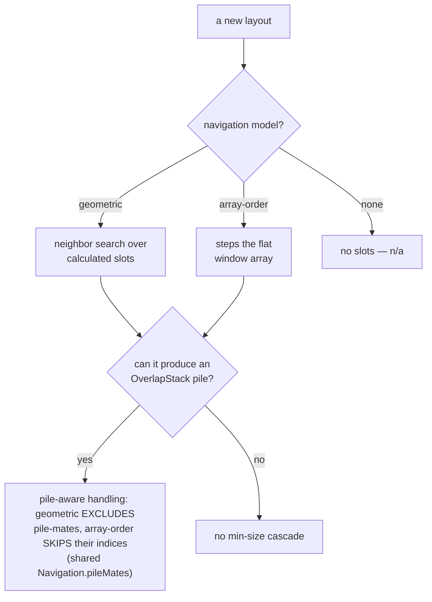

# Design decisions

The settled product and design decisions behind KiwiDesk,
with the reasoning — so users understand why things behave
the way they do, and contributors don't relitigate (or
accidentally undo) a settled choice. Two parts: **Architecture
& product model** (decisions rooted in the engine and config
model) and **Settings GUI & UX** (decisions about the Settings
app and menu bar; many from the #68/PR #88 redesign). Deeper
rationale lives in the linked issues. The cross-cutting
Settings control conventions live in
[Settings UI patterns](ui-patterns.md); binding code rules and
guardrails live in `AGENTS.md`, not here.

## How to read this file (charter)

An entry earns its place by one test: **a contributor working in that
area would otherwise re-litigate it or undo it by mistake.** If the
code already says *what* and there's no non-obvious *why*, it belongs
in git history, not here — so this file stays a design doc, not an
event log.

Each entry is tagged with its **kind** on the line under its heading:

- **[Principle]** — a durable rule that constrains future work. Obey
  it.
- **[Rationale]** — why a choice that looks wrong or arbitrary is
  actually right. Read it before "fixing" the thing.
- **[Trade-off]** — a deliberately-accepted limitation (chief
  among them the reader-facing
  [Accepted limitations](accepted-limitations.md) page and the
  [Blocked by macOS (SIP)](#blocked-by-macos-sip) table).
- **[Map]** — a cross-cutting table a new feature must keep updated
  (the [layout navigation &amp; overflow models](#layout-navigation--overflow-models)
  table).

The file is grouped **by topic**, not by kind, so everything decided
about one area sits together. Adding an entry: give it a kind tag; if
it can't take one, that's the signal it doesn't belong here.

## Architecture & product model

### Product principle: approachable by default, powerful on demand

**[Principle]**

KiwiDesk should give a new user a good tiling setup with almost no
configuration — strong defaults and a handful of obvious controls.
That simplicity must never cap what's achievable: beneath every easy
surface is a deeper layer (Lua config, profiles, advanced layouts,
per-space overrides) that's there when wanted and never required to
begin. Depth is a capability you grow into, not a cost you pay
upfront.

This sits alongside the GUI north-star (`AGENTS.md` §2 — simplicity,
intuitiveness, Apple-native feeling), not inside it: the north-star
governs how a surface *feels* and how to break ties; this principle
governs the *shape of capability* — a shallow floor with a high
ceiling. It's why "simplicity-first" doesn't mean "underpowered," and
it's a deeply Apple-native ethos (products that read simple but
reward digging in). The read-only shortcuts panel (#326) is the shape
in miniature: a dead-simple glance surface, with one "Edit in
Settings…" bridge down to the full editor — simple entry, deeper
layer one click away, never forced.

### Source-available from 1.3.0, under the Business Source License 1.1

**[Principle]**

KiwiDesk's source stays public and KiwiDesk is not open source.
From 1.3.0 the terms are the Business Source License 1.1:
using KiwiDesk stays free, at home and inside a business alike;
offering, selling, bundling or hosting KiwiDesk or a derivative
as a product or service needs a commercial license from the
Licensor, and each version converts to MIT on a Change Date.
`LICENSE` is the
authority for every parameter — how far the grant reaches, and
how the Change Date is computed — so argue what the license
*means* here and link to it for what it *says*, rather than
carrying a third copy of the numbers. Versions published before
1.3.0 were released under MIT and remain so: a license governs
what is released under it and nothing before. (Owner ruling.)

**Why a source-available license, and why before any launch
rather than after.** Under MIT anyone may take the published
code and sell it, bundle it, or host it as a product, and the
project keeps no lever over that but its name. A source-available
license reserves the offering to the Licensor while the source
stays public and use stays free, which is the shape the
project wants: readable, forkable, usable anywhere, and not
someone else's product. The grant's line falls at the offering
and not at business use for the same reason: the lever exists to
keep KiwiDesk from becoming someone else's product, and
reserving use inside a business would charge the people who use
it — the one thing the lever is not for. The timing follows from
goodwill. A switch made after a launch spends what the launch
earned — people remember the relicense, not the reason — and
lands at the moment of maximum attention, on the largest possible
free snapshot. Switching before any launch pays the cost once and
early, and leaves nothing to walk back: the terms a launch-day
reader sees are the terms that stay. BSL 1.1 was chosen over the
plainer non-commercial licenses because its terms are the ones
developers already know from other source-available projects, and
because it commits to a Change Date, which a plain non-commercial
license does not.

**What the switch does not do.** It changes nothing for anyone
who just uses KiwiDesk: the Additional Use Grant keeps use free
wherever it happens, and the license itself asks for no key,
account or payment. It does not touch the vendored Lua or
Sparkle, which keep their MIT licenses. And it does not stop a
fork of the last MIT version; that risk was accepted the day
0.9.7 shipped under MIT and is the reason the switch is sooner
rather than later.

**What travels with it.** Copy about KiwiDesk states the license
rather than promising a price, because a price is a promise and a
license is a fact: the bare "free" is retired (#1375), while
"free to use" stays, since that is the grant's own reach and not
a pricing claim. A line naming the license has to be true of the
build the reader can actually download — the site deploys from
`main` while the newest release is whatever was last tagged, so
copy beside a download either names the version the terms start
at or links to `LICENSE`, which carries that boundary itself.
Contributions are accepted under a relicensing grant stated in
CONTRIBUTING.md ▸ Licensing Your Contribution, since a later
Change Date or commercial license needs every contributor's
consent otherwise, and the trademark notice on the name and logo
is what the license itself leaves open — the license disclaims
any trademark grant, so nothing else does it. The boundary is a
tagged version rather than a date, so it is the same fact in the
release notes, in `LICENSE` and in a `git tag`.

The `.app` is itself a copy of the Licensed Work, so it carries
the license text and the third-party notices
(`ACKNOWLEDGEMENTS`) and opens both from About — BSL 1.1 wants
the License displayed on every copy, and each MIT notice wants
itself in every copy — and a trim of About's links or of the
bundle keeps them (#1407; how the bundle carries them and
derives its copyright line is
`.claude/rules/packaging-and-release.md`'s).

### Accepted limitations

**[Trade-off]**

Some behaviors are *bugs by design* — accepted consequences of a
settled architectural trade, not defects to fix. The full table —
for each: it's known, here's why, here's the architectural root,
here's the real fix where one is planned — lives on its own
reader-facing page: **[Accepted limitations](accepted-limitations.md)**.
Its rows link back into the reasoning on this page.

Convention: when a review or manual pass classifies a behavior as
accepted-by-architecture, it adds a row **there** in the same change
set — the user-facing twin of the `AGENTS.md` §5 guardrail rule.
A row needs an architectural root and, where one exists, the
planned escape hatch; it is not a wontfix dumping ground.

### Blocked by macOS (SIP)

**[Trade-off]**

A separate class: capabilities macOS forbids without disabling
**System Integrity Protection**. KiwiDesk drives macOS Desktops
through private SkyLight/CGS symbols resolved at runtime, and
some operations that *write* the Desktop arrangement are gated by
SIP. KiwiDesk **never disables SIP or asks a user to** — a
disabled-SIP requirement is a non-starter for a window manager
(`AGENTS.md` §5), so these stay unimplemented rather than
shipping a fragile fast path with no safe fallback. Unlike the
[Accepted limitations](accepted-limitations.md) trades, the root
is the OS, not our architecture, and there is no in-app escape
hatch — only Apple exposing a supported API.

**An item leaves this class when a SIP-clean path to it exists**,
and the entry below on the window-management bridge rules what
counts as one. What remains here is tracked, not abandoned:

- **Restore windows across all Desktops on quit**
  ([#70](https://github.com/KiwiCanopy/KiwiDesk/issues/70)).
- **Place a window above the top screen border** — the
  WindowServer silently rejects any frame above the visible
  area's top edge. (Partial left/right/bottom overflow is
  allowed; fully offscreen frames clamp back to a title-bar
  sliver on every edge.) So a
  vertical scrolling row scrolled past the top cannot tuck above
  the screen with its lower strip peeking, the way a true
  scroll would; `ScrollingLayout` pins those rows at the border
  instead — their *upper* strip peeks — so retile targets stay
  achievable and the already-there tolerance keeps working.
  Horizontal scrolling is unaffected
  ([#139](https://github.com/KiwiCanopy/KiwiDesk/issues/139);
  the pin shipped with
  [#66](https://github.com/KiwiCanopy/KiwiDesk/issues/66)).
  On the other edges — when no screen lies beyond them —
  KiwiDesk pins far-offscreen slots at its own fixed sliver,
  safely above the OS minimum, for the same achievable-target
  reason
  ([#142](https://github.com/KiwiCanopy/KiwiDesk/issues/142));
  an edge with a screen beyond it is a hard stop instead — a
  product decision, not an OS limit: see *Scrolling at a screen
  seam* under Layout and resize behavior
  ([#878](https://github.com/KiwiCanopy/KiwiDesk/issues/878)).
  Stashed inactive-space windows park at the same
  floor-derived sliver
  ([#148](https://github.com/KiwiCanopy/KiwiDesk/issues/148)).
- **Pin a foreign floating window above the tiled plane by its
  window-server level** — `SLSSetWindowLevel` only affects windows
  owned by the *connection* that issues it, so KiwiDesk can level
  its own overlays but not another app's floats. yabai reaches
  foreign windows by injecting into `Dock.app` via a scripting
  addition (SIP disabled); an own-connection fast path was
  measured useless for foreign floats (reference commit
  `347231e`). `#418` ships the AX re-raise instead — kept
  above on focus, with the transient-activation limitation on the
  [Accepted limitations](accepted-limitations.md) page
  ([#424](https://github.com/KiwiCanopy/KiwiDesk/issues/424)).

All of these are collected in
[#140](https://github.com/KiwiCanopy/KiwiDesk/issues/140), which
is the list to keep in step with this one.

### The window-management bridge is not a SIP escape hatch

**[Rationale]**

Moving a window to another Desktop and switching the visible
Desktop once sat in *Blocked by macOS (SIP)* above; the rule that
let them ship binds the next private surface that asks for the
same exemption.

The C symbol that moved a window between Desktops is SIP-gated
from macOS 15 on; reaching it needs an injected scripting
addition, which needs SIP off, which KiwiDesk will not ask for.
What changed is not that rule but the OS: macOS now registers a
window-management **bridge** — ObjC operation classes SkyLight
dispatches through AppKit's own delegate — that performs both
operations on stock settings with SIP on and without
Accessibility trust.

So the test an item must pass to leave that class is **a
SIP-clean path**, not a *public* one. Private-but-designed is
admissible where injection is not, and the difference is not
taste: an injected addition rewrites another process on a system
whose integrity guarantees the user disabled, while the bridge is
a versioned, `NSCoding`-encoded dispatch surface Apple built for
cross-process use, reached through the same runtime resolution
every other private path here uses.

Where a Desktop lives on another screen, the verbs act on THAT
screen — `focus_desktop 3` switches the screen holding Desktop 3,
whichever it is.

**A follow carries keyboard focus; a plain switch does not, and
the asymmetry is the point.** macOS attaches focus to a window
and never to a screen, so switching a screen's Desktop is the
whole of what `focus_desktop` can do — there is no window it was
asked to take you to. `move_to_desktop_and_follow` names one, and
its own word is *follow*, so it owes you the window rather than
the view of it; `move_to_space_and_follow` had already settled
that for KiwiDesk's own Spaces, and two verbs spelled alike
answering differently is the worse outcome.

Onto a hidden Desktop that focus cannot be handed over at the
moment of the move — the window is not addressable until the
reveal lists it — so the follow records the debt and pays it the
moment the revealed Desktop lists the window again, bounded so a
follow macOS declined cannot fire minutes later. The departure
itself is an eager fold, and it stands KiwiDesk's own
close-return raise down through the one stand-down predicate —
handing focus to a sibling of the space being LEFT is the exact
opposite of what the verb was asked for
([#1007](https://github.com/KiwiCanopy/KiwiDesk/issues/1007)).

The **pointer** is not a second decision. It follows focus only
where *mouse follows focus* is on, through the same predicate
every other focus change uses — the setting is the answer, and a
follow does not earn an exception to it.

What that admission costs, accepted deliberately: **there is no
fallback to write.** The public API for these operations does not
exist, so where the bridge is absent the verbs refuse and say so
— never a synthesized substitute (keystroke-faking Mission
Control shortcuts, which depend on shortcuts the user may have
changed or turned off). A capability that only the private
surface can deliver is allowed to be absent; it is not allowed to
be faked. `.claude/rules/os-private-apis.md` carries that as an
obligation on the code.

### Distribution: direct download, not the Mac App Store

**[Principle]**

KiwiDesk ships as a signed, notarized direct download plus a
Homebrew cask. **The Mac App Store is not a later step, it is
out of scope** — so a roadmap, badge or landing page should
never promise it again.

Two reasons, of different kinds — one technical, sharing the
SIP entry's root, one economic and unrelated to SIP:

- **Private API.** The SkyLight/CGS symbols the section above
  discusses put Desktop management squarely against review
  guideline 2.5.1, which permits public API only — and no
  public replacement exists: detecting *that* a Desktop
  switch happened is public, knowing *which* Desktop is not.
  Resolving them through `dlsym` is a robustness measure
  (`AGENTS.md` §5: a vanished symbol must return nil, not
  crash at launch), never a way around the guideline — review
  scans the binary's string table, so a compliant build has
  to compile the resolver out, not disable it.
- **The economics.** A store edition is buildable — the
  feasibility pass
  ([#882](https://github.com/KiwiCanopy/KiwiDesk/issues/882),
  the full inventory) found most of the app survives the
  sandbox: KiwiDesk's own spaces and the default focus ring
  are public-API already, crash-restart ports to
  `SMAppService`, and Lua-as-local-config is permissible.
  What it costs is a **permanent second product**: a split
  build with its own entitlements, packaging and edition
  guards, doubled CI, and App Review latency on every release
  — paid forever, for reach the project does not need and
  that store search does not deliver a niche utility against
  Magnet-class incumbents with a decade of ratings. And the
  losses that do remain (Desktop integration, `KiwiDesk.exec`,
  the `kiwidesk` CLI on `PATH`) land exactly on the users the
  product is built for.

Note what is *not* the reason: driving other apps' windows
through Accessibility is fine sandboxed — Magnet and Moom do
exactly that on the App Store. Anyone re-opening this argues
the economics, priced with [#882](https://github.com/KiwiCanopy/KiwiDesk/issues/882)'s
inventory; the trigger it names is 1.0 shipped *plus* a
concrete demand signal. Every comparable tool (yabai,
Amethyst, AeroSpace, Rectangle) is distributed directly.

The practical consequence: **notarization is on the critical
path, not a nicety.** A Homebrew user who meets Gatekeeper runs
`xattr -d` and moves on; someone who downloads a `.dmg` from
the site sees "KiwiDesk is damaged and can't be opened" and
deletes it. `scripts/build-app.sh --notarize` exists for that
([#89](https://github.com/KiwiCanopy/KiwiDesk/issues/89)), and
Sparkle — the replacement for the App Store's update channel —
depends on notarization as well, since it refuses to install an
update that lacks it. *When* a channel may open is a separate
question, answered by
[No distribution channel without an update path](#no-distribution-channel-without-an-update-path).

### No distribution channel without an update path

**[Principle]**

Never open a channel a normal user can install from unless that
build can update itself. This is about *publication*, not about
a button: the site's download link and a public GitHub Release
asset are the same channel from the user's side, and a stranded
user arrives through either. Building an artifact is always
fine; putting it somewhere people find it is what this governs.

The reason it is a rule and not a preference is the asymmetry of
the mistake. Sparkle has to be *inside* the build a user
installs — shipping it one version later reaches only the people
who install that later version, and everyone already running the
earlier one stays stranded on manual re-download forever. There
is no recovering the first group, which is why the gate is on
publishing rather than on remembering to fix it afterwards.

**Homebrew is the deliberate exception, and it is conditional.**
`brew upgrade` is a real update path, so a Sparkle-less build
may ship as a cask. The cask's public GitHub Release ZIP is its
backing artifact, not a standalone channel KiwiDesk promotes:
without Sparkle in the build, that ZIP is neither linked from the
product site nor advertised as a direct download. Someone who
deliberately installs from the repository instead of Homebrew has
chosen a manual update path.

The Release must be published before Homebrew can fetch its ZIP,
so publication and the tap update cannot be atomic. The accepted
failure model is a short, visible stale-cask window: the release
is not operationally complete until the `Update Homebrew Cask`
workflow is green. That workflow queues every publication,
verifies the published bytes, and permits a retry only when the
same version still has the same digest. On failure, retry the
workflow or publish a newer version; never replace an existing
version's bytes.

This exception holds only while the release workflow actually
bumps the tap — if the cask goes stale the exception lapses and
the cask users are the stranded ones. It is an obligation on the cask
([#105](https://github.com/KiwiCanopy/KiwiDesk/issues/105)), not
a property that exists for free.

Trade-off: the first release reaches fewer people. Accepted, and
it buys something back — Sparkle's update path is first
exercised against a real previous release instead of being
debugged on the release everyone downloads.

**Corollary: the updater ships before the release that matters,
and *ships* means published.** The trade-off above buys something
only if a Sparkle-carrying release exists for the next one to
update *from*. Merge the updater, go straight to the release
people arrive at, and the first genuine update is that release to
its own first patch — debugged on the largest cohort the project
has had, which is the outcome a smaller first audience was being
accepted to avoid. So the updater lands in an ordinary release of
its own, and the release that opens the channel is one a person
can arrive at by updating.

A merged updater nobody has installed from a published release
has exercised none of that. A test appcast rehearses the feed
parse, the version compare and the install-on-quit; it cannot
rehearse signed, notarized, stapled bytes fetched over the
network from the production URL, or the cask and the in-app
updater not fighting over one install.

**Corollary: the gate is Sparkle-in-the-build, never a version
number.** The rule names no version deliberately: what it asks
is whether the build a person installs can update itself, and a
version number answers that in neither direction. So the question
is never "have we reached 1.0". A release shipped without an
updater keeps the channel shut however large its number, and a
release carrying one satisfies **this** condition whatever number
it lands at.

It satisfies this one, not the gate. The gate is two conditions
and both are properties of builds rather than of a version:
Sparkle is in the build a person installs, **and** — by the
corollary above — that build is one they can have arrived at by
updating. The first Sparkle-carrying release meets the first and
cannot meet the second, which is why a promoted download opens on
the one after it and not on a number.

**Both conditions have been met, and what the gate guards is
spent** — a Sparkle-carrying release was published and a real
update from the one before it installed on a physical machine
([#904](https://github.com/KiwiCanopy/KiwiDesk/issues/904)
records the confirmation). Read the paragraphs above as the
argument for the gate, never as a description of a shut channel.

**What that licenses is the channel, not a free pass on the
artifact.** The release page and the site link are one channel,
so a promoted artifact reaches people the moment a release
carrying it is *published* — before any site copy changes. Open
the channel in that order deliberately: the release page first,
on a release cut to be verified on a clean machine, and the site
only afterwards. The reverse strands the one group this whole
entry exists to protect, and a stranded downloader cannot be
recovered.

What the artifact itself then owes is
`.claude/rules/packaging-and-release.md` ▸ *Every distributable
artifact needs its OWN ticket*, which owns both the obligation
and how to verify it.

### Background update checks are on, and there is no switch

**[Rationale]**

KiwiDesk checks for updates in the background, `Info.plist` says
so with `SUEnableAutomaticChecks`, and no Settings row, Lua verb
or census key lets a user turn it off.

The alternative is not "no prompt". Left unset, Sparkle asks the
question itself — a modal, a few seconds after first launch,
from an app with no Dock tile to explain where the dialog came
from and quite possibly on top of the first-run tour. That is
the worst version of offering the choice: it arrives before the
user knows what KiwiDesk is, and it is the first thing the app
ever says to them.

Answering it in the plist is what *approachable by default* means
here. An updater nobody remembers to run is not an update path,
and this project's whole distribution argument
([above](#no-distribution-channel-without-an-update-path)) rests
on installed copies actually moving forward.

**What is given up, stated rather than glossed:** a Mac app that
checks automatically normally offers the toggle, and
`.claude/rules/gui.md`'s north star is Apple-native behavior.
This is a deliberate exception to it, taken because the toggle's
only *shipped* form was a modal at the worst moment. The check
sends nothing about the machine — Sparkle's system profiling
stays off, so it is a plain versioned GET — which is what makes
the missing switch a preference question rather than a privacy
one. If it were sending a profile, this ruling would go the
other way.

**What would reopen it:** a Settings row, whenever someone
builds one — this entry answers "why is there none *yet*", so a
future row supersedes it without contradicting it. What must
not happen is unsetting the key and letting Sparkle ask again.

### Installing updates automatically is a switch, and it never relaunches (#1542)

**[Rationale]**

"Install updates automatically" sits under General, below Start
at login, and is off until the user turns it on. On, Sparkle
downloads a found update in the background and installs it the
next time KiwiDesk quits; it never quits or relaunches KiwiDesk
on its own. Off applies from the next check: an update already
downloaded and prepared still installs at the next quit. The user's windows are the app's whole job, and a
window manager that restarts itself mid-task rearranges the
screen under someone who asked for nothing.

Unlike [the background check](#background-update-checks-are-on-and-there-is-no-switch),
this one is a choice, and one Settings asks only when the user
goes looking, so there is no first-launch prompt to ask badly.
**What it trades:** an automatic install never shows the update
window, so a release's "Before you update" is read after the
update rather than before it, in "What's new". That is the
bargain the switch offers, and it stays off by default for that
reason. Sparkle takes the switch only while it checks on its own,
so the row greys with that reason where the checks are off. Sparkle's own alert used to offer the same
choice as a checkbox; KiwiDesk's update window has no such box,
so without this row the choice would have left the app entirely.
The value is Sparkle's (`SUAutomaticallyUpdate`), stored per Mac
and never in a profile or a backup, since whether this Mac
updates itself is not part of a setup. After such an install "What's
new" is owed: it opens on the next launch the user starts, and a
login launch leaves the status item's mark instead.

### Scheduled update reminders are a mark, not a notification (#1013)

**[Rationale]**

For a background app Sparkle draws a scheduled update alert
behind every other window — deliberately, so the offer does not
take the screen — and for a menu-bar app with no Dock tile that
is drawn nowhere. Sparkle logs the warning once per launch. The
[background check](#background-update-checks-are-on-and-there-is-no-switch)
is the path most users are on, so an alert nobody sees is an
update path that does not deliver.

The reminder is a **mark on the status item and a row in its
menu**, nothing else: `UpdatePromptPolicy` declares gentle
reminders and answers that KiwiDesk shows every scheduled update
itself — whatever focus Sparkle proposes, since the
[accessory-mode corollary](#permanent-accessory-mode-no-activation-policy-switching)
forbids an unsolicited offer taking the screen — and the status
item carries a dot until the update gets attention or the session
ends. The dot is composited into a fresh image with a knockout
ring, the SF Symbols `.badge` idiom, top-trailing and Ø5 at the
18 pt master, and it is **orange** — the owner ruled colour over
a monochrome template. What that costs: a template carries no
hue, so the
composite is not one, and the bar's highlight inversion while the
menu is open no longer reaches it; what it keeps: the drawing
handler resolves the bar's label colour and `systemOrange` at
every draw, so light and dark still follow, and the shape alone
still separates the mark for colour-vision deficiency. Nothing
moves, so Reduce Motion has nothing to gate. It rides only the
healthy glyphs, because a permission warning or a config error
outranks an offer. The updates row is retitled in place — "Update
Available…" — rather than doubled: Sparkle's own door for
bringing the waiting alert forward is `checkForUpdates`, the row's
existing action, and `canCheckForUpdates` stays true while the
update waits — Sparkle 2.9.6 counts the update as shown the moment
its driver is handed it, before the delegate's answer is read
(`SPUUIBasedUpdateDriver` ▸ `uiDriverDidShowUpdate`, which is what
`SPUScheduledUpdateDriver.showingUpdate` answers from), and that
flag is the one `checkForUpdates` routes on.

A user notification was ruled out. KiwiDesk's one notification
is the permission-lost notice (`AppDelegate+Notifications.swift`),
and the authorization prompt it costs is asked at the moment
window management stops — a reason the user can see on screen. An
update reminder would spend that prompt on an offer, on top of a
first-run story that is already a permission wizard, to tell
someone about an update. No setting was added — the reminder
costs nothing to ignore.

### KiwiDesk draws its own update window (#1542)

**[Rationale]**

From 2.0.0 a found update opens KiwiDesk's own window rather
than Sparkle's: the offered version's summary in one panel, then
every change grouped as New, Improved, Fixed and Lua & CLI, each
group a disclosure with its count. Sparkle's window renders the
notes as one block of HTML, which is readable and answers
neither question a reader arrives with ("what's new?", "was my
bug fixed?") at a glance — the grouping
[the release notes are written in](#release-notes-are-written-for-the-person-installing)
only pays off where something groups on it.

**The window covers everything since your version, not only the
offered one.** A user who skipped three releases is about to
receive all of them, so the groups merge across the skipped
versions, each entry labelled with its version and the counts
covering all of them; the panel keeps the newest summary, and
every skipped version's "Before you update" line is shown, since
a caution published two versions ago still applies to someone
crossing it now. One version behind looks like any other offer.

**What stays Sparkle's:** checking, "you're up to date", and the
download and install themselves. The window takes over at the
offer and holds it through downloading, preparing and installing
— one window per offer rather than an alert followed by a status
window — because the notes stay readable while the download
runs. A scheduled offer still never takes the screen
([the reminder](#scheduled-update-reminders-are-a-mark-not-a-notification-1013)
is unchanged); the row it leaves opens this window.

**There is no Skip This Version.** Skipping is the one choice a
user cannot find again: Sparkle stops offering the version, and
nothing in KiwiDesk says an update was waiting. Later costs a
reminder; Skip costs every fix in that release for as long as the
user does not think to check by hand.

**"What's new" follows an update whose notes nobody saw.** After
an automatic install, or the jump from 1.x (which has no window
of its own), the first launch shows the same layout with one
Done; after the window's own Install it shows nothing, the notes
having been read. It opens only on a launch the user started — a
login launch is not someone at the keyboard, so there the status
item carries the reminder's mark and the quick menu a row. The
notes are fetched from the same feed Sparkle reads rather than
shipped inside the app, because they are written into the release
after the build; offline, they stay owed for the next launch. The
record of what was last run and read lives in the app's own
defaults rather than the config folder: it describes this Mac,
and a backup restored elsewhere must neither replay nor swallow
it.

**What a 1.x client sees is unchanged.** The feed keeps its HTML
description beside the structured notes, so a copy that predates
this window keeps Sparkle's; the window first appears for the
update after 2.0.0.

### Linking the notes is not opening a channel

**[Rationale]**

The rule above governs **acquisition** — where a person who does
not yet have KiwiDesk, or whose copy has gone stale, goes to get
one. That is why it is phrased about publication and promotion
rather than about links: what strands a user is arriving at an
installable artifact by a route that cannot update itself.

A link labelled for the release **notes** serves the opposite
reader: someone who already has the app, opening it from inside
their own copy, to find out what changed in the version they are
running. It recruits nobody into an unmanaged update path. So the
rule does not reach it, and the **label is what decides which of
the two a link is** — not the destination's file listing, which
GitHub composes for every project alike.

Both halves matter, because two different mistakes follow from
dropping either:

- Read the rule as reaching any link at all, and the app can
  never tell a user what changed. The alternative someone reaches
  for next is an in-app notes reader, which is a new surface
  duplicating rendering GitHub already does better, built to
  satisfy a rule that was never about reading.
- Read "the label decides" as licence, and the row drifts toward
  the download it must not become. So the obligation is on the
  words: a surface pointing at the releases page stays named for
  the notes. Never retitle it to *Download*, *Get*, *Latest* or
  *New Version*, and never point it at a release asset rather
  than the page. Those four words are the line, and crossing it
  is what turns an informational pointer into the promoted
  standalone download the rule above forbids.

Trade-off: a reader who follows the link does meet the ZIP, one
scroll below the notes. Accepted — they are already installed, so
the asset is at worst redundant to them, and the alternative
costs every user the ability to see what changed in order to hide
an artifact from the people least likely to need it.

Sparkle shows the current version's notes on update. That does
not retire this link: Sparkle answers "what is
in the update in front of me", and this answers "what changed
across every version, whenever I ask" — including for a user who
skipped four of them.

### Release notes are written for the person installing

**[Principle]**

**A release note names what the reader will notice; the mechanism
belongs in the PR that carried it.** The first draft of 0.9.7's
highlights said "the ring's work no longer starves the main
actor", "the layouts place the residue" and "31 interpolations
across 472 values". Every clause was true and none was legible to
anyone who had not read the diff. The same three, rewritten:
"the focus outline keeps up", "KiwiDesk arranges the others
around it", and "a batch of sentences that couldn't be phrased
naturally in other languages have been rebuilt so they can be".

The test is neither word count nor tone. It is: **would a reader
who has never seen this codebase recognise the thing described as
something that happened to them?** An internal noun — the engine,
the tiler, a retile, the main actor, a residue, an interpolation
— fails by construction, the reader having no referent for it. A
symptom passes. The rule is easy to lose because the person
writing the notes has just spent a week inside the mechanism, and
the mechanism is what feels notable to them.

Two consequences fall out, both structural rather than stylistic:

- **Highlights carry no issue or PR numbers.** The generated
  "What's Changed" list sits directly beneath them and is the
  complete record, every entry linked. Numbering the highlights
  as well makes the reader's eye redo work the section below
  already did, and turns news into a bug list.
- **Highlights are highlights.** Twenty bullets is a changelog
  with headings, and a nine-line bullet is a PR description. A
  bullet is ONE line: the thing you would notice, and that it
  is fixed. A second sentence is earned only when one line
  cannot say it — a default that changed, a control to go and
  find — and never by the diagnosis, which is the PR's (owner
  ruling). The whole block should read in one screen of the
  update window.
- **A site change is news only when a visitor would come for
  it.** A new page, a new language, a changed download earns a
  line. A heading that now fits its column, a corrected term, a
  font bump and release plumbing earn none — not even a closing
  "on the site" line (owner ruling): a reader installing an
  update has no reason to care that the website was tidied. The
  generated list still carries each of them for whoever wants
  that.

**The sections are typed: New, Improved, Fixed, Lua & CLI
(#1542).** This reverses the earlier ruling
that a release names its own sections. That ruling's argument
was that fixed buckets split one story three ways: 0.9.7's
multi-screen Desktops was at once new, improved and a fix. It
lost to how the notes are READ. A reader comes with a question,
"what's new?" or "was the bug that annoyed me fixed?", and a
title of the release's own choosing answers neither at a glance.
Three consequences:

- **Each change goes under one type, the one that fits best.** A
  change that is both new and a fix goes under New, and its
  wording says what it also fixes. A fix that also improves
  something goes under Improved. The story a type splits is told
  in the summary, which stays prose.
- **Lua & CLI holds only what exists for scripting:** new,
  renamed or retired verbs and setters, and changed output. A
  feature people use through Settings goes under New even when it
  also has a Lua side, so nothing is written twice. A scripting
  break opens that section, addressed to the people it reaches
  ("If you write your own Lua config: …"), rather than alarming
  everyone above the fold.
- **"Before you update" is for something everyone who updates
  must do or will notice at once:** one closing paragraph of the
  summary, and usually absent. It never warns about going back:
  a downgrade limit ("the older version can't open your
  profiles") alarms every reader for the few who would ever
  downgrade, so it belongs in the full release notes, if
  anywhere. Say what the reader keeps rather than what they
  risk: "Your settings carry over on their own" (owner,
  2026-09-24).

Releases before 2.0.0 keep the free titles they were published
with.

This binds whichever surface carries the notes: the GitHub
release body is the source, and the changelog page (#873) and
the update window (#874, KiwiDesk's own from 2.0 — #1542) are
generated from its curated
block — `scripts/changelog-sync` and `scripts/appcast-sync` — so
they inherit it rather than restating it.

No guard is proposed, and that is a ruling rather than an
omission: nothing mechanical separates "the focus outline keeps
up" from "the ring no longer starves the main actor". Both are
well-formed prose about the same commit. A banned-word list would
fail open on the phrasing it did not anticipate and fail closed
on the same nouns used legitimately elsewhere. This is a
review-time rule, and this entry is where the reviewer is sent.

**A highlight describes what shipped, not what comes next.**
"The last beta before 1.0" (struck from 0.9.7's draft) breaks no
rule above — it names nothing internal and a reader understands
it perfectly — which is why it is worth its own clause: the
defect is that it is a **forecast**. A description of what
shipped can only be wrong on the day it is written, and review
catches that. A forecast is falsified later, by events somewhere
else entirely, and nothing notices — the same failure
`.claude/rules/rule-authoring.md` names when it asks for an
obligation instead of a state claim. A release body is also the
surface least able to absorb it, being immutable in practice once
people have read it and mirrored by every tap and feed that
carries it. So no roadmap position, no "next up", no promise
about the following release: whether 0.9.7 turned out to be the
last beta was not knowable on the day it shipped, and the notes
did not need to answer it.

**A fix to something that has not shipped is not news; it is
part of the thing it fixes.** 1.2.0 brought Liquid Glass to
every surface, and commits between then and the cut corrected
its tint channel, its light/dark variant and two of its
rendering paths. Listing those reads as a feature that arrived
broken — and no reader ever met the broken version, because none
of it had shipped. They belong inside the feature's own bullet,
or nowhere. The test is the same one this entry already asks,
applied to a version rather than a person: **was the defect
reachable from the last release?** If it was not, the reader has
nothing to recognise. The same reasoning retires work whose
subject is this release's own making — translating sentences this
release introduced, re-vendoring a font, wiring the release
pipeline: real work, and none of it a change the reader
experiences.

### The API describes itself, and its enums are read not typed

**[Principle]**

The signature of every Lua/CLI command — its group, its
arguments, the legal values of an enum argument, and a one-line
summary — lives in `APIReference` as data, beside the names that
were already there. It does **not** live only in
`docs/lua-reference.md`.

The pull toward prose is real: with the names in a Swift table
that "can never drift from the real API" and the *signatures* in
4,800 lines of hand-written Markdown that could, and did.
`list_commands` answered "what can I call" with 262 bare names on one line — no
groups, no arguments, no summaries — and `list_commands focus`
answered the same 6.9 KB, because the argument was read and
dropped (#1033). The doc could not fix that: a running binary
cannot consult a Markdown file, and a user in a terminal should
not have to.

Two rules fall out, and both are guarded.

**An enum argument's legal values are READ off the decoder.**
`APIArgument.choice` takes a *metatype*, and `APIChoice` has
exactly one initializer, which reads `allCases`. There is
deliberately no way to hand it a list. This is not tidiness: the
error message the bar setters print already disagreed with their
own decoder — the code said `ring|edge_mark|gap` while the enum
had renamed that case `outline` — and a listing hand-typed the
same way would have inherited the same class of lie, with more
readers. The compiler enforces the derivation today;
`APIChoiceDerivationTests` scans the declaration, because adding
a second, list-taking initializer is a two-line change that
compiles and reads harmlessly.

**A record carries neither its own name nor its group.** Both are
the key it is filed under, so the names stay one list rather than
two, and `APIRecordCensusTests` holds the key sets against
`commands` / `namespaces` / `luaOnly` in both directions —
`parity-tests.md`'s forget-proof shape, and the reason the
remaining records can be filled in bulk by someone who did not
design any of this.

**`help` is answered by the CLI itself, not over the socket.**
The listing describes the API a binary was *built* with; no app
state enters it, and `APIReference` is compiled into the same
binary the CLI is. Round-tripping it would buy nothing and would
make `kiwidesk help focus` fail exactly when a user reaches for
it — while the app is not running, which is when you are most
likely to be reading about a command rather than issuing one.
`--version` is answered locally for the same reason. The cost is
named rather than hidden: an older app running under a newer
`kiwidesk` on `$PATH` is described by the newer one, which is a
half-finished install rather than a mode of operation. To keep
"local" from becoming "second", both answers come from one
function — `APIReference.helpResponse`, which the dispatcher's
`help` case also returns — and `CLIHelpSeamTests` refuses the CLI
tree any reading of the name tables.

What this deliberately does **not** do is generate
`docs/lua-reference.md`. That doc carries argument ranges,
defaults, worked examples and the macOS caveats behind them; a
one-line summary is not a substitute, and pretending otherwise
would trade a drift problem for a much worse documentation one.
Generating its *signature tables* from this data is a genuine
follow-up, and it is the reason the data is shaped this way.

### The landing page argues from the papercut, not from the mess

**[Principle]**

The Simple-mode landing copy argues for KiwiDesk from **specific
macOS frustrations a stranger recognises instantly**, never from
"your windows are messy". Tidiness is a cleanup pitch, and nobody
goes looking for a window manager because their screen looks
untidy — they go looking because something cost them time today.

Four constraints fall out, and they are the durable part:

- **The papercut has to be one KiwiDesk actually solves.** This
  is the trap: the green button is a real grievance and KiwiDesk
  does *not* fix it — `docs/user-guide.md` ▸ native fullscreen
  says it stands down around such a window entirely, and macOS
  still gives it a Mission Control slot of its own. Arranging
  windows by hand IS solved, by default, for everyone, which is
  why the section argues that instead. Check the relief before
  writing the grievance.

- **The picture argues too** — a reader believes it first, so
  before/after art drawing the "before" as scattered rectangles
  ships the retired claim however the cards are lettered. Both
  frames draw the same windows; what differs is only how well
  they fit. `site/src/styles/landing-modes.css` owns how many
  and where.
- **The honest before is not chaos.** It is *doing it by hand
  and not realising there was another way*. Copy that tells
  readers their desk is a mess describes someone else.
- **A papercut is translated, not pasted.** `README.md` ▸
  *Solving macOS Papercuts* writes them for people who already
  know "monocle", "spaces" and `pull_or_spawn`. Simple mode gets
  the symptom and the relief, never the mechanism — and never a
  claim the app does not make: KiwiDesk does not change what
  ⌘Tab does, and nothing seeds a keystroke that makes a window
  big — so anything reached through a binding is written as an
  offer, never as behavior.

Not every papercut survives the translation. macOS reshuffling
your Desktops is dropped rather than reworded: the honest
version needs a qualification the section cannot carry, since
what KiwiDesk offers is *its own* spaces in fixed slots and no
doc claims it stops macOS reordering anything.

Trade-off: the section speaks to people who have hit these
specific things rather than listing everything. Accepted — a
stranger who recognises one papercut instantly is worth more than
four they have to qualify for, and a page that lists grievances in
a row reads as a complaint.

### Two install paths, one recommended per mode — never a chooser

**[Principle]**

The site offers both a direct `.dmg` and the Homebrew cask, and
it **never asks the reader to pick between them**. Each mode
leads with one and keeps the other quietly available: Simple mode
leads with the download, Nerd mode keeps Homebrew first where it
already was, and the guide leads with the download while keeping
a full, uncollapsed brew block for returning cask users.

The reason a chooser is wrong here is that the page already asked
this question once. The Simple/Nerd toggle *is* the "which of
these two people are you" control, and a side-by-side install
card asks it a second time in a place where the reader has no
basis to answer: a stranger does not know what Homebrew is, and
someone who uses it does not need the comparison.

What removes the residual anxiety — *does it matter which one I
pick?* — is one sentence rather than a badge or a "recommended"
ribbon: **it is the same signed build either way, and it keeps
itself up to date from there.** That is true, and it is the whole
mechanism.

One real difference survives, and it is stated once, on
Homebrew's side in Nerd mode only: the cask links the `kiwidesk`
CLI onto `$PATH` for you. State it as what Homebrew *adds*, never
as the disk image lacking the CLI — that is false, since the CLI
is the app's own executable and ships inside every copy. It is not
surfaced in Simple mode or in the guide, because a reader with no
use for the fact would meet it as a decision — the precise
failure this entry exists to avoid. `docs/cli.md` owns what a
`.dmg` user does about it, and that answer has to exist before
the difference may be named: a caveat with no resolution is a
dead end rather than a difference.

### A restore replaces; it never merges

**[Principle]**

Restoring a backup replaces the settings, the profiles and the
palette library outright. It does not reconcile them with what is
already on the machine, and it must not grow the ability to.

Merging sounds kinder and is worse. It needs a collision policy
per profile name and per palette name, then a rule for a setting
that differs, then a way to show the user what it decided — and
at the end of all that the result depends on **what happened to
be on the destination Mac**, which is precisely the variable the
user was trying to eliminate by carrying a backup over. "The
setup I exported" is a thing a person can picture; "the setup I
exported, reconciled with whatever was here" is not.

Replacement also makes the promise checkable. After a restore the
destination holds exactly what the source held, so a user can
confirm it by looking, and a test can assert it without modelling
a merge. What is replaced goes to the Trash, so the cost of being
wrong is one drag rather than a reconstruction.

The same reasoning puts the restore at the end of the Advanced
drawer's severity ladder rather than beside its export. Reset All
Settings is *named* for what it spares — `init.lua` and the
colour palettes visibly survive it — so an action that replaces
the palettes too is strictly the wider one. Ordering it before
Reset All would put the harsher action above the milder and break
the only thing that ladder communicates. The price is that the
two halves of one feature sit apart, which is accepted: a user
who has just exported is not in danger, and a user reaching for
the bottom of that drawer should meet the most severe thing last.

Trade-off: someone who wants one profile from an old machine has
to restore everything and delete the rest. Accepted for now —
per-profile export is a smaller, separate feature, and
`ProfileManager` already has the primitives whenever it is
wanted.

### Feature names: which stay English, which translate

**[Principle]**

"App Bar" and "Space Bar" are the same in every language; the
layout mode names are not. Which family a name joins is decided by
one checkable question — *does this thing's own label key ship
untranslated in all eleven catalogs?* — and the two families are
enforced by deliberately opposite-shaped guards: one requires the
English name to be **present**, the other requires it to be
**absent**.

That policy has its own page, because it is a rule a translator
must follow *and* a decision a maintainer must not undo, and
because the failure it prevents is invisible to anyone reading a
language they do not speak:

**[Feature name policy](localization-naming.md)** — the families,
what each requires, why script is irrelevant to one and decisive
to the other, and what to do when adding a name.

### One concept, one word — and why that one is not guarded

**[Trade-off]**

A feature name is decided once for all eleven languages. An
**ordinary** word is not: *layout*, *gap*, *profile*, *shortcut*
have no label key of their own, so nothing in a catalog declares
which of a language's two candidates KiwiDesk means. Six catalogs
were shipping two or three words apiece for one concept, and the
split fell between adjacent surfaces — a tab bar and the help
text under it, a destination label and the menu item that opens
it — where a user meets both in one glance.

The decision has two halves, and the second is the one a
maintainer would otherwise undo.

**The word is chosen by a ranked ladder, not by a table.** A
candidate that already names another KiwiDesk concept in that
catalog loses whatever its count — a label reusing another
feature's noun does not read as inconsistent, it reads as true
about the wrong thing, which is how a Simplified-Chinese profile
search returned a result labelled *configuration file*.
Otherwise the catalog's own occurrence count decides, and a near
tie goes to the destination label, that being the name the user
learns. Writing the *procedure* rather than its output is
deliberate: an eleven-column table of winning words would be a
copy of the corpus, and a copy of the corpus rots against it on
any commit, while the count rule makes each catalog its own
register.

**No *content guard* can enforce it, and one narrow guard can.**
The obvious predicate — a banned-rival register per locale — dies
on a fact that only shows up once the sweep is done: every losing
word is still *correct somewhere else in the same file*. Spanish
«espacio», Italian «spazio» and Portuguese «espaço» each name a
Space in about a hundred keys; Korean 연결 means *connected*;
Chinese 配置文件 is right in the one key the ruling exists to
protect. A ban would fire on hundreds of good values, and
`scripts/localization_guards.py` has no exemption file by policy,
so it would be reverted or given a baseline within a week.

The mistake worth not repeating is generalising from that to
*no guard at all*. The sub-class where the collision is
**byte-identity** needs no vocabulary: compare two strings the
same catalog ships, the way the breadcrumb guard already does.
`DestinationNameCollisionTests` does exactly that for
destination titles, and it fires on the `zh-Hans` Profile
defect. It lives in `Tests/` rather than in the guards script
because a Swift suite may carry a reasoned exemption map — the
standing idiom here — so the one legitimate pair is excused in
writing rather than switching the guard off. Partial cover of
the worst sub-class is not a consolation prize; it is the
sub-class.

Worth more than the guard would have been: the two *adjacent*
classes are made unwritable rather than scanned for. A `▸`
breadcrumb is held against what each segment's own key renders,
and English prose that names a pane or a role interpolates that
label's key instead of quoting it (#818), which puts the anchor
under `placeholder_drift` — an exact contract that already runs
— in every locale forever. The residue, one language's two
ordinary words for one idea, stays with review, and the ladder
is what makes that review cheap: a reviewer who does not speak
the language can still check a grep.

**Rule 1 takes a word away and has to say what replaces it.**
Left unanswered, the obvious move is a second ordinary noun,
which is the defect the family exists to stop — so the escape is
ranked as well, and its first step is the one that keeps
surprising people: **check the destination label is faithful
before working around it.** English qualifies a generic
destination noun ("Layout **Defaults**"), and a catalog that
rendered it bare has not discovered a shortage — it has
mistranslated the destination, and taken the ordinary word out of
circulation as a side effect. Restoring the qualifier gives the
word back.

Where the shortage is genuine, **the ordinary site qualifies and
the destination never moves**, which is rule 3 read in the other
direction: the destination label is the one string that is a card
title, a back chip and a search row at once, so it is the last
thing that should absorb a collision it did not cause. And the
qualifier is a noun rather than a verb, for the reason the
ladder's own step 3 gives and this entry does not re-argue. That
difference is measured in points on a button, which is why the
width half of it is an obligation in
`.claude/rules/localization.md` rather than advice here.

The ladder, the escape and the counted legitimate uses are in
[Feature name policy](localization-naming.md) ▸ Family C.

### Vocabulary: macOS has Desktops, KiwiDesk has Spaces

**[Principle]**

One word named three things. macOS's Mission Control desktops,
KiwiDesk's own workspaces, and any generic screen area were all
"space" — and the first two turn up in the same sentences, so
every explanation of a feature touching both had to disambiguate
before it could say anything. The README reached for "Virtual
Spaces … on top of native macOS Spaces" to do it.

The ruling: **macOS's are Desktops, KiwiDesk's are Spaces.** The
qualifier "virtual" goes with the ambiguity it existed to hold
off. The generic screen-area sense and the kernel/user-space
sense are reworded away entirely — neither may use the word at
all. Every remaining bare "space" therefore means KiwiDesk's; a
sentence that names macOS's says Desktop, and one that names
both says both words. "It is clear from context" is not a
defence: a sentence readable either way is the defect this rule
exists to remove.

**KiwiDesk's side of the wire never moved.** No Lua verb, no
JSON key, no Swift type, no event name naming KiwiDesk's spaces
— `focus_space`, `SpaceID`, `space_modes` and `space_bar.*` all
stay; the Space Bar keeps its name, being KiwiDesk's own bar
showing KiwiDesk's own spaces.

**macOS's side of the wire moved once.** Freezing it too —
`bind_profile_to_native_space` keeping its name "since *native*
already disambiguates it" — was a pre-release cost call, when no
migration and no broken `init.lua` was the whole argument. It
was lifted before the native Desktop verbs (#884) landed beside
it: a wire reading `…native_space` in three places and
`…desktop` in the new verbs would have carried the
one-word-two-senses defect this ruling exists to remove, and the
cheapest day to unify it was the day before it hardened under a
userbase. So the verb is `bind_profile_to_desktop`, the event
`desktop_change`, the `get_state` field `desktop`, and the
Settings copy keys `desktops.*` — with no alias (`AGENTS.md` §5:
a renamed verb gets no compatibility layer; the 1.1.0 notes say
what changed). What did NOT move, deliberately: Core's
`NativeSpace` / `NativeSpaces` types, which model WindowServer
spaces — fullscreen and system spaces included — of which a
Desktop is only the user-type kind.

**Why the macOS sense is the one that moves — and what does NOT
decide it.** It is tempting to say "Desktop is Apple's word", and
that claim does not survive contact with Apple's own UI. **Apple
uses both, for different things:** the FEATURE is Spaces — the
System Settings checkbox reads "Displays have separate Spaces"
and the Keyboard ▸ Shortcuts rows read "Move left a space" — while
each INSTANCE is a Desktop, labelled "Desktop 1" / "Desktop 2" in
Mission Control and settled in the "Desktop & Dock" pane. So
deferring to Apple resolves to no single answer, and anyone
re-opening this on the grounds that Apple says Spaces is half
right; they should read the next paragraph rather than this one.

What the instance label does buy is that "Desktop n" is the word
on screen at the moment a user is *looking* at the things, which
is what a binding row names. KiwiDesk's own copy had already
reached for it: `desktops.intro` (then `native_spaces.intro`)
read "Each Desktop is a native macOS Space from Mission Control."
until #768 — one sentence stating as an identity the very thing
this ruling splits.

**Cost is what actually decides it.** The conflict is
irreducible: two systems, one word, and one of them has to move.
119 English strings named KiwiDesk's spaces against 6 naming
macOS's, each carried by ten non-English catalogs, so renaming
ours would have billed ~1,190 translated values; renaming
macOS's side billed the 3 of those 6 whose meaning actually
changed, at 30 (#765 carries the count for the alternative). A
forty-to-one cost ratio decides a question that terminology
alone leaves open.

This is also why the Apple-verbatim carve-out is not an
inconsistency but the same rule applied: where copy NAMES one of
Apple's controls it uses Apple's word for that control, "Spaces"
included. `.claude/rules/config-vocabulary.md` carries the
obligation.

**It is reversible, and this pass makes the reversal cheaper.**
If the ambiguity still bites later, renaming KiwiDesk's side
stays available: a tree where every sentence already states
which sense it means turns that rename from a page of judgment
calls into a mechanical one.

**Residual risk, stated rather than hidden.** The tiling-WM
community says "space" for the macOS concept — yabai's whole API
does — so a bug report reading "my space broke" stays ambiguous,
and a reader arriving from another tool carries the other
meaning in. This rule manages that; it does not eliminate it.
Eliminating it is precisely what renaming KiwiDesk's side would
buy, at the bill above.

**Names already eliminated**, so that none is proposed again.
The counts are as measured when the ruling was taken
(2026-08-07):

| Candidate | Killed by |
|---|---|
| `zone` | Stack's master/stack zones (~88 sites) **and** `drag.drop_zone.*` (~172 sites, user-typed Lua) — two prerequisite renames to free one word |
| `desk` | Substring of "KiwiDesk" (44 hits) and "desktop" (11) — a presence guard on it passes vacuously, and it collides with the word being separated from |
| `board` | Substring of "onboarding" (18 key hits) |
| `pane` | Substring of "panel" |
| `tile` | "tiling" / "tiled" (15 hits) |
| `shelf` | `PaletteShelf` in source |
| `area` | `SettingsArea` is the #678 redesign's central noun (271 hits in `Sources/`) |
| `workspace` | Every competing tool's word for the same thing |
| `room` | Also means available area — "no room in the room"; substring-satisfiable in any presence guard |
| `deck` | Nothing. Zero hits across all 971 English strings — the pick had the answer been "rename ours" |

(#768; the declined alternative — renaming KiwiDesk's side — is
#765.)

### Vocabulary: a screen is a screen, and *display* is Apple's word

**[Principle]**

The same shape as the ruling above, one noun over, and harder
to see because no single word was obviously wrong. English
shipped three for one thing — *screen*, *display*,
*monitor* — interleaved across adjacent surfaces rather than
separated by area. Profiles is the whole defect in one pane: its
caption says a profile is "remembered per **display**
arrangement", the preset outline below it labels a screen "Main
**screen**", and the Home card that opens the placement picture
is called "**Monitors**" — three words for one thing, in one
glance.

**The ruling: a physical screen is a *screen*. *Display* is
reserved for quoting Apple's own controls. *Monitor* is
retired.**

**Why *display* is the one that cannot stay**, and this is what
makes the ruling more than a coin toss between three synonyms:
*display* is already spoken for twice. It is Apple's noun — the
Displays pane, the "Displays have separate Spaces" checkbox that
copy must quote verbatim — and it is KiwiDesk's own verb in
"Display language". A word doing three jobs cannot be the one
that names a screen, by ladder rule 1, before any count is taken.
That leaves *screen* against *monitor*, and there the count is
decisive rather than close: measured for this ruling
(2026-08-17, against `en.json` at `fcd52b6d`, word-bounded over
values and plurals included, so *screenshot* and *monitoring* are
not in it), values said *screen* 44 times against *monitor*'s 25.
#865 carries the measurement it was taken from.

**Reserving Apple's word is the same move the Desktop ruling
made, and for the same reason.** Where copy sends a user to a
control someone else named, it must use that control's name or
the sentence fails at its one job. Keeping *display* free for
that is what lets the rest of the corpus have a word of its own —
exactly as reserving *Desktop* for Mission Control is what lets
every bare "Space" mean KiwiDesk's.

**The destination label loses, which is worth stating because it
feels backwards.** Family C's rule 3 hands a near-tie to the
destination label, on the grounds that it is the name the user
learns first. This is not a near tie, so rule 2 settles it and
"Monitors" is a losing word in the most-read position — the same
shape as `ko`'s gap destination, which shipped a transliteration
while the rest of that catalog already carried the ordinary word,
and was swept to it rather than the other way round. A pane whose
every sentence says *screen* while its card says *Monitors* is
the split, not a mitigation of it.

**The ruling and the sweep are two decisions, and this entry
takes only the first.** Deciding the winner costs a paragraph and
makes every string authored afterwards correct; sweeping the
existing ones reaches the settings census, a component directory,
the site corpus and `docs/`, and it touches the wire wherever a
Lua verb, an event name or a profile key spells one of the two
words — which is its own ruling, and a set this entry derives
rather than lists (`grep -E 'display|monitor'
docs/lua-reference.md docs/cli.md` answers it, and answers it
again after the next verb lands). Taking the ruling without the
sweep leaves the corpus knowingly inconsistent rather than
accidentally so, which is the cheaper of the two states and the
only one that converges. The sweep is #865, off 1.0; the
English-side obligation is `.claude/rules/config-vocabulary.md` ▸
noun glossary.

**What this does NOT decide: any catalog's own word.** Ruling the
English winner tells `zh-Hans` nothing about 屏幕 versus 显示器 —
each catalog runs Family C's ladder over its own file, and its
answer can legitimately be the cognate of a word English retired.
Reading an English ruling as a translation instruction is how a
sweep breaks correct copy.

### Layout navigation & overflow models

**[Map]**

Two facts about each layout are invisible without reading its
implementation, yet several cross-layout behaviors turn on them:
**how it navigates** (a geometric neighbor search over calculated
slots, or an array-order step along the flat window list) and
**whether it can produce an overflow pile** (an `OverlapStack`
cascade it falls back to when windows stop fitting at
`min_window_size`). This bit the swap-skip-cascade fix (#172),
which needs a geometric path *and* a separate array-index path —
and track was nearly mis-classified as "already fine" because its
array navigation plus new overflow piles (#128) were written down
nowhere.

There are exactly **two** navigation models, and every layout is
one of them: **geometric** (a neighbor search over calculated
slots — BSP, Stack, Grid) or **array-order** (steps the flat
window array — Scrolling, Monocle, Track). The "how" column below
names only *how that one layout walks its slots* — which axes it
steps, cycle vs step, any cross-axis fallback — a detail of the
same model, **not** a further model. Grep the cited symbol for
detail:

| Layout | Model | How it walks | Overflow → pile? |
|---|---|---|---|
| **BSP** | geometric | `Navigation.neighbor` over slots | yes — an extreme stored ratio cascades the whole space (`BspLayout` → `OverlapStack`) |
| **Stack** | geometric | `Navigation.neighbor` over slots | yes — a zone overflow cascade / `cascade_all` (`StackLayout`); piles always cascade downward, whatever the arrangement (#222) |
| **Grid** | geometric | `Navigation.neighbor` over slots | yes — a last-cell pile (rigid/dynamic past the cap) or a whole-grid cascade at min-size (`GridLayout`) |
| **Scrolling** | array-order | steps along the scroll axis (`scrollingStep`), geometric fallback cross-axis | no min-size cascade — the edge pile (#142; walled at a screen seam, #878) is a viewport pin, not an `OverlapStack` fallback |
| **Monocle** | array-order | steps along the orientation, wraps iff `wrap_focus` (`monocleCycle`) — same 1-D shape as scrolling | no — every window shares one frame |
| **Track** | array-order | steps both axes (`trackStep`) | yes — surplus tracks merge into one far-edge **overflow track** (`OverlapStack`) shaped by `overflow_style` (#192, default `cascade_all`); normal tracks always `cascade_overflow` |
| **Floating** | geometric (live frames) | `Navigation.neighbor` with no slots: every member navigates by its live frame (the slot→frame fallback), flagged floats via the #488 float tier | n/a |

The two models need different handling for anything pile-aware:
geometric layouts **exclude** the focused window's pile-mates from
the candidate set, array-order layouts **skip** their array
indices (#172). Both share one geometric detector,
`Navigation.pileMates`.

Orthogonal to both models, directional `focus` (never `swap`)
runs a **two-tier candidate search** (#488): tiled candidates
first — the model above — and, only when no tiled window lies in
the pressed direction, the space's floating windows by their
live frames (`StateCoordinator.floatingFocusCandidates`:
float-flagged members plus floating sticky windows rendering on
the space; transient overlays and fullscreen windows never).
Tiled-first keeps tile-to-tile navigation untouched while
removing the directional black hole a visible float otherwise is
— dropped from `effectiveTiledMembers`, it can navigate out (the
anchor falls back to a geometric search from its live frame) but
nothing could navigate back in. Array-order layouts reach the
float tier through their existing edge fall-through to the
geometric search.

**Tiled-sticky injection (#414 v2)** rides the models above with
zero per-layout navigation work: a tiled-sticky window homed on
another space is injected into the active space's tiled member
array (`StateCoordinator.effectiveTiledMembers`, derived
home-index insertion), so geometric layouts see its slot as an
ordinary neighbor candidate and array-order layouts step through
its index like any other. The one place the injection is *not*
enough is what a **focus-driven layout surfaces** (#431): a
Scrolling space pans to `context.focused` and a Monocle space
raises it (`restoreMonocleZOrder`), but the traveler can never be
the active space's membership-guarded `focused` slot, so focusing
it (a bar-item click, a keyboard navigate-to) left the viewport
put — or the window buried under the space's own local window.
`StateCoordinator.focusAnchor` closes the gap: while the traveler
is the frontmost window it surfaces instead of `space.focused`.
`lastFocused` is global, so the anchor tracks the last-focused
window across every space and yields the traveler until any real
member is next focused — a bare space switch does not revert it on
its own (it fires no focus event). Directional focus/swap and the
other implicit-focused verbs (`toggle_floating`/`make_*`,
`move_to_space`) resolve their target *through* this anchor too —
the #431 rewire and the #292 foreground guard both read
`focusedWindowID` — so a frontmost traveler is the
origin/target. A keyboard reorder
that cannot apply to a non-member (`swap`, `track.swap`,
`stack.promote`/`demote`, `move_to_track`) refuses with the
home-space pill ([#435](https://github.com/KiwiCanopy/KiwiDesk/issues/435))
rather than silently no-op. `resize` is the one exception, staying
on `space.focused` to avoid orphaning a per-space weight under a
non-member id (see [Accepted limitations](accepted-limitations.md)). The **App Bar** highlight has the same
root and the same shape (#431): its focused item and group
expansion read `KiwiCore.appBarFocused`, which on the active space
prefers the system frontmost (`lastFocused`) so a traveler's item
lights up, while every inactive-display space keeps its own
remembered `focused`; the Space Bar reads raw `lastFocused`
because its items are spaces (#414). What *does* differ per
layout is the overflow pile: a sticky window keeps a
fully-tiled slot, so the
partial tile-then-pile overflows — Stack zones, track columns
(`cascade_overflow`), and the grid's last-cell pile — clamp it
below the boundary via the shared `OverlapStack.stickyExempt`
(a trailing non-sticky window piles in its place). Whole-region
cascades (`cascade_all` and the emergency min-size fallback)
exempt nothing (no fully-tiled slot exists — see Accepted
limitations); Scrolling has no `OverlapStack` pile at all — its
overflow is the scroll, and the clamped edge columns (#142/#150)
are scroll-reachable viewport pins a sticky may sit in like any
other slot, not cascades — and Monocle overlaps everything at
one frame, stacked full-frame or parked at the stash corner
under `hide_style = park` (#881), so both need nothing. Reorder of a traveler is home-space-only: `Space.swap`
/`move`/bar-drag membership guards no-op on a non-member by
design (v2 non-goal; see [Accepted limitations](accepted-limitations.md)). A **new layout**
adding a row above must also state which pile class it produces,
so the sticky exemption is reconciled with it.

The **focus border** (#278) is a cross-layout overlay that
deliberately opts OUT of the pile-dedup model above: with
`border.unfocused_enabled`, every tiled window gets its own ring,
including every member of an overflow cascade. Buried
rings naturally show only along their exposed cascade edges because
each overlay is ordered directly behind its target window. The stroke
geometry overlaps under the target to prevent a detached seam, while
the target masks that overlap so the border never covers content. A
popover, sheet, or emoji picker above the target naturally covers the
ring too. This is a border-only presentation policy:
`Navigation.pileMates` remains the
shared authority for navigation, swaps, and z-order restoration. In
monocle — where only the focused window is visible — borders stay
focused-only. The focused window is ringed whether tiled or
floating.

Floating windows are in the unfocused set too, flag-floats and
floating-mode members alike — the #1286 entry below carries the
argument.

A **transient overlay** — a window that floats for a *structural*
reason (accessory activation policy, a non-standard panel subrole,
or a raised CGWindow layer) rather than a matched `float_rules`
entry — never receives a ring, even while it holds focus (#300).
The suppression is a **draw-time heuristic** for windows that stay
in managed state: they float and behave correctly, so only the ring
is wrong, and the fix belongs where the ring is drawn. This is
deliberately narrower than excluding *all* focused floats — a user
who floats a standard window still wants its ring; a panel does
not. The classification is captured at track time
(`ManagedWindow.isTransientOverlay`), so the pure `borderSpecs`
decision stays AX-free, and it clears the moment detection
self-heals a window back to tiled — the flag can never outlive the
float state it depends on (overlay ⟹ floating).

The same class is also never **granted** a space's focus when it
appears (#671). Handing the focused slot to every window created
makes a popup that surfaces as an AX window — a Telegram context
menu — `space.focused` on arrival, and its dismissal then reads
as the focused window closing: the
fallback handoff fired a `kAXRaiseAction` that re-activates an
app and, under mouse-follows-focus, warped the pointer off what
had just been clicked. In a focus-driven layout the grant also
panned the space toward the popup. A window nobody asked to focus
should not collect the consequences of being focused.

This stops at the *grant* deliberately, and does not extend to
the slot: a window in this class that macOS genuinely focuses
still lands in it through the focus report a moment later. That
is what the long-lived members need — a layer-0 dialog or panel
carries the same flag, and the paragraph above is precisely the
ruling that those windows behave correctly and want their focus,
with only the ring wrong. Denying them the slot outright would
put every focused command on the window behind the one being
typed in. The signal is the structural overlay flag and not
floating-ness, exactly as for the ring: a window the user floated
through `float_rules` is an ordinary window and takes focus like
one when it spawns.

The **Space Bar draws none of them either** (#683), and for the
ring's reason rather than a new one: a popup layer is not one of
"the app's windows" in the user's model, and a right-click that
adds a glyph — plus two more for a submenu — is describing a
gesture rather than the space. The filter therefore sits where the
bar's members are read, not in tracking or the ignore gate, and it
runs **before** the same-app grouping and the glyph cap (#376), so
an overlay can neither split a run nor reserve a capped slot the
bar then draws nothing in. The App Bar needs no such filter: it
builds from the tiled members, which a structural float has
already left.

The *launcher* subset of that class — an accessory app's
raised-layer command bar (Spotlight, Raycast, Alfred) — takes the
**built-in ignore gate** (#448) rather than draw-time suppression:
#300 kept those bars managed because only the ring was wrong, but
a managed bar is also space-pinned — tiled, stashed, and dragged
across space switches (#446). They are never tracked at all
(accessory policy **and** raised layer, plus a layer-scoped
bundle belt for a dock-icon Raycast, alongside Ghostty's quick
terminal #21). The draw-time heuristic remains for the structural
floats that stay managed: panel-subrole windows of regular apps
and accessory apps' layer-0 windows.

The optional **glow** (#358) — a soft blurred colored bloom around
the ring, the JankyBorders `COLOR_STYLE_GLOW` look — is a global
bool (`border.glow`, default OFF) with two deliberate scope choices.
It rides the **focused ring only**, never the unfocused set: a bloom
on every dim ring would undercut the one it exists to make pop, and
`unfocused_color` is tuned to be present-without-competing, the
opposite intent.

And its outward extent is part of **`outwardReach`** (#1378): a
hand-set gap may still let the bloom bleed, but Fit is the one
action that leaves no gap beyond the stroke, so under Fit a
bloom outside the reach lands entirely on the neighbour's
content and its unfocused ring. Fit grows by the
**full** resolved blur, **once, on the focused side** (`inner =
reach + blur + (unfocused ? reach : 0) + extra`) — full rather
than half because the boost layer's radius is half the margin,
so at half the neighbour's edge sits inside the bright part, and
the overlay frame already clips the halo one blur past the
stroke, a distance #533's device QA accepted; once because only
one side of an inner gap is focused. No third fit choice: a
decision the arithmetic can make is not moved onto the user, and
it would need its own gate arm. Glow off leaves Fit
byte-identical; a float keeps the same reach off bars and screen
edges, a bloom clipped by a bar being the same blemish as a
clipped ring (`FitGapsGlowTests`).

The blur **scales with the ring width** (clamped; `BorderGeometryTests` pins the formula's calibration
points — cite the test, don't restate the numbers): #533 device
QA showed a fixed blur swamps a hairline ring and vanishes
against a thick one. The formula is the `0 = automatic` default
of `border.glow_size` (#551, owner-requested): an explicit size
overrides it, clamped only at a renderable ceiling — the GUI
curates a tighter slider band, Lua stays open — resolved once in
`BorderStyle.resolvedGlowBlur` before any geometry, so the
pipeline still carries a single finished number. A glow ring
also **renders on the AppKit
backend** (`BorderOverlay.ensureBackend`), swapping back to
SkyLight when glow turns off: the WindowServer-backed SkyLight
context drops any `CGContextSetShadowWithColor` hue to the
default black-at-low-alpha — a grey smear with a clipped hard
edge (#533, device-confirmed with the colour rebuilt in sRGB and
GenericRGB both, and with the bloom pre-rendered to a bitmap and
blitted) — and painted-falloff substitutes band on device, the
same contour lines as shadowing the thin stroke directly. The
`CAShapeLayer` double shadow (a
full-radius pass plus a half-radius boost, summing toward the
full glow colour at the ring edge) is the one renderer that
blooms correctly; the cost is that a glow ring under
`draw_order: "front"` degrades to behind-the-window ordering.
Default OFF is native-first — a fresh install reads as a crisp
flat ring, glow is opt-in flourish.

A **native-fullscreen** (green-button) window is suppressed by the
same draw-time mechanism: it stays a member of its home
space (macOS moves it off the Desktop without a destroy), but it
fills the display, so a ring would peek out only at the rounded
corners — jankyborders skips fullscreen windows for the same
reason. The verdict (`ManagedWindow.isFullscreen`) is snapshotted
from `AXFullScreen` at track time and refreshed change-only on
reconcile, keeping AX out of the border path; it is orthogonal to
floating, so float mutations never touch it.

The same flag exempts the window from the whole tiled working set
while it is away (#670): it keeps its slot in `space.windows`
(fullscreen is not a destroy), but both tiled-member derivations
drop it, so no layout pass computes a frame for it, no navigation
step lands on it, no z-order raise targets it, the
inactive-space stash never parks it, and a `resize` aimed at it
is refused rather than routed into a layout (#1298) — an AX poke
at a window
macOS moved off the Desktop into a Mission Control slot of its
own either fights the fullscreen app or raises it under the user
without intent. Exiting fullscreen is a
membership change like a float flip, so it retiles and the window
re-enters its kept slot. **While a fullscreen app holds the
screen** KiwiDesk stands down: the bar panels follow the user
everywhere by construction (`.canJoinAllSpaces` +
`.fullScreenAuxiliary`), so both bars gate
per display on whether a Desktop is showing, and the
Desktop-switch settle skips its retile and refocus — the raise
would yank the Desktop's focused window up behind the fullscreen
app. That verdict is `NativeSpaces.isUser`,
never the nil Mission Control number, which is
indistinguishable from "SkyLight unavailable" — and unavailable
must keep the single-Desktop fallback fully alive, so a lookup
miss always counts as a Desktop.

"Without a destroy" is AppKit's transition, not every app's
([#1272](https://github.com/KiwiCanopy/KiwiDesk/issues/1272)).
Zen — Firefox behind it — orders the real window out for the
transition's beat on both ends: for about half a second it is on
neither the app's Accessibility window list nor the on-screen
census, while the compositor already hosts it on the fullscreen
Space (entering) or back on the Desktop (leaving). Read as a
close, that beat cost the window its slot and handed the focus
to a neighbor on every exit. So the reconcile sweep's
removal-distrust gate has a fullscreen arm beside its carried
one: a vanish of a window last read in fullscreen, or one the
compositor hosts on a fullscreen Space, is refused for the same
bounded recheck budget, and the window comes back through the
membership change above rather than as a new arrival. "Still
hosted" alone is deliberately not the signal — a closed window
lingers on its Desktop's Space for a while, so only the
fullscreen half of the reading tells the transition from a
close; the residue, a window closed *while* fullscreen dropping a
budget late, is in
[Accepted Limitations](accepted-limitations.md).

The ring's **rendering backend is opportunistic, not architectural**
(#285): when the complete runtime-linked SkyLight drawing and event
surface resolves, an SLS window follows WindowServer move/resize/order
events directly. One carve-out: the glow ring *mandates* the public
AppKit renderer for correctness (#533, see the glow entry above) —
bending the doctrine in the safe direction, toward the mandatory
public fallback, never onto the private path. Drawing and tracking degrade independently: a failed
raw-window operation replays the ring through the public AppKit panel
without discarding a healthy WindowServer event stream. Direct mouse
drags use one movement authority: WindowServer bounds whenever its event
surface is active, otherwise the stable AX/AppKit fallback. No path
projects a border from cursor motion, so macOS edge/corner dwell holds
the ring and target together. No private symbol is linked at launch,
and the optimization never changes SIP requirements or the layout/state
model.

**Two vocabularies, one split (#185):**
*navigation* (`focus`, window `swap`) is spatial and
layout-agnostic — left/right/up/down everywhere, per the table
above — while the two *track sequence verbs* (`move_to_track`,
`track.swap`) speak **prev/next**. They operate on the 1D track
sequence, not on geometry: prev = lower array index (the column
to the left / the row above), next = higher (right / below).
This kills the per-axis inert direction pair (with compass
arguments, two of four bindable rows were always dead keys) and
a binding survives an axis flip. Do not extend prev/next to
`focus` — that would fork the navigation model for one layout —
and do not add compass aliases to the sequence verbs.

**Track is guided by copy, not gated (#188):** every track
surface — the cap, `new_window`, `move_to_track` / `track.swap`
and their shortcuts — is always visible and always works.
Putting them behind a global `set_track_advanced` switch,
default off, with the shortcut rows inert and hidden until it
flipped (#181) was rejected: a blocking flag bought guidance at
the cost of a whole machinery — inert-but-stored keybindings, a
resolution clamp, silent-steal conflict handling — and made
unbound track rows in another layout read as broken rather than
simply irrelevant. Copy carries the same message with none of
that: the header caption on Layout Defaults ▸ Track marks it a
more advanced layout, and the shortcut rows say which layout
they belong to. The obligation the copy carries is not "Track
has a caption" — every layout card has one (#678) — but that
Track's own says what the others' do not: that this layout is
the harder one. Reword it and the guidance goes with it.

The shortcut half of that copy lives in the rows' own drawer —
Shortcuts ▸ Move windows ▸ **Move windows in the track layout**,
the #1125 door shape, with a `?` saying what previous and next
mean in a track (#1440). Nothing is gated, no flag is stored,
the rows work whether the drawer is open or shut, and a user
with a Track space or a Track binding meets it open. The title
carries the sentence, so no caption restates it inside the
drawer (owner ruling).

**The overflow track is read-time, not stored (#192):**
when there are more tracks than the space's normal capacity, the
fitting prefix tiles and the surplus merges into one far-edge
overflow track. Normal capacity is one below the **Track limit**
N when Auto track limit is off (so a limit of N shows N tracks
on screen, the last of them the overflow track — `trackCap` IS
the limit, and a new `own_track` window past the normal tracks
opens the overflow track rather than joining), or **how many fit
at `min_window_size`** when automatic is on. Geometry always caps the total: if
capacity + 1 columns can't hold the minimum, the fit count
(`TrackLayout.fitCap`) reduces the columns at layout time,
folded through the existing `counts(cap:)` primitive — so the
overflow track moves on its own as windows are added or the
display changes; nothing is written into the window array or the
break markers. Spawn placement stays
geometry-free (the flat-array / pure-layout invariant, AGENTS.md
§1/§5): a window lands by `new_window` / `new_window_position`
and simply falls into the overflow track's slice at render time.
`overflow_style` shapes only that overflow track (default
`cascade_all`); every normal track's own overflow is always
`cascade_overflow`. An "overflow-aware spawn" — shifting windows
into a new track at spawn based on available space — is rejected
for putting geometry into state (it would make spawn outcomes
monitor-dependent and non-deterministic). **The `focused_track`
default relaxes that deliberately — see below.**

**The Track limit counts the overflow track (#1354, owner
ruling).** [Principle] The number a user types is the number of
tracks they see: a limit of 3 shows three tracks, the last of
them the overflow. Counting NORMAL tracks with the overflow
beside them draws four columns for a typed 3 — and the user
counts what is on screen, not what the layout calls normal; a
control whose number is one off from the picture reads as a
control that does not work. Renaming the setting to "normal
tracks" is rejected for the same reason: it would make the label
agree with the arithmetic instead of the eye. The
floor is 2, because a limit of 1 would be the overflow track
alone with everything folded into it — no track layout at all —
so the setters refuse below it, the steppers start at it, and a
stored 1 is lifted onto it. Because this changes what a STORED
`limit` means, it crosses with a one-shot migration that adds one
to every stored value, global and per-Space override alike, in a
profile and in a backup's inline profiles (§5: a stored value
needs a crossing, never a lenient decoder); the default moves
from 2 to 3 for the same reason, so a fresh seed draws the
picture the old one drew. `TrackLimitMigrationTests` holds the
crossing, `TrackCommandsTests` the floor, and
`LayoutSchematicTrackFoldTests` that the preview's arithmetic
follows the engine's. The trade accepted: a Lua script spelling
`track.set_limit(2)` is outside every crossing by charter, and
where a renamed verb fails loudly a re-scaled number runs and
draws one track fewer, with only the refused `1` to say
anything.

**BSP alternates by default (#1181).** `alternating` —
horizontal then vertical by depth — rather than `longest_side`,
which cuts each region's longer side and keeps windows
square-ish. The alternation *is* the mental model the word "BSP"
carries for the people who reach for a BSP layout, so a new user
meeting longest-side placement reads it as the layout
misbehaving rather than as a policy choice. A default is the
product's opinion, and this one read as wrong to the audience
the layout is for. Both strategies stay available and only the
default moved; `bsp.set_strategy` and the per-space override are
unchanged. The change reaches existing users, deliberately:
`BspParams.encode` writes `strategy` unconditionally, so every
GUI-saved config and profile pins its own value and is untouched
— what moves is fresh installs and any config that never set the
key. That is a behaviour change on update and it earns its own
release-notes line rather than arriving silently.

**Fill-then-spill is the track default; the spawn-geometry ban is
relaxed for it (#437):** `focused_track` — the default
(`own_track` is the ultrawide "one app per column" opt-in) —
fills the focused track and, when it can't fit another
window at `min_window_size`, spills the next window into a new
track beside it (focus follows, so the recursion needs no
special-casing). The unbounded within-track pile the old
`focused_track` produced was never a chosen feature — it was the
overflow fallback moonlighting as primary behavior. Getting the
shelf-like "fill the column you're at first" feel **requires**
the geometry #192 kept out of spawn: the spill boundary is "how
many fit at `min_window_size`," a display-dependent count. So the
ban is relaxed *for this one decision*, with the cost #192 named
accepted: spawn outcomes are monitor-dependent (a set of windows
packs into fewer tracks on a larger display, and moving to a
bigger display does not un-spill an already-spilled window). The
containment that keeps it honest: the geometry is computed only
where it already lives (`TilingEngine.trackCapacity`, the same
`fitCap` the render piles by) and **mirrored into the pure state
core as a plain per-space `Int`** (`StateCoordinator.trackCapacities`,
like `trackParams`), so `Space.insertIntoTrack` stays a pure
function of the flat array plus that number — no `LayoutContext`
reaches the state layer. The pile survives only as the
no-alternative fallback (a fixed `limit` cap with no room, or a
`move_to_space` traveler an explicit placement mustn't relocate),
so it never contradicts the spill. Entering track mode seeds the
same way: `focused_track` packs the existing windows into filled
tracks (`TrackLayout.fillSeed`), `own_track` gives each its own —
the seed mirrors what incoming windows would do. Navigation and
the overflow-pile classification are unchanged (the pile is still
the array-order Track model's fallback), so the table above keeps
its Track row as-is.

### Raise-echo revert: state-only, and a click is provenance

**[Rationale]**

A z-order raise couples with app activation, so every window a
restore raises emits a focus report carrying no self-raise
provenance ([#152](https://github.com/KiwiCanopy/KiwiDesk/issues/152)).
KiwiDesk stamps the raised windows and **reverts** the first
report from a stamped window back to the real focus
(`zOrderRaiseEchoes`,
[#418](https://github.com/KiwiCanopy/KiwiDesk/issues/418)/[#425](https://github.com/KiwiCanopy/KiwiDesk/issues/425)).
Two rulings shape that revert
([#687](https://github.com/KiwiCanopy/KiwiDesk/issues/687)):

**The revert moves state only, never OS focus.** During a
sequence, macOS key focus genuinely churns window by window as
each raise's activation lands; the one owner of putting it back
is the sequence's **closing re-assert** — the
generation-guarded completion every sequence hands to
`performZOrderSequence` (`raiseSequentially(thenFocus:)` for
pile restores, `raiseFloatsAndSticky` for float raises) — so a
stale sequence cannot steal focus back. Re-asserting inside the
revert instead — once per echo — would issue a loud raise
mid-drain for every echo that trails in, fighting the very
ordering the drain is verifying and re-activating the focused
app once per pile member. The divergence a state-only revert
leaves (state on the intended focus, OS still on the echoed
window) is transient by construction: the closing re-assert
ends it, and an echo arriving *after* that re-assert finds OS
focus already restored, so reverting state alone is exactly
right. The one case where the divergence persisted was a
wrongly-reverted click — closed by the second ruling, not by
re-asserting.

**A click that reached the reported window escapes the revert.**
A genuine click on a stamped window is shaped exactly like the
raise echo, so it was consumed: keystrokes followed the click
(macOS focused it) while ring and pan stayed behind — the
first-click-does-nothing bug. A restore's echoes come from
windows the user did not click, so a fresh click *that reached
the reported window* is provenance no echo can forge. "Reached"
is deliberately stricter than "landed inside its frame":
edge-pile frames overlap, so a slow pile-mate's late echo can
contain the click point too, and honoring it would pan the row
onto a window the user never clicked. Which window a press
reached is therefore resolved **at press time** (one
WindowServer stacking read per left press, ~0.4 ms — the
[#684](https://github.com/KiwiCanopy/KiwiDesk/issues/684)
measurement): the frontmost *managed* window containing the
point is, at that instant, exactly the window the press lands
in. Resolving at echo time instead would read a stacking the
drain may have churned since — a quiet raise cannot beat
another app's key window (measured for #684), but raising a
*same-app* sibling makes it the app's new key window, so a
stamped sibling could climb above the clicked window and forge
the escape — against frames a retile may have moved. Skipping
untracked windows is a known narrowness: a click on a
non-click-through ignored window overlapping a stamped one can
still resolve to the window beneath, failing toward honoring a
focus report, never toward eating one. The escaped report
keeps its stamp — in fact no echo ever consumes one: stamps
expire by age alone, because lazy apps re-report a raised
window a second time hundreds of ms after the first echo, and
a consumed stamp let that duplicate through as deliberate
focus (ring, pan and pointer snapped back to the pile-mate —
the [#689](https://github.com/KiwiCanopy/KiwiDesk/issues/689)
device trace, 2026-08-31). The deliberate-refocus case that
consumption
would protect has real discriminators: clicks escape on
provenance, commands route through the self-raise path, and
only a clickless app-driven or cmd-tab focus inside the ~1 s
window is eaten — bounded, where an un-aged ledger poisoned the
window permanently.

Three corollaries (#687, #887 device QA). **Every echo ledger
is age-bounded, the focus raise's `selfRaiseStamps` included**:
raising an already-key window — the restore's closing re-assert
does exactly that — emits no echo at all, so an unbounded entry
sits unconsumed forever and classifies the user's *next* click
on that window as KiwiDesk's own raise echo; a stamp counts as
an echo only while it is recent, and even a fresh one stands
down for click provenance. **A self-raise stamp is never
consumed by its echo** — the scrolling snap-back
([#887](https://github.com/KiwiCanopy/KiwiDesk/issues/887),
device trace): every fast navigate step made the departed app
report its window's focus twice, the duplicate ~150 ms after the
first and after the user's next step, and a stamp consumed by
the first echo left that duplicate honored as deliberate focus —
ring, pan and pointer snapping back to the window just left.
The stamp expires by age, exactly as the
z-order ledger's does, and with nothing consumed, "raised by
us?" is a question of **order** rather than presence: a
same-app sibling raised *after* the reported window distrusts
its report and one raised before does not, because a step A→B
inside the window leaves both stamps fresh and a presence test
would eat B's own echo; likewise a self-raise vetoes the
z-order revert only when it is *newer* than the z-order stamp —
the #431 keyboard focus onto a window a restore stamped
earlier — because an older self-raise beside a fresh z-order
stamp is the restore's own echo, and a freshness veto let that
restore steal the user's next step back. **A press a bar
absorbed resolves no window**: the bar is KiwiDesk's own
overlay, absent from state, and resolving through it hands the
window beneath a provenance it never earned — which would also
let a bar click forge the escape for a stamped window under the
strip. The painted strips (`shownStrips`, the #242 authority)
are the mask.

### A placement bounce is the app's answer, not the user's (#1161)

**[Rationale]**

The Android Emulator's Qt shell answers being placed past a
screen edge by focusing itself. Measured 2026-09-05, 3 of 3
trials with the pan as the only input: a scrolling pan asks it to
sit at x = 1665 on a 1728-wide screen, and 0.8–1.5 s later its
window reports focus and the app activates; a Space switch that
parks it at the stash corner does the same 1 s later, the window
refusing the corner. Never once did it happen on the pan with
the window floating, where the pan does not move it. That focus
report has the same shape as a cmd-tab: clickless, no self-raise
stamp, a different window than the one the user just reached.
Honoring it panned the row back to the emulator, warped the
pointer onto it, and — from a hidden Space — flew the user back
to the Space they had just left.

The distrust keys on **placement**, not on activation: the
`TilingEngine.placements` ledger records where KiwiDesk last put
each window, stamped at the two frame leaves the retile, the
stash and the App-level placers share, age-bounded like every
echo ledger and never consumed. It is a further record of "where
we put it" beside the applier's instant target, the animation's
target and the learner's asks, kept because none of them lives
long enough — the bounce lands after every one has retired.

The placements ledger is read by **geometry** rather than by an
ordering of stamps — there is no second placement stamp to rank
against — and the verdict is a clickless focus report within the
placement window, arriving after focus moved on, for a window in
the ledger. In the **active scrolling Space** the live entry is
the whole verdict, because every narrower discriminator failed on
the device: the emulator complied within 9 pt of a pan into the
void and bounced regardless, so "the window is not where we put
it" discriminated nothing; it bounced after a pan that left it
on-screen, so "past the edge" discriminated nothing; it bounced
after a focus command stepped off it with its size bound learned
and no frame asked of it, so "the app refused the size it was
asked" discriminated nothing and read as a bare mismatch it also
matched every window whose resize echo had not landed (the #1049
lesson, one subsystem over); and it bounced after a click onto a
neighbour panned the row. Each honored bounce cost more than a
pan back: it left KiwiDesk's focus anchor on a window the OS did
not front, the split in which the foreground preflight refuses
every focus shortcut until the app reports again. So the row
prices one trade instead of four: a cmd-tab onto a scrolling
window a pan just moved is bounced for the window. The focus
command records the window it left in the same ledger — an entry
a later pan's placement carries rather than erases — so the
displacement shares the ledger's prune, renewal bound, forget and
rekey instead of earning a ledger of its own. Anywhere else — the
corner a hidden Space's windows are parked in, monocle's park, a
scrolling Space that is not the active one — a clickless focus is
how a user *reaches* an off-screen window, so the placement must
lie past the edge and the window must have **refused** it by
position, which the emulator does at the stash corner and a
window that went where it was parked does not.

The discriminator is forgeable by construction: a cmd-tab onto a
scrolling window a pan moved inside the placement window, or back
onto the one the user stepped off inside it, is bounced too. A
distrust **renews** the placement, because the emulator retries
every half second or so and its third retry landed past a window
that started at the pan — but through the ledger's own `renew`
door, which extends the window only while the placement itself is
younger than it. The forgeability is why the chain must end: the
report that renews is one the predicate cannot tell from a
cmd-tab, so an unbounded renewal let a user's own repeated
attempts extend their lockout forever, and the documented escape
("try again after two seconds") became one only a user who stops
trying could reach. Bounded at the placement, an app that keeps
reacting is still bounced for up to twice the window, and a
keyboard user is honored by then. That is the ruled trade; a
click is always honored.

The #465 sibling distrust's carve-out for a visible same-display
sibling is narrowed by this: such a sibling placed into the
scrolling void is bounced like any other window.

**An own act is never a bounce (#1281).** The trade above is
priced because the predicate cannot tell the emulator's
self-focus from a cmd-tab: both are foreign reports of unknown
provenance. KiwiDesk's own Settings window is never of unknown
provenance, in either of the two ways it comes to the front, and
both are bounced inside the placement window if the report
reaches the predicate with nothing on it that a foreign report
would lack. A CLICK on it: a click is the provenance no
re-report can forge, which is what makes "a click is always
honored" a rule rather than a hope — but a global monitor never
sees a press routed to our own windows, so a stamp written only
from its fan-out misses exactly this window. The press fan-out
hears both arms and carries the press's origin, so a consumer
decides its own stand-down (`input-and-animation.md` owns how).
A RAISE the GUI
starts — the menu bar, the App menu (⌘,), the `open_settings`
chord — is our own deliberate act, so it takes the construction
the keyboard verbs already have: the GUI's raise branch calls
`KiwiCore.focusOwnWindow` before `forceFront`, and that door
issues the focus command first, so state focus is set before the
report and it arrives with `intended == id`, which the distrust
never reads. Neither answer is an exemption in the predicate,
which would be the per-process carve-out the own-window rules
refuse (#678 item 18); both give the report the provenance it
was owed. The door lives beside the arm it mirrors and takes the
arm's own gate — the window's Space is the active one — because
that is the one arm a compliant own window can meet; parked
elsewhere it goes where it was placed, and a clickless report is
how it is reached. It is wider than the arm by the mode on
purpose: the command is the right raise on any shown Space, so
an arm that widens later is covered already.

:::unreleased
**A window returning from a close is a new window: it takes the
focus at its arrival and lands where the user is (#1414,
#1561).** An `NSWindow` keeps its number across a close
and a re-show, so a window the user closed and reopened comes
back to Core as a RETURN — `rememberedSpaces` still names its
Space — and a returning window never steals the focus that
stands (#636): the fold set no intent, and the report reached
the predicate clickless inside the placement window of the
arrival's own retile, which in the active scrolling Space is the
whole verdict. The class is every app whose close hides the
window (measured 2026-09-21 with Telegram's main window: 3 of 3
bounced in scrolling, 0 in bsp), and a third-party window has no
door to be told through — the per-window debt #1380 recorded for
KiwiDesk's own Settings window cannot reach it. So the
provenance moves to where it is known: the gone handler already
classifies a close apart from a Desktop departure and a hide, it
marks the departure, and the fold reads the mark at the return
and treats the window as NEW: placed by its app rule, else in
the Space the user is on — never the Space it left, whose slot
and break it gives up — with the focus a new window gets, the
mark consumed on every arrival. The close outranks a session
restore filed over it: a snapshot adopted between the close and
the re-show names a Space and a frame the user has since closed,
and the re-show discards both. That placement is the owner's
ruling (#1561): a window you bring back is wanted where you are,
so you can move it somewhere else if you want, and a window
manager opens windows where you are rather than sending them
back to where they once were — on two screens, "where you are"
is the active Space, so a window closed on the other screen and
re-shown there lands as a new window would and the retile
carries it across (#1010's screen-home reads the memory the mark
dropped); it also ends the asymmetry with a minimize, whose
restore lands as new. The report then lands intended, which the
predicate never reads: no exemption in it, the provenance the
report was owed. #636's rule stands for a Desktop return, whose
windows come back as a burst in arbitrary order and where only
the remembered focus is macOS's (#1345), and #913's for a hide,
whose windows come back the same way — both to the Spaces they
left, at their slots: the OS bringing a burst back, not the user
bringing one window back. The #1380 debt is retired — the fold
grants what it paid. Three trades, stated: an app that re-shows
a closed window on its own, with no user act behind it, takes
the focus once, where the user is; a closed window does not take
back its slot and track break; and the two readings
`gonePresence` calls a wrong `closed` it never corrects — a host
without the compositor read past the switch settle, a fast app's
destroy landing before the topology flips — cost, on top of the
close-return raise, a focus grant at the Desktop return and the
window's re-placement as a newcomer where the user is, its slot
in the Space it left given up, priced at the same rarity.
(`ClosedReturnFocusTests`, `ClosedReturnPlacementTests`,
`ClosedReturnSeamTests`)
:::

State stays on the intended window and it is re-asserted with a
direct, unstamped raise — the #465 sibling-distrust shape. The
state-only ruling of the raise-echo revert above does not reach
here, and the reason is what makes it a ruling rather than a
habit: there a drain is in flight and its closing re-assert is
the one owner of putting OS focus back, so reverting state alone
is transient by construction. A placement bounce has no sequence
and no closing re-assert — a state-only revert would leave
keystrokes on the app's window and the ring on the user's,
permanently — so this one raises; the raise moves nothing, so it
provokes no second bounce, and the ledger is never consumed, so
the app's repeat is bounced the same way. The distrust runs
below the z-order revert on purpose: a restore's echo keeps the
state-only revert its sequence owns.

An activation gate — "an app that activates with no input is not
focus" — is the wrong shape: cmd-tab is also clickless
activation, KiwiDesk has no keyboard provenance for system
chords, and the measurement shows the trigger is our own
frame-set, not activation in general.

### A raise across Desktops is a Desktop switch in disguise (#1345)

**[Rationale]**

Swiping to a Desktop that holds a second window of an app whose
first window stays behind bounced the user straight back.
Measured 2026-09-08 on macOS 26.6.2 with a compositor probe
(`CGWindowListCopyWindowInfo` on-screen, 10 Hz), KiwiDesk's log
and a state sampler side by side: with KiwiDesk quit the swipe
arrived and stayed for 24 s; with KiwiDesk running every swipe
bounced within 0.4–3.6 s, and the verb-driven `focus_desktop`
never did. The decisive trace lines up to the millisecond: the
Finder window the user arrived at reported its focus, the #1161
placement-bounce distrust rejected that report — KiwiDesk had
just placed the window, and the report was clickless — and
re-asserted the previous focus, a Claude window on the Desktop
the user had just left. Raising it activated Claude, and macOS
switched Desktops to show it. The close-return raise then kept
the ping-pong going the same way: each of its successor picks
sat on the other Desktop, and its `isListed` guard (an AX net,
since retired) passed because Finder lists both Desktops'
windows for a beat after a switch, which is exactly when the
pick lands.

Why the departed window was still there to be re-asserted: the
Desktop switch is not a close, and an Electron app's destroy
notification for the window that left the view arrives seconds
after the swipe. Until then the window is in state, it is the
`focusBefore` every distrust arm reverts to, and it is NOT yet
in the away ledger — so neither state nor the ledger can answer
"is this raise safe". Only the compositor can, and it does in
one read: hosted on a Space no display shows.

The cure is one gate at the raise rather than a clause per arm,
because the class repeated — the placement arm, the close-return
successor, and the #465 sibling and #958 return arms carry the
same direct re-assert shape. `raiseWindow` refuses ahead of every
focus path and logs it, so a bounce that still occurs names its
arm instead of staying silent; the three re-asserts stand down
through one predicate and honor the report, since a state-only
revert would split state focus from real key focus (#952). The
trade: a close-return successor that lives on another Desktop
is not raised, and focus stays wherever macOS put it until the
next report — which is the Desktop the user is looking at, so
the next report is the right one.

The gate is not the whole rule, because the return swipe
bounces without any raise crossing Desktops (measured with the
gate in place): swiping back, the Desktop 2
Finder window's departure read as a close, the close-return
picked the same app's Downloads window on the Desktop being
shown and raised it — legally, it was shown — stealing the
focus macOS had just handed back to the window the user left;
and when macOS then reported that window, the placement
distrust bounced the report, since the arrival retile had just
placed it and the report was clickless. Two arms follow from
"a swipe is not a close". A window that left with its Desktop
(`vanished`, and not a move verb's own latched departure, which
IS a hand-off the user asked for) stands the close-return raise
down, the way a hide does (#913): macOS picks the focus on the
Desktop it shows. And a report for the Desktop's remembered
focus coming back — the #1207 memory already records, at every
honored report, which window each Desktop last had focused —
is macOS restoring it, not an app answering a placement, so the
distrust stands down on it. That read honors an app whose
window WAS the remembered focus and bounces after a return,
which is the window macOS restored regardless; a bounce racing
the echo of a step off it is the residue, priced below the
emulator's measured 0.8–1.5 s and recorded in
[Accepted limitations](accepted-limitations.md).

Which compositor read matters, measured 2026-09-08 on the gated
build: a gate reading the
managed display's "current Space" loses the race. While a
swipe's departures fold, the on-screen window list (the probe
beside the log) has already dropped every Desktop 1 window and
the current-Space reading still names Desktop 1 — so a Zen
window on the Desktop being left reads as shown, the placement
distrust re-asserts it, and the user bounces. That is the #1023
finding one level down: the current-Space reading tracks the
pointer and the draw list is the ground truth. The gate
therefore reads CGWindowList's own `kCGWindowIsOnscreen` for the
one window, and nothing that could lag it. The same measurement
puts the gate at the verb rather than the AX call: `focusWindow`
writes state focus, notes the displacement and warps the pointer
before `raiseWindow` could refuse, which is a state/key split of
its own — so the verb is refused whole, ahead of all of it.

Two reads the draw list has to survive, both measured. A window
KiwiDesk stashes off-bounds on the SAME
Desktop — the peek corner, a hidden Space's park — still reads
on screen (an Antigravity window parked at x = 1727 on a
1728-wide screen read `kCGWindowIsOnscreen = true`, and the Space
switch onto it focused it without a refusal), so every virtual
Space switch keeps its raise. And the #1207 payment at an
arrival raises through the same gate: on the owner's round trips
"focus paid to" was followed by the honored report, never by a
refusal, so the AX create that pays it arrives after the draw
list lists the window.

**The settle's refocus is the third arm, and the gate cannot
stand in for it (#1364).** A swipe to an EMPTY Desktop made macOS
activate Finder — the desktop itself — and Finder's window on the
Desktop just left was re-listed within the second, adopted back
into its space's vacancy, and re-asserted 1.2 s after the swipe
by the settle's refocus: the pull-back, measured on device
2026-09-10. The gate let it through: the on-screen flag it reads
was true for that window, and a compositor probe on 2026-09-13
showed why that flag cannot be trusted here — during a
three-finger gesture it reads true for every window of the
neighbouring Desktops from the first movement until the switch
registers (the #1410 paragraph below carries the re-read). So
the settle refuses a focus the switch itself
removed, and reads no flag to do it: every departure
`departedWithDesktop` files is stamped, and the settle asks
whether the focused window's stamp belongs to the switch it is
settling — no earlier than the switch grace before it, since an
app's own destroy beats the notification, and inside an age
bound, since a slow app's destroy trails the swipe by seconds
and a stale stamp must not stand down a later switch's refocus.
A window found so is left where macOS put the focus, with a log
line naming it. The residue is the grace itself: a departure
filed inside the 0.75 s before a switch it did not belong to — a
swipe back while a slow app's destroy is still trailing, a drag's
vanish just ahead of a swipe — reads as that switch's, and its
window's refocus stands down once; nothing filed at the departure
can say which switch it belongs to, since the destroy arrives
before the switch does. The trade is the same one the close-return arm already made
— macOS picks the focus on the Desktop it shows — and the two
cases it must not touch are held as controls beside it: a window
that stayed through the switch is re-asserted exactly as before,
and a Desktop return's remembered focus is #1207's payment, which
stands this refocus down before the new arm is reached. The other
half of the issue — a swipe on one display removing a window on
a display whose Desktop did not change — did not reproduce
(2026-09-13, two displays, an event-stream trace of every
removal); what remains open lives on #1364.

**The gate asks two compositor reads, and either refuses
(#1410).** The flag alone has a blind spot (measured 2026-09-13,
every gesture of the sitting): from a three-finger swipe's first
movement until the switch registers, 1.0–1.5 s later,
`kCGWindowIsOnscreen` reads true for every window of the swiped
display's neighbouring Desktops — the ones being composited for
the gesture, on no display's current Space — and reads false for
the Desktop just left the moment the switch lands. A raise gated
on the flag inside that second passes for a window on a Desktop
nobody shows, and macOS then switches to show it; the #1364
settle refocus (`crosses=false` at +1.2 s) is the measured
instance, which is why that arm reads no flag. The current-Space
reading fails the other way: through a switch it names the new
Desktop while the draw list still composites the old one
(#1023). Neither read lies in both directions, so the gate takes
both — the flag, and whether the Space the compositor hosts the
window on is one some display currently shows — and refuses when
either says unshown, while a read that cannot answer abstains:
without SkyLight the flag decides alone. The trade is a raise
refused where one read lags into "unshown" for a window that is in
fact shown, at the switch itself; focus then stays where macOS put
it until the next report, the price #1345 already set. Two clauses
the second read carries: an all-Desktops window (the Dock's "All
Desktops", a `canJoinAllSpaces` panel) is hosted on every Space,
so ANY shown host counts, or every focus of such a window would be
refused; and the read costs ~0.15 ms per raise (the topology copy
0.11 ms, the per-window list 0.03 ms, measured 2026-09-13), so it
is live rather than cached from the switch handler, whose stamp is
the notification's timing and not the compositor's.

### A focus report is only as good as the activation behind it (#1322)

**[Rationale]**

`kAXFocusedWindowChanged` is an app-level
notification: it says which of ITS windows an app now calls
focused, not that the app holds the system focus. Read as the
latter, a non-activating panel shows the difference. The Claude
desktop app's overlay is an `AXSystemDialog` that takes key
without activating its app; while it is up the app's focused
window is empty, and on close it flips back to the main window —
with `NSWorkspace.frontmostApplication` staying on Zen or Telegram
through every cycle (measured 2026-09-07). Honoring the flip
moves the anchor onto Claude's window, and the command preflight
(#292) then refuses every focus chord as "frontmost pid is
another app" until a click re-syncs the two — the preflight
right, three seconds after the report should have been.

**The ruling: the accessibility channel reports a focus only from
the app macOS activated last.** The activation channel keeps
`lastActivePid` from `didActivateApplicationNotification`; before
the first activation the frontmost reading stands in; with neither, the
report stands — fails open by design, since starving focus until
the first app switch is the worse failure. A report that fails
the gate is **dropped**, not held for re-check: if the app does
activate, `appActivated` reports its focused window itself (the
path that already exists because clicking another app's window
only activates the app), so the ordering race on a genuine
cmd-tab — AX report before activation notification — resolves
by construction. The gate sits after the untracked
classification, so an ignored panel of an inactive app still
arms #244's dismissal distrust. **The gate lives in the
producer, not beside `handleWindowFocused`'s six arms:** those
judge whether to honor a system-focus report, this asks a fact
about the CHANNEL, and only the event loop can promise the drop
is safe because it owns the emitter that re-reports on
activation. The trade, stated: that re-report is
`appActivated`'s own focused-window read — the lazy-app read
#465 distrusts — so when a true AX report preceded the
activation notification and was dropped, the activation may name
the app's OLD window; #465 then holds the intended one and the
outcome converges. Neither #465 (the raise activates the app) nor
#244 (Ghostty is frontmost when its panel dismisses) is starved,
since in both the app did activate.

### An ignored panel's dismissal is a race; provenance ends it

**[Rationale]**

An auto-ignored panel — Ghostty's quick terminal, the #448
launcher class — dismisses itself on focus-out, and its app
then re-reports its main window as focused. That report is a
visibility artifact, not a user intention, and the dismiss
distrust (#21/#244) exists to consume it: honoring it moves
focus, ring, warp and the scrolling pan onto a window nobody
chose, possibly on another space.

Disarming the distrust on the first focus report for any OTHER
app — reading it as "the panel's app resigned frontmost" —
treats arrival ORDER as ground truth, and the order is a race
KiwiDesk does not control: the user's click on window B and the
panel app's stale re-report come from two apps' AX streams, and
live capture (#951) measured the stale re-report landing
125–200 ms AFTER the click that should have settled the
question — so disarm-then-honor hands focus back to the panel's
app at the exact moment the user clicked away from it.

So the flags survive a short dismissal grace instead, and what
ends the distrust early is provenance, never order: a report
carrying click provenance (#687's press-time resolution) is
the user's own choice — it escapes and clears every flag —
while a clickless same-app re-report inside the grace is
consumed. The accepted trade has its
[accepted-limitations](accepted-limitations.md) row: a genuine
clickless focus of the panel app's main window (cmd-tab)
inside the grace, right after focusing elsewhere, is eaten
once — the same single-shot, recoverable class as the
echo-window trades above, and strictly narrower than the race
it closes. The grace length is derived from the measured race
margin and argued at its constant
(`KiwiCore+IgnoredPanel.swift`); `IgnoredPanelGraceTests` pins
the state machine, the escape and the expiry. The same grace
also covers KiwiDesk's own summon chrome: closing the ⌃⌥K
panel blip-keys another own window, whose clickless AX
re-report trails the close's activation yield (#952 — the
yield itself is a Shortcuts-section ruling). (#951)

### A wake restore pays the focus it adopts; a launch never steals one

**[Principle]**

A state snapshot carries each space's focused window, and a
restore adopts it. But state is only half of what "focused"
means: macOS keeps its own key app, and the command preflight
compares the two before any implicit-focused shortcut runs
([#292](https://github.com/KiwiCanopy/KiwiDesk/issues/292)). A
restore that stamps state and performs nothing leaves them
diverged, so every shortcut fails "no managed window is
currently focused" until the first click
([#1130](https://github.com/KiwiCanopy/KiwiDesk/issues/1130):
the arrangement comes back, and the window the user went to
rest in does not).

So the wake leg **performs** the focus it adopted — raise plus
app activation, the same act a focus command pays. It is
[#1007](https://github.com/KiwiCanopy/KiwiDesk/issues/1007)'s
principle extended one leg over: an operation that names a
window owes the user the window, never a bookkeeping entry about
it, and a wake restore names the window the user was standing in
when the machine went to rest. Fronting it again is restoring,
not stealing — the user is at the machine, mid-return, and the
feature's whole promise is "as you left it". Two boundaries keep
the payment honest. When the remembered window is gone, the
payment inverts: macOS already fronted something at unlock, so
state follows the OS (the
[#442](https://github.com/KiwiCanopy/KiwiDesk/issues/442)
frontmost seed) rather than raising a stand-in nobody chose. And
the pointer is no part of it: it sits wherever the user
unlocked, so the focus is paid without the mouse-follows-focus
warp.

The launch and crash-relaunch legs answer the same question the
other way, deliberately: they seed state only, from the OS
frontmost ([#442](https://github.com/KiwiCanopy/KiwiDesk/issues/442)),
because a starting app must never yank key focus from whatever
the user is doing while it boots. The asymmetry is the ruling —
unifying the legs in either direction re-breaks one of them: a
state-only wake restore is #1130 again, and a performed launch
focus is a focus steal.

Activation is cooperative and macOS may decline it, so the
payment can silently fail to land. The escape is a one-shot heal
on the preflight itself: armed at the wake payment, the first
shortcut press that would otherwise fail re-seeds from the real
frontmost and asks again — so the press acts on the window the
user is genuinely looking at — and any honored focus event
disarms it, the divergence being over. The accepted residue:
after a declined activation, that first press acts on macOS's
front window rather than the remembered one, which is strictly
better than a press that does nothing. `WakeFocusRestoreTests`
pins the wake leg's payment, the crash leg's stand-down, the
gone-window seed and the heal; `WakeFocusSeamTests` pins the
wiring no unit fixture can see.

### Layout and resize behavior

**[Rationale]**

How the layout engine answers resize, orientation, and
overflow questions — settled trades, most of them consequences
of the flat-array model (`AGENTS.md` §1/§5). Navigation and
overflow-pile classification live in the table above; how a
two-axis layout's wire keys are named follows the
geometric-wire rule in
[Settings UI patterns](ui-patterns.md#labels--wire-names).

**A lone window fills the screen, or keeps the room a
neighbour would leave it — never a third size (#1389).** On a
wide screen a scrolling slot of 95% or a 60% master ratio
leaves one window narrow with the rest empty, so the default
is that one window takes everything and sharing starts with
the second. The toggle's OFF arm had two candidates: a lone
window at its slot or master share, or a centred one at some
third size. The ruling is the first, because the setting is
about SIZE: OFF draws the exact region the two-window layout
gives its master or its slot (the same clamped ratio, the
same side of the split), so the one window is already the
size a neighbour would leave it. Which window keeps that
region when the second opens is `new_window_placement`'s
question — Stack's default `first` makes the newcomer the
master — and where a slot sits along the row is the anchor's
(#1388); this setting answers neither. The toggle is about ONE
window: two or more windows with no stack zone — every one a
master — still fill, since no second-window region exists for
them to keep; so under `master_count` 2 or more the lone
window's kept zone widens to the shared full area when the
second arrives, a consequence stated rather than a case the
setting carves out. It is per LAYOUT and not per Space, the
`wrap_focus` shape rather than `slot_size`'s: what a lone
window does is a taste about the layout, the same on every
screen, and an override map is additive if a per-Space wish
ever arrives. Default ON is a behaviour change to nothing —
every profile drew that way before the key existed — so the
flag is sparse-decoded with no migration, and the release
notes name the switch so the user who wants one window kept at
its slot knows there is one.

**The fixed anchors are absolute; `follow` alone keeps the
screen filled (#1388).** One clamp shared by every anchor —
the row's extent stays on screen — pulls a short row flush to
the leading edge whatever the anchor says, and on an ultrawide
a lone or end-of-row window sits wherever the row ends rather
than where the user pointed — a long way from "in front of
me". The clamp is `follow`'s promise: that anchor
exists to keep the screen filled and the side you came from in
view, and without it a scrolled row that shrinks — a window
closing, a resize — would leave empty margin past its trailing
end where nothing asked for one. `center`, `start` and `end`
promise a position instead, and a
position honoured only when the row happens to be long enough
is not the setting's name. So they compute their rest and use
it — a lone window under `start` sits at the edge with the
rest of the screen empty, by design. A "don't clamp" toggle
beside the picker was rejected: the anchor's name already says
what the user wants, and a second switch to make it true is
one control too many. With "If one window, fill the screen"
on (#1389) the lone case never arises; the anchors matter for
the rows fill leaves alone.

**A scrolling share is a share of the pitch (#1382).** A slot
of "50%" was half the bare axis, so two of them plus the gap
between never fitted the screen — the second column always
hung one gap past the edge, and "33%" three columns was a
puzzle nobody could type. On a wide screen the value a user
holds is the effect, not the share: three columns, not 33.3%.
So a fraction resolves as `f·(along + gap) − gap` — the share
of one window plus one inner gap, less that gap — and n slots
of 1/n tile the axis exactly at any gap on any screen. The
focus ring paints inside the gap and takes no layout width, and
after Fit layout gaps the gap is at least the ring's reach, so
the count holds with rings clear. Points stay the absolute
channel. No migration is owed, and not only because the shift
is small: no file-local crossing EXISTS — the fraction that
would redraw the old picture is `(f·along + gap) / (along +
gap)`, a function of the screen's length a profile does not
know — so the trade is a shift of at most `(1 − f)·gap` on
every screen, stated here so profiles.md's "meaning changes
under the same key" clause (#1354) is answered on both of its
bounds: every stored value moves by under one inner gap, and
the old reading was the defect. One representation stays:
a count the Settings window offers writes 1/n into this same
stored fraction, never a second number.

**`follow` holds a place, not a number: a resize re-anchors the
viewport (#966).** A scrolling row has one slot size for every
slot, so resizing one moves every slot's *position* along the
row. Three of the four anchors never noticed — `center`,
`start` and `end` recompute a resting position on every call.
`follow` is defined against the previous offset, an absolute
distance along that row, and holding it across a resize meant
holding a number that now pointed somewhere else: the window
being resized slid toward the **leading** edge, reading as a
scroll nobody asked for. (The freed space does not collect at
either end — the row contracts around wherever the offset
happens to hold it, which is the point: nobody chose that
place.)

The ruling is that `follow` remembers where the focused window
rested, not how far the row was pushed. The stored viewport
value carries the slot it was measured against, and the offset
math asks one question of it: is this the same focus as last
time? A focus change holds the offset and pans minimally —
`follow`'s original contract (#66), where nothing moved, so the
side you came from stays open. An unchanged focus whose slot
has moved holds that slot's place on screen instead and lets
the row rearrange around it.

That second arm deliberately covers more than the resize that
found it: a window opening or closing ahead of the focus, and a
#677 bound re-packing the row, are the same event — the row
moved underneath the window the user is looking at — and a rule
naming only the resize would be a special case the next cause
re-opens.

**A reorder is the one member of that set where the premise is
false, and it is ruled OUT at the model (#1353).** There the row
did not move: the focus moved within a static row, by the user's
own act. The genre's idiom — PaperWM and niri scroll the row
under a moved column — argues that the frame of reference changes
but the outcome does not, the pair trading places either way.
KiwiDesk does not follow it, because the eye is on the window
being moved and expects IT to move: a window that holds still
under `swap` while its neighbour jumps reads as "nothing was
reordered" (device, 2026-09-09). So a reorder holds the viewport
and lets the pair visibly trade places, panning only where the
moved window's new slot would leave the view — the focus-change
arm, whose clamp is exactly that minimal pan.

The discriminator does not live in the layout, as the #966
paragraph above says: "same window, different
position" is also what a neighbour closing ahead of the focus
produces, and that case must keep re-anchoring. It lives in
the model, the one place that knows a reorder happened: every
`Space` primitive that rewrites the order — `swap`, `move`, the
bar drop's `reorder` — RELEASES the recorded slot
(`Space.releaseScrollSlot`), and the next pass, seeing an
offset with no slot, holds it and pans into view. An ARRIVAL
seats through `insert` and keeps the slot: it is a window
opening ahead of the focus, the #966 case. The obligation that
makes this hold is that the window order is written by the
model and nowhere else (`ScrollSlotReleaseSeamTests`);
`ScrollSlotReleaseTests` holds each primitive, and
`ScrollingResizeAnchorEndToEndTests` the keyboard swap and the
bar drop on screen.

**A slot resting ON a border keeps the border, not its leading
edge.** The rule above says "hold the slot's place", and place
means its leading edge — except where that edge is not what the
eye is reading. A slot flush against the trailing border of the
viewport, with more row hidden behind it, has to give its space
back on the OPEN side: hold the leading edge there and the slot
tears off the border, opening a gap the hidden neighbour then
slides into, which is the one shape that reads as broken rather
than merely different (device QA, 2026-08-27). This also stops
two identical-looking situations answering differently — a slot
that is LAST in its row already behaved this way, because the
boundary clamp refuses to reveal margin past the row end, and
nothing on screen distinguishes "last" from "flush with more
behind it".

Flush at BOTH borders — the slot fills the viewport — takes the
leading edge, the ordinary rule. That is the one place the
reading anchor is the deciding argument: the trailing rule has
a claim, and it loses because holding the right edge would shift
every line of text under the reader for no reason they asked
for. (A slot filling the viewport is reachable — the layout
draws `min(along, …)` — so the both-borders arm is a case this
rule has to answer regardless of the ceiling below.)

Which border a slot rested on is decided where the offset is
MEASURED, and carried with it. Deciding it later means comparing
a recorded extent against whatever the viewport is by then, and
a bar toggle, a gap edit or a space moving screens is enough to
make that a verdict about a viewport the slot never sat in.

The clamps still win where they disagree, so near a row end the
focus re-anchors only as far as the boundary allows; the row
never reveals empty margin past its ends.

**A scrolling slot is clamped at both ends, and only scrolling
needs saying so (#966).** Every interactive resize stops at a
floor (#933). Scrolling also needs a ceiling, and it is the only
layout that does, because it is the only one whose resize stores
an **absolute length**: BSP and the stack master store a ratio
clamped to 0.1…0.9, stack and track weights store shares bounded
by the other members' floors, and a floating window's resize
moves the frame itself, which is the drawn thing. A stored
length has no such bound, so growing past the viewport inflated
the store while the layout drew `min(along, …)` — the slot
stopped changing on screen while every press still counted, and
the shrink afterwards spent one press per invisible step before
anything moved.

The ceiling cannot live beside the floor in the value type. A
floor of 100pt is a property of a slot; an absolute-length
maximum is a property of the **screen**, and the same config
travels between them — capping a stored size against whichever
display is attached would silently rewrite what the user asked
for when they undock. So it belongs at the interactive-write
site, where a display is in hand, which is where #933 already
put the floor. A layout that later stores a length rather than a
share inherits this question; one that stores a share never has
it.

Two things follow from that, and both are about not destroying a
choice. The ceiling is the area the layout **draws**, not the
region it is carved from — cap at the region and the outer gaps
and bar strip stay bankable, which on a vertical scroll axis is
the App Bar's own thickness. And it never *reduces* a stored
value: setting a slot larger than the screen is a legitimate
thing to have done, so a grow press refuses to go further rather
than quietly rewriting it. The clamp exists to stop growth
running away, not to overrule a value someone chose.

:::unreleased
On KiwiShelf the bar strip is reserved in `layoutBounds` before
any layout runs, so no layout carves a bar of its own and the
difference between the drawn area and the region is the outer
gaps alone; the argument is unchanged, only the bankable width
shrinks.
:::

**Scrolling at a screen seam: a blocked edge is a hard stop
(#878).** A scrolling edge is *open* or *blocked*, decided per
edge from the screen arrangement. Open edges keep the #142
overhang — a scrolled-out slot hangs into the void with its
`edgePeek` sliver visible. An edge with another screen beyond
it is a wall: the slot stops flush at the border, fully on its
own screen, and stacks behind the viewport — the same clamp
form the top edge has always used against the top screen
border (#139).
Nothing is ever resized; a slot that cannot fully fit underlaps
its viewport neighbor. The reason is that frames are global:
past an open edge, "offscreen" is empty void, but past a seam
it is the neighbor screen, and macOS cannot clip or hide
another app's window (no alpha or order-out on a foreign
window, and window-server level only for the connection that
owns it — the `SLSSetWindowLevel` entry on the SIP list
above), so an overhang there renders
on top of whatever the neighbor shows. Scrolling managers on
Wayland (niri; PaperWM under GNOME's Wayland session) never
meet this because the compositor clips per
output; on macOS the honest options are moving the body where
nothing renders or stopping it at the border. The wall won over
the rejected corner-park alternative (routing scrolled-out
slots through the stash's #410 corner) because it keeps the
window where the scroll was taking it, needs no sliver at all —
a fully on-screen frame is always achievable, so the #142
concern vanishes on blocked edges — and reuses the stacking and
z-order machinery the edge pile already has (#150). The traded
cost: on a blocked edge the resting peek disappears (a covered
pile shows only through the inter-tile gaps, exactly as the top
edge always has), and mid-scroll you watch the real window
being covered or revealed instead of a sliver. Adjacency is
recomputed from the connected screens on every retile
(`ScreenNeighbors.detect`) — an input, never a cache — so a
screen plugged in or out is correct from the retile the display
change already triggers.

**Monocle hides by z-order, and `park` is the opt-in for
bodies the stack shows through (#881).** The default `stack`
hides the unfocused members entirely behind the focused window
— perfect concealment until the focused body is itself
see-through: a transparent or blurred app shows the stack
through its own pixels, and a width-bound window centers with
symmetric gaps the stack shows through with no transparency
involved (#880). `park` moves the unfocused members to
the stash's #410 corner instead — the same geometry, so the
sliver trade rides its precedent: with windows on several
Spaces, `stashInactive` piles the same slivers in that corner
today, they all overlap at essentially one point, and the pile
reads as one slightly denser tab (Mission Control showing
parked windows at the corner is the same precedent). Only a
single-Space monocle user sees anything new, which is one of
the two reasons this is an option rather than the default —
the other being that most users have neither transparent
windows nor width-bound apps in monocle, and a default change
would retune a shipped surface for all of them. The focus
switch under `park` snaps instead of animating: the park is a
hide mechanism, not motion the user asked to watch, and an
animated park would turn every focus change into a corner
flight where monocle's promise is the raise-only flip. Truly
hiding the windows was rejected on platform grounds: macOS
offers no public API to hide another app's window (minimize is
slow and changes Dock state; moving them to another native
Space is the SIP list above; ordering lower in z changes
nothing — they are already behind, and a transparent body
shows whatever is behind it).

**A Monocle focus change flips a drawn card over a blur, and
never the window's own pixels (#1391).** A focus change in
Monocle is a jump cut — the whole surface swaps at once — and
the transition that says *which* window came in, and from
which side, is a card flip: the surface blurs, a plate turns
from the outgoing app's icon to the incoming one's, and the
focus swaps beneath it the moment the blur has covered the
surface. Both
halves are public API with no permission: the compositor blurs
what lies behind the panel (`NSVisualEffectView`, behind-window
blending), and the plate is a layer KiwiDesk draws. Measured
before it was built: from an ordinary SkyLight connection,
`SLSSetWindowTransform` and `SLSSetWindowAlpha` on another
app's window return success and apply nothing (the read-back
unchanged, the before-and-during captures byte-identical) —
the #884 shape, performed but not applied — and the window's
live pixels, which a flip of the real window would need,
reach no process without Screen Recording through any API,
public or private. The owner ruled no new permission prompt,
so the drawn plate is the only tier; a live-image flip is
closed, not deferred.

*The plate is a wash, not a colour, and it lies on the
window.* An untinted achromatic wash — white on a light
appearance, black on a dark one, since a white wash over a dark
blurred ground reads as a grey slab — because a palette Fill
becomes a colour on glass only through `GlassTint.apply`
(#1297) and this plate is a `CALayer` with no ink to floor; a
rotated effect view was refused as undefined compositor
territory. It takes the window's own corner radius, read
through the same seam the focus ring uses, because it lies
coincident with the window during the fades, and it lands on
the incoming window's ISSUED frame — a size-bound window's
centred one (#677) — so no real window is resized for the
effect. Icons only, no app name: the turn is below reading
time, and the Space Bar is icon-only by ruling.

*The turn conveys direction, which a cross-fade could not.*
The axis follows `monocle.orientation` — a horizontal Monocle
turns about the vertical axis, like a page; a vertical one
about the horizontal — and the sign follows the step: next one
way, previous the other, a target named outright by array
order, a wrapped step keeping the pressed direction. No setting
is added for it. The eye distance scales with the extent that
rotates, or a window-sized plate's edges fly off screen.

*The swap lands when the blur covers it, not when the card is
edge-on.* Landing the focus at the turn's midpoint, 345 ms
after the press, makes every hop of an all-day verb pay a third
of a second of keyboard-focus latency for an illusion the blur
already provides (owner, device). The landing is the end of the
fade-in, 120 ms; the card's edge-on moment is what the eye
follows across the swap, not what hides it.

*A burst is navigation: it retargets the card and holds the
blur.* A press that arrives while a flip is playing lands at
once, repaints the incoming face with the newest target's icon
and pushes the fade-out back; the blur lifts only once the
presses have been quiet for `MonocleFlipPlan.hold` (250 ms —
200 read as lifting under the hand, owner, device). Restarting
the play per press reads as the show fighting the user; cutting
it per press reads as a jump. One motion, retargeted — the
spring engine's own idiom for a window whose target moves
mid-flight — is the shape.

*It plays only for a focus KiwiDesk COMMANDS, and the focus it
owes is a ledger, not a closure.* A `focus` step, an App Bar
click, `pull_or_spawn` — the door is `focusWithMonocleFlip`,
which records `pendingMonocleFocus` and lands the ordinary
`focusWindow` at the landing; every OS-reported focus (⌘Tab,
the Dock) takes no door, since its swap already happened. The
owed focus takes the hooks its sibling `pendingFocusRaise`
earned: a command that reads the focused window lands it ahead
of its own dispatch, because a second `focus` press read the
anchor the first had not yet moved and targeted the same window
(a query lands nothing — the play continues over it); the door
itself lands a play's focus before it acts, since the App Bar
click never passes the dispatcher; an honored report for any
OTHER window drops it, the user having gone elsewhere, while
the leaving window's own duplicate echo (#887) keeps it; a
rekey carries it, a gone target lands nothing, and a Space
switch drops the debt with the play, its own raise picking the
focus on arrival. Reduce
Motion stands the whole transition down, read at the site and
handed to the pure decision; Reduce Transparency takes the
OS's own flat rendering of the effect view. `MonocleFlipPlan`
is the decision, `MonocleFlipOverlay` the drawing — one panel,
reused across plays — and `BarMotion` builds every animation,
so Core's motion still has one home. The two `animations` leaves — `on_monocle_focus`,
default on, and `monocle_flip_duration`, default 450 ms — are
the scrolling pair's shape one layout over, and stay outside
the animations master like it. The #881 sentence above,
"monocle's promise is the raise-only flip", stands: the raise
is still the swap, and the card is what the eye follows across
it.

**A resize span is the layout region, not the display
(#537).** Anything that divides a delta by a span — or
compares a slot against a midpoint — reads
`TilingEngine.layoutBounds(on:for:)`: the visible frame with the
Space Bar's strip already reserved (#293), which is the region
the layout actually filled. A resize path reading the raw
display instead (the keyboard span, the BSP focus sign, the
finished mouse resize and the scrolling slot's seed all did)
understates every ratio nudge by the strip with the bar on —
the default — and the scrolling slot *stores* points measured
against a length no layout ever used. The distinction is not a
second display hook: size still enters through
`visibleBounds` alone (#531), and this reserves the strip on
top of it. **The deliberate exception is a rect used as a
containment box for a window the layout does not place** —
there is no span to divide and no midpoint to classify
against, and such a window's relationship to a bar is owned
by the painted-strip clamp instead (#242), which is
authoritative because it reads the bars actually drawn rather
than the strips config would reserve. Which files that
covers, and why each qualifies, is the allowlist in
`LayoutBoundsRoutingTests` — the exemption list, and the only
copy of it.

:::unreleased
The reserved strip is KiwiShelf's, taken in a layout exactly
where a bar draws there — every layout while the Space Bar is
on, else only the layouts whose App Bar is on — so the region is
the one the Space's own layout filled, and a span is measured
against it whatever the other layouts reserve (#1517).
:::

**Interactive resizes are session-scoped per space; the config
layers never move underneath them (#458).** A resize on a
space with no authored override writing the *global* ratio is
coherent under the #17 layered model ("you resized the
default") but visibly wrong the moment two monitors show two
no-override spaces: resizing one resizes both. The two rejected
alternatives: keeping that (documented confusion), and
materializing a per-space override on first resize (silently
pins the space, decouples it from Layout Defaults, and fills
the #290 override editor with overrides the user never
authored). Chosen: a **session ratio layer** on the `Space`
(`SessionRatios`), the `stackWeights` precedent — config stays
untouched, and the layer reseeds on a real mode change or
`reload_config`. Every **explicit config write** drops the
session shadow so it always visibly applies (the #383 "visibly
did nothing" rationale): a global setter (`bsp.set_ratio_h`,
`stack.set_master_ratio`, `scroll.set_slot_size`) clears its
own field everywhere, and an explicit apply — `load_profile`, a
preset, a GUI save — clears the whole layer, riding the same
`forceRetile` classification those applies already carry (§5);
event-driven applies (monitor change, Desktop binding) keep it,
so a display reconnect never eats an interactive resize. Covers
the BSP split ratios, stack master ratio, and scrolling slot
size — the same shape for all three, per the #458 scope note.

:::unreleased
**The session layer outranks the authored override, and a
resize never writes an override (#458 as amended by #764).**
Read precedence is session > authored override > global, and
every interactive write lands in the layer — on a space with
an authored `_override` too, where it used to edit the override
in place and so destroy the number the profile wrote. The
override is then the authored value by construction, which is
what lets `reset_layout_sizing` return to it. Two costs follow
and are accepted: a per-space `_override` setter must clear
its field on that space, or the explicit write is shadowed
(#383's trap one layer down); and an event-driven apply that
CHANGES the profile — a bound-Desktop switch — reseeds the
layer after all, since the values in it are the outgoing
arrangement's and would now outrank the incoming profile's
authored ratios; the same-profile monitor-change apply keeps
it as before, and so does the monitor-change apply that hands
the slot to a built-in Standard — a Standard authors globals
only, which the layer has outranked since #458, so nothing of
its own is shadowed. What the Settings override editor and the quick
menu's Keep show and write is the authored number, not the
resized one — a resize is session-only on every space alike,
which #1179's "Settings narrates the profile" ruling already
holds for the no-override case.
:::

:::unreleased
**A reset of layout sizing returns to what the profile authored
and touches size alone, never structure
([#764](https://github.com/KiwiCanopy/KiwiDesk/issues/764)).**
Interactive resizes accumulate per space and across weeks, and
the two routes back before `reset_layout_sizing` — nudging each
ratio in the opposite direction, or `load_profile`, which also
discards every non-sizing change since — were not answers. The
verb clears the two stores a resize writes (the #458 session
layer and the stack and track weights) on the active space by
default — a reset is about the manual resizing in front of the
user, and a bound key should undo what they just did, not what
they did elsewhere — on one space by id, or on every space for
`all`, which is the week-later case where the problem is
precisely not knowing which spaces drifted (owner ruling
2026-09-21; the issue asked for the universal one first). Two
rulings hold the shape. It resets a space to
what its profile or `init.lua` **authored** — a per-space
`_override` size field survives, and only where nothing was
authored does the space land on the global — never past either
to the shipped default, which would destroy configuration the
user never touched in the session; none of that is what "reset
my adjustments" means to anybody (owner ruling 2026-09-21).
Restoring the authored value by remembering it — a snapshot of
the four size fields at every profile, config and Standard
apply, refreshed by every `_override` verb — is rejected: it is
a register of writers, and the one that forgets makes the reset
restore a stale number with nothing going red. Instead a resize
never writes the override at all (the #458 amendment above), so
the reset restores the authored value by dropping the layer in
front of it. And it stops at size: `masterCount`
looks like a size and is a count of which windows are masters;
the strategy, orientations, positions, overflow style,
placement, anchor, axis, limit, grid dimensions and the track
breaks are choices the user made, not drift, and a verb that
cleared them would be a second `load_profile`. What the verb
lands on is the authored value where the members' learned
floors allow it: the retile it triggers runs the split-floor
heal, which is the standing exception. The noun is **sizing** — the collective
of a layout's size adjustments (`.claude/rules/config-vocabulary.md`
▸ noun glossary).
:::

**Resize is truly 2-axis via two per-space BSP ratios; per-node
ratios are rejected.** With `resize("x")` and `resize("y")`
writing the *same* scalar (one `splitRatio` for every BSP split,
one `masterRatio` for stack) the axis only scales the step, so a
"resize vertically" key visibly changes column widths. BSP has
two ratios per space — `ratio_h` for side-by-side splits,
`ratio_v` for stacked splits — so each axis moves its own knob,
in commands and in mouse resize (a width-dominant drag edits H, a
height-dominant one V). **Per-node ratios are deliberately
rejected**: they require stable per-split identity, i.e. a
container tree, which the flat-`[WindowID]`-array model forbids
(AGENTS.md §5) — two global ratios per space is the design that
fits the architecture. The Size & float catalog has 5 rows
(Grow/Shrink × width/height + Make floating), all authored from
the one shared `resize.step`; scrolling still resizes its slot
along its own scroll axis whichever axis is passed, and
monocle/grid stay explicit no-ops (floating did too until
[#1184](https://github.com/KiwiCanopy/KiwiDesk/issues/1184)). No
back-compat alias for the old `bsp.set_ratio` /
`layout.bsp.ratio` name (pre-release, single user). (#56)

**Stack resize is focus-aware, and its zone weights are
ephemeral by design.** Both axes act on the *focused* window:
the split axis (`x` for a left/right stack zone, `y` for
top/bottom — #222) moves the split in the direction that grows
the focused window's zone (so a focused stack window grows its
zone rather than the master — intended), and the
focused zone's own axis grows the focused window's share of its
zone via **per-window weights** — a `[WindowID: Double]` map
in `Space`, parallel to the flat window array (a map, not a
tree: it adds no structure the flat-array guardrail forbids).
The weights are **session-scoped and never serialized**: a
`WindowID` is an OS window handle, unstable across app and
window relaunches, so there is nothing durable to persist a
weight against — persisting them would at best restore sizes to
the wrong windows. They are pruned when a window leaves the
space. When a weighted share drops below `min_window_size`, the
zone falls back to the existing overflow cascade (weights
apply to the fully-tiled case only), and the resize command
caps weight *growth* at that cliff so presses past it cannot
ratchet the stored weight invisibly; clamping the *master
ratio* against min window size stays a separate issue (#44).
(#67)

:::unreleased
**A mouse drag along the zone's own axis moves the weights as
the key does (#941).** #67 kept that drag snapping back on one
premise — the mouse-drag seam carried no window identity to key
a weight against — and #925 ended it: the drop hands the dragged
window to `applyResizeAdjustment(for:)`, which is what let the
track layout's in-track share take the same drag, and the
interaction users learn in Track is the one they try in Stack.
The drop takes the one `resizeStackMember` the keyboard verb
takes — the same #67 step, the same #933 clamps and refusal
pills, the same #308 refusal of a window that is no member of the
Space — so the two paths cannot drift, and the dominant delta of
a corner drag decides between the split and the share, as bsp
and track already decide. What stays: a master zone lined up
along the split has no cross-axis share, and the writer refuses
that drag exactly as it refuses the key.
:::

**The stack zone's lineup derives from its position — no
`stack_orientation` knob; piles always cascade downward.** The
stack arrangement is configurable (#222): `stack_position`
(top/right/bottom/left) picks the split axis, and
`master_orientation` lines up multiple masters. The stack zone
deliberately has no orientation setting of its own — a
left/right zone is a tall strip, so it stacks vertically; a
top/bottom zone is wide, so windows sit side by side
(`StackPosition.stackOrientation`, the single authority). Any
other combination degenerates into slivers, and deriving keeps
the resize axes orthogonal: the split ratio always moves on the
split axis, the stack's weights on the other. Overflow piles
keep cascading downward in every arrangement (ui-designer
consult): the title bar is the affordance unit
(identify + drag + raise) and one pile vocabulary spans the app
— a sideways pile would expose blank side slivers and read as a
glitch. A wide zone's `cascade_all` pile may spill over the
master zone; that is the same accepted spill tall zones already
do at the screen's bottom edge, kept coherent by the managed
z-order. If pile depth ever hurts, the lever is a depth cap —
not a direction switch. (#222)

The `master_orientation` default is `horizontal`: side-by-side
masters beside a right stack turn a raised master count into
columns — the arrangement wide screens actually want — whereas
a vertical master column duplicates the stack's own shape next
to it. The trade is conscious: the standard arrangement then
sits inside the along-axis resize limitation above (masters'
individual shares are unreachable until the orientation is
switched to vertical), and the leading-edge promotion path is
the default-adjacent bug #313. (#222)

**The master zone fills from the stack seam when the stack
leads.** (#313) `StackLayout.zone` lays array order from a
region's min edge, which put the boundary master (the
promote/demote swap slot) at the point *farthest* from a
leading stack — every boundary crossing teleported across the
master zone. Mirrored slot order (leading stack + parallel
master lineup only) is a pure render mapping: the flat array,
the promote/demote swaps, and seniority stay untouched;
geometric navigation follows the frames; `StackSchematic`
mirrors via the same `StackLayout.mirrorsMasterZone` predicate
so the preview cannot lie. Perpendicular lineups stay in
natural reading order — every master already touches the seam.
Boundary crossings read identically to the trailing-stack
(default) arrangement: the crossing window moves locally,
survivors shift one slot. Accepted side effect: when a mirrored
master zone uses `cascade_overflow`, its trailing pile contains
the array-earliest masters instead of the latest; the pile keeps
the same screen position and downward cascade either way.

**The stack cascade is a last resort; extreme ratios clamp at
layout time, and interactive writes cap at the visible cliff.**
An out-of-range `master_ratio` would collapse the whole space
into the OverlapStack cascade the moment a second window opened
(#44), so the layout clamps the *effective* ratio to the widest
value keeping both zones ≥ `min_window_size`
(`SplitDomain.effectiveRatioRange`, the single authority), and
cascades only when two min-size zones cannot coexist at any
ratio. The **stored** config value stays untouched — a ratio too
extreme for this display is honored again on a wider one — but
the **interactive** paths (keyboard `resize("x")`, mouse drag)
cap their writes at the current display's effective bound
(`SplitDomain.cappedRatioWrite`): past it the layout clamps
anyway, so a wider write would only ratchet invisibly — the same
rule as the #67 vertical weight cap, and the same
config-wide/interaction-capped split. **The same principle holds
for BSP (#383).** An extreme BSP split ratio does not collapse
the subtree into the overlap pile: the layout clamps the
effective ratio *per region* at every recursion depth
(`SplitDomain.effectiveRatioRange`), so a value too extreme for a
deep sub-region pins that region's neighbor to `min_window_size`
rather than piling — the shared per-space scalar ratio needs no
per-node tree for this, because the clamp runs against each
region's own span. Both BSP interactive paths (keyboard `resize`,
mouse drag) cap their writes too
(`SplitDomain.cappedRatioWrite`), and the pile stays reserved for
a region genuinely too narrow for two min-size windows at any
ratio. (#44, #383)

**BSP keyboard resize is focus-aware in *direction* only — and
some nested windows cannot grow. Accepted, by architecture.**
`resize` infers its sign from the focused window's slot (#122;
the same screen-midpoint side rule a mouse drag uses, shared as
one authority — `BspSplit.side`), so "grow"
grows the focused window's side instead of always the left/top
region. What it deliberately does **not** do is give every
window a growable boundary: all same-orientation splits still
share the one per-space ratio (#56's settled trade — per-node
ratios need a container tree, which the flat-array model
forbids). Concretely: the inner window of a pair nested inside
the second region has width `r·(1−r)·W`, which is *maximized*
at the default ratio — no resize direction can widen it, and
the visible effect of a grow press is its outer neighbor
widening instead. The same is true when dragging that window's
edge with the mouse; keyboard and mouse stay in lockstep,
warts included. This is an **accepted limitation, not a bug to
fix within BSP**: a smarter sign (derivative-based) is
rejected — it cannot help the pinned case and would split the
unified mouse/keyboard rule. The real answer is the `track`
layout (#128), where every
window sits in exactly one track and every resize has one true
target. A **floating** focused window is exempt from all of
this: it resizes itself directly, in every mode (width for x,
height for y, floored at `min_window_size`) — "floating" being
the *effective* float since
[#1184](https://github.com/KiwiCanopy/KiwiDesk/issues/1184), whose
entry below is the ruling's home. (#122, #124, #129)

**Resizing clamps at a window's *effective minimum*, and a
truncated attempt is cued, never silent (#933).** A window's
resize floor is the configured `min_window_size`, raised where
its app enforces a larger physical minimum of its own — learned
from the engine's refused asks (`SizeBoundLearner`, #677), since
AX exposes no minimum-size attribute. Keyboard and mouse resizes
share one set of clamped writers, so the two paths cannot answer
the same gesture differently. A shrink the clamp truncates gets
the tactile rubber-band bounce on the focus ring (`DeadEndBump`
#436) *and* a frosted pill naming the reason
(`"Minimum window size reached"`). Pairing the two vocabularies
here is deliberate, not a breach of the "two distinct
vocabularies — never merged" ruling (#435/#436, below): a
minimum is at once a true edge — the bounce's "nothing
further" holds, there genuinely is no further — and a refusal
with a reason worth a word, so the two cues agree, unlike the
swap-onto-a-traveler case that ruling keeps pill-only.

Four rulings sharpen that:

- **The cue fires on the first truncated attempt.** A shrink that
  lands ON the floor already refused part of the request; waiting
  for a second press once at the floor reads as "nothing happened"
  the first time (#933).
- **The two directions read different windows' minimums.** A
  shrink clamps at the resized window's own floor; a grow caps
  where a NEIGHBOR would drop below *its* floor — per-window
  minimums (`StackLayout.weightStep(minSizes:)`, the two-sided
  `SplitDomain`), never one blanket value. When a grow (or a
  shrink whose group floor is carried by a group-mate) is
  refused, BOTH ends pill, each with the copy that fits its
  anchor: the resized window explains why nothing moved
  (`"Neighboring window at its minimum size"`), while the
  blocking window marks itself (`"Minimum window size
  reached"`). One pill on the blocker alone read absurd there —
  from its own perspective IT reached the minimum, not a
  neighbor — and one on the trier alone leaves which window
  blocks unnamed; the #435 rule's core survives (the window
  that cannot move is marked). The bounce stays on the resized
  window, whose gesture hit the wall.
- **A weight clamp divides the layout's exact span.** The ratio
  caps deliberately use the raw region span (a superset can never
  block reaching the visible bound; the render clamp is the net),
  but for the track/stack *weight* paths crossing the floor means
  an `OverlapStack` cascade, so the clamp subtracts the outer
  gaps and inner gaps exactly as the layout does — plus a small
  margin (`StackLayout.minSizeMargin` owns the number), because
  the clamp's fixed point sits at exact equality with the
  cascade check and float noise alone could tip a
  clamped-at-minimum write into the pile. That equality gap is how #925's clamp
  still collapsed a track space at the minimum.
- **A mouse gesture is measured from the pre-event frame.** AX
  throttles move/resize notifications, so a fast drag's first
  event already sits mid-flight and its last can lag the drop;
  the drop end re-reads the live frame (#245) and the START
  anchors on the frame state held before the gesture's first
  event — measuring first-event → last-event resizes only part
  of the way.

**The maximum direction clamps and cues too, where a learned
ceiling can bind (#1055).** An app-enforced *maximum* is
learned the same way the minimum is (`EffectiveSizeBound`
models both directions; `maxWidth`/`maxHeight` require the
same two-distinct-asks corroboration as the floor, because a
grid-snapping app answers a few points under an ask exactly as
it answers a few points over one). The scrolling slot is where
it acts: the one resize store holding an absolute length, and
one slot serves the whole row, so growing it past what the
focused window's app will perform only slides the neighbors
aside for a span the app snaps back from. Three choices
sharpen it. The ceiling never *reduces* the shared slot — at
the learned maximum a grow refuses rather than trims (since
#1057 measured against the window's drawn span rather than
the store; the #1057 entry owns that rule),
because trimming a row-wide value to one window's limit would
visibly shrink every neighbor on a grow press. The refusal
pills ONE end, unlike the neighbor-minimum pair: the limit is
the resized window's own app, so there is no second window to
mark; which sentence it draws is the #1261 entry's, below. And
running out of
*viewport* stays wordless — that limit protects no window and
names none, so the press is a silent stop.

**A bound may refuse a press only if it was learned from a read
that could tell a refusal from latency (#1083).** [Principle]
The clamp above rests entirely on the bound being true. A
learner confirming bounds from redraw latency makes the pill
assert limits that do not exist — measured on the owner's Mac
at load average 9.7 (2026-08-28, macOS 26.6.2): sixteen bound
confirmations in eight minutes of ordinary use, at least
fourteen false. Each sat at the window's own pre-press width,
one resize step apart (984, 954, 924, 894), with heights all
equal to the slot's — the layout's own geometry recorded as the
app's limit. Two different windows confirmed an identical bound
44 ms apart. Resizing stopped, the pill named a limit the window
was nowhere near, and dragging the edge by hand worked, which is
what proved the app imposed nothing.

The cause is that an echo reporting the pre-ask frame is the
same bytes whether the app refused or has merely not redrawn
yet, and under load the second is ordinary for ANY app — this
reproduced on Ghostty, the fast one. So the ladder's two votes —
seeding a candidate and confirming it — are only meaningful from
a read that waited out the app's chance to answer. Only the
settle probe does. Raw echoes seed, refresh and clear; they
do not promote. A genuine limit is learned one probe
grace (~0.6 s) after its animation settles rather than at echo
time, which is the whole cost.

**The permissive alternative is rejected, and the reasoning is
worth keeping.** The obvious durable fix is to stop a learned
bound refusing a press at all — three separate paths can
mistake latency for a refusal, each guarded by its own heuristic
about whether the app has answered, and they degrade together
under load. Being wrong permissively costs a window that does
not fill its region (the accepted split-layout residue,
self-correcting on the next retile); being wrong restrictively
costs the user the feature and states a falsehood. On frequency
alone that argues for permissive. Implemented and measured, the
owner ruled the other way: with the learner fixed, the bounds it
produces
are real — device capture showed the same eight minutes of use
going from sixteen false confirmations to zero, with subsequent
confirmations landing on plausible app minimums (500, 400, 825)
— and a window resizing past what its app will follow, leaving
a neighbour overlapped, is worse than a stop that is almost
always correct. The permissive rule is the right answer when
bounds are guesses; it is the wrong trade once they are facts.
Should a fourth latency path ever be found, this entry is the
argument for reaching for it again.

**A refusal DRAWS; the sound is an addition to the drawing, and
cannot fire without one (#1255).** [Principle] Two refusals cued
by sound alone — a resize press in a layout with no resizing
(monocle, grid, and the floating layout until
[#1184](https://github.com/KiwiCanopy/KiwiDesk/issues/1184) gave
its members a resize of their own), and one on a zone axis that
does not exist. Both were invisible with the toggle off, and
invisible to anyone who does not hear it; the first is the most
reachable refusal in the feature, not an edge, since any resize
press in a layout that has none arrives there. Meanwhile the
size-limit and sticky families drew pills and said nothing. One
idea, four shapes.

So: every refusal draws, and `refusal.sound` adds the system
alert to the drawing. The sound is gated on what the drawing
REPORTED, not on the drawing having been asked for, and that is
the invariant rather than a detail — a sound that cannot fire
without a pill can never re-create that defect.
Asking is not appearing: both primitives decline silently, the
size pill without the private runtime and the sticky mark
without an overlay, so each returns whether it drew and one gate
turns that verdict into sound. It is load-bearing for the sticky
family, whose pill is gated on `sticky.mark`: with the mark off
those refusals draw nothing, so they must say nothing, where a
sound placed one level up — on the refusal funnel, or beside the
drawing call — would have made them audible-but-invisible.

**The setting is OFF by default, and the DECODER is what
delivers that** — the retired `resize.feedback` is not
declared, so a stored `true` is an unknown key and every config
lands on the new default whether or not the migration has run.
The migration is hygiene: it ends the file in the new shape,
because a dead entry left in a saved config reads as a choice
somebody made. Nobody did — the old default was `true` and the
encoder wrote the key unconditionally, so an explicit value
records what a save did rather than what anyone chose.

Nor is the stored value worth carrying. The old cue was audible
in two situations, one reachable only by height-resizing the
master of a stack, and the owner could not trigger it in three
attempts while looking for it. Widening that to every refusal
while keeping the stored `true` would have made every existing
install noisier at limits it currently hits silently. So the
crossing drops the retired key rather than carrying it.

The setting lives in Behaviour rather than General, and that is a
STORAGE decision wearing a placement question: every row in
General is a `UserDefaults` preference, a live service toggle or
an action, so a draft-and-Save row there would be the only one
that does not do what it was just told. Keeping it in the draft
config is what preserves the Lua verb and lets it travel in
profiles and backups — the GUI curates, Lua is open — and
Behaviour is where app-wide draft behaviour already lives. The
cost, stated: Behaviour is Power-User-only, so a Simple user
gets the pill and not the switch.

**An arrow means a resize stopped; a non-arrow means there is
no resize here (#1260).** [Principle] The pill carries two kinds
of message, and they ask for different things of the reader:
*structural* — the parameter does not exist and never will, so
stop trying on this layout — and *contingent*, a bound reached
that something could get past. The distinction rides the glyph
because that channel is already drawn on every pill, so encoding
it costs no width and taxes the common case not at all; and
because the glyph is the part that survives truncation, which is
exactly the narrow band where the sentence has stopped being
readable.

The symbol is read off the `ResizeRefusal` case in one
exhaustive switch, never off the text — #96's rule, and the
compiler is then the forget-proofing, so no scan is owed.
`.neighborMinimum` keeps the SHRINK arrow deliberately: a shrink
whose group floor is carried by a mate routes through the
neighbour cue, so a direction-derived glyph would draw a grow
arrow on a shrink gesture. And every name must predate the
deployment target — a symbol added later resolves on a modern
dev host and renders nil on the target, leaving an empty gutter
and no error anywhere.

Colour is refused, in principle rather than in practice.
`ColorVision.separation` measures a pair against a KNOWN ground,
and this pill is a `.hudWindow` blur over whatever third-party
window sits behind it — there is no pair to measure, which is
the same reason the marks default to Automatic rather than a
brand hue. A warning triangle was refused for its semantics: a
layout with no resize parameter is a fact about the layout the
user chose, not a fault, and the triangle would fire on the most
reachable refusal in the feature — a warning on the commonest
path becomes chrome, and spends an alarm vocabulary reserved for
a real conflict.

**A refusal names the app where the app is the limit
(#1261).** [Principle] A pill tells the user a limit was
reached; what they do next depends on *whose*. KiwiDesk's own
floor — `min_window_size`, a neighbour's share — is something
the user can change: lower the setting, move the neighbour, pick
another layout. An app's own enforced minimum or maximum is not:
nothing in KiwiDesk makes a window go where its app refuses to
draw it, and the only honest advice is to stop pushing. One
sentence for both sent users hunting a setting that was never
the constraint. So the sentence carries the remedy — `"This app
won't go smaller"`, `"Neighboring app won't go smaller"`, `"This
app won't go bigger"` — while the glyph keeps carrying the state
(the #1260 entry above): the remedy is the one distinction a
glyph cannot hold, since an app limit is contingent by
state and structural by actionability, and a third glyph in a
slot that holds two would say neither.

The verdict rides the `ResizeRefusal` case (`appBound`) and is
derived ONCE, from the same resolution every clamp measured
against — a window's effective minimum is `max(min_window_size,
learned app floor)`, so "which term won" is the same question at
every path, and the refusal builders answer it rather than each
call site by hand — a clamp that adds a floor of its own (the
scrolling slot's 100 pt) hands that floor in, never the verdict,
since a learned floor under it is not what bound. The maximum
needs no verdict at all: no
configured maximum exists, so a learned ceiling is only ever the
app's. The cost, stated: naming the app is a stronger claim than
naming a limit, and it rests entirely on the learned bound being
true — the #1083 bet the maximum clamp was already making
silently. And every sentence is written to hold with no press
behind it, because the neighbour pair is also drawn by a retile
(#934).

**A press writes forward, never across the store (#1083).** The
layout draws a bound-pinned window at its learned limit, and a
press measures from that DRAWN span (#1057). Where the drawn
span sits on the far side of the store, that base makes the
press write across it: a grow from a pinned 715pt window inside
a 1160pt auto slot writes 765 and trims the row for every
neighbour, and the shrink mirror raises a 300pt store to 775.
The base is therefore whichever of the drawn span and the store
lies FORWARD of the press — `max` for a grow, `min` for a shrink
— which keeps both of #1057's cases and makes crossing the store
impossible by construction rather than by a guard. A guard is
worse: it swallows the press with no write AND no cue, which is
a refusal that cannot explain itself. A press that does nothing
always says why.

**A resize press is measured against what the focused window
DRAWS, and refuses in place where its bound blocks it
(#1057).** [Principle] The scrolling slot is a shared store,
and resizing it by the stored number has two symptoms: an
oversize configured slot (set at the desk, applied on the
laptop) makes shrink presses move an invisible number for
several clicks before anything responds, and a window pinned
by its learned bound lets presses silently resize every
NEIGHBOR — grow walks the store up through the row until it
catches the pinned span and only then says "maximum reached"
(owner device QA). The rule that fixes both: the
press acts on the focused window, so it is measured from the
span that window actually renders. Where its bound blocks the
direction outright — grow at its maximum, shrink at its
minimum — the press refuses in place: the pill on the first
press, nothing written, no neighbor moved; resizing the row
from a window that cannot follow is done by focusing a window
that can. Where the window CAN move, the press acts from its
drawn span — an oversize store shrinks visibly on the first
press and is rewritten only by that deliberate act (a grow
still refuses, per the #966 config protection), and a window
pinned above the store grows in one press instead of walking
the store up to it. The whole decision lives in one pure type,
`ScrollSlotDomain`, so every cap arm is a unit-tested case
rather than arithmetic in a command file — the same shape the
ratio clamps take in `SplitDomain`.
(`ScrollSlotDomainTests`, `ScrollingFixedSpanCueTests`)

**A held resize chord glides — and only resize (#1056/#1082).**
[Principle] Every other keyboard adjustment on a Mac repeats
while held; resize was one press per step by construction — a
Carbon hot key delivers exactly one press and one release per
physical hold — so KiwiDesk synthesizes the hold itself. *What
holds is decided by what the press DID, not by what the binding
says:* a binding's body is opaque Lua, so `KiwiCore.execute`
tallies every command run inside a hotkey fire, and a hold arms
only when the press-fire executed exactly one command, it was
`resize`, and it succeeded. `focus` and `swap` are deliberately
out — overshooting focus is worse than pressing again — and
widening the set (`HoldGlide.glidableCommands`) is a per-verb
ruling, never an inference.

*A hold GLIDES rather than repeating* (owner ruling, replacing
#1056's interval acceleration). Re-firing the binding on a
shrinking timer feels chunky on device for a reason no constant
can fix: the repeat engine decides only *when* to fire, never
*how much*, because the amount lives inside opaque Lua — so
acceleration shortens the gaps and leaves the jumps identical.
And speed and smoothness are ONE dial, not two: what the eye
judges is displacement per *rendered* frame, and the display
draws when it draws, so ticking faster than the refresh produces
no extra frames, only more accumulated movement in each. So the
hold runs as a continuous session on the monitor's own
`DisplayLink`, moving `velocity × dt` per frame. Riding `dt`
rather than a fixed per-frame delta is what makes it
refresh-rate independent — 60 Hz, 120 Hz and a ProMotion panel
changing rate mid-hold all travel at the same visual speed, with
a faster panel buying finer motion rather than more speed. The
press keeps its full configured step, so a tap still moves a
predictable amount, and what separates a tap from a hold is the
system's OWN key-repeat delay (`NSEvent.keyRepeatDelay`, read per
run at the arming press) rather than a threshold KiwiDesk
invents: the user already tuned that number for every other key
on the machine. That is the surviving half of #1056's "timing is
the user's" ruling — the repeat INTERVAL is gone, since the glide
has no interval.

*Velocity is counted in steps per second, not points per second.*
Absolute points (the issue's proposal) are rejected because
`resize`'s delta is in points at every call site and
`resize.step` spans four decades (the decoder clamps it to
1…10000), so one absolute speed is discontinuous with the tap at
both ends: a 10 pt precision step would be overridden by an
eighteen-of-their-steps-per-second glide the moment the user
held, and a 200 pt step would make holding *slower* than tapping.
Scaling the press's own delta keeps the glide continuous with the
tap at every setting. The feel constants live beside
`HoldGlide.glideSteps` and are the owner's to retune.

*The glide re-issues the COMMAND, never the binding.* The press's
`resize` arguments are captured from the tally and re-issued
through `execute` with a scaled delta, so the Lua body runs once,
on the press. Re-running the whole body per tick (#1056's shape)
would at frame rate repeat whatever else the body does, and the
single-command tally already refuses to arm on such a body — so
re-issuing the command is what makes the arming rule and the run
agree. It follows that
a body which *rebinds mid-fire* arms nothing: a rebind mints
fresh ids, so no release for the pressed id could ever arrive to
stop the hold. Where that question is asked, and why the
glide is the layer that has to ask it, belongs to
`.claude/rules/input-and-animation.md`.

*A glide's writes are instant, on every resize path.* The glide
already *is* the motion, so springing each frame would smooth an
already-smooth signal, add ~100–200 ms of trailing behind the
key, and generate the #611 retarget storm deliberately — a
changed target every frame is exactly what the settle watchdog
cannot tell from a long drag. Writing instantly creates no
animation, so there is nothing to defer.

The tiled paths have that by construction; the floating one
needed #1090, because of what each measures from. A tiled path
writes a stored ratio, weight or length and re-derives geometry
from it, so an instant write leaves the next frame's base exact.
`resizeFloating` measures from a **frame**, and the only
commanded base it can trust without a record of its own is the
in-flight animation's target (#129/#1056) — which an instant
write does not create, and which `AnimationEngine.animate` never
creates at all under Reduce Motion, with animations off, or with
the engine disabled: it opens `guard isEnabled, !reduceMotion()`.
So that path falls back to the echo-fed frame, and at glide rate
most frames re-base on the *same* stale echo. Measured on
device, 100 asks at ~102 Hz travelled 29% of what they asked
for: the window crawled while the key was held, and Reduce
Motion was the configuration that got it.

*So the floating path has a commanded base of its own, bounded
by the hold.* It records what each write commanded, in
`GlideCommandedBase` on the animation engine — deliberately
beside the animation target it stands in for, so a caller asks
one accessor rather than branching on which store happens to
hold the answer. The hard part is not the record but the
**bound**: the #881 instant stamp is rejected here (#1056)
because a commanded record every press can read is re-armed by
every press, so an app that silently refuses every ask banks
growth with no ceiling (the #1057 class) — and at glide rate a
30 s hold at the ramp's top speed is many screens of banked
travel, not one press's worth. This record is bounded at both
ends of its life instead. **Only a glide step may read it**, so
no press can ever measure from another press's record — that is
the bound the #1057 objection asked for. And it is retired at
the start of every physical press, which is a different job: it
stops a record left by an unrelated earlier press being read by
a later hold that reaches the same window. The second bound has
to hang off the PRESS rather than off the glide's end — the
end-of-run seam fires only for a run that actually glided, so a
tap's record would stand forever, and on the refusal path it
fires from inside the very command that then records. A refusing
app therefore moves nothing, banks nothing past the release, and
the next press measures from reality. What stays accepted is the
*per-press* residue — a press with no animation in flight still
re-bases on the echo — which is what that read gate is
protecting, and is recorded in
[accepted-limitations.md](accepted-limitations.md).

*Reduce Motion gets no branch of its own, and that is the point
of doing it this way.* Because a glide frame writes instantly for
everyone, no animation exists during a glide in any
configuration, so the record is the single base on all of them —
there is nothing to keep in sync. A held chord therefore glides
under Reduce Motion rather than being suppressed: a held-key
resize is the keyboard's direct manipulation, which Reduce Motion
does not suppress for the mouse either. The instant *tiled*
writes are only the tiled half of that answer; the floating half
is where Reduce Motion did the damage — an accessibility setting
quietly degrading a headline behaviour (#1090).

*A refusal ends the run:* the #933/#1055 size-limit cues stop the
glide, so a held shrink parked on a floor pills once per hold
rather than per frame, while scrolling's wordless out-of-screen
stop keeps gliding harmlessly — matching that silence's own
ruling rather than inventing a signal for it. The cue is heard
during the glide as well as the press fire, since the glide runs
outside any binding fire.
Structurally, the engine arms only when its registrar can report
releases (`HotkeyReleaseReporting` — a hold with no stop channel
must never start); any registration teardown (layer switch,
recorder suspend) ends the run, because an unregistered hot key
delivers no release to stop on; and a run is bounded by
`HoldGlide.maxRunSeconds`, the #611 force-settle shape — the
stop signal is one Carbon event, and a lost one must cost a
bounded hold, never the session. That bound is spent in
*simulated* frame time, accumulated from the frames actually
delivered, so a starved main queue cannot age a hold it never
ticked — with a wall-clock backstop of the same length beneath
it, because the frame clock is bound to one screen and display
sleep or a disconnect mid-hold stops it, and a net must not
depend on the thing that died. The two commanded bases a
floating write accumulates against (#129/#1090) each carry
their own bound: the animation target dies at settle, and the
glide record is readable only by a glide step and retired at
the start of the next press.
(`HoldGlideTests`, `HoldGlideRunTests`, `HoldGlideRampTests`,
`HoldGlideWiringTests`, `HoldGlideRefusalWiringTests`,
`HoldGlideSeamTests`, `HoldGlideEligibilitySeamTests`,
`FloatResizeAccumulationTests`,
`FloatGlideAccumulationTests`)

**A corroborated bound generalizes at the consume site,
revocably; entries never do (#1055).** [Principle] The per-ask
ledger exists because a single refusal is grid noise as often
as a bound — a terminal answers each ask a few points off — but
corroboration changes what the evidence supports: two asks a
real step apart agreeing on one answer is a signature a
nearest-cell snap cannot produce below the quantum the
distinctness bar protects (`corroborationDistinctness` derives
the arithmetic; the measurements are on the issue), while a
true fixed bound answers every ask past it with that one span.
So `consumedWidth/Height` and `explains` answer an ask beyond a
corroborated bound with that bound, which is what stops a
scrolling row — one slot size serving every window — from
re-running the whole learn dance per resize press. Generalizing
at the CONSUME site rather than in the ledger is what keeps it
revocable, and the revocation has three working parts, each
ruled deliberately. A per-ask entry outranks the generalization
— and because the consume rewrites the ask the ladder sees, the
generalized answer re-resolves once through the entry at the
bound's own span, so an app that contradicts the bound (an
aspect-coupled emulator after an other-axis change) revises
every generalized answer through the ordinary ladder. An
explicit apply PROBES past corroborated bounds — a forced pass
genuinely re-asks the app once, then the refusal it observes
mints the exact entry later passes consume — so the user's own
re-apply remains a reliable clear for a stale bound. And the
genuine-resize forget and compliance sweep clear stale entries
as they always did. One extension rides the same evidence
class: a corroborated ceiling corroborates the single floor
entry at the same span (and mirrored) — an app answering one
span from both directions is the fixed-width signature — which
is what arms the shrink refusal cue on the first press below a
fixed-width app's span instead of after a long silent walk. The
lend consults only the paired value of the other direction,
never a lent one, so two single entries cannot bootstrap each
other. (`SizeBoundGeneralizationTests`,
`ScrollingFixedSpanCueTests`)

**[Trade-off]**

**The corroborating ask is sent, never awaited (#1439).** An
entry confirms about a second after a window arrives, but
everything that needs a CORROBORATED bound — the size-limit
pill, Scrolling's re-pack past the entry's own ask, Track's
count and floor re-share — waited for the layout to happen to
ask a second size a step away, which on a quiet screen it never
does (the owner measured 8–18 s before and under a second after;
both tables are on the issue). So the moment an entry confirms
on an axis nothing corroborates yet, the learner arms one probe
a step past the refused ask in the refusing direction, and the
retile loop sends it in place of the ask the entry already
answers — never a new one, and never on a forced pass, whose
contract is the layout's own ask. Its first observation may
trust the pre-ask frame, which #1083 otherwise forbids inside
the echo grace, on four terms: the anchor's confirming read was
settled and so outranks the set the grace protects, the trust is
consumed by one issue, killed by any ordinary ask, and checked
against the anchor's answer at issue. What this trades: a
grid-snapping app pays one extra ask per anchor, answered a few
points off and corroborating nothing, exactly as the #1055 bar
intends — and where that answer lands inside the match
tolerance, or the app simply performs the probe, the window
holds a size no layout drew, so a performed probe — decided by
the settled read alone, since a raw compliance can be the
transient half of a snap-back — is answered with the retile the
compliance sweep would not send, the sweep
re-learns the entry once, and every ask that has had its probe
stays probed for the ledger's lifetime rather than re-arming
on that re-confirmation. A second anchor confirming while a
probe is pending waits for the layout, as before, and an entry
already sitting within the match tolerance of the probe's span
absorbs its confirmation, so that pair stays a hair inside the
bar until the probe runs out of issues — a hand-drifted ask one
step off the layout's, accepted as rare. It is not the
timer re-probe the limitations table rules out: one probe per
anchor, re-issued once and only once answered, never chained off
its own confirmation, and ring-invisible, since the overlay pins
it at the anchor's answer as it pins the second probe at the
candidate's. (`SizeBoundCorroborationProbeTests`,
`SizeBoundCorroborationProbeLifecycleTests`,
`SizeBoundCorroborationProbeEngineTests`)

**[Principle]**

**Track's automatic count reads learned minimums; a fixed limit
does not.** With `auto_tracks` on there is no stored count: the
number of tracks is derived on every retile as the geometric
fit. A fit dividing the span by the one global `min_window_size`
opens as many tracks for a row of Xcode, System Settings and an
Electron app with a `minWidth` as 300 pt windows would, and they
overlap (#1355). The derivation takes the largest prefix whose
tracks — each at the larger of the global
minimum and its members' corroborated floor on the cross axis
(#677, the same ledger Scrolling and Monocle consume, read as
the raw corroborated floor the #933 clamp reads rather than the
chained span the consume emits) — fit the
span with their gaps, in the one `TrackLayout.geometricCap`,
which the render, the swap guard and the weight heal all read.
Two consequences, designed for: the learned minimum arrives
lazily, so a fresh space may settle one retile later, the
latency Scrolling already accepts; and a window with no learned
bound still counts at `min_window_size`, so the cap can never be
lower than the unlearned answer and only tightens as bounds
arrive. A
hand-set limit is deliberately untouched: it is the user's
number, and a limit that quietly shrank under a learned floor
would contradict the setting the user can see. The count is only
the feasibility condition, though: equal weights split a 980 pt
span 490/490, and a 600 pt floor overlaps its neighbour with the
count already right. So the retile-time heal (below) has a
second pass that re-shares the track weights until every track
draws at least its own floor — pinning a sinking track there and
handing the rest to the others by weight — rather than the count
being tightened to whatever equal shares could hold, which would
have piled a wide app's neighbours into one track for want of a
share the span could afford. A forced apply probes past the
learned floors like every corroborated-bound consumer (#1055),
and its heal folds on that same plain cap, so a floor that
lifted is re-asked once and never pins a count it no longer
earns; the residue pass a mid-pass confirmation triggers takes
no heal, inside the one-retile latency above. At the boundary
the render's exact cascade check wins: a re-share never leaves
a track under `min_window_size`, tolerates only the bound
quantum under a LEARNED floor, and never writes the exact fit
when the shave's margin does not fit beside it. And the heal
gauges the count over the local members while the render folds
the effective list, so a home sticky rendering elsewhere can
carry its floor into the heal's count and not the render's —
one track fewer in the heal than on screen, the away twin of
the visitor horn below, transient in the same way.

**[Principle]**

**A track draws no wider than its learned ceiling, a refusal
names a share the screen draws, and a switch re-issues without
probing (#1488).** A share a track's members cannot draw is empty
screen: a re-share that water-fills floors only leaves a
fixed-size window's track unpinned, taking the whole remainder
while the column beside it sits at its floor. `flooredWeights`
therefore clamps every share between its floor and its members'
corroborated ceiling (`maxWidth`/`maxHeight`, #1055's, read
through `learnedFloor`'s mirror and the one `trackCeiling`; a
track is ceilinged only where every member is) at the one water
level that fills the span — the answer the floor-only pinning
already computes. Two edges are ruled: a ceiling-pinned share
keeps the shave's margin, since the render's cascade check reads
`min_window_size` exactly and a fixed-size window narrower than
it would otherwise pin its track AT the floor; and ceilings that
together cannot fill the span bind nothing, because the render
fills the span whatever the weights say — the gap lands inside
the slots and the floors still heal, rather than the overlap
standing for want of a fill. The clamp owes the same ceiling
ahead of the write: a grow at it is refused with the own-maximum
pill, scrolling's rule, since an admitted write would land and
the next retile's heal un-write it, wordless — while a step that
crosses the ceiling lands and the heal is its clamp. Second, a
refusal must name a share the screen draws: a clamp folding on
the per-marker partition while the render folds on the geometric
cap says "the neighbour cannot shrink" of a partition nobody
sees. The render, the heal and the clamp take the one
`renderPartition` — the #944 rule, with the list the cap reads
and the list the fold reads assembled once. Third, re-issue and
probe are two intents and a switch asks only one: a single
`force` carrying both hands a switch — which needs the re-issue,
since its echoes lag and strand windows — the probe as well,
under which the count and every heal stand down. `RetilePass`
spells the choice at each site — `.apply` for an explicit `set_*`
apply, where re-asking is what the user asked for; `.reissue` for
a Space or Desktop activation, its settle, and a drag that
activates a Space — and `RetilePassRoutingTests` is the one
census of who chooses what, since a wrong choice compiles and
draws. (`TrackCeilingHealTests`, `TrackResizeFoldTests`,
`SpaceSwitchReissueTests`, `RetileBoundSkipTests` ▸
`reissueIssuesTheBound`)

**[Principle]**

**A split store heals to a learned floor at retile, and the
shared ratio may move for it (#934/#1430).** The split-layout
row of the accepted limitations refused this on one argument:
bsp's ratios are two per-Space scalars, so moving one for a
stubborn window moves every same-orientation split. The owner's
ruling accepts that distortion, because a resize press by hand
moves the same number the same way — the
#933 capped writers already clamp a press at a learned floor and
the user sees the shared split move; a heal moving it to the
same place is not a
new kind of change, only an earlier one. Two sightings: a window
ARRIVING into a slot narrower than
its app's minimum overhangs its neighbour until someone resizes
by hand (#934), and a resize that walked the split past the
floor in the presses before corroboration stays past it — the
pill says *minimum size reached* and nothing snaps back (#1430).
One mechanism answers both, and the choice of that mechanism is
the second ruling: a retile-time heal of the split stores at the
`KiwiCore.retile` choke point, the `healTrackFloors` shape one
store over — idempotent, reading corroborated floors only, over
the LOCAL members, standing down on a forced pass like every
corroborated-bound consumer. A one-shot write at the
confirmation edge (the issue's first proposal) is rejected as a
second mechanism on one store: the heal already runs on the
retile that edge triggers, and an edge write and a heal cannot
disagree about where the store should sit if only one of them
exists. The write goes through the capped writers with no focus,
so a neighbour yields only down to its own floor and nothing
cues — a stored-parameter change, visible, undoable by a press,
travelling with the Space like any interactive resize, which is
also what keeps the bsp and stack algorithms bound-blind: the
post-pass reads the bounds from the context, as Scrolling and
Monocle do, and the algorithms read none. The stack zone's
per-window shares stay out, per the #944 ruling; Track needs
nothing, re-sharing its weights at retile already (#1355). Where
the yield cannot fit — a
same-axis neighbour already at its own floor — the engine says
so ONCE per episode, at the first retile that finds it and shows
the space, with the neighbour-minimum pill on the window that
overhangs and the neighbour marked, drawn by the retile without a
press's glide note or bump — and without its sound unless a press
is in flight, the speaker's own gate — re-armed when the window fits again or
its bound is forgotten; and the overhang lands INWARD (owner
ruling): the frames the retile ISSUES take one
post-pass that emits a floor-bound slot at the floor and pulls it
back inside the layout region, so a window that cannot fit
overflows toward the screen's centre rather than past its edge,
where part of it was unreachable — a floor wider than the region
itself keeps its leading edge, the one carrying the window's
controls — while the slots every reader classifies against stay
the layout's own regions, because an inward frame overlaps its
neighbour and a slot reader would call that a pile. Which of the
two overlapping windows is on top is the focus order, as for any
overlap; no z-order restore is armed for a residue the layout
constructs on purpose. The write lands where a press lands — in a
declared per-Space ratio where one exists — so an arrival can mark
the profile dirty and a Keep persists the healed number; accepted
with the ruling, since the number is the one a press would have
written. What the heal reaches is what a resize reaches:
the first split of each orientation in bsp, the master/stack
split in stack. A floor inside a deeper bsp split is the
flat-array trade's residue and stays in the limitations row.
(`SplitFloorHealTests`, `SplitOverflowTests`,
`SplitFloorHealWiringTests`, `SplitFloorCueTests`,
`SplitFloorHealNeedleTests`)

**Session weights are healed at retile, not validated forever
at write time (#944).** [Principle] The write-time clamps above
validate a weight against the membership at PRESS time, and
that is the only moment they can see: a track opening later, a
member joining a track, or the span shrinking (a display
change, waking to a smaller screen) can leave a legally-written
weight squeezing the smallest share below `min_window_size` —
and the layouts answer infeasible weights by collapsing the
whole group into an overlap pile, which live QA read as "resize
is broken", not as physics. So every layout pass re-checks the
track session stores against the CURRENT membership and span
and shaves the extremes: a waterline cap derived from the same
`maxColumnTotal`/`weightedSpan` authorities the clamps and the
cascade check share, landing the smallest share exactly at the
margined minimum, touching nothing below the cap, and logging
itself (a silent heal removes the symptom that makes a defect
findable). Healing at the retile choke point rather than at
each membership-change site means no site can forget to arm it
and no latch can go stale; healing rather than piling because
the pile destroys the whole arrangement to preserve a number
the user has no way to see. Two derivation rulings sharpen
where the heal reads its inputs. It reasons over the RENDER's
folded partition (`overflowCap`), not the clamps' per-marker
one: the heal's target is the render's own cascade check, and
under an active overflow fold the per-marker reading both
declines to heal an arrangement the folded render still piles
on, and over-shaves weights whose folded render tiles fine —
"tighter in the safe direction" is the CLAMP's argument, where
tighter costs an early refusal cue, and it inverts for a
rewrite of stored state. And it reads the LOCAL membership,
never the traveler-injected list: a visiting tiled-sticky
window is transient, and healing against it would permanently
rewrite stored weights for an arrangement that departs with
the traveler — the data loss the traveler rows in the accepted
limitations promise never happens. The cost is a possible
transient pile while a visitor tips the check, the same
accepted class as the traveler weight wobble; the heal targets
the steady state that remains. The same ruling read the other
way — the DEPARTURE direction — is accepted too: while a
space's own sticky renders elsewhere, the heal still counts it
(it is a local member), one more than that moment's render, so
a limit-grazing weight written during the absence can be
shaved at a later retile. That write-then-shave churn is the
steady-state ruling's cost, not a defect to fix by loosening
the heal: when the sticky returns, the shaved weights are
exactly the feasible ones. Count-driven overflow is
untouched:
when the span cannot hold the members at ANY weights, the
overflow folds stay the honest answer. Deliberate residue: the
stack layout's zone shares keep write-time clamps only — a
zone's membership shifts with `master_count` and spawns too,
but its overflow degrades to a cascade inside the zone, not a
whole-space collapse, and the heal joins it only if live QA
ever measures that class. An explicit `balance` verb stays a
possible future escape hatch, not shipped — the heal removes
the defect, and 1.0 adds no new configuration axes (#663).

**The focused ring stands down while an own key window that is
not the focus anchor is active (#933).** Sparkle's update alert
is an own titled dialog — tracked and force-floated, per
`OwnWindowTiling`'s census — but when Sparkle's progress window
closes to yield to it, the destroy fold re-points state focus
at the background survivor (#929's flow) and no focus event
re-points it at the alert, so the ring draws around the stale
anchor behind the alert. While the process holds a key or
modal window that is NOT the focus anchor, the focused ring is
suppressed (`EventLoop.ownKeyWindow` — the one seam the #929
close-return raise stand-down also reads, through a narrower
facet: ANY own key window makes the anchor stale, so the ring
reads the broad `number`, while only the #935 dialog class may
bury a close's successor, so the raise reads `isDialog`), the
same answer a focused launcher gets (#300); an own key window
that IS the anchor — the Settings window — keeps its ring.

**A floating keyboard resize is symmetric, with pinned edges
(#1091).** [Principle] Anchoring `FloatResize` at the origin
moves the right/bottom edge only — the mouse-drag-the-corner
idiom, where the grabbed edge *is* the anchor. That is right for
a drag and wrong for a chord: a keyboard resize has no grabbed
edge, so privileging one is arbitrary, and against a screen edge
it stops the resize dead. Measured on device: a float parked
with its right edge on the screen edge took 10 further grow asks
and moved **0 pt**, silently, with 892 pt of free space sitting
to its left.

So the delta splits between both edges. An edge against the
boundary is **pinned** and the whole delta goes to the other
side; with both pinned a grow refuses and cues, while a shrink
contracts symmetrically as normal — refusing a shrink would
strand a wall-to-wall window at a size it could never leave.
*The pinning applies to shrink as well as grow*, and that is the
load-bearing half rather than a symmetry for its own sake: pin
only on grow and grow/shrink stops being reversible at exactly
the edge people park windows against. Every steady state
round-trips.

One residue is accepted rather than overlooked: reversibility
does **not** hold across the step that first brings a window into
contact with a boundary. A window with 28 pt of room on the right
grown by 100 spills the blocked 22 pt leftward and pins its right
edge; the following shrink then comes entirely off the left and
lands half a step right of where it started. It is bounded by
half a step and fires only on that transition, and it is strictly
better than the silent no-op it replaces. Do not answer it by
remembering which way the last grow went — a stored direction
needs invalidating on every move, mode change and display change,
and buys back less than it costs.

*The boundary is the screen edges and the bars together, derived
once.* `KiwiCore.floatBounds` is the one answer to "where may a
float sit": the display's visible bounds with every painted strip
carved off its own edge. It carves the strips the bar managers
actually **painted** rather than routing through `layoutBounds`,
for the reason the float nudge already does — an empty bar is
suppressed while `layoutBounds` still reserves its strip, so
routing would bound a float out of a region no bar occupies.
Bars vary per space (one or two, on any edge), so it folds both
strip lists; two strips on one edge leave the deeper carve
standing, which is what makes the fold need no ordering rule.

*Size is bounded there; position stays the user's.* The retile-time
net fits an oversized float back inside the region — the clamp
beside it only ever **moves** a window, so one larger than the
space between two bars would be pushed to one side and still
overflow under the other. It deliberately does not enforce the
screen edge, because that net runs for every float on every
retile and would drag back a window parked half off-screen by
hand, which macOS allows and this change never asked for.

*And the ring is kept clear, not just the window.* A float is
held the ring's own outward reach off **every** edge of that
region — bars and screen edges alike. The ring is the window
frame outset by that reach and paints at `.normal` while bars
paint at `BarPanel.level`, so a window flush against a strip has
its outer sliver hidden; flush against a screen edge it is
clipped instead. Insetting at bars only (device QA) is two rules
where the principle gives one:
**float geometry follows PAINTED chrome**, and a ring is painted
wherever it is drawn. The number is not invented for this — it is
`BorderGeometry.outwardReach`, the renderer's own function, and
`BorderStyle.fittingGaps` already answers the same question for
the layout with the same value on all four edges.

A tempting alternative was rejected on that same principle: to
follow `gap.outer` instead, so `border.fit_gaps` would cover
floats. A gap is a layout *reservation* and nothing is painted
there — the recorded reason `floatBounds` carves painted strips
rather than routing through `layoutBounds` is exactly that an
empty bar is suppressed while the reservation stands.

The inset applies whether or not the window is focused, which is
the point rather than a simplification: one that tracked the
ring's actual presence would shift the float every time it gained
or lost focus. And it goes to zero with borders off, so nothing
is reserved for chrome that is not on screen.

**A resize nobody asked for is corrected on its own event
(#1358).** [Principle] macOS's title-bar double-click zoom, its
double-click on a window edge or corner (expand to that screen
edge), and an app re-sizing itself all reach the engine as a
plain `.windowResized` — there is no zoom notification to listen
for — and none is an ask of ours or a hand-drag. The edge
double-click is the one that looks like a drag from inside: the
press sat at the slot's edge and was released under a second
ago, which is exactly the trailing event of a fast hand-resize,
so the press record carries AppKit's click count and a
double-click released there is read as the expand, not the
drag — unless a drag on that window is already in flight, whose
trailing events stay its own. For a TILED
window the zoom is the layout's to undo (owner ruling): in a
tiling layout a double-click on a title bar is
a slip far more often than an intent, and a window left at the
OS-chosen size sits over its neighbours until some unrelated
event happens to retile — which reads as the tiler having given
up. For a FLOAT the frame stays the user's, as a hand-resize
does, but the zoom fills the screen under a bar, and the bar
clamp and the region fit are exactly the nets a dropped or
resized float already gets. Both corrections are the ordinary
retile's own work, so the arm decides only WHETHER one is owed:
a resize that is not our ask's echo (that one is #677's answer
channel), not ledger-explained (a late echo), not a gesture (the
drag pipeline's), and that leaves the window off the frame a
SHOWN space gives it — every display's, since the layout places
them all — read from the layout's own frame set for a tiled
window and from the bar sweep's own verdict for a float, never a
second copy of either. A resize inside the retile tolerance, a
window on a Space nobody shows, a float under no bar, a
native-fullscreen one — nothing; and nothing while a boot or
wake burst defers event retiles (#672), whose one trailing pass
corrects it anyway. The cost accepted: an app that animates its
own resize triggers one retile at the first off-slot frame,
after which its echoes fall inside our ask's grace and are read
as answers, which is the #677 dance an insisting app already
pays. An app that takes the slot and reverts LATER than that
grace would be corrected forever — each correction wipes the
#677 ledger, so its twice-refused rule never accumulates — so a
memo of the same shape ends it: two consecutive corrections and
the window is left standing until it is seen on its frame again
or the memo ages out (`UnsolicitedResizeTests`).

**A corner is never a float's original, and a stranded float is
re-centred (#1352).** [Principle] The stash restores a parked
float from the capture taken at its first park, and that capture
can be lost while the window still sits at the corner — a late
park echo read as a user move, a Desktop switch sweeping the
departed window's entry, a relaunch replaying the parked
snapshot, a profile switch turning a tiled space floating. Four
paths, one end state: the next stash captured the corner as the
place the window belongs, and every activation delivered it
there. Four patches would each have closed one path and left the
class open, so the rule sits at the value instead: `stash`
refuses to capture a frame that looks parked, and a float on a
shown space with no capture and a corner frame is seeded a
centred one inside `floatBounds` for the restore pass to deliver
(`KiwiCore.recoverStrandedFloats`). Centred rather than
re-anchored, because there is nothing to re-anchor from — the
original is exactly what was lost. And the session snapshot
records the capture rather than the state frame, so a relaunch
puts the window back where it was instead of in the middle.

*The corner test tolerates what the OS does to a park.* macOS
lifts a parked window off the line it was asked for (the
`looksStashed` docstring holds the device measurement), and a
2 pt tolerance read every lifted park as a user move, which is
how the first of the four paths opened. The y match is loose by
one `visibilityFloor`, derived rather than restated, since the
floor is the most the OS moves a frame to keep it reachable; the
x match stays exact, because a 1 pt peek flush with the screen
edge is where nothing but the park puts a window.

*A window that left with its Desktop keeps its memory.* The
Desktop sweep is a loss KiwiDesk would cause itself: a restore
pass sweeping the capture of a window that merely `vanished`
with its Desktop while the away ledger (#1146) still knows it
centres what could have been restored. The sweep
spares every id the away ledger knows — the id is the same
window when it returns — so the centring stays what it is meant
to be, the net beneath a memory that is genuinely gone.

**A space entering floating mode gathers what the previous
layout left off-screen, scoped by visibility (#1177).**
[Principle] A floating layout assigns nothing, so a space
switched to it keeps the frames its last layout drew — and
scrolling's scrolled-out columns and monocle's parked pile are
drawn out of reach on purpose. Switching to floating therefore
loses windows behind the visible ones or off the screen, which
the owner ruled crucial and frequent. The rule is
TRIGGERED by what is REACHABLE, never by which layout came
before: a member partly or fully outside the space's float
region trips it, and so does a member whose frame sits entirely
inside another member's — a pile, one of the two behind the other
whatever the z-order, which is what a monocle STACK is (owner
ruling: "stack should pile the same"). With every member inside
and none piled, nothing moves. A plain tiled→floating switch
then never trips it — tiles never contain each other — monocle
and scrolling are covered without a mode matrix, and
partly-outside counts (owner ruling) because a sliver on screen
is not a reachable window. The pile
test is containment, not overlap: two columns that merely cross
are both grabbable. Two cases the test reads as a pile are priced
rather than exempted: a flag float parked inside a tile by hand,
and a tile an app has overgrown onto a smaller neighbour (a #677
bound) — that neighbour IS unreachable, so the verdict stands.
Once tripped, EVERY member takes the quit gather's grid
([#197](https://github.com/KiwiCanopy/KiwiDesk/issues/197)) —
the exit's own function and depth, so a retune of the exit
retunes this. Leaving the visible members in place (the issue's
proposal) fails on device (owner ruling): two untouched columns
beside a grid of the rest read as a mess, and the gathered
windows lie exactly behind one another. The whole-space
grid is what keeps a pile of columns findable rather than stacked
at one edge, and it is laid inside the grow bound
— the painted strips carved off and the focus ring's reach
reserved on every edge — so no gathered frame lands under a bar
and the clamp has nothing left to push; the judgment itself
takes the correctness bound, or a float flush with a bare screen
edge would count as outside.

*An entry is a change in what was DRAWN, not in what was
written.* The retile keeps the mode each space was last drawn
in and gathers where the live mode is floating and the drawn
one was not. That is the difference between a switch and a
replay: a config reload resets every mode and re-declares it
with no pass between, a session restore re-states a mode whose
entry was gathered when it happened, and the boot's first pass
meets spaces no pass has drawn — in each the frames are the
user's, and a gather would have dragged in a float parked
half-off by hand, which the retile-time fit already refuses to
do. A RE-FILE is an entry without a mode change: a profile
switch's partitioning and a dropped Space's forwarding
([#1230](https://github.com/KiwiCanopy/KiwiDesk/issues/1230))
hand a floating space windows whose frames are the layout's of
the Space they came from, whatever the receiving space was drawn
in — so each re-file records the window it moved and the next
pass gathers the floating space that window sits in, never one
it merely passed through; a float the user parked half-off by
hand beside it comes in too, the priced trade. Delivery rides the stash seed, the
#1352 door, for its
reason: one path, delivered by the pass's own restore on a
shown space and kept by the park for the activation on an
unshown one; and it is seeded ahead of the strand net so a
monocle pile at the corner takes the grid, never a second
centring. The bar clamp judges a pending capture rather than
the state frame it is leaving, since a fit of the stale frame
lands after the delivery and undoes it.

**A restore pays a window it could not set at that window's
arrival (#1362).** [Principle] The session restore replays
frames onto tracked windows, and a slow app's window is not
tracked yet when it runs — so it is adopted later into its
remembered Space carrying the frame the boot scan tiled it at,
on the main display, while its Space is a floating one on the
other display, which assigns nothing. Two fixes were on the
table: re-anchor the late adoption proportionally onto its
Space's display, or keep the snapshot record and pay it at the
arrival the way a Desktop return pays its owed focus
([#1207](https://github.com/KiwiCanopy/KiwiDesk/issues/1207)).
The second is the rule: it restores the exact frame rather than
a proportional one, it covers a float on the SAME display whose
frame the scan changed, and it needs no display arithmetic. The
frame rides beside the `.restored` Space memory and shares its
lifetime, is consumed once at the first arrival, and is paid
through the stash seed so the arrival retile delivers it where
the Space is shown and the park keeps it where it is not.

*The screen-home stand-down stays on the float flag.* One reader
#1286's sweep leaves on the flag: `screenHome` re-files a window
returning on another display into that display's shown Space,
standing down for a flag float. The discriminator is
what a re-file changes: the flag travels with the window and
survives one, so a flag float keeps its home wherever it lands;
floating-mode membership is the SPACE's, and is exactly what the
re-file rewrites. So a floating-mode member follows the screen
by ruling — standing down would keep a home whose layout
assigns no frame on a display the window is not on, which is
this issue's strand by another door.

**The tiled→floating toggle nudges the window, and the nudge is a
fixed magnitude, not proportional.** A window keeps its exact
frame the instant it turns floating, so `make_floating` /
`toggle_floating` would look like they did nothing — no
acknowledgement of the state change. The float direction gives
the window a small shove toward its screen's visible-frame center
(the tiled direction already animates a real move back into the
layout, so it needs none). The magnitude is deliberately
**fixed** — `min(24 pt, distance to center)` along the unit
vector to the center — rather than proportional to the window
size: a size-scaled nudge (longest-side × 0.2, say) teleports a
maximized window clear across the screen while barely moving a
small one. The fixed form self-tapers instead — a window already
near the center has a short distance term and so moves less,
reaching zero with no edge special-casing; a dead-centered window
(direction undefined) shoves straight down. The target is clamped
fully inside the visible frame, exactly like tiled placement, so
it can never land under the menu bar / a reserved bar strip or
partly off-screen, and it rides the existing relayout animation
so the motion reads as a deliberate move, not a jump. Fires on
the explicit float verbs only — `make_floating` and a
`toggle_floating` that lands on floating — once per
tiled→floating flip, never on an already-floating window.
`make_auto` is deliberately excluded: its flip is
detection-driven, not a deliberate user float, so it gets no
acknowledging nudge. Fixed, not proportional, is the whole point.
A niche polish behavior, so the disable knob (`set_float_nudge`,
default on) is Lua-only with no Settings toggle.

**`resize` reads the *effective* float, so a floating-mode space
resizes like a flag-float
([#1184](https://github.com/KiwiCanopy/KiwiDesk/issues/1184)).**
[Principle] A window can be free-floating two ways: it carries
the float flag, or it sits in a space set to the floating layout,
which assigns no frames at all. A gate asking the flag alone
makes the same window, in the same space, under the same
shortcut, resize or beep `resize not supported in floating`
depending on a flag the user never had to set to get the behavior
they were looking at. Nothing downstream of the gate
distinguishes the two either — the region a float may grow into,
the symmetric split and the pinned edges are all read off
geometry, not off the flag — so refusing was a difference with no
reason behind it.

It is ruled per verb rather than in one sweep, and that is the
load-bearing half.
[#1178](https://github.com/KiwiCanopy/KiwiDesk/issues/1178)
introduced the effective-float predicate for *nets* — corrections
that place a window nothing else will — and deliberately left
every *verb* on the flag, because a verb is the user's own ask
and each one is a separate product question. Resize crosses
because a floating-mode member has no layout answer to give and a
frame of its own to change; whether the z-order raise, the Space
Bar's float badge and the focus ring should follow is a question
about what each of those *means*, not a consequence of this one.

**The ring and the float-tier raise follow; the badge stays on
the flag ([#1286](https://github.com/KiwiCanopy/KiwiDesk/issues/1286)).**
[Rationale] Of the flag's readers, most are the flag's own
identity, a net already on the predicate, or the "is this a
tiled member" question the predicate's docstring rules is *not*
its negation; the three the #1184 entry named are each answered
by what they mean. The **unfocused ring** reaches every float,
flag and floating-mode alike, because excluding flag-floats from
the unfocused set (#278) had no argument behind it, a
floating-mode member rang anyway since the code asked the flag,
and the two are the same thing to the user. Ruled in rather
than out (owner):
a ring sits behind its own window, so an overlapped float shows
its ring where it peeks out and covers nothing, and in a Floating
space the rings say which windows KiwiDesk manages — the reading
the ring exists for. Overlays and fullscreen windows keep their
exclusions, monocle stays focused-only. The **float-tier
raise** keeps floats above a tiled
plane, and read through the flag a floating-mode member *is*
that plane: every member focus, and every switch onto the space,
lifts a flagged or sticky float back over its siblings, an
order the user could never keep. So the raise stands down after
a focus that lands on an effective float and takes no
floating-mode member as the floor its switch-time lift clears,
while its *targets* stay the flag's, because that space has no
plane to lift over. The **badge** marks the exception to a
space's layout — one window that floats where the rest tile —
and a floating-mode space has no exception to mark: every glyph
would wear the layout's own symbol and say nothing, so it keeps
the flag, and the same-app grouping it breaks keeps it with it
(owner ruling). The ring and the badge do not
"disagree" by this: one is a mark drawn, the other a ring
withheld, and neither claims the space is anything but what the
user set it to.

### Spaces, profiles & config ownership

**[Principle]**

**A space's name is its identity; the PROFILE is the scope
that name resolves in.** Two profiles may each declare a
space called `1`, and they are different spaces holding
different windows — but `focus_space 1` still takes a bare
name, resolved against the profile you are in, the way it
already resolves against the Desktop you are on.

The alternative shapes were both worse. Giving a space an
opaque identity and demoting the name to a label breaks
`focus_space 1`, app rules, keybindings and every stored
key, and hides identity from the user entirely. Making the
pair (name, icon) the identity — considered because the icon
also changes what you see — is worse still: changing an icon
would SPLIT a space.

What made the icon look contradictory was not the icon. A
space's mode (`space_modes`) and its icon (`space.icon`) were
both stored per profile while the space itself was global, so
two profiles' `1` shared windows while disagreeing about how
to draw them. Giving the space the same scope as its own mode
and icon is what removes the contradiction, and it needs no
new concept. (#1230)

**A profile switch restores that profile's partitioning; it
does not merge by name.** With `ensureSpace` matching the
incoming profile's spaces onto the live ones by name and
`pruneSpaces` forwarding the rest to the fallback, switching
profiles and back merges an arrangement away permanently —
measured 2026-09-04: a profile holding five windows in space 1
and three
in space 3 came back with all eight in space 1 and space 3
empty (#1230).

Each profile carries its own record of which windows its
spaces held, filed when you switch away and restored when you
return. Window ids only, never window state — about sixty
integers across three profiles, written once per switch. The
record is a membership, never an order: a window already in its
remembered space stays where the live row has it, because on a
Desktop switch between bound profiles the restore runs while the
departing Desktop's windows are still on screen, and re-placing
them re-ordered the row the return then rebuilt (#1387).

Its counterpart is deliberately NOT stored, and the reason is
WHEN each record is authoritative rather than who owns the fact.
A window's Desktop is read from the compositor continuously, so
a stored copy would be read while the thing it copies is still
moving, and every disagreement is a window that vanishes or
appears twice. The profile record has no such hazard — nothing outside KiwiDesk
has an opinion about which of its spaces a window sits in.
(#1230)

**The fallback space is an explicit choice, not "whichever
row is first".** When a profile switch drops a space, its
windows need a home. Tying that to the first list row (the
#75 interim rule) forces users to order spaces by system
constraint instead of preference — and the redesign made the
order user-owned (drag to reorder). So the rehome target is a
dedicated per-profile reference (`fallback_space`,
`KiwiDesk.set_fallback_space`), shown as a badge on the row;
without one, the first-of-list rule still applies, so old
profiles behave unchanged. Pull-to-first was considered and
rejected: it would have made reordering silently change the
fallback. (#68 §3.3, #75)

**Deleting a space removes every reference it holds** (pin,
Main role, fallback, per-space overrides) — a leftover
reference would silently resurrect the space on the next
profile load. App rules survive by design: they're global,
and another profile may declare a space of the same name.

**Live state is the single source of truth for which spaces
exist; `gui.json` mirrors it, never the reverse.** A deletion
prunes the space from live immediately (windows rehome to the
fallback), not only when a later profile load happens to drop
it — otherwise the next save re-captured it from live and it
reappeared. The sidecar's `spaces` list is kept a faithful
copy of live *as of the last authoritative reconcile*: every
explicit prune — a `load_profile` (including a scripted
Lua/CLI one) or an in-place edit — writes the live set back.
Hardware-driven applies (monitor change, Desktop
binding) never MIRROR, and they prune exactly when they change
the profile (#1230) — re-applying the live one still shuffles
nothing, which is what the no-shuffle-on-reconnect rule was
protecting. So between such an event and the next reconcile the
list may lag; the cold-boot seed and
the next prune re-converge it. The one place `gui.json` seeds
*into* live is cold boot — a space that lives only in the
sidecar (no profile, pin, window, or `set_mode` backs it) is
seeded so it survives the reload. That seed is safe against
resurrecting a profile-pruned space precisely because the
mirror keeps the list current. Deletion is per-profile:
each profile is its own file, so removing a space from the
active profile never touches another profile that still
declares a space of the same name. (#77)

**Desktop→profile bindings key to the main screen's Desktop —
and the separate-Spaces recommendation retired with that
definition.** KiwiDesk resolves one active profile across the
whole display setup, so with macOS's "Displays have separate
Spaces" on — the macOS **default** — "Desktop N activates" needs
one display to answer for it. #888 ruled that display to be the
main one (the screen with the menu bar): a swipe on the main
display selects profiles and a swipe on a secondary display never
does. That is the PROFILE half. The Space half is #1230's:
every Desktop keeps its own Space memory, each screen's
included, and a secondary swipe moves that screen onto its own
Desktop's Space without touching the profile. Shared mode and a
single display are degenerate cases — the main screen's Desktop
IS the global one — so their behavior is unchanged, and the
precedent was already in the tree: the starter setup is "named
by the main screen".

It supersedes #8's recommendation to turn the option off, which
was wrong-by-default twice over: every multi-display user met
the degraded state out of the box, and following the advice
forfeited real macOS ergonomics — each display's own menu bar,
the Dock summonable on any display, fullscreen on one screen not
blanking the others, all of which exist only with separate
Spaces ON. Shipping 1.0 with "change a macOS default" as
standing advice and retracting it later would have been guidance
churn.

Two alternatives rejected. **Coordinated
switching** (KiwiDesk switches all displays together so a global
number stays well-defined) is drift-prone — one swipe on one
display breaks the invariant, and force-resync teleports screens;
it survives only as a possible later opt-in verb. **Per-display
active profiles** (profile slicing) is a full redesign, parked on
demonstrated demand. Main-display authority is deliberately the
smallest ruling that removes the recommendation: a binding on a
Desktop that lives on a secondary display simply never fires
until a screen change makes that Desktop the main screen's —
honest, documented, and cheaper than either machinery. The
identical-monitors ambiguity (#734) gets the same answer as its
existing Monitors row — the main screen is unambiguous at the
CoreGraphics level, so no new machinery. (#8, #888)

**Profiles may override *behavior* settings, never *routing*
ones.** A profile owns tiling, and may also carry a sparse
override of a global setting that shapes how KiwiDesk
*behaves while the profile is active* — keybindings
(`Profile.layers`) and the three window-rule families:
app→space (`Profile.appRules`), float (`Profile.floatRules`),
and ignore (`Profile.ignoreRules`). The global base lives in
the active config owner (`gui.json` or hand-written `init.lua`).
Each profile stores only additions and explicit tombstones;
families resolve independently, then effective ignore remains
the hard management gate. Thus an ignore tombstone exposes an
app to its independently resolved app/float rules. It may never
override a setting that *selects or routes* the profile
itself: the Desktop→profile bindings decide *which*
profile loads, so a profile owning part of that map would be
a self-reference (load A → A rebinds Desktop 2 → B → …). The
GUI language is a second hard exclusion for a different
reason — it lives in `UserDefaults`, outside config ownership
entirely, and must never touch a sidecar. Every override is
the base overlaid with a sparse diff (absent inherits; a
tombstone removes), never a second home for the setting. The
binding rules for adding one — sparse-diff mechanics, parity
tests, mutation through the `KiwiCore` facade — live in
`AGENTS.md` §5.

**Floating windows hide with their space; visible-everywhere
is Sticky, an explicit flag.** A floating window exempt from
the inactive-space stash, following you across spaces (once
blessed as intended "for PIP"), is a bug (#412): state always
scoped the window to one space, only rendering disagreed, and a
user who floats a scratchpad on space A does not expect it over
space B. Every window — tiled or
floating — parks with its inactive space (the engine captures
a floating window's frame on first stash and restores it when
the space returns; layouts recompute tiled frames anyway).
The deliberate "present on every space" behavior is the
per-window **Sticky** flag (#414, `toggle_sticky`) — fully
managed, unlike the blunt `ignore_rules` gate. Consequence,
accepted: a Picture-in-Picture panel that presents as a
*managed floating* window parks with its home space until
marked sticky; most PIP/quick-terminal overlays are tracked
as transient overlays or ignored outright and never stashed
at all. "Sticky" is the settled user-facing term (tiling-WM
lineage: X11 `_NET_WM_STATE_STICKY`, i3, yabai); "pin" was
rejected — Apple's own apps use pin for "fixed here", the
opposite direction. Sticky is per-instance state, never a
rule list, never a profile key, and never stored by
duplicating the id into other spaces' arrays. (#412, #414)
Because it is a coinage, it is kept **verbatim in every locale**
(#579) — a Family A product name like "App Bar"/"Space Bar", not
translated to a native word for "pinned" (the display tier's
verbs read "sticky on this screen", #1094); see
`docs/localization-naming.md`.

**Sticky has two scopes: global and display (#445).** The
original sticky is *global* — every space of every monitor.
A second scope, *display sticky*, keeps a window on every space
of **one** monitor only (its home space's display), the common
"keep this on my main screen, not the laptop" want. The scope
is a per-window value (`StickyScope.none/global/display`), not a
new flag — the home display is *derived* from the home space's
display, so a cross-display move re-homes it with no bookkeeping.
Two peer verbs (`make_display_sticky` / `toggle_display_sticky`)
sit beside the global ones; `make_unsticky` is shared, and each
verb writes its scope outright so `make_sticky` on a display
sticky turns it global and vice versa (the #221 sibling-verb
model — no tri-state, no detection source). Both wear the same
mark toggle and color; only the glyph differs — `infinity`
(∞) for global, `pin.fill` (📌) for display (the pin reads as
"tacked to this screen", the sibling of `SpaceAssignmentChip`'s
"bound to one space"). On a single monitor the two scopes
coincide (`stickyRenderSpace` collapses display to global), so
nothing changes for single-display users.

Because a sticky window's whole point is to stay put,
`move_to_space` on one is *guarded* rather than silently
rewriting its home membership: a global sticky refuses any
target (it is already everywhere), a display sticky refuses a
*same-display* target but accepts a *cross-display* one (which
re-homes it). The refusal reuses the shipped `StickyMarkPlate`
pill (`sticky.everywhere.pill` / `sticky.display.pill`), fired
from the shared `moveWindow` choke point so the keyboard move and
the Space-Bar drag both honour it. Which display a sticky
*renders* on is `stickyRenderSpace`: a global sticky follows the
**focused** display (one physical window can only be one place),
a display sticky follows its home monitor's shown space — and its
home space reserves no phantom tiled slot while it has traveled
away, or the same window fights for two frames across monitors.
(#445)

**A window on another screen belongs to that screen's space,
not to the one it came from.** KiwiDesk notes the space a
window was in when it vanishes from Accessibility — a Desktop
switch, an app hidden with ⌘H — and files it back there when it
returns, which is what makes a Desktop swipe non-destructive.
Across screens that memory can be out of date by one deliberate
gesture: `move_to_desktop` onto another screen's Desktop (or the
same drag in Mission Control) carries the window physically to
that monitor, while the space it remembers is laid out on the
one it left. Something has to lose, because the two answers put
the window on different monitors. The Desktop the user just
chose wins — it is the more recent intent, and it is the one
they can see. Leaving the window filed under the old space
means the next retile lays it out there and macOS re-assigns
its Desktop to match the frame, so the move undoes itself about
a second later.

**One ruling, asked at two altitudes, because there are two
routes to that same undo — and each altitude answers only its
own.** A Desktop the target screen is not showing takes the
window out of KiwiDesk's view entirely, so the answer is owed
when it comes back, against the space that screen really shows
by then; revealing a Desktop can activate a different space
than the one showing when the move was issued, so answering
early would file the window somewhere it cannot be seen. A
Desktop that screen IS showing produces no departure at all,
and there the answer is owed at once, by the verb. Measured
both ways on two screens (2026-08-25): with only the arrival
half, moving a window onto a Desktop the other screen already
showed still snapped it back inside 0.6 s. So the predicate is
one shared function and each caller gates itself to the route
it owns.

Two alternatives lost. *Keep the membership but suppress the
cross-screen retile* leaves the window unmanaged exactly where
it landed — the beat reported as "it moved but it didn't tile"
made permanent. *Refuse cross-screen moves outright* removes
the half of the verb multi-monitor users want it for. Both
answer "which of KiwiDesk's two models is right"; only the
ruling above answers "what did the user just ask for".

**What it does not reach, each for its own reason.** A window
KiwiDesk never watched leave is untouched: a snapshot restore
files windows it is not tracking yet, and that filing IS the
layout the restore exists to put back — after an undock macOS
piles windows onto the built-in screen, and following that
frame would discard it. A **floating** window is untouched
because the defect is the layout carrying a window home and a
float is never laid out; its cross-display anchoring stays
#444's and #412's. A **sticky** window of either scope is
untouched because re-homing one is precisely the move
`stickyMoveRefused` gates at every command choke point (#445),
and neither a pure state fold nor a Desktop verb may make it
quietly; sticky reach across Desktops is #1145's (*Sticky reach
spans macOS Desktops*). And only the window's membership ever
moves — no space is re-assigned to another display — so an
arrival or a Desktop move can never break a
`pin_space_to_display` pin. On a single screen every one of
these questions has the same answer it always had. (#1010)

**The starter setup is chosen from the screens, not demonstrated
on them.** Giving every display the same five spaces — one per
layout mode (#466) — shows a newcomer the whole range at once.
That is a showroom, and it is the wrong reading of "approachable
by default": approachable means a setup you KEEP. So the layouts
come from each screen's shape, in
points (`ScreenClass`): a laptop under 1900 pt gets Scrolling and
Monocle and never Track, which has no width to work in; a screen
at or past 3000 pt — or past a 2.1 aspect, which catches a short
ultrawide the width test misses — wants Track first among its
tiled layouts, and BSP exists only in the middle class,
producing absurd windows above it and unusable ones below.
Points and not pixels, because a 5K 27" and a 1440p 27" both
report 2560 pt and want the same answer, while a Retina laptop
reports 1728 and wants laptop layouts despite having more pixels
than either.

**Spaces are budgeted, never added up per screen.** A laptop's
three plus a 27"'s five would be eight keys to learn on day one,
most of them empty — so the total is 3 · 5 · 7 · 8 · 9 by screen
count and then one more each, soft-capped at ten, with each
screen's share proportional to its width and clamped to 1...3.
The cap is on *spaces*, so min-one-per-screen outranks it:
eleven displays gets eleven spaces, because a screen with none
has nowhere for a window to resolve to. Three rules ride on top —
exactly one Floating space, on the largest screen that has room
beside it; the lead ruled below; and no layout twice unless the
budget forces it or the lead repeats it deliberately. The
count tails off because screens four and five are almost always
glanceable (logs, chat, a stream) and want one space that is
always the same; the cost of a space is a key to bind and a name
to recall, not screen area. And we run out of keys before we run
out of spaces: past ⌥1–9 and ⌥0 there are no default go-to keys
left.

**Every screen opens in Scrolling but the smallest, which opens
in Monocle.** The shape rule above decides what a screen is good
for; it does not decide what the user should be shown FIRST.
Best-first — a 2560 pt desktop leading with Grid, an ultrawide
with Track — makes the first thing most new users see their
windows cut into halves or thirds, the impression that makes
people close a tiling manager on day one.
Scrolling is the one mode where nothing is squashed: each window
keeps a comfortable slot and the neighbours wait one keystroke
away. So it leads, and the rest of each screen's list follows
behind it unchanged.

The exception is by SIZE, not by class and not by which screen is
main: rank the screens by width and the narrowest leads Monocle,
which is what a small screen is best at. A solo screen leads
Scrolling whatever its size, so at least one Scrolling space
always exists. Two consequences are deliberate and worth stating,
because both look like bugs from close up. The rule is
unconditional, so a 27" beside an ultrawide is "the smallest" and
leads Monocle although its own class lists none — being smallest
is a fact about the setup, and a per-class qualification would
make the answer depend on two things instead of one. And
Scrolling leads several screens at once, which the
no-layout-twice rule carves out explicitly: an accidental
repeat is still a bug, this one is the feature.

**A starter Scrolling slot is set, not left on `auto`.** `auto`
resolves near-full — one window with a sliver of the next — which
reads as "my windows were squashed into one" rather than "the
neighbours are one keystroke away", and the mode's whole argument
is the second reading. Just under half the axis puts two windows
side by side with the gap visible, which is the picture that
teaches the mode; an ultrawide takes 30% for three readable
columns, the case `ScrollSize.auto` already documented as wanting
an explicit size. One profile-wide value and no per-space
overrides: a first-run profile full of overrides is a second
config the user has to understand before changing the first.
(Owner ruling.)

**One tuning per profile, and it is the main screen's.** This is
not a preference — `TilingSettings` is profile-wide, so a laptop
beside a 27" has exactly one gap value and one stack ratio to
give, and the only question is which screen names them.
Per-space overrides express the rest. Do not read the
`StarterTuning` seam as a per-display one waiting to be built:
making it one would put a second config behind every value the
Settings window shows.

**An unlisted mode in a sparse preset follows the screen it lands
on, not a fixed `bsp`.** The workflow presets predate the
screen-shape theory and several declare a mode for only some of
their spaces — `Minimalist` leaves space 2 unlisted, `Focus
Stack` space 3 — with the rest resolving to `bsp`. Those are
one-screen presets, so applying either on a laptop with a fixed
`bsp` fallback silently hands it the one layout `ScreenClass`
rules out there: below 1900 pt a three-window BSP is already
under the minimum in one axis. The unlisted mode resolves to
that screen's own best layout. Where the hardware genuinely is
not knowable — a preset's **Layouts** sheet draws a plan for a screen COUNT,
and a three-screen preset is drawn on a one-screen Mac — the
historic `bsp` stands, because inventing a shape is a worse
answer than the old one. (Owner ruling.)

**There is one Starter preset, and it is for the screens you
have.** Three presets, one per screen count, plan for a count
in the abstract. A setup derived from screen shapes cannot
answer "which two screens?", so a count you are not running
offers the workflow layouts alone — that is what "For other
setups" means. The preset's summary names none of its rungs for
the same reason: a list of modes would be a different sentence
on every Mac, so it states the rule and its **Layouts** sheet shows the modes.

:::unreleased
**A runtime `delete_space` stays a success, and names what brings
the space back** (#1509, owner ruling). `init.lua` running at
every launch and re-creating what it declares is intended, so
the delete of a declared space is not an error and a warning on
every delete would be noise — but automation that reads
`success` as durable is surprised at the next load. The fact
rides `data.declared_in`, absent rather than empty so a
runtime-only delete's output is byte-identical and the key's
presence is itself the signal, and it names EVERY re-creator —
the active profile, the built-in Standard a reload recomposes
while no saved profile fits, the script — because a hint naming
one and silent on another is a half-truth a script will trust.
`gui.json` is not a fourth: its space list is a mirror of live
(#77), which the delete rewrites like every other authoritative
prune, so nothing there re-creates the space and a line telling
the user to "remove it in Settings" would name a file they never
declared anything in. A distinct status is refused: it breaks
every consumer that pattern-matches `success` for a delete that
did succeed. The profile and Standard halves are the last
apply's set, read from adoption state like every question about
the live profile; the script's half is a run ledger of what
`init.lua` ASKED for, never a before/after diff of the space set:
a reload's `create_space` of a space already live changes nothing
a diff can see, which is exactly the path the hint exists for.
:::

### Sticky reach spans macOS Desktops (#1145)

**[Principle]**

Sticky promises "always with me", and a Desktop switch that
leaves the ∞ window behind stops that promise at the edge of
KiwiDesk's own Spaces. Where the window-management bridge
exists, both scopes follow the user across macOS Desktops. The
rulings:

- **Reach is a carry, never a membership.** macOS applies no
  second Desktop membership for a foreign window — the bridge's
  ADD reports performed and changes nothing
  (`.claude/rules/os-private-apis.md` carries the probe; a
  version built on it was reverted, #1205/#1206). So
  reach is a MOVE: at every Desktop switch KiwiDesk moves each
  enabled sticky window onto the arriving Desktop of its own
  screen, eagerly from the switch and again at the settle. Same
  promise to the user — switch, and the window is already there;
  the one visible difference is Mission Control, which shows a
  sticky window on one Desktop at a time.
- **Both scopes carry within the screen they are shown on.** ∞
  and 📌 differ in which KiwiDesk Spaces a window follows; across
  Desktops they behave alike — each follows the Desktop switches
  of the screen KiwiDesk draws it on (∞ the active space's, 📌
  its home's, the #445 render rule) and never jumps screens
  because the OTHER screen switched. Without that a two-screen ∞
  window would ping-pong between screens on every swipe. A
  screen showing a fullscreen app or a system space is no carry
  target, and a native-fullscreen window is never carried; its
  next user Desktop is.
- **One toggle covers both scopes** (`sticky.desktop_reach`,
  default ON). A per-scope pair was deferred on the evidence
  rule: nobody has asked for "∞ across Desktops but 📌 not", and
  the config reshape stays cheap if someone does. Default ON
  because reach is what the sticky glyphs already promise — a
  window marked "always with me" that a Desktop switch strands
  is the surprise, not the reach.
- **A single window can be pinned against the toggle**
  (`override_sticky_reach` on/off/auto — the `make_auto`
  semantics: `auto` clears the pin back to the toggle).
  Session-scoped: a pin is a judgement about this window now,
  and old window ids get recycled.
- **The row hides without the bridge** — *an absent capability
  is not a greyed one* (its own entry) applies verbatim: no
  setting or mode reaches the capability, so a grey would
  invite an action with no path.
- **Nothing to undo at quit, and nothing to keep.** A carry
  leaves no membership behind: a sticky window simply stays on
  whichever Desktop it was last carried to — the one the user
  was on — so a crash or force-quit strands nothing, and there
  is no ledger whose loss could. What the model gives up is the
  spontaneous case: a sticky window sitting on a Desktop the
  user is NOT on when reach is switched on is fetched by the
  toggle itself and by the next switch, never on its own.
- **A carried window's vanish is expected, and sticky's promise
  wins the tie.** For the switch transition's beat a carried
  window is on no reading KiwiDesk has — and neither is a window
  that was just closed. The sweep refuses a carried window's
  vanish for a bounded budget while the carry holds it in flight
  rather than dropping its slot, scope and pin (the mechanism is
  `.claude/rules/accessibility.md`'s). A switch KiwiDesk itself
  dispatches promises that flight at dispatch, before the OS says
  a word ([#1213](https://github.com/KiwiCanopy/KiwiDesk/issues/1213));
  a gesture switch has no dispatch of ours to promise from, so its
  vanish is read off the WindowServer instead: a sticky window it
  still hosts on the Desktop the user just left is one the carry
  owes a move, and the sweep refuses that vanish for the same
  budget until the switch handler carries it
  ([#1215](https://github.com/KiwiCanopy/KiwiDesk/issues/1215)).
  The measurement that chose that reading over the on-screen
  census — which drops the departing windows within tens of
  milliseconds of the app's destroy, on either side of it — is on
  the issue. What remains is a bounded wait for a sticky window
  closed mid-switch, an [accepted limitation](accepted-limitations.md),
  stated there.

### Opening an app follows its window into its rule's Space (#1599)

**[Principle]**

:::unreleased
An app rule files a new window in its Space, and without a
follow the user stays where they were: they asked for the app
and it opened somewhere they could not see. **Opening an app is
a request to use it**, so its window arriving out of sight is
wrong rather than merely surprising, and the arrival follows it
— a whole Space switch with the focus, `followSwitch`'s shape,
because either half alone leaves the user hunting, and because
no native switch rides along to settle what the switch dropped
([#1007](https://github.com/KiwiCanopy/KiwiDesk/issues/1007)'s
hand-off leans on one). A move WITHOUT follow is the opposite
case: it acts on a window the user is already looking at, so
its arrival must not take them along, which is what
`MoveIntentLatch` enforces.

**The discrimination is the feature**, and following the wrong
arrivals is worse than following none. A background app's
spawned window, the windows macOS reopens at login, the ones
KiwiDesk adopts at boot, the ones a Desktop switch reveals and
a new tab are all window creations with an app rule behind them,
and none of them is the user opening the app. What separates
them, measured on device, is an OPEN the user caused:

- **A press within a second.** A Dock click activated the
  launching app 0.29 s after the press and a Spotlight Return
  0.35 s after it; a login restore's activation came 15 s after
  the password, and a scripted launch 17 s or more after the
  last press. The read is the HID state's last click or
  key-down, which needs no permission.
- **An app with nothing showing.** A press alone is not a
  cause — anyone typing has pressed a key in the last second,
  and an app that brings itself forward then, or a plain switch
  into a running app, would take the user along to wherever its
  rule points. So the app must be OPENING: a process that just
  started (measured at most 0.3 s before its activation), or a
  running app showing no window at all — a reopen after its
  last window closed, an un-minimize. Reopen and restore are
  opens by owner ruling (2026-09-23): the rule already moves
  those windows to its Space, and moving a window without the
  user is the worst of the three outcomes — it vanishes from
  where they are. A running app still showing a window — a
  switch into it, its own call window, ⌘T — owes nothing. The
  boot scan involves no activation at all.
- **Either order.** A reopen can show its window BEFORE macOS
  reports the app active (Telegram, on device), so a
  rule-placed window arriving with nothing owed is kept for the
  activation that follows, which pays it — only where the
  window arrived AFTER the press, so an older window is never
  mistaken for the one the press opened.
- **No Desktop switch around it.** The arriving Desktop's app
  activates 0.3–0.9 s after a switch, inside the press grace
  when the switch was a key press, so an activation inside
  twice the switch settle owes nothing, and a switch retires a
  standing debt.
- **Open or Focus owes it outright where it opens something.**
  The verb is the user naming the app, so a launch — or a pull
  of a running app with nothing up — owes the follow whatever
  the press timing (from the CLI there is none), and the app's
  own activation that follows keeps the debt rather than
  retiring it, since it is that launch completing. A pull of an
  app already showing a window opens nothing, so it owes
  nothing, and a ⌘N moments later stays where the rule files it.

The debt is keyed by the app's bundle id and paid by its
window's ARRIVAL, never at the activation, because the window
does not exist yet — and Open or Focus owes it before the
process does. It is paid once and retired by ANOTHER app's
activation (the user moved on), and it is bounded at the
follow's own bound PLUS one adoption-heal period: a fresh
launch's first window is routinely adopted by the heal rather
than its create notification, and was measured landing 6.3 s
after the activation. **Only the rule's own verdict pays it**:
a window with a remembered Space, one re-homed to the screen it
landed on, or one the rule files in the Space the user is
already in is no launch to follow, and a transient overlay (a
splash, a panel) never spends the debt, so the window behind it
still can.

There is no setting and no same-screen narrowing. A user who
pins an app to a Space has already said where they want it, a
per-app follow flag is a third rule the App Rules lists would
have to carry, and a follow onto another screen is the
same request — the window went there, and the focus goes with
it. A setting is owed only when a user asks for one.
:::

### A Desktop switch is not a close (#1207)

**[Principle]**

Leaving a macOS Desktop makes every window on it vanish from
Accessibility, and KiwiDesk's reconcile folds each vanish as a
destroy — the same fold a close takes, because at that altitude
the two are the same reading. A close hands focus to the next
window, so a Desktop departure walks
`Space.focused` down the departing windows to nil, and on the
return the first window to re-list took the empty slot: focus
jumped to first-in-row, and a scrolling layout panned to it, at
the moment macOS had just restored the window you actually left
([#1207](https://github.com/KiwiCanopy/KiwiDesk/issues/1207)).
A window returning from a CLOSE is the other case: it is a new
window, placed where the user is and taking the focus itself
(the #1414/#1561 entry under the placement bounce).

The ruling is that the departure is **not** a close and the
return owes the user the window they left, the way a follow owes
its window
([#1007](https://github.com/KiwiCanopy/KiwiDesk/issues/1007)'s
principle: an operation that names a window owes the window,
never a bookkeeping entry about it). The choices, each argued
against its alternative:

- **The focus is remembered at the focus REPORT, per space —
  never at the departure.** Writing the memory in the switch
  handler assumes the switch notification precedes the reconcile
  burst ([#40](https://github.com/KiwiCanopy/KiwiDesk/issues/40)),
  and the device disproves it: an app whose own Accessibility
  observer reports fast folds its windows as destroys *before*
  the notification arrives, so the handler reads a focus the walk
  has already moved and the return pays the wrong window — over
  the very focus macOS had just restored. So
  the memory is written where the fact is born, at every honored
  focus report, under the space the window sits in and the native
  Space the WindowServer hosts it on — the compositor's answer,
  which no notification's timing can stale; nothing a departure
  does can reach it, and a return owes only a window that is
  actually gone — one macOS restored and KiwiDesk already honored
  needs no payment.
- **The debt is paid at the owed window's own ARRIVAL, never at
  the settle.** The jump happens at the switch, when the first
  re-track claims the vacancy; the 600 ms settle is a second leg
  that would *assert* the wrong pick, and it runs before a slow
  app re-lists at all (TextEdit re-lists about a second after the
  switch). So the create fold takes the owed window mirrored in
  and does two things: the owed window takes the focus when it
  returns — even beside a window the walk landed on — and while
  it is still away no *other* returning window may take the
  vacancy it left. The settle stands its refocus down while the
  debt is unpaid. Paying is a raise with the settle's own shape,
  so the state's pick becomes macOS's, and the arrival's own
  retile pans a scrolling viewport to it.
- **The walk is kept.** Not walking `Space.focused` on a Desktop
  departure was the other option and is rejected: `focused` must
  always name a member, and the walk is harmless once the memory
  outranks it. That is also what keeps a carried sticky window
  ([sticky reach](#sticky-reach-spans-macos-desktops-1145)) from
  being preferred: it never departed, so it is never owed
  anything and holds no vacancy — there is no fallback pick to
  prefer it with.
- **The row comes back as it left.** A Desktop departure erases
  slot order too, and re-track order is per-app and arbitrary, so
  the same fix carries each departed window's slot and re-inserts
  a return by rank against the members already back — by rank
  rather than at the index, because with only the last window
  back an index insert would put an earlier one behind it.
- **One debt at a time, and the follow's first.** A debt lives
  from one return to the next: the arrival arm retires the last
  one before deciding whether to owe again, because passing
  through a Desktop before its window re-lists must not hold the
  *next* Desktop's vacancy and settle on a window that cannot
  arrive there. And a focus the OS or the user lands on a window
  of the arriving space while the debt stands retires it: that
  report is the truth the memory was only standing in for, and
  the owed window's later arrival must not pay over it. And a return owes nothing while a
  `move_to_desktop_and_follow` is owed: the verb named its
  window, and paying both on one arrival would let whichever
  re-lists last win — the explicit verb losing to a restore.

The debt is bounded at five seconds, like the follow's; a window
that never re-lists within it leaves macOS's own restored focus
standing, which is the [accepted
limitation](accepted-limitations.md), as is the secondary
screen's Desktop return, whose switch arm has neither the
departing Space nor the previous Desktop number in hand.
`ReturningFocusFoldTests` pins the fold, `DesktopFocusMemoryTests`
and `DesktopFocusPaymentTests` the remember→owe→pay path through
the real handlers, and
`ReturningFocusSeamTests` the wirings — the recorder at the
honored report and nowhere in the switch handler, the settle's
stand-down, the payer's raise.

### A window on an away Desktop is known, not gone (#1146)

**[Principle]**

Knowing only the windows it can see — a window on a macOS
Desktop no screen shows evicted from state at the switch —
leaves everything downstream guessing: the gone reason
was a timer that read the *previous* switch for a fast app's
departure ([#40](https://github.com/KiwiCanopy/KiwiDesk/issues/40),
falsified by [#1207](https://github.com/KiwiCanopy/KiwiDesk/issues/1207)'s
trace), and Open or Focus un-parked a local
window beside one that was up one Desktop away
([#673](https://github.com/KiwiCanopy/KiwiDesk/issues/673)'s
accepted residue). The WindowServer knows all of it — one
private list per Desktop answers which windows a Desktop hosts
and whether each is up or parked, in well under a millisecond
per Desktop (the measurement sits on the primitive's docstring,
`SkyLight+WindowCensus.swift`) — so the ruling is that a window
on an away Desktop is **known**,
and the choices, each argued against its alternative:

- **A ledger beside the state, never members in it.** The
  visible-only state stays exactly what
  [#1207](https://github.com/KiwiCanopy/KiwiDesk/issues/1207)
  left it — departed windows evicted, remembered by space and
  rank — and a compositor-confirmed `vanished` writes one entry
  beside it (pid, app, bundle id, native Space). Keeping away
  windows as members with a flag was the alternative: every
  consumer of a space's row would gain an exclusion, the
  return-by-rank fold would be reworked, and the removal-distrust
  machine would need a third state. The ledger reaches its
  consumers explicitly — the gone classifier, the Space Bar, Open
  or Focus, `get_state` — and nothing else changes.
- **The gone reason reads the compositor, and the timer is the
  fallback, not a peer.** Hosted on a user Desktop nobody shows
  is `vanished`; hosted nowhere is `closed`; hosted on a shown
  Desktop while the app no longer lists it is `closed` too — a
  teardown or an under-report, either way not one gesture away.
  The settle timer decides only where SkyLight cannot answer, so
  a Mac without the symbol keeps the pre-#1146 behavior rather
  than a fake. And "gone" is *the space list is empty*, never
  absence from `CGWindowListCopyWindowInfo(.optionAll)` — why
  not is on `AXHelper.allNormalWindowOwners`' docstring.
- **A window that dies while away gets its corrective `closed`.**
  The ledger is re-read against one census at the Desktop settle
  and every five seconds while it is non-empty; an entry the
  WindowServer no longer hosts is reported `closed`, a second
  destroy for an id that already sent `vanished`. The documented
  consumer pattern — events as dirty flags plus a re-query —
  already tolerates it, and a consumer filtering on `closed` was
  otherwise never told at all.
- **The Space Bar draws the Desktop in front of you — away
  windows are absent.** There are two kinds of "not on screen
  right now", and the bar owns only one: a window KiwiDesk
  *parked* (it is in Space 2 while Space 1 shows) is KiwiDesk's
  to draw and always has been, while a window sitting on another
  macOS Desktop is macOS's business. That is exactly the
  `windows` / `awayWindows` split, so the bar reads the visible
  state alone. *Hide empty Spaces* hides a Space holding only
  away windows.

  Drawing them — a Space holds its windows wherever macOS is
  showing them — reads as a lie on device
  ([#1146](https://github.com/KiwiCanopy/KiwiDesk/issues/1146)):
  the bar is always on screen, so it is taken as a picture of
  *here*, and a glyph identical to a present one makes a click's
  consequence — a Desktop switch — invisible. Marking them
  instead is refused on its own terms: a dim tier already means
  *unfocused* in the
  bar, and any new mark needs a legend. The knowledge is not
  wasted — Open or Focus still reaches an away window, and the
  place to *see* everything is an overview panel summoned
  deliberately, not a strip that is always there
  ([#1228](https://github.com/KiwiCanopy/KiwiDesk/issues/1228)).
- **Open or Focus reaches an away window over the bridge, and
  owes it the focus the way a follow does.** Nothing up on a
  shown Desktop but a window up on an away one is a Desktop
  switch plus a debt paid at the window's arrival
  ([#1007](https://github.com/KiwiCanopy/KiwiDesk/issues/1007)'s
  shape, the same `FollowFocusIntent`), never an un-park and
  never a duplicate launch; the cycle ring holds each Space's
  row with its away windows in rank order, so the key walks what
  the bar shows. Without the bridge the branch stands down and
  `activate()` runs, as before — a faked switch was refused
  under [the bridge is not a SIP escape hatch](#the-window-management-bridge-is-not-a-sip-escape-hatch).
- **Boot records what it can attribute, unfiled where it must.**
  A window UP on an away Desktop at boot is filed under the
  session snapshot's space, else the Desktop's remembered Space,
  else recorded with no Space at all — known to the classifier
  and to Open or Focus, filed at its reveal through the newcomer
  rules. Dropping it until shown keeps the cold-boot duplicate
  launch the issue names.

  **A parked window is not recorded at all**
  ([#1234](https://github.com/KiwiCanopy/KiwiDesk/issues/1234)),
  which is the runtime's own rule applied at boot: every reader
  of the ledger requires the window to be up, so a parked entry
  serves nobody, and "minimized while away is not reachable" is
  already this feature's accepted residue. Recording one could
  only leak — nothing tracks such a window, so no return ends its
  entry, and the compositor still hosts it, so no prune does
  either. An immortal entry is not merely untidy: the ledger's
  five-second census re-arms while it is non-empty, so a handful
  of them poll the compositor for the life of the process.
- **The sweep keeps its one-way trust.** The on-screen census may
  refuse a removal, never cause one
  ([#1157](https://github.com/KiwiCanopy/KiwiDesk/issues/1157)),
  and the per-Desktop census is downstream of that decision: it
  classifies and files what the sweep already removed; the one
  arm that reaches the compositor from the sweep, the fullscreen
  arm ([#1272](https://github.com/KiwiCanopy/KiwiDesk/issues/1272)),
  may only refuse a removal, never cause one.
  A carried sticky window ([#1145](#sticky-reach-spans-macos-desktops-1145))
  is present, never in the ledger.

What this deliberately does not do: make a Desktop return faster.
The windows are still re-adopted through Accessibility at the
app's own pace; what changes is what KiwiDesk knows while they
are away. Clicking a Space whose windows are all away still
switches KiwiDesk's Space and not the Desktop holding them —
that coordination is
[#1148](https://github.com/KiwiCanopy/KiwiDesk/issues/1148)'s.

### A Desktop move's explicit Space is paid at the departure (#1150)

**[Rationale]**

`move_to_desktop(3, "mail")` names where the window should be
*when it gets there*, and a window sent to a hidden Desktop is
not there yet: macOS shows another Desktop's windows to nobody,
so the window leaves KiwiDesk's state at the move and joins it
again at the reveal, through the create fold's ordinary rules.
Writing the membership eagerly at the command would put a record
in front of that fold — the arrival would then find a member it
was about to file, and every reconcile between the move and the
reveal would be reconciling a window no screen shows (the
arrival-semantics ruling on
[#890](https://github.com/KiwiCanopy/KiwiDesk/issues/890)). So
the name is a **pending assignment**: recorded at the command
(`PendingSpaceAssignment`), paid at the window's DEPARTURE, where
the destroy fold has just written the Space it left as its
remembered Space and the name replaces that record
(`redirectDeparture`). The arrival then needs nothing new — the
remembered-space rule lands the window where the user said. A
Desktop its screen already shows produces no departure, so that
route files the window at once, the way `move_to_space` does;
the two routes split on the same `isCurrent` gate the
cross-screen re-home splits on, and the explicit name outranks
that re-home, since the user named the destination.

A Space assigned to another screen than the Desktop's is
**refused** rather than honored: the layout carries a window to
its Space's screen, and macOS re-assigns the window's Desktop to
match its frame, so honoring it would undo the move within a
second — the #1010 defect, asked for by name. A Space no screen
owns yet, a fresh one included, has no settled screen while more
than one is connected — the layout falls back to the screen
holding the key window, the placement resolve to the menu bar's,
and the two disagree exactly when the user is working on the
secondary screen — so it is refused there, with the pin hint,
and accepted on one screen, where every reading agrees. It is
deliberately **not** assigned to the Desktop's screen on the
user's behalf: a runtime assignment outside the pins is undone
by the next placement resolve (a profile apply, a monitor
change), after which the window sits on a secondary screen's
Desktop while its Space lays out elsewhere, the same undo a
beat later. A parse writes nothing, so a refused move leaves no
empty Space behind. And the explicit
Space is a membership write where a bare Desktop move is not, so
it takes the one sticky gate `move_to_space` takes, with that
gate's own asymmetry (#445: a global sticky refuses any Space, a
display sticky refuses a same-screen one and re-homes across
screens) — told where the Space will lay out, since an unowned
one reads as "elsewhere" to it — and where it refuses, the whole
command is refused rather than half of it done. The remembered
slot goes with the re-filing: a rank means something only in the
Space it was taken in, so a window filed into a different Space
returns by the arrival's ordinary placement rather than at its
old index (#1207).

### A Desktop switch that changes nothing still reports itself (#1336)

**[Principle]**

A command that acts on nothing answers **success carrying the
fact**, never a bare `.ok()` and never a refusal. `focus_desktop`
and `move_to_desktop_and_follow` both answer
`{"switched": true|false}`, with a `note` on the stand-down.

The measurement: on the device, `move_to_desktop_and_follow 1`
while Desktop 1 was already showing printed nothing, logged
nothing and exited 0. A caller cannot tell that from a switch
that moved the screen, and the user has no signal the verb
declined — which is the half of #1336 the reporter called the
worse one.

**Success rather than a refusal**, because these verbs are
routinely called to ENSURE a state: "make sure Desktop 3 is
showing" must not fail merely because it already was. That is
what separates this class from the sibling ruling above — a
keyboard reorder that cannot apply refuses with the home-space
pill, because there the user asked for a CHANGE and the
arrangement cannot give it. Asking for a state you are already
in is not a failed change.

**Structure rather than prose**, because the payload is read by
scripts on three channels. It also decides the shape of the
other arm: were only the stand-down to carry data, the Lua
return would be truthy exactly when nothing happened and nil
when the screen moved. Both arms report `switched`, so the
discriminator is a field rather than the payload's presence.

**`switched` describes the SWITCH, not the command.** A follow's
stand-down arm is the one that does the most work — it is the
only path on which the cross-screen re-home fires — so
`switched: false` there must not be read as "nothing happened".
The window moved; only the screen did not.

Two residues, deliberately left. The plain `move_to_desktop` is
NOT covered: whether the window was already on that Desktop is
not knowable from a target current on its own screen (the
`moveToDesktop` docstring rules this), so there is no detectable
no-op to report — its silence is about the WINDOW where this
ruling is about the SCREEN. And the hotkey path discards command
responses entirely, so a keyboard user still sees nothing; a
screen that did not move is its own evidence there, and giving
it a cue is a separate question from this one.

### An empty active Space refuses by name (#1336)

**[Trade-off]**

:::unreleased
A focused-window verb issued while the active Space is **empty**
refuses, and the refusal names the Space that is empty, the
window `get_state` marks focused in a sibling Space on the same
screen, and the `focus_space` that brings it back under the verb
— or the Space alone, when no sibling there marks a focus — never
"no managed window is currently focused", which names a fact
that is not the case.

The measurement: `move_to_desktop 2` leaves the window's Space
membership behind, and `focus_desktop 2` opens that Desktop on
its own remembered Space, so on arrival KiwiDesk shows Space 2
(empty) while the window sits in Space 1 — parked, and marked
`focused` there. The #292 preflight reads the ACTIVE Space's
anchor, finds none, and refused with the generic sentence, which
asserts a focus divergence that does not exist. The verb is not
what decides the arrival Space: a swipe and `focus_desktop` end
in the one switch handler, which activates the Desktop's
remembered Space (#1230) either way, so whether the user lands
on an empty Space is a fact about that memory — Desktop 2
remembered Space 2 on 2026-09-08 and Space 1 on 2026-09-22 — and
never about which of the two brought them there.

**A refusal rather than acting on the parked window**, because
the verbs act on the Space the user is on. A window in another
Space of the same screen is parked off its edge — the windows in
front of the user are the ones to act on, and reaching for a
parked one would point every focused-window verb away from them
whenever the active Space happens to be empty. The honest answer
is to say which Space is empty and where the marked window is;
`focus_space` on that Space is a one-word recovery and the
sentence names it. The cost, accepted: the user pays one
`focus_space` where a swipe would have paid nothing.

**One sentence on both channels.** The log's clause and the
response's error come from one reading (`denialSentences`), so a
trace reads as the CLI does. The sibling Space named is on the
SAME screen — a Space on another screen lays its windows out
there — and where several mark a focus, the one holding
`lastFocused`, the window that last held the system focus, else
the first in Space order. An active Space with members and no
focus slot keeps the generic sentence: the members in front of
the user are still the ones to act on, so the refusal points at
nothing beyond them.
:::

### A ∞ window entering a floating Space on another screen is moved, not left (#1217)

**[Rationale]**

A globally sticky window renders on the space you focus
([#445](https://github.com/KiwiCanopy/KiwiDesk/issues/445)),
and on a tiled space that means the layout places it — on
whichever screen the space lives. A floating-mode space places
nothing, so a ∞ window entering one on *another* screen keeps the
frame its previous space drew, physically on the old screen while
the Space Bar already lists it on the new one
([#1217](https://github.com/KiwiCanopy/KiwiDesk/issues/1217)).
That is a correction that places a window nothing else will — the
definition of a float *net*
([#1178](https://github.com/KiwiCanopy/KiwiDesk/issues/1178)) —
so it runs from the retile and asks the one float predicate with
the render space as the space the window is judged on. The frame
it takes is the one it last had, moved onto the target screen
proportionally through the same re-anchor a floating window gets
when it crosses screens, honouring the same scale setting; a
floating space on the *same* screen moves nothing, and a tiled
target keeps today's layout placement. The frame is transient by
ruling: the next tiled space on that screen re-tiles the window,
and a remembered per-window float frame is a separate decision,
ruled only if the transience shows on a device.

## Settings GUI & UX

### "Apple-native" binds behavior, not the Settings GUI's visual idiom

**[Principle]**

**"Apple-native feeling" applies to how the software behaves and
interacts as a whole — never as a requirement that the Settings
GUI copy System Settings' visual idiom.** Behavior stays native:
standard controls that work the standard way, system conventions
for focus, keyboard, VoiceOver, dark mode, drag and drop. The
Settings window's *information architecture and look* are
KiwiDesk's own — the redesign's Home card grid and non-sidebar
navigation (#678) deliberately break with System Settings, and
System Settings is explicitly not the bar to clear.

The reason is what the old reading cost: System Settings' sidebar
idiom fits an OS exposing hundreds of unrelated panes, and
copying it forced KiwiDesk's ~12 related areas into a shape built
for a different problem — while the things users actually
struggled with (where a setting lives, which rows matter in week
one) are IA problems the borrowed idiom cannot fix. Simplicity
and intuitiveness stay first, unchanged, and still break ties;
what changed is that "would Apple draw it this way" no longer
vetoes a layout that is simpler for *this* app's shape.

What breaks if this is ignored: a reviewer holding a redesign
screen against System Settings' visual conventions rejects exactly
the improvements the redesign exists for, or — the inverse failure
— someone reads "GUI ours" as licence for non-standard *controls*,
which is the half that stays bound. (Owner ruling 2026-08-02, in
chat.)

### An action lives on the card whose values it writes

**[Principle]**

Fit layout gaps writes the GAP values, so it sits last in the
Gaps card (#1360) — not in the Focus border card that holds the
width it reads. A user looking for the thing that changes their
gaps opens Gaps; finding it under Focus border reads as a border
setting, and showing it in both is two controls for one action.
Reading a switch on another card is what greys it: the rows dim
with the focus border off, resolved through the area's gate
resolver like every census gate, and the reason is drawn inline
beneath the dim — the cause is on the same page but a different
card, which is the one channel `GateReasonPlacement` routes to
words rather than a `?` or a pointer (#815). The general rule
is the placement ladder in `docs/ui-patterns.md`: an escape hatch
is last on the card whose values it transforms.

### A repeating slot is offered as a count; a split as a share

**[Principle]**

The Scrolling slot's Percent row carries a **Windows on screen**
stepper beneath the slider (#1382), because on a wide screen the
value a user holds is the effect, not the share: three windows,
not 33.33%. The noun is the user's — a column is tiler
vocabulary, and the label does not switch with the orientation
(owner ruling 2026-09-16, adopting `ui-designer`). What the
count promises is SIZE: n windows fit. What the eye sees is the
anchor's — under Center a centred row meets both screen edges,
so an even count shows the outer two as halves — and that
belongs where the anchor is known: the schematic's caption under
Center carries the cut-windows clause exactly where the frame
draws a window the edge cuts
(`LayoutSchematicCenterCaptionTests`), never the row's `?`,
which is the same sentence for every anchor and would tell a
Left, Right or Follow user about Center. "—" gets no
sighted-user gloss either: it is the native indeterminate glyph
beside a live readout, and ▲/▼ visibly land on a whole count. It
is a stepper by the numeric rule (a count is a number), typeable
like every stepper — an integer only, fraction parsing refused —
and it writes `1/n` into the one stored fraction Lua and
profiles already hold; the slider stays for feel. The field
shows "—" (spoken "not a whole count") whenever the stored share
is not `1/n` at the wire's own precision — `percentString`
equality, never a hand-typed tolerance. ▲ from "—" lands on
`ceil(1/f)` and ▼ on `floor(1/f)`, never "nearest", which
reverses direction at the shipped 95%. ▲ greys where one more
window would fall under the minimum window size on the widest
connected screen (the space's own screen in the override editor)
— a cap Core computes from the terms `ScrollingLayout.metrics`
draws with, through `KiwiCore.scrollingColumnCap`, which picks
the screen and reads its size through the one bounds hook, never
GUI arithmetic over a screen frame — and never past the share's
own 5% floor, which is the whole edge where no screen is known.
That is the first live-machine read in Layout Defaults, and a
bound that greys differently on different Macs for one profile —
the stated cost. The count writes the share the wire decodes, so
a stored third re-read from disk is not a change, and one
percent formatter — the wire's own spelling — is shared by the
readout, the spoken value, `RatioRow`, the inherited-value pill
and the diff pill, so nothing on the card shows a number the
count row or a chip would refuse; a schematic caption still
rounds to a whole, being a label on a picture rather than a
value to copy. The row is its own census key drawing no diff
row: the leaf narrates once through the value row. The split
rows — the stack master ratio, the bsp ratios — keep **fraction
chips** `¼ ⅓ ½ ⅔ ¾` instead: a share is not a count. A text
field accepting `1/3` was rejected: a closed set is a chooser,
not a parser, and anything outside it is Lua's.

### The Settings window paints its own colours, and its accent is kiwi

**[Principle]**

**Every surface, border and ink in the Settings window comes from
one token table (`SettingsTheme`), and the window tints its
controls with KiwiDesk green rather than the user's system
accent.** Two halves, one argument.

*One table.* Before it, the header was a `.bar` vibrancy
material, the cards `controlBackgroundColor`, the hairlines
`Color.primary.opacity(0.12)` — three neighbouring greys from
three unrelated systems, none of which moved when another did,
and one of which (the vibrancy) took its colour from whatever
window happened to sit behind KiwiDesk. That last is why the
shipped shell read as the wrong colour: the app had not chosen
it. A token also has a dark counterpart by construction, which an
opacity wash over an unknown backdrop can never have — the paused
banner's amber could not be given one at all while it was
`.orange.opacity(0.12)`.

*Kiwi accent.* A user who sets a pink system accent loses it
inside this one window, and that is the price. What it buys is
that the window looks like KiwiDesk rather than like a generic
form, which is the same argument as the entry above: the IA and
the look are ours. The accent is also identical in light and
dark, because brand recognisability is the thing it carries —
the same reason the tokens that paint *pictures* (the desktop
plate, the keyboard board's fills) hold one value in both modes:
what a picture shows must not change with the window's
appearance.

What breaks if this is ignored: a second hex literal beside a
view, which is invisible until the day the palette moves and one
surface stays behind — and, for the accent, a window that is half
kiwi (the chrome KiwiDesk draws) and half whatever the user set
(the native controls), which reads as unfinished rather than as
respectful. (Owner rulings 2026-08-04, in chat.)

### Usable without a mouse is a second claim, and a dim is not a sentence

**[Principle]**

**"Accessible with VoiceOver" and "usable without a mouse" are
two claims, and this tree shipped the first for a long time
believing it had both.** Two rules fall out, and they are the
ones a Settings change keeps paying.

*A shape change states where focus goes.* When the view holding
focus stops existing — a deleted row, a pushed sub-view — nothing
claims it and the next Tab starts from the top of the window, so a
keyboard user re-walks the list after every deletion. The
destination is read BEFORE the mutation (afterwards the list names
whichever row slid into the gap, right by accident and wrong at
the end of a list), and it must be a control that is always DRAWN
and non-destructive: binding the spaces list to a mode-gated
button, which on a fresh install is not drawn at all, sends focus
to the top by a second road.

*A dim is not a sentence.* Greying keeps a control visible
because the dimming means *switch that on and I act* — so a
greyed control that announces only "dimmed" tells the reader an
answer exists and withholds it, which is worse than one that was
never gated. The reason therefore travels by one of three
channels, in the order a reader meets them:

1. a **block** gate keeps a live `?` anchor outside the dimmed
   subtree (#527);
2. a row whose **cause is legible on its own surface** — the
   gating control in the same container, or a standing caption
   that already names it — needs nothing more, and the hover
   string stays for the pointer user;
3. a row gated from **another destination** takes the live `?`
   whose sentence names where to go (Advanced Colours is
   entirely this class);

and what falls through all three — same page, no adjacency,
nothing else to look at — draws the reason INLINE, outside the
dim. Which rows those are is derived from the census rather than
listed, because a hand-kept register of who owes a sentence is
one more thing to forget: `GateReasonPlacement` answers it, and
it reproduces every site that already drew one, which is what
makes it checkable.

Channel 3 has two shapes (#1310, owner ruling 2026-09-14 on the
device), and which one a row takes follows from what is dimmed,
not from whether a live label exists. A header `?` scopes the
CARD: when the whole card is grey (Borders with the ring off) the
reader's eye lands on the heading and the glyph obviously belongs
to the grey beneath it. When ONE row is greyed inside a card whose
other rows are live, the same `?` two rows up reads as "about this
card" and nothing points it at the row — the Space Bar colours
card with a `?` on its heading was not understandable on the
device. Such a row takes a `CrossReferenceRow` directly beneath
the grid, outside the dimmed subtree: the sentence states the fact
and the destination name is the link, so the fix is one click
rather than a popover that then says to go elsewhere
(`AdvancedColorsHelp.focusedItemReference`). The Borders card is
the same shape — *Unfocused windows* greyed alone while the ring
is on — and takes the same link (`unfocusedReference`); its header
`?` answers only for the ring being off, when every row is grey.
The header `?` stays the shape for a greyed block.

The temptation to answer all of this with `.accessibilityHint` is
why the ladder is written down. A hint on a **leaf** control is
ordinary and two rows ship one. A hint on `GreyOut` is not: that
modifier wraps whole blocks, so whether it reaches the controls
inside — and whether its empty value in the un-gated state
displaces a hint a descendant sets for itself — cannot be observed
headlessly. Adding it needs a recorded Accessibility Inspector
session, not an argument.

What breaks if this is ignored: the window keeps passing every
accessibility guard in the suite while being unusable from the
keyboard, because both failures are silent — an unattached
`@FocusState` compiles and moves focus nowhere, and a reason in a
tooltip is invisible to everything except a pointer. Residue: for
the co-located class the VoiceOver reader hears the cause before
the dimmed row but must infer the link, and macOS gates keyboard
focus for non-text controls behind System Settings ▸ Keyboard ▸
Keyboard navigation, which no app may set for the user — so a
focus destination is verified with that ON. (#678 turn 20a, #815,
#816.)

### A name replaces the announcement, so the value comes back with it

**[Principle]**

**Every accessibility guard in the suite pins a DECLARATION;
none can hear what VoiceOver ANNOUNCES, and the two come apart
by three mechanisms** (#812). An `.accessibilityLabel` REPLACES
what SwiftUI derived — and for a `Picker` or `Menu` the derived
announcement IS the selection, so the modifier that names the
control is the one that silences its choice. A modifier's
side-promise is a device fact, not a docstring's: `labelsHidden()`
on a `.menu` picker drops the AX title too (macOS 26,
2026-08-24), against a docstring that said "visually only". And
a custom-drawn control has nothing free — a slider delegating to
an unlabelled native representation announced a percentage of
range for a 6 pt gap, because a row's label and readout are
SIBLINGS and a sibling `Text` names nothing, and it held no
keyboard focus either. A picture read per mark is the same
failure at a larger size: the keyboard board was a bare glyph
per key, every state living in a fill or a ring.

The rule that comes out is one sentence: **a control that is
named is valued in the same change, and a picture speaks as one
description.** Naming and valuing is the control's own — a
`SettingsSlider` takes both as required arguments so the
compiler holds it, a `DropdownRow` takes the selected option's
title from the site that knows it, and `AnnouncedValueTests`
scans every `Picker`/`Menu` chain that carries a label for the
value beside it, with an exact census of who is labelled so the
scan cannot go quiet. The label a row draws beside a
self-naming control is hidden, or the words arrive twice. And a
picture — a schematic, the keyboard board — is ONE element whose
label is its meaning, read from the same predicates the drawing
reads (`KeyboardBoardSpoken` reads `KeyboardCensus.state` and
`overwrittenReserved`, exactly as the caps do), never one
element per mark: a stop per key is the picture's pixels
transcribed, not its sense.

Two rulings ride along. **The save pill announces once, as it
appears, and never a count** — native macOS narrates no dirty
state, so a sentence per change is noise, and the count is one
cursor move to the pill away; the announcement is delayed so it
is not dropped behind the changed control's own value, which is
what happened under keyboard stepping. And **a headings rotor
is structure, not decoration**: every section title, group
header and panel header carries `.isHeader`, because a reader
who cannot glance navigates card to card, and Home's two group
labels had been the only headings in the app.

What breaks if this is ignored: the next control is named for
search or for a census guard, passes every scan, and takes its own
value away from exactly the reader the name was for. The residue:
a change here is verified on a device with VoiceOver on, since the
guards say only that the declarations are present.

### The row menu's keyboard route is a chord on the focused row

**[Trade-off]**

**Context-menu-only actions get their plain-keyboard route from a
chord on the focused row — invisible chrome, documented key —
rather than a visible trigger.** The alternatives are each
rejected on grounds that still hold: a visible `⋯` per row is
clutter (owner rulings 2026-08-04 and 2026-08-11), a whole-chip
`Menu` eats the `.draggable` it sits on (measured on the
assignment chip, where it silently retired the drag), and
accept-and-document leaves a Tab-only keyboard user locked out of
actions the app offers everyone else — the gap #845 was filed on,
once it was seen that `.accessibilityActions` reaches only a
running VoiceOver. The accepted cost is discoverability: an
invisible key is found in documentation (`docs/user-guide.md` ▸
Using Settings from the Keyboard) or not at all, and an in-app
hint is a candidate follow-up rather than part of the ruling.

Two consequences bind every row menu, not just the ones that
prompted it. The chord must target the row that HOLDS focus —
per-row window-wide shortcut registrations resolve by hierarchy
order, which sends the chord to the first row on the page whatever
is focused, cross-targeting destructive items (#845) — so the seam
gates the binding on the focused row's published identity, one
live binding at a time. And a row in the family must be able to
hold focus at all, which is a separate claim from offering the
menu: the assignment chip offered every channel and had no Tab
stop until it took `.focusable()`. The seam, its guard and the
engineering obligations live in `.claude/rules/gui.md` ▸ the
keyboard path; the chord itself is stated once in code
(`ContextShortcut.swift`, needled) and once for users (the guide).
(#845; owner ruling 2026-08-23, recorded on the issue.)

### A focus ring is the platform's; a chip that removes it draws its own

**[Trade-off]**

**The Settings window's text fields keep macOS's focus ring, in
the user's system accent, while the header's search chip draws a
kiwi outline of its own — and that difference is deliberate, not
a surface someone forgot to convert.**

It reads at first like the defect the entry above describes: one
window, two focus colours, the green one on the chip and the
system accent (blue on a default Mac) on every field. AppKit
rings a standard `TextField` with
`NSColor.keyboardFocusIndicatorColor`, which follows System
Settings and is unaffected by `.tint` — the same class as
`Color.accentColor`, which #678 turn 16b retired for exactly that
reason.

Three answers were weighed. **Convert the sixteen fields**: each
takes `.textFieldStyle(.plain)` to lose the platform ring, then
re-earns a focus indicator by hand, then needs its own contrast
pairing against its own ground, and the pairing wants a seal plus
a guard the way `settingsActionButton()` pairs a style with its
ink — and every future field pays it again. **Give the chip the
platform ring**: not free either, because the ring arrives with
AppKit's bezel, so keeping the chip shape means macOS draws no
ring at all, and the header loses the one thing that makes the
search read as the same kind of object as the back chip and the
profile chip. **Rule the difference deliberate**: nothing to
build and nothing new to own.

The third is the ruling, and the north star is why: *Apple-native
binds behavior* while the window's look is KiwiDesk's own. A
focus ring is behavior — it follows the user's accent AND their
"Increase contrast" and focus-ring accessibility settings, none
of which an app should answer for them. So the fields keep the
platform's, and the chip is not an exception to that rule but a
control that never had a platform ring to keep: `.plain` removed
the bezel for the chip's shape, and a control that removes the
platform's focus indicator owes one of its own.

What breaks if this is ignored: someone "fixes" the inconsistency
in the cheap direction and converts a field to `.plain` without
replacing what it removed, which is a field that shows no focus
at all — worse than either colour. And a custom indicator owes
the contrast the platform's had: the search field's accent at
0.55 measured 1.52:1 on `sunken` and had to go to full strength,
which is the floor any second one starts from. (#833, owner
ruling 2026-08-12.)

### The save pill counts what the header claims (#1197)

**[Rationale]**

The pill's leading readout is the ROW COUNT of the list it opens
(owner 2026-08-10), so every reason the pill appears must be a row
in that list. Two reasons exist: a draft config leaf, which
`SettingsDraftDiff` attributes to a census row, and live drift —
the active profile storing no monitor set for the connected
screens, a built-in layout composing, a matched profile deleted —
which is model state, not a leaf. A pill summoned by the second
while its list is built from the first alone says *Unsaved
changes* over nothing, and a header deriving the same fact on its
own says *Unsaved monitor changes* beside it.

The ruling is **one verdict, three readers, not three
predicates**: `SettingsModel.profileDrift` decides whether and
how the live target drifts, and the header's status line, the
pill's presence and the pill's drift rows all switch on it.
Extending the diff source (the owner's option 1) rather than
rewording the zero-row branch keeps the count honest and gives
each drift an anchor — the Monitors fingerprints row for a
screen setup the profile lacks, the Profiles root for the two
profile-shaped arms. The alternative, an honest sentence for
drift that cannot be itemised (option 2), was reserved for a
residue that did not materialise.

A drift row says what is missing and names the button that fixes
it, in its OWN words, not the header's: borrowed, those read as
"Profile · Built-in layout — save as a profile to make it yours"
(owner, 2026-09-03), because a header narrates a status line while
a row narrates a change beside a label. The button is interpolated
rather than quoted, so the row names what is actually on screen.

Two consequences are deliberate. A stored profile's draft
carries no drift row and summons no pill for drift: the header
hides divergence while a profile is on the table, because the
drift belongs to the live target, not the file being edited.
And the profile-shaped rows jump to the Profiles ROOT rather
than a control: nothing renders the composing Standard, and the
Saved profiles card's one anchored control is Load — the verb
that replaces a layout — which is the wrong thing to flash under
a note that says *save as a profile*.

### The header search is a field, not a button that opens one

**[Trade-off]**

**The search entry in the header is the real text field, and its
results hang below it as an overlay rather than in a popover.**

The other way round — a field-shaped button opening a popover that
holds the actual field and the results — is defensible while the
button is a small pill, since a popover takes the key window for
free and focus and dismissal come from AppKit, and indefensible
once the field grows to the full width the design calls for. A
search field you click and cannot type into is a lie about what
the control is, and the second field appearing on top of the first
is the user's evidence for it.

The trade-off is that a popover cannot be used for the results
either: it would take the key window away from the header field on
the first keystroke that produces a result, which is why the
popover shape held the field inside it. So the results are a plain
overlay, and the shell must lift the header's `zIndex` above the
content below it or the list is drawn over. That lift looks like a
cosmetic line and is load-bearing.

What breaks if this is ignored: the `zIndex` goes and the results
become invisible while every test still passes, since nothing
about paint order is observable from the view tree. (Owner report
2026-08-04, in chat.)

### Search: one result per setting, and a fast path kept pure

**[Principle]**

**A search result is a SETTING, never an instance of one** (#678
turn 11). The index holds one static row per census `SettingKey`
— the same fixed list whether the user has three spaces or
thirty, plus the catalog-only anchors (mode tabs, drawer titles)
the census structurally cannot carry. A keybinding family is one
setting and one result; a per-space override row is an instance.
Indexing instances re-introduces the wall of rows the old
one-per-destination cap existed to prevent, only data-driven and
unbounded — and indexing *values* ("0.70" finding the space that
overrides to it) is the same mistake through the back door. The
things a user NAMES — spaces, profiles, palettes, app rules —
belong in the **Made by you** group: findable by name, capped at
five, one entry per object.

**That group is named by ownership, not by location.** It holds
a space, a profile and an app rule, and none of them is a
location — so a location word makes every locale translate a
metaphor only English carries, and the literal rendering
*collides*: French's word for a tiling slot, Chinese's word for
the "Position" setting label on rows this same search indexes,
which would stand a group caption directly above result rows
using that word for something else. "Items" is no way out
either: `item` already names a bar entry in this app's
vocabulary, and its Romance renderings collide the same way.
What the group has in common is not where the things are but who
made them, and that translates everywhere because it is a fact
rather than a figure of speech. The **wire** name stays `place`
(`search.places`, `SettingsSearchPlace`): in code the thing is a
jump target, which is a place in the sense the caption could not
use, and renaming the concept buys nothing a reader of the UI
can see.

**The match path is pure, and enrichment is a second phase.**
Matching is a synchronous substring scan over rows built once
per locale: label (localized, through `SettingsCensusLabel`, so
search and the diff rows cannot name one row two ways),
destination title, and a sparse English synonym table that is
match-only and never displayed — which is why it needs no
translation. Everything else a result row shows — the current
value, the mode pill — is computed per *rendered* row after the
list paints, from the draft in memory. Nothing on either path
touches AX, the filesystem or the running session
(`SettingsSearchIndexTests` scans the match-path files for the
violation; enrichment reads only the draft the shell hands it).

That line is why palette names are read from the model (#805):
`PaletteStore` is stateless and file-backed by design — a palette
saved anywhere is seen everywhere with no cache to invalidate — so
listing them from the store would put a disk read on every
keystroke. The palettes live on the model instead
(`SettingsModel.userPalettes`), the one in-memory copy the shelf
and search share, written at the shelf's mutations and at the
window's reload and never lazily from the search path; the store
keeps its contract, and `PaletteCacheTests` holds the reader by
construction and the writers.

**The pill is the only place the mode is mentioned.** Search
indexes both modes, always. A result whose area the current
mode withholds carries a quiet "Power User" tag — derived from
the one offer predicate (`HomeCardOrder.isOffered`), never a
hand-negated copy, so the Monitors display-count promotion
silences its pill exactly when it silences its gate — and
opening it flips the mode silently (`ensureModeAdmits`) with a
one-line, self-clearing confirmation strip as the only
announcement. Ranking is deliberately NOT mode-aware: results
keep one stable destination order in both modes, because an
exact match the user asked for must not sink for living in a
Power-User area, and a list that reorders on a mode flip reads
as random.

### A search hit lands on the control only where the section hides it (#277)

**[Rationale]**

A result navigates to a destination and then reveals a target
inside it, and the catalog is what makes a target a CONTROL
rather than the section around it. It could carry every census
row; it carries the rows a section landing would leave unseen,
and the line is drawn where the harm is:

- A row the census places behind a disclosure (`.showMore`)
  takes an anchor, because without one the hit lands on the
  destination root with the drawer shut — a page showing
  nothing the result named. That is the one case where the
  section landing fails outright.
- A row visible at rest (`.atRest`) takes none. The section
  landing already shows it; an anchor would add a wash and, as
  the reveal is shaped, scroll the row to the top edge with its
  heading off (`docs/ui-patterns.md` ▸ a revealed target). A
  wash on a control already in view is coverage for its own
  sake, and it costs the heading. (The two per-layout App Bar
  show toggles predate the ruling and stay as shipped.)
- Advanced Colours' rows take none whatever their tier. Colour
  selection is a browse, not a name search: nobody types
  "group badge text colour", they open the page and look.

The split is keyed on the census TIER, so a row moves across it
by correcting the census, never by an anchor added beside it —
and a tier the census states wrongly (a `.showMore` row a card
draws at rest) carries an anchor until the census is corrected,
which is where the drift shows rather than in the reveal.

Two rows stay outside the split for a mechanism reason rather
than a product one, and are recorded there rather than here: a
census row whose label key another census row shares cannot be
told apart by a join that reads the key alone, and a context-menu
item has no rendered row to anchor (`.claude/rules/gui.md`).

A hit inside a filled drawer opens the drawer and washes the
row; `SettingsSearchDrawerAnchorTests` holds every filled drawer
and `SettingsCatalogDrawerTests` the ones ruled childless.

### The search panel shows nothing before you type

**[Principle]** (#1030, #1470, owner ruling 2026-09-15)

**A focused search field with nothing typed shows no panel.** The
field is the window's first text field, so macOS hands it the
arrival focus on every open — and a panel with rows before a query
therefore drops over Home every time Settings appears (#1468). One
row there, the Guide (#1030), on the argument that an `.accessory`
app has no Help menu and the search field is the closest thing to
one, is refused: that argument belongs to the Mac Checklist's
foot, the app's one permanent guide pointer (▸ *The app links the
guide…*). `results("")` returns nothing, so a bare Return in an
untouched field cannot navigate somewhere the user never named
(`SettingsSearchTests` ▸ `emptyQuery`), and any list volunteered
under the field would be a second navigator, which "Home is the
only navigator" rules against. The narrower shape — keep the row,
show it only on a focus the USER gave — is refused too: telling a
click or ⌘K from the window's arrival focus means reading focus
provenance at the field, which is the
#991 trap (`currentEvent` is the last event retrieved, and a
VoiceOver press has none), and `SettingsInputSourceSeamTests`
bounds who may read the input source at all.

Two behaviours ride along: Escape on an EMPTY field resigns focus
(clearing an already-empty query would leave the field uncloseable
from the keyboard), and the narrow-width entry collapses once
neither focus nor the pointer holds it, not on blur alone. Where
focus goes after that Escape is ruled, not stated: nowhere. The
window has no focused control, and the next Tab restarts the key
loop at its first key view — the search field, which the guide
already makes the window's focus home. Escape means "stop
searching", Tab means "start from the top"; sending focus into the
page instead would move it somewhere the user was not looking
(owner eyeball 2026-09-14, keyboard navigation on, wide and
narrow). `HomeSurfacingTests` needles the query-only panel and the
collapse.

### Hover help appears sooner than AppKit's default

**[Trade-off]**

**KiwiDesk registers a shorter `NSInitialToolTipDelay` (700 ms)
than AppKit's default of roughly two seconds.** Registered as a
fallback, never set: a user who has chosen their own delay keeps
it.

This is a deliberate deviation from "standard controls work the
standard way", taken because the default makes a specific
explanation channel unreadable. A greyed control's "why can't I
touch this" sentence is a hover string; at two seconds, a user
who moves the pointer onto a dimmed stepper and pauses to read
sees nothing, concludes there is nothing to see, and leaves. The
sentence was written, translated into eleven locales, and
delivered to nobody. Shortening the delay is what makes the
fallback a fallback rather than dead copy.

It does not promote hover to the primary affordance. A block
gate still explains itself through a live `?` outside the gated
subtree, and a control-scoped gate still leans first on the
gating control sitting directly above it (#527) — hover remains
the last of the three, and a surface that needs hover to be
understood is mis-designed.

The floor matters as much as the ceiling: below roughly half a
second, tooltips fire while the pointer merely *crosses* a row on
its way elsewhere, and Settings becomes a field of popping
yellow. Late help is better than that. 700 ms is chosen to be
clearly faster than a pause-and-give-up while still requiring
the pointer to actually rest.

### Permanent accessory mode (no activation policy switching)

**[Principle]**

**No window controller may change the activation policy.** A
content window comes forward through `NSApp.forceFront`, which
shows and activates it from `.accessory`; opening Settings adds no
Dock tile and no menu bar. This removes the macOS 14+ demotion
bugs and focus-handoff lockouts wholesale, so shortcuts and focus
commands stay reliable without any dynamic switching.

Stated as an obligation on controllers rather than as a claim
about the process, because the claim is the failure. Under
promote-on-open / demote-on-close, a demote has to survive being
the *last* of {Settings, onboarding, Config Issues} to close — one
rule spread over three controllers, each holding half of it — and
removing the demote from one while leaving the promotion in
another leaves a reachable order (onboarding → Settings → close
both) that strands the app `.regular` with nothing on screen, the
invisible-but-foreground state that breaks
`focusedCommandDenial`'s `front == focused.pid` test. Not
promoting is the only form of the rule with nowhere left to forget
it.

**One exception, and it is structural rather than trusted:** the
already-running alert in `SingleInstanceGuard` raises `.regular`
so its modal is not buried, and the process `exit(1)`s
immediately. No window can outlive that promotion, so it cannot
strand anything.

The menu bar this policy hides is still built (`MainMenu`) —
AppKit routes key equivalents through `NSApp.mainMenu` whatever
the policy, and it is what gives the Settings text fields
Cut/Copy/Paste/Undo.

:::unreleased
The same routing is why Close lives there: ⌘W reaches a window
only as a key equivalent of a menu item, so without a File ▸
Close item nothing answers the chord in any own window
([#1533](https://github.com/KiwiCanopy/KiwiDesk/issues/1533)).
The item carries no target and the key window answers it — and a
key window built without `.closable`, which AppKit greys Close
for, validates and performs the item itself so the chord means
the same thing at the Shortcuts panel as at Settings.
:::

**Corollary: nothing arrives in front for free, and that reaches
windows KiwiDesk did not open.** A `.regular` app has a Dock tile
and everything macOS builds on it — the icon bouncing for
`requestUserAttention`, the user clicking it to come back. An
`.accessory` process has none of that, so a window that finishes
something **already begun** activates at the moment it appears —
and so does one the user's own click just cost them, because an
accessory process with no windows left is deactivated by macOS
and the next window it opens lands behind whatever took over.
KiwiDesk's own take `NSApp.forceFront`; a window a framework opens
takes the seam that names its moment, and where the framework
offers none, that seam is worth building rather than approximating
with a nearby hook — the neighbouring callback fires while the
framework is still preparing the window, which is a race dressed
as a fix. Coming forward is not enough by itself either: an
affordance that lets the user park such a window out of reach is
refused, because activating a process deminiaturizes nothing.

**The scope is deliberate and the other half is the opposite
rule.** An *unsolicited offer* must NOT take the screen — that is
the same argument [Background update checks are on, and there is
no switch](#background-update-checks-are-on-and-there-is-no-switch)
makes about a modal at the worst moment, and it is why this
entry never brings a SCHEDULED alert forward. The obligation is
on the interaction the user is already inside, never on the one
being proposed to them. The
scheduled alert is therefore never shown by Sparkle at all: the
offer is a mark on the menu-bar item and a row in its menu
([Scheduled update reminders are a mark, not a
notification](#scheduled-update-reminders-are-a-mark-not-a-notification-1013)),
and acting on that row is the user beginning the interaction, so
the alert then comes forward under this entry's rule.

Sparkle is the worked case
([#1011](https://github.com/KiwiCanopy/KiwiDesk/issues/1011)). It
activates for the windows it opens on a check the *user* asked
for, then marks the later install-and-restart prompt with
`requestUserAttention` alone — right for a Dock app, inert here,
so the prompt arrives behind everything the user has open with
nothing saying the update is waiting, which makes the in-app
update path read as broken: the exact trust the section
[above](#no-distribution-channel-without-an-update-path) exists to
keep. `UpdatePromptDriver` overrides
`showReadyToInstallAndRelaunch` — the one moment neither Sparkle
delegate protocol reaches — while `UpdatePromptFocusTests` holds
the activation inside that override and `UpdatePromptWiringTests`
that Sparkle is shown through that driver rather than a stock one,
which is the way an override goes dead without anything noticing.

### Settings is miniaturizable; modal chrome is not

**[Rationale]**

**Settings carries `.miniaturizable` in its style mask, while
ephemeral/modal chrome (onboarding, Config Issues) does not.**
Settings persists and tiles alongside user workspaces, so the
standard macOS minimize affordance (the yellow traffic light
and ⌘M) works as expected, parking the window in the Dock's
recent-windows section or allowing quick restoration from the
menu bar or hotkey. Ephemeral completion surfaces (the tour,
Config Issues) stay un-miniaturizable so they are completed or
dismissed rather than parked indefinitely.

### The tour is chrome, and chrome is not tiled

**[Principle]**

**Tiling manages the windows a user keeps; a surface with a
completion condition is chrome, and chrome is outside the tiler's
domain.** The tour, the ⌃⌥K panel and the Config Issues window
all end, so none of them is managed — and none of them is a
"floating exception", which is the framing every future surface
would otherwise claim. Settings persists and is resized beside
your work, so it tiles.

The question this answers is a fair one: a tiling manager whose
own first window floats looks like it is exempting itself, and a
new user has no way to read that as anything but inconsistency.
But making the tour a managed window answers it wrongly. At the
grant step there is no permission yet, so nothing tiles whatever
the policy says; by the time tiling begins the space holds the
user's browser, their terminal and the System Settings window
they just granted from, so the tour would become one slot among
them at whatever width the layout hands it, with copy authored
for its own fitting size. It would also have to give up the
raised *level* it takes at exactly that moment
(`BarPanel.aboveLevel`), which is the only thing stopping the
retile burying it. And the lesson it
would teach is not "KiwiDesk tiles" — it is "KiwiDesk grabbed
and resized the window I was reading", which is the fear a new
tiling user arrives with.

**The demonstration is already happening; the tour narrates it.**
The moment the grant lands, management starts and every window
behind the tour is arranged — over the following seconds (#801),
the screen narrating that wait rather than claiming a finished job
(▸ *Boot: the wait is narrated, never hidden*). That is a better
demonstration than tiling the tour could ever be — the user's own
windows, at the moment it means something, at no cost — so the
tour points at it rather than announcing "Permission granted!",
and says once that setup windows are left alone because they go
away. Said once, the exception stops reading as an inconsistency
and starts reading as a rule. (#678 Phase 4 pass 11)

### Settings tiles — discriminated per window, never per process

**[Principle]**

**The Settings window tiles like any other window, and the
force-float policy asks which own WINDOW it is looking at, never
merely whose process it belongs to.** (#678 item 18, Phase 5.)
Force-floating every own window by `isOwnProcess(pid)` is one
predicate answering for three titled windows that want two
different fates, Settings against the tour and the Config Issues
window. (The app's utility panels never reach it:
`shouldIgnoreOwnWindow` drops non-key overlays and borderless
panels before tracking.) Relaxing that predicate per PROCESS would
sweep the tour and the Config Issues window into layouts alongside
Settings, so the exemption rides a per-window mark instead
(`OwnWindowTiling.identifier`, stamped by
`SettingsWindowController` alone — `OwnWindowTilingSeamTests`' map
is the one copy of who may). The entry above rules WHICH windows
are chrome; this one rules the mechanism: an own window is chrome
by DEFAULT, and tiling is the marked exception — a new own window
floats until someone argues otherwise, which is the failure
direction that costs a misplaced float rather than a stolen layout
slot.

Two consequences, each reachable another way. **The app stays
`.accessory` throughout** — tiling a window and promoting a
process are unrelated axes, and a window that takes a layout slot
is not thereby a reason to grow a Dock icon; the activation-policy
seam is untouched. And **the ⌃⌥K panel needs no mark and no bar
exclusion**: item 18 asks for one, but an own borderless `NSPanel`
is ignored by `shouldIgnoreOwnWindow` before tracking and it
reaches no bar's enumeration to be excluded from. A written
exclusion would have been dead code asserting a fact the type
system already holds.

The companion affordance: **"Open Settings" is bindable**
(`KiwiDesk.open_settings()`, offered under Shortcuts ▸
General) — a window that lives among the user's tiled windows
earns a keyboard road back. Which chord it ships on is the
seeded ladder's ruling ([Shortcuts](#shortcuts), #1381). It
opens or raises, never
toggles: a close bound to the same key would discard the draft
the save pill narrates. The key spelling follows the verb rather
than the label — `open_settings`, matching
`keybinding.open_settings`, while the row reads "Open
Settings" — and it is a different word from its sibling
`show_shortcuts` on purpose, one toggling a panel and the other
opening a window.

### Where the app lives is taught inside the tour's own window

**[Principle]**

**The tour says where KiwiDesk lives with a picture on a surface
KiwiDesk owns — never with an overlay drawn on the desktop
beside the real menu-bar item.** The closing card carries a small
drawing of a menu bar with the app's own mark in it, and the
sentence under it says what clicking that mark opens.

Pointing at the real item is the obvious answer: the window
vanishing is exactly the moment someone wonders where the app
went, so point at the thing itself. What that costs is a promise
the app cannot keep. Outside its own windows KiwiDesk is drawing
against a strip it does not control — a menu bar set to auto-hide
is not on screen at all (common among the keyboard-driven users
this app attracts, and the same defect that retired #331's timed
popover), and a menu-bar manager may have parked the item off the
visible strip or somewhere else entirely. An honest overlay
therefore has to skip itself, and it skips for precisely the user
who most needs telling; a dishonest one points at empty screen.

So the ruling is about the *surface*, not the artwork: what the
tour promises, it promises inside a window it drew. Two things
follow for anyone redrawing this card. The picture uses the real
menu-bar image rather than a stand-in symbol, because what the
user has to recognise is that artwork among other icons — a
symbol that merely resembles it teaches the wrong shape. And the
picture is a picture: it is not a control, it points at nothing
off-window, and it needs no permission, no screen geometry and no
guess about where the item ended up.

### The tour's progress row is derived, never a fixed counter

**[Principle]**

**No screen of the tour asserts a total it cannot know.** "Step 2
of 4" is false at any door that opens past the first screen, and
the reader it lies to is the one least able to tell a skipped
screen from a broken one. The tour's length genuinely varies: a
tour reopened from Settings starts past the screens that have
nothing left to say, and any machine-gated step widens the
variance again (the Displays recommendation was one until
#888; the principle does not lean on it).

The row of pips at the top of each screen is not that counter
re-admitted. The banned thing is a **fixed** total; a
plan derived from the screens this presentation will actually
show is a different claim, and it is true on every path. What
makes it true is that the plan is the itinerary rather than a
description of one — the flow walks the same list the row draws
(`OnboardingModel.plannedSteps`), resolved once when the window
opens, so the two cannot answer differently and nothing the user
does mid-tour re-numbers the pips they are reading.

The obligation on a future author is therefore narrow and
absolute: a progress indicator here is drawn from that plan or it
is not drawn. One sourced from every step the flow can have, from
a constant, or from a count that ignores which screen the tour
opened on is the banned counter wearing a new name, and the
repair is to delete it rather than patch it.

### The tour teaches the tier, and names the keys it teaches

**[Principle]**

**A chord the reader cannot press is not taught.** The tour's keys
step draws the shortcuts KiwiDesk seeds. Native glyphs alone —
`⌃⌥ ← ↓ ↑ →`, `⌃⌥ 1–5` — are a perfectly good reminder for someone
who already knows the symbols, and illegible to the reader the
screen exists for: `⌃ ⌥ ⇧` are exactly the three glyphs a person
who has never pressed a Mac keyboard shortcut cannot name, and on
a German keyboard the caps print "ctrl" and "alt" rather than the
symbols at all.

Two obligations follow, and they are one screen's worth of work.

**Each modifier is its own key, drawn as one.** The chord is a
row of chips with `+` between them, not one chip with a glyph run
inside it: separating them is what makes `⌃⌥⇧` read as three keys
to press rather than one symbol to recognise. The `+` sits
BETWEEN chips and never inside one, which is what keeps
`ComboSymbols`' rule intact — that library drops the separator
precisely so a `+` appearing inside a chord is the KEY (`⌃⌥+` on
a German layout), and a chip boundary separates two keys where a
loose `+` would be ambiguous.

**The word under a glyph is an abbreviation, and it is not
localized.** `ctrl`, `opt`, `shift`, `cmd` — read the same way
in every language KiwiDesk ships. They are language-neutral
tokens like the glyphs above them, so they carry no catalog keys:
four fewer strings to mistranslate and one fewer line on every
locale round, for nothing given up.

Two rejected answers, both of which look right until checked.
**Writing what the CAP prints, per locale** — German "alt" — uses
the UI language as a proxy for the physical keyboard, which is
wrong for anyone running German on a US layout; and it coins a
second name for a key the app already names one screen away, in
`key_recorder.help_press`, which is the Shortcuts editor's own
help and where the reader goes to change these very chords.
**Using that screen's full words** (Control / Option / Command) is
right about the vocabulary, and loses on MARGIN rather than on
fit: measured against the 560 pt window, the widest seeded row
with full names fits in every locale — but German fits by about
two points, one longer label or one wider translation from
wrapping, where the abbreviations leave it tens.
`OnboardingModifierNameTests` holds the numbers, which are
deliberately not repeated here: a hand copy of a measurement
drifts from the suite.

An abbreviation of the app's own word is not a second word; the
reader who wants the full name meets it in the editor. That is
exactly true in the seven catalogs that keep the English modifier
names, and it is a **known split** in the three that do not —
`es`, `it` and `pt-BR` render `key_recorder.help_press` as
"Opción", "Controllo", "Comando", so those readers meet `opt` in
the tour and a translated word in the editor. Accepted rather
than overlooked: the alternative is either a per-locale
abbreviation, which is the cap-printing draft rejected above, or
localizing four tokens whose whole value is that they do not
vary.

**Every glyph carries a word, including the ones "everybody
knows".** A bare ⇧ — on the reasonable argument that it is on
every keyboard ever made and needs no gloss — looks broken: a gap
under one chip in a row of four, which a reader takes for a
rendering fault rather than a judgement about which symbols are
obvious. The gloss is also free: measured, every abbreviation is
narrower than the 25.4 pt chip above it, so the columns are
chip-bound and no word here costs a pixel. There is nothing to buy
by withholding one.

**And the rule outranks the rows.** The seeded keymap is a tier
system — `⌃⌥` moves the focus, `⌃⌥⇧` moves the window, `⌃⌥⌘`
moves it and follows, and `⌥⌘` sizes it — so a list of unrelated
rows asks the
reader to memorise every chord separately when there is one
scheme to learn. The step states the scheme. But it states it
**derived from the live chords, never asserted**: every glyph on
that screen is looked up rather than written, and a sentence
claiming a tier is a claim about two modifier sets, so a user who
rebound the second tier is told nothing at all. Silence is the
correct failure here — the screen without the sentence is exactly
the screen that shipped before it, while the sentence with a
rebound keymap behind it teaches someone else's keyboard.

### The Mac Checklist counts what macOS can confirm

**[Principle]**

**A checklist row is a change made ONCE that can be found DONE —
by macOS, read live, or only where macOS would not answer, by
the user's own tick. A habit is kept, never found done, so it
is prose and joins no count.** The card (#1365, owner re-ruling
2026-09-13, `ui-designer` 2026-09-14) exists because a tiling
window manager works best when a few macOS settings change with
it, and a list with a number gets walked where a guide section
gets skimmed. The number is the point, and it is only worth
walking if it is true.

Three rulings follow, and each has a shape someone will want to
undo:

- **The count is the essentials, and nothing else.** Two
  settings are optional (the wallpaper click, the double-click
  zoom — a preference the app can already absorb), and they
  draw their own "Set" / "Not yet" chip but move no number:
  folded in, "3 of 6" reads as half-broken on a Mac where every
  essential is set, and a second count puts two numbers on one
  card face. Nor does a habit take a "got it" checkbox that
  counts — a pledge is not a fact, and a count built partly on
  pledges is a card that is not an answer (gui.md ▸ Home).
  `MacChecklistProgress` is the one home of the count; the card
  face and the section header both read it. The card face draws the
  essentials as the rows' own ticks — the filled check and the
  hollow ring, same inks — never a chart of the number: a row of
  squares reads as a bar graph, and a bare face sits shorter than
  every other Whole App card (owner, 2026-09-14). The subtitle
  carries the spoken count; the ticks are hidden from VoiceOver
  like every other card preview.
- **Detected rows are chips, not controls; the self-tick is the
  FALLBACK.** macOS answers these rows, so the tick is not the
  user's to toggle, and greying a checkbox would say "switch
  something on and I act" (gui.md ▸ grey, don't hide) about a
  thing nothing in KiwiDesk switches. Where a read comes back
  in a shape this build does not know, the row turns into a
  native checkbox with a caption that says so — never a false
  "Not yet", since a detected tick that lies is worse than a
  self-tick, and a count that can never clear never motivates
  (#1094). Absence is the shipped default and is judged as
  such; `MacSetting` carries the absent values as read on
  macOS 26.6, and a macOS that moves one moves that table.
- **The rows are read at the shell, not at the card.** One
  snapshot on the model, taken when Settings appears and again
  when the window comes forward, so the Home card and the
  section count the same read and a user who flips a switch in
  System Settings and comes back sees the row update — the
  `LoginItemCard` shape. KiwiDesk writes none of these settings —
  they are the user's, and a tiler that flips them is the thing
  this list warns about (#1365, alternatives considered): the
  caption's link opens the pane, and the
  breadcrumb carries the rest, because sub-pane anchors are
  undocumented and move between releases.

What is deliberately NOT on the card: *Displays have separate
Spaces* (both states are supported and the app does not ask you to
change it — the Desktops row is descriptive, never prescriptive),
a KiwiDesk to-do ("find your palette, add a Space") whose items
are mostly undetectable and would turn the count into a tour
score, and how-to tricks, which are the guide's. The tour's last
button lands on this card, because the card reaches a new user
only if the tour hands them to it — so the first thing they see is
"Essentials done: 0 of 4", which is why the count is essentials
only and the card never shouts. This does not reopen the #678
Phase 4 pass 11 ruling that moved the tour's default action off
Open Settings: that ruling was about handing a new user the whole
Settings window to dig through, and this button lands them on one
card of things to finish, the same shape as the tour's own steps.
It is also why the card sits LAST on Home, after General: the tour
carries discovery, Home carries return visits, and a checklist
most people finish once is the right card to orphan where the
Whole App row wraps. A habit that names a macOS switch — the Dock
— links the pane the way the settings rows do, and the keyboard
habit names the shortcuts panel's LIVE chord, read from the
resolved layer like the tour's keys, with a second frame for a Mac
where nothing is bound.

### The app links the guide, in a language the site actually serves

**[Rationale]**

Without a pointer in the app, a user who finishes the tour and
later wants to make the setup theirs has to find the site on their
own.

**The tour's closing card carries neither a reassurance nor an
Open Settings footer (#1019).** A quiet closing paragraph —
"Settings is where you change any of this — different keys, more
Spaces, other colours. If this is your first tiling manager, you
do not need it today" — above a footer offering "Tiled before?
Open Settings" is worse than the card without them.

The first clause is the menu-bar card directly above it saying the
same thing a second time, and that card says it beside a PICTURE,
which is the version that teaches. The second clause sorts the
reader before it reassures them: it makes
beginner-against-experienced the organizing idea of the last thing
the tour says, and it carries a false converse — a reader who is
NOT a beginner is told by implication that they DO need Settings
today. The footer then asked the same question again in the other
direction. Nothing on that screen needs to know which reader it
has.

**A closing screen ends with one action and one destination.** A
card saying four things about where to go next has two of them
arguing with each other in the reader's field of view: Settings is
where you change everything, you do not need Settings, open
Settings, start using it. Removing the fork beats re-wording it,
leaving the button and the pointer.

**Dropping the tour's Open Settings link EXTENDS the #678 Phase 4
pass 11 ruling rather than contradicting it.** That pass moved
the default action off Open Settings because this app's position
is that Settings is for people who want to dig deeper; a bottom
line still offering Settings was that same ruling being argued
with in a quieter voice. Nobody is stranded: the picture above
names Settings and where it lives — the durable route, the icon
they will still be using on day 30, against a one-time button in
a window that never returns — the tour reopens FROM Settings, and
`KiwiDesk.open_settings()` is bindable.

The default action lands on the Mac Checklist card (#1365); ▸ *The
Mac Checklist counts what macOS can confirm* argues why that is
not the Open Settings link coming back.

**The banner is one-shot, so only a permanent pointer closes the
gap.** Home's first-run banner reaches someone who closed the tour
early, or finished it months ago and is in Settings for the first
time — and it retires permanently on dismiss or on the first save,
so a user who dismissed the welcome, or simply saved one change,
would otherwise have no route to the guide anywhere in the app.

That permanent pointer is the Mac Checklist's foot (#1365,
#1470; owner ruling 2026-09-15) — not General ▸ About's bare
"Guide" link and not the tour's closing card: the tour's button
lands ON the checklist, one line above the sentence, and two
permanent pointers to one page is the drift a one-pointer entry
exists to stop. The search declaration sits with it, so "guide"
typed into the field lands on the pointer (`GuideLinkSurfaceTests`
is the register of the two sites, the one URL reader, and the
mount count). The pointer is permanent only where the checklist is
OFFERED — in Simple, on every display count, withheld only while a
stored profile is edited (`HomeCardOrderTests` ▸ `modeCounts`,
`DestinationParityTests` ▸
`profileContextExcludesOnlyProfileless`) — so a change that
withholds the checklist further owes the pointer a new home in the
same change.

The two surfaces share ONE frame and one label, because the same
English names the same action at both; the search row draws the
bare destination name, "Guide", since a sentence is not a row.

**It links `/guide/`, not `/docs/user-guide/`.** They are
different documents for different readers: `/guide/` is the
single-page newcomer guide, the docs tree is the canonical
reference for someone who already knows what a tiling manager is.
The sentence is read by the former.

**The language follows the app only where the route exists.**
KiwiDesk ships eleven catalogs; the site has three locales. A
link composed from the app's language would send the other eight
to a 404 — so the app narrows its own locale to the routes the site
serves and falls back to English otherwise, because a live
English page beats a missing page in the reader's own language.
That is the same rule the site's own sitemap already keeps for
the same reason: a path is only treated as localized once its
`/de/` and `/ja/` routes genuinely exist.

**The guard is deliberately one-directional, and it lives on the
site's gate rather than in a Swift suite.** `site/**` is on
`.github/ci-ignore.txt`, so a change confined to the site skips
the app's jobs — and a site restructure dropping `/de/guide/` is
precisely the change that would otherwise land with the app still
linking it. So the check that every linked route is served runs
in `scripts/check-site-tokens.py`, on the site build, over the
built pages; the workflow takes `SupportLinks.swift` as an input
so the check runs when either side moves. A locale the site
GAINS does not fail: the app keeps sending that reader to a live
English page until someone widens the list, which is the safe
direction to be stale in.

**Nothing preflights the network.** The URL goes to the browser
and the browser reports its own failure. An app-side reachability
check cannot tell a down site from a captive portal from a
machine that is simply offline, and a wrong "you are offline"
beside a working link is worse than the browser's own error page.

### Open at login

**[Principle]**

**Settings owns the login item; crash supervision is the CLI's.**
(#342, #576, #678 item 16, #1071) General shows ONE switch —
"Start at login", in the "Applies immediately" group — and it
drives the `SMAppService` login item and nothing else. The
`kiwidesk service` LaunchAgent, which adds `KeepAlive` crash
restart, is reachable only from the command line.

**One switch, because the two mechanisms are two launchers.** They
are not one setting with two faces: one switch installing both
makes them race for the instance lock at every login, and that
race is not cosmetic — whichever launch loses decides whether
supervision runs at all, and the losing launch is what produced
#1068's ten-second focus theft and #1071's silently idle job. The
GUI curates and the power layer is open (`gui.md`'s north star): a
risky-but-valid knob is hidden from the GUI and left to the CLI
rather than guarded with a second switch that cannot express the
state honestly — a coin flip the user cannot see has no honest
short sentence.

**What the mainstream user loses is a crash they can answer
themselves.** KiwiDesk's crash is not silent in practice: the
menu bar item disappears and the shortcuts stop, and reopening
from Spotlight takes a second. Set against a launcher race and
a `KeepAlive` loop with no breaker on a deterministic crash,
the supervisor is not what a non-technical user needs from the
window manager — it is what someone running it as
infrastructure needs, and they have a terminal.

**A state only the CLI can reach may name the CLI.** While the
service is loaded the login switch reads ON — true, KiwiDesk
does start at login — and goes inert with its reason inline,
naming `kiwidesk service stop`. That is the one place Settings
prints a shell command, and it is sound because the gate
decides the audience: the caption cannot render for anyone who
did not run the CLI to get there. The same reasoning as *config
presence expands the Simple surface* — show what someone has,
withhold only the offer.

Onboarding's closing card keeps its own pre-checked box, "Start
KiwiDesk at login" — the login item, the same one thing.
Rulings a contributor might otherwise undo:

- **Default At Login, auto-restart opt-in.** Most apps default
  login-launch to opt-in because "not running yet" is a neutral
  absence. A tiling WM has no such neutral: after a reboot, *not*
  launched means every window on the machine is unmanaged until
  the user remembers to open a menu-bar app with no Dock icon
  prompting them. The off-state is a broken desktop, so the good
  default is At Login — which is why "approachable by default"
  argues *for* pre-checked here. Supervision, though, *lacks*
  that no-neutral-absence argument and installs a
  less-discoverable LaunchAgent, so it is never on by default
  and never offered in Settings at all (#1071) — the good
  default is the login item alone.
- **No modal on every start.** A dialog that asks "open at
  login?" each launch was considered and rejected — it is the
  same standing-nag shape the quick-menu Accessibility deep-link
  was cut for, only worse (a modal blocks; a menu row doesn't).
  Once answered, re-asking is either a persistence bug or a nag;
  there is no informative third case. Ask once, then the durable
  control owns the decision.

**The impossible pair is refused in the fold, not made
unrepresentable in a control.** The service is `RunAtLoad` +
`KeepAlive` as one indivisible unit, so "restart on crash" is a
*superset* of "open at login," and two independent toggles can
render *Open at Login: OFF + Restart: ON* — a state whose first
control's own label is false while the app still launches at
login. Folding both into ONE three-level picker makes the pair
unrepresentable
(#576), but the supervision half is advanced and does not belong
beside the language pick, so the picker splits into two switches
(#678 item 16) and re-opens the shape. The constraint therefore
lives one layer down, where it is total:
`AutoStartLevel.level(openAtLogin: restartOnCrash:)` **discards**
the restart flag whenever login is off, so no caller can express
the contradiction whatever its toggles say — the layer that holds
for a CLI verb, a restored preference or a test, anything that
never passes through the view.

**Removing the second switch ends the pair (#1071).** The GUI
expresses no level at all: it writes the login item through
`SettingsModel.setLoginItem`, and the level ladder survives as the
READ that folds both mechanisms into one answer. Nothing writes a
level, which is why `setAutoStart` and
`AutoStartManager.set`/`apply` go with the row — a write path for
a pair nobody can express is dead weight that would invite the
pair back.

The `AutoStartManager` facade owns that coupling (the GUI analog
of `CLIMain.runService`): `ServiceManager` stays a pure launchctl
path and never imports `SMAppService`, and the facade folds the
two into an `AutoStartLevel`. Because launchctl is a blocking
spawn, `current()`/`set()` are `async` off the main actor and each
switch shows a transient pending state — a blocking `Process` in a
SwiftUI `body` would be the AGENTS.md violation the CLI-only
fallback existed to avoid.

**The switch reads through, so it reports what the OS holds —
including ON while the service is what starts KiwiDesk — and the
two subsystems are the authority.** With one control there is no
pair to remember and no third state to lose: the switch answers
"does KiwiDesk start at login", which is true whichever mechanism
does it, and goes inert while the service owns the answer. Storing
a preference instead would mean holding a value the OS itself does
not have, which is the exact drift read-through exists to prevent.
It never caches a bool — every level is derived from a fresh dual
read (`SMAppService.mainApp.status` + `ServiceManager`'s
structured launchd state) on appear and on `didBecomeActive`, and
a `set(_:)` re-reads, so a change made in System Settings ▸ Login
Items directly is reflected without a second source of truth. A
`.requiresApproval` status reads as the At-Login level (the user's
intent) with a jump to Login Items, reusing onboarding's "asked,
not yet confirmed" shape. `.notFound` is the *pre-registration*
state macOS reports for `mainApp`, so it reads as
off-but-registerable, not as an error. A copy that genuinely
cannot register greys the switch out (grey, don't hide) — the
login item needs a stable `.app` path, so there is no valid "on"
and only off remains, matching the #171 "inapplicable control is
greyed, not hidden" precedent. The control is greyed rather than
its row, so its `?` help stays readable, and the reason-specific
caption (a live sibling) names the fix for the specific cause:
**move to Applications** for a Gatekeeper-translocated download,
**run the packaged app** for a bare non-bundled binary (the
device-QA `.build/release` path). The registerability check is a
*location* fact, evaluated before the OS status, so it holds even
if a prior install left a stale registration. The service's
`KeepAlive { SuccessfulExit = false }` restarts only a *crash* — a
deliberate Quit is never resurrected. The overlap (a loaded
service's `RunAtLoad` also launches at login) is something a user
assembles deliberately from two surfaces rather than one switch
installing both, made runtime-safe by the #196 instance lock — and
by that second launch exiting **successfully**, since
`KeepAlive { SuccessfulExit = false }` would otherwise read the
decline as a crash and respawn it every throttle
([#1068](https://github.com/KiwiCanopy/KiwiDesk/issues/1068);
`SecondLaunchExitTests` pins the exit status and the plist clause
together). The lock alone was not enough: it deduped the processes
and said nothing about what the loser reported.

### Appearance (light / dark override)

**[Trade-off]**

**The appearance pick is stored in app preferences and applied to
`NSApp`, never in `gui.json` and never through SwiftUI's
`preferredColorScheme`.** (#678 item 8) General offers *System /
Light / Dark*; System is the default and stores nothing.

- **Storage is `UserDefaults`, not `gui.json`** — the same
  reasoning as the GUI language pick. It is an app-wide display
  choice, not part of any profile, and writing it must never
  create a config sidecar: that would flip `KiwiCore.isGuiManaged`
  and hand config ownership to the structured loader for a user
  who never adopted the GUI (`profiles.md`: a profile may not
  override a setting that lives outside config ownership).
  `.system` removes the key entirely, so "follow macOS" leaves no
  trace, and an unknown stored value — a hand-edited domain, a
  case removed later — reads as `.system` rather than trapping,
  because this runs at window construction and refusing to open
  Settings over a bad preference string is the worse failure.
- **Applied to `NSApp.appearance`, not `.preferredColorScheme`.**
  The SwiftUI modifier sets only the hosting window, which fails
  two ways. It is too narrow — item 8 asks that every surface have
  a dark counterpart, and the bars and border overlays are their
  own windows a Settings-view modifier never reaches. And it does
  not cleanly revert: AppKit-backed subviews (`NSViewRepresentable`
  captions, a visual-effect backing) resolve their appearance
  when made and do not re-read it when the modifier returns to
  `nil`, so *Dark → System* strands them dark while *Dark → Light*
  — a new concrete value — looks fine. Assigning
  `NSApp.appearance = nil` hands the decision
  back to macOS, and AppKit propagates it to every window,
  including ones opened later. One surface overrides the pick by
  ruling: a bar's Liquid Glass with a dark Fill pins `.darkAqua`
  on the glass view whatever the pick says — the Fill decides
  where the bar is dark, the pick the rest (#1308, the Liquid
  Glass ruling under *App Bar*).
- **Core carries the choice, the GUI maps it** (the #96 seam
  applied to a value type). `AppearanceChoice` is a case with no
  AppKit in it; the mapping onto `NSAppearance` lives where AppKit
  does.

### Navigation & saving

**[Principle]**

**A layout is chosen by its picture, not by its name.** Layout
Defaults selects one of the tunable layouts — every layout but
Floating, which has nothing to tune — and "Track" and
"Scrolling" and "Monocle" are words only somebody who already
uses a tiling window manager knows — which makes a strip of
those words the worst possible label on the one page where a
beginner is most lost. So the selector draws each layout
instead, and the tile doubles as the answer to the question the
reader actually has, which is not "which of these is called
Track" but "which of these do I want". Each tile also carries
the count of spaces using it, so a layout nothing runs is
visibly not worth tuning — the page edits *defaults*, and a
default with nothing reading it is an hour spent on nothing.
The obligation this creates: the tiles are the same schematics
the page's own preview draws, from the same staged settings —
a strip of stylised mock drawings would be a second, quietly
disagreeing picture of the same configuration.

**A preview that takes a window count simulates; one that does not
illustrates.** Several Layout Defaults settings are invisible at
any fixed number of windows. Cascade overflow and Cascade all draw
the identical frame until the stack is deep enough to overflow; a
track limit means nothing until there are more windows than
tracks; a dynamic grid's balance only shows as it rebalances. A
still frame at a baked-in count therefore cannot teach the setting
it is under, and the reader has to save, watch real windows, and
come back. So the count is an input on a slider, and each
schematic runs its real fill logic against it. The obligation that
carries: **call the engine wherever the engine can answer**, so
that much of the picture cannot drift — BSP tiles through
`BspLayout` and a dynamic grid takes its balance from
`GridLayout.balanced` rather than a copy of the arithmetic. The
rest is hand-drawn for two different reasons, and they want
different remedies: some of the engine's constants do not suit a
mini canvas at all (the cascade's 40 pt title-bar reveal would
throw tiles off it), while some rules — a grid's fill order, its
capacity clamp, the leftover span — have no such obstacle and are
simply not exported apart from `calculateGeometry`. The second
kind is the standing reason to widen the seam rather than the
licence not to: a schematic reproducing a rule the engine already
owns is a picture that stops agreeing with the layout the day the
rule moves. Two consequences, since both look like regressions in
isolation: the two-frame "4 windows → a 5th opens" growth pair
retired, since a reader who can add the fifth window themselves
does not need it staged; and the count is view state that resets
on leaving, because it is a question asked of the preview rather
than a setting — writing it to the config would be a second,
invisible knob. What the count does **not** buy is a render of the
user's actual windows: that needs live window state, which is
exactly the live-apply coupling #123 rejects (see [accepted
limitations](accepted-limitations.md)).

**The count's floor is per layout, and it reaches 1 only where
one window draws two ways.** The slider began at 2 because at
one window every layout drew the same full-screen rectangle —
a frame that teaches nothing — and several schematics have no
second zone to partition below it. "If one window, fill the
screen" (#1389) ends that for Scrolling and Stack: their lone
window fills or keeps its slot or master zone, which is exactly
the fact a preview exists to show, so their band reaches 1 and
draws it,
with the caption switching on the toggle. The other layouts
keep the shared floor rather than growing a lone frame nobody
can learn from, and a count the slider's state carries across
a layout switch is clamped into the layout's own band rather
than drawn by a schematic that never modelled it.

**Where the engine's rule needs a display, the preview stands a
number in for the display — never a simpler rule.** (#708, #712.)
Some engine rules are not merely unexported, they are unanswerable
on a mini-canvas: how many minimum-size cells a grid fits, how
many windows fit in one track before a new one opens, how many
tracks fit across a screen. Each is a function of
`min_window_size` against real geometry, and the canvas has
neither.

The tempting escapes are both worse than the problem. Dropping the
rule ships a preview that teaches a behaviour the app does not
have — a Track schematic that grows the focused track to a drawn
ceiling and piles the surplus, while the app fills and then spills
into a new track (#437). Disclaiming it in the caption ("this
preview shows position only") leaves the reader knowing a rule
exists without knowing what it is, and a caption's job is to label
what is shown.

So: **keep the engine's rule, substitute the display quantity**,
as a named constant that says it is a stand-in and argues its
value. The rule then still comes from the engine — `Track` asks
`TrackLayout.spillsToNewTrack`, the same predicate a real spawn
asks — and only the number is local. Two obligations make the
substitution honest rather than a clamp by another name. The
stand-in must be **the same at every drawing scale**, or one
configuration draws two different capacities and the thumbnail
contradicts the panel (a rigid 8 × 1 at five windows piles two
windows on the strip thumbnail and none in the panel, inventing an
overflow the engine does not have — #712). And it must **not bind
below a value the user typed** — a preview answering a typed limit
of 4 with three tracks is a stand-in overruling the setting it
illustrates. Clamp the drawing if you must; never the rule. The
family lives in `LayoutSchematicStandIns` and
`LayoutSchematicTrackFoldTests` holds the scale independence.

**A layout gets one frame, whatever it has to teach** (#753,
replacing the #125/#239 two-frame bar that once stood in [UI
patterns](ui-patterns.md) ▸ Previews & schematics). That bar let a
layout earn a second frame — two mini-screens with an arrow
between them — for a fact "inexpressible in one frame at any
window count", and exactly one claim ever cleared it: Scrolling's
`follow` anchor, where the viewport pans the minimum to reveal the
newly focused window. A still picture cannot show motion.

The premise is true and the conclusion does not follow. **A pair
does not show motion either.** It shows two *states* and asks the
reader to infer the tween — a second inference stacked on the one
the still frame already asked for. Against that inference it
charges double the width in a chooser whose whole job is
comparison at a glance, an arrow drawn nowhere else in the
family, two sub-captions, and two more strings in eleven
catalogs. The caption states the same fact in one clause, in the
reader's own language, and every schematic already has one.

What breaks without the rule is the chooser. A strip of
thumbnails reads as a set only while the tiles are comparable;
the moment one is twice the width of its neighbours it reads as
broken rather than as special, which is precisely how the
Scrolling tile read. And the bar itself cannot be applied
consistently, because *every* transition is inexpressible in a
still frame and none of them is expressible in two — so the bar
was never a test, only a description of the one case that had
already been built.

**The cost is named rather than argued away: two picker options
draw the same picture.** `follow` pins the focus nowhere, so the
only resting position it can honestly draw is the neutral one —
which is `center`'s, to the pixel. A reader who clicks between the
two sees the frame not move. That is accepted, because the
preview's subject is the **rest state** and at rest the two
genuinely are the same layout; what separates them is behaviour
*under motion*, which no frame of any count denotes. So the
caption carries it, and the caption **switches on the anchor** —
the words are what changes when the picker does, and they are also
the only place `follow` can be described at all.

That last point generalises, and it is the obligation the trade
buys: **one string spanning a picker's options states the odd
option's fact under all of them.** Every option that lacks the
fact then carries a sentence about one that has it, and the a11y
label asserts it over a frame that was never drawn — a shared
caption is not a saving here, it is a false claim on three
settings out of four. Where two options genuinely draw the same
picture, a shared caption is also the one thing that would make
selecting one of them do nothing at all.

Two facts a caption may **not** claim, both because the frame is
finite. The insertion `+` is the shape of what a still frame
answers perfectly — "where does the next window open" is the
question the preview exists for — but Scrolling's row runs
several canvases wide at most window counts, so the incoming
slot is frequently clipped away: at the default five windows
with New window ▸ Last it already is. The caption's `+` clause
is therefore conditional on the row actually putting the mark on
the frame, and stays silent otherwise, the way Stack's, Grid's
and Monocle's captions are silent about theirs in every case. And
the corollary about scale: **a thumbnail spends its whole canvas
on the layout.** Scrolling reserved a margin of its frame for the
ghosts of windows past the monitor's edges — a real fact,
readable in the side panel, an unreadable sliver on a tile.
Reserving the room there drew the monitor at half the scale of
every sibling's outline, so a tile meaning "this layout continues
past the screen" said "this preview is broken" instead. Draw a
fact at the size it can be read; at the size it cannot, do not
draw it at all — leaving it to the frame's clip is not the same
thing, for the reason `SchematicCanvas.screen` states: the clip
does not crop where a reader would assume.

**Home is the only navigator: a card grid, not a sidebar.** (#678
turn 9, superseding the #68/#297 fixed source list.) A sidebar is
a menu the user pays for on every visit — a column of names that
answers nothing until clicked. Home inverts that: each destination
is a card carrying its **current values** (and, where a real
renderer exists, a small live picture), so "is my gap 8 or 10?" is
answered without opening anything, and the window opens as a
status board rather than a launcher. An area screen is a pushed
view behind a "← Home" back chip (⌘[ and Escape pop it; Escape
only when no inner view claimed the key). What this buys over a
sidebar: the full window width for content, an entry screen that
scales to the mode's card count instead of a fixed taxonomy
column, and per-language label budgets that die with the fixed
column (a card flexes; an over-long label truncates visibly). What
it costs, accepted: a second click to move between sibling
areas. (The sidebar shell was an `HStack`, never a
`NavigationSplitView`, because macOS 26 cannot lock a split-view
divider — a finding nothing rests on once no columns are
composed.)

**Home's two groups are scope-named: "This Profile" / "Whole
App".** (#678 turn 9, replacing #68's "Design"/"System".) Topical
names exist because a *sidebar* label has to predict placement for
a user who cannot see the contents. A card grid shows the
contents: every This Profile card renders values from the draft
the header's profile chip names, so the scope label is not a
prediction the user must make — it is a caption over evidence.
Scope is the primary navigation axis; naming it honestly beats a
topical alias once the cards carry the proof.
`SettingsDestination.thisProfile` / `.wholeApp` remain the
membership's one copy, and `HomeCardOrderTests` pins the grid's
groups to them.

**A card's picture asks the real data — reusing its editor's own
maths where one exists, staying a data readout where none does —
and is never a sketch drawn beside either.** (#678 turn 9; the
desktop plate #786, owner rulings 2026-08-09.) A hand-drawn
stand-in ships a preview that teaches what the app does not do —
the #702 class of defect, at grid scale. So where an editor
already owns the maths, the card calls it: the layout schematic
family with its `SchematicPlacement` splice,
`GapPreviewScale.mini` and `FocusBorderPreview`'s width remap on
the Gaps & Borders tile, `MonitorArrangement.layout`, `BarsGates`'
own shown-bar predicate. Where no editor maths exists, the picture
is a readout of the draft, never a decorative sketch: one pane per
declared space, the colour fan and swatch grid of the config's
real hexes, the Behaviour divider answering the real mouse-resize
choice. There is no text-only fallback: a card without editor
maths still draws its readout — on the plate (#786), for a This
Profile card.

That tile is the **desktop plate**: a profile card's picture
is a picture of the user's desktop, so it sits on a fixed
desktop-dark ground (`SettingsTheme.previewPlate`, identical
in both appearances — what the picture shows must not change
with the window's appearance) and draws in the USER's palette
read from the draft, not the brand accent: brand describes the
app, profile colours describe the desktop. Two follow-on
rulings, both 2026-08-09:

- **Two card heights, derived from the one group partition.**
  Profile cards hold the plate band; whole-app cards sit
  compact, because their previews are rows of data — key
  caps, profile chips, app icons, the version — that belong
  beside the title, not on a desktop. Each group thereby
  reads as a uniform grid, and "which cards are tall" is read
  off `HomeCardOrder.thisProfile`, never a second hand-kept
  list. `HomeCardChromeTests` pins the heights pair and the
  plate's geometry.
- **The palette fold floors against the plate.** The plate is
  KiwiDesk's fixed ground while the palette is the user's,
  and a legal palette (Lua is open) can carry a colour
  legible on its own bar yet invisible on this ground — so a
  user colour that sinks into the plate swaps for a theme
  fallback rather than drawing dark-on-dark, guarded by
  `HomeCardChromeTests`.

**The Simple/Power User segment gates whole cards, and navigation
into a withheld card switches the mode rather than refusing.**
(#678 turns 4/9.) Mode depth is per area
(`SettingsArea.minimumMode`) — never per row, and never an
input to anything that resolves behavior. Monitors is the one
COMPUTED promotion: it joins Simple while 2+ displays are
connected, decided at read so a disconnect cannot strand a
stored flag. Search and cross-references index both modes, so
a landing in a Power-User-only area flips the segment (visible in
the header) instead of dead-ending; flipping Power User → Simple
while standing in a Power-User-only area pops to Home, because the
area ceased to exist — mode gates cards, so this is the
"which cards exist" rule, not a grey-don't-hide violation.
The pick persists like the appearance choice (`UserDefaults`,
absent = Simple, never `gui.json` — a sidecar write would
flip config ownership).

**The flip to Power User answers with motion plus an
accent-tinted weight — the mode's own colour, at reduced
strength.** (#760, owner ruling 2026-08-09.) Without an
answer, the flip changes the page silently and users toggle
twice to compare — the tell that the transition carries no
information. So the moment washes the *containers* it
inserted (the search reveal's own transient accent wash, on
title bands alone — a per-row control offer the mode also
unlocks has no border to weight, and washing a dozen sibling
rows is shouting, so those appear plainly and stay
enumerated as data), the pane the user is standing in
animates the insertion, and the durable half is the frame:
1.5 pt of the accent at `modeGatedStrokeOpacity` against the
1 pt hairline rest.

"Weight, never a hue" fails on real hardware: a weight step on the
hairline is a step in a stroke whose contrast is ~1.2:1 —
invisible in both appearances — and a stronger *neutral* reads as
"different" without saying *which* different. The frame borrows
THE accent, not a second hue, and that distinction is what keeps
the weight argument's teeth: no ok/warn misread, because the
accent's meaning here is "the mode whose segment wears this
colour" — the wash paints it on exactly the containers that then
keep the tinted frame, so the continuity from wash to frame to the
active Power User segment is the legend, drawn nowhere. Hue still
never carries alone: the weight step stays, and the strength is
measured, not felt — 0.5 sat exactly on the CVD separation floor
against the light hairline; the shipped value clears the hairline
it neighbours on that edge over both grounds a card is drawn on,
in both appearances, and `ModeGatedFrameSeparationTests` derives
those floors from the shipped tokens. The weight stays below the
doubling the Monitors (1.5→3 pt) and palette (1→2 pt) pairs spend
on selected/applied — a mode-gated card is present, not picked.

**A persistent statement and a transient one never share a
property.** (#1173.) Hover on the full-strength accent of that
same edge, with the marking's own strength capped beneath it,
shares the property, and that is the defect rather than the
strengths: the two states then differ only in degree, so a marked
card reads as permanently hovered — and pointing at a marked card
OVERWRITES the one channel carrying its marking, which no ceiling
can fix, because a statement a pointer can delete is not a
statement. So the channels split by what they answer: the border
says which mode a card belongs to, the fill says where the pointer
is (`cardHover`, `card` stepped one notch toward the ground in
each appearance — opaque, so the inks above it are measured
against what they actually sit on). The two facts compose, which
is the whole prize: a marked card under the pointer keeps its
frame AND lifts. It also returns the Home card to the idiom the
rest of the tree already keeps — a neutral lift for the pointer,
the accent reserved for what a thing IS.

**Only the user's own flip glows; the implicit promotion
stays silent.** (#760.) A search or cross-reference landing
that flips the mode is a means to a destination the user
already named, and that landing owns its wash — a second,
simultaneous mode wash would dilute the one they asked for.
The reverse trip draws no attention at all: content that is
leaving is not worth pointing at, so Power User → Simple is
a plain fade. And the mode-gated flag is *computed* from the
site's own offer predicate at `.simple`, never remembered or
hand-negated — so the border states the same fact as
presence on exactly the surfaces where that fact moves
(Monitors on a laptop vs a desk, the Layers card before and
after the first layer). Under Reduce Motion the wash shows
flat and the reflow stands down — dropping the wash entirely
would take the answer from precisely the users who lose the
motion channel. `ModeGatedChromeTests` and
`SettingsModeRevealTests` hold the two halves.

**One draft, three views — and the save surface is the floating
pill.** (#678 turn 9; Phase 4 shell.) Three views of one draft on
one screen: the floating save pill, the change-list popover, and
the detail panel's "Changed in this draft" list. The popover opens
from the pill's own count line, not from a header chip (owner
2026-08-10): the pill already narrates the draft, so a second
count in the header states one fact in two corners of the window —
and every corner the count occupies is one the responsive pass
must defend at 720 pt. A docked three-verb footer — defended as
the pill's final form, since the responsive pass docks the pill
below 900 pt anyway — is refused (owner 2026-08-09): at every
width this window actually opens at, a full-width bar under the
content reads as chrome that is always there, while the pill
exists exactly when the draft does, which is the fact the surface
is FOR. So the pill floats over the content column, centred on it
(offset past the preview panel when one is open), appears only
while there is something to act on, and disappears at zero — the
one deliberate exception to grey-don't-hide, carried by
`GreyOutHidingTests`. Below 900 pt it docks into a real footer bar
(turn 17a): the pill's argument is that it costs a strip of gutter
and covers nothing, and below 900 that second half stops being
true — the same pill sits on top of the rows it is about. It is
the one component in the shell that changes KIND rather than size,
which is also why it stays ONE view with two containers: two
footer types is two places for one draft to be described
differently. The shown N is the ROW COUNT of the list it opens
(owner 2026-08-10): a per-instance family expands one census
setting into a row per touched instance — three space modes
changed is one setting, three rows — and a count a user can
cross-check against a visible list must be that list's count, or
the surface reads as dropping changes. Many leaves under one ROW
still count once (`SettingsDraftDiff` resolves leaves to census
settings; the readout expands instances), and the dirty-tracking
`draftChangeCount` keeps the settings granularity internally —
only surfaces beside a list state the list's number. The readout
(`SettingsValueReadout`) narrates every attributed key, held total
by its guard, so each row states old → new and jumps to the
control that changed. Save and Revert live in the pill alone.

**The detail view is two columns, and the panel is where the draft
is watched.** (#678 Phase 4.) An area that has something to show
gets a fixed 392 pt right column: "Live preview · <area>" over the
area's preview drawn from the DRAFT, then the diff list. The
redesign spec's `›` collapse handle is deliberately NOT built
(owner 2026-08-10): the window drops the panel by WIDTH below 1200
pt (turn 17a), and a manual collapse beside that is a persisted
preference duplicating what the window already decides —
`DetailPanelTests` pins the absence so a handle quietly returning
must re-argue it. The detached card's close button is not that
handle and the difference is one stored key wide: it is per-mount
state, cleared on every navigation, so it answers "not on this
screen, right now" rather than "this area has no preview" — an
answer that outlived the window growing back past 1200 would leave
a docked column the user could not explain. Which areas offer one
is a single data set (`SettingsDetailPanelOffer.offering`),
because the prototype's rule is a verdict either way: an area with
nothing to show hides the panel and takes the full width — absence
must be a decision, never a missing branch. The panel's previews
are existing renderers moved or recycled, never new drawings
beside them: the schematic-and-slider, the palette scene, the gap
miniature with the ring and the drag ghost, and — for Bars — the
Home plate's fused two-bar desktop scene mounted at panel size
(the two card strips retired with their cards); Shortcuts'
keyboard board is a panel-first renderer with no card twin to
retire — the rule bans duplicates, not first previews. The in-card
mounts are REMOVED in the same change — one screen must not state
one fact twice — which narrows the "live preview leads its editor"
convention to areas without a panel: in the panel areas no
migrated preview survives in its card (`DetailPanelTests` holds
the offer set and the removals both). Advanced Colours' four group
previews left under this same rule once
#793 gave it a panel — the condition changed, not the convention.

**The panel's object is the DRAFT, so a picture of anything else
is not a panel** — it is a sheet. (#859, owner 2026-08-16.)
Preset cards raised the case: a card can identify a preset — its
name, how many screens and Spaces it plans for — but
it cannot describe one, and Apply is consequential, so the only
way to find out what a preset contained was to apply it and read
the result. The panel is where this window already puts depth,
and it is the wrong place twice over. Its column is headed "Live
preview · <area>" and redraws from the staged draft, while a
preset is a *catalog entry* the draft has no say in; the two
differ exactly while a draft is open, which is when the heading
would be lying. And the column is not always a column: by
"Narrow windows drop the preview before they drop a control"
below — which owns the bands, and whose promise that the preview
loses its column and never its existence still holds — a narrower
window hands the same content over as a card the reader summons
and then drags out of the way. That is the right trade for a
preview redundant with the controls beside it, and the wrong one
for a picture that IS the answer, whose delivery should not turn
on how wide the window happens to be. A sheet inverts both:
its object is whatever it was handed, and its size is its own.

The general rule this settles, so the next surface does not
re-argue it: **choose the container by whose object the picture
is.** Draft → the panel. A catalog entry, a stored file, anything
the user is not currently editing → a sheet off the thing that
names it. That is also why the sheet stays *read-only*: the
moment it grows a commit it is a dialog, and the commit belongs
to the surface that owns the object. Profiles therefore joins no
`SettingsDetailPanelOffer.offering` and its cards owe no preview
migration — `DetailPanelTests` pins that refusal with all three
grounds, precisely because the redesign prototype drew a panel
here and a later reader would otherwise take the prototype for
the ruling.

One consequence that is not obvious: the sheet draws from the
preset's own `TilingSettings`, never the draft's. Drawing it from
the draft would make the picture change when the user edited
something unrelated, and would quietly turn Profiles back into a
draft-preview surface — the one line the whole ruling above rests
on.

**A composite question needs a composite picture, in the colours
the user actually set.** (#793, owner 2026-08-16.) Advanced
Colours edits twenty-five colours in four groups, and four group
previews can answer "is this row right?" while leaving "do these
work *together*?" unanswerable without saving and looking at the
real desktop. The accent ladders, the two rings, the state marks
and the drag pair are judged against each other. So the panel
draws one scene holding every role at once — which does not
contradict that page's own reasoning: grouping by *where you see
it* decides the ROWS, and never settled whether the PICTURE should
be per-group.

Two constraints the scene is built under. It draws from **raw
palette paths, never the Home plate's accent/ink/base fold** —
a fold is right on a card and exactly wrong on the one page
whose subject is per-role tinting, where a focus ring the user
has made illegible must read as illegible. And it **omits the
four hover roles**: a still frame can only draw a pointer
state as the resting one, which would teach a behaviour the
app does not have (#708's defect wearing another hat). That
omission is data with a reason attached
(`PaletteSceneRoles.withheld`) rather than a caption
disclaiming itself, and `PaletteSceneRoleTests` holds every
palette path to being drawn or argued away — so a new colour
cannot quietly miss the page that exists to show them all.

**Wide windows cap the content, not the panel.** (#678 Phase 4; owner
2026-08-10.) The prototype was drawn at 1440 and the breakpoints only
go DOWN, so full screen was unspecced — and an uncapped content column
stretches every row past readability while the panel's previews are
pt-tuned at 392. So the content column stops at 980 pt (the widest
column the prototype drew) and centres in the surplus; the panel stays
392. Home follows the same instinct at its own scale: never more than
the redesign spec's four columns — on a big screen the CARDS grow
instead of a fifth column appearing. Whether the panel takes some
surplus at extreme widths is open.

**Narrow windows drop the preview before they drop a
control.** (#678 turn 17a.) The window is the user's to make
narrow — the Settings window tiles like any other (#678
item 18), can be floated like any other, and a hand-drag
reaches the same widths either way. So the question is not *whether*
something gives but in what ORDER. Three
things can: the preview's column (1200), the row layout
(900), the header chrome (820) — in that order, and controls
never. The order is the whole ruling. A preview is a
convenience that repeats what the rows already say; a row's
control is the only way to change anything, and a segmented
control that wraps or a menu clipped to its chevron is worse
than a preview you have to move. Below 720 the window stops
resizing outright, because a settings window narrower than
that is one where every row is two lines and nothing is
comparable — a minimum size is a kinder answer than a layout
nobody wants.

Three consequences, each reachable another way and rejected:

- **The preview loses its COLUMN, never its existence.** It
  detaches into a card over the content — draggable, and
  clamped so it always lands whole inside the window, since
  a card dragged off a 720 pt edge has no scrollbar or menu
  to bring it back. Between 900 and 1200 the card opens with
  the screen; below 900 it waits behind "Show preview". One
  card, two defaults — not two features — so that an area
  offering a preview always has exactly one way to it.
- **The reflow swaps the LAYOUT, not the view.** A row below
  900 puts its label above its control, and it must stay the
  same row while it does: tear the subtree down at the
  breakpoint and an open menu closes, a focused field loses
  focus, and the user dragging the window edge sees the app
  flicker rather than reflow.
- **The chrome step costs the TITLE, and only while
  searching.** Below 820 the header's search field collapses
  to its glyph; opening it takes the row from the area title,
  because at that width the two cannot both have it and a
  field squeezed to what is left is not a search field. The
  title is back the moment the search closes, and that is the
  whole extent of the cost. Nothing else in the header
  yields, because everything else in it is a control.

**An inline disclosure row leads with a thin rule.** (Owner
2026-08-10: the App Bar's Style accordion was nearly
overlooked among plain rows.) The prototype draws every
inline disclosure row with a top border — the rule is the
"different kind of row" signal, separating the accordion and
whatever follows it without promoting the drawer to a card.
And what a drawer reveals sits in ONE sunken well, never one
well per row of its contents.

**A drawer header is a whole clickable row, not a triangle.**
(#956, owner 2026-08-23.) The rule above says "different kind of
row" and does not say *openable*, and the native disclosure header
answers only its own small triangle — so the header under-signals
and then under-delivers when a reader clicks the label it does
signal with. Both halves are one seam, `SettingsDisclosureStyle`:
the header becomes one full-width `.plain` `Button` over the whole
row, and it rests on a chevron with real weight that rotates on
expand, confirming on hover. The button is preferred over a tap
gesture on the label specifically because it is a control — it
takes one focus stop, Space activates it, and macOS keyboard
navigation can reach it, none of which a gesture offers. (Space,
not Return: Return belongs to the window's default button, so a
ruling that promised it would be promising the platform's
behaviour rather than ours.) The cost is what every custom control
here costs and must be paid back in the same change: a `Button` is
not a disclosure triangle, so VoiceOver stops saying whether the
drawer is open, and `.accessibilityValue` gives expanded /
collapsed back (the `LinkedCaptionHitTests` rule, generalised).
One style, both chromes and the one drawer outside the wrapper: a
header that reads as openable in a card and not inline would be
the same defect wearing a different frame.

**The cue is the chevron and the hover, never a resting fill.** The
house *icon-chip* cue — a 0.06 rest fill — reads on device as "the
grey doesn't fit the kiwi design" (owner, 2026-08-24), and the
arithmetic says why it is a HUE fault rather than a strength one: that
fill is `Color.primary`, so on a light card it composites to
`#F0F0F0`, R=G=B exactly — the one achromatic surface in a window
whose every other surface and border is green-tinted. It measures
1.14:1 against its card, faint enough that pure lightness at that step
would be invisible; it was seen anyway. Beside a `sunken` well of
almost the same lightness, a hue difference at equal value is
maximally salient, and the collapsed header even sat *darker* than the
interior it opens onto.

The fix is not a better-coloured fill, because **no fixed
surface token can be a rest cue for this style at all**: it
draws on three grounds, and the obvious candidate — `sunken`,
which is green-tinted and would answer the nested-well
objection, a fill without a hairline being no well — is
invisible on the third drawer, whose card already IS `sunken`.
A cue that works everywhere has to be ground-relative, which
leaves `Color.primary` (achromatic — the objection) or the
accent, and a resting accent wash on *every* drawer says
"selected" about nothing while spending the one channel a
green primary cannot carry under colour-vision deficiency. So
the rest state paints nothing, hover confirms at the full-row
ladder, and the resting "I open" signal is the chevron — at
`ink2`, since with no fill the chevron IS the affordance and
`ink3` is the caption tier. **The general rule: an
affordance's recipe is chosen by AREA.** The icon-chip cue and
the full-row cue are two ladders for two sizes, and taking the
smaller one to a full row is how a token nobody notices
becomes the most visible thing on the page.

The icon ladder rests at nothing too (#1393, owner 2026-09-24:
the Profiles and Spaces trash read as a tinted container beside a
bare one). Its `0.06` rest fill was the same colourless
`Color.primary` surface the full row refused, only smaller: the
fault is its hue, not its area. So a glyph-only icon control at a
row's end — trash, ✕-clear — rests as the bare glyph and shows
the chip on hover (`iconHoverChip`), neutral as macOS's own list
controls are, the row framing it; a glyph standing alone beside
text — the rename pencil, the add-screen-setup `+` — keeps the
rest fill, since nothing else says it is a button, and the `?`
rests bare because its own circle is its shape (owner
2026-09-25). A Menu drawn as a bordered text button takes the
neutral label on its LABEL: on the Menu itself the tint also fills
the bezel, near-black. Every glyph
takes `ink2`; a destructive glyph does not turn red on
hover, since that promises an immediate delete a trash offering
"here or everywhere" does not make. A chip-shaped control keeps
its rest fill, which is its shape rather than a container.

**The header's size and its indicator are the two things a reader
sees, and the hit target fixes neither.** (#1021, owner
2026-08-25: *"in some menus the accordion is way too small"* and,
asked which, *all of them*.) A chevron "with real weight" pinned
at `.footnote` — the *smallest* step on the ramp — is the native
triangle's own defect ("drawn at the system's own small size,
which is what made it easy to miss") in its replacement. And a
header SIZE decided at the call site — `Chrome` carrying a `font:`
payload — draws one component's title at four tiers, seven of the
fifteen drawers smaller than the rows they head. A header quieter
than its own contents is not a subtle cue, it is an inverted
hierarchy.

Two changes, and they are a pair because each reaches a half of
the surface the other cannot. **The tier stops being a call-site
decision**: `Chrome` loses its payload, both chromes draw one tier
— `SettingsDrawerHeader.tier`, named so the title and the summary
beside it cannot drift apart — and seven call sites lose an
argument. Which tier it is was always the tunable half; *that
there is one* is the half that must not drift back, and
`SettingsDisclosureSizeTests` is what holds it, for wrapper users:
the drawer built outside the wrapper takes the style's row without
the wrapper's tier, and keeps its own quiet title deliberately. It
is `.callout` at semibold — 12 pt, a point *under* the `.body`
rows it heads, carrying the header on weight rather than on size.
`.headline` (13 pt semibold) reads as heavy (owner), most of all
on the two pages that carry seven of the fifteen drawers between
them. There is deliberately no "bigger" available either way —
macOS's ramp runs body 13 → headline 13 at weight 0.4 → title3 15,
so below 15 "bigger" and "weightier" are the *same edit*, and the
only genuine size step is `title3`, which is
`SettingsGroupHeader`'s tier and would outrank the section title
an inline drawer sits inside. **And the indicator is sized by the
header it marks**, taking no font *and no scale step* of its own:
bold at the title's own size, about 12 pt, shrinking to about 10
pt on the one deliberately-quiet drawer. Proportional by
construction, so a future header move carries its chevron along
instead of stranding a constant.

**Weight is the only step the indicator takes**, and that is the
second half of heavy. `.imageScale(.large)` on top of the
inheritance makes the chevron larger than the title it marks — the
biggest thing in the row, on a row whose job is to be found
without shouting. An indicator that outgrows its own label has
overshot the same way a header quieter than its rows undershoots.
The five `.card` drawers are why size and indicator are a pair:
their labels already sit at the tier the other ten take, so the
tier change alone reaches nothing in them and the indicator is the
only thing that moves there — which is why "bigger text **or** a
better indicator" is a false choice.

"No fixed surface token can be a rest cue at all" holds for
`hairline` too, which is green-tinted and so answers the
achromatic objection outright: it fails for a different, measured
reason — about 1.05:1 against `sunken`, invisible on precisely the
drawer whose card already is `sunken`. And a resting fill is
refused on a second ground: fifteen headers wearing a band would
make the drawers the most-filled things on pages whose real
controls carry no fill at all.

**A drawer's summary belongs to the row, not beside it.** The text
that states what a shut drawer hides, drawn by hand at five call
sites — `.font(.caption)`, 10 pt against a 12 pt header, four of
the five wrapping their own shut-only `if` — is the header tier's
drift wearing a different slot. One `summary:` slot owns the
words, the tier and the rule.

Two placement rulings fall out, and each is the interesting
one. **It renders inside the header button**: the ruling below
puts the `accessory:` slot outside because that slot may hold
a control, and a control inside a control loses its click and
its name — a summary is plain text, so the argument does not
reach it, and drawn outside it cost the row the two things it
is, the hover highlight ending before it and the words that
describe the drawer not opening the drawer. **And it stays
beside the title rather than moving under it**: it states the
drawer's current VALUE and is gone the moment the drawer
opens, where a caption explains what a thing IS and stays.
Under the header it would add and remove a line on every
toggle, in the space the drawer's own contents occupy — and
made persistent to avoid that flicker it would simply be a
second caption on a card that already has one.

Its ink is `ink3`, and that is the chevron's own argument read
the right way round rather than an exception to it. The
chevron takes `ink2` because with no resting fill it IS the
row's affordance, and an affordance outranks the caption tier.
A summary is description, which is what `ink3` is for; a whole
phrase of it at the chevron's darkness competes with the title
it supports.

**Every drawer is a heading.** Fifteen drawers absent from the
VoiceOver headings rotor is the same "cannot find it as one"
complaint on the channel no number of points can answer — so
`.isHeader` goes on the style's button, where it reaches the one
drawer built outside the wrapper too. (gui.md requires it of a
title component, and a drawer title is one.)

**The header's accessory is a SIBLING of that button, never its
child.** A drawer's `accessory:` slot may hold a control — the
Profiles-per-Desktop drawer puts its `?` there — and wrapping the
whole label, accessory included, in the header button puts a
control inside a control, which loses both halves of being one:
the click lands on the outer button (the `?` toggled the drawer
instead of explaining it) and the inner name and hint collapse
into the outer element's single announcement. So the row's hit
shape stops where the accessory begins, which is also what makes
the drawer's disclosure label still usable as a live help anchor.
**That puts the accessory at the row's TRAILING edge** rather than
beside the title: the button keeps the `Spacer`, and the only way
to return the accessory to the title's side is to end the button
at the title — which gives back the full-row hit target that is
this whole ruling's point. Trailing is also where macOS puts a
row's accessory, so the pair of "click anywhere" and "the
accessory is on the right" is one idiom rather than two
compromises. The general rule this instance serves is already
written down — two controls in one strip are two accessibility
elements — and the lesson is that wrapping a slot whose contents
you do not own silently breaks it.

**Census labels render at runtime from the English
manifest.** (#678 Phase 4.) A surface that renders a
census-labelled key AWAY from its owning row — the diff
rows, and the search index after them (#678 turn 11) —
cannot inline
the English without becoming a second authoring surface that
drifts from the rows. So `SettingsCensusLabel` resolves the
current locale first and falls back to the `en.json`
manifest `scripts/extract-keys` regenerates from the live
call sites. That amends `en.json`'s build-time-only
contract deliberately (stated on `LocaleCatalog`): the
manifest is regenerated on every key change, so its
staleness class is the same as any bundled catalog, and the
alternative — 200-plus English literals in a second switch —
is the drift this repo's one-list rules exist to prevent.
The VALUE words in those rows obey the same
one-authoring-surface reason: where exactly one picker
family owns an enum option's words, the diff row reuses that
picker's key verbatim — key and English — so the diff and
the control it jumps to cannot name one choice two ways in
any locale (`SettingsValueReadout` states the rule on its
Layout labellers; `PlacementPicker`'s words, reused
verbatim, are the worked case). The orientation pair is the
stated exception: TWO picker families spell
Vertical/Horizontal (`layout_params.orientation.*` and
`scroll_grid.*`), one diff key cannot match both, so the
diff keeps its own pair spelled identically.

**The first-run banner orients once, then gets out of the
way.** (#678 turn 14c.) Home opens already full — the tour
seeded a real setup — so the first visit gets a banner saying
so ("You are already set up"), never a wizard or an outlined
empty state. It seeds when the tour reaches its closing beats,
and retires permanently on dismiss or on the first clean
transition of a dirty draft (save, revert, or a confirmed
discard): a user who just acted on their settings is past
needing orientation, and a welcome that lingers becomes
chrome. "Show me around" is the welcome tour's first
*voluntary* entry point — the other callers are all
involuntary (permission loss, discovery resume) — so replay
starts at the top rather than at the step a trigger needed.

**Live-apply is the rare exception, earned per control — not
per tab.** (Settled 2026-07-10, full-Settings audit; #123.) A
control stays staged behind Save unless it clears one of two
bars: **(a)** it owns no profile state at all (the General ▸
Language picker persists straight to `UserDefaults`, never
`gui.json` — there is nothing to stage), or **(b)** its
feedback loop *is* the live runtime and no in-window
simulation can substitute (the keybinding recorder: the only
way to know a shortcut works is to press it). Everything else
— sliders, colors, pickers, placement grids — stays staged;
where a raw value is hard to judge, build an in-window
preview (the `GapsDiagram` / `DragVisualsEditor`-strip
pattern), never live-apply. Sweep verdicts: Spaces, Behavior,
App Rules, Shortcuts (minus the recorder), and the
Desktop→profile bindings are plainly staged. Monitors'
drag-cards and the icon pickers are **self-previewing** (the
control is its own preview — a third category needing neither
live-apply nor a bolted-on preview). Profiles-section
rename/delete/make-default/preset-apply are immediate file
**actions**, not settings — correctly outside this question.
The Spaces tab's per-space layout picker stays staged. **No
control besides the key recorder passes the live-apply bar.**

**Three save verbs: Revert / Save a copy… / Save.** Seven
differently-labeled verbs switching on invisible mode state
express only two intents: "persist to what I'm editing" and
"duplicate under a new name". Three stable slots — a consolidation
the floating pill inherits whole, verbs and per-mode semantics
alike (see "One draft, three views" above). The header's profile
picker names the edit target authoritatively — a destination
caption beside Save duplicates it, reads as confusing, and its
fixed width splits the button cluster apart. Adopt is not a save
verb — it lives with the raw-Lua content it migrates. (#68 §3.12)

:::unreleased
**Every profile's own rules stay editable, and the rule — not
the dropdown — says which layer it writes.** (#209, #1393.) A
profile's stored sparse overrides (app rules #109, key layers
#55) are a shipped capability, so no edit target may leave a
profile whose own rules the GUI cannot reach. That is the
substance, and it outlives any one surface for it. What it
rules out is the obvious simplification: map the loaded profile
to the running config and stop there, and it becomes the one
profile whose stored diff is unreachable — only the shared base
edits.

The door belongs on the rule, because the choice is about the
rule. Two dropdown rows for one profile — one writing the
shared base, one writing its diff — keep the capability and
hide the decision: the rows save identically on every page but
App Rules and Shortcuts, and there the same "Spotify → Float"
lands on every profile or on one depending on a pick made two
clicks from the rule, with nothing on the page saying which.
So the dropdown lists each profile once, the loaded one on top,
and picking the loaded one IS the running config; its page
shows the rules it resolves, the shared ones and its own.
A profile that is not loaded says so in one line with **Load**,
since its page cannot show its effect on screen.

**Each App Rules row carries an "Applies to" checklist, and its
semantics are the storage model's, read aloud:**

- **All profiles** is the shared base rule, which a profile
  created later inherits. Ticked profiles are a *list*: each
  holds its own entry, and a later profile does not get it —
  ticking every box by hand is still a list, and the popover
  says so. Under All profiles no other box can be unticked,
  since "every profile but Home" is not the shared rule: giving
  only some profiles a new value means unticking All profiles
  first.
- **The ticks say who gets the row's value, and nothing else.**
  A value written with some profiles ticked reaches those; an
  unticked profile keeps what it had — the shared value, its
  own, or none — so "every profile keeps ⌃⌥T, Work takes ⌃⌥Y"
  is one edit. Unticking alone therefore changes nothing, and
  taking a rule away is the trash's. The trap is "only these
  profiles": it makes one profile's own value an edit that
  strips the rule from every other, which is the opposite of an
  override (`RuleReachTableTests` ▸ `sharedToList`,
  `untickAloneIsInert`).
- **The edited profile's box is ticked and locked.** A page shows
  what its profile resolves, so a row that left its own profile
  would vanish from the page it was edited on. Removal is the
  trash's, and where other profiles share the rule it asks
  *Remove from Work* or *Remove from every profile* rather than
  guessing.
- **A profile with a different value is warned, never
  blocked.** The row names it ("⚠ Different in Home") and
  ticking it gives it this row's value; the save pill names both
  values. A block would let one profile's stale rule veto an
  edit made for another.
- **A new rule starts at All profiles on the loaded profile's
  page and at that profile alone on one that is not loaded** —
  a shared rule written there can change the running layout
  from a page whose header says the profile is not loaded.

**The ticks are derived, never stored.** They are read from what
each profile resolves over the shared base and its sparse
override — or, while a Save is pending, from the draft's own
pick — so the files are unchanged and nothing migrates. That
holds only because a Save re-encodes just the rows a change
reached: an untouched row is written back exactly as stored, and
a profile no change reached is not rewritten
(`RuleReachTableTests` ▸ `untouchedStaysAsStored`,
`floatUntouched`; `RuleReachSaveTests` ▸
`uneditedWritesNothing`). A changed row is written as the shared
rule for All profiles, or as per-profile entries for a list. The
trap is a stored "reach" field to make the ticks cheaper: it is
a second answer beside the files to the question they already
answer, and it goes stale the first time a profile file is
edited by hand.

**Shortcuts rows take the same checklist.** A Shortcuts row is
one action in one layer, its value the combo:

- **"Not here" is a removed combo, as App Rules' is a
  tombstone.** A profile's shortcut override replaces a row per
  combo and also lists the shared combos it leaves out
  (`KeyLayerOverride.removed`), so *Remove from Work* marks Work
  alone and the shared row stays for every other profile and
  every later one. The two ways around a missing mark are
  rejected: carrying the shared shortcut into each other
  profile's file means a profile created later never gets it,
  and rebinding the combo to a no-op still holds the combo and
  shows as a binding. A removal costs a `Profile.currentFormat`
  bump, since an older reader would otherwise drop it silently,
  and a removal whose combo the base no longer binds resolves to
  nothing and falls out of the next diff
  (`KeyLayerOverrideRemovalTests`). The removal is stored by
  combo while the row is one action, so a shared move re-writes
  it onto the new combo (`RuleReachKeyLeftOutTests` ▸
  `sharedMoveKeepsRemoval`). A profile may leave out its own
  profile-switch shortcut: no trap follows, because the menu bar
  and Settings still switch profiles, and a rebind could always
  take that combo too.
- **Ticking a profile whose combo does something else takes the
  key over**, and the warning names the action that loses it
  (⚠ Key is used for …); the takeover is written into the table,
  so the save pill and that action's own row see it.
- **Clearing a shortcut other profiles share asks**, as the trash
  does, rather than removing it from every profile.
- **A profile can move a shared action to another combo** — its
  override removes the shared combo and binds the new one, and
  neither reaches the shared base (`RuleReachKeyLeftOutTests` ▸
  `movedInOneProfile`, `pageLeftOutKeepsBase`). A file written
  before removals, with the moved row beside the shared one,
  still keeps its added row out of the base (`RuleReachKeyTests`
  ▸ `movedComboStaysOut`).
- **A stored profile's own shortcut override stays
  `overwriteProfile`'s diff**, since it carries layer structure
  (a new layer, an icon) the checklist does not; it is written
  after the checklist has written the shared base it diffs
  against. On the loaded page the shared layers are derived once,
  from the page's own structure, and both the rule write and the
  globals write read that one base.

*The saves write different layers, by design.* The loaded
profile's Save and a stored profile's Save touch **disjoint**
field sets, because they edit different layers of the
sparse-override model, not the same data twice:

- **The loaded profile's Save** (`persistProfile` →
  `buildProfile`) adopts the live **tiling** state (`spaces`,
  `spaceModes`, `mainSpaces`, `fallbackSpace`, `settings`) and
  **preserves** the profile's stored `layers`, `appRules`,
  `floatRules` and `ignoreRules`. Those are sparse *diffs*
  against the shared base, and the checklist's own write
  (`KiwiCore.saveRuleReach`) is what changes a rule diff — for
  every profile the change reached, this one included.
- **A stored profile's Save** (`overwriteProfile` →
  `applyProfileEdits`) writes that profile's tiling and its
  key-layer diff against the shared base, and its rule diffs
  land as the checklist encodes them — one encoder for a rule
  family, never a second diff beside it. Ignore rules have no
  GUI control, so that hidden diff is preserved verbatim rather
  than reconstructed from resolved state.

The trap here is "fixing" `buildProfile`/`persistProfile` to
also adopt the behavior overrides: that collapses the diff into
an absolute and silently breaks the sparse override.
`ProfileSaveAsymmetryTests` pins the preserving half so an edit
that erases the asymmetry fails red.
:::

**One header bar: section title leading, profile picker
trailing; status only when non-nominal.** The section name and
the profile edit-target picker are related facts (what am I
looking at / in which profile), so they share one titlebar row
instead of a title stacked over a separate profile banner. The
picker moves into a trailing toolbar item, shown everywhere
except General (`showsProfileContext`) — App Rules keeps it
because its rules target profile-scoped spaces (and its Space
rules are themselves per-profile-overridable, #109). The status
sentence is demoted to a conditional strip that mounts only when
there's something non-nominal to say (divergence, unsaved,
built-in, no-match, or a warning) — a synced profile says
nothing, so the common case is a single bar and content scrolls
straight under the blurred titlebar. (#68 §3.1)

**"Unsaved changes" is a live comparison, not a latched flag.**
`isDirty` compares the edited config and Lua source against the
as-loaded baselines on every change, so manually undoing an edit
clears the save pill again — a latched flag keeps claiming unsaved
changes after the user has put everything back.

**Every edit-dropping action routes through one discard gate, and
the guard over it is a lens, not a list.** Seven Settings actions
end in `reload()` — which re-seeds from disk and clears `isDirty`
— so ungated, six of them drop the user's staged edits with no
prompt at all. They share `SettingsModel.discardingEdits`, which
runs the action when clean and parks it behind a single
dashboard-wide dialog when dirty.

*The gate lives at the call site, not on the model methods.*
The alternative — a required `confirming:` parameter on
`loadProfile`, `deleteProfile`, … in the shape of
`apply(profile:forceRetile:)` — would be compiler-enforced
rather than test-enforced, and is the stronger design on that
axis. It was not taken because two of the seven paths are not
method calls at all (`showLuaEditor` is a `@Published` flag, and
leaving the raw editor is a two-statement composite), and
because self-gating methods double-prompt the moment one
confirmed gesture calls two of them. The cost is accepted
knowingly: the model methods stay individually unsafe, and a
source-scanning guard stands in for the type constraint. Revisit
if a third surface outside `Sources/KiwiDesk/Settings` ever
drives one of them.

*The guard discovers, it does not enumerate.* It walks delimiters
to extract every gate's trailing closure, then requires
every occurrence of a destructive `model.*` call to sit inside
one. A hand-listed "these seven are gated" would be fail-**open**
for the case that matters — an eighth path absent from both the
list and the index is never examined. That is not hypothetical:
discovery found a path a hand-traced list had missed (the
broken-profile Delete, #406). The guard covers only what it has
needles for — `adoptIntoGui`, which had no token, was a reviewer's
catch, and carries one.

*Deliberate exceptions, so they are not "fixed" later.* The
pill's **Revert** is unconfirmed on purpose — the verb is the
confirmation, and that is the macOS norm. **Adopt** keeps its
own dialog instead of stacking the shared one, so one gesture
prompts once; that dialog names the dropped buffer itself when
dirty. Reopening the window (`SettingsWindowController.show`)
guards with `if !model.isDirty` rather than prompting, because
reopening is not a user action against their edits (#455). The
menu-bar Load Profile and the Config Issues delete go straight
to the core and never `reload()` the model, so they drop
nothing.

:::unreleased
A **profile delete** confirms even when nothing is staged
(#1619): a profile holds a whole setup and nothing undoes its
deletion, so a clean click must not be the whole gesture. Staged
edits fold into that dialog's message rather than a second
dialog, so one gesture prompts once — Adopt's reason. Return
picks Cancel there, because the dialog is all that stands
between a reflex keypress and a loss with no undo. The dialog is
the shared one rather than a local one because two rows delete a
profile (the healthy and the broken), and one pending slot is
what makes "never two dialogs" hold. A Desktop binding's × stays
unconfirmed: it is one pick to set again.
:::

*The dialog offers two verbs, not three.* macOS document apps
offer Save / Discard / Cancel with Save as default. An
unconditional Save is not offerable here: with no profile yet
the primary action is "Save as New Profile…", which needs a
naming sheet, and `profileSaveBlockedReason` can block saving
outright while Accessibility is off. Discard / Cancel is the
honest reduction. Adding the third verb later means changing
`PendingDiscard` and every call site — decide before doing it,
not by accretion.

**A paused engine blocks profile saves, never global ones.** The
#335 gate exists for one reason: with Accessibility off no
displays are discovered, so persisting a *profile* would record a
degenerate 0-screen monitor set that can never resolve. The six
`gui.json` globals — keybindings, app/float/ignore rules, the
space list, Desktop→profile bindings — are collateral if
`saveGuiConfig`'s one caller sits behind that gate: none of the
six has a monitor dependency, so a user editing app rules meets a
greyed Save explaining *monitors*, and loses the work on close.

A fifth `PrimarySaveAction` case (`.saveGlobalsOnly`) takes the
primary slot while paused **and** a global actually changed. Three
things that are load-bearing rather than incidental:

- *Ahead of the two profile verbs only.* `.saveLua` and
  `.updateStoredProfile` write no monitor set either, so they were
  never blocked and must not be rerouted. **Save as new profile…**
  on Live stays unconditionally gated — it captures the live set.
- *Its own narrow method.* Routing through `persist(named:)` would
  drag in a "Saving failed" message naming a profile the save
  never touched.
- *Partial-clean, never `reload()`.* Only the six fields are
  adopted as clean; a blanket reload would discard staged tiling
  edits this save did not persist, and with both pending the
  pill must stay up, still counting the unsaved changes.

The copy names what is **excluded** ("Layout and monitors stay
paused; Save covers everything else") rather than listing six
field names — one sentence, and the paused banner above already
carries the why. The blocked tooltip's monitor wording appears
only when a monitor set really is the only thing a save would
write.

**Quick-menu layout switch is session-only, and Settings does
not narrate it.** Changing a space's layout from the status-bar
quick menu updates the running state immediately and writes
nothing: users try Monocle for ten minutes without rewriting
their configuration. Keeping it is one row away — **Keep Layout
in Profile "<name>"** — and Keep, not Save, is the word,
because macOS already uses it for exactly this shape: a change
that is undone unless you say otherwise. That row arms when ANY
screen's shown space stands on a temporary layout, not just the
focused one, since the verb writes the whole profile; a failed
keep (a screen-count mismatch) raises an alert, the menu having
no surface to warn in.

**The two write paths mean different things, and that is the
whole design (#1179).**

- **Quick-menu Keep = a whole-live snapshot.** "Write down what
  is on screen." It takes every screen at once, and it is the
  only thing that turns a temporary layout permanent.
- **Settings Save = a draft commit.** "Save what I edited." It
  applies and persists the modes of the spaces the draft
  actually edited, and nothing else. It never re-asserts the
  profile's modes wholesale — that is Revert's meaning, and a
  Save carrying it destroys the very layout the user was about
  to keep. It never captures live either, which would adopt a
  temporary layout nobody asked to keep.

Each half fails in a way the other hides. A Save that re-applies
the draft over live and then captures live back **restores the
previous layout and saves that** — Save behaving exactly like
Revert, destroying the change it advertised. A draft that seeds
its per-space modes from LIVE writes a temporary layout into the
file on any unrelated Save. So the draft seeds its modes from the
SAVED profile, and live supplies only what is live's to state:
which spaces exist, their order, their pins and the Main role.

"Edited" is one predicate — `SettingsDraftDiff`'s attribution,
the same seam the save pill's count and the unsaved-changes
popover read. The pill is the draft's only narrator, so what a
Save writes must never exceed what the pill counted. Editing a
mode and editing it back leaves the leaf equal and therefore
counts as un-edited, exactly as that popover row disappears.

Two consequences are the model rather than bugs, and are named
here so they read that way:

- After an unrelated Save, screen and file may disagree about a
  space you did not touch. That is what "temporary" means. The
  quick menu's per-entry **"not saved to profile"** subtitle is
  the one narration of it — and with the Settings drift surface
  retired it is the app's only statement that a switch is
  temporary, which is why it stays.
- Editing a mode back to its saved value neither saves nor ends
  a standing temporary layout. Ending one is the quick menu's
  job: switch back, or Keep.

**Settings surfaces no temporary-layout drift.** No pill row,
no drift-armed Save and no caption under the Spaces mode picker
narrates a standing temporary layout, and Revert is a plain
draft revert. (The save pill's *live drift* rows are a different
question, ruled in *The save pill counts what the header
claims*, #1197.) A Save enabled *because of* a temporary layout
whose effect on it is identical to Revert is the thing refused;
the one permanent path through Settings is the ordinary draft
flow — Spaces, change the mode, Save. A quick-menu Keep does
move the open draft's saved baseline onto the layout it just
wrote, leaving staged edits staged: without that, the next Save
would commit the pre-keep mode over the layout just kept.

### Spaces

**[Rationale]**

**Space rows are bordered cards; reorder is an axis-locked
handle drag, not a drag session.** A system drag session's
ghost follows the pointer on both axes and cannot be
constrained, and its drop choreography (snap-back flights,
ghost-over-row double vision) kept reading as broken. The
reorder is therefore a plain vertical `DragGesture` on the
grab handle: the row itself lifts (shadow + slight scale)
and steps slot to slot — it never leaves the column, only
the pointer's vertical position matters, and there is no
ghost at all. (`List.onMove` was rejected too: it brings
list chrome that fights the card sections and shows no
better affordance.) Each row is a bordered card, the handle
flips the cursor to an open hand on hover, and the name is
a visible rounded-border field of fixed width — renaming is
discoverable without clicking first, and the fields align
in a column.

**Space icons are recognition sugar; the name stays primary.**
Optional per-space icon (`space.icon`) shown where scanning
many small items pays off — space rows, monitor chips,
per-space shortcut labels — never as the only signifier.
(#68 §6.5)

**Saved profiles lead; Presets demote once one exists.** On
the Profiles page, the built-in presets top the page only
while no profile is saved yet — they're a bootstrap tool,
and leading with an empty saved-profiles list would leave
first launch barren. From the first saved profile on, the
order flips: the user's own content takes the top, and the
presets close the page. The priority signal is the order
swap itself, so neither state hides a card from the other.
What may fold is content the live machine cannot act on — a
preset for screens that are not plugged in is a reference,
not an offer — or a card most users never open, and a fold
of either kind still draws open by default when its
contents are the answer to the question its title asks.
The zero-profile state additionally gets a **soft
spotlight, never a gate** (QA 2026-07-19): a "Start here"
lead-in, ONE accent-prominent Apply — the appliable count's
Standard preset, since prominence on every appliable preset
put three accent buttons in one field — an accent dot on
the Profiles Home card's tile, and a pre-filled first-save
name. A hard first-run gate was
considered and rejected — System Settings never gates a
pane, the zero-profile state recurs whenever the last
profile is deleted, and KiwiDesk tiles fine with no
profile, so wandering must stay legal. All of it is
state-driven on "no saved profiles" (no persisted
seen-flag) and vanishes with the first profile.

**A binding row reads "Desktop n", and binding is dropdown-only.**
The naming is the product-wide rule — [macOS has Desktops,
KiwiDesk has
Spaces](#vocabulary-macos-has-desktops-kiwidesk-has-spaces) — and
this page is where the two systems blur hardest: a row per Mission
Control Desktop sits beside a list of KiwiDesk's own spaces.
Draggable profile chips would duplicate the dropdown while adding
a chip palette row and drop-target styling — a second interaction
model with zero extra capability. (#7)

### Icons

**[Rationale]**

**A curated, keyword-tagged icon catalog — because macOS has
no API to list SF Symbols.** The system ships the glyphs but
can't enumerate them at runtime, so every symbol picker ships
its own list. Ours is curated *with search tags* ("mail" finds
`envelope`), which searches better than a raw dump of ~6,000
names ever could. The full catalog stays reachable: any valid
SF Symbol name typed into the search appears as a result, and
any single character (incl. emoji) works via "Use as text".
One `IconPicker` serves layer icons and space icons. (#68 §6.4)

**Browsing is tabbed (Symbols first, every caller); search is
global; every open starts in one resting shape.** The picker's
popover splits Symbols and Emoji into segmented tabs, and a typed
query searches both vocabularies at once (the tabs stand back,
like Character Viewer). Symbols lead (#1379, owner ruling
2026-09-15, superseding #68 §6.4's "Emoji first"): that reason —
space icons are the picker's most frequent use — said which
destination to optimise for, not what that destination renders
best, and the bar answers that itself. An SF Symbol identifier
takes `item_color` / `active_item_color` / `focused_item_color`,
while an emoji is untinted content the bar dims exactly as it dims
a native app image (`iconGlyph`), so a space labelled with an
emoji sits in the app-icon class and carries none of the bar's
state encoding. The layer icon rides the same ladder into the menu
bar as a template image, so it wants symbols at least as much, and
Recents is one shared list, so a per-caller default would leak
through it anyway — hence no per-caller switch. Emoji stay one
segment away, a user's recent emoji sit above either tab, and
search lists Symbol results above Emoji for the same reason, the
two special results staying first. Search AND tab reset when the
popover closes — a choice, the clear button or a click-away alike
(#1357) — so no picker reopens on a filtered view the user did not
ask for (`IconPickerRestingShapeTests`), and every popover holding
a per-open search takes that same dismissal-edge hook.

**The picker button and its clear control.** The button shows
a glyph-sized placeholder when no icon is set, never a
"Choose…" label: the text made unset pickers wider than set
ones, so rows wouldn't line up. Clearing is a control, not a
choice: the remove button sits beside the tabs (disabled when
nothing is set) instead of posing as a grid cell under Recents.

### Shortcuts

**[Rationale]**

**A shortcut is modifiers plus exactly one key.** Carbon's
`RegisterEventHotKey` (one key code + modifier mask) is the
mechanism, chosen because it needs no Input Monitoring
permission. Multi-key chords (⌘J+K) are therefore not
recordable — the first non-modifier key locks the combo
(#212) — and a hand-written `cmd+j+k` is inert and flagged
⚠ unrecognized.

**An absent capability is not a greyed one, and an absent
Desktop is.** Two states look alike from a distance and get
opposite treatments, so the line is drawn here rather than
re-argued at each surface.

Where macOS does not expose the window-management bridge, the
three Desktop rows are **not drawn at all**. Grey-don't-hide
exists for a control that *would* work — switch that setting on
and I act — and for that promise to be honest there has to be a
switch. Here there is none: no setting, no mode and no future
release of KiwiDesk reaches the capability, because it is the
OS's to expose. A dimmed "Go to Desktop 3" on such a Mac invites
an action with no path at all, and the sentence explaining it
could only say *your Mac cannot do this*, which is a fact about
the machine rather than a state of the control. Absent is right;
faked is not, and greyed is faked.

Where the bridge IS present and a bound Desktop's screen is
merely unplugged, the row **dims and stays**. That is the
ordinary case the rule was written for: plug the screen back in
and it works. It stays editable, too — recording a key for a
Desktop that is away is exactly what someone who docks and
undocks is doing — so it is dimmed rather than disabled.

And it dims **in place** rather than moving to the Inactive
shortcuts card, which is where the same question was asked for
Spaces and answered the other way. Two reasons. An inactive
Space shortcut still *fires*: pressing it recreates the Space,
which is what that card's caption promises, and the promise is
false about a Desktop, since only Mission Control can make one.
And a Space leaves the list because the user changed their
config — deliberate, rare, lasting — where a Desktop leaves
because a laptop was undocked, which is routine and temporary;
reshuffling rows to the bottom of the page on every undock
reports a normal state as debris.

**Config presence expands the Simple surface.** The simple
mode is not a smaller product, it is a smaller *offer*. Anything
already in the user's config — a shortcut layer, an imported Lua
binding, a per-profile override — shows in both modes and makes
the simple one richer; what Simple withholds is only the
invitation to create the first one, and that invitation retires
itself the moment it is accepted.

The failure this prevents: a user creates a layer, then finds the
Layers card gone because they are in the simple mode. Hiding a
control the user has never used is curation. Hiding something they
*made* is losing their work as far as they can tell, and it
teaches them that the mode switch is dangerous — which costs the
mode its whole purpose. Nothing a user has configured is ever
hidden by a mode.

It follows that "which mode is this row in" is the wrong
question for such a row; the right one is "does the thing
exist yet", which is a runtime gate rather than a depth. That is
what `SettingTier.immediate` is for, and why an `.immediate` row
without a gate is meaningless.

**And the same tier answers the question one step earlier: a row
for a concept the app has not introduced is an OFFER, not a
setting** (#1125). The Desktop shortcut families are the worked
case. Nothing seeds them, a **Desktop** is macOS's arrangement
rather than KiwiDesk's, and they scale per Desktop — so a
four-Desktop Mac draws twelve rows about a thing a first-run user
has never met, in the area whose own ordering already says
KiwiDesk's Spaces lead and a Desktop row is the escape into
macOS's. They sit behind a disclosure in each card, which stays
mounted and simply OPENS on arrival once one is bound — in both
modes, which is the paragraph above applied to a capability rather
than to a layer.

The drawer stays rather than giving way to a bare list, and that
is not a detail: the flip would fire at the instant the user
records their first Desktop combo, inside the open drawer, with
the recorder focused — so the control they committed with would
be torn down by their own commit, and on a keyboard-navigation
Mac focus would fall to the top of the window. The reverse is
worse still, clearing the last binding shutting a door on rows
being edited. A permanent drawer also gives the title, the
search anchor and a future `?` one home instead of two.

Three things this is NOT, each considered and refused. It is not
a **mode** gate: mode depth is per area and Shortcuts is a
Simple area, so the depth does not exist to spend. It is not
gated on **how many Desktops the Mac has** — that gates on the
machine where the honest condition is the user's own intent, and
a three-Desktop user who does not want KiwiDesk driving them is
the common case rather than the exception. And it is not a
withhold with no door: the rows carry dynamic per-Desktop
labels, so no search index can name them, and hiding them
outright would leave a capability nothing on the screen and
nothing in search could reach. The disclosure IS the door, which
is why it is a catalog declaration — that makes the offer itself
a search result even though its rows can never be. Which also
means the door must not be offered where it leads nowhere: on a
Mac whose window-management bridge is absent the families draw
nothing, so the two declarations are refused by the search index
on that same capability, the way a bridge-gated census row
already is.

The second instance (#1440, owner ruling 2026-09-14) is the
Track shortcut families, one drawer below the Desktop one in
Move windows, and it settles two things the first did not have
to. The offer's condition is "the layout is in play" — a Track
space in the config this window edits, or a Track verb bound in
any layer — because the concept the user has met is the LAYOUT
rather than a binding, and the starter setup seeds a Track space
on a wide screen, so that user must meet the drawer open without
ever having chosen the word. And it ranks BELOW Desktop: Desktop
rows apply to everyone with macOS Spaces, Track rows to one
layout, so the group reads from the widest audience down. (The
alternative — Track above Desktop, since Track is KiwiDesk's own
and a Desktop row is the escape into macOS's — was argued by
design review and is defensible; the owner ruled audience size,
and the reason is stated so the order is a decision rather than
an accident.)

**Overrides always resolve; the Simple/Power User mode never
changes what runs.** There is no stored flag deciding whether a
profile's shortcut overrides apply (a redesign draft specified
one, with a default and an upgrade migration): a preference that
changes *which shortcuts fire* is not a preference, it is a second
config the user cannot see, and the first time a shortcut goes
dead because of a display setting the app has lied. So the
resolver takes a base list and a sparse override and nothing else,
and nothing in the Settings window is read-only because of the
mode a user picked.

What the mode may decide is only whether *creating* an override
is offered — and that offer retires itself. **A used capability
unlocks its whole list.** The moment a profile carries one
shortcut override, the override column is live on every row of
that list, because a user who has overridden one key is a user
who overrides keys and making them re-earn the affordance per
row is busywork dressed as simplicity. **The scope is the list,
not the app**: overriding a shortcut must not turn a deeper
surface on in App Rules or anywhere else, or the mode becomes
something users lose by accident and stop trusting.
`ShortcutsCapabilityUnlockTests` holds both halves plus the
mode-independence. All three already hold by construction, and
the suite exists because the cheapest way to build mode
mechanics later is to gate the override column on a mode —
which would break every one of them while breaking no test.
The resolver clause is guarded by the signature rather than by
that suite: `KeyLayerOverride.resolved(onto:)` takes a base
list and nothing else, so the obligation is simply never to
add a mode parameter to it.

**A named alternate keybinding set is a LAYER, never a
mode.** "Mode" was already carrying two unrelated meanings —
a space's layout (monocle, grid, …) and the Settings window's
Simple/Power-User depth — and a third sense made every sentence
about any of them ambiguous: "switch mode" could mean three
things, and "only the active mode's shortcuts fire" had to
name which kind of mode it meant to be read at all. Layer
also describes the thing better, since what it does is stack
a second meaning over the same physical keys. The rename runs
the whole width of the product — the Lua verbs
(`define_layer` / `switch_layer`), `KeyLayer` and its sparse
override in Core, the `"layers"` key in `gui.json` and in a
profile, the GUI, and the strings — because a vocabulary
split across two names is the ambiguity it was meant to
remove. The rename shipped before AGENTS.md §5 ruled that a
stored key owes a `ConfigMigration` step, so it carries none:
an old `"modes"` key reads as *absent* rather than as layers,
and re-saving is the migration. It is no precedent for a rename
today.

**Switch-layer shortcuts sit right under the layer strip.**
The rows that switch layers render directly beneath the strip
that defines the layers, ahead of the action groups — the
definition and its bindings read as one unit. The strip's
caption also states that "default" is the standard layer and
always the active one after an app start. Renaming a layer
shares Delete's gate (base layers are protected in
profile-override editing, #55) and rewrites the switch-layer
rows of the config being edited through the catalog's
single authority, so writer and import classifier keep
matching byte-for-byte (#4). Scope: a stored profile whose
sparse override targets the old name keeps it and
resurfaces it as a standalone layer — the same accepted
pre-release gap Delete has (the edit is a draft until Save,
so stored files can't be chased at click time). Saved
profiles get the same affordance: a pencil beside the
profile name renames immediately — file, adopted name, and
Desktop bindings follow, like Delete and make default.

**Shortcut layers are the layering mechanism**: a layer switch
gives a whole second set of single-key bindings, ergonomically
better than finger-twister chords.

**The active layer is shown, and showing it is not a
preference** (#1169, owner ruling 2026-09-14). A press on the
wrong layer does something surprising, so both surfaces that
can say which layer is live say it: the menu bar's status item
swaps to the layer's icon (#68 §6.4), and the Space Bar leads
its run with the layer's glyph — one item ahead of the Spaces,
drawn and announced like any other, that is no click, drag or
drop target and never the active slot. `default` takes no icon
(Lua reference ▸ Layer Icons) and is the bar's resting shape,
so the item exists only while another layer is active: the bar
grows by one item on the switch and shrinks back on the return,
with the same 2 pt full-depth rule between it and the first
Space that stands between the last Space and the front-app
segment. There is no "show layer in Space Bar" switch: with it
off, the bar's resting shape would read as `default` while
another layer is live — the truthfulness argument that keeps
the menu bar always-on — and a setting owes a census row, a
Settings row, a locale round and, on any later default flip, a
migration.
A layer with no icon draws the same two-letter monogram a Space
with a non-numeric name does, so a layer never disappears from
the bar for lack of one. Both surfaces read the one
`layer_change` bus event (#1168): the bar takes no hook on the
manager, which keeps one seam.

:::unreleased
**With the Space Bar off, the menu bar item is the Space Bar's
stand-in** (#1413, owner ruling 2026-09-16). A user who turns
the bar off to keep the screen loses the one place that says
which Space they are on, and the request was for the menu bar
to say it instead — the way AeroSpace names its workspace in
the menu bar. Three rulings shape it. It is composed the way
the bar composes, `<layer> | <space>`, rather than replacing
the logo with the Space's icon: the layer's glyph already
lives there (the entry above), so the two facts share the item
as they share the bar, the layer's glyph leading only while a
layer other than `default` is active. The Space shows its icon
where it has one and its full name where it has none — no
brand-logo fallback, since a Space always has a name, and no
two-letter monogram, since the menu bar has room for a real
name the bar's square cell lacks. And it is not a setting: the
bar being off is the condition, and with the bar on the item
keeps its brand or layer icon exactly as before — a switch
would cost what the entry above prices, for a choice nobody
has asked to make the other way.
One item lists EVERY screen. A macOS status item is one item
mirrored into every screen's menu bar, so it cannot show each
screen its own Space; it lists the Space each screen is
showing instead, in desk reading order, one divider between
each — the same reading the Space Bar's per-screen strips give
side by side. The drawing is ONE image so the #1013 update
mark composites on it as it does on the brand icon, a
template unless an emoji is in it — an emoji keeps its colour
at the cost the mark already pays, no highlight inversion
while the menu is open. Core hands the structure
(`StatusSpaceMark`, published off the bar's own refresh so
every trigger the bar has reaches the item) and the GUI draws
and names it; the name says the layer and each screen's Space,
so VoiceOver reads what the eye does.
:::

**The recorder snaps in on key-down.** (#212, replacing the
#68 lock-on-full-release machine.) Modifiers can be pressed and
released freely — the preview mirrors what is held — and the first
non-modifier keyDown locks the combo instantly: that key plus the
modifiers held at that moment, the way the native System Settings
recorder reads. Correction is re-recording (one click). A
release-model recorder that forms chords on release is buggier in
practice than the one-click re-record it buys. Bare Escape cancels
(Escape with modifiers records — ⌃Escape is a valid hotkey);
click-away and app deactivation cancel unchanged. A swallowed
key-down owns its matching key-up even if the field disappears or
another recorder takes over; a short timeout bounds that handoff
monitor. The post-commit duplicate hard-block below is the sole
conflict surface.

**Duplicates hard-block; system shortcuts soft-warn.** Recording a
combo another KiwiDesk row already holds is rejected inline with
*Steal* (rebind here) and *Go to* (jump to the holder) — silent
duplicates were the #34 bug class. A collision compares parsed
physical shortcuts, so aliases such as `alt+j` and `option+j`
cannot evade the block. A macOS system-shortcut collision instead
commits with a persistent ⚠ — shadowing one can be intentional,
and the row is the reference surface, warning on every registered
chord whether macOS currently answers it or not; the aggregate
surfaces consult the live enabled state to decide what COUNTS (the
⌃⌥⌘8 ruling below, #1105), and the row reads the same bit to pick
its TIER (#1126): a symbolic hotkey macOS has on is a dead row —
outlined chord, worded caption, "won't work" — because the press
goes to macOS and the row never fires (measured 2026-09-03); one
macOS has off keeps the quiet ⚠ and says it is off; a chord every
app's menus carry (⌘W, ⌘Q, ⌘H, ⌘M) is the reverse — KiwiDesk wins
it, measured on ⌘W and ⌘P, so the row says every app loses that
item; and the two system-level chords outside the table (⌘Tab,
⌥⌘Esc) keep the collision wording, their precedence being
unmeasured. The treatment is deliberately smaller than a tinted
row: outline plus caption already carry the fact in two channels,
a red ground would be a new register needing its own inks, and a
filled badge has no ink that clears 4.5:1 in both modes
(ui-designer, 2026-09-03). Conflict surfaces (the banner and the
"Assigned to…" row) re-derive from live bindings on every render,
so fixing the conflict anywhere — clearing either row, deleting
the holder — retires them without a dismiss. (#33/#34/#35, #68
§3.6.2)

**One recorder at a time.** Starting a recording snaps any
other recording field back instantly. (#33)

**An armed recorder suspends KiwiDesk's hotkeys.** (#213.) A combo
you are about to bind is often already bound to a window action,
so pressing it to test it would fire that action mid-capture.
While any recorder is open, the manager unregisters every KiwiDesk
Carbon hotkey and re-registers the current layer when it closes —
the suspend/resume round-trip the exact table, so a layer change
made while armed is honored on resume. The `RecorderCoordinator`
drives this on the idle↔armed edge only, so hopping between fields
never bounces the registration. It never touches macOS/system
shortcuts (not ours to unregister) and needs no Input Monitoring
permission — it is pure Carbon (un)registration. The "Assigned
to…" row carries a colour-independent ⚠ glyph so the conflict does
not read by colour alone. The larger pending-candidate model
(candidate-only "Not assigned" state, Replace/Change transactions)
is scoped in #213 pending a design round — the *Steal*/*Go to*
hard-block is the conflict UX until then.

**The recorder live-applies on the live target; stored profiles
stay staged.** (#123 Part 1.) A recorder is an input device —
"recorded but inert until Save" breaks its mental model (the user
presses the new combo and nothing happens). A successfully
committed recording (or clear) on the live edit target
re-registers the running Carbon hotkeys immediately, with no file
writes. The runtime source starts from the clean Settings baseline
and accumulates **recorder combo mutations only**: staged Lua
bodies, app choices, layer edits, and other shortcut fields never
hitchhike on a recording. A new row's action is required payload
for its first recording; later non-recorder edits to it stay
staged. The base then resolves through the active profile's
override, matching Save + reload semantics. `isDirty` and the save
pill keep their meaning ("the file hasn't caught up"); Save
persists base shortcuts globally in `gui.json`, while
stored-profile editing owns sparse profile overrides.

Re-registration prepares every Lua callback before one atomic
layer-table swap, then activates the preserved runtime layer once
(profile/config applies still reset to default). Feedback is
scoped to the exact row and layer: "Active now" only after that
combo registered in the active layer; inactive-layer, profile-
shadowed, compile-failed, and Carbon-denied states say so instead.
Revert first re-applies persisted state; if the sidecar/profile
became unreadable, an in-memory pre-edit snapshot removes ghost
hotkeys. That snapshot is valid only within its loaded config/VM
generation; a newer authoritative reload wins and retires the
session instead of replaying stale GUI callbacks. Rollback
bookkeeping clears only after one path succeeds.
Editing a stored profile stays fully staged (instant apply would
rewrite the RUNNING hotkeys while the banner says an inactive
profile is being edited); the override banner states that its
shortcuts take effect the next time the profile is active.

**A catalog label's identity and its display text are two
different fields.** `KeybindingCatalog`'s `NavCommand.label` (and
`StandardLayout.name`/`.summary`) stay the stable, English
canonical text — persisted into `KeyBinding.label`, matched on by
`KeybindingImportClassifier` (keyed off `lua`, never display
text), and used to seed a new saved profile's name
(`freeName(base: layout.name)`). Only a separate `resolvedLabel` /
`displayName` / `displaySummary` — resolved through `L(...)` at
render time, keyed by the stable field — translates. This keeps a
language switch from ever rewriting persisted data or breaking
import classification (#9).

**Core names it; the GUI says it (#96).** Core never returns a
rendered sentence: it returns the structure, and the GUI localizes
at its own boundary. The reason is **ownership**, and stating it
as actor isolation is a trap, because the codebase falsifies that
version — `L()` is `@MainActor`, but so is `KiwiCore`, which can
call it (#601). Some detection genuinely is actor-free
(`KeybindingConflicts`, `StandardProfiles`) and so genuinely
cannot; that is a consequence, not the rule. What binds everywhere
is that copy owned by Core cannot be re-rendered when the user
switches language, and an English literal there never reaches
`extract-keys` — so it never becomes a key and no locale can
translate it, however complete. That is the failure #601 found in
`ConfigIssue` and the preset summaries, and a rule phrased around
`L()` would not have caught either. `KeybindingConflicts.conflict`
returns a `Conflict` whose target names a `SystemShortcut`
**case**, and `ConflictText` / `SettingsModel+ConflictMessages`
render the row tooltip and the banner from it at two different
lengths. The rejected alternative was a non-`@MainActor` lookup
path for "just these few strings", which buys one file's
convenience by making the manager's isolation a special case. The
mirror this creates — one `L(…)` per enum case — is **guarded by
the compiler**, because the switch is exhaustive: a new case
cannot ship without a string. Only what the compiler cannot see
needs a test (two cases resolving to the same string,
`SystemShortcutNamesTests`).

**First run seeds a starter shortcut set — base tier, only into
emptiness.** Unseeded, a fresh install boots with zero shortcuts
(the default layer exists but is empty): a GUI-first user has no
way to focus or move a window until they author every combo.
`Core.DefaultKeybindings` seeds a starter set on an **escalating
Control-Option scheme** (#270): `⌃⌥` arrows focus / `⌃⌥⇧` arrows
swap, `⌃⌥` / `⌃⌥⇧` / `⌃⌥⌘` digit per-space go / move /
move-and-follow, `⌃⌥F` float, `⌃⌥S` sticky everywhere, `⌃⌥P`
sticky to this screen (#1094) — plus `⌥⌘` `1`/`2` and `4`/`5` for
size on a base of its own (#1075) — with one guard everywhere:
**only when no layer carries a single binding** — a user- or
Lua-authored binding anywhere blocks the seed, making it
idempotent and never destructive.

**Why Control-Option, not bare Option (#270).** On macOS Option is the
special-character (AltGr) modifier, so a *global* `⌥`+key hotkey
swallows text entry on every Apple keyboard layout. **What it composes
is layout-specific** (measured through `UCKeyTranslate` over every
installed layout, 2026-08-29, macOS 26.6): `⌥L`=@ and `⌥5`=[ hold on
German, Austrian and ABC–QWERTZ, while US, British, Canadian, Dutch,
Danish, Spanish and Brazilian give `¬` and `∞`, French `¬` and `{`,
Italian `¬` and `~`. The rule survives the spread and the examples do
not, which is the point: name a layout when quoting a glyph. (Japanese
Kana input is the one measured exception — `⌥` there returns the plain
character — so a Japanese-language surface must not quote these at
all.) macOS composes those characters only when the modifier is
exactly `⌥` or `⌥⇧`; adding Control (or Command) suppresses it, so
`⌃⌥` is the lightest text-safe chord (a bare-`⌥` set, and Amethyst's
`⌥⇧`, are not). It overlaps VoiceOver's `⌃⌥` modifier, inert unless
VoiceOver is on and remappable to Caps Lock, and macOS reserves
exactly one chord on it — `⌃⌥space` switches the input source
(`com.apple.symbolichotkeys` id 61, enabled, read 2026-08-29 on macOS
26.6). Nothing is seeded there, and `SystemShortcuts.map` carries it
so a user who binds it is warned rather than left with a silently dead
hotkey (#1094). `⌘⌥` was rejected because it collides with chords
macOS and every app's menus already hold (Force Quit, Dock,
Hide/Minimize — the last two are app accelerators KiwiDesk would take
away rather than lose, #1126) — **narrowed by #1075 below**, which
measures the base and opens it to digits under a stated boundary.
Directions bind the arrow keys, which never compose a character on any
layout. The set lives in the **base `gui.json` layers**, never a
profile override (profiles stay tiling-plus-sparse-behavior, #55): on
first launch the seeded model is persisted so the very first boot is
GUI-managed and the shortcuts actually fire.

**The ladder is not uncontested either.** Finder
binds `⌃⌥⌘1`–`7` to View ▸ Sort Groups By (2026-08-29, macOS
26.6), which is tier 3's digit range (move-to-space-and-follow).
It is admitted on the same criterion the size digits are, below:
a Finder View submenu, menu-reachable, and Finder is rarely
frontmost while windows are being thrown between Spaces.

**`⌃⌥⌘8` is the harder one on that rung, and it is ruled rather
than accidental (#1094).** It is tier 3's move-to-space-8 chord
AND macOS's Invert Colors (`symbolichotkeys` id 21, read
2026-08-29 on macOS 26.6). Unlike the Finder rows this one is not
recoverable: the WindowServer delivers a press of an ENABLED
symbolic hotkey to macOS's own handler and KiwiDesk never hears it
(measured 2026-09-03 on ⌘Space and ⌃↑; the registration itself is
accepted — #1126), so for a user who turns Invert Colors on the
row does nothing and says nothing. It stays bound anyway, because
Invert Colors ships DISABLED — dropping the row would take a
working shortcut from everyone to spare the few who enable it —
and because moving it is not available, the digits being space
POSITIONS rather than names. What the ruling buys is the register
entry: the chord is in `SystemShortcuts.map`, so the editor can
say why rather than failing mute on both sides.
`SizeLayerSeedTests` ▸ `knownShadows` is the one copy of that
exemption, and it reds if the chord ever stops being reserved.

The verdict does not guess at that population split (#1105):
aggregate surfaces (count, banner) read the machine's own
`com.apple.symbolichotkeys` enabled bit live, so a user who turns
Invert Colors on sees the collision counted while everyone else
stays unalarmed — a static "ships disabled" set was wrong for
exactly the people the warning matters to, and silent about being
wrong. The read is an ordinary preference read at the GUI
boundary, and a cached reader does see an external write (measured
2026-09-01, macOS 26.6.2, foreign-domain probe); a toggle made
while Settings is open is honored on the next recompute, one
recompute stale at worst — accepted, since the alternative is
refresh machinery for a state that changes at most once per user,
ever. The two rungs carrying the most traffic take no *app*
collision at all — `⌃⌥` and `⌃⌥⇧` came back with **no menu
bindings** across the same sixteen apps, which is the property
#270 chose this base for in the first place; the one chord macOS
itself reserves on `⌃⌥` is named above. One near-miss for whoever
measures next: macOS 26 puts a Window ▸ Move & Resize submenu in
every app's menu bar whose quarter-tile rows read `⌃⌥⇧`+arrow, and
they carry `fn` as well — a different chord, and not one a Carbon
hotkey can be registered on.

**The keypad's ten digits ARE their number-row twins (#1074).** A
binding written `4` fires from either physical key, and nothing
binds them apart. Keep that set closed: the tempting
generalisation — "a keypad key mirrors whatever character it
prints" — needs an exception the moment it is written, because
keypad `+` has no number-row twin at all (main-block `+` is `⇧=`),
while the digit-only rule never needs one. Every other keypad key
(`+ − × ÷ . = enter clear`) is its own bindable key.

Aliasing rather than ten more distinct keys follows the platform
instead of our own model: AppKit menu key-equivalents match on the
CHARACTER, so `⌘1` and `⌘`+keypad-`1` are one shortcut in
essentially every Mac app. KiwiDesk binds by key code — chosen for
international position-stability, not to tell a keypad from a
number row — so the twin has to be stated somewhere, and
`KeypadKeys` is the one place it is: hotkey registration reads it
to register the second physical key, `KeyCombo.keyName` reads it
to canonicalise a captured keypad press back to its digit. The
cost is accepted — ten keys a power user might have wanted bound
separately are gone for good, and "the keypad works like the
number row" is worth more than they are.

**The keypad is deliberately NOT drawn on the Settings board
(#1074).** `KeyboardMatrix.PhysicalType` distinguishes ANSI, ISO
and JIS, and macOS exposes no "a keypad is attached" signal at
all — so a drawn keypad would show every laptop a block of keys it
does not have, which is worse than omitting it. Bindable-but-
undrawn is already the board's shape: `f1`–`f12`, `home`, `end`,
`pageup` and `pagedown` are all bindable and none is drawn, and
`drawnCodes` states outright that a key the board omits is not
counted as free. The board is a preview, never a census.

Two display residues follow, both accepted. **The "taken" tally
counts what the board does not draw**:
`KeyboardCensus.takenKeyCount` folds over every bound code, so
binding `⌃⌥keypadplus` raises the count while lighting no cap —
already true of `f1`–`f12` and the navigation keys, and widened by
eight codes here. And **a non-digit keypad key draws the character
it prints**, which is the glyph its main-block twin already shows,
so `⌃⌥keypaddecimal` and `⌃⌥period` both render `⌃⌥.`. The
bindings stay distinct — conflict detection compares key codes —
so it is a display collision only, and it is left alone
deliberately: macOS offers no keypad-distinguishing glyph, and a
`Num`-style English prefix minted in Core would be neither
localizable nor Apple-native. Keypad **Clear** is the one that
could not be left, because it prints nothing at all: without a
fixed `⌧` in `ComboSymbols.specials` it fell through to the
uppercased key NAME, rendering `KEYPADCLEAR` inside a compact
chord (`KeypadKeysTests`).

**Size is not a positional verb, so it takes a base of its own:
`⌥⌘` (#1075).** The `⌃⌥` ladder above escalates over one idea —
who the verb acts on — and resize never belonged to it. Focus,
swap, move and follow all place a window in the flat array; resize
changes a weight or a scroll-slot domain instead. Parked on tier
3, `⌘` means two unrelated things at once — resize with an arrow,
"and follow" with a digit — so the ladder cannot be stated in one
sentence.
#1176 below gives `⌘` a second POSITIONAL sense on purpose: what
it may not carry is a verb from another idea, which resize is.

The ladder is **two bases plus one key**, and what divides them is
not taxonomy: **`⌥⌘` carries the verbs you HOLD, `⌃⌥` the verbs
you PRESS.** "Not positional" is why resize had to leave tier 3;
"you hold it" (#1056) is why it lands on `⌥⌘`. Those two are
different arguments: moving the non-positional TOGGLES onto `⌥⌘`
reasons from the taxonomy, which is not the load-bearing half.
Size is the only held verb, so it is the only thing on `⌥⌘`; the
toggles (`⌃⌥F`, `⌃⌥S`, `⌃⌥P`) are pressed, so they stay on `⌃⌥` as
mnemonic letters; and app chrome (`⌃⌥K`) is the one key that is
not a window verb at all.

Stated that way the rule **predicts**, which is what makes it a
rule rather than a label: a future glide-able verb goes to `⌥⌘`,
anything you tap stays on `⌃⌥`.

**Open Settings is seeded on `⌃⌥,`** (#1381, owner ruling
2026-09-13). A menu-bar app with no Dock tile is almost never
the active app, so `⌘,` reaches a new user only once they have
found Settings some other way. The chord is app chrome, so it
rides the pressed base beside `⌃⌥K`, and it takes the punctuation
`⌘,` already trained rather than a letter that does not say
Settings (`⌃⌥O`, `⌃⌥G` were free and set aside). `⌃⌥Space` is
macOS's input-source switch and `⌃⌥S` is Toggle sticky, whose
move would owe a migration. Measured before seeding, since
`SystemShortcuts.map` is necessary and not sufficient: over the
AX menu-bar tree of twelve running apps (2026-09-15, macOS
26.6.2 — the same sweep #1176 below describes), comma sat only
on `⌘,` and `⇧⌘,`. The row binds the key CODE (43, the ANSI
comma position), so it is reachable on every board; where that
key prints another character the board shows that character,
the trade every lettered default already makes. Which
population has it follows the seed's own rule below: a new
setup, or an existing one through Shortcuts ▸ Restore
Defaults…, which lands it in the default layer; a layer made
before this carries it only by hand.

**Swap rides `⌃⌥⌘`, and `⇧` keeps the digits (#1176, owner ruling
2026-08-31).** `⌃⌥⇧`+arrows is a three-modifier claw on one hand;
`⌃⌥⌘`+arrows is markedly easier, and with size on its own base it
is free of KiwiDesk's own verbs. The cost is stated plainly: `⇧`
stops being the uniform "act on the window" qualifier across
arrows AND digits, and `⌃⌥⌘` stops meaning only "and follow". What
replaces it is still one sentence — `⇧` sends the window to a
space, `⌘` is the stronger step: swap it with a neighbour, or send
it and go along — so the ladder is retuned rather than muddled.
Ergonomics beat grammar purity here because the grammar survives
the change in a form a user can still say out loud.

**What the collision measure says.** `SystemShortcuts.map` carries
no `⌃⌥⌘`+arrow entry, and it is necessary and not sufficient
(#1098), so the app menus were enumerated over the AX menu-bar
tree of every running application. Measured 2026-09-04, macOS
26.6, ten running apps: neither `⌃⌥⌘`+arrows nor the `⌃⌥⇧`+arrows
it retires is claimed by any app's SHIPPED menu defaults. So the
retune neither buys nor costs an app-menu collision, and rests on
the ergonomics alone.

Two blind spots. The sweep reads EFFECTIVE accelerators, so it
cannot tell a shipped default from the reader's own override: the
one `⌃⌥⌘`+arrow hit the sweep returned was a developer's own
terminal config, not Ghostty's default (`super+alt`+arrow), which
the app's own `+list-keybinds` settles in a second. Check a hit
against the app's defaults before recording it as one.

And a reader that ignores the `fn` bit reports every app claiming
`⌃⌥⇧`+arrows. `AXMenuItemCmdModifiers` encodes `fn` in a bit the
AX headers do not document (16), so a reader checking only
shift/option/control/command sees macOS's `fn⌃⌥⇧` quarter-tile
rows as a plain `⌃⌥⇧` collision, in every app, because macOS
injects that submenu everywhere. **Decode that bit, or the sweep
invents a collision with the system's own window tiling.** The
known-truth check that settles it: Window ▸ Move & Resize ▸ Left
reads `mods=28`, which is `fn` + control + "no command" and
matches Apple's own documented `fn⌃←`.

**`⇧` has one meaning, and a toggle does not qualify (#1094).**
`⌃⌥⇧S` spent `⇧` on "a broader scope" while the ladder three rows
up spends it on "act on the window" — the one chord in the seed a
user who had correctly learned the ladder would read wrong. Global
sticky is `⌃⌥S` (`S` still leads the label a GUI-first user is
shown, "Toggle sticky everywhere"), and the screen-scoped one
`⌃⌥P`, named for the `pin.fill` mark `StickyStyle` draws rather
than for a label — because a label-derived mnemonic only works in
the language the label was written in, while a mark is a picture.

**`D`, the obvious letter, is refused** on three counts: *Desktop*
is a first-class noun in this app with its own catalog rows, so
`⌃⌥D` reads as a Desktop verb before it reads as a sticky one; the
letter would anchor to *display*, a word `config-vocabulary.md`
retires for a screen, so #865 would strand it; and the mitigation
offered for the first count — "Desktops and Spaces are always
digit-bound, so no lettered chord means Desktop" — is a state
claim nothing enforces (#614), since `goToDesktop` and
`moveToDesktop` ship as offerable unbound rows a user may bind to
any letter they like. So `⇧` means exactly one thing everywhere,
and so does `⌘`.

The ergonomics agree. Resize is the one verb a user HOLDS (#1056),
and tier 3 is the heaviest chord in the scheme — three modifiers
with `⌃` and `⌘` at opposite ends of the left cluster. `⌥⌘` is a
single thumb roll, because the two keys are adjacent.

**This amends #270's rejection of `⌘⌥` rather than contradicting
it.** That ruling turned the base down for colliding with
always-on system shortcuts, and named Force Quit, Dock and
Hide/Minimize. The amendment is narrower than "those were wrong":
they are real, and the boundary below keeps clear of them. What
#270 did not do is enumerate the base, so the collisions were
known by reputation rather than measured.

**The base is measured.** Reading `com.apple.symbolichotkeys` on
macOS 26.6 (2026-08-28), the chords whose modifiers are exactly
`⌥⌘` are: `8` (Zoom on/off, id 15), `=` (Zoom in, 17), `-` (Zoom
out, 19), `\` (23), `D` (Dock hiding, 52) and `space` (Finder
search, 65). So **`⌥⌘8` is a digit and it is macOS's**: a `4`/`5`
+ `7`/`8` layer with `8` on Grow height is dead for every user
with Zoom's keyboard shortcuts on, since macOS answers an enabled
symbolic hotkey first and the row is never told (#1126; the
registration is accepted, which is why nothing says so). Zoom's
three are gated on Accessibility ▸ Zoom ▸ "Use keyboard shortcuts
to zoom" and ship off, which is exactly why a reputation-based
enumeration misses them. `SystemShortcuts.map` carries the `⌥⌘`
family, so the app warns instead of the prose promising;
`SizeLayerSeedTests` holds every seeded row against it.

**The boundary, stated as what it is: `⌥⌘` is free only where the
register says so.** Never arrows — `⌥⌘←`/`→` is next/previous tab
in Chrome, Safari and Terminal (observed 2026-08-28) — and a
global Carbon hotkey pre-empts the frontmost app, so binding them
would take tab switching away system-wide.

**That pre-emption is measured, not inferred (owner, 2026-08-29).**
A KiwiDesk resize verb was bound to `⌘P` — VS Code's Go to File —
and pressed with VS Code frontmost: KiwiDesk fired and Quick Open
did not. So the order is macOS's own chords, then KiwiDesk, then
app menus: a live symbolic hotkey is answered by macOS before
KiwiDesk hears the press (measured 2026-09-03, ⌘Space and ⌃↑ —
`RegisterEventHotKey` accepts the chord regardless, #1126), and
KiwiDesk WINS against an app's own. It matters because every collision in this section is
a real cost to the user rather than a theoretical one — the app
loses the chord, silently, and the criterion below exists to rank
which of those losses are tolerable. Never `esc`, `space`,
`D`, or the Zoom trio. A new default on this base is checked
against `SystemShortcuts.map`, not against this paragraph.

**And the criterion is applied to digits too, rather than assumed
past them.** Arrows are excluded above on an *app*-level
collision, so it would be dishonest to admit digits on the system
list alone. Enumerating the menu shortcuts of sixteen installed
apps through the accessibility API (2026-08-29, macOS 26.6) found
`⌥⌘`+digit bound by **Finder** (`1 2 5 6 7`, View ▸ Clean Up By),
**Preview** (`0 1 2 3 4 5 6 9`), **Safari** (`1`–`4`, Bookmarks ▸
Favorites — a range that scales with the user's own bookmark
count) and **PowerPoint** (`1 2 3`, Masters). Finder and Preview
ship on every Mac, so this is not a collision some installs have
and others do not: wherever the size layer seeds, it shadows
something.

**The digits stay; the criterion is the rule.** Nine of the ten
digits were claimed by an app in that enumeration, and the tenth —
`8` — is macOS's own Zoom toggle above, so there was no free pair
to move to. The rule that outlives the snapshot is the shape of
the question: never which digits are free, but which collisions
are worth accepting. What separates the admitted set from the
refused arrows is not frequency (somebody's Safari Favorite `1` is
pressed all day) but **recoverability and diagnosability**: Clean
Up By, Preview's View menu and Safari's Favorites each have a
visible menu path, so what is lost is an accelerator rather than a
capability, and the failure presents as a menu item that did not
respond — something a user can reason about. `⌥⌘←`/`→` tab
switching has no menu affordance anyone thinks to check, so its
failure presents as "the browser is broken" and never reaches us.
Apply that test to the next chord question. The enumeration above
is dated evidence for it, never the rule itself: restating a
snapshot of other people's software as a rule is exactly how a
reputation-based sentence rots.

**The geometry was load-bearing independently of any of this.**
The measurement chooses, and it chooses AGAINST the shipped set:
`{4,5,7,8}` takes five app bindings (4 → Preview and Safari, 5 →
Finder and Preview, 7 → Finder, 8 → none) against `{1,2,4,5}`'s
twelve, since `1` and `2` are each claimed by all four apps. What
refuses the rejected draft is not the app count but the SYSTEM
chord: `⌥⌘8` is macOS's Zoom toggle, KiwiDesk loses that one
outright, and a seeded row that silently never fires is worse than
one that costs an app a menu accelerator. One thing the glide
changes in the arithmetic: resize is HELD (#1082), so the chord is
pressed once per gesture rather than tapped repeatedly — which
strengthens the `⌥⌘` thumb roll and weakens the frequency case
against its collisions, a held verb being used in bursts rather
than scattered through the day.

**Why digits and not some other pair.** An arrow carries two
readings on a tiled window — "which axis and sign" and "which way
the edge moves" — and which edge is free depends on where the
window sits in the array, so the same arrow grows a right-column
window and shrinks a left-column one. Nothing about relabelling
fixes that; the arrow shape creates it. Digits carry no
directional claim, and they are the only key family that holds
its physical position on every layout. `-`/`=` was considered and
rejected twice over: on a German ISO board those positions print
`ß` and `´` while the actual `-` and `+` legends live two keys
apart, so the `+`/`−` mnemonic is a US-layout artifact — and the
measurement above shows macOS owns that exact pair for Zoom
anyway.

Within a pair the higher digit grows. `1`/`2` and `4`/`5` form a
2×2 block on a numeric keypad, `4`/`5` directly above `1`/`2`, so
the pair that sits higher drives the dimension that grows upward —
the only place a keyboard encodes a second axis without arrows,
and the reason this binds digits at all. A keypad digit IS its
number-row twin (#1074), so both physical keys fire them. The
pairs are also separated by `3` on the number row, so a mistimed
reach for one axis cannot land on the other (owner, 2026-08-28).
Any pair spanning `5`/`6` was rejected: touch typing splits the
row there.

**What this costs.** A user learns a base *and* a ladder rather
than one ladder, and the digit→axis map has no glyph relation to
width or height — an arrow at least carried its own meaning, where
`1`/`2` versus `4`/`5` must be memorised or read off the keypad
block. The trade accepted: that cost is paid once, while the
arrow's ambiguity was paid on every press from a column where the
free edge ran the other way, and `⌘`'s double meaning was paid by
every reader of the scheme.

**No migration, deliberately.** The seed guard above fires only
when no layer carries a single binding, so every existing config
blocks it and `digitTopUp` is strictly additive. Nobody is moved:
an existing install keeps `⌃⌥⌘`+arrows for as long as it lives,
and `ShortcutsReferenceBuilder` renders the live layer rather
than the defaults, so its Shortcuts panel stays accurate. The
cost, accepted rather than discovered: an existing user who
WANTS the new map takes Shortcuts ▸ Restore Defaults… (#1096,
the one road a later default has into an existing install), and
prose that names a chord has to say which population it means —
which is why the resize workaround in
[Accepted limitations](accepted-limitations.md) points at the
`⌃⌥K` panel instead of naming one (`SizeLayerSeedTests`).

**The seed fires whenever `init.lua` declares no managed
_settings_ — not only when `init.lua` is absent (#354).** A gate
on "no `init.lua` yet" silently punishes a user whose `init.lua`
carries only harmless custom Lua — the documented sketchybar
event-hook bridge — booting them to a bare single space with no
profile. The seed gates on
`ManagedConfig.declaresManagedSettings`: a superset of
`hasForeignCode` that also catches the `set_*` verbs, including
the **namespaced** layout setters (`bsp.set_ratio_h`,
`stack.set_master_ratio`, …) that editor-fallback ignores. Those
verbs are derived from `APIReference.namespaces` (the one
registry) so the check can't drift as sub-APIs grow. Result: a
hooks-only or comment-only `init.lua` boots GUI-managed with the
defaults **and** keeps firing its hooks; an `init.lua` that
declares tiling settings of its own stays Lua-owned (no seed —
seeding would let the GUI defaults overwrite its Lua tiling) and
is offered the **Adopt** path instead. With a settings-free
`init.lua` the seed appears in the editable model and persists on
the first Save. Per-space rows number the digits by display
position but bind each to its space **by name** (`⌃⌥3` → the third
space's name at seed time; a later rename rewrites the binding to
follow it, so it survives). The first run pads the discovered list
to the **starter setup** (see below) so the digit shortcuts seed
even though a fresh macOS reports only the active Space (#270).
Digits scale to the seeded count, whatever the setup's budget
makes it: up to `⌃⌥1`–`⌃⌥9` plus `⌃⌥0` for a tenth space (`0` is
the top-row key after `9`; there is no eleventh, so spaces past
the tenth ship unbound — see [Accepted
limitations](accepted-limitations.md)). The seeded Lua and labels
mirror `KeybindingCatalog` byte-for-byte (guarded by
`DefaultSeedCatalogParityTests`) so the rows stay presets, not
Custom (#4). (#91/#466)

**A fresh install seeds a real starter setup, not nine flat spaces
(#466).** Padding to nine numbered `bsp` spaces so that
`⌃⌥1`–`⌃⌥9` have somewhere to go (#270) is wrong: a shortcut never
needs a pre-created space — `focus_space` already `ensureSpace`s
on first press — so the nine exist only to back the digits, and
every new user stares at nine identical `bsp` spaces.

*What the seed CONTAINS is ruled above, under "the starter setup
is chosen from the screens" (#678 Phase 4 pass 11), which
supersedes #466's five-per-display ladder.* What survives from
#466 is everything about how it is delivered, and those parts are
load-bearing whatever the layouts are:

Because the per-space modes, monitor pins, and tuning are
**profile-scoped** while `gui.json` carries only globals, the
setup is materialized as a real, adopted **Starter** profile at
first run (`seedFirstRunStarterProfile`, after the event loop
reconciles displays) — the same durable store any saved profile
uses, so a reload re-applies it and the user owns and edits it
like any other. The identical setup is also offered as the
**Starter** preset (`StandardProfiles`), sharing one pure
generator (`StarterSetup`) with the seed so the two never drift.
It is deliberately **not** the silent `isStandard` fallback:
landing in a hardware-derived setup on a monitor change would be
a poor default, so the workflow Standards keep that job.
First-run-only, and gated on the same "no authored binding
disarms the seed" guard, so it never touches a configured setup.
(#466, supersedes the #270 nine-pad; superseded in its own turn
on WHICH layouts by #678 Phase 4 pass 11)

**The starter setup IS the unmatched-change fallback — but only
while it's the active baseline (#485).** [Rationale] #466 keeps it
out of the silent `isStandard` fallback so nobody *else* lands in
a setup derived from someone else's hardware. But the seeded
**Starter** profile only covers its first-run display count, so
plugging a second monitor matches no stored set, falls to `.none`,
and would compose a *workflow* Standard — handing the newcomer a
different number of spaces and no `⌃⌥N` past the seeded count. The
override is scoped tightly: `handleMonitorChange`'s `.none` branch
recomposes the **starter setup** for the live screens *only when
the user is on the Starter baseline* (`isOnStarterBaseline` — the
adopted seed profile, flagged `Profile.isStarterSetup` so the
identity survives a rename or an edited mode, or a transient
Starter Standard from an earlier change, sticky via
`currentStandard`). Every other baseline still gets the workflow
Standard, so #466's "no silent demo layout" promise holds for
everyone who didn't choose it. The flag rides re-saves and edits
but **not** a save-as-new — an explicitly named copy is the user's
own profile and resolves normally (`copyProfile` clears it beside
`isDefault`, the two identity flags a copy must neutralize). A
transient Starter Standard carries the flag onto the first profile
the user *saves* of it, via `buildProfile` reading
`currentStandard`, so a save doesn't drop them off the baseline
either. Both recompose sites are covered: `handleMonitorChange`'s
`.none` branch and `reapplyActiveProfileState` (a config reload)
both route through `composeMonitorChangeFallback`, and
`apply(composed:)` adopts its own `composed.assignment`
(`adoptComposedPlacement`) rather than discarding it — equivalent
for a workflow Standard, correct for the starter setup's
per-screen blocks, which are not even the same size as each other.
The digit-shortcut half is the additive twin:
`topUpDigitShortcuts` binds only the `⌃⌥N` a growth left unbound
(GUI-managed, never overwriting a custom chord, capped at ten), so
the shortcuts follow the spaces. Do not "simplify" either
recompose site back to a bare `StandardProfiles.standard`, nor
make `apply(composed:)` discard its assignment again — each
reintroduces
#485. (#485)

**Orphaned space shortcuts are surfaced, never pruned.** A binding
that targets a space by name outlives the space's presence in the
current profile: it stays Carbon-registered (pressing it recreates
the space via `ensureSpace`) and keeps its combo (the recorder
preflight checks every stored row, not just visible ones). Without
a row of its own it is *invisible* — the per-space catalog rows
render only live spaces, and the Advanced drawer shows only
`.custom` — so the user is hard-blocked by a holder they cannot
see, and the rejection's *Go to* scrolls to a row that does not
exist. A dimmed **Inactive shortcuts** section renders one
ordinary `NavRow` per orphaned binding (detected via
`SpaceLuaArg.targetSpace`, the strict inverse of the catalog's
authoring, against the live-derived space list, #77), so rebind /
clear / *Go to* all work. Pruning on save was explicitly rejected:
a binding orphaned under a 4-space profile is valid again under
the 8-space one — silently deleting it would lose config across a
routine monitor swap. The rows stay live at runtime by design.
(#92)

**The shortcuts panel scrolls, and says so — in words, in the
footer.** The panel is a glance surface but not a small one: the
seeded keymap grows three rows per Space, so a stock setup runs
to more rows than fit under the height ceiling
`ShortcutsPanelController.resize` derives from the screen. It
may therefore exceed the viewport, and the fold is cued by a
line in the footer drawn only when `resize`'s own verdict says
the content clipped — `overflows(fitting:ceiling:)`, one home,
handed to the view rather than re-derived by it, so the cue
cannot disagree with the clamp that causes it.

**The platform's own indicator does not work.**
`.scrollIndicators(.visible)`, measured on device (macOS 26.6.2,
2026-09-07, `AppleShowScrollBars` unset — *Automatically* — 46
bound shortcuts, ~45 rows against ~20 that fit): the overlay
scroller still appears only during a gesture. Apple documents the
visibility as depending on "user preference behaviors in macOS",
so the modifier is expressed intent the platform may decline, and
here it declines. It is unobservable in all three preference
states — under *Automatically* with a trackpad it loses to the
auto-hide, with a mouse macOS already draws a legacy scroller, and
under *Always* the scroller is permanent anyway — so it is not
kept as a hedge.

**Why words, and why in the footer: a partial row is not a fold
cue when a terminator sits under it.** The fold cuts a row in
half, which looks like a hint that the list continues — and is
not, because immediately below it sit a full-width `Divider()`
and a footer carrying a hint and a button. A hard rule plus
chrome is the strongest "this is the bottom" signal a panel
has, and it cancels the cut above it. That is why no further
geometry at the fold can win: it would have to argue against a
terminator two points below. The answer is to put the words ON
the terminator — make the thing that says *finished* be the
thing that says *there is more*.

The line is imperative rather than positional ("Scroll for more
shortcuts"), so it needs no scroll offset to stay honest;
tracking the offset would mean `onScrollGeometryChange`, which
is macOS 15 against this project's macOS 14 floor, so it would
ship the static cue as its fallback anyway. It names its object
because *Scrolling* is one of KiwiDesk's layout modes and its
verbs can be on screen in the same panel.

Two rejections. A **bottom fade** cannot be judged here at all:
the panel's ground is `.regularMaterial` over a clear window, so a
gradient fades the last rows toward the user's wallpaper — there
is no colour to fade to, its lightness is unmeasurable, and the
colour-vision clauses therefore have no answer. It also removes
information on a surface whose only job is to be read.

And **`scrollerStyle = .legacy` is refused on ownership, not on
preference.** It is a per-`NSScrollView` property, it writes no
user default, and *Automatically* is a delegation rather than a
vote against legacy scrollers — so a preference argument would not
carry. What decides it is that KiwiDesk does not own this scroll
view — it is SwiftUI's private backing, reachable only by walking
the hosting hierarchy for a class SwiftUI does not promise to
keep. That is the same species of bet
`.scrollIndicators(.visible)` loses, and it fails *silently*: the
traversal returns nil, no cue is drawn, and nothing says so —
which means the words are owed as its fallback, and once the words
exist the traversal buys nothing. `flashScrollers()` dies the same
way, plus transience. The door is open by ownership: if this panel
is ever rebuilt as an `NSViewRepresentable` over a scroll view it
constructs, `.legacy` becomes legitimate and is re-argued then.

Making the content *fit* (#1294) lowers how often the fold
appears and cannot retire the cue — 45 rows do not fit under a
720 pt ceiling at any column count, and an install with many
app or raw-Lua rows overflows any fixed size. The cue is
permanent, not a stopgap. The asymmetry that issue would
exploit — the panel's height derives from the screen while its
width is a literal 760 — is its own ruling if taken.

**The shortcuts panel takes UNTINTED Liquid Glass, and the
untinted half is a ruling rather than a limit.** (#1295/#1293,
2026-09-07.) A large translucent panel summoned over the desktop
is the exact shape the platform now renders in glass, and the
panel's own fallback already existed — the `macOS 26` branch
degrades to today's `.regularMaterial`, which is *today's design*
rather than a glass-adjacent approximation, because a surface
that degrades to something nearly glass claims a finish the
machine cannot draw.

Three reasons it is declined, hardest first:

1. **A tint DARKENS, and this surface was ruled to need the light
   field.** Measured 2026-09-07 on an identical ground, a neutral
   white tint took `.clear` from luminance 144 to 141 at 15 % to
   134 at 30 %, with chroma *rising*: SwiftUI's `Glass.tint(_:)`
   dims by the colour's alpha rather than carrying it, exactly as
   AppKit's `tintColor` does ▸ *Liquid Glass is an orthogonal
   finish toggle*. The two toolkits agree, so this is a platform
   fact rather than an inherited guess. And the panel's ink is
   `.primary` / `.secondary` — DARK in light appearance — so every
   step of that dimming comes out of the contrast of a wall of
   small type. `SettingsTheme.accent` is no exception: at
   greyscale ~166 against the plate's ~203 it is a darkening wash
   before the dimming is counted.
2. **The bars' argument does not transfer.** A bar's ink is fixed
   palette hex with no vibrancy path, so its fill is a legibility
   floor. This panel's prose is vibrant throughout — seven
   `foregroundStyle` sites, all `.secondary` — and its two fixed
   hexes are not prose: the chip's accent fill and the seal's
   `ink`, which sits on the button's own fill rather than on bare
   glass. `.regular` strengthens this rather than weakening it: a
   calmer composite is a better backdrop for the vibrancy resolve
   to work against.
3. **The one accent mark here is the layer chip, and a green
   ground erases it.** Weakest of the three and deliberately last:
   the entry below already accepts that the chip's colour carries
   no information. It survives only because kiwi-on-kiwi at two
   alphas makes a fragile mark *systematically* worse rather than
   situationally so, and that failure is colour-vision-blind — it
   is one colour on itself. (The Edit button is **not** a second
   accent mark: the bordered seal neutralises it to `ink`.)

**"Kiwi, like the bars" is aiming at something that does not
exist.** `AppBarStyle.fillColor` defaults to `#14201CB3` — RGB
(20, 32, 28) at 0.70, capped to `GlassTint.maxAlpha` — which is a
near-black with a whisper of green, a dark HUD backdrop, not the
accent. Copying it here would not make the panel kiwi; it would
make it dark, which forces a fixed light ink, which forfeits the
vibrancy of reason 2 — the bars' own chain, run backwards. It is
also a *user setting* rather than house chrome, so giving this
panel one moves a decision onto the user instead of removing it.

**And the two mechanisms are not two strengths of one idea.**
`Glass.tint(_:)` dims (above); only a `GlassTint`-style coloured
backdrop actually carries hue, because the glass refracts a
sibling plane behind it. That is precisely why no tint belongs
here: a backdrop opaque enough to read as a colour is opaque
enough to stop the wallpaper coming through, and the wallpaper
coming through is the whole reason to adopt glass.

**The panel takes `.regular` and the bars take `.clear`, and
that divergence is the ruling rather than a drift.** The variant
is a legibility decision, and the two surfaces carry different
content: a bar is glanceable chrome with a handful of large
glyphs, this panel is a wall of small type the user is there to
*read*. `.regular` is the frosted variant — measured 2026-09-07
it composites ~45/255 lighter than `.clear`, plate luminance
~203 against ~144 on an identical ground — and that calm, light
field is what the type sits on. On device, `.clear` here was
simply unreadable (owner, 2026-09-07), which is the whole
argument; the greyness it costs is the price of the surface's
job.

**The two variants are not the same value in the two toolkits, so
there is no single finish for the surfaces to agree on.** In
**AppKit** `.clear` and `.regular` measured visually *identical*
(#390, 26.5.2) — which is why `GlassPlate` picking `.clear` cost
the bars nothing; in **SwiftUI** they are 59/255 of luminance
apart. Sharing one finish across the two surfaces would unify a
spelling rather than a rendering. Note the direction, too —
`Glass.regular` is the API default, so the panel is on the plain
path and it is the **bars** that take the special variant.

A bar moving to `.regular`, or this panel back to `.clear`, is
therefore a fresh device sitting rather than an inherited choice.

**And `.regular`'s readability cannot be reproduced with a tint**
— that measurement is reason 1 above, and it is why "use
`.clear` and tune the tint until it reads" is a dead end.

**The chip stays at 0.2 on glass, and that is a decision rather
than an oversight.** Its separation from the ground is
`0.2 × (accent − local composite)`, and chip and ground share one
backdrop: under `.regularMaterial` that composite is dragged
toward a desaturated grey and the delta near-constant, while glass
keeps the backdrop's chroma, so the delta tracks the wallpaper and
collapses where the composite approaches the accent's own
luminance. That is accepted because **the chip's colour carries no
information** — the layer name is text, drawn vibrant — so the
failure mode is "identity fades on some desktops", not "the user
cannot tell which layer they are in", and nothing rides the hue
for a colour-vision floor to bind. Both escalations are worse: an
opaque accent capsule puts the loudest mark in the footer on a
passive readout and reads as a control, and an accent stroke swaps
an unmeasurable wash for an unmeasurable hairline at fixed
luminance — the same objection that defers the panel edge.

The panel keeps its drop shadow (`hasShadow = true`, which
`BarPanel` deliberately does not have) and draws no edge stroke.
Whether glass needs one here is deferred rather than settled: a
shadow that suffices for a material panel may not suffice for a
more transparent one, and the honest test is a plate that
actually refracts, over a light wallpaper and a dark one.

**A window states its own accent, and a tree that draws chrome is
inside the lens** (#1293). Every KiwiDesk window sets
`.tint(SettingsTheme.accent)` at its root, because the retired
`Color.accentColor` reads the *user's* system accent and an
unstyled `Button` takes whatever tint it finds — so a surface that
states neither renders in the user's accent inside a kiwi app. A
tree outside `ChromeScanRoots` — the panel's `Shortcuts/` tree was
one — is not partly covered but *silently exempt*, which is how
such a surface ships.

**The shortcuts panel never lists its own opener.** The
`show_shortcuts` binding (⌃⌥K, seeded per layer, #602) is dropped
from the panel builder's working set and renders in no band — the
one deliberate exception to the panel's "no bound shortcut is ever
invisible" contract. The footer's dismiss hint is its home: it
shows the live resolved combo wherever bindings are live, follows
a rebind automatically, and still renders in the empty and
unavailable states, which no band does — a row can't match that. A
row would also be self-referential (you just pressed the combo it
teaches; no macOS surface lists its own trigger as content) and,
listed, it surfaces in *Custom*, the band that means
"user-authored raw Lua" — a first-party seeded default there reads
as the user's own script. Promoting the row to the top instead was
considered and rejected: redundancy with the footer is most
jarring as the first line read, ahead of the actions the user
opened the panel to look up. The editor's General section likewise
stays low — macOS's own Keyboard pane puts "Keyboard Shortcuts…"
below the content, and the menu bar's "View Shortcuts…" plus the
onboarding hint already carry discovery. Consequence to keep: a
fresh layer (seeded with only the opener) honestly shows the
"nothing bound" placeholder while the footer teaches ⌃⌥K.
`ShortcutsSelfRowTests` pins the suppression — un-suppressing it
re-leaks the seed into Custom. (#602, PR #638)

**The summoned reference yields the activation it stole — and
only where the user chose nothing else.** The ⌃⌥K panel is
borderless chrome, so `show()` must activate KiwiDesk for the
panel to receive Escape at all: an activation the user asked
to *borrow*, not to keep. On a keyboard-commanded close
(Escape, the ⌃⌥K toggle, the layer-switch auto-close) the
summon re-activates the app that was frontmost when it opened
— left to macOS, the still-active app's next window takes key,
which is the Settings window whenever it happens to be open,
landing the user in a window they were not using (#952). Three
deliberate boundaries. The yield lives in the GUI summon that
stole the activation, never in a Core focus stand-down: at OS
level the post-close handoff is a genuine focus event, and
Core refusing to follow one would split state focus from real
key focus. A click-away dismissal never yields: the click
already activated the app the user chose, and re-activating
the remembered one would fight the click. And a summon from
KiwiDesk's own Settings window remembers nothing — closing
back to Settings there IS the user's previous context. The
residue — the clickless AX re-report of Settings trailing the
yield — is consumed by the same dismissal grace the
ignored-panel family uses, armed at close for KiwiDesk's own
pid. `ShortcutsPanelReturnTests` pins the yield gate's arms
and the double-close consume. (#952)

**An accessibility steal is returned, not refused (#958).**
Starting VoiceOver activates `com.apple.universalaccesscontrol`,
and when that process yields, macOS re-activates the most
recent *regular* app — KiwiDesk is an accessory app, so its
focused Settings window is skipped in the reactivation stack
and activation lands on whatever regular app came before it,
3–8 s after VoiceOver starts (device captures 2026-08-24 and
2026-08-27). The user asked to start a system service, not to
change windows. The #952 boundary still binds: the misdirected
handoff is a genuine focus event at OS level, and Core refusing
to follow one would split state focus from real key focus — so
the correction is the #496 shape, keep state on the victim and
re-assert it with a direct AX raise, whose coupled activation
brings the accessory app back. The debt is narrow by
construction: only an accessibility system process arms it,
only a window of our own pid can be a victim (a regular app's
window comes back on its own), a click clears it (the user
chose), focus coming home fulfils it, it expires on a bound
sized past the observed yield window, and it is one-shot per
steal — so deliberate VoiceOver navigation moments later is
never fought. The accepted trade is the one clickless
cross-app focus inside that window being returned once.
(`AccessibilityReturnTests`)

:::unreleased
**A menu-bar reveal's activation is returned, once (#1532).**
With the menu bar set to auto-hide, macOS 27 answers the
pointer reaching the top edge by activating the last *regular*
app, so there is a bar to reveal — KiwiDesk is an accessory app
and owns none (the #329 row in accepted limitations) — and a
clickless focus report for that app's window lands ~190 ms
later, ahead of the bar itself (device measurement 2026-09-21,
bsp and scrolling alike). The user asked to see the menu bar,
not to change windows. The #952 boundary binds as it does for
#958: the activation is a genuine OS focus event, so Core keeps
state focus on the own window and re-asserts it — and measured
on the device, re-activating KiwiDesk while the pointer stays at
the edge HOLDS: macOS does not steal it back, the previous app's
bar stays revealed above the key own window, and it hides when
the pointer leaves. The re-assert is the STAMPED raise
(`raiseWindow`) rather than #958's direct one, because in a
scrolling Space the pan that honored the activation has just
placed the own window, and an unstamped raise's report is
exactly the clickless focus the placement distrust bounces
(#1414's class) — the stamp makes it our own echo (#1281's
point). Not the focus command either: its displacement note
would put the foreign window in the placement ledger, and in an
active scrolling Space that live entry bounces every later
report from that app for the ledger's window, so the one-shot
below would never decide there. Decided at the report from
readable facts rather than armed ahead, since nothing precedes
the reveal: a report from another app while the active Space's
focused window is one of our own pid — a sticky own window
rendering as a traveler elsewhere is not, and is not returned —
the bar auto-hides, the pointer is in the reveal strip, and the
OS is macOS 27 or later, since on 26 the reveal activates
nothing and the arm would be all cost. Stood down by any left press inside the echo
window — a click into the revealed bar's menus reaches no
managed window, so the click-reached escape cannot see it —
never when the re-assert would switch Desktops (#1345), and
bounded to one return per echo window so an activation KiwiDesk
cannot hold is never fought twice. The accepted trade: any
deliberate CLICKLESS move away from an own window while the
pointer is parked at the top edge — a cmd-tab, Spotlight's
Return, another app's hotkey — is returned like the reveal;
only a second one inside that bound goes through, and the
pointer leaving the edge, or a click, is what ends it.
(`MenuBarRevealReturnTests`, `MenuBarRevealSeamTests`)
:::

**Open-or-Focus cycles in canonical order, never
most-recently-used.** A repeat press of the shortcut walks the
app's tracked windows in space-creation order, then flat-array
order within a space, wrapping — not the MRU ring macOS's own
in-app window cycling keeps. MRU reorders itself with every
visit: the third press's target depends on history the user
cannot see, and two windows can trade places forever while a
third is never reached. A canonical ring is a fixed loop the
user can learn — N presses visit all N windows exactly once —
and it is derivable from state KiwiDesk already owns, so the
order is testable and never guesses. The trade-off is that the
first repeat press may not land on the "second most recent"
window the way ⌘-backtick does; anyone wanting MRU semantics
already has macOS's own cycling, which KiwiDesk deliberately
does not shadow. The ring is app-scoped, so overflow pile-mates
are reachable by construction (they are windows of the ring's
app like any other — the cross-layout navigation table's
pile-exclusion logic is about *spatial* neighbor search and
does not apply). On multiple displays the ring follows the one
global space order; scope it per display only if device use
shows the cross-display hop misleads. (#637)

**Open-or-Focus never touches a minimized window while any
window is visible; when none are, it restores exactly one.** A
minimize is a parking decision — the user said "not now" about
that window — and a focus gesture must not undo it. So the
shortcut works the visible windows only, and reaches into the
Dock in the single case where the alternative is doing nothing
at all: the app is running with nothing up on any Desktop (since
[#1146](https://github.com/KiwiCanopy/KiwiDesk/issues/1146) a
window up on an away Desktop is reached instead), where
`activate()` brings it forward showing an empty screen. It then
restores the *most recently* minimized window — the one parked
last is the likeliest one wanted back, and it is an order the
user themselves created rather than a guess at which window
matters. That order is best-effort: where KiwiDesk was not
running to watch the minimize it has none, and the app's own
window order decides. One window, not all: the user parked them
individually, and a shortcut that un-parks a session's worth of
windows at once cannot be undone with one press.

**A time-windowed cycle reset** — treating a press after some
idle gap as a fresh cycle — was rejected on the same argument
that rejects MRU above: the target depends on history the user
cannot see, and the cycle "session" is already delimited by
something visible, namely the app staying frontmost. **An
in-cycle unminimize** — letting the cycle walk into minimized
windows — was rejected because it makes the focus gesture undo a
parking decision, and an overshoot yanks a parked window back
into the layout. If demand for reaching minimized windows ever
materializes it belongs in a Lua-only verb, never in the default
cycle. (#673)

**A hidden app holds no tiles, and the same rule covers an app
that hides itself.** [Principle] A tile is room on screen given
to a window the user can see. ⌘H takes every one of an app's
windows off screen without destroying them, so holding their
slots leaves the layout describing a desk that no longer exists
— and it is not a rare corner: an app built to live in the
background hides *itself* when its last window closes, which is
what Discord's red X does, so the commonest "I closed it"
gesture on a chat app arrives here. The window comes back to
the space it left, unlike a restore from the Dock, because
hiding is not a parking decision about one window — the user
aimed it at the app, and unhiding undoes exactly that.

The trade-off is that this is read from the *app*, not the
window: an app cannot be half hidden, so no rule here can be
finer than that, and an app hiding one window while showing
another is telling AX something else entirely (the window simply
leaves the list). The alternative signal — the WindowServer's
on-screen census — was rejected as the trigger: it cannot tell a
hidden window from one on another Desktop, which AX also omits,
so dropping on it would untrack every window the user parked on
a Desktop they are not standing on. `NSRunningApplication`'s
hidden flag answers the narrow question exactly, costs no AX
round trip, and comes with a notification for both directions.

Two things a hide deliberately does NOT inherit from a close,
though the layout half of it is the same removal. It reports
its own `window_destroyed` reason, `hidden`, rather than
`closed`: that vocabulary exists so a consumer can tell a real
close from a visibility artifact without heuristics of its own,
and a bar script filtering on `closed` would otherwise fire its
window-closed trigger every time someone pressed ⌘H. And the
close-return raise stands down. macOS picks the next frontmost
app itself when an app hides, so a raise racing that choice
lands the user somewhere neither of them chose — and, for
anyone running `mouse.follows_focus`, drags the pointer after
it on a keystroke that never moved the mouse. State still
names the survivor; it simply is not forced there. A close has
no such competing chooser, which is why it keeps the raise.
(#913) The raise stands down too when KiwiDesk's own process
currently holds an active own DIALOG (#929): when an own
transient progress window closes to yield to an update alert
or dialog, raising the background workspace window would
submerge the own alert. Dialog, not any own key window (#935):
the class is a modal window, or an own key window that is
neither an `NSPanel` nor the `OwnWindowTiling`-marked one —
the ⌃⌥K shortcuts panel promises the hotkeys keep working
while it is open and floats above the raise's reach, and the
marked Settings window tiles, so beside it the raise is the
layout's own behavior; suppressing the successor for either
buried it for nothing. And the stand-down governs every
raise-shaped action of the removal it refused, not only the
direct raise (#936): a refused removal arms no track z-order
restore either, because that drain ends in a focus re-raise of
the very anchor the stand-down refused, one settle later —
the next genuine mutation's arm heals the pile, while
command-driven arms (navigate, swap, resize, drag) are exempt
as explicit user actions.

**Close-return focus: closing the focused window returns focus
to the previously focused window, same space only — and this is
not the MRU the cycling ruling rejected.** [Rationale] The
#637 argument against MRU is about a *repeating* gesture: a
self-reordering ring makes the third press unpredictable. A
close-return is a single step back to the window the user just
left — one-deep, and the history it reads is the user's own
last action, so the target is exactly as visible as ⌘W's
native behavior (macOS itself hands focus down the z-order,
which is the most recent survivor). Reading #637 as banning
this trades the predictable outcome for a spatial successor
the user may never have visited. The candidate is one
`WindowID?`, never a stack: a deeper walk-back only fires when
the one candidate is already dead — where the successor-slot
pick is already good — and each step further back is more of
the invisible history #637 rejected. Validation happens at
close time against current state, and the candidate must be
alive (a minimized one left state, so #673's never-un-park
holds by construction), in the *same space* (never a
cross-space yank; a sticky focused from a foreign space, #414,
is how a foreign member enters the history), not
native-fullscreen (#670), and not a transient
overlay (#671). A candidate failing any of these falls through
to the successor-slot pick `Space.remove` already makes —
spatial stability is the right tiebreak once recency has run
out, because the forward neighbor inherits the closed slot and
focus lands where the user's eyes already are; an
index-minus-one pick would move focus against the direction
everything just slid. Fixed behavior, no setting: no peer WM
ships a knob here, and if demand materializes it becomes a
Lua-only setting later. `CloseFocusReturnTests` pins all of it.

### Overrides & appearance

**[Principle]**

**Sticky has no native cue, so KiwiDesk gives it two marks
and ships both on.** A sticky window can look identical to a
normal one, and unlike focus — which duplicates an OS cue —
there is nothing to fall back to. So it gets an on-window mark
(top-RIGHT corner — top-left belongs to the traffic lights)
and a Space Bar badge (top-LEFT of its glyph — the bar
reserves top-right for the group count; an intentional
cross-surface difference). Floating gets a badge only in the
bar, where tiled and floating are otherwise indistinguishable
— on the window itself floating is self-evident. Badges are
Space-Bar-only (the per-layout App Bar shows no state badges),
survive grouping as an "at least one" aggregate, and have no
GUI toggle.

**The on-window mark's switch is unconditional, because the
mark does not depend on the Space Bar.** It paints on the
window, so it is precisely what survives the bar being hidden.
Greying it says the opposite — dimming means *turn that on and
I act* — and a census `gate:` records the same dependency as
data, for every surface that reads the census to decide what
to grey and what to say about it. A declaration that is
backwards is wrong wherever it is rendered, which is why the
row carries none on either axis. What earns a gate is the
**Floating** tint: it paints only the Space Bar's badge, so
with the bar off there is genuinely nothing left for it to
colour. The two rows sit one card apart and their gates
differ, which is that reading applied honestly rather than an
inconsistency.

**A floor guards a trap, not a choice** — so the switch gets
no warning, only an honest `?`. Turning the mark off costs
more than the label implies: the mark also carries sticky's
refusal pills (home-space, can't-pile, move-blocked), so a
refused move stops explaining itself — and not only a dragged
one, since `refuseSwapOntoTraveler` and `stickyMoveRefused`
gate the keyboard and CLI paths too. A cost a row's own label
does not imply has to be *said* somewhere, which is why
`sticky.mark.help` states it — the row is the surface, and
Lua's unclamped setters (`sticky.set_mark`,
`space_bar.set_sticky_badge`, the `dim_factor` precedent) mean
a floor would only have moved the state one layer down anyway.

Settings does warn about valid-but-surprising choices
elsewhere (`profiles.overlap_warning`), and the line between
them is **proximity, not subject matter**: that one surfaces a
consequence that lands somewhere the user is not — at profile
load, on another destination — whereas this one is one click
away at the moment of choosing, in the `?` beside the switch.
Which is why that help text is load-bearing rather than
decorative: shorten it back to the glyph and this entry's
argument stops being true. (#414)

**One word for the dot — "mark" — with two deliberate
carve-outs.** (R6/#406.) Five words named one thing: indicator,
mark, badge, chip, pill. The wire and every label now say
**mark** (`sticky.set_mark`, JSON `sticky.mark`, the
`StickyMark*` overlay types). Two words survive because they
name something genuinely different, not the same dot: **badge**
is a small disc attached to a bar item's corner — the group
**count** badge (top-trailing) and the Space Bar's **sticky**
(top-leading) and **floating** (bottom-leading) state badges.
One family, three deliberately different corners (see the
cross-surface note above): same disc treatment, same
`groupBadgeColor` fill on Automatic. That shared treatment — not
a shared slot — is why `space_bar.set_sticky_badge` keeps the
word while the on-window cue is a mark. And **pill** is the
mark's transient EXPANDED state, not the mark itself. A new
state cue picks among these words by *where and what*, never as
a synonym — note the bar's **active indicator** is a fourth
thing again: it marks which item is current, not a window's
state.

**The sticky mark has a transient third mode: the home-space
pill.** In steady state the mark is a passive glyph, identical
on every space. But a tiled-sticky window belongs to exactly
one *home* space, and nothing said which — so when a drag on a
foreign space snaps the tile back (the one friction moment the
question exists), the mark expands leftward into a pill —
"Can only be moved in its home space *N*" — then auto-collapses.
The expand waits for the snap-back to settle first (expanding
mid-snap reads as lag) — the wait tracks the live relayout
animation duration, not a fixed delay, so a slow or long-travel
snap-back still lands the pill only once the window arrives. It is deliberately **transient, not
persistent**: a permanent home-space label would be an always-on
caption crowding a tiny corner badge, against "captions label,
don't teach." It names the home *space* by its configured Space
Bar identifier (SF Symbol or emoji, id/name as fallback) so the
pill and the space's bar tile read as the same place — not a
focus/z-order state, since the mark is not a focus cue: it marks
every sticky window on every space at once.
The glyph stays pinned in the rightmost square through the morph
(its screen position never moves), and the pill clamps to the
window width so it never overruns its own edge; Reduce Motion
swaps the morph for an instant show/hide. (#421)

**Refusal and dead-end feedback are two distinct vocabularies —
never merged.** A move that is *refused for a reason* (a swap onto
a tiled-sticky traveler, homed on another space) explains itself
with the **home-space pill** — semantic, worded, on the window
that can't move, not the one that tried (#435). A move that simply
*runs out of layout* — focus or swap in a direction with no window
beyond the edge — gets a wordless **rubber-band bounce**: the
focus ring offsets a few points toward the wall and springs back,
the scroll-overscroll idiom, not the login-shake (#436). The
bounce *means* "nothing there," so firing it on a
locked-but-present traveler would contradict a cue users are
trained to read as a genuine edge — and two cues for one keypress
reads as a glitch. So keyboard-swap-onto-a-traveler is pill-only;
the bounce is reserved for a true no-candidate edge (the exact
`.fail("no window … of focus")`, never `"no focused window"`). The keyboard path has no snap-back
motion of its own, so the pill's own entrance gets a small scale
overshoot — a third, smallest motion bound to the cue that
explains, so a keypress still feels registered, without lending it
the bounce's meaning. The bounce moves the **ring overlay only,
never the window** (an AX/SkyLight frame-set burst on a tight loop
would fight the tiling engine's frame authority and the app's
own edge self-clamp precisely where the cue fires); it rides a
`Spring` + per-monitor `DisplayLinkDriver` mirroring
`AnimationEngine`, works with the focus border off (a transient
overlay carries it, torn down on settle), coalesces key-repeat by
retargeting the live spring in place, and under Reduce Motion
substitutes a single opacity pulse for the movement. No sound: an
all-day tool with constantly-hammered directional keys makes an
audible per-wall tick worse than silence.

A third refusal — swapping a *sticky focused* window onto a target
buried in an overflow pile the sticky is itself exempt from — gets
its own worded pill (`Sticky windows can't be moved to the pile`,
#438), since the retile would snap it straight back and only
reshuffle a neighbour into the pile. It fires on the **geometric**
swap path only, where the piled target is found via the shared
cascade detector (#172). This scope is deliberate, not an
oversight: Scrolling needs no such cue (its overflow is the scroll,
not an `OverlapStack` pile — a sticky sits in a clamped edge column
like any other slot), and the rarer array-order case (a track swap
stepping toward a folded overflow) is left uncued for now rather
than duplicate the geometric detector against the array-step model.

**The sticky/floating marks are a filled state-color pair,
defaulting to Automatic.** The one sticky glyph reads the one
`sticky.color`, so the on-window mark and the Space Bar sticky
badge can never drift to different colors; floating gets its own
`floating.color` (a minimal `floating` namespace, since floating
has no other setting) tinting its Space Bar badge only — it has no
on-window mark. The color owns the *fill*, and the glyph on top is
auto-contrasted black/white for legibility (a filled disc shows
its hue far better than a thin glyph stroke at the 7–9 pt badge
size, and an auto-contrast glyph means any picked fill stays
readable — a guardrail on legibility, never taste). The Space Bar
sticky/floating marks stay filled discs in the count badge's
family; the on-window mark nests the same filled disc inside its
glass square, so the two surfaces read as one mark. **Automatic**
falls back to today's look on each surface: the badges inherit the
count badge's own `groupBadgeColor` fill (the default trio stays
one consistent color), and the mark drops the disc for the bare
neutral `.labelColor` glyph on glass. The default is Automatic
(the empty-hex sentinel), not a concrete brand hex like the other
color wells: the mark sits on top of arbitrary third-party window
content all day, and the adaptive label color is the only default
guaranteed legible against anything behind the translucent plate,
light or dark — a fixed hue can wash out or clash. So the shipped
look is unchanged for anyone who never opens the grid; color is
on-demand. The mark glyph is `infinity` ("always / everywhere,"
and a single stroke that stays crisp at the 7–9 pt badge size
where `square.stack.3d.up.fill`'s perspective smeared); the
pushpin family is off-limits — `SpaceAssignmentChip` uses
`pin.fill` for the opposite idea (a window bound to one space).
(#429)

**Overrides are visible-but-inherited, never hidden.** A
per-layout or per-space override row always shows — dimmed
with the inherited global value until its checkbox unlocks
it, and carrying a left accent once overridden so active
overrides form a scannable boundary. Discoverable without an
"Add override…" hunt, quiet without a wall of enabled inputs.
(#68 §3.4) *Rescoped by the entry below: the rule governs any
override list that is on screen; it no longer forces every
override class to have a screen.*

**Visible-but-inherited governs on-screen override lists; it
does not entitle every override class to a GUI.** Two
boundaries rescope #68 §3.4 (they do not repeal it — wherever
an override column renders, the dimmed-inheritance shape above
still holds exactly). First: Simple mode withholds only the
*offer* to create a first override; once any override exists,
the column shows on every peer row in both modes, because an
existing thing that ran yesterday must never be invisible
today.

:::unreleased
Second: a field class whose GUI cost is a **duplicated
card** may live Lua-only entirely. The per-layout App Bar
styling rows are the ruling case (GUI_REMOVED_2026-08): each
override doesn't just add a row, it adds a resolution question
to every row above it — "why is my bar 44 pt here and 32
there" is a bug report even when everything works — and the
GUI price was the whole card again per layout, 40 rows for a
narrow need (a monocle bar that wants to be icon-only). The
need is real, so it stays fully available in Lua
(`monocle.set_app_bar_*` / `scroll.set_app_bar_*`), where the
precedent already existed: `liquid_glass`, `icon_source` and
`dim_factor` shipped as per-layout fields that deliberately
render no row. What breaks if this is ignored: either the Bars
page grows back its three near-identical cards, or someone
"fixes" the Lua chain's GUI-lessness by hiding the fields —
both worse than the boundary. The two per-layout **enabled**
toggles are not styling and keep their GUI (the KiwiShelf card's
**App Bar in Monocle** / **App Bar in Scrolling**): they are the
only way a layout carries a bar at all, and they own the App Bar
editor's grey. The class reaches the App Bar's own fields alone;
the shelf's take no per-layout value (App Bar ▸ one shelf).
(#678 Phase 2, supersedes the GUI half of #68 §3.4's scope;
owner sign-off 2026-08-02)
:::

**A per-space override is eligible only when it is
layout-local.** A field belongs in the Spaces → `Customize…`
override tier when three things hold: it belongs to the space's
**active layout**, it **resolves before** the pure layout
calculation (so the resolved value can feed layout math over
the flat array), and it has an **unambiguous layout default
to inherit** (the checkbox has a meaningful "off"). That
admits exactly the six per-layout override models — BSP,
Stack, Scrolling, Grid, Monocle, Track — and nothing else.
Explicitly **excluded**: animations, mouse/drag behavior,
borders, quit behavior, keybindings and window rules, profile
routing (`profile_bindings`), and GUI language — none are
layout geometry, and several are owned outside profile config
(#290). This is parity work over the existing per-layout
mirrors, not a promise that every setting is space-wise
configurable; a generic `SpaceSettingsOverride` was rejected
for exactly that reason. Two boundary notes: **Monocle** has a
single eligible override, focus **orientation** (which
directional keys cycle the window order and which axis the App
Bar follows); **Wrap focus** is a layout-wide Monocle/Scrolling
behavior, deliberately *not* per-space. The override cell's
count and the *saved for other layouts* breakdown read one
reflective `fieldCount` over these six models, so a new override
field is counted without a hand-kept tally. (#290)

**A Floating space still shows its parked overrides as a muted
"N saved", never hidden.** A space's override cell reports the
total overrides it carries across every layout. A Floating space
has none for its *active* mode, but it may still hold overrides
saved for OTHER layouts — parked, and live again the instant the
space switches to a tiling mode. Hiding that count (or disabling
the cell to a dead "—") on a Floating space recreates the
**haunted tiler** (#458): a space silently carrying tiling
configuration the user cannot see, which reactivates on
switch-back so the layout appears to "change by itself". So a
Floating space with parked values shows a muted **N saved** cell
that still opens the editor, keeping them reachable; only a
Floating space with nothing parked is genuinely inert and
disables. This extends *Overrides are visible-but-inherited* and
*grey, don't hide* (AGENTS.md §2.7) from the override rows to the
space-list cell that summarises them — the count is the scannable
signal, and dropping it is the one way the data goes invisible.
(`OverrideCellState`, owner ruling 2026-08-04; #678 8a)

**Gaps are uniform-first.** One Outer and one Inner slider
for the everyday "more breathing room" action, per-edge
sliders behind a disclosure. When stored edges differ, the
disclosure pre-expands so the values about to be overwritten
are in view. (#68 §3.14)

**A master whose followers disagree stays live and acknowledges;
it never greys** (#1383, owner ruling 2026-09-15 adopting the
`ui-designer` verdict, reversing the issue's own "greyed but
draggable"). Dimmed means "does not accept input" on every channel
— mouse, keyboard, VoiceOver — and `SettingsSlider` refuses the
drag, the arrow nudge and focus on the same bit that dims it, so a
control that greys and still writes on a drag would be a second
axis invented for one row, and a live control drawn dead is the
one failure worse than a wrong grey. The gap masters therefore
take the shape the Borders card's width master already had: the
slider is live, the readout says "mixed" and speaks it, the
label's `?` carries *the edges are set differently right now; a
value here sets all of them*, and the first edit converges every
edge — how a macOS inspector treats a mixed selection. Greying was
never the gap masters' special answer licensed by the per-edge
drawer under them: the drawer still pre-expands while mixed, but
repair is one gesture on the master and never needed a grey to
protect it. A "Sync" button was rejected as a second control for a
one-gesture job. `GapsAndBordersGateWiringTests` ▸
`gapMastersAcknowledgeAtTheLabel` holds the shape.

**The gap preview is a live 2×2 grid, not a layout
preview.** It teaches the outer/inner vocabulary: a uniform
2×2 shows both gap kinds on both axes, where a skewed
BSP-style split would only add noise at miniature size. It
tracks the sliders live — each of the six stored values maps
through a square-root curve (`GapPreviewScale`, 0–100 pt →
1–14 pt) so everyday 8–20 pt changes move visibly while the
top of the range compresses, and per-edge asymmetry renders
honestly as uneven margins. Deliberately not a "what will my
layout look like" preview — that would be its own component.

**Colors are just the native well; hex entry rides the system
panel.** An inline `#RRGGBBAA` field beside every well turns ten
color rows into a wall of text boxes, and the system color panel
the well opens has native hex entry in its sliders pane, so the
inline field is redundant chrome — the stored value stays a hex
string, and copy/paste theme sharing works through the panel. (#68
§3.14, revised)

**A palette carries every colour, including the two it used to
miss.** (#678 Phase 3.) The colour surface is reflection-derived
from `_color`-suffixed keys, which silently excluded the sticky
and floating mark tints — their key is a bare `color`, because
each struct IS one mark. Putting all of them on one page under a
"save these as a palette" promise makes that a defect: the bridge
would drop two of its own rows. The filter admits an exact `color`
as well, and the empty "Automatic" value is accepted on those two
paths and nowhere else — without that the surface would be
one-directional (paint a mark, never hand it back), and the
derived default palette, which extracts the shipped defaults,
would carry two values apply dropped. The authored palettes in
`Resources/Palettes` leave both keys out and should keep leaving
them out: a mark tint is the one colour whose default is
*adaptive*, so a palette that pins it takes a light/dark-following
mark away without saying so. The derived default palette is the
deliberate exception — it carries both, empty, which is what makes
a reset reach them. This does not soften the colors-only rule
below — two more COLOURS joined; no palette gained a flag, a width
or an effect.

**Palette colors follow a rough matching guide.** (#408
follow-up, 2026-07-20.) A palette (the bar + border + drag
colors, bundled or user-saved) reads as one system when its
roles relate by a few loose heuristics — mostly a guide to
eyeball a new palette against rather than a spec the
reflection-based `ColorPaletteKeys` surface enforces. Mostly:
four clauses of the colour-vision rule below *are* build gates
over the bundled catalog as of #511 (accent inequality, the
separation floor, both accent keys present, both opaque). The
rest are advice. Where a clause is enforced this list says so —
don't assume from tone.

- **Hue budget: 1–3 chromatic hues, 2 is the sweet spot.**
  Count only saturated identity hues, not neutrals or the
  badge red. The common shape is one *primary accent* +
  one *focused accent*; >3 hues is a smell (Monochrome and
  the deliberately-busier Sunset/Ultraviolet are the ratified
  exceptions).
- **The two accents must separate on an axis red-green vision
  loss *preserves* — lightness, or blue↔yellow.** (#470,
  widened catalog-wide by #511. **Enforced.**)
  The primary hue is the one `active_item_color`,
  `highlight_color` and `border.focused_color` all carry — which
  bullet states that as a rule, and what enforces it, is the
  focus-is-one-colour entry below; this one is about the pair
  that must SEPARATE.
  `space_bar.focused_item_color` is the second signal, and the
  test it must pass is not "a different hue" but "still a
  different colour after the loss". Exactly two axes survive.

  The **complementary temperature** rule of thumb — cool primary
  → warm focused, and vice-versa — usually satisfies this,
  because for a cool primary the flip *is* a blue↔yellow move:
  True Dark's `#64D2FF` / `#FF9F0A` separates at **241/441**
  though the two sit nearly equal in lightness. It is only a
  rule of thumb, and it inverts on a **green** primary, where
  the warm side is precisely the collapsing axis. The old
  default is the proof: `#8DB354` / `#E8A33D` measures
  **22/441** — one colour to a protanope — while satisfying both
  "different hue" and "complementary temperature". A
  green-primary palette must therefore go down in *lightness*
  (the default's `#C2790A`, **93**, which is why focused reads
  *darker* than active) or across to the *cool* side, giving the
  temperature flip up altogether.

  #511's two green-primary siblings took the cool road: **Kiwi
  Neon** `#F4CA25` → `#2BE0FF` (**37 → 190**) and **Kiwi Gold**
  `#8DB354` → `#9CE8C8` (**49 → 181** — the inverted twin, gold
  primary against the brand green). Lightness alone would have
  cleared the floor for both (Gold `#B8D095` measures 124, Neon
  `#AA8909` 131), so this was *not* forced. It was chosen for
  parity with the 181+ band the rest of the catalog sits in, and
  because those two lightness picks land on a washed sage and a
  dull mustard that stop reading as their own palette — an
  eye-confirm call, not an arithmetic one. **So don't "fix" Kiwi
  Neon back to an amber**: green primary → cyan focused with no
  temperature flip is the decision, not an oversight. Gold's
  mint sits at H155 rather than a teal so the palette keeps a
  green read (#439 rules teal out as a *brand* hue); Neon's cyan
  at H189 is nearer that line and is allowed because Kiwi Neon
  is an expressive showcase palette, not a carrier of the brand
  tokens.

  `SpaceBarAccentSeparationTests` sweeps the catalog and
  measures this quantity — CVD separation, never a lightness
  proxy, which would condemn True Dark, a palette with no
  defect. Its floor is **60**: a floor, not a target, set by the
  default's 93 and meant to catch disasters rather than to
  license a new palette at 61.
  `ColorPaletteTests.focusedAccentDistinct` pins mere inequality
  and is *subsumed* by that sweep — kept as the cheap check, not
  a second half of the coverage. **Bundled palettes only.** User
  palettes and the Lua setters are deliberately not held to it:
  §2.7's "the GUI curates, Lua is open" makes an accessibility
  heuristic the wrong thing for a setter to clamp, and the guard
  itself cannot see the "genuinely different hue" half of the
  rule anyway. *(Every separation
  figure here is a Viénot-1999 protanopia simulation in linear
  sRGB, Euclidean RGB distance, max √3·255 = 441 —
  `SpaceBarAccentSeparationTests` computes the same quantity, and
  pins these very numbers so the metric cannot drift from the
  argument. Other CVD models give different absolutes: Machado
  2009 reads the same two pairs as 28 and 96.)*
- **Focus is one color across bar and border.**
  `border.focused_color` = the primary accent, and
  **`highlight_color` IS that accent — in every bundled palette,
  without exception** (#756; `PaletteHighlightRoleTests` holds
  it). The rejected reading — borrow the secondary as a flourish —
  fails on what the highlight actually paints: under
  `active_indicator = outline` it strokes a 2 pt ring around the
  whole active item, and on a `plain` bar that ring plus one
  tinted glyph is the *entire* active state — the item's own fill
  is clear. It is the largest mark either bar makes, so a palette
  that gives it the second hue has the subordinate colour
  outshouting the item it qualifies. Neither palette loses the hue
  it gave up: both still carry it on `drag.drop_zone.*`, where a
  second signal reads as distinct rather than as competing. Where
  the *focused* accent sits is the separation clause above's
  decision, not this one's.
- **A primary that cannot carry the ring is LIGHTENED, never
  swapped for the secondary.** Sunset is why the rule is phrased
  that way: its `#FF375F` simulated for protanopia sat 11 from
  its own fill composited over a white wallpaper — under a fifth
  of the separation floor — so the ring was covering a defect
  rather than expressing a theme, and the active *glyph*, drawn
  in the same hex, was already unreadable there. Swapping the
  ring's hue would have left the glyph exactly as invisible.
  One lightness step (`#FF8099`, hue and saturation untouched)
  fixes both, and the palette keeps its identity. The measurement
  that decides this is an accent against **its own composited
  plate at both wallpaper extremes**, because a translucent fill
  sweeps the whole grey range as the wallpaper changes and a hue
  can clear one end while failing the other.
- **`border.unfocused_color` is a near-neutral, low-chroma
  grey** that must never compete with the focused ring; its
  lightness and alpha are argued after this list (#1384).
- **`fill_color` sets the light/dark base; `item_color`
  inverts against it** (`hover_item_color` mirrors the item
  family, doesn't flip it). **A bundled palette does not pick a
  bar-fill alpha at all** — it carries the shipped one, which is
  the App Bar entry's argument and `PaletteBarFillTests`' pin;
  a hand-written config or Lua setter stays free, ~40–85 % being
  the range that renders as a fill rather than as glass or a
  wash. **Under `liquid_glass` the backdrop is render-capped**
  (`GlassTint.maxAlpha`). The cap is a floor on how much
  refraction survives, not a promise about any particular fill:
  a Fill at or below it renders exactly as picked, and only what
  cannot render as glass is bent. It was a scale in an early
  sketch and a clamp is the ruling — a scale taxes the whole
  range to fix its top, so a user at 0.30, where nothing is
  broken, would get 0.15 and a bar that is never the colour they
  picked at any value (#1297).
- **`hover_fill_color` ~50 % alpha** (`0x80`) of a hue *a
  shade off* the accent — legible feedback that never reads as
  the active state.
- **`group_badge_color` defaults to a neutral grey `#636366` /
  white**; a bespoke badge echoes the palette temperature and
  pairs a text color chosen for contrast against *that* badge. The
  macOS notification badge — `#B00020`/white, byte for byte, the
  default before #955 — is the wrong idiom to borrow. A
  notification badge counts things that *arrived* and want an
  answer; a group badge counts windows that are simply *there*. An
  alert hue on every grouped item, at rest, before any
  interaction, spends urgency the state does not carry, and
  urgency spent on nothing is not available when something needs
  it. Contrast was never the argument on either side — white
  clears 7.3:1 on the red and 6.0:1 on the grey — and it is the
  reason the *lighter* neutral is not the answer: systemGray
  `#8E8E93` cannot hold white at disc size (≈3.3:1). Grey is also
  the bars' own vocabulary rather than an import, Monochrome
  having picked `#636366` for exactly this role before the default
  did, and a grey this near-neutral (three points of blue and
  nothing else) is all but protan/deutan invariant, so the
  colour-vision posture improves for free. What is neutral is the
  **default**, not the knob: a theme that wants a hue here still
  picks one, which is why the four bundled palettes carrying the
  red as an inherited default rather than as a choice (Kiwi Gold,
  Clean Light, Slate, True Dark) moved with it while the four that
  chose their own (Monochrome, Sunset, Ultraviolet, Kiwi Neon) did
  not. **A default retune reaches only what has not stored an
  answer, and the two stores answer differently.** `gui.json` is
  sparse — it records what was changed — so a machine that never
  touched the badge takes the new grey at once. A **profile**
  snapshots `TilingSettings` whole, so every profile saved before
  this carries `#B00020` explicitly and keeps it on load. The two
  are not the same kind of fact: a sparse entry IS a choice, while
  a snapshot field is only "the default on the day it was
  written", and a user cannot tell from the file which they have.
  **Ruled: left as is — the retune is for fresh installs, and a
  saved profile keeps what it saved.** A one-shot migration over
  the retired pair was considered and declined, and the reason
  generalizes past this colour: a migration that chases a
  *default* has to rewrite a value it cannot read the intent of,
  and the file does not record intent. Getting the new default is
  one deliberate action away — re-apply a palette or reset the
  colours — and that action is visible and reversible, which a
  migration on next launch is neither. It also means a retune can
  look like nothing happened to anyone with saved profiles; that
  is the cost.
- **Drag ghost / drop-zone:** a deliberate two-hue split (border
  opaque + fill ~15–25 %) so origin reads apart from target — and
  it is held to the **same CVD separation floor as the two
  accents** (#511, `DragPairSeparationTests`; **enforced**),
  because origin and target are the only two overlays on screen at
  once. **Target tracks `space_bar.focused_item_color`** — true
  for the shipped default and six of the nine palettes;
  Monochrome, Sunset and Ultraviolet keep a third colour and clear
  the floor anyway. Origin is a green darkened for stroke duty,
  but *not* necessarily the ring's green: see the overlay note
  below for why the shipped ghost had to leave the hue family.

**The unfocused ring's grey sits at 85–90 % alpha with its
LIGHTNESS set per palette** (#1384), so that the ring composites
to less contrast than the focused ring on the palette's home
backdrop — dark for every palette but Clean Light — and never
competes with it. A dark grey at ~35–60 % alpha over dark wallpaper
recedes twice — the vanish #1384 reported on six dark palettes —
and below ~85 % the ring's colour is the wallpaper's, which on a
busy one is no ring at all. Alpha is not the lever for receding;
lightness is — and "receding" is measured as composited contrast,
not lightness order, since on a light backdrop a ring recedes by
approaching it. Two palettes fix their number so the argument is
not re-run. **Sunset's grey stays dark** (`#6A665EE6`, ~25 L*
below the pink) because `#FF8099` simulates to a neutral grey
under protanopia, so only lightness separates the pair and a
lighter grey walks into the collapse — `BorderRingSeparationTests`
▸ `aLiftedSunsetGreyCollapses` pins that the shared system grey
the other dark palettes take fails Sunset outright. It is the
weakest ring of the set on dark and accepted; if the pair reads
too quiet, lighten the accent one step with hue held, never the
grey. **Ultraviolet's grey sits level with its indigo**
(`#7E7E96E6`, blue-grey cast kept) rather than below it: a grey
clearly under the indigo's composited contrast is the vanish
again, and the device pick `#BFBFBFE6` composited to more than
twice the indigo's, inverting dominance —
`BorderRingSeparationTests` ▸
`theRefusedUltravioletPickInvertsDominance` measures it — so
contrast parity with the indigo's chroma carrying the order is the
compromise. The derived default keeps `#8E8E93CC`, the one value
under the authored band. `BorderRingSeparationTests` holds the
rest: the pair's CVD separation composited at both wallpaper
extremes, the alpha band, opaque focused rings, the home-backdrop
dominance derived from each palette's own fill, and a floor on the
grey's own home contrast — the lightness half of the vanish, which
a near-black grey at in-band alpha would otherwise clear on every
pair clause.

**The logo's mark holds one hue across themes; only the wordmark
ink is themed (#479).** A dark-mode logo exists for exactly one
reason — ink contrast on a dark pane — and that is a *lightness*
problem on the lettering, not a *hue* problem on the symbol.
Re-hueing a mark per appearance reads as a different brand, which
a young identity cannot afford. `site/src/styles/theme.css`
follows the same rule: it themes the Starlight title ink while its
header mark stays fixed. So the kiwi symbol is byte-identical in
both appearances — there is deliberately **no dark symbol
master**, and `logo.svg` serves the Settings header, the bundle's
`AppIcon`, the site nav and the Starlight header in either theme.
(There is no runtime Dock icon to serve — an `.accessory` app has
no tile.) (The retired `logo_dark.svg` is recoverable at
`1c135a4:assets/logo_dark.svg` — but a future dark variant should
be derived from the current green master's geometry, not from a
gold recolour authored against the pre-#439 palette.) Only the
wordmark's ink moves: forest `#12251a` on light, mist-green
`#E1EEDB` on dark. The kinship with the content-overlays note
below is narrower than it looks: **both refuse to re-hue the
identity element** — but the overlays reach for lightness *to
avoid needing a variant at all* (one darkened hex survives both
near-white and near-black), while the mark reaches for nothing and
the wordmark keeps two pre-inked masters. Nor is the ink move
itself a lightness-only shift: `#12251a` → `#E1EEDB` turns the hue
as well, because ink has no identity to protect. Only the symbol
does. Trade-off: the mark cannot be tuned for a dark backdrop, so
it must read on both by construction — it does, because the pale
kiwi flesh gives the dark window tiles their own ground regardless
of what is behind the mark. The master keeps the lettering and the
mark's tiles as separate paths (see `assets/README.md`): a fused
path can only be recoloured whole, which is how the pre-#439 gold
recolour of the entire logo, symbol included, came to exist.

**The default palette adopts the KiwiCanopy brand tokens (#439).**
KiwiDesk is one tool under the KiwiCanopy parent brand; the
shipped default palette takes the shared brand tokens so the
studio reads as one identity. Chrome the app fully controls
takes the brand kiwi green directly; the exact hexes live in the
struct defaults and `bundled.json`, not here. One branded sibling
leads the shelf after the default: **Kiwi Gold** (warm gold-fruit
variant, green as its secondary) in `bundled.json`. Bundled dark
presets cover three
non-overlapping axes — brand-soft (the default), neutral-hard
(True Dark), warm (Kiwi Gold); a near-dupe fourth doesn't earn a
slot, and opacity/contrast variants belong in Lua/profile tuning,
not a second preset. The authored siblings are **hand-maintained**:
unlike the derived
"Kiwi (Default)" (which reads live from the struct defaults via
`PaletteCatalog.defaultPalette`), they do not auto-track a
brand-token change — shifting a brand hex means editing
`bundled.json` by hand in the same change set.

**Content overlays are the brand green, darkened for duty.** The
focus ring and drag ghost paint over *arbitrary* third-party
window content. The bright kiwi accent (`#8DB354`/`#AACB5D`) is a
fill-only color — too light to survive as a thin stroke on light
windows (`#AACB5D` ≈ 1.5:1 on white, fails AA) — so the **ring**
must darken to clear 3:1 on both near-white and near-black.
Darkening the accent hue (~84°) on lightness alone gave the old
`#588613`; but at the low lightness a thin stroke needs, that
yellow-leaning hue reads as dull olive/*moss* (#578 — a
full-saturation same-hue `#538A00` still did on device). So the
ring leaves the 84° family, shifting ~12° toward true green to
`#4A9816` (H96 S75 L34), which escapes the cast and still clears
3:1 on near-white (~3.6:1) and near-black (~5.8:1) while staying
unmistakably on-brand green. The **ghost** does not share the
ring's hue — see the origin/target paragraph below (#511); the
3:1-at-both-ends bar is what it keeps. The default ring width is 5
pt rather than 2: a thicker stroke is not just more visible, it
reads at a *more saturated* color than a hairline can (a 2 pt
line's anti-aliased edges wash its effective contrast out), which
is what lets the default sit on a livelier green than the duller
`#567A1F` at the same lightness. 5 pt is also the widest that
still tiles cleanly with unfocused rings on: each ring reaches its
width into the 10 pt default inner gap, so `2 × 5 = 10` fills the
gap edge-to-edge without overlap (6 pt would overlap). That
couples the width default to the gap default — changing either
without the other re-opens or overlaps the ring band. The drag
drop-zone keeps a distinct hue as a darkened amber `#C2790A` (the
old `#E8A33D` had the same light-window problem), so origin still
reads apart from target. The ring's ~12° hue shift (#578) is the
one place the green-forward identity's rule for ink and borders —
keep the hue, drop the lightness where a role needs contrast — is
broken: at the contrast-mandated lightness the 84° hue had no
non-mossy option left, so hue moved where lightness could not. The
bars keep 84°; only the ring (and, separately, the ghost) leave
it.

**The drag ghost is the one place that move ran out of room
(#511).** Origin and target are the only two overlays on screen
*simultaneously*, so they are the only pair that has to separate
from each other, and a yellow-green against an amber is exactly
what red-green vision loss erases — they measured **4.7/441**,
worse than the 22 #470 called one colour. The target could not
move (its amber is the hex the Space Bar's focused accent
converged onto), so the ghost had to. What it could not keep was
the ring's *chroma*: stacking the 3:1-on-both-ends bar onto the
separation floor caps the ring's hue family at **S0.45**, so the
ring's own S0.75 cannot satisfy all three at any lightness — the
ghost could not simply be a darker or lighter `#588613`. Drop to
the shipped ghost's S0.40 and the ring's hue does qualify, but
only just: `#799D43` measures **61**, a point over the floor,
where the emerald band (which caps at full saturation) gives
**76** at the same chroma. That trade — chroma against separation,
not impossibility — is pinned by
`DragPairSeparationTests.ringHueFamilyCannotSeparateAtChroma`,
which is also where to start when re-deriving it; the numbers here
are quoted from that guard rather than the other way round. So the
ghost alone moved to a deep emerald `#347957` — hue 150, S0.40,
**76/441**, 5.2:1 on near-white and 4.0:1 on near-black, margin on
all three while keeping real chroma. The ring has no partner to
separate from, so nothing asks it to move *for CVD*; its own shift
to `#4A9816` is the unrelated moss reason (#578). Origin is
therefore green-but-not-*the*-green, which is the cost, and the
alternative (`#2F4A0C`, a yellow-green at 85/441) was rejected for
falling to 2.11:1 on near-black — that would have traded a
colour-vision defect for a contrast one. Bundled palettes follow
the same rule: target tracks `space_bar.focused_item_color` in six
of the nine, without which Clean Light, Slate and True Dark ship
origin and target as the *same hex* (separation 0, for every
viewer, not only CVD). Monochrome, Sunset and Ultraviolet keep a
third colour and already clear the floor.
`DragPairSeparationTests` guards all of it.

The optional **glow** inverts this trade for the
bloom only: a halo is a fill, not a stroke, so it brightens the ring
hue back up (`BorderStyle.glowColor`) instead of staying darkened.
The Space Bar's own `focused_item_color` — a separate
"viewing-not-active" semantic — converged onto the **same**
`#C2790A` in #470 rather than getting its own amber. The bar owns
its backdrop, so it never needed the drop-zone's *contrast*
darkening; it turned out to need the identical darkening for a
different reason (state separation from the green under
colour-vision deficiency — see the lightness clause above), and
reusing the ratified hex beat minting a second amber for one
palette.

**The App Bar has its own sidebar destination.** (#229; #293
merged both bars into one **Bars** destination, and the #678 Phase
2 redesign made it one page of two cards, the per-layout overrides
gone per the §3.4 rescope above.) Bar configuration is too deep to
live inside the structure page — Appearance then, Gaps & Borders
now — and stays out of it: Gaps and Drag & drop are the everyday
controls people revisit, while the App Bar (global style + ~10
colors + per-layout overrides) was the deepest rabbit hole in that
tab and dominated the scroll, so it is a first-class,
deep-linkable destination in the *This Profile* group, peer of
that page. It is **not** a tab strip alongside Gaps/Drag: those
are co-active concerns tuned together in one session, not a
mutually-exclusive set, so a strip would misapply the #205 "tabs
fit a fixed exclusive set" principle. The bar colors live on
Advanced Colors (#678 Phase 3, "Colour is its own destination"
below), their "Advanced colors" disclosure being "More colors"
there; the at-rest/behind-a-drawer SPLIT holds: Fill and Highlight
are the two a drawing of the bar most visibly reflects, and the
two at rest (the per-group preview strip that once made that point
went with #793's composite scene; the split never rested on it).

**[Principle] Colour is its own destination, and a colour renders
in exactly one of them.** (#678 Phase 3, 2026-08-02.) Filing a
colour under the thing it paints — the ring's tint under Focus
border, a bar's tints on the Bars page, the mark tints under
Sticky windows — scatters one decision ("what does this look
like") across every page, and it puts nothing in the way of the
same hex getting a second editor. The failure: two editors for one
value keep separate disclosure state and separate gates, so they
disagree about whether the value is even editable, and a user who
changes it in one place has no way to learn the other exists.

So the split is by KIND, not by subsystem — **structure** (does
this get drawn, how wide, how round) stays with its feature;
**colour** (what is it painted with) collects onto two pages.
A Simple user's whole colour surface is then a shelf of
palettes and one live scene of what they are running — no
individual hex, and no reason to open the other page. A user
who does want the individual tints meets them grouped by
*where you see it*, because you arrive at that page having
noticed something on screen is wrong, not looking for
"highlight colour" in the abstract.

The cost is real and is paid deliberately: every gate on the
Advanced Colours page now names a switch on another page, so
"why is this greyed" has to say *where to go*, on a live `?`
outside the dimmed rows.

Two consequences bind future work. **A destination's title is a
search key, so content moving out moves the title with it.**
Settings search indexes destination titles, so a page keeping a
name for content it no longer holds keeps winning the query for
that content — Appearance, the most colour-sounding word in the
app, would have gone on answering "where do I change the ring
colour" after the split left it owning no colour. It is **Gaps
& Borders**, the name the census already gives that area — the
name the Home card teaches. **And the colour pages
sit after the things they paint**: search returns one hit per
destination in the search catalog's own order
(`SettingsDestination.thisProfile` + `.wholeApp` — a separate
list from the Home grid's card order, pinned set-equal to it by
`HomeCardOrderTests`), so a colour
page above Bars would answer "App Bar" with a grid of swatches
instead of with the App Bar's own card.

**Drag & drop explains itself in plain words.** The group
opens with one sentence on what dragging does (swap a
window's position with another), and Ghost / Drop zone are
smaller subsections — each with a one-sentence caption
("the position your window is dragged from" / "will snap
into when dropped") instead of the parenthetical jargon
titles ("dragged window", "swap target"). Section captions
are a `SettingsSection` affordance, so other groups can
adopt the same pattern.

**[Principle] The drop target follows the cursor; a
cross-display drop MOVES, a same-display drop swaps.** (#492.)
The drop-zone and the final drop resolve their target from the
mouse **cursor**, not the dragged window's frame center — a
large window dragged onto a smaller display keeps its center
over the origin display long after the pointer has crossed, so
a center hit-test never reaches the destination slot and no
feedback appears. The cursor is where the intent lives, and it
alone selects both the destination display and the slot (the
slot pool already spans every visible display). Preview and
drop share the one cursor rule, so the highlight can never
promise a target the drop won't act on.

Releasing on **another display MOVES** the window into that
display's active space. Onto a window's slot it takes the target's
array index, the target and the rest shift up one; over an empty
area (an empty monitor, or a gap) it appends. A **track**
destination is the exception: the arriving window follows the
space's `new_window` rule (e.g. open in a new track), like a
freshly spawned window, rather than the positional slot — routed
through the same `addFocusedToSpace` choke point a keyboard /
Space-Bar move uses, so track cap / spill placement lives in one
place. Because a cross-display drop is resolved **before** the
resize gate, a big window clamped smaller as it crosses onto a
smaller display still reads as a move, not a resize. Either way —
because a tiling slot exists only where a window sits — the
destination display **re-partitions** to N+1 slots. A
**same-display** drop still **swaps** the two windows. The
destination is the active space of the display **under the
cursor**, so an empty monitor still receives the drop; only a
same-display release outside every slot snaps back. The move
happens **live** (#504): once the cursor has dwelt on the
destination display for a beat (a debounce, so skimming the seam —
or an overflow-inducing crossing that would bounce right back —
never re-tiles both displays per mouse event), the window's
*membership* eager-moves there and both displays re-partition,
opening a real slot under the cursor while the dragged window
stays pinned under the pointer (`dragExemptWindow` — its frame is
never set mid-drag). This is the Space-Bar-spring model (#372)
keyed on displays, and it buys the unification: from the crossing
on, the drag *is* a same-display drag in the destination space —
swap on a window, snap into the opened gap, one "you're inside
this space now" rule. Dragging back before release crosses back
symmetrically; an abnormal end (window closed or rekeyed mid-drag)
restores the origin space and index. A gesture that crossed is a
**move for the rest of its life**: the drop skips the resize
interpretation outright — the live twin of the
relocate-before-resize-gate ordering above, since the magnitude
test would misread macOS's clamp as a resize. The drop-commit
relocate path remains for the fast flick whose dwell never fired,
sharing one placement choke point (`insertDropped`) with the
crossing so the two can never land a window differently. Sticky
windows are the deliberate exception: they never live-cross —
their cross-display drop keeps the full #445 gate + pill semantics
of the drop-commit path, resolved once at release. *Rationale:*
the primary reason to drag a window to another monitor is to *move
it there* — swap-only would be frustrating, and it can fling a
window you never touched onto your other display. *Trade-off:*
this makes cross-display behave differently from same-display
(move vs swap), and it is not capacity-neutral — the destination
gains a window and the origin loses one, so both displays
re-partition. That was chosen deliberately over the
one-rule-everywhere swap (which a UI-design pass argued for on
consistency grounds): the move model matches direct-manipulation
expectation for a monitor-to-monitor drag. The sticky-move guard
fires on both paths. Because the destination is the cursor
display's active space, a tiled-sticky traveler injected onto a
foreign display can't teleport the window to wherever its home
space happens to show: a drop whose target isn't a real member of
the cursor display's space (a foreign-display traveler, or an
empty area) is treated as an empty drop and *moves* the window to
that display rather than snapping back with the #435 refusal pill
— you were dragging there anyway. The same-display traveler drop
still shows the pill.

**The track exception keeps the preview honest by suppressing,
not lying.** A track destination files an arriving window by its
`new_window` rule, not the pointed slot — so the *cross-display
drop-zone highlight is suppressed over a track destination*
(`handleDragMove`), leaving only the ghost. The invariant "the
highlight never promises a slot the drop won't act on" therefore
still holds: where the landing is rule-based, no slot is
promised. Same-display track drops swap positionally, so their
highlight stays.

**[Principle] A float crossing displays scales to fit by default;
keeping the exact size is the opt-out.** (#502, supersedes
#444/#493.) *Rationale:* "size is the user's choice" — #444/#493's
reading, which kept a float's exact size on a cross-display
re-anchor and rejected shrink/center as the default — fails in QA:
because macOS half-clamps a too-tall window's height but lets its
width overflow the screen edge, a float that keeps its size on a
move to a *smaller* display arrives partly off-screen, which reads
as broken to most users. So `float_scale_on_display_change`
defaults **on** — the window is scaled by the per-axis ratio of
the two displays (same relative footprint) as well as re-anchored,
wherever a float crosses displays and for floating-mode members
too (#498/
#500), still confined clear of the bars. *Trade-off:* the scale
is per-axis, so on displays of different aspect ratio it slightly
distorts the window's aspect, and it resizes floats that already
fit — accepted as the lesser surprise versus a window hanging off
the edge. *Map:* the escape hatch stays **Lua-only, no GUI**
(`set_float_scale_on_display_change(false)`) — the OFF state
("keep my float's exact pixels, accept the overflow") is a
narrow, technical ask (screen recording, pixel-matched capture),
the same GUI-curates/Lua-open call as `float_nudge` and the bar
`dim_factor` knobs; a GUI toggle would need a paragraph of caveats
in its caption, which is contextual-help/Lua-reference work, not a
Settings control. A future contributor must not re-derive "size is
the user's choice" from the old #444/#493 record and revert this.

**Ghost and Drop zone are two side-by-side columns.** (#231.) Each
column leads with its own live preview and puts its controls
directly beneath, so tuning a column's border width never scrolls
that preview off-screen — the failure mode of the earlier
one-strip-then-two-stacked-sections layout. They are a genuine A/B
pair (same schema, edited by comparison), which is exactly where
macOS System Settings itself reaches for twin panels (Displays'
Arrangement, Desktop & Dock's light/dark), so twin columns state
the pairing once instead of duplicating preview-then-controls
structure. What a column keeps is what only that column can answer
— whether its border and its fill are drawn at all; the shared
corner radius, the border width and the alignment picker belong to
the page's shared card or to Lua alone (#754). The narrowing that
lets a half-width row hold a slider (`dragColumnLabelColumn`) and
the in-group short form it is for ("Border width" → "Width", with
the full name kept for VoiceOver through `a11yLabel`) travel with
those rows: they live on in Advanced Colours' twin drag columns,
which take the width as `AdvancedColorRow`'s `labelWidth:`, and
this editor no longer pushes the narrow axis in through
`settingsLabelColumn` at all — what remains here is toggles, which
draw their own labels. Wherever the ghost and drop zone are drawn
— the Gaps & Borders panel's composite scene (#793) — the drawing
shows the alignment, radius and width actually stored, because all
three are still settable from Lua. Schematic, not pixel-exact, and
it remaps the full value range instead of hard-capping halfway.
The alignment drawing earns its keep twice over, the control
having been dead before it — SwiftUI `.strokeBorder` always draws
inside.

**[Trade-off]**

**The slot-size unit picker offers Percent and Points only;
`.auto` stays in the model and Lua but has no GUI segment.** A
"Default" segment earns a three-way picker only while the shipped
default cannot be expressed as one number (a fixed pt
horizontally, a fraction vertically); with both axes' standards
the same fraction it is indistinguishable from Percent at that
number by anything the user could do in Settings — and a picker
option that no in-app action can ever tell apart from its sibling
is removed outright, not greyed ("grey, don't hide" covers
controls another mode reactivates, which this was not). A stored
`.auto` renders as Percent at the standard and stays `.auto` until
the slider is touched, so an untouched config still tracks a
future retune of the standard; `scroll.set_slot_size(0)` keeps
that policy reachable from the open layer (GUI curates, Lua stays
open — the `dim_factor` precedent). Removing `.auto` from the
model instead would have spent Lua surface to solve a GUI problem
the two-way picker already solves. (ui-designer, 2026-07-29.)

**[Trade-off]**

**A scrolling slot ships at 95% of its pitch — near-full, not
full.** The sliver the last 5% leaves is not spare room: it is
the neighbouring window peeking in, and it is the only thing on
screen that says the space scrolls at all. A full-axis slot
looks exactly like a monocle layout until the user happens to
change focus, so the *default* leaves the hint showing — while
the slider still runs to 100%, because a full-axis slot is a
legitimate thing to want and hiding a hint is not a broken
value (GUI curates, Lua stays open — and here they agree, so
neither withholds it). The standard is deliberately not a
comfortable-looking 80%: a scrolling space is a stack of
near-full windows the user pans between, and every point the
default gives back is a point of the window they are actually
working in. The cost is the counterpart of the ultrawide trade
above — on a very wide display 95% is a very wide column, and
the answer there is still an explicit pt or % slot size. The
percent slider steps by 1% rather than the coarser step its pt
sibling takes, since a percent of a scroll pitch is tens of
points on any display this app targets;
`SlotSizePercentRangeTests` holds the slider to the model's own
bounds and to a step the standard lands on.

**[Rationale]**

**A short scrolling row does not stretch to fill its axis.**
(#1356, owner ruling 2026-09-09.) Two windows at the starter
setup's just-under-half slot leave the last few percent of the
axis empty, and that remainder reads, from close up, as
unfinished work: the obvious
"fix" is to stretch a row shorter than the axis until it fills
it. It is refused because it fights the one thing a slot size
is for. A slot is the size the user set — by slider, by Lua, or
by a resize press — and a fill would rewrite it the moment the
row was short, then hand it back the moment a third window
arrived, so every resize of a two-window row would be undone
by the next retile until the row was long enough to escape the
fill. Two windows at their configured share resize exactly as
they should; that is worth more than the sliver. The lone
window is the one exception, and it is not a stretch: with no
neighbour whose size it could fight, a single window takes the
whole area, the same treatment monocle gives it, because a lone
95% column reads as a broken monocle rather than as a scroll
hint — the hint the 95% default exists for is the NEIGHBOUR
peeking in, and a lone window has none. `ScrollingLayoutTests`
holds both halves (`singleWindow`, `shortRow`).

**[Principle]**

**One width and one corner for all three strokes — the GUI
removes the decision rather than building a control to protect
it.** KiwiDesk strokes three things around a window: the focus
ring, the drag ghost and the drop zone. Asked as three
independent decisions they were three chances to answer once
and forget twice, and nobody holds the preference that comes
out of that — a 3 pt ring beside a 1 pt ghost is an oversight
wearing the clothes of a setting. So Gaps & Borders asks each
question exactly once, in a card above the sections that draw
the strokes, and every per-stroke width, alignment and radius
control leaves the GUI (GUI_REMOVED_2026-08). The verbs stay
open and unclamped, per stroke, for whoever genuinely wants
three different ones.

The rejected shape is a **Use one width for all borders** toggle
over two masters, with the per-stroke sliders left on screen and
dimmed, and the reason generalises: a toggle that turns a defect
on is still the defect, shipped with a switch. It asks a new
question ("do you want them linked?") to protect an old answer
nobody wanted, it needs a stored pick and a runtime gate and three
dimmed rows to express, and the state it protects — three strokes
drawn three ways — is the very state the card exists to end. Where
the GUI would need a control to keep a bad option reachable,
delete the option. This is not "grey, don't hide" (#171)
overruled: that rule covers a control another mode brings back to
life, and there is no mode here that revives a per-stroke width.

**Corners passes the exact test alignment failed, which is why one
is a control and the other is not.** The test is the entry below:
can the question be put to all three strokes, or only to two?
Square/Rounded can — but only as Square/Rounded. The ring stores a
two-value corner STYLE and the drag pair a 0–40 pt radius, and
deriving the style from the radius (`> 0` ⇒ rounded) is a slider
collapsed into one bit: 1 pt and 40 pt drew an identical ring. A
control whose range the thing it drives cannot represent is not a
shared control, so the numeric radius left the GUI with the widths
and the picker reads AND writes both halves — Square is a square
ring and a 0 radius, Rounded is a rounded ring and any radius
above zero, defaulting to the system window radius, which is also
the radius's own shipped default.

**The picker READS both halves and WRITES only on a pick**, and
that asymmetry is deliberate. A profile whose radius Lua set to
7 pt displays as Rounded — which is what the drag pair actually
draws there — and stays at 7 pt: the getter never stores, so
opening the page cannot silently normalise a value the user
never came here to change. Re-deriving at load is the
alternative and is worse — it rewrites a saved profile on the
way past.

**Re-affirming a segment must change nothing.** Picking the
segment already shown is the one interaction where the user
named no new answer, and treating it as a write is what would
undo the promise above: a stray tap on Rounded would move that
7 pt radius to 16 with the same word on screen before and
after, and the header counting a change. So Rounded writes the
system radius only where there is no rounding to keep (a zero
radius); Square writes 0 outright, being the one shape with a
single radius. This is also the behaviour a segmented control
has everywhere else on macOS — neither SwiftUI's `Picker` nor
`NSSegmentedControl` re-fires for an unchanged selection — and
"the GUI is ours" licenses a different LOOK, never a control
that acts differently from its twin.

**Where the halves disagree the picker shows no segment at
all.** The two are stored separately and Lua can move either
alone, so `border.set_corner_style("square")` against a rounded
radius is reachable — and the Corners row sits directly above a
focus-ring preview drawing the ring's own answer. Selecting one
of the two would make the row contradict the picture beneath
it; making the preview read the master instead would be worse,
since a preview that stops showing what the app draws teaches
the wrong thing about the app rather than about one row. So the
control asserts neither, which its sliding pill already
expresses by hiding, and either segment then converges both
halves. The width row cannot do the same — a slider has no
blank thumb — so it keeps showing the ring's width.

**Both rows acknowledge a disagreement rather than greying
on it.** These two have no per-stroke row anywhere on the
page, so greying them would name the problem and withhold the
only control that ends it. The acknowledgement is a `?` beside
a live control — *the three strokes are set differently right
now; choosing here sets all three* — which is what a master
owes when it is about to overwrite an answer it did not show.

**[Rationale]**

**Border alignment is Lua-only, and both drag markers are laid
`inside`.** Inside-vs-outside is a real choice — at 1–3 pt it
moves a stroke by half its width — but only two of KiwiDesk's
three strokes can be asked it. The focus ring outsets its
window and has no alignment concept at all, so a GUI control
would make the page symmetric in every respect except the one
row where it silently covers two of three. A page that asks the
same question of some strokes and not others teaches the wrong
model of what the strokes are, and the cost of not asking it in
the GUI is a value a `drag.set_ghost_border_alignment` call
sets in one line.

**Inside, because a marker has to describe its target
exactly.** The ghost and the drop zone exist to answer one
question — where will this window land. Laid inside, the
stroke's outer edge IS the slot boundary, so the marker traces
the landing area and nothing else. Laid outside it claims a
region larger than the slot by the stroke width on all four
sides: the answer it gives is wrong by exactly the amount it is
drawn, and wrong in the direction that matters, since the thing
being promised is a size. A ring can afford that; a marker
whose whole job is the promise cannot.

**The ring outsets under a constraint the markers do not
share**, which is what makes "match the ring" the wrong
instinct rather than a competing taste. The ring surrounds a
*real window* whose pixels must not be covered, so outward is
the only direction left to it. A drag marker is painted over a
target region — an empty slot, or a window the drop will act
on — and has no content to protect. Reading the ring's
appearance off it and applying it here copies the result
without the reason, and pays the cost with none of the benefit.

Inside is also the geometry that survives every gap. Two
outward strokes on adjacent slots exactly fill the shipped
inner gap at the shipped width (`2 × 5` into 10 pt, the
coupling `Gaps.Inner` documents) and eat window pixels below
`2 × width`; at zero gaps the ghost's stroke and the drop
zone's land in the same band, where one hides the other and
the drag loses the very marker it is being steered by. Drawn
inside, adjacent markers sit flush and both stay wholly
visible at any gap. The current stacking is no defence against
that and must not be leaned on: both overlays are floating
panels ordered front when shown, so the drop zone sits on top
only for being shown second. Inside makes the question moot
instead of resting on that.

**Alignment must not become adaptive** — inside at narrow gaps,
outward elsewhere. A setting whose effective value is decided
by another setting is invisible in both places anyone reads it,
the Lua call and the profile JSON, and the verb stops being
authoritative:
`drag.set_ghost_border_alignment("outside")` would come to mean
*outside, unless*. It is the objection that already sank the
shared width as a stored pick in the principle above, arriving
here at the per-stroke value instead of at the master. The
verbs stay per
stroke and unclamped — the GUI curates, Lua stays open — so an
outward pair is one call away for whoever wants it.

### App Bar

**[Rationale]**

:::unreleased
**The bars ship where macOS already puts a persistent strip.**
(#660, #1517; the fill number retuned by #755.) KiwiShelf on
**top**, both bars in the **plain** design language, both filled
at the one opacity every bundled palette's bar also carries —
`PaletteBarFillTests` owns the number.

Each half of that is the same argument. The top edge is where
the menu bar has already taught the eye to look for something
permanent, so a new user reads the bars as part of the system
rather than as two panels someone stuck on; the previous
left-edge Space Bar competed with nothing and matched nothing.
`plain` — one shared plate rather than a box per item — is what
the menu bar itself does, and a boxed strip reads as a widget
floating over the desktop. And a translucent default is a bet on
the user's wallpaper: the 40 % fill #660 chose was legible on the
dark ones it was chosen against and a guess everywhere else, while
opacity is the one axis where the safe default costs the confident
user a single setting.
:::

**Where the fill landed is a separate decision (#755).** Read side
by side, the nine bundled palettes' fills spread from 40 % to 85 %
and the readable ones had converged on one value on their own — so
every bar fill KiwiDesk ships carries that one alpha, the built-in
default included. One number rather than a range because how solid
a bar reads is not a per-theme preference: a palette picks hues,
and a user who switches theme is not asking for a less legible App
Bar. Re-applying a palette is the only migration (a palette
paints one-shot, so a config already carrying an old alpha keeps
it until then).

None of this narrows anything — every one of these values stays
reachable from Lua and from Settings. It is a claim about which starting
point is right when we know nothing about the desktop, which is
exactly the "approachable by default" clause: the default is for
the user who never opens the editor.

**The bars name the WINDOW, not its app.** (Owner ruling
2026-08-19, replacing the `name` / `icon_and_name` content modes.)
`app_bar.set_content` takes `icon`, `title` or `icon_and_title`,
and the Space Bar's front segment shows the focused window's title
in place of its app's name. The retired spellings are simply gone.

**A stale enum spelling costs the FILE, not the field** — the
price the config format charges everywhere else. `TilingSettings`
decodes `AppBarStyle` inline, so an unreadable value fails the
enclosing decode: a profile carrying one is skipped by
`allProfiles()` — it disappears from the profile list rather than
opening at defaults, surfaced as a `ConfigIssue.profileBroken`
with Delete / Reveal. And that is every profile v0.9.7 wrote, not
the few whose owner changed the setting: `TilingSettings.encode`
is exhaustive and `icon_and_name` was that build's default. The
`gui.json` sidecar is NOT exposed — `GuiConfig.encode` writes the
spaces, rules, bindings and layers, never `settings`.

Leniency for this one field was refused anyway, and not because
that damage is small. The argument for it — an unreadable enum
should not take its siblings down — is the strongest one in the
area, and it is *why* it fails: it is not specific to `content`.
Six sibling enums in this struct and every enum in
`SpaceBarStyle` throw exactly this way, so sparing the single
renamed field is a coin flip on which field the user gets wrong,
not a mitigation. Leniency belongs everywhere or nowhere. Both
decode sites are strict — `AppBarStyle` and the per-layout
override.

**The crossing is a migration, not a lenient decoder**, and the
difference is that one of them ends. `ConfigMigration` rewrites
`name` / `icon_and_name` in the file itself, once; a decoder that
folded them would keep accepting the retired vocabulary forever,
because nothing ever signals that the last config carrying it is
gone. "Re-editing the config IS the migration" held while this
repo had one user; v0.9.7 shipped to others (AGENTS.md §5), and
asking a stranger to hand-edit JSON to get their profiles back is
not a migration policy.

`Profile` and `GuiConfig` carry a `format` version integer (#902),
following `SetupBundle.currentFormat`. Migrations key off the format
rather than scanning payloads, and future migration removals establish
a supported format floor rather than guessing whether older configs
still exist.

The bar exists to tell one window from another, and the app name
is the one label that provably cannot. Five Finder windows read
"Finder" five times while the icon beside each already said so;
a sampled desktop (owner, 2026-08-19) had three Finder windows
titled `Downloads`, `KiwiCall` and `keebart-studio`, sharing no
prefix. The app name is not redundant *in general* — it is
redundant **next to the icon that names the same app**, which is
the only place the bar ever drew it.

The app name survives in exactly the two places a title cannot
speak, and there it is never shortened: a **collapsed group**,
whose windows have several titles and no one of them is true of
the group; and an **empty title**, which the lazy-title apps of
#160 report for a while after opening — four of twelve apps on
that same desktop reported none at all. The group case
self-heals, because focusing a group expands it into members
that do show titles.

Titles do NOT generally repeat the app name, which is what makes
`icon_and_title` non-redundant: of that sample, Finder, ghostty
and System Settings put none of it in the title, Obsidian
appended its own name *and version*, and the browser appended
the **site** rather than the app. Where an app does append it,
it appends at the tail — which is the argument for
tail-truncating the cap rather than head-truncating it.

**A drawn title needs a cap and a refresh path; neither is
optional.** (Same ruling.) Two consequences fall out of drawing
a string the user edits, and both are load-bearing rather than
polish.

`app_bar.set_title_cap` (8–80, default 10) exists because App
Bar slots are **uniform and measured from the widest item**
(`AppBarOverlay.autoSlotWidth`). On that same sample the app
names ran 6–20 characters and the titles to 57. One long title
therefore widens *every* slot until `slotLength`'s
quarter-of-the-bar clamp bites and the rest of the bar scrolls.

:::unreleased
So the cap is what keeps automatic slot sizing usable at all,
and with no pinned item size it is the App Bar's one size
control. The Space Bar's own cap, `front_app_title_cap`, exists
for a different reason and is kept as a separate knob for that
reason: its front segment already ellipsizes at the panel edge
and cannot clip, but its estimated length feeds the bar's
alignment total, so under `center` or `end` an uncapped title
slides the whole run of Space items sideways.
:::

The refresh path is the subtler half. The bars are driven from
`retile()`, and `TilingEngine.shouldRetile` returns false for
`.windowTitleChanged` — correctly, since a title moves no window.
While no title is drawn a title event needs nothing; drawing one
makes the same event a *render* input. It is handled as one:
`handleTitleChangedForBars` re-renders the bars and never retiles,
because retiling on a rename would re-issue a frame set — and, on
an app that refuses a size, re-teach the #677 ledger — every time
a tab was renamed. It is debounced through a `DeferredTasks` slot
rather than a bespoke flag, so teardown's `cancelAll()` reaches it
like every other settle (#48), and gated on the **rendered**
content, so a vertical bar (which collapses to icon-only)
schedules nothing.

:::unreleased
**[Principle] One shelf holds both bars on one plate, and a
field both bars read is stored once, on it.**
([#1517](https://github.com/KiwiCanopy/KiwiDesk/issues/1517).)
The Space Bar and the App Bar sit on **KiwiShelf**, one screen
edge. Where they hang and the plate they share — edge,
alignment, order, the Space Bar minimum, thickness, margins,
background style and fit, Liquid Glass, corner roundness, item
gap, font size, the app symbol style, the idle opacity of
untinted content (`dim_factor`) and every colour the two bars
share — is `kiwishelf`'s. A field each bar may set for
itself stays on that bar, whether or not the other bar has one
like it: the active indicator's shape, the App Bar's content and
title cap, the Space Bar's glyph cap, spring delay, front-app
title cap, its active-Space dim and the colour of the focused
window's glyph inside a Space item are examples, not the list.

*One plate, two sections.* While both bars show they are one
plate with two sections, Space and App, placed as one unit by
`alignment`; `order` picks which section comes first. The plate
is one surface rather than two painted to match: one panel per
display carries it, the divider and both sections, and each bar
renders only its content into that panel — two panels each
painting a plate is the seam this removes. Under Liquid Glass the
plate is a backdrop behind the sections, never a view that hosts
them, so no item is ever reparented into glass as the shelf
changes (the churn #1315 names). A fill
both bars draw side by side is a value two bars must agree on:
two plates in two fills on one strip read as two bars
competing for the edge, and a user who matched them by hand had
answered one question twice. The same holds one step further
for every colour drawn on that plate — item, active item,
highlight, hover, badge — and the bundled palettes already said
so, giving both bars the same value for each; the one exception,
the Space Bar's dimmer item colour, was the same hue at a lower
alpha, which is a rule rather than a colour. So the shelf has
one set of colours: idle Space identifiers are dimmed from the
shelf's item colour at a fixed alpha, and the divider between
the sections is derived from it the same way rather than being
a palette role of its own. That divider is the top rung of one
ladder with every other rule a bar draws (`BarDivider` holds the
values): heavier than the rule inside a Space item and quieter
than idle ink, so the boundary between two bars outranks a detail
inside one without reading as an item — and no rung runs the full
depth, since a full-height line splits the one plate back into
two. Under Boxed there is no plate to split: the divider is the
same thin line in the gap between the last Space box and the
first App box, with no box of its own. What separates the sections is what
each bar shows, not a second surface or a second palette: the
active indicator stays per bar in SHAPE, in the shelf's one
highlight colour, and differs by default — Outline on the Space
Bar, Edge mark on the App Bar — so the two kinds of "current"
never read as one. The seam
sits where the two needs put it. A seam held on the centre was
refused: it holds a line still by padding the shorter section
with empty plate, which is a cost paid on every screen to
steady a mark nobody navigates by.

*Reserved where a bar draws.* The strip is carved from the
display's visible frame in every layout while the Space Bar is
on, and only in the layouts whose App Bar is on while it is
off; the remainder is the bounds the layout operates inside,
and layouts still never learn a bar exists (resolution before
layout; layout functions stay pure over the flat array). With
the Space Bar off, switching a Space between BSP and Monocle
therefore moves its windows by the strip's depth. That is
accepted: the move is the bar the user turned on for that
layout appearing, while reserving everywhere left an empty
strip — permanently, in every layout that draws nothing there —
to spare it.

*One placement rule, asked by every picture of it.* Where each
section sits along the edge is decided in ONE pure function,
`ShelfArrangement`, which both live bars take their segments
from and which the Settings preview and the alignment note ask
too. A second copy — a preview laying the bars out by its own
arithmetic, a note deriving "the Space Bar moves" by hand — is
a picture that can claim a placement the engine does not make,
the schematic rule's defect (#702) on the one surface where the
user decides where the bars go. When an App Bar section appears
or leaves under a centred or far-end alignment the plate grows
or shrinks and slides to its new place over a short decelerating
ease with no overshoot, a little longer than an item's slide so
the plate reads as one surface moving, through `BarMotion` — a
re-placement the user did not ask for must be seen to travel,
never snap — and under Reduce Motion it arrives without
travelling. Under Boxed there is no plate to glide; each box
slides on its own.

*A minimum, not a share.* Each section is as long as its items
while both fit. Once the shelf is full the Space section
shrinks, never below the **Space Bar minimum**, and the App
section takes the rest and scrolls. A split would tax a bar
that fits to make room for one that does not; a minimum names
the one guarantee a user asks for — how much of the Space Bar
stays visible — and leaves every other length to the content.
It is a floor on shrinking and never a length the section is
padded up to: a Space Bar needing less keeps its own length and
the App Bar gets the rest. The Space Bar is the one guaranteed
because its items are a short set navigated by position, where
the App Bar's are the list built to scroll. The minimum is
clamped between a hard floor — the active item and, each side,
a fade and an item gap, so the Space the user is on is never
cut or half-faded — and the Space Bar's natural length. The
divider is a plain line while everything fits and nothing hovers
on it; only while the shelf is full does its hit area take the
resize cursor along the edge and the line its hover ink, a drag
writing the minimum and a
double-click resetting it — a handle that moves nothing while
nothing is hidden is chrome with no job. The drag re-lays the
bars as it moves and commits on release through the same setter
Lua and the CLI call, so there is one writer of the minimum and
one clamp.

*Overflow fades; it has no arrows.* Each section scrolls on its
own. A hidden side fades the content itself — a mask on the
items, not a gradient laid over them, which would paint a
colour over Liquid Glass that the glass does not have —
starting well before the edge, and a count sits on the faded
end — the number with a chevron pointing where the entries are,
stacked below it on a horizontal shelf and beside it on a
vertical one, showing the Space items' hover chip under the
pointer — the item beneath it stands its own hover down there —
and keeping the arrow cursor, since macOS keeps the pointing hand
for links; clicking it pages, and a side already at its end
shows nothing. A side fades and counts as soon as its edge cuts
any entry, not only once a whole one is hidden: a clipped entry
with no fade beside it reads as the end of the list. A page lands
on an entry boundary — the first entry not wholly clear of the
far fade becomes the first clear of the near one — and goes to
the end where less than an entry would remain, so paging never
stops a sliver short of an end; the wheel and trackpad stay
fluid, since only a click has a step to align. Arrows cost a fixed box at both ends of every
section that overflows and draw chrome that reads as items; a
fade costs no room and says the same thing. The fade scales
with thickness, clamped, and never takes more than a fraction
of what the section shows. The count keeps its chevron because
a bare number beside a glyph reads as that glyph's badge. The
wheel scrolls along the shelf on either axis, a trackpad
smoothly with momentum, natural scrolling respected, and a
manual scroll — a page, the wheel, a drag's autoscroll — holds
until the active Space or focus changes or the section hides:
a section that followed the active entry on every refresh would
undo the scroll the moment anything redrew.
The front-app segment hides while an App Bar shares the shelf:
the App Bar already marks the focused window, and two marks of
one fact on one plate is one too many.

*A shared field is stored once.* A value two bars must agree
on, stored twice, is a question the user answers twice and can
answer inconsistently — two thicknesses on one strip is not a
look but a conflict the layout would have to arbitrate. The copy
action ("Copy sizes and style from Space Bar…") existed to keep
those copies in step and went with them. The same reasoning
takes the per-layout overrides of shared fields: a Monocle bar
at 44 pt beside a BSP bar at 32 is a shelf whose depth changes
with the layout. `monocle.set_app_bar_*` / `scroll.set_app_bar_*`
keep `enabled` and the App Bar's own fields, which is the #678
Phase 2 boundary intact for everything that is a bar's own. The
symbol style joins the shelf for the same reason one step
further: one app drawn in two icon styles on one plate is a
mismatch, not a choice, so the four `set_*icon_source` verbs
retire — the per-layout two included, which narrows what Lua
reaches by exactly that — and the style is one Settings row
beside the font size. Every per-bar and per-layout setter of a
shared colour retires the same way, each naming its
`kiwishelf.set_*` replacement. Liquid Glass is one leaf for both bars,
so the one switch writes two leaves — the shelf's and the
panel's — and no per-layout glass can disagree with it.

*No Gap indicator.* Gap marked the active item by leaving the
plate out around it. On one plate that hole reads as the seam
between the sections, and on glass as a rendering fault, so it
is a defect rather than a style and is removed: a stored `gap`
becomes `outline` once, and Lua refuses `gap` naming the values
that remain.

*No item size.* A Space item sizes to its content and an App
Bar slot to the widest title, between the icon square and a
quarter of the whole shelf edge — measured on the edge rather
than the App section, so a slot does not shrink when the Space
Bar joins. A pinned item size answered only what the title cap
already answers, and a second size knob beside the cap doubles
the question "why is this slot this wide", so it is retired and
the cap is the App Bar's one size control. The Space Bar's cap
measures a different string — the front-app segment's title,
inert whenever that segment is hidden — so it is named for it:
`front_app_title_cap`.

*The crossing.* A saved profile or bundle is rewritten once
(`KiwiShelfMigrationTests`): the shelf takes the Space Bar's
values — its colours and symbol style included — because it is
the bar shown in every layout and so the one the user was
looking at; the App Bar's where the Space Bar is off, since then
the App Bar was the only bar there was. One colour reads the
other way: where the Space Bar's item colour is the App Bar's at
a lower alpha, the shelf takes the App Bar's full colour, since
the dimming is now the rule's and keeping the dimmed value would
dim twice. The other copies drop, per-layout App Bar colour
overrides with them, and a palette is rewritten the same way
(a `palettes.json` format bump, and the bundle's). An exported
palette file carries no format stamp and, like a backup, is
never rewritten, so its import runs the same pure step in memory
instead: refusing it would strand every palette a user exported
before the shelf, and importing it untouched would drop its bar
colours at the key filter, since those keys no longer exist. Where the Space Bar is on, an App Bar that sat on its own
edge moves to the Space Bar's. Where the App Bar is the source
and never stored an edge, the step writes its old default,
`bottom`: absence meant bottom when the file was written, and
reading it as the shelf's new default would move the one bar the
user had to the top. That reading of absence is true only of a
file older than the shelf, so the step stands down on any file
stamped at the formats it introduced — profile 8, bundle 12 —
where an absent `kiwishelf.edge` means the new top. The App
Bar's default indicator flips to Edge mark, and the same step
writes `outline` into any stored App Bar that names none, so the
flip reaches a fresh setup and never an existing one.
The Space Bar share was never released and is renamed to the
minimum outright.
`init.lua` is user code and is not rewritten; a retired verb
fails loudly with its replacement named, which is its migration,
and there is no alias (AGENTS.md §5), because an alias is the
crossing that never ends. In `init.lua` that failure is its own
Config Issue, never the unknown-call issue's "did you mean":
the call is spelled right, so a nearest-spelling guess would
send the user to the wrong fix, where the retired list knows the
replacement (or that none exists) for certain.

**The shelf's edge is absolute.** (#293, supersedes the #228
axis-relative model.) The stored value is one of the four screen
edges (`top` / `bottom` / `left` / `right`, default top) and the
shelf renders exactly there in every layout. Axis-relative
`start`/`end` values, resolved against the layout's orientation,
prevented an edge/axis mismatch while the edge was derived per
layout; free four-edge placement removes the derivation and its
rationale with it. The Settings preview is edge-aware and draws
a left- or right-edge shelf vertical.
:::

:::unreleased
**The shelf is placed by ONE rule, and owns two margins.**
([#1516](https://github.com/KiwiCanopy/KiwiDesk/issues/1516),
owner ruling 2026-09-18.) From the screen edge inwards: the
shelf's **outer margin**, the strip, its **inner margin**, then the
windows' own outer gap, then the windows. The outer margin is
absolute — nothing else lives on that side, so the value *is* the
distance and 0 is flush. The inner margin is *added* to the
windows' outer gap, which alone keeps the focus ring's clearance,
so 0 means "the gap governs" and no floor is needed. Both default
to 0. Under the pair of rules this replaces —
the Space Bar flush with the windows' outer gap following it, the
App Bar carved *inside* that outer gap with the windows' *inner*
gap separating it from the windows — raising the outer gap moves
one bar away from the border and the other's window side, and two
bars on opposite corners can never be aligned. The alternatives
refused: a set margin that *replaces* the derivation (an inner
margin under the ring width would clip the ring, forcing a floor,
and "not set" would keep both old rules alive), a single "distance
to border" (leaves the window side differing per bar), and a 1 pt
inner default (invisible on top of 10; the value means "extra").
The one visible change at update is accepted and owed a line in
the release's Highlights: on the App Bar's edge the bar moves from
inside the outer gap to flush with the screen edge and the tiled
windows follow it by the same distance — 10 pt at the defaults,
the window side now being the outer gap alone where it was the
outer gap plus the inner — and the strip spans the whole edge
rather than stopping at the side gaps. A user who wants the old
look sets the shelf's outer margin to the outer gap, which
restores both. The Bars preview does not model the margins: at a
thumbnail's scale a few points draw as nothing, and a caption that
names a fact the frame does not draw is the schematic rule's own
defect (`LayoutSchematicCaptionTests`).
:::

**The Space Bar always groups; there is no knob.** (#293.)
Adjacent same-app runs collapse into one glyph + count badge
unconditionally — unlike the App Bar's `group_adjacent_windows`
toggle. The asymmetry is structural, not an oversight: App Bar
items are click targets, so grouping changes interaction and
earns a toggle; Space Bar glyphs are informational, and the
glyph cap depends on grouping running **first** (an ungrouped
mode would burn the cap on duplicates while conveying less).
That ordering is the settled part; the cap's *value* is a knob
(`space_bar.set_glyph_cap`, default 5, range 1–12, #376) — group
first, then cap, whatever the cap is. The overflow badge's `+n`
counts hidden **windows**, not slots — the same unit as the
per-glyph count badges and the item's accessibility label.

**The Space Bar's two-accent model.** (#293.) Three tinted states,
all GUI-exposed inline (never behind a disclosure — the system is
the bar's defining signature): `item_color` paints inactive
Spaces, `active_item_color` the active Space's identifier and
glyphs, and `focused_item_color` the focused window **wherever it
shows** — its glyph inside the active Space AND the front-app
segment's glyph and text (QA 2026-07-19: the front-app segment IS
the focused window, so it takes the focused accent, not the
active-Space one, and each accent maps to exactly one concept —
the Space vs the focused window). The focused accent is a
deliberately **different hue** *and a step darker* (amber
`#C2790A` in the Kiwi theme, #470), not a tint of the active green
— a lighter shade of the same hue washed into "active space" and
the two states read as one, and hue alone does not survive
colour-vision deficiency against a green primary (see the
lightness clause in the palette-coherence heuristics above). It
has **two** surfaces, not three: the group-count / `+n` badge text
is the deliberate exception (#470) — badge ink stays
`group_badge_text_color` and never takes the focused accent. A
glyph and a badge do not share a background (a glyph's ink is
contrast-tested against the bar plate, a badge's against a second,
independently chosen fill), so the **alpha** half of the
2026-07-20 uniform ladder generalizes and the **ink** half only
ever held against the one badge fill it was eyeballed against —
#470's darkening took that pair to 2.10:1. Nothing is lost:
`untintedAppAlpha` already puts the focused app's badge uniquely
at full alpha, beside a glyph that *is* tinted. It also restores
the grain the App Bar's own count badge and the sticky/floating
state marks already had, and matches the platform — the system
badge pairs one ink with one fill unconditionally, with no focused
variant. (That fill is red and ours is neutral grey (#955): what
generalizes is the invariance, not the hue.) The corollary for a
*bespoke* badge still stands: choose its text colour for contrast
against that badge, not from the accents. In Settings the
`Focused window` row greys out (#171) when its only surfaces are
untintable: native-image glyphs *and* no front-app text shown.
Emoji identifiers and native app images stay untinted; shape (the
active indicator) carries the active state there, plus a
half-strength alpha dim on inactive Spaces (alpha respects "never
tint" while still reading as inactive), so color is never the only
signal. A thin divider (the front-app segment's rule, shared
helper) separates the identifier from the glyph row inside every
occupied item.

**Space Bar content is fixed in v1.** (#293.) Identifier plus
app glyphs — no clone of the App Bar's `Icon | Title |
Icon & title` chooser. The identifier is structural and the
compact glyphs are the point of the overview; a labelled-glyph
mode needs its own demonstrated use case first.

**Space identifiers are icon-only, with settled fallbacks.**
(#293, revised QA 2026-07-19.) The configured Space icon (SF
Symbol | emoji | single character) renders alone — no
emoji-vs-name chooser. Without one: a numeric id renders as its
plain tinted digits, any other id as a two-letter uppercase
monogram ("mail" → "MA"). The `N.square` SF Symbol is not the
fallback **in the bar**: a self-bordered glyph inside the default
boxed background reads as a box-in-a-box, and the symbol only
exists for 0–50 — plain digits unify both fallback paths and have
no range limit (capped at three digits so the square cell never
clips). The shortcuts panel's symbol rows keep `N.square`
deliberately: a symbol slot in a plain list row has no boxed
wrapper, so the rationale doesn't apply there.

**The Space Bar ships enabled.** (QA 2026-07-19.) It is the
only surface where KiwiDesk's Spaces are visible at
all — macOS's Desktops have Mission Control and gestures;
ours have nothing else. "Approachable by default" is better
served by a new user seeing the core organizing concept on
first launch than by a cleaner-but-mute one. The App Bar
stays per-layout (monocle/scrolling default it on; other
layouts off).

**The front-app segment is per-display.** (#293.) With
`space_bar.show_front_app` on, each display's bar shows the
focused window of the Space that display currently shows — not
the globally frontmost app (sketchybar's `front_app`). One bar
per display means per-display content, consistent with every
other per-display fact in the bar; a secondary display shows
its own space's remembered focus.

**The bars honour Reduce Motion, and the ring MARKS rather than
counts down.** (#1078.) A bar is chrome KiwiDesk draws, so it
owes the same stand-down the Settings window gives: the setting
asks for less motion from the app, not from one window of it.
Two rulings shape what "less" costs, because the bars' motion is
not decoration in either case.

- **An item run LANDS.** A bar whose run changes width is
  telling you a group expanded or a window closed, and the
  arrangement is the content — the travel between arrangements
  is not. This is the ruling the layout schematics already took
  (#1069): the new frames still appear, so nothing is lost but
  the slide. A bar is glanceable rather than studied, which
  argues the same way and more strongly: motion in the corner of
  the eye is precisely what a Reduce Motion user asked to be rid
  of.
- **The spring ring MARKS its item.** The sweep is a countdown,
  the one piece of bar motion that carries information a static
  frame cannot, so standing it down does lose something. It
  keeps what it can: the ring is still drawn, and the quiet
  pre-delay survives, because a delay is not motion and it is
  what keeps a quick flick-to-relocate from flashing a loading
  ring. So the item stays bare for the same half-second and
  then wears a whole ring for the rest of the dwell — "a
  hold here will spring" is intact, and only "for this much
  longer" is gone. The alternative, dropping the ring entirely
  and leaving the hover tint to say it, was rejected: the tint
  fires on every item the cursor crosses, so it says *here*
  rather than *armed*.

The engineering half — one home, `BarMotion`, and the guards
that keep the bars routed through it — is
`.claude/rules/bars.md` ▸ the bars start motion in one file.

**Space Bar drag-drop is a two-speed spring, not a blind
relocate.** (#372.) Dragging a window onto a Space item either
relocates it (fast drop, `move_to_space`) or, after a dwell,
springs the view to that Space so the window is dropped into
its live layout. The cross-process race that argues against
spring-loading is narrowed to one place because KiwiDesk's Spaces
are *virtual* (a retile, not a WindowServer Space change). The
load-bearing details:
- The dragged window is exempt from **all** frame application in
  `retile` for the gesture's life — the layout loop and
  `stashInactive` alike, via `TilingEngine.dragExemptWindow`, the
  same kind of pin as the existing `!isFloating` exemption — so
  the spring's retile places the target's OTHER windows but
  leaves the dragged one under the cursor; without it the retile
  stashes it or yanks it to its computed slot (a small dwindled
  BSP corner, say) mid-drag.
- The spring uses a private activate-plus-retile helper, **not**
  `focusSpace`: that command warps the cursor to hand off AX
  focus, which would rip the pointer out of the OS drag loop. No
  focus hand-off, no warp, and the spring retile is
  `animated: false` regardless of `animations.on_space_change`
  (a crisp switch must not add motion competing with the live
  foreign-app drag).
- Space membership flips **eagerly at spring** (QA revision):
  the window is moved into the target the moment the view springs,
  so the live drag shows the ordinary drop preview (ghost + drop-
  zone) in the target's layout and the release lands it in the
  exact slot. Lazy membership at drop (to avoid stale state)
  leaves no preview during placement. Eager membership needs no
  rollback: an abnormal end (window closed / tab rekeyed) means
  the window is gone, so stranding is moot, and a normal drop is
  *meant* to place into the sprung space — `cancelDrag` only tears
  down the gesture bookkeeping (pending spring,
  `dragExemptWindow`); it does not, and need not, move the window
  back. Because the move commits at spring,
  `window_moved_to_space` fires then rather than once at drop, and
  once per spring — a chained A→B→C dwell emits two moves. That
  cardinality change is deliberate; hooks keyed on the event see
  the intermediate moves.
- The dwell defaults to **1.5 s** and is user-configurable
  (`space_bar.spring_delay`, clamped 1000–4000 ms; a Spring delay
  slider in the Space Bar editor). Longer than Finder's ~0.7 s:
  the ring sweep shows progress and a whole-view switch is a
  bigger disruption than a folder opening, so the accidental-
  trigger floor sits higher. The sweep animation tracks the
  configured value, but only *starts* after a fixed 0.5 s quiet
  pre-delay (`SpaceBarDropCoordinator.springPreDelay`) so a quick
  flick-to-relocate never flashes a loading ring; the spring still
  fires at the full dwell, so the sweep fills over
  `dwell − 0.5 s`, and the range floors at 1 s to keep that fill
  visible. The pre-delay is carried by the stroke animation
  itself, so leaving before it elapses shows nothing. Always-on,
  no enable toggle; focus-after-drop is not a new setting
  (`move_to_space_and_follow` already models following).
  Option-held-drop → follow is a deferred second gear.

:::unreleased
**Bar alignment is edge-relative, one default.** (#293 QA.)
`alignment` places a lone bar along the shelf — `start` /
`center` / `end`, values edge-relative (a left edge's `start` is
its top) for the same reason `edge` is absolute: correct on every
edge without a per-edge remap. One default (`center`) for every
edge — never per-edge defaults. Once a bar's items overflow and
scroll, the three alignments deliberately collapse to the scroll
offset; the control is not greyed for it (a static preview can't
know real overflow).
:::

**The Space Bar scrolls the whole bar when the Spaces overflow.**
(#385; a 100-Space case retires #293's "spaces are a small,
bounded set — clip, no scroll" assumption.) It reuses the App
Bar's overflow model rather than inventing a second one: an arrow
zone (`BarArrowView.zone`, 24 pt) reserved at each end while the
run overflows, the item viewport inset by that zone plus a gap,
clickable chevrons toward the hidden Spaces, and a scroll that
follows the active Space into view — the three alignments
collapsing to the scroll offset exactly as the App Bar does. Items
are **not** shrunk to fit: a Space item is a drag-drop well
(#372), and shrinking the target a dragging cursor must land on,
at the moment precision matters most, is worse than scrolling.
Because a Space item is a drop target — unlike a click-only App
Bar tab — an off-screen Space would be unreachable mid-drag, so a
drag dwelling over an arrow zone **autoscrolls** the bar
(`SpaceBarOverlay+Scroll`, 0.2 s dwell then a step every 0.3 s;
proposed defaults, not user-configurable — no new knob). This
never contends with the drop-spring: the arrow zones are chrome
structurally excluded from every item's hit frame (hit frames are
clamped to the visible viewport), so a drag cursor is over an
arrow XOR a Space item, never both, and the autoscroll and the
spring govern disjoint zones with no shared dwell state. The
front-app segment is the tail of the one aligned run, so it
scrolls **with** the items (reachable at the forward end) rather
than pinning at the rim — pinning would carve a second permanent
reserved region and break the one-run invariant for a narrow combo
(100+ Spaces and front-app on and caring while scrolled); an
explicit pinned-segment mode stays an easy additive follow-up if
real use proves it painful. The arrow view is shared with the App
Bar (`BarArrowView`, style-agnostic — each bar hands it resolved
`BarArrowColors`), with the one addition the Space Bar needs: a
`setDragHover` synthetic-hover path, because a foreign AX-tracked
window drag delivers no `mouseEntered`, so the arrow would
otherwise go dark during the one gesture it exists for.

:::unreleased
On KiwiShelf the arrows are gone (▸ One shelf holds both bars):
the fading ends are the drag's autoscroll zones, and every item's
hit frame stops at them, so the autoscroll and the drop-spring
still govern disjoint zones and the argument above holds with a
fade where it says arrow.
:::

:::unreleased
**The bar cards share one canonical row order.** (#374, re-cut
by the #678 Phase 2 census render and by #1517.) The KiwiShelf
card owns existence and placement: the Show group, then
Position, Thickness, Alignment, Order and Space Bar minimum, then
its Style and Margins drawers. Each bar's card shows every row,
with no drawer, each gate directly above what it gates. Colours
live in the one KiwiShelf colour card — signature colours
inline, the rest behind a shut disclosure, the Space Bar's
focused-window colour among them. A new bar row slots into this
order — in the census
order lists (`BarsRowOrder`), not a per-card invention — and a
row both bars would read belongs on the shelf card, not twice.
:::

**The bars ship one thickness, 40 pt, on every screen, and the
slider's floor is the Core floor by derivation.** (#1359, owner
ruling 2026-09-13.) With a Core default of 32, a laptop starter of
28 and a GUI band beginning at 30 — the shape this replaces — the
starter's own value sat below the slider, and one touch of the
slider lost it for good. A stored value the GUI cannot reach is a
defect, not a curation, so the band's floor is Core's own
minimum-thickness constant rather than a number beside it
(`BarSliderBandTests`); the ceiling of 80 stays the GUI's, Lua
open above it, the same split the glow slider takes. The default
is one number because the reason for a thinner laptop bar — "a
laptop cannot spare the chrome" — did not survive use: 40 read
well on every class, and a per-class thickness is a second default
a user has to know about before the slider's number means anything
(`BarThicknessDefaultTests`). No migration is owed, and the reason
is specific rather than borrowable: both bars' `thickness` predate
the first tag (v0.9.0), and the settings encoder writes the group
holding the field whole, so every file the app ever wrote carries
its own number and only a fresh seed takes the new one — a leaf
younger than a shipped release, or one a group elides, owes the
#1369 crossing instead.

:::unreleased
On the shelf the floor is `KiwiShelf.minThickness` and the group
holding `thickness` is `kiwishelf`, whose every field
`KiwiShelfParityTests` holds encoded; the #1517 crossing moves a
stored bar's number onto the shelf rather than letting the
default in, so the argument that no migration is owed carries
over unchanged.
:::

**"Which palette am I on" is computed, never remembered.**
(#757.) The shelf marks the card whose colors the config it is
editing currently carries — it stores no "last applied palette"
anywhere, and there is deliberately no third *modified* state
between applied and not.

The cheap alternative is to record the name on apply, and it is
wrong for the reason the one-shot paint below exists: applying is
a paint, not a link, so the moment a user edits one hex in
Advanced Colors the stored name describes something that is no
longer on screen. A picker whose entire job is to show state
would then be the one surface in the window that lies about it —
the same defect the live-preview rule names, one shelf over. The
computed answer cannot: the mark's *disappearance* is the honest
report of a hand edit, which is why no "modified" state is
needed to explain one.

Two consequences. **No card marked is a normal, informative
state** — it means the colors are the user's own. And **more than
one card can be marked**, because the question is "do these colors
say what this palette says", not "which card was clicked": save
your current colors while wearing a bundled palette and your copy
IS that palette. Ranking them would mean telling the user that one
of their own palettes is not the colors they are looking at.
`ColorPaletteMatchTests` holds both, and the comparison is by
parsed color rather than by spelling, so re-typing a palette's own
hex in lower case does not read as leaving the theme.

**A palette is a color recipe; a Profile owns the colors.**
(#375.) A palette is a named color recipe you apply once to
overwrite the active profile's colors; a Profile is the
persistent, addressable configuration — tiling, layout, and sparse
behavior overrides — that owns those colors afterward. So the
palette shelf is a **colors-only, one-shot paint** (never a
live link), and the palette
*library* is **global**, not profile-scoped: scoping the recipe
book per-profile would fragment a palette you saved while editing
one profile away from the next, for no gain, since profiles
already own the color *state* a palette writes into. A palette is
a sparse map keyed by the same fully-qualified color paths the
profile JSON uses (`drag.ghost.fill_color` vs
`drag.drop_zone.fill_color` — bare wire keys collide between
groups), so it is **not** a
`TilingSettings` field and never widens the profile schema; it
lives in its own global `palettes.json` plus a bundled resource.
This colors-only scope is **strict: no palette carries a non-color
_effect_.** A name-check in the GUI apply path that forces
`border.glow` on for Kiwi Neon (retracted in #578) is
one-directional (a later sober palette, being color-only, cannot
clear it, so glow sticks on) and a category error (picking a color
swatch silently flips an unrelated Focus-border toggle the user
may have set on purpose). A palette that wants to *point* at an
effect **links to its control** instead of writing it — Neon's
swatch carries a link that reveals the Glow toggle — and a future
palette that genuinely needs to recommend non-color settings takes
a schema-level "recommended settings" sidecar, never a magic-name
side-effect. The nine built-ins are read-only with reserved names
(a user palette can't shadow one — rename/delete are *omitted*,
not greyed, because the constraint is
never-meaningful-for-this-kind, not mode-inert); "Kiwi (Default)"
is derived from the shipped struct defaults at load, so it never
drifts and doubles as a reset. Escalating to a full design-package
(bundling geometry, fonts, icon source with colors, or a tab
restructure) waits on a real signal that people want to share the
*whole look* as one artifact — not merely "more than nine
palettes," which save/export/import already answers. Every bundled
palette keeps `space_bar.focused_item_color` a **different hue**
from its active accent (the two-accent rule, QA 2026-07-19) —
Monochrome included: color is the only channel the focused-window
state has, so even a mono palette carries one deliberate accent
(`#FFD60A`) rather than erasing the state. The pair must also
separate under red-green vision loss (#470) — the separation
clause of the palette-coherence heuristics above, which carries
the numbers, the two green-primary siblings' cool focused accent
(#511), `SpaceBarAccentSeparationTests`' catalog-wide sweep and
its bundled-only scope; the shelf curates, Lua is open.

**"Automatic" is a value; "Auto" is an adjective — and the
readout column was widened to say it.** (R6/#406, owner ruling
2026-07-25.) The word rule itself is a control convention and
lives in `docs/ui-patterns.md`. What belongs here is the cost
it was allowed to impose, because a contributor would otherwise
undo it as an obvious tidy-up.

An Auto-gated slider prints its sentinel as a word rather than
"0 pt". Under the rule that word is **Automatic**, which did
not fit `SettingsMetrics.readoutColumn` at 64 pt — a constant
whose comment said it was "sized for the widest value in use
(2000 pt)". Two alternatives were weighed and **rejected**:
keeping "Auto" as a documented compact-surface exception (the
384 pt popover precedent), and dropping the word entirely for a
dash. The owner chose the full word, so the width was paid.

The bill is 8 pt, not 20, because the **font** is the real cost:
monospaced readouts pad even narrow letters to digit width; the
proportional system font with `monospacedDigit()` — System
Settings' own idiom — which keeps digit runs tabular so magnitudes
still stack down a column, while letters render at natural width.
Measured at 13 pt: "Automatic" 61.3 and "2000 pt" 48.5
proportional, against 72.3 and 56.3 monospaced. So the column is
**64 → 72**, and the per-Space popover **384 → 392** to pay it
back on the app's narrowest editing surface.

The column stays **shared**: letting the Auto row size
independently would keep the trailing edges aligned but leave
ragged track ends within one section, and jump on every toggle
flip. And it stays **trailing** — the readout's outer edge is
the pane's right margin, so trailing is the only alignment that
pins it to one line down the whole pane. Centring pins neither
edge; leading would fix the slider-to-number gap at the cost of
a ragged pane margin, trading something seen while dragging for
something seen always (ui-designer, 2026-07-26, after the owner
asked).

The word only ever renders on an `AutoGatedGroup`-gated row, so
it is always dimmed and disabled beside full-size numbers — a
slightly scaled word there reads as *inert*, not *broken*, which
is what keeps the shrink from reading as a bug.

**The background control names WHERE the background is drawn, not
what the rectangle is called.** (R6/#406, owner ruling
2026-07-25.) **"Tab background"** (App Bar) and **"Item
background"** (Space Bar) are each false half the time: under
`plain` **no item draws a box of its own** in steady state — there
is one bar-wide plate (`BarPlate`), so the background belongs to
the *bar*, not to the item. (Hover still reveals a box per item;
that is a transient affordance, not the configured background.)
"Tab" fails from the other side, since an App Bar entry is a
window or a same-app group, not a browser tab. The control is not
naming an object; it is choosing where the fill goes — per item,
or one plate behind all of them. Hence **"Background style"** on
both bars (options unchanged: Boxed / Plain), wire
`tab_background` → `background_style`, so both bars name the same
picker the same way. The rejected alternative was "Item background
everywhere", which reads correctly under Boxed and is a lie under
Plain — that asymmetry is the whole reason the name moved, so do
not restore it.

:::unreleased
Item *geometry* is "Item gap" (`box_gap` → `item_gap`): it stays
true under either style, because items have spacing in Plain too,
they simply draw no box of their own.
:::

**A bar entry is an "item", not a "tab".** (R6/#406, owner
rulings 2026-07-25 and 2026-09-22.) An App Bar entry is a window
or a same-app group; it has none of a browser tab's semantics,
and the Space Bar's entries were already items. The colors are
`item_color` / `active_item_color` and the geometry `item_gap`,
so **item is the model noun** — labels, help
strings, captions, enum doc comments, the Lua reference and the
user guide all use it. Note this is unrelated to **macOS native
tabs** (`TabReconciler`, §5), which keep the word because they
genuinely are tabs — a blanket rename must never reach them.

**Plate reach is its own property, not a fourth background.**
(QA 2026-07-19.) `background_fit` (`full` | `hug`, default
hug) answers "how far does the shared plate reach" — a different
question from `background_style`'s "where is it drawn", so it is
orthogonal, and `plain` gets the choice as well as Liquid Glass
(folding hug into `material` alone would have locked `plain`
full-width forever). Hug wraps the run plus one item gap per end
(the Dock's read — the calmer default for "approachable by
default") and falls back to full while the run overflows and
scrolls, where content fills the strip and there is nothing to
hug. Inert under `boxed` (no shared plate): the GUI greys the
control, per #171. One geometry authority: `BarPlate.frame`,
shared by both bars and pinned by `BarPlateTests`.

:::unreleased
On the shelf the two bars share ONE plate in ONE Fill (▸ One
shelf holds both bars): `hug` wraps the union of both sections'
runs and `full` spans the whole edge. The objection to one plate
— that it would need a third fill kept in step with two others —
fell away once every shared colour moved onto the shelf, since
the shelf's Fill is then the only one there is.
:::

:::unreleased
**One Liquid Glass switch governs every KiwiDesk surface that
draws it.** (#1307, 2026-09-07; #1517.) Three surfaces — the two
bars and the ⌃⌥K shortcuts panel (#1295) — under two
independent per-bar settings and a constant is the shape one row
on Colours & Animations replaces: it writes every glass leaf —
the shelf's, which both bars read, and the panel's — stored side
by side in the profile.
:::

**Profile-scoped, and the alternative was not merely riskier but
unbuildable.** Moving the value app-wide into `gui.json` needed a
migration to carry it out of the profile file, and
`ConfigMigration.migrated` is `(Data) -> Data?` invoked
independently by four readers on four separate files with no
channel between them; no step crosses a file. Worse, N profiles →
one app-wide value is an election a byte-level step cannot hold —
it cannot know which profile is active, and a profile the user
never loads is never migrated — while a `SetupBundle`, one blob
carrying `config` and `[Profile]` together, *could* perform a
carry the live config directory could not. Same data, different
outcome per reader, which is AGENTS.md §5's "reaches EVERY reader"
failing silently rather than refusing. The only safe app-wide
shape was an explicit DROP of everyone's stored setting, and #1255
does not licence one: it refused to CARRY a value the encoder
wrote, where this is a row a user ticked. So the panel follows the
active profile. The cost is real and accepted: switch to a Desktop
bound to another profile and the panel's material follows it.

:::unreleased
**The switch means ALL of them, and its `?` carries what a
boolean cannot.** Owner ruling: `off` is a true statement
whenever they are not all on, and a flip writes both leaves
either way. That leaves one-of-two indistinguishable from none,
so a divergence sentence appears in the help while they disagree —
reachable only from hand-written Lua or an imported profile, never
from the row. Both the switch's value and that sentence read the
one `LiquidGlassAgreement`, so the control and its explanation
cannot contradict; the same discipline as `agreedCornerStyle`.
:::

**Glass OFF for the panel is `.regularMaterial`** — the material
its pre-macOS-26 branch already draws, promoted to the designed
off state rather than a new surface being invented for it. Each
surface keeps its own colour rule: the bars tint their glass from
their Fill, the panel stays untinted (#1295). The switch changes
only WHETHER, never WHICH.

**Reduce transparency stands every glass surface down, live, and
moves no stored value.** (#1374, owner ruling 2026-09-13.) The
platform does not do this for us: `NSGlassEffectView` draws its
material with the setting on, measured live and after a relaunch
under it, pixel-identical to the setting off. So while it is on,
the bars draw their Boxed or Plain shape with both fills at full
alpha — the setting asks for opaque backgrounds, and the bundled
`…B3` Fills are a 70 % plate, which is not one; the hover fill
replaces the box fill under the pointer, so it goes with it — and
the ⌃⌥K panel its `.regularMaterial`, measured opaque under the
setting the same day. Each surface's own OFF state made opaque,
not an opaque glass invented for the case, for the reason the
entry above gives the off state: a surface that degrades to
something nearly glass claims a finish the machine is not
drawing. A fully transparent Fill stays absent: it asked for no
plate, and no plate is opaque. The `liquid_glass` leaves stay as the
user set them, because the setting is the machine's and the
profile travels: writing the leaf off would flip the user's
choice on every Mac the profile reaches and leave it flipped when
the setting goes back off. It is read at render time instead.

The Settings row reads the same OS value and greys with its
reason while the setting holds glass down (#1418), so the row
and the surfaces cannot disagree — *grey, don't hide*: the
stored leaf is still the user's and stays exactly as ruled
above, and a row reading On over glass the machine is not
drawing leaves a flip that changes nothing on screen with no
in-app word why.

:::unreleased
**The panel's key did not merge with the bars'**: two leaves,
one row, through `SettingKey.masterWrites`. The bars share one
leaf because a field both bars read is the shelf's (▸ one shelf,
above), which leaves no per-layout glass for the switch to
explain; the panel is a different surface with its own
`set_shortcut_panel_liquid_glass`, so the row ADDS Lua reach
rather than capping it. `icon_source` and `dim_factor` left the
per-layout chain the same way, both bars reading them alike.
:::

**Liquid Glass is an orthogonal finish toggle, not a third
`background_style`.** (#390; revised 2026-07-20.) A third
`BackgroundStyle` case (`material`) beside `boxed`/`plain` — the
rejected shape — rests on a toggle being ambiguous ("boxed +
glass" = glass boxes or a glass strip under opaque boxes?), and
on-device measurement (macOS 26.5.2) rules it out on two fronts.
**First**, `NSGlassEffectView`'s own `tintColor` carries **no hue
at all** — measured on macOS 26.6.2, red, green, blue and the
shipped moss each move the composite by the same achromatic
amount, over an opaque backdrop and over the bare desktop alike
(per-channel spread ≤ 1.6/255, capture noise), and that amount
tracks the colour's **alpha** alone: −26/255 at α 1.0, −18/255 at
α 0.70. It is a colourless dimmer driven by alpha, so glass is a
*finish*, not a colorable surface that could be a peer of the
solid shapes. `.clear` and `.regular` differ on the same reading —
`.regular` composites ~45/255 lighter over the same backdrop — and
the bars draw `.clear`. **Second**, the ambiguity dissolves once
each combination has a defined rendering: `boxed + glass` = a
glass view **per box** (grouped in an
`NSGlassEffectContainerView`), `plain + glass` = one shared glass
plate. So the model is now shape (`boxed` | `plain`) × a separate
`liquid_glass: Bool` finish that lays over either. **`fill_color`
still tints the glass (#408)** — not through `tintColor`, which
carries none of the hue, but by placing a solid colored view
*behind* the glass, which the glass refracts into its hue (the way
the Dock and Control Center tint their glass). That backdrop is
the **only** channel a Fill reaches the glass on: driving
`tintColor` from the Fill beside it dimmed the plate by an amount
`GlassTint.maxAlpha` did not govern, which read as a near-solid
slab (#1297). `GlassTint` is the one place a Fill becomes a
colour, and it takes the hex rather than a colour so no call site
can hand one past the cap (`GlassTintCapTests`,
`GlassTintSeamTests`). The items stay embedded as the glass's
`contentView` (the required usage); the colored view is an
*additional* backdrop sibling **behind** the whole glass,
supplying a hue for it to sample — never a replacement for the
content. A fully transparent `fill_color` leaves the glass clear.
One seam owns the five hosting modes (`GlassHosting` /
`GlassTint`, #407).

The finish is ON by default on every surface (owner ruling
2026-09-10: the bars are the app's face, and a fresh install or a
Reset All Settings should show the finish the app is designed
around rather than ask for it). A leaf whose ABSENCE changed
meaning owes the §5 crossing, because absence was a stored value:
a profile written before v1.2.0 carries both bar leaves and no
panel group at all, so read under the new default it says bars off
beside a panel on — the state the one row exists to make
unreachable — on a plain upgrade. `ConfigMigration` therefore
fills a file below the floor: each absent BAR leaf takes the
`false` its absence meant, and the panel — which had no surface
before v1.2.0, so no leaf a user could have set — takes the two
bars' agreement where they agree and `false` otherwise, since the
bars are the user's stated opinion about glass, and a flat `false`
would have minted the same divergence at the other polarity for a
setup that had glass on. The step reaches the two shapes that
carry `TilingSettings` by path, never by the look of an object
(`GlassDefaultMigrationTests`,
`ConfigMigrationGlassRoutingTests`). An existing setup keeps the
look it had, and only a fresh seed takes the new default. Below
macOS 26 the toggle is absent, so a setup authored there carries
the stored value wherever it is imported, the finish included.

The finish stays OS-gated: ignored below
macOS 26 (`glassEnabled` = `liquidGlass && glassAvailable`), and
its Settings toggle is *hidden* there — an OS-capability gate, so
absent not greyed (grey-don't-hide is for mode-inert controls, not
missing OS capability). The stored `liquid_glass` value still
round-trips everywhere (portability). Explicitly out of scope: a
glass border/stroke, a shadow (`BarPanel` is deliberately
shadowless), and vibrancy-following text.

**The glass variant is pinned from the Fill, because macOS decides
it per view and the verdict sticks.** (#1308, settled 2026-09-07.)
The two bars, same Fill, same `plain` + glass, rendered 114 vs 68
luminance in their item-free plate rows; an in-process log showed
every KiwiDesk input identical on both (hosting mode, plate/tint
visibility, tint alpha, z-order) and one thing different:
`NSGlassEffectView`'s adaptive content colour scheme, which the OS
decides PER VIEW from the backdrop that view samples and then
holds until a far brighter backdrop flips it. Either bar could be
the dark one — in that measurement the App Bar usually was, since
it sat on the bottom edge, which launches over the darker band of
a wallpaper — so a reading that
names one bar as "the dark one" is reading the state, not the
cause; the fix is a rule both bars follow, never a correction to
whichever bar looked wrong. The ruling: the variant is DECIDED,
once, from the Fill, in `GlassTint.apply` — a dark Fill pins
`.darkAqua` on the glass view; a light Fill pins nothing, so the
glass carries the app's appearance, `NSApp.appearance` as the
Settings Appearance pick writes it (#678 item 8, above): dark
under a Dark pick, and under Light or System the OS's own light
scheme, which the bright tint holds — so two bars sharing a dark
Fill cannot diverge, and two sharing a light one match wherever
the pick is Dark. **Precedence, since two sanctioned writers reach
one view:** the Fill decides where it is dark, since the plate IS
the Fill's colour and the dark variant is the one the ink reads
on; the Appearance pick decides only the light branch. A user who
picks Light for KiwiDesk's own windows and a dark bar Fill gets a
dark bar, which is what they asked the bar to be. Every bundled
palette gives both bars one Fill, and all but **Clean Light** a
dark one. Three measured facts fix the shape. **Only dark can be
pinned** — measured on macOS 26.6.2 under a light app appearance,
where `.aqua` is what the bars already carry: pinning it changes
nothing and the material keeps adapting under it, so a light pin
would be a private `_adaptiveAppearance` write, refused. Whether
`.aqua` pins light under a Dark app appearance is unmeasured, and
nothing depends on it. **The dark variant is the legible one on a
dark Fill:** on the shipped moss, palette ink `#EAF3EE` is 4.2:1
on the light variant and 8.2:1 on the dark, and the active
`#8DB354` FAILS at 2.0:1 on the light against 3.9:1 on the dark —
the light variant both bars launched into was the worse plate.
**`.regular` is no escape:** it adapts the same way, and its light
variant puts the ink at 1.9:1. The threshold is `wantsLightInk`'s,
the one the mark glyphs already use, so "this fill wants light
ink" and "this fill wants the dark glass" are one rule
(`GlassTintPinTests`; the one-home clause in
`GlassTintSeamTests`). Residue, stated and on the [Accepted
limitations](accepted-limitations.md) page: a light Fill — Clean
Light's `#F2F2F7` is the bundled one — still adapts per view, so
two bars on it could in principle diverge over a very dark ground;
unmeasured, and the bright tint dominates what the glass samples.

**Background style and active indicator are orthogonal.** (#228.)
A coupled `style` enum (`pills` / `segments` / `underline`)
conflates two orthogonal concerns, the per-item box rendering and
the active-item marking; they are split into `background_style`
(`boxed` / `plain`) and `active_indicator` (`ring` / `edge_mark` /
`gap`), so all combinations are expressible — e.g. boxed + edge
mark (the old "segments" look), plain + edge mark (the old
"underline" look), boxed + ring (the old "pills" look). The two
render rulings (settled 2026-07-14 by UI designer): plain × ring
is a pure inset stroke in the highlight color (no fill, keeps
plain boxless); boxed edge mark insets its ends by the corner
roundness to sit flush inside the curve.

**App icon rendering is one global choice with two honest
options.** (#294.) `icon_source` — GUI label "App symbol style" —
offers `app_image` (System default) and `app_font` (Glyphs).
Decisions folded in (ui-designer consult and owner direction,
2026-07-17/18):

- **Global in the GUI, per-layout only in Lua.** A per-layout
  override row for icon rendering has no user story (it exists in
  the schema because the field mechanically mirrors every other
  bar style field, and stays there as power-layer depth); the
  Settings surface shows exactly one dropdown, directly below
  Content, greyed while Content is Name (#171 grey-don't-hide).
  Accepted side effect: the per-layout override chip counts a
  Lua-set `icon_source` override even though the override editor
  shows no row for it — the chip discovers fields by reflection
  on purpose, and hiding Lua-only depth from it would be the
  bigger lie.
- **Glyphs follow the bar's state text colors** (normal / active
  / hover) — one color system with the labels. Glyph-less apps
  keep their native image.
- **A synthesized Tinted mode is rejected** (with its
  `tint_appearance` sub-setting): the system-wide Icon & widget
  style already covers the want for System default icons, and a
  luminance-ramp approximation misrepresents Apple's
  plate-regenerated styles. Dark / Clear / Tinted as true in-app
  choices remain API-blocked — see [Accepted limitations](accepted-limitations.md);
  [#362](https://github.com/KiwiCanopy/KiwiDesk/issues/362)
  tracks the private-IconServices probe that could add them.
- **The glyph map is read from the font itself** — the `APPM`
  data map upstream embeds in the TTF's `meta` table, decoded
  directly in Swift and cached, which keeps bar rendering
  independent of the user's Lua VM. Upstream's `icon_map.json` /
  `.lua` / `.sh` snapshots are not vendored: they are copies of
  the same table that can go stale against the font they
  describe, while the embedded one cannot.
- **Vendored, not user-supplied**: the TTF, carrying its own name
  table, ships in the app (CC0-1.0), refreshed by `scripts/update-app-font.sh` which pins
  the upstream release in `UPSTREAM.md`. CC0 waives copyright but
  not third-party trademark rights in the depicted app marks —
  accepted deliberately.
- **The shortcuts panel follows the GLOBAL symbol style**: with
  Glyphs active its Apps band leads with the same ligatures. The
  panel spans all layouts, so a Lua-only per-layout
  `icon_source` override deliberately does not steer it.

:::unreleased
On KiwiShelf the style is the shelf's (`kiwishelf.icon_source`)
and no layout overrides it (▸ One shelf holds both bars), so the
per-layout depth in the first bullet and the chip's count of it
are gone; the one row sits in the KiwiShelf card's Style drawer.
:::

### Profiles

**[Principle]**

**A Desktop is its stamp, not its number
([#1147](https://github.com/KiwiCanopy/KiwiDesk/issues/1147)).**
Mission Control's Desktop number is a *position* — `index + 1`
over the space list — so it moves whenever a Desktop is added,
deleted or dragged, and whenever a screen is plugged in or out.
Keying durable per-Desktop state by that number means the state
silently re-points to a different Desktop, with no event to
notice and nothing on screen to show it. KiwiDesk therefore
mints a private identifier into each Desktop's own settings and
keys by that; the number survives only as the label a row is
drawn with, refreshed from each reading.

Three alternatives were measured and rejected, so none is
re-proposed. Apple's own space `uuid` is the *name* field, so it
is not ours to write, and it is absent on the primordial Desktop.
The internal `id64` looks stable and is not — a screen's Desktops
are destroyed and rebuilt around a disconnect. And doing nothing
leaves the silent-wrong-Desktop failure, whose stake rises
sharply with
[#1230](https://github.com/KiwiCanopy/KiwiDesk/issues/1230),
where a Desktop's whole persisted Space set rides on the same
key. The measurements behind all three, and the persistence
mechanism the stamp rests on, are `.claude/rules/os-private-apis.md`'s
to hold.

The design degrades rather than breaking if macOS ever stops
carrying the stamp: a Desktop that comes back unstamped falls
back to its Mission Control number, which is what every binding
used before this. A Desktop the user genuinely deletes takes its
stamp with it and its binding goes dormant — kept, badged, and
never fired for the Desktop that inherited its number.

**A profile row counts what the profile OWNS, never what it
resolves to.** A profile carries a *sparse diff* over the global
config — its own keybindings are the rows it overrides, not the
rows that fire while it is loaded. So the row's count sentence
names screens, spaces and shortcut *overrides*, and a profile that
overrides nothing shows no such segment at all. The alternative
reads "18 shortcuts" on every profile, which states the opposite
of how overriding works: a user who believes each profile owns a
keybinding set will go looking for the other seventeen when they
edit one, and will read an inherited binding's disappearance as
data loss. The rule generalises past shortcuts — any count on a
row that represents a diff is a count of the diff.

**[Rationale]**

:::unreleased
**A profile row and a preset card COUNT their screens and
Spaces; they draw neither (#1624).** An outline per screen
carrying the layout its first Space opens in reads as a layout
preview, and hides the thumbnail's one job: how many screens.
Two counters — `display` and the Spaces page's own
`squares.below.rectangle` — answer that at any count, in a column
that does not reserve room for the widest profile. Per-screen
opening modes belong to the preset's **Layouts** sheet (#859)
and, once a profile loads, the Spaces page: the thumbnail
identifies, it never describes. The counts' sentence is the
counters' tooltip and the name's VoiceOver value, so they are
never symbol-only; a fact that changes what loads (the dormant
line) stays in the row, and only the counts sit behind hover.
One glyph means one count: once `display` beside a number is the
screen count, the collapsed setups chip counts in words
("setups: 3").
:::

**[Principle]**

**The rule that picks a profile is written down, not inferred from
the badges.** Screen-count matching with a default preference is
the single most consequential behavior on the page, and otherwise
discoverable only by watching profiles load and guessing. The page
states the rule and the card answers it for the live machine, naming
*why* this profile answered — a Desktop binding, an exact monitor
set, the count's default, or a built-in layout when nothing saved
matches — because those are different promises. An exact set stops
matching the moment the hardware changes, and a count default
keeps matching whatever monitors are plugged in, so a user who
reads only the profile's name cannot tell which of the two they
are relying on.

**A card that explains a rule states the WHOLE rule.** Asking
`ProfileManager.match` alone is only the display half, because a
Desktop binding outranks matching — so on any machine with a bound
Desktop such a card names one profile while another is on screen,
with the card that creates those bindings sitting directly below
it. Half a rule stated confidently is worse than no card: it
teaches a model the app does not follow, and the reader has no way
to notice. Hence `KiwiCore.profileVerdict`, one query carrying the
same precedence the live paths use, rather than a GUI-side
composition of two answers that could be ordered wrongly a second
time.

**[Trade-off]**

**A control the OS has made meaningless is greyed, not left live
under a warning — and #888 ended the instance by ending the
meaninglessness.** While "Desktop N activates" named no single
event under separate Spaces, the binding rows were greyed rather
than live-under-a-warning (#678): leaving the menus live lets a
user configure bindings that cannot do what the row says.
#888 removed the premise rather than the ruling, giving the
trigger a definition (the main screen's Desktop) that holds in
every display mode, so the grey, its inline warning and its
Desktop & Dock button retired together; the stored-profile
grey — a different premise — is ruled on its own terms at
#1392 below. What survives, because it never depended on the
instance: a control the OS genuinely makes meaningless is greyed
rather than left live, and existing config stays visible under
any such grey — hiding a user's own configuration to protect them
from it is the worse failure.

**And greying a control never removes the only way out of the
state it describes.** The greyed rows were the only place a
binding could be cleared while the runtime kept firing it, so
the warning carried **Clear all bindings** — an escape hatch
present exactly while there was something to clear. With the
rows live, each binding is cleared on its own row, the trap the
hatch opened cannot form, and the hatch retired with the grey.
The general rule outlives its instance: when a grey covers the
last affordance that can undo the thing being greyed, the grey
owes an escape hatch, or it is a trap wearing the costume of a
safeguard.

**[Principle]**

**A Desktop binding fires only for its profile's screen count
([#1394](https://github.com/KiwiCanopy/KiwiDesk/issues/1394),
[#1332](https://github.com/KiwiCanopy/KiwiDesk/issues/1332)).** A
binding outranks monitor matching, and a profile is saved for
exactly one number of screens, so without it the two collide: a
Desktop bound to a one-screen profile loaded it onto two screens,
where nothing could save it — a profile refuses a set of another
count — and Settings could only say *save as new instead*, which
the binding would then not point at. Worse, the two doors that
load a binding disagree about the result — the boot and
Desktop-switch door marking the misfit clean, the monitor-change
door letting it stand dirty — so a restart shows a *Screens* drift
row that a Desktop switch does not. The ruling settles both by
construction rather than by picking a side: **a binding fires only
where its profile is saved for the connected screen count**, and
for any other count it stands aside so the rungs below — exact
set, count default, built-in — answer, exactly as a binding whose
profile cannot be read already did. A bound load therefore always
fits by count, the unconditional clean mark is gone, and both
doors read one verdict from the apply. Screen *identity* was
considered as the extra dimension and rejected: a binding is
already filed under the Desktop's own stamp, and a Desktop lives
on one screen, so the external's Desktop 2 and the built-in's
Desktop 2 are different bindings by construction. The count is the
dimension that was missing, and it needs no stored field, since
the bound profile carries it. What this did not give — one Desktop
loading a different profile per screen count — is the next entry
(#1436). The Desktops row keeps a standing-aside binding visible,
in keeping with *don't hide*: the binding is not broken, it is
waiting, and the row narrates Core's verdict rather than
re-deriving it, as the count group's header (#1436). With no
displays known — the first config load runs before the loop
publishes displays, and a paused engine discovers none — the gate
cannot judge and the binding waits too, rather than loading a
profile that the boot scan's monitor change would then replace;
that first monitor change fires it.

**[Principle]**

**A Desktop holds one profile per screen count for all screen
setups, and the card groups by count rather than offering a count
control
([#1436](https://github.com/KiwiCanopy/KiwiDesk/issues/1436)).**
The feature the #1394 ruling named as its own: a laptop that is
sometimes docked wants Desktop 2 to load *Laptop* alone and *Dual*
when the external is connected. The record lists its profiles and
stores no count beside them — each profile carries its own for
life, and `upsert` refuses a set of another count — so the gate's
one judgement picks the entry saved for the connected screens, and
a second `bind_profile_to_desktop` with a profile of another count
adds beside the first while one of the same count replaces it. A
profile not saved yet is a class of its own there: two unsaved
names cannot be told apart, so the newer replaces the older. A
screen-count control with one picker per Desktop for the chosen
count was refused (`ui-designer`, 2026-09-16): a control adds a
mode whose selection can disagree with what is firing, hides the
rest of the table, and — the count set being user-generated —
would have to be a menu, the worse control for "which counts do I
have profiles for". The Presets card on the same pane answers the
same question without one: the connected count leads under *For
your N screens*, the other counts follow under their own headers,
and a single-count user sees the card exactly as before,
headerless. Two consequences follow. The group header carries the
fact a *for N screen(s)* badge would, and the card's `?` states
the per-count rule with no "the others wait" tail (owner,
2026-09-16) — and a bound name whose profile no
reading can count sits in a last *Couldn't load* group, offering
only None, since it belongs to no count and a picker that cannot
say which count it edits must not pretend to. A connected count no
profile is saved for draws no rows: a None-only picker is a dead
control, the affordance-for-a-channel-that-does-not-exist case, so
a caption takes its place and the other counts follow with
headers.

**[Principle]**

:::unreleased
**A Desktop binding for all screen setups outranks the profile
that holds the connected setup, and a binding scoped to that
setup outranks both
([#1609](https://github.com/KiwiCanopy/KiwiDesk/issues/1609)).**
Once a screen setup has one holder (#1530) and a Desktop picks a
profile per count (#1436), the two answer the same question on a
bound Desktop and one has to rank. The ladder, first that applies:
a profile bound to the main screen's Desktop for the connected
setup, one bound there for all setups, the profile that holds the
setup, the count's default, a built-in layout. Putting the holder
above the all-setups binding was the other candidate, and it was
refused on what it does to files that already exist. A binding
written before scopes names no setup, so it can only mean all of
them, and after #1530 nearly every setup a user has saved on has a
holder — so on update every existing binding would stop firing
wherever its author had ever saved a profile, silently, with
nothing on screen to connect the change to the update. No
migration could undo that faithfully: nothing in a stored binding
records which setups its author meant it to win on, so any
rewrite is a guess, and either guess breaks someone. With the
binding above the holder, an unscoped binding means exactly what
it meant, nothing moves, and no migration is owed. A user who
wants the holder to win on one setup says so by giving that setup
its own row, which ranks first. The price is that a setup's badge
on the Profiles page can sit on a profile that does not load on a
bound Desktop, so the ladder is stated once, numbered, in the **?**
of the card that says what loads — at the top of the page, beside
the status line naming the rung that answered, the flow stating a
fact and the **?** the concept — and the Desktop's own row names
the holder it loads
over, rather than leaving the badge to mislead by omission.

**This does not reopen #1394's refusal of screen identity.** That
refusal was of the Desktop's OWN screen as a binding key, which
the Desktop stamp already separates. A scope names the whole
connected set, by the sorted fingerprints a monitor set already
carries, so a binding and a holder name a setup the same way.

**An entry is the pair (profile, scope), and only a pair that
overlaps replaces.** One profile may be bound for several setups
on one Desktop, and a Desktop may hold, per count, one profile for
all setups and one per named setup: those never compete, since
the gate ranks a scoped entry above the all-setups one and two
different setups are never connected at once. Two entries of one
count and one scope are the only pair that would claim the same
screens, so that pair, and no other, replaces. A bare name stays the stored
shape of an all-setups entry, so every existing file decodes
unchanged; the format bump is only the refusal an older KiwiDesk
owes a file whose object entries it cannot read.

**The Desktops card reads top-down in the ladder's order.** Under
a Desktop come its screen-setup rows, then **Add a screen setup**,
then **All other screen setups with 1 screen** — the first row
that matches the
connected screens is the one that loads, the same order the **?**
numbers, so the layout teaches the rule rather than needing a
caption to. The scope is written on every Desktop even with nothing
added — **All screen setups with 1 screen** beside its picker, one
known setup or many — because a bare picker binds every setup of
its count without saying so, and a first binding made undocked
then silently fires docked: the over-reach the scope exists to
prevent (owner, 2026-09-23). The label names the screen count
because that is where the binding stops; a count of KNOWN setups
would claim it stops short of setups not yet connected. **Add a
screen setup** is offered only where a second setup is known,
since with one there is nothing to add. Adding a
setup fills in the profile that holds it, where one does: that is
the likeliest wish, and it is the fix for the row that says the
holder is being loaded over. A scope menu under each picker is
refused: the scope is then a value to open rather than a place in
the list, and in a clickable mock the owner could not tell which
row loaded (the issue's ruling amendment, 2026-09-23). A
disclosure per Desktop is refused: it adds a click in front of
the only control a row has, and collapsed it hides the rows that
decide what loads, which is the one thing the card exists to
show.
:::

**[Rationale]**

**The Desktop binding rows are live under every edit target
([#1392](https://github.com/KiwiCanopy/KiwiDesk/issues/1392)).** A
binding says which profile a Desktop loads, which is a fact about
no one profile — the table is global — so the profile the Settings
window happens to be editing does not change what a row means, and
greying the rows behind *switch to Live* says nothing a user can
act on except a detour. The grey protects no ruling: a
stored-profile Save that writes only the profile's own file drops
a live row's edit, which is a missing write, not a reason to
withhold the row — a stored-profile Save files an edited binding
table into `gui.json` through one Core door
(`rewriteSidecarBindings`), and only for the rows that changed.
The one state that still greys them is a stored profile of a
config the GUI does not manage: that Save has no sidecar to file
into, or one nothing reads, so a live row there would offer an
edit that goes nowhere, and the rows dim with the cause. Live is
never greyed, since its Save creates the sidecar. Moving the
binding *into* the profile was refused on the standing rule: a
profile owns tiling plus sparse overrides, never anything that
routes or selects the profile itself.

**[Principle]**

:::unreleased
**A monitor set belongs to one profile: the one most recently
stored or loaded with it
([#1530](https://github.com/KiwiCanopy/KiwiDesk/issues/1530)).**
Matching picks the first profile, alphabetically, that holds the
connected monitor set, so of two profiles holding the same one the
same one always wins, whichever you saved or loaded last. The fix
is one owner, not a better tie-break. A save of the live
arrangement (when no other profile owns the set), a create, a
load of a profile saved for as many screens, and the Profiles
page's **+** each hand the set to that profile and take it from every other of the same screen count,
without asking. The page shows each profile's screen setups, so you
can see where one went. Resolving by a recency stamp was refused,
because it hides the state that page exists to show. The
consequences:
- **Boot, a monitor change and a Desktop binding never take a
  set.** Two hand-edited files holding the same one still resolve
  as before, and the next save or load settles it, so a start-up
  cannot rewrite files you did not touch. A binding picks a
  profile and owns no screens (#1436), so a bound profile that
  lost the set loads dirty.
- **Except once, at the update (owner, 2026-09-23).** The first
  start past the one-owner format, and every restore of a backup,
  settles each set several profiles held onto the one that loads
  it today — the alphabetically first — and takes it from the
  rest. Every screen setup a profile holds loads the profile it
  loaded before; only entries that could never win go, so the
  Profiles page is truthful from its first showing. The one
  visible move is a default: a holder left dormant hands its flag
  to the profile that kept the set, which then answers screen
  setups no profile holds, and the log says so. The crossing is
  decided when the profile store opens, before any reader can
  stamp a file, and counts only files that decode as profiles. Leaving them for the next save or load was weighed and
  refused: a user who never saves on that screen setup would keep
  a page contradicting its own rule indefinitely.
- **A set changing hands keeps its pins.** It arrives with the
  pins its previous owner held for the Spaces the new owner
  declares, so a round trip keeps the pins of Spaces both
  declare; picked onto the loaded profile, the pins take effect at
  once.
- **A profile that loses its last set goes *dormant* rather than
  being deleted.** It keeps its screen count (the file carries
  `monitor_count`), is never picked by the exact-match or
  count-default rungs, still loads by hand or through a Desktop
  binding, and takes a set back on its next load. This amends
  [#36](https://github.com/KiwiCanopy/KiwiDesk/issues/36)'s ruling
  that a profile with zero valid monitor sets is invalid. A
  count's default must be a profile that can load: a dormant
  default hands its flag to the profile that took its set, **make
  default** refuses a dormant profile, and a deleted default's heir
  is never one. A copy made with **Save as new profile…** while
  editing a stored profile starts dormant too, because copying the
  source's sets would give each of them two owners.
- **Taking the connected set away from the loaded profile marks it
  unsaved.** No apply runs on a pick, so the pick re-judges the
  #36 fit itself.
- **A save never takes a set another profile owns.** The loaded
  profile only reaches such screens through a Desktop binding or a
  set moved away by hand, and in both the owner keeps it; a load
  and a create still claim. So a binding load shows no "Screens"
  unsaved change, and its Save cannot strip the owner.
- **`save_profile` and `load_profile` name what they took, and
  why.** A scripted save that changes another file must not do it
  silently.
:::

**[Principle]**

**A screen left with no space is healed, never refused
([#1175](https://github.com/KiwiCanopy/KiwiDesk/issues/1175)).**
Every space resolves onto one screen, and nothing stopped every
space from resolving onto the *other* one: `init.lua` could pin
a screen's last space away, and a profile of named spaces saved
for one screen, loaded dirty onto two, left the second with
nothing to show, no place for a window to land and nothing for
the bars to address. Refusing the config was considered and
ruled out (owner, 2026-08-31): a refusal makes pin *order*
matter — the same pins pass or fail by which line runs last —
and turns a config that reads as valid into an error. So the
resolve heals instead: whatever left a screen empty, it seeds
one numbered space there, in the layout the starter setup would
open that screen in, and pins it to that screen so the next
resolve keeps it. It is one mechanism where every relocation
ends, because a heal on one door leaves the other empty. The
seed is a live space like any other: no file learns it until you
save — a Keep or a Settings Save captures it — and an explicit
reload prunes it with every space the profile does not declare.
One residue, accepted: a re-dock onto the live profile's own
screen set re-seats the seed in its opening layout, so a layout
you set on it by hand does not survive that re-dock, where a
declared space's would.

### Monitors

**[Rationale]**

**One representation, and it is the arrangement itself.** A card
on this page is a **drop target**, and a drop target must be
identifiable by eye: the user aims at a rectangle, so they have to
know which monitor on their desk it stands for before they
release. Identity and order cannot tell them — three same-named
cards in a row say nothing about which one is the portrait panel
on the left. So the cards are the real arrangement, at their own
sizes and positions, drawn from the live frames. The rejected
reading — "macOS's Displays pane owns true spatial layout;
identity + order is enough here", one row of equal-sized cards in
physical x-order in place of a proportional canvas, a drag palette
and a resolution list — is enough for a *list* of displays;
equal-sized cards can only come back together with the drop. (#68
§3.13, #678 turn 13b)

**Drawn from POINTS — not pixels, and not physical millimetres.**
Position is the reason, not fidelity: a display's global position
only exists in point space, so sizing from EDID millimetres while
positioning from points would tear the picture into gaps and
overlaps that exist in neither space, and macOS publishes no
physical arrangement to re-derive it from. `CGDisplayScreenSize`
is EDID and unreliable besides — zeros for virtual, AirPlay and
projector displays, wrong values on real panels — and a 0×0
monitor drawn silently is worse than a slightly wrong proportion.
Points already track physical size in practice, because people
scale a display to a comfortable UI size at their viewing
distance, and System Settings ▸ Displays ▸ Arrangement draws in
points too, which is the surface users compare this one against.
Pixels are the one option ruled out outright: a Retina display
drawn twice the size of an identical non-Retina one is a picture
of the framebuffer, not of the desk.

**A drop target has a minimum size that a truthful picture does
not — so the scale is clamped, and the clamp is stated.** Two
clamps: the scale has a floor, so the smallest display is never
drawn too small to hold one space chip (past that the picture
scrolls rather than shrinking further), and the largest:smallest
drawn ratio is capped, so one ultrawide cannot reduce everything
beside it to slivers. The cap shrinks the outlier around its own
centre, which can only open a gap and never move a rectangle onto
its neighbour. A clamp that engages silently reads as a wrong
arrangement rather than an approximate one, so the page says so —
but only once the difference is visible. A caption pinned to an
everyday desk teaches people to ignore captions, and the cap is
easy to trip imperceptibly: a laptop beside a 4K reporting its
full 3840 points is over the ratio by under two percent (measured
at 1:1 scaling — at macOS's default HiDPI scaling that display
reports far fewer points and does not approach the cap at all).

**What the picture cannot say, it says in words.** Two facts have
no rectangle: which space is *up* on a display right now
(selecting one answers it), and the fact that two identical
monitors are a single identity to KiwiDesk — `name:WxH` is what a
pin is stored against, so a pinned space may open on either. A
list hides that second one; a picture cannot, and an unexplained
duplicate reads as a bug in the drawing rather than a limit of the
identity.

**Chips: pinned, follows-main, automatic.** Semantic micro-icons
(pin, arrow) rather than border styles alone (accessibility), and
automatic is drawn as an outline rather than a dimmed capsule —
dimming is this app's inert vocabulary, and an automatic chip is
the one most worth dragging. Four routes to move a space — drag
it, its right-click menu, the same menu as VoiceOver actions, and
the keyboard chord on the focused chip (#845, which also made the
chip focusable at all) — all off ONE builder through the
`rowActions` seam. A whole-chip `Menu` consumes the mouse-down
that `.draggable` needs, which is why the keyboard route is a
chord and a hidden anchor rather than a control shape that takes
the drag (the argument lives on `SpaceAssignmentChip`; the ruling
is ▸ The row menu's keyboard route, #845). The clear affordance
never takes a slot in the chip's FLOW — the ⓧ rides the
trailing-top corner as an overlay, and hover may change only its
tint, never its presence or any metric — because the chips are
sized by a flow layout whose arithmetic
(`MonitorCardChips.minChipWidth`) must hold for both states, and
both a hover-revealed button and an in-flow trailing slot have
shipped and died of that measurement. It is not free of the
layout, though: a chip that HAS a badge reserves 6 pt more
trailing padding to sit under it, which that arithmetic absorbs
because `minChipWidth` is the narrowest chip and capacity is an
upper bound (#1240). Decoration may ride the accent (the main
card's bloom); the answer never rides hue alone (the "main"
badge).

### App rules

**[Principle]**

:::unreleased
**A rule must say something.** An app rule states what an app
does *differently* from an unruled one, so a row that states
nothing must not be expressible. Each rule says something on
its own — a Space ("Finder opens in *work*"), floating
("Spotify stays out of tiling") — and either alone is a whole
rule. Tiling is not: it is what every app without a rule
already does, which the card's own empty note says.

**One list per rule, because the rules have different scopes.**
A Space is title-blind — every new window of the app opens in
it — while floating may match windows by title. Drawn as two
facets of one row, the title pattern's editor sat under the
whole row and read as scoping the Space too — *only the titled
window goes to that Space* (#1608). No wording fixes that,
because the row's shape makes the claim. So App Rules is two
cards, **Open in a Space** and **Float**, each over its own store
(`GuiConfig.appRules`, `floatRules`; `AppRuleListsTests` ▸
`eachListReadsItsOwnStore`), and a pattern's editor opens under
the Float row it qualifies (`AppRuleListsWiringTests` ▸
`patternEditorScopesToFloat`). An app may sit in both lists.
This is the storage's own shape, so it costs the engine nothing.

**This reverses "a rule is a sentence, and the sentence is the
control"** (#678 turn 14a). Running prose renders an empty rule
most convincingly of all — "Finder opens in whichever Space you
open it in and tiles normally" is fluent and says nothing — and
with one rule per list there is no second clause for a sentence
to join: the list title and the row's one value already read as
one statement (*Float · All windows*).

**So neither list has an absent value.** A row in the Space list
holds a Space and a row in the Float list floats; the way to
stop is the trash, so no value, dash or clear control exists to
express "no rule". The one exception is a stored profile's
**tombstone** — a profile un-pinning an app, or dropping a float
rule, that its base profile makes. The row stays listed so the
rule can be restored, and it draws as an absence: an em dash,
since "Automatic" or "None" would be a value named after the
absence. The dash says nothing aloud, so the menu speaks a word
instead (`.claude/rules/gui.md`). With no Spaces declared there
is nothing to open in; the Space picker greys and the card points
at where to declare one.

**A sentence can omit a clause; a table column cannot.** That
generalises to every table over an optional value, and it is why
the two rules are not columns of one table. "Slack floats" is
a complete rule with no Space in it; once the facets are columns,
the Space column must render *something* for that row — an unset
value, or a control meaning "no value here", which needs help
text to explain why it cannot be released. **A control that must
explain itself is the cost, not the remedy**: a disabled control
invites *why can't I change this?*, and the answer is a sentence
the user must read before the row means anything. Separate lists
drop the empty cell instead of explaining it.

**The list titles are the headings, and the rows take none.**
"Open in a Space" matches its picker, *Open an app in a Space…*,
and "Open" covers every new window, not only a launch. Not *On
open, move to…*: "move" suggests KiwiDesk moves windows that are
already open. "Float" matches *Float an app…*,
and is deliberately not *Floating*, which is the name of the
Floating layout mode. A column heading over a bare Space name
would repeat the title one line down.

**The float scope values name WHICH windows**: *All windows* and
*Windows titled…*. Under a "Float" title they complete its
sentence, and they name the scope positively, so no row reads as
a negation to invert. Dialogs, sheets and picture-in-picture windows
float whatever a rule says, which the
[user guide](user-guide.md#app-rules) carries.

**Each list's picker composes its own rule**, so a pick lands a
complete rule and never a row with a defaulted facet
([Settings UI patterns](ui-patterns.md)). A picker excludes only
the apps its own list holds, since an app may carry both rules
(`AppRuleListsWiringTests` ▸ `pickersExcludeTheirOwnList`).

**Matching windows by title is a capability, not a mode tier.**
Placing an app in a Space is one of the most teachable things
KiwiDesk does, so the area stays Simple whole and the *Windows
titled…* choice is an offer instead — present in Power User, and
present in Simple from the moment any rule in the Float list
carries a pattern. It is the shape [Shortcuts](#shortcuts) ▸ *A used
capability unlocks its whole list* already rules, and all three of
its properties hold here unchanged. The one thing to get right is
the third of them: a pattern saved in Power User keeps matching in
Simple, so this offer's predicate reads saved state and not the
mode alone, or a Simple user can neither see nor clear a rule that
is still firing (`AppRuleTitleOffer`, `AppRuleTitleOfferTests`).
:::

**The word order of a sentence with controls in it is the
translator's.** Such a sentence is one localized frame with
positional specifiers, split on those specifiers and emitted in
whatever order the translation put them — never connectives
authored as their own keys between fixed stack positions. That
shortcut is the harm `.claude/rules/localization.md` names by
title, and it was not theoretical on the row that produced this
ruling: ja and ko are verb-final, so no catalog edit could have
made that row grammatical. `SentenceFrame` is the split,
`SentenceFrameTests` holds it, the keyboard preview's layout line
draws through it, and any surface that wants a sentence inherits
both.

**A rule whose effect you cannot read off the rule gets a live
check.** A title fragment is that case: "Windows titled Info"
looks obviously right until it also catches "Information", or
misses "Get Info" because the match is case-sensitive. Neither
failure is visible in the rule's own text, and both are visible
in the user's actual window titles — so the editor lists the
app's open windows with the verdict beside each, updating as the
pattern is typed, and a rule is verified before it is saved
rather than after it misfires. The obligation that carries: the
verdict comes from the ENGINE's matcher, never from a `contains`
written beside the preview. A preview that disagrees with the
engine is worse than no preview, because it is trusted — and the
two details a re-implementation gets wrong are exactly the two
the check exists to show.

This is a read of live window state from Settings, which is not
the live-*apply* coupling #123 rejects: it reaches the snapshot
the app already keeps, never the accessibility layer, so a
keystroke costs a filter over an array the GUI holds.

**[Rationale]**

**The `App:Title` colon syntax is serialization, not UI.** The
GUI assembles it and never shows it, so hand-written configs
round-trip. (#68 §3.11)

### Errors & the menu bar

**[Principle]**

**A half-loaded config is visible state, not a log line.**
`KiwiCore` publishes the issues of the last config load
(broken init.lua, unreadable gui.json, undecodable profile
JSONs); the menu-bar icon shows a distinct config-error badge
(permission warnings still win — without Accessibility
nothing works), and a standalone Config Issues window is
reachable without opening Settings. Profile issues also
refresh on save/delete, so repairing one clears its badge
immediately. (#68 §3.7, #39/#31 own the validation cores)

**An undecodable profile is greyed, never hidden.** A profile
whose JSON won't decode yields no summary, but hiding it stranded
a broken file with no reachable remedy (#246). It stays listed
everywhere — a Delete (and Reveal in Finder) on its Config Issues
row, a greyed "couldn't load" row with a Delete in the Settings
profile list, and a disabled entry in the quick menu's Switch
Profile submenu (the remedy is the same panel, one entry up).
Grey-don't-hide (#171); re-saving was never reachable for a file
that can't be read, so the warning no longer suggests it. (#246)

**A typo is non-fatal, but never invisible.** An unknown call
on `KiwiDesk` or a layout namespace table is a guarded no-op
(logged with a did-you-mean), so one wrong name can no longer
abort init.lua and silently kill every keybinding below it.
The flip side — non-fatal would mean *unnoticed* — is closed
by recording each load-time hit as a config issue feeding the
badge and window above. Runtime hits (a typo inside a
keybinding closure) only log; a persistent "config error"
badge for a transient slip would mislead. (#39)

**The quick menu is for daily driving.** A healthy menu opens
straight on **Layout** (the most-used control), then Switch
Profile (`load_profile`'s quick path) — same topic, no
separator between them — then **Settings… low, next to Quit**,
where every native menu-bar extra keeps Preferences. Warning
rows (**Window Management Paused…** when Accessibility is
missing, the **starting count** while boot is still scanning,
**Config Issues…** when a config load failed) appear
**only when they apply**, at the top, fenced by a single
separator that is itself present only when a warning fired.
They rank permission → starting → config: without permission
nothing tiles however far a boot got, and a config problem is a
thing to fix once the app can be clicked at all (▸ *Boot: the
wait is narrated*, which argues the middle one).
Menu entries stay monochrome template symbols; the colored
tiles are a Settings-window device. (#68 §3.10, §6.2)

Deliberately *not* in the menu: a **header row** naming the
live profile (the active profile is already checkmarked in the
Switch Profile submenu — a permanent top line is near-zero-info
chrome above the thing you came for); a permanent
**Accessibility Settings…** deep link (a standing nag for the
99% granted case — the paused warning row covers the untrusted
case, and onboarding's own "Open System Settings" is the fix
path); and a **Support** row (it lives in Settings as a
discreet link — a menu opened daily for Layout is no place for a
recurring support ask). Trimmed from thirteen possible rows to
~six, each of which either does something you came for or is app
chrome you expect near Quit.

**The real logo ships pre-rasterized, no asset catalog.**
Vector masters live in `/assets`; the app bundles plain
PNG/TIFF copies regenerated with macOS built-ins
(`assets/README.md`) because `swift build` on CI runs no
actool. The menu bar and quick-menu header render the mono
mark as an 18 pt template TIFF (macOS tints it; the old SF
Symbol stays as missing-resource fallback). About swaps between
two pre-inked wordmark rasters by `colorScheme` and needs no
backing badge — the lettering is artwork, not text, so the ink
is baked at rasterization time rather than tinted at runtime.
(#68 §3.8/§3.9; the badge and the "cannot follow dark mode"
constraint both went in #479, which split the fused path.)

### Boot: the wait is narrated, never hidden

**[Principle]**

**An accessory app that is present must answer.** A startup scan
run as one synchronous block — ~10 s on a heavy session (109
running apps) — holds the very run loop the menu-bar item and the
⌃⌥K panel are served from, so an icon the user can see answers
nothing, and the silence ends with every window on the desk
retiling at once. Both halves are the same root: work that long
cannot own the main actor. The scan is a queue, drained a chunk at
a time with the run loop handed back in between
([#801](https://github.com/KiwiCanopy/KiwiDesk/issues/801)).

**A readiness state is only honest if the surface behind it
works.** A "starting" badge over a menu that still will not open
is the same broken read with a costume on, which is why the
chunking is the prerequisite and not the polish. With it in place
the signal reuses conventions the app already has, and adds no
surface: the menu-bar mark keeps its glyph and is drawn dimmed
(lightness, because the bar tints template images itself — and
because hue is the channel colour-vision deficiency takes away),
the quick menu opens on a disabled row carrying a determinate
count, and Layout / Switch Profile are greyed rather than hidden
(#171 — they work in a moment, which is what dimming is for; the
count row is the sentence that explains the grey). The mark
returning to full strength IS the ready signal
([#802](https://github.com/KiwiCanopy/KiwiDesk/issues/802)).

**[Trade-off]**

**The count is apps looked at, not apps adopted — over a queue
of apps worth looking at.** Both halves earn their keep. The
queue admits only apps a boot pass can act on
(`EventLoop.bootPassAdmits`): faceless helpers and ignore-listed
apps can never attach, and on a heavy session they are most of
`NSWorkspace`'s list, so counting them narrated the whole
process table — "apps: 3 of 145" over a desk showing five, a
number that reads as scanning things nobody asked about. Within
that queue the tally is apps *visited*, never apps attached: an
app can refuse its observer, so an attach tally can stop short
of its total and reads as a progress bar that stalled. Visited
reaches its total, which is the difference between accurate and
honest. The same number is what the tour's grant screen shows
while it is arranging, so a user who reads both surfaces never
finds two.

**A screen that claims a finished job must wait for it.** The
tour's post-grant screen tells the user their windows *have been*
arranged; chunked, it is read mid-scan rather than only after
boot, so the claim waits for readiness and the screen narrates
until then. Rejected alternatives, all of which reintroduce
something already ruled out: a **full-screen boot overlay or brand
animation** (a takeover that fires uninvited at every login for a
permanent accessory app, steals focus mid-keystroke, has no
multi-monitor answer, puts brand chrome in a boot path — and, with
the main thread starved, would freeze its own animation,
exhibiting the hang it exists to excuse); a **transient HUD near
the menu-bar item** (an uninvited window at every login, needing a
dismissal policy and an anchor under a notch); and a **command
queue** during boot (a retile queued at second 2 firing at second
9 is a worse surprise than the one being removed, and a new state
machine paid on every boot to save seconds on heavy ones).

**One slow app is deferred, never abandoned.** Chunking cannot
divide a single app's AX work: on the measured session one app's
reconcile took 5011 ms of the startup sweep's 5285 ms total — so a
per-app wall-clock budget (500 ms: clear of the 100–300 ms
Electron/WebKit band, inside one AX messaging timeout) drops what
is left of that app's boot work, names it in the log so the
outlier stays diagnosable from a field syslog, and completes it
unbudgeted after boot, one app per turn
([#803](https://github.com/KiwiCanopy/KiwiDesk/issues/803)).
Deferral *with completion* rather than a timeout that abandons
stragglers: an unadopted app's windows must eventually be
managed, which is what the census-gated heal
([#675](https://github.com/KiwiCanopy/KiwiDesk/issues/675))
exists to guarantee and what this spares it.

### A bulk reconcile asks the WindowServer before it asks Accessibility

**[Principle]**

**An app that tracks nothing and shows nothing is never asked.**
Accessibility is the only reader that can say what a window *is*,
and the only one that can block: a message to an app not servicing
AX — one App-Napped with every window on another Desktop, or a
headless agent — returns when the messaging timeout fires, not
before. The bulk re-sync a Desktop switch runs, sent to every
observed app, stalls the main actor on a session with a handful of
such apps for ~1 s per app, in series, with the arrived window's
ring, retile and raise queued behind — an empty target Desktop
costs exactly as much, because the price was never the windows
that arrived but the apps that did not answer
([#1037](https://github.com/KiwiCanopy/KiwiDesk/issues/1037)). The
WindowServer census answers the one question a bulk pass needs
*before* reading — is there anything here to change — in ~1 ms and
cannot block, the same trade the boot prefilter
([#662](https://github.com/KiwiCanopy/KiwiDesk/issues/662)) and
the adoption heal
([#675](https://github.com/KiwiCanopy/KiwiDesk/issues/675))
already made. An app tracking a window has a departure to remove
or a verdict to re-check; one showing a window has an arrival to
adopt; one doing neither has nothing the pass could change, and is
skipped whole — never read partway, since the sweep that derives
destroys from a live list must see all of it.

The price is a beat, taken deliberately. The switch notification
can fire before the arriving window composites (the
[#1023](https://github.com/KiwiCanopy/KiwiDesk/issues/1023)
measurement), and a census taken then does not show it, so the
pass at the notification may skip its app. The Desktop settle
takes a fresh census and reconciles every app showing
a window the loop does not track — the heal's gate without the
heal's ledger, because quieting an id that failed to adopt is
right for a permanent mismatch and wrong for a window whose app
simply has not re-listed it yet. One switch, one such sweep,
each app it reads showing a window and so not napping — a hung
app still costs its timeout, once per settle. A follow onto a
hidden Desktop keeps its own per-pid reap beside the sweep, for
the window that composites after the sweep's census and for a
switch macOS accepted but never announced.

### Recovery escape hatches

**[Principle]**

**A reset clears app-generated state, never authored content or
app-level preferences** (#634). The two General ▸ Advanced
hatches delete what KiwiDesk wrote for itself — `gui.json`,
profiles, the arrangement snapshots — and always keep what the
user made or chose: `init.lua`, the palette library, the display
language, the login item, the onboarding flag. A panic button
that can destroy user-authored work turns recovery into loss at
exactly the moment trust is lowest; the boundary is what makes
the button safe to press under stress. Corollaries that fall out
of it, rather than separate rulings:

- The label is **"Reset All Settings…"**, mirroring iOS
  (config wiped, content kept) — never "Total reset" or
  "Factory reset", which over-promise the moment `init.lua`
  visibly survives.
- Onboarding does **not** re-run: the person resetting is an
  existing user fixing a live problem, not a newcomer.
- The deleted files go to the **Trash**, not a bespoke backup
  folder — one drag undoes a mistaken reset, and a dated-backup
  subsystem would be new state the "start fresh" action then
  fails to clean up.
- The tier-1 **Discard Saved Window Arrangement** confirms
  nothing: the snapshots regenerate from live state within one
  autosave cycle, so it loses nothing that cannot come back. The
  tier-2 wipe confirms every time, through its own dialog —
  never the staged-edit discard gate, which only fires while
  dirty.
- **Export Log…** sits above the ladder as its rung zero
  (#1209): it changes nothing, so it is the first thing a user in
  trouble should do, and the bug report template sends them
  there before any hatch. It reads the log macOS already keeps
  for a chosen range — presets only, since a custom range asks
  the reporter for a number they cannot know, and the next-larger
  preset is a superset the maintainer trims for free.

### Home's lower half holds the community; About is a sheet (#1536)

**[Principle]**

:::unreleased
**The page that welcomes also points outward.** The three
things a user asks about the app itself — where to talk about
it, which version this is, whether an update is waiting — are
answered where they arrive: on Home, below the cards, as a
community strip (Discord, GitHub, Ko-fi) and one footer line
(mark, name, version, update state, *About KiwiDesk*). A fact
one navigation away is a fact most users never meet, and an
update state that showed only in the menu bar was one. The
strip stays quiet because the cards are the page's object and
nothing below them may compete: no container, no rule, no
glass, no motion, and the services' marks are template images
in secondary ink. On this page colour means "this control is
on", and a brand blue or orange would say that about a link.

**The update state is one component.** What the channel last
said lands in one store (`UpdateStateStore`, written by the
updater and its Sparkle delegate) and one view draws it, on
Home and in About alike, so the two cannot say different
things; a surface that needs the state takes that view rather
than a sentence of its own. Its states follow conventions the
window already pays for: *checking* dims the arrow in place
(grey, don't hide); a found version wears a dot — the menu-bar
mark's idiom (#1013), in the Settings accent because this tree
is one tint — and takes the menu-bar row's own *Update
Available…* action, since that is Sparkle's door for bringing
the waiting offer forward; a failed check keeps its *Try again*
enabled because that failure is retryable. `updatePending`
(#1013) is a different fact — a scheduled update waiting behind
the gentle reminder — and stays on the prompt policy. The split that follows is the
icon's against the row's: the menu-bar DOT is #1013's reminder
and lights only while a scheduled offer waits, while the menu
row, Home and About draw the channel's answer — so after a
found update is put off with *Later* the dot goes and the row
stays, and both are true.

**About is a sheet over Settings, hosted by the shell.** A body
of content that asks no question and writes nothing is what a
sheet is for (#859): one dismissal, Return and Escape alike. A
separate window is one more own window for the tiler to
classify (`OwnWindowTiling`'s census) and could be left open
behind Settings showing a stale sentence; a Home destination
would enter the back-chip navigation and promise settings About
does not hold. The shell hosts it because the footer that opens
it sits in Home, which reflows under it, and a host must
outlive its opener (`SheetPresentationSeamTests`).

**[Trade-off]**

**Link placement is exclusive.** Home carries the community
links only; About carries the version, the update state,
Release Notes, License, Acknowledgements and the website only.
A link in both places makes the reader ask whether they differ,
and a General ▸ About card is the same doubt one level up — so
nothing *about* KiwiDesk returns to General, and Settings search
does not reach the sheet either: About is one click from Home,
not a setting (owner, 2026-09-20). The quick menu's *Check for
Updates…* row goes the same way: the footer asks, and the menu
carries an *Update Available…* row only while there is one to
install — a menu row that is usually a no-op is noise beside
Quit. Language,
appearance and start-at-login are General's, and the reset
ladder, log export and backup stay under General ▸ Advanced,
the recovery shelf.

**A "checking" state is only ever our own check.** A scheduled
background check is not narrated: nobody started it, so a
spinner appearing on Home unbidden is motion the user did not
ask for, and Sparkle's delegate hears such a check by its
outcome — `SPUUpdaterDelegate` asks permission before a check
and reports nothing beginning (Sparkle 2.9.6). It shows as its
result: the dated up-to-date sentence moves, or the found
version appears.
:::

### Out of scope, on purpose

**[Trade-off]**

- **Post-setup discovery** (#331) closes the first-run discovery
  gap with the smallest durable surface that works: a shortcuts
  page among the tour's own steps, listing the chord families that
  are bound — including the one that opens the shortcuts panel. It
  teaches the chords in the window rather than pointing at the
  menu bar, so it works with the menu bar auto-hidden, and it
  offers no button that opens the panel: the panel is an overlay
  and would land on top of the tour it was summoned from. Not a
  guided tour of every tab — that fights the contextual-help
  convention (#94) and is the classic skipped-onboarding trap.
  What the dedicated `UserDefaults` flag
  (`onboarding.discoveryShown`) decides is whether the app **opens
  the tour by itself** on a launch where nothing is wrong:
  permission granted but the tour closed before its closing beats,
  and the next launch reopens on that page; closing a tour that
  reached them records the dismissal, so no later quiet launch
  pitches it again. The flag is never the Accessibility trust
  state, which is the part that must not be undone — a TCC reset
  months later must not read as the app having forgotten the user.
  It does **not** gate the page inside a tour that is up for its
  own reason; gating it there hides the shortcuts from everyone
  who has already finished once, which is the reader most likely
  to have reopened the tour for exactly that screen. So a revoked
  permission reopens the tour at its grant step and walks its
  screens again from there — a user whose window management has
  stopped is being helped, not pitched to. Copy is jargon-free for
  a first-run non-power user. (Supersedes #68 §5.9's "separate
  follow-up pass" note.)
- **Configurable resize step** (#58): the `resize.step` setting
  is authoritative only at *authoring* time — it sizes
  newly-authored Grow/Shrink bindings and is recovered from
  bindings on import, but changing it does **not** rewrite
  existing bound rows (their literal keeps firing). An in-GUI
  step control (a slider in Shortcuts ▸ Size & float) and a
  live-rewrite of already-bound rows are deliberately out of
  scope for now; the reserved slot is additive, so their later
  arrival won't re-layout the section.
- **The keyboard preview shows one modifier at a time** (#678
  pass 5). The board opens on **All** — every key the shown
  layer's bindings claim, lit in one colour — and a chip narrows
  it to a single modifier combination. It is deliberately not a
  multi-select overlay of several combinations at once, and the
  reason is that such an overlay must encode identity as HUE:
  one colour per combination, drawn as a stripe on the key. Hue
  is the channel colour-vision deficiency removes, so the number
  of combinations a board could show honestly was capped by how
  many colours clear the separation floor against the key they
  sit on — around four. A cap is not a detail there: it makes
  the panel's own opening answer *false* for anyone with five
  combinations, since the board silently shows a subset under a
  heading that reads as the total. Single-select needs no hue at
  all (the fill says bound or free; rings carry the warnings),
  so the ceiling,
  the palette, the legend of colours and the accessibility
  residue all go with it — and it answers the question a user
  actually has while binding: *if I hold ⌃⌥, what is left?*
  Seeing two combinations at once was never the conflict signal;
  conflicts are per layer and `KeybindingConflicts` reports them
  separately.
- **And it shows one keybinding LAYER at a time** (#1127), on
  the note the ruling above ends on: layers are alternate keymaps
  and only one of them fires, so a key claimed in another layer
  is no constraint on this one. The census
  already refuses to call that a conflict; a board folded over
  every layer contradicts that in ink, reading a key as claimed
  while you edit a layer where it is free — and the board's whole
  question is *is this key free HERE*. Showing the other layers'
  claims at reduced strength was weighed and refused: it answers
  a question ("taken elsewhere") the user cannot act on while
  binding, and it buys that with a second visual language on a
  board whose two channels are already spoken for. What the
  scoping costs is that the picture now changes under a strip
  click, so the panel names the layer it is drawing — in the
  caption, and in the spoken description — whenever there is more
  than one to choose from. The two are one channel each, not the
  same fact twice: the caption is what a sighted reader has (the
  board cannot speak to them), and the board's own description is
  what a VoiceOver reader has, since a picture must describe
  itself rather than lean on prose beside it. So the caption
  ANNOUNCES the layer-free sentence — the layer is drawn, not
  said twice in adjacent elements — which is the stand-down the
  fill legend beside it already takes.
- **Hovering a key answers "what is on it", in the tally's own
  slot — and there is no per-key keyboard route** (#798). The
  board says which keys are taken and cannot say what takes
  them; the row list beside it can, but only by scrolling away
  from the picture. The strip replaces the tally line rather
  than adding a fifth line under a board that already carries
  four, because "what is taken" and "what is taken HERE" are one
  question at two grains. A popover was refused: anchored to a
  19pt cap it covers the neighbouring caps, which are exactly
  what a reader asking "if I hold ⌃⌥, what is left?" is looking
  at. Reserved height comes from the sets the legend already
  gates on, so a user with no conflicts pays for no dead air.

  **The keyboard obligation is discharged by the ROW LIST, not
  by a twin affordance**, and that is the ruling worth keeping.
  The rule is *no information is pointer-only*, not *every
  pointer affordance has a key twin* — every action on a key is
  already on a focusable, searchable row one column over.
  Making ~60 caps focusable was refused outright: it is the
  per-mark reading the board's one-element shape exists to
  replace, and 60 Tab stops in one panel fails the north-star's
  first term before it reaches accessibility. A cursor moving
  inside one focusable board was refused too — VoiceOver owns
  the arrow keys once an element is focused, and the board
  cannot take focus at all on a Mac that has not turned
  keyboard navigation on, which is the default. What the change
  spends its accessibility budget on instead is the CONFLICT
  clause of the spoken sentence, which names the clashing
  actions and their cost: the one reading a screen-reader user
  cannot assemble from the board today. The stated loss is that
  a keyboard user cannot sweep the board to browse; browsing is
  the list's job, and the picture's job is the glance.
- **The board states two facts in two channels**: the FILL says
  what your config has done with a key (bound, free), and a RING
  warns about it — dashed amber where macOS owns the key under the
  shown modifier and nothing of yours claims it, solid red where
  the key's combo clashes. A third fill for "reserved" is wrong:
  macOS owns a key *under a modifier*, so blacking it out claims
  it is unavailable everywhere, when it is free under every other.
  The two rings differ by dash as well as by colour, because amber
  and red are both warm and hue alone collapses them for the
  viewers this rule exists for. Each ring's colour is measured
  against the ONE fill it can ever meet — the dashed ring only
  rings an unbound key, a conflict ring only a bound one — which
  is what lets both clear the floor (`KeyboardRingSeparationTests`
  derives the pairs from the shipped tokens).
- **A bound reserved combo is conflict-class** (owner ruling
  2026-08-10). Binding ⌘W does not un-reserve it: the user's row
  and macOS now contest one chord, which is a clash of exactly the
  kind two of the user's own rows have with each other — and the
  bound-wins reading, where binding a key silently drops its
  reserved ring, hides the warning on precisely the key that most
  needs it. So an overwrite takes the same solid red ring as an
  own-row collision, sharing one legend word (a second label would
  cost a translation round for a distinction the conflict banner
  already narrates row by row). The colour is forced as well as
  chosen: a warning that follows a key from free to bound moves
  from `keyFree` onto the accent, and amber fails the separation
  floor against the accent outright where the conflict red clears
  it — the same suite holds that pairing — so "keep the amber on
  bound keys" is not an available alternative. The legend obeys
  the caption rule: each ring's entry exists only while its ring
  is actually drawn on the board — the red while a collision or an
  overwrite shows, the amber while a reserved key is still free
  under the shown combination. A chip being picked is not enough
  for the amber: a chip whose reserved keys are all bound draws
  red alone, and under **All** there is no single combination to
  check a reserved key against.
- **Measure colour with `ColorVision`, never a re-derivation of
  it.** `ColorVision.separation` is Euclidean distance in
  *simulated sRGB*. A hand-rolled CIE-Lab proxy reported warm
  colours at 17–25 against the accent green when the repo's own
  measure puts them at 84–126, and that single wrong yardstick
  drove a redesign of every key fill — a neutral key, a bespoke
  lighter green, a generated hue ramp — before anyone ran the real
  function. The suites are the authority precisely because the
  numbers are unintuitive; a plausible re-implementation is not a
  second opinion, it is a different question.
