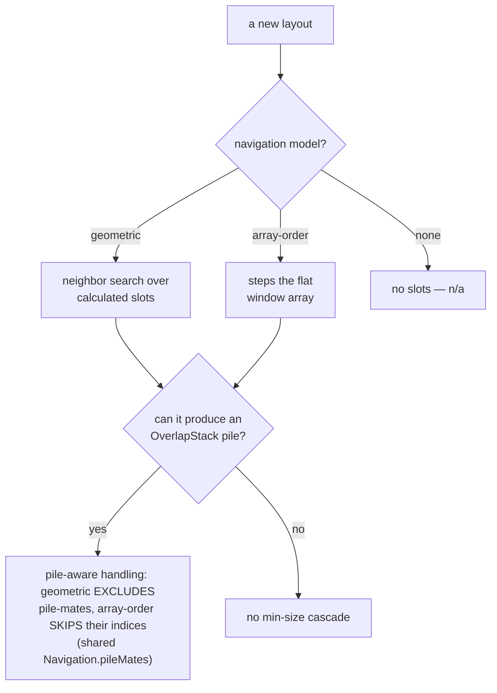

# Design decisions

The settled product and design decisions behind KiwiDesk,
with the reasoning — so users understand why things behave
the way they do, and contributors don't relitigate (or
accidentally undo) a settled choice. Two parts: **Architecture
& product model** (decisions rooted in the engine and config
model) and **Settings GUI & UX** (decisions about the Settings
app and menu bar; many from the #68/PR #88 redesign). Deeper
rationale lives in the linked issues. The cross-cutting
Settings control conventions live in
[Settings UI patterns](ui-patterns.md); binding code rules and
guardrails live in `AGENTS.md`, not here.

## How to read this file (charter)

An entry earns its place by one test: **a contributor working in that
area would otherwise re-litigate it or undo it by mistake.** If the
code already says *what* and there's no non-obvious *why*, it belongs
in git history, not here — so this file stays a design doc, not an
event log.

Each entry is tagged with its **kind** on the line under its heading:

- **[Principle]** — a durable rule that constrains future work. Obey
  it.
- **[Rationale]** — why a choice that looks wrong or arbitrary is
  actually right. Read it before "fixing" the thing.
- **[Trade-off]** — a deliberately-accepted limitation (chief
  among them the reader-facing
  [Accepted limitations](accepted-limitations.md) page and the
  [Blocked by macOS (SIP)](#blocked-by-macos-sip) table).
- **[Map]** — a cross-cutting table a new feature must keep updated
  (the [layout navigation &amp; overflow models](#layout-navigation--overflow-models)
  table).

The file is grouped **by topic**, not by kind, so everything decided
about one area sits together. Adding an entry: give it a kind tag; if
it can't take one, that's the signal it doesn't belong here.

## Architecture & product model

### Product principle: approachable by default, powerful on demand

**[Principle]**

KiwiDesk should give a new user a good tiling setup with almost no
configuration — strong defaults and a handful of obvious controls.
That simplicity must never cap what's achievable: beneath every easy
surface is a deeper layer (Lua config, profiles, advanced layouts,
per-space overrides) that's there when wanted and never required to
begin. Depth is a capability you grow into, not a cost you pay
upfront.

This sits alongside the GUI north-star (`AGENTS.md` §2 — simplicity,
intuitiveness, Apple-native feeling), not inside it: the north-star
governs how a surface *feels* and how to break ties; this principle
governs the *shape of capability* — a shallow floor with a high
ceiling. It's why "simplicity-first" doesn't mean "underpowered," and
it's a deeply Apple-native ethos (products that read simple but
reward digging in). The read-only shortcuts panel (#326) is the shape
in miniature: a dead-simple glance surface, with one "Edit in
Settings…" bridge down to the full editor — simple entry, deeper
layer one click away, never forced.

### Accepted limitations

**[Trade-off]**

Some behaviors are *bugs by design* — accepted consequences of a
settled architectural trade, not defects to fix. The full table —
for each: it's known, here's why, here's the architectural root,
here's the real fix where one is planned — lives on its own
reader-facing page: **[Accepted limitations](accepted-limitations.md)**.
Its rows link back into the reasoning on this page.

Convention: when a review or manual pass classifies a behavior as
accepted-by-architecture, it adds a row **there** in the same change
set — the user-facing twin of the `AGENTS.md` §5 guardrail rule.
A row needs an architectural root and, where one exists, the
planned escape hatch; it is not a wontfix dumping ground.

### Blocked by macOS (SIP)

**[Trade-off]**

A separate class: capabilities macOS forbids without disabling
**System Integrity Protection**. KiwiDesk drives native Spaces
through private SkyLight/CGS symbols resolved at runtime, and the
few operations that *write* the native-Space arrangement are
gated by SIP. KiwiDesk **never disables SIP or asks a user to** —
a disabled-SIP requirement is a non-starter for a window manager
(`AGENTS.md` §5), so these stay unimplemented rather than shipping
a fragile fast path with no safe fallback. Unlike the
[Accepted limitations](accepted-limitations.md) trades,
the root is the OS, not our architecture, and there is no in-app
escape hatch — only Apple exposing a supported API. They are
tracked, not abandoned:

- **Move the focused window to another native Space**
  ([#25](https://github.com/hajiboy95/KiwiDesk/issues/25)).
- **Switch the visible native Space programmatically**
  ([#26](https://github.com/hajiboy95/KiwiDesk/issues/26)).
- **Restore windows across all native Spaces on quit**
  ([#70](https://github.com/hajiboy95/KiwiDesk/issues/70)).
- **Place a window above the top screen border** — the
  WindowServer silently rejects any frame above the visible
  area's top edge. (Partial left/right/bottom overflow is
  allowed; fully offscreen frames clamp back to a title-bar
  sliver on every edge.) So a
  vertical scrolling row scrolled past the top cannot tuck above
  the screen with its lower strip peeking, the way a true
  scroll would; `ScrollingLayout` pins those rows at the border
  instead — their *upper* strip peeks — so retile targets stay
  achievable and the already-there tolerance keeps working.
  Horizontal scrolling is unaffected
  ([#139](https://github.com/hajiboy95/KiwiDesk/issues/139);
  the pin shipped with
  [#66](https://github.com/hajiboy95/KiwiDesk/issues/66)).
  On the other edges KiwiDesk pins far-offscreen slots at its
  own fixed sliver, safely above the OS minimum, for the same
  achievable-target reason
  ([#142](https://github.com/hajiboy95/KiwiDesk/issues/142));
  stashed inactive-space windows park at the same
  floor-derived sliver
  ([#148](https://github.com/hajiboy95/KiwiDesk/issues/148)).
- **Pin a foreign floating window above the tiled plane by its
  window-server level** — `SLSSetWindowLevel` only affects windows
  owned by the *connection* that issues it, so KiwiDesk can level
  its own overlays but not another app's floats. yabai reaches
  foreign windows by injecting into `Dock.app` via a scripting
  addition (SIP disabled); the own-connection fast path was built
  and removed once confirmed useless for foreign floats (reference
  commit `347231e`). `#418` ships the AX re-raise instead — kept
  above on focus, with the transient-activation limitation on the
  [Accepted limitations](accepted-limitations.md) page
  ([#424](https://github.com/hajiboy95/KiwiDesk/issues/424)).

All of these are collected in
[#140](https://github.com/hajiboy95/KiwiDesk/issues/140).

### Layout navigation & overflow models

**[Map]**

Two facts about each layout are invisible without reading its
implementation, yet several cross-layout behaviors turn on them:
**how it navigates** (a geometric neighbor search over calculated
slots, or an array-order step along the flat window list) and
**whether it can produce an overflow pile** (an `OverlapStack`
cascade it falls back to when windows stop fitting at
`min_window_size`). This bit the swap-skip-cascade fix (#172),
which needs a geometric path *and* a separate array-index path —
and track was nearly mis-classified as "already fine" because its
array navigation plus new overflow piles (#128) were written down
nowhere.

There are exactly **two** navigation models, and every layout is
one of them: **geometric** (a neighbor search over calculated
slots — BSP, Stack, Grid) or **array-order** (steps the flat
window array — Scrolling, Monocle, Track). The "how" column below
names only *how that one layout walks its slots* — which axes it
steps, cycle vs step, any cross-axis fallback — a detail of the
same model, **not** a further model. Grep the cited symbol for
detail:

| Layout | Model | How it walks | Overflow → pile? |
|---|---|---|---|
| **BSP** | geometric | `Navigation.neighbor` over slots | yes — an extreme stored ratio cascades the whole space (`BspLayout` → `OverlapStack`) |
| **Stack** | geometric | `Navigation.neighbor` over slots | yes — a zone overflow cascade / `cascade_all` (`StackLayout`); piles always cascade downward, whatever the arrangement (#222) |
| **Grid** | geometric | `Navigation.neighbor` over slots | yes — a last-cell pile (rigid/dynamic past the cap) or a whole-grid cascade at min-size (`GridLayout`) |
| **Scrolling** | array-order | steps along the scroll axis (`scrollingStep`), geometric fallback cross-axis | no min-size cascade — the edge pile (#142) is a viewport pin, not an `OverlapStack` fallback |
| **Monocle** | array-order | steps along the orientation, wraps iff `wrap_focus` (`monocleCycle`) — same 1-D shape as scrolling | no — every window shares one frame |
| **Track** | array-order | steps both axes (`trackStep`) | yes — surplus tracks merge into one far-edge **overflow track** (`OverlapStack`) shaped by `overflow_style` (#192, default `cascade_all`); normal tracks always `cascade_overflow` |
| **Floating** | none | no slots | n/a |

The two models need different handling for anything pile-aware:
geometric layouts **exclude** the focused window's pile-mates from
the candidate set, array-order layouts **skip** their array
indices (#172). Both share one geometric detector,
`Navigation.pileMates`.

Orthogonal to both models, directional `focus` (never `swap`)
runs a **two-tier candidate search** (#488): tiled candidates
first — the model above — and, only when no tiled window lies in
the pressed direction, the space's floating windows by their
live frames (`StateCoordinator.floatingFocusCandidates`:
float-flagged members plus floating sticky windows rendering on
the space; transient overlays and fullscreen windows never).
Tiled-first keeps tile-to-tile navigation untouched while
removing the directional black hole a visible float used to be —
dropped from `effectiveTiledMembers`, it could navigate out (the
anchor falls back to a geometric search from its live frame) but
nothing could navigate back in. Array-order layouts reach the
float tier through their existing edge fall-through to the
geometric search.

**Tiled-sticky injection (#414 v2)** rides the models above with
zero per-layout navigation work: a tiled-sticky window homed on
another space is injected into the active space's tiled member
array (`StateCoordinator.effectiveTiledMembers`, derived
home-index insertion), so geometric layouts see its slot as an
ordinary neighbor candidate and array-order layouts step through
its index like any other. The one place the injection is *not*
enough is what a **focus-driven layout surfaces** (#431): a
Scrolling space pans to `context.focused` and a Monocle space
raises it (`restoreMonocleZOrder`), but the traveler can never be
the active space's membership-guarded `focused` slot, so focusing
it (a bar-item click, a keyboard navigate-to) left the viewport
put — or the window buried under the space's own local window.
`StateCoordinator.focusAnchor` closes the gap: while the traveler
is the frontmost window it surfaces instead of `space.focused`.
`lastFocused` is global, so the anchor tracks the last-focused
window across the workspace and yields the traveler until any real
member is next focused — a bare space switch does not revert it on
its own (it fires no focus event). Directional focus/swap and the
other implicit-focused verbs (`toggle_floating`/`make_*`,
`move_to_space`) resolve their target *through* this anchor too —
the #431 rewire and the #292 foreground guard both read
`focusedWindowID` — so a frontmost traveler is the origin/target,
not the stale local slot it can never occupy. A keyboard reorder
that cannot apply to a non-member (`swap`, `track.swap`,
`stack.promote`/`demote`, `move_to_track`) refuses with the
home-space pill ([#435](https://github.com/hajiboy95/KiwiDesk/issues/435))
rather than silently no-op. `resize` is the one exception, staying
on `space.focused` to avoid orphaning a per-space weight under a
non-member id (see [Accepted limitations](accepted-limitations.md)). The **App Bar** highlight has the same
root and the same shape (#431): its focused item and group
expansion read `KiwiCore.appBarFocused`, which on the active space
prefers the system frontmost (`lastFocused`) so a traveler's item
lights up, while every inactive-display space keeps its own
remembered `focused`; the Space Bar already carried this fix
(#414, it reads raw `lastFocused` because its items are spaces). What *does* differ per layout is the
overflow pile: a sticky window keeps a fully-tiled slot, so the
partial tile-then-pile overflows — Stack zones, track columns
(`cascade_overflow`), and the grid's last-cell pile — clamp it
below the boundary via the shared `OverlapStack.stickyExempt`
(a trailing non-sticky window piles in its place). Whole-region
cascades (`cascade_all` and the emergency min-size fallback)
exempt nothing (no fully-tiled slot exists — see Accepted
limitations); Scrolling has no `OverlapStack` pile at all — its
overflow is the scroll, and the clamped edge columns (#142/#150)
are scroll-reachable viewport pins a sticky may sit in like any
other slot, not cascades — and Monocle stacks everything
full-frame, so both need nothing. Reorder of a traveler is home-space-only: `Space.swap`
/`move`/bar-drag membership guards no-op on a non-member by
design (v2 non-goal; see [Accepted limitations](accepted-limitations.md)). A **new layout**
adding a row above must also state which pile class it produces,
so the sticky exemption is reconciled with it.

The **focus border** (#278) is a cross-layout overlay that
deliberately opts OUT of the pile-dedup model above: with
`border.unfocused_enabled`, every tiled window gets its own ring,
including every member of an overflow cascade. Buried
rings naturally show only along their exposed cascade edges because
each overlay is ordered directly behind its target window. The stroke
geometry overlaps under the target to prevent a detached seam, while
the target masks that overlap so the border never covers content. A
popover, sheet, or emoji picker above the target naturally covers the
ring too. This is a border-only presentation policy:
`Navigation.pileMates` remains the
shared authority for navigation, swaps, and z-order restoration. In
monocle — where only the focused window is visible — borders stay
focused-only. Floating windows are excluded from the unfocused set;
the focused window is still ringed whether tiled or floating.

A **transient overlay** — a window that floats for a *structural*
reason (accessory activation policy, a non-standard panel subrole,
or a raised CGWindow layer) rather than a matched `float_rules`
entry — never receives a ring, even while it holds focus (#300).
The suppression is a **draw-time heuristic** for windows that stay
in managed state: they float and behave correctly, so only the ring
is wrong, and the fix belongs where the ring is drawn. This is
deliberately narrower than excluding *all* focused floats — a user
who floats a standard window still wants its ring; a panel does
not. The classification is captured at track time
(`ManagedWindow.isTransientOverlay`), so the pure `borderSpecs`
decision stays AX-free, and it clears the moment detection
self-heals a window back to tiled — the flag can never outlive the
float state it depends on (overlay ⟹ floating).

The *launcher* subset of that class — an accessory app's
raised-layer command bar (Spotlight, Raycast, Alfred) — graduated
from draw-time suppression to the **built-in ignore gate** (#448):
#300 kept those bars managed because only the ring was wrong, but
multi-monitor QA (#446) showed a managed bar is also space-pinned —
tiled, stashed, and dragged across space switches. They are now
never tracked at all (accessory policy **and** raised layer, plus a
layer-scoped bundle belt for a dock-icon Raycast, alongside
Ghostty's quick terminal #21). The draw-time heuristic remains for
the structural floats that stay managed: panel-subrole windows of
regular apps and accessory apps' layer-0 windows.

A **native-fullscreen** (green-button) window is suppressed by the
same draw-time mechanism: it stays a member of its home virtual
space (macOS moves it to its own Space without a destroy), but it
fills the display, so a ring would peek out only at the rounded
corners — jankyborders skips fullscreen windows for the same
reason. The verdict (`ManagedWindow.isFullscreen`) is snapshotted
from `AXFullScreen` at track time and refreshed change-only on
reconcile, keeping AX out of the border path; it is orthogonal to
floating, so float mutations never touch it.

The ring's **rendering backend is opportunistic, not architectural**
(#285): when the complete runtime-linked SkyLight drawing and event
surface resolves, an SLS window follows WindowServer move/resize/order
events directly. Drawing and tracking degrade independently: a failed
raw-window operation replays the ring through the public AppKit panel
without discarding a healthy WindowServer event stream. Direct mouse
drags use one movement authority: WindowServer bounds whenever its event
surface is active, otherwise the stable AX/AppKit fallback. No path
projects a border from cursor motion, so macOS edge/corner dwell holds
the ring and target together. No private symbol is linked at launch,
and the optimization never changes SIP requirements or the layout/state
model.

**Two vocabularies, one split (#185 review, 2026-07-12):**
*navigation* (`focus`, window `swap`) is spatial and
layout-agnostic — left/right/up/down everywhere, per the table
above — while the two *track sequence verbs* (`move_to_track`,
`track.swap`) speak **prev/next**. They operate on the 1D track
sequence, not on geometry: prev = lower array index (the column
to the left / the row above), next = higher (right / below).
This kills the per-axis inert direction pair (with compass
arguments, two of four bindable rows were always dead keys) and
a binding survives an axis flip. Do not extend prev/next to
`focus` — that would fork the navigation model for one layout —
and do not add compass aliases to the sequence verbs.

**Track is guided by copy, not gated (#188, 2026-07-12):** an
earlier design put the track layout's multi-window surfaces
(the cap, `new_window`, `move_to_track` / `track.swap` and their
shortcuts) behind a global `set_track_advanced` switch, default
off, with the shortcut rows inert and hidden until it flipped
(#181). That was reversed: every track surface is always
visible and always works. Newcomers are oriented with copy
instead — a caption at the top of Layout Defaults ▸ Track marks
it a more advanced layout, and the "Move to track" shortcut
subheader carries "(only relevant if you're using the track
layout)". A blocking flag bought guidance at the cost of a
whole machinery — inert-but-stored keybindings, a resolution
clamp, silent-steal conflict handling — and made unbound track
rows in another layout read as broken rather than simply
irrelevant. Copy carries the same message with none of that.

**The overflow track is read-time, not stored (#192, 2026-07-12):**
when there are more tracks than the space's normal capacity, the
fitting prefix tiles and the surplus merges into one far-edge
overflow track. Normal capacity is the **Track limit** N when
automatic tracks is off (so a limit of N shows up to N normal
tracks **plus** one overflow track — `trackCap` is `count + 1`,
and a new `own_track` window past N opens the overflow track
rather than joining), or **how many fit at `min_window_size`**
when automatic is on. Geometry always caps the total: if
capacity + 1 columns can't hold the minimum, the fit count
(`TrackLayout.fitCap`) reduces the columns at layout time,
folded through the existing `counts(cap:)` primitive — so the
overflow track moves on its own as windows are added or the
display changes; nothing is written into the window array or the
break markers. Spawn placement stays
geometry-free (the flat-array / pure-layout invariant, AGENTS.md
§1/§5): a window lands by `new_window` / `new_window_position`
and simply falls into the overflow track's slice at render time.
`overflow_style` shapes only that overflow track (default
`cascade_all`); every normal track's own overflow is always
`cascade_overflow`. An earlier "overflow-aware spawn" idea —
shifting windows into a new track at spawn based on available
space — was rejected here for putting geometry into state (it
would make spawn outcomes monitor-dependent and
non-deterministic). **This was deliberately revisited for the
`focused_track` default — see the next entry.**

**Fill-then-spill is the track default; the spawn-geometry ban is
relaxed for it (#437, 2026-07-23):** `focused_track` — now the
default (`own_track` demoted to the ultrawide "one app per column"
opt-in) — fills the focused track and, when it can't fit another
window at `min_window_size`, spills the next window into a new
track beside it (focus follows, so the recursion needs no
special-casing). The unbounded within-track pile the old
`focused_track` produced was never a chosen feature — it was the
overflow fallback moonlighting as primary behavior. Getting the
shelf-like "fill the column you're at first" feel **requires**
the geometry #192 kept out of spawn: the spill boundary is "how
many fit at `min_window_size`," a display-dependent count. So the
ban is relaxed *for this one decision*, with the cost #192 named
accepted: spawn outcomes are monitor-dependent (a set of windows
packs into fewer tracks on a larger display, and moving to a
bigger display does not un-spill an already-spilled window). The
containment that keeps it honest: the geometry is computed only
where it already lives (`TilingEngine.trackCapacity`, the same
`fitCap` the render piles by) and **mirrored into the pure state
core as a plain per-space `Int`** (`StateCoordinator.trackCapacities`,
like `trackParams`), so `Space.insertIntoTrack` stays a pure
function of the flat array plus that number — no `LayoutContext`
reaches the state layer. The pile survives only as the
no-alternative fallback (a fixed `count` cap with no room, or a
`move_to_space` traveler an explicit placement mustn't relocate),
so it never contradicts the spill. Entering track mode seeds the
same way: `focused_track` packs the existing windows into filled
tracks (`TrackLayout.fillSeed`), `own_track` gives each its own —
the seed mirrors what incoming windows would do. Navigation and
the overflow-pile classification are unchanged (the pile is still
the array-order Track model's fallback), so the table above keeps
its Track row as-is.

### Layout and resize behavior

**[Rationale]**

How the layout engine answers resize, orientation, and
overflow questions — settled trades, most of them consequences
of the flat-array model (`AGENTS.md` §1/§5). Navigation and
overflow-pile classification live in the table above; how a
two-axis layout's wire keys are named follows the
geometric-wire rule in
[Settings UI patterns](ui-patterns.md#labels--wire-names).

**Interactive resizes are session-scoped per space; the config
layers never move underneath them (#458).** Before, a resize on
a space with no authored override wrote the *global* ratio —
coherent under the #17 layered model ("you resized the
default") but visibly wrong the moment two monitors show two
no-override spaces: resizing one resized both. The two rejected
alternatives: keeping as-is (documented confusion), and
materializing a per-space override on first resize (silently
pins the space, decouples it from Layout Defaults, and fills
the #290 override editor with overrides the user never
authored). Chosen: a **session ratio layer** on the `Space`
(`SessionRatios`), the `stackWeights` precedent — interactive
writes land there when no authored override carries the field,
config stays untouched, and the layer reseeds on a real mode
change or `reload_config`. Read precedence is authored override
> session > global, and every **explicit config write** drops
the session shadow so it always visibly applies (the #383
"visibly did nothing" rationale): a global setter
(`bsp.set_ratio_h`, `stack.set_master_ratio`,
`scroll.set_slot_size`) clears its own field everywhere, and an
explicit apply — `load_profile`, a preset, a GUI save — clears
the whole layer, riding the same `forceRetile` classification
those applies already carry (§5); event-driven applies (monitor
change, native-space binding) keep it, so a display reconnect
never eats an interactive resize. Covers the BSP split ratios,
stack master ratio, and scrolling slot size — the same shape
for all three, per the #458 scope note. Accepted edge: removing
an override field mid-session can resurface an older session
value until the next reseed.

**Resize is truly 2-axis via two per-space BSP ratios; per-node
ratios are rejected.** `resize("x")` and `resize("y")` used to
write the *same* scalar (one `splitRatio` for every BSP split, one
`masterRatio` for stack) — the axis only scaled the step, so a
"resize vertically" key visibly changed column widths. #56 gives
BSP two ratios per space — `ratio_h` for side-by-side splits,
`ratio_v` for stacked splits — so each axis moves its own knob,
in commands and in mouse resize (a width-dominant drag edits H, a
height-dominant one V). **Per-node ratios were deliberately
rejected**: they require stable per-split identity, i.e. a
container tree, which the flat-`[WindowID]`-array model forbids
(AGENTS.md §5) — two global ratios per space is the design that
fits the architecture. The Size & Float catalog grows from 3 rows
to 5 (Grow/Shrink × width/height + Make floating), all authored
from the one shared `resize.step`; scrolling still resizes its
slot along its own scroll axis whichever axis is passed, and
monocle/grid/floating stay explicit no-ops. No back-compat alias
for the old `bsp.set_ratio` / `layout.bsp.ratio` name
(pre-release, single user). (#56)

**Stack resize is focus-aware, and its zone weights are
ephemeral by design.** The stack layout's resize used to always
move the master/stack split toward the master, whichever window
was focused. #67 makes both axes act on the *focused* window:
the split axis (`x` for a left/right stack zone, `y` for
top/bottom — #222) moves the split in the direction that grows
the focused window's zone (flipping the old always-grow-master
behavior when a stack window is focused — intended), and the
focused zone's own axis grows the focused window's share of its
zone via **per-window weights** — a `[WindowID: Double]` map
in `Space`, parallel to the flat window array (a map, not a
tree: it adds no structure the flat-array guardrail forbids).
The weights are **session-scoped and never serialized**: a
`WindowID` is an OS window handle, unstable across app and
window relaunches, so there is nothing durable to persist a
weight against — persisting them would at best restore sizes to
the wrong windows. They are pruned when a window leaves the
space. When a weighted share drops below `min_window_size`, the
zone falls back to the existing overflow cascade (weights
apply to the fully-tiled case only), and the resize command
caps weight *growth* at that cliff so presses past it cannot
ratchet the stored weight invisibly; clamping the *master
ratio* against min window size stays a separate issue (#44).
One deliberate asymmetry: a *drag* along the zones' own axis
still snaps back (the mouse seam is windowless); only the
keyboard/CLI `resize` moves weights. (#67)

**The stack zone's lineup derives from its position — no
`stack_orientation` knob; piles always cascade downward.** #222
made the stack arrangement configurable: `stack_position`
(top/right/bottom/left) picks the split axis, and
`master_orientation` lines up multiple masters. The stack zone
deliberately has no orientation setting of its own — a
left/right zone is a tall strip, so it stacks vertically; a
top/bottom zone is wide, so windows sit side by side
(`StackPosition.stackOrientation`, the single authority). Any
other combination degenerates into slivers, and deriving keeps
the resize axes orthogonal: the split ratio always moves on the
split axis, the stack's weights on the other. Overflow piles
keep cascading downward in every arrangement (ui-designer
consult, 2026-07-15): the title bar is the affordance unit
(identify + drag + raise) and one pile vocabulary spans the app
— a sideways pile would expose blank side slivers and read as a
glitch. A wide zone's `cascade_all` pile may spill over the
master zone; that is the same accepted spill tall zones already
do at the screen's bottom edge, kept coherent by the managed
z-order. If pile depth ever hurts, the lever is a depth cap —
not a direction switch. (#222)

The `master_orientation` default is `horizontal`: side-by-side
masters beside a right stack turn a raised master count into
columns — the arrangement wide screens actually want — whereas
a vertical master column duplicates the stack's own shape next
to it. The trade is conscious: the standard arrangement then
sits inside the along-axis resize limitation above (masters'
individual shares are unreachable until the orientation is
switched to vertical), and the leading-edge promotion path is
the default-adjacent bug #313. (#222)

**The master zone fills from the stack seam when the stack
leads.** (#313) `StackLayout.zone` lays array order from a
region's min edge, which put the boundary master (the
promote/demote swap slot) at the point *farthest* from a
leading stack — every boundary crossing teleported across the
master zone. Mirrored slot order (leading stack + parallel
master lineup only) is a pure render mapping: the flat array,
the promote/demote swaps, and seniority stay untouched;
geometric navigation follows the frames; `StackSchematic`
mirrors via the same `StackLayout.mirrorsMasterZone` predicate
so the preview cannot lie. Perpendicular lineups stay in
natural reading order — every master already touches the seam.
Boundary crossings now read identically to the trailing-stack
(default) arrangement: the crossing window moves locally,
survivors shift one slot. Accepted side effect: when a mirrored
master zone uses `cascade_overflow`, its trailing pile contains
the array-earliest masters instead of the latest; the pile keeps
the same screen position and downward cascade either way.

**The stack cascade is a last resort; extreme ratios clamp at
layout time, and interactive writes cap at the visible cliff.**
An out-of-range `master_ratio` used to collapse the whole space
into the OverlapStack cascade the moment a second window opened
(#44). Now the layout clamps the *effective* ratio to the widest
value keeping both zones ≥ `min_window_size`
(`SplitDomain.effectiveRatioRange`, the single authority), and
cascades only when two min-size zones cannot coexist at any
ratio. The **stored** config value stays untouched — a ratio too
extreme for this display is honored again on a wider one — but
the **interactive** paths (keyboard `resize("x")`, mouse drag)
cap their writes at the current display's effective bound
(`SplitDomain.cappedRatioWrite`): past it the layout clamps
anyway, so a wider write would only ratchet invisibly — the same
rule as the #67 vertical weight cap, and the same
config-wide/interaction-capped split. **#383 migrated the same
principle to BSP.** An extreme BSP split ratio no longer collapses
the subtree into the overlap pile: the layout clamps the effective
ratio *per region* at every recursion depth
(`SplitDomain.effectiveRatioRange`), so a value too extreme for a
deep sub-region pins that region's neighbor to `min_window_size`
rather than piling — the shared per-space scalar ratio needs no
per-node tree for this, because the clamp runs against each
region's own span. Both BSP interactive paths (keyboard
`resize`, mouse drag) cap their writes too
(`SplitDomain.cappedRatioWrite`), and the pile stays reserved for a
region genuinely too narrow for two min-size windows at any ratio.
(#44, #383)

**BSP keyboard resize is focus-aware in *direction* only — and
some nested windows cannot grow. Accepted, by architecture.**
Since #122, `resize` infers its sign from the focused window's
slot (the same screen-midpoint side rule a mouse drag uses,
shared as one authority — `MouseResize.bspSide`), so "grow"
grows the focused window's side instead of always the left/top
region. What it deliberately does **not** do is give every
window a growable boundary: all same-orientation splits still
share the one per-space ratio (#56's settled trade — per-node
ratios need a container tree, which the flat-array model
forbids). Concretely: the inner window of a pair nested inside
the second region has width `r·(1−r)·W`, which is *maximized*
at the default ratio — no resize direction can widen it, and
the visible effect of a grow press is its outer neighbor
widening instead. The same is true when dragging that window's
edge with the mouse; keyboard and mouse stay in lockstep,
warts included. This is an **accepted limitation, not a bug to
fix within BSP**: a smarter sign (derivative-based) was
considered and rejected — it cannot help the pinned case and
would split the just-unified mouse/keyboard rule. The real
answer is the `track` layout (#128, shipped), where every
window sits in exactly one track and every resize has one true
target. A **floating** focused window is exempt from all of
this: it resizes itself directly, in every mode (width for x,
height for y, floored at `min_window_size`). (#122, #124,
#129)

**The tiled→floating toggle nudges the window, and the nudge is
a fixed magnitude, not proportional.** A window keeps its exact
frame the instant it turns floating, so `make_floating` /
`toggle_floating` looked like they did nothing — no acknowledgement
of the state change. The float direction now gives the window a
small shove toward its screen's visible-frame center (the tiled
direction already animates a real move back into the layout, so it
needs none). The magnitude is deliberately **fixed** —
`min(24 pt, distance to center)` along the unit vector to the
center — rather than proportional to the window size: a
size-scaled nudge (longest-side × 0.2, say) teleports a maximized
window clear across the screen while barely moving a small one.
The fixed form self-tapers instead — a window already near the
center has a short distance term and so moves less, reaching zero
with no edge special-casing; a dead-centered window (direction
undefined) shoves straight down. The target is clamped fully
inside the visible frame, exactly like tiled placement, so it can
never land under the menu bar / a reserved bar strip or partly
off-screen, and it rides the existing relayout animation so the
motion reads as a deliberate move, not a jump. Fires on the
explicit float verbs only — `make_floating` and a
`toggle_floating` that lands on floating — once per tiled→floating
flip, never on an already-floating window. `make_auto` is
deliberately excluded: its flip is detection-driven, not a
deliberate user float, so it gets no acknowledging nudge.
Fixed, not proportional, is the whole point — recorded
here so it is not "optimized" back into a size-scaled form. A
niche polish behavior, so the disable knob (`set_float_nudge`,
default on) is Lua-only with no Settings toggle.

### Spaces, profiles & config ownership

**[Principle]**

**The fallback space is an explicit choice, not "whichever
row is first".** When a profile switch drops a space, its
windows need a home. Tying that to the first list row (the
#75 interim rule) forces users to order spaces by system
constraint instead of preference — and the redesign made the
order user-owned (drag to reorder). So the rehome target is a
dedicated per-profile reference (`fallback_space`,
`KiwiDesk.set_fallback_space`), shown as a badge on the row;
without one, the first-of-list rule still applies, so old
profiles behave unchanged. Pull-to-first was considered and
rejected: it would have made reordering silently change the
fallback. (#68 §3.3, #75)

**Deleting a space removes every reference it holds** (pin,
Main role, fallback, per-space overrides) — a leftover
reference would silently resurrect the space on the next
profile load. App rules survive by design: they're global,
and another profile may declare a space of the same name.

**Live state is the single source of truth for which spaces
exist; `gui.json` mirrors it, never the reverse.** A deletion
prunes the space from live immediately (windows rehome to the
fallback), not only when a later profile load happens to drop
it — otherwise the next save re-captured it from live and it
reappeared. The sidecar's `spaces` list is kept a faithful
copy of live *as of the last authoritative reconcile*: every
explicit prune — a `load_profile` (including a scripted
Lua/CLI one) or an in-place edit — writes the live set back.
Hardware-driven applies (monitor change, native-Space
binding) deliberately don't prune or mirror (the
no-shuffle-on-reconnect rule), so between such an event and
the next reconcile the list may lag; the cold-boot seed and
the next prune re-converge it. The one place `gui.json` seeds
*into* live is cold boot — a space that lives only in the
sidecar (no profile, pin, window, or `set_mode` backs it) is
seeded so it survives the reload. That seed is safe against
resurrecting a profile-pruned space precisely because the
mirror keeps the list current. Deletion is per-profile:
each profile is its own file, so removing a space from the
active profile never touches another profile that still
declares a space of the same name. (#77)

**Shared display Spaces are recommended, not required.**
KiwiDesk resolves one active native Desktop number and one active
profile across the whole display setup. With macOS's "Displays have
separate Spaces" option on, multiple displays can show independent
Desktop combinations that this one-profile model cannot represent
unambiguously. Shared display Spaces therefore make Desktop→profile
bindings predictable, but they are not a prerequisite for basic
tiling.

Both surfaces share one gate — separate Spaces on *and* two or more
displays connected — so a single-display setup, which has no binding
ambiguity, is never prompted. Onboarding recommends turning the option
off only in that state and lets the user continue without changing it.
The Profiles tab keeps the specific Desktop-binding controls visible
and editable; in the same multi-display state an inline warning
explains the limitation and opens Desktop & Dock Settings. The saved
profile list and its Load actions are unrelated and never warned or
disabled. Hiding the binding section would erase context and existing
configuration; disabling it would incorrectly claim that every binding
is inert. (#8)

**Profiles may override *behavior* settings, never *routing*
ones.** A profile owns tiling, and may also carry a sparse
override of a global setting that shapes how the workspace
*behaves while the profile is active* — keybindings
(`Profile.modes`) and the three window-rule families:
app→space (`Profile.appRules`), float (`Profile.floatRules`),
and ignore (`Profile.ignoreRules`). The global base lives in
the active config owner (`gui.json` or hand-written `init.lua`).
Each profile stores only additions and explicit tombstones;
families resolve independently, then effective ignore remains
the hard management gate. Thus an ignore tombstone exposes an
app to its independently resolved app/float rules. It may never
override a setting that *selects or routes* the profile
itself: the native-Space→profile bindings decide *which*
profile loads, so a profile owning part of that map would be
a self-reference (load A → A rebinds Desktop 2 → B → …). The
GUI language is a second hard exclusion for a different
reason — it lives in `UserDefaults`, outside config ownership
entirely, and must never touch a sidecar. Every override is
the base overlaid with a sparse diff (absent inherits; a
tombstone removes), never a second home for the setting. The
binding rules for adding one — sparse-diff mechanics, parity
tests, mutation through the `KiwiCore` facade — live in
`AGENTS.md` §5.

**Floating windows hide with their space; visible-everywhere
is Sticky, an explicit flag.** Historically a floating window
was exempt from the inactive-space stash and followed you
across virtual spaces — the stash comment even blessed it as
intended "for PIP". #412 reclassified it as a bug: state
always scoped the window to one space, only rendering
disagreed, and a user who floats a scratchpad on space A does
not expect it over space B. Now every window — tiled or
floating — parks with its inactive space (the engine captures
a floating window's frame on first stash and restores it when
the space returns; layouts recompute tiled frames anyway).
The deliberate "present on every space" behavior is the
per-window **Sticky** flag (#414, `toggle_sticky`) — fully
managed, unlike the blunt `ignore_rules` gate. Consequence,
accepted: a Picture-in-Picture panel that presents as a
*managed floating* window now parks with its home space until
marked sticky; most PIP/quick-terminal overlays are tracked
as transient overlays or ignored outright and never stashed
at all. "Sticky" is the settled user-facing term (tiling-WM
lineage: X11 `_NET_WM_STATE_STICKY`, i3, yabai); "pin" was
rejected — Apple's own apps use pin for "fixed here", the
opposite direction. Sticky is per-instance state, never a
rule list, never a profile key, and never stored by
duplicating the id into other spaces' arrays. (#412, #414)

**Sticky has two scopes: global and display (#445).** The
original sticky is *global* — every space of every monitor.
A second scope, *display sticky*, keeps a window on every space
of **one** monitor only (its home space's display), the common
"keep this on my main screen, not the laptop" want. The scope
is a per-window value (`StickyScope.none/global/display`), not a
new flag — the home display is *derived* from the home space's
display, so a cross-display move re-homes it with no bookkeeping.
Two peer verbs (`make_display_sticky` / `toggle_display_sticky`)
sit beside the global ones; `make_unsticky` is shared, and each
verb writes its scope outright so `make_sticky` on a display
sticky turns it global and vice versa (the #221 sibling-verb
model — no tri-state, no detection source). Both wear the same
indicator toggle and color; only the glyph differs — `infinity`
(∞) for global, `pin.fill` (📌) for display (the pin reads as
"tacked to this screen", the sibling of `SpaceAssignmentChip`'s
"bound to one space"). On a single monitor the two scopes
coincide (`stickyRenderSpace` collapses display to global), so
nothing changes for single-display users.

Because a sticky window's whole point is to stay put,
`move_to_space` on one is *guarded* rather than silently
rewriting its home membership: a global sticky refuses any
target (it is already everywhere), a display sticky refuses a
*same-display* target but accepts a *cross-display* one (which
re-homes it). The refusal reuses the shipped `StickyIndicatorPlate`
pill (`sticky.everywhere.pill` / `sticky.display.pill`), fired
from the shared `moveWindow` choke point so the keyboard move and
the Space-Bar drag both honour it. Which display a sticky
*renders* on is `stickyRenderSpace`: a global sticky follows the
**focused** display (one physical window can only be one place),
a display sticky follows its home monitor's shown space — and its
home space no longer reserves a phantom tiled slot when it has
traveled away, which is what let the same window fight for two
frames across monitors before. (#445)

## Settings GUI & UX

### Navigation & saving

**[Principle]**

**Two-group sidebar, topic-named: "Design" vs "System".**
Every control either travels with the profile being edited or
is app-wide, and the old flat tabs hid which was which — the
single biggest source of confusion. The sidebar makes the
split part of the navigation, but names the groups by *topic*,
not scope (System Settings groups by subject, never by
per-machine/per-user scope): **Design** holds the
profile-scoped content (Spaces, Layout, Monitors, Appearance,
Behavior); **System** holds the app-level surfaces (Profiles,
Shortcuts, App Rules, General). Scope stays the underlying
model — the header's profile picker shows which profile
"Design" edits — it's just no longer the group label, since a
new user can't predict placement from "is this a Profile
thing?". The membership is unchanged from the earlier "This
Profile" / "Whole App" split; only the labels are topical.
(#68 §3.1)

**The sidebar is a fixed-width, floating, non-resizable
column.** (#297) A closed ~9-row icon+label taxonomy never
needs more or less room, so a draggable divider is the same
"bespoke panel" tell that got the collapse toggle removed
(#68) — and a collapsed sidebar had no affordance to reopen
it. System Settings, the GUI north star, fixes its sidebar
too. Mechanically the shell composes the two columns with a
plain `HStack`, not `NavigationSplitView`: on macOS 26 the
split view's divider cannot be locked by any supported means
(the column-width modifier is ignored, `NSSplitViewItem`
thickness writes are reverted by the private controller,
delegate interception crashes), so the static column is fixed
by construction rather than by fighting the framework —
revisit if a later macOS/SwiftUI exposes a supported
fixed-width sidebar. The
column renders as the macOS 26 floating pane: a rounded,
shadowed card inset from the window edges with the traffic
lights inside its top-left, in near-window-background gray
(settled by eye against System Settings), with no divider
line, and softly-shadowed icon tiles. When the window resigns
key the card goes flat #F7F7F7 (sampled from System Settings'
inactive sidebar; dark mode falls back to the flat window
background) and the hand-built chrome above the list
(identity, search, icon tiles) fades uniformly — hue kept,
never desaturated (`InactiveDimmed`), keyed to fully-inactive
only so the shared color panel taking key does not dim the
sidebar.

**Live-apply is the rare exception, earned per control — not
per tab.** (Settled 2026-07-10, full-Settings audit; #123.) A
control stays staged behind Save unless it clears one of two
bars: **(a)** it owns no profile state at all (the General ▸
Language picker persists straight to `UserDefaults`, never
`gui.json` — there is nothing to stage), or **(b)** its
feedback loop *is* the live runtime and no in-window
simulation can substitute (the keybinding recorder: the only
way to know a shortcut works is to press it). Everything else
— sliders, colors, pickers, placement grids — stays staged;
where a raw value is hard to judge, build an in-window
preview (the `GapsDiagram` / `DragVisualsEditor`-strip
pattern), never live-apply. Sweep verdicts: Spaces, Behavior,
App Rules, Shortcuts (minus the recorder), and the
native-Space profile bindings are plainly staged. Monitors'
drag-cards and the icon pickers are **self-previewing** (the
control is its own preview — a third category needing neither
live-apply nor a bolted-on preview). Profiles-section
rename/delete/make-default/preset-apply are immediate file
**actions**, not settings — correctly outside this question.
The Spaces tab's per-space layout picker stays staged. **No
control besides the key recorder passes the live-apply bar.**

**One stable save footer: Revert / Save a Copy As… / Save.**
The old footer showed up to seven differently-labeled verbs
depending on invisible mode state, but they expressed only
two intents: "persist to what I'm editing" and "duplicate
under a new name". Three stable slots, clustered at the
trailing edge. The header's profile picker names the edit
target authoritatively — a destination caption beside Save
duplicated it, read as confusing, and its fixed width split
the button cluster apart, so it was dropped. Adopt is not a
save verb — it lives with the raw-Lua content it migrates.
(#68 §3.12)

**The edit-target dropdown lists the loaded profile as its own
row — no collapse to Live.** (#209.) The top **Live** entry
edits the running/global config; every saved profile lists
below, the loaded one included. Picking the loaded profile used
to silently remap to Live, which made it the one profile whose
*stored* sparse overrides (key modes #55, app rules #109) could
never be edited — you could only touch the live/global config.
The considered fix — listing the loaded profile **twice**, top
meaning global and list meaning overrides — was rejected as a
menu anti-pattern: the ✓ can't disambiguate two identical rows,
the closed title goes ambiguous, and the discard guard keys on
the profile name. Instead the rows are already textually
distinct (`Live (currently loaded)` vs `Name (currently
loaded)`), so the collapse is simply deleted and each profile
is one real `.storedProfile` target. Editing the loaded
profile is the sole target whose Save hits the screen at once:
`saveEditedProfile` → `reapplyIfInEffect` re-applies it **in
place** (no switch), because it *is* the layout on screen — so
its status caption drops the generic "changes won't switch your
layout" for a truthful "saving re-applies *Name* with your
changes", and the closed menu title reads "*Name* — overrides"
to stay distinct from Live-with-that-profile-loaded.

*The two doors write different layers, by design.* #209 makes
the loaded profile reachable through **both** the Live entry and
its own row, and the two saves touch **disjoint** field sets of
the same file — intentionally, because they edit different
layers of the sparse-override model, not the same data twice:

- **Live Save** (`updateActiveProfile` → `persistProfile` →
  `buildProfile`) adopts the live **tiling** state (`spaces`,
  `spaceModes`, `mainSpaces`, `fallbackSpace`, `settings`) and
  **deliberately preserves** the profile's stored `modes`,
  `appRules`, `floatRules`, and `ignoreRules` — those are sparse
  *diffs* against the global base, and Live editing changes the
  base (`gui.json` or `init.lua`), never the diff.
- **Override-row Save** (`saveEditedProfile` →
  `overwriteProfile` → `applyProfileEdits`) writes the profile's
  sparse behavior **diffs** (against the matching global bases)
  plus its tiling — this is the surface that edits the diff.
  Ignore rules have no GUI control yet, so that hidden diff is
  preserved verbatim rather than reconstructed from resolved state.

So "Live leaves `profile.modes` frozen while the row rewrites
it" is the model working, not divergence: one door edits the
base, the other edits the per-profile diff over it. The trap to
avoid is "fixing" `buildProfile`/`persistProfile` to also adopt
the behavior overrides — that would collapse the diff into an
absolute and silently break the sparse override. Pinned by
`ProfileSaveAsymmetryTests` so a future edit that erases the
asymmetry fails red.

**One header bar: section title leading, profile picker
trailing; status only when non-nominal.** The section name and
the profile edit-target picker are related facts (what am I
looking at / in which profile), so they share one titlebar row
instead of a title stacked over a separate profile banner. The
picker moves into a trailing toolbar item, shown everywhere
except General (`showsProfileContext`) — App Rules keeps it
because its rules target profile-scoped spaces (and, since
#109, its Space facet is itself per-profile-overridable).
The status sentence is demoted to a conditional strip that
mounts only when there's something non-nominal to say
(divergence, unsaved, built-in, no-match, or a warning) — a
synced profile says nothing, so the common case is a single
bar and content scrolls straight under the blurred titlebar.
(#68 §3.1)

**"Unsaved changes" is a live comparison, not a latched
flag.** `isDirty` compares the edited config and Lua source
against the as-loaded baselines on every change, so manually
undoing an edit clears the footer again — a latched flag
kept claiming unsaved changes after the user had already
put everything back.

**Quick-menu layout switch is session-only.** Changing the active
space's layout mode from the status-bar quick menu updates the running
state immediately but is session-only by default (temporary). It does
not write to the active profile JSON, letting users experiment with
transient layouts (e.g., trying Monocle momentarily) without
rewriting their configuration. If they want to keep the layout, a
"Save Current Layout to Profile" row is provided. Saving adopts the
whole live state (whole-state snapshot semantics), avoiding partial
saves or complex tracking; a failed save (e.g. a screen-count
mismatch) raises an alert — the menu has no footer to warn in.
Reverting in Settings re-applies the saved profile **only while
layout drift exists** — matching the footer caption that announces
it; a plain staged-edit revert stays model-only, exactly as before.
The drift-revert reuses the in-effect re-apply path, so it also
prunes spaces created since the profile was saved (their windows
move to the fallback space) — Revert means "back to the profile",
not "back minus the layout". Drift captions recompute on window
show and on quick-menu actions, not on external `set_mode`
(hotkey/Lua/CLI) — the next open catches up.

### Spaces

**[Rationale]**

**Space rows are bordered cards; reorder is an axis-locked
handle drag, not a drag session.** A system drag session's
ghost follows the pointer on both axes and cannot be
constrained, and its drop choreography (snap-back flights,
ghost-over-row double vision) kept reading as broken. The
reorder is therefore a plain vertical `DragGesture` on the
grab handle: the row itself lifts (shadow + slight scale)
and steps slot to slot — it never leaves the column, only
the pointer's vertical position matters, and there is no
ghost at all. (`List.onMove` was rejected too: it brings
list chrome that fights the card sections and shows no
better affordance.) Each row is a bordered card, the handle
flips the cursor to an open hand on hover, and the name is
a visible rounded-border field of fixed width — renaming is
discoverable without clicking first, and the fields align
in a column.

**Space icons are recognition sugar; the name stays primary.**
Optional per-space icon (`space.icon`) shown where scanning
many small items pays off — space rows, monitor chips,
per-space shortcut labels — never as the only signifier.
(#68 §6.5)

**Saved profiles lead; Presets demote once one exists.** On
the Profiles tab, the built-in Presets top the list only
while no profile is saved yet — they're a bootstrap tool,
and leading with an empty saved-profiles list would leave
first launch barren. From the first saved profile on, the
order flips: the user's own content takes the top — saved
profiles with the Desktop bindings that reference them
directly beneath — and the full preset list closes the tab.
No disclosure folding on any section — collapsed content
was tried and rejected as visual clutter; a plain order
swap carries the same priority signal.
The zero-profile state additionally gets a **soft
spotlight, never a gate** (QA 2026-07-19): a "Start here"
lead-in with accent-prominent Apply on the appliable
presets, an accent dot on the Profiles sidebar tile, and a
pre-filled first-save name. A hard first-run gate was
considered and rejected — System Settings never gates a
pane, the zero-profile state recurs whenever the last
profile is deleted, and KiwiDesk tiles fine with no
profile, so wandering must stay legal. All of it is
state-driven on "no saved profiles" (no persisted
seen-flag) and vanishes with the first profile.

**Native macOS Spaces read as "Desktop n", never "Space n".**
"Space n" is how KiwiDesk's own virtual spaces read, so
reusing it for Mission Control desktops made the two systems
blur; "Desktop n" is the name Mission Control itself shows.
Binding a profile to a Desktop is dropdown-only: the earlier
draggable profile chips duplicated the dropdown while adding
a chip palette row and drop-target styling — a second
interaction model with zero extra capability. (#7)

### Icons

**[Rationale]**

**A curated, keyword-tagged icon catalog — because macOS has
no API to list SF Symbols.** The system ships the glyphs but
can't enumerate them at runtime, so every symbol picker ships
its own list. Ours is curated *with search tags* ("mail" finds
`envelope`), which searches better than a raw dump of ~6,000
names ever could. The full catalog stays reachable: any valid
SF Symbol name typed into the search appears as a result, and
any single character (incl. emoji) works via "Use as text".
One `IconPicker` serves mode icons and space icons. (#68 §6.4)

**Browsing is tabbed (Emoji first); search is global.** The
picker's popover splits Emoji and Symbols into segmented
tabs — emoji lead because space icons are the picker's most
frequent use — but a typed query searches both vocabularies
at once (the tabs stand back, like Character Viewer). The
button shows a glyph-sized smiley when no icon is set,
never a "Choose…" label: the text made unset pickers wider
than set ones, so rows wouldn't line up. Clearing is a
control, not a choice: the remove button sits beside the
tabs (disabled when nothing is set) instead of posing as a
grid cell under Recents.

### Shortcuts

**[Rationale]**

**A shortcut is modifiers plus exactly one key.** Carbon's
`RegisterEventHotKey` (one key code + modifier mask) is the
mechanism, chosen because it needs no Input Monitoring
permission. Multi-key chords (⌘J+K) are therefore not
recordable — the first non-modifier key locks the combo
(#212) — and a hand-written `cmd+j+k` is inert and flagged
⚠ unrecognized.
**Switch-mode shortcuts sit right under the mode strip.**
The rows that switch modes render directly beneath the strip
that defines the modes, ahead of the action groups — the
definition and its bindings read as one unit. The strip's
caption also states that "default" is the standard mode and
always the active one after an app start. Renaming a mode
shares Delete's gate (base modes are protected in
profile-override editing, #55) and rewrites the switch-mode
rows of the config being edited through the catalog's
single authority, so writer and import classifier keep
matching byte-for-byte (#4). Scope: a stored profile whose
sparse override targets the old name keeps it and
resurfaces it as a standalone mode — the same accepted
pre-release gap Delete has (the edit is a draft until Save,
so stored files can't be chased at click time). Saved
profiles get the same affordance: a pencil beside the
profile name renames immediately — file, adopted name, and
native-Space bindings follow, like Delete and make default.

**Modal modes are the layering mechanism**: a mode switch
gives a whole second set of single-key bindings, ergonomically
better than finger-twister chords.

**The recorder snaps in on key-down.** (#212, replacing the
#68 lock-on-full-release machine.) Modifiers can be pressed
and released freely — the preview mirrors what is held — and
the first non-modifier keyDown locks the combo instantly:
that key plus the modifiers held at that moment, the way the
native System Settings recorder reads. Correction is
re-recording (one click). A release-model recorder that formed
chords on release was tried and dropped — buggier in practice
than the one-click re-record it bought. Bare
Escape cancels (Escape with modifiers records — ⌃Escape is a
valid hotkey); click-away and app deactivation cancel
unchanged. A swallowed key-down owns its matching key-up even
if the field disappears or another recorder takes over; a
short timeout bounds that handoff monitor. The post-commit
duplicate hard-block below is now the sole conflict surface.

**Duplicates hard-block; system shortcuts soft-warn.**
Recording a combo another KiwiDesk row already holds is
rejected inline with *Steal* (rebind here) and *Go to* (jump
to the holder) — silent duplicates were the #34 bug class. A
collision compares parsed physical shortcuts, so aliases such
as `alt+j` and `option+j` cannot evade the block. A
macOS system-shortcut collision instead commits with a
persistent ⚠ — shadowing one can be intentional, and a
live system check could go stale. Conflict surfaces
(the banner and the "Assigned to…" row) re-derive from live
bindings on every render, so fixing the conflict anywhere —
clearing either row, deleting the holder — retires them
without a dismiss. (#33/#34/#35, #68 §3.6.2)

**One recorder at a time.** Starting a recording snaps any
other recording field back instantly. (#33)

**An armed recorder suspends KiwiDesk's hotkeys.** (#213.) A
combo you are about to bind is often already bound to a window
action, so pressing it to test it would fire that action
mid-capture. While any recorder is open, the manager
unregisters every KiwiDesk Carbon hotkey and re-registers the
current mode when it closes — the suspend/resume round-trip the
exact table, so a mode change made while armed is honored on
resume. The `RecorderCoordinator` drives this on the idle↔armed
edge only, so hopping between fields never bounces the
registration. It never touches macOS/system shortcuts (not ours
to unregister) and needs no Input Monitoring permission — it is
pure Carbon (un)registration. This is the accepted first slice
of the recorder-collision redesign (#213): the "Assigned to…"
row also gains a colour-independent ⚠ glyph so the conflict does
not read by colour alone. The larger pending-candidate model
(candidate-only "Not assigned" state, Replace/Change
transactions) is scoped separately in #213 pending a design
round — the current *Steal*/*Go to* hard-block stays the
shipped conflict UX until then.

**The recorder live-applies on the live target; stored
profiles stay staged.** (#123 Part 1.) A recorder is an input
device — "recorded but inert until Save" broke its mental
model (users pressed the new combo and nothing happened). A
successfully committed recording (or clear) on the live edit
target re-registers the running Carbon hotkeys immediately,
with no file writes. The runtime source starts from the clean
Settings baseline and accumulates **recorder combo mutations
only**: staged Lua bodies, app choices, mode edits, and other
shortcut fields never hitchhike on a recording. A new row's
action is required payload for its first recording; later
non-recorder edits to it stay staged. The base then resolves
through the active profile's override, matching Save + reload
semantics. `isDirty` and the footer keep their meaning ("the
file hasn't caught up"); Save persists base shortcuts globally
in `gui.json`, while stored-profile editing owns sparse profile
overrides.

Re-registration prepares every Lua callback before one atomic
mode-table swap, then activates the preserved runtime mode once
(profile/config applies still reset to default). Feedback is
scoped to the exact row and mode: "Active now" only after that
combo registered in the active mode; inactive-mode, profile-
shadowed, compile-failed, and Carbon-denied states say so instead.
Revert first re-applies persisted state; if the sidecar/profile
became unreadable, an in-memory pre-edit snapshot removes ghost
hotkeys. That snapshot is valid only within its loaded config/VM
generation; a newer authoritative reload wins and retires the
session instead of replaying stale GUI callbacks. Rollback
bookkeeping clears only after one path succeeds.
Editing a stored profile stays fully staged (instant apply would
rewrite the RUNNING hotkeys while the banner says an inactive
profile is being edited); the override banner states that its
shortcuts take effect the next time the profile is active.

**A catalog label's identity and its display text are two
different fields.** `KeybindingCatalog`'s `NavCommand.label`
(and `StandardLayout.name`/`.summary`) stay the stable,
English canonical text — persisted into `KeyBinding.label`,
matched on by `KeybindingImportClassifier` (keyed off `lua`,
never display text), and used to seed a new saved profile's
name (`freeName(base: layout.name)`). Only a separate
`resolvedLabel` / `displayName` / `displaySummary` — resolved
through `L(...)` at render time, keyed by the stable field —
translates. This keeps a language switch from ever rewriting
persisted data or breaking import classification (issue #9
follow-up: the original literal-routing sweep covered SwiftUI
view literals but missed catalog-defined strings).

**First run seeds a starter shortcut set — base tier, only
into emptiness.** A fresh install used to boot with zero
shortcuts (the default mode existed but was empty): a GUI-first
user had no way to focus or move a window until they authored
every combo. Now `Core.DefaultKeybindings` seeds a starter set on an
**escalating Control-Option scheme** (#270): `⌃⌥` arrows focus /
`⌃⌥⇧` arrows swap, `⌃⌥` / `⌃⌥⇧` / `⌃⌥⌘` digit per-space go / move
/ move-and-follow, `⌃⌥⌘` arrows resize, `⌃⌥F` float, `⌃⌥S` display
sticky, `⌃⌥⇧S` global sticky — with one guard everywhere: **only
when no mode carries a single binding** — a user- or Lua-authored
binding anywhere blocks the seed, making it idempotent and
never destructive.

**Why Control-Option, not bare Option (#270).** On macOS Option is
the special-character (AltGr) modifier, so a *global* `⌥`+key
hotkey swallows text entry on international Apple keyboards
(`⌥L`=@, `⌥5`=[, `⌥8`={ …). macOS composes those characters only
when the modifier is exactly `⌥` or `⌥⇧`; adding Control (or
Command) suppresses it, so `⌃⌥` is the lightest text-safe chord
(the earlier bare-`⌥` set, and Amethyst's `⌥⇧`, are not). Its only
overlap is VoiceOver's `⌃⌥` modifier, inert unless VoiceOver is on
and remappable to Caps Lock; `⌘⌥` was rejected because it collides
with always-on system shortcuts (Force Quit, Dock, Hide/Minimize).
Directions bind the arrow keys, which never compose a character on
any layout. The set lives in the **base `gui.json`
modes**, never a profile override (profiles stay
tiling-plus-sparse-behavior, #55): on first launch the seeded
model is persisted so the very first boot is GUI-managed and the
shortcuts actually fire.

**The seed fires whenever `init.lua` declares no managed
_settings_ — not only when `init.lua` is absent (#354).** The
original gate ("no `init.lua` yet") silently punished a user
whose `init.lua` carries only harmless custom Lua — the
documented sketchybar event-hook bridge — booting them to a bare
single space with no profile. The seed now gates on
`ManagedConfig.declaresManagedSettings`: a superset of
`hasForeignCode` that also catches the `set_*` verbs, including
the **namespaced** layout setters (`bsp.set_ratio_h`,
`stack.set_master_ratio`, …) that editor-fallback ignores. Those
verbs are derived from `APIReference.namespaces` (the one
registry) so the check can't drift as sub-APIs grow. Result: a
hooks-only or comment-only `init.lua` boots GUI-managed with the
defaults **and** keeps firing its hooks; an `init.lua` that
declares tiling settings of its own stays Lua-owned (no seed —
seeding would let the GUI defaults overwrite its Lua tiling) and
is offered the **Adopt** path instead. With a settings-free
`init.lua` the seed appears in the editable model and persists on
the first Save. Per-space rows number the digits
by display position but bind each to its space **by name**
(`⌃⌥3` → the third space's name at seed time; a later rename
rewrites the binding to follow it, so it survives). The first run
pads the discovered list to the **per-display beginner ladder**
(see below) so the digit shortcuts seed even though a fresh macOS
reports only the active Space (#270). Digits scale to the seeded
count: `⌃⌥1`–`⌃⌥5` on one display, and up to `⌃⌥1`–`⌃⌥9` plus
`⌃⌥0` for the tenth space on two (`0` is the top-row key after
`9`; there is no eleventh, so spaces past the tenth ship unbound —
see [Accepted limitations](accepted-limitations.md)). The seeded Lua and labels mirror
`KeybindingCatalog` byte-for-byte (guarded by
`DefaultSeedCatalogParityTests`) so the rows stay presets, not
Custom (#4). (#91/#466)

**A fresh install seeds a five-per-display beginner ladder, not
nine flat spaces (#466).** The old first run padded to nine
numbered `bsp` spaces purely so `⌃⌥1`–`⌃⌥9` had somewhere to go
(#270). But a shortcut never needs a pre-created space — `focus_space`
already `ensureSpace`s on first press — so the nine existed only to
back the digits, and every new user stared at nine identical `bsp`
desktops. The ladder replaces them: **five spaces per connected
display**, one per layout mode — track (new window → own track),
stack (single master, 80/20), bsp, grid (3×2), floating — repeating
whole on each monitor (1–5 main, 6–10 second, 11–15 third). It is a
guided tour of what KiwiDesk does, sized to the hardware. Because the
per-space modes, monitor pins, and tuning are **profile-scoped** and
`gui.json` carries only globals, the ladder is materialized as a real,
adopted **Starter** profile at first run (`seedFirstRunStarterProfile`,
after the event loop reconciles displays) — the same durable store any
saved profile uses, so a reload re-applies it and the user owns and
edits it like any other. The identical ladder is also offered as the
**Starter** preset for each screen count (`StandardProfiles`), sharing
one pure generator (`StarterLadder`) with the seed so the two never
drift; it is deliberately **not** the silent `isStandard` fallback —
landing in a demo of empty modes on a monitor change would be a poor
default, so the workflow Standards keep that job. First-run-only, and
gated on the same "no authored binding disarms the seed" guard, so it
never touches a configured setup. (#466, supersedes the #270 nine-pad)

**Orphaned space shortcuts are surfaced, never pruned.** A
binding that targets a space by name outlives the space's
presence in the current profile: it stays Carbon-registered
(pressing it recreates the space via `ensureSpace`) and keeps
its combo (the recorder preflight checks every stored row, not
just visible ones). Before #92 it was also *invisible* — the
per-space catalog rows render only live spaces, and the
Advanced drawer shows only `.custom` — so the user was
hard-blocked by a holder they could not see, and the
rejection's *Go to* scrolled to a row that did not exist. Now
a dimmed **Inactive shortcuts** section renders one ordinary
`NavRow` per orphaned binding (detected via
`SpaceLuaArg.targetSpace`, the strict inverse of the catalog's
authoring, against the live-derived space list, #77), so
rebind / clear / *Go to* all work. Pruning on save was
explicitly rejected: a binding orphaned under a 4-space
profile is valid again under the 8-space one — silently
deleting it would lose config across a routine monitor swap.
The rows stay live at runtime by design; only their
*visibility* was broken. (#92)

### Overrides & appearance

**[Principle]**

**Sticky state must never be invisible from the GUI.** A
sticky window can look identical to a normal one, so it gets
two indicators: an on-window chip (top-RIGHT corner —
top-left belongs to the traffic lights) and a Space Bar badge
(top-LEFT of its glyph — the bar reserves top-right for the
group count; an intentional cross-surface difference).
Floating gets a badge only in the bar, where tiled and
floating are otherwise indistinguishable — on the window
itself floating is self-evident. Badges are Space-Bar-only
(the per-layout App Bar shows no state badges), survive
grouping as an "at least one" aggregate, and have no GUI
toggle. The coverage guard: the on-window chip's toggle greys
out and renders forced ON while the Space Bar is off, because
that chip is then the only sticky indicator and — unlike a
focus border, which duplicates an OS cue — sticky has no
native fallback. The guard is presentation-only; Lua's
`sticky.set_indicator` and `space_bar.set_sticky_badge` apply
unclamped, so a deliberate zero-indicator setup stays
reachable from the open layer (`dim_factor` precedent).
(#414)

**The sticky chip has a transient third mode: the home-space
pill.** In steady state the chip is a passive glyph, identical
on every space. But a tiled-sticky window belongs to exactly
one *home* space, and nothing said which — so when a drag on a
foreign space snaps the tile back (the one friction moment the
question exists), the chip expands leftward into a pill —
"Can only be moved in its home space *N*" — then auto-collapses.
The expand waits for the snap-back to settle first (expanding
mid-snap reads as lag) — the wait tracks the live relayout
animation duration, not a fixed delay, so a slow or long-travel
snap-back still lands the pill only once the window arrives. It is deliberately **transient, not
persistent**: a permanent home-space label would be an always-on
caption crowding a tiny corner badge, against "captions label,
don't teach." It names the home *space* by its configured Space
Bar identifier (SF Symbol or emoji, id/name as fallback) so the
pill and the space's bar tile read as the same place — not a
focus/z-order state, since the chip is not a focus cue: it marks
every sticky window on every space at once.
The glyph stays pinned in the rightmost square through the morph
(its screen position never moves), and the pill clamps to the
window width so it never overruns its own edge; Reduce Motion
swaps the morph for an instant show/hide. (#421)

**Refusal and dead-end feedback are two distinct vocabularies —
never merged.** A move that is *refused for a reason* (a swap onto
a tiled-sticky traveler, homed on another space) explains itself
with the **home-space pill** — semantic, worded, on the window
that can't move, not the one that tried (#435). A move that simply
*runs out of layout* — focus or swap in a direction with no window
beyond the edge — gets a wordless **rubber-band bounce**: the
focus ring offsets a few points toward the wall and springs back,
the scroll-overscroll idiom, not the login-shake (#436). The split
is deliberate: the bounce *means* "nothing there," so firing it on
a locked-but-present traveler would contradict a cue users are
trained to read as a genuine edge — and two cues for one keypress
reads as a glitch. So keyboard-swap-onto-a-traveler is pill-only
(there *is* a window there); the bounce is reserved for a true
no-candidate edge (the exact `.fail("no window … of focus")`,
never `"no focused window"`). The keyboard path has no snap-back
motion of its own, so the pill's own entrance gets a small scale
overshoot — a third, smallest motion bound to the cue that
explains, so a keypress still feels registered, without lending it
the bounce's meaning. The bounce moves the **ring overlay only,
never the window** (an AX/SkyLight frame-set burst on a tight loop
would fight the tiling engine's frame authority and the app's
own edge self-clamp precisely where the cue fires); it rides a
`Spring` + per-monitor `DisplayLinkDriver` mirroring
`AnimationEngine`, works with the focus border off (a transient
overlay carries it, torn down on settle), coalesces key-repeat by
retargeting the live spring in place, and under Reduce Motion
substitutes a single opacity pulse for the movement. No sound: an
all-day tool with constantly-hammered directional keys makes an
audible per-wall tick worse than silence.

A third refusal — swapping a *sticky focused* window onto a target
buried in an overflow pile the sticky is itself exempt from — gets
its own worded pill (`Sticky windows can't be moved to the pile`,
#438), since the retile would snap it straight back and only
reshuffle a neighbour into the pile. It fires on the **geometric**
swap path only, where the piled target is found via the shared
cascade detector (#172). This scope is deliberate, not an
oversight: Scrolling needs no such cue (its overflow is the scroll,
not an `OverlapStack` pile — a sticky sits in a clamped edge column
like any other slot), and the rarer array-order case (a track swap
stepping toward a folded overflow) is left uncued for now rather
than duplicate the geometric detector against the array-step model.

**The sticky/floating marks are a filled state-color pair,
defaulting to Automatic.** The one sticky glyph reads the one
`sticky.color`, so the on-window chip and the Space Bar sticky
badge can never drift to different colors; floating gets its own
`floating.color` (a minimal `floating` namespace, since floating
has no other setting) tinting its Space Bar badge only — it has
no on-window chip. The color owns the *fill*, and the glyph on
top is auto-contrasted black/white for legibility (a filled disc
shows its hue far better than a thin glyph stroke at the 7–9 pt
badge size, and an auto-contrast glyph means any picked fill stays
readable — a guardrail on legibility, never taste). The Space Bar
sticky/floating marks stay filled discs in the count badge's
family; the on-window chip nests the same filled disc inside its
glass square, so the two surfaces read as one mark. **Automatic**
falls back to today's look on each surface: the badges inherit the
count badge's own `groupBadgeColor` fill (the default trio stays
one consistent color), and the chip drops the disc for the bare
neutral `.labelColor` glyph on glass. The default is Automatic
(the empty-hex sentinel), not a concrete brand hex like the other
color wells: the chip sits on top of arbitrary third-party window
content all day, and the adaptive label color is the only default
guaranteed legible against anything behind the translucent plate,
light or dark — a fixed hue can wash out or clash. So the shipped
look is unchanged for anyone who never opens the grid; color is
on-demand. The mark glyph itself changed to `infinity`
("always / everywhere," and a single stroke that stays crisp at
the 7–9 pt badge size where the old `square.stack.3d.up.fill`'s
perspective smeared); the pushpin family is off-limits —
`SpaceAssignmentChip` uses `pin.fill` for the opposite idea (a
window bound to one space). (#429)

**Overrides are visible-but-inherited, never hidden.** A
per-layout or per-space override row always shows — dimmed
with the inherited global value until its checkbox unlocks
it, and carrying a left accent once overridden so active
overrides form a scannable boundary. Discoverable without an
"Add override…" hunt, quiet without a wall of enabled inputs.
(#68 §3.4)

**A per-space override is eligible only when it is
layout-local.** A field belongs in the Spaces → `Overrides…`
tier when three things hold: it belongs to the space's
**active layout**, it **resolves before** the pure layout
calculation (so the resolved value can feed layout math over
the flat array), and it has an **unambiguous layout default
to inherit** (the checkbox has a meaningful "off"). That
admits exactly the six per-layout override models — BSP,
Stack, Scrolling, Grid, Monocle, Track — and nothing else.
Explicitly **excluded**: animations, mouse/drag behavior,
borders, quit behavior, keybindings and window rules, profile
routing (`profile_bindings`), and GUI language — none are
layout geometry, and several are owned outside profile config
(#290). This is parity work over the existing per-layout
mirrors, not a promise that every setting is space-wise
configurable; a generic `SpaceSettingsOverride` was rejected
for exactly that reason. Two boundary notes: **Monocle** has a
single eligible override, focus **orientation** (which
directional keys cycle the window order and which axis the App
Bar follows); **Wrap focus** is a layout-wide Monocle/Scrolling
behavior, deliberately *not* per-space. The `Overrides…`
button's count and the *Saved for other layouts (N)* disclosure
read one reflective `fieldCount` over these six models, so a
new override field is counted without a hand-kept tally. (#290)

**Gaps are uniform-first.** One Outer and one Inner slider
for the everyday "more breathing room" action, per-edge
sliders behind a disclosure. When stored edges differ, the
disclosure pre-expands and the master slider disables itself
— asymmetric setups can't be blindly flattened. (#68 §3.14)

**The gap preview is a live 2×2 grid, not a layout
preview.** It teaches the outer/inner vocabulary: a uniform
2×2 shows both gap kinds on both axes, where a skewed
BSP-style split would only add noise at miniature size. It
tracks the sliders live — each of the six stored values maps
through a square-root curve (`GapPreviewScale`, 0–100 pt →
1–14 pt) so everyday 8–20 pt changes move visibly while the
top of the range compresses, and per-edge asymmetry renders
honestly as uneven margins. Deliberately not a "what will my
layout look like" preview — that would be its own component.

**Colors are just the native well; hex entry rides the
system panel.** The inline `#RRGGBBAA` field originally kept
beside every well (the "hex stays first-class" round-1 call)
turned ten color rows into a wall of text boxes. The system
color panel the well opens has native hex entry in its
sliders pane, so the inline field was redundant chrome and
was dropped — the stored value stays a hex string, and
copy/paste theme sharing works through the panel. (#68
§3.14, revised)

**Palette colors follow a rough matching guide.** (#408
follow-up, 2026-07-20.) A palette (the bar + border + drag
colors, bundled or user-saved) reads as one system when its
roles relate by a few loose heuristics — a guide to eyeball a
new palette against, not a spec the reflection-based
`ColorPaletteKeys` surface enforces:

- **Hue budget: 1–3 chromatic hues, 2 is the sweet spot.**
  Count only saturated identity hues, not neutrals or the
  badge red. The common shape is one *primary accent* +
  one *focused accent*; >3 hues is a smell (Monochrome and
  the deliberately-busier Sunset/Ultraviolet are the ratified
  exceptions).
- **Primary vs. focused accent differ by *temperature*, not
  just hue.** `active_item_color` / `highlight_color` /
  `border.focused_color` share the *primary* hue;
  `space_bar.focused_item_color` is the complementary
  temperature (cool primary → warm focused, and vice-versa),
  so "active space" and "focused window" read as two signals.
- **Focus is one color across bar and border.**
  `border.focused_color` = the primary accent; `highlight_color`
  defaults to it too (borrow the secondary only as a flourish,
  never invent a third hue for it).
- **`border.unfocused_color` is always near-neutral grey**,
  low saturation, ~35–60 % alpha — it must never compete with
  the focused ring.
- **`fill_color` sets the light/dark base; `item_color`
  inverts against it** (`hover_item_color` mirrors the item
  family, doesn't flip it). Fill alpha ~40–85 % for solid
  shapes; **under `liquid_glass` the backdrop is render-capped
  to ~65 %** so the glass stays glassy (`GlassTint.maxAlpha`).
- **`hover_fill_color` ~50 % alpha** (`0x80`) of a hue *a
  shade off* the accent — legible feedback that never reads as
  the active state.
- **`group_badge_color` defaults to the universal `#B00020` /
  white**; a bespoke badge echoes the palette temperature and
  pairs a text color chosen for contrast against *that* badge.
- **Drag ghost / drop-zone:** a deliberate two-hue split
  (border opaque + fill ~15–25 %) so origin reads apart from
  target. Origin is the brand green darkened for stroke duty;
  target is a distinct amber — see the overlay note below.

**The default palette adopts the KiwiCanopy brand tokens (#439).**
KiwiDesk is one tool under the KiwiCanopy parent brand; the
shipped default palette takes the shared brand tokens so the
studio reads as one identity. Chrome the app fully controls
takes the brand kiwi green directly; the exact hexes live in the
struct defaults and `bundled.json`, not here. One branded sibling
leads the shelf after the default: **Kiwi Gold** (warm gold-fruit
variant, green as its secondary) in `bundled.json`. Bundled dark
presets cover three
non-overlapping axes — brand-soft (the default), neutral-hard
(True Dark), warm (Kiwi Gold); a near-dupe fourth doesn't earn a
slot, and opacity/contrast variants belong in Lua/profile tuning,
not a second preset. The authored siblings are **hand-maintained**:
unlike the derived
"Kiwi (Default)" (which reads live from the struct defaults via
`PaletteCatalog.defaultPalette`), they do not auto-track a
brand-token change — shifting a brand hex means editing
`bundled.json` by hand in the same change set.

**Content overlays are the brand green, darkened for duty.**
The focus ring and drag ghost paint over *arbitrary* third-party
window content. The bright kiwi accent (`#8DB354`/`#AACB5D`) is a
fill-only color — too light to survive as a thin stroke on light
windows (`#AACB5D` ≈ 1.5:1 on white, fails AA) — so the ring and
ghost drop the *same* accent hue (~84°) down in lightness to
`#567A1F`, which clears 3:1 on both near-white and near-black
while staying unmistakably on-brand green. The drag drop-zone
keeps a distinct hue as a darkened amber `#C2790A` (the old
`#E8A33D` had the same light-window problem), so origin (green)
still reads apart from target (amber). This is a darkening, not a
hue change — the same move the green-forward identity makes for
ink and borders: keep the hue, drop the lightness where a role
needs contrast. (The Space Bar's own `focused_item_color` stays
amber `#E8A33D` for now — a separate "viewing-not-active"
semantic, converged in a follow-up, #470.)

**The App Bar has its own sidebar destination.** (#229,
superseding the earlier "Appearance ends with the App Bar
block" note.) Appearance kept only Gaps and Drag & Drop —
the everyday controls people revisit — while the App Bar
(global style + ~10 colors + per-layout overrides) was the
deepest rabbit hole in that tab and dominated the scroll. It
became a first-class, deep-linkable destination in the *This
Profile* group, peer of Appearance. It is **not** a tab
strip alongside Gaps/Drag: those are co-active concerns tuned
together in one session, not a mutually-exclusive set, so a
strip would misapply the #205 "tabs fit a fixed exclusive
set" principle. On the new page the ~10 hex colors collapse
behind an **"Advanced colors" disclosure** (shut by default),
keeping only Fill / Highlight — the ones the preview strip
most visibly reflects — inline.

**Drag & Drop explains itself in plain words.** The group
opens with one sentence on what dragging does (swap a
window's position with another), and Ghost / Drop zone are
smaller subsections — each with a one-sentence caption
("the position your window is dragged from" / "will snap
into when dropped") instead of the parenthetical jargon
titles ("dragged window", "swap target"). Section captions
are a `SettingsSection` affordance, so other groups can
adopt the same pattern.

**Ghost and Drop zone are two side-by-side columns.** (#231.)
Each column leads with its own live preview and puts its
controls directly beneath, so tuning a column's border width
never scrolls that preview off-screen — the failure mode of
the earlier one-strip-then-two-stacked-sections layout. They
are a genuine A/B pair (same schema, edited by comparison),
which is exactly where macOS System Settings itself reaches
for twin panels (Displays' Arrangement, Desktop & Dock's
light/dark), so twin columns state the pairing once instead
of duplicating preview-then-controls structure. The shared
corner radius sits full-width above both (it styles neither
alone). In the narrower columns, rows drop the group prefix
already carried by the Border/Fill sub-grouping ("Border
color" → "Color", "Border width" → "Width", "Border
alignment" → "Alignment"), narrowed onto the
`dragColumnLabelColumn` axis via the `settingsLabelColumn`
override; VoiceOver keeps the full name through `a11yLabel`.
The preview renders **Inside vs Outside** border alignment
(inset within the tile vs a larger footprint outside its
edge, offset scaling with the border width) — schematic, not
pixel-exact, but the control was previously dead because
SwiftUI `.strokeBorder` always draws inside; and both the
corner-radius and
border-width previews now remap the full slider range instead
of hard-capping halfway (the `AppBarPreviewStrip` fix).

### App Bar

**[Principle]**

**App Bar edge is absolute.** (#293, supersedes the #228
axis-relative model.) The stored value is one of the four screen
edges (`top` / `bottom` / `left` / `right`, default top) and the
bar renders exactly there in every layout — the earlier
`start`/`end` values that resolved against the layout's
orientation are gone. Axis-relativity existed to prevent an
edge/axis mismatch when the edge was derived per layout; with the
Space Bar requiring free four-edge placement for both bars, the
derivation (and its rationale) fell away. The GUI preview strip
is edge-aware and rotates vertical for left/right.

**The Space Bar reserves space-first.** (#293.) The Space
Bar's strip is carved from the display's original visible frame,
and the remainder becomes the bounds every layout — and the App
Bar's own reservation — operates inside. Layouts never learn the
Space Bar exists (resolution before layout; layout functions
stay pure over the flat array). Two rules fall out for free:
same-edge stacking (Space Bar screen-facing, App Bar
window-facing, insets add) and perpendicular corners that
cannot overlap (the App Bar strip spans the already-inset
frame).

**Same-edge bar stacking is a supported layout, not an error.**
(#293.) Both bars on one edge is a reversible, deliberate
choice: no conflict dialog, no automatic relocation, no blocked
picker. The GUI explains the resulting order inline; profile
load/import accepts it silently.

**The Space Bar always groups; there is no knob.** (#293.)
Adjacent same-app runs collapse into one glyph + count badge
unconditionally — unlike the App Bar's `group_adjacent_windows`
toggle. The asymmetry is structural, not an oversight: App Bar
tabs are click targets, so grouping changes interaction and
earns a toggle; Space Bar glyphs are informational, and the
glyph cap depends on grouping running **first** (an ungrouped
mode would burn the cap on duplicates while conveying less).
That ordering is the settled part; the cap's *value* is a knob
(`space_bar.set_glyph_cap`, default 5, range 1–12, #376) — group
first, then cap, whatever the cap is. The overflow badge's `+n`
counts hidden **windows**, not slots — the same unit as the
per-glyph count badges and the item's accessibility label.

**The Space Bar's two-accent model.** (#293.) Three tinted
states, all GUI-exposed inline (never behind a disclosure —
the system is the bar's defining signature): `item_color`
paints inactive Spaces, `active_item_color` the active Space's
identifier and glyphs, and `focused_item_color` the focused
window **wherever it shows** — its glyph inside the active
Space AND the front-app segment's glyph + name (QA 2026-07-19:
the front-app segment IS the focused window, so it belongs to
the focused accent, not the active-Space one; each accent now
maps to exactly one concept — the Space vs the focused window).
The focused accent is a deliberately **different hue** (amber
`#E8A33D` in the Kiwi theme), not a tint of the active green —
a lighter shade of the same hue washed into "active space" and
the two states read as one. In Settings the `Focused window`
row greys out (#171) when its only surfaces are untintable:
native-image glyphs *and* no front-app name shown. Emoji
identifiers and native app
images stay untinted; shape (the active indicator) carries the
active state there, plus a half-strength alpha dim on inactive
Spaces (alpha respects "never tint" while still reading as
inactive), so color is never the only signal. A thin divider
(the front-app segment's rule, shared helper) separates the
identifier from the glyph row inside every occupied item.

**Space Bar content is fixed in v1.** (#293.) Identifier plus
app glyphs — no clone of the App Bar's `Icon | Name |
Icon & name` chooser. The identifier is structural and the
compact glyphs are the point of the overview; an app-name mode
needs its own demonstrated use case first.

**Space identifiers are icon-only, with settled fallbacks.**
(#293, revised QA 2026-07-19.) The configured Space icon
(SF Symbol | emoji | single character) renders alone — no
emoji-vs-name chooser. Without one: a numeric id renders as
its plain tinted digits, any other id as a two-letter
uppercase monogram ("mail" → "MA"). The earlier `N.square`
SF Symbol fallback was dropped **in the bar**: a self-bordered
glyph inside the default boxed background read as a
box-in-a-box, and the symbol only existed for 0–50 — plain
digits unify both fallback paths and have no range limit
(capped at three digits so the square cell never clips). The
shortcuts panel's symbol rows keep `N.square` deliberately:
a symbol slot in a plain list row has no boxed wrapper, so
the rationale doesn't apply there.

**The Space Bar ships enabled.** (QA 2026-07-19.) It is the
only surface where KiwiDesk's virtual Spaces are visible at
all — macOS's own Spaces have Mission Control and gestures;
ours have nothing else. "Approachable by default" is better
served by a new user seeing the core organizing concept on
first launch than by a cleaner-but-mute one. The App Bar
stays per-layout (monocle/scrolling default it on; other
layouts off).

**The front-app segment is per-display.** (#293.) With
`space_bar.show_front_app` on, each display's bar shows the
focused window of the Space that display currently shows — not
the globally frontmost app (sketchybar's `front_app`). One bar
per display means per-display content, consistent with every
other per-display fact in the bar; a secondary display shows
its own space's remembered focus.

**Space Bar drag-drop is a two-speed spring, not a blind
relocate.** (#372.) Dragging a window onto a Space item either
relocates it (fast drop, `move_to_space`) or, after a 2 s dwell,
springs the view to that Space so the window is dropped into its
live layout. A first design pass rejected spring-loading over a
cross-process race fear; it was reconsidered once grounded in the
code, because KiwiDesk's Spaces are *virtual* (a retile, not a
WindowServer Space change), which narrows the risk to one place.
The load-bearing details, so they are not relitigated:
- The dragged window is exempted from `stashInactive` for the
  gesture's life (`TilingEngine.dragExemptWindow`), the same kind
  of pin as the existing `!isFloating` exemption — otherwise the
  spring's retile would stash it under the cursor mid-drag.
- The spring uses a private activate-plus-retile helper, **not**
  `focusSpace`: that command warps the cursor to hand off AX
  focus, which would rip the pointer out of the OS drag loop. No
  focus hand-off, no warp, and the spring retile is
  `animated: false` regardless of `animations.on_space_change`
  (a crisp switch must not add motion competing with the live
  foreign-app drag).
- Space membership flips **eagerly at spring** (QA revision): the
  window is moved into the target the moment the view springs, so
  the live drag shows the ordinary drop preview (ghost + drop-
  zone) in the target's layout and the release lands it in the
  exact slot. An earlier design flipped membership lazily at drop
  to avoid stale state, but that left no preview during placement.
  Eager membership needs no rollback: an abnormal end (window
  closed / tab rekeyed) means the window is gone, so stranding is
  moot, and a normal drop is *meant* to place into the sprung
  space — `cancelDrag` only tears down the gesture bookkeeping
  (pending spring, `dragExemptWindow`); it does not, and need not,
  move the window back. The dragged window is exempt from **all**
  frame application in `retile` for the gesture's life — both the
  layout loop and `stashInactive`, via `dragExemptWindow` — so the
  spring's retile places the target's OTHER windows but leaves the
  dragged one under the cursor. Without the layout-loop exemption
  the retile yanks it to its computed slot mid-drag (a small
  dwindled BSP corner, say). Because the move commits at spring,
  `window_moved_to_space` fires then rather than once at drop, and
  once per spring — a chained A→B→C dwell emits two moves. That
  cardinality change is deliberate; hooks keyed on the event see
  the intermediate moves.
- The dwell defaults to **1.5 s** and is user-configurable
  (`space_bar.spring_delay`, clamped 1000–4000 ms; a Spring delay
  slider in the Space Bar editor). Longer than Finder's ~0.7 s:
  the ring sweep shows progress and a whole-view switch is a
  bigger disruption than a folder opening, so the accidental-
  trigger floor sits higher. The sweep animation tracks the
  configured value, but only *starts* after a fixed 0.5 s quiet
  pre-delay (`SpaceBarDropCoordinator.springPreDelay`) so a quick
  flick-to-relocate never flashes a loading ring; the spring still
  fires at the full dwell, so the sweep fills over
  `dwell − 0.5 s`, and the range floors at 1 s to keep that fill
  visible. The pre-delay is a `beginTime` offset on the stroke
  animation, so leaving before it elapses shows nothing. Always-on, no enable toggle; focus-after-drop
  is not a new setting (`move_to_space_and_follow` already models
  following). Option-held-drop → follow is a deferred second gear.

**Bar alignment is edge-relative, one shared default.**
(#293 QA.) Both bars place their content run via `alignment` —
`start` / `center` / `end`, values edge-relative (a left bar's
`start` is its top) for the same reason `edge` is absolute:
correct on every edge without a per-edge remap. One default
(`center`) for both bars and every edge — never per-edge
defaults. The Space Bar's pre-QA left/top anchoring was an
omission, not a decision. Once an App Bar group overflows and
scrolls, the three alignments deliberately collapse to the
scroll offset; the control is not greyed for it (a static
preview can't know real overflow). Copy-appearance copies
alignment (arrangement is appearance); `edge` stays excluded
(placement is not).

**The Space Bar scrolls the whole bar when the Spaces overflow.**
(#385, retiring the #293 stage-2 "spaces are a small, bounded set
— clip, no scroll" assumption once a 100-Space case was stated.)
It reuses the App Bar's overflow model rather than inventing a
second one: an arrow zone (`BarArrowView.zone`, 24 pt) reserved at
each end while the run overflows, the item viewport inset by that
zone plus a gap, clickable chevrons toward the hidden Spaces, and
a scroll that follows the active Space into view — the three
alignments collapsing to the scroll offset exactly as the App Bar
does. Items are **not** shrunk to fit: a Space item is a drag-drop
well (#372), and shrinking the target a dragging cursor must land
on, at the moment precision matters most, is worse than scrolling.
Because a Space item is a drop target — unlike a click-only App
Bar tab — an off-screen Space would be unreachable mid-drag, so a
drag dwelling over an arrow zone **autoscrolls** the bar
(`SpaceBarOverlay+Scroll`, 0.2 s dwell then a step every 0.3 s;
proposed defaults, not user-configurable — no new knob). This
never contends with the drop-spring: the arrow zones are chrome
structurally excluded from every item's hit frame (hit frames are
clamped to the visible viewport), so a drag cursor is over an
arrow XOR a Space item, never both, and the autoscroll and the
spring govern disjoint zones with no shared dwell state. The
front-app segment is the tail of the one aligned run, so it
scrolls **with** the items (reachable at the forward end) rather
than pinning at the rim — pinning would carve a second permanent
reserved region and break the one-run invariant for a narrow
combo (100+ Spaces and front-app on and caring while scrolled);
an explicit pinned-segment mode stays an easy additive follow-up
if real use proves it painful. The arrow view is shared with the
App Bar (`BarArrowView`, style-agnostic — each bar hands it
resolved `BarArrowColors`), with the one addition the Space Bar
needs: a `setDragHover` synthetic-hover path, because a foreign
AX-tracked window drag delivers no `mouseEntered`, so the arrow
would otherwise go dark during the one gesture it exists for.

**The two bar editors share one canonical row order.** (#374.)
App Bar's shape is the reference: enable, Position (with the
same-edge note under it, in both editors), item-look
(background, indicator, symbol style), content toggles, sizes,
then colors — signature colors inline, the rest behind a shut
"Advanced colors" disclosure in both. Differences remain only
where the bars genuinely differ (per-layout tier, front-app
segment, copy button). A new bar-editor row must slot into
this order on both sides, not grow a per-editor one.

**A palette is a color recipe; a Profile owns the colors.**
(#375.) A palette is a named color recipe you apply once to
overwrite the active profile's colors; a Profile is the
persistent, addressable configuration — tiling, layout, and
sparse behavior overrides — that owns those colors afterward. So
the palette shelf is a **colors-only, one-shot paint** (the
`copyAppearance` model — never a live link), and the palette
*library* is **global**, not profile-scoped: scoping the recipe
book per-profile would fragment a palette you saved while editing
one profile away from the next, for no gain, since profiles
already own the color *state* a palette writes into. A palette is
a sparse map keyed by the same fully-qualified color paths the
profile JSON uses (`app_bar.fill_color` vs `space_bar.fill_color` —
bare wire keys collide between the two bars), so it is **not** a
`TilingSettings` field and never widens the profile schema; it
lives in its own global `palettes.json` plus a bundled resource.
The seven built-ins are read-only with reserved names (a user
palette can't shadow one — rename/delete are *omitted*, not
greyed, because the constraint is never-meaningful-for-this-kind,
not mode-inert); "Kiwi (Default)" is derived from the shipped
struct defaults at load, so it never drifts and doubles as a
reset. Escalating to a full design-package (bundling geometry,
fonts, icon source with colors, or a tab restructure) waits on a
real signal that people want to share the *whole look* as one
artifact — not merely "more than seven palettes," which
save/export/import already answers.
Every bundled palette keeps `space_bar.focused_item_color` a
**different hue** from its active accent (the two-accent rule,
QA 2026-07-19) — Monochrome included: color is the only channel
the focused-window state has, so even a mono palette carries one
deliberate accent (`#FFD60A`) rather than erasing the state.
`ColorPaletteTests` pins the inequality for every bundled
palette.

**Plate reach is its own property, not a fourth background.**
(QA 2026-07-19.) `tab_background_fit` (`full` | `hug`, default
hug) answers "how far does the shared plate reach" — a different
question from `tab_background`'s "what is it made of", so it is
orthogonal, and `plain` gets the choice as well as Liquid Glass
(folding hug into `material` alone would have locked `plain`
full-width forever). Hug wraps the run plus one box gap per end
(the Dock's read — the calmer default for "approachable by
default") and falls back to full while the run overflows and
scrolls, where content fills the strip and there is nothing to
hug. Inert under `boxed` (no shared plate): the GUI greys the
control, per #171. One geometry authority: `BarPlate.frame`,
shared by both bars and pinned by `BarPlateTests`.

**Liquid Glass is an orthogonal finish toggle, not a third
`tab_background`.** (#390; revised 2026-07-20.) It was first
shipped as a third `TabBackground` case (`material`) beside
`boxed`/`plain`, on the reasoning that a toggle would be ambiguous
("boxed + glass" = glass boxes or a glass strip under opaque
boxes?). On-device testing (macOS 26.5.2) forced a rethink on two
fronts. **First**, `NSGlassEffectView`'s own `tintColor` reads
**near-colorless** here — it only nudges luminance, and `.clear`
vs `.regular` are visually identical — so glass is a *finish*, not
a colorable surface that could be a peer of the solid shapes.
**Second**, the ambiguity dissolves once each combination has a
defined rendering: `boxed + glass` = a glass view **per box**
(grouped in an `NSGlassEffectContainerView`), `plain + glass` = one
shared glass plate. So the model is now shape (`boxed` | `plain`)
× a separate `liquid_glass: Bool` finish that lays over either.
**`fill_color` still tints the glass (#408)** — not through the
inert `tintColor`, but by placing a solid colored view *behind*
the glass, which the glass refracts into its hue (the way the Dock
and Control Center tint their glass). This is distinct from the
earlier degraded-render bug: the items stay embedded as the glass's
`contentView` (the required usage); the colored view is an
*additional* backdrop sibling **behind** the whole glass, supplying
a hue for it to sample — never a replacement for the content. A
fully transparent `fill_color` leaves the glass clear. One seam
owns the five hosting modes (`GlassHosting` / `GlassTint`, #407).
The default stays no-glass; the finish is OS-gated: ignored below
macOS 26 (`glassEnabled` = `liquidGlass && glassAvailable`), and
its Settings toggle is *hidden* there — an OS-capability gate, so
absent not greyed (grey-don't-hide is for mode-inert controls, not
missing OS capability). The stored `liquid_glass` value still
round-trips everywhere (portability). Explicitly out of scope: a
glass border/stroke, a shadow (`BarPanel` is deliberately
shadowless), and vibrancy-following text.

**Tab background and active indicator are orthogonal.** (#228.)
The old coupled `style` enum (`pills` / `segments` / `underline`)
conflated two orthogonal concerns: the per-tab box rendering and
the active-tab marking. The redesign splits them into `tab_background`
(`boxed` / `plain`) and `active_indicator` (`ring` / `edge_mark` /
`gap`), so all combinations are expressible — e.g. boxed + edge
mark (the old "segments" look), plain + edge mark (the old
"underline" look), boxed + ring (the old "pills" look). The two
render rulings (settled 2026-07-14 by UI designer): plain × ring
is a pure inset stroke in the highlight color (no fill, keeps
plain boxless); boxed edge mark insets its ends by the corner
roundness to sit flush inside the curve.

**App icon rendering is one global choice with two honest
options.** (#294.) `icon_source` — GUI label "App symbol style" —
offers `app_image` (System default) and `app_font` (Glyphs).
Decisions folded in, 2026-07-17/18 (ui-designer consult + user
direction in chat):

- **Global in the GUI, per-layout only in Lua.** A per-layout
  override row for icon rendering has no user story (it exists in
  the schema because the field mechanically mirrors every other
  bar style field, and stays there as power-layer depth); the
  Settings surface shows exactly one dropdown, directly below
  Content, greyed while Content is Name (#171 grey-don't-hide).
  Accepted side effect: the per-layout override chip counts a
  Lua-set `icon_source` override even though the override editor
  shows no row for it — the chip discovers fields by reflection
  on purpose, and hiding Lua-only depth from it would be the
  bigger lie.
- **Glyphs follow the bar's state text colors** (normal / active
  / hover) — one color system with the labels. Glyph-less apps
  keep their native image.
- **A synthesized Tinted mode was built and stripped** (with its
  `tint_appearance` sub-setting): the system-wide Icon & widget
  style already covers the want for System default icons, and a
  luminance-ramp approximation misrepresents Apple's
  plate-regenerated styles. Dark / Clear / Tinted as true in-app
  choices remain API-blocked — see [Accepted limitations](accepted-limitations.md);
  [#362](https://github.com/hajiboy95/KiwiDesk/issues/362)
  tracks the private-IconServices probe that could add them.
- **The glyph map format is JSON** (`icon_map.json` vendored from
  upstream): decoded directly in Swift, validated once, cached —
  keeps bar rendering independent of the user's Lua VM. The Lua
  and shell forms upstream ships were rejected (coupling static
  vendor data to an interpreter buys nothing).
- **Vendored, not user-supplied**: the TTF + map ship in the app
  (CC0-1.0), refreshed by `scripts/update-app-font.sh` which pins
  the upstream release in `UPSTREAM.md`. CC0 waives copyright but
  not third-party trademark rights in the depicted app marks —
  accepted deliberately pre-release; revisit at public 1.0 with
  the other distribution decisions.
- **The shortcuts panel follows the GLOBAL symbol style**: with
  Glyphs active its Apps band leads with the same ligatures. The
  panel spans all layouts, so a Lua-only per-layout
  `icon_source` override deliberately does not steer it.

### Monitors

**[Rationale]**

**One representation: monitor cards.** The old tab rendered
the same space→monitor mapping three ways (proportional
canvas, drag palette, resolution list). Equal-sized cards in
physical x-order hold the space chips that resolve to them;
a dashed "Follows main display" card holds the Main-role
spaces. Chips carry semantic micro-icons (pin/link) rather
than border styles alone (accessibility), ⓧ clears to
automatic, and the context menu is the keyboard/VoiceOver
fallback. macOS's Displays pane owns true spatial layout —
identity + order is enough here. (#68 §3.13)

### App rules

**[Rationale]**

**One row per app, two facets.** "Finder lives on space 2
but its Get Info windows float" used to be two entries in two
differently-shaped lists. Now each app has a Space facet and
a Float facet; the `App:Title` colon syntax is assembled by
the GUI and never shown (it's serialization, not UI). Storage
is untouched, so hand-written configs round-trip. (#68 §3.11)

### Errors & the menu bar

**[Principle]**

**A half-loaded config is visible state, not a log line.**
`KiwiCore` publishes the issues of the last config load
(broken init.lua, unreadable gui.json, undecodable profile
JSONs); the menu-bar icon shows a distinct config-error badge
(permission warnings still win — without Accessibility
nothing works), and a standalone Config Issues window is
reachable without opening Settings. Profile issues also
refresh on save/delete, so repairing one clears its badge
immediately. (#68 §3.7, #39/#31 own the validation cores)

**An undecodable profile is greyed, never hidden.** A profile
whose JSON won't decode yields no summary, but hiding it
stranded a broken file with no reachable remedy (#246). It now
stays listed everywhere — a Delete (and Reveal in Finder) on
its Config Issues row, a greyed "couldn't load" row with a
Delete in the Settings profile list, and a disabled entry in
the quick menu's Switch Profile submenu (the remedy is the
same panel, one entry up). Grey-don't-hide (#171); re-saving
was never reachable for a file that can't be read, so the
warning no longer suggests it. (#246)

**A typo is non-fatal, but never invisible.** An unknown call
on `KiwiDesk` or a layout namespace table is a guarded no-op
(logged with a did-you-mean), so one wrong name can no longer
abort init.lua and silently kill every keybinding below it.
The flip side — non-fatal would mean *unnoticed* — is closed
by recording each load-time hit as a config issue feeding the
badge and window above. Runtime hits (a typo inside a
keybinding closure) only log; a persistent "config error"
badge for a transient slip would mislead. (#39)

**The quick menu is for daily driving.** A healthy menu opens
straight on **Layout** (the most-used control), then Switch
Profile (`load_profile`'s quick path) — same topic, no
separator between them — then **Settings… low, next to Quit**,
where every native menu-bar extra keeps Preferences. Warning
rows (**Window Management Paused…** when Accessibility is
missing, **Config Issues…** when a config load failed) appear
**only when they apply**, at the top, fenced by a single
separator that is itself present only when a warning fired;
permission outranks config since without it nothing tiles.
Menu entries stay monochrome template symbols; the colored
tiles are a Settings-window device. (#68 §3.10, §6.2)

Deliberately *not* in the menu: a **header row** naming the
live profile (the active profile is already checkmarked in the
Switch Profile submenu — a permanent top line is near-zero-info
chrome above the thing you came for); a permanent
**Accessibility Settings…** deep link (a standing nag for the
99% granted case — the paused warning row covers the untrusted
case, and onboarding's own "Open System Settings" is the fix
path); and a **Support** row (it lives in Settings ▸ About as a
discreet link — a menu opened daily for Layout is no place for a
recurring support ask). Trimmed from thirteen possible rows to
~six, each of which either does something you came for or is app
chrome you expect near Quit.

**The real logo ships pre-rasterized, no asset catalog.**
Vector masters live in `/assets`; the app bundles plain
PNG/TIFF copies regenerated with macOS built-ins
(`assets/README.md`) because `swift build` on CI runs no
actool. The menu bar and quick-menu header render the mono
mark as an 18 pt template TIFF (macOS tints it; the old SF
Symbol stays as missing-resource fallback). About shows the
wordmark on a fixed light badge — its navy text is fused into
the artwork's compound path, so it cannot follow dark mode.
(#68 §3.8/§3.9)

### Out of scope, on purpose

**[Trade-off]**

- **Post-setup discovery** (#331) closes the first-run
  discovery gap with the smallest surface that works: one
  appended wizard card ("You're ready to go" → **Open Settings**
  on Layout, or an equal-weight **Not Now**) plus a one-time
  `NSPopover` at the menu bar icon, fired only on the decline
  routes (Open Settings already leads into the app). Not a
  guided tour of every tab — that fights the contextual-help
  convention (#94) and is the classic skipped-onboarding trap.
  Both fire exactly once, gated on a dedicated `UserDefaults`
  flag (`onboarding.discoveryShown`), never the Accessibility
  trust state — the wizard reopens on any AX revoke, and a
  trust-gated beat would re-pitch a user whose TCC a macOS
  update reset. Copy is jargon-free for a first-run non-power
  user. (Supersedes #68 §5.9's "separate follow-up pass" note.)
- **Configurable resize step** (#58): the `resize.step` setting
  is authoritative only at *authoring* time — it sizes
  newly-authored Grow/Shrink bindings and is recovered from
  bindings on import, but changing it does **not** rewrite
  existing bound rows (their literal keeps firing). An in-GUI
  step control (a slider in Shortcuts ▸ Size & Float) and a
  live-rewrite of already-bound rows are deliberately out of
  scope for now; the reserved slot is additive, so their later
  arrival won't re-layout the section.
