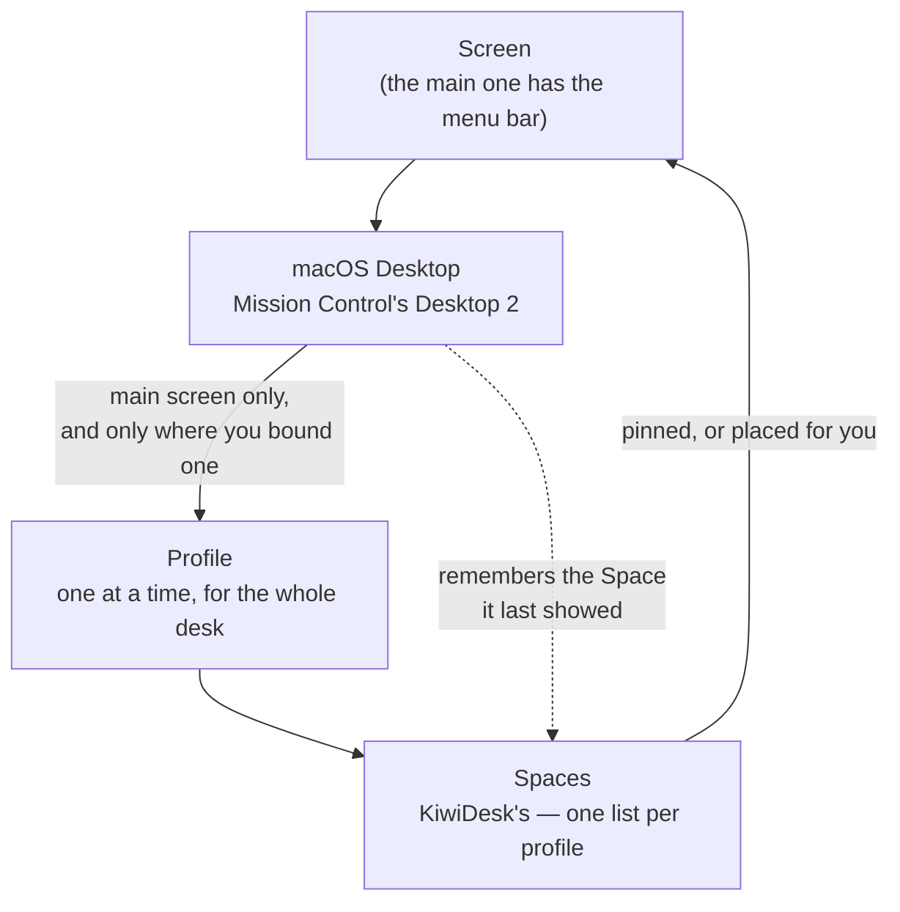

# Spaces & Desktops

Two systems are stacked here, and they use two different words.

- **Desktops** are **macOS's**. Mission Control labels them
  "Desktop 1", "Desktop 2", …; you swipe or press Ctrl+arrow
  between them, and macOS decides which windows live on which.
- **Spaces** are **KiwiDesk's**. A Space is a named group of
  windows with a layout of its own — `focus_space("mail")`, the
  Space Bar, the Spaces list in Settings.

Neither is built out of the other. macOS decides which windows
exist for you right now; KiwiDesk arranges the ones it can see
and keeps its own Spaces on top.

## The picture

Four facts: a profile owns Spaces, Spaces are placed on screens,
a Desktop can *choose* a profile, and a Desktop *remembers* a
Space.

## Spaces belong to a profile, and sit on screens

The Space list is part of the **profile**, with its layout
modes, gaps, borders and rules. Whenever a different profile
becomes live — loaded by you, or arriving on its own from a
Desktop binding or a monitor change — its Space list becomes the
authority: a Space it does not define is dropped, and the
windows it held move to the profile's fallback Space
(`set_fallback_space`). Re-applying the profile that is already
live changes nothing, so a monitor reconnect is harmless.

**Unplugging a screen holds its Spaces.** When unplugging a
screen makes a different profile live, each Space that was on
that screen and still has windows in it is carried onto a
remaining screen instead of being dropped. Where the new profile
has a Space of its name, it takes the next number past the
highest one in use, so a held `3` beside
your own `1`–`5` becomes `6`, and a held `Mail` beside your own
`Mail` becomes a number too. Where KiwiDesk manages your config,
it gets a digit shortcut if one of the ten is free. A held Space
moves to a new number again whenever a profile that loads uses
its current one.

:::unreleased
Held Spaces keep the order they had: a numbered Space after a
renumbered one is renumbered after it too, so the Space Bar and
the digit shortcuts list them in the order the screen had them.
:::

The Space Bar draws an asterisk badge on a held Space's
identifier, and VoiceOver reads the screen it came from, its old
name when it was renumbered, and that it is not saved: saving a
profile never includes a held Space.

Plug the screen back in and a held Space goes back to it with
everything in it, windows opened while it was held included, when
what comes back is the profile (or built-in Standard) it left and
that has a Space of the held one's original name. Otherwise it
moves back onto its screen and stays held.

A held Space goes away once no window is left in it; a window on
another Desktop, or hidden with its app, still counts. Loading a
profile yourself ends every hold, and the held windows move to
that profile's fallback Space like those of any Space it does not
define. A Desktop binding holds nothing, and held Spaces do not
survive quitting KiwiDesk.

Every Space sits on a screen. In Settings the **Monitors**
section is a picture of your desk: drag a Space chip onto the
display it belongs to, or leave it outlined and KiwiDesk places
it for you. From Lua the same pin is
`pin_space_to_display("mail", 2)`.

Each screen shows **one** of its Spaces at a time — with two
screens, two Spaces are on show at once. The Spaces no screen is
showing are parked (see [Parking is not a Desktop
move](#parking-is-not-a-desktop-move)).

## Every Desktop keeps its own Space, and its own windows

Every Desktop remembers which Space it was on. Switch away and
back and you land on the same Space, with the same windows in
the same order and the same one focused — as long as they come
back promptly ([accepted limitations](accepted-limitations.md)
has the case where they do not). Where KiwiDesk owns your config
and can give a Desktop an identity of its own, that memory is
written into `gui.json` and survives quitting KiwiDesk; a
hand-written `init.lua` setup keeps it for the session only.

**Your windows stay with their Desktop.** A Space holds whatever
of its windows are on the Desktop you are looking at. Switch
Desktop and the same Space shows you that Desktop's windows
instead — nothing is moved, and nothing is lost.

A Desktop you have never visited takes a Space no other Desktop
is **showing or remembers**; when every Space is spoken for it
takes the first.

With **Displays have separate Spaces** on, each screen switches
Desktops on its own, and each moves only its own Space — swiping
the external screen leaves the built-in one alone.

## A binding gives a Desktop a different set of Spaces

Bind a profile to a Desktop — the **Profiles per macOS Desktop**
card in Settings, or `bind_profile_to_desktop(2, "Creator
Studio")` in Lua — and activating that Desktop loads that
profile, with its Spaces, layouts and settings. A binding
changes *which Spaces exist at all*: two Desktops bound to
different profiles offer you different lists, while two bound to
the same profile offer the same list and still keep their own
windows in it.

**Desktops without a binding keep whatever profile is active.**

## The main screen chooses the profile

KiwiDesk runs **one** profile across the whole desk, so a
binding fires when its Desktop becomes current on your **main**
screen — the one with the menu bar. A swipe on a secondary
screen re-tiles the windows that arrived with it and moves that
screen onto its own Desktop's Space, but never selects a profile.
With a single screen, the main screen's Desktop is simply *the*
Desktop.

A Desktop you bound that is not on your main screen keeps its
row in the card, with a *not on main screen* badge; the binding
goes live again if a screen change makes that Desktop your main
screen's.

**A binding fires only for its profile's screen count.** A
Desktop holds a profile per screen count, so the same Desktop
can load a one-screen profile undocked and a two-screen one
docked: the profile saved for as many screens as are connected
fires, and the others wait until that many are. A Desktop bound
only to a one-screen profile stands aside on two, and KiwiDesk
picks by your screens ([Which Profile
Loads](user-guide.md#which-profile-loads)).

**A binding can also be for one screen setup.** Within a screen
count, a Desktop can hold a profile for each particular set of
screens you name, beside the one for all its other setups: with
exactly those screens connected, that set's profile loads; any
other setup of the count loads the one for all setups. Either
loads over a profile saved for exactly those screens.

## A binding follows its Desktop, not its number

Mission Control numbers Desktops by **position**: add a Desktop
before a bound one, delete one, drag them around in Mission
Control, plug a screen in or unplug it, and everything after the
change is renumbered.

A binding is not stored against that number. KiwiDesk writes a
small private identifier into each Desktop's own settings the
first time it sees it, and files the binding under **that**. A
Desktop keeps its profile when the numbers shift, the Desktop
that inherits its old number does not inherit its profile, and
the card's rows re-label themselves to the new numbers.

Deleting the Desktop deletes the identifier with it. That
binding shows a *not present* badge and does nothing until you
point it somewhere else — it is never fired for a different
Desktop.

**Unplugging a screen:** the first Desktop of the unplugged
screen merges into the one you are on and is gone, and the rest
move over to the remaining screen at new numbers. Their
identifiers travel with them, so their bindings keep working.
The merged one goes quiet; plugging the screen back in restores
it, identifier and all, and its binding comes back with it.

On a Mac where KiwiDesk cannot write the identifier, bindings
key by the Mission Control number — the behaviour above minus
the protection.

## "Displays have separate Spaces" decides the nesting

This macOS switch (System Settings ▸ Desktop & Dock) changes
which of *screen* and *Desktop* is the outer level, and KiwiDesk
follows it either way:

| The macOS setting | The shape | What it means here |
|---|---|---|
| **On** (macOS's default) | Screen → Desktop → Space | Each screen has its own Desktops and switches them on its own. Only your main screen's Desktops can be bound. |
| **Off** | Desktop → Screen → Space | One Desktop set spans every screen, so all screens switch together and every Desktop is bindable. |

## Parking is not a Desktop move

When a Space is not being shown on any screen, KiwiDesk **parks**
its windows: it slides them into a bottom corner of their own
screen, leaving a hair of each at the edge, and slides them back
when their Space is shown again.

**A parked window has not gone anywhere.** It is still on the
same macOS Desktop, still in the same KiwiDesk Space, still
listed in `get_state`. Parking is how a Space is hidden; it is
never how a window changes Desktop.

The only things that move a window between Desktops are macOS
itself and the two verbs that ask it to: `move_to_desktop(n[,
space])` and `move_to_desktop_and_follow(n[, space])`. A window
sent to another Desktop leaves KiwiDesk's view and rejoins its
Space when that Desktop is next shown — or the Space you named,
when you named one. It is reported gone with `reason: vanished`,
the same value a plain Desktop swipe produces.

KiwiDesk keeps knowing it is there, but does not draw it. The
Space Bar shows the Desktop you are looking at, so a window on
another Desktop leaves the bar, and *Hide empty Spaces* hides a
Space holding only such windows. *Open or Focus* still finds it:
it switches to that Desktop and gives the window the focus.

## Every profile keeps its own arrangement

Two profiles can each define a Space called `1` — or `Work` — and
they are different Spaces holding different windows; the profile
is the scope a Space name resolves in. Switching profiles never
merges them: KiwiDesk files which Space each window was in under
the profile you are leaving and puts them back when you return.

The full rules are in the [Lua reference](lua-reference.md)
▸ *Space Reconciliation*.
