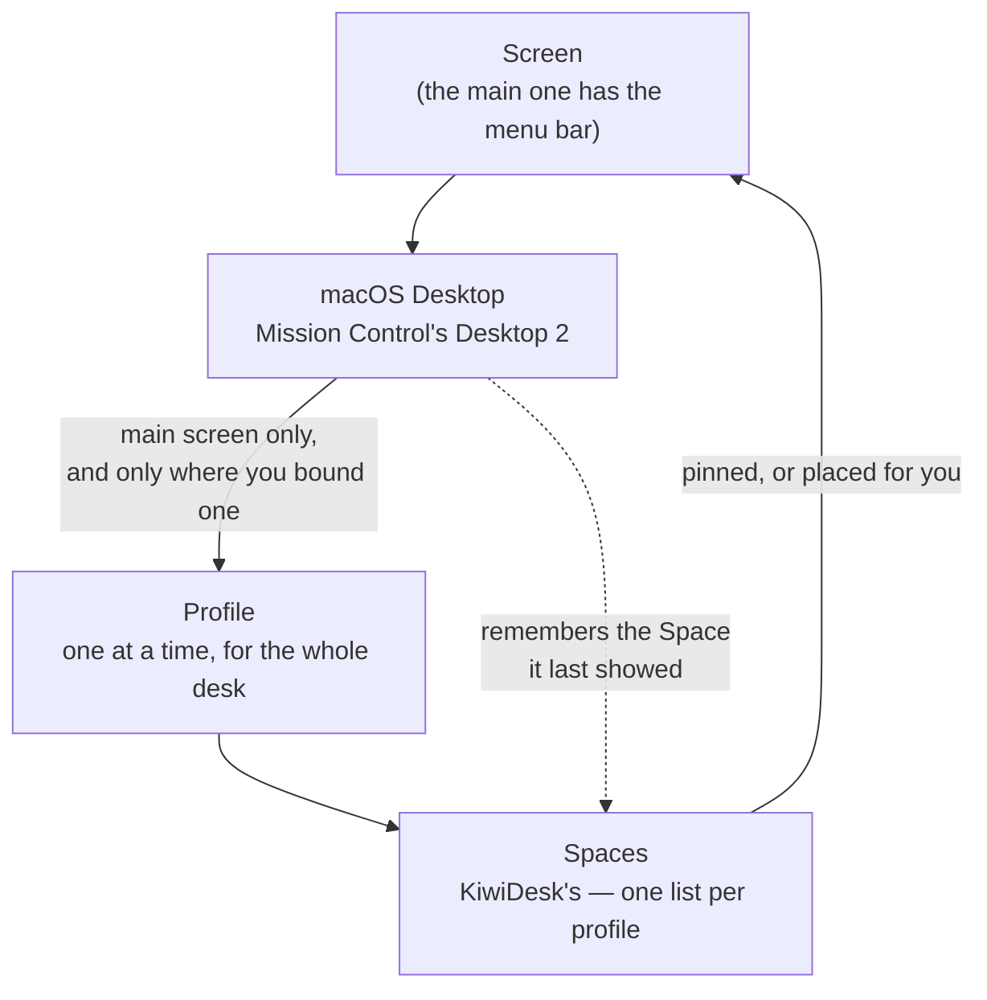

# Spaces & Desktops

Two systems are stacked here, and they use two different words.

- **Desktops** are **macOS's**. Mission Control labels them
  "Desktop 1", "Desktop 2", …; you swipe or press Ctrl+arrow
  between them, and macOS decides which windows live on which.
- **Spaces** are **KiwiDesk's**. A Space is a named group of
  windows with a layout of its own — `focus_space("mail")`, the
  Space Bar, the Spaces list in Settings.

Neither is built out of the other. macOS decides which windows
exist for you right now; KiwiDesk arranges the ones it can see
and keeps its own Spaces on top. Everything below follows from
that one split.

## The picture

Read it as four facts: a profile owns Spaces, Spaces are placed
on screens, a Desktop can *choose* a profile, and a Desktop
*remembers* a Space. The next four sections are those facts.

## Spaces belong to a profile, and sit on screens

The Space list is part of the **profile** — along with its
layout modes, gaps, borders and rules. Load a profile yourself
and its Space list becomes the authority: a Space it does not
define is dropped and the windows it held move to the profile's
fallback Space (`set_fallback_space`). A profile that arrives on
its own — from a Desktop binding or a monitor change — does the
same: any profile CHANGE makes the incoming Space list the
authority. Re-applying the profile that is already live changes
nothing, which is what keeps a monitor reconnect harmless.

Every Space sits on a screen. In Settings the **Monitors**
section is a picture of your desk: drag a Space chip onto the
display it belongs to, or leave it outlined and KiwiDesk places
it for you. From Lua the same pin is
`pin_space_to_display("mail", 2)`.

Each screen shows **one** of its Spaces at a time — with two
screens, two Spaces are on show at once. The Spaces no screen is
showing are parked (see [Parking is not a Desktop
move](#parking-is-not-a-desktop-move)).

## Every Desktop keeps its own Space, and its own windows

Every Desktop remembers which Space it was on. Switch away and
back and you land on the same Space, with the same windows in
the same order, and the same one focused — as long as they come
back promptly ([accepted limitations](accepted-limitations.md)
has the case where they do not). That memory is written into
`gui.json`, so it survives quitting KiwiDesk — where KiwiDesk
owns your config, and on a Mac where it can give a Desktop an
identity of its own, which is what makes one nameable across
restarts at all. A hand-written `init.lua` setup keeps the
memory for the session only.

**Your windows stay with their Desktop.** They belong to the
macOS Desktop they are on, so a Space holds whatever of its
windows are on the Desktop you are looking at. Switch Desktop and
the same Space shows you that Desktop's windows instead — nothing
is moved, and nothing is lost.

A Desktop you have never visited takes a Space no other Desktop
is **showing or remembers**, so a fresh Desktop starts on one of
its own rather than landing on a Space whose windows are all
somewhere else.
When every Space is spoken for it falls back to the first, since
a Desktop always has to show something.

With **Displays have separate Spaces** on, each screen switches
Desktops on its own, and each moves only its own Space — swiping
the external screen leaves the built-in one alone.

## A binding gives a Desktop a different set of Spaces

Bind a profile to a Desktop — the **Profiles per macOS Desktop**
card in Settings, or `bind_profile_to_desktop(2, "Creator
Studio")` in Lua — and activating that Desktop loads that
profile, with its Spaces, layouts and settings.

Every Desktop already keeps its own Space and its own windows
(the section above). What a binding changes is *which Spaces
exist at all* — their names, count, layouts and settings — so two
Desktops bound to different profiles offer you different lists,
while two bound to the same profile offer the same list and still
keep their own windows in it.

**Desktops without a binding keep whatever profile is active.**

## The main screen chooses the profile

KiwiDesk runs **one** profile across the whole desk, so exactly
one screen holds the trigger: a binding fires when its Desktop
becomes current on your **main** screen — the one with the menu
bar. A swipe on a secondary screen re-tiles the windows that
arrived with it and moves that screen onto its own Desktop's
Space, but never selects a profile
([#888](https://github.com/KiwiCanopy/KiwiDesk/issues/888)).

A Desktop you bound that is not on your main screen keeps its
row in the card, with a *not on main screen* badge: the binding
is kept, and it goes live again if a screen change makes that
Desktop your main screen's.

With a single screen there is no distinction to make — the main
screen's Desktop is simply *the* Desktop.

## A binding follows its Desktop, not its number

Mission Control numbers Desktops by **position**, so the numbers
move constantly: add a Desktop before a bound one, delete one,
drag them around in Mission Control, plug a screen in or unplug
it, and everything after the change is renumbered.

A binding is not stored against that number. KiwiDesk writes a
small private identifier into each Desktop's own settings the
first time it sees it, and the binding is filed under **that**.
So a Desktop keeps its profile when the numbers shift, and the
Desktop that inherits its old number does not inherit its
profile. The card's rows re-label themselves to the new numbers,
because the number is still how you and macOS name a Desktop —
it is just no longer how KiwiDesk finds one.

Deleting the Desktop deletes the identifier with it. That
binding then shows a *not present* badge and does nothing until
you point it somewhere else — it is never fired for a different
Desktop.

**Unplugging a screen is the interesting case**, because macOS
does something specific: the first Desktop of the unplugged
screen merges into the one you are on and is gone, and the rest
move over to the remaining screen at new numbers. Their
identifiers travel with them, so their bindings keep working.
The merged one goes quiet — and on plugging the screen back in,
macOS restores it, identifier and all, and its binding comes
back with it.

On a Mac where KiwiDesk cannot write the identifier, bindings
key by the Mission Control number, which is the behaviour
described above minus the protection.

## "Displays have separate Spaces" decides the nesting

This macOS switch (System Settings ▸ Desktop & Dock) changes
which of *screen* and *Desktop* is the outer level, and KiwiDesk
follows it either way:

| The macOS setting | The shape | What it means here |
|---|---|---|
| **On** (macOS's default) | Screen → Desktop → Space | Each screen has its own Desktops and switches them on its own. Only your main screen's Desktops can be bound. |
| **Off** | Desktop → Screen → Space | One Desktop set spans every screen, so all screens switch together and every Desktop is bindable. |

Turning it off costs real things — each screen's own menu bar,
the Dock summonable on any screen, and a fullscreen window that
does not blank the others — so KiwiDesk does not ask you to.
Both states are supported; the **?** on the bindings card says
the same thing in one paragraph.

## Parking is not a Desktop move

When a Space is not being shown on any screen, KiwiDesk **parks**
its windows: it slides them into a bottom corner of their own
screen, leaving a hair of each at the edge, and slides them back
when their Space is shown again.

**A parked window has not gone anywhere.** It is still on the
same macOS Desktop, still in the same KiwiDesk Space, still
listed in `get_state`. Parking is how a Space is hidden; it is
never how a window changes Desktop.

The only things that move a window between Desktops are macOS
itself and the two verbs that ask it to: `move_to_desktop(n[,
space])` and `move_to_desktop_and_follow(n[, space])`. A window
sent to another Desktop leaves KiwiDesk's view — macOS shows
another Desktop's windows to nobody — and rejoins its Space when
that Desktop is next shown, or the Space you named, when you
named one. It is reported gone with `reason: vanished`, the
same value a plain Desktop swipe produces.

KiwiDesk keeps knowing it is there, but does not draw it. The
Space Bar shows the Desktop you are looking at, so a window on
another Desktop leaves the bar — and *Hide empty Spaces* hides a
Space holding only those. It stays reachable all the same:
*Open or Focus* finds such a window, switches to its Desktop and
gives it the focus.

## Every profile keeps its own arrangement

Two profiles can each define a Space called `1` — or `Work` — and
they are different Spaces holding different windows. The name is
still how you address one; the profile is simply the scope that
name resolves in.

So switching profiles no longer merges them together. KiwiDesk
files which Space each window was in under the profile you are
leaving, and puts them back when you return. A window the
incoming profile has never seen stays where it is when that
profile declares the Space it is sitting in, and lands in the
profile's **fallback Space** when it does not.

The full rules are in the [Lua reference](lua-reference.md)
▸ *Space Reconciliation*.
