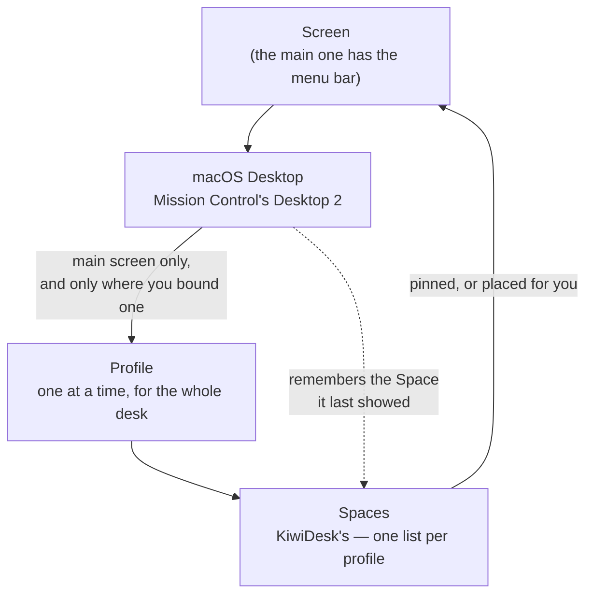

# Spaces & Desktops

Two systems are stacked here, and they use two different words.

- **Desktops** are **macOS's**. Mission Control labels them
  "Desktop 1", "Desktop 2", …; you swipe or press Ctrl+arrow
  between them, and macOS decides which windows live on which.
- **Spaces** are **KiwiDesk's**. A Space is a named group of
  windows with a layout of its own — `focus_space("mail")`, the
  Space Bar, the Spaces list in Settings.

Neither is built out of the other. macOS decides which windows
exist for you right now; KiwiDesk arranges the ones it can see
and keeps its own Spaces on top.

## The picture

```mermaid
flowchart TD
    S["Screen<br/>(the main one has the menu bar)"] --> D["macOS Desktop<br/>Mission Control's Desktop 2"]
    D -->|"main screen only,<br/>and only where you bound one"| P["Profile<br/>one at a time, for the whole desk"]
    P --> SP["Spaces<br/>KiwiDesk's — one list per profile"]
    SP -->|"pinned, or placed for you"| S
    D -.->|"remembers the Space<br/>it last showed"| SP
```

Four facts: a profile owns Spaces, Spaces are placed on screens,
a Desktop can *choose* a profile, and a Desktop *remembers* a
Space.

<figure>
<svg xmlns="http://www.w3.org/2000/svg" viewBox="0 0 700 106" role="img" aria-label="Key: a screen stands on a stand; a Desktop is a plate; a Space is a folder, filled when on show and outlined when waiting; a window is a plain rectangle, stronger when focused." font-family="-apple-system, system-ui, sans-serif"><text x="60.0" y="92.0" font-size="11" text-anchor="middle" fill="currentColor" fill-opacity="0.9">Screen</text><rect x="20.0" y="12.0" width="80.0" height="50.0" rx="2" fill="currentColor" fill-opacity="0" stroke="currentColor" stroke-opacity="1" stroke-width="2.2"/><line x1="60.0" y1="62.0" x2="60.0" y2="69.0" stroke="currentColor" stroke-opacity="1" stroke-width="2"/><line x1="50.4" y1="70.0" x2="69.6" y2="70.0" stroke="currentColor" stroke-opacity="1" stroke-width="2"/><text x="176.0" y="92.0" font-size="11" text-anchor="middle" fill="currentColor" fill-opacity="0.9">macOS Desktop</text><rect x="136.0" y="12.0" width="80.0" height="56.0" rx="8" fill="currentColor" fill-opacity="0.055" stroke="currentColor" stroke-opacity="0.22" stroke-width="1"/><text x="146.0" y="29.0" font-size="10.5" text-anchor="start" fill="currentColor" fill-opacity="1" font-weight="600">Desktop 1</text><text x="292.0" y="92.0" font-size="11" text-anchor="middle" fill="currentColor" fill-opacity="0.9">Space on show</text><path d="M252 65 V15 Q252 12 255 12 H295 Q298 12 298 15 V28 H329 Q332 28 332 31 V65 Q332 68 329 68 H255 Q252 68 252 65 Z" fill="currentColor" fill-opacity=".16" stroke="currentColor" stroke-width="1.5"/><text x="275.0" y="23.6" font-size="10" text-anchor="middle" fill="currentColor" fill-opacity="1" font-weight="600">Space</text><text x="408.0" y="92.0" font-size="11" text-anchor="middle" fill="currentColor" fill-opacity="0.9">Space waiting</text><path d="M368 65 V15 Q368 12 371 12 H411 Q414 12 414 15 V28 H445 Q448 28 448 31 V65 Q448 68 445 68 H371 Q368 68 368 65 Z" fill="none" stroke="currentColor" stroke-opacity=".45" stroke-width="1"/><text x="391.0" y="23.6" font-size="10" text-anchor="middle" fill="currentColor" fill-opacity="0.8">Space</text><text x="524.0" y="92.0" font-size="11" text-anchor="middle" fill="currentColor" fill-opacity="0.9">Window</text><rect x="494.0" y="24.0" width="60.0" height="36.0" rx="2" fill="currentColor" fill-opacity="0.1" stroke="currentColor" stroke-opacity="0.8" stroke-width="1.2"/><text x="640.0" y="92.0" font-size="11" text-anchor="middle" fill="currentColor" fill-opacity="0.9">Focused window</text><rect x="610.0" y="24.0" width="60.0" height="36.0" rx="2" fill="currentColor" fill-opacity="0.32" stroke="currentColor" stroke-opacity="0.8" stroke-width="1.2"/></svg>
</figure>

## Spaces belong to a profile, and sit on screens

The Space list is part of the **profile**, with its layout
modes, gaps, borders and rules. Whenever a different profile
becomes live — loaded by you, or arriving on its own from a
Desktop binding or a screen change — its Space list becomes the
authority. A Space's name is what makes it that Space: when both
profiles have a `1`, it stays on screen and takes the new
profile's settings. Re-applying the profile that is already
live changes nothing, so a screen reconnect is harmless.

**Switching holds the Spaces it does not name.** When a
different profile or a built-in Standard becomes live, each Space
it does not have, and that still has windows in it, is **held**
for the profile you left instead of being dropped — whether its
screen was unplugged or is still there. A window the new profile
has had before goes back to the Space it had it in, so a held
Space keeps only windows that profile has never seen, and one
left empty goes away.

**Unplugging a screen holds its Spaces.** When unplugging a
screen makes a different profile live, each Space that was on
that screen and still has windows in it is carried onto a
remaining screen instead of being dropped. Where the new profile
has a Space of its name, it takes the next number past the
highest one in use, so a held `3` beside
your own `1`–`5` becomes `6`, and a held `Mail` beside your own
`Mail` becomes a number too. A held Space moves to a new number
again whenever a profile that loads uses its current one.

Where KiwiDesk manages your config, a Space missing its go-to,
move or move-and-follow digit shortcut gets it for its own number —
a held `6` gets `⌃⌥6` — if that key is still free. Any other Space
takes the digit of its place among the first ten, unless a
numbered Space owns that digit. A Space never gets a second
digit shortcut for the same thing, and reordering your Spaces never
changes them.

Held Spaces keep the order they had: when a screen's Spaces are
held, a numbered Space after a renumbered one is renumbered after
it too, so the Space Bar and the digit shortcuts list them in the
order the screen had them. A later renumber keeps the Space Bar in
that order.

The Space Bar draws a two-screen marker after a held Space's
identifier, and VoiceOver reads the profile it was held from, the
screen it came from, its old name when it was renumbered, and that
it is not saved: saving a profile never includes a held Space. A
Space held from a built-in Standard names only its screen.

A Space you make on the fly — **New Space** on a Space's
right-click menu, `create_space`, or `focus_space` and
`move_to_space` naming a Space that does not exist — is
**temporary**. It wears an hourglass marker, lasts through a
restart, a reload and a Settings Save, and goes away when its
last window leaves it. No save writes it into the profile until
you choose **Add Space ‹n› to this profile** in Settings ▸
Spaces, or save the profile under a name with `save_profile`.
Switch to another profile while it holds windows and it is held
like any other Space, and comes back temporary; an empty one goes
away on the switch.

An empty temporary Space also goes away once you have switched to
it and then left it with nothing in it, so a Space shortcut that
made one by mistake leaves nothing behind. Temporary Spaces sit
in the Space Bar in number order.

Plug the screen back in and a held Space goes back to it with
everything in it, windows opened while it was held included, when
what comes back is the profile (or built-in Standard) it left and
that has a Space of the held one's original name. Otherwise it
moves back onto its screen and stays held.

A held Space goes away once no window is left in it; a window on
another Desktop, or hidden with its app, still counts. Loading a
profile does not end a hold, and neither does a Desktop binding:
it ends when the profile or Standard it left comes back and has
a Space of its original name, when it empties, or when you reset
every setting. `delete_space` moves its windows to the fallback
Space (`set_fallback_space`), which empties it.

Held Spaces come back when KiwiDesk quits and reopens, updates or
crashes — a window hidden, on another Desktop or still opening
included — and go home at once, as above, if their screen is back
by then. A restart of the Mac ends them, since a held Space names
its windows by ids a restart retires and no restore re-keys a
hold. A window of a hidden app goes home with its
held Space too, and comes back there when you show the app.

Every Space sits on a screen. In Settings the **Screens**
section is a picture of your desk: drag a Space chip onto the
screen it belongs to, or leave it outlined and KiwiDesk places
it for you. From Lua the same pin is
`pin_space_to_display("mail", 2)`.

Each screen shows **one** of its Spaces at a time — with two
screens, two Spaces are on show at once. The Spaces no screen is
showing are parked (see [Parking is not a Desktop
move](#parking-is-not-a-desktop-move)).

## Every Desktop keeps its own Space, and its own windows

Every Desktop remembers which Space it was on. Switch away and
back and you land on the same Space, with the same windows in
the same order and the same one focused — as long as they come
back promptly ([accepted limitations](accepted-limitations.md)
has the case where they do not). Where KiwiDesk owns your config
and can give a Desktop an identity of its own, that memory
survives quitting KiwiDesk; a hand-written `init.lua` setup keeps
it for the session only.

<figure>
<svg xmlns="http://www.w3.org/2000/svg" viewBox="0 0 700 458" role="img" aria-label="Three Desktops, one per row, each a plate. On each, three Spaces drawn as folders in the same order, holding only that Desktop&#x27;s windows. One folder per plate is filled: the Space that Desktop shows." font-family="-apple-system, system-ui, sans-serif"><text x="14.0" y="22.0" font-size="13" text-anchor="start" fill="currentColor" fill-opacity="1" font-weight="600">A window sits on one Desktop and in one Space.</text><rect x="14.0" y="36.0" width="672.0" height="106.0" rx="8" fill="currentColor" fill-opacity="0.055" stroke="currentColor" stroke-opacity="0.22" stroke-width="1"/><text x="24.0" y="53.0" font-size="12" text-anchor="start" fill="currentColor" fill-opacity="1" font-weight="600">Desktop 1</text><path d="M26 129 V65 Q26 62 29 62 H93 Q96 62 96 65 V82 H231 Q234 82 234 85 V129 Q234 132 231 132 H29 Q26 132 26 129 Z" fill="currentColor" fill-opacity=".16" stroke="currentColor" stroke-width="1.5"/><text x="61.0" y="76.0" font-size="11" text-anchor="middle" fill="currentColor" fill-opacity="1" font-weight="600">Space 1</text><rect x="31.0" y="87.0" width="97.0" height="40.0" rx="2" fill="currentColor" fill-opacity="0.32" stroke="currentColor" stroke-opacity="0.8" stroke-width="1.2"/><text x="79.5" y="111.0" font-size="11" text-anchor="middle" fill="currentColor" fill-opacity="1">Safari</text><rect x="132.0" y="87.0" width="97.0" height="40.0" rx="2" fill="currentColor" fill-opacity="0.1" stroke="currentColor" stroke-opacity="0.8" stroke-width="1.2"/><text x="180.5" y="111.0" font-size="11" text-anchor="middle" fill="currentColor" fill-opacity="1">Notes</text><path d="M246 129 V65 Q246 62 249 62 H313 Q316 62 316 65 V82 H451 Q454 82 454 85 V129 Q454 132 451 132 H249 Q246 132 246 129 Z" fill="none" stroke="currentColor" stroke-opacity=".45" stroke-width="1"/><text x="281.0" y="76.0" font-size="11" text-anchor="middle" fill="currentColor" fill-opacity="0.8">Space 2</text><rect x="251.0" y="87.0" width="198.0" height="40.0" rx="2" fill="currentColor" fill-opacity="0.1" stroke="currentColor" stroke-opacity="0.8" stroke-width="1.2"/><text x="350.0" y="111.0" font-size="11" text-anchor="middle" fill="currentColor" fill-opacity="1">Terminal</text><path d="M466 129 V65 Q466 62 469 62 H533 Q536 62 536 65 V82 H671 Q674 82 674 85 V129 Q674 132 671 132 H469 Q466 132 466 129 Z" fill="none" stroke="currentColor" stroke-opacity=".45" stroke-width="1"/><text x="501.0" y="76.0" font-size="11" text-anchor="middle" fill="currentColor" fill-opacity="0.8">mail</text><rect x="471.0" y="87.0" width="198.0" height="40.0" rx="2" fill="currentColor" fill-opacity="0.1" stroke="currentColor" stroke-opacity="0.8" stroke-width="1.2"/><text x="570.0" y="111.0" font-size="11" text-anchor="middle" fill="currentColor" fill-opacity="1">Calendar</text><rect x="14.0" y="170.0" width="672.0" height="106.0" rx="8" fill="currentColor" fill-opacity="0.055" stroke="currentColor" stroke-opacity="0.22" stroke-width="1"/><text x="24.0" y="187.0" font-size="12" text-anchor="start" fill="currentColor" fill-opacity="1" font-weight="600">Desktop 2</text><path d="M26 263 V199 Q26 196 29 196 H93 Q96 196 96 199 V216 H231 Q234 216 234 219 V263 Q234 266 231 266 H29 Q26 266 26 263 Z" fill="none" stroke="currentColor" stroke-opacity=".45" stroke-width="1"/><text x="61.0" y="210.0" font-size="11" text-anchor="middle" fill="currentColor" fill-opacity="0.8">Space 1</text><rect x="31.0" y="221.0" width="198.0" height="40.0" rx="2" fill="currentColor" fill-opacity="0.1" stroke="currentColor" stroke-opacity="0.8" stroke-width="1.2"/><text x="130.0" y="245.0" font-size="11" text-anchor="middle" fill="currentColor" fill-opacity="1">Xcode</text><path d="M246 263 V199 Q246 196 249 196 H313 Q316 196 316 199 V216 H451 Q454 216 454 219 V263 Q454 266 451 266 H249 Q246 266 246 263 Z" fill="currentColor" fill-opacity=".16" stroke="currentColor" stroke-width="1.5"/><text x="281.0" y="210.0" font-size="11" text-anchor="middle" fill="currentColor" fill-opacity="1" font-weight="600">Space 2</text><rect x="251.0" y="221.0" width="97.0" height="40.0" rx="2" fill="currentColor" fill-opacity="0.32" stroke="currentColor" stroke-opacity="0.8" stroke-width="1.2"/><text x="299.5" y="245.0" font-size="11" text-anchor="middle" fill="currentColor" fill-opacity="1">Figma</text><rect x="352.0" y="221.0" width="97.0" height="40.0" rx="2" fill="currentColor" fill-opacity="0.1" stroke="currentColor" stroke-opacity="0.8" stroke-width="1.2"/><text x="400.5" y="245.0" font-size="11" text-anchor="middle" fill="currentColor" fill-opacity="1">Slack</text><path d="M466 263 V199 Q466 196 469 196 H533 Q536 196 536 199 V216 H671 Q674 216 674 219 V263 Q674 266 671 266 H469 Q466 266 466 263 Z" fill="none" stroke="currentColor" stroke-opacity=".45" stroke-width="1"/><text x="501.0" y="210.0" font-size="11" text-anchor="middle" fill="currentColor" fill-opacity="0.8">mail</text><text x="570.0" y="245.0" font-size="11" text-anchor="middle" fill="currentColor" fill-opacity="0.85">no windows here</text><rect x="14.0" y="304.0" width="672.0" height="106.0" rx="8" fill="currentColor" fill-opacity="0.055" stroke="currentColor" stroke-opacity="0.22" stroke-width="1"/><text x="24.0" y="321.0" font-size="12" text-anchor="start" fill="currentColor" fill-opacity="1" font-weight="600">Desktop 3</text><path d="M26 397 V333 Q26 330 29 330 H93 Q96 330 96 333 V350 H231 Q234 350 234 353 V397 Q234 400 231 400 H29 Q26 400 26 397 Z" fill="none" stroke="currentColor" stroke-opacity=".45" stroke-width="1"/><text x="61.0" y="344.0" font-size="11" text-anchor="middle" fill="currentColor" fill-opacity="0.8">Space 1</text><text x="130.0" y="379.0" font-size="11" text-anchor="middle" fill="currentColor" fill-opacity="0.85">no windows here</text><path d="M246 397 V333 Q246 330 249 330 H313 Q316 330 316 333 V350 H451 Q454 350 454 353 V397 Q454 400 451 400 H249 Q246 400 246 397 Z" fill="none" stroke="currentColor" stroke-opacity=".45" stroke-width="1"/><text x="281.0" y="344.0" font-size="11" text-anchor="middle" fill="currentColor" fill-opacity="0.8">Space 2</text><rect x="251.0" y="355.0" width="198.0" height="40.0" rx="2" fill="currentColor" fill-opacity="0.1" stroke="currentColor" stroke-opacity="0.8" stroke-width="1.2"/><text x="350.0" y="379.0" font-size="11" text-anchor="middle" fill="currentColor" fill-opacity="1">Music</text><path d="M466 397 V333 Q466 330 469 330 H533 Q536 330 536 333 V350 H671 Q674 350 674 353 V397 Q674 400 671 400 H469 Q466 400 466 397 Z" fill="currentColor" fill-opacity=".16" stroke="currentColor" stroke-width="1.5"/><text x="501.0" y="344.0" font-size="11" text-anchor="middle" fill="currentColor" fill-opacity="1" font-weight="600">mail</text><rect x="471.0" y="355.0" width="198.0" height="40.0" rx="2" fill="currentColor" fill-opacity="0.32" stroke="currentColor" stroke-opacity="0.8" stroke-width="1.2"/><text x="570.0" y="379.0" font-size="11" text-anchor="middle" fill="currentColor" fill-opacity="1">Mail</text><text x="14.0" y="430.0" font-size="11" text-anchor="start" fill="currentColor" fill-opacity="0.85">A filled folder is the Space that Desktop shows, and comes back to. Swipe sideways to switch Desktop:</text><text x="14.0" y="445.0" font-size="11" text-anchor="start" fill="currentColor" fill-opacity="0.85">you land on the Space it remembers. Nothing moves between Desktops. A Space simply holds other windows there.</text></svg>
</figure>

That memory is kept on this Mac alone, in
`~/Library/Application Support/KiwiDesk/machine.json`.

**Your windows stay with their Desktop.** A Space holds whatever
of its windows are on the Desktop you are looking at. Switch
Desktop and the same Space shows you that Desktop's windows
instead — nothing is moved, and nothing is lost.

A Desktop you have never visited takes a Space no other Desktop
is **showing or remembers**; when every Space is spoken for it
takes the first.

With **Displays have separate Spaces** on, each screen switches
Desktops on its own, and each moves only its own Space — swiping
the external screen leaves the built-in one alone.

## A binding gives a Desktop a different set of Spaces

Bind a profile to a Desktop — the **Profiles per macOS Desktop**
card in Settings, or `bind_profile_to_desktop(2, "Creator
Studio")` in Lua — and activating that Desktop loads that
profile, with its Spaces, layouts and settings. A binding
changes *which Spaces exist at all*: two Desktops bound to
different profiles offer you different lists, while two bound to
the same profile offer the same list and still keep their own
windows in it.

**Desktops without a binding keep whatever profile is active.**

## The main screen chooses the profile

KiwiDesk runs **one** profile across the whole desk, so a
binding fires when its Desktop becomes current on your **main**
screen — the one with the menu bar. A swipe on a secondary
screen re-tiles the windows that arrived with it and moves that
screen onto its own Desktop's Space, but never selects a profile.
With a single screen, the main screen's Desktop is simply *the*
Desktop.

A Desktop you bound that is not on your main screen keeps its
row in the card, with a *not on main screen* badge; the binding
goes live again if a screen change makes that Desktop your main
screen's.

**A binding fires only for its profile's screen count.** A
Desktop holds a profile per screen count, so the same Desktop
can load a one-screen profile undocked and a two-screen one
docked: the profile saved for as many screens as are connected
fires, and the others wait until that many are. A Desktop bound
only to a one-screen profile stands aside on two, and KiwiDesk
picks by your screens ([Which Profile
Loads](user-guide.md#which-profile-loads)).

**A binding can also be for one screen setup.** Within a screen
count, a Desktop can hold a profile for each particular set of
screens you name, beside the one for all its other setups: with
exactly those screens connected, that set's profile loads; any
other setup of the count loads the one for all setups. Either
loads over a profile saved for exactly those screens.

## A Desktop has two numbers

With "Displays have separate Spaces" on and more than one screen,
Mission Control numbers each screen's Desktops from 1. KiwiDesk
uses two counts:

- **What KiwiDesk shows** counts per screen, as Mission Control
  does: KiwiHub's window switcher, the Desktop switch plate and
  the Desktop rows in Settings. A KiwiHub row for a window on
  another screen names that screen too — `Work · DELL U2723 ·
  Desktop 1`.
- **What a command or binding takes** counts across every screen,
  the screen Mission Control lists first counted first:
  [`focus_desktop`](lua-reference.md#focus_desktop),
  `move_to_desktop`, `bind_profile_to_desktop`, and the
  **Go to Desktop N** shortcuts, as macOS's own "Switch to
  Desktop N" does.

On one screen, and on the screen Mission Control lists first,
the two agree. A Settings row for a Desktop that is not present
keeps the number it was last seen at, counted across every
screen. On another screen they differ: the second screen's
first Desktop may be **Go to Desktop 7**, and Settings ▸
Shortcuts and KiwiHub's Shortcuts side show which screen and
Desktop each such row reaches right now.

<figure>
<svg xmlns="http://www.w3.org/2000/svg" viewBox="0 0 700 290" role="img" aria-label="A main screen with five Desktops, numbered 1 to 5 by Mission Control and by KiwiDesk shortcuts. After a new screen connects, the last one moves there: Mission Control calls it Desktop 1, KiwiDesk shortcuts Desktop 5." font-family="-apple-system, system-ui, sans-serif"><text x="14.0" y="18.0" font-size="11" text-anchor="start" fill="currentColor" fill-opacity="1" font-weight="600">Before</text><rect x="14.0" y="26.0" width="456.0" height="102.0" rx="2" fill="currentColor" fill-opacity="0" stroke="currentColor" stroke-opacity="1" stroke-width="2.2"/><line x1="242.0" y1="128.0" x2="242.0" y2="135.0" stroke="currentColor" stroke-opacity="1" stroke-width="2"/><line x1="187.3" y1="136.0" x2="296.7" y2="136.0" stroke="currentColor" stroke-opacity="1" stroke-width="2"/><text x="22.0" y="43.0" font-size="12" text-anchor="start" fill="currentColor" fill-opacity="1" font-weight="600">Main screen</text><rect x="20.0" y="50.0" width="84.0" height="72.0" rx="8" fill="currentColor" fill-opacity="0.055" stroke="currentColor" stroke-opacity="0.22" stroke-width="1"/><text x="28.0" y="64.0" font-size="9.5" text-anchor="start" fill="currentColor" fill-opacity="0.8">Mission Control</text><text x="28.0" y="78.0" font-size="11" text-anchor="start" fill="currentColor" fill-opacity="1" font-weight="600">Desktop 1</text><text x="28.0" y="96.0" font-size="9.5" text-anchor="start" fill="currentColor" fill-opacity="0.8">KiwiDesk</text><text x="28.0" y="110.0" font-size="11" text-anchor="start" fill="currentColor" fill-opacity="1" font-weight="600">Desktop 1</text><rect x="110.0" y="50.0" width="84.0" height="72.0" rx="8" fill="currentColor" fill-opacity="0.055" stroke="currentColor" stroke-opacity="0.22" stroke-width="1"/><text x="118.0" y="64.0" font-size="9.5" text-anchor="start" fill="currentColor" fill-opacity="0.8">Mission Control</text><text x="118.0" y="78.0" font-size="11" text-anchor="start" fill="currentColor" fill-opacity="1" font-weight="600">Desktop 2</text><text x="118.0" y="96.0" font-size="9.5" text-anchor="start" fill="currentColor" fill-opacity="0.8">KiwiDesk</text><text x="118.0" y="110.0" font-size="11" text-anchor="start" fill="currentColor" fill-opacity="1" font-weight="600">Desktop 2</text><rect x="200.0" y="50.0" width="84.0" height="72.0" rx="8" fill="currentColor" fill-opacity="0.055" stroke="currentColor" stroke-opacity="0.22" stroke-width="1"/><text x="208.0" y="64.0" font-size="9.5" text-anchor="start" fill="currentColor" fill-opacity="0.8">Mission Control</text><text x="208.0" y="78.0" font-size="11" text-anchor="start" fill="currentColor" fill-opacity="1" font-weight="600">Desktop 3</text><text x="208.0" y="96.0" font-size="9.5" text-anchor="start" fill="currentColor" fill-opacity="0.8">KiwiDesk</text><text x="208.0" y="110.0" font-size="11" text-anchor="start" fill="currentColor" fill-opacity="1" font-weight="600">Desktop 3</text><rect x="290.0" y="50.0" width="84.0" height="72.0" rx="8" fill="currentColor" fill-opacity="0.055" stroke="currentColor" stroke-opacity="0.22" stroke-width="1"/><text x="298.0" y="64.0" font-size="9.5" text-anchor="start" fill="currentColor" fill-opacity="0.8">Mission Control</text><text x="298.0" y="78.0" font-size="11" text-anchor="start" fill="currentColor" fill-opacity="1" font-weight="600">Desktop 4</text><text x="298.0" y="96.0" font-size="9.5" text-anchor="start" fill="currentColor" fill-opacity="0.8">KiwiDesk</text><text x="298.0" y="110.0" font-size="11" text-anchor="start" fill="currentColor" fill-opacity="1" font-weight="600">Desktop 4</text><rect x="380.0" y="50.0" width="84.0" height="72.0" rx="8" fill="currentColor" fill-opacity="0.055" stroke="currentColor" stroke-opacity="0.22" stroke-width="1"/><text x="388.0" y="64.0" font-size="9.5" text-anchor="start" fill="currentColor" fill-opacity="0.8">Mission Control</text><text x="388.0" y="78.0" font-size="11" text-anchor="start" fill="currentColor" fill-opacity="1" font-weight="600">Desktop 5</text><text x="388.0" y="96.0" font-size="9.5" text-anchor="start" fill="currentColor" fill-opacity="0.8">KiwiDesk</text><text x="388.0" y="110.0" font-size="11" text-anchor="start" fill="currentColor" fill-opacity="1" font-weight="600">Desktop 5</text><text x="14.0" y="164.0" font-size="11" text-anchor="start" fill="currentColor" fill-opacity="1" font-weight="600">After a new screen connects</text><rect x="14.0" y="172.0" width="366.0" height="102.0" rx="2" fill="currentColor" fill-opacity="0" stroke="currentColor" stroke-opacity="1" stroke-width="2.2"/><line x1="197.0" y1="274.0" x2="197.0" y2="281.0" stroke="currentColor" stroke-opacity="1" stroke-width="2"/><line x1="153.1" y1="282.0" x2="240.9" y2="282.0" stroke="currentColor" stroke-opacity="1" stroke-width="2"/><text x="22.0" y="189.0" font-size="12" text-anchor="start" fill="currentColor" fill-opacity="1" font-weight="600">Main screen</text><rect x="20.0" y="196.0" width="84.0" height="72.0" rx="8" fill="currentColor" fill-opacity="0.055" stroke="currentColor" stroke-opacity="0.22" stroke-width="1"/><text x="28.0" y="210.0" font-size="9.5" text-anchor="start" fill="currentColor" fill-opacity="0.8">Mission Control</text><text x="28.0" y="224.0" font-size="11" text-anchor="start" fill="currentColor" fill-opacity="1" font-weight="600">Desktop 1</text><text x="28.0" y="242.0" font-size="9.5" text-anchor="start" fill="currentColor" fill-opacity="0.8">KiwiDesk</text><text x="28.0" y="256.0" font-size="11" text-anchor="start" fill="currentColor" fill-opacity="1" font-weight="600">Desktop 1</text><rect x="110.0" y="196.0" width="84.0" height="72.0" rx="8" fill="currentColor" fill-opacity="0.055" stroke="currentColor" stroke-opacity="0.22" stroke-width="1"/><text x="118.0" y="210.0" font-size="9.5" text-anchor="start" fill="currentColor" fill-opacity="0.8">Mission Control</text><text x="118.0" y="224.0" font-size="11" text-anchor="start" fill="currentColor" fill-opacity="1" font-weight="600">Desktop 2</text><text x="118.0" y="242.0" font-size="9.5" text-anchor="start" fill="currentColor" fill-opacity="0.8">KiwiDesk</text><text x="118.0" y="256.0" font-size="11" text-anchor="start" fill="currentColor" fill-opacity="1" font-weight="600">Desktop 2</text><rect x="200.0" y="196.0" width="84.0" height="72.0" rx="8" fill="currentColor" fill-opacity="0.055" stroke="currentColor" stroke-opacity="0.22" stroke-width="1"/><text x="208.0" y="210.0" font-size="9.5" text-anchor="start" fill="currentColor" fill-opacity="0.8">Mission Control</text><text x="208.0" y="224.0" font-size="11" text-anchor="start" fill="currentColor" fill-opacity="1" font-weight="600">Desktop 3</text><text x="208.0" y="242.0" font-size="9.5" text-anchor="start" fill="currentColor" fill-opacity="0.8">KiwiDesk</text><text x="208.0" y="256.0" font-size="11" text-anchor="start" fill="currentColor" fill-opacity="1" font-weight="600">Desktop 3</text><rect x="290.0" y="196.0" width="84.0" height="72.0" rx="8" fill="currentColor" fill-opacity="0.055" stroke="currentColor" stroke-opacity="0.22" stroke-width="1"/><text x="298.0" y="210.0" font-size="9.5" text-anchor="start" fill="currentColor" fill-opacity="0.8">Mission Control</text><text x="298.0" y="224.0" font-size="11" text-anchor="start" fill="currentColor" fill-opacity="1" font-weight="600">Desktop 4</text><text x="298.0" y="242.0" font-size="9.5" text-anchor="start" fill="currentColor" fill-opacity="0.8">KiwiDesk</text><text x="298.0" y="256.0" font-size="11" text-anchor="start" fill="currentColor" fill-opacity="1" font-weight="600">Desktop 4</text><rect x="398.0" y="172.0" width="96.0" height="102.0" rx="2" fill="currentColor" fill-opacity="0" stroke="currentColor" stroke-opacity="1" stroke-width="2.2"/><line x1="446.0" y1="274.0" x2="446.0" y2="281.0" stroke="currentColor" stroke-opacity="1" stroke-width="2"/><line x1="434.5" y1="282.0" x2="457.5" y2="282.0" stroke="currentColor" stroke-opacity="1" stroke-width="2"/><text x="406.0" y="189.0" font-size="12" text-anchor="start" fill="currentColor" fill-opacity="1" font-weight="600">New screen</text><rect x="404.0" y="196.0" width="84.0" height="72.0" rx="8" fill="currentColor" fill-opacity="0.055" stroke="currentColor" stroke-opacity="0.22" stroke-width="1"/><text x="412.0" y="210.0" font-size="9.5" text-anchor="start" fill="currentColor" fill-opacity="0.8">Mission Control</text><text x="412.0" y="224.0" font-size="11" text-anchor="start" fill="currentColor" fill-opacity="1" font-weight="600">Desktop 1</text><text x="412.0" y="242.0" font-size="9.5" text-anchor="start" fill="currentColor" fill-opacity="0.8">KiwiDesk</text><text x="412.0" y="256.0" font-size="11" text-anchor="start" fill="currentColor" fill-opacity="1" font-weight="600">Desktop 5</text><line x1="446.0" y1="132.0" x2="446.0" y2="164.0" stroke="currentColor" stroke-opacity="0.8" stroke-width="1.2"/><polygon points="446,170 443.4,164.6 448.6,164.6" fill="currentColor" fill-opacity=".8"/><text x="504.0" y="40.0" font-size="11.5" text-anchor="start" fill="currentColor" fill-opacity="1" font-weight="600">Mission Control counts per</text><text x="504.0" y="55.0" font-size="11.5" text-anchor="start" fill="currentColor" fill-opacity="1" font-weight="600">screen. KiwiDesk shortcuts, Lua</text><text x="504.0" y="70.0" font-size="11.5" text-anchor="start" fill="currentColor" fill-opacity="1" font-weight="600">and CLI count across screens.</text><text x="504.0" y="94.0" font-size="11" text-anchor="start" fill="currentColor" fill-opacity="0.85">KiwiDesk labels count per screen.</text></svg>
</figure>

## A binding follows its Desktop, not its number

Desktops are numbered by **position**: add a Desktop
before a bound one, delete one, drag them around in Mission
Control, plug a screen in or unplug it, and everything after the
change is renumbered.

A binding is not stored against that number. KiwiDesk writes a
small private identifier into each Desktop's own settings the
first time it sees it, and files the binding under **that**. A
Desktop keeps its profile when the numbers shift, the Desktop
that inherits its old number does not inherit its profile, and
the card's rows re-label themselves to the new numbers.

Deleting the Desktop deletes the identifier with it. That
binding shows a *not present* badge and does nothing until you
point it somewhere else — it is never fired for a different
Desktop.

**Unplugging a screen:** the first Desktop of the unplugged
screen merges into the one you are on and is gone, and the rest
move over to the remaining screen at new numbers. Their
identifiers travel with them, so their bindings keep working.
The merged one goes quiet; plugging the screen back in restores
it, identifier and all, and its binding comes back with it.

On a Mac where KiwiDesk cannot write the identifier, bindings
key by the Desktop's number — the behaviour above minus
the protection.

A binding follows its **profile** the same way: it names the
profile by an identifier the profile file keeps, so renaming the
profile — on this Mac or on another one syncing your config
folder — keeps the binding. Delete the profile and the binding
moves under *Missing profiles* in the card; a new profile under
the old name does not take it over. A binding written in
`init.lua` names its profile on every load and follows the name.

## "Displays have separate Spaces" decides the nesting

This macOS switch (System Settings ▸ Desktop & Dock) changes
which of *screen* and *Desktop* is the outer level, and KiwiDesk
follows it either way:

| The macOS setting | The shape | What it means here |
|---|---|---|
| **On** (macOS's default) | Screen → Desktop → Space | Each screen has its own Desktops and switches them on its own. Only your main screen's Desktops can be bound. |
| **Off** | Desktop → Screen → Space | One Desktop set spans every screen, so all screens switch together and every Desktop is bindable. |

<figure>
<svg xmlns="http://www.w3.org/2000/svg" viewBox="0 0 810 594" role="img" aria-label="Displays have separate Spaces, on and off. With it on, Desktop 1 on the main screen and Desktop 1 on the second screen are different macOS Desktops. Below, a new screen connects and the last Desktop becomes Desktop 1 of the new screen." font-family="-apple-system, system-ui, sans-serif"><text x="14.0" y="22.0" font-size="13" text-anchor="start" fill="currentColor" fill-opacity="1" font-weight="600">&quot;Displays have separate Spaces&quot; ON</text><text x="14.0" y="38.0" font-size="11" text-anchor="start" fill="currentColor" fill-opacity="0.8">Screen → Desktop → Space</text><rect x="14.0" y="50.0" width="164.0" height="244.0" rx="2" fill="currentColor" fill-opacity="0" stroke="currentColor" stroke-opacity="1" stroke-width="2.2"/><line x1="96.0" y1="294.0" x2="96.0" y2="301.0" stroke="currentColor" stroke-opacity="1" stroke-width="2"/><line x1="76.3" y1="302.0" x2="115.7" y2="302.0" stroke="currentColor" stroke-opacity="1" stroke-width="2"/><text x="22.0" y="67.0" font-size="12" text-anchor="start" fill="currentColor" fill-opacity="1" font-weight="600">Main screen</text><text x="170.0" y="67.0" font-size="9.5" text-anchor="end" fill="currentColor" fill-opacity="0.75">menu bar</text><rect x="20.0" y="74.0" width="152.0" height="104.0" rx="8" fill="currentColor" fill-opacity="0.055" stroke="currentColor" stroke-opacity="0.22" stroke-width="1"/><text x="28.0" y="90.0" font-size="11" text-anchor="start" fill="currentColor" fill-opacity="1" font-weight="600">Desktop 1</text><text x="28.0" y="104.0" font-size="9.5" text-anchor="start" fill="currentColor" fill-opacity="0.85">Go to Desktop 1</text><path d="M28 167 V117 Q28 114 31 114 H71 Q74 114 74 117 V130 H105 Q108 130 108 133 V167 Q108 170 105 170 H31 Q28 170 28 167 Z" fill="currentColor" fill-opacity=".16" stroke="currentColor" stroke-width="1.5"/><text x="51.0" y="125.4" font-size="9.5" text-anchor="middle" fill="currentColor" fill-opacity="1" font-weight="600">Space 1</text><text x="68.0" y="153.4" font-size="9.5" text-anchor="middle" fill="currentColor" fill-opacity="0.85">on show</text><text x="114.0" y="145.0" font-size="9.5" text-anchor="start" fill="currentColor" fill-opacity="0.8">bindable</text><rect x="20.0" y="184.0" width="152.0" height="104.0" rx="8" fill="currentColor" fill-opacity="0.055" stroke="currentColor" stroke-opacity="0.22" stroke-width="1"/><text x="28.0" y="200.0" font-size="11" text-anchor="start" fill="currentColor" fill-opacity="1" font-weight="600">Desktop 2</text><text x="28.0" y="214.0" font-size="9.5" text-anchor="start" fill="currentColor" fill-opacity="0.85">Go to Desktop 2</text><path d="M28 277 V227 Q28 224 31 224 H71 Q74 224 74 227 V240 H105 Q108 240 108 243 V277 Q108 280 105 280 H31 Q28 280 28 277 Z" fill="currentColor" fill-opacity=".16" stroke="currentColor" stroke-width="1.5"/><text x="51.0" y="235.4" font-size="9.5" text-anchor="middle" fill="currentColor" fill-opacity="1" font-weight="600">Space 2</text><text x="68.0" y="263.4" font-size="9.5" text-anchor="middle" fill="currentColor" fill-opacity="0.85">on show</text><text x="114.0" y="255.0" font-size="9.5" text-anchor="start" fill="currentColor" fill-opacity="0.8">bindable</text><rect x="254.0" y="50.0" width="164.0" height="244.0" rx="2" fill="currentColor" fill-opacity="0" stroke="currentColor" stroke-opacity="1" stroke-width="2.2"/><line x1="336.0" y1="294.0" x2="336.0" y2="301.0" stroke="currentColor" stroke-opacity="1" stroke-width="2"/><line x1="316.3" y1="302.0" x2="355.7" y2="302.0" stroke="currentColor" stroke-opacity="1" stroke-width="2"/><text x="262.0" y="67.0" font-size="12" text-anchor="start" fill="currentColor" fill-opacity="1" font-weight="600">Second screen</text><rect x="260.0" y="74.0" width="152.0" height="104.0" rx="8" fill="currentColor" fill-opacity="0.055" stroke="currentColor" stroke-opacity="0.22" stroke-width="1"/><text x="268.0" y="90.0" font-size="11" text-anchor="start" fill="currentColor" fill-opacity="1" font-weight="600">Desktop 1</text><text x="268.0" y="104.0" font-size="9.5" text-anchor="start" fill="currentColor" fill-opacity="0.85">Go to Desktop 3</text><path d="M268 167 V117 Q268 114 271 114 H311 Q314 114 314 117 V130 H345 Q348 130 348 133 V167 Q348 170 345 170 H271 Q268 170 268 167 Z" fill="currentColor" fill-opacity=".16" stroke="currentColor" stroke-width="1.5"/><text x="291.0" y="125.4" font-size="9.5" text-anchor="middle" fill="currentColor" fill-opacity="1" font-weight="600">mail</text><text x="308.0" y="153.4" font-size="9.5" text-anchor="middle" fill="currentColor" fill-opacity="0.85">on show</text><text x="354.0" y="145.0" font-size="9.5" text-anchor="start" fill="currentColor" fill-opacity="0.8">not bindable</text><rect x="260.0" y="184.0" width="152.0" height="104.0" rx="8" fill="currentColor" fill-opacity="0.055" stroke="currentColor" stroke-opacity="0.22" stroke-width="1"/><text x="268.0" y="200.0" font-size="11" text-anchor="start" fill="currentColor" fill-opacity="1" font-weight="600">Desktop 2</text><text x="268.0" y="214.0" font-size="9.5" text-anchor="start" fill="currentColor" fill-opacity="0.85">Go to Desktop 4</text><path d="M268 277 V227 Q268 224 271 224 H311 Q314 224 314 227 V240 H345 Q348 240 348 243 V277 Q348 280 345 280 H271 Q268 280 268 277 Z" fill="currentColor" fill-opacity=".16" stroke="currentColor" stroke-width="1.5"/><text x="291.0" y="235.4" font-size="9.5" text-anchor="middle" fill="currentColor" fill-opacity="1" font-weight="600">Space 3</text><text x="308.0" y="263.4" font-size="9.5" text-anchor="middle" fill="currentColor" fill-opacity="0.85">on show</text><text x="354.0" y="255.0" font-size="9.5" text-anchor="start" fill="currentColor" fill-opacity="0.8">not bindable</text><line x1="84.0" y1="86.0" x2="262.0" y2="86.0" stroke="currentColor" stroke-opacity="0.9" stroke-width="1.4"/><line x1="84.0" y1="196.0" x2="262.0" y2="196.0" stroke="currentColor" stroke-opacity="0.9" stroke-width="1.4"/><text x="216" y="100" font-size="10.5" text-anchor="middle" fill="currentColor" fill-opacity="1">even though</text><text x="216" y="113" font-size="10.5" text-anchor="middle" fill="currentColor" fill-opacity="1">same name</text><text x="216" y="210" font-size="10.5" text-anchor="middle" fill="currentColor" fill-opacity="1" font-weight="600">different</text><text x="216" y="223" font-size="10.5" text-anchor="middle" fill="currentColor" fill-opacity="1" font-weight="600">macOS</text><text x="216" y="236" font-size="10.5" text-anchor="middle" fill="currentColor" fill-opacity="1" font-weight="600">Desktops</text><text x="14.0" y="322.0" font-size="10.5" text-anchor="start" fill="currentColor" fill-opacity="1" font-weight="600">Same name, different macOS Desktops.</text><text x="14.0" y="337.0" font-size="10.5" text-anchor="start" fill="currentColor" fill-opacity="0.8">Each screen numbers its own from 1 and switches alone.</text><text x="14.0" y="351.0" font-size="10.5" text-anchor="start" fill="currentColor" fill-opacity="0.8">Shortcuts, Lua and CLI count across screens (main screen first here).</text><line x1="440.0" y1="10.0" x2="440.0" y2="358.0" stroke="currentColor" stroke-opacity="0.3" stroke-width="1.2" stroke-dasharray="4 3"/><text x="450.0" y="22.0" font-size="13" text-anchor="start" fill="currentColor" fill-opacity="1" font-weight="600">&quot;Displays have separate Spaces&quot; OFF</text><text x="450.0" y="38.0" font-size="11" text-anchor="start" fill="currentColor" fill-opacity="0.8">Desktop → Screen → Space</text><rect x="450.0" y="50.0" width="346.0" height="124.0" rx="8" fill="currentColor" fill-opacity="0.055" stroke="currentColor" stroke-opacity="0.22" stroke-width="1"/><text x="458.0" y="66.0" font-size="11" text-anchor="start" fill="currentColor" fill-opacity="1" font-weight="600">Desktop 1</text><text x="520.0" y="66.0" font-size="9.5" text-anchor="start" fill="currentColor" fill-opacity="0.8">bindable</text><rect x="456.0" y="74.0" width="164.0" height="86.0" rx="2" fill="currentColor" fill-opacity="0" stroke="currentColor" stroke-opacity="1" stroke-width="2.2"/><line x1="538.0" y1="160.0" x2="538.0" y2="167.0" stroke="currentColor" stroke-opacity="1" stroke-width="2"/><line x1="518.3" y1="168.0" x2="557.7" y2="168.0" stroke="currentColor" stroke-opacity="1" stroke-width="2"/><text x="464.0" y="91.0" font-size="12" text-anchor="start" fill="currentColor" fill-opacity="1" font-weight="600">Main screen</text><path d="M462 151 V101 Q462 98 465 98 H505 Q508 98 508 101 V114 H539 Q542 114 542 117 V151 Q542 154 539 154 H465 Q462 154 462 151 Z" fill="currentColor" fill-opacity=".16" stroke="currentColor" stroke-width="1.5"/><text x="485.0" y="109.4" font-size="9.5" text-anchor="middle" fill="currentColor" fill-opacity="1" font-weight="600">Space 1</text><text x="502.0" y="137.4" font-size="9.5" text-anchor="middle" fill="currentColor" fill-opacity="0.85">on show</text><rect x="626.0" y="74.0" width="164.0" height="86.0" rx="2" fill="currentColor" fill-opacity="0" stroke="currentColor" stroke-opacity="1" stroke-width="2.2"/><line x1="708.0" y1="160.0" x2="708.0" y2="167.0" stroke="currentColor" stroke-opacity="1" stroke-width="2"/><line x1="688.3" y1="168.0" x2="727.7" y2="168.0" stroke="currentColor" stroke-opacity="1" stroke-width="2"/><text x="634.0" y="91.0" font-size="12" text-anchor="start" fill="currentColor" fill-opacity="1" font-weight="600">Second screen</text><path d="M632 151 V101 Q632 98 635 98 H675 Q678 98 678 101 V114 H709 Q712 114 712 117 V151 Q712 154 709 154 H635 Q632 154 632 151 Z" fill="currentColor" fill-opacity=".16" stroke="currentColor" stroke-width="1.5"/><text x="655.0" y="109.4" font-size="9.5" text-anchor="middle" fill="currentColor" fill-opacity="1" font-weight="600">mail</text><text x="672.0" y="137.4" font-size="9.5" text-anchor="middle" fill="currentColor" fill-opacity="0.85">on show</text><rect x="450.0" y="180.0" width="346.0" height="124.0" rx="8" fill="currentColor" fill-opacity="0.055" stroke="currentColor" stroke-opacity="0.22" stroke-width="1"/><text x="458.0" y="196.0" font-size="11" text-anchor="start" fill="currentColor" fill-opacity="1" font-weight="600">Desktop 2</text><text x="520.0" y="196.0" font-size="9.5" text-anchor="start" fill="currentColor" fill-opacity="0.8">bindable</text><rect x="456.0" y="204.0" width="164.0" height="86.0" rx="2" fill="currentColor" fill-opacity="0" stroke="currentColor" stroke-opacity="1" stroke-width="2.2"/><line x1="538.0" y1="290.0" x2="538.0" y2="297.0" stroke="currentColor" stroke-opacity="1" stroke-width="2"/><line x1="518.3" y1="298.0" x2="557.7" y2="298.0" stroke="currentColor" stroke-opacity="1" stroke-width="2"/><text x="464.0" y="221.0" font-size="12" text-anchor="start" fill="currentColor" fill-opacity="1" font-weight="600">Main screen</text><path d="M462 281 V231 Q462 228 465 228 H505 Q508 228 508 231 V244 H539 Q542 244 542 247 V281 Q542 284 539 284 H465 Q462 284 462 281 Z" fill="currentColor" fill-opacity=".16" stroke="currentColor" stroke-width="1.5"/><text x="485.0" y="239.4" font-size="9.5" text-anchor="middle" fill="currentColor" fill-opacity="1" font-weight="600">Space 2</text><text x="502.0" y="267.4" font-size="9.5" text-anchor="middle" fill="currentColor" fill-opacity="0.85">on show</text><rect x="626.0" y="204.0" width="164.0" height="86.0" rx="2" fill="currentColor" fill-opacity="0" stroke="currentColor" stroke-opacity="1" stroke-width="2.2"/><line x1="708.0" y1="290.0" x2="708.0" y2="297.0" stroke="currentColor" stroke-opacity="1" stroke-width="2"/><line x1="688.3" y1="298.0" x2="727.7" y2="298.0" stroke="currentColor" stroke-opacity="1" stroke-width="2"/><text x="634.0" y="221.0" font-size="12" text-anchor="start" fill="currentColor" fill-opacity="1" font-weight="600">Second screen</text><path d="M632 281 V231 Q632 228 635 228 H675 Q678 228 678 231 V244 H709 Q712 244 712 247 V281 Q712 284 709 284 H635 Q632 284 632 281 Z" fill="currentColor" fill-opacity=".16" stroke="currentColor" stroke-width="1.5"/><text x="655.0" y="239.4" font-size="9.5" text-anchor="middle" fill="currentColor" fill-opacity="1" font-weight="600">Space 3</text><text x="672.0" y="267.4" font-size="9.5" text-anchor="middle" fill="currentColor" fill-opacity="0.85">on show</text><text x="450.0" y="337.0" font-size="10.5" text-anchor="start" fill="currentColor" fill-opacity="0.8">One Desktop set spans every screen: all screens switch</text><text x="450.0" y="351.0" font-size="10.5" text-anchor="start" fill="currentColor" fill-opacity="0.8">together, and every Desktop can be bound.</text><line x1="14.0" y1="372.0" x2="796.0" y2="372.0" stroke="currentColor" stroke-opacity="0.3" stroke-width="1.2"/><text x="14.0" y="396.0" font-size="13" text-anchor="start" fill="currentColor" fill-opacity="1" font-weight="600">A new screen connects</text><text x="14.0" y="424.0" font-size="11" text-anchor="start" fill="currentColor" fill-opacity="1" font-weight="600">Before</text><text x="356.0" y="424.0" font-size="11" text-anchor="start" fill="currentColor" fill-opacity="1" font-weight="600">After</text><line x1="288.0" y1="482.0" x2="334.0" y2="482.0" stroke="currentColor" stroke-opacity="0.8" stroke-width="1.2"/><polygon points="340,482 334.6,479.4 334.6,484.6" fill="currentColor" fill-opacity=".8"/><text x="314.0" y="474.0" font-size="10" text-anchor="middle" fill="currentColor" fill-opacity="0.8">connect</text><rect x="14.0" y="432.0" width="256.0" height="100.0" rx="2" fill="currentColor" fill-opacity="0" stroke="currentColor" stroke-opacity="1" stroke-width="2.2"/><line x1="142.0" y1="532.0" x2="142.0" y2="539.0" stroke="currentColor" stroke-opacity="1" stroke-width="2"/><line x1="111.3" y1="540.0" x2="172.7" y2="540.0" stroke="currentColor" stroke-opacity="1" stroke-width="2"/><text x="22.0" y="449.0" font-size="12" text-anchor="start" fill="currentColor" fill-opacity="1" font-weight="600">Main screen</text><rect x="20.0" y="456.0" width="77.3" height="70.0" rx="8" fill="currentColor" fill-opacity="0.055" stroke="currentColor" stroke-opacity="0.22" stroke-width="1"/><text x="28.0" y="472.0" font-size="11" text-anchor="start" fill="currentColor" fill-opacity="1" font-weight="600">Desktop 1</text><rect x="103.3" y="456.0" width="77.3" height="70.0" rx="8" fill="currentColor" fill-opacity="0.055" stroke="currentColor" stroke-opacity="0.22" stroke-width="1"/><text x="111.3" y="472.0" font-size="11" text-anchor="start" fill="currentColor" fill-opacity="1" font-weight="600">Desktop 2</text><rect x="186.7" y="456.0" width="77.3" height="70.0" rx="8" fill="currentColor" fill-opacity="0.055" stroke="currentColor" stroke-opacity="0.22" stroke-width="1"/><text x="194.7" y="472.0" font-size="11" text-anchor="start" fill="currentColor" fill-opacity="1" font-weight="600">Desktop 3</text><text x="194.7" y="490.0" font-size="10" text-anchor="start" fill="currentColor" fill-opacity="0.85">moves</text><rect x="356.0" y="432.0" width="180.0" height="100.0" rx="2" fill="currentColor" fill-opacity="0" stroke="currentColor" stroke-opacity="1" stroke-width="2.2"/><line x1="446.0" y1="532.0" x2="446.0" y2="539.0" stroke="currentColor" stroke-opacity="1" stroke-width="2"/><line x1="424.4" y1="540.0" x2="467.6" y2="540.0" stroke="currentColor" stroke-opacity="1" stroke-width="2"/><text x="364.0" y="449.0" font-size="12" text-anchor="start" fill="currentColor" fill-opacity="1" font-weight="600">Main screen</text><rect x="362.0" y="456.0" width="81.0" height="70.0" rx="8" fill="currentColor" fill-opacity="0.055" stroke="currentColor" stroke-opacity="0.22" stroke-width="1"/><text x="370.0" y="472.0" font-size="11" text-anchor="start" fill="currentColor" fill-opacity="1" font-weight="600">Desktop 1</text><rect x="449.0" y="456.0" width="81.0" height="70.0" rx="8" fill="currentColor" fill-opacity="0.055" stroke="currentColor" stroke-opacity="0.22" stroke-width="1"/><text x="457.0" y="472.0" font-size="11" text-anchor="start" fill="currentColor" fill-opacity="1" font-weight="600">Desktop 2</text><rect x="552.0" y="432.0" width="96.0" height="100.0" rx="2" fill="currentColor" fill-opacity="0" stroke="currentColor" stroke-opacity="1" stroke-width="2.2"/><line x1="600.0" y1="532.0" x2="600.0" y2="539.0" stroke="currentColor" stroke-opacity="1" stroke-width="2"/><line x1="588.5" y1="540.0" x2="611.5" y2="540.0" stroke="currentColor" stroke-opacity="1" stroke-width="2"/><text x="560.0" y="449.0" font-size="12" text-anchor="start" fill="currentColor" fill-opacity="1" font-weight="600">New screen</text><rect x="558.0" y="456.0" width="84.0" height="70.0" rx="8" fill="currentColor" fill-opacity="0.055" stroke="currentColor" stroke-opacity="0.22" stroke-width="1"/><text x="566.0" y="472.0" font-size="11" text-anchor="start" fill="currentColor" fill-opacity="1" font-weight="600">Desktop 1</text><text x="566.0" y="490.0" font-size="10" text-anchor="start" fill="currentColor" fill-opacity="0.85">was Desktop 3</text><text x="14.0" y="556.0" font-size="11" text-anchor="start" fill="currentColor" fill-opacity="0.9">The last Desktop there becomes Desktop 1 of the new screen.</text><text x="14.0" y="580.0" font-size="11" text-anchor="start" fill="currentColor" fill-opacity="1" font-weight="600">On or off: one profile for the whole desk, and each screen shows one of its Spaces at a time.</text></svg>
</figure>

## Parking is not a Desktop move

When a Space is not being shown on any screen, KiwiDesk **parks**
its windows: it moves them into a bottom corner of their own
screen, leaving a hair of each at the edge, and moves them back
when their Space is shown again. The same park holds the windows
a Stack, Track, Grid or BSP layout cannot fit, which wait off
screen until they scroll in, and, under
`monocle.set_hide_style("park")`, the windows Monocle is not
showing.

**A parked window has not gone anywhere.** It is still on the
same macOS Desktop, still in the same KiwiDesk Space, still
listed in `get_state`. Parking is how a Space is hidden; it is
never how a window changes Desktop.

The only things that move a window between Desktops are macOS
itself and the two verbs that ask it to: `move_to_desktop(n[,
space])` and `move_to_desktop_and_follow(n[, space])`. A window
sent to another Desktop leaves KiwiDesk's view and rejoins its
Space when that Desktop is next shown — or the Space you named,
when you named one. It is reported gone with `reason: vanished`,
the same value a plain Desktop swipe produces.

KiwiDesk keeps knowing it is there, but does not draw it. The
Space Bar shows the Desktop you are looking at, so a window on
another Desktop leaves the bar, and *Hide empty Spaces* hides a
Space holding only such windows. *Open or Focus* still finds it:
it switches to that Desktop and gives the window the focus.

### With more than one screen

KiwiDesk parks in the bottom-right corner of the window's own
screen, and in the bottom-left corner when a screen sits to the
right and none to the left. A screen counts as beside it when
any part of it lies level with this screen. A parked window's top
sits about 48 pt above the bottom of the screen's usable area
(above a bottom Dock), a strip 1 pt wide shows, and the rest hangs
down and out past that corner. Keep the corner KiwiDesk picks
clear, with no screen beside it or below it; otherwise its parked
windows show on that screen.

A screen between two taller screens parks bottom-right, where the
right-hand screen reaches below it. Raising the right-hand screen
in System Settings ▸ Displays until its bottom sits more than
about 48 pt above that corner clears it; raising the left-hand
one changes nothing while both sides still have a screen. Parking
on another screen's free corner is not an option
([Accepted limitations](accepted-limitations.md)).

<figure>
<svg xmlns="http://www.w3.org/2000/svg" viewBox="-8 -4 464 348" role="img" aria-label="Four screen arrangements, each problem beside its fix. Boxed in: a centre screen between two taller screens has no free corner, so its parked window shows on the right-hand screen; raising the right-hand screen clears that corner. A wider screen below sits under both corners; a narrower screen below, such as a laptop under a monitor, leaves them free." font-family="-apple-system, system-ui, sans-serif"><defs><pattern id="kd-park-hatch" width="3" height="3" patternUnits="userSpaceOnUse" patternTransform="rotate(45)"><line x1="0" y1="0" x2="0" y2="3" stroke="var(--sl-color-red, #e5484d)" stroke-width="1"/></pattern></defs><g transform="translate(0,0)"><rect x="34" y="18" width="36" height="60" rx="3.5" fill="none" stroke="currentColor" stroke-width="1.25" stroke-opacity="0.6"/><rect x="36.5" y="20.5" width="31" height="55" rx="1.5" fill="currentColor" fill-opacity="0.07"/><rect x="72" y="18" width="82" height="46" rx="3.5" fill="none" stroke="currentColor" stroke-width="1.25" stroke-opacity="0.6"/><rect x="74.5" y="20.5" width="77" height="41" rx="1.5" fill="currentColor" fill-opacity="0.07"/><rect x="156" y="18" width="36" height="60" rx="3.5" fill="none" stroke="currentColor" stroke-width="1.25" stroke-opacity="0.6"/><rect x="158.5" y="20.5" width="31" height="55" rx="1.5" fill="currentColor" fill-opacity="0.07"/><rect x="7" y="73" width="28" height="20" rx="2" fill="none" stroke="currentColor" stroke-opacity="0.65" stroke-dasharray="4 3"/><rect x="7.6" y="73.6" width="26.8" height="4" fill="currentColor" fill-opacity="0.25"/><circle cx="10.5" cy="75.6" r="1" fill="currentColor" fill-opacity="0.5"/><circle cx="13.5" cy="75.6" r="1" fill="currentColor" fill-opacity="0.5"/><circle cx="16.5" cy="75.6" r="1" fill="currentColor" fill-opacity="0.5"/><rect x="153" y="59" width="28" height="20" rx="2" fill="var(--sl-color-red, #e5484d)" fill-opacity="0.18" stroke="var(--sl-color-red, #e5484d)" stroke-width="1.25"/><rect x="156" y="59" width="25" height="19" fill="url(#kd-park-hatch)"/><path d="M172 62 L178 68 M178 62 L172 68" stroke="var(--sl-color-red, #e5484d)" stroke-width="1.5" stroke-linecap="round"/><rect x="153.6" y="59.6" width="26.8" height="4" fill="currentColor" fill-opacity="0.25"/><circle cx="156.5" cy="61.6" r="1" fill="currentColor" fill-opacity="0.5"/><circle cx="159.5" cy="61.6" r="1" fill="currentColor" fill-opacity="0.5"/><circle cx="162.5" cy="61.6" r="1" fill="currentColor" fill-opacity="0.5"/><rect x="191" y="73" width="28" height="20" rx="2" fill="none" stroke="currentColor" stroke-opacity="0.65" stroke-dasharray="4 3"/><rect x="191.6" y="73.6" width="26.8" height="4" fill="currentColor" fill-opacity="0.25"/><circle cx="194.5" cy="75.6" r="1" fill="currentColor" fill-opacity="0.5"/><circle cx="197.5" cy="75.6" r="1" fill="currentColor" fill-opacity="0.5"/><circle cx="200.5" cy="75.6" r="1" fill="currentColor" fill-opacity="0.5"/><text x="105.0" y="142" text-anchor="middle" font-size="14" font-weight="600" fill="currentColor"><tspan fill="var(--sl-color-red, #e5484d)">✗</tspan> Boxed in</text><text x="105.0" y="160" text-anchor="middle" font-size="12.5" fill="currentColor" fill-opacity="0.7">both of the centre's corners are taken</text></g><g transform="translate(230,0)"><rect x="34" y="34" width="36" height="60" rx="3.5" fill="none" stroke="currentColor" stroke-width="1.25" stroke-opacity="0.6"/><rect x="36.5" y="36.5" width="31" height="55" rx="1.5" fill="currentColor" fill-opacity="0.07"/><rect x="72" y="34" width="82" height="46" rx="3.5" fill="none" stroke="currentColor" stroke-width="1.25" stroke-opacity="0.6"/><rect x="74.5" y="36.5" width="77" height="41" rx="1.5" fill="currentColor" fill-opacity="0.07"/><rect x="156" y="2" width="36" height="60" rx="3.5" fill="none" stroke="currentColor" stroke-width="1.25" stroke-opacity="0.6"/><rect x="158.5" y="4.5" width="31" height="55" rx="1.5" fill="currentColor" fill-opacity="0.07"/><rect x="7" y="89" width="28" height="20" rx="2" fill="none" stroke="currentColor" stroke-opacity="0.65" stroke-dasharray="4 3"/><rect x="7.6" y="89.6" width="26.8" height="4" fill="currentColor" fill-opacity="0.25"/><circle cx="10.5" cy="91.6" r="1" fill="currentColor" fill-opacity="0.5"/><circle cx="13.5" cy="91.6" r="1" fill="currentColor" fill-opacity="0.5"/><circle cx="16.5" cy="91.6" r="1" fill="currentColor" fill-opacity="0.5"/><rect x="153" y="75" width="28" height="20" rx="2" fill="none" stroke="currentColor" stroke-opacity="0.65" stroke-dasharray="4 3"/><rect x="153.6" y="75.6" width="26.8" height="4" fill="currentColor" fill-opacity="0.25"/><circle cx="156.5" cy="77.6" r="1" fill="currentColor" fill-opacity="0.5"/><circle cx="159.5" cy="77.6" r="1" fill="currentColor" fill-opacity="0.5"/><circle cx="162.5" cy="77.6" r="1" fill="currentColor" fill-opacity="0.5"/><rect x="191" y="57" width="28" height="20" rx="2" fill="none" stroke="currentColor" stroke-opacity="0.65" stroke-dasharray="4 3"/><rect x="191.6" y="57.6" width="26.8" height="4" fill="currentColor" fill-opacity="0.25"/><circle cx="194.5" cy="59.6" r="1" fill="currentColor" fill-opacity="0.5"/><circle cx="197.5" cy="59.6" r="1" fill="currentColor" fill-opacity="0.5"/><circle cx="200.5" cy="59.6" r="1" fill="currentColor" fill-opacity="0.5"/><text x="105.0" y="142" text-anchor="middle" font-size="14" font-weight="600" fill="currentColor"><tspan>✓</tspan> Right-hand screen raised</text><text x="105.0" y="160" text-anchor="middle" font-size="12.5" fill="currentColor" fill-opacity="0.7">its bottom 48 pt above the centre's</text></g><g transform="translate(0,172)"><rect x="64" y="14" width="82" height="48" rx="3.5" fill="none" stroke="currentColor" stroke-width="1.25" stroke-opacity="0.6"/><rect x="66.5" y="16.5" width="77" height="43" rx="1.5" fill="currentColor" fill-opacity="0.07"/><rect x="28" y="64" width="154" height="52" rx="3.5" fill="none" stroke="currentColor" stroke-width="1.25" stroke-opacity="0.6"/><rect x="30.5" y="66.5" width="149" height="47" rx="1.5" fill="currentColor" fill-opacity="0.07"/><rect x="145" y="57" width="28" height="20" rx="2" fill="var(--sl-color-red, #e5484d)" fill-opacity="0.18" stroke="var(--sl-color-red, #e5484d)" stroke-width="1.25"/><rect x="145" y="64" width="28" height="13" fill="url(#kd-park-hatch)"/><path d="M164 60 L170 66 M170 60 L164 66" stroke="var(--sl-color-red, #e5484d)" stroke-width="1.5" stroke-linecap="round"/><rect x="145.6" y="57.6" width="26.8" height="4" fill="currentColor" fill-opacity="0.25"/><circle cx="148.5" cy="59.6" r="1" fill="currentColor" fill-opacity="0.5"/><circle cx="151.5" cy="59.6" r="1" fill="currentColor" fill-opacity="0.5"/><circle cx="154.5" cy="59.6" r="1" fill="currentColor" fill-opacity="0.5"/><rect x="181" y="111" width="28" height="20" rx="2" fill="none" stroke="currentColor" stroke-opacity="0.65" stroke-dasharray="4 3"/><rect x="181.6" y="111.6" width="26.8" height="4" fill="currentColor" fill-opacity="0.25"/><circle cx="184.5" cy="113.6" r="1" fill="currentColor" fill-opacity="0.5"/><circle cx="187.5" cy="113.6" r="1" fill="currentColor" fill-opacity="0.5"/><circle cx="190.5" cy="113.6" r="1" fill="currentColor" fill-opacity="0.5"/><text x="105.0" y="142" text-anchor="middle" font-size="14" font-weight="600" fill="currentColor"><tspan fill="var(--sl-color-red, #e5484d)">✗</tspan> Wider screen below</text><text x="105.0" y="160" text-anchor="middle" font-size="12.5" fill="currentColor" fill-opacity="0.7">it sits under both corners</text></g><g transform="translate(230,172)"><rect x="30" y="14" width="150" height="52" rx="3.5" fill="none" stroke="currentColor" stroke-width="1.25" stroke-opacity="0.6"/><rect x="32.5" y="16.5" width="145" height="47" rx="1.5" fill="currentColor" fill-opacity="0.07"/><rect x="70" y="68" width="70" height="42" rx="3.5" fill="none" stroke="currentColor" stroke-width="1.25" stroke-opacity="0.6"/><rect x="72.5" y="70.5" width="65" height="37" rx="1.5" fill="currentColor" fill-opacity="0.07"/><rect x="179" y="61" width="28" height="20" rx="2" fill="none" stroke="currentColor" stroke-opacity="0.65" stroke-dasharray="4 3"/><rect x="179.6" y="61.6" width="26.8" height="4" fill="currentColor" fill-opacity="0.25"/><circle cx="182.5" cy="63.6" r="1" fill="currentColor" fill-opacity="0.5"/><circle cx="185.5" cy="63.6" r="1" fill="currentColor" fill-opacity="0.5"/><circle cx="188.5" cy="63.6" r="1" fill="currentColor" fill-opacity="0.5"/><rect x="139" y="105" width="28" height="20" rx="2" fill="none" stroke="currentColor" stroke-opacity="0.65" stroke-dasharray="4 3"/><rect x="139.6" y="105.6" width="26.8" height="4" fill="currentColor" fill-opacity="0.25"/><circle cx="142.5" cy="107.6" r="1" fill="currentColor" fill-opacity="0.5"/><circle cx="145.5" cy="107.6" r="1" fill="currentColor" fill-opacity="0.5"/><circle cx="148.5" cy="107.6" r="1" fill="currentColor" fill-opacity="0.5"/><text x="105.0" y="142" text-anchor="middle" font-size="14" font-weight="600" fill="currentColor"><tspan>✓</tspan> Narrower screen below</text><text x="105.0" y="160" text-anchor="middle" font-size="12.5" fill="currentColor" fill-opacity="0.7">e.g. a laptop under a monitor</text></g></svg>
<figcaption>A dashed window hangs into empty space; a hatched red one shows on another screen.</figcaption>
</figure>

AeroSpace's [proper monitor arrangement
guide](https://nikitabobko.github.io/AeroSpace/guide#proper-monitor-arrangement)
shows the same rule with more arrangements.

## Every profile keeps its own arrangement

Two profiles can each define a Space called `1` — or `Work` —
and it is one Space, which wears the settings of the profile that
is live. Where your windows go is each profile's own: KiwiDesk files
which Space each window was in under the profile you are leaving
and puts them back when you return. Give two Spaces different
names to keep them apart.

The full rules are in the [Lua reference](lua-reference.md)
▸ *Space Reconciliation*.
