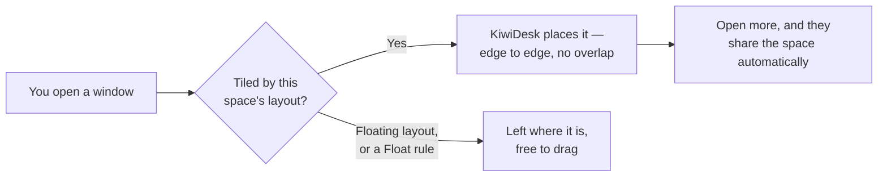
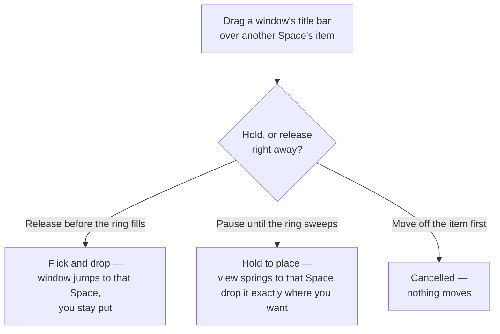
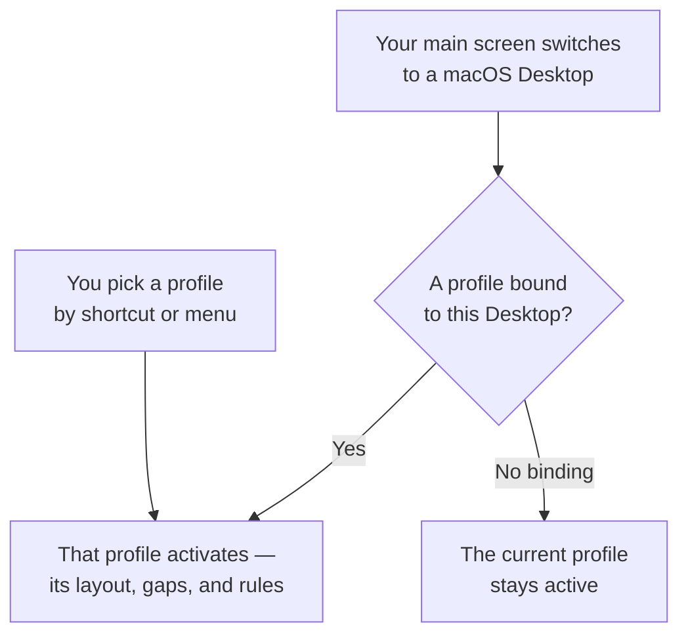

# User Guide: The Settings App

This guide covers KiwiDesk's Settings window — the point-and-click
interface for tiling, monitors, spaces, and keybindings. You never
need to edit files unless you want custom Lua.

What happens every time you open a window:



Everything below is how you shape that: which layout a space uses,
the gaps, the bars, and the shortcuts.

## Getting Started

Open Settings from the KiwiDesk menu in the menu bar, or press
**⌘,** while a KiwiDesk window is key. **Shortcuts ▸ General**
offers a bindable **Open Settings** row for a global key of its
own; it ships unbound.

The Settings window is a normal window to KiwiDesk: it tiles into
your layout, shows in the App Bar, and answers the window
shortcuts — float it with `toggle_floating`, move it between
spaces, resize it. The setup
tour and the Config Issues window always float, and the shortcuts
panel is not a managed window at all, so it appears in no bar.

The window opens on **Home**, a grid of cards in two groups:

- **This Profile** — areas scoped to the profile being edited:
  Spaces, Gaps & Borders, Bars, Colors & Animations, and in Power
  User mode Layout Defaults, Monitors, Behavior, Advanced Colors.
- **Whole App** — settings that apply everywhere: Shortcuts,
  Profiles, App Rules, General.

Each card shows its area's current values. Click a card to open
its area; the **← Home** chip, **⌘[** or Escape brings you back.

The header's **Simple | Power User** switch chooses which cards
exist: Simple shows the eight everyday cards, Power User adds
Layout Defaults, Monitors, Behavior and Advanced Colors. Nothing
behind a hidden card stops working, and the Monitors card joins
Simple by itself while two or more displays are connected.
Flipping to Power User briefly tints the added cards, and those
cards keep a soft green frame afterwards.

The header also names the loaded profile and lets you edit a
saved profile without switching to it (see
[The Profile Banner](#the-profile-banner)).

Two pieces of the window recur everywhere below:

- **The save pill.** While anything is unsaved, a dark pill
  floats over the bottom of the content with the count and its
  target ("3 unsaved changes to Desk"), then **Revert**, **Save a
  copy…** and **Save**. Click the count for a popover listing
  every change as an old → new row; click a row to jump to its
  control. The pill disappears once everything is saved. The
  verbs are under [Saving](#saving).
- **The Live preview panel.** Five areas — Gaps & Borders, Bars,
  Colors & Animations, Layout Defaults and Shortcuts — open as
  two columns: controls on the left, a **Live preview** on the
  right that redraws from your draft, with a **Changed in this
  draft** list underneath (the same rows as the pill's popover).
  Areas with nothing to preview take the full width.

### Search

The search field sits in the middle of the header. Click it, or
press **⌘K** from anywhere in the window. Results appear under
the field as you type. Every setting is its own result:
searching "gap" lists each gap you can change. Common alternate
words work too ("padding" finds the gaps, "autostart" the login
row), in whatever language the window is in.

Each result leads with the setting's label, the trail to it in a
smaller line, and its current value on the right where it has
one. Results from a Power User area carry a **Power User** tag;
opening one switches the mode and says so under the header. A
**Made by you** group below lists things you named yourself — a
space, a profile, an app rule — and jumps to each.

Clicking a result opens its area and scrolls to the match,
tinting it for about a second. Anything that would hide it is
switched first: a hit inside one layout's editor opens that
layout's tab, a hit inside a collapsed drawer opens the drawer.
Some rows open their area without scrolling yet.

Escape or the clear button empties the query, which closes the
list; picking a result empties it for you.

Matching ignores case, accents, and hyphens versus spaces
("grosse" finds "Größe"). It is a substring match, not fuzzy: a
typo returns nothing.

### Narrow Windows

A narrow Settings window gives things up in a fixed order.
Controls are never one of them.

1. The **Live preview** panel becomes a card floating over the
   content: drag it by the grip on its top bar, close it with
   the ×. Narrower still, it waits behind a **Show preview**
   button. Closing the card answers for that screen only.
2. Labelled rows put their control on a second line under the
   label, the save pill docks into a full-width bar at the foot
   of the window, and Home's card grid drops to fewer columns.
3. The search field collapses to its icon. Click it, or press
   **⌘K**, and it opens in place while you search.

### Contextual Help (?)

Some rows carry a small circled question mark after their name.
Click it for a short popover on what the setting does; for a
field with named options, one line per option. Hovering shows
the same text as a tooltip. Every setting is meant to be clear
from its label, options and preview; the `?` is there in case
the short form was not enough.

### Using Settings from the Keyboard

Out of the box, macOS lets **Tab reach text fields and lists
only**. Turn on **System Settings ▸ Keyboard ▸ Keyboard
navigation** and Tab reaches every control.

Opening an area from the keyboard puts focus on the page, so the
next Tab reaches its first control. Opening it with the mouse
takes no focus, as anywhere on macOS: Tab starts from the top of
the window. Shift-Tab reaches the **← Home** chip; **⌘[** or
Escape goes back without tabbing.

With keyboard navigation off, the keyboard paths still run but
have nowhere to land: a control that cannot hold focus hands it
to the search field instead. VoiceOver is unaffected; every card
and panel title is a heading, so the headings rotor moves card
to card.

- A slider takes focus and the arrow keys step it: ← / ↓ down
  one step, → / ↑ up one, in the readout's own step.
- A segmented control — the **Simple | Power User** switch and
  every pick-one strip — is one Tab stop; ← / → move the choice,
  ↑ / ↓ leave the row.
- Where a row has right-click moves (rename, export or delete a
  palette; reorder spaces), press **⌃.** (**Control-Period**) on
  the focused row to open the same menu. VoiceOver offers them
  as accessible actions.

### Permission & First Run

On first launch a tour asks you to grant Accessibility
permission in System Settings › Privacy & Security ›
Accessibility. A row of markers across the top shows how far
along you are, counting only the screens this run will show.

When the permission lands, KiwiDesk arranges every window that
was already open. On a busy Mac that takes a few seconds: the
heading reads **Arranging your windows** and the footer counts
apps until it reads **Your windows are arranged**. **Continue**
is live the whole time.

The tour then shows the spaces it chose for your screens and the
shortcuts it bound, each modifier drawn as its own key with its
short name (`ctrl`, `opt`, `shift`, `cmd`). One line above the
list states the rule the chords share — ⌃⌥ moves your focus,
adding ⇧ moves the window — read off your actual shortcuts, so
it is not drawn if you have rebound either group.

The closing card shows a picture of the menu bar with the
KiwiDesk mark in it, offers **Start KiwiDesk at login** (ticked),
a **Start using it** button, and a link to **the guide** in your
browser.

Close the tour before those last screens and it reopens on the
shortcuts screen at the next launch; once reached, no ordinary
launch reopens it. Losing Accessibility later brings the tour
back at its grant step, and continuing walks the same screens
again.

While Accessibility is missing, window management pauses: the
menu bar icon shows a warning triangle, the quick menu gains a
**Window Management Paused…** row at the top, and Settings shows
a banner across every section. The menu row reopens the tour at
its grant step; the banner's **Open System Settings** goes
straight to the macOS pane. Management resumes once you grant
it.

No row greys out while paused. Every control still edits, so you
can prepare a whole setup before granting anything. What the
pause reaches is the save verbs that need a live monitor set,
under [Profiles](#profiles).

KiwiDesk runs as a single instance. A second launch brings the
running instance forward and exits, printing `already running`
to the terminal — that line, not the exit status, says a new
instance did not start; the exit itself reports success, so the
`kiwidesk service` helper never reads it as a crash. When a
Finder-launched copy cannot surface the running instance, a
notice dialog explains. A crashed instance never blocks the next
launch.

### The Status Bar Quick Menu

Click the KiwiDesk icon in the menu bar for the quick menu:

- **Layout** — switch the active space's layout (BSP, Stack,
  Scrolling, Monocle, Grid, Track, Floating). Switches made here
  are **session-only** and do not rewrite the profile; a drifted
  layout shows a "not saved to profile" subtitle. **Keep Layout
  in Profile "‹name›"** below the separator writes what is on
  screen, every screen at once, into the active profile; it
  lights up whenever any screen runs a temporary layout.
  Settings does not narrate temporary layouts: its Save saves
  what you edited there and a temporary layout stays on screen
  through it. The one exception is a Space whose layout you
  changed in **Settings → Spaces**, which wins on Save.

  With more than one screen the list nests: **All Screens**
  first, then a row per screen in desk order (left to right,
  then top to bottom). Each screen's row checkmarks the layout
  the Space showing there is running and shows that Space's own
  drift subtitle; **All Screens** applies your pick everywhere
  and carries no checkmark. A layout belongs to a Space, and a
  screen's row sets the layout of whatever Space is showing
  there. With a single screen the list stays flat.
- **Switch Profile** — load any saved profile. A non-clickable
  **Profile: ‹name›** line above names the current one, shown
  only when there is another profile to switch to.
- **View Shortcuts…** — the read-only panel, below.
- **Settings…** — the full Settings window.
- **Check for Updates…** — ask now whether a newer KiwiDesk has
  been released, and install it. KiwiDesk also checks on its own
  in the background. The row is greyed while a check runs or an
  update is part-way through installing.

  Installing shows a small progress window. KiwiDesk brings the
  *Install and Relaunch* prompt to the front when it is ready;
  if you quit with an update waiting, it installs on the way
  out.

  **If you installed with Homebrew**, KiwiDesk keeps itself up
  to date and `brew upgrade` steps aside. To move an older copy
  onto a version that can do this, run
  `brew upgrade --cask kiwidesk` once.
- **Window Management Paused…** — only while Accessibility is
  missing; reopens the permission tour.
- **Starting up — apps: N of M** — only while KiwiDesk is coming
  up: a live count of the startup scan. The menu-bar mark is
  drawn dimmed and **Layout** and **Switch Profile** are greyed
  until it finishes. On a busy Mac (a hundred or more apps) this
  takes a few seconds; an app whose Accessibility answers are
  unusually slow is finished off just after boot, so its windows
  tile a beat later.

When the background check finds an update, the menu-bar icon
shows a small dot and the row reads **Update Available…** until
you act on it; nothing pops up over your work. *Remind Me Later*
clears the dot until the next background check.

### The Shortcuts Panel

**View Shortcuts…** opens a floating, read-only panel of the
shortcuts bound in the active layer, in four sections:

- **Controls** — window and focus actions (Focus, Move windows,
  Size & float, Switch layers), in two columns.
- **Apps** — app-launch shortcuts with the app's icon. A
  window-plus badge marks *Open New*.
- **Inactive shortcuts** — shortcuts whose target Space has left
  the current list, dimmed. They still work (pressing one
  recreates its Space) and come back when the Space returns.
- **Custom** — raw-Lua shortcuts, shown as their Lua source.

The panel's own hotkey is **⌃⌥K** (Settings ▸ Shortcuts ▸
**General**, "Show shortcuts panel"; rebindable per layer, and
every layer you create gets the same row). The key opens and
closes the panel; it is shown beside the menu bar's **View
Shortcuts…** row and in the panel's close hint, and never listed
as a row of its own.

The panel appears centered on the screen under your pointer and
remembers no position. It grows with what you have bound up to a
ceiling set by your screen, then scrolls; the footer says
"Scroll for more shortcuts" when it does. Your shortcuts keep
working while it is open. Press **Esc**, click outside it, or
choose **View Shortcuts…** again to close it; closing returns
you to the window you were using. Empty sections are hidden; a
layer with nothing bound shows a placeholder. **Edit in
Settings…** opens Settings ▸ Shortcuts. If `init.lua` owns your
configuration, the panel says so instead of listing shortcuts.

## How the App and init.lua Coexist

KiwiDesk keeps your custom Lua in `~/.config/KiwiDesk/init.lua`
and never edits it. Settings stores its own configuration in
`~/.config/KiwiDesk/gui.json` (global) and one JSON file per
saved profile.

- Saving in Settings never rewrites `init.lua`.
- Custom Lua that is not app rules, float rules, ignore rules,
  keybindings or profile bindings lives alongside the visual
  editor. A blue banner reads "Custom Lua detected" when the app
  finds your code.
- If `init.lua` declares managed vocabulary (`app_rules`,
  `float_rules`, `ignore_rules`, `KiwiDesk.bind`, keybinding
  definitions) that Settings also manages, Settings shows a raw
  Lua editor instead. **Adopt into the GUI** imports them,
  comments the migrated settings out as a backup, and keeps your
  custom Lua (event hooks such as the sketchybar bridge) live.
  Or keep editing raw Lua.

Once `gui.json` exists, the visual editor owns tiling (gaps,
modes, layout tuning), and hand-written `set_gap_global` calls
stop applying on monitor changes. To persist custom tiling, save
it as a profile.

**First launch with an existing `init.lua`:** KiwiDesk seeds the
default `gui.json` (default profile, spaces and shortcuts) as
long as `init.lua` declares no managed settings, so a file of
event hooks boots GUI-managed and keeps firing. An `init.lua`
that sets tiling itself (`KiwiDesk.set_*`, app/float/ignore
rules, or keybindings) stays Lua-owned; no `gui.json` is seeded
and **Adopt into the GUI** is offered instead.

## Start KiwiDesk

**Start at login** sits in **General ▸ Applies immediately**. It
reads and writes the real macOS login item and stores nothing of
its own; revoke it in **System Settings ▸ General ▸ Login Items**
and the switch follows. If macOS shows *Requires approval in
System Settings*, click **Open Login Items** and enable KiwiDesk
there. The switch greys out when KiwiDesk runs from a place it
cannot register from (a still-quarantined download, or the bare
binary); the caption names the fix. First-launch setup offers
login pre-selected on its final step.

Crash supervision is command-line only: `kiwidesk service start`
installs a helper that relaunches KiwiDesk after a crash, never
after a deliberate Quit ([CLI reference](cli.md)). While that
service runs, **Start at login** shows as on and stops being
editable, with a line naming `kiwidesk service stop` as the way
back.

## What Changed in This Version

**General ▸ About** shows the version you are running.
**Release Notes** beneath it opens the release history in your
browser — every version's notes, not just the current one.

## The Written Guide

**General ▸ About** also carries a **Guide** link, between the
version group and the support link, which opens this guide in
your browser — the same page the tour's last card points at.
Searching Settings for "guide", "help", "docs" or "manual" lands
on this row. The page opens in German or Japanese when KiwiDesk
runs in one of those languages, and in English otherwise.

## GUI Language

**General ▸ Applies immediately** picks a display language for
the Settings window, the dashboard and the quick menu. "System
default" walks your whole macOS preferred-language list and takes
the first one KiwiDesk ships, else English; regional and script
variants resolve to the closest catalog (Traditional Chinese gets
`zh-Hant`, European Portuguese the Brazilian catalog). The choice
applies instantly, touches no Lua or profile file, and lives in
app preferences (`UserDefaults`, key `"language"`). To add or fix
a translation, see [translating.md](translating.md).

## Appearance

**General ▸ Appearance** chooses whether KiwiDesk follows the
system's light/dark setting or pins one:

- **System** — follow macOS. The default; KiwiDesk stores
  nothing for it.
- **Light** / **Dark** — hold that appearance for every KiwiDesk
  surface: the Settings window, the bars, and the focus and drag
  overlays.

Like the language, it applies instantly, is not part of a
profile, and lives in app preferences only.

## Moving to Another Mac: Backups

**General ▸ Advanced ▸ Export KiwiDesk Backup…** writes one file
with your settings, every profile and your saved color palettes.
**Restore from Backup…** on another Mac puts the setup back.

Not included: `init.lua` (code you wrote) and the remembered
window arrangement (one Mac's session). A Lua-owned setup still
exports its profiles and palettes.

It is a one-time snapshot: KiwiDesk keeps no backups of its own,
so export again whenever you want a current copy. For continuous
sync between Macs, see [The gui.json File](#the-guijson-file).

Restoring **replaces**; it does not merge. Your current settings,
profiles and palettes are replaced, unsaved edits are discarded,
and it asks first. What it replaces goes to the **Trash**. The
restored setup takes effect without a relaunch. On the way:

- The remembered window arrangement on that Mac is forgotten, as
  [Discard Saved Window
  Arrangement](#when-things-act-up-discard--reset) does.
- KiwiDesk picks the profile matching the screens connected
  *here*, not the one the other Mac was on. A Desktop binding
  still wins over screen matching.

Refused before you are asked anything: a file that is not a
KiwiDesk backup, one written by a **newer** KiwiDesk (update
first), one that would restore nothing, and one carrying settings
when this Mac's settings come from `init.lua` (a backup with only
profiles and palettes restores there normally). Exporting refuses
when KiwiDesk cannot read this Mac's own settings file.

A restore that skips something says what: a profile whose file
cannot be read, or a palette that would shadow a built-in one,
is counted rather than silently dropped.

The row sits last in **General ▸ Advanced**, after Reset All
Settings: Reset All leaves your palettes alone, a restore
replaces them too.

## Exporting the Log

**General ▸ Advanced ▸ Export Log…** saves KiwiDesk's log for a
time range — the last 15 minutes, the last hour, or since
KiwiDesk started — to a file you choose (Downloads is suggested).
No message follows a successful export. If you can make the
problem happen again, do that first: the range counts back from
now, and "since KiwiDesk started" means this run. A range with
nothing written saves no file and says so. The file holds only
what KiwiDesk itself wrote to the macOS log; it names the apps
and windows KiwiDesk managed in that time, so glance through it
before attaching it to an issue. The terminal form is in the
[CLI reference](cli.md#exporting-the-log).

## When Things Act Up: Discard & Reset

Two escape hatches in **General ▸ Advanced**, in ascending
severity:

- **Discard Saved Window Arrangement** — clears the arrangement
  KiwiDesk remembered from your last session or wake, without
  changing settings. Use it when windows come back in the wrong
  spaces or positions after a restart or wake. No confirmation:
  the files regenerate from the live state within seconds.
- **Reset All Settings…** — after a confirmation, deletes every
  saved profile, your spaces, layouts and keybindings, forgets
  any remembered arrangement, and starts over with the starter
  defaults. Kept: `init.lua` (a Lua-owned setup keeps its
  settings authoritative), your color-palette library, the
  display language, the login item, and onboarding. The old
  `gui.json` and profiles folder go to the **Trash**.

## The gui.json File

`~/.config/KiwiDesk/gui.json` holds the app's global base
configuration. On a fresh install (no `init.lua`) it is created
at first launch with the [default shortcuts](#default-shortcuts);
on a hand-written setup it is created the first time you Save in
Settings. You normally never edit it by hand.

> **Keeping multiple Macs in sync.** Symlink `~/.config/KiwiDesk`
> into an iCloud Drive or Dropbox folder. This is live sync: a
> change on either Mac applies everywhere the folder reaches.
> Machine-specific state does not travel: grant Accessibility on
> each Mac, and expect display layout and macOS Desktops to
> resolve against what is connected there. For a one-time copy,
> see [Moving to Another Mac: Backups](#moving-to-another-mac-backups).

**Top-level structure:**

```json
{
  "spaces": [ "1", "2", "mail" ],
  "app_rules": { "com.spotify.client": "music" },
  "float_rules": [ "com.apple.calculator" ],
  "ignore_rules": [ "eu.exelban.Stats" ],
  "profile_bindings": {
    "9C1F2A44-3B0E-4E7D-9A21-6D5C8B7E0143": {
      "profile": "Developer", "desktop": 1
    }
  },
  "layers": [
    { "name": "default", "bindings": [...] }
  ]
}
```

- **`spaces`**: space ids (strings), in order. Updated by the
  Spaces section.
- **`app_rules`**: app **bundle identifier** → space id. Updated
  by App Rules, which picks apps by name and stores the
  identifier.
- **`float_rules`**: bundle identifiers (optionally
  `bundle-id:title`). Matching windows never tile. Updated by
  App Rules.
- **`ignore_rules`**: bundle identifiers never tracked or
  managed. No Settings control; Settings preserves it on save.
- **`profile_bindings`**: Desktop identifier → the profile that
  Desktop selects when it becomes current on your main screen.
  Updated by Profiles. The key is the identifier KiwiDesk stamps
  into the Desktop itself, not its Mission Control number, so a
  binding survives renumbering; the number sits in `desktop` as
  the label the Profiles card draws, and an optional `display`
  records the screen the Desktop was last seen on. On a Mac
  where the stamp cannot be written, the key is the Mission
  Control number. A file in the older `{ "1": "Developer" }`
  shape is rewritten once on load. See
  [A binding follows its Desktop, not its number](spaces-and-desktops.md#a-binding-follows-its-desktop-not-its-number).
- **`layers`**: keybinding layers, only one active at a time.
  Each has a **`name`** ("default" for the main set), an optional
  **`icon`** (SF Symbol name or emoji for the menu bar), and
  **`bindings`**: rows of **`combo`** (e.g. `"cmd+alt+left"`),
  **`lua`** (the body inside `function() ... end`), **`kind`**
  ("navigation", "application", or "custom") and **`label`**.

A hand-edited `layers` list is normalized on load: empty names
are dropped, a duplicated name keeps its first entry, `default`
always exists and sits first, and an `icon` on `default` is
removed. The next Save persists the normalized list.

> This key was called `"modes"` in earlier pre-release builds. A
> file still using the old name loads as *no shortcuts at all*
> and the next Save writes that emptiness back, so run this
> **before** opening Settings:
>
> ```bash
> sed -i '' 's/"modes"/"layers"/' ~/.config/KiwiDesk/gui.json
> ```
>
> Repeat it for any file in `~/.config/KiwiDesk/profiles/` with a
> keybinding override. A hand-written `init.lua` needs
> `KiwiDesk.define_mode` and `switch_mode` renamed too; they no
> longer exist. Or **Reset all settings…** trashes `gui.json`
> and reseeds the defaults.

To reset the app to what `init.lua` declares, delete `gui.json`.
Treat it like `init.lua`: do not import it from an untrusted
source, since custom Lua in keybindings runs on every reload.

## What Lives Where: Global vs Per-Profile

- **`gui.json` (global)** — one file, shared by every profile:
  the base keyboard shortcuts, app rules, float rules, ignore
  rules, and Desktop → profile bindings. Editing one changes it
  for every profile.
- **Each profile's JSON** — applied only while that profile is
  active: which spaces exist and their order, layout mode, gaps
  and per-layout / per-space tuning, space-to-monitor pins, the
  Main role and the fallback space. Editing one touches only
  that profile.

This is why the General section leaves the grid when you edit a
stored profile without switching to it: it holds global state a
profile edit never writes.

**Two hybrids.** The base shortcuts and app rules are global, but
a profile can carry a sparse override of its own: shortcuts can
add or change specific bindings ([Per-Profile Shortcut
Overrides](#per-profile-shortcut-overrides)), and app rules can
pin an app to a different space or un-pin it ([Per-Profile Space
Assignments](#per-profile-space-assignments)).

Base app rules name one space per app. When profiles share a
space name, one base rule is enough — keep a `comms` space in
each profile and assign the app to it. When their space sets are
disjoint (Work `{1, 2, 3}` vs Home `{media, games}`), give each
profile its own override.

## Spaces

The **Spaces** section (**This Profile**) lists every space you
manage. A space is independent of monitors and can span several
displays or run on one.

- **Add** with the **+** button and a name (a number like "1", or
  a word like "web").
- **Rename** by clicking the name in the list.
- **Customize** a space's layout by clicking the override cell on
  its row. A tiling space reads **Customize…** with no overrides
  or **N custom** with some (the total across every layout); a
  **Floating** space reads a muted **N saved** (overrides parked
  for other layouts) or **—**. Clicking opens the override editor
  ([Per-Space Overrides](#per-space-overrides)).
- **Delete** by right-click (or the trash icon). Its windows move
  to the fallback space, or the first space when none is set. A
  space with overrides, a monitor pin or a Main/Fallback role
  asks for confirmation first. With every space deleted, every
  window tiles in a single default space until you add one.
- **Set an icon** by clicking the name and picking an SF Symbol,
  emoji or single character. It shows in Monitors and Shortcuts.
- **Make Fallback** (right-click). When the profile changes,
  windows in spaces the new profile does not define move to this
  space; without one, to the first space in the list.

## Layout Defaults

**Layout Defaults** (**This Profile**, Power User mode) sets the
tiling defaults for every space in this profile.

### Modes

- **BSP** — recursive splits; every window gets a region.
- **Stack** — one master zone and a collapsing stack.
- **Scrolling** — columns or rows that scroll (PaperWM style).
- **Monocle** — fullscreen focus; the other windows hide behind
  the focused one or park in a screen corner.
- **Grid** — evenly-sized cells in rows and columns.
- **Track** — columns (or rows) where every resize has one
  target: your track, or your share within it.
- **Floating** — every window floats; KiwiDesk remembers where
  each sits when you switch spaces, across relaunches and
  Desktop switches. Should that memory be lost, a floating
  window comes back centred on its screen.

Gaps are carved out of the layout, as is the App Bar when shown.
Their sliders live in **Gaps & Borders**, not here.

### Per-Layout Tuning

The pane opens on a **Choose a layout** strip — one tile per
mode (BSP, Stack, Scrolling, Grid, Monocle, Track; Floating has
no tunables), landing on the mode your spaces use most — and
shows only the selected mode's settings. Each tile draws its
layout and counts the spaces using it. The global **Minimum
window size** sits above the strip: the floor no window tiles
below, which also caps auto-sized grids and track limits.

The **Live preview** panel redraws the selected layout from your
draft with a **Window count** slider. The count is a question
you ask the preview, not a setting; it is not saved. Several
settings only show at higher counts: cascade styles once the
stack overflows, a track limit once there are more windows than
tracks, a dynamic grid's balance as it rebalances. The focused
tile wears your real focused border colour while the focus
border is on, and a heavier outline with it off. A last card
lists the spaces using this layout and how many override the
values above. Nothing applies to live windows until you Save.

Per mode:

- **BSP** — split strategy (*alternating*, the default: cuts
  horizontally then vertically by depth; *longest_side*: cuts
  each region's longer side) and the width and height split
  ratios (0.5 = 50/50), which the per-axis resize shortcuts
  nudge.
- **Stack** — master count; master ratio (the master zone's
  share); master orientation (how several masters line up);
  stack position (left/right split the width, top/bottom the
  height; the stack's lineup follows the side, and with a
  leading stack the masters fill from the stack seam); overflow
  style (*cascade_overflow* keeps full windows, *cascade_all*
  cascades everything; piles cascade downward so title bars stay
  visible). The resize shortcuts are focus-aware: the split axis
  grows whichever zone holds the focus, the zone's own axis
  grows the focused window's share (session-only; not saved). A
  master zone lined up *along* the split axis has no reachable
  shares, which is the out-of-the-box case once the master count
  exceeds one; switch the orientation to vertical for
  individually resizable masters ([Accepted
  limitations](accepted-limitations.md)).
- **Scrolling** — orientation (horizontal or vertical); anchor,
  where the focused column rests on every focus: **Center**,
  flush against the leading or trailing edge (**Left**/**Right**
  horizontal, **Top**/**Bottom** vertical), or **Follow**, the
  default, which pans the minimum to keep the focus visible and
  holds the focused window's place when the row moves underneath
  it; slot size (a percentage of the available width or height,
  95% by default so a sliver of the next window shows, 5–100% in
  1% steps, or an exact point count); **Wrap focus** (off by
  default; on, focus wraps from the last window to the first;
  swap never wraps). The layout's own motion lives here too:
  **Animate focus shifts** (on by default) and its **Scroll
  duration** (50–1000 ms, default 150; greyed while the toggle
  is off). Colors & Animations links across to them.
- **Monocle** — orientation (which arrow keys cycle focus, and
  where the App Bar sits); **Hidden windows**: **Stack behind**
  (default) keeps them behind the focused one at full size,
  **Park in corner** moves them to a corner with an instant focus
  switch, for windows with transparent backgrounds or that
  cannot fill the screen (a thin edge of each parked window
  stays visible); wrap focus (off by default); **New window**
  placement (default **first**, so a new window comes to the
  front of the cycle).
- **Grid** — type (dynamic or rigid); fill empty cells;
  **Arrange** (Columns first or Rows first: the order windows
  fill the grid, and which way a dynamic grid grows; stored as
  `split_direction` = `horizontal` / `vertical`); column and row
  counts, which in dynamic mode are an upper bound the grid
  balances up to, cascading the overflow in the last cell.
  **Auto-size grid** fits as many columns and rows as the screen
  allows at the minimum window size and greys the counts.
- **Track** — a caption at the top says it is the more advanced
  layout. **Arrange** (Columns = tracks side by side, Rows =
  stacked). **New window**: **Fills the focused track** (default)
  fills the track you are in and spills into a new track once it
  is full; **Opens its own track** gives every window its own
  column. **Position** says where within that choice it lands
  (first, last, before or after the focused track/window;
  default **first**). **Auto track limit** (on by default; the
  screen decides how many tracks fit) or a fixed **Track limit**
  (greyed while auto is on; counts normal tracks, so a limit of 3
  shows three tracks plus one overflow track). **Overflow** sets
  how the far-edge **overflow track** renders: **cascade all**
  (default) piles its windows from the top, **cascade overflow**
  keeps the ones that fit tiled and piles the rest. Within a
  single track, surplus windows always cascade among themselves.
  **Wrap focus** (off by default; on, focus wraps within the
  track and from the last track to the first; swap never wraps).
  The track shortcuts sit in Shortcuts ▸ Move windows under
  "Move to track": *Move window to previous/next track* moves a
  window across tracks or opens one at the edge, *Swap with
  previous/next track* swaps whole tracks. Previous is the column
  to the left (or the row above), next the column to the right
  (or the row below), so a binding keeps working when the axis
  flips. Track sizes and in-track shares are session-only, like
  the stack's weights.

> **A few resize behaviors are accepted limitations, not bugs** —
> the inner window of a nested BSP pair not growing, or a stack
> window's mouse height-drag snapping back. See
> [Accepted limitations](accepted-limitations.md).

### Per-Space Overrides

Beside the Spaces list, the **Live preview** panel is headed
**This Space's layout**: one space's layout as *that space*
resolves it — the defaults plus its own overrides — with a chip
per space, a caption naming the layout and how many settings the
space overrides ("follows the layout defaults" when none), and a
**Window count** slider that never persists. A Floating space
says so instead of drawing.

To tune the same layout differently per space — space "3"
scrolls vertically while the others scroll horizontally — open
the override editor from a space's override cell. It takes over
the pane with a breadcrumb **‹ Spaces › `<space>` › Overrides**.
The header reads `<Space> — <Layout> overrides` with an **N of
M set** count and a **Reset `<Layout>` Overrides** button
(greyed when there are none). It edits the layout the space
currently uses; to tune another, switch the space to it first.

Each row carries an **Override** checkbox in the trailing
column. Unchecked inherits the Layout Defaults value and reads
**follows `<Layout>` defaults · `<value>`**; checked shows the
control, seeded with the current value. Where a field is greyed
by a switch on another page — Grid's auto-size, Track's auto
limit — a sentence under the rows says so and links **Layout
Defaults**. While the editor is open, the panel follows that
space.

**Scrolling slot size** is one override with a unit (**Percent**,
**Points**) and a value: **Column width** when the space scrolls
horizontally, **Row height** when vertical. One checkbox owns
the whole setting.

**Other layouts.** Changing a space's layout never deletes
overrides; each layout keeps its own. When a space holds values
for layouts other than its current one, a card at the foot reads
**Saved for _N_ other layouts** with a **Show** disclosure
listing each. **Reset All Layout Overrides** there clears every
layout's overrides for the space, after a confirmation.

## Monitors

**Monitors** pins spaces to displays for this profile. It is a
picture of your desk: each display drawn at its own size and
place, in points (the measure System Settings ▸ Displays ▸
Arrangement uses).

- **Drag a space chip** onto a display to pin it there. Every
  chip is also a menu (click or right-click), which is the
  keyboard route: Tab to the chip, Return to open it.
- **Drag onto the dashed "Follows main display" tray** to give
  a space the **Main role**: it moves with whichever display is
  main when you dock and undock.
- **Outlined chips** are placed automatically; a filled chip is
  one you placed, and its clear button returns it to automatic.
- **Click a display** to see what it holds and which space is
  showing. A display too small for all its chips shows a **+n**;
  click it for the full list.

Two notes appear only when they apply: *"Sizes are approximate"*
when your displays differ too much to draw to scale, and *"Some
of these displays look identical to KiwiDesk"* when two share a
name and resolution, so a space pinned to one may open on either.

**Monitor fingerprints** at the bottom is a read-only drawer
showing how KiwiDesk recognises each display. Saving the profile
with a new monitor attached records the new arrangement, so the
profile loads with this hardware in future.

Editing a profile whose monitors are not attached replaces the
picture with a note; the other sections still edit. A space
pinned to an absent monitor gets its own card below the picture
with a **Back to automatic placement** button.

The **focused monitor** is the one you last clicked — a window or
the bare wallpaper. A new window, and a global sticky window,
appear on that monitor's space. Clicking the menu bar or the Dock
does not move focus.

## Gaps & Borders

**Gaps & Borders** (**This Profile**) sets the structure of
everything KiwiDesk draws around a window: spacing, the width and
corners its three strokes share, the focus ring's glow, the drag
overlays, and the sticky mark. Colours live in the two colour
sections below; every colour renders in exactly one place.

### Shared by all borders

KiwiDesk strokes three things: the **focus ring** around the
focused window, the **ghost** where a dragged window came from,
and the **drop zone** under the cursor. The card at the top sets
two things for all three; there is no per-stroke version below.

- **Width**: 1–20 pt. For the focus ring this is the thickness
  reaching outward into the gap, and the value **Fit layout
  gaps** sizes gaps from; a small overlap tucked under the window
  edge keeps the corners closed and is not part of the width.
  Keep gaps at least twice the width so two neighbouring rings do
  not touch. The drag overlays draw *inside* their slot.
- **Corners**: **Rounded** uses the system window radius,
  **Square** no radius, for the ring and both overlays together.

The drag overlays' radius is a number underneath
(`drag.set_corner_radius`), and the picker reads any value above
zero as **Rounded**: a 7 pt radius set from Lua shows as Rounded
and stays 7 pt, even if you tap Rounded again. Square writes no
radius. If the ring and the overlays disagree (a Lua-only state),
neither segment is selected and both rows show a **?**; tap
either segment to bring them together.

Each stroke's own width, each overlay's alignment (inside or
outside its slot edge; both default to inside) and the drag
radius are Lua-only and never clamped against each other — see
the [Lua reference](lua-reference.md).

### Focus Border

The **Focus border** group outlines the focused window so it
stands out in a gapped layout. On by default.

KiwiDesk draws it as a native WindowServer overlay that follows
move, resize and ordering events at their source, and falls back
to an AppKit overlay if that surface is missing or an operation
fails. Neither path needs SIP disabled.

The **Live preview** panel answers for the whole page: the gap
diagram, the border on a two-window mock at your staged colour,
width and corners (wearing the sticky mark while **Show mark on
sticky windows** is on), then the drag ghost and the drop zone.

- **Show focus border**: the master switch.
- **Show border on unfocused windows**: off by default. On,
  every other tiled window gets a border in its own colour,
  every member of an overflow cascade included. Floating windows
  get no border when unfocused; monocle shows only the focused
  border.
- **Glow effect**: a soft coloured bloom around the focused
  border. Off by default; never on unfocused borders.
- **Auto glow size**: on by default; the bloom's reach follows
  the border width. Off, the **Glow size** slider (1–20 pt) pins
  it.
- **Fit layout gaps**: previews the global **Outer** and
  **Inner** values that keep borders apart, plus **Extra
  spacing** (0–100 pt, default 0). Inner gaps account for both
  borders when unfocused borders are shown. **Set Gap Values**
  stages those values, warns before replacing asymmetric per-edge
  gaps, and can grow or shrink gaps. Extra spacing is an action
  parameter, not a saved setting. (Lua:
  `border.fit_gaps(remaining)`.)

The ring's colours — **Focused window** and **Unfocused
windows** — are in **Advanced Colors ▸ Border colors**, dimmed
there while the matching switch here is off.

**What gets no border.** Launcher and panel overlays (Spotlight,
Raycast, Alfred): their command bars are never managed, never
appear in a bar, never tile. Windows in native (green-button)
fullscreen: macOS moves such a window off the Desktop into its
own Mission Control slot, so the bars hide there, no layout pass
or focus raise targets it, a resize shortcut says so on the
window, and its space tiles as if it were away; it keeps its
slot and tiles back when it leaves fullscreen. Popovers, sheets
and emoji pickers stay above the border of the window that owns
them, which stays focused.

**Cues on the ring.** Focusing or swapping toward an edge with
no window there gives the ring a small rubber-band bounce; the
window never moves. It works with the focus border off (a border
appears briefly for the bounce), and under **Reduce Motion** it
becomes a single opacity pulse.

A resize that hits a minimum gets the bounce and a frosted pill:
"Minimum window size reached" on the window that can shrink no
further (the configured minimum, or a larger one the app
enforces). Growing stops where a *neighbour* would drop below
its minimum; the resized window reads "Neighboring window at its
minimum size" and the neighbour marks itself. The cues fire on
the first press or drag that gets less than it asked for,
keyboard and mouse alike. On a scrolling space a learned app
*maximum* (System Settings will not grow past its own width)
stops the slot with "Maximum window size reached". Running out
of screen is a silent stop. Under a held resize shortcut, a
refusal shows its pill once and ends the glide.

Floating windows join directional focus as a second tier: when
no tiled window lies in the pressed direction, focus reaches a
floating window that way (a floating sticky shown on the space
included).

### Drag Visuals

Dragging a tiled window shows two overlays:

- **Ghost** — the dragged window's slot, where it snaps back if
  released outside any other window.
- **Drop zone** — the slot under the cursor. The target follows
  the cursor, not the window's centre.

Releasing over another window's slot on the same display swaps
the two. Dragging onto another display moves the window there,
live: once the cursor settles on the other display for a beat,
its windows slide apart to open a slot under the cursor, and the
drag then behaves like a local one there; pulling the cursor
back moves the window home. A fast flick still commits at
release. Releasing outside every slot on your own display snaps
the window back.

Floating windows show neither overlay; dropping one over a tiled
slot does nothing. Use *make tiled* first.

Each overlay has a **Border** and a **Fill** switch. Width and
corners come from the shared card at the top; the colours are in
**Advanced Colors ▸ Drag colors**, in the same two columns.

### Sticky Windows

A **sticky** window stays visible on every space instead of
hiding with its home space. Two scopes, both in Shortcuts ▸ Size
& float (stickiness is per window; there is no app-rule list):

- **Toggle sticky everywhere** — every space of every monitor
  (∞ mark).
- **Toggle sticky on this screen** — every space of the one
  monitor it lives on (📌 mark). Moving it to a space on another
  monitor re-homes it there.

Moving a global-sticky window anywhere, or a display-sticky one
to another space on the same monitor, is refused with a brief
pill. On a single monitor the two are identical. The flag
survives closing and reopening the window and is independent of
floating: a floating sticky window keeps its frame everywhere; a
tiled one tiles into every space's layout near where it sits on
its home space, keeps a fully visible slot on a crowded space
rather than joining the overflow pile (a scrolling row scrolls
it like any slot), and can be reordered or mouse-resized only on
its home space — elsewhere the gesture snaps back and the mark
expands into a pill naming the home space. The same pill appears
when you drag another window onto its slot.

Where macOS supports it, sticky reaches across **macOS
Desktops**: switch Desktops and sticky windows of both scopes
come along with the screen they are on. **Stay visible across
Desktops** (beside the mark toggle) switches it and appears only
on a macOS that can drive Desktops; `override_sticky_reach` in
Lua pins a single window the other way. Mission Control shows a
sticky window on one Desktop at a time.

A globally sticky window follows the space you focus onto its
screen; when that space is a floating-mode space on another
screen, KiwiDesk moves the window there at its last size, scaled
to the screen.

**Show mark on sticky windows** (on by default) draws a small
mark in the window's top-right corner. The refusal pills above
ride the same mark, so with it off a refused move fails silently.
The Space Bar shows its own sticky badge either way; hide both
and a sticky window is indistinguishable from any other. (Lua:
`sticky.set_mark`, `space_bar.set_sticky_badge`.)

The marks' colours are in **Advanced Colors**: **Sticky** in
Border colors paints the on-window mark and the Space Bar badge
together; **Floating** in the Space Bar's badge cluster (floating
windows have no on-window mark). Both default to **Automatic**.
(Lua: [`sticky.set_color`](lua-reference.md#stickyset_color),
[`floating.set_color`](lua-reference.md#floatingset_color),
[`space_bar.set_sticky_badge`](lua-reference.md#space_barset_sticky_badge).)

## Bars

**Bars** is one page with a card per bar, the Space Bar's first.
Each card shows the everyday settings at rest — does the bar
exist, where, how thick, the content toggles — and folds the
rest behind a **Style** disclosure. The **Live preview** draws
one mock desktop with both bars on their configured edges, the
space strip showing your actual Spaces. Neither card holds a
colour; every bar tint is in **Advanced Colors**.

### App Bar

The App Bar lists every window in the current space. It renders
only in **Monocle** and **Scrolling**, where a window can hide
behind another or scroll off the edge, so the card has no on/off
row: visibility is per layout, via the two **Show it in**
switches at the card's foot. A window in native fullscreen loses
its item while away.

**Click** an item to focus its window; **drag** one along the
bar to reorder the windows. Grouped items expand into their
members on click, so any window in a same-app group can be
picked or dragged. (Lua: `app_bar.*` setters; the rearrange
gesture shares the drop visuals in [Drag & Drop
Rearranging](lua-reference.md#drag--drop-rearranging).)

The settings (Position, Thickness and grouping at rest; the rest
behind **Style**):

- **Background style**: boxed (a box per item) or plain (a shared
  translucent strip).
- **Liquid Glass**: a separate finish, on by default, laying a
  macOS 26 glass material over the boxes or the plate. One switch
  covers the Space Bar, the App Bar and the shortcuts panel:
  **Colours & Animations ▸ Liquid Glass**. Fill tints it
  (transparent = clear glass) and a dark Fill picks the darker
  glass on both bars. The switch appears on macOS 26 and later;
  a profile that turns it on still opens on older macOS with the
  Boxed or Plain shape underneath.
- **Background size**: how far Plain's strip or the glass plate
  reaches — **Hug items** (default) or **Full width**. Hug falls
  back to full width once items overflow and scroll. Greyed when
  every bar on screen resolves to Boxed.
- **Position**: top, bottom, left or right (default bottom, the
  Space Bar on top). When the Space Bar shares the edge, a note
  gives the order: Space Bar at the screen edge, App Bar next to
  the windows.
- **Alignment**: start, center (default) or end along the bar,
  edge-relative. Once items overflow and scroll, all three read
  the same.
- **Active indicator**: outline, edge mark (an accent bar on the
  item's window-facing edge) or gap (the active slot left empty).
  Independent of the background style. Full-colour app icons dim
  to half strength on inactive items.
- **Thickness**: how far the bar reaches into the layout, in
  points.
- **Item size**: auto (0) sizes every slot to the widest item;
  otherwise a fixed width.
- **Content**: icon only, title only, or both. The text is the
  window's title, not its app name; a **grouped** item and a
  window with **no title yet** show the app's name instead.
  Left/right bars always render icon-only, so the control greys
  when every bar on screen is vertical.
- **Title length**: 8–80 characters (default 10) before a title
  is shortened. On auto item size one long title widens every
  slot until the quarter-of-the-bar limit, after which the bar
  scrolls. Greyed while every bar shows icons only.
- **App symbol style**: **System default** shows each app's icon
  as macOS provides it, including your system-wide Icon & widget
  style; **Glyphs** shows a monochrome symbol from the bundled
  [SketchyBar App
  Font](https://github.com/kvndrsslr/sketchybar-app-font),
  coloured by the bar's item colours (apps without a symbol keep
  their icon). It also styles the shortcuts panel's Apps band,
  so it stays available when no layout shows an App Bar. Greyed
  while every bar renders titles only.
- **Font size**: auto or fixed. Auto-gated sliders read
  "Automatic" while their toggle is on.
- **Corner roundness**: 0–100% (0 = square, 100 = full capsule),
  for the boxed items or the shared plate.

**Controls with nothing to act on are dimmed, not removed.** Turn
the Space Bar off, or the App Bar off in every layout, and the
card's controls stay on screen with their values, and a tooltip
says what to turn back on. The same holds for a single setting:
in Advanced Colors the Highlight and Active item colours dim
under the Gap indicator, a drag visual's colours dim when that
part is off, and the Space Bar group dims when the bar is off.

**Colours** are in **Advanced Colors ▸ App Bar colors**: Fill and
Highlight at rest, the rest behind **More colors**. **Fill**
paints every filled surface — the box per item, the shared plate,
and the tint of the Liquid Glass finish. The active item is
marked by the indicator, so there is no active-fill colour.

**Show it in** decides which of Monocle and Scrolling carry an
App Bar. Styling the bar differently *per layout* is Lua-only:
every `app_bar.*` field has a `monocle.set_app_bar_*` /
`scroll.set_app_bar_*` twin, and unset fields follow the global
value — [Per-layout App Bar
overrides](lua-reference.md#per-layout-app-bar-overrides). The
card edits and previews the global values only.

### Space Bar

The **Space Bar** shows your Spaces on every Desktop: one bar per
display, listing that display's Spaces in profile order. On by
default. It stands down while a native-fullscreen app holds the
screen.

Each item shows the Space's identifier (its icon, else its number
or a two-letter monogram), a divider, then a glyph per window.
Adjacent windows of the same app collapse into one glyph with a
count badge; past the glyph cap (default 5, 1–12) the rest fold
into a `+n` badge. Emoji identifiers and app-image icons dim to
half strength on inactive Spaces; on the active Space, app-image
glyphs keep a three-step ladder (the focused app full strength,
its neighbours slightly dimmed), while App Font glyphs use the
Focused item colour. Click a Space to switch to it; glyphs are
informational.

The bar shows the Desktop you are looking at: a window on a macOS
Desktop you are not looking at is not listed, and *Hide empty
Spaces* hides a Space holding only those. *Open or Focus* still
reaches such a window and switches Desktops to it. A transient
overlay — a context menu, a submenu, a launcher panel — gets no
glyph and no place in the `+n` count.

A sticky window's glyph travels with you: it is listed under one
Space only, the one the window *renders* on. A ∞ window follows
the Space you are focused on and is listed on that screen's bar;
a 📌 window stays under the current Space of its own screen.

Glyphs carry small corner badges: **sticky** top-left,
**floating** bottom-left, the group count top-right. A grouped
glyph's badge means "at least one window in this group". They
mute on inactive Spaces, have no Settings toggle, and Lua hides
them with `space_bar.set_sticky_badge(false)`.

| Mark | Where it sits | Means |
| --- | --- | --- |
| ∞ mark | On the window, top-right corner | **Global sticky** — every Space of every monitor |
| 📌 mark | On the window, top-right corner | **Display sticky** — every Space of the one monitor it lives on |
| Badge, glyph's **top-left** | Space Bar | That window (or one in the group) is **sticky** |
| Badge, glyph's **bottom-left** | Space Bar | That window is **floating** |
| `+n` / count badge, glyph's **top-right** | Space Bar | How many windows a grouped glyph holds |

Every mark is a filled disc in its state colour with a
black-or-white glyph picked for contrast; sticky and floating
each have a colour in [Advanced Colors](#advanced-colors).
Floating has no on-window mark. (Lua:
[`sticky.set_mark`](lua-reference.md#stickyset_mark),
[`sticky.set_color`](lua-reference.md#stickyset_color),
[`floating.set_color`](lua-reference.md#floatingset_color).)

**Drag a window onto a Space** to move it there, a two-speed
gesture over the Space's item:

- **Flick and drop** — release before the ring fills; the window
  jumps to that Space and you stay.
- **Hold to place** — pause; a ring sweeps around the item and
  the view springs to that Space with the window in its live
  layout, so you can drop it exactly where you want.

The hold is the **Spring delay** (default 1.5 s, 1–4 s). Move the
cursor off the item before the ring completes to cancel. Under
**Reduce Motion** the ring does not sweep: it stays away for the
first half-second, then appears whole. The whole item is the
target, and dropping onto the Space the window is already on
does nothing.



**Many Spaces:** when they do not fit, the bar scrolls; chevrons
appear at the ends and the bar follows the active Space into
view. Click a chevron to scroll, or hold a dragged window over
one to autoscroll. The front-app segment stays pinned at the
trailing end.

The card's order matches the App Bar's: at rest **Show Space
Bar**, **Position** (any edge; sharing one with the App Bar
stacks the Space Bar at the screen edge), **Thickness**, and two
behaviour toggles; behind **Style**, background style,
**Alignment**, active indicator, **App symbol style**, sizes,
**Glyphs per Space** (1–12), **Title length** and **Spring
delay**.

- **Hide empty Spaces**: the current Space always stays visible;
  hidden Spaces remain reachable by shortcut.
- **Show front app**: a trailing segment with the focused window
  of the Space each display shows — its app icon, then the
  window's title (the app's name if it has none yet). Icon-only
  on vertical bars. **Title length** (8–80, default 10) caps it
  and is greyed while the segment is off.

Colours are in **Advanced Colors ▸ Space Bar colors**. The
three-step ladder at rest is the bar's signature: **Item** paints
inactive Spaces, **Active space** the Space shown on the display,
**Focused window** the focused window's glyph inside it; the rest
sits behind **More colors**. **Copy sizes and style to Space
Bar…** (App Bar card, Style disclosure) copies the App Bar's
sizes and style once; colours, position and visibility are never
copied.

## Colors & Animations

**Colors & Animations** (**This Profile**) is the whole colour
story for most people: pick a palette, see what you are running,
set how windows move. Nothing here asks for an individual colour;
that is Advanced Colors, which you never have to open.

Colour controls pair a swatch with a hex field. Clicking the
swatch opens the native Colors panel and updates the staged value
as you pick; **Done** or the window's close button keeps it.

### Color Palette

The **Color palette** shelf paints a whole set of colours — the
App Bar, the Space Bar, focus borders, drag visuals and the
sticky/floating marks — in one click. Each tile shows a scene
thumbnail (a mock bar, a bordered window, a drag swatch) in its
own colours. Applying is a **one-time paint**, not a live link:
it overwrites the current colours, which you can still tweak, and
is staged until you Save. **Current colors** in the preview panel
shows the same scene in the colours you are editing, with the
changed list under it; the four hover colours appear in neither
drawing.

The palette matching your colours is **checkmarked**. The mark is
worked out from the colours you are editing, not remembered:
change one colour by hand and it goes away; save your colours
while wearing a bundled palette and both tiles are marked. A
marked tile is also framed in green.

- **Bundled** palettes — Kiwi (Default), Kiwi Gold, Kiwi Neon,
  Clean Light, Slate, True Dark, Sunset, Ultraviolet, Monochrome —
  are marked "Built-in" and cannot be renamed or deleted. **Kiwi
  (Default)** is the shipped defaults, so applying it is a reset,
  mark tints back to Automatic included. **Kiwi Neon** is built
  for the focus-border **glow**; while glow is off, a **Pair with
  Glow** link under its tile goes to the Focus border card, and
  picking the palette never switches glow on.
- **My palettes** are yours. The **＋** tile saves the current
  colours as a new palette; right-click one to **Rename**,
  **Export…** or **Delete**. **Import…** loads a shared palette
  file (unknown keys ignored, the name made unique).

A palette carries only colours — never a width, a toggle or an
effect — so it applies to any profile without surprises. The
library is global: the same palettes are available whichever
profile you edit.

### Motion

- **Animate windows**: the master switch, and the only row at
  rest; the per-event toggles and the duration sit behind
  **Per-event and duration**. Off, windows snap into place and
  the drawer greys. **System Settings ▸ Accessibility ▸ Reduce
  Motion** also keeps animations off and greys the whole card.
- **Duration** (ms): 50–1000, default 150.
- **On space change**: windows slide out of the space you leave
  while the new space's slide in from the hiding corner (default
  off; both spaces animate at once, which can be slow on older
  machines). macOS Desktop switches are never animated
  ([Accepted limitations](accepted-limitations.md)).
- **On window resize** (default on).
- **On window swap** (default on).
- **On relayout**: when windows open or close or layout
  parameters change (default on).

The scrolling layout's focus animation and its duration live in
**Layout Defaults ▸ Scrolling**; a link on this card goes there.

## Advanced Colors

**Advanced Colors** holds every colour KiwiDesk has — 25 —
grouped by where you see it: **Border colors**, **Drag colors**,
**Space Bar colors**, **App Bar colors**. The **Live preview**
draws one scene holding every colour at once (*Every color at
once*): both bars with their ladders and badges, a focused and an
unfocused window with rings and marks, the drag ghost beside its
drop zone, pinned while the rows scroll. The four hover colours
are the one thing it leaves out; they are seen on the real bar.

Each colour renders in exactly one place: nothing here is also
editable elsewhere in Settings, and nothing Settings offers is
missing. (Lua reaches further: the [per-layout App Bar
overrides](lua-reference.md#per-layout-app-bar-overrides) include
the bar's eight colours and have no GUI control.)

- **Border colors** — **Focused window**, **Unfocused windows**
  (the ring), **Sticky** (the on-window mark and the Space Bar
  badge, one colour).
- **Drag colors** — the ghost's and the drop zone's **Border**
  and **Fill**.
- **Space Bar colors** — **Item**, **Active space**, **Focused
  window** at rest; plate, highlight, hover and the badge cluster
  (the **Floating** badge tint included) behind **More colors**.
- **App Bar colors** — **Fill** and **Highlight** at rest, the
  rest behind **More colors**.

A colour whose thing is off is dimmed, and the group's `?` names
the page with the switch. The stored value is untouched. **Save
current colors as…** on the palette shelf keeps anything you set
here as a palette.

## Behavior

**Behavior** (**This Profile**, Power User mode) covers mouse
interaction, the cue a blocked action gives, and what happens on
quit.

### When an Action Can't Apply

When KiwiDesk refuses something — a window at its smallest, a
grow with no room, a layout with nothing to resize, a sticky
window that cannot be swapped — it flashes a short message on the
window. **Play a sound when an action can't apply** (default off)
adds the system alert sound; you hear it the moment you toggle
it. It never sounds without a message (a refusal whose cue is
switched off elsewhere stays silent) and never fires for a
command sent over the CLI or IPC. Held shortcuts sound once per
hold.

### Mouse & Window Behavior

- **Mouse resize mode**: "layout" (default) slides the split as
  you drag; "snap_back" lets the window resize freely and snaps
  it back on release.
- **Move mouse to focused window** (default off): warps the
  pointer to the centre of the newly focused window.
- **Minimum window size** (default 300 pt): a window shrinks no
  further; extras cascade instead. It is the stepper above the
  **Choose a layout** strip in Layout Defaults.
- **New window placement**: first, last, before focused, or
  after focused. Each layout has a default; override per space.

### Wake & Restart

Lua-only (`enable_wake_restore`, `set_wake_restore_delay` in the
[Lua reference](lua-reference.md)):

- **Restore on wake** (on by default): after sleep or screen
  unlock, restore the arrangement captured when the Mac went to
  rest and put focus back on the window you were in.
- **Wake restore delay** (default 1500 ms): how long to wait
  after wake, giving displays time to settle.

A wake restore is skipped when the display set changed during
sleep; the monitor-change profile switch takes over. If a
restore leaves things wrong, **General ▸ Advanced ▸ Discard Saved
Window Arrangement** clears it.

### On Quit

Before KiwiDesk stops, it spreads each display's windows into an
evenly filled grid so every title bar stays reachable, with no
window pulled to another monitor.

- **Target windows per cell** (1–20, default 5): the grid adds a
  row and column when cells would exceed this; it stays between
  2×2 and 4×4, and past 4×4 windows keep cascading in the cells.
  A live summary shows the thresholds (at 5: 2×2 up to 20
  windows · 3×3 up to 45 · 4×4 above).

KiwiDesk saves window order and focus per space on quit and
restores them on the next launch — only from a snapshot taken
since the Mac last booted; after a reboot windows are
rediscovered fresh. (Lua: `quit.set_layout`,
`quit.set_grid_target_depth`; `grid` is the only strategy.)

## Profiles

**Profiles** (**Whole App**) manages saved layouts. A profile is
your whole setup, remembered per display arrangement: tiling
(modes, gaps, parameters), space-to-monitor pins, and optionally
a sparse keybinding override plus sparse app, float and ignore
rule overrides.

The page answers, in order: what a profile is, which ones you
have, which one loads, and where to start from nothing. Until
your first profile exists, the presets lead the page.

### Your Profiles

One row per saved profile: the ones matching your connected
displays first, then those saved for as many screens as you have
connected (a two-screen profile for *different* monitors), then
by screen count, then by name.

Each row opens with a picture of the profile's screens — one
mini-screen each, a **+N** past what the row draws — each
carrying the glyph of the layout that screen's first Space opens
in; a screen the file does not answer for is a bare outline. Then
the name (double-click or the pencil to rename), an **active**
badge on the loaded one, a **default** badge, a **make default**
link on every profile that is not its screen count's default,
**Load**, and delete.

The subtitle counts what the profile owns — "3 screens · 6 spaces
· 1 shortcut override". Shortcut *overrides* are counted, not
shortcuts: a profile carries a sparse diff over the global set.
Hover the subtitle for the monitors each arrangement holds.

A note under the list names where live edits land and points at
**Save a copy…** in the pill.

Profiles whose JSON will not decode appear under **Couldn't
load**, dimmed, with Reveal and Delete. Each says which failure:
*"Not valid JSON"* (something outside KiwiDesk damaged it; a text
editor shows where), *"Saved by another version, or a hand edit
changed one of its fields"* (parses, but this KiwiDesk does not
accept its shape), or *"The file may have been moved or
deleted"*.

### Which Profile Loads

The card answers for your machine now — *"Right now: 2 screens →
Desk (these exact monitors)"* — naming which rung resolved it.
The rungs, in order:

- a **Desktop binding** on the Desktop your main screen is on
  ([macOS Desktops](#macos-desktops-mission-control));
- an **exact monitor match** — these exact displays;
- the **default for this screen count**, whatever monitors are
  plugged in;
- a **built-in layout**, or a line saying nothing matches.

The verdict uses the same precedence the live paths use.

### The Profile Banner

At the top of any section, a dropdown picks what your edits
target. **Live (currently loaded)** edits the running, global
config; every saved profile lists below it, one row each.

- **Live**: saving adopts your changes into the loaded profile.
- **A saved profile, without switching**: Home becomes
  profile-scoped — the This Profile cards edit that profile and
  the General card leaves the grid. Save writes to that
  profile's JSON; the caption beside the button names the
  target and the menu title reads "*Name* — overrides".
  Shortcuts and App Rules enter override mode and edit only what
  the profile changes; inherited rows and facets stay dimmed.
- **The loaded profile's own row**: the one case where saving
  updates the screen at once — the profile is re-applied in
  place, no switch.

Saving a stored profile hot-reloads the running layout only if
that profile is on screen (loaded, or bound to the active
Desktop); otherwise the change waits until it next loads. **Save
a copy…** while editing a stored profile duplicates that profile
with your pending edits, its monitor sets (even for absent
hardware) and its overrides; the count-default flag does not
carry over, and the running layout is untouched.

### Saving

The **save pill** names the count and the edit target and holds
three verbs; there is no fourth button, and only **Save**'s label
changes with context. VoiceOver announces the pill once as it
appears.

- **Revert** — discards pending edits and reloads the target's
  stored state.
- **Save a copy…** — a new profile from the current state,
  covering only the connected monitors. Taken names get `_1`,
  `_2`, ….
- **Save** — persists edits to the current target. With an
  active profile it writes there and adds or refreshes the
  connected monitor set; it is greyed when the connected screen
  count differs from the profile's ("this profile is for 2
  screens"). A screen setup the profile has no set for is itself
  an unsaved change, listed as a **Screens** row that jumps to
  Monitors. On a transient layout or a built-in Standard the slot
  reads **Save as New Profile…** and creates a profile from
  scratch, with a unique default name pre-filled.

Any action that would replace staged edits asks first: switching
the edit target, **Load**, **Delete** or renaming a profile,
applying a preset, and entering or leaving the raw `init.lua`
editor. Each dialog names the consequence and its confirm button
carries the verb. With nothing staged the action runs at once.

Until your first profile exists, the Profiles Home card carries
an accent dot and **Start from a preset** leads the page with a
"Start here" line and one accent-coloured **Apply** on the
Standard preset for your screen count. Applying one, or saving
from any tab, creates the first profile.

While management is **paused** (Accessibility off), KiwiDesk
detects no displays, so saves that capture the live monitor set
— **Save as New Profile…**, **Save a copy…** from the active
profile, and **Save** when it refreshes the monitor set — are
unavailable, with a tooltip. Editing a stored profile stays
available. Shortcuts, app rules, float and ignore rules, the
space list and Desktop bindings carry no monitor set, so **Save**
still writes `gui.json` for them; the pill reads "Layout and
monitors stay paused; Save covers everything else" and keeps
counting the layout edits until you grant access.

After saving, a changed global setting rewrites `gui.json`;
tiling-only edits touch only the profile JSON; `init.lua` is
never written. Neither live save carries a keybinding override:
to give a profile its own shortcuts, pick it in the banner and
edit its Shortcuts section ([Per-Profile Shortcut
Overrides](#per-profile-shortcut-overrides)).

### Built-in Standards & Presets

KiwiDesk ships eight built-in profiles: seven workflow layouts
for 1, 2 or 3 screens, plus the **Starter** setup derived from
the screens you have. One workflow layout per screen count is
the *Standard* that resolves silently when no saved profile
matches; the rest, Starter included, are presets you apply as a
starting point. (Whole profiles — not the seven layout *modes*.)

Where a preset does not name a layout for a space, that space
takes the layout its screen suits ([Your first
run](#your-first-run)), so a one-screen preset on a laptop never
hands it BSP. There is exactly one Starter, built for the screens
you are running now, so **For other setups** lists the workflow
layouts alone.

**1 Screen:**

- **Starter** — opens in scrolling, with the other layouts your
  screen suits behind it.
- **Developer** *(Standard)* — grid (space 1), IDE in stack
  (space 2), docs in scrolling (space 3), preview in monocle
  (space 4).
- **Minimalist** — spacious gaps (20 pt), scrolling reading
  (space 1), monocle focus (space 3), floating scratch (space 4).
- **Focus Stack** — two stacked task spaces (1–2), deep-work
  monocle (space 4).

**2 Screens:**

- **Starter** — five spaces split by width. Each screen opens in
  scrolling except the smaller, which opens in monocle, plus the
  one Floating space on the largest screen.
- **Dual Developer** *(Standard)* — main: IDE/docs/preview;
  secondary: mail/chat/media. Tight gaps (8 pt).
- **Coder & Monitor** — main: editor/terminals; secondary:
  dashboards and logs. Two stack spaces on the main screen where
  Dual Developer puts docs in scrolling.

**3 Screens:**

- **Starter** — seven spaces split by width; the smallest screen
  opens in monocle, the rest in scrolling, plus the one Floating
  space on the largest.
- **Command Center** *(Standard)* — left: communication (stack);
  center: work (IDE/docs/preview); right: logs/monitoring.
- **Visual Creative & Developer** — left: design canvas; center:
  frontend IDE; right: inspectors.

**Start from a preset** in Profiles lists presets for your
connected screen count first ("For your 3 screens"); other counts
fold into **For other setups**. **Apply** loads the layout and
saves it as a real, editable profile under the preset's name; the
first profile saved for a screen count becomes that count's
default. Each card draws screens, not spaces: one outline per
display showing the layout its first space opens in, the total
space count underneath, a **+N** past four screens. Hover an
outline for what that screen gets; the leftmost is your main
screen and says so.

Apply is greyed while you edit a saved profile from the banner
(switch back to Live) and when the preset's screen count does
not match your displays; the tooltip says which. Presets cannot
be deleted. Delete every saved profile for a screen count and
that count reverts to its Standard on the next monitor change.

### Seeing what a preset contains

**Layouts**, beside Apply, opens a sheet drawing the preset's
real layouts — one picture per Space, grouped under its screen
and labelled with the layout it opens in, the same drawings the
**Choose a layout** strip uses. Each draws a stand-in number of
windows ([Accepted limitations](accepted-limitations.md)) from
the preset's own gap and layout tuning, not your draft.

Layouts is never greyed and changes nothing, so there is no
confirm. A preset under **For other setups** is drawn for a
screen count with no hardware to resolve against, so a Space
with no named layout is drawn as **BSP**; connect the screens and
apply it and each such Space takes the layout its screen suits.

## App Rules

**App Rules** (**Whole App**) controls where windows of specific
apps land and whether they tile.

### One rule, one sentence

Each rule is a sentence: **"Spotify opens in media and floats"**.
The two underlined words are menus — where the app's windows
open, and whether they tile.

**Choose app…** adds a rule; nothing to confirm. Type to filter
by name. Apps are remembered by bundle identifier, so a rule
survives language changes and renames. The list covers your
Applications folders one level deep (Utilities and vendor folders
included); **Other…** browses to one kept elsewhere. For an app
you have not installed, name it in Lua: `app_rules` takes bundle
identifiers ([Finding a bundle
identifier](lua-reference.md#finding-a-bundle-identifier)). A
row's trash button removes every rule for that app. Rows sort by
display name.

Apps with no rule tile normally in whichever space you open
them; an empty list is a normal state.

### Where it opens, and whether it floats

The first menu pins the app's new windows to a space or leaves
it **Automatic**. The second decides tiling: **tiles normally**,
**floats** (every window), or **floats when titled…**, which
floats only windows whose title contains a fragment you add.

### Checking a title rule before you trust it

**The title match is case-sensitive**, and "Info" also catches
"Information". So the pattern chips sit under a live list of the
app's open windows, each marked **floats** or **tiles** by the
rule as it stands, updating while you type. Nothing is saved to
check it. With no windows open, the list says so.

Dialogs, sheets and picture-in-picture windows float without a
rule. Windows of apps that remain accessory processes are tracked
floating; an app that promotes itself to a regular process
follows the normal rules.

### Ignore Rules (Power Users)

An ignore rule makes KiwiDesk treat every window of an app as
nonexistent: no space assignment, no window events. For HUDs,
menu-bar utilities, and apps that misbehave when AX-tracked;
ordinary "never tile" cases are Float rules.

Ignore rules have no Settings control. Add bundle ids to
`ignore_rules = { ... }` in `init.lua`, or to the root
`ignore_rules` array in `gui.json`, which Settings preserves on
save. A profile adds or removes entries through its JSON, below.
See [ignore_rules](lua-reference.md#ignore_rules).

KiwiDesk already ignores transient macOS input-source menus and
switcher overlays.

Apps with **macOS native tabs** (Finder, Terminal, Ghostty) are
one tile per window that follows the active tab; the App Bar
shows one item per window. Tabs cannot be split into separate
tiles. If an app's tab behaviour misbehaves, an ignore rule opts
the whole app out.

### Per-Profile Space Assignments

Space assignments and float rules are global, and each profile
can carry sparse overrides. While you edit a stored profile, App
Rules enters override mode:

- **Dimmed facets are inherited** from the base and stay in sync.
  Space and Float inherit independently.
- **Change a facet** to override that decision for this profile;
  matching the base again removes the override.
- **Delete a row** to remove the effective space and float rules
  for that app in this profile, inherited ones included.
- **Add a rule** for an app the base does not mention.

The base lives in `gui.json`, or in `init.lua` on a hand-written
setup. The profile stores a sparse diff: `app_rules` maps apps to
spaces, while `float_rules` and `ignore_rules` are objects whose
`true` entries add rules and `null` entries remove inherited
ones:

```json
{
  "app_rules": { "com.apple.mail": null },
  "float_rules": {
    "com.apple.calculator": null,
    "com.apple.finder:Get Info": true
  },
  "ignore_rules": {
    "eu.exelban.Stats": true,
    "com.example.inherited": null
  }
}
```

An absent entry inherits. A tombstone whose base rule no longer
exists is harmless and applies again if the rule returns. The
three families resolve independently; effective Ignore applies
last as the hard gate, so removing an inherited Ignore lets the
app follow its Space and Float rules. Ignore has no GUI control;
Settings preserves the hidden object across saves, copies and
renames. Overrides apply the moment a profile loads, automatic
loads included.

## Shortcuts

**Shortcuts** (**Whole App**) binds key combos to actions. Every
shortcut lives in a **layer** — the **default** layer, active at
startup, plus optional extra layers; only the active layer's
bindings fire. ("Layer", not "mode": *mode* names a space's
layout.)

> **Upgrading and every shortcut is gone?** The `gui.json` key
> was renamed from `"modes"` to `"layers"`. See [The gui.json
> File](#the-guijson-file) for the one-line fix, before opening
> Settings.

### Your first run

A fresh install seeds a setup chosen for the screens you have:
the layouts from each screen's shape, the number of spaces from
how many screens there are.

**Every screen opens in scrolling**, except the smallest, which
opens in monocle; a single screen opens in scrolling whatever its
size. The slot is just under half the screen; on an ultrawide
main screen it is 30%. That is one profile-wide setting read
from your main screen, so an ultrawide *second* screen keeps the
half-screen slot and a laptop beside an ultrawide main gets 30%.
Change it in Settings, or per space.

**Which layouts come next.** Each screen draws from a list chosen
for its shape, measured in points, so a 5K 27" and a 1440p 27"
get the same answer:

| Your screen | Gets, best first |
| --- | --- |
| Laptop (under 1900 pt wide) | scrolling · monocle |
| 2K / 4K desktop (1900–3000 pt) | grid · stack · bsp · scrolling |
| Ultrawide (3000 pt +, or wider than 2.1:1) | track · grid · stack |
| Pivoted (taller than wide) | stack · grid · monocle |

Floating is not in those lists: every setup gets exactly one
Floating space, on the largest screen.

**How many spaces.** 3 for one screen, 5 for two, 7 for three,
then 8, 9 and one more per screen up to ten, each screen's share
proportional to its width, between one and three; every screen
gets at least one. A 14" laptop alone starts with scrolling,
monocle, floating. Add a 27" and you have five: the 27" opens in
scrolling with grid beside it plus the floating space, and the
laptop, now the smaller screen, opens in monocle with scrolling
behind it. "Smallest" is read from width alone, so a 27" beside
an ultrawide opens in monocle.

**The tuning follows your main screen**, since gaps and ratios
belong to the profile: a laptop main screen gets 6 pt gaps and
28 pt bars, an ultrawide two stack masters and a larger minimum
window size, a pivoted one the stack at the bottom and scrolling
vertical.

While you are still on the Starter layout, connecting or removing
a monitor re-derives it, and the `⌃⌥N` space shortcuts extend to
cover new spaces (up to ten). It is saved as an ordinary profile
named **Starter**, so change or delete anything, or apply another
[preset](#built-in-standards--presets). The same setup is always
available as the **Starter** preset.

### Default Shortcuts

| Action | Shortcut |
| --- | --- |
| Focus window left / down / up / right | `⌃⌥←` `⌃⌥↓` `⌃⌥↑` `⌃⌥→` |
| Go to space | `⌃⌥1` … `⌃⌥9`, then `⌃⌥0` for the tenth |
| Move to space | `⌃⌥⇧1` … `⌃⌥⇧9`, `⌃⌥⇧0` |
| Swap with window left / down / up / right | `⌃⌥⌘←` `⌃⌥⌘↓` `⌃⌥⌘↑` `⌃⌥⌘→` |
| Move to space and follow | `⌃⌥⌘1` … `⌃⌥⌘9`, `⌃⌥⌘0` |
| Grow / Shrink width | `⌥⌘2` / `⌥⌘1` |
| Grow / Shrink height | `⌥⌘5` / `⌥⌘4` |
| Toggle floating | `⌃⌥F` |
| Toggle sticky everywhere | `⌃⌥S` |
| Toggle sticky on this screen | `⌃⌥P` |

The movement defaults are built on `⌃⌥`: the bare base moves
your focus, `⇧` sends the window to a space, `⌘` swaps it with a
neighbour or sends it to a space and follows. Resizing has a
layer of its own, `⌥⌘`, the one chord you hold down. Directions
use the arrow keys and resizing the digits, which sit in the
same place on every layout; the digit pairs are separated by one
key so a mistimed reach cannot land on the other axis.

Each space digit is bound to a space *by name*: `⌃⌥3` goes to
whichever space was third when the set was seeded, and renaming
that space rewrites the shortcut. The digits scale to however
many spaces the [starter setup](#your-first-run) created; spaces
past the tenth ship without a digit — reach them from the Space
Bar or bind them yourself.

The set is seeded only while **no** shortcut is bound anywhere:
into `gui.json` on a fresh install, or into the editable model
when `init.lua` declares no keybindings. Every seeded row is an
ordinary row to rebind, clear, or override per profile.

### Choosing Your Own Shortcuts

Three things can claim a chord, and they do not lose it the same
way:

- **macOS** wins outright. When a combo is one of macOS's
  switched-on shortcuts, macOS answers first and the row never
  fires.
- **KiwiDesk** wins against an app's menu shortcut: the app stops
  seeing it while KiwiDesk runs. That costs an accelerator, not
  a capability — the command is still in the menu. A shortcut
  with no menu behind it (`⌥⌘` arrows are next/previous tab in
  most browsers and terminals) costs the capability outright.

Properties of the modifiers themselves:

- **`⌃⌥` is the quiet corner.** macOS makes little use of it and
  most apps leave it alone.
- **`⌥` alone types characters**, which vary by layout: `⌥L` is
  `¬` on a US keyboard and `@` on a German one. Adding `⌃` or
  `⌘` stops that.
- **Arrows and digits keep their place on every layout**;
  letters do not (QWERTY vs AZERTY vs QWERTZ).

The safest test is to bind a chord and open the app you would
miss it in: [Conflict Detection](#conflict-detection) warns about
macOS but cannot see other apps.

### Restoring the Defaults

An install that already has shortcuts never picks up a default
added later. **Restore Defaults…**, at the top of Shortcuts,
replaces the default layer's KiwiDesk-provided shortcuts with
what a new install would get, for your Desktops and your resize
step. Shortcuts you made yourself are kept, except one sitting
on a key a default needs; the confirmation counts those. Layers
you created are untouched, and the button is greyed on any other
layer. Nothing outside Shortcuts changes.

### macOS Desktop Shortcuts

The Focus and Move windows cards each end with a closed row —
**Go to a macOS Desktop** and **Move windows to a macOS
Desktop** — holding one row per Desktop you have. They ship
unbound. Bind one and both rows open by themselves whenever you
return, in Simple mode too. Each drawer's `?` says what Desktops
are: macOS's own Spaces, which move your whole environment, not
a window. To work across Desktops, bind a profile per Desktop in
Profiles ▸ **Profiles per macOS Desktop**. If your Mac cannot
drive Desktops, the rows do not appear ([macOS
Desktops](#macos-desktops-mission-control)).

Each row sends the window to the Desktop and nothing more. Naming
the KiwiDesk Space it lands in is a second argument from Lua and
the CLI — `move_to_desktop(3, "mail")`, [Lua
reference](lua-reference.md#move_to_desktop).

### Recording a Shortcut

Click an empty row or the **Edit** pencil, click **Record**, and
press your combo. The recorder:

- **Snaps in on key press** — hold modifiers; the first
  non-modifier key locks the combo.
- **Previews held modifiers** (⌃⌥⇧⌘) while you decide.
- **Re-records** with one click to correct a wrong combo.
- **Cancels** on bare Escape, click-away, or app switch (Escape
  with modifiers records; ⌃Escape is a valid shortcut).
- **Suspends your KiwiDesk shortcuts while open**, so you can
  test a combo already bound to a window action. macOS shortcuts
  are unaffected.

The shortcut displays as macOS glyphs (⌃⌥⇧⌘ then the key) mapped
to your active layout, with no `+` separator (a literal `+` key
shows as `⌘+`); the stored config keeps word forms (`cmd`, `alt`,
`semicolon`, …).

**Recordings apply instantly on the live target.** Editing the
live configuration, a committed recording, a clear, or a deleted
row takes effect at once, no Save needed; a caption reports the
outcome ("Active now", updated for an inactive layer, not
granted, shadowed by the active profile, or unable to
compile/apply). The change is still unsaved: Save persists the
base shortcuts to `gui.json`, Revert restores the saved ones,
also live. Editing a stored profile applies nothing until it is
next active; the banner says so.

### Conflict Detection

A ⚠️ appears on any row whose combo duplicates another row in
the same layer or collides with a macOS shortcut. **Those two are
the whole of it**: KiwiDesk cannot see what other apps have
bound, so no warning means "not one of macOS's", never "free".

Some macOS shortcuts are switched off until you enable them
(Zoom, Invert Colors). A collision with one still shows the ⚠️
but does not count toward the banner or the Shortcuts card's
conflict count. Click the icon for the conflict in a popover, or
hover for the same sentence; it updates live.

A collision with a switched-on macOS shortcut means the row is
dead: the chord is outlined in red with *Won't work: macOS
answers this shortcut first, for Spotlight* (or whichever), and
the banner says the same. A collision with a shortcut every app
carries (⌘W, ⌘Q, ⌘H, ⌘M) is the reverse: your row works and
every app loses that item while it is bound. Two of your rows on
one chord read "only one of the two will fire".

Introducing a conflict — by recording, adopting a hand-written
config, or saving from the raw Lua editor — shows a dismissible
banner naming every conflict that costs you a working shortcut
now. With one:

```
Shortcut for "Close" is conflicting with the macOS
shortcut "Close Window".
```

With more, a bulleted list. The banner clears when the last
conflict is fixed. It does not appear on launch, on opening
Settings, on Load Profile, or on a normal Save; the ⚠️ covers
those.

### The Keyboard Preview

Beside the shortcut groups, the **Live preview** draws your
keyboard and marks the keys your bindings claim, updating as you
record, clear and delete. It shows your draft, one **layer** at a
time (the layer selected in the chips at the top; a key claimed
only by another layer is not marked), and one **modifier
combination** at a time: chips above the board list every
combination the layer uses (a binding with no modifier appears
as **No modifier**); **All** lights every claimed key, and a chip
narrows the board to answer *if I hold ⌃⌥, what is left?*

Legend:

- **bound** — filled in KiwiDesk's green.
- **free** — the dark, unfilled key.
- **macOS owns it** — a dashed amber ring on a free key under
  the shown combination (⌘Space is Spotlight's). Never shown
  under **All**, since macOS reserves combinations, not keys.
- **conflict** — a solid red ring on a bound key: two of your
  bindings share the combo, or your binding overwrites a
  combination macOS reserves.

**Keys taken: N** under the board counts the shown scope's
distinct keys, and the same line answers for one key on hover:
*⌃⌥J — Focus left*, or that nothing claims it, or what macOS owns
it for. On a red key it names both clashing actions.

A **Keyboard layout** row reports what the board resolved — the
physical shape (ANSI, ISO or JIS) and the active input source,
"from macOS". It is a reading, not a setting: KiwiDesk binds the
physical key. The caps print what your layout prints, and
switching input sources changes the caps, not which key fires.

With VoiceOver, the board is one element that describes itself:
the combination and layer shown, the bound keys, the keys macOS
owns, and each conflict read in full.

### Keyboard Modifiers & Keys

**Modifiers**: `cmd`/`command`, `alt`/`opt`/`option`,
`ctrl`/`control`, `shift`.

**Keys**: letters (a–z), digits (0–9), arrows, `home`, `end`,
`pageup`, `pagedown`, `space`, `return`, `tab`, `escape`,
`f1`–`f12`, and punctuation by symbol or name:
`;`/`semicolon`, `,`/`comma`, `.`/`period`, `/`/`slash`,
`\`/`backslash`, `-`/`minus`, `=`/`equal`, `[`/`leftbracket`,
`]`/`rightbracket`, `` ` ``/`grave`/`backtick`,
`'`/`quote`/`apostrophe`.

**The numeric keypad**'s digits are the same keys as the number
row, so a shortcut on `4` fires from keypad 4 too. Its other
keys are separate: `keypadplus`, `keypadminus`, `keypadmultiply`,
`keypaddivide`, `keypaddecimal`, `keypadequals`, `keypadenter`,
`keypadclear`. A third-party PC keypad sends digits only while
Num Lock is on.

A combo is one set of modifiers plus exactly one key. Multi-key
chords like `cmd+j+k` are not supported; use layers.

### Actions

- **Focus** — move focus (left, right, up, down), go to a space,
  go to a macOS **Desktop**.
- **Move windows** — swap windows, send to space, send to a
  macOS **Desktop**, and the Move-to-track and Swap-with-track
  rows (a caption notes they matter only in the track layout).

  The Desktop rows are one per Desktop you have, on every
  screen. They ship unbound: the three digit tiers (`⌃⌥`,
  `⌃⌥⇧`, `⌃⌥⌘`) go to spaces, the arrows to focus and swapping,
  `⌥⌘` to resizing. They appear only where macOS exposes the
  window-management bridge ([macOS
  Desktops](#macos-desktops-mission-control)). A bound row whose
  Desktop leaves with its screen stays in place, dimmed, with a
  line saying why, and works again when the screen is back;
  clearing it removes the row. A Space shortcut for an absent
  Space still works (it recreates the Space) and moves to
  *Inactive shortcuts*; a Desktop shortcut for an absent Desktop
  does nothing, since only Mission Control can make a Desktop.
- **Size & float** — the per-axis Grow/Shrink rows, Make
  floating, and the resize step. A window outside tiling —
  floated by you, or in a Floating space — resizes its own frame
  in any layout. In a layout with no resize target (monocle,
  grid) the shortcut flashes a message on the window; the sound
  is in **Behaviour ▸ When an action can't apply**.

  Held, a resize shortcut glides: the first press is one step;
  after your Mac's key-repeat delay the window resizes smoothly,
  gently at first and faster over the next couple of seconds,
  scaled to your resize step and run at your display's refresh
  rate (the same speed on 60 Hz and 120 Hz). Only resize glides;
  focus and swap fire once per press. The glide feels the same
  on a floating window, in every animation setting and under
  Reduce Motion.

  A floating window grows and shrinks around its centre, half
  the step per edge. An edge against the screen edge or a bar
  stays put and the whole step goes to the other side. Out of
  room on both sides, it flashes a pill; it cannot be grown
  under a bar. When the room changes instead — a bar switched on
  or thickened, a move to a smaller screen — a float that no
  longer fits is shortened to fit, down to its minimum size.
  Floats are held clear of a bar and of the screen edge by the
  focus ring's width, so the ring stays visible; the reservation
  goes with the ring turned off.
- **Applications** — launch an app. Each row's **Launch
  behavior** menu offers *Open or Focus* (default: pull a running
  instance into the current space, or launch it; pressing again
  while its window is focused cycles the app's other windows,
  other Desktops included; a window on another Desktop switches
  there where the Desktop bridge exists; with nothing open
  anywhere it restores one minimized window) or *Open New*
  (always a fresh instance). Add the same app twice to bind one
  shortcut per behaviour; the menu greys a behaviour already
  bound. Rows sort by app name, settled when the section opens.
- **General** — behind *Show more*: **Show shortcuts panel**
  (⌃⌥K, seeded) and **Open Settings** (unbound; bind it for a
  key of your own).
- **Lua bindings** — custom Lua, from Adopt/Import or
  hand-written.

Every shortcut lives in a layer in `gui.json`. For an action not
in the built-in sections, write Lua in a row under Lua bindings.

### Inactive Shortcuts

A bound shortcut whose target space is not in the current list
— `⌃⌥6 → Go to Space 6` after switching from an 8-space to a
4-space profile — appears in a dimmed **Inactive shortcuts**
section at the bottom. It still works (pressing it recreates the
space), still holds its combo (recording it elsewhere is blocked,
with *Steal* and *Go to* pointing at the row), and is never
deleted for you: it becomes a normal row when its space returns.

### Import & Adopt

If `init.lua` holds custom keybindings:

- **Import from init.lua…** (in the Shortcuts header when custom
  Lua is present) reads shortcuts from your file, lets you
  review them, and adds them before you Save. Each binding must
  be an inline `function() … end` on one line.
- **Adopt into the GUI** (when managed vocabulary conflicts are
  detected) imports your `init.lua` settings, comments the
  migrated settings, rules and keybindings out as a backup, and
  keeps your custom Lua live.

### Shortcut Layers

Click the **+** beside the layer chips in the Shortcuts header
to define a layer: a name ("resize"), an optional menu bar icon
(SF Symbol or emoji), and bindings that shadow the base
shortcuts while the layer is active. Switch layers with
`KiwiDesk.switch_layer` ([Lua reference](lua-reference.md)).

### Per-Profile Shortcut Overrides

Editing a stored profile puts Shortcuts in **override mode**:

- **Dimmed rows** are inherited from the base shortcuts.
- **Edit a row** to override it for this profile only; it turns
  bold.
- **Delete an override row** to return it to inherited.

Only the rows the profile changes are stored in its JSON. Every
base binding it does not override stays active.

## macOS Desktops (Mission Control)

**Profiles ▸ Profiles per macOS Desktop** lists the Desktops on
your **main screen** by their Mission Control number, with a
profile dropdown each. The card is a disclosure, open by default.

The numbers are Mission Control's, counted across every screen,
so they need not start at 1. A Desktop you bound that is not on
your main screen carries a **not on main screen** badge; its
dropdown keeps working, but a binding on it cannot fire until a
screen change makes it the main screen's. A Desktop that is not
there at all carries **not present**, labelled with the number it
was last seen at; nothing fires for it ([Accepted
limitations](accepted-limitations.md)). Rows re-label themselves
when Mission Control renumbers: a binding stays on the Desktop
you gave it — [A binding follows its Desktop, not its
number](spaces-and-desktops.md#a-binding-follows-its-desktop-not-its-number).
The card's `?` explains the macOS setting behind this.

**A binding fires when its Desktop becomes current on your main
screen** (the one with the menu bar). With one screen, or with
"Displays have separate Spaces" off, the main screen's Desktop is
*the* Desktop. With it on (macOS's default), each screen switches
on its own: a swipe on the main screen switches profiles, a swipe
on a secondary never does.

The rows are greyed while you edit a stored profile from the
banner: bindings are global, and a profile may never override
what selects it. Switch back to Live to change them.

When the main screen switches Desktops, the bound profile loads
with its spaces, layouts and settings. Desktops without a binding
keep the active profile.



Bindings are stored in `gui.json` (`profile_bindings`); a
hand-written config declares them in `init.lua` with
`bind_profile_to_desktop`. Each Desktop remembers which space it
was on, on every screen, and your main screen's Desktops remember
which window you had focused: return and it is focused again, in
a scrolling layout still in view. If the profile changed in
between and that space no longer exists, you land on one no other
Desktop shows or remembers. A window that takes more than a few
seconds to come back keeps whatever macOS focused ([Accepted
limitations](accepted-limitations.md)).

Where macOS exposes its window-management bridge (present on
macOS 26.6.1, checked 2026-08-18; KiwiDesk looks for it at
runtime), KiwiDesk can also **drive** Desktops: `focus_desktop(n)`
switches like a swipe, `move_to_desktop(n)` /
`move_to_desktop_and_follow(n)` send the focused window there
([Lua reference](lua-reference.md#focus_desktop)). Where it is
absent the commands do nothing and log why; KiwiDesk never asks
you to turn SIP off. All three have rows in Shortcuts under
**Focus** and **Move windows**, one per Desktop, with no default
combo ([Actions](#actions)).

## Getting Help

For Lua configuration, see [lua-reference.md](lua-reference.md);
for integration recipes (sketchybar, external commands, …),
[recipes](recipes/index.md); for the CLI, [cli.md](cli.md).

To check your current state in raw form:
```
kiwidesk get_state
kiwidesk get_profile_status
```

To reload your config after editing `init.lua` by hand:
```
kiwidesk reload_config
```

## Troubleshooting

**Accessibility permission missing?**  
Go to System Settings › Privacy & Security › Accessibility and
add KiwiDesk. It prompts you when needed.

**Settings window won't open?**  
Restart KiwiDesk via menu bar › Service › Restart, or run
`kiwidesk service restart`.

**Shortcut not working?**  
Check Shortcuts for a ⚠️ conflict marker and verify the combo is
not reserved by macOS. If you hand-edited, `kiwidesk
reload_config`.

**Typo in init.lua?**  
A misspelled function name (`scroll.set_width` for
`scroll.set_slot_size`) does not abort the config: the call is
skipped with a did-you-mean hint and the rest still runs. Every
typo is listed under menu bar › Config Issues….

**Windows aren't tiling?**  
Ensure the space's layout is not Floating and the app is not in
float_rules. On a hand-written config, make sure `init.lua`
exists and the app is managing tiling (check the banner).

**Profile not loading after monitor change?**  
Profiles match specific monitor sets. A new combination uses the
built-in Standard and marks the profile dirty until you Save. To
pin the profile to new hardware, edit it and Save on this setup.
