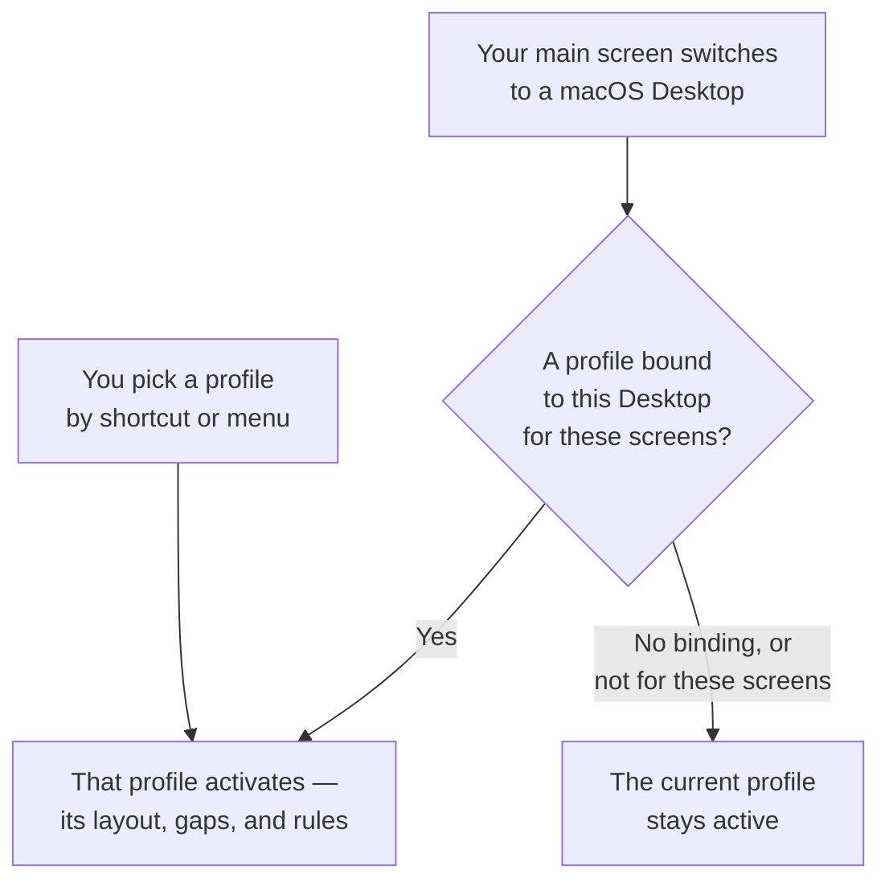

# User Guide: The Settings App

The Settings window explains its own rows: a label, often a
caption, and on some rows a `?` with a longer note. This guide
covers what those cannot say — how things interact, where a
setting lives, why a move was refused, and the files behind it.

Open Settings from the KiwiDesk menu in the menu bar, or press
**⌘,** while a KiwiDesk window is key. **Shortcuts ▸ General**
offers a rebindable **Open Settings** row for a global key.

That row ships on **`⌃⌥,`**, a [default
shortcut](#default-shortcuts), so Settings opens from anywhere.

The Settings window tiles into your layout like any other window
and answers the window shortcuts (float it with
`toggle_floating`, move it between spaces).

## Using Settings from the Keyboard

Out of the box, macOS lets **Tab reach text fields and lists
only**. Turn on **System Settings ▸ Keyboard ▸ Keyboard
navigation** and Tab reaches every control.

Opening an area from the keyboard puts focus on the page, so the
next Tab reaches its first control; opening it with the mouse
takes no focus, as anywhere on macOS. Shift-Tab reaches the
**← Home** chip; **⌘[** or Escape goes back. **⌘K** puts the
cursor in the search field from anywhere in the window.

With keyboard navigation off, a control that cannot hold focus
hands it to the search field instead. VoiceOver is unaffected,
and every card and panel title is a heading for its rotor.

- A slider takes focus and the arrow keys step it, in the
  readout's own step.
- A segmented control is one Tab stop; ← / → move the choice.
- Where a row has right-click moves (rename, export or delete a
  palette; reorder spaces), press **⌃.** (**Control-Period**) on
  the focused row for the same menu.

## The Status Bar Quick Menu

A layout switched from the menu bar's **Layout** submenu is
**session-only**: it does not rewrite the profile, and the menu
shows a "not saved to profile" subtitle while it drifts. **Keep
Layout in Profile "‹name›"** writes what is on screen, every
screen at once, into the active profile — the layouts, not a
keyboard or mouse resize, which is session-only. A Settings
Save does not
touch a temporary layout, which stays on screen through it; the
one exception is a Space whose layout you changed in **Settings
→ Spaces**, which wins on Save.

With more than one screen the submenu nests: **All Screens**
first, then a row per screen in desk order. A layout belongs to
a Space, so a screen's row sets the layout of whatever Space is
showing there.

KiwiDesk checks for updates on its own in the background, and a
found update shows as a dot on the menu-bar icon and an
**Update Available…** row, never a pop-up.

The quick menu has no check row of its own: ask for a check
from the foot of Settings Home, which also says when KiwiDesk
last checked.

**If you installed with Homebrew**, KiwiDesk keeps itself up to
date and `brew upgrade` steps aside; to move an older copy onto a
version that can do this, run `brew upgrade --cask kiwidesk`
once.

## How the App and init.lua Coexist

KiwiDesk keeps your custom Lua in `~/.config/KiwiDesk/init.lua`
and never edits it. Settings stores its own configuration in
`~/.config/KiwiDesk/gui.json` (global) and one JSON file per
saved profile.

- Saving in Settings never rewrites `init.lua`.
- Custom Lua that is not app rules, float rules, ignore rules,
  keybindings or profile bindings lives alongside the visual
  editor; a blue banner reads "Custom Lua detected".
- If `init.lua` declares managed vocabulary (`app_rules`,
  `float_rules`, `ignore_rules`, `KiwiDesk.bind`, keybinding
  definitions), Settings shows a raw Lua editor instead. **Adopt
  into the GUI** imports them, comments the migrated settings out
  as a backup, and keeps your custom Lua (event hooks such as the
  sketchybar bridge) live.

Once `gui.json` exists, the visual editor owns tiling, and
hand-written `set_gap_global` calls stop applying on monitor
changes; persist custom tiling as a profile.

**First launch with an existing `init.lua`:** the default
`gui.json` is seeded as long as `init.lua` declares no managed
settings, so a file of event hooks boots GUI-managed. An
`init.lua` that sets tiling itself (`KiwiDesk.set_*`, rules, or
keybindings) stays Lua-owned, and **Adopt into the GUI** is
offered instead.

## Start KiwiDesk

**Start at login** (**General**) reads and writes the real macOS
login item. Crash supervision is command-line only:
`kiwidesk service start` installs a helper that relaunches
KiwiDesk after a crash, never after a deliberate Quit ([CLI
reference](cli.md)). While that service runs, **Start at login**
shows as on and stops being editable; `kiwidesk service stop`
gives the switch back.

## Moving to Another Mac: Backups

**General ▸ Advanced ▸ Export KiwiDesk Backup…** writes one file
with your settings, every profile and your saved palettes;
**Restore from Backup…** puts it back. Not included: `init.lua`
and the remembered window arrangement. KiwiDesk keeps no backups
of its own; for continuous sync see [The gui.json
File](#the-guijson-file).

Restoring **replaces**, it does not merge, and what it replaces
goes to the **Trash**. On the way, the remembered window
arrangement on that Mac is forgotten, and KiwiDesk picks the
profile matching the screens connected *here* (a Desktop binding
still wins). Refused: a file that is not a KiwiDesk backup, one
from a **newer** KiwiDesk, one that would restore nothing, and
one carrying settings when this Mac's settings come from
`init.lua` (profiles and palettes alone restore there). A
restore that skips a profile or a palette says so.

## The gui.json File

`~/.config/KiwiDesk/gui.json` holds the global base
configuration. On a fresh install it is created at first launch
with the [default shortcuts](#default-shortcuts); on a
hand-written setup, the first time you Save in Settings.

> **Keeping multiple Macs in sync.** Symlink `~/.config/KiwiDesk`
> into an iCloud Drive or Dropbox folder. Machine-specific state
> does not travel: grant Accessibility on each Mac, and expect
> display layout and macOS Desktops to resolve against what is
> connected there.

```json
{
  "spaces": [ "1", "2", "mail" ],
  "app_rules": { "com.spotify.client": "music" },
  "float_rules": [ "com.apple.calculator" ],
  "ignore_rules": [ "eu.exelban.Stats" ],
  "profile_bindings": {
    "9C1F2A44-3B0E-4E7D-9A21-6D5C8B7E0143": {
      "profiles": [ "Developer" ], "desktop": 1
    }
  },
  "layers": [
    { "name": "default", "bindings": [...] }
  ]
}
```

- **`spaces`**: space ids (strings), in order.
- **`app_rules`**: app **bundle identifier** → space id.
- **`float_rules`**: bundle identifiers (optionally
  `bundle-id:title`) whose windows never tile.
- **`ignore_rules`**: bundle identifiers never tracked. No
  Settings control; Settings preserves it on save.
- **`profile_bindings`**: Desktop identifier → what that Desktop
  selects on your main screen. The key is the identifier
  KiwiDesk stamps into the Desktop itself, not its Mission
  Control number; the number sits in `desktop` as a label. On a
  Mac where the stamp cannot be written, the key is the number. A
  file in the older `{ "1": "Developer" }` shape is rewritten once
  on load. See [A binding follows its Desktop, not
  its number](spaces-and-desktops.md#a-binding-follows-its-desktop-not-its-number).
- **`layers`**: keybinding layers, only one active at a time.
  Each has a **`name`** ("default" for the main set), an optional
  **`icon`** (SF Symbol name or emoji), and **`bindings`**: rows
  of **`combo`** (e.g. `"cmd+alt+left"`), **`lua`** (the body
  inside `function() ... end`), **`kind`** ("navigation",
  "application", or "custom") and **`label`**.

A `profile_bindings` entry names its profiles as a list,
`profiles`, one per screen count, each for all screen setups — a
file with the older single `profile` is rewritten once on load —
and may also carry `screen`, the name of the screen its Desktop
was last seen on.

An item of `profiles` may instead be an object that binds its
profile for one screen setup, naming every screen by its
fingerprint as `list_monitors` prints it:
`{ "profile": "Studio", "setup": [ "Built-in Retina Display:1512x982", "LG UltraFine:2560x1440" ] }`.
A bare name binds for all screen setups.

A hand-edited `layers` list is normalized on load: empty names
are dropped, a duplicated name keeps its first entry, `default`
always exists and sits first, and an `icon` on `default` is
removed.

> This key was called `"modes"` in earlier pre-release builds. A
> file still using the old name loads as *no shortcuts at all*
> and the next Save writes that emptiness back, so run this
> **before** opening Settings:
>
> ```bash
> sed -i '' 's/"modes"/"layers"/' ~/.config/KiwiDesk/gui.json
> ```
>
> Repeat it for any file in `~/.config/KiwiDesk/profiles/` with a
> keybinding override, and rename `KiwiDesk.define_mode` and
> `switch_mode` in a hand-written `init.lua`. Or **Reset all
> settings…** trashes `gui.json` and reseeds the defaults.

To reset the app to what `init.lua` declares, delete `gui.json`.
Do not import one from an untrusted source: custom Lua in
keybindings runs on every reload.

## What Lives Where: Global vs Per-Profile

- **`gui.json` (global)**, shared by every profile: the base
  keyboard shortcuts, app rules, float rules, ignore rules, and
  Desktop → profile bindings.
- **Each profile's JSON**, applied only while that profile is
  active: which spaces exist and their order, layout mode, gaps
  and per-layout / per-space tuning, space-to-monitor pins, the
  Main role and the fallback space.

The General section leaves the grid while you edit a stored
profile without switching to it.

**Two hybrids.** Shortcuts and app rules are global, but a profile
can carry a sparse override of its own: shortcuts can add or
change specific bindings ([Shortcut Layers](#shortcut-layers)),
and app rules can pin an app to a different space or un-pin it
([Per-Profile Space Assignments](#per-profile-space-assignments)).
When profiles share a space name, one base rule is enough; when
their space sets are disjoint (Work `{1, 2, 3}` vs Home `{media,
games}`), give each profile its own override.

## Layout Defaults

### Per-Layout Tuning

What the fields' own notes do not say:

- **Stack** — the resize shortcuts are focus-aware: the split
  axis grows whichever zone holds the focus, the zone's own axis
  grows the focused window's share, and that share is
  session-only. A master zone lined up *along* the split axis has
  no reachable shares, which is the out-of-the-box case once the
  master count exceeds one; switch the orientation to vertical
  for individually resizable masters ([Accepted
  limitations](accepted-limitations.md)).
- **Scrolling** — its focus animation and duration live here,
  not in Colors & Animations.
- **Track** — the track shortcuts sit in Shortcuts ▸ Move
  windows. Previous is the column to the left (or the row
  above), next the column to the right (or the row below),
  whichever way the axis runs.
  Track sizes and in-track shares are session-only.

The track shortcuts sit behind "Move windows in the track
layout", open from the start once you have a Track Space or a
track shortcut bound.

- **Floating** — switching a space to Floating with any window
  partly or fully off the screen (a scrolled-out column, a
  parked Monocle window) or piled behind another (a Monocle
  stack) arranges the space's windows in the grid **Behavior ▸
  On quit** uses; with everything already reachable, nothing
  moves.

**Monocle** — a focus change flips a card from one app's icon
to the next over a blur; the flip and its duration live here
too, not in Colors & Animations.

> **A few resize behaviors are accepted limitations, not bugs** —
> the inner window of a nested BSP pair not growing, or the shares
> of masters lined up along the split not moving. See
> [Accepted limitations](accepted-limitations.md).

### Per-Space Overrides

A space's override editor (from its **Customize…** cell in
Spaces) edits the layout the space currently uses. Each row's
**Override** checkbox, unchecked, inherits the Layout Defaults
value; checked, the control appears seeded with the current
value. A field greyed by a switch on another page (Grid's
auto-size, Track's auto limit) says so and links Layout
Defaults.

Changing a space's layout never deletes overrides; each layout
keeps its own, and a **Saved for _N_ other layouts** card at the
foot lists them. **Reset All Layout Overrides** there clears
every layout's, after a confirmation.

## Monitors

Drag a space chip onto a display to pin it there; drag it onto
the dashed **Follows main display** tray to give it the **Main
role**, which moves with whichever display is main when you dock
and undock. Outlined chips are placed automatically; a filled
chip is yours. Every chip is also a menu, which is the keyboard
route ([Using Settings from the
Keyboard](#using-settings-from-the-keyboard)).

KiwiDesk recognises a display by name and resolution, so two of
the same model at the same resolution are one identity and a
space pinned to one may open on either. A space pinned to an
absent monitor gets its own card below the picture with **Back
to automatic placement**.

The **focused monitor** is the one you last clicked — a window or
the bare wallpaper. A new window, and a global sticky window,
appear on that monitor's space. Clicking the menu bar or the Dock
does not move focus.

Opening an app whose [app rule](#app-rules) names a space on
another monitor moves the focus there with its window.

## Gaps & Borders

### Shared by all borders

**Width** and **Corners** at the top set the focus ring, the
drag ghost and the drop zone together. Keep gaps at least twice
the width so two neighbouring rings do not touch. Each stroke's
own width, each overlay's alignment and the drag radius are
Lua-only and never clamped against each other; [design
decisions](design-decisions.md) has why the GUI offers no switch,
the [Lua reference](lua-reference.md) the verbs. A radius set
from Lua shows as **Rounded** and keeps its value; if the ring
and the overlays disagree, neither segment is selected.

### Focus Border

The ring's colours are in **Advanced Colors ▸ Border colors**,
dimmed while the matching switch here is off.

**What gets no border.** Launcher and panel overlays (Spotlight,
Raycast, Alfred): never managed, never in a bar. Windows in
native (green-button) fullscreen: macOS moves such a window off
the Desktop, so the bars hide there, no layout pass or focus
raise targets it, and its space tiles as if it were away; it
keeps its slot and tiles back when it leaves fullscreen.

**The pills.** Focusing or swapping toward an edge with no window
there bounces the ring; the window never moves. A refused resize
bounces and shows a frosted pill:

- *Minimum window size reached* — the window can shrink no
  further than the configured minimum.
- *Neighboring window at its minimum size* — growing stopped
  where a neighbour would drop below its minimum; the neighbour
  marks itself.

  It also shows once, without a press, when a window arriving in
  a split cannot fit beside a neighbour already at its minimum.

- On a scrolling space, growing stops at a maximum the app
  enforces (System Settings will not grow past its own width).

Where the limit is the **app's own** — a minimum or maximum the
app enforces, which KiwiDesk learns — the pill says so instead:
*This app won't go smaller*, *Neighboring app won't go smaller*,
*This app won't go bigger*. Lowering the configured minimum does
not move those.

Running out of screen is a silent stop. Under a held resize
shortcut, a refusal shows its pill once and ends the glide.

Floating windows join directional focus as a second tier: when
no tiled window lies in the pressed direction, focus reaches a
floating window that way.

### Drag Visuals

Releasing a dragged window over another's slot on the same
display swaps the two. Dragging onto another display moves it
there, live: once the cursor settles on the other display, its
windows slide apart to open a slot, and pulling the cursor back
moves the window home. Releasing outside every slot on your own
display snaps the window back. Floating windows show no overlay
and cannot be dropped onto a tiled slot; use *make tiled* first
([Accepted limitations](accepted-limitations.md)).

### Sticky Windows

A **sticky** window stays visible on every space. Two scopes,
both shortcuts under Size & float (stickiness is per window;
there is no app-rule list):

- **Toggle sticky everywhere** — every space of every monitor
  (∞ mark).
- **Toggle sticky on this screen** — every space of the one
  monitor it lives on (📌 mark). Moving it to a space on another
  monitor re-homes it there.

Moving a ∞ window anywhere, or a 📌 window to another space on
the same monitor, is refused with a brief pill. On a single
monitor the two are identical. The flag survives closing and
reopening the window and is independent of floating: a floating
sticky window keeps its frame everywhere; a tiled one tiles into
every space's layout near where it sits on its home space, keeps
a fully visible slot on a crowded space, and can be reordered or
mouse-resized only on its home space — elsewhere the gesture
snaps back and the mark expands into a pill naming the home
space. The same pill appears when you drag another window onto
its slot.

Where macOS supports it, sticky reaches across **macOS
Desktops**: switch Desktops and sticky windows come along with
the screen they are on. **Stay visible across Desktops** (beside
the mark toggle) switches it and appears only on a macOS that can
drive Desktops; `override_sticky_reach` in Lua pins a single
window the other way. Mission Control shows a sticky window on
one Desktop at a time.

A ∞ window follows the space you focus onto its screen; when
that space is a floating-mode space on another screen, KiwiDesk
moves the window there at its last size, scaled to the screen.

The refusal pills ride the sticky **mark**: with **Show mark on
sticky windows** off, a refused move fails silently. The Space
Bar's badge shows *which* windows are sticky either way. (Lua:
`sticky.set_mark`, `space_bar.set_sticky_badge`,
[`sticky.set_color`](lua-reference.md#stickyset_color),
[`floating.set_color`](lua-reference.md#floatingset_color).)

## KiwiShelf & Bars

**Thickness** runs 20–80 pt on the **KiwiShelf** card; Lua
([`kiwishelf.set_thickness`](lua-reference.md#kiwishelfset_thickness))
takes any value from 20 up.

### App Bar

The App Bar renders only in **Monocle** and **Scrolling**, and
its card has no on/off row.

The KiwiShelf card's **App Bar in Monocle** and **App Bar in
Scrolling** switches are its visibility.

Drag an item to reorder the windows; a grouped item expands into
its members on click. Styling it differently per layout is
Lua-only: every `app_bar.*` field has a `monocle.set_app_bar_*` /
`scroll.set_app_bar_*` twin ([Per-layout App Bar
overrides](lua-reference.md#per-layout-app-bar-overrides)).

**Liquid Glass** is one switch for both bars, the shortcuts
panel, the drag ghost and drop zone, and the sticky mark
(**Colours & Animations**); on macOS before 26 each draws its
flat look instead.

On by default, on every surface. While macOS's **Reduce
transparency** (System Settings ▸ Accessibility ▸ Display) is on,
each surface draws its look without glass — the bars their Boxed
or Plain shape with the Fill fully opaque — and the switch stays
as you set it.

### Space Bar

One bar per display, listing that display's Spaces in profile
order. Click a Space to switch to it; the glyphs are
informational.

While a shortcut layer other than `default` is active, its icon
— or two letters of its name when it has none — leads the bar,
ahead of the Spaces ([Shortcut Layers](#shortcut-layers)).

With the bar off, the menu bar icon takes its place: the Space
each screen is showing — its icon, or its name where it has
none — with the active layer's icon ahead of them, and the
KiwiDesk logo, or the layer's icon, back as soon as the bar is
on again.

The bar shows the Desktop you are looking at: a window on a macOS
Desktop you are not looking at is not listed, and *Hide empty
Spaces* hides a Space holding only those. *Open or Focus* still
reaches such a window and switches Desktops to it.

A sticky window's glyph is listed under one Space only, the one
it *renders* on: a ∞ window under the Space you are focused on,
a 📌 window under the current Space of its own screen.

| Mark | Where it sits | Means |
| --- | --- | --- |
| ∞ mark | On the window, top-right corner | **Global sticky** — every Space of every monitor |
| 📌 mark | On the window, top-right corner | **Display sticky** — every Space of the one monitor it lives on |
| Badge, glyph's **top-left** | Space Bar | That window (or one in the group) is **sticky** |
| Badge, glyph's **bottom-left** | Space Bar | That window is **floating** |
| `+n` / count badge, glyph's **top-right** | Space Bar | How many windows a grouped glyph holds |

Floating has no on-window mark. The badges have no Settings
toggle; Lua hides them with `space_bar.set_sticky_badge(false)`.

**Drag a window onto a Space** to move it there:

- **Flick and drop** — release before the ring fills; the window
  jumps there and you stay.
- **Hold to place** — pause for the **Spring delay**; the view
  springs to that Space with the window in its live layout, so
  you can drop it exactly where you want. Move the cursor off
  the item before the ring completes to cancel. Under **Reduce
  Motion** the ring does not sweep: it stays away for the first
  half-second, then appears whole for the rest of the hold.

Dropping onto the Space a window is already on does nothing.

While dragging, hold over a bar's faded end to autoscroll a bar
that overflows.

## Behavior

### Wake & Restart

Lua-only (`enable_wake_restore`, `set_wake_restore_delay` in the
[Lua reference](lua-reference.md)): after sleep or screen unlock,
KiwiDesk restores the arrangement captured when the Mac went to
rest (on by default, after a 1500 ms delay) and puts focus back
on the window you were in. A wake restore is skipped when the
display set changed during sleep; the monitor-change profile
switch takes over. If a restore leaves things wrong, **General ▸
Advanced ▸ Discard Saved Window Arrangement** clears it.

## Profiles

### Which Profile Loads

The card at the top of the Profiles page answers for your
machine now — *"Right now: 2 screens →
Desk (it holds this screen setup)"* — naming which rung resolved
it; its **?** lists the rungs.

The rungs, in order:

1. A **Desktop binding** on the Desktop your main screen is on
   ([macOS Desktops](#macos-desktops-mission-control)), when
   a bound profile is saved for this many screens. With none
   the binding stands aside and the rungs below decide.
2. An **exact monitor match** — these exact displays. It stops
   matching the moment you swap one out, unless you saved a set
   for the new hardware too.
3. The **default for this screen count**, whatever monitors are
   plugged in. The first profile saved for a count becomes its
   default; **make default** moves it.
4. A **built-in Standard** for that screen count, or a line
   saying nothing matches.

A new hardware combination therefore uses the Standard and marks
the profile dirty until you Save on it; a profile saved for two
*different* monitors sorts after your exact matches but before
one-screen profiles.

### The Profile Banner

The dropdown at the top of any section picks what your edits
target. Each profile is listed once: on top what is on screen —
the loaded profile, or the Standard or temporary layout in its
place — then every other profile, under a **For N screens**
heading per screen count when there is more than one.

- **The top row**: saving adopts your changes into the loaded
  profile.
- **Another profile, without switching**: Home becomes
  profile-scoped, the General card leaves the grid, and Save
  writes to that profile's JSON. Each App Rule and shortcut says
  which profiles it applies to.

Saving a profile that isn't loaded leaves the running layout
alone until it next loads, except for an App Rule or shortcut it
shares with the loaded profile ([Per-Profile Space
Assignments](#per-profile-space-assignments)). **Save a copy…**
while editing a stored profile duplicates it with your pending
edits, without touching the running layout.

### Saving

**Save** writes to the current target and adds or refreshes the
connected monitor set; it is greyed when the connected screen
count differs from the profile's. A screen setup the profile has
no set for is itself an unsaved change, listed as a **Screens**
row. On a temporary layout or a built-in Standard the slot reads
**Save as New Profile…**.

Loading a profile saved for this many screens moves the connected
screen setup to it from any other profile, so the next time these
screens connect, it loads. Saving adds the connected screen setup
only when no other profile has it.

While management is **paused** (Accessibility off), KiwiDesk
detects no displays, so any save that captures the live monitor
set is unavailable. Shortcuts, app rules, float and ignore rules,
the space list and Desktop bindings carry no monitor set, so
**Save** still writes `gui.json` for them and keeps counting the
layout edits until you grant access.

Neither live save carries a keybinding override: to give a
profile its own shortcuts, pick it in the banner while it isn't
loaded and edit its Shortcuts section.

### Built-in Standards & Presets

One workflow layout per screen count is the *Standard* that
resolves silently when no saved profile matches; **Starter** is
derived from the screens you have ([Your first
run](#your-first-run)) and is offered for that count alone. Where
a preset does not name a layout for a space, the space takes the
layout its screen suits. Applying a preset saves it as a real,
editable profile; presets cannot be deleted.

## App Rules

**Windows titled…** is a Power User choice in the Float list's
menu. Once any rule uses it, the choice stays listed in Simple as
well.

**The title match is case-sensitive**, and "Info" also catches
"Information"; the live window list under the chips shows what
the rule as written would float. Dialogs, sheets and
picture-in-picture windows float whatever a rule says, as do
windows of apps that remain accessory processes. For an app you
have not installed, `app_rules` in Lua takes bundle identifiers
([Finding a bundle
identifier](lua-reference.md#finding-a-bundle-identifier)).

Apps with **macOS native tabs** (Finder, Terminal, Ghostty) are
one tile per window that follows the active tab. Tabs cannot be
split into separate tiles.

### Ignore Rules (Power Users)

An ignore rule makes KiwiDesk treat every window of an app as
nonexistent — no space assignment, no window events — for HUDs,
menu-bar utilities, and apps that misbehave when AX-tracked.
There is no Settings control: add bundle ids to `ignore_rules =
{ ... }` in `init.lua`, or to the root `ignore_rules` array in
`gui.json` ([ignore_rules](lua-reference.md#ignore_rules)). An
ignore rule also opts a misbehaving tabbed app out.

### Per-Profile Space Assignments

An App Rules row's **Applies to** menu picks the profiles its
rule reaches: **All profiles** keeps the rule in `gui.json`, and
otherwise a ticked profile whose value differs from the shared
one stores it in its own JSON. A new value reaches only the
ticked profiles; the others keep theirs, and the trash removes a
rule.
Removing a shared rule from one profile stores a `null` there.

A profile stores a sparse diff: `app_rules` maps apps to spaces,
while `float_rules` and `ignore_rules` are objects whose `true`
entries add rules and `null` entries remove inherited ones:

```json
{
  "app_rules": { "com.apple.mail": null },
  "float_rules": {
    "com.apple.calculator": null,
    "com.apple.finder:Get Info": true
  },
  "ignore_rules": {
    "eu.exelban.Stats": true,
    "com.example.inherited": null
  }
}
```

An absent entry inherits. Effective Ignore applies last as the
hard gate. Ignore has no GUI control; Settings preserves the
hidden object across saves, copies and renames.

## Shortcuts

Every shortcut lives in a **layer**; only the active layer's
bindings fire. ("Layer", not "mode": *mode* names a space's
layout.)

> **Upgrading and every shortcut is gone?** See [The gui.json
> File](#the-guijson-file) for the `"modes"` → `"layers"` fix,
> before opening Settings.

### Your first run

A fresh install seeds a setup chosen for the screens you have.
**Every screen opens in scrolling**, except the smallest, which
opens in monocle. The slot is just under half the screen; on an
ultrawide main screen it is 30%, a profile-wide value read from
the main screen.

| Your screen | Gets, best first |
| --- | --- |
| Laptop (under 1900 pt wide) | scrolling · monocle |
| 2K / 4K desktop (1900–3000 pt) | grid · stack · bsp · scrolling |
| Ultrawide (3000 pt +, or wider than 2.1:1) | track · grid · stack |
| Pivoted (taller than wide) | stack · grid · monocle |

Screens are measured in points, so a 5K 27" and a 1440p 27" get
the same answer. Every setup gets exactly one Floating space, on
the largest screen. The total is 3 spaces for one screen, 5 for
two, 7 for three, then 8, 9 and one more per screen up to ten,
each screen's share proportional to its width. "Smallest" is
read from width alone, so a 27" beside an ultrawide opens in
monocle.

The tuning follows the main screen: a laptop main gets 6 pt
gaps, an ultrawide two stack masters and a larger minimum window
size, a pivoted one the stack at the bottom and scrolling
vertical.

While you are still on the Starter layout, connecting or removing
a monitor re-derives it and the `⌃⌥N` space shortcuts extend to
new spaces (up to ten). It is saved as an ordinary profile named
**Starter**, and the same setup is always available as the
**Starter** preset.

### Default Shortcuts

| Action | Shortcut |
| --- | --- |
| Focus window left / down / up / right | `⌃⌥←` `⌃⌥↓` `⌃⌥↑` `⌃⌥→` |
| Go to space | `⌃⌥1` … `⌃⌥9`, then `⌃⌥0` for the tenth |
| Move to space | `⌃⌥⇧1` … `⌃⌥⇧9`, `⌃⌥⇧0` |
| Swap with window left / down / up / right | `⌃⌥⌘←` `⌃⌥⌘↓` `⌃⌥⌘↑` `⌃⌥⌘→` |
| Move to space and follow | `⌃⌥⌘1` … `⌃⌥⌘9`, `⌃⌥⌘0` |
| Grow / Shrink width | `⌥⌘2` / `⌥⌘1` |
| Grow / Shrink height | `⌥⌘5` / `⌥⌘4` |
| Toggle floating | `⌃⌥F` |
| Toggle sticky everywhere | `⌃⌥S` |
| Toggle sticky on this screen | `⌃⌥P` |
| Show shortcuts panel | `⌃⌥K` |

**Open Settings** ships on `⌃⌥,` as well.

`⌃⌥` moves your focus, `⇧` sends the window to a space, `⌘`
swaps it or sends it and follows; resizing has its own layer,
`⌥⌘`. Each space digit is bound *by name* and follows a rename;
spaces past the tenth ship without a digit. The set is seeded
only while no shortcut is bound anywhere, and an install that
already has shortcuts picks up a later default through **Restore
Defaults…**, which keeps the shortcuts you made yourself except
one sitting on a key a default needs; the confirmation counts
those.

### Choosing Your Own Shortcuts

Three things can claim a chord, and they do not lose it the same
way:

- **macOS** wins outright: when a combo is one of its switched-on
  shortcuts, the row never fires.
- **KiwiDesk** wins against an app's menu shortcut; the app loses
  the accelerator but keeps the menu item. A shortcut with no
  menu behind it (`⌥⌘` arrows are next/previous tab in most
  browsers and terminals) costs the capability outright.

`⌃⌥` is the quiet corner macOS and most apps leave alone. `⌥`
alone types characters that vary by layout (`⌥L` is `¬` on a US
keyboard, `@` on a German one); adding `⌃` or `⌘` stops that.
Arrows and digits keep their place on every layout; letters do
not.

### Conflict Detection

The ⚠️ on a row means it duplicates another row in the same
layer or collides with a macOS shortcut. **Those two are the
whole of it**: KiwiDesk cannot see what other apps have bound, so
the safest test of a chord is to bind it and open the app you
would miss it in. A collision with a switched-off macOS shortcut
(Zoom, Invert Colors) keeps the ⚠️ but does not count toward the
banner. A collision with a shortcut every app carries (⌘W, ⌘Q,
⌘H, ⌘M) means your row works and every app loses that item while
it is bound.

The recorder **suspends your KiwiDesk shortcuts while it is
open**, so a combo already bound to a window action can be
tested. With the banner's top row picked, a recording, a clear
or a deleted row takes effect at once, before Save; Revert
restores the saved ones, also live.

### Keyboard Modifiers & Keys

The spelling a stored combo uses (`gui.json`, Lua):

**Modifiers**: `cmd`/`command`, `alt`/`opt`/`option`,
`ctrl`/`control`, `shift`.

**Keys**: letters (a–z), digits (0–9), arrows, `home`, `end`,
`pageup`, `pagedown`, `space`, `return`, `tab`, `escape`,
`f1`–`f12`, and punctuation by symbol or name:
`;`/`semicolon`, `,`/`comma`, `.`/`period`, `/`/`slash`,
`\`/`backslash`, `-`/`minus`, `=`/`equal`, `[`/`leftbracket`,
`]`/`rightbracket`, `` ` ``/`grave`/`backtick`,
`'`/`quote`/`apostrophe`.

The numeric keypad's digits are the same keys as the number row.
Its other keys are separate: `keypadplus`, `keypadminus`,
`keypadmultiply`, `keypaddivide`, `keypaddecimal`,
`keypadequals`, `keypadenter`, `keypadclear`. A third-party PC
keypad sends digits only while Num Lock is on.

A combo is one set of modifiers plus exactly one key; multi-key
chords like `cmd+j+k` are not supported — use layers. KiwiDesk
binds the physical key, so switching input sources changes what
the caps print, not which key fires.

### Actions

- **macOS Desktop rows** (under Focus and Move windows) are one
  per Desktop you have, on every screen, and ship unbound. They
  appear only where macOS exposes the window-management bridge
  ([macOS Desktops](#macos-desktops-mission-control)). A bound
  row whose Desktop leaves with its screen stays in place,
  dimmed, and works again when the screen is back; a Desktop
  shortcut for an absent Desktop does nothing, while a Space
  shortcut for an absent Space still works: it recreates the
  Space and switches to it. Each row sends the window to the Desktop and nothing
  more; naming the Space it lands in is a Lua/CLI argument,
  `move_to_desktop(3, "mail")` ([Lua
  reference](lua-reference.md#move_to_desktop)).
- **Resize** — a window outside tiling (floated by you, or in a
  Floating space) resizes its own frame in any layout. Held, a
  resize shortcut glides: the first press is one step; after
  your Mac's key-repeat delay the window resizes smoothly, faster
  over the next couple of seconds, scaled to your resize step.
  Only resize glides. A floating window grows around its centre;
  an edge against the screen edge or a bar stays put and the
  whole step goes to the other side. Floats are held clear of a
  bar and the screen edge by the focus ring's width.
- **Applications** — *Open or Focus* pulls a running instance
  into the current space, or launches it; pressing again while
  its window is focused cycles the app's other windows, other
  Desktops included; with nothing open anywhere it restores one
  minimized window. Add the same app twice to bind one shortcut
  per behaviour.

### Import & Adopt

If `init.lua` holds custom keybindings, **Import from
init.lua…** (in the Shortcuts header) reads them for review before
you Save; each binding must be an inline `function() … end` on
one line. **Adopt into the GUI** imports the whole file's managed
settings and keeps your custom Lua live.

### Shortcut Layers

The **+** beside the layer chips defines a layer: a name, an
optional icon, and bindings that shadow the base
shortcuts while it is active. Every layer gets its own `⌃⌥K`
row. Switch layers with `KiwiDesk.switch_layer` ([Lua
reference](lua-reference.md)).

Each binding's **Applies to** says which profiles use it: **All
profiles**, or the profiles ticked. **Remove from** one profile
turns a shared shortcut off there and keeps it everywhere else,
and a profile can put a shared shortcut on another key of its
own. Ticking a profile that uses the key for something else
gives the key to this shortcut there.

A new layer also carries the `⌃⌥,` Open Settings row.

## macOS Desktops (Mission Control)

**Profiles ▸ Profiles per macOS Desktop** lists the Desktops on
your **main screen** by their Mission Control number, counted
across every screen, so they need not start at 1. A Desktop you
bound that is not on your main screen carries a **not on main
screen** badge and cannot fire until a screen change makes it
the main screen's; a Desktop that is not there at all carries
**not present** ([Accepted
limitations](accepted-limitations.md)). A binding stays on the
Desktop you gave it when Mission Control renumbers — [A binding
follows its Desktop, not its
number](spaces-and-desktops.md#a-binding-follows-its-desktop-not-its-number).

Under a row, the screen its Desktop is on — for a *not present*
row, the screen it was last seen on.

With profiles saved for more than one screen count, the card
groups its rows by count, and a pick in a group binds a profile
for that count alone ([a binding fires only for its profile's
screen
count](spaces-and-desktops.md#the-main-screen-chooses-the-profile)).
A bound name no saved profile carries sits in a last *Couldn't
load* group; None clears it.

**A binding fires when its Desktop becomes current on your main
screen** (the one with the menu bar) and it holds a profile saved
for your screen count ([Which Profile Loads](#which-profile-loads)). With
"Displays have separate Spaces" on, macOS's default, each screen
switches on its own: a swipe on the main screen switches
profiles, a swipe on a secondary never does.

A Save while editing a stored profile keeps a binding change too.



A hand-written config declares bindings in `init.lua` with
`bind_profile_to_desktop`. Each Desktop remembers which space it
was on, on every screen, and your main screen's Desktops remember
which window you had focused. A window that takes more than a few
seconds to come back keeps whatever macOS focused ([Accepted
limitations](accepted-limitations.md)).

Where macOS exposes its window-management bridge (present on
macOS 26.6.1, checked 2026-08-18), KiwiDesk can also **drive**
Desktops: `focus_desktop(n)`, `move_to_desktop(n)` and
`move_to_desktop_and_follow(n)` ([Lua
reference](lua-reference.md#focus_desktop)). Where it is absent
the commands do nothing and log why; KiwiDesk never asks you to
turn SIP off.

## Getting Help

For Lua configuration, see [lua-reference.md](lua-reference.md);
for integration recipes (sketchybar, external commands, …),
[recipes](recipes/index.md); for the CLI, [cli.md](cli.md).

To check your current state in raw form:
```
kiwidesk get_state
kiwidesk get_profile_status
```

To reload your config after editing `init.lua` by hand:
```
kiwidesk reload_config
```

## Troubleshooting

**Accessibility permission missing?**  
Window management pauses: the menu bar icon shows a warning
triangle and the quick menu's **Window Management Paused…** row
reopens the permission tour. Add KiwiDesk under System Settings ›
Privacy & Security › Accessibility; management resumes on its
own.

**Settings window won't open, or KiwiDesk seems stuck?**  
Run `kiwidesk service restart` in a terminal, or quit and reopen
KiwiDesk. Launching KiwiDesk while a copy is already running
never starts a second one: the second launch brings the running
instance forward and exits with `already running`.

**Windows come back in the wrong spaces after a restart or wake?**  
**General ▸ Advanced ▸ Discard Saved Window Arrangement** clears
the remembered arrangement without changing settings. **Reset
All Settings…** below it is the last resort: it deletes every
profile, your spaces, layouts and keybindings and reseeds the
defaults, keeping `init.lua`, your palettes, the display language,
the login item and onboarding; the old files go to the Trash.

**Reporting a bug?**  
**General ▸ Advanced ▸ Export Log…** saves KiwiDesk's log for a
time range to a file. Make the problem happen again first: the
range counts back from now, and "since KiwiDesk started" means
this run. The file names the apps and windows KiwiDesk managed,
so glance through it before attaching it. The terminal form is in
the [CLI reference](cli.md#exporting-the-log).

**Shortcut not working?**  
Check Shortcuts for a ⚠️ marker ([Conflict
Detection](#conflict-detection)). If you hand-edited, run
`kiwidesk reload_config`.

**Typo in init.lua?**  
A misspelled function name (`scroll.set_width` for
`scroll.set_slot_size`) does not abort the config: the call is
skipped with a did-you-mean hint and the rest still runs. Every
typo is listed under menu bar › Config Issues….

**Windows aren't tiling?**  
Ensure the space's layout is not Floating and the app is not in
float_rules. On a hand-written config, make sure `init.lua`
exists and the app is managing tiling (check the banner).

**Profile not loading after monitor change?**  
See [Which Profile Loads](#which-profile-loads): a new hardware
combination uses the built-in Standard until you Save on it.
