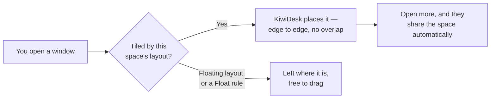
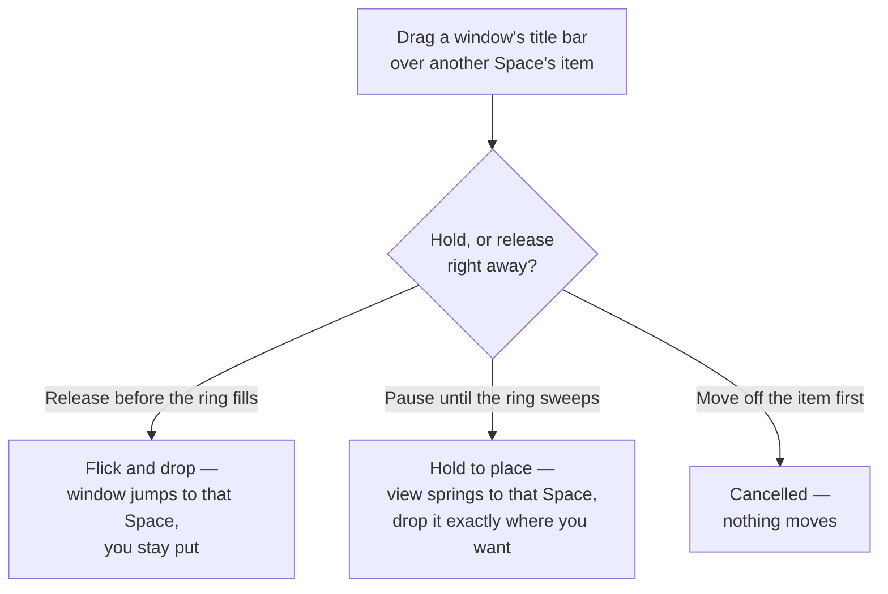
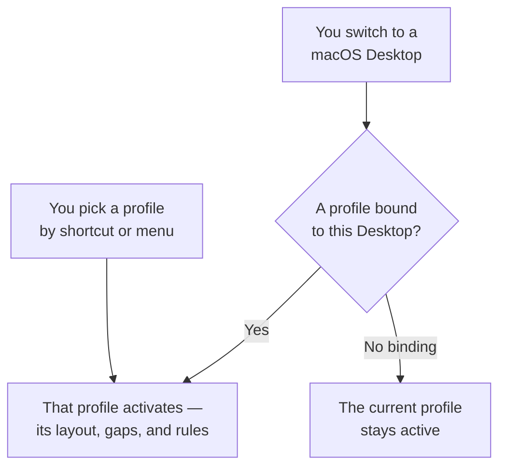

# User Guide: The Settings App

This guide walks you through KiwiDesk's visual Settings window —
the point-and-click interface for all window tiling, monitors,
spaces, and keybindings. You never need to edit files directly
unless you want custom Lua.

The short version of what happens every time you open a window:



Everything below is how you shape that behavior — which layout a
space uses, the gaps, the bars, and the shortcuts.

## Getting Started

Open Settings from the KiwiDesk menu in the menu bar, or press
**⌘,** while KiwiDesk is the active app. You can also give it a
global key of its own: **Shortcuts ▸ General** offers a
bindable **Open Settings** row, unbound out of the box.

The Settings window is a normal window to KiwiDesk itself: it
**tiles into your layout** like anything else, shows up in the
App Bar, and answers the window shortcuts — float it with
`toggle_floating`, move it between spaces, resize it. KiwiDesk's
other windows are not managed that way: the setup tour and the
Config Issues window always float, because each one ends, and
the shortcuts reference panel is not a managed window at all,
which is why it appears in no bar.

The window opens on **Home** — a grid of cards, one per
settings area, in two groups:

- **This Profile** — areas scoped to the profile being edited
  (Spaces, Gaps & Borders, Bars, Colors & Motion,
  and in Power User mode Layout Defaults, Monitors, Behavior,
  Advanced Colors).
- **Whole App** — settings that apply everywhere (Shortcuts,
  Profiles, App Rules, General).

Every card shows its area's current values — spaces and
layouts in use, gap and border sizes, how many shortcuts are
bound — so most questions are answered without opening
anything. Click a card to open its area; the **← Home** chip
(or **⌘[** / Escape) brings you back.

The header carries a **Simple | Power User** switch. Simple shows
the eight everyday cards; Power User adds the deeper four (Layout
Defaults, Monitors, Behavior, Advanced Colors). The switch
only changes which cards exist — nothing behind it stops
working, and the Monitors card joins Simple by itself while
two or more displays are connected. Flipping to Power User
briefly tints what it just added — the same highlight a search
result gets — and the cards only Power User shows keep a soft
green frame, the switch's own colour, so they stay
recognizable after the tint fades; flipping back to Simple
simply fades the extras out.

The header also shows which profile is loaded and lets you
edit a saved profile without switching to it.

Two more pieces of the window's shape recur everywhere below.
While there is anything to act on, a dark **save pill** floats
over the bottom of the content — the count and its target
("3 unsaved changes to Desk"), then **Revert**, **Save a
copy…** and **Save**. Click the count for a popover listing
every change as an old → new row, and click a row to jump
straight to the control that changed. It is not permanent
chrome: it appears with your first edit and disappears once
everything is saved (the verbs are detailed under
[Saving](#saving)). And five areas —
Gaps & Borders, Bars, Colors & Motion, Layout Defaults, and
Shortcuts — open as two columns: their controls on the left, and a **Live
preview** panel on the right that redraws from your draft as
you edit, with a **Changed in this draft** list underneath —
the same old → new rows as the pill count's popover, each
jumping to its control. The pill shifts aside while the panel
has a column of its own, and
areas with nothing to preview take the full width instead.

### Search

The search field sits in the middle of the header and is a real
field: click it and type, or press **⌘K** from anywhere in the
window to put the cursor in it. Matches appear in a list under
the field while you keep typing. Every setting is its own
result — searching "gap" lists each gap you can change, and a
broad word like "color" lists every colour row rather than one
per section. A few common alternate words work too ("padding"
finds the gaps, "autostart" finds the login row), whatever
language the window is in.

Each result leads with the setting's own label, puts the trail
to it in a smaller line underneath, and — when the setting has
one value to state — shows its **current value** on the right.
An area name that matches on its own has no second line. Results from an area that only exists in Power
User mode carry a quiet **Power User** tag: opening one switches
the mode for you and says so in one line under the header —
that's all the switching there is to it. Below the settings, a
short **Made by you** group lists things you've named yourself —
a space, a profile, an app rule — and jumps to where each one
lives.

Clicking a result opens its area, and — where the row has its
own place to land — **takes you to the match**: the pane scrolls
to it and tints it for about a second so your eye lands on it,
and anything that would have hidden it is switched first — a hit
inside one layout's editor opens that layout's tab. Some rows
open their area without scrolling yet; they gain their landing
spot as the control catalog grows. If the match sits **inside** a
collapsed drawer (searching "top" finds the per-edge gap
sliders), the drawer opens on the way so you land on the row
itself; a hit on the drawer's own name ("Per-edge…", "Advanced")
lands on that row, highlighted, ready to open.

Press Escape or the clear button to empty the query — an empty
query is what closes the result list, and picking a result
empties it for you.

Matching ignores case, accents, and hyphens-versus-spaces, so
"grosse" finds "Größe" and "space bar farben" finds
"Space Bar-Farben". It is a plain substring match, not a fuzzy one:
type part of what you see and it will be found, but a typo returns
nothing rather than a confident guess.

### Narrow Windows

Make the Settings window narrow — by dragging its edge, or
because it shares a small screen — and it gives things up in a
fixed order. Controls are never one of them.

The **Live preview** panel goes first. Instead of its own
column it becomes a card floating over the content: drag it by
the grip on its top bar, or close it with the × at that bar's
other end, and it always lands whole inside the window.
Narrower still, the card waits behind a **Show preview** button
rather than opening over the rows unasked — and that button is
there whenever an area that has a preview is not showing one,
so the preview is never simply gone.
Closing the card answers for that screen only: open another
area and you get whatever the width would have given you.

Next, labelled rows put their control on a second line under
its label — all of them at once, so a section still reads as
one column — and the save pill stops floating and docks into a
full-width bar at the foot of the window: the same count, the
same three verbs, and still nothing at all once everything is
saved. Home's card grid steps down to fewer columns on the same
widths.

Last, the search field collapses to its magnifying-glass icon.
Click it — or press **⌘K** — and it opens in place, with the
area's title stepping aside for as long as you are searching
and coming back as soon as you close it. Nothing else in the
header yields, and the window stops resizing before anything
else has to.

### Contextual Help (?)

Some rows carry a small circled question mark right after
their name. Click it to open a short popover explaining what
the setting does — for a field with a few named options, the popover
describes each option in one line. Hovering the question mark
shows the same text as a tooltip.

The help is optional reading: every setting is meant to be
understandable from its label, options, and the preview or
schematic beside it in the preview panel (or above it, in
areas without one). The question mark is there just in case
the short form didn't explain enough.

### Using Settings from the Keyboard

Settings is built to be driven from the keyboard, but macOS gates
that on a system setting KiwiDesk cannot turn on for you. Out of
the box, **Tab reaches text fields and lists only** — pop-up
menus, checkboxes, and buttons are skipped. Turn on **System
Settings ▸ Keyboard ▸ Keyboard navigation** and Tab reaches every
control.

Leave it off and the keyboard paths here still *run*, they just
have nowhere to land: deleting a space moves focus to the next
row's layout picker, and with keyboard navigation off a pop-up
menu cannot hold focus, so it goes to the search field at the top
of the window instead. The same is true of the space chips under
Monitors, and of every other place this guide says a control
takes focus.

VoiceOver is not affected — it navigates every control either
way, because its cursor is its own.

One gap stays open even with keyboard navigation on: where a row
carries extra moves behind a right-click (renaming a palette,
exporting it, deleting it), those moves are offered to VoiceOver
as actions but have no plain-keyboard route, macOS having no
standard key that opens a focused control's contextual menu. A
visible ⋯ button per row was weighed and turned down as clutter.
Use the right-click menu, or VoiceOver's actions rotor.

### Permission & First Run

On first launch, a wizard prompts you to grant Accessibility
permission — KiwiDesk needs it to move and resize windows.
Follow the steps to enable it in System Settings › Privacy &
Security › Accessibility. A row of markers across the top of
every screen shows how far along you are. It counts only the
screens this particular run will show, so it never promises one
you will not see.

When the permission lands, KiwiDesk arranges every window that
was already open — that first retile is the tour telling you it
works. Setup windows like the tour itself are never arranged:
they have an end, so the tiler leaves them alone.

On a busy Mac that takes a few seconds, and the screen says so
rather than claiming to be finished: while it works, the heading
reads **Arranging your windows** and the footer counts the apps
it has been through. **Continue** is live the whole time — the
arranging finishes on its own, whether you wait for it or move
on. When the heading changes to **Your windows are arranged**,
it is done.

The tour then shows the spaces it chose for your screens, and
after that the shortcuts it bound — the chords themselves, laid
out in the window, including the one that opens the shortcut
panel. Teaching them here rather than pointing at the menu bar
is deliberate: it works when the menu bar is auto-hidden, and
nothing opens on top of the tour while you are reading it.

One more screen follows only when two or more displays are
connected with "Displays have separate Spaces" still on: it asks
you to turn that option off. KiwiDesk uses one active profile across
all displays, so Desktops shared across displays make
Desktop-to-profile bindings predictable. This is optional: basic
tiling still works with the option on, and a single display is
never affected. Changing the macOS option requires logging out
and back in.

The closing card confirms KiwiDesk is managing your windows and
shows you where it lives: a small picture of a menu bar with the
KiwiDesk mark in it, so you can find the app once the window
closes. **Start KiwiDesk at login** is there, ticked, to
untick if you would rather start it yourself. **Start using it**
is the only button, and that is the point — Settings is a link
in the quiet line beside it, landing on Layout, and a first-time
tiler does not need it today.

If you grant Accessibility but close the tour before those last
screens, KiwiDesk reopens on the shortcuts screen at the next
launch; once you have reached them, no ordinary launch reopens
it again. Losing Accessibility later is not an ordinary launch:
the tour comes back at its grant step, and continuing from there
walks the same screens again rather than suppressing them on the
grounds that you have seen them once.

If Accessibility permission is ever missing — you dismissed the
wizard, or the permission was revoked later — window management
pauses and KiwiDesk makes it easy to find your way back. The menu
bar icon shows a warning triangle, the quick menu gains a
**Window Management Paused…** row at the top, and the Settings
window shows a banner across every section. Management resumes
automatically once you grant it.

The two routes differ on purpose. The menu bar's row reopens the
wizard at its grant step, which explains what the permission is
for and waits for it; the Settings banner's **Open System
Settings** goes straight to the macOS pane, since the banner has
already said what is wrong to someone who is sitting in Settings.

No row on the page greys out while it is paused. Every control
still edits, so you can prepare a whole setup before granting
anything and have it waiting the moment you do — one switch being
off is not the same as the app being broken. What the pause does
reach is the save verbs that need a live monitor set, described
under [Profiles](#profiles); the rows themselves never.

KiwiDesk runs as a single instance. Launching it while a copy is
already running never starts a second manager (two instances
would fight over your windows and hotkeys): the second launch
brings the running instance forward and exits with a non-zero
status, printing `already running` to the terminal. When a
Finder-launched copy can't surface the running instance, a brief
notice dialog explains the exit instead. A crashed instance never
blocks the next launch; the lock dies with the process.

### The Status Bar Quick Menu

KiwiDesk runs a lightweight menu bar helper for daily controls. Clicking
the KiwiDesk icon opens the quick menu where you can:

- **Layout**: Switch the active space's layout algorithm (BSP, Stack,
  Scrolling, Monocle, Grid, Track, Floating).
  - Switches made through the quick menu are **session-only** (temporary)
    by default and do not rewrite the active profile.
  - When the layout mode has drifted from the profile's saved setting,
    the active layout in the menu displays a secondary
    "not saved to profile" subtitle.
  - Click **Save Current Layout to Profile** below the separator to persist
    the new layout (adopts the whole live state into the active profile).
  - **With more than one screen connected, the list nests one level
    deeper**: **All Screens** first, then a row per screen named
    after that screen, in the order the screens sit on your desk
    (left to right, then top to bottom). Open a screen's row and
    the checkmark inside marks the layout the Space showing there
    is running, so the menu also answers "what is each screen on
    right now" — which previously meant focusing a window on each
    screen in turn and reopening the menu. **All Screens** applies
    your pick everywhere at once, which is what plugging into a
    dock usually wants; it carries no checkmark of its own, because
    "every screen is already running this" is a different claim
    from any one screen's layout — the per-screen rows below it are
    where you read the current state.

    A layout belongs to a **Space**, not to a screen; each screen
    simply has one Space showing on it, so a screen's row sets the
    layout of whatever is showing there. Drift is per Space too, so
    the "not saved to profile" subtitle appears inside each screen's
    own list, on that screen's current layout, rather than once at
    the top.

    With a single screen the list stays flat, exactly as before —
    the extra level would only add a click to the control you reach
    for most. **Save Current Layout to Profile** stays a single
    action on the active Space and the profile as a whole; it is not
    per screen.
- **Switch Profile**: Load any saved profile into the current layout.
  A non-clickable **Profile: ‹name›** line appears above the actions
  naming the profile you are currently on — shown only when there is
  another profile to switch to, so it never adds noise when there is
  no choice to make.
- **View Shortcuts…**: Open a read-only reference of every shortcut
  bound in the currently active layer — see below.
- **Settings…**: Open the full Settings window.
- **Window Management Paused…** (only when Accessibility permission
  is missing): appears at the top of the menu and reopens the
  permission wizard so tiling can resume.
- **Starting up — apps: N of M** (only while KiwiDesk is coming
  up): a live count of how far the startup scan has got, which
  keeps counting while the menu stays open.
  While it shows, the menu-bar mark is drawn dimmed and **Layout**
  and **Switch Profile** are greyed — they act on windows the scan
  has not collected yet and work as soon as it finishes. The mark
  returning to full strength is the signal that KiwiDesk is ready;
  the row and the greys disappear with it.

  On a busy Mac (a hundred or more running apps) this takes a few
  seconds, and the menu opens throughout — one slow app can no
  longer keep the whole desk waiting. An app whose Accessibility
  answers are unusually slow is finished off just after boot, so
  its windows are tiled a beat later than everything else.

### The Shortcuts Reference

**View Shortcuts…** opens a floating, read-only panel that mirrors the
shortcuts bound in the currently active layer — a fast "what can I press
right now" lookup. It is not an editor: it only shows what is already
bound, grouped into four sections:

- **Controls** — window and focus actions (Focus, Move windows, Size &
  float, Switch layers), laid out in two columns.
- **Apps** — your app-launch shortcuts, each with the app's icon. A
  small window-plus badge marks a shortcut set to *Open New* (always
  a fresh instance).
- **Inactive shortcuts** — shortcuts whose target Space has left the
  current list, dimmed and under their own names. They still work
  (pressing one recreates its Space) and come back on their own when
  the Space returns; Settings ▸ Shortcuts shows the same set, where
  you can also rebind or remove them.
- **Custom** — any raw-Lua shortcuts, shown as their Lua source.

The panel has its own **hotkey**: **⌃⌥K** by default (under Settings ▸
Shortcuts ▸ **General**, "Show shortcuts panel" — rebindable or
clearable per layer). That key both opens and closes the panel, and it
appears beside the menu bar's **View Shortcuts…** row and in the
panel's own close hint. Every layer you create gets the same ⌃⌥K row,
so the cheat-sheet is always reachable from the keyboard.

The panel always appears centered on the screen under your pointer and
never remembers a position. Press **Esc**, click anywhere outside it, or
choose **View Shortcuts…** again to close it. Empty sections are hidden;
a layer with nothing bound shows a short placeholder. The panel never
lists its own ⌃⌥K shortcut as a row — the close hint in the footer
already shows it — so a fresh layer, which starts with only that
binding, shows the placeholder too. To change any
shortcut, click **Edit in Settings…** at the bottom — it opens Settings
▸ Shortcuts, the one place bindings are edited. If your configuration is
owned by `init.lua`, the panel says so instead of listing shortcuts.

## How the App and init.lua Coexist

KiwiDesk keeps your custom Lua code in `~/.config/KiwiDesk/init.lua`
and never edits it. The Settings app stores its own configuration
in `~/.config/KiwiDesk/gui.json` (the global settings) and
individual profile JSON files (one per saved layout).

**Key points:**

- Saving in the Settings app never rewrites `init.lua`.
- Custom Lua (print statements, event hooks, or anything that
  isn't app rules, float rules, ignore rules, keybindings, or
  profile bindings) lives safely alongside the visual editor.
- A small blue banner confirms "Custom Lua detected" when the
  app finds your own code.
- If you declare managed vocabulary (`app_rules`,
  `float_rules`, `ignore_rules`, `KiwiDesk.bind`, keybinding
  definitions) *and*
  the Settings app tries to manage them, the app shows a raw Lua
  editor so you can resolve the conflict. You can then click
  **Adopt into the GUI** to import your settings. Adopt comments
  out the migrated settings, rules, and keybindings as a backup
  while keeping your custom Lua — event hooks like the sketchybar
  bridge — **live**, so your integrations keep firing. Or keep
  editing raw Lua.

Once `gui.json` exists, the visual editor owns tiling (gaps, modes,
layout tuning). Hand-written `set_gap_global` calls stop applying
on monitor changes — the built-in layout rules take over instead.
To persist custom tiling, save it as a profile in the Settings app.

**First launch with an existing `init.lua`:** KiwiDesk seeds the
default `gui.json` (with the default profile, spaces, and
shortcuts) as long as your `init.lua` declares no managed
settings. So an `init.lua` that carries only event hooks or other
harmless custom Lua still boots GUI-managed *and* keeps firing your
hooks. Only an `init.lua` that already sets tiling itself
(`KiwiDesk.set_*`, app/float/ignore rules, or keybindings) is left
Lua-owned — no `gui.json` is seeded, and the **Adopt into the GUI**
path is offered instead.

## Start KiwiDesk

Whether KiwiDesk launches itself is **two switches**, not one
control, because the two halves live in two places. The main one,
**Start at login**, sits in **General**'s **Applies immediately**
group (below the language and appearance picks); the supervision
half, **Restart if it stops unexpectedly**, sits first among
**General ▸ Advanced**.

- **Start at login** — off, KiwiDesk never starts on its own; on,
  it launches when you sign in, so your windows are
  arranged from the start rather than floating loose until you
  open it by hand. Turning it on also switches on crash-restart,
  because that is the obvious setup for someone who just wants
  KiwiDesk running — the `?` beside the switch says so.
- **Restart if it stops unexpectedly** (Advanced) — a background
  helper that relaunches KiwiDesk if it ever *crashes*; a
  deliberate Quit is never resurrected. It comes on with login;
  switch it off here if you want KiwiDesk to open at login but not
  be supervised.

The two are one setting to macOS: the supervising helper also
launches KiwiDesk at login, so "restart but don't start at login"
is not a state macOS can hold. The Advanced switch therefore greys
out while login is off, and its caption names the dependency
rather than leaving a dimmed switch unexplained.

Because both switches read the real macOS state and store nothing
of their own, one thing is worth knowing: **a login-without-restart
choice is not remembered once you switch login off and on again.**
Switch login off and the distinction is gone — a copy that never
wanted restart and one that was simply never started both read as
"off" — so switching login back on takes the default (login *and*
restart) rather than restoring a prior "just login" answer. Switch
restart back off in Advanced when you want that state again.

First-launch setup offers login pre-selected on its final step
(the plain login level, without crash-restart), so a standard new
install launches at login; the supervision is opt-in from Advanced.

Both switches reflect the real macOS state — revoke the login item
from **System Settings ▸ General ▸ Login Items** and they follow.
If macOS shows *Requires approval in System Settings*, click
**Open Login Items** and enable KiwiDesk there. Both grey out when
KiwiDesk is run from a spot it can't register from (a
still-quarantined download, or the bare binary) — only "off" is
valid there; the caption names the fix, and each switch's `?`
stays readable.

Restart-on-crash is the same supervision the advanced `kiwidesk
service` command installs, so the two stay in sync — `kiwidesk
service status` reports the same state, and switching the Advanced
row on is equivalent to running that command.

## What This Install Holds

**General ▸ About** states four counts, in their own card above
the version: how
many **profiles**, **Spaces**, **shortcuts** and **app rules**
this install carries. Shortcuts are counted across every
keybinding layer, not just the active one — a chord bound only in
an alternate layer still exists.

They are stated about the install, not about **Reset All
Settings…**: what a reset deletes is spelled out under that
button and again in its confirmation, which is where you are when
you need it.

## What Changed in This Version

**General ▸ About** shows the version you are running, and
**Release Notes** beneath it opens the release history in your
browser — every version's notes, not just the current one, so you
can read back through what changed while you were on an older
build.

It opens in a browser rather than in a window of KiwiDesk's own
because the notes live on GitHub, which renders them with
formatting and pictures that an in-app reader would only flatten.

## GUI Language

Go to **General** (in the **Applies immediately** group) and pick
a display language. It covers the Settings window, the dashboard, and the
menu-bar quick menu. "System default" follows your macOS language
if KiwiDesk ships a translation, otherwise English — and it walks
your whole preferred-language list, not just the first entry, so a
language KiwiDesk doesn't speak yet falls through to the next one
you actually read rather than straight to English. Regional and
script variants resolve to the closest catalog that ships: a
Traditional Chinese system gets `zh-Hant` (never Simplified), and a
European Portuguese one gets the Brazilian catalog. Your choice
applies instantly, touches no Lua or profile files, and persists
in app preferences only (`UserDefaults`, key `"language"`) — it
never flips the app to raw-editor mode. To add or fix a
translation, see [translating.md](translating.md).

## Appearance

**General ▸ Appearance** (in the **Applies immediately** group)
chooses whether KiwiDesk follows the system's light/dark setting
or pins one:

- **System** — follow macOS. The default, and the only choice
  KiwiDesk stores nothing for: pick it and KiwiDesk tracks your Mac
  from then on, flipping when the system does.
- **Light** / **Dark** — hold that appearance whatever the system
  is doing, and for every KiwiDesk surface at once: the Settings
  window, the App and Space Bars, and the focus and drag overlays.

Like the language pick, it applies the instant you choose, is not
part of a profile, touches no Lua or `gui.json`, and lives in app
preferences only. Choosing **System** removes the stored value
entirely, so "follow macOS" is the true default with nothing left
behind.

## Moving to Another Mac: Backups

**General ▸ Advanced ▸ Export KiwiDesk Backup…** writes one file
holding your settings, every profile, and your saved color
palettes. Carry it to another Mac, open Settings there, and
**Restore from Backup…** puts the setup back.

Your `init.lua` is **not** included, deliberately: it is code you
wrote, and a backup that quietly replaced it would be claiming a
file KiwiDesk does not manage. Nor is the remembered window
arrangement, which describes one Mac's session rather than
anything you chose. On a Lua-owned setup the export still carries
your profiles and palettes, so it is worth taking either way.

It is a **one-time snapshot, not a service** — KiwiDesk keeps no
backups of its own, so export again whenever you want a current
copy. Keeping two Macs continuously in step is a different job
and needs no feature; see
[The gui.json File](#the-guijson-file) for the folder-sync
approach that does it.

Restoring **replaces** — it does not merge. Your current
settings, profiles and palettes are replaced by the backup's, and
anything you have not saved yet is discarded, which is why it
asks first. What it replaces goes to the **Trash**, so one drag
undoes it.

The restored setup takes effect straight away — no relaunch. Two
things happen on the way that are worth knowing about on a Mac
you are moving *into*:

- The **remembered window arrangement on that Mac is forgotten**,
  the same way [Discard Saved Window
  Arrangement](#when-things-act-up-discard--reset) forgets it. It
  named Spaces the restore has just replaced, so keeping it would
  file new windows into Spaces that no longer exist.
- KiwiDesk then picks the profile matching the **screens actually
  connected here**, not the one the other Mac happened to be on —
  which is the point of carrying a setup between two different
  desks. A macOS Desktop bound to a profile still wins over
  screen matching, as it always does.

Some files are refused before you are asked anything at all: one
that is not a KiwiDesk backup, one written by a **newer**
KiwiDesk than the copy you are restoring into (update that copy
first), one that would restore nothing — so an empty backup can
never be mistaken for a wipe you asked for — and one carrying
settings when *this* Mac's settings come from your `init.lua`,
since a backup's settings cannot be applied where Lua owns them.
A backup with only profiles and palettes restores onto such a Mac
normally.

**Exporting** refuses in one case too: if KiwiDesk cannot read
this Mac's own settings file, it says so rather than writing a
backup with every setting missing.

If a restore takes almost everything, it tells you what it left:
a profile whose file cannot be read, or a colour palette that
would shadow a built-in one, is skipped and counted rather than
silently dropped. Everything else still lands.

It sits at the very end of **General ▸ Advanced**, after Reset
All Settings, because it is the most far-reaching action there:
Reset All leaves your palettes alone, and a restore replaces
those too.

## When Things Act Up: Discard & Reset

Below the export and above the restore, **General ▸ Advanced**
holds two escape hatches, in ascending severity:

- **Discard Saved Window Arrangement** — clears the arrangement
  KiwiDesk remembered from your last session or wake (the hidden
  snapshot files and the in-memory memory of which window
  belonged to which space), without changing any settings. Use it
  when windows come back in the wrong spaces or positions after a
  restart or wake. No confirmation: the files regenerate from the
  live state within seconds, so there is nothing lasting to lose.
- **Reset All Settings…** — the last resort when KiwiDesk keeps
  misbehaving. After a confirmation, it deletes every saved
  profile, your spaces, layouts, and keybindings, forgets any
  remembered arrangement, and starts over with the starter
  defaults — the same state as a first launch. Kept, always: your
  `init.lua` (on a Lua-owned setup its settings simply stay
  authoritative), your color-palette library, the display
  language, the login item, and onboarding (it does not re-run).
  The old `gui.json` and profiles folder go to the **Trash**, so
  one drag undoes a mistaken reset.

## The gui.json File

The file `~/.config/KiwiDesk/gui.json` holds the app's global base
configuration. On a truly fresh install (no `init.lua` yet) it is
created at first launch, pre-filled with the
[default shortcuts](#default-shortcuts). On a hand-written setup
(an `init.lua` already exists) it is only created the first time
you Save in the Settings window. You normally never edit it by
hand, but it is documented here for backup and transparency.

> **Keeping multiple Macs in sync.** Symlink `~/.config/KiwiDesk`
> into an iCloud Drive or Dropbox folder to keep `gui.json` and
> your profiles in continuous sync across machines — this is live
> sync, not a one-time copy, so a change on either Mac applies
> everywhere the folder reaches. Machine-specific state doesn't
> travel with it: grant Accessibility permission on each Mac
> separately, and expect display layout and macOS Desktops to
> resolve against whatever is actually connected there. If a
> one-time copy is what you want instead, that is
> [Moving to Another Mac: Backups](#moving-to-another-mac-backups).

**Top-level structure:**

```json
{
  "spaces": [ "1", "2", "mail" ],
  "app_rules": { "com.spotify.client": "music" },
  "float_rules": [ "com.apple.calculator" ],
  "ignore_rules": [ "eu.exelban.Stats" ],
  "profile_bindings": { "1": "Developer" },
  "layers": [
    { "name": "default", "bindings": [...] }
  ]
}
```

Each field:

- **`spaces`**: array of space ids (strings). Defines the spaces
  you work with, in order. Updated whenever you add, rename, or
  delete a space in the Spaces section.
- **`app_rules`**: object mapping app **bundle identifiers**
  (e.g. `com.spotify.client`) to space ids. When an app opens,
  its windows land in the assigned space. Updated in the App
  Rules section, which picks apps by name and stores the
  identifier for you.
- **`float_rules`**: array of bundle identifiers (and optionally
  `bundle-id:title` filters). Windows matching these never tile.
  Updated in the App Rules section.
- **`ignore_rules`**: array of bundle identifiers. Matching apps
  are never tracked or managed. This power-user field has no
  Settings control, but Settings preserves it when saving.
- **`profile_bindings`**: object mapping macOS Desktop numbers
  (as Mission Control counts them) to profile names. When you
  switch Desktops, the bound profile loads. Updated in the
  Profiles section.
- **`layers`**: array of keybinding layers — named alternate
  shortcut sets, only one of which fires at a time. Each layer is
  an object with:
  - **`name`**: the layer name ("default" for the main set).
  - **`icon`**: optional SF Symbol name or emoji for the menu bar.
  - **`bindings`**: array of shortcut rows, each with:
    - **`combo`**: key combo string (e.g., `"cmd+alt+left"`).
    - **`lua`**: the Lua code to run (the body inside `function() ... end`).
    - **`kind`**: classification ("navigation", "application", or "custom").
    - **`label`**: display name for the row.

If you hand-edit the `layers` list, it is normalized on load:
layers with an empty name are dropped, a duplicated layer name
keeps only its first entry, the `default` layer always exists and
sits first, and an `icon` on the default layer is removed (its
menu bar indicator is fixed). The cleanup is silent; the next
Save persists the normalized list.

> This key was called `"modes"` in earlier pre-release builds.
> A file still using the old name loads as *no shortcuts at
> all* — every layer, `default` included — and the next Save
> writes that emptiness back, so do this **before** opening
> Settings:
>
> ```bash
> sed -i '' 's/"modes"/"layers"/' ~/.config/KiwiDesk/gui.json
> ```
>
> Repeat it for any file in `~/.config/KiwiDesk/profiles/` that
> carries a keybinding override. A hand-written `init.lua` needs
> the verbs renamed too — `KiwiDesk.define_mode` and
> `switch_mode` no longer exist, so a config still calling them
> errors on load. If you would rather start clean, **Reset all
> settings…** trashes `gui.json` and reseeds the defaults.

To reset the app to what your `init.lua` declares, delete `gui.json`.
Treat it like `init.lua` — do not import it from an untrusted source,
since custom Lua in keybindings runs on every reload.

## What Lives Where: Global vs Per-Profile

Your configuration is split across two homes, and knowing which is
which tells you the *blast radius* of any edit:

- **`gui.json` (global)** — one file, shared by every profile.
- **Each profile's JSON (per-profile)** — one file per saved
  profile, applied only while that profile is active.

**Global settings** live in `gui.json`; editing or deleting one
changes it for **every** profile:

- **Keyboard shortcuts** (the base set)
- **App rules** (app → space assignment)
- **Float rules** (apps that never tile)
- **Ignore rules** (apps KiwiDesk never AX-tracks or manages)
- **Desktop → profile bindings**

**Per-profile settings** live in the profile's own JSON; editing
one touches **only that profile** — another profile that declares
a space of the same name is left untouched:

- **Which spaces exist** and their order (the list you see is the
  active profile's)
- **Layout mode, gaps, and per-layout / per-space tuning**
- **Space-to-monitor pins, the Main role, and the fallback space**

This is why, when you **edit a stored profile without switching to
it**, the General section disappears — it holds global state a
profile edit never writes.

**Two hybrids — keyboard shortcuts and app rules.** The base set
is global, but a profile can carry a *sparse override* just for
itself: shortcuts can add or change specific bindings (see
**Per-Profile Shortcut Overrides**), and app rules can pin an app
to a different space — or un-pin it entirely — while that profile
is active (see **Per-Profile Space Assignments** under App
Rules). Everything else is squarely one or the other.

A practical consequence: the base app rules name a single space
per app. When profiles **share** a space name, one base rule is
often enough — keep a `comms` space in each profile and assign
the app to it; each profile still lays that space out
differently. When profiles have **disjoint** space sets (Work
`{1, 2, 3}` vs Home `{media, games}`), give each profile its own
override for the app instead.

## Spaces

The **Spaces** section (in the **This Profile** group) lists every
space you manage. Each space is independent of monitors and can
span multiple displays or run on just one.

To **add a space**, click the **+** button and enter a name
(often a number like "1", "2", or a name like "web", "mail").

To **rename**, click the space name in the list.

To **customize a space** (per-space layout overrides), click the
override cell on its row. On a tiling space it reads **Customize…**
when the space has no overrides, or **N custom** (e.g. **3 custom**)
when it has some — the total across every layout. A space set to
**Floating** has no *active* overrides, so its cell instead reads a
muted **N saved** (a count of overrides parked for other layouts,
kept reachable) or **—** when it holds none. Clicking opens the
full-pane override editor. See
[Per-Space Overrides](#per-space-overrides) for what it contains.

To **delete**, right-click and pick Delete (or click the trash
icon). The space is removed right away — any windows in it move to
the fallback space (or the first space in the list when no
fallback is set), and it stays gone across reloads and restarts.
A space that carries customized settings (layout overrides, a
monitor pin, or a Main/Fallback role) asks for confirmation first,
since deleting it discards that work too.

When the list is empty (you can delete every space), a hint
explains that every window tiles in a single default space until
you add one.

To **set a recognition icon** (optional), click the space name to
edit it and pick an SF Symbol, emoji, or single character. The icon
appears in the Monitors and Shortcuts sections as a visual aid.

To **mark a space as the fallback** for profile switches, right-click
a space and pick **Make Fallback**. When you load a profile, any
windows in spaces the new profile doesn't define are moved to this
fallback space instead of being hidden. Without an explicit choice,
windows land in the first space of the profile's list.

## Layout Defaults

The **Layout Defaults** section (in the **This Profile** group;
its card appears in **Power User** mode) controls
tiling for every space in this profile.

### Modes

Pick a layout mode for each space:

- **BSP** (Binary Space Partition): recursive splits, every window
  gets a region.
- **Stack** (Master/Stack): one master zone and a collapsing stack.
- **Scrolling** (PaperWM style): columns or rows that scroll.
- **Monocle**: fullscreen focus, all windows hidden behind one.
- **Grid**: evenly-sized cells in rows and columns.
- **Track**: columns (or rows) of windows where every resize has
  one true target — grow *your* track, or *your* share within it
  (#128).
- **Floating**: every window floats freely, no tiling.

Gaps are carved out of the layout — windows never overlap them —
and the app bar, if shown, carves its space the same way. The
sliders that set them (uniform, or per-edge: top, bottom, left,
right, plus inner gaps between windows) are not on this page:
they live in **Gaps & Borders**, with the rest of the structure
KiwiDesk draws around a window.

### Per-Layout Tuning

The pane opens on a **Choose a layout** strip — one tile per
layout mode (BSP, Stack, Scrolling, Grid, Monocle, Track),
landing on the mode your spaces use most — and shows only the
selected mode's settings, so you tune one mode without scrolling
past the others. Floating has no tunables, so it has no tile.

Each tile **draws its layout** rather than naming it, and says
how many of your spaces use it, so you can pick by what a layout
looks like instead of by a word, and see at a glance which ones
are worth tuning. The global **Minimum window size** sits above
the strip, because it feeds every layout — it is the floor no
window tiles below, and it also caps auto-sized grids and track
limits.

Beside the controls, the **Live preview** panel on the right
redraws the selected layout from your draft, larger than the
tiles and with a **Window count** slider — the **Changed in
this draft** list under it tracks what you have edited so far.
Drag the slider and the preview re-runs the layout for that many windows —
which is where several of these settings first become visible.
Cascade overflow and Cascade all draw the same picture until the
stack is deep enough to overflow; a track limit means nothing
until there are more windows than tracks; a dynamic grid's
balance only shows as it rebalances. The count is a question you
ask the preview, not a setting: it is not saved and resets when
you leave. The tile drawn as focused wears your real focused
border colour — the same one the Gaps & Borders preview shows —
while the focus border is on; with it off, that tile is simply
outlined a little heavier, promising no ring the app would not
draw.

A last card lists the **spaces using this layout**, and says how
many of them override the values above — Layout Defaults sets
defaults, and this is where the page admits that a given space
may not be following them.

The preview is a preview only; nothing applies to your live
windows until you Save.

Adjust each mode's defaults:

- **BSP**: split strategy (longest_side or alternating) and the
  width and height split ratios (0.5 = 50/50 each) — the knobs
  the per-axis resize shortcuts nudge (#56).
- **Stack**: master count, master ratio (the master zone's share
  of the split), master orientation (how multiple masters line
  up), stack position (which side the stack zone takes — left/
  right split the width, top/bottom the height; the stack's own
  lineup follows the side, so a tall zone is a column and a wide
  one a row, #222 — with a leading stack the masters fill from
  the stack seam, so promotions stay local), and overflow style
  (cascade_overflow keeps full windows, cascade_all cascades
  everything — piles always cascade downward, so title bars
  stay visible). The resize
  shortcuts are focus-aware (#67): the split axis grows
  whichever zone holds the focused window, the zone's own axis
  grows the focused window's share of it (a session-only tweak —
  it resets on relaunch and is not saved into profiles). A
  master zone lined up *along* the split axis has no reachable
  shares — the split owns that axis and the other one beeps.
  With the standard arrangement (side-by-side masters beside a
  right stack) that is the out-of-the-box behavior once the
  master count exceeds one; switch the orientation to vertical
  for individually resizable masters
  (see [Accepted limitations](accepted-limitations.md)).
- **Scrolling**: orientation (horizontal or vertical), anchor
  (where the focused column rests on every focus — **Center**, or
  flush against the leading/trailing edge, shown as **Left**/
  **Right** when horizontal and **Top**/**Bottom** when vertical;
  or **Follow**, the default, which holds the viewport and pans
  the minimum to keep the focus visible), slot size (a
  percentage of the available width or height — 95% out of the
  box, so a sliver of the next window stays visible to show the space
  scrolls; the slider runs 5–100% in 1% steps — or
  an exact point count), and **Wrap focus** —
  off by default, so
  stepping focus past a row end stops there; turn it on to wrap
  from the last window back to the first (and vice versa). Swap
  never wraps. This card also owns the layout's own motion:
  **Animate focus shifts** (on by default) and the **Scroll
  speed** it uses (50–1000 ms, default 150; greys out while the
  toggle is off). They sit here rather than on Colors & Motion
  because they are this layout's parameters — Colors & Motion
  links across to them.
- **Monocle**: orientation (affects which arrow keys cycle focus
  and where the app bar sits), wrap focus, and **New window**
  placement. Wrap focus is **off** by default, the same as
  scrolling and track — turn it on and cycling past the last
  window returns to the first. New window defaults to
  **first**, so a new window comes to the front of the cycle
  rather than the back.
- **Grid**: type (dynamic or rigid), fill empty cells (yes/no),
  **Arrange** (Columns first or Rows first — the order windows fill
  the grid: across a row then down, or down a column then across;
  it also sets which way a dynamic grid grows), and column and row
  counts. Arrange applies to both grid types. *Arrange* is
  a clearer label for what used to read "Split direction": its
  two values map to the unchanged Lua/JSON `split_direction`
  (`horizontal` = Columns first, `vertical` = Rows first), so
  configs and scripts are untouched. In dynamic mode the counts are an upper bound — the
  grid auto-balances up to that ceiling, then cascades the
  overflow in the last cell. **Auto-size grid** fits as many
  columns and rows as the screen allows at the minimum window
  size instead of the typed counts (greying them out), so a
  landscape monitor gets more columns than rows.
- **Track**: a somewhat more advanced layout (a caption at the
  top of the section says so) where several windows can share
  one track. **Arrange** (Columns = tracks side by side, Rows =
  tracks stacked); **New window** — **Fills the focused track**
  (the default) fills the track you're in and spills the next
  window into a new track beside it once it's full (shelf-like:
  fill the column you're at before reaching for a new one), while
  **Opens its own track** gives every new window its own column
  (the ultrawide "one app per column" choice) — with a
  **Position** picker for where within that choice it lands (first,
  last, before or after the focused track/window; defaults to
  **first** so a new window isn't buried in the overflow);
  **Auto track limit** (on by default — the screen decides how
  many tracks fit, and they open and collapse as windows come
  and go; turn it off to pin a fixed **Track limit**, which
  greys out while the toggle is on — the limit counts *normal*
  tracks, so a limit of 3 shows up to three tracks plus one
  overflow track for anything beyond); **Overflow** — how the **overflow
  track** renders (the far-edge track that collects the surplus
  when more tracks exist than fit side by side): **cascade all**
  (the default) piles its windows from the top, **cascade
  overflow** keeps the ones that fit tiled and piles the rest.
  There are two overflow levels: the far **overflow track**
  collects whole *tracks* that no longer fit side by side, while
  *within* a single track the surplus *windows* (more than fit at
  the minimum window size) cascade among themselves. This Overflow
  setting only tunes the far track; normal tracks always use
  cascade overflow for their own windows. And **Wrap
  focus** (the same opt-in toggle as Scrolling's, off by
  default: on,
  focus wraps within the track along the axis and from the last
  track to the first across it; swap never wraps). The track
  shortcuts live in Shortcuts ▸ Move windows under the "Move to
  track" subheader — a caption there notes they only matter if
  you use the track layout: "Move window to previous/next
  track" rows move a window across tracks or open a new one at
  the edge, and "Swap with previous/next track" rows swap the
  focused window's whole track with its neighbor. Tracks form a
  sequence, so these say previous/next instead of a compass
  direction — previous is the column to the left (or the row
  above), next the column to the right (or the row below) — and
  a binding keeps working when the axis flips. Track sizes and
  in-track shares are resize state, session-only like the
  stack's weights.

> **A few resize behaviors are accepted limitations, not bugs.**
> Some tiling quirks — e.g. the inner window of a nested BSP pair
> not growing, or a stack window's *mouse* height-drag snapping
> back — are settled architectural trades, each with a reason and,
> where planned, a real fix. See
> [Accepted limitations](accepted-limitations.md).

### Per-Space Overrides

The **Live preview** panel beside the Spaces list is headed
**This Space's layout**, and that is exactly what it draws: one
space's layout as *that space* resolves it — the defaults plus
its own overrides — with a chip per space to click through them
and a caption naming the layout and how many settings the space
overrides ("follows the layout defaults" when it overrides
none). A space set to Floating says so instead of drawing, that
layout placing no windows. A **Window count** slider drives how
many windows the drawing simulates: a question you ask of the
preview, not a setting, so it never persists. That is the
question Layout Defaults cannot answer — its preview draws a
*layout's* defaults, and the overrides are exactly what you came
to check.

To tune the *same layout type differently in different spaces*, use
the per-space override editor. For example, make space "3" scroll
vertically while every other scrolling space goes horizontal. Open
it from a space's override cell in the **Spaces** section; the
editor takes over the pane, with a breadcrumb —
**‹ Spaces › `<space>` › Overrides** — back to the list.

The header names the space and the layout it edits —
`<Space> — <Layout> overrides` — with an **N of M set** count of how
many of that layout's fields the space overrides, and a
**Reset `<Layout>` Overrides** button (greyed when the space has
none). The editor edits the layout the space currently uses; to
tune a different layout, switch the space to it in the list first.

Where a field is greyed because a switch on **another** page
turned it off — Grid's auto-size, Track's auto limit — the reason
appears under the dimmed rows as a sentence you can follow, with
**Layout Defaults** linked. Those two switches have no per-Space
row, so the sentence names where to go rather than leaving you to
find it.

Each field row carries an **Override** checkbox in the trailing
column. Unchecked (the default) inherits the Layout Defaults value,
and the row collapses to a quiet **follows `<Layout>` defaults ·
`<value>`** readout. Check it to override just that field for this
space — the control appears, seeded with the current value so
nothing jumps.

While an override editor is open the panel follows *that* space,
whichever chip was last picked, so it is always answering about
the rows in front of you — and a ratio or count you change shows
in it at once. The editor itself carries no second preview.

**Scrolling slot size** is one override with a size unit
(**Percent**, **Points**) and a value. It sets each window's
size along the scroll direction — **Column width** when the
space scrolls horizontally, **Row height** when vertical.
Percent scales with the available width or height (95% out of
the box); Points fixes an exact size. The single checkbox owns
the whole setting.

**Overrides for other layouts.** Changing a space's layout never
deletes overrides — each layout keeps its own. Switch from
Scrolling to BSP and you see only BSP's fields; switch back and the
Scrolling values return unchanged. When a space carries values for
layouts other than its current one, a card at the foot of the
editor summarises them — **Saved for _N_ other layouts** — noting
they reactivate if you switch the space back, and its **Show**
disclosure lists each layout and how many fields it holds — so the
retained data stays discoverable without turning the editor into an
all-layout editor.

**Resetting.** **Reset `<Layout>` Overrides** (in the header) clears
the current layout's overrides for this space (greyed when it has
none). When other layouts hold saved values, **Reset All Layout
Overrides** in the Saved-for-other-layouts card clears every
layout's overrides for the space and asks for confirmation first,
since it also discards the dormant values not otherwise shown.

## Monitors

The **Monitors** section pins spaces to specific displays for this
profile. It is a **picture of your desk**: each display is drawn at
its own size and in its own place, so the portrait panel on your
left is the tall rectangle on the left, and a laptop below a desk
display is the small rectangle below it. Drag a space onto the
display it belongs to.

The rectangles are drawn from each display's size **in points** —
the same measure System Settings ▸ Displays ▸ Arrangement uses — so
a Retina display does not draw twice the size of an identical
non-Retina one.

**Drag space chips** between displays to pin a space to one. A
pinned space always appears on that monitor when the profile loads.
Every chip is also a menu — click it, or right-click it, for the
same moves. The menu is the route to use from the keyboard: the
chip takes focus with Tab and opens with Return — with macOS
keyboard navigation on, see [Using Settings from the
Keyboard](#using-settings-from-the-keyboard).

**Drag onto the dashed "Follows main display" tray** (it hangs off
whichever display is currently main) to give a space the **Main
role**. That space moves with whatever display is main, which is
what you want for your primary work space when you dock and undock.

**Outlined chips** are placed automatically by KiwiDesk — they are
not manually pinned, but they still show which spaces run on which
monitors. A filled chip is one you placed; its clear button puts it
back to automatic.

**Click a display** to see what it holds — how many spaces live
there, and which one is showing right now. A display too small to
draw all its chips shows a **+n**; click it for every space on
that display, each chip working exactly as it does on the card.

Two notes appear only when they apply:

- *"Sizes are approximate"* — your displays are too different in
  size to draw to scale and still leave the smallest one big enough
  to drop a space onto, so the largest is drawn smaller than life.
- *"Some of these displays look identical to KiwiDesk"* — KiwiDesk
  recognises a display by its name and resolution, so two of the
  same model at the same resolution are one identity to it, and a
  space pinned to one may open on either.

**Monitor fingerprints** at the bottom is a read-only drawer: it
shows how KiwiDesk recognises each display when it reconnects. When
you add a new monitor and save the profile, the new arrangement is
recorded so the profile becomes available for future loads with
this hardware.

When you are editing a profile whose monitors are not attached
right now, there are no real frames to draw, so the picture is
replaced by a note saying so — the profile's other sections still
edit normally.

A space pinned to a monitor that is not attached gets its own card
below the picture, with a **Back to automatic placement** button;
there is no rectangle for absent hardware, so this is the only
place that pin can be seen or cleared.

Each monitor shows its own space at once, and the **focused
monitor** is simply the one you last clicked — clicking a window
*or* the bare wallpaper on another display moves focus there. A new
window, and a global sticky window, then appear on that monitor's
space. Clicking the menu bar or the Dock does not move focus.

## Gaps & Borders

The **Gaps & Borders** section (in the **This Profile** group) sets the
STRUCTURE of everything KiwiDesk draws around your windows: the
spacing, the width and rounding its three strokes share, the
focus ring's glow, the drag overlays, and whether a sticky window
carries a mark. What any of it is *painted* with lives in the two
colour sections below — every colour KiwiDesk has renders in
exactly one place, and this is not it.

### Shared by all borders

KiwiDesk strokes three things: the **focus ring** around the
focused window, the **ghost** left where a dragged window came
from, and the **drop zone** under the cursor. The card at the
top of the page asks the two questions all three answer the
same way, and there is no per-stroke version of either further
down — a 3 pt ring beside a 1 pt ghost is not a setting anyone
wants, so the page does not offer it.

- **Width**: 1–20 pt, written to all three strokes. For the
  focus ring this is the visible thickness reaching outward
  into the gap, and the value **Fit layout gaps** sizes gaps
  from. The ring sits **behind** its window by default, with a
  small overlap tucked under the window edge so its corners
  stay closed; that overlap isn't part of the width. Keep gaps
  at least *twice* the width, so two neighbouring rings reaching
  into the same gap don't touch. The drag overlays are drawn
  *inside* their slot and never reach into the gap at all.
- **Corners**: **Rounded** matches your windows' real corner
  radius; **Square** draws sharp corners — seamless on windows
  that are already square, an intentional squared frame on
  rounded ones. It sets the focus ring's corner style and the
  drag overlays' corner radius together: Rounded is the system
  window radius, Square is no radius at all.

The drag overlays' radius is a number underneath
(`drag.set_corner_radius`), and the picker reads any value
above zero as **Rounded**. So a radius you set from Lua — 7 pt,
say — shows as Rounded and *stays* 7 pt, including if you tap
Rounded again: opening this page, or re-affirming what it
already shows, never rewrites anything. Rounded writes the
system radius only when there is no rounding to keep; Square
writes none at all, being the one shape with a single radius.

If the two halves disagree — a square focus ring over rounded
drag overlays, which only a Lua call can produce — **neither
segment is selected**. Nothing is broken and nothing is
hidden: the strokes really are set two ways, and the picker
says so rather than picking a side. Both rows also show a
**?** while any of the three strokes are set differently,
reminding you that choosing here sets all three. Tap either
segment to bring them back together.

Each stroke's own width, each drag overlay's alignment (whether
it is laid *inside* or *outside* its slot edge — both default to
*inside*, and the ring has no such knob, always outsetting) and
the drag radius are all Lua-only and never clamped against each
other. See
[design decisions](design-decisions.md) for why the GUI removes
these decisions instead of offering a switch to keep them, and
the [Lua reference](lua-reference.md) for the verbs.

### Focus Border

Below the shared card, the **Focus border** group puts a thin
border around the focused window so you never lose track of which
window has focus in a gapped layout — the cue keyboard-driven
focus otherwise lacks. It is **on by default**.

On supported macOS versions, KiwiDesk draws the border as a native
WindowServer overlay and follows move, resize, and ordering events at
their source. This keeps it attached during app-driven moves as well as
mouse drags. Every private symbol is resolved at runtime; if that
surface is missing or an operation fails, the same border is redrawn with
the AppKit overlay automatically. Neither path requires disabling SIP.

The **Live preview** panel beside the controls answers for the
whole page, not just this card: the gap diagram, then the border
on a live two-window mock — at your staged color, width, and
corner style, before anything touches real windows, and wearing
the sticky mark while **Show mark on sticky windows** is on —
then the drag ghost and the drop zone, stacked one above the
other so the pair can be compared at panel width. Each picture
carries the heading of the card it answers for. All of it is
drawn from your draft, with the changed-list below. The
controls:

- **Show focus border**: the master on/off switch.
- **Show border on unfocused windows**: off by default — when on,
  every other tiled window gets a border too, including every member
  of an overflow cascade, in its own color.
  Floating windows get no border when unfocused (only the focused
  window does, whether tiled or floating); monocle always shows
  only the focused border.
- **Glow effect**: wraps the focused border in a soft colored bloom
  for a bit more presence. Off by default; it only ever touches the
  focused window, never the unfocused borders. The panel's
  preview shows the effect as you toggle it.
- **Auto glow size**: on by default — the bloom's reach follows the
  border width, so a hairline border gets a subtle rim and a thick
  one a proportional aura. Turn it off to pin an exact **Glow
  size** (1–20 pt) with the slider, independent of the width.
- **Fit layout gaps**: previews the exact global **Outer** and
  **Inner** values needed to keep borders apart, plus the requested
  **Extra spacing** (0–100 pt, default 0). Inner gaps account for
  both borders when unfocused borders are shown. **Set Gap Values**
  stages those values and warns before replacing asymmetric
  per-edge gaps; the local confirmation tells you which of the
  save pill's Save actions applies or persists them. Extra spacing is an action
  parameter, not another saved setting. The action can grow or
  shrink gaps. (Lua: `border.fit_gaps(remaining)`.)

The ring's two colours — **Focused window** and **Unfocused
windows** — are in **Advanced Colors ▸ Border colors**. They dim
there while the matching switch on this page is off, with a `?`
saying to come back here.

Launcher and panel overlays (Spotlight, Raycast, Alfred) never get
a border, even while you type into them — only genuine windows do.
Their command bars aren't managed at all: they never appear in the
App or Space Bars, never tile, and stay put when you switch spaces.
Windows in native (green-button) fullscreen get none either:
they fill the display, so a border would peek out only at the
corners. The border returns when the window leaves fullscreen.
While a window is in native fullscreen, KiwiDesk stands down
around it entirely: macOS moves it off the Desktop and gives it
a Mission Control slot of its own, so the App and
Space Bars hide there, no layout pass or focus raise targets the
fullscreened window, and the space it came from tiles as if it
were away. It keeps its place in that space — leave fullscreen
and it tiles back into its old position.
Popovers, sheets, emoji pickers, and other windows above a bordered
window stay above its border, which is pinned to the focused window's
stacking level; the window stays focused and keeps its full border.

When you focus or swap in a direction where there is no window —
you're already at the edge — the focus border gives a small
rubber-band bounce toward that edge and springs back, the same
"nothing further this way" cue as scroll overscroll. The window
never moves; only the border flexes. It works even with the focus
border switched off (a border appears briefly, just for the
bounce) and,
under **Reduce Motion**, becomes a single opacity pulse instead of
a movement. This is distinct from a sticky window's pill: the
bounce is a wordless "edge of the layout," the pill explains a
window that *can't* be moved.

Floating windows take part in directional focus as a second
tier: tiled windows always win, but when no tiled window lies
in the pressed direction — you're at the layout's edge — focus
reaches a floating window sitting that way (including a
floating sticky shown on the space). So a float parked beside
the tiles is one keypress away, while navigating between tiles
never detours through a float hovering over them.

### Drag Visuals

When you drag a tiled window, KiwiDesk shows two overlays:

- **Ghost** (the dragged window's slot) — where it snaps back if you
  release outside any other window.
- **Drop zone** (the slot under the cursor) — the window this drop
  acts on. The target follows the **cursor**, not the dragged
  window's center, so it lands the instant the pointer reaches a
  slot — even a big window dragged onto a smaller display.

Releasing over another window's slot **on the same display swaps**
the two; dragging **onto another display moves** the window there.
The move happens **live**: once the cursor has settled on the
other display for a beat, the destination's windows slide apart to
open a real slot under the cursor — the dragged window itself
stays pinned under the pointer — and from that moment the drag
behaves exactly like a local one there (release over a window to
swap, release outside every slot to snap into the opened gap).
Pulling the cursor back before releasing moves the window home the
same way. A fast flick across still commits the move at release —
onto a window's slot it lands there (the windows below it shift
down one), onto an empty area (an empty monitor) it just moves
across. Releasing outside every slot **on your own display** snaps
the window back.

Floating windows show neither overlay: they have no tile slot to
preview, and dropping one over a tiled slot does nothing. Use
*make tiled* to return a window to the grid first (see
[design decisions](design-decisions.md) for why).

Toggle each visual on/off and customize:

- **Border**: show/hide.
- **Fill**: show/hide.

Each column asks only what that column alone can answer. The
border **width** and the **corners** both overlays take come
from the shared card at the top of the page, which sets them
for the focus ring in the same move; per-stroke widths, radii
and alignments are Lua-only.

Both overlays' colours are in **Advanced Colors ▸ Drag colors**,
laid out as the same two columns.

### Sticky Windows

A **sticky** window stays visible on every space
instead of hiding with its home space when you switch — mark
one with the **Toggle sticky** shortcut (Shortcuts ▸ Size &
float; there is no app rule list, stickiness is per window).
Sticky has two scopes, both in that shortcut list:
**Toggle sticky** keeps the window on every space of **every**
monitor (marked with an ∞ mark), while **Toggle display sticky**
keeps it on every space of just **one** monitor — the screen it
lives on (marked with a 📌 mark). Moving a display-sticky window
to a space on another monitor re-homes it there; moving a
global-sticky one anywhere, or a display-sticky one to a
different space on the *same* monitor, is refused with a brief
pill on the window (its whole point is to stay put). On a single
monitor the two are identical. The flag survives closing and
reopening the window, and it is
independent of floating: a floating sticky window keeps its
own frame everywhere, a tiled one tiles into every space's
layout — it takes a slot near where it sits on its own space,
and on a crowded space it keeps a fully visible slot instead
of falling into the overflow pile (in the scrolling layout it
scrolls like any other slot — the row itself is the
overflow). Rearrange it on its home space to move it
everywhere; on other spaces it cannot be reordered or mouse-resized — the gesture snaps back. The `?` beside **Toggle
sticky** in Shortcuts spells this out. When such a drag snaps
back, the window's mark briefly expands into a pill naming its
**home space** — by the same icon or name its Space Bar tile
shows — so you can see where the tile actually belongs. The same
pill appears on the sticky window when you drag *another* window
onto its slot: the sticky one is the one that can't move, so it's
the one that explains why.

Because a sticky window can look identical to a normal one,
KiwiDesk draws a small mark in its top-right
corner. **Show mark on sticky windows** (on by default) turns
the mark off. The Space Bar shows its own sticky badge as
well, and floating windows get a bar badge too — see the Space
Bar section. The mark is painted on the window itself, so it
is the sticky signal that survives hiding the Space Bar.

Switching the mark off costs more than the resting glyph: the
pills described above ride the same mark, so with it off a
refused move simply fails and explains nothing — a snapped-back
drag, and equally a swap or **Move to space** refused from the
keyboard. The
Space Bar's badge keeps showing *which* windows are sticky
either way, but only the mark answers *why that gesture just
failed* — which is why the toggle's own `?` says so before you
use it. Turn the mark off and hide the bar and a sticky window
is indistinguishable from any other; KiwiDesk lets you do that
rather than talking you out of it. (From Lua the two switches
are `sticky.set_mark` and `space_bar.set_sticky_badge`.)

The marks' colours are in **Advanced Colors** — **Sticky** in
Border colors (it paints both the on-window mark and the Space
Bar sticky badge: one mark, one colour everywhere) and
**Floating** in the Space Bar's badge cluster (floating windows
have no on-window mark). Both default to **Automatic**, where
the mark keeps its default look. (Lua:
[`sticky.set_color`](lua-reference.md#stickyset_color) and
[`floating.set_color`](lua-reference.md#floatingset_color); the
badge visibility toggle is
[`space_bar.set_sticky_badge`](lua-reference.md#space_barset_sticky_badge).)

## Bars

The **Bars** section is one page with a card per bar. The
Space Bar's card leads: it appears in every layout, while the
App Bar only renders in Monocle and Scrolling. Each card shows
the settings you'd touch in the first week at rest — does the
bar exist, where, how thick, and the content toggles — and
folds the rest behind one **Style** disclosure whose subtitle
names what it holds. The **Live preview** panel beside the
cards draws one mock desktop with both bars in place — each on
its configured edge, in your draft's style and colors, the
space strip showing your actual Spaces — with the changed-list
below. Neither card
holds a colour: every bar tint is in **Advanced Colors**.

### App Bar

The App Bar is the strip that shows every window in the current
space — it only renders in **Monocle** and **Scrolling**, the two
layouts where a window can hide behind another or scroll off the
edge, so you always see what's open. A window you take into
native (green-button) fullscreen loses its item while it's away
— macOS moves it off the Desktop and gives it a Mission Control
slot of its own — and the item returns when it exits. The card
has no on/off row
because the bar doesn't have one: visibility is per layout, via
the two **Show it in** switches at the card's foot. Everything
else applies to every layout that shows a bar; per-layout
styling lives in Lua (see below).

**Click a tab** to focus that window; **drag a tab** along the
bar to rearrange the windows. (Settings calls these the bar's
**items** — hence Item size and Item gap below, and Item color
in Advanced Colors.)
Because Monocle and Scrolling don't lay windows out side by
side, the App Bar is where you reorder them: drag a tab left or
right (or up/down on a vertical bar) and the underlying window
order follows. Grouped tabs expand into their members when you
click, so any window in a same-app group can be picked or
dragged directly. (Lua: `app_bar.*` setters, and the
rearrange gesture shares the drop visuals in
[Drag & Drop Rearranging](lua-reference.md#drag--drop-rearranging).)

In the preview panel's desktop scene, the App Bar is drawn in
place with your configured position, thickness, background
style, corner roundness, and colors — its active item marked —
so you can judge a change beside the controls before Save. It
is a static preview (no hover or interaction) and never
touches your running windows.

**The settings** (Position, Thickness and the grouping toggle at
rest; the rest behind **Style**):

- **Background style**: boxed (a box per item honoring corner
  roundness), plain (names on a shared translucent strip), or
  **Liquid Glass** — a macOS&nbsp;26 glass plate under the items,
  tinted by the Background color (transparent = clear glass) and
  rounded by corner roundness. Liquid Glass appears in the picker
  only on macOS&nbsp;26 and later; a profile that selects it still
  opens on older macOS, where it falls back to Boxed.
- **Background size**: how far Plain's strip or the Liquid Glass
  plate reaches — **Hug items** (default; the plate wraps the
  items like the Dock wraps its icons) or **Full width**
  (edge-to-edge). Hug falls back to full width once the items
  overflow and scroll. Greyed when every bar on screen resolves
  to Boxed, which draws no shared plate. The Space Bar has the
  same control.
- **Position**: the screen edge the bar occupies — top, bottom,
  left, or right (default bottom, beside the Dock, with the
  Space Bar on top). Absolute for every layout; the panel's
  desktop scene is edge-aware and draws a left- or right-edge
  bar vertical. When the Space
  Bar shares the edge, an inline note under this control
  explains the stacking order (Space Bar at the screen edge,
  App Bar next to the windows).
- **Alignment**: where the item group sits along the bar while
  it fits — start, center (default), or end. Edge-relative: a
  left bar's start is its top. Once items overflow and scroll,
  the three behave the same.
- **Active indicator**: outline (an outlined border around the
  active item), edge mark (accent bar on the active item's window-facing
  edge), or gap (active slot empty). Orthogonal to the background
  style — all combinations are valid. Full-color app icons (System
  default) also dim to half strength on inactive items, so the
  active app reads even though those icons take no tint.
- **Thickness**: how far the bar reaches into the layout, in
  points.
- **Item size**: auto (0) measures rendered width and sizes slots
  uniformly to fit the widest item; fixed pixel width.
- **Content**: icon only, name only, or both. Left/right bars
  always render icon-only (names would need stacked or rotated
  text), so the control greys when every bar on screen sits on
  a vertical edge; your choice returns when one moves back to a
  horizontal edge.
- **App symbol style**: how app icons are drawn (greyed while
  every bar on screen renders names only, which shows no
  icons). This one stays available even when no layout shows an
  App Bar at all, because it also styles the shortcuts panel's
  Apps band. **System default**
  shows each app's icon as macOS provides it — including your
  system-wide Icon & widget style choice. **Glyphs** shows a
  monochrome symbol from the bundled [SketchyBar App
  Font](https://github.com/kvndrsslr/sketchybar-app-font)
  instead, colored by the bar's item colors (Item, Active
  item, Hover item, set in Advanced Colors — so those colors
  also style the glyphs);
  apps without a symbol keep their icon. With Glyphs active,
  the shortcuts panel's Apps band shows the same symbols
  (following the global style — the panel spans all layouts).
**Controls with nothing to act on are dimmed, not removed.**
Turn the Space Bar off, or turn off the App Bar in every layout
that can show one, and that card's controls stay on screen —
disabled and dimmed, with their stored values intact and a
tooltip saying what to turn back on. The same applies to
individual settings: in Advanced Colors the Highlight and Active
item colors dim under the Gap indicator (which hides the active
item rather than marking it, so neither color is drawn), a drag
visual's colours dim when that part is switched off, and the
whole Space Bar group — the Floating badge tint with it — dims
when the bar is off. The **Desktop → profile** bindings are
dimmed rather than hidden too, so you can still read what they
hold.

- **Font size**: auto or fixed. Auto-gated sliders (item size,
  font size) read "Automatic" while their toggle is on.
- **Corner roundness**: 0–100% (0 = square, 100 = full capsule).
  Rounds the boxed items, or the shared plate under Plain and
  Liquid Glass.

**Colors** are not on this page — every App Bar tint lives in
**Advanced Colors ▸ App Bar colors**, with Fill and Highlight at
rest and the rest behind **More colors**. **Fill** is one
knob for every filled surface: the box per item (Boxed), the shared
plate (Plain), or the Liquid Glass **tint** (Material) — a
transparent Fill means clear, untinted glass. The active item is
marked by the indicator (outline or edge mark), so there is no
separate active-fill color.

**Show it in, and per-layout styling:**

The **Show it in** switches decide which layouts carry an App
Bar — Monocle and Scrolling each get one. The other layouts
keep every window visible, so they show none; the Space Bar is
unaffected and shows in every layout.

Styling the bar differently *per layout* (a 44 pt icon-only bar
in Monocle, say) is a Lua-only capability: every `app_bar.*`
field has a `monocle.set_app_bar_*` / `scroll.set_app_bar_*`
twin that overrides just that layout, and unset fields keep
following the global value — see
[Per-layout App Bar overrides](lua-reference.md#per-layout-app-bar-overrides).
The card keeps editing — and the panel previewing — the global
values and
renders no per-layout rows: an override adds a "why is my bar
different here" question to every row above it, so the
narrow-but-real need stays in the power layer.

### Space Bar

The **Space Bar** is an overview of your Spaces, visible on
every Desktop (it stands down while a native-fullscreen app
holds the screen, like the App Bar) and **on by default** — it's
the one place your Spaces are visible at all: one bar per
display, listing that display's
Spaces in profile order. Each item shows the Space's identifier
(its configured icon, else its plain number or a two-letter
monogram), a thin divider, then a compact glyph per window —
adjacent windows of the same app collapse into one glyph with a
count badge, and past the configured glyph cap (default 5,
adjustable 1–12) the rest fold into a `+n` badge. Emoji
identifiers and app-image icons dim to half strength on
inactive Spaces; on the active Space, app-image glyphs keep a
three-step ladder — the focused app full strength, its
neighbors slightly dimmed — so the focused app reads even
though native icons take no tint (App Font glyphs use the
Focused item color instead). Click a Space to switch to it;
glyphs are informational.

A transient overlay gets **no glyph** — a context menu, a
submenu or a launcher panel surfaces as a window of its app, and
would otherwise add a glyph for as long as you hold the gesture
open. They are left out of the count behind the `+n` badge too,
the same way they never take a focus ring.

A sticky window's glyph **travels with you**: it is listed
under the Space you are currently on — joining that item when
you switch, pruned from the item of the Space you left (its
home included) — so one badged glyph always sits where the
window actually is: with you.

Window state shows on the glyphs as small corner badges:
**sticky** windows wear a badge on the glyph's top-left,
**floating** windows on the bottom-left (the top-right corner
stays the group count). A grouped glyph aggregates its
windows — its badge means "at least one window in this group".
The badges follow the item's color ladder, so they mute on
inactive Spaces. They have no Settings toggle; Lua can hide
them with `space_bar.set_sticky_badge(false)`.

At a glance, the marks you may see and what each means:

| Mark | Where it sits | Means |
| --- | --- | --- |
| ∞ mark | On the window, top-right corner | **Global sticky** — stays on every Space of every monitor |
| 📌 mark | On the window, top-right corner | **Display sticky** — stays on every Space of the one monitor it lives on |
| Badge, glyph's **top-left** | Space Bar | That window (or a window in the group) is **sticky** |
| Badge, glyph's **bottom-left** | Space Bar | That window is **floating** |
| `+n` / count badge, glyph's **top-right** | Space Bar | How many windows a grouped glyph holds |

Every mark is a **filled disc** in its state color with a legible
black-or-white glyph auto-picked for contrast; sticky and floating
each get their own color (see [Advanced
Colors](#advanced-colors)). Floating shows
no on-window mark — in the bar is the only place a tiled and a
floating window look different. (Lua:
[`sticky.set_mark`](lua-reference.md#stickyset_mark),
[`sticky.set_color`](lua-reference.md#stickyset_color),
[`floating.set_color`](lua-reference.md#floatingset_color).)

**Drag a window onto a Space** to move it there — a two-speed
gesture. Drag a window's title bar over another Space's item and
either:

- **Flick and drop** — release before the ring fills and the
  window jumps straight to that Space; you stay where you are.
- **Hold to place** — pause over the item; a ring sweeps around
  it and after a short hold the view springs to that Space, with
  the window now in its live layout so you can drop it exactly
  where you want (the usual drag preview shows the slot).

The hold length is the **Spring delay** (Space Bar card,
default 1.5 s, adjustable 1–4 s). Move the cursor off the item
before the ring completes to cancel. The whole item is the target
(glyphs and the `+n` badge are not separate drop zones), and
dropping onto the Space a window is already on does nothing.



**Many Spaces:** when the Spaces don't all fit the strip the bar
scrolls instead of clipping — the same as the App Bar. Items keep
their size; small chevrons appear at the ends toward the hidden
Spaces, and the bar follows the active Space into view. Click a
chevron to scroll, or — while dragging a window — hold the cursor
over a chevron and the bar autoscrolls so you can drop onto a
Space that started off-screen. The front-app segment stays
pinned at the trailing end — only the Spaces scroll behind the
chevrons — so the focused app is always in view; while the bar
fits it sits at the row's tail as before.

The card's order matches the App Bar card's: at rest **Show
Space Bar**, **Position** (any of the four screen
edges — sharing an edge with the App Bar is fine, the Space Bar
sits at the screen edge and the App Bar next to the windows,
and an inline note in both cards explains the order when both
share one), **Thickness**, and the two behavior toggles. The
**Style** disclosure holds the rest: background style,
**Alignment** (start / center / end along the bar,
edge-relative, like the App Bar's — and, like it, the three
read the same once the bar overflows and scrolls), active
indicator, **App symbol style**, sizes and **Glyphs per Space**
(how many app glyphs an item shows before the rest collapse
into the `+n` badge, 1–12), and **Spring delay**. Colors live
in **Advanced Colors ▸ Space Bar colors**.

The color ladder there is the bar's signature: **Item** paints
inactive Spaces, **Active space** the Space currently shown on
the display, and **Focused window** the focused window's glyph
inside the active Space. The ladder sits at rest; the rest of
the palette collapses behind **More colors** — the App Bar's
exact tiering. **Copy sizes and style to Space Bar…**
(in the App Bar card's Style
disclosure) takes the App Bar's current sizes and style once —
thickness, background, indicator and the rest — and edits
afterwards stay independent. Colors, position and visibility
are never copied: colors are the palette's and Advanced Colors'
concern.

Two behavior toggles: **Hide empty Spaces** (the current Space
always stays visible; hidden Spaces remain reachable by
shortcut) and **Show front app** — a trailing segment with the
focused window of the Space each display currently shows
(icon-only on vertical bars). **Spring delay** sets how long a
dragged window must hover a Space before the view springs to it
(default 1.5 s, 1–4 s).

## Colors & Motion

The **Colors & Motion** section (in the **This Profile** group) is the
whole colour story for most people: pick a palette, see what you
are running, and set how windows move. Nothing here asks you to
choose an individual colour — that is the next section, and you
never have to open it.

Color controls pair a swatch with an exact hex field. Clicking the
swatch opens the native Colors panel and updates the staged value
as you pick; **Done** or the red window close button closes the
panel and keeps the selected color.

### Color Palette

At the top of the section, the **Color palette** shelf paints a
whole set of colors — the App Bar, the Space Bar, focus borders,
drag visuals and the sticky/floating marks are all colors a
palette *can* carry — in one click. Each palette shows a small
scene thumbnail —
a mock bar, a bordered window, and a drag swatch — in its own
colors,
so you judge the whole look, not isolated chips. Applying a palette
is a **one-time paint**, not a live link: it overwrites the current
colors (you can still tweak any individual color afterward), and the
change is staged until you Save the profile like any other edit.
In the preview panel beside the shelf, **Current colors** shows
the same scene painted in the colors you are editing — both bars
with their accent ladders and count badges, a focused and an
unfocused window wearing their rings and the sticky and floating
marks, and the drag ghost beside its drop zone — with the
changed-list under it. It is the shelf tile's own renderer at
panel size, where there is room for roles a 72 pt tile has to
leave out, so what a palette promises and what you have can never
be drawn two different ways. The four **hover** colors are in
neither drawing: a still picture can only draw a pointer state as
though it were the resting one, which would show you a behavior
KiwiDesk does not have. Edit any individual color in
Advanced Colors and this scene follows.

The palette you are on is **checkmarked**. The mark is worked out
from the colors you are editing rather than remembered, so it
means "these are the colors you have", not "this is the one you
last clicked": change a single color by hand in Advanced Colors
and the mark goes away, because the colors are no longer that
palette's. No card carrying the mark is a normal state — it means
your colors are your own. More than one card can carry it too:
save your current colors while wearing a bundled palette and your
copy is that palette, so both are marked. Every card is framed;
a marked one is framed in green as well, and the frame is never
the only signal, so the shelf reads the same whatever your color
vision.

- **Bundled** palettes (Kiwi (Default), Kiwi Gold, Kiwi Neon,
  Clean Light,
  Slate, True Dark, Sunset, Ultraviolet, Monochrome) are built in
  and marked "Built-in" — they can't be renamed or deleted.
  **Kiwi (Default)** is derived from the shipped defaults, so
  applying it is a reset to the default
  colors — including handing both mark tints back to Automatic.
  **Kiwi Neon** is a bright dark theme built to show off the
  focus-border **glow** — while glow is off, a **Pair with Glow**
  link under its tile takes you to the Focus border card in
  Gaps & Borders; picking the palette never switches
  it on for you (a palette carries colors and nothing else).
- **My palettes** are yours. The **＋** tile saves the current
  colors as a new palette; right-click a saved palette to **Rename**,
  **Export…**, or **Delete** it. **Import…** loads a palette file
  someone shared (unknown keys are ignored, and the name is made
  unique so it can't shadow a bundled one).

A palette carries **only colors** — never a width, a toggle or an
effect. That is why it can be applied to any profile without
surprises, and why the two mark tints joining the surface changed
nothing you already had: no bundled palette carries them, so
applying one leaves your marks exactly as they were. Saving your
own colors captures all of them.

The palette library is **global** — the same saved palettes are
available whichever profile you're editing (a palette is a color
recipe; a Profile is the configuration that owns the colors after
you apply one).

### Motion

- **Animate windows**: the master switch, and the only row visible
  at rest — the four per-event toggles and the duration sit behind
  **Per-event and duration**. Turn the master off and windows snap
  into place instantly; the rows in the drawer grey out. Turning it
  back on restores the defaults. macOS
  **System Settings ▸ Accessibility ▸ Reduce Motion** also keeps
  animations off — with it on, the whole card greys out, since the
  system setting wins regardless of this one.
- **Duration** (ms): how fast windows move and resize (50–1000, default
  150).
- **On space change**: animate space switches as a coordinated
  transition — windows slide out of the space you're leaving while the
  new space's windows slide in from the hiding corner (default off;
  both spaces animate at once, which can be slow on older machines).
  macOS Desktop switches are never animated — see
  [Accepted limitations](accepted-limitations.md).
- **On window resize**: animate when splits adjust (default on).
- **On window swap**: animate when two tiles swap (default on).
- **On relayout**: animate when windows open/close or layout parameters
  change (default on).

The scrolling layout's own focus animation and its speed are not
here — they live with that layout's parameters, in **Layout
Defaults ▸ Scrolling**, and a link on this card goes there.

## Advanced Colors

The **Advanced Colors** section holds every colour KiwiDesk has —
25 of them — **grouped by where you see it**, not by what it is.
You arrive here having noticed that something on screen is the
wrong colour, so the four groups match the four things that can
be: **Border colors**, **Drag colors**, **Space Bar colors**,
**App Bar colors**.

The **Live preview** panel beside them draws **one scene holding
every colour at once** — headed *Every color at once* — with both
bars carrying their accent ladders and count badges, a focused
and an unfocused window wearing their rings and the sticky and
floating marks, and the drag ghost beside its drop zone, all in
the colours you are editing and pinned while the rows scroll.
(The Space Bar's ladder has one more step than the App Bar's,
which has no **Focused window** colour — the scene draws what is
there rather than leaving a gap.)
That is the question the groups cannot answer on their own: a
colour is easy to judge alone and only readable in company, and
the ladder on each bar, the two rings and the marks beside the
accent are all judged against each other.

The four **hover** colours are the one thing the scene leaves
out. A still picture can only draw a pointer state as though it
were the resting one, which would teach you a behavior KiwiDesk
does not have — so they are edited by swatch and seen on the real
bar.

Each colour renders in **exactly one place**: no colour on this
page is also editable somewhere else in Settings, and no colour
Settings offers is missing from it. (Lua reaches a little
further: the [per-layout App Bar
overrides](lua-reference.md#per-layout-app-bar-overrides) include
the bar's eight colours and have no GUI control at all.)

- **Border colors** — **Focused window** and **Unfocused
  windows** (the focus ring), plus **Sticky** (the on-window mark
  and the Space Bar's sticky badge, one colour for both).
- **Drag colors** — the ghost's and the drop zone's **Border** and
  **Fill**, in the same two columns the drag editor uses.
- **Space Bar colors** — the three-state accent ladder at rest
  (**Item**, **Active space**, **Focused window**, the bar's
  signature), with plate, highlight, hover and the badge cluster
  behind **More colors**. The **Floating** badge tint rides that
  cluster: the Space Bar badge is its only surface.
- **App Bar colors** — **Fill** and **Highlight** at rest (the two
  a drawing of the bar reflects most), the rest behind **More
  colors**.

**A colour whose thing is switched off is dimmed, not removed**,
and because the switch usually lives on another page, the group's
`?` says which page: turn the focus border off and the two ring
colours dim with "turn it on in Gaps & Borders"; turn the Space
Bar off and its whole group dims pointing at Bars. The stored
value is untouched either way.

Anything you set here can be kept: **Save current colors as…** on
the palette shelf turns an afternoon of tinkering into a palette
you can re-apply anywhere.

## Behavior

The **Behavior** section (in the **This Profile** group; its
card appears in **Power User** mode) adjusts
mouse interaction and what happens on quit.

### Mouse & Window Behavior

- **Mouse resize mode**: "layout" (default) — resize slides the split
  as you drag; "snap_back" — the layout snaps back when you release.
- **Move mouse to focused window** (checkbox, default off): warp the
  pointer to the center of the newly-focused window whenever focus
  changes, so clicks and scrolls land where the keyboard is working.
- **Minimum window size**: if a window shrinks below this (pt), it
  cascades instead of further shrinking (default 300 pt). It is a
  stepper pinned above the **Choose a layout** strip in Layout
  Defaults — type an exact pt value or use the arrows.
- **New window placement**: where new windows enter the space's window
  order — first, last, before focused, or after focused. Each layout
  has a sensible default; override per-space if needed.

### Wake & Restart

Lua-only (`enable_wake_restore`, `set_wake_restore_delay` — see
the [Lua reference](lua-reference.md)); there is no GUI control:

- **Restore on wake**: when your Mac wakes from sleep or the
  screen unlocks, restore the window arrangement captured when
  it went to rest (on by default).
- **Wake restore delay** (ms): how long to wait after wake before
  restoring (default 1500 ms, giving displays time to settle).

A wake restore is skipped when the display set changed while the
Mac was asleep (say, you undocked) — the arrangement belongs to
the old displays, so the monitor-change profile switch takes over
instead. If a restore ever leaves things looking wrong, **General
▸ Advanced ▸ Discard Saved Window Arrangement** clears the
remembered arrangement without touching any settings.

### On Quit

Before KiwiDesk stops, it arranges managed windows on each display
so their title bars remain reachable.

- **Target windows per cell** (1–20, default 5): the quit grid's
  density target. Automatic adds a row and column when cells would
  exceed this target; the grid stays between 2×2 and 4×4, and after
  4×4 additional windows keep cascading in its cells. A live
  summary shows the thresholds the current target produces (at the
  standard 5: 2×2 up to 20 windows · 3×3 up to 45 · 4×4 above 45).

When you quit or restart KiwiDesk, it saves window order and focus
per space and restores on next launch. That restore only
replays a snapshot taken since your Mac last booted — after a
reboot every saved window id belongs to a window that no longer
exists, so the snapshot is discarded and windows are rediscovered
fresh. On the way out,
each monitor's windows are spread into an evenly-filled grid —
windows take turns claiming a cell, and windows sharing a cell
cascade so their title bars stay clickable. Your screen is usable
the moment KiwiDesk exits, with no window pulled to another
monitor. (Power users can also tune this via `quit.set_layout` and
`quit.set_grid_target_depth` in the Lua reference; `grid` is the
only strategy today.)

## Profiles

The **Profiles** section (in the **Whole App** group) manages saved
layouts. A profile is your whole setup, remembered per display
arrangement: it captures tiling (modes, gaps, parameters),
space-to-monitor pins, and optionally a sparse keybinding override
layer plus sparse app, float, and ignore rule overrides.

The page answers four questions in order — what a profile is, which
ones you have, which one loads, and where to start from nothing. Until
you have saved your first profile the last of those moves to the top:
with an empty list, the presets are the only thing on the page you can
act on.

### Your Profiles

One row per saved profile, the ones matching your connected
displays first — one of them is what loads — then the ones saved
for as many screens as you have connected, then by screen count,
then by name. That second group is worth knowing about: a profile
saved for two screens but for *different* monitors does not match
your displays, and without that step it would sort behind every
one-screen profile, since one comes before two.

Each row opens with a small picture of how many screens the
profile is for — one mini-screen each, and a **+N** once there are
more than the row draws. Then the name (double-click or use the
pencil to rename), an **active** badge on the loaded one, a
**default** badge, a **make default** link on every profile that
isn't already its screen count's default, **Load**, and a delete
button.

The subtitle counts only what that profile **owns** — for example
"3 screens · 6 spaces · 1 shortcut override". Shortcut overrides are
counted, not shortcuts: a profile carries a sparse *diff* over your
global shortcuts, so a count of the whole resolved set would suggest
each profile has a keybinding set of its own. Profiles that override
nothing show no third segment. Hover the subtitle to see which
monitors each covered arrangement holds.

A note under the list names where your live edits are landing, and
points at **Save a copy…** in the save pill if you want to keep
them separately instead.

Profiles whose JSON will not decode appear under **Couldn't load**,
dimmed, with a Reveal and a Delete — never hidden, so a broken file
can always be opened or cleared.

Each row says which kind of failure it was, because that decides
whether opening the file will tell you anything. *"Not valid
JSON"* means something outside KiwiDesk wrote it and lost a brace
or a quote — you will see the damage in a text editor. *"Saved by
another version, or a hand edit changed one of its fields"* means
the JSON parses but this KiwiDesk does not accept its shape, and
nothing on disk can say which of the two it was. A third,
*"The file may have been moved or deleted"*, means it could not
be read at all.

### Which Profile Loads

The card states the rule — *a profile bound to the active Desktop
loads first; otherwise KiwiDesk picks the profile whose screen count
matches, preferring the one marked default* — and then answers it for
your machine right now, naming which of the four ways it resolved:

- a **Desktop binding**, which outranks everything below it. If you
  bound a profile to the Desktop you are on, that is what loads,
  whatever your displays are — see
  [macOS Desktops](#macos-desktops-mission-control);
- an **exact monitor match** — these exact displays. It stops
  matching the moment you swap one of them out, unless you have
  saved a set for the new hardware too;
- the **default for this screen count**, when no exact set matches.
  This one keeps matching whatever monitors are plugged in, as long
  as the count is right;
- a **built-in layout**, when no saved profile matches at all — or,
  for a screen count with no built-in either, a line saying nothing
  matches.

The verdict carries the same precedence the live paths use, bindings
included, so it cannot disagree with what actually loads.

### The Profile Banner

At the top of any section, a dropdown picks what your edits target.
The top entry, **Live (currently loaded)**, edits the running,
global config; every saved profile is listed below, one row each
(the loaded profile is marked "currently loaded"). Click it to:

- **Edit Live** (top entry): the running config. Saving here
  adopts your changes into the loaded profile as usual.
- **Edit** a saved profile **without switching** — Home
  becomes profile-scoped: the This Profile cards (Spaces,
  Layout Defaults, Monitors, Gaps & Borders, Bars,
  Colors & Motion, Advanced Colors, Behavior) edit this
  profile, and **the General card leaves the grid** — it holds
  global state a profile edit never writes. Save writes to this profile's JSON instead of
  the active one (the caption beside the button names the
  target, and the menu title shows "*Name* — overrides").
  Shortcuts and App Rules enter override mode and edit only what
  this profile changes; inherited shortcut rows and App Rules
  facets stay dimmed. Both Space and Float remain editable.
- **Edit the loaded profile's own overrides** by picking its row
  (not the Live entry). This is the one case where saving updates
  the screen right away — the profile is re-applied in place, no
  switch — because it *is* the layout you're looking at. Its
  status caption says so.
- **Return to Live** by selecting the top **Live** entry.

Saving a stored profile hot-reloads the running layout **only if
that profile is the one on screen** (loaded, or bound to the
active Desktop); otherwise the change waits until the
profile next loads. **Save a copy…** while editing a stored
profile duplicates *that stored profile* — including your pending
edits, its monitor sets (even for hardware that isn't connected),
and its shortcut and app-rule overrides. The count-default flag
does not carry over, and the running layout is never touched —
this is how you create a variant of a profile without loading it
first.

### Saving

Saving happens in the **save pill**. While anything is
unsaved it sits at the bottom of the content, names the
count and the edit target ("3 unsaved changes to Desk"), and
holds the same three verbs everywhere — **Revert**, **Save a
copy…**, and **Save**; with nothing to act on there is no pill
at all. Only the primary **Save**'s label and target change
with context; there is no separate fourth button:

- **Revert** — discards pending edits and reloads the target's
  stored state.
- **Save a copy…** — creates a new profile from the current
  state. The new profile covers only the connected monitors.
  Names are suffixed `_1`, `_2`, … when taken.
- **Save** — persists edits to the current target. When an
  active profile exists it writes to that profile and
  adds/refreshes the connected monitor set; it is greyed out if
  the connected screen count differs from the profile's count
  ("this profile is for 2 screens"). When you are on a transient
  layout or a built-in Standard, the same slot instead reads
  **Save as New Profile…** and creates a real profile from
  scratch — the naming sheet arrives pre-filled with a unique
  default name, so confirming is one press of Return. The
  banner's profile picker names the edit target
  authoritatively.

Any action that would replace what you have staged asks first.
While the pill shows unsaved changes, a confirmation names
what you are about to lose before it happens — switching the edit
target in the banner picker, **Load**, **Delete** or renaming a
saved profile, applying a preset, and moving into or out of the raw
`init.lua` editor. Each dialog spells out the specific consequence
("Loading a profile replaces the edits you haven't saved") and its
confirm button carries the verb, so Cancel is always the safe
choice. With nothing staged the action runs immediately — the
prompt only appears when there is something to lose.

Until your first profile exists, Settings points the way
without gating anything: the Profiles Home card carries a
small accent dot, and **Start from a preset** leads the page
with a "Start here" line plus one accent-colored **Apply** —
on the Standard preset for your connected screen count, so the
page has a single primary. Applying one (or saving
from any tab) creates the first profile and the emphasis
disappears — it returns only if you ever delete your last
profile.

While window management is **paused** because Accessibility access
is off, KiwiDesk has detected no displays — so any save that would
capture the live monitor set (**Save as New Profile…**, **Save a
copy…** from the active profile, and **Save** when it refreshes
the active profile's monitor set) is unavailable, with a tooltip
explaining why. A profile saved with no monitors could never
resolve later. Editing a *stored* profile (which keeps its own
on-disk monitor set) stays available.

**Your settings still save while paused.** Shortcuts, app rules,
float and ignore rules, your space list, and Desktop → profile
bindings carry no monitor set, so **Save** stays available for
them and writes `gui.json` as usual — a caption inside the pill
reads "Layout and monitors stay paused; Save covers everything
else." Only layout/tiling edits wait for a profile save, and if
you have both pending, the pill stays up, still counting them,
until you grant access and save the profile too.

After saving, if a global setting changed (keybindings, app/float/
ignore rules, or Desktop bindings), `gui.json` is rewritten.
Tiling-only edits touch only the profile JSON. `init.lua` is never
written.

Neither live save carries a keybinding override: the live
Shortcuts section edits the *base* shortcuts, so both live saves
capture tiling only. To give a profile its own shortcuts, pick it
in the banner dropdown and edit its Shortcuts section in override
mode (see [Per-Profile Shortcut Overrides](#per-profile-shortcut-overrides)).

### Built-in Standards & Presets

Where a preset does not name a layout for one of its spaces,
that space takes **the layout its screen suits** rather than a
fixed default — so applying a one-screen preset on a laptop
never hands it BSP, which a laptop has no width for. See
[Which layouts](#your-first-run) for what each screen shape
gets.

KiwiDesk ships eight built-in **profiles** — seven workflow
layouts for 1, 2, or 3 screens, plus the **Starter** setup
derived from the screens you have. One workflow layout per screen
count is the *Standard* that resolves silently when no saved
profile matches; the rest (Starter included) are Presets you can
apply to spin up a starting point. (These are whole profiles —
not to be confused with the seven layout *modes* like bsp or
stack.)

There is exactly one Starter, and it is offered for the number of
screens you are running right now — it is built from those
screens' shapes, so there is nothing for it to be derived from on
a setup you do not have. That is why **For other setups** lists
the workflow layouts alone.

**1 Screen:**

- **Starter** — The spaces chosen for your screen, each with its
  own layout (see [Your first run](#your-first-run)). A good way
  back to a known-good starting point.
- **Developer** *(Standard)* — grid (space 1), IDE in stack (space 2),
  docs in scrolling (space 3), preview in monocle (space 4). Best for
  software dev.
- **Minimalist** — Spacious gaps (20 pt), scrolling reading (space 1),
  monocle focus (space 3), floating scratch (space 4). Distraction-free
  work.
- **Focus Stack** — Two stacked task spaces (1–2), deep-work monocle
  (space 4). Heavy multitasking.

**2 Screens:**

- **Starter** — Five spaces split across the two screens by
  width, each screen taking the tiled layouts its shape suits —
  plus the one Floating space, which goes to the largest screen
  rather than being chosen for it.
- **Dual Developer** *(Standard)* — Main screen: IDE/docs/preview.
  Secondary: mail/chat/media. Tight gaps (8 pt).
- **Coder & Monitor** — Main screen: editor/terminals. Secondary:
  dashboards and logs. Two stack spaces on the main screen where Dual
  Developer puts docs in scrolling.

**3 Screens:**

- **Starter** — Seven spaces split across the three screens by
  width, each screen taking the tiled layouts its shape suits —
  plus the one Floating space, which goes to the largest screen
  rather than being chosen for it.
- **Command Center** *(Standard)* — Left: communication (stack).
  Center: work (IDE/docs/preview). Right: logs/monitoring.
- **Visual Creative & Developer** — Left: design canvas. Center:
  frontend IDE. Right: inspectors. Mixed layouts for creative
  workflows.

To apply a preset, use the **Start from a preset** card in Profiles —
it closes the page once you have saved a profile, and leads it while
you have none. Presets for your connected screen count come first
under a heading that names it ("For your 3 screens"); every other
count folds into **For other setups**, since a preset for hardware you
have not plugged in is a reference rather than an offer. Click
**Apply** next to one: the layout loads and is saved as a real,
editable profile under the preset's name. The first profile saved for
a screen count becomes that count's default.

Each card draws **screens, not spaces**: one outline per display, each
showing the layout its first space opens in, with the total space
count underneath. A row of identical tiles cannot say *which screen
gets what*, which is the whole point of a two- or three-screen preset.
Past four screens the row folds and a **+N** says how many are not
drawn, the same way a saved profile's row does.

Hover an outline for what that screen gets — how many Spaces, and the
layout it opens in. The leftmost is your **main screen** and says so,
rather than leaving you to read it off the position.

Apply switches your **live** layout, so it is greyed while you are
editing a saved profile from the banner picker — that mode never
touches what is on screen. Switch back to Live to apply one. It is
also greyed when the preset's screen count doesn't match your
connected displays; the tooltip says which of the two it is, and the
count one names how many screens that preset needs.

Presets themselves cannot be deleted; they always stay available. If
you delete all saved profiles for a screen count, that count silently
reverts to its Standard on the next monitor change.

### Seeing what a preset contains

A card can identify a preset; it cannot describe one. **Layouts**,
beside Apply, opens a sheet drawing the preset's real layouts — one
picture per Space, grouped under the screen it belongs to and
labelled with the layout it opens in. They are the same drawings
the "Choose a layout" strip in Layout Defaults uses, so the sheet
answers *which layout each Space opens in* — the one thing the card
could not say. Like every schematic in Settings, each picture draws
a stand-in number of windows rather than yours, and substitutes a
stand-in for anything that depends on your display (see
[Accepted limitations](accepted-limitations.md)).

Two things follow from that being a look rather than a change.
**Layouts is never greyed** — including for a preset whose screen
count you are not running, which is exactly when you most want to
see inside one — and it changes nothing, so there is no confirm and
nothing to undo. Apply is the consequential half, greyed and
confirmed as described above.

The pictures are drawn from the **preset's** own gap and layout
tuning, not from whatever you are editing right now, so a preset
looks the same in the sheet whatever state your draft is in.

One case where the sheet is a plan rather than a promise: a preset
under **For other setups** is drawn for a screen *count*, with no
hardware to resolve it against, so any Space the preset does not
name a layout for is drawn as **BSP** — the fixed historical
default. Connect the screens it is for and apply it, and each of
those Spaces takes the layout its screen suits instead, by the rule
at the top of this section. The card's outlines answer the same way
for the same reason.

## App Rules

The **App Rules** section (in the **Whole App** group) controls where
windows of specific apps land and whether they tile.

### One rule, one sentence

Each rule is a sentence you complete: **"Spotify opens in media
and floats"**. The two underlined words are menus — where the
app's windows open, and whether they tile — so the row states
what the app does rather than asking you to assemble it from
labelled fields.

Click **Add app rule** to add one. Choose an app from the list —
start typing to filter it by name, and each app shows its icon.
Apps are remembered by their bundle identifier, so a rule keeps
working across system-language changes and app renames. For an
app that isn't installed right now, use **Custom…** and enter
its bundle identifier by hand (see
[Finding a bundle identifier](lua-reference.md#finding-a-bundle-identifier)).
Use a row's trash button to delete it, which removes every rule
for that app. Rows are ordered alphabetically by the app's
display name so a long list stays scannable.

Apps with no rule tile normally, in whichever space you open
them — an empty list is a perfectly good state.

### Where it opens, and whether it floats

The first menu pins the app's new windows to a space, or leaves
it **Automatic**.

The second decides tiling: **tiles normally**, **floats** (every
window of the app), or **floats when titled…** — which floats
only the windows whose title contains a fragment you add.

### Checking a title rule before you trust it

A title fragment is the one part of a rule whose effect you
cannot read off the rule itself. "Windows titled Info" looks
obviously right until it also catches "Information" — or misses
"Get Info", because **the title match is case-sensitive**.

So the pattern chips sit under a live list of that app's
currently open windows, each marked **floats** or **tiles** by
the rule as it stands — updating while you type. Nothing is
saved to check it; the list simply answers the question the rule
cannot. If the app has no windows open, it says so rather than
implying everything matches.

Dialogs, sheets, and picture-in-picture windows float automatically —
you do not need a rule for them. Windows belonging to apps that remain
accessory processes are also tracked floating. If an app promotes
itself to a regular process, its standard windows follow the normal
float-or-tile rules.

### Ignore Rules (Power Users)

An ignore rule goes further than floating: KiwiDesk pretends every
window of that app does not exist. The windows get no space
assignment and emit no KiwiDesk window events. This is intended for
HUDs, menu-bar utilities, and apps that misbehave when AX-tracked;
ordinary “never tile this app” cases should use Float rules.

Ignore rules are deliberately absent from Settings. Add bundle ids
to `ignore_rules = { ... }` in a hand-written `init.lua`, or to the
root `ignore_rules` array in `gui.json`. This is the global base and
is preserved when Settings saves other fields. A profile can add or
remove entries through its JSON, as described below. See
[ignore_rules](lua-reference.md#ignore_rules) for examples.

KiwiDesk already ignores transient macOS input-source menus and
switcher overlays, so the Globe-key language picker receives no
space assignment or KiwiDesk focus border.

Apps that use **macOS native tabs** (Finder, Terminal, Ghostty) are
handled automatically: a tabbed window is one tile that follows
whichever tab is active — opening, switching, and closing tabs never
add a stray tile or jump focus, and the App Bar shows one item per
window, not one per tab. Tabs cannot be split into separate tiles
(they are one window as far as macOS is concerned). If a specific
app's tab behavior misbehaves, an ignore rule opts the whole app out.

### Per-Profile Space Assignments

Space assignments and float rules are global by default, but each
profile can carry **sparse overrides**: while you edit a stored profile
(pick **Edit** in the profile dropdown), the App Rules section
switches into override mode —

- **Dimmed facets are inherited** from the global base and stay in
  sync with it. Space and Float inherit independently.
- **Change either facet** to override only that decision for this
  profile. Matching the base again removes that sparse override.
- **Delete a row** to remove the effective space and float rules
  for that app in this profile, including inherited rules.
- **Add a rule** for an app the base does not mention to make it
  profile-only.

The global base lives in `gui.json` when Settings owns the config,
or in `init.lua` for a hand-written setup. The profile stores only a
sparse diff. `app_rules` maps apps to spaces, while `float_rules` and
`ignore_rules` are objects whose `true` entries add rules and `null`
entries remove inherited rules:

```json
{
  "app_rules": { "com.apple.mail": null },
  "float_rules": {
    "com.apple.calculator": null,
    "com.apple.finder:Get Info": true
  },
  "ignore_rules": {
    "eu.exelban.Stats": true,
    "com.example.inherited": null
  }
}
```

An absent entry inherits. A tombstone whose base rule no longer
exists is harmless and becomes effective again if that base rule
returns. The three families resolve independently; effective Ignore
is applied last as the hard gate. Removing an inherited Ignore rule
therefore lets the app follow its effective Space and Float rules.

Ignore has no GUI control yet. Hand-edit its profile object when
needed; Settings preserves that hidden object across profile saves,
copies, and renames. Overrides apply the moment a profile loads,
including automatic loads from a Desktop binding or monitor
change.

## Shortcuts

The **Shortcuts** section (in the **Whole App** group) binds keyboard
combos to actions. Every shortcut lives in a **layer** — normally
the **default** layer (active at startup), plus optional extra
layers (vim-style); only the active layer's bindings fire at a
time. ("Layer" and not "mode": *mode* already names a space's
layout, and one word for two things is one too many.)

> **Upgrading and every shortcut is gone?** The `gui.json` key
> that stores them was renamed from `"modes"` to `"layers"`.
> See [The gui.json File](#the-guijson-file) for the
> one-line fix — do it before opening Settings.

### Your first run

A fresh install doesn't drop you onto an empty screen. It seeds a
setup **chosen for the screens you actually have** — the layouts
come from each screen's shape, and the number of spaces from how
many screens there are.

**Which layouts.** Every screen is measured in points, not
pixels, so a 5K 27" and a 1440p 27" get the same answer while a
Retina laptop gets laptop layouts despite having more pixels than
either:

| Your screen | Gets, best first |
| --- | --- |
| Laptop (under 1900 pt wide) | scrolling · monocle |
| 2K / 4K desktop (1900–3000 pt) | grid · stack · bsp · scrolling |
| Ultrawide (3000 pt +, or wider than 2.1:1) | track · grid · stack |
| Pivoted (taller than wide) | stack · grid · monocle |

**Floating is not in those lists.** It is not a layout a screen
wants more or less of — every setup gets exactly one Floating
space and it goes to the largest screen with room beside it,
which is a rule about the setup rather than about a screen.

The gaps are as deliberate as the entries. Track never lands on a
laptop, which has no width to give it. BSP appears only in the
middle class — above it you get absurdly wide windows, below it
unusable ones.

**How many spaces.** Not five per display: a laptop's three plus
a 27"'s five would be eight keys to learn on day one, most of
them empty. The total is 3 spaces for one screen, 5 for two, 7
for three, then 8, 9 and one more per screen up to ten — with
each screen's share proportional to its width, between one and
three. Every screen always gets at least one, so eleven displays
gets eleven spaces. Exactly one Floating space is created, on
your largest screen.

So a 14" laptop on its own starts with three spaces — scrolling,
monocle, floating. Add a 27" and you have five: the laptop keeps
scrolling and monocle, the 27" takes grid, stack and floating.

**The tuning follows your main screen**, since gaps and ratios
belong to the profile rather than to a monitor: a laptop main
screen gets tighter 6 pt gaps and 28 pt bars, an ultrawide gets
two stack masters and a larger minimum window size, a pivoted one
flips the stack to the bottom and scrolling to vertical.
Per-space overrides are how you vary it from there.

The setup keeps this shape as you plug and unplug displays: while
you're still on the Starter layout, connecting or removing a
monitor re-derives it for the new screens, and the `⌃⌥N` space
shortcuts extend to cover any spaces that appear (up to ten — the
number row's limit). It is saved as an ordinary, editable profile
named **Starter**, so nothing is locked in: change any space's
mode, delete spaces, or apply a different
[preset](#built-in-standards--presets) whenever you like. The
same setup is always available as the **Starter** preset if you
want it back.

### Default Shortcuts

A fresh install starts with a usable set in the default layer, so
you can drive KiwiDesk before configuring anything:

| Action | Shortcut |
| --- | --- |
| Focus window left / down / up / right | `⌃⌥←` `⌃⌥↓` `⌃⌥↑` `⌃⌥→` |
| Go to space | `⌃⌥1` … `⌃⌥9`, then `⌃⌥0` for the tenth |
| Swap with window left / down / up / right | `⌃⌥⇧←` `⌃⌥⇧↓` `⌃⌥⇧↑` `⌃⌥⇧→` |
| Move to space | `⌃⌥⇧1` … `⌃⌥⇧9`, `⌃⌥⇧0` |
| Move to space and follow | `⌃⌥⌘1` … `⌃⌥⌘9`, `⌃⌥⌘0` |
| Grow / Shrink width | `⌃⌥⌘→` / `⌃⌥⌘←` |
| Grow / Shrink height | `⌃⌥⌘↑` / `⌃⌥⌘↓` |
| Toggle floating | `⌃⌥F` |
| Toggle display sticky | `⌃⌥S` |
| Toggle sticky (all spaces) | `⌃⌥⇧S` |

Every default is built on **Control-Option** (`⌃⌥`), escalating to
`⌃⌥⇧` and `⌃⌥⌘`. On macOS the Option key by itself types special
characters — on many layouts `⌥L` is `@` and `⌥5` is `[` — so a
global `⌥`-only shortcut would swallow them; adding Control keeps
every default clear of both macOS system shortcuts and text entry.
Directions use the arrow keys, which are identical on every layout.

Each space digit is bound to a space *by name*: `⌃⌥3` goes to
whichever space was third when the set was seeded. Renaming that
space in Settings rewrites the shortcut to follow it, so the binding
survives a rename. The digit shortcuts scale to however many
spaces the [starter setup](#your-first-run) created — one digit
each, in order. The number row stops at ten keys, so **spaces past
the tenth ship without a default digit shortcut** — reach them from
the Space Bar or bind them yourself in the Keybindings editor.

The set is seeded only while **no** shortcut is bound anywhere —
into `gui.json` at first launch on a fresh install, or into the
editable model when your `init.lua` declares no keybindings. It
never overwrites bindings you (or your Lua) authored, and every
seeded row is an ordinary catalog row: rebind, clear, or override
it per profile like any other shortcut.

### Recording a Shortcut

Click an empty row or the **Edit** pencil on an existing row. Click
**Record** and press your key combo. The recorder:

- **Snaps in on key press** — hold any modifiers, and the first
  non-modifier key locks the combo instantly (the way the macOS
  System Settings recorder works).
- **Previews held modifiers live** (⌃⌥⇧⌘) while you decide.
- **Re-record to correct** — recording is one click, so a wrong
  combo is just recorded again.
- **Cancels** on bare Escape, click-away, or app switch
  (Escape *with* modifiers records — ⌃Escape is a valid
  shortcut).
- **Suspends your KiwiDesk shortcuts while it is open** — so you
  can test a combo that is already bound to a window action
  without triggering it. Your shortcuts come back the moment the
  recorder closes. macOS system shortcuts are unaffected.

The shortcut displays as compact macOS glyphs (⌃⌥⇧⌘ for modifiers,
then the key), mapped to your active keyboard layout. No `+`
separator — a literal `+` key shows as `⌘+`. The stored config keeps
long word forms (`cmd`, `alt`, `semicolon`, …).

**Recordings apply instantly on the live target.** When you are
editing the live configuration (the active profile or Standard),
a committed recording — and a clear, and deleting a whole row —
takes effect immediately: press a combo recorded in the
runtime-active layer and it works, no Save needed, and a deleted
row's combo stops working the moment its row disappears. A brief caption reports the exact outcome:
"Active now", updated for an inactive layer, refused by macOS,
shadowed by the active profile, or unable to compile/apply. The
change is still *unsaved*: the pill's Save persists the base
shortcut configuration globally in `gui.json`; profile-specific
shortcut overrides remain separate. Revert (or switching the edit
target) restores the saved shortcuts, also live. When editing a
stored profile from the dropdown, nothing applies until that
profile is next active — the banner above the shortcut groups says
so.

### Conflict Detection

A ⚠️ icon appears next to any row whose combo:

- Duplicates another row in the same layer.
- Conflicts with a reserved macOS shortcut.

Click the icon to read the conflict in a popover; hovering it
shows the same sentence as a tooltip. This indicator updates
live — no action needed to see it.

When a conflict is introduced (by recording a clashing shortcut,
adopting a hand-written config, or saving from the raw Lua
editor), a dismissible banner appears naming every current
conflict. With exactly one:

```
Shortcut for "Close" is conflicting with the macOS
shortcut "Close Window".
```

With more than one, a bulleted summary lists each pair. The
banner clears itself once the last conflict is fixed (or can be
dismissed early). It does **not** appear on app launch, when
Settings is simply opened, on Load Profile, or on a normal
visual-editor Save — those already show any conflict through the
persistent ⚠️.

### The Keyboard Preview

Shortcuts is one of the two-column areas: beside the shortcut
groups, the **Live preview** panel draws your keyboard and marks
which keys your bindings have already claimed, updating as you
record, clear, and delete. It shows your *draft*, not the saved
profile — the panel's caption says so.

The board shows **one modifier combination at a time**. Chips
above it list every combination your bindings use (⌃⌥, ⌃⌥⇧, …; a
binding with no modifier at all appears as **No modifier**).
**All** — the opening view — lights every key any binding claims;
click a chip to narrow the board to that combination and answer
the question you actually have while binding: *if I hold ⌃⌥, what
is left?* A chip exists only while some binding uses its
combination, so clearing your last ⌘ shortcut removes the ⌘ chip.

Each legend entry is drawn the way the board draws it — a fill
for a fill, a key-shaped ring for a ring:

- **bound** — the key is filled in KiwiDesk's green: a binding in
  the shown scope claims it.
- **free** — the board's dark, unfilled key: nothing claims it
  here.
- **macOS owns it** — a dashed amber ring on a *free* key: macOS
  reserves that key under the shown modifier combination (⌘Space
  is Spotlight's). The ring — and its legend entry — appear only
  while such a key is actually on the board: never under
  **All** (macOS reserves combinations, not keys — a key it
  owns under ⌘ is still free under ⌃⌥), and not under a
  combination macOS reserves nothing for, ⌃⌥ included.
- **conflict** — a solid red ring on a *bound* (green) key,
  meaning one of two clashes: two of your own bindings in the
  same layer claim the same combo (the board's view of the
  duplicate-row ⚠️ above), or your binding overwrites a
  combination macOS reserves — binding ⌘W does not un-reserve
  it. The entry sits in the legend only while a red ring is
  actually on the board.

Under the legend, **Keys taken: N** counts the distinct keys the
shown scope claims, and a **Keyboard layout** row reports what
the board resolved — the physical shape (ANSI, ISO or JIS) and
the active input source, e.g. *ISO · German*, "from macOS".

That row is a reading, not a setting: **KiwiDesk binds the
physical key**, and the row states what macOS reports your
keyboard to be — there is nothing to choose. The keycaps print
what *your* layout prints (a German board shows `ß` where a US
board shows `-`), so the picture matches the keys in front of
you, but a shortcut stays on its physical key — switching input
sources changes the characters on the caps, not which key fires
your bindings.

### Keyboard Modifiers & Keys

**Modifiers**: `cmd`/`command`, `alt`/`opt`/`option`,
`ctrl`/`control`, `shift`.

**Keys**: letters (a–z), digits (0–9), arrows, `home`, `end`,
`pageup`, `pagedown`, `space`, `return`, `tab`, `escape`,
`f1`–`f12`, and punctuation. Punctuation can be entered as the
symbol or a word name:
- `;` or `semicolon`
- `,` or `comma`
- `.` or `period`
- `/` or `slash`
- `\` or `backslash`
- `-` or `minus`
- `=` or `equal`
- `[` or `leftbracket`
- `]` or `rightbracket`
- `` ` `` or `grave` / `backtick`
- `'` or `quote` / `apostrophe`

A combo is one set of modifiers + exactly one key. Multi-key chords
like `cmd+j+k` are not supported — use extra layers instead.

### Actions

Each row has an action. Built-in actions live under headings:

- **Focus** — move focus (left, right, up, down).
- **Move windows** — swap windows, send to space, and the
  Move-to-track and Swap-with-track rows (always shown; a
  caption notes they only matter in the track layout).
- **Size & float** — the per-axis Grow/Shrink rows, Make
  floating, the resize step, and **Alert sound when resize
  can't apply** (default on, behind the card's **Resize
  feedback** disclosure): a resize shortcut pressed in a
  layout without a resize target (monocle, grid, a floating
  space) plays the system alert instead of failing silently.
- **Applications** — launch an app. Each row carries a **Launch
  behavior** menu: *Open or Focus* (the default — pull a running
  instance into the current space, or launch it if it isn't
  running; pressing again while its window is focused cycles
  through the app's other windows; and when the app has nothing
  on screen at all, it restores one minimized window rather than
  coming forward empty) or *Open New* (always launch a fresh
  instance). You can
  add the same app twice to bind one shortcut per behavior; the
  menu greys a behavior already bound for that app so the two can't
  collide. Rows are sorted alphabetically by app name (settled when
  the section opens, so a row never shifts out from under you while
  you are recording its shortcut).
- **General** — the two app-chrome actions, behind the
  section's *Show more*: **Show shortcuts panel** (the ⌃⌥K
  reference, seeded by default) and **Open Settings** (this
  window — deliberately unbound, since Settings is never a
  prerequisite; bind it if you want a key of your own for it).
- **Lua bindings** — custom Lua (from Adopt/Import or hand-written).
  Named "Advanced Lua bindings" until #406: there is no basic Lua
  binding to contrast it with, so the qualifier only misread.

When you save, every shortcut lives in a layer in `gui.json`. To use
an action not in the built-in sections, write custom Lua in a row
under Lua bindings.

### Inactive Shortcuts

The per-space rows above render one row per space in the current
space list. A bound shortcut whose target space is *not* in that
list — say `⌃⌥6 → Go to Space 6` after switching from an 8-space
to a 4-space profile — appears in a dimmed **Inactive shortcuts**
section at the bottom instead of disappearing. Such a shortcut:

- **Still works** — pressing it recreates its space and switches
  to it.
- **Still holds its combo** — recording the same combo elsewhere
  is blocked, with *Steal* and *Go to* pointing at the inactive
  row.
- **Is never deleted for you** — it becomes a normal row again
  the moment its space returns (e.g. switching back to the
  profile that declares it). Rebind or clear it in the section
  if you want the combo back now.

### Import & Adopt

If your `init.lua` holds custom keybindings:

- **Import from init.lua…** (shown in the Shortcuts header when custom
  Lua is present) reads shortcuts from your file, lets you review
  them, and adds them before you Save. Each binding must be an inline
  `function() … end` on one line for the import to recognize it.
- **Adopt into the GUI** (shown when managed vocabulary conflicts are
  detected) imports your `init.lua` settings into the app and drops
  the raw Lua editor. It comments out the migrated settings, rules,
  and keybindings as a backup but keeps your custom Lua (event hooks,
  helpers) live, so integrations like the sketchybar bridge keep
  firing.

### Shortcut Layers

In the **Shortcuts** header, click the **+** beside the layer
chips to define a vim-style
layer — a layer where only its bindings fire. Each layer has a name
(e.g., "resize"), an optional menu bar icon (SF Symbol or emoji), and
a set of bindings that shadow the base shortcuts while the layer is
active. Use `KiwiDesk.switch_layer` to switch layers (see
[lua-reference.md](lua-reference.md)).

### Per-Profile Shortcut Overrides

When editing a stored profile (via the banner dropdown), the Shortcuts
section enters **override mode**:

- **Dimmed rows** are inherited from the base config (live shortcuts).
- **Edit a row** to override it for this profile only — it turns bold.
- **Delete an override row** to reset it back to inherited.

Only the rows this profile changes are stored in its JSON. Every base
binding the profile does not override stays active — your profile-switch
shortcut can never be lost by omission.

## macOS Desktops (Mission Control)

The **Profiles** section has a **Profiles per macOS Desktop** card
listing each Desktop (by its Mission Control number). Assign a profile
to each Desktop using the dropdown. The card is a disclosure — open by
default, and one click from out of the way if you never bind a
Desktop.

KiwiDesk has one active profile across the whole display setup. When
multiple displays are connected while "Displays have separate Spaces"
is on, every display has its own "Desktop 1", so a binding names no
single event — the rows are **greyed with the reason inline**, and the
warning carries an **Open Desktop & Dock** button. Turn the option off
there, then log out and back in; the rows come back live. A single
display never greys them: "Desktop 2" is unambiguous with one screen.

Existing bindings stay visible while greyed, so you can still read what
you configured — and they stay **clearable**: while any binding exists,
the warning carries a **Clear all bindings** button beside the pane
link. That matters because a binding made *before* you turned separate
Spaces on keeps loading its profile when that Desktop activates;
without the button, greying the rows would leave you with a binding
that fires and no way to remove it.

The rows are also greyed while you edit a *stored* profile from the
banner picker: bindings are global, and a profile may never override
what selects it. Switch back to Live to change them.

When you switch Desktops (Ctrl+arrow, Mission Control, …), the bound
profile loads with its spaces, layouts, and settings. Desktops without
a binding keep whatever profile is active.



Bindings edited here are stored in `gui.json`
(`profile_bindings`); a hand-written config declares them in
`init.lua` with `bind_profile_to_native_space` instead. Each
Desktop also remembers which space it was on — return to
it and you land on the same space.

## Getting Help

For a complete reference on Lua configuration, see
[lua-reference.md](lua-reference.md). For integration recipes
(sketchybar, external commands, …), see [recipes](recipes/index.md).
For the CLI, see [cli.md](cli.md).

To check your current state in raw form, run:
```
kiwidesk get_state
kiwidesk get_profile_status
```

To reload your config after editing `init.lua` by hand:
```
kiwidesk reload_config
```

## Troubleshooting

**Accessibility permission missing?**  
Go to System Settings › Privacy & Security › Accessibility and add
KiwiDesk. It will prompt you when needed.

**Settings window won't open?**  
Restart KiwiDesk via menu bar › Service › Restart, or run
`kiwidesk service restart` in a terminal.

**Shortcut not working?**  
Check the Shortcuts section for a ⚠️ conflict marker. Verify the combo
is not reserved by macOS. If you hand-edited, reload with
`kiwidesk reload_config`.

**Typo in init.lua?**  
A misspelled function name (e.g. `scroll.set_width` instead of
`scroll.set_slot_size`) doesn't abort the config: the call is
skipped with a did-you-mean hint and the rest of the file still
runs. Every typo the load hits is listed under menu bar › Config
Issues… — if the error badge is showing, check there first.

**Windows aren't tiling?**  
Ensure the space has a layout mode other than Floating set in Layout
Defaults. Check that the app is not in float_rules. If using a
hand-written config, make sure `init.lua` exists and the app is
managing tiling (check the banner).

**Profile not loading after monitor change?**  
Profiles are matched to specific monitor sets. A new hardware
combination uses the built-in Standard and marks the profile dirty
until you Save. To pin the profile to new hardware, edit it and Save
on this monitor setup.
