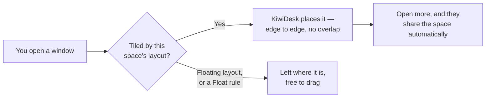
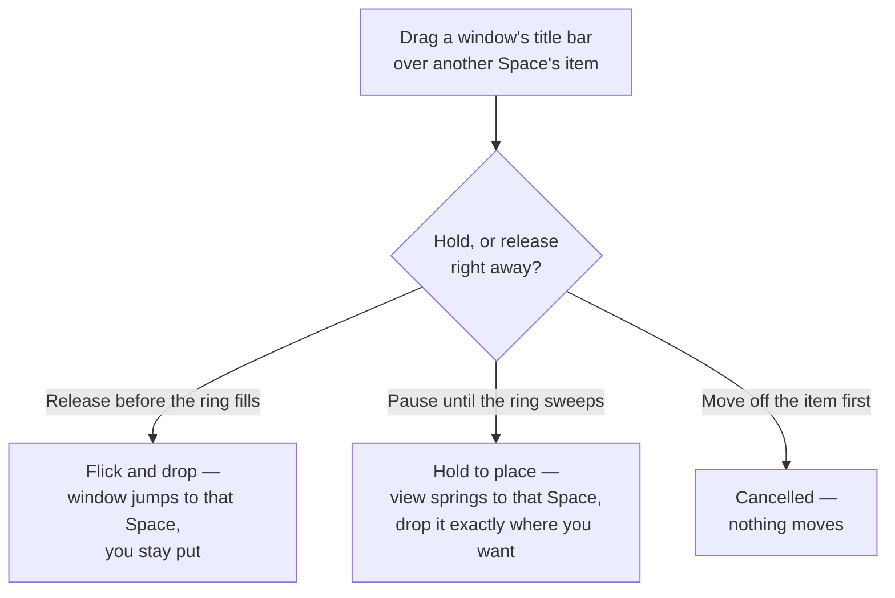

# User Guide: The Settings App

This guide walks you through KiwiDesk's visual Settings window —
the point-and-click interface for all window tiling, monitors,
spaces, and keybindings. You never need to edit files directly
unless you want custom Lua.

The short version of what happens every time you open a window:



Everything below is how you shape that behavior — which layout a
space uses, the gaps, the bars, and the shortcuts.

## Getting Started

Open Settings from the KiwiDesk menu in the menu bar, or press
**⌘,** while KiwiDesk is the active app. The window shows a
two-group sidebar on the left:

- **Design** — sections scoped to the active profile (Spaces,
  Layout, Monitors, Appearance, Bars, Behavior).
- **System** — global settings that apply everywhere (Profiles,
  Shortcuts, App Rules, General).

The sidebar is a fixed-width column, like System Settings — it
cannot be resized or collapsed.

At the top you'll see the app name and a banner showing which
profile is loaded and letting you edit a saved profile without
switching to it. At the bottom, a stable three-slot footer holds
Revert, Save a Copy As…, and Save.

### Sidebar Search

A search field sits at the top of the sidebar, under the app
name. Typing filters the sidebar to the sections that match —
by section name or by any of the titled groups inside a section
(searching "gaps" finds Appearance, "focus" finds Shortcuts).
While active, a subtle blue outline marks keyboard focus; the
lighter placeholder gives way to normal text as soon as you type.
When the match is a group inside the section, the result row
names it in a smaller line under the section name, so you know
where to look after clicking; for the per-layout editors under
Layout it names the layout tab to open. Clicking a result opens
that section. The query stays put while you navigate — press
Escape or the clear button to get the full sidebar back.

### Contextual Help (?)

Some rows carry a small circled question mark right after
their name. Click it to open a short popover explaining what
the setting does — for a field with a few named options, the popover
describes each option in one line. Hovering the question mark
shows the same text as a tooltip.

The help is optional reading: every setting is meant to be
understandable from its label, options, and the preview or
schematic above it. The question mark is there just in case the
short form didn't explain enough.

### Permission & First Run

On first launch, a wizard prompts you to grant Accessibility
permission — KiwiDesk needs it to move and resize windows.
Follow the steps to enable it in System Settings › Privacy &
Security › Accessibility. Once granted — and only if two or more
displays are connected with "Displays have separate Spaces" on —
you may also be asked to turn that option off. KiwiDesk uses one
active profile across all displays, so shared display Spaces make
native Desktop-to-profile bindings predictable. This is optional:
basic tiling still works with separate display Spaces, and a single
display is never affected. Changing the macOS option requires
logging out and back in.

When setup finishes, a final card confirms KiwiDesk is now
arranging your windows and offers to **Open Settings** (landing on
Layout) — or **Not Now** to jump straight in; neither is required.
If you choose Not Now (or just close the card), a one-time hint
points at the menu bar icon, where KiwiDesk lives, so it's easy to
find again; opening Settings skips the hint, since it already
takes you into the app. Both appear only once, on that first
setup — losing and regranting Accessibility later never repeats
them.

If Accessibility permission is ever missing — you dismissed the
wizard, or the permission was revoked later — window management
pauses and KiwiDesk makes it easy to find your way back. The menu
bar icon shows a warning triangle, the quick menu gains a
**Window Management Paused…** row at the top, and the Settings
window shows a banner across every section. Any of them reopens
the wizard at the grant step so you can turn the permission back
on; management resumes automatically once you do.

KiwiDesk runs as a single instance. Launching it while a copy is
already running never starts a second manager (two instances
would fight over your windows and hotkeys): the second launch
brings the running instance forward and exits with a non-zero
status, printing `already running` to the terminal. When a
Finder-launched copy can't surface the running instance, a brief
notice dialog explains the exit instead. A crashed instance never
blocks the next launch; the lock dies with the process.

### The Status Bar Quick Menu

KiwiDesk runs a lightweight menu bar helper for daily controls. Clicking
the KiwiDesk icon opens the quick menu where you can:

- **Layout**: Switch the active space's layout algorithm (BSP, Stack,
  Scrolling, Monocle, Grid, Track, Floating).
  - Switches made through the quick menu are **session-only** (temporary)
    by default and do not rewrite the active profile.
  - When the layout mode has drifted from the profile's saved setting,
    the active layout in the menu displays a secondary
    "not saved to profile" subtitle.
  - Click **Save Current Layout to Profile** below the separator to persist
    the new layout (adopts the whole live state into the active profile).
- **Switch Profile**: Load any saved profile into the current layout.
  A non-clickable **Profile: ‹name›** line appears above the actions
  naming the profile you are currently on — shown only when there is
  another profile to switch to, so it never adds noise when there is
  no choice to make.
- **View Shortcuts…**: Open a read-only reference of every shortcut
  bound in the currently active mode — see below.
- **Settings…**: Open the full Settings window.
- **Window Management Paused…** (only when Accessibility permission
  is missing): appears at the top of the menu and reopens the
  permission wizard so tiling can resume.

### The Shortcuts Reference

**View Shortcuts…** opens a floating, read-only panel that mirrors the
shortcuts bound in the currently active mode — a fast "what can I press
right now" lookup. It is not an editor: it only shows what is already
bound, grouped into three sections:

- **Controls** — window and focus actions (Focus, Move Windows, Size &
  Float, Switch modes), laid out in two columns.
- **Apps** — your app-launch shortcuts, each with the app's icon. A
  small window-plus badge marks a shortcut set to *Open New* (always
  a fresh instance).
- **Custom** — any raw-Lua shortcuts, shown as their Lua source.

You can also give the panel its own **hotkey**: under Settings ▸
Shortcuts ▸ **General**, bind "Show shortcuts panel" to any combo (it
ships unbound). That key both opens and closes the panel, and once set
it appears beside the menu bar's **View Shortcuts…** row and in the
panel's own close hint.

The panel always appears centered on the screen under your pointer and
never remembers a position. Press **Esc**, click anywhere outside it, or
choose **View Shortcuts…** again to close it. Empty sections are hidden;
a mode with nothing bound shows a short placeholder. To change any
shortcut, click **Edit in Settings…** at the bottom — it opens Settings
▸ Shortcuts, the one place bindings are edited. If your configuration is
owned by `init.lua`, the panel says so instead of listing shortcuts.

## How the App and init.lua Coexist

KiwiDesk keeps your custom Lua code in `~/.config/KiwiDesk/init.lua`
and never edits it. The Settings app stores its own configuration
in `~/.config/KiwiDesk/gui.json` (the global settings) and
individual profile JSON files (one per saved layout).

**Key points:**

- Saving in the Settings app never rewrites `init.lua`.
- Custom Lua (print statements, event hooks, or anything that
  isn't app rules, float rules, ignore rules, keybindings, or
  profile bindings) lives safely alongside the visual editor.
- A small blue banner confirms "Custom Lua detected" when the
  app finds your own code.
- If you declare managed vocabulary (`app_rules`,
  `float_rules`, `ignore_rules`, `KiwiDesk.bind`, keybinding
  definitions) *and*
  the Settings app tries to manage them, the app shows a raw Lua
  editor so you can resolve the conflict. You can then click
  **Adopt into the GUI** to import your settings. Adopt comments
  out the migrated settings, rules, and keybindings as a backup
  while keeping your custom Lua — event hooks like the sketchybar
  bridge — **live**, so your integrations keep firing. Or keep
  editing raw Lua.

Once `gui.json` exists, the visual editor owns tiling (gaps, modes,
layout tuning). Hand-written `set_gap_global` calls stop applying
on monitor changes — the built-in layout rules take over instead.
To persist custom tiling, save it as a profile in the Settings app.

**First launch with an existing `init.lua`:** KiwiDesk seeds the
default `gui.json` (with the default profile, spaces, and
shortcuts) as long as your `init.lua` declares no managed
settings. So an `init.lua` that carries only event hooks or other
harmless custom Lua still boots GUI-managed *and* keeps firing your
hooks. Only an `init.lua` that already sets tiling itself
(`KiwiDesk.set_*`, app/float/ignore rules, or keybindings) is left
Lua-owned — no `gui.json` is seeded, and the **Adopt into the GUI**
path is offered instead.

## GUI Language

Go to **General** (in the **System** group) and pick a display
language. It covers the Settings window, the dashboard, and the
menu-bar quick menu. "System default" follows your macOS language
if KiwiDesk ships a translation, otherwise English. Your choice
applies instantly, touches no Lua or profile files, and persists
in app preferences only (`UserDefaults`, key `"language"`) — it
never flips the app to raw-editor mode. To add or fix a
translation, see [translating.md](translating.md).

## The gui.json File

The file `~/.config/KiwiDesk/gui.json` holds the app's global base
configuration. On a truly fresh install (no `init.lua` yet) it is
created at first launch, pre-filled with the
[default shortcuts](#default-shortcuts). On a hand-written setup
(an `init.lua` already exists) it is only created the first time
you Save in the Settings window. You normally never edit it by
hand, but it is documented here for backup and transparency.

**Top-level structure:**

```json
{
  "spaces": [ "1", "2", "mail" ],
  "app_rules": { "com.spotify.client": "music" },
  "float_rules": [ "com.apple.calculator" ],
  "ignore_rules": [ "eu.exelban.Stats" ],
  "profile_bindings": { "1": "Developer" },
  "modes": [
    { "name": "default", "bindings": [...] }
  ]
}
```

Each field:

- **`spaces`**: array of space ids (strings). Defines the spaces
  you work with, in order. Updated whenever you add, rename, or
  delete a space in the Spaces section.
- **`app_rules`**: object mapping app **bundle identifiers**
  (e.g. `com.spotify.client`) to space ids. When an app opens,
  its windows land in the assigned space. Updated in the App
  Rules section, which picks apps by name and stores the
  identifier for you.
- **`float_rules`**: array of bundle identifiers (and optionally
  `bundle-id:title` filters). Windows matching these never tile.
  Updated in the App Rules section.
- **`ignore_rules`**: array of bundle identifiers. Matching apps
  are never tracked or managed. This power-user field has no
  Settings control, but Settings preserves it when saving.
- **`profile_bindings`**: object mapping native macOS Space numbers
  (Mission Control desktops) to profile names. When you switch
  desktops, the bound profile loads. Updated in the Profiles
  section.
- **`modes`**: array of keybinding modes. Each mode is an object with:
  - **`name`**: the mode name ("default" for the main set).
  - **`icon`**: optional SF Symbol name or emoji for the menu bar.
  - **`bindings`**: array of shortcut rows, each with:
    - **`combo`**: key combo string (e.g., `"cmd+alt+left"`).
    - **`lua`**: the Lua code to run (the body inside `function() ... end`).
    - **`kind`**: classification ("navigation", "application", or "custom").
    - **`label`**: display name for the row.

If you hand-edit the `modes` list, it is normalized on load:
modes with an empty name are dropped, a duplicated mode name
keeps only its first entry, the `default` mode always exists and
sits first, and an `icon` on the default mode is removed (its
menu bar indicator is fixed). The cleanup is silent; the next
Save persists the normalized list.

To reset the app to what your `init.lua` declares, delete `gui.json`.
Treat it like `init.lua` — do not import it from an untrusted source,
since custom Lua in keybindings runs on every reload.

## What Lives Where: Global vs Per-Profile

Your configuration is split across two homes, and knowing which is
which tells you the *blast radius* of any edit:

- **`gui.json` (global)** — one file, shared by every profile.
- **Each profile's JSON (per-profile)** — one file per saved
  profile, applied only while that profile is active.

**Global settings** live in `gui.json`; editing or deleting one
changes it for **every** profile:

- **Keyboard shortcuts** (the base set)
- **App rules** (app → space assignment)
- **Float rules** (apps that never tile)
- **Ignore rules** (apps KiwiDesk never AX-tracks or manages)
- **Native Space → profile bindings**

**Per-profile settings** live in the profile's own JSON; editing
one touches **only that profile** — another profile that declares
a space of the same name is left untouched:

- **Which spaces exist** and their order (the list you see is the
  active profile's)
- **Layout mode, gaps, and per-layout / per-space tuning**
- **Space-to-monitor pins, the Main role, and the fallback space**

This is why, when you **edit a stored profile without switching to
it**, the General section disappears — it holds global state a
profile edit never writes.

**Two hybrids — keyboard shortcuts and app rules.** The base set
is global, but a profile can carry a *sparse override* just for
itself: shortcuts can add or change specific bindings (see
**Per-Profile Shortcut Overrides**), and app rules can pin an app
to a different space — or un-pin it entirely — while that profile
is active (see **Per-Profile Space Assignments** under App
Rules). Everything else is squarely one or the other.

A practical consequence: the base app rules name a single space
per app. When profiles **share** a space name, one base rule is
often enough — keep a `comms` space in each profile and assign
the app to it; each profile still lays that space out
differently. When profiles have **disjoint** space sets (Work
`{1, 2, 3}` vs Home `{media, games}`), give each profile its own
override for the app instead.

## Spaces

The **Spaces** section (in the **Design** group) lists every virtual
workspace you manage. Each space is independent of monitors and can
span multiple displays or run on just one.

To **add a space**, click the **+** button and enter a name
(often a number like "1", "2", or a name like "web", "mail").

To **rename**, click the space name in the list.

To **customize a space** (per-space layout overrides), click the
**Overrides…** button on its row. When the space already has saved
overrides the button shows the count (e.g. **Overrides (3)**),
including any saved for layouts other than the one it currently
uses. The editor opens in a popover floating over the list, so it
never pushes the other rows down, and opening one space's editor
closes any other that was open. A space set to **Floating** has no
layout overrides, so its button is visible but disabled. See
[Per-Space Overrides](#per-space-overrides) for what it contains.

To **delete**, right-click and pick Delete (or click the trash
icon). The space is removed right away — any windows in it move to
the fallback space (or the first space in the list when no
fallback is set), and it stays gone across reloads and restarts.
A space that carries customized settings (layout overrides, a
monitor pin, or a Main/Fallback role) asks for confirmation first,
since deleting it discards that work too.

When the list is empty (you can delete every space), a hint
explains that every window tiles in a single default space until
you add one.

To **set a recognition icon** (optional), click the space name to
edit it and pick an SF Symbol, emoji, or single character. The icon
appears in the Monitors and Shortcuts sections as a visual aid.

To **mark a space as the fallback** for profile switches, right-click
a space and pick **Make Fallback**. When you load a profile, any
windows in spaces the new profile doesn't define are moved to this
fallback space instead of being hidden. Without an explicit choice,
windows land in the first space of the profile's list.

## Layout Defaults

The **Layout Defaults** section (in the **Design** group) controls
tiling for every space in this profile.

### Modes & Gaps

Pick a layout mode for each space:

- **BSP** (Binary Space Partition): recursive splits, every window
  gets a region.
- **Stack** (Master/Stack): one master zone and a collapsing stack.
- **Scrolling** (PaperWM style): columns or rows that scroll.
- **Monocle**: fullscreen focus, all windows hidden behind one.
- **Grid**: evenly-sized cells in rows and columns.
- **Track**: columns (or rows) of windows where every resize has
  one true target — grow *your* track, or *your* share within it
  (#128).
- **Floating**: every window floats freely, no tiling.

Set gaps with sliders (uniform gap, or per-edge: top, bottom, left,
right, plus inner gaps between windows). Gaps are carved out of the
layout — windows never overlap them. The app bar (if shown) also
carves its space from the layout.

### Per-Layout Tuning

The pane opens on a **tab strip** — one tab per layout mode (BSP,
Stack, Scrolling, Grid, Monocle, Track), landing on the mode your
spaces use most — and shows only the selected mode's settings, so
you tune one mode without scrolling past the others. The global
**Minimum window size** sits above the strip (it feeds every
mode). Floating has no tunables, so it has no tab.

Each mode's tab leads with a small **schematic** — a static
mini-diagram that redraws as you change ratios, counts, and
orientation, so you can judge what a value looks like before you
save (the same idea as the Gaps diagram in Appearance). It is a
preview only; nothing applies to your live windows until you Save.

Adjust each mode's defaults:

- **BSP**: split strategy (longest_side or alternating) and the
  width and height split ratios (0.5 = 50/50 each) — the knobs
  the per-axis resize shortcuts nudge (#56).
- **Stack**: master count, master ratio (the master zone's share
  of the split), master orientation (how multiple masters line
  up), stack position (which side the stack zone takes — left/
  right split the width, top/bottom the height; the stack's own
  lineup follows the side, so a tall zone is a column and a wide
  one a row, #222 — with a leading stack the masters fill from
  the stack seam, so promotions stay local), and overflow style
  (cascade_overflow keeps full windows, cascade_all cascades
  everything — piles always cascade downward, so title bars
  stay visible). The resize
  shortcuts are focus-aware (#67): the split axis grows
  whichever zone holds the focused window, the zone's own axis
  grows the focused window's share of it (a session-only tweak —
  it resets on relaunch and is not saved into profiles). A
  master zone lined up *along* the split axis has no reachable
  shares — the split owns that axis and the other one beeps.
  With the standard arrangement (side-by-side masters beside a
  right stack) that is the out-of-the-box behavior once the
  master count exceeds one; switch the orientation to vertical
  for individually resizable masters
  (see [Accepted limitations](accepted-limitations.md)).
- **Scrolling**: orientation (horizontal or vertical), anchor
  (where the focused column rests on every focus — **Center**, or
  flush against the leading/trailing edge, shown as **Left**/
  **Right** when horizontal and **Top**/**Bottom** when vertical;
  or **Follow**, the default, which holds the viewport and pans
  the minimum to keep the focus visible), slot size (auto, pixel
  count, or percentage of available space), and **Wrap focus** —
  off by default, so
  stepping focus past a row end stops there; turn it on to wrap
  from the last window back to the first (and vice versa). Swap
  never wraps.
- **Monocle**: orientation (affects which arrow keys cycle focus
  and where the app bar sits), wrap focus, and **New window**
  placement. Wrap focus is **off** by default, the same as
  scrolling and track — turn it on and cycling past the last
  window returns to the first. New window defaults to
  **first**, so a new window comes to the front of the cycle
  rather than the back.
- **Grid**: type (dynamic or rigid), fill empty space (yes/no),
  **Arrange** (Columns first or Rows first — the order windows fill
  the grid: across a row then down, or down a column then across;
  it also sets which way a dynamic grid grows), and column and row
  counts. Arrange applies to both grid types. *Arrange* is
  a clearer label for what used to read "Split direction": its
  two values map to the unchanged Lua/JSON `split_direction`
  (`horizontal` = Columns first, `vertical` = Rows first), so
  configs and scripts are untouched. In dynamic mode the counts are an upper bound — the
  grid auto-balances up to that ceiling, then cascades the
  overflow in the last cell. **Auto-size grid** fits as many
  columns and rows as the screen allows at the minimum window
  size instead of the typed counts (greying them out), so a
  landscape monitor gets more columns than rows.
- **Track**: a somewhat more advanced layout (a caption at the
  top of the section says so) where several windows can share
  one track. **Arrange** (Columns = tracks side by side, Rows =
  tracks stacked); **New window** — **Fills the focused track**
  (the default) fills the track you're in and spills the next
  window into a new track beside it once it's full (shelf-like:
  fill the column you're at before reaching for a new one), while
  **Opens its own track** gives every new window its own column
  (the ultrawide "one app per column" choice) — with a
  **Position** picker for where within that choice it lands (first,
  last, before or after the focused track/window; defaults to
  **first** so a new window isn't buried in the overflow);
  **Automatic tracks** (on by
  default — tracks open and collapse as windows come and go;
  turn it off to pin a fixed **Track limit**, which greys out
  while automatic is on — the limit counts *normal* tracks, so a
  limit of 3 shows up to three tracks plus one overflow track
  for anything beyond); **Overflow** — how the **overflow
  track** renders (the far-edge track that collects the surplus
  when more tracks exist than fit side by side): **cascade all**
  (the default) piles its windows from the top, **cascade
  overflow** keeps the ones that fit tiled and piles the rest.
  There are two overflow levels: the far **overflow track**
  collects whole *tracks* that no longer fit side by side, while
  *within* a single track the surplus *windows* (more than fit at
  the minimum window size) cascade among themselves. This Overflow
  setting only tunes the far track; normal tracks always use
  cascade overflow for their own windows. And **Wrap
  focus** (the same opt-in toggle as Scrolling's, off by
  default: on,
  focus wraps within the track along the axis and from the last
  track to the first across it; swap never wraps). The track
  shortcuts live in Shortcuts ▸ Move Windows under the "Move to
  track" subheader — a caption there notes they only matter if
  you use the track layout: "Move window to previous/next
  track" rows move a window across tracks or open a new one at
  the edge, and "Swap with previous/next track" rows swap the
  focused window's whole track with its neighbor. Tracks form a
  sequence, so these say previous/next instead of a compass
  direction — previous is the column to the left (or the row
  above), next the column to the right (or the row below) — and
  a binding keeps working when the axis flips. Track sizes and
  in-track shares are resize state, session-only like the
  stack's weights.

> **A few resize behaviors are accepted limitations, not bugs.**
> Some tiling quirks — e.g. the inner window of a nested BSP pair
> not growing, or a stack window's *mouse* height-drag snapping
> back — are settled architectural trades, each with a reason and,
> where planned, a real fix. See
> [Accepted limitations](accepted-limitations.md).

### Per-Space Overrides

To tune the *same layout type differently in different spaces*, use
the per-space override editor. For example, make space "3" scroll
vertically while every other scrolling space goes horizontal. Open
the space's **Overrides…** popover from its row in the **Spaces**
section, tick the box beside a field, and adjust just that field —
unticked fields inherit the Layout Defaults value.

The popover is titled `<Space> — <Layout> overrides` and edits the
layout the space currently uses; the caption reminds you that
unchecked settings inherit that layout's defaults. Each field has a
checkbox: unchecked inherits (the control is dimmed and shows the
inherited value), checked overrides just that field for this space
and seeds the current value so nothing jumps.

**Scrolling slot size** is one override with a size unit
(**Default**, **Points**, **Percent**) and a value. It sets each
window's size along the scroll direction — **Column width** when
the space scrolls horizontally, **Row height** when vertical. The
single checkbox owns the whole setting; **Default** is an explicit
orientation standard and stays distinct from inheriting.

**Overrides for other layouts.** Changing a space's layout never
deletes overrides — each layout keeps its own. Switch from
Scrolling to BSP and you see only BSP's fields; switch back and the
Scrolling values return unchanged. When a space carries values for
layouts other than its current one, a **Saved for other layouts
(N)** disclosure lists each layout and how many fields it holds, so
the retained data stays discoverable without turning the popover
into an all-layout editor.

**Resetting.** **Reset `<Layout>` Overrides** clears the current
layout's overrides for this space (greyed when it has none). When
other layouts hold saved values, **Reset All Layout Overrides**
clears every layout's overrides for the space and asks for
confirmation first, since it also discards the dormant values the
popover doesn't show.

## Monitors

The **Monitors** section (in the **Design** group) pins spaces to
specific displays for this profile. It appears only when the profile's
monitor setup is connected; when editing a profile whose monitors
aren't connected, a read-only note appears instead.

**Drag space chips** onto monitor cards to pin a space to a display.
A pinned space always appears on that monitor when the profile loads.

**Drag onto the "Follows main display" card** to give a space the
**Main role**. That space moves with whatever display is currently
the Mac's main display (useful for your primary work space when you
dock/undock).

**Dimmed chips** are placed automatically by KiwiDesk — they are not
manually pinned but still show which spaces run on which monitors.

When you add a new monitor and save the profile, the new arrangement
is recorded so the profile becomes available for future loads with
this hardware.

Each monitor shows its own space at once, and the **focused
monitor** is simply the one you last clicked — clicking a window
*or* the bare desktop on another display moves focus there. A new
window, and a global sticky window, then appear on that monitor's
space. Clicking the menu bar or the Dock does not move focus.

## Appearance

The **Appearance** section (in the **Design** group) customizes
visual feedback.

Color controls pair a swatch with an exact hex field. Clicking the
swatch opens the native Colors panel and updates the staged value as
you pick; **Done** or the red window close button closes the panel and
keeps the selected color.

### Color Palette

At the top of Appearance, the **Color Palette** shelf paints a whole
set of colors across the App Bar, Space Bar, focus borders, and drag
visuals in one click. Each palette shows a small scene thumbnail —
a mock bar, a ringed window, and a drag swatch — in its own colors,
so you judge the whole look, not isolated chips. Applying a palette
is a **one-time paint**, not a live link: it overwrites the current
colors (you can still tweak any individual color afterward), and the
change is staged until you Save the profile like any other edit.
Below the shelf, a compact pair of bar previews mirrors the staged
App Bar and Space Bar — the bars take most of a palette's paint but
are edited on their own tab, so the mirror shows a click landing
without leaving Appearance.

- **Bundled** palettes (Kiwi, Kiwi Gold, Kiwi Neon, Clean Light,
  Slate, True Dark, Sunset, Ultraviolet, Monochrome) are built in
  and marked "Built-in" — they can't be renamed or deleted. "Kiwi"
  is the shipped default, so applying it is a reset to the default
  colors. **Kiwi Neon** is a bright dark theme built to show off the
  focus-border **glow** — picking it also switches the glow on (you
  can turn it back off in Focus border); other palettes leave your
  glow setting alone.
- **My palettes** are yours. The **＋** tile saves the current
  colors as a new palette; right-click a saved palette to **Rename**,
  **Export…**, or **Delete** it. **Import…** loads a palette file
  someone shared (unknown keys are ignored, and the name is made
  unique so it can't shadow a bundled one).

The palette library is **global** — the same saved palettes are
available whichever profile you're editing (a palette is a color
recipe; a Profile is the configuration that owns the colors after
you apply one).

### Drag Visuals

When you drag a tiled window, KiwiDesk shows two overlays:

- **Ghost** (the dragged window's slot) — where it snaps back if you
  release outside any other window.
- **Drop zone** (the slot under the cursor) — the window this drop
  acts on. The target follows the **cursor**, not the dragged
  window's center, so it lands the instant the pointer reaches a
  slot — even a big window dragged onto a smaller display.

Releasing over another window's slot **on the same display swaps**
the two; dragging **onto another display moves** the window there.
The move happens **live**: once the cursor has settled on the
other display for a beat, the destination's windows slide apart to
open a real slot under the cursor — the dragged window itself
stays pinned under the pointer — and from that moment the drag
behaves exactly like a local one there (release over a window to
swap, release outside every slot to snap into the opened gap).
Pulling the cursor back before releasing moves the window home the
same way. A fast flick across still commits the move at release —
onto a window's slot it lands there (the windows below it shift
down one), onto empty space (an empty monitor) it just moves
across. Releasing outside every slot **on your own display** snaps
the window back.

Floating windows show neither overlay: they have no tile slot to
preview, and dropping one over a tiled slot does nothing. Use
*make tiled* to return a window to the grid first (see
[design decisions](design-decisions.md) for why).

Toggle each visual on/off and customize:

- **Border**: show/hide, color, thickness (pt), and alignment
  (inside or outside the slot edge).
- **Fill**: show/hide, color (with optional transparency).
- **Corner radius**: match your windows' corner rounding.

### Focus Border

Below Drag Visuals, the **Focus border** group draws a thin ring
around the focused window so you never lose track of which window
has focus in a gapped layout — the cue keyboard-driven focus
otherwise lacks. It is **on by default**.

On supported macOS versions, KiwiDesk draws the ring as a native
WindowServer overlay and follows move, resize, and ordering events at
their source. This keeps it attached during app-driven moves as well as
mouse drags. Every private symbol is resolved at runtime; if that
surface is missing or an operation fails, the same ring is redrawn with
the AppKit overlay automatically. Neither path requires disabling SIP.

A live two-window preview leads the controls, showing the ring at
your current color, width, and corner style before it touches real
windows. Below it:

- **Show focus border**: the master on/off switch.
- **Color**: the focused window's ring color (a swatch plus hex
  field, the same control as every other KiwiDesk color).
- **Show border on unfocused windows**: off by default — when on,
  every other tiled window gets a ring too, including every member
  of an overflow cascade, in its own (greyed until enabled) color.
  Floating windows aren't ringed when unfocused (only the focused
  window is, whether tiled or floating); monocle always shows only
  the focused ring.
- **Width**: 1–20 pt — the visible thickness reaching outward into
  the gap, and the value **Fit layout gaps** sizes gaps from. The
  ring sits just above the window with a small overlap lapping onto
  the window edge to keep its corners closed; that overlap isn't
  part of the width. Keep gaps at least as wide as the border so
  neighbouring rings don't touch.
- **Corners**: **Rounded** matches your windows' real corner
  radius; **Square** draws sharp corners — seamless on windows that
  are already square, an intentional squared frame on rounded ones.
- **Glow**: wraps the focused ring in a soft colored bloom for a bit
  more presence. Off by default; it only ever touches the focused
  window, never the unfocused rings. The live preview shows the
  effect as you toggle it.
- **Fit layout gaps**: previews the exact global **Outer** and
  **Inner** values needed to keep rings apart, plus the requested
  **Extra spacing** (0–100 pt, default 0). Inner gaps account for
  both borders when unfocused borders are shown. **Set Gap Values**
  stages those values and warns before replacing asymmetric
  per-edge gaps; the local confirmation tells you which footer Save
  action applies or persists them. Extra spacing is an action
  parameter, not another saved setting. The action can grow or
  shrink gaps. (Lua: `border.fit_gaps(remaining)`.)

Launcher and panel overlays (Spotlight, Raycast, Alfred) never get
a ring, even while you type into them — only genuine windows do.
Their command bars aren't managed at all: they never appear in the
App or Space Bars, never tile, and stay put when you switch spaces.
Windows in native (green-button) fullscreen aren't ringed either:
they fill the display, so a ring would peek out only at the
corners. The ring returns when the window leaves fullscreen.
Popovers, sheets, emoji pickers, and other windows above a bordered
window stay above its ring, which is pinned to the focused window's
stacking level; the window stays focused and keeps its full ring.

When you focus or swap in a direction where there is no window —
you're already at the edge — the focus ring gives a small
rubber-band bounce toward that edge and springs back, the same
"nothing further this way" cue as scroll overscroll. The window
never moves; only the ring flexes. It works even with the focus
border switched off (a brief ring appears just for the bounce) and,
under **Reduce Motion**, becomes a single opacity pulse instead of
a movement. This is distinct from a sticky window's pill: the
bounce is a wordless "edge of the layout," the pill explains a
window that *can't* be moved.

Floating windows take part in directional focus as a second
tier: tiled windows always win, but when no tiled window lies
in the pressed direction — you're at the layout's edge — focus
reaches a floating window sitting that way (including a
floating sticky shown on the space). So a float parked beside
the tiles is one keypress away, while navigating between tiles
never detours through a float hovering over them.

### Sticky Windows

A **sticky** window stays visible on every virtual space
instead of hiding with its home space when you switch — mark
one with the **Toggle sticky** shortcut (Shortcuts ▸ Size &
Float; there is no app rule list, stickiness is per window).
Sticky has two scopes, both in that shortcut list:
**Toggle sticky** keeps the window on every space of **every**
monitor (marked with an ∞ chip), while **Toggle display sticky**
keeps it on every space of just **one** monitor — the screen it
lives on (marked with a 📌 chip). Moving a display-sticky window
to a space on another monitor re-homes it there; moving a
global-sticky one anywhere, or a display-sticky one to a
different space on the *same* monitor, is refused with a brief
pill on the window (its whole point is to stay put). On a single
monitor the two are identical. The flag survives closing and
reopening the window, and it is
independent of floating: a floating sticky window keeps its
own frame everywhere, a tiled one tiles into every space's
layout — it takes a slot near where it sits on its own space,
and on a crowded space it keeps a fully visible slot instead
of falling into the overflow pile (in the scrolling layout it
scrolls like any other slot — the row itself is the
overflow). Rearrange it on its home space to move it
everywhere; on other spaces it cannot be reordered or mouse-resized — the gesture snaps back. The `?` beside **Toggle
sticky** in Shortcuts spells this out. When such a drag snaps
back, the window's chip briefly expands into a pill naming its
**home space** — by the same icon or name its Space Bar tile
shows — so you can see where the tile actually belongs. The same
pill appears on the sticky window when you drag *another* window
onto its slot: the sticky one is the one that can't move, so it's
the one that explains why.

Because a sticky window can look identical to a normal one,
KiwiDesk marks it with a small badge chip in its top-right
corner. **Show mark on sticky windows** (on by default) turns
the chip off — unless the Space Bar is hidden, in which case
the toggle greys out and stays on: with the bar off the chip
is the only sticky indicator, and sticky state must never be
invisible. (From Lua both indicators are freely configurable —
`sticky.set_indicator`, `space_bar.set_sticky_badge`.) The
Space Bar shows its own sticky badge either way, and floating
windows get a bar badge too — see the Space Bar section.

Under the toggle, **Mark color** tints the marks. **Sticky**
colors both the on-window chip and the Space Bar sticky badge
(one mark, one color everywhere); **Floating** colors the
Space Bar floating badge (floating windows have no on-window
chip). The mark becomes a **filled disc** in the chosen color
with a legible black or white glyph picked automatically for
contrast. Both default to **Automatic** — the swatch shows a
diagonal light/dark split, and the mark keeps its default look
(the Space Bar badge stays the count-badge color; the on-window
chip is a neutral glyph on glass that adapts to light and dark).
Pick a color to override; right-click the swatch (or clear the
hex field) to return to Automatic. (Lua:
[`sticky.set_color`](lua-reference.md#stickyset_color) and
[`floating.set_color`](lua-reference.md#floatingset_color); the
badge visibility toggle is
[`space_bar.set_sticky_badge`](lua-reference.md#space_barset_sticky_badge).)

## Bars

The **Bars** section hosts both bar editors behind a fixed
**Space Bar | App Bar** switch at the top — two picker cards,
each showing a small schematic of the bar it opens (numbered
space tabs vs a row of app icons). The Space Bar leads and is
the default: it appears in every layout, while the App Bar
only renders in Monocle and Scrolling. Each editor leads with
its own preview and owns its settings.

### App Bar

The App Bar is the strip that shows every window in the current
space — it only renders in **Monocle** and **Scrolling**, the two
layouts where a window can hide behind another or scroll off the
edge, so you always see what's open. Configure it globally (applies
to every layout that shows a bar) or override individual fields per
layout.

**Click a tab** to focus that window; **drag a tab** along the bar
to rearrange the windows. Because Monocle and Scrolling don't lay
windows out side by side, the App Bar is where you reorder them:
drag a tab left or right (or up/down on a vertical bar) and the
underlying window order follows. Grouped tabs expand into their
members when you click, so any window in a same-app group can be
picked or dragged directly. (Lua: `app_bar.*` setters, and the
rearrange gesture shares the drop visuals in
[Drag & Drop Rearranging](lua-reference.md#drag--drop-rearranging).)

A **live mock strip** sits at the top of the Global Style section:
three sample tabs — one grouped, one active, one plain — drawn with
your configured position, style, sizes, corner radius, and colors,
so you can judge a color or size change in place before Save. It is
a static preview (no hover or interaction) and never touches your
running windows.

**Global settings:**

- **Tab background**: boxed (a box per tab honoring corner
  roundness), plain (names on a shared translucent strip), or
  **Liquid Glass** — a macOS&nbsp;26 glass plate under the items,
  tinted by the Background color (transparent = clear glass) and
  rounded by corner roundness. Liquid Glass appears in the picker
  only on macOS&nbsp;26 and later; a profile that selects it still
  opens on older macOS, where it falls back to Boxed.
- **Background size**: how far Plain's strip or the Liquid Glass
  plate reaches — **Hug items** (default; the plate wraps the
  tabs like the Dock wraps its icons) or **Full width**
  (edge-to-edge). Hug falls back to full width once the tabs
  overflow and scroll. Greyed for Boxed, which draws no shared
  plate. The Space Bar has the same control.
- **Position**: the screen edge the bar occupies — top, bottom,
  left, or right (default top). Absolute for every layout; the
  preview strip rotates vertical for left/right. When the Space
  Bar shares the edge, an inline note under this control
  explains the stacking order (Space Bar at the screen edge,
  App Bar next to the windows).
- **Alignment**: where the tab group sits along the bar while
  it fits — start, center (default), or end. Edge-relative: a
  left bar's start is its top. Once tabs overflow and scroll,
  the three behave the same.
- **Active indicator**: ring (outlined border around the active
  tab), edge mark (accent bar on the active tab's window-facing
  edge), or gap (active slot empty). Orthogonal to tab background
  — all combinations are valid. Full-color app icons (System
  default) also dim to half strength on inactive tabs, so the
  active app reads even though those icons take no tint.
- **Thickness**: the strip's depth in points.
- **Box size**: auto (0) measures rendered width and sizes slots
  uniformly to fit the widest item; fixed pixel width.
- **Content**: icon only, name only, or both. Left/right bars
  always render icon-only (names would need stacked or rotated
  text), so the control greys there; your choice returns when
  the bar moves back to a horizontal edge.
- **App symbol style**: how app icons are drawn (greyed while
  Content is Name, which shows no icons). **System default**
  shows each app's icon as macOS provides it — including your
  system-wide Icon & widget style choice. **Glyphs** shows a
  monochrome symbol from the bundled [SketchyBar App
  Font](https://github.com/kvndrsslr/sketchybar-app-font)
  instead, colored by the bar's text colors (Text, Active
  text, Hover text — so those colors also style the glyphs);
  apps without a symbol keep their icon. With Glyphs active,
  the shortcuts panel's Apps band shows the same symbols
  (following the global style — the panel spans all layouts).
- **Font size**: auto or fixed. Auto-gated sliders (box size,
  font size) read "Auto" while their toggle is on.
- **Corner roundness**: 0–100% (0 = square, 100 = full capsule).
  Rounds the boxed tabs, or the shared plate under Plain and
  Liquid Glass.

**Colors:** Fill and Highlight — the ones the preview strip most
visibly reflects — sit inline. The rest of the palette (item,
active item, hover states, and group badge) collapses behind an
**Advanced colors** disclosure, shut by default. **Fill** is one
knob for every filled surface: the box per tab (Boxed), the shared
plate (Plain), or the Liquid Glass **tint** (Material) — a
transparent Fill means clear, untinted glass. The active tab is
marked by the indicator (ring or edge mark), so there is no
separate active-fill color.

**Per-layout overrides:**

Click a layout to override one field just for that layout — e.g.,
make scrolling show segment style while monocle stays pills. When
you open a layout's **Overrides**, a compact chip leads the rows:
color swatches of the layout's *resolved* bar (global overlaid with
its overrides) and a count of how many fields differ — a quick read
on whether the layout diverges, without a second full preview. The
color overrides sit in the same 2-column grid as Global's colors,
in the same field order; a leading checkbox on each cell unlocks
that field.

### Space Bar

The **Space Bar** is an always-visible overview of your Spaces,
**on by default** — it's the one place your virtual Spaces are
visible at all: one bar per display, listing that display's
Spaces in profile order. Each item shows the Space's identifier
(its configured icon, else its plain number or a two-letter
monogram), a thin divider, then a compact glyph per window —
adjacent windows of the same app collapse into one glyph with a
count badge, and past the configured glyph cap (default 5,
adjustable 1–12) the rest fold into a `+n` badge. Emoji
identifiers and app-image icons dim to half strength on
inactive Spaces; on the active Space, app-image glyphs keep a
three-step ladder — the focused app full strength, its
neighbors slightly dimmed — so the focused app reads even
though native icons take no tint (App Font glyphs use the
Focused item color instead). Click a Space to switch to it;
glyphs are informational.

A sticky window's glyph **travels with you**: it is listed
under the Space you are currently on — joining that item when
you switch, pruned from the item of the Space you left (its
home included) — so one badged glyph always sits where the
window actually is: with you.

Window state shows on the glyphs as small corner badges:
**sticky** windows wear a badge on the glyph's top-left,
**floating** windows on the bottom-left (the top-right corner
stays the group count). A grouped glyph aggregates its
windows — its badge means "at least one window in this group".
The badges follow the item's color ladder, so they mute on
inactive Spaces. They have no Settings toggle; Lua can hide
them with `space_bar.set_sticky_badge(false)`.

At a glance, the marks you may see and what each means:

| Mark | Where it sits | Means |
| --- | --- | --- |
| ∞ chip | On the window, top-right corner | **Global sticky** — stays on every Space of every monitor |
| 📌 chip | On the window, top-right corner | **Display sticky** — stays on every Space of the one monitor it lives on |
| Badge, glyph's **top-left** | Space Bar | That window (or a window in the group) is **sticky** |
| Badge, glyph's **bottom-left** | Space Bar | That window is **floating** |
| `+n` / count badge, glyph's **top-right** | Space Bar | How many windows a grouped glyph holds |

Every mark is a **filled disc** in its state color with a legible
black-or-white glyph auto-picked for contrast; sticky and floating
each get their own color (see **Mark color**, above). Floating shows
no on-window chip — in the bar is the only place a tiled and a
floating window look different. (Lua:
[`sticky.set_indicator`](lua-reference.md#stickyset_indicator),
[`sticky.set_color`](lua-reference.md#stickyset_color),
[`floating.set_color`](lua-reference.md#floatingset_color).)

**Drag a window onto a Space** to move it there — a two-speed
gesture. Drag a window's title bar over another Space's item and
either:

- **Flick and drop** — release before the ring fills and the
  window jumps straight to that Space; you stay where you are.
- **Hold to place** — pause over the item; a ring sweeps around
  it and after a short hold the view springs to that Space, with
  the window now in its live layout so you can drop it exactly
  where you want (the usual drag preview shows the slot).

The hold length is the **Spring delay** (Space Bar editor,
default 1.5 s, adjustable 1–4 s). Move the cursor off the item
before the ring completes to cancel. The whole item is the target
(glyphs and the `+n` badge are not separate drop zones), and
dropping onto the Space a window is already on does nothing.



**Many Spaces:** when the Spaces don't all fit the strip the bar
scrolls instead of clipping — the same as the App Bar. Items keep
their size; small chevrons appear at the ends toward the hidden
Spaces, and the bar follows the active Space into view. Click a
chevron to scroll, or — while dragging a window — hold the cursor
over a chevron and the bar autoscrolls so you can drop onto a
Space that started off-screen. The front-app segment stays
pinned at the trailing end — only the Spaces scroll behind the
chevrons — so the focused app is always in view; while the bar
fits it sits at the row's tail as before.

The editor's order matches the App Bar editor's: preview,
**Show Space Bar**, **Position** (any of the four screen edges
— sharing an edge with the App Bar is fine, the Space Bar sits
at the screen edge and the App Bar next to the windows, and an
inline note in both editors explains the order when both share
one), **Alignment** (start / center / end along the bar,
edge-relative, like the App Bar's — and, like it, the three read
the same once the bar overflows and scrolls), item background,
active
indicator and **App symbol style**, the two behavior toggles,
sizes and **Glyphs per Space** (how many app glyphs an item
shows before the rest collapse into the `+n` badge, 1–12), then
colors.

The color ladder is the bar's signature: **Text** paints
inactive Spaces, **Active space** the Space currently shown on
the display, and **Focused window** the focused window's glyph
inside the active Space. The ladder sits inline; the rest of
the palette collapses behind an **Advanced colors** disclosure,
shut by default — the App Bar's exact tiering. **Copy App Bar
appearance…** takes the App Bar's current sizes, style, and
colors once — edits afterwards stay independent (position and
visibility are never copied).

Two behavior toggles: **Hide empty Spaces** (the current Space
always stays visible; hidden Spaces remain reachable by
shortcut) and **Show front app** — a trailing segment with the
focused window of the Space each display currently shows
(icon-only on vertical bars). **Spring delay** sets how long a
dragged window must hover a Space before the view springs to it
(default 1.5 s, 1–4 s).

## Behavior

The **Behavior** section (in the **Design** group) adjusts timing and
interaction.

### Animations

- **Duration** (ms): how fast windows move and resize (50–1000, default
  250).
- **Scroll speed** (ms): scrolling-layout slide speed when focus moves
  (50–1000, default 250).
- **On space change**: animate virtual space switches as a coordinated
  transition — windows slide out of the space you're leaving while the
  new space's windows slide in from the hiding corner (default off;
  both spaces animate at once, which can be slow on older machines).
  Native macOS Space switches are never animated — see
  [Accepted limitations](accepted-limitations.md).
- **On scrolling**: animate the slide in scrolling layout (default on).
- **On window resize**: animate when splits adjust (default on).
- **On window swap**: animate when two tiles swap (default on).
- **On relayout**: animate when windows open/close or layout parameters
  change (default on).

### Mouse & Window Behavior

- **Mouse resize mode**: "layout" (default) — resize slides the split
  as you drag; "snap_back" — the layout snaps back when you release.
- **Move mouse to focused window** (checkbox, default off): warp the
  pointer to the center of the newly-focused window whenever focus
  changes, so clicks and scrolls land where the keyboard is working.
- **Minimum window size**: if a window shrinks below this (pt), it
  cascades instead of further shrinking (default 300 pt). It is a
  stepper pinned above the layout-mode tab strip in Layout
  Defaults — type an exact pt value or use the arrows.
- **New window placement**: where new windows enter the space's window
  order — first, last, before focused, or after focused. Each layout
  has a sensible default; override per-space if needed.

### Wake & Restart

- **Restore on wake** (checkbox): when your Mac wakes from sleep,
  restore the previous window arrangement.
- **Wake restore delay** (ms): how long to wait after wake before
  restoring (default 1500 ms, giving apps time to settle).

### On Quit

Before KiwiDesk stops, it arranges managed windows on each display
so their title bars remain reachable.

- **Target windows per cell** (1–20, default 5): the quit grid's
  density target. Automatic adds a row and column when cells would
  exceed this target; the grid stays between 2×2 and 4×4, and after
  4×4 additional windows keep cascading in its cells. A live
  summary shows the thresholds the current target produces (at the
  standard 5: 2×2 up to 20 windows · 3×3 up to 45 · 4×4 above 45).

When you quit or restart KiwiDesk, it saves window order and focus
per virtual space and restores on next launch. On the way out,
each monitor's windows are spread into an evenly-filled grid —
windows take turns claiming a cell, and windows sharing a cell
cascade so every title bar stays clickable. The desktop is usable
the moment KiwiDesk exits, with no window pulled to another
monitor. (Power users can also tune this via `quit.set_layout` and
`quit.set_grid_target_depth` in the Lua reference; `grid` is the
only strategy today.)

## Profiles

The **Profiles** section (in the **System** group) manages saved
layouts. Each profile captures tiling (modes, gaps, parameters),
space-to-monitor pins, and optionally a sparse keybinding override
layer plus sparse app, float, and ignore rule overrides.

### The Profile Banner

At the top of any section, a dropdown picks what your edits target.
The top entry, **Live (currently loaded)**, edits the running,
global config; every saved profile is listed below, one row each
(the loaded profile is marked "currently loaded"). Click it to:

- **Edit Live** (top entry): the running config. Saving here
  adopts your changes into the loaded profile as usual.
- **Edit** a saved profile **without switching** — the Settings
  sidebar becomes profile-scoped: the Design sections (Spaces,
  Layout, Monitors, Appearance, Bars, Behavior) edit this profile, and
  **General is hidden** — it holds global state a profile edit
  never writes. Save writes to this profile's JSON instead of
  the active one (the caption beside the button names the
  target, and the menu title shows "*Name* — overrides").
  Shortcuts and App Rules enter override mode and edit only what
  this profile changes; inherited shortcut rows and App Rules
  facets stay dimmed. Both Space and Float remain editable.
- **Edit the loaded profile's own overrides** by picking its row
  (not the Live entry). This is the one case where saving updates
  the screen right away — the profile is re-applied in place, no
  switch — because it *is* the layout you're looking at. Its
  status caption says so.
- **Return to Live** by selecting the top **Live** entry.

Saving a stored profile hot-reloads the running layout **only if
that profile is the one on screen** (loaded, or bound to the
active native Space); otherwise the change waits until the
profile next loads. **Save a Copy As…** while editing a stored
profile duplicates *that stored profile* — including your pending
edits, its monitor sets (even for hardware that isn't connected),
and its shortcut and app-rule overrides. The count-default flag
does not carry over, and the running layout is never touched —
this is how you create a variant of a profile without loading it
first.

### Saving

The footer always holds the same three slots, clustered at the
trailing edge — **Revert**, **Save a Copy As…**, and **Save**.
Only the primary **Save**'s label and target change with
context; there is no separate fourth button:

- **Revert** — discards pending edits and reloads the target's
  stored state.
- **Save a Copy As…** — creates a new profile from the current
  state. The new profile covers only the connected monitors.
  Names are suffixed `_1`, `_2`, … when taken.
- **Save** — persists edits to the current target. When an
  active profile exists it writes to that profile and
  adds/refreshes the connected monitor set; it is greyed out if
  the connected screen count differs from the profile's count
  ("this profile is for 2 screens"). When you are on a transient
  layout or a built-in Standard, the same slot instead reads
  **Save as New Profile…** and creates a real profile from
  scratch — the naming sheet arrives pre-filled with a unique
  default name, so confirming is one press of Return. The
  banner's profile picker names the edit target
  authoritatively.

Until your first profile exists, Settings points the way
without gating anything: the Profiles sidebar tile carries a
small accent dot, and the Presets list leads with a "Start
here" line plus an accent-colored **Apply** on the presets
matching your connected screen count. Applying one (or saving
from any tab) creates the first profile and the emphasis
disappears — it returns only if you ever delete your last
profile.

While window management is **paused** because Accessibility access
is off, KiwiDesk has detected no displays — so any save that would
capture the live monitor set (**Save as New Profile…**, **Save a
Copy As…** from the active profile, and **Save** when it refreshes
the active profile's monitor set) is greyed out, with a tooltip
explaining why. A profile saved with no monitors could never
resolve later. Grant access first; editing a *stored* profile
(which keeps its own on-disk monitor set) stays available.

After saving, if a global setting changed (keybindings, app/float/
ignore rules, or native Space bindings), `gui.json` is rewritten.
Tiling-only edits touch only the profile JSON. `init.lua` is never
written.

Neither live save carries a keybinding override: the live
Shortcuts section edits the *base* shortcuts, so both live saves
capture tiling only. To give a profile its own shortcuts, pick it
in the banner dropdown and edit its Shortcuts section in override
mode (see [Per-Profile Shortcut Overrides](#per-profile-shortcut-overrides)).

### Built-in Standards & Presets

KiwiDesk ships ten built-in **profiles** — a beginner **Starter**
ladder plus workflow layouts for 1, 2, or 3 screens. One workflow
layout per screen count is the *Standard* that resolves silently
when no saved profile matches; the rest (Starter included) are
Presets you can apply to spin up a starting point. (These are whole
profiles — not to be confused with the six layout *modes* like bsp
or stack.)

**1 Screen:**

- **Starter** — One space per layout mode: track, stack, bsp, grid,
  and floating. The fresh-install tour; a good way back to a
  known-good starting point.
- **Developer** *(Standard)* — IDE in stack (space 2), docs in scrolling
  (space 3), preview fullscreen (space 4). Best for software dev.
- **Minimalist** — Spacious gaps (20 pt), scrolling reading (space 1),
  monocle focus (space 3), floating scratch (space 4). Distraction-free
  work.
- **Focus Stack** — Two stacked task spaces (1–2), deep-work monocle
  (space 4). Heavy multitasking.

**2 Screens:**

- **Starter** — The five-mode ladder repeated on each display
  (spaces 1–5 on the main, 6–10 on the second).
- **Dual Developer** *(Standard)* — Main screen: IDE/docs/preview.
  Secondary: mail/chat/media. Tight gaps (8 pt).
- **Coder & Monitor** — Main screen: editor/terminals. Secondary:
  dashboards and logs. More stack space.

**3 Screens:**

- **Starter** — The five-mode ladder on all three displays
  (spaces 1–5 / 6–10 / 11–15).
- **Command Center** *(Standard)* — Left: communication (stack).
  Center: workspace (IDE/docs/preview). Right: logs/monitoring.
- **Visual Creative & Developer** — Left: design canvas. Center:
  frontend IDE. Right: inspectors. Mixed layouts for creative
  workflows.

To apply a preset, go to the **Presets** section (in the **System**
group). Click **Apply** next to the preset whose screen count matches
your connected displays. The layout loads and is saved as an editable
profile under the preset's name. The first profile saved for a screen
count becomes that count's default.

Presets themselves cannot be deleted; they always stay available. If
you delete all saved profiles for a screen count, that count silently
reverts to its Standard on the next monitor change.

## App Rules

The **App Rules** section (in the **System** group) controls where
windows of specific apps land and whether they tile.

### App Launch Assignment

Click **+** to add a rule. Choose an app from the list — start
typing to filter it by name, and each app shows its icon. Apps are
remembered by their bundle identifier, so a rule keeps working
across system-language changes and app renames — then pick a
space. New windows of that app will
open in the chosen space. For an app that isn't installed right
now, use **Custom…** and enter its bundle identifier by hand (see
[Finding a bundle identifier](lua-reference.md#finding-a-bundle-identifier)).

Click an app row to edit it, or use its trash button to delete.
Rows are ordered alphabetically by the app's display name so a long
list stays scannable.

To **match only certain windows** of an app (not all), the Float
picker's **Windows titled…** option lets you add title fragments —
e.g. a "Get Info" fragment floats only Finder's Get Info dialog,
not every Finder window.

### Float Rules

In the same section, the **Float** picker makes an app's windows
never tile — **All windows** floats every window of the app, or
**Windows titled…** floats only those whose title contains a
fragment you add.

Dialogs, sheets, and picture-in-picture windows float automatically —
you do not need a rule for them. Windows belonging to apps that remain
accessory processes are also tracked floating. If an app promotes
itself to a regular process, its standard windows follow the normal
float-or-tile rules.

### Ignore Rules (Power Users)

An ignore rule goes further than floating: KiwiDesk pretends every
window of that app does not exist. The windows get no virtual-space
assignment and emit no KiwiDesk window events. This is intended for
HUDs, menu-bar utilities, and apps that misbehave when AX-tracked;
ordinary “never tile this app” cases should use Float rules.

Ignore rules are deliberately absent from Settings. Add bundle ids
to `ignore_rules = { ... }` in a hand-written `init.lua`, or to the
root `ignore_rules` array in `gui.json`. This is the global base and
is preserved when Settings saves other fields. A profile can add or
remove entries through its JSON, as described below. See
[ignore_rules](lua-reference.md#ignore_rules) for examples.

KiwiDesk already ignores transient macOS input-source menus and
switcher overlays, so the Globe-key language picker receives no
virtual-space assignment or KiwiDesk focus border.

Apps that use **macOS native tabs** (Finder, Terminal, Ghostty) are
handled automatically: a tabbed window is one tile that follows
whichever tab is active — opening, switching, and closing tabs never
add a stray tile or jump focus, and the App Bar shows one item per
window, not one per tab. Tabs cannot be split into separate tiles
(they are one window as far as macOS is concerned). If a specific
app's tab behavior misbehaves, an ignore rule opts the whole app out.

### Per-Profile Space Assignments

Space assignments and float rules are global by default, but each
profile can carry **sparse overrides**: while you edit a stored profile
(pick **Edit** in the profile dropdown), the App Rules section
switches into override mode —

- **Dimmed facets are inherited** from the global base and stay in
  sync with it. Space and Float inherit independently.
- **Change either facet** to override only that decision for this
  profile. Matching the base again removes that sparse override.
- **Delete a row** to remove the effective space and float rules
  for that app in this profile, including inherited rules.
- **Add a rule** for an app the base does not mention to make it
  profile-only.

The global base lives in `gui.json` when Settings owns the config,
or in `init.lua` for a hand-written setup. The profile stores only a
sparse diff. `app_rules` maps apps to spaces, while `float_rules` and
`ignore_rules` are objects whose `true` entries add rules and `null`
entries remove inherited rules:

```json
{
  "app_rules": { "com.apple.mail": null },
  "float_rules": {
    "com.apple.calculator": null,
    "com.apple.finder:Get Info": true
  },
  "ignore_rules": {
    "eu.exelban.Stats": true,
    "com.example.inherited": null
  }
}
```

An absent entry inherits. A tombstone whose base rule no longer
exists is harmless and becomes effective again if that base rule
returns. The three families resolve independently; effective Ignore
is applied last as the hard gate. Removing an inherited Ignore rule
therefore lets the app follow its effective Space and Float rules.

Ignore has no GUI control yet. Hand-edit its profile object when
needed; Settings preserves that hidden object across profile saves,
copies, and renames. Overrides apply the moment a profile loads,
including automatic loads from a native-Space binding or monitor
change.

## Shortcuts

The **Shortcuts** section (in the **System** group) binds keyboard
combos to actions. Every shortcut lives in a **mode** — normally the
**default** mode (active at startup), plus optional modal modes
(vim-style); only the active mode's bindings fire at a time.

### Your first run

A fresh install doesn't drop you onto an empty desktop. It seeds a
**beginner ladder** — five spaces per connected display, each set to
a different layout mode so you meet the whole range at once:

| Space | Mode | Shows off |
| --- | --- | --- |
| 1 | track | a new window opens its own new track |
| 2 | stack | a single master with an 80/20 split |
| 3 | bsp | the default binary layout |
| 4 | grid | a 3×2 grid |
| 5 | floating | windows left untiled |

With a second display the block repeats — spaces 6–10 on the second
monitor, 11–15 on a third, and so on. The ladder keeps this shape as
you plug and unplug displays: while you're still on the Starter
layout, connecting or removing a monitor re-scales it to five spaces
per screen, and the `⌃⌥N` space shortcuts extend to cover the new
spaces (up to ten — the number row's limit). The ladder is saved as
an ordinary, editable profile named **Starter**, so nothing here is
locked in: change any space's mode, delete spaces, or apply a
different [preset](#presets) whenever you like. (The same ladder is
always available as the **Starter** preset if you want it back.)

### Default Shortcuts

A fresh install starts with a usable set in the default mode, so
you can drive KiwiDesk before configuring anything:

| Action | Shortcut |
| --- | --- |
| Focus window left / down / up / right | `⌃⌥←` `⌃⌥↓` `⌃⌥↑` `⌃⌥→` |
| Go to space | `⌃⌥1` … `⌃⌥9`, then `⌃⌥0` for the tenth |
| Swap with window left / down / up / right | `⌃⌥⇧←` `⌃⌥⇧↓` `⌃⌥⇧↑` `⌃⌥⇧→` |
| Move to space | `⌃⌥⇧1` … `⌃⌥⇧9`, `⌃⌥⇧0` |
| Move to space and follow | `⌃⌥⌘1` … `⌃⌥⌘9`, `⌃⌥⌘0` |
| Grow / Shrink width | `⌃⌥⌘→` / `⌃⌥⌘←` |
| Grow / Shrink height | `⌃⌥⌘↑` / `⌃⌥⌘↓` |
| Toggle floating | `⌃⌥F` |
| Toggle display sticky | `⌃⌥S` |
| Toggle sticky (all spaces) | `⌃⌥⇧S` |

Every default is built on **Control-Option** (`⌃⌥`), escalating to
`⌃⌥⇧` and `⌃⌥⌘`. On macOS the Option key by itself types special
characters — on many layouts `⌥L` is `@` and `⌥5` is `[` — so a
global `⌥`-only shortcut would swallow them; adding Control keeps
every default clear of both macOS system shortcuts and text entry.
Directions use the arrow keys, which are identical on every layout.

Each space digit is bound to a space *by name*: `⌃⌥3` goes to
whichever space was third when the set was seeded. Renaming that
space in Settings rewrites the shortcut to follow it, so the binding
survives a rename. The digit shortcuts scale to the seeded ladder —
`⌃⌥1`…`⌃⌥5` on one display, up to `⌃⌥1`…`⌃⌥9` plus `⌃⌥0` (the tenth
space) on two. The number row stops at ten keys, so **spaces past
the tenth ship without a default digit shortcut** — reach them from
the Space Bar or bind them yourself in the Keybindings editor.

The set is seeded only while **no** shortcut is bound anywhere —
into `gui.json` at first launch on a fresh install, or into the
editable model when your `init.lua` declares no keybindings. It
never overwrites bindings you (or your Lua) authored, and every
seeded row is an ordinary catalog row: rebind, clear, or override
it per profile like any other shortcut.

### Recording a Shortcut

Click an empty row or the **Edit** pencil on an existing row. Click
**Record** and press your key combo. The recorder:

- **Snaps in on key press** — hold any modifiers, and the first
  non-modifier key locks the combo instantly (the way the macOS
  System Settings recorder works).
- **Previews held modifiers live** (⌃⌥⇧⌘) while you decide.
- **Re-record to correct** — recording is one click, so a wrong
  combo is just recorded again.
- **Cancels** on bare Escape, click-away, or app switch
  (Escape *with* modifiers records — ⌃Escape is a valid
  shortcut).
- **Suspends your KiwiDesk shortcuts while it is open** — so you
  can test a combo that is already bound to a window action
  without triggering it. Your shortcuts come back the moment the
  recorder closes. macOS system shortcuts are unaffected.

The shortcut displays as compact macOS glyphs (⌃⌥⇧⌘ for modifiers,
then the key), mapped to your active keyboard layout. No `+`
separator — a literal `+` key shows as `⌘+`. The stored config keeps
long word forms (`cmd`, `alt`, `semicolon`, …).

**Recordings apply instantly on the live target.** When you are
editing the live configuration (the active profile or Standard),
a committed recording — and a clear — takes effect immediately:
press a combo recorded in the runtime-active mode and it works,
no Save needed. A brief caption reports the exact outcome:
"Active now", updated for an inactive mode, refused by macOS,
shadowed by the active profile, or unable to compile/apply. The
change is still *unsaved*: the footer's Save persists the base
shortcut configuration globally in `gui.json`; profile-specific
shortcut overrides remain separate. Revert (or switching the edit
target) restores the saved shortcuts, also live. When editing a
stored profile from the dropdown, nothing applies until that
profile is next active — the banner above the shortcut groups says
so.

### Conflict Detection

A ⚠️ icon appears next to any row whose combo:

- Duplicates another row in the same mode.
- Conflicts with a reserved macOS shortcut.

Hover the icon for a tooltip naming the conflict. This indicator
updates live — no action needed to see it.

When a conflict is introduced (by recording a clashing shortcut,
adopting a hand-written config, or saving from the raw Lua
editor), a dismissible banner appears naming every current
conflict. With exactly one:

```
Shortcut for "Close" is conflicting with the macOS
shortcut "Close Window".
```

With more than one, a bulleted summary lists each pair. The
banner clears itself once the last conflict is fixed (or can be
dismissed early). It does **not** appear on app launch, when
Settings is simply opened, on Load Profile, or on a normal
visual-editor Save — those already show any conflict through the
persistent ⚠️.

### Keyboard Modifiers & Keys

**Modifiers**: `cmd`/`command`, `alt`/`opt`/`option`,
`ctrl`/`control`, `shift`.

**Keys**: letters (a–z), digits (0–9), arrows, `home`, `end`,
`pageup`, `pagedown`, `space`, `return`, `tab`, `escape`,
`f1`–`f12`, and punctuation. Punctuation can be entered as the
symbol or a word name:
- `;` or `semicolon`
- `,` or `comma`
- `.` or `period`
- `/` or `slash`
- `\` or `backslash`
- `-` or `minus`
- `=` or `equal`
- `[` or `leftbracket`
- `]` or `rightbracket`
- `` ` `` or `grave` / `backtick`
- `'` or `quote` / `apostrophe`

A combo is one set of modifiers + exactly one key. Multi-key chords
like `cmd+j+k` are not supported — use modal modes instead.

### Actions

Each row has an action. Built-in actions live under headings:

- **Focus** — move focus (left, right, up, down).
- **Move Windows** — swap windows, send to space, and the
  Move-to-track and Swap-with-track rows (always shown; a
  caption notes they only matter in the track layout).
- **Size & Float** — the per-axis Grow/Shrink rows, Make
  floating, the resize step, and **Alert sound when resize
  can't apply** (default on): a resize shortcut pressed in a
  layout without a resize target (monocle, grid, a floating
  space) plays the system alert instead of failing silently.
- **Applications** — launch an app. Each row carries a **Launch
  behavior** menu: *Open or Focus* (the default — pull a running
  instance into the current space, or launch it if it isn't
  running) or *Open New* (always launch a fresh instance). You can
  add the same app twice to bind one shortcut per behavior; the
  menu greys a behavior already bound for that app so the two can't
  collide. Rows are sorted alphabetically by app name (settled when
  the section opens, so a row never shifts out from under you while
  you are recording its shortcut).
- **Custom Bindings** — custom Lua (from Adopt/Import or hand-written).

When you save, every shortcut lives in a mode in `gui.json`. To use
an action not in the built-in sections, write custom Lua in a row
under Custom Bindings.

### Inactive Shortcuts

The per-space rows above render one row per space in the current
space list. A bound shortcut whose target space is *not* in that
list — say `⌃⌥6 → Go to Space 6` after switching from an 8-space
to a 4-space profile — appears in a dimmed **Inactive shortcuts**
section at the bottom instead of disappearing. Such a shortcut:

- **Still works** — pressing it recreates its space and switches
  to it.
- **Still holds its combo** — recording the same combo elsewhere
  is blocked, with *Steal* and *Go to* pointing at the inactive
  row.
- **Is never deleted for you** — it becomes a normal row again
  the moment its space returns (e.g. switching back to the
  profile that declares it). Rebind or clear it in the section
  if you want the combo back now.

### Import & Adopt

If your `init.lua` holds custom keybindings:

- **Import from init.lua…** (shown in the Shortcuts header when custom
  Lua is present) reads shortcuts from your file, lets you review
  them, and adds them before you Save. Each binding must be an inline
  `function() … end` on one line for the import to recognize it.
- **Adopt into the GUI** (shown when managed vocabulary conflicts are
  detected) imports your `init.lua` settings into the app and drops
  the raw Lua editor. It comments out the migrated settings, rules,
  and keybindings as a backup but keeps your custom Lua (event hooks,
  helpers) live, so integrations like the sketchybar bridge keep
  firing.

### Modal Modes

In the **Shortcuts** header, click **+ Mode** to define a vim-style
mode — a mode where only its bindings fire. Each mode has a name
(e.g., "resize"), an optional menu bar icon (SF Symbol or emoji), and
a set of bindings that shadow the base shortcuts when the mode is
active. Use `KiwiDesk.switch_mode` to switch modes (see
[lua-reference.md](lua-reference.md)).

### Per-Profile Shortcut Overrides

When editing a stored profile (via the banner dropdown), the Shortcuts
section enters **override mode**:

- **Dimmed rows** are inherited from the base config (live shortcuts).
- **Edit a row** to override it for this profile only — it turns bold.
- **Delete an override row** to reset it back to inherited.

Only the rows this profile changes are stored in its JSON. Every base
binding the profile does not override stays active — your profile-switch
shortcut can never be lost by omission.

## Native Spaces (Mission Control)

The **Profiles** section in the **System** group has a **Native Spaces**
subsection listing each macOS desktop (Mission Control number). Assign
a profile to each desktop using the dropdown.

KiwiDesk has one active profile across the whole display setup. When
multiple displays are connected while "Displays have separate Spaces"
is on, this subsection shows a warning: independent Desktop choices on
each display cannot be represented unambiguously by one active profile.
The bindings remain visible and editable because basic tiling still
works and a user may be preparing a shared-Spaces setup. For predictable
bindings, open Desktop & Dock Settings from the warning, turn the option
off, then log out and back in.

When you switch desktops (Ctrl+arrow, Mission Control, …), the bound
profile loads with its spaces, layouts, and settings. Desktops without
a binding keep whatever profile is active.


Bindings edited here are stored in `gui.json`
(`profile_bindings`); a hand-written config declares them in
`init.lua` with `bind_profile_to_native_space` instead. Each
desktop also remembers which virtual space it was on — return to
it and you land on the same space.

## Getting Help

For a complete reference on Lua configuration, see
[lua-reference.md](lua-reference.md). For integration recipes
(sketchybar, external commands, …), see [recipes](recipes/index.md).
For the CLI, see [cli.md](cli.md).

To check your current state in raw form, run:
```
KiwiDesk get_state
KiwiDesk get_profile_status
```

To reload your config after editing `init.lua` by hand:
```
KiwiDesk reload_config
```

## Troubleshooting

**Accessibility permission missing?**  
Go to System Settings › Privacy & Security › Accessibility and add
KiwiDesk. It will prompt you when needed.

**Settings window won't open?**  
Restart KiwiDesk via menu bar › Service › Restart, or run
`KiwiDesk service restart` in a terminal.

**Shortcut not working?**  
Check the Shortcuts section for a ⚠️ conflict marker. Verify the combo
is not reserved by macOS. If you hand-edited, reload with
`KiwiDesk reload_config`.

**Typo in init.lua?**  
A misspelled function name (e.g. `scroll.set_width` instead of
`scroll.set_slot_size`) doesn't abort the config: the call is
skipped with a did-you-mean hint and the rest of the file still
runs. Every typo the load hits is listed under menu bar › Config
Issues… — if the error badge is showing, check there first.

**Windows aren't tiling?**  
Ensure the space has a layout mode other than Floating set in Layout
Defaults. Check that the app is not in float_rules. If using a
hand-written config, make sure `init.lua` exists and the app is
managing tiling (check the banner).

**Profile not loading after monitor change?**  
Profiles are matched to specific monitor sets. A new hardware
combination uses the built-in Standard and marks the profile dirty
until you Save. To pin the profile to new hardware, edit it and Save
on this monitor setup.
